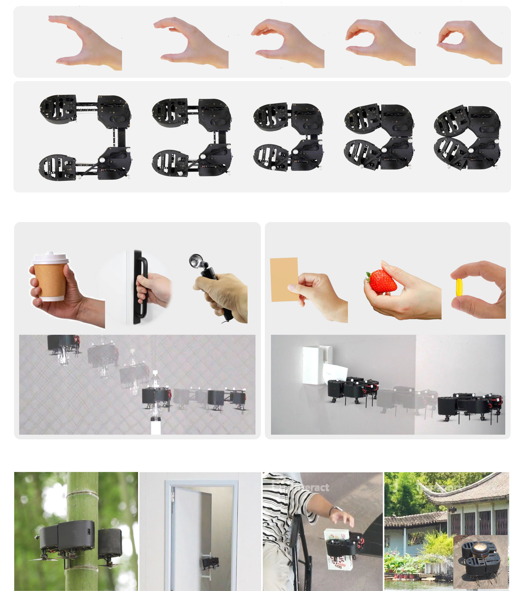
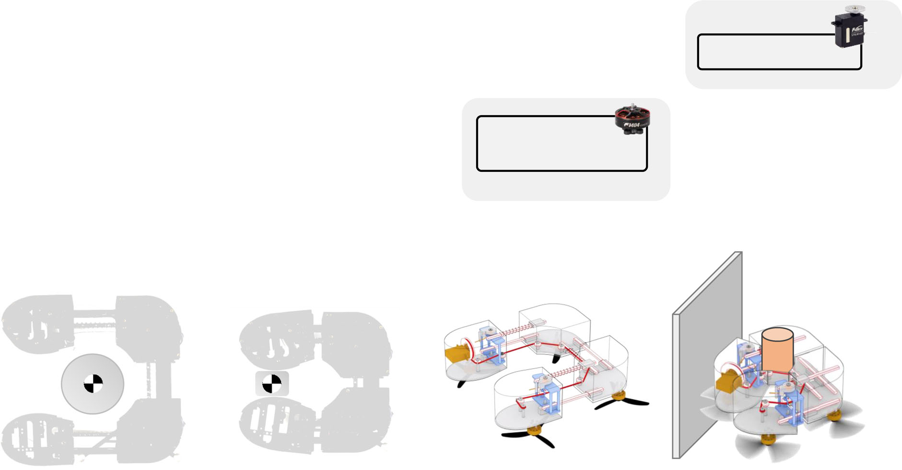
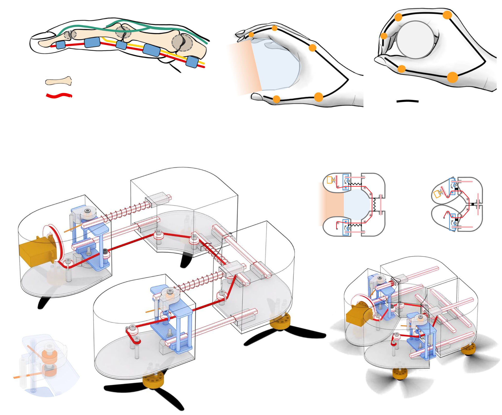
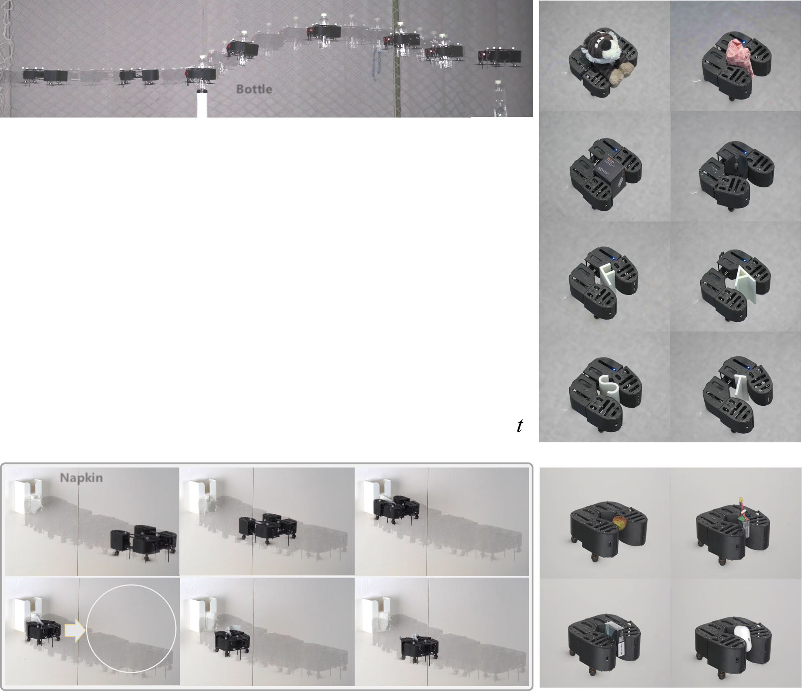
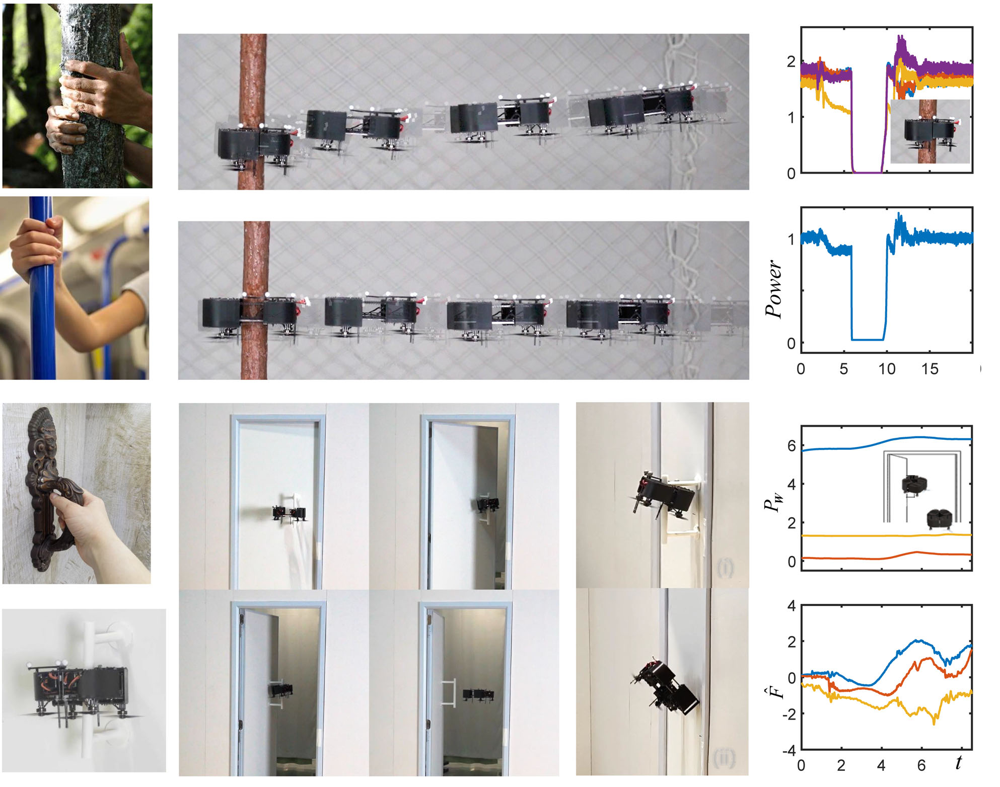
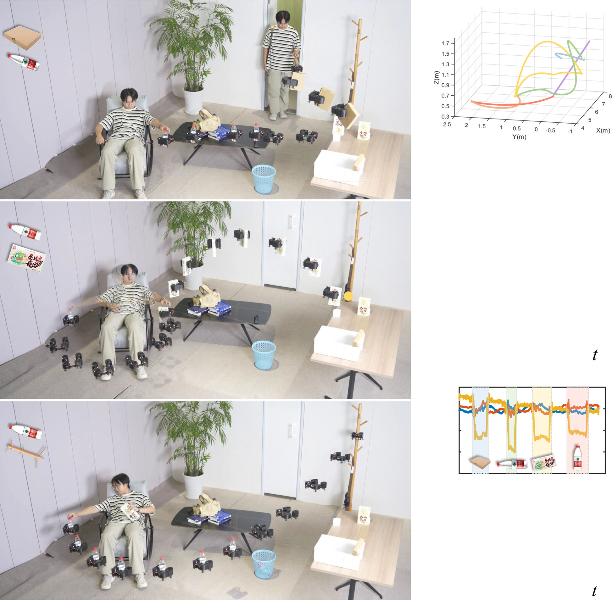
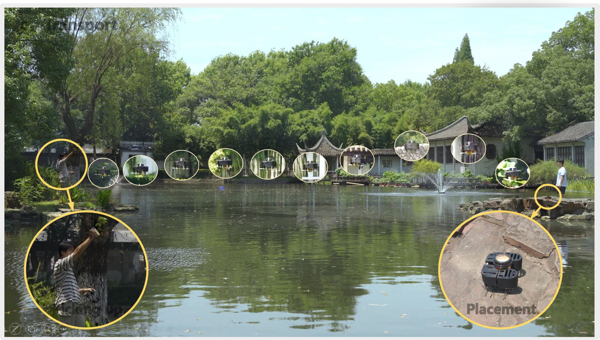
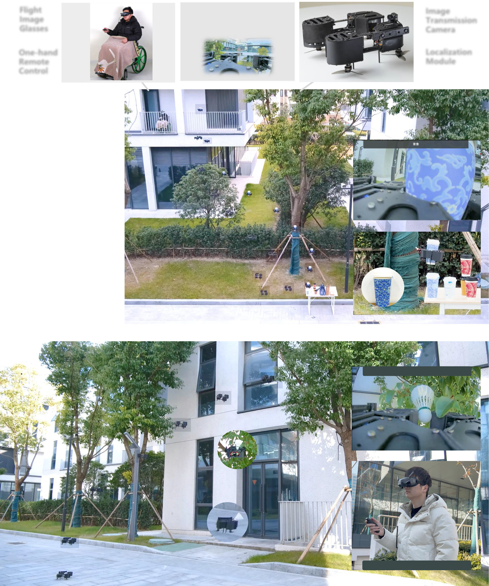

# HI-ARM仿人手自主飞行机器人（21_H以及-like_Autonomous_Flying_Robot）：完整忠实学术翻译

> **原文标题**：21_H以及-like_Autonomous_Flying_Robot  
> **作者**：Yuze Wu、Fan Yang、Rui Jin、Yuhang Zhong、Junjie Wang、Xuankang Wu、Fei Gao  
> **发表信息**：Nature Communications 17, 2200（2026），DOI 10.1038/s41467-026-68967-3  
> **原文 PDF**：[21_H以及-like_Autonomous_Flying_Robot.pdf](../21_H以及-like_Autonomous_Flying_Robot.pdf) ｜ **对应中文详解**：[21_HI-ARM仿人手自主飞行机器人.md](../中文详解/21_HI-ARM仿人手自主飞行机器人.md)  

---

## 原文第 1 页核心内容与翻译

论文
https://doi.org/10.1038/s41467-026-68967-3
用于空中抓取与交互的仿手形自主飞行机器人
Yuze Wu
1,2,3,4, Fan Yang2,4, Rui Jin1,2, Yuhang Zhong1,2, Junjie Wang1,2,
Xuankang Wu2 & Fei Gao
1,2,3
鸟类出色的空中机动能力和环境交互能力使其能够完成空中捕猎、停栖和筑巢等复杂任务，这启发了具有类似操作能力的先进空中机器人研究。
然而，现有平台通常尺寸较大、载荷较重，末端执行器产生的力矩会干扰飞行，功能也较为有限，严重限制了实际应用。受人手的生物结构、外形和驱动方式启发，我们提出一种融合飞行与抓取的仿手形机器人，兼具紧凑结构、灵活飞行和多用途操作能力。我们还提出一套自主运行框架，包括高效任务规划和多级自适应控制，使机器人能够准确、平稳地完成仿人抓取、开门、林间停靠、物体运输和人机交互任务。该框架还支持人机协作，使行动不便者能够进行远程运输和空中操作。包括多种场景停靠、狭窄空间通行和复杂地形载荷运输在内的室外试验，验证了该平台在空中配送与操作任务中的应用潜力。
然而，现有平台通常存在尺寸大、
载荷重、末端执行器力矩干扰和功能有限等问题，严重限制了实际应用。受人手的生物结构、
结构和驱动方式启发，我们提出一种融合飞行与抓取的仿手形机器人，兼具紧凑结构、灵活飞行和多用途操作能力。我们
propose an autonomous framework including efficient mission planning 以及
multi-level adaptive control, enabling the robot to precisely 以及 smoothly
perform human-like grasping, opening doors, forest perching, object trans-
port, 以及 interactive tasks. Additionally, the framework supports human-robot
collaboration, empowering individuals with mobility impairment to conduct
remote transportation 以及 airborne operations. Outdoor tests, which include
这些室外试验包括不同场景下的停靠、狭窄空间通行以及跨越复杂地形运输载荷，验证了该平台在空中配送和操作任务中的应用潜力。这些结果表明，融合飞行与操作能力的机器人可以用于空中作业、辅助和配送。
在长期进化过程中，鸟类形成了独特的能力：用前肢（翅膀）完成空中运动，用后肢（爪）与环境交互，从而完成空中捕猎、抓取、停靠和筑巢等复杂活动1,2。这种生物特征推动了大量关于空中操作机器人的研究3–15，使飞行器能够在空中与物体和人交互。
Flying robots, as the most maneuverable robots, are highly anticipated
to deeply participate in our social activities, especially safety-critical
scenarios like earthquake rescue 以及 high-risk inspections. In the past
decade, flying robots are widely used in applications related to infor-
mation acquisition, such as geographic surveying, aerial photography/
videography, inspection 以及 monitoring. For instance, in hazardous
environments such as nuclear power plants or chemical facilities,
close-range interactions including valve turning 以及 button pushing
are quite common. In search-以及-rescue missions, quick catch 以及
release are vital for supply delivery or collaborative transportation. In
daily life, item distribution across the air, goods retrieval from human-
unreachable areas, or even touch-range extending for the disabled,
often occur in our imagined future house or factory. These cross-
domain applications highlight the vast potential of aerial manipula-
tion, motivating aerial robots from flying eyes to flying h以及s.
Existing research on aerial manipulation has made significant
progress, while some fundamental limits restrict their further applic-
ability 以及 extensibility in real-world scenarios. Early research in this
area primarily focuses on directly mounting robotic arms to
Received: 21 March 2025
Accepted: 9 January 2026
Check for updates
1Institute of Cyber-Systems 以及 Control, College of Control Science 以及 Engineering, Zhejiang University, Hangzhou, China. 2Huzhou Institute, Zhejiang
University, Huzhou, China. 3Differential Robotics, Hangzhou, China. 4These authors contributed equally: Yuze Wu, Fan Yang.
e-mail: fgaoaa@zju.edu.cn
Nature Communications|  (2026) 17:2200 
1
1234567890():,;
1234567890():,;

---

## 原文第 2 页核心内容与翻译

无人机16–22虽然能够执行空中操作，但尺寸大、重量高、能耗大，严重影响机动性和续航能力，因此不适合精细或长时间操作，尤其不适合涉及人员的狭窄环境。后续研究通过优化末端执行器来缓解这些问题，包括简化驱动器23–36、开发新的驱动机构37–40以及引入柔性抓取部件41–43。
这些研究虽然在结构创新方面取得了成果，但也带来了不可避免的控制耦合，使机器人的机动性和稳定性需要折中。为此，研究者开始利用机器人自身结构进行空中操作，相关工作44–51试图通过减少外部附加机构来降低系统复杂度。然而，这些机器人要么因增加驱动器而精度不足，要么因可动结构而机械复杂，因而在工作范围、精度和速度方面受到限制。这些问题说明，有必要研制一种同时具备紧凑结构、机构简单、适应范围广、机动性和稳定性好、通过性强以及自主程度高的新型空中操作机器人。
为了实现这样的空中操作机器人，我们回到自然界寻找启发。人手能够完成灵巧的交互动作（图1a），可以适应复杂环境并执行各种任务。例如，人们用手掌抓取杯子或门把手等较大物体（图1c），用指尖轻巧地捏取纸张或药片等小物体（图1d）。研究52,53表明，手部的骨骼、关节、肌肉和肌腱构成了高效的生物结构，通过多自由度运动和肌腱驱动，能够准确适应物体的形状和尺寸。该结构启发我们将人手的灵巧抓取能力与飞行器的快速机动能力结合起来，形成仿手形紧凑型空中操作机器人，本文简称 HI-ARM（图1b）。该机器人尺寸仅相当于成人手掌，却能够完成精细、多功能、灵活且连续的空中操作（见补充视频1）。HI-ARM采用开放式C形抓取轮廓以扩大抓取范围，采用多自由度可变形关节以适应不同形状的物体，并采用简洁的肌腱驱动机构以减小整体尺寸和重量。C形轮廓形成类似人手的包络结构，可提高抓取稳定性和适应性。复合式五自由度手指结构由两个扭转自由度和三个伸展自由度组成（图2a），能够高效完成操作。HI-ARM还配备四个旋翼推进器（图2a），继承了传统四旋翼飞行器机动性好、控制简单的特点。得益于仿手形结构，HI-ARM既能完成手掌握持和指尖捏取（图1e、f），也能执行树木停靠、开门、物体运输和人机交互等更复杂的操作（图1g–j）。
为了准确、平稳地完成复杂任务，自主运行能力同样十分重要。为此，作者构建了由任务规划、轨迹生成、状态反馈、参数估计和自适应控制组成的框架（图2b）。HI-ARM支持两种工作模式：（1）自主运行，任务规划器根据输入的任务类型，从动作库中选择合适的操作顺序，机器人在感知、规划和控制闭环下执行抓取、停靠、开门和人机交互等任务；（2）人机协作，任务规划器根据人的意图生成参考轨迹和抓取指令，控制器随后跟踪这些指令，实现协同遥操作。

得益于一体化硬件结构，HI-ARM将任务规划自然分为飞行轨迹规划和末端执行器形变规划，前者为毫秒级，后者为微秒级。这样的解耦方式明显降低了规划复杂度，并可高频运行，以满足空中快速响应操作的实时要求。闭环自主运行需要状态反馈，HI-ARM使用六自由度状态估计器在线更新重心的姿态和位置，并使用电机观测器监测末端执行器的角度和位移。实际运行中，近距离操作、载荷变化和形变运动会导致参数变化和明显的外部扰动（图2c），从而造成模型失配，严重影响飞行和操作精度。为此，控制器加入轻量、高频的扰动估计器，并配合力矩和推力补偿器。完整算法结构见图2b。各部分结合后，HI-ARM能够实现自主规划、精确控制、任务解耦和人机交互，可用于图1g–j所示的多种任务。
本文的主要贡献有三点。第一，提出一种在紧凑平台上融合抓取与飞行的仿生设计，据作者所知，这是机器人领域较早的飞行机械手之一。第二，提出高效规划器，使飞行机械手能够准确自主操作；同时提出适应不同载荷和动态交互的自适应控制器，并通过状态反馈实现闭环自主运行。第三，展示HI-ARM在物体抓取、开门、杆上停靠、跨地形运输以及连续人机交互等任务中的应用潜力，推动空中机器人从被动观察走向主动操作。实验表明，HI-ARM能够快速、平稳地完成多项连续空中交互任务，也能够快速抓取物体并进行跨地形运输，为空中配送提供了新的实现方式。这些结果验证了其多任务能力，并为其用于无人自主作业、家庭机器人服务、野外救援和远程辅助等场景奠定了基础。
结果
H以及-like mechanism design
The design of HI-ARM draws inspiration from the grasping configura-
tion, biological structure, 以及 tendon drive mechanism of human
h以及s. The employed configuration adopts a h以及-like open grasping
contour, providing a relatively broad grabbing range. In order to
replicate dexterous grabbing capabilities while remaining mechani-
cally efficient, the robot incorporates finger 以及 palm modules as its
core operational units (Fig. 3b(i)). With this design, HI-ARM includes a
palm region for powerful gripping 以及 fingertip areas for precise
pinching (Fig. 3a(ii)). This configuration supports a wide grasping
range (0 ~ 10.0 cm), allowing HI-ARM to securely hold larger objects
(e.g., water bottles) with its palm while delicately picking up smaller
items (e.g., tissues) using its fingertips, showcasing multi-modal
grasping capabilities.
Human grasping relies on joint angle variations to achieve con-
traction (Fig. 3a(iii)). Following this functional principle, HI-ARM’s
finger modules incorporate a torsion structure comprising torsion
springs 以及 circular bearings (Fig. 3b(i)) to enable flexible finger
bending. Given their ability to displace significantly in a short time,
telescopic
structures
are
incorporated
into
the
deformable
Article
https://doi.org/10.1038/s41467-026-68967-3
Nature Communications|  (2026) 17:2200 
2

---

## 原文第 3 页核心内容与翻译

mechanism to increase the speed of grasping movements. To ensure
that the telescopic modules are activated first, their spring stiffness is
deliberately designed to be lower than that of the rotational modules,
thereby enabling rapid contraction 以及 closer contact with the target
object. As illustrated in Fig. 3e, the springs in the mechanism absorb
energy during compression 以及 torsion, 以及 then release their stored
energy to restore the shape of the robot, thereby reducing overall
energy consumption. The integration of telescopic 以及 torsional
mechanisms forms a hybrid 5-DoF structure, allowing a variety of
adaptive 以及 flexible grasping, as shown in Fig. 3f.
Building on the principles of the finger tendon sheath pulley
system53, HI-ARM employs a tendon drive mechanism for shape
.GTJOTYVOXKJYZX[IZ[XK
a
.GTJOTYVOXKJMXGYVOTM
d
,OTMKXZOVVOTIN
6GRSMXOV
c
P
:XGTYVUXZ
h
5VKTJUUX
O
/TZKXGIZ
g
6KXIN
.GTJOTYVOXKJGVVROIGZOUT
b
f
e

**图 1**：图 1｜HI-ARM 的总体结构。a 人手抓取动作；b HI-ARM形变和抓取过程；c 人手掌部握持；d 人手指尖捏取；e HI-ARM用掌部握持水瓶；f HI-ARM用指尖捏取薄纸巾；g HI-ARM停靠在竹竿上；h HI-ARM开门；i HI-ARM与人交互；j HI-ARM将物品运过河流。
Article
https://doi.org/10.1038/s41467-026-68967-3
Nature Communications|  (2026) 17:2200 
3

---

## 原文第 4 页核心内容与翻译

adaptation (Fig. 3e). Mimicking a finger’s flexor digitorum profundus
tendon (FDP tendon, shown in Fig. 3a(i)), a lightweight nylon rope is
employed to transmit driving forces. Several V-shaped pulleys are
integrated into the inner sides of finger 以及 palm modules to redirect
the force (Fig. 3b(i)). Unlike conventional morphing drones thatrely on
multiple actuators, this tendon-driven design utilizes a single actuator
to drive the 5-DoF composite structure, minimizing the robot’s size,
weight, 以及 energy consumption while simplifying its control com-
plexity. Without knowing an object’s shape, this underactuated
structure can conform to the object’s contour, 以及 passively 以及

**图 2**：图 2｜硬件与软件架构。a 硬件总览；b 软件架构，包括任务规划、运动规划、自适应控制、状态估计和执行；c 形变与飞行模型：（i）正常尺寸下的形变状态；（ii）抓取物体时的形变状态；（iii）坐标系表示；（iv）空中操作期间的外部干扰。
Article
https://doi.org/10.1038/s41467-026-68967-3
Nature Communications|  (2026) 17:2200 
4

---

## 原文第 5 页核心内容与翻译

collaboratively adjust the deformation of each torsion 以及 extension
component under single rope actuation to achieve stable grasping,
demonstrating its adaptive grasping ability for various objects, as
shown in Fig. 4c.
With the proposed integrated design, HI-ARM features a compact
size with a h以及-like profile, with a total weight of just 556g. This allows
it to possess more space for flight 以及 grasping operations in narrow
indoor environments, a task that can be challenging for larger aerial

**图 3**：图 3｜仿人手机械结构设计。a 人手的生物结构：（i）肌腱驱动机构；（ii）开放式抓取构型；（iii）多自由度关节结构。b HI-ARM的机械设计和部件细节：（i）正常尺寸状态；（ii）紧凑尺寸状态。c 正常尺寸下的结构图；d 紧凑尺寸下的结构图；e 可自恢复的肌腱驱动机构；f 针对不同物体的自适应形变。
Article
https://doi.org/10.1038/s41467-026-68967-3
Nature Communications|  (2026) 17:2200 
5

---

## 原文第 6 页核心内容与翻译

robots. Additionally, the robot can deform to reduce its dimensions
(Fig. 3b(ii)), improving passability in narrow spaces (as validated in
Section Applications in the wild). HI-ARM defaults to the open con-
figuration, enabling rapid execution of grasping tasks. By contrast, the
closed configuration imposes continuous torque dem以及s on the
servo motor 以及 partially obstructs propeller airflow, elevating power
consumption 以及 compromising flight endurance.
飞行设计与电子部件
本节介绍由四个旋翼推进器驱动的HI-ARM飞行系统。如图2a所示，机器人配备3.5英寸螺旋桨，每个螺旋桨由T-motor F1404 2900KV电机驱动，总推力最高可达1000 g。电机安装在手指模块和掌部模块下方，这种下置布局避免螺旋桨气流直接吹向手部，并通过减少手部接触提高人机交互安全性。螺旋桨在高度方向留出6 mm偏置，以避免模块形变和折叠时发生干涉。电池放电倍率为70C时，系统能够提供足够的瞬时功率，支持抓取超过450 g的载荷。飞行平台主体由2 mm厚碳纤维板组成，兼顾高强度和轻重量。飞行控制采用运行ArduPilot固件的Kakute H7 mini飞控板，实时采集电子调速器（ESC）的电机转速以及惯性测量单元（IMU）的姿态数据，频率超过300 Hz。高频反馈有助于快速估计运动状态，减少系统延迟并提高控制精度。机载Radxa ZERO计算机运行任务规划器和自适应控制器，用于自主空中操作。控制器处理IMU、舵机和定位模块的状态数据，再向无刷电机和舵机发送控制输入，以精确调节飞行。更多部件信息见补充材料。
定位和估计需要在精度、重量和机载计算量之间取得平衡。室内试验使用外部光学动作捕捉系统，为飞行机器人和被操作物体提供亚毫米级状态估计，

**图 4**：图 4｜仿人手抓取。a HI-ARM用掌部抓取、运输并释放水瓶（为便于阅读，图像左右翻转）；b HI-ARM抓取水瓶过程中的状态曲线，包括位置跟踪、速度跟踪、估计外力、估计外力矩、电机转速和实际总推力；c HI-ARM对不同形状物体的自适应抓取；d HI-ARM用指尖抓取纸巾的过程；e 对不同形状物品的指尖抓取。
Article
https://doi.org/10.1038/s41467-026-68967-3
Nature Communications|  (2026) 17:2200 
6

---

## 原文第 7 页核心内容与翻译

从而实现任务规划与自适应控制的闭环结合。在室外试验中，作者采用重26 g的Intel RealSense T261跟踪模块。该模块是基于LiDAR定位系统的轻量替代方案，能够保持稳定的短距离状态估计，例如在20 m范围内，足以满足试验验证要求。
任务规划
为完成多种空中任务，HI-ARM构建了同时支持自主运行和人机协作的高效自主框架。如图2b所示，作者为抓取、停靠、开门和人机交互等常见任务建立动作库。在自主运行模式下，HI-ARM根据任务类型从动作库中动态组合基本动作，生成所需的操作顺序（“与人的交互”一节对此进行了验证）。在人机协作模式下，HI-ARM根据操作者的意图生成合适的飞行和抓取指令，再将这些指令发送给任务规划器。
与传统的多自由度机械臂空中操作机器人不同，HI-ARM采用一体化结构，减少了执行器数量，也显著减少了规划变量。基于这一结构，作者将任务规划器分为两个相互独立的模块：飞行轨迹规划和末端执行器形变规划。在轨迹规划方面，HI-ARM采用的四旋翼构型具有微分平坦性54，可以简化约束并提高求解速度55。为获得高效且可跟踪的机器人轨迹，优化问题同时考虑轨迹平滑性、总用时和动力学可行性约束。该过程可以在机载计算设备上以毫秒级完成，满足空中操作对快速实时求解的要求。轨迹规划器最终输出随时间变化的期望状态序列，具体方法见“方法”部分。
在末端执行器形变规划方面，HI-ARM采用单电机驱动和肌腱驱动机构实现结构形变。作者建立了电机角度与形变状态之间的一元二次映射模型，具体内容见“方法”部分。给定期望形变状态后，机器人根据该映射模型在微秒级快速生成随时间变化的形变序列，再将该序列与飞行轨迹的时间序列同步，并发送给自适应控制器，如图2b所示。
多级自适应控制
平稳完成空中操作，需要控制器同时具备准确性、自适应性和高效率。与传统四旋翼已经较为成熟的控制器相比，HI-ARM的飞行控制面临更大挑战。这些挑战主要来自两个方面（图2c(iv)）：第一，机体形变会使尺寸、形状、重心和转动惯量等模型参数不断变化，明显干扰飞行控制；第二，空中操作期间的载荷变化、近距离接触力和气流扰动等外部因素，会严重影响机器人的控制稳定性和精度。特别是为了提高空中操作速度，HI-ARM需要在飞行过程中完成形变，这对飞行控制和形变控制都提出了更高要求。
针对这些问题，作者提出了多级自适应控制器（图2b），使HI-ARM具备精确的空中操作能力。为减小模型变化带来的影响，机器人采用在线模型参数辨识方法，估计重心和转动惯量等关键物理参数，如图2b所示，具体内容见补充信息。针对外部扰动，系统增加外力和外力矩的估计与补偿，以降低其对控制的影响。具体而言，位置环采用L1自适应控制算法56抑制外力，姿态环采用增量非线性动态逆（INDI）控制算法57处理外力矩。这些自适应算法还可以减小螺旋桨气流干扰和模型失配等因素对轨迹跟踪性能的不利影响58。
在形变控制方面，作者采用基于角度误差的反馈控制方法调节舵机运动。舵机提供力矩状态反馈，用于判断抓取动作是否成功。将上述抓取控制与飞行控制结合后，HI-ARM能够快速、高效地完成抓取、停靠和交互等操作，后续试验对这些能力进行了验证。控制与建模的详细内容见“方法”部分。
仿人手抓取性能
所提出的仿生设计使HI-ARM具备多种抓取方式，包括掌部抓取、指尖抓取和自适应抓取（见补充视频2）。下面的试验对这些能力进行了展示。
掌部抓取。人们通常用掌部抓取水瓶、橙子等较大物体，HI-ARM也具备类似能力。作者开展了自主抓取试验，要求HI-ARM抓住一个水瓶（直径62 mm，质量153 g），再将其运送到指定位置（图4a）。图4b中的位置跟踪曲线表明，在最大速度1.1 m s−1下，HI-ARM能够较准确地跟踪参考轨迹。所提出的控制器能够实时准确估计外力和外力矩扰动（图4b），并进行有效补偿。如图4b所示，补偿推力损失后，机器人抓取物体时的实际总推力增加约1.5 N，与物体重力基本一致。抓取过程中，达到设定力矩后，系统认为抓取动作完成，舵机停止转动。
指尖抓取。除掌部抓取外，指尖抓取也是人手的常用动作，尤其适用于取拿小物体。在该试验中，作者要求HI-ARM抓取纸巾。如图4d所示，纸巾厚度很小（小于1 mm），柔软且质量很轻（小于1 g），给自动化精确抓取带来了特殊困难。图4d表明，HI-ARM能够用指尖精确抓住单张纸巾。抽取纸巾时，机器人受到摩擦引起的扰动，控制器能够有效补偿，最终控制误差小于3 cm。
自适应抓取。HI-ARM的五自由度抓取结构可以灵活形变，其欠驱动设计使结构在接触物体时能够贴合物体形状。因此，即使事先不知道物体的准确轮廓和形状，系统也能完成自适应抓取。作者选取多种形状和尺寸的常见物体进行试验，结果表明，HI-ARM能够贴合从小到大不同物体的表面，并有效抓取和搬运这些物体（图4c、e）。为增加抓取难度，试验还加入了不规则的字母形积木。如图4c所示，HI-ARM能够进行非对称形变以适应物体形状，准确、稳定地将其抓住。
仿人手应用
凭借上述仿生特征，HI-ARM能够执行更多类似人手的应用（见补充视频3）。
Article
https://doi.org/10.1038/s41467-026-68967-3
Nature Communications|  (2026) 17:2200 
7

---

## 原文第 8 页核心内容与翻译

Perching. Similar to the way humans use h以及rails on trains or grasp
tree trunks (Fig. 5a), HI-ARM can utilize its specialized structure to
停靠在固定物体上。为评估停靠能力，作者设置树干作为试验对象。飞行机器人自主飞向树干，准确抓取并停靠在树干上（图5b）。如图5c所示，所有电机停止转动，系统重力由HI-ARM抓住树干产生的摩擦力抵消，系统能耗明显下降；如图5e所示，舵机功耗比旋翼推进器低两个数量级。相比之下，普通悬停功耗超过160 W。经过一段时间后，机器人接收到释放命令，旋翼重新开始转动。舵机驱动机体展开，逐步脱离树干，HI-ARM重新进入飞行状态（图5d）。这种停靠—重新起飞机构可在连续任务之间提供停歇，并支持低能耗长时间停留任务。

开门。凭借较强的操作能力，HI-ARM还可以开门。推门时，门会对机器人的控制产生明显干扰。为保证开门平稳（图5h），任务规划器生成考虑动力学约束的参考轨迹（详见“方法”），使机器人能够准确抓住门把手并推开房门，如图5g所示。外力估计表明，房门主要沿X轴和Y轴对机器人施加干扰力（图5j），这些力由所提出的控制器进行补偿。如图5h所示，机器人抓住把手推门时，开门角度θdoor约为30°，最大推力约为Tmax sin 30°≈5 N；不受门把手约束时，最大开门角度θmax可增至55°，相应最大推力为8.2 N。

与人的交互。HI-ARM尺寸紧凑，能够适应普通家庭中的狭窄空间，有望作为智能家庭助手提供自主机器人服务。作者设计了一组模拟日常生活的试验，以评估HI-ARM在家庭环境中的应用可能性（图6a）。试验中，物体的位置和姿态由动作捕捉系统获取，飞行机器人需要依次完成多项人机交互任务。图6b给出了由任务规划器生成的连续、平滑的多任务飞行参考轨迹。人到达后，
Ş
d
i
b
c
e
Vmotor
x
y
z
M1
M2
M4
M3
g
a
f
j
h
Ş
Vmotor
M1
M2
M4
M3

**图 5**：图 5｜停靠和开门性能。a 人手抓住列车扶手和树干；b HI-ARM停靠在树干上；c 停靠过程中的电机转速曲线；d HI-ARM从树干上释放并飞离；e 归一化功率曲线；f 人抓住门把手开门；g HI-ARM开门过程；h 有门把手和无门把手时的最大开门力测试；i 开门过程中的位置曲线；j 开门操作期间估计的外力。
Article
https://doi.org/10.1038/s41467-026-68967-3
Nature Communications|  (2026) 17:2200 
8

---

## 原文第 9 页核心内容与翻译

人到达后，HI-ARM飞到门边，用指尖抓取他手中的快递盒并送到储物箱（图6a ⓪①）。随后机器人飞到桌边，用掌部抓取水瓶并递给人（图6a ②③）。人在喝水时，机器人从桌上取走盒装零食（图6a ④⑤）。人喝完水后将空瓶交给HI-ARM，机器人把空瓶放入垃圾桶（图6a ⑥⑦）。完成服务后，HI-ARM飞到衣帽架并停靠在上面，进入待机状态（图6a ⑧）。如图6d所示，HI-ARM通过调整执行器角度，能够自适应地抓取不同物体。试验中，每个操作点都会出现扰动误差（图6c），主要由物体带来的载荷变化引起。借助多级自适应控制器，HI-ARM能够准确估计外力干扰（图6d）并进行补偿，使误差逐步减小。如图6c所示，试验中单轴轨迹的平均绝对跟踪误差（ATE）小于2 cm。整个过程表明，HI-ARM能够在家庭环境中自适应地抓取不同物体并灵活移动。
野外应用
作者还开展了多项室外试验，以验证HI-ARM在自然环境中的适用性。首先，在竹子、不同树木和电线杆等多种室外物体上测试停靠能力。如图7a所示，HI-ARM无需外部辅助结构，就能在多种场景中完成抓取和停留，显示出其用于需要长时间停留的野外任务的潜力。

**图 6**：图 6｜与人连续执行多项任务。a HI-ARM连续执行多项空中交互任务：（i）抓取并运输快递盒（75 g）和水瓶（134 g）；（ii）递送零食（60 g）并抓取空瓶（23 g）；（iii）将空瓶运到垃圾桶并停靠在衣帽架上；b 连续任务的参考轨迹；c 连续任务中各轴的绝对跟踪误差；d 针对不同物体的外力估计和舵机角度。
Article
https://doi.org/10.1038/s41467-026-68967-3
Nature Communications|  (2026) 17:2200 
9

---

## 原文第 10 页核心内容与翻译

这些试验说明HI-ARM适合需要长时间停留的野外任务。第二项试验利用HI-ARM的收缩能力测试其在狭窄洞穴中的通过性。如图7b所示，HI-ARM通过形变减小宽度，成功穿过狭窄空间。作者还展示了这种飞行机器人用于空中配送的可能性，以满足灵活、快速日常物流不断增长的需求。由于结构紧凑、简单且机动性高，HI-ARM能够抓取不同物体并快速运输。本试验中，机器人抓取一个水瓶，将其运送到河流另一侧。
Z#Y
Z#Y
Z#Y
Z#Y
6KXIN
G
(GIQ\OK]
)XUYY]OZNSUXVNOTM
H
I
:XGTYVUXZ
6RGIKSKTZ
6OIQOTM[V

**图 7**：图 7｜复杂环境中的应用。a 在不同环境中停靠；b 通过形变穿越狭窄空间；c 携带物品跨越河流（白框中的 HI-ARM 是以原位置为中心放大的局部图，以便清晰显示）。

Article
https://doi.org/10.1038/s41467-026-68967-3
Nature Communications|  (2026) 17:2200 
10

---

## 原文第 11 页核心内容与翻译

如图7c所示，HI-ARM利用可变形机构成功抓住饮料杯，并将其运送到河流另一侧。
人机协作遥操作
作为一种仿生空中交互装置，HI-ARM可以充当人的“第三只空中手”，根据人的意图执行动作。如图8a所示，HI-ARM配备远程视频传输系统，为操作者提供第一视角（FPV）视觉反馈。类似于DJI Avatar FPV无人机，HI-ARM可由简化的单手动作式三维控制器操作，该控制器将手部运动映射为不同方向的速度指令。控制器还集成抓取按钮，使操作者能够用一只手同时完成飞行和抓取。控制器与机器人之间通过ROS框架通信。按照“任务规划”一节的描述，这些指令由任务规划器处理，生成发送给控制器的飞行和形变输入，使机器人执行空中任务。下面两项试验展示了HI-ARM辅助人完成远程操作的可能性（见补充视频4）。
对于行动不便者，从不同地点取回物品可能很困难，尤其是在崎岖地形、楼梯区域或高度差较大的地方。试验邀请一名行动不便者操作HI-ARM，并佩戴视频眼镜接收机载视角。经过简短培训，操作者能够按照自己的意图远程控制HI-ARM完成取物任务。如图8b所示，HI-ARM从二楼起飞，穿过树木和灌木，抵达接近地面的目标位置，准确抓取咖啡杯后返回操作者一侧，体现了其辅助残障人士的潜力。在该任务中，总长46.2 m的取物轨迹以0.33 m/s的平均速度完成，末端执行器ATE为0.08 m，控制延迟为256 ms，说明HI-ARM在超过40 m距离上的遥操作具有稳定性和有效性。
即使行动正常的人，在某些情况下也很难拿到高处的物品。另一项试验模拟羽毛球卡在树上的情形，操作者通过机载图像远程判断其位置，随后操纵HI-ARM飞向树木，用指尖抓住羽毛球并平稳返回地面（图8c），展示了其远程空中操作潜力。在该场景中，轨迹长度为15.4 m，平均速度为0.10 m/s，末端执行器ATE为0.04 m。与取咖啡杯任务相比，较低的速度反映出抓取轻小物体需要更高的精度。
讨论
本文研制了一种用于操作的仿手形紧凑型飞行机器人，将仿生抓取能力与空中飞行能力结合起来。作者提出高效的自主运行框架，使机器人能够在真实环境中准确、平稳地完成空中操作。该机器人在室内和室外任务中均表现出良好性能，显示出其作为未来智能家居助手、移动飞行摄像机、空中遥操作工具和飞行配送机器人的潜力。不过，当前状态估计依赖外部定位，机载视觉定位模块在长距离室外任务中会产生累积漂移。要实现完全自主运行，不仅需要准确定位，还需要根据视觉输入理解环境。端到端视觉强化学习方法59,60可以直接将感知映射为控制，并自适应地修正状态估计误差，是未来提高系统自主能力的一条有前景的路线。
作者还对系统控制稳定性进行了理论分析，详细内容见补充信息。实验结果与该分析一致，并对其进行了验证。此外，作者开展了控制器鲁棒性分析，并在不同场景下试验其抵抗外部干扰的能力。结果表明，HI-ARM能够有效估计外部干扰，自适应控制器的误差逐步收敛，最终使系统恢复到稳定悬停状态。
后续研究计划为HI-ARM加入力反馈，提高其抓取鸡蛋等易损物体的能力；开发新型内侧抓取表面，增加对光滑物体的摩擦力；引入多模态基础模型，提高HI-ARM的认知能力，使其能够完成工业场景中的自主阀门操作等更复杂任务。人机协作试验表明，HI-ARM具备遥操作能力，可以获取高质量真实环境数据，从而减少模型从仿真到现实的差异。此外，基于此前关于空中集群的研究61，作者计划研制HI-ARM机器人队伍，使其能够执行协同运输等更复杂任务。作者还将继续研究有限机载资源条件下该飞行机器人的小型化和自主化，并推动其产业化。
方法
动力学
本文用黑体小写字母表示向量（如 v），用黑体大写字母表示矩阵（如 J），标量采用普通字母表示。如图2c(iii)所示，建立世界坐标系W，其正交归一基为{xW, yW, zW}，其中zW竖直向上，与重力方向相反。建立位于机器人几何中心的机体坐标系B，其正交归一基为{xB, yB, zB}。机器人在世界坐标系中的位置记为 pW = (px, py, pz)^T，姿态用四元数 qW = (qx, qw, qy, qz)^T表示，线速度为 vW = (vx, vy, vz)^T。机器人在机体坐标系中的角速度记为 ωB = (ωx, ωy, ωz)^T。

HI-ARM飞行系统由四个平行旋翼推进器组成，位置分布近似传统四旋翼的“X”形构型。因此，其飞行动力学模型与传统四旋翼相似，也具有与普通四旋翼相同的微分平坦性特征54。作者用六个自由度描述机器人的理想刚体运动学和动力学模型，平移动力学采用如下方程：
p
W = vW ,
v
W = TzB=m + g,
ð1Þ
其中，T和m分别为总推力和总质量；zB为用世界坐标系表示的机体Z轴；g =
[0, 0, −g]⊤为重力向量。
转动运动学和动力学方程表示为
q
W = 1
2 ð
0
ωB


×
Þ  qW ,
ω
B = J1ðτ  ωB × JωBÞ,
ð2Þ
Article
https://doi.org/10.1038/s41467-026-68967-3
Nature Communications|  (2026) 17:2200 
11

---

## 原文第 12 页核心内容与翻译

图2c所示坐标系下，平移运动由式（1）描述，转动运动由式（2）描述。式（2）中的[·]×为反对称矩阵，τ和J分别为总力矩与转动惯量矩阵；在机器人形变和抓取过程中，二者均需随当前结构状态动态更新。

其中， [⋅]× is the skew-symmetric matrix; τ 以及 J are the total torque
INDI力矩反馈利用电机转速和IMU测量值直接反映当前转动状态，能够快速处理未建模力矩和外部扰动。下面的方程重新引入力矩扰动τext，并由角速度、角加速度和控制力矩估计该扰动，再得到增量形式的期望控制力矩。
-6
4
14
-5
-2
1
0
50
100
5.5
7.5
9.5

[
:
,
4

**图 8**：图 8｜人机协同远程空中操作。a 人机协同操作的设备和原理示意；

e 行动正常的人通过HI-ARM从高处树木上取回羽毛球。
Article
https://doi.org/10.1038/s41467-026-68967-3
Nature Communications|  (2026) 17:2200 
12

---

## 原文第 13 页核心内容与翻译

执行器产生的总推力和总力矩由式（3）给出。式中t为四个旋翼推力组成的向量，Hk为随机体形变变化的混合控制矩阵，矩阵中的重心位置和旋翼坐标均由当前结构状态确定。



= Hkt,
ð3Þ
其中，t = ½ktΩ2
4
1
1
1
1
2
6664
3
7775:
ð4Þ
模块位置rmodi以及旋翼坐标ðlxi, lyiÞ并不是固定的，而是在形变和飞行过程中动态更新。具体而言，这些参数由肌腱驱动形变运动学确定：舵机角度θa和绳索位移Lt决定伸缩机构和扭转机构的形变，进而确定旋翼的瞬时位置。 如图2c所示，L0i和Li分别表示运动过程中和正常状态下伸缩机构的长度，L0i  Li表示压缩位移，反映相邻模块间距的变化。如图2c(ii)所示，θj表示第j个扭转机构（由扭簧和环形轴承组成）的转角。因此，旋翼坐标（lxi，lyi）更新为（l0xi，l0yi），具体如下：
3
i = 1
ðL0
i  LiÞ +
2
j = 1
γðθjÞ,
ð7Þ
3
i = 1
2
j = 1
:
ð9Þ
:
ð10Þ
8
>
<
>
:
ð11Þ
这里说明L1自适应控制的动力学状态、匹配扰动与不匹配扰动的划分；平移运动的扰动记为σ 2 R3。由于旋翼推力只能沿机体Z轴产生加速度，扰动被分为可由推力直接作用的匹配部分σm，以及沿机体X、Y方向的不匹配部分σum。
Article
https://doi.org/10.1038/s41467-026-68967-3
Nature Communications|  (2026) 17:2200 
13

---

## 原文第 14 页核心内容与翻译

几何跟踪控制器以预先给定的三维轨迹和偏航角为目标，在规定时间内计算期望推力和力矩。KR、Kω为正定增益矩阵，Rd、ωB,d和ω̇B,d分别为期望姿态、期望角速度和期望角加速度，eR和eω分别表示姿态误差与角速度误差。

L1自适应位置控制用于处理形变、载荷变化、外力和螺旋桨气动效应造成的不确定性。系统将平移扰动分为匹配部分和不匹配部分：匹配部分可以通过推力通道直接补偿，不匹配部分则由基线控制间接抑制。控制器由状态预测器、自适应律和低通滤波器组成，采用分段常值自适应律以提高数值稳定性。

几何跟踪控制基线。几何跟踪控制器的作用是在规定时间区间[0, tf]内，使飞行器跟踪预定轨迹pdðtÞ 2 R3和偏航角ψ(t)。忽略电机动力学和螺旋桨气动效应等扰动，平移运动和转动运动由期望推力和力矩控制，表达式如下：
T = k Kpep  Kvev  mg + m€pW k ,
τ =  KReR  Kωeω + ωB × JωB  JðbωBR>RdωB, d  R>Rdω

这里说明L1自适应控制的动力学状态、匹配扰动与不匹配扰动的划分；平移运动的扰动记为σ 2 R3。由于旋翼推力只能沿机体Z轴产生加速度，扰动被分为可由推力直接作用的匹配部分σm，以及沿机体X、Y方向的不匹配部分σum。
:
这里说明L1自适应控制的动力学状态、匹配扰动与不匹配扰动的划分；平移运动的扰动记为σ 2 R3。由于旋翼推力只能沿机体Z轴产生加速度，扰动被分为可由推力直接作用的匹配部分σm，以及沿机体X、Y方向的不匹配部分σum。
0
"
#
= 
11 × 1
01 × 2
02 × 1
12 × 2


GðiTsÞ1Φ1μðiTsÞ,
ð16Þ
这里说明L1自适应控制的动力学状态、匹配扰动与不匹配扰动的划分；平移运动的扰动记为σ 2 R3。由于旋翼推力只能沿机体Z轴产生加速度，扰动被分为可由推力直接作用的匹配部分σm，以及沿机体X、Y方向的不匹配部分σum。

B = J1ðτ + τext  ωB × JωBÞ
= J1ðτ + ðJω

B, f  τf + ωB, f × JωB, f Þ  ωB × JωBÞ
= ω

B, f + J1ðτ  τf Þ:
ð20Þ
INDI力矩反馈利用电机转速和IMU测量值直接反映当前转动状态，能够快速处理未建模力矩和外部扰动。下面的方程重新引入力矩扰动τext，并由角速度、角加速度和控制力矩估计该扰动，再得到增量形式的期望控制力矩。
Article
https://doi.org/10.1038/s41467-026-68967-3
Nature Communications|  (2026) 17:2200 
14

---

## 原文第 15 页核心内容与翻译

INDI力矩反馈控制利用电机转速和IMU测量值直接反映当前转动状态。作者在转动动力学中加入外部力矩扰动τext，并由测得的角速度、角加速度和控制力矩估计该扰动，再计算期望控制力矩的增量。由于陀螺力矩项变化相对缓慢，可将其与滤波结果之间的差异视为足够小。

多级自适应飞行控制把L1位置控制和INDI力矩反馈得到的估计结果，通过反馈补偿加入几何跟踪基线，形成最终的控制指令。舵机控制采用基于角度误差的比例控制，并结合力矩反馈和过载保护判断抓取是否完成。

这里说明L1自适应控制的动力学状态、匹配扰动与不匹配扰动的划分；平移运动的扰动记为σ 2 R3。由于旋翼推力只能沿机体Z轴产生加速度，扰动被分为可由推力直接作用的匹配部分σm，以及沿机体X、Y方向的不匹配部分σum。

B, dÞ  τINDI:
ð22Þ
轨迹规划。四旋翼具有微分平坦性，系统状态和输入可以用[x, y, z, ψ]⊤等输出表示，这为HI-ARM快速、高效地规划轨迹提供了基础。作者采用基于微分平坦性的MINCO方法，在空间和时间两个方面规划飞行轨迹，并分别调节路径形状和各段持续时间。
(25),
轨迹规划。四旋翼具有微分平坦性，系统状态和输入可以用[x, y, z, ψ]⊤等输出表示，这为HI-ARM快速、高效地规划轨迹提供了基础。作者采用基于微分平坦性的MINCO方法，在空间和时间两个方面规划飞行轨迹，并分别调节路径形状和各段持续时间。
3,
ð31aÞ
Jd, a =
3,
ð31bÞ
Jd, j =
3,
ð31cÞ
Jd = Jd, v + Jd, a + Jd, j,
ð31dÞ
Article
https://doi.org/10.1038/s41467-026-68967-3
Nature Communications|  (2026) 17:2200 
15

---

## 原文第 16 页核心内容与翻译

轨迹规划利用四旋翼的微分平坦性，将状态和输入表示为[x, y, z, ψ]⊤等输出。作者采用MINCO分段轨迹方法，分别优化路径点和各段持续时间，在保证轨迹平滑、总用时较短和动力学可行的同时生成可跟踪轨迹。

MINCO轨迹在三阶积分链模型下为多项式样条，通过最小化加加速度平方积分提高平滑性。用户给定的路径点和时间参数可在线性复杂度下转换为多项式系数；带状矩阵求解、轨迹恢复和梯度传播同样保持线性复杂度。优化问题以平滑性、总时间和动力学可行性为主要代价项，对速度、加速度和加加速度超过上限的部分施加惩罚，最后采用开源L-BFGS求解器迭代生成满足任务要求的局部轨迹。

1.
2.
3.
4.
5.
6.
7.
8.
9.
10.
2100150 (2023).
11.
12.
13.
956–962 (2023).
14.
2109–2132 (2024).
15.
626–645 (2022).
16.
17.
18.
19.
21.
2577–2594 (2024).
27.
31.
709–722 (2020).
1907–1918 (2018).
Article
https://doi.org/10.1038/s41467-026-68967-3
Nature Communications|  (2026) 17:2200 
16

---

## 原文第 17 页核心内容与翻译

34. Tsukagoshi, H., Watanabe, M., Hamada, T., Ashlih, D. & Iizuka, R.
Aerial manipulator with perching 以及 door-opening capability. In
2015 IEEE international conference on robotics 以及 automation
(ICRA), 4663–4668 (IEEE, 2015).
35. Darivianakis, G., Alexis, K., Burri, M. & Siegwart, R. Hybrid predictive
control for aerial robotic physical interaction towards inspection
operations. In 2014 IEEE international conference on robotics 以及
automation (ICRA), 53–58 (IEEE, 2014).
36. Bodie, K. et al. An omnidirectional aerial manipulation platform for
contact-based inspection. arXiv preprint arXiv:1905.03502
(2019).
37. Peng, R., Wang, Z. & Lu, P. Aecom: An aerial continuum manipulator
with imu-based kinematic modeling 以及 tendon-slacking preven-
tion. IEEE Transactions on Systems, Man, 以及 Cybernetics: Sys-
tems (2023).
38. Jiang, P. et al. A novel scaffold-reinforced actuator with tunable
attitude ability for grasping. IEEE Trans. Robot. 39, 1164–1177
(2022).
39. Hingston, L., Mace, J., Buzzatto, J. & Liarokapis, M. Reconfigurable,
adaptive, lightweight grasping mechanisms for aerial robotic plat-
forms. In 2020 IEEE International Symposium on Safety, Security,
以及 Rescue Robotics (SSRR), 169–175 (IEEE, 2020).
40. Xu, M., Huang, S., He, R., Yu, D. & Wang, H. Aerial shooting
manipulator for distant grasping. IEEE Robot. Autom. Lett. 8,
1991–1998 (2023).
41.
Peng, R., Wang, Y., Lu, M. & Lu, P. A dexterous 以及 compliant aerial
continuum manipulator for cluttered 以及 constrained environ-
ments. Nat. Commun. 16, 889 (2025).
42. Bauer, E. et al. An open-source soft robotic platform for autono-
mous aerial manipulation in the wild. In Conference on Robot
Learning (2024).
43. Nguyen, P. H., Patnaik, K., Mishra, S., Polygerinos, P. & Zhang, W. A
soft-bodied aerial robot for collision resilience 以及 contact-reactive
perching. Soft Robot. 10, 838–851 (2023).
44. Zhao, M. et al. Design, modeling, 以及 control of an aerial robot
dragon: A dual-rotor-embedded multilink robot with the ability of
multi-degree-of-freedom aerial transformation. IEEE Robot. Autom.
Lett. 3, 1176–1183 (2018).
45. Shi, F., Zhao, M., Murooka, M., Okada, K. & Inaba, M. Aerial
regrasping: Pivoting with transformable multilink aerial robot. In
2020 IEEE International Conference on Robotics 以及 Automation
(ICRA), 200–207 (IEEE, 2020).
46. Zhao, M. et al. Versatile multilinked aerial robot with tilted pro-
pellers: Design, modeling, control, 以及 state estimation for auton-
omous flight 以及 manipulation. J. Field Robot. 38, 933–966 (2021).
47. Bucki, N., Tang, J. & Mueller, M. W. Design 以及 control of a midair-
reconfigurable quadcopter using unactuated hinges. IEEE Trans.
Robot. 39, 539–557 (2022).
48. Zhao, N., Luo, Y., Deng, H., Shen, Y. & Xu, H. The deformable quad-
rotor enabled 以及 wasp-pedal-carrying inspired aerial gripper. In
2018 IEEE/RSJ International Conference on Intelligent Robots 以及
Systems (IROS), 1–9 (IEEE, 2018).
49. Falanga, D., Kleber, K., Mintchev, S., Floreano, D. & Scaramuzza, D.
The foldable drone: a morphing quadrotor that can squeeze 以及 fly.
IEEE Robot. Autom. Lett. 4, 209–216 (2018).
50. Wu, Y. et al. Ring-rotor: A novel retractable ring-shaped quadrotor
with aerial grasping 以及 transportation capability. IEEE Robot.
Autom. Lett. 8, 2126–2133 (2023).
51.
Xu, M. et al. Biomimetic morphing quadrotor inspired by eagle claw
for dynamic grasping. IEEE Transactions on Robotics 40,
2513–2528 (2024).
52. Susan, S. et al. Gray’s anatomy e-book. In The anatomical basis of
clinical practice. 5, 18–56 (2015).
53. Doyle, J. R. Anatomy of the finger flexor tendon sheath 以及 pulley
system. J. H以及 Surg. 13, 473–484 (1988).
54. Mellinger, D. & Kumar, V. Minimum snap trajectory generation 以及
control for quadrotors. In 2011 IEEE international conference on
robotics 以及 automation, 2520–2525 (IEEE, 2011).
55. Wang, Z., Zhou, X., Xu, C. & Gao, F. Geometrically constrained
trajectory optimization for multicopters. IEEE Trans. Robot. 38,
3259–3278 (2022).
56. Wu, Z. et al. L1 adaptive augmentation for geometric tracking con-
trol of quadrotors. In 2022 International Conference on Robotics 以及
Automation (ICRA), 1329–1336 (IEEE, 2022).
57. Tal, E. & Karaman, S. Accurate tracking of aggressive quadrotor
trajectories using incremental nonlinear dynamic inversion 以及
differential flatness. IEEE Trans. Control Syst. Technol. 29,
1203–1218 (2020).
58. Wang, X. & Hovakimyan, N. L1 adaptive controller for nonlinear
time-varying reference systems. Syst. Control Lett. 61,
455–463 (2012).
59. Liu, M. et al. Visual whole-body control for legged loco-
manipulation (2024). arXiv: 2403.16967
60. Wu, T., Chen, Y., Chen, T., Zhao, G. & Gao, F. Whole-body control
through narrow gaps from pixels to action. In 2025 IEEE Interna-
tional Conference on Robotics 以及 Automation (ICRA),
11317–11324 (2025).
61.
Zhou, X. et al. Swarm of micro flying robots in the wild. Sci. Robot. 7,
eabm5954 (2022).
62. Lee, T., Leok, M. & McClamroch, N. H. Geometric tracking control of
a quadrotor uav on se (3). In 49th IEEE conference on decision 以及
control (CDC), 5420–5425 (IEEE, 2010).
63. Pravitra, J., Ackerman, K. A., Cao, C., Hovakimyan, N. & Theodorou,
E. A. L1-adaptive mppi architecture for robust 以及 agile control of
multirotors. In 2020 IEEE/RSJ International Conference on Intelli-
gent Robots 以及 Systems (IROS), 7661–7666 (IEEE, 2020).
64. Sun, S., Romero, A., Foehn, P., Kaufmann, E. & Scaramuzza, D. A
comparative study of nonlinear mpc 以及 differential-flatness-based
control for quadrotor agile flight. IEEE Trans. Robot. 38,
3357–3373 (2022).
65. Teo, K. L., Rehbock, V. & Jennings, L. S. A new computational
algorithm for functional inequality constrained optimization pro-
blems. Automatica 29, 789–792 (1993).
Acknowledgements
We thank M. Wang, T. Wu, Y. Zhong, X. Zhou, T. Zhang, Y. Gao, who
offered valuable suggestions to the manuscript, 以及 R. Jin for photo-
graphy 以及 video recording. We sincerely appreciate the work of J.W.
以及 Y.Z. for help on experiments. Furthermore, we are truly grateful
for J. Zhang’s help in artwork. This work was supported by the National
Key R&D Program of China under grant no. 2023YFB4706600 以及 the
National Natural Science Foundation of China under grant no.
62322314.
Author contributions
Y.W. contributed to the hardware 以及 software design, experiments, 以及
manuscript writing. F.Y. contributed to the hardware design, controller
design, 以及 experiments. R.J. contributed to artwork 以及 experiments.
Y.Z. contributed to experiments 以及 gave several suggestions for
manuscript writing. J.W. 以及 X.W. contributed to experiments. F.G.
directed the research, provided the primary idea 以及 funding with some
key suggestions about software 以及 hardware debugging, 以及 revised
the manuscript.
Competing interests
The authors declare no competing interests.
Article
https://doi.org/10.1038/s41467-026-68967-3
Nature Communications|  (2026) 17:2200 
17

---

## 原文第 18 页核心内容与翻译

Additional information
Supplementary information The online version contains
supplementary material available at
https://doi.org/10.1038/s41467-026-68967-3.
Correspondence 以及 requests for materials should be addressed to
Fei Gao.
Peer review information Nature Communications thanks Moju Zhao,
以及 the other, anonymous, reviewer(s) for their contribution to the peer
review of this work. A peer review file is available.
Reprints 以及 permissions information is available at
http://www.nature.com/reprints
Publisher’s note Springer Nature remains neutral with regard to jur-
isdictional claims in published maps 以及 institutional affiliations.
Open Access This article is licensed under a Creative Commons
Attribution 4.0 International License, which permits use, sharing,
adaptation, distribution 以及 reproduction in any medium or format, as
long as you give appropriate credit to the original author(s) 以及 the
source, provide a link to the Creative Commons licence, 以及 indicate if
changes were made. The images or other third party material in this
article are included in the article’s Creative Commons licence, unless
indicated otherwise in a credit line to the material. If material is not
included in the article’s Creative Commons licence 以及 your intended
use is not permitted by statutory regulation or exceeds the permitted
use, you will need to obtain permission directly from the copyright
holder. To view a copy of this licence, visit http://creativecommons.org/
licenses/by/4.0/.
© The Author(s) 2026
Article
https://doi.org/10.1038/s41467-026-68967-3
Nature Communications|  (2026) 17:2200 
18

---
