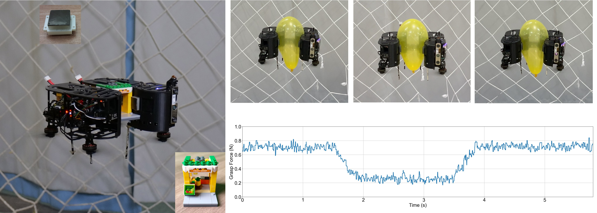
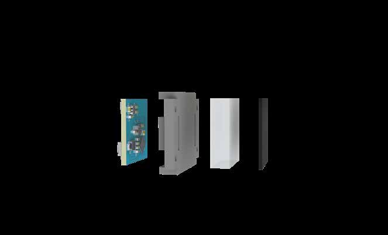
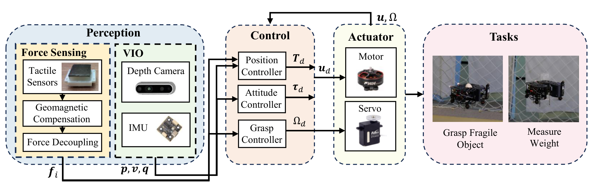
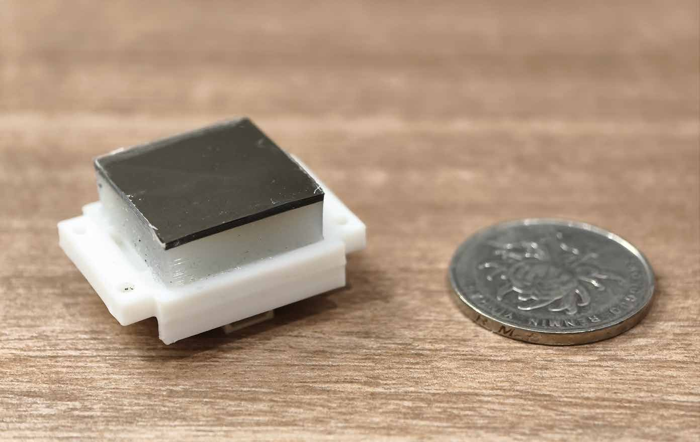
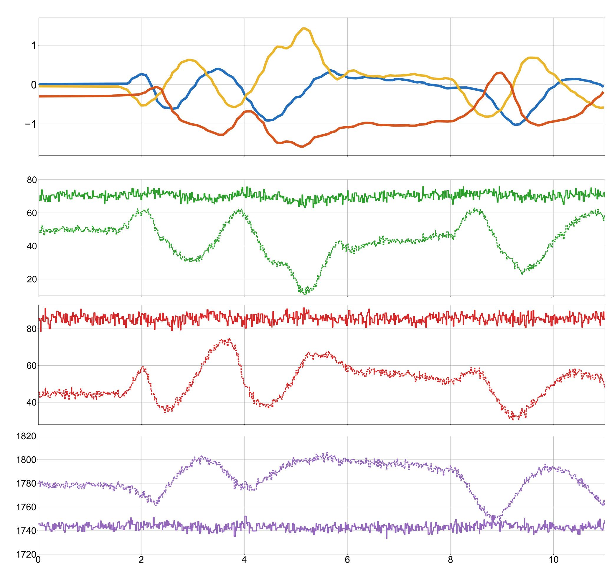
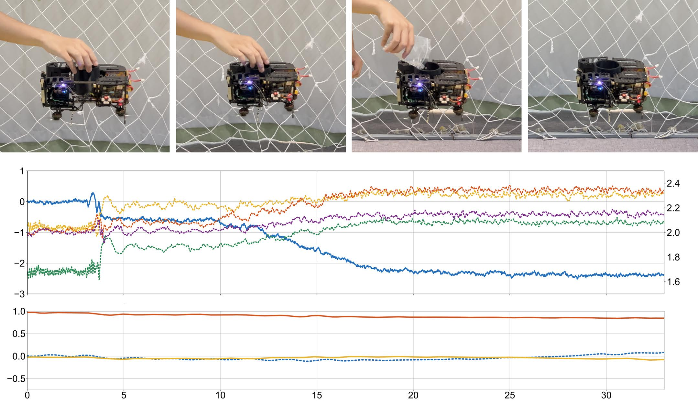
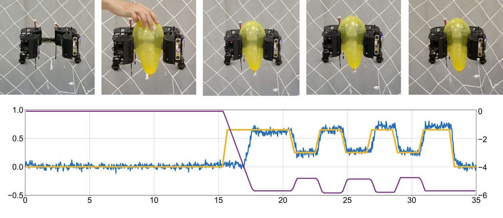
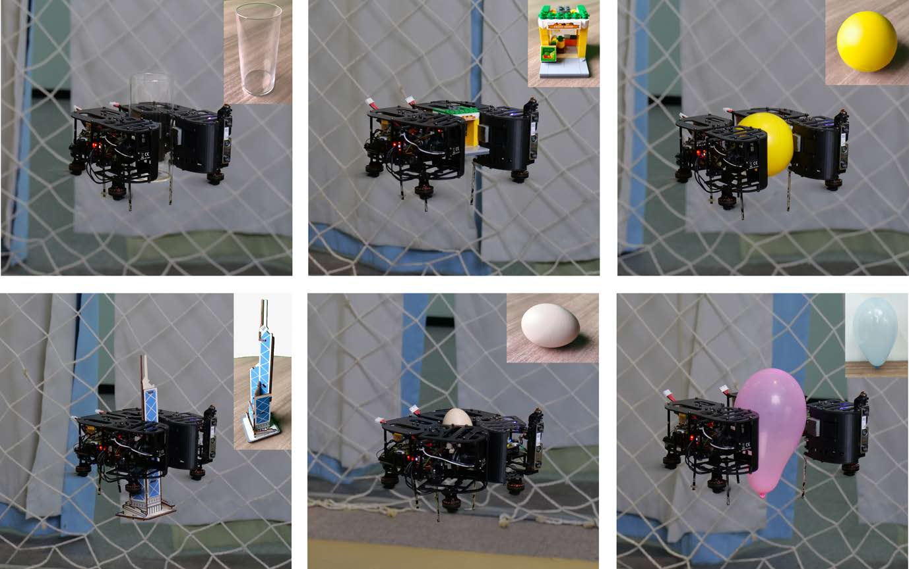
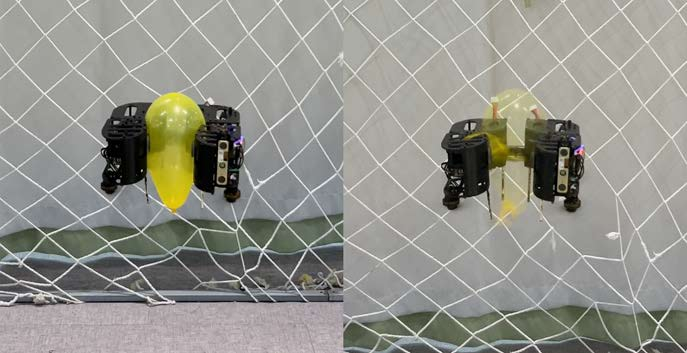
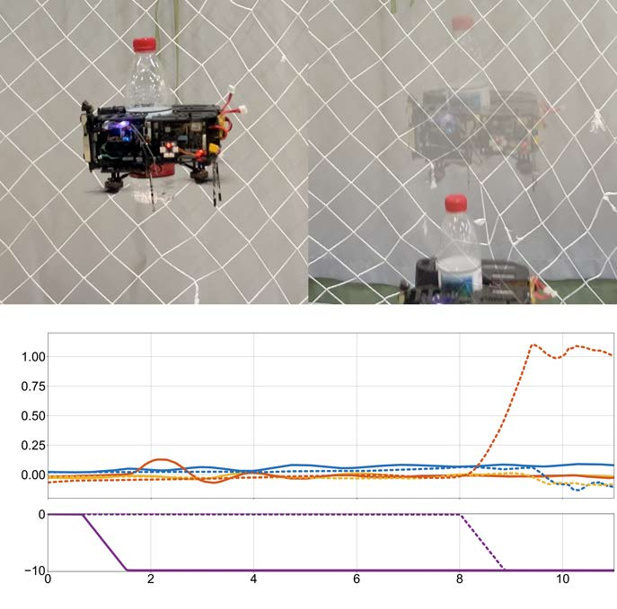

# 力感知空中抓取系统（22_Force-Aware_Grasping_for_Aerial_Manipulation）：完整忠实学术翻译

> **原文标题**：22_Force-Aware_Grasping_for_Aerial_Manipulation  
> **作者**：Kenghou Hoi、Yuze Wu、Annan Ding、Junjie Wang、Anke Zhao、Jialiang Hou、Chengqian Zhang、Fei Gao  
> **发表信息**：arXiv:2602.08599v1，2026-02-09  
> **原文 PDF**：[22_Force-Aware_Grasping_for_Aerial_Manipulation.pdf](../22_Force-Aware_Grasping_for_Aerial_Manipulation.pdf) ｜ **对应中文详解**：[22_力感知空中抓取系统.md](../中文详解/22_力感知空中抓取系统.md)  

---

## 原文第 1 页核心内容与翻译

面向稳健空中操作的高精度实时力感知抓取系统
Kenghou Hoi1,2,∗, Yuze Wu1,2,∗, Annan Ding3,4,∗, Junjie Wang1,2, Anke Zhao1,2,
Jialiang Hou1,2,†, Chengqian Zhang3,4,†, and Fei Gao1,2,†
Tactile
Sensor
Toy blocks
Shrink
Expand
Shrink
(a)
(b)
(d)
(c)
(d)

**图 1**：图 1：抓取实验。(a) 使用本文提出的磁性柔性触觉传感器处理易碎玩具积木的实验装置，展示柔和操作能力；(b)–(d) 可变形四旋翼经历收缩—展开—收缩状态的过程，其中 (c) 显示气球在展开状态下的变形范围比收缩状态更大；(d) 本文触觉传感器测得的抓取力，显示展开时抓取力减小、再次收缩后抓取力增大。

摘要——空中操作需要可靠的力感知能力，才能安全、有效地完成抓取和实体交互。以往方法往往依赖笨重且昂贵的力传感器，不适合普通四旋翼平台；或者在没有力反馈的情况下完成抓取，容易损坏易碎物体。针对这些问题，本文提出一种力感知抓取框架，在机体上布置六个低成本、高灵敏度、类似皮肤的触觉传感器。我们设计了基于磁场的触觉传感模块，可以高精度测量三维接触力；同时利用参考霍尔传感器消除地磁干扰，并相较以往方法简化标定过程。该框架支持精确的力感知抓取控制，可安全操作易碎物体，并实时测量被抓物体的重量。气球抓取、载荷变化和消融实验等多项实物实验验证了系统在不同空中操作场景中的有效性。整个系统无需外部动作捕捉设备即可在机载计算机上运行，提高了力敏感空中操作的实用性。补充视频见：https://www.youtube.com/watch?v=mbcZkrJEf1I。
*Equal contribution
†Corresponding author
1State Key Laboratory of Industrial Control Technology, Zhejiang Uni-
versity, Hangzhou 310027, China.
2Huzhou Institute, Zhejiang University, Huzhou 313000, China.
3State Key Laboratory of Fluid Power and Mechatronic Systems, School
of Mechanical Engineering, Zhejiang University, Hangzhou 310058, China.
4Zhejiang Key Laboratory of Additive Manufacturing Technology
and Equipment, School of Mechanical Engineering, Zhejiang University,
Hangzhou 310058, China.
E-mail: kenghouhoi@zju.edu.cn, jlhou8@gmail.com, fgaoaa@zju.edu.cn
一、引言
空中操作利用飞行平台固有的空间机动能力，可以在地面机器人难以进入的复杂空间中完成实体交互。近年来，空中抓取 [1]–[5]、空中书写 [6]–[8] 和空中交互 [9], [10] 等应用不断出现，显示出拓展操作范围的潜力。然而，空中操作要真正用于实际任务仍面临明显困难。一方面，传统机械臂质量大、体积大，会严重降低整个空中操作系统的灵活性和机动性，限制其在狭窄室内空间和复杂非结构化环境中的使用。另一方面，许多现有方法没有充分考虑抓取易碎物体这类需要精细接触的任务。根本原因在于缺少对接触力的主动感知，而这种能力对于估计实体交互状态和保证任务成功十分重要。因此，如何构建一种轻量、紧凑并能够精确感知力的空中抓取系统，仍是需要解决的问题。
这一问题的核心在于对接触力进行准确、实时的感知。已有研究在末端执行器上安装力/力矩传感器，直接测量交互力 [6], [7]。这类方法受到重视，是因为传感器能够在接触位置提供高精度测量。

---

## 原文第 2 页核心内容与翻译

Tactile Sensor
Reference 
Hall Sensor
Tactile Sensor
(b)
(a)
(c)
Spacer plate
10mm
Magnetic
field line
Hall sensor
Hall Sensor
Buffer Layer
Spacer plate
Touch Layer
PCB

**图 2**：图 2：硬件结构。(a) 内壁安装六个触觉传感器的可变形四旋翼；(b) 分解视图，展示
本文提出的触觉传感器及其内部部件和装配方式。(c) 磁性柔性触觉传感器的工作原理示意图。

接触位置。然而，这类传感器成本高，而且会给飞行平台增加较大质量。
另一种方法虽然成本更低、使用更广泛，但仍然需要考虑其对飞行平台增加的质量。
另一种成本更低、应用更广的方案是视觉触觉传感器，即根据弹性结构的视觉形变反推出力。多数方法 [11], [12] 通过数据驱动方式获得测量结果，但传感器精度依赖视觉质量，容易受到视觉噪声影响；当接触力变化很小时，如果不能形成明显的视觉信号，传感器的灵敏度也会降低。此外，实际接触往往在多个位置或表面形成复杂的接触分布，在机载计算资源有限的情况下，同时计算多个力会带来较大负担。磁性触觉传感器为解决这一问题提供了另一种可能。与其他传感器 [11], [12], [14], [15] 相比，前期工作 [13] 研制的传感器在理论保证下能够高精度测量三维力。磁感知本身不依赖光学信息，能够抵抗视觉干扰，并提供动态交互所需的高分辨率力反馈。此外，该传感器重量轻、体积小，并具有闭式解析模型，在很小计算量下即可实现实时处理，适合用于空中操作任务。

本文提出一种新的空中操作系统：将前期工作 [13] 的磁性柔性触觉传感器集成到一台轻量、仿手形飞行机器人（重量 556 g）[16] 上，用于完成接触丰富场景下对易碎物体的精细抓取。多个轻量磁性柔性触觉传感器单元以分布式方式安装在四旋翼机体内部，提供丰富的空间接触信息，同时几乎不影响飞行性能。传感器安装在动态飞行平台上后，四旋翼姿态变化会使地磁场在机体系中的表现发生变化，从而持续造成幅度大且难以预测的信号波动。为将力引起的信号与环境噪声分离，本文在平台上增加一个专门监测地磁场的霍尔传感器，由此提取真实接触信号。在控制中加入滤波后的接触力作为额外观测量，设计自适应控制器调整执行机构指令，从而精确调节抓取力，并与易碎物体安全交互。实验表明，在载荷变化情况下，该系统仍能保持良好的性能，即使受到动态扰动也能维持准确的位置控制。大量实物实验验证了该方法在实现准确、高效力感知抓取方面的有效性。

本文的主要贡献如下：

• 将轻量、柔性且精确的触觉传感阵列集成到可变形四旋翼平台中，以支持多种实体交互；
• 提出结合导纳控制和实时力反馈的自适应控制框架，实现稳健操作；
• 通过不同物体和动态载荷条件下的大量实验，验证力感知抓取的精确性和效率。
二、相关工作
A. 触觉传感器在操作中的应用
触觉传感器广泛用于机器人操作中的接触力感知。Huang 等人 [17] 使用 16 × 16 的压力传感器阵列完成取六角扳手等任务；Bhirangi 等人 [12] 使用基于 [14] 的传感器完成插接任务。Lin 等人 [15] 利用视觉触觉传感器和灵巧机械手完成取纸，Xue 等人 [18] 使用 GelSight [19] 完成擦拭花瓶、削黄瓜等接触丰富的任务。不过，这些方法仍有明显局限：文献 [17] 的传感器只能测量一维法向力；9DTact [11] 等视觉触觉传感器通常采样率较低、计算量较大，不太适合实时精细操作。

---

## 原文第 3 页核心内容与翻译

Perception
Depth Camera
IMU
VIO
Tactile 
Sensors
Force Sensing
Control
𝒑, 𝒗, 𝒒
𝒇𝑖
Motor
Tasks
𝒖𝑑
𝒖, Ω
𝝉𝑑
𝑻𝑑
Grasp Fragile
Object
Measure
Weight
Actuator
Servo
Ω𝑑
Position
Controller
Attitude
Controller
Grasp
Controller
Geomagnetic 
Compensation
Force Decoupling

**图 3**：图 3：系统总览，展示感知（力感知和视觉惯性里程计）、控制（位置、姿态和
抓取控制器）、执行机构（电机和舵机系统）以及任务执行（易碎物体抓取和重量测量能力）。

表 I：传感器对比
指标
力/力矩传感器
9DTact [11]
ReSkin [14]
本文方法
频率 [Hz]
1000
90
400
50
重量 [g]
280
20
未报告
8
成本 [$]
2000
15
30
10
是否需要训练
否
是
是
否
误差 [N]
< 0.01
< 0.4
< 0.3
< 0.05
对于实时精细操作，这些局限尤为明显。磁性触觉传感器 ReSkin [14] 和 AnySkin [12] 没有充分研究磁解耦背后的物理机制和磁场设计，主要依赖数据驱动标定来建立磁场到力的映射，因此缺少理论模型的支持。相比之下，本文磁性触觉系统无需大量数据采集或机器学习训练，即可提供比 ReSkin 系列和视觉触觉传感器更高带宽、灵敏度和精度的三维力测量。
B. 空中操作
空中操作已在多种应用中取得明显进展。Guo 等人 [6] 使用力/力矩传感器实现面向接触的运动与力规划。Lin 等人 [20] 设计了全驱动空中机器人，通过改变姿态完成浇花、拉窗帘等任务。Wu 等人 [5] 研制可伸缩环形四旋翼，通过调整机体尺寸抓取物体；Ubellacker 等人 [2] 利用带机载感知的柔性手指实现高速空中抓取。Wang 等人 [21] 使用多机器人系统灵活运输绳吊载荷，Li 等人 [22] 则利用 Delta 机械臂实现自主空中抛投。然而，大多数现有系统要么采用限制接触柔顺性的刚性夹具，要么缺少面向易碎物体操作的一体化高分辨率力感知能力。本文将可变形四旋翼平台与分布式柔性触觉传感阵列结合起来，不仅能够自适应抓取，还能实现专门面向易碎物体的实时导纳力控制。这种可变形结构、分布式触觉感知和导纳控制的结合，为需要精确力交互的实际空中操作提供了有效方案。
三、系统概述
本文四旋翼以先前工作 [16] 中的仿手形自主飞行机器人为基础，通过单个执行器控制机体变形，实现空中抓取和运输。如图 2 所示，中央机架内壁安装了六个触觉传感器。图 3 给出了系统总体结构，系统由感知、控制和执行机构三个主要模块组成。首先，建立能够解耦并估计三维接触力的触觉感知系统；其次，将力反馈与位置数据结合，设计自适应控制器，使飞行器在保持悬停的同时获得期望抓取力；最后，由四旋翼协调舵机和推进系统，完成精确的力感知空中抓取。系统使用机载双目相机进行视觉感知，并使用惯性测量单元进行状态估计，因此无需外部动作捕捉系统即可完全自主运行。
四、触觉力感知模块
本文触觉感知模块利用定制柔性磁膜发生形变时产生的磁场变化工作。受到外力后，磁膜的位移和倾斜会改变周围磁场分布；集成在传感器中的高灵敏度霍尔传感器检测这些微小变化。通过所设计的解耦算法，将磁场变化准确转换为三维力测量结果，从而获得高分辨率触觉感知能力。传感器采用柔软、具有柔顺性的结构，在保持机械强度的同时保证与物体安全接触，尤其适用于需要轻柔接触的易碎物体空中操作。

---

## 原文第 4 页核心内容与翻译

32mm
25mm
16mm
重量：8 g

**图 4**：图 4：传感器尺寸对比，展示各个方向上的尺寸，并以硬币作为比例参照。整个传感器仅重 8 克。

A. 硬件设计
基于前期工作 [13]，本文设计了一种硬币大小的传感器，整体尺寸为 25 × 32 × 16 mm。传感器由三部分组成：覆盖磁膜的硅胶层、用于固定硅胶和传感器的 3D 打印部件，以及集成霍尔传感器的定制印刷电路板（PCB）。作者将钕铁硼（NdFeB）颗粒与柔性基材混合，经高温固化后切割成所需形状；再参考折纸方法对复合材料进行折叠和磁化，使其形成特定的向心磁场分布。为保证最小解耦距离，选用尺寸为 20 × 20 × 7 mm 的硅胶块，使磁膜与传感器之间保持 10 mm 距离。

制作过程中，以 Ecoflex 00-30 作为基础材料，并在硅胶中加入硅油（PMX-200，黏度 5 cSt）或气相二氧化硅纳米颗粒，以调节其弹性模量，进而改变传感器的测量范围和灵敏度。随着硅油与硅胶的质量比增加，柔性硅胶弹性体的弹性模量相应降低。

为简化布线并便于与主机通信，本文设计了尺寸为 20 mm × 20 mm × 1.8 mm 的紧凑电路板，集成 STM32F042G6U6 主控芯片和 MLX90393SLW 霍尔传感器芯片。电路板同时提供 CAN 和 UART 接口。利用 CAN 总线的通信特性，系统采用菊花链方式传输数据和供电，显著降低了传感器阵列的布线复杂度。在该设计中，任一传感器的 UART 接口都可以访问 CAN 总线上的全部传感器数据，便于主机高效采集。系统还设计了专用通信协议，以保证数据传输效率和实时性能。
B. 力测量
前期工作 [13] 从理论上证明了无限周期正弦磁化薄膜具有力解耦可行性。该方法提供了重要的理论认识，但受实际制造条件限制，难以实现理想的磁场分布。基于这一理论 [13]，本文采用简化的向心磁化磁场模型，以适应实际制作条件。霍尔传感器测得的磁通密度定义为 B = [Bx, By, Bz]⊤。为补偿简化磁场模型带来的误差，引入两个补偿因子 B′z 和 B′′z，对理论模型中的 Bz 分量进行修正。
B
′
z = k1Bz + c1, B
′′
z = k2Bz + c2,
(1)
其中，k1、k2、c1、c2 ∈ R 为补偿系数，用于修正磁场分布的非理想因素。磁膜、硅橡胶弹性体和胶黏剂共同影响剪切模量和弹性模量，制造过程还可能引入缺陷。因此，实际应用需要根据硅胶接触面积、与剪切模量和弹性模量有关的参数 ai、理想磁化薄膜的波数、弹性体厚度，以及安装位置偏差补偿参数 bi 进行标定。第 i 个传感器的三维力解耦模型为：
fi = ai ⊙S(Bi) + bi,
fi, ai, bi, S, Bi ∈R3,
(2)
其中
S(B) =


arctan



Bx
B′
z−
B
′2
z −(B2
y−B2
x)
2B′
z



arctan



By
B′
z−
B
′2
z +(B2
y−B2
x)
2B′
z



ln
r
B
′′
z −
B
′′
z +(B2
y−B2
x)
2B′′
z
2
+ B2y
!


.
(3)
C. 地磁补偿
与地面机器人和机械臂相比，四旋翼机动性更高，但本文传感器容易受到地磁干扰，使磁通密度测量值随姿态变化。为解决这一问题，系统在四旋翼机体上固定安装一个参考霍尔传感器，用于测量机体系中的地磁强度。由此可以对传感器测量值中的地磁影响进行补偿：
ˆ
Bi = Bi −Si
Sref RBref,
(4)
其中，Bref ∈ R3 为参考霍尔传感器测得的磁通密度，SiSrefR ∈ R3×3 为从参考传感器坐标系到第 i 个传感器坐标系的旋转矩阵，由此得到修正后的 B̂i ∈ R3。相应的补偿后力估计为：
ˆfi = ai ⊙S( ˆ
Bi) + bi.
(5)

---

## 原文第 5 页核心内容与翻译

**图 5**：图 5 对比有无地磁补偿时的磁通密度测量结果。
有无地磁补偿的对比结果表明：未补偿数据随姿态变化产生明显波动，而补偿后的数据在无载荷条件下能够稳定保持在接近基线的水平。

Time (s)
Magnetic Flux Density (µT)
Attitude (rad)
pitch
roll
yaw
x_w/o
y_w/o
z_w/o
x_w
y_w
z_w

**图 5**：图 5：不同姿态下有无地磁补偿时的磁通密度测量结果。地磁补偿后，测量结果的变化明显减小。

五、力感知抓取控制
A. 位置控制
图 3 所示的总体控制结构包括位置控制器、姿态控制器和抓取力控制器三个部分。位置控制器采用导纳控制，根据外力调节四旋翼的平移运动，在实体交互过程中兼顾位置跟踪精度和接触柔顺性。导纳动力学描述为：
M(¨pd −¨pr) + D( ˙pd −˙pr) + K(pd −pr) = ˆfext,
(6)
其中，M、D、K ∈ R3×3 分别表示虚拟惯量、阻尼和刚度矩阵；pr、ṗr 和 p̈r 表示参考轨迹的各项分量；f̂ext 为触觉传感器估计得到的外力。导纳控制器计算得到的期望加速度为：
¨pd = ¨pr+M −1
−D( ˙pd−˙pr)−K(pd−pr)+ ˆfext

. (7)
随后，串级 PD 控制器计算指令加速度：
acmd = ¨pd + Kv( ˙pd −˙p) + Kp(pd −p),
(8)
其中，Kv 和 Kp 为对角增益矩阵，p 和 ṗ 为测得的位置和速度。通过将传感器测量值从机体坐标系 B 转换到世界坐标系 W，估计外力：
ˆfext = W
B R
n
X
i=1
(B
SiR ˆfi),
(9)
其中，f̂i 为第 i 个传感器测得的力，BSiR 为从第 i 个传感器坐标系到机体坐标系的旋转矩阵，WBR 为根据状态估计得到的从机体坐标系到世界坐标系的旋转矩阵。最终，期望推力计算为：
Td = W
B R⊤(macmd −mg),
(10)
其中，m 为四旋翼质量，g 为重力向量。
B. 姿态控制
系统采用串级 PID 控制器进行姿态稳定。期望角速度 ωd 和角速度误差 ωe 定义为：
ωd = KR · Re,
ωe = ωd −ω,
(11)
其中，KR 为正定增益矩阵，Re 为根据参考旋转矩阵和测量旋转矩阵得到的姿态误差，ω 为机载 IMU 测得的角速度。期望力矩 τd 计算为：
τd = KP,ωωe + KI,ω
Z
ωedt + KD,ω ˙ωe,
(12)
其中，KP,ω、KI,ω 和 KD,ω 均为正定增益矩阵。
C. 抓取控制
抓取机构通过控制舵机电机的角速度实现。总法向抓取力 f̂g 由各传感器测量值中的法向力分量相加得到：
ˆfg =
n
X
i=1
∥ˆfi · ˆni∥,
(13)
其中，n̂i 表示第 i 个传感器接触面的法向量。为达到期望抓取力 fd，采用导纳控制策略，其二阶动力学为：
M∆θ ¨
∆θ + B∆θ ˙
∆θ + K∆θ∆θ = fd −ˆfg,
(14)
其中，M∆θ、B∆θ 和 K∆θ 分别表示虚拟惯量、阻尼和刚度参数；∆θ 为相对于参考位置的角位移；fd − f̂g 为期望抓取力与测量抓取力之间的误差。舵机目标位置 θd 计算为：
θd = θr + ∆θ,
(15)
其中，θr 表示建立接触前的舵机初始角度。该导纳方法根据力误差产生适当的角度调整量 ∆θ，使抓取过程具有柔顺性，从而能够稳定、自适应地处理刚度和形状不同的物体。

---

## 原文第 6 页核心内容与翻译

Hand Interference
Adding Weights
Hovering
Shrinking
②
③
M1
M2
M3
M4
shear force
Shear Force (N)
Vmotor (rpm)
Time (s)
(×10
5)
①
①
④
④
②
③
Position (m)
y
z
x

**图 6**：图 6：动态变化负载条件下的实验。(1) 四旋翼收缩并抓取一个 50 g 的 3D 打印 PLA 容器；(2) 四旋翼收紧并抓住容器，操作者松手时可以看到力的波动；(3) 加入玻璃珠，模拟实时载荷变化；(4) 在增加 230 g 载荷后，四旋翼仍保持稳定悬停。

force
force_des
angle
Grasp Force (N)
Angle (rad)
Time (s)
①
①
①
⑤
⑤
②
③
④
③
②
④
Hovering
Shrinking
Maintaining Force
Expand
Shrink Again

**图 7**：图 7：抓取气球过程中的闭环力控制。(1) 四旋翼保持悬停，测得的抓取力接近零；(2) 四旋翼开始收缩，施加的抓取力增大；(3) 和 (5) 中，四旋翼将抓取力保持在约 0.65 N；(4) 中，抓取力调节在约 0.25 N。较大的力使气球产生更大变形，较小的力对应较小变形。

六、实验
本节对所提出的力感知控制框架进行实验验证，重点考察三项能力：面向易碎物体的精确力调节、动态载荷变化下的稳定保持，以及不依赖外部设施的稳健空中交互。所有实验均在一台定制的可变形四旋翼上完成。该平台配备六个磁性触觉传感器，用于多方向力感知，并使用视觉惯性里程计（VIO）进行机载定位；整个系统无需动作捕捉系统或外部计算设备即可自主运行。
设计了两项主要实验来评价控制器的不同能力：气球抓取实验用于验证易碎物体操作中的精确力控制性能；动态载荷变化实验用于评价载荷改变时的稳定保持能力。两项实验共同说明了力感知控制框架在不同空中操作场景中的有效性。

---

## 原文第 7 页核心内容与翻译

(a)
(b)
(c)
(d)
(e)
(f)

**图 8**：图 8：不同物体的抓取性能评估：(a) 玻璃杯；(b) 玩具积木；(c) 解压球；(d) 木质拼图；(e) 鸡蛋；(f) 气球。结果显示，系统能够适应形状、尺寸和易碎程度不同的物体。

上述实验共同说明了力感知控制框架在不同空中操作场景中的有效性。
A. 传感器设置
传感器的工作范围定义为 x、y = ±3 mm，z = −10 ± 2 mm 的空间区域。
在该工作范围内，使用 Mathematica 对式 (1) 的补偿系数进行优化，得到 k1 = 2.27851、c1 = 0.0010535、k2 = 0.878725 和 c2 = −0.0000785667。飞行实验前，使用商用力/力矩传感器对参数 a 进行标定。系统初始化时，在无载荷条件下对多次传感器读数求平均，并进行零偏校正，得到参数 b。随后可通过式 (5) 的解耦模型稳健估计三维力向量。
B. 动态载荷条件
为模拟实时载荷变化，作者设计了一个轻量的 50 g PLA 3D 打印容器，并使用直径 5 mm 的玻璃珠作为可调载荷。实验开始时，四旋翼先抓住空容器，随后由操作人员逐步加入约 180 g 玻璃珠，使载荷动态增加。如图 6 所示，系统最初检测到约 0.60 N 的剪切力，并通过提高旋翼转速作出响应。随着玻璃珠不断加入，四旋翼持续调整推力以保持稳定，最终传感器记录到稳定的 2.37 N 剪切力。
旋翼转速的变化与载荷变化具有较强相关性，说明力感知控制系统能够快速响应载荷变化。
图 6 的实验结果还表明，尽管载荷增加，四旋翼仍能保持相对稳定的位置控制，位置偏差很小，高度基本保持不变。该实验验证了系统通过实时力感知控制保持动态载荷下稳定飞行的能力。
w
w/o
brust

**图 9**：图 9：气球抓取消融实验。左侧：本文控制器能够在不损坏气球的情况下完成抓取；右侧：在无反馈的开环控制下，抓取力过大导致气球破裂。

C. 多种物体抓取
如图 8 所示，作者评估了系统对多种常见易碎物体的抓取性能，包括气球、鸡蛋、玩具积木、解压球、木质拼图和玻璃杯。这些物体在材料和几何性质上覆盖范围较广，既包括柔软、可变形物体，也包括坚硬但易碎的物体，代表了实际抓取中的常见挑战。例如，气球需要轻柔操作以避免因挤压过度而破裂；鸡蛋要求较高的力控制精度以防止破裂；玻璃杯则需要在抓取力和稳定性之间取得平衡，以免损坏。选择这些性质各异的物体，有效验证了系统的适用范围。柔软且具有柔顺性的触觉传感器结构能够显著降低抓取冲击力，使系统可以安全地与易碎物体交互。

为进一步验证精确力控制能力，作者开展了气球抓取实验，检验系统在严格力约束下处理易碎物体的能力。如图 7 所示，四旋翼通过闭环力反馈持续调节舵机位置，使实际接触力跟踪期望值。自适应调节将施加的力保持在 0.25–0.65 N 的安全范围内，使气球产生可控的弹性变形，同时不会破裂或受到过度压缩。该实验突出说明了系统处理可变形物体的能力，也验证了力感知控制框架在稳健空中操作中的有效性。
D. 消融实验
作者通过消融实验验证所提出框架的性能。设计了两项抓取任务来评价系统的不同方面：一项抓取 180 g 水瓶，用于测试承载能力和较大载荷下的稳定性；另一项操作可变形气球，用于评价精细力控制和对易碎物体的柔顺性。图 9 和图 10 给出了使用（w/）和不使用（w/o）所提出触觉反馈时的对比结果。在气球抓取实验中，如图 9 所示，配备触觉感知的四旋翼能够通过实时调节夹持压力，避免挤压过度并防止气球破裂。

---

## 原文第 8 页核心内容与翻译

w/
w/o
falling
Time (s)
Position Error (m)
Angle (rad)
x_w
x_w/o
y_w/o
z_w/o
y_w
z_w
angle_w/o
angle_w
on ground
recovery

**图 10**：图 10：所提出控制器抓取 180 g 水瓶的消融实验。
180 g 水瓶。左侧：本文控制器在抓取后保持稳定高度；右侧：基线方法（不使用所提出模块）无法保持稳定，导致四旋翼掉落到地面。

在水瓶抓取任务中，缺少力反馈会导致推力调节不足，使四旋翼接触物体后持续下降，最终将物体掉落。定量位置误差数据显示，采用反馈控制时，高度偏差能够迅速得到补偿并趋于稳定；不使用反馈时，垂直误差则大幅增加，直至四旋翼落地。这些实验共同说明，所提出的感知和控制框架对于实现稳健空中操作是必要的，尤其适用于载荷变化和易碎物体处理场景。
七、结论
本文提出了一种集成触觉感知和基于力控制的可变形四旋翼平台，使飞行器能够在空中感知力并实时完成操作。通过成功抓取具有明显重量的物体和易碎物体，实验验证了所提出框架的实用性。结果表明，该方法有望支持真实环境中的自主空中操作。后续工作将重点研究抓取规划机制，以提高自主性，并研究材料识别技术，以增强抓取操作的稳健性。
REFERENCES
[1] A. X. Appius, E. Bauer, M. Bl¨ochlinger, A. Kalra, R. Oberson,
A. Raayatsanati, P. Strauch, S. Suresh, M. von Salis, and R. K.
Katzschmann, “Raptor: Rapid aerial pickup and transport of objects
by robots,” in 2022 IEEE/RSJ International Conference on Intelligent
Robots and Systems (IROS).
IEEE, 2022, pp. 349–355.
[2] S. Ubellacker, A. Ray, J. M. Bern, J. Strader, and L. Carlone, “High-
speed aerial grasping using a soft drone with onboard perception,” npj
Robotics, vol. 2, no. 1, p. 5, 2024.
[3] M. Xu, S. Huang, R. He, D. Yu, and H. Wang, “Aerial shooting
manipulator for distant grasping,” IEEE Robotics and Automation
Letters, vol. 8, no. 4, pp. 1991–1998, 2023.
[4] M. Zhao, K. Okada, and M. Inaba, “Versatile articulated aerial
robot dragon: Aerial manipulation and grasping by vectorable thrust
control,” The International Journal of Robotics Research, vol. 42, no.
4-5, pp. 214–248, 2023.
[5] Y. Wu, F. Yang, Z. Wang, K. Wang, Y. Cao, C. Xu, and F. Gao, “Ring-
rotor: A novel retractable ring-shaped quadrotor with aerial grasping
and transportation capability,” IEEE Robotics and Automation Letters,
vol. 8, no. 4, pp. 2126–2133, 2023.
[6] X. Guo, G. He, J. Xu, M. Mousaei, J. Geng, S. Scherer, and
G. Shi, “Flying calligrapher: Contact-aware motion and force planning
and control for aerial manipulation,” IEEE Robotics and Automation
Letters, 2024.
[7] D. Tzoumanikas, F. Graule, Q. Yan, D. Shah, M. Popovic, and
S. Leutenegger, “Aerial manipulation using hybrid force and position
nmpc applied to aerial writing,” arXiv preprint arXiv:2006.02116,
2020.
[8] K. Bodie, M. Brunner, M. Pantic, S. Walser, P. Pf¨andler, U. Angst,
R. Siegwart, and J. Nieto, “An omnidirectional aerial manip-
ulation
platform
for
contact-based
inspection,”
arXiv
preprint
arXiv:1905.03502, 2019.
[9] J. Liang, H. Zhong, Y. Wang, Y. Chen, J. Zeng, and J. Mao, “Adaptive
force tracking impedance control for aerial interaction in uncertain
contact environment using barrier function,” IEEE Transactions on
Automation Science and Engineering, 2023.
[10] F. Benzi, M. Brunner, M. Tognon, C. Secchi, and R. Siegwart, “Adap-
tive tank-based control for aerial physical interaction with uncertain
dynamic environments using energy-task estimation,” IEEE Robotics
and Automation Letters, vol. 7, no. 4, pp. 9129–9136, 2022.
[11] C. Lin, H. Zhang, J. Xu, L. Wu, and H. Xu, “9dtact: A compact
vision-based tactile sensor for accurate 3d shape reconstruction and
generalizable 6d force estimation,” IEEE Robotics and Automation
Letters, vol. 9, no. 2, pp. 923–930, 2023.
[12] R. Bhirangi, V. Pattabiraman, E. Erciyes, Y. Cao, T. Hellebrekers,
and L. Pinto, “Anyskin: Plug-and-play skin sensing for robotic touch,”
arXiv preprint arXiv:2409.08276, 2024.
[13] H. Dai, C. Zhang, C. Pan, H. Hu, K. Ji, H. Sun, C. Lyu, D. Tang,
T. Li, J. Fu et al., “Split-type magnetic soft tactile sensor with 3d
force decoupling,” Advanced Materials, vol. 36, no. 11, p. 2310145,
2024.
[14] R. Bhirangi, T. Hellebrekers, C. Majidi, and A. Gupta, “Re-
skin: versatile, replaceable, lasting tactile skins,” arXiv preprint
arXiv:2111.00071, 2021.
[15] P. Lin, Y. Huang, W. Li, J. Ma, C. Xiao, and Z. Jiao, “Pp-tac:
Paper picking using tactile feedback in dexterous robotic hands,” arXiv
preprint arXiv:2504.16649, 2025.
[16] Y. Wu, F. Yang, R. Jin, Y. Zhong, J. Wang, X. Wu, and F. Gao, “Hand-
like autonomous flying robot for airborne grasping and interaction,”
Nature Communications, 2026.
[17] B. Huang, Y. Wang, X. Yang, Y. Luo, and Y. Li, “3d-vitac: Learning
fine-grained manipulation with visuo-tactile sensing,” arXiv preprint
arXiv:2410.24091, 2024.
[18] H. Xue, J. Ren, W. Chen, G. Zhang, Y. Fang, G. Gu, H. Xu, and C. Lu,
“Reactive diffusion policy: Slow-fast visual-tactile policy learning for
contact-rich manipulation,” arXiv preprint arXiv:2503.02881, 2025.
[19] W. Yuan, S. Dong, and E. H. Adelson, “Gelsight: High-resolution robot
tactile sensors for estimating geometry and force,” Sensors, vol. 17,
no. 12, p. 2762, 2017.
[20] J. Lin, S. Ji, Y. Wu, T. Wu, Z. Han, and F. Gao, “Float drone: A fully-
actuated coaxial aerial robot for close-proximity operations,” arXiv
preprint arXiv:2503.00785, 2025.
[21] Y. Wang, J. Wang, X. Zhou, T. Yang, C. Xu, and F. Gao, “Safe and
agile transportation of cable-suspended payload via multiple aerial
robots,” arXiv preprint arXiv:2501.15272, 2025.
[22] Z. Li, H. Chen, Y. Lin, B. Ye, and X. Lyu, “Aerothrow: An autonomous
aerial throwing system for precise payload delivery,” arXiv preprint
arXiv:2507.13903, 2025.

---
