# FLOAT全驱同轴交互无人机（24_FLOAT_Drone_for_Physical_Interaction）：完整忠实学术翻译

> **原文标题**：24_FLOAT_Drone_for_Physical_Interaction  
> **作者**：Junxiao Lin、Kehan Zhou、Shuhang Ji、Yimin Peng、Shen Wang、Jialiang Hou、Fei Gao  
> **发表信息**：arXiv:2607.04260v1，2026-07-05  
> **原文 PDF**：[24_FLOAT_Drone_for_Physical_Interaction.pdf](../24_FLOAT_Drone_for_Physical_Interaction.pdf) ｜ **对应中文详解**：[24_FLOAT全驱同轴交互无人机.md](../中文详解/24_FLOAT全驱同轴交互无人机.md)

---

## 原文第 1 页核心内容与翻译

1

面向物理交互的 FLOAT 无人机：侧向气流削减、力和力矩建模与自适应控制

Junxiao Lin∗, Kehan Zhou∗, Shuhang Ji, Yimin Peng, Shen Wang, Jialiang Hou†, and Fei Gao†

(a) 接近　(b) 插入　(c) 拉开　(d) 推关闭合  
侧置挂钩　抽屉把手　2 cm 间隙

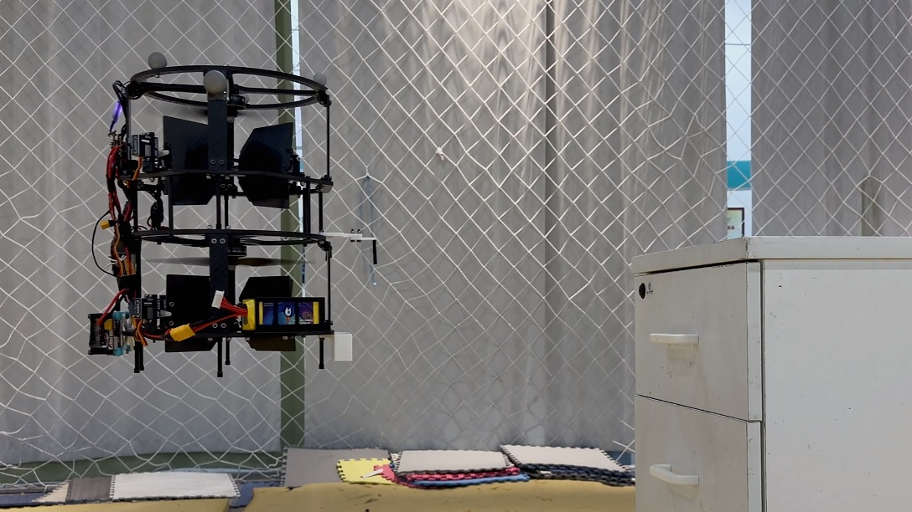

**图 1**：FLOAT 无人机近距离推拉抽屉的物理交互操作。(a) 使用侧置三维打印挂钩接近并对准；(b) 挂钩穿过 2 cm 的把手间隙，插图显示挂钩与把手的接触关系；(c) 拉开抽屉；(d) 推动抽屉关闭。

### 摘要

空中物理交互是下一代无人机的重要发展方向，但这要求飞行平台在保持稳定飞行的同时能够施加接触力。对于近距离作业，这一要求体现为三个相互耦合的设计目标：稳定接触所需的多维力和力矩生成能力、适应狭窄空间机动并保证安全的紧凑尺寸，以及产生水平力时减少吹向目标的侧向气流。

本文提出 FLOAT 无人机：一种采用舵机驱动控制面的全驱同轴无人机，用于近距离物理交互。同轴双旋翼提供紧凑的推进布局；浸没在旋翼下洗流中的控制面产生侧向力和力矩，从而实现六自由度力和力矩生成。通过与倾转旋翼方案进行力相匹配的计算流体力学（CFD）对比，量化了吹向目标的侧向气流降低程度。为描述旋翼尾流中旋翼与控制面之间的非线性耦合，本文根据精密力测量辨识高保真多项式气动力和力矩模型，并将其嵌入带约束的非线性分配器，实现实时力和力矩跟踪。飞行与交互对比实验表明，与线性分配基线相比，所提出的框架提高了控制精度，能够抑制地面效应和载荷扰动，并可在仅有 2 cm 把手间隙的条件下完成近距离抽屉推拉操作。

关键词——空中物理交互；全驱无人机；自适应控制。

### 一、引言

空中物理交互是下一代无人机的重要发展方向，使空中机器人能够从被动感知和巡检 [1]、[2] 进一步扩展到主动操作、运输和维护任务 [3]、[4]。与自由飞行任务不同，物理交互要求无人机在对环境施加接触力的同时保持稳定飞行，这对平台设计和控制系统都提出了严格要求。稳定接触需要平台生成并调节多维力和力矩，而在狭窄空间中近距离作业还要求平台尺寸紧凑，以便机动并保证安全。

此外，当通过机体倾斜或改变旋翼推力方向产生水平力时，部分旋翼气流会吹向目标，造成不利的气动干扰。因此，面向交互的空中平台应同时具备相对独立的力和力矩生成能力、紧凑结构，以及在产生水平力时减少侧向气流的能力。

传统多旋翼无人机本质上是欠驱动的，因为其合力推力主要沿机体系固定的竖直轴产生 [5]。因此，产生水平力必须倾斜机体，这会使力的调节与姿态运动相互耦合，难以在物理交互过程中同时保持期望的接触力和机体姿态。

全驱空中平台通过固定的非平行旋翼轴或主动推力矢量机构产生六自由度力和力矩，从而缓解这一限制 [6]、[7]。但这些方案通常需要分散布置旋翼、增加执行器或采用倾转机构，导致平台尺寸、质量和机械复杂度增加。此外，基于推力矢量的侧向力生成可能把部分旋翼气流吹向近处目标，在近距离作业中形成气动干扰。

为解决这些问题，我们在前期工作 [8] 中提出了 FLOAT 无人机。这是一种全驱同轴无人机，将紧凑的同轴双旋翼布局与浸没在旋翼下洗流中的舵机驱动控制面结合起来。该构型利用控制面产生侧向力和力矩，而不依赖机体倾斜或旋翼推力矢量改变，因此能够生成六自由度力和力矩，并有望减少吹向目标的侧向气流。

---

## 原文第 2 页核心内容与翻译

2

不过，前期研究仍有几个问题没有解决：相对于推力矢量方案，侧向气流的降低幅度尚未通过定量基准进行比较；简化的线性气动模型无法描述旋翼与控制面之间的非线性耦合；控制器也没有明确补偿模型不确定性和接触引起的扰动。

在前期设计基础上，本文完成了以下工作：

1. 建立力相匹配的 CFD 基准，对比旋翼—控制面构型与倾转旋翼方案吹向目标的侧向气流降低程度。
2. 刻画旋翼—控制面之间的非线性气动耦合，并根据执行范围内的高精度力测量辨识高保真多项式气动力和力矩模型。
3. 设计考虑饱和约束的非线性优化控制分配器，将辨识出的气动模型用于执行器受限条件下的在线六自由度力和力矩跟踪。
4. 在基于 SE(3) 的几何控制中加入 L1 自适应补偿，以抑制剩余模型误差、载荷变化、地面效应和飞行中的外部扰动。
5. 对升级后的样机进行系统级验证，说明机电设计、气动模型、非线性分配器和自适应控制器的组合能够提高近距离物理交互中的飞行精度和抗扰能力。

### 二、相关工作

#### （一）全驱无人机构型

全驱多旋翼无人机通常通过采用非平行的旋翼推力方向进行设计。根据旋翼轴在飞行过程中是固定不变还是主动改变，现有平台大致可分为固定倾角构型和可变倾角构型 [9]。

固定倾角构型预先设置旋翼安装角度，以实现六自由度力和力矩生成。例如，Rajappa 等人 [10] 将标准六旋翼改造为在同一平面内刚性安装六个倾斜旋翼。Brescianini 和 D’Andrea [11] 将八个旋翼布置在立方体的顶点，实现全向飞行。Park 等人 [12] 提出杆状八旋翼平台，用于空中操作并减小旋翼之间的气动干扰。固定倾角构型虽然机械结构相对简单，但悬停效率通常较低，因为产生的推力只有一部分用于抵消重力，而水平推力分量在悬停时必须相互抵消。此外，为减轻倾斜旋翼气流造成的旋翼间尾流干扰，固定倾角平台往往需要增大旋翼间距，因而尺寸较大，不适合在狭窄空间作业。

可变倾角构型在飞行中主动调整旋翼方向，可以获得更大的可行力和力矩范围并提高悬停效率。Ryll 等人 [13] 为标准四旋翼的每个电机配置独立的倾转舵机机构。Zheng 等人 [14] 设计了双舵机驱动的云台机构，用于同步改变四个旋翼的方向。Kamel 等人 [15] 在六旋翼平台上采用六个倾转单元；Allenspach 等人 [16] 提出同轴十二旋翼全向飞行器，以提高推力能力并抵消反作用力矩。Guan 等人 [17] 研究了带四个倾转舵机的同轴八旋翼。与固定倾角设计相比，可变倾角平台能够提高效率，但增加的执行器和倾转机构也会带来更大的质量、尺寸和机械复杂度。

固定倾角和可变倾角平台主要通过旋翼推力的侧向分量产生水平力，在近距离作业中可能把旋翼气流吹向目标。FLOAT 无人机则在紧凑的同轴布局中，将舵机驱动控制面置于旋翼下洗流内，用控制面产生侧向力。由此产生的旋翼—控制面耦合，正是本文开展高保真建模和非线性分配的原因。

#### （二）空中物理交互控制

稳定的空中物理交互要求无人机调节自身运动，同时补偿接触力、模型不确定性和气动扰动。基于 SE(3) 的几何控制 [18]、[19] 提供了与坐标参数化无关的控制表达，适合大姿态机动和无奇异的轨迹跟踪。但在标准形式下，它不会明确估计或补偿外部扰动和未建模气动效应。

阻抗控制和力控制方法 [20]、[21] 广泛用于柔顺空中交互，但许多实现需要力传感器或接触力估计，这会增加紧凑型空中平台的载荷和系统复杂度。为避免增加力和力矩传感器，基于扰动观测器的方法 [22]—[24] 得到了广泛研究。这类方法可根据运动和输入测量估计外部扰动，但其性能受到估计带宽与噪声敏感性之间权衡的影响。

增量非线性动态逆（INDI）[25]、[26] 同样具有较强的扰动抑制能力，但通常需要可靠的加速度估计和执行器状态反馈，例如旋翼转速或舵机偏转角。对于测量噪声较大且执行器存在非线性耦合的紧凑平台，这些条件可能难以满足。近年来，数据驱动方法 [27] 提高了对未知扰动的适应能力，但通常需要高质量仿真模型或大量离线训练。

L1 自适应控制 [6]、[28] 通过低通滤波补偿通道，将快速自适应与鲁棒控制分开，是一种有吸引力的选择。它可以快速估计扰动，同时避免把高频估计噪声直接注入控制输入。本文将基于 SE(3) 的几何控制与 L1 自适应补偿结合起来，在不增加力和力矩传感器的条件下，对 FLOAT 无人机的剩余模型误差和外部扰动进行补偿。

---

## 原文第 3 页核心内容与翻译

3

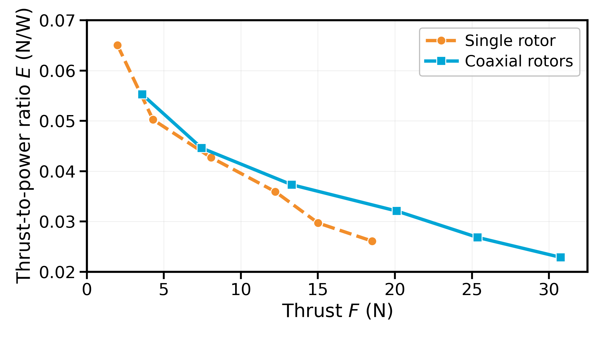

**图 2**：单旋翼与同轴双旋翼的推力—功率对比。

### 三、机电系统设计

本节介绍 FLOAT 无人机的机电系统设计，包括紧凑型同轴旋翼构型、基于控制面的侧向力生成机构、目标侧气流的力相匹配 CFD 评估、名义六自由度力和力矩生成原理，以及样机实现。

#### （一）紧凑高效的同轴旋翼构型

对于近距离物理交互任务，无人机的水平尺寸会直接影响其在狭窄空间中的机动性和可进入性。根据前期工作 [8] 中的紧凑性分析，旋翼布局的有效尺寸用其水平投影的最小外接面积进行评价。在车辆重量和悬停效率要求相同的条件下，把推进系统集中在同一根旋翼轴上，可以在传统多旋翼布局中获得最小的水平尺寸。因此，FLOAT 无人机采用单轴推进结构作为基础。

虽然单轴布局紧凑，但只使用一个旋翼会导致推力余量和载荷能力有限。因此，FLOAT 无人机采用同轴双旋翼构型，将两个旋翼沿同一轴线竖直叠放，在基本不增加水平尺寸的情况下提高推进性能。由于两个旋翼的水平投影几乎重合，同轴布局在保持单轴结构紧凑性的同时增加了可用推力。

为评价这一设计选择，作者对单旋翼单元和同轴双旋翼单元的推力—功率特性进行了实验测量。两项测试中，油门指令均从 20% 扫到 70%。推力—功率比定义为

```
E = T / Pe,                                                     (1)
```

其中，T 为产生的推力，Pe 为功耗。如图 2 所示，同轴双旋翼构型在目标工作点具有更高的推进效率。在样机约 18.1 N 的悬停推力下，其推力—功率比比单旋翼构型高 24%。此外，在相同的 70% 油门指令下，同轴双旋翼单元产生的最大推力高出 66%，能够提供更大的载荷余量。因此，同轴双旋翼布局在紧凑性、效率和推力能力之间取得了较好的平衡。


**图 3**：侧向力产生机制对比。(a) 欠驱动无人机通过机体倾斜产生侧向力；(b) 全驱倾转旋翼无人机通过改变旋翼推力方向产生侧向力；(c) FLOAT 无人机在旋翼尾流中利用控制面产生侧向力。

#### （二）基于控制面的侧向力生成

紧凑的同轴旋翼构型可以在较小的水平尺寸内提供竖直推力，但要独立产生侧向力仍需要增加其他机构。图 3 对比了三种代表性方法：欠驱动无人机的机体倾斜、全驱倾转旋翼无人机的旋翼推力转向，以及 FLOAT 无人机采用的基于控制面的机构。

FLOAT 无人机不倾斜机体或旋翼轴，而是把舵机驱动的控制面放置在旋翼尾流中。当控制面发生偏转时，高速下洗流会改变控制面周围的局部压力分布，并产生气动反作用力。其中的侧向分量形成水平力，竖直分量则会带来推力损失和气动耦合。

由于旋翼轴始终与机体竖直轴对齐，主尾流基本保持向下，侧向力通过控制面附近的局部尾流偏转产生。与倾转旋翼的推力矢量方法相比，这种机制预计可以减少吹向目标的侧向气流，但不能完全消除。下一小节将通过力相匹配的 CFD 仿真量化这一效果。

#### （三）目标侧气流的力相匹配 CFD 评估

为量化产生水平力时形成的侧向气流，作者对旋翼—控制面单元和倾转旋翼基线进行了力相匹配的 CFD 对比。两种单元使用相同的 8 英寸三叶桨。对于旋翼—控制面单元，尺寸为 200 mm × 100 mm × 2 mm 的控制面置于旋翼下洗流中，控制面中心位于旋翼轴线上、旋翼中心下方 100 mm 处。对于两种构型，均在距旋翼轴 120 mm 处设置一个与全局竖直轴平行的目标侧测量平面。

---

## 原文第 4 页核心内容与翻译

4

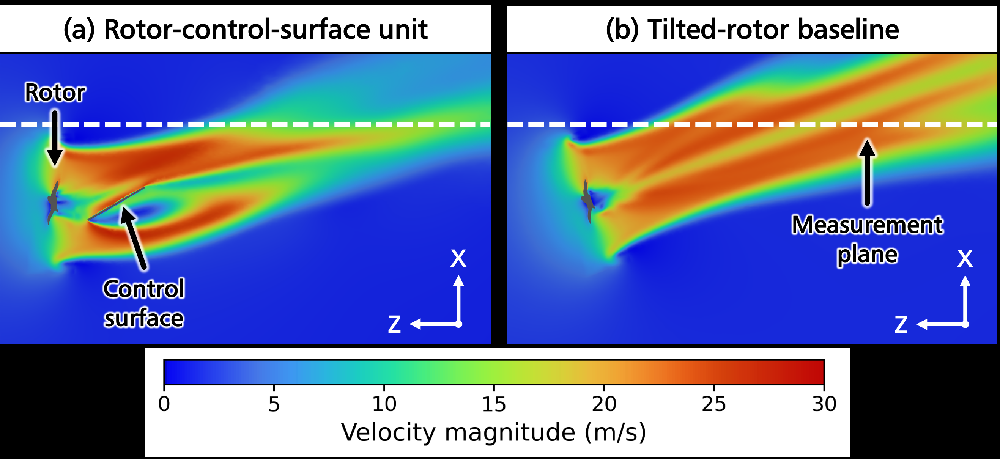

**图 4**：力相匹配 CFD 对比得到的速度大小云图。在 Fx/Fz = 0.35 条件下，(a) 为旋翼—控制面单元，(b) 为倾转旋翼基线。两幅图采用相同的色标和观察方向，虚线表示目标侧测量平面 Af。

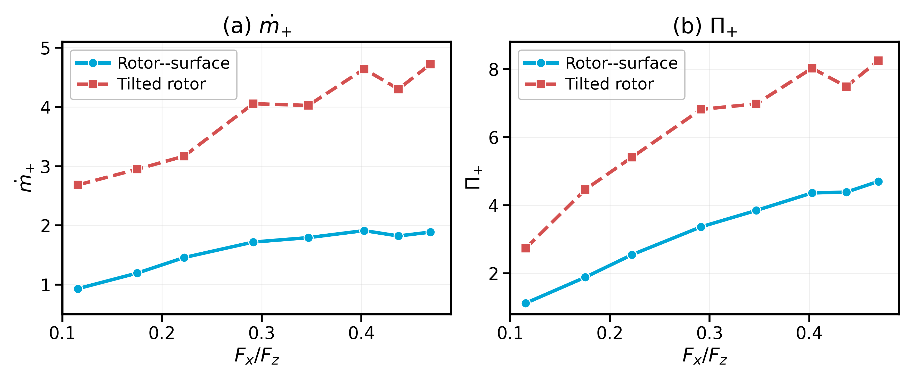

**图 5**：力相匹配 CFD 对比得到的目标侧气流指标。(a) 目标侧质量流量 ṁ+；(b) 正法向动量通量积分 Π+。

在旋翼—控制面单元中，旋翼转速固定为 10000 rpm，控制面偏转角 δ 从 0° 变化到 45°，步长为 5°。对于每个工况，均通过调整倾转旋翼基线的旋翼转速和倾角，使其产生的竖直力和侧向力与旋翼—控制面单元相匹配。最大力匹配误差小于 0.5%。

图 4 给出了 Fx/Fz = 0.35 条件下的代表性速度云图。在力相同的情况下，倾转旋翼基线会连同推力矢量一起改变主旋翼气流方向；旋翼—控制面单元则使主尾流保持更接近竖直向下，并通过控制面周围的局部尾流偏转产生侧向力。

设 Af 为目标侧测量平面，nf 为从无人机指向目标的单位法向量，vn = v·nf 为法向速度，v+n = max(vn, 0) 为朝向目标的法向速度分量。目标侧质量流量和相应的法向动量通量积分计算为

```
ṁ+ = ∫Af ρv+n dA,
Π+ = ∫Af ρ(v+n)^2 dA.                                          (2)
```

其中，ṁ+ 只计算指向目标的侧向气流；Π+ 表示该气流通过虚拟平面的正法向动量通量，不应解释为作用在实体目标上的气动力。

定量结果如图 5 所示。δ = 0° 和 5° 的工况对应几乎为零的侧向力，因此未列入汇总图。对于 δ = 10° 到 45° 的非零侧向力工况，旋翼—控制面单元的 ṁ+ 和 Π+ 始终低于倾转旋翼基线。平均而言，目标侧质量流量降低 58.5%，目标侧正法向动量通量积分降低 49.4%。这说明，在竖直力和侧向力相同的条件下，旋翼—控制面机构比倾转旋翼推力矢量方法产生更少的吹向目标的侧向气流。


**图 6**：FLOAT 无人机名义六自由度力和力矩生成原理。相同方向的侧向力形成合水平力；上下控制面产生相反方向的侧向力时，可利用竖直间距形成滚转或俯仰力矩。

#### （四）名义六自由度力和力矩生成机构

如图 6 所示，紧凑的同轴旋翼布局和基于控制面的侧向力生成机构共同构成了六自由度力和力矩生成的名义基础。FLOAT 无人机由两个反向旋转的同轴旋翼和四个舵机驱动的控制面组成，控制面分成上下两组，分别位于两个具有竖直间距的旋翼—控制面单元中。

同轴旋翼主要产生竖直力和偏航力矩：同时改变两个旋翼的转速可以调节总升力，差动改变转速可以调节绕机体 z 轴的合反作用力矩。控制面产生其余的水平力以及滚转、俯仰力矩。

对于每个水平力方向，上下控制面能够在相对于质心不同的高度产生侧向气动力。当上下控制面沿同一方向产生侧向力时，力矩贡献大致相互抵消，形成合侧向力；当两者沿相反方向产生侧向力时，力的贡献大致相互抵消，并通过竖直力臂形成滚转或俯仰力矩。因此，竖直分置控制面的同向偏转和差动偏转分别提供了对水平力以及滚转、俯仰力矩的名义控制。

总的来说，同轴旋翼负责名义上的 Fz 和 τz 控制，控制面负责名义上的 Fx、Fy、τx 和 τy 控制。这种安排使 FLOAT 无人机无需大幅倾斜机体或改变旋翼轴方向，就能产生六自由度力和力矩。需要指出的是，这只是名义上的生成机制；在实际运行中，所产生的力和力矩会受到推力损失、旋翼尾流变形以及旋翼与控制面之间气动耦合的影响。

---

## 原文第 5 页核心内容与翻译

5

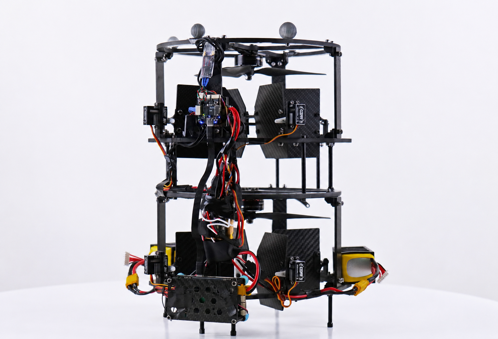

**图 7**：升级后的 FLOAT 无人机样机。

### 表 I  升级样机的主要硬件组成

| 部件 | 型号 |
|---|---|
| 螺旋桨 | HQProp 8045-3，8 英寸 |
| 电机 | T-MOTOR V3008 1350KV |
| 电调 | HAKRC 65A |
| 控制面舵机 | GDW DS290MG 数字舵机 |
| 电池 | GNB 6S 1300 mAh 160C LiPo |
| 飞行控制器 | NxtPX4v2 |
| 机载计算机 | NVIDIA Jetson Orin NX |

#### （五）高载荷样机实现

与前期样机 [8] 相比，本文实现了升级版 FLOAT 无人机平台，用于空中操作任务。这次重新设计的目的是在保留上述同轴旋翼—控制面构型的同时，为轻量级机械臂或夹爪等末端执行器提供更多载荷余量。样机如图 7 所示，主要硬件组成见表 I。

最终样机总质量约为 1.85 kg，整体尺寸为 265 mm × 310 mm × 340 mm，水平外接圆直径约为 312 mm。飞行测试测得的最大连续悬停时间为 225 s。以下各节的飞行和交互实验均使用该升级样机完成。

### 四、高保真气动建模与控制分配

图 6 所示的名义力和力矩生成机制说明了 FLOAT 无人机在原理上如何产生六自由度力和力矩。然而，由于控制面工作在同轴旋翼尾流内部，实际的执行器到力和力矩映射包含推力损失、控制面非线性气动力，以及旋翼与控制面之间的交叉耦合。本节首先介绍名义刚体动力学和线性分配基线，然后利用 CFD 分析气动耦合，根据力测量辨识高保真气动模型，最后将辨识模型嵌入基于非线性优化的控制分配器。

---

## 原文第 6 页核心内容与翻译

6

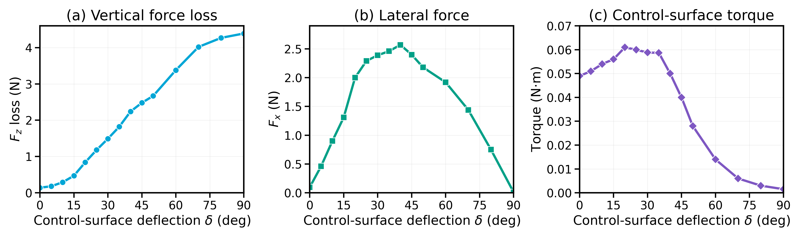

**图 8**：旋翼—控制面耦合的 CFD 分析。控制面偏转会产生侧向力、竖直力损失和控制面力矩。

#### （一）名义动力学和线性分配基线

设 FI 和 FB 分别表示惯性坐标系和机体固定坐标系。FLOAT 无人机的刚体动力学为

```
m p̈ = mg + R T_B,
J ω̇ = −ω × Jω + τ_B,                                           (3)
```

其中，g = [0, 0, −g]ᵀ 是在 FI 中表示的重力加速度向量，T_B 和 τ_B 是推进与控制面系统在机体系中产生的力和力矩。定义机体系中的气动力和力矩向量为

```
w = [T_Bᵀ, τ_Bᵀ]ᵀ.                                             (4)
```

线性分配基线采用由理想旋翼动量关系和小角度控制面升力近似推导的简化模型。模型假设旋翼推力负责控制 Fz 和 τz，控制面升力与控制面偏转角及局部下洗流速度成线性关系。在这些假设下，期望的力和力矩指令可以通过闭式线性分配器映射为执行器指令。完整的闭式分配方程见前期工作 [8]。但该模型忽略了推力损失、尾流变形以及旋翼—控制面交叉耦合，因此需要在下面辨识高保真模型。

#### （二）旋翼—控制面耦合的 CFD 分析

为说明控制面引入的气动耦合，作者使用 CFD 对一个代表性的单旋翼—单控制面单元进行了分析。设置与第三节 C 小节的力相匹配 CFD 研究类似。分析中，旋翼转速固定为 10000 rpm，产生约 10 N 推力和 −0.15 N·m 的旋翼力矩，控制面偏转角从 0° 扫描到 90°。分析重点是控制面本身产生的力和力矩。

如图 8 所示，控制面产生的侧向力随偏转角呈非线性变化。在小偏转角和中等偏转角范围内，侧向力随偏转角增加；在约 40° 附近达到最大值；偏转角进一步增大后，侧向力反而下降。同时，控制面会产生一个与旋翼推力方向相反的竖直力分量，表现为推力损失，并且推力损失随偏转角增加而增大。相应的控制面力矩也随偏转角发生变化。这些结果表明，基于控制面的侧向力生成与竖直推力损失、控制面力矩变化相互耦合。

---

## 原文第 7 页核心内容与翻译

7

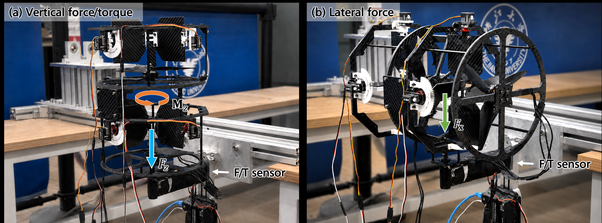

**图 9**：用于辨识气动模型的静态力测量装置。(a) 竖直力和偏航力矩测量；(b) 将测试单元重新调整方向，使产生的力与传感器轴线对齐后进行侧向力测量。

#### （三）高保真气动力和力矩模型辨识

为获得可用于实时非线性分配的执行器—力和力矩模型，作者根据图 9 所示的静态力测量数据辨识高保真气动模型。电机油门指令在 40%–60% 范围内采样，控制面偏转角在 0°–45° 范围内采样，覆盖 FLOAT 无人机的主要工作区域。

令 u = [η1, η2, θ1, θ2, δ1, δ2]ᵀ 表示执行器指令向量，其中 η1 和 η2 为上下旋翼油门指令，θi 和 δi 为控制面偏转角。气动力和力矩建模为

```
ŵaero(u) = [F̂x, F̂y, F̂z, τ̂x, τ̂y, τ̂z]ᵀ,                  (5)
ŵi(u) = Σ(k=1…Mi) cik ϕk(u),  i = 1, …, 6.                   (6)
```

其中，ϕk(u) 表示多项式基函数。完成拟合后删除不重要的项，以降低在线优化的计算量。

针对 Fz 和 τz，作者在上述执行范围内采集约 600 组稳态样本，以描述控制面偏转造成的竖直力损失，以及控制面对竖直轴力矩的影响。对于水平力模型，实验只辨识 x 轴方向的力，y 轴方向的对应结果根据车辆的几何对称性获得。

由于力传感器测量的是总水平力，作者采用差动测量方法分离上下控制面的贡献。在下控制面保持不变的情况下，反转上控制面偏转角，得到两次测量值 F+x 和 F−x。根据近似的奇对称关系 F(δ) ≈ −F(−δ)，上下控制面的力估计为

```
Fᵘx ≈ (F+x − F−x) / 2,
Fˡx ≈ (F+x + F−x) / 2.                                        (7)
```

随后，分别为竖直力、偏航力矩以及分离后的水平力分量拟合多项式模型。对应的滚转和俯仰力矩，根据分离得到的上下控制面侧向力及其竖直力臂，按照名义力和力矩生成几何关系计算。图 10 给出了测量值与预测值的对比。在测试工作范围内，辨识模型的 R² 均大于 0.93，说明模型已经捕捉到主要的非线性气动耦合。完整模型由这些辨识分量与第三节所述结构组合而成，并作为下一节非线性控制分配器中的预测模型。

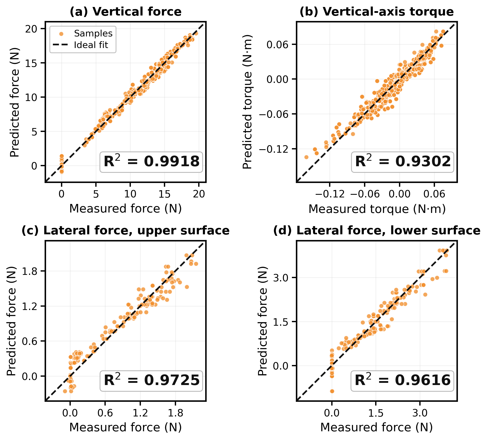

**图 10**：辨识气动力和力矩模型的测量值与预测值对比。(a) 竖直力；(b) 竖直轴力矩；(c) 上控制面侧向力；(d) 下控制面侧向力。

#### （四）基于模型的非线性控制分配

辨识出的模型提供了从执行器指令到六自由度力和力矩的非线性映射。因此，上层控制器给出的期望力和力矩不能再通过闭式线性混控器准确分配，而应将控制分配表述为带约束的非线性最小二乘问题。令 wc = [Tᵀc, τᵀc]ᵀ 为上层控制器提供的期望机体系力和力矩指令，ŵaero(u) 为辨识模型，则最优执行器指令为

```
u* = arg min_u ||ŵaero(u) − wc||²₂
s.t.  umin ≤ u ≤ umax.                                         (8)
```

其中，umin 和 umax 定义允许的执行器范围。该优化问题使用 CasADi [29] 实现，并采用 IPOPT [30] 求解。为保证实时运行，分配器使用经过删减的二阶气动模型；求解器被生成为 C 代码，并集成到 C++ 飞行控制程序中。每个控制周期都使用上一次的解作为热启动初值。

---

## 原文第 8 页核心内容与翻译

8

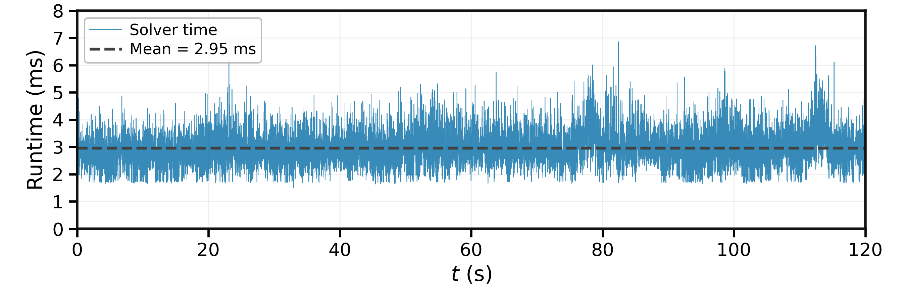

**图 11**：飞行实验中非线性控制分配器的运行时间。

在 100 Hz 控制回路的飞行实验中评估分配器的运行时间。如图 11 所示，平均求解时间为 2.95 ms，最大求解时间为 6.86 ms，说明在本次飞行实验中，非线性分配器满足 100 Hz 控制频率要求。

### 五、几何 L1 自适应控制

本节介绍 FLOAT 无人机的闭环控制架构。如图 12 所示，控制器由基于 SE(3) 的几何控制器、L1 自适应增强模块和第四节 D 小节设计的非线性控制分配器组成。几何控制器生成用于轨迹和姿态跟踪的名义力和力矩指令。L1 自适应模块估计等效集总扰动，并提供经过滤波的补偿力和力矩。补偿后的力和力矩指令再由非线性分配器转换为执行器指令。

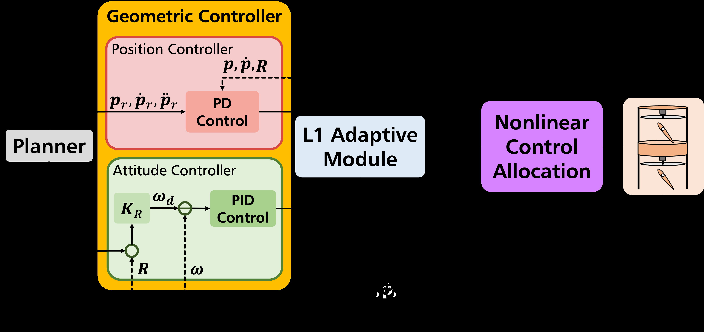

**图 12**：结合几何控制和 L1 自适应补偿的闭环控制架构。几何控制器生成名义指令，L1 模块估计并滤波扰动补偿，非线性控制分配器将补偿后的力和力矩映射为执行器指令。

#### （一）名义 SE(3) 几何控制

名义控制器由位置控制器和姿态控制器组成。由于 FLOAT 无人机能够指令三轴力和三轴力矩，因此平移和转动指令在力和力矩层面分别计算，其通过旋翼和控制面的耦合实现由非线性控制分配器负责。

令 p、ṗ、R 和 ω 分别表示无人机的位置、速度、姿态和机体角速度，参考轨迹由 pr、ṗr 和 p̈r 给出。期望加速度和期望机体系力指令分别为

```
p̈d = p̈r + Kv(ṗr + Kp(pr − p) − ṗ),                          (9)
Td = mRT(p̈d − g).                                               (10)
```

其中，Kp 和 Kv 为正定增益矩阵，m 为飞行器质量，g = [0, 0, −g]ᵀ 为重力加速度向量。SO(3) 上的姿态误差定义为

```
Re = 1/2 (RTr R − RT Rr)∨,                                      (11)
```

其中，Rr 为期望姿态，(·)∨ 表示从 so(3) 到 R³ 的 vee 映射。根据姿态误差生成期望角速度 ωd = KRRe，其中 KR 为姿态增益矩阵；角速度误差为 ωe = ωd − ω。名义力矩指令由 PID 控制器产生：

```
τd = KP,ωωe + KI,ω ∫ωe dt + KD,ω ω̇e,                           (12)
wd = [Tᵀd, τᵀd]ᵀ.                                               (13)
```

#### （二）L1 自适应扰动补偿

虽然非线性分配器提高了力和力矩跟踪精度，但飞行和物理交互过程中仍然存在剩余建模误差和外部扰动，例如地面效应、载荷变化以及接触引起的力。因此，在名义几何控制器上增加 L1 自适应模块，用于估计等效集总扰动并生成经过滤波的补偿力和力矩。

L1 模块的输入包括几何控制器给出的名义指令 wd、当前姿态 R，以及速度状态 z = [ṗᵀ, ωᵀ]ᵀ，其中 ṗ 和 ω 由机载状态估计器获得。ż 包含平移和角加速度，只用于动力学模型，而不是作为测量输入。系统动力学写成带匹配不确定性的形式：

```
ż = f(z) + B(R)(wc + σ),                                      (14)
f(z) = [ g ; −J⁻¹(ω × Jω) ],
B(R) = [ m⁻¹R  0₃×₃ ; 0₃×₃  J⁻¹ ].                            (15)
```

其中，wc 是发送给分配器的补偿后力和力矩指令，σ 是机体系力和力矩通道中的等效集总扰动。B(R) 将机体系力和力矩映射为相应的线性和角加速度，因此外力、载荷变化、剩余分配误差及未建模气动效应都表示为等效扰动力和力矩。

---

## 原文第 9 页核心内容与翻译

9

L1 模块维护一个内部预测状态 ẑ。该状态不是直接测量得到的，而是由预测器在线传播：

```
ẑ̇ = f(z) + B(R)(wc + σ̂) + As(ẑ − z),                         (16)
```

其中，σ̂ 为估计的等效扰动，As 为 Hurwitz 矩阵。预测误差定义为 z̃ = ẑ − z。如果扰动估计准确，预测状态应当接近测量状态，因此使用 z̃ 更新 σ̂。

采用分段常值自适应律。在 t ∈ [iTs, (i + 1)Ts) 内，扰动估计保持不变，即 σ̂(t) = σ̂(iTs)，其中

```
σ̂(iTs) = −G(R(iTs)) Φ⁻¹ μ(iTs),
G(R) = B⁻¹(R),
μ(iTs) = e^(AsTs) z̃(iTs),
Φ = As⁻¹(e^(AsTs) − I).                                        (17)(18)
```

该更新律先把预测误差转换为一个自适应区间内的等效加速度失配，再通过 G(R) 将其映射回机体系力和力矩空间。这样，σ̂ 就能估计出最能解释预测运动与实测运动之间差异的扰动力和力矩。

扰动估计值不会直接作为控制指令使用，而是先经过低通滤波器，生成带宽受限的补偿力和力矩：

```
wL1(s) = −C(s)σ̂(s),                                             (19)
wc = wd + wL1 = wd − C(s)σ̂(s).                                (20)
```

其中，C(s) 是满足 C(0) = I 的对角低通滤波器。负号表示补偿力和力矩的方向与估计扰动相反。在具体实现中，L1 模块读取 z 和 R，将内部传播状态 ẑ 与测量状态比较，根据式（17）估计 σ̂，滤波得到 wL1，再把补偿后的 wc 发送给非线性控制分配器。

### 六、实验

本节从侧向力能力、非线性气动分配模型、L1 扰动补偿和物理交互能力四个方面对集成系统进行实验验证。

#### （一）实验设置

所有实验均在室内动作捕捉环境中，使用第三节 E 小节介绍的升级样机完成。机载状态估计器融合 IMU 和动作捕捉测量，控制器在机载计算机上以 100 Hz 运行。在适用情况下，对比四种控制器配置：线性控制分配（LCA）、采用 LCA 的 L1 自适应控制（L1-LCA）、非线性控制分配（NLCA），以及结合 L1 自适应控制和 NLCA 的本文方法。每项对比实验使用同一架飞行器、相同的执行器限制和相同的反馈增益。

#### （二）侧向力特性测量

侧向力能力通过系留力测量装置进行评价。FLOAT 无人机在滚转和俯仰指令均为零的情况下悬停，并逐步改变位置使系留绳张紧。如图 13 所示，最大系留力达到 5.42 N。以 1.85 kg 的测试质量计算，这相当于飞行器重量的 30%。欠驱动多旋翼若要产生相同侧向力，约需要使机体倾斜 17°；而 FLOAT 无人机实测的滚转和俯仰角均小于 2.3°。

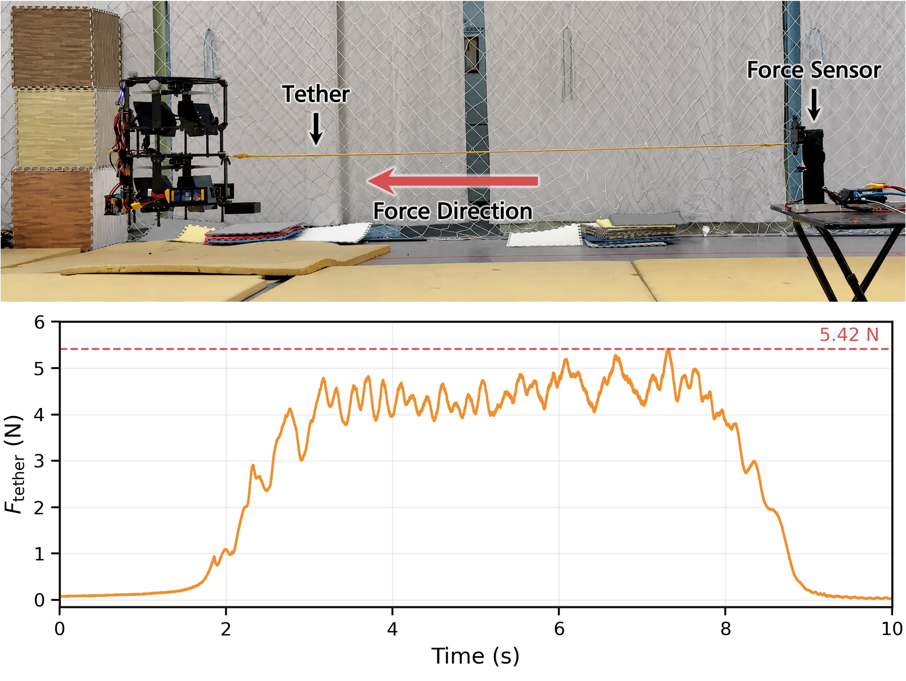

**图 13**：零滚转和俯仰指令下的系留侧向力测量。上图为系留绳和力传感器装置，下图为测得的系留力。

#### （三）建模和控制分配验证

1）三维轨迹跟踪：FLOAT 无人机被指令跟踪一个平移运动与偏航运动耦合的空间 8 字轨迹。最大平移速度和加速度分别为 1 m/s 和 0.51 m/s²。图 14 给出了俯视轨迹和竖直方向误差响应，表 II 表明，L1 补偿明显降低了竖直跟踪误差，本文提出的 NLCA+L1 控制器获得了最低的位置均方根误差、姿态均方根误差和最大 z 轴误差。

2）悬停姿态转换：为测试大姿态全驱飞行，FLOAT 无人机保持位置不变，同时将期望俯仰角在 +20° 和 −20° 之间切换。如图 15 和表 II 所示，所有控制器都能跟踪俯仰指令；但 NLCA 显著降低了大姿态转换带来的高度偏差，本文控制器进一步抑制了剩余稳态误差。

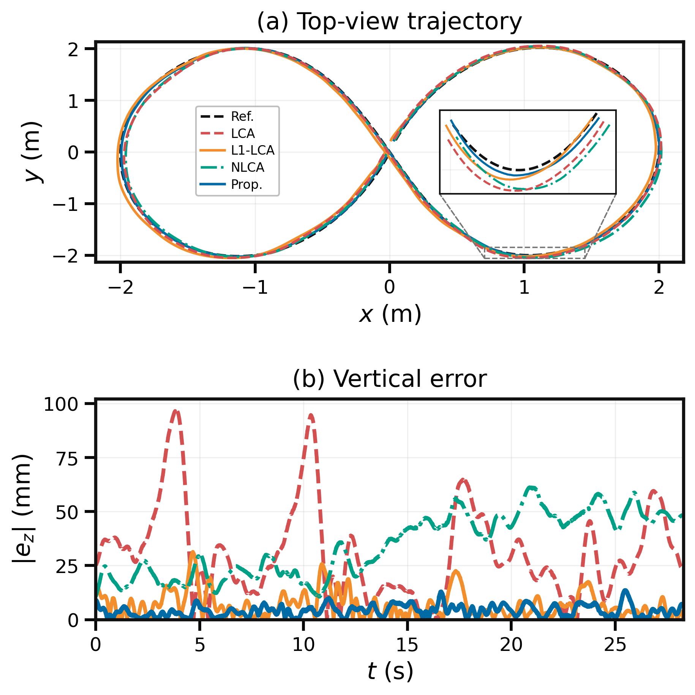

**图 14**：三维轨迹跟踪。(a) 带局部放大的俯视轨迹；(b) 同一条轨迹跟踪过程中的竖直方向误差。

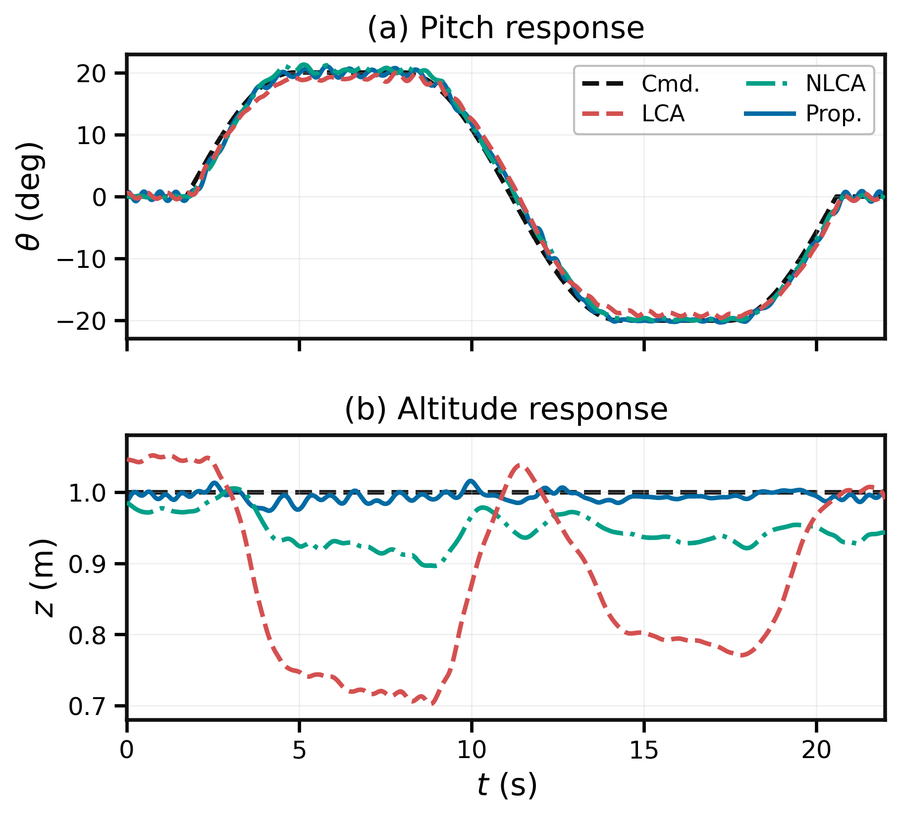

**图 15**：悬停姿态转换测试。(a) 指令为 ±20° 转换时的俯仰响应；(b) 同一机动过程中的高度响应。

---

## 原文第 10 页核心内容与翻译

10

#### （四）扰动和不确定性下的鲁棒性

1）地面效应扰动测试：作者在 0.5 m/s 的桌面越飞测试中，将本文方法与单独使用 NLCA 的方法进行对比。飞行器中心的指令高度为 1.0 m，机体底部与桌面之间仅约有 50 mm 间隙，因此会产生明显的地面效应扰动。如图 16 所示，本文方法将桌面区域内的最大 z 轴误差从 25.2 mm 降低到 15.0 mm，将恢复时间从 2.61 s 缩短到 1.02 s，并将稳态 z 轴误差从 −23.0 mm 降低到 −4.27 mm。

2）突加载荷连接测试：通过磁性方式向悬停中的飞行器连接 100 g 和 200 g 载荷，评价其对突加载荷变化的鲁棒性。表 III 给出了连接载荷后的性能。对于 100 g 载荷，所有配置都完成了测试，但两种带 L1 的控制器产生的位置和姿态误差明显更小。对于 200 g 载荷，不带自适应补偿的 LCA 和 NLCA 均测试失败，而 L1-LCA 和本文方法保持了稳定飞行。图 17 给出了具有代表性的 200 g 响应，展示了恢复过程。相对于 L1-LCA，本文方法将最大 z 轴误差从 122.0 mm 降低到 34.7 mm，说明自适应扰动抑制与非线性力和力矩分配具有互补作用。

3）长时间悬停中的稳态误差抑制：使用 2 min 悬停片段，评价执行器—模型失配缓慢变化时的稳态误差抑制能力。如图 18 所示，本文控制器将平均高度误差从 −55.1 mm 降低到 −3.33 mm，并明显抑制了长期漂移，同时没有降低悬停稳定性。

#### （五）抽屉操作演示

最后，作者使用图 1 所示的侧置三维打印挂钩完成抽屉推拉操作测试。把手与抽屉面板之间的间隙只有 2 cm，因此要求无人机具有较高的插入和近距离定位精度。飞行器插入挂钩，拉开抽屉，再将其推回关闭，同时保持滚转和俯仰指令为零。

在整个任务中，最大姿态偏差为 3.41°，偏离轴线的跟踪误差保持在 12.2 mm 以内。结果表明，FLOAT 无人机无需大幅倾斜机体，就能在 2 cm 把手间隙条件下保持近距离定位精度，完成双向抽屉操作。

### 表 II 轨迹跟踪与姿态转换性能

| 控制器 | 位置均方根误差（mm） | 姿态均方根误差（°） | 最大 |ez|（mm） |
|---|---:|---:|---:|
| **三维轨迹跟踪** |  |  |  |
| LCA | 49.7 | 3.39 | 97.3 |
| L1-LCA | 16.2 | 2.97 | 31.4 |
| NLCA | 46.7 | 3.11 | 61.2 |
| 本文方法 | 13.8 | 2.91 | 13.5 |
| **悬停姿态转换** |  |  |  |
| LCA | 180.2 | 1.40 | 297.6 |
| NLCA | 65.4 | 1.07 | 103.6 |
| 本文方法 | 11.0 | 1.00 | 26.0 |

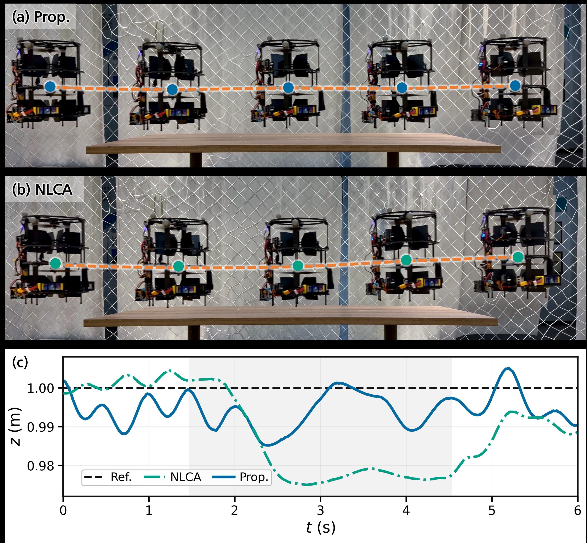

**图 16**：地面效应扰动测试。(a) 使用本文控制器越过桌面的过程；(b) 使用 NLCA 越过桌面的过程；(c) 高度响应，阴影区域表示越桌过程。

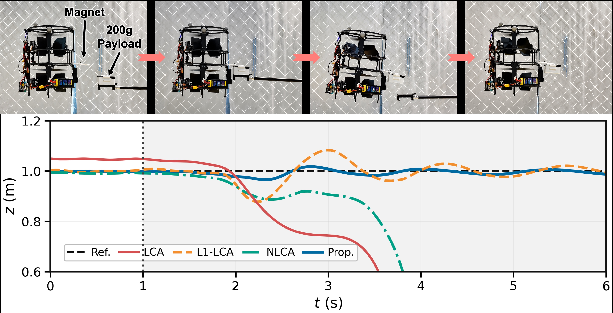

**图 17**：代表性的 200 g 突加载荷响应。快照展示磁性载荷连接过程，竖线标出连接时刻，阴影区域表示连接载荷后的时间段。

### 表 III 突加载荷连接性能

| 载荷 | 控制器 | 状态 | 位置均方根误差（mm） | z 轴均方根误差（mm） | 最大 |ez|（mm） | 姿态均方根误差（°） |
|---|---|---|---:|---:|---:|---:|
| 100 g | LCA | 成功 | 35.9 | 24.9 | 76.9 | 2.68 |
| 100 g | L1-LCA | 成功 | 8.85 | 7.48 | 32.4 | 0.743 |
| 100 g | NLCA | 成功 | 50.4 | 45.9 | 53.3 | 1.97 |
| 100 g | 本文方法 | 成功 | 8.23 | 6.40 | 18.9 | 0.557 |
| 200 g | LCA | 失败 | — | — | — | — |
| 200 g | L1-LCA | 成功 | 38.1 | 36.5 | 122.0 | 2.96 |
| 200 g | NLCA | 失败 | — | — | — | — |
| 200 g | 本文方法 | 成功 | 13.4 | 11.9 | 34.7 | 1.59 |

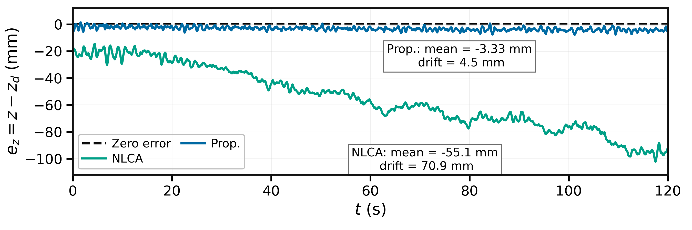

**图 18**：长时间悬停中的稳态高度误差抑制，其中 ez = z − zd。

### 七、结论

本文提出了 FLOAT 无人机：一种利用舵机驱动控制面产生六自由度力和力矩，并减少吹向目标的侧向气流的全驱同轴无人机。力相匹配 CFD、精密力和力矩建模、非线性分配以及几何 L1 自适应控制共同验证了其气流优势、轨迹跟踪和姿态转换性能、抗扰能力，以及在 2 cm 把手间隙下完成抽屉推拉的能力。

总体而言，这项工作为近距离空中物理交互提供了一个完整的系统级解决方案。当前局限在于，演示操作依赖简单的侧置挂钩，且实验在受控室内条件下完成，尚未使用通用末端执行器，也未实现完全自主的任务执行。后续工作将把轻量化模块式末端执行器与无人机集成起来，根据平台可提供的力和力矩能力共同设计末端执行器的质量与安装几何，并在基于动作捕捉的实验之外，验证目标定位插入、拉动、推动和抓取等任务。

---

## 原文第 11 页核心内容与翻译

11

本页为参考文献和作者信息。按照翻译要求，论文题名、作者姓名、机构名称、算法名称、引用编号和出版信息保留英文原文。

### 参考文献

[1] B. Zhou, H. Xu, and S. Shen, “Racer: Rapid collaborative exploration with a decentralized multi-uav system,” IEEE Transactions on Robotics, vol. 39, no. 3, pp. 1816–1835, 2023.

[2] E. Aucone, S. Kirchgeorg, A. Valentini, L. Pellissier, K. Deiner, and S. Mintchev, “Drone-assisted collection of environmental DNA from tree branches for biodiversity monitoring,” Science Robotics, vol. 8, no. 74, p. eadd5762, 2023.

[3] Y. Wu, F. Yang, R. Jin, Y. Zhong, J. Wang, X. Wu, and F. Gao, “Hand-like autonomous flying robot for airborne grasping and interaction,” Nature Communications, 2026.

[4] R. Jin, X. Xu, Y. Yang, J. Li, M. Cao, and L. Xie, “Tethered UAV autonomous knotting on environmental structures for transport,” Cyborg and Bionic Systems, vol. 6, p. 0450, 2025.

[5] T. Wu, G. Xu, Z. Wang, J. Lin, T. Chen, Y. Wu, Z. Han, Z. Liu, and F. Gao, “Precise aggressive aerial maneuvers with sensorimotor policies,” Science Robotics, vol. 11, no. 115, p. eaeb0180, 2026.

[6] G. He, X. Guo, L. Tang, Y. Zhang, M. Mousaei, J. Xu, J. Geng, S. Scherer, and G. Shi, “Flying Hand: End-Effector-Centric Framework for Versatile Aerial Manipulation Teleoperation and Policy Learning,” Proceedings of Robotics: Science and Systems, Los Angeles, CA, USA, June 2025.

[7] K. Bodie, M. Brunner, M. Pantic, S. Walser, P. Pfänd ler, U. Angst, R. Siegwart, and J. Nieto, “Active interaction force control for contact-based inspection with a fully actuated aerial vehicle,” IEEE Transactions on Robotics, vol. 37, no. 3, pp. 709–722, 2021.

[8] J. Lin, S. Ji, Y. Wu, T. Wu, Z. Han, and F. Gao, “Float drone: A fully-actuated coaxial aerial robot for close-proximity operations,” 2025 IEEE/RSJ International Conference on Intelligent Robots and Systems (IROS), 2025, pp. 7216–7223.

[9] R. Rashad, J. Goerres, R. Aarts, J. B. C. Engelen, and S. Stramigioli, “Fully actuated multirotor UAVs: A literature review,” IEEE Robotics & Automation Magazine, vol. 27, no. 3, pp. 97–107, 2020.

[10] S. Rajappa, M. Ryll, H. H. Bülthoff, and A. Franchi, “Modeling, control and design optimization for a fully-actuated hexarotor aerial vehicle with tilted propellers,” 2015 IEEE International Conference on Robotics and Automation (ICRA), 2015, pp. 4006–4013.

[11] D. Brescianini and R. D’Andrea, “Design, modeling and control of an omni-directional aerial vehicle,” 2016 IEEE International Conference on Robotics and Automation (ICRA), 2016, pp. 3261–3266.

[12] S. Park, J. Lee, J. Ahn, J. Kim, J. Her, G.-H. Yang, and D. Lee, “ODAR: Aerial manipulation platform enabling omnidirectional wrench generation,” IEEE/ASME Transactions on Mechatronics, vol. 23, no. 4, pp. 1907–1918, 2018.

[13] M. Ryll, H. H. Bülthoff, and P. R. Giordano, “A novel overactuated quadrotor unmanned aerial vehicle: Modeling, control, and experimental validation,” IEEE Transactions on Control Systems Technology, vol. 23, no. 2, pp. 540–556, 2015.

[14] P. Zheng, X. Tan, B. B. Kocer, E. Yang, and M. Kovac, “TiltDrone: A fully-actuated tilting quadrotor platform,” IEEE Robotics and Automation Letters, vol. 5, no. 4, pp. 6845–6852, 2020.

[15] M. Kamel, S. Verling, O. Elkhatib, C. Sprecher, P. Wulkop, Z. Taylor, R. Siegwart, and I. Gilitschenski, “The Voliro omniorientational hexacopter: An agile and maneuverable tiltable-rotor aerial vehicle,” IEEE Robotics & Automation Magazine, vol. 25, no. 4, pp. 34–44, 2018.

[16] M. Allenspach, K. Bodie, M. Brunner, L. Rinsoz, Z. Taylor, M. Kamel, R. Siegwart, and J. Nieto, “Design and optimal control of a tiltrotor micro-aerial vehicle for efficient omnidirectional flight,” The International Journal of Robotics Research, vol. 39, no. 10–11, pp. 1305–1325, 2020.

[17] R. Guan, R. Xing, N. Hao, F. He, H. Luo, and Y. Yao, “A novel coaxial dual-propeller omnidirectional tiltrotor aircraft: Design and control,” IEEE Transactions on Industrial Electronics, 2025.

[18] T. Lee, M. Leok, and N. H. McClamroch, “Geometric tracking control of a quadrotor UAV on SE(3),” 49th IEEE Conference on Decision and Control (CDC), 2010, pp. 5420–5425.

[19] D. Mellinger and V. Kumar, “Minimum snap trajectory generation and control for quadrotors,” 2011 IEEE International Conference on Robotics and Automation, 2011, pp. 2520–2525.

[20] K. Bodie, M. Brunner, M. Pantic, M. Walser, P. Pfänd ler, U. Angst, R. Siegwart, and J. Nieto, “Active interaction force control for contact-based inspection with a fully actuated aerial vehicle,” IEEE Transactions on Robotics, vol. 37, no. 3, pp. 709–722, 2021.

[21] G. He, Y. Jangir, J. Geng, M. Mousaei, D. Bai, and S. Scherer, “Image-based visual servo control for aerial manipulation using a fully-actuated UAV,” 2023 IEEE/RSJ International Conference on Intelligent Robots and Systems (IROS), 2023, pp. 5042–5049.

[22] W.-H. Chen, J. Yang, L. Guo, and S. Li, “Disturbance-observer-based control and related methods—an overview,” IEEE Transactions on Industrial Electronics, vol. 63, no. 2, pp. 1083–1095, 2016.

[23] A. Castillo, R. Sanz, P. Garcia, W. Qiu, H. Wang, and C. Xu, “Disturbance observer-based quadrotor attitude tracking control for aggressive maneuvers,” Control Engineering Practice, vol. 82, pp. 14–23, 2019.

[24] H. Chen, B. Ye, X. Liang, W. Deng, and X. Lyu, “NDOB-based control of a UAV with delta-arm considering manipulator dynamics,” 2025 IEEE International Conference on Robotics and Automation (ICRA), 2025, pp. 7505–7511.

[25] E. Tal and S. Karaman, “Accurate tracking of aggressive quadrotor trajectories using incremental nonlinear dynamic inversion and differential flatness,” IEEE Transactions on Control Systems Technology, vol. 29, no. 3, pp. 1203–1218, 2020.

[26] S. Sun, A. Romero, P. Foehn, E. Kaufmann, and D. Scaramuzza, “A comparative study of nonlinear MPC and differential-flatness-based control for quadrotor agile flight,” IEEE Transactions on Robotics, vol. 38, no. 6, pp. 3357–3373, 2022.

[27] J. Pan, J. Xing, R. Reiter, Y. Zhai, E. Aljalbout, and D. Scaramuzza, “Learning on the fly: Rapid policy adaptation via differentiable simulation,” IEEE Robotics and Automation Letters, 2026.

[28] Z. Wu, S. Cheng, P. Zhao, A. Gahlawat, K. A. Ackerman, A. Lakshmanan, C. Yang, J. Yu, and N. Hovakimyan, “L1Quad: L1 adaptive augmentation of geometric control for agile quadrotors with performance guarantees,” IEEE Transactions on Control Systems Technology, vol. 33, no. 2, pp. 597–612, 2025.

[29] J. A. E. Andersson, J. Gillis, G. Horn, J. B. Rawlings, and M. Diehl, “CasADi—A software framework for nonlinear optimization and optimal control,” Mathematical Programming Computation, vol. 11, no. 1, pp. 1–36, 2019.

[30] A. Wächter and L. T. Biegler, “On the implementation of an interior-point filter line-search algorithm for large-scale nonlinear programming,” Mathematical Programming, vol. 106, no. 1, pp. 25–57, 2006.

Junxiao Lin received the M.S. degree in control engineering from Zhejiang University, Hangzhou, China, in 2026.

His research interests include robot system design and motion control.

Kehan Zhou is currently pursuing the B.Eng. degree in automation with the College of Control Science and Engineering and Chu Kochen Honors College, Zhejiang University.

