# Skater空地双模态双旋翼机器人（25_Skater_Bi-Modal_Bi-Copter_Robot）：完整忠实学术翻译

> **原文标题**：25_Skater_Bi-Modal_Bi-Copter_Robot  
> **作者**：Junxiao Lin、Ruibin Zhang、Neng Pan、Chao Xu、Fei Gao  
> **发表信息**：arXiv:2403.01991v2，2024-05-26  
> **原文 PDF**：[25_Skater_Bi-Modal_Bi-Copter_Robot.pdf](../25_Skater_Bi-Modal_Bi-Copter_Robot.pdf) ｜ **对应中文详解**：[25_Skater空地双模态双旋翼机器人.md](../中文详解/25_Skater空地双模态双旋翼机器人.md)  

---

## 原文第 1 页核心内容与翻译

Skater：一种适应空中和多种地形运动的新型空地双旋翼机器人
Junxiao Lin2,3, Ruibin Zhang1,2, Neng Pan1,2, Chao Xu1,2, and Fei Gao1,2
摘要——本文提出一种名为 Skater 的新型空地双模态双旋翼机器人，可适应空中运动和多种地面。Skater 由一架沿纵向运动的双旋翼飞行器和两侧的两个被动轮组成。纵向布置的双旋翼同时作为空中和地面模式的统一执行系统，使机器人保持结构简洁、重量较轻，同时具有较强的地形通过能力和转向能力。此外，利用双旋翼的矢量推力特性，Skater 能主动产生转向所需的向心力，因此即使在湿滑地面上也能稳定运动。本文进一步建立 Skater 的完整动力学模型，分析其微分平坦性，并提出用于轨迹跟踪的非线性模型预测控制器。大量真实环境实验和基准对比验证了该系统的性能。
一、引言
近年来，空地机器人在学术界 [1]–[4] 和工业界 [5]–[7] 均取得了较好的研究成果。空地机器人将飞行机构与地面行驶机构结合起来，能够在不同环境之间转换运动方式，因此相较于单一飞行机器人或地面机器人具有明显优势。然而，将两种运动方式集成到同一台样机中，也给空地机器人的设计带来了很大挑战。首先，行驶机构增加的重量会缩短飞行续航时间，进而限制可选的行驶机构。其次，能够托举整机的飞行机构可能显著增大机器人尺寸，从而限制其在狭窄环境中的应用。总的来说，如果设计不合理，空地机器人在两种运动方式下的机动能力都可能不如相应的单模态机器人。

为解决这一问题，研究人员提出了多种空地机器人构型，涵盖飞行机构与地面行驶机构的不同组合。首先，在飞行能力方面，多旋翼凭借垂直起降能力成为常见选择。其中，四旋翼由于结构紧凑、动力学简单而得到广泛应用 [1, 2, 4]。但是，四个旋翼呈环形布置，会明显增大整机尺寸，而且其转向能力受到限制。
1Institute of Cyber-Systems and Control, College of Control Science and
Engineering, Zhejiang University, Hangzhou 310027, China.
2Huzhou Institute, Zhejiang University, Huzhou 313000, China.
3Polytechnic Institute, Zhejiang University, Hangzhou 310015, China.
Corresponding Author: Fei Gao
E-mail:{jxlin, fgaoaa}@zju.edu.cn

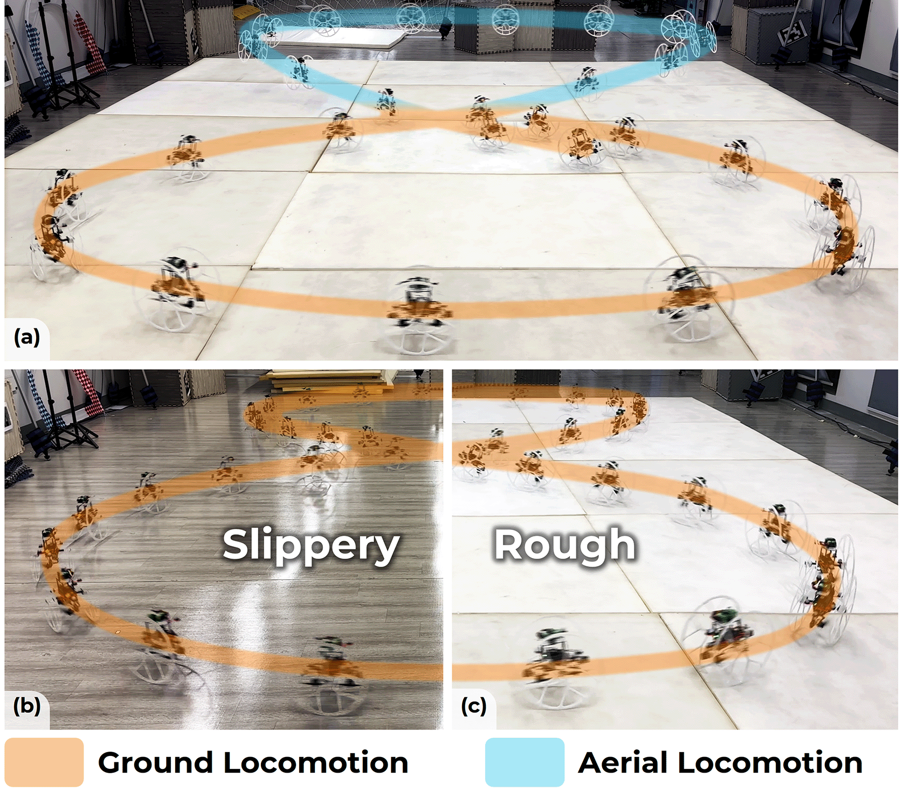

**图 1**：真实环境中的轨迹跟踪实验。(a) 空地混合运动轨迹跟踪实验照片。(b) 湿滑地面上的轨迹跟踪实验照片。(c) 粗糙地面上的轨迹跟踪实验照片。

四旋翼的转向能力受到相对较小的旋翼力矩限制。相比之下，双旋翼具有两个旋翼和用于倾转旋翼的舵机，能够利用旋翼推力产生转向力矩，其通常比旋翼反扭矩大一个数量级。这种更大的转向力矩解决了四旋翼转向能力有限的问题。不过，横向布置的双旋翼仍然具有较大的通过宽度 [3, 8]。通过第三节的综合分析可以看出，在常见的多旋翼构型中，沿纵向运动的双旋翼具有最小的通过宽度和更强的转向能力。因此，本文的飞行机构采用纵向布置的双旋翼。

在地面运动方面，轮式机构因结构简洁、重量较轻，被广泛用于空地机器人 [3, 9]–[12]。轮式机构主要分为主动轮和被动轮两类。主动轮机器人通过在机体上安装驱动轮实现类似汽车的运动 [3, 9]；被动轮机器人则利用旋翼推力驱动被动机构 [10]–[12]。大多数主动轮机器人在粗糙地面上具有良好的机动性，但在地面无法提供足够摩擦力的湿滑表面上容易打滑。为实现对不同地面的适应性运动，本文选择由旋翼推力驱动的被动轮方案。

---

## 原文第 2 页核心内容与翻译

大多数被动轮机器人能够提供前进和后退所需的纵向加速度，却不能产生转向所需的向心力，这限制了它们在湿滑地面上的应用。纵向布置的双旋翼具有矢量推力特性，能够同时产生纵向和侧向加速度，因此即使在湿滑地面上也能保持稳定、有效的运动。

基于上述分析，本文提出如图 2 所示的空地双模态双旋翼机器人 Skater。Skater 使用纵向布置的双旋翼获得飞行能力和良好的地形通过能力，并在机体两侧安装两个被动轮。空中和地面模式共用同一套执行系统，这既使结构紧凑、重量较轻，也赋予机器人较强的转向能力和主动产生向心力的能力，从而能够在粗糙或湿滑等不同地面上运动。

为充分发挥机器人的运动性能，本文建立完整的 Skater 动力学模型，分析其微分平坦性，并提出用于轨迹跟踪的非线性模型预测控制器（NMPC）。通过大量真实环境实验和基准对比，验证了该机器人的性能以及控制器的有效性。本文的主要贡献如下：
1) 提出一种具有良好地形适应性和通过能力的新型空地机器人。
2) 建立所提出构型的完整动力学模型并分析其微分平坦性，为运动规划和跟踪控制提供基础。
3) 提出统一的 NMPC 控制框架，实现空中和地面轨迹的准确跟踪以及两种模式的平滑切换。
4) 通过一系列真实环境实验和基准对比，验证机器人及其控制器的性能。
二、相关工作
A. 构型设计
根据行驶机构的不同，空地机器人主要可分为主动轮式、可变形和被动轮式几类。[2, 3, 9] 在多旋翼上安装多个驱动轮，分别使用不同的电机驱动飞行和地面运动。这种设计使机器人在地面运动模式下具有较好的机动性和能量效率，但额外驱动系统带来的负载会明显缩短机器人的飞行时间。[4, 11, 13]–[15] 采用可变形结构实现模式转换和多模态运动。不过，可变形结构通常需要增加执行器和复杂机构，这会增加整机重量，也会降低结构可靠性。此外，变形过程不可避免地会使模式切换出现中断。

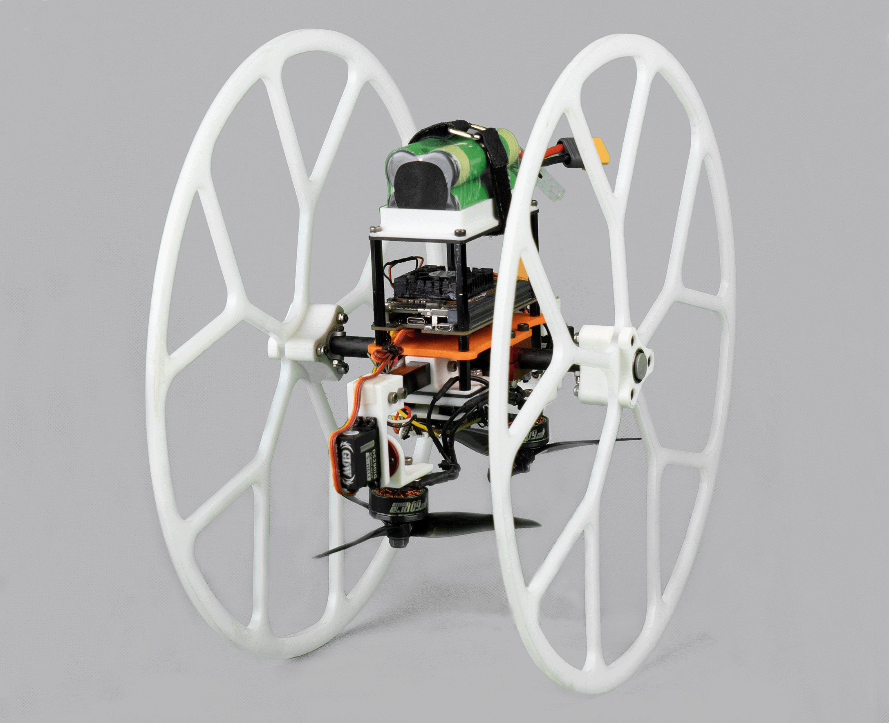

**图 2**：所提出的空地双模态双旋翼机器人样机。

通过在多旋翼上安装圆柱形防护笼、球形防护笼或被动轮，[1, 8, 10, 12, 16]–[18] 利用统一执行系统实现多模态运动，使结构简洁、重量较轻，并降低空中运动的能耗。不过，这类机器人在地面运动模式下的能量效率通常低于主动轮式机器人。

B. 控制
对于空地机器人，运动控制是实现自主运行、发挥结构设计效果的关键。带被动轮的双模态机器人，其空中运动控制与传统多旋翼相近；但由于机器人与地面发生接触，地面运动需要采用不同的控制方法。目前，这类研究主要集中在机械结构设计，运动控制仍处于初步阶段，运行方式通常局限于手动控制 [1, 16] 或低速轨迹跟踪 [8, 11, 17]。高速跟踪的困难不仅来自结构限制，也常常源于控制器采用了过于简化的动力学模型，忽略地面对机器人的反作用力，因而难以取得理想的控制效果。

[10] 使用增量非线性动态逆（INDI）估计地面反作用力，实现了最大速度 2 m/s、最大加速度 1.8 m/s² 的地面轨迹跟踪。[12] 将地面支撑力表示为微分平坦输出，并用分段函数进行定义，在最大速度 4.5 m/s、最大加速度 4.3 m/s² 下实现了较好的地面轨迹跟踪效果。本文分析机器人地面模式下的微分平坦性，利用平坦输出及其导数表示地面反作用力，并实现最大速度 2.9 m/s、最大加速度 3.0 m/s² 的地面轨迹跟踪。

---

## 原文第 3 页核心内容与翻译

**图 3**：常见多旋翼构型的理论最小通过宽度。各构型通常按给定旋翼数量所需的最少执行器进行设计，单旋翼飞行器的宽度作为基准。

三、构型设计与实现
A. 通过能力分析
如前所述，空中和地面两种运动方式的结合会增大机器人尺寸。因此，设计时首先应尽量减小整机尺寸。在实际应用中，沿机器人运动方向的水平宽度尤其重要，因为它决定了机器人能否通过狭窄或杂乱的空间。本节在飞行效率相同的条件下，对不同多旋翼构型的通过能力进行比较。本文用粗体表示向量和矩阵，其他量为标量。

根据动量理论 [19]，旋翼产生给定推力 T 所需的理想功率 P 为
P(T) =
s
T 3
2Sρ,
(1)
其中，S 表示旋翼扫掠面积，ρ 表示空气密度。该理论已在 [20] 中得到实验验证。对于旋翼飞行器，通常使用悬停效率 ηh 评价飞行效率。在悬停状态下，所有旋翼产生的总推力等于机器人重量，ηh 定义为
ηh =
m
k × P(mg/k) =
√2kSρ
g√mg ,
(2)
其中，m 为旋翼飞行器总质量，k 为旋翼数量，g 为重力加速度。旋翼半径 R 为
R = ηhg√mg
√2πkρ .
(3)
由式（3）可知，在悬停效率和重量固定时，旋翼半径由旋翼数量决定。多旋翼的理论最小通过宽度与旋翼数量及其布置方式有关，如图 3 所示。可以看出，在常见多旋翼构型中，沿纵向运动的双旋翼具有最小的理想通过宽度。

基于上述分析，本文采用纵向布置的双旋翼作为飞行机构。此外，双旋翼的质心位于舵机上方，使空地机器人在空中模式下成为最小相位系统 [21]。与质心位于舵机下方的传统双旋翼构型相比，这种设计具有更好的姿态控制性能。

B. 转向能力比较
对于被动轮机器人，转弯时需要克服较大的地面摩擦力，这给偏航角控制带来了困难。对于典型四旋翼，俯仰轴和横滚轴的力矩来自旋翼产生的差动推力，而偏航轴力矩来自旋翼反扭矩的差动，通常小一个数量级。因此，采用四旋翼作为执行系统的被动轮机器人，其偏航角控制更加困难。相比之下，双旋翼的三个方向力矩都由旋翼推力产生。因此，采用双旋翼执行系统的机器人具有更强的转向能力。本节将对双旋翼增强的转向能力进行定量分析。

为在大致相同的地面功耗下公平比较四旋翼车辆和双旋翼车辆的转向能力，令两者产生的总推力 Tf 取相同值，且小于机器人重量：
T q
1 + T q
2 + T q
3 + T q
4 = Tf,
(4)
T b
1 + T b
2 = Tf,
(5)
其中，T q = [T q
1 , T q
2 , T q
3 , T q
4 ]T 表示四旋翼的四个旋翼产生的推力，T b = [T b
1, T b
2]T
表示双旋翼两个旋翼产生的推力。为简化计算，本文专门分析车辆原地旋转的情况，此时俯仰轴和横滚轴力矩均为零。

计算可得，四旋翼车辆的最大偏航轴力矩为：
τ q
zmax = cq
ct
Tf,
(6)
其中，cq 和 ct 分别为旋翼反扭矩系数和推力系数。当旋翼达到最大倾转角时，双旋翼车辆的最大偏航轴力矩为：
τ b
zmax = l · Tf,
(7)
其中，l 为旋翼中心到质心的水平距离。对于微型飞行器，cq 通常为 ct 的 1%～2%，而 l 通常为分米量级。因此，双旋翼车辆的转向能力通常是四旋翼车辆的 5 倍以上。

C. 能量效率与灵活性的平衡
本节说明为什么选择在机器人两侧安装两个被动轮用于地面运动。
只有一个被动轮的空地机器人在地面上仍可像空中一样调整三个方向的姿态，从而实现灵活的全向运动。但是，这种灵活性需要持续稳定三个方向的姿态，会增加地面运动能耗。

---

## 原文第 4 页核心内容与翻译

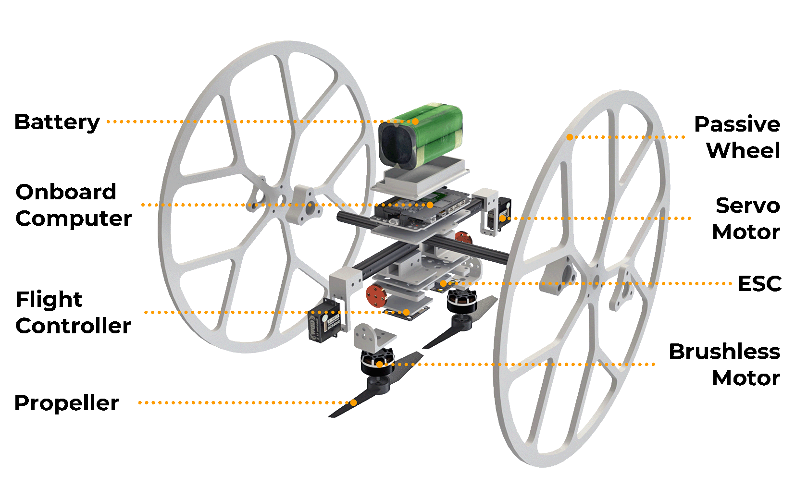

**图 4**：所提出系统硬件细节示意图。

表 I：主要部件的型号和重量。
部件
型号
重量（g）
电池
Sony VTC6 18650 3000mAh 4S
205
机载计算机
NVIDIA Jetson Xavier NX
72
舵机
GDW DS290IG
40
无刷电机
T-Motor F60Pro
66
飞行控制器
Holybro Kakute H7 Mini
8
ESC
Holybro Tekko32 45A
7
螺旋桨
GEMFAN 51466 MCK 5-inch
8
被动轮
单体浇铸尼龙
180
从而实现灵活的全向运动。相比之下，多轮机器人在地面上的能量效率更高，因为地面对机器人的部分方向运动形成约束；但其运动也可能受到地面纹理的限制。
本文采用纵向运动的双旋翼作为执行系统，并在机体两侧安装被动轮。虽然横滚姿态被地面固定，但通过让两个舵机向同一方向转动，仍可产生转弯所需的向心力。因此，该设计在较高能量效率与灵活性之间取得了平衡。
硬件示意如图 4 所示。Skater 总重量为 835 g，整体尺寸为 18 cm × 30 cm × 30 cm。表 I 列出了主要部件的型号和重量。
四、动力学与控制
A. 统一动力学模型
本文使用三个坐标系，如图 5 所示：世界坐标系 FW(xW, yW, zW)、中间坐标系 FG(xG, yG, zG) 和机体坐标系 FB(xB, yB, zB)。世界坐标系是绝对参考系，zW 轴竖直向上。中间坐标系由世界坐标系绕 zW 轴旋转得到，直到 xG 轴与机器人的航向一致。机体坐标系固定在车辆质心处，zB 轴垂直于机体并指向上方，xB 轴始终沿机器人的航向。

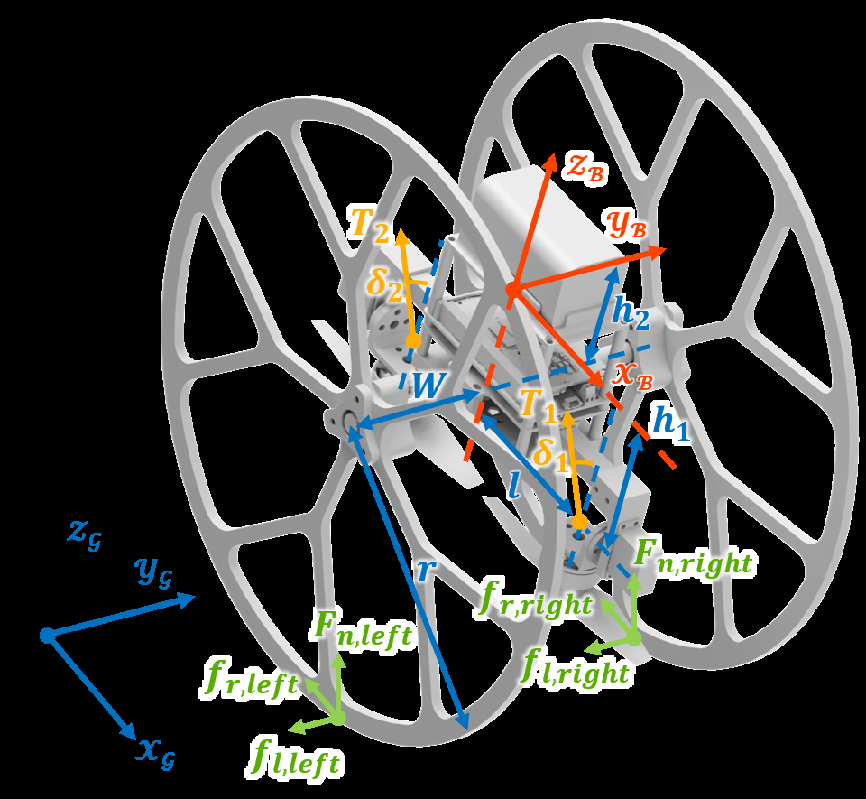

**图 5**：坐标系定义与受力分析。fr、fl 和 Fn 分别表示车轮受到的地面滚动摩擦力、侧向摩擦力和法向力；下标 left 和 right 表示这些力作用在左轮或右轮上。

车辆状态表示为 x = {p, v, R, ω}，其中 p = [px, py, pz]T 和 v = [vx, vy, vz]T 分别表示质心在世界坐标系中的位置和速度，R 表示车辆在世界坐标系中的姿态旋转矩阵，ω = [ωx, ωy, ωz]T 表示相对于机体坐标系的角速度。姿态也可用横滚角、俯仰角和偏航角（ϕ、θ、ψ）表示。控制输入记为 u = {T1, T2, δ1, δ2}，其中 T1、T2 是两个旋翼产生的推力，δ1、δ2 是相应的舵机角度。在后续建模中，鉴于旋翼反扭矩和舵机反作用力相较于其他主要力矩较小，予以忽略。于是，系统的空地双模态动力学 f(x, u) 表示为
˙p = v,
(8)
˙v = g + (RTB + sRW
G FG)/m,
(9)
˙R = S(ω)R,
(10)
˙ω = J−1(−ω × Jω + τB + sτG),
(11)
S(ω) =


0
−ωz
ωy
ωz
0
−ωx
−ωy
ωx
0

,
(12)
其中，m 为车辆总质量，g =
[0, 0, −9.81 m/s2]T , RW
G
RWG 表示从 FG 到 FW 的旋转。开关变量 s = 0 表示机器人处于空中模式，s = 1 表示处于地面模式。TB 是
由执行器产生：
TB =


TB,x
TB,y
TB,z

=


0
−T1 sin δ1 −T2 sin δ2
T1 cos δ1 + T2 cos δ2

,
(13)

---

## 原文第 5 页核心内容与翻译

FG 是中间坐标系 FG 中的地面反作用力：
FG =


fr
fl
Fn

=


−µ(mg −TB,z cos θ)
mal −TB,y
mg −TB,z cos θ

,
(14)
其中，µ 为滚动摩擦系数，al = (vx ˙vy − vy ˙vx)/|v| 为向心加速度。J 表示整机的惯性矩阵。τB 为执行器产生的力矩：
τB =


τB,x
τB,y
τB,z

=


(−T1 sin δ1 −T2 sin δ2)h1
(−T1 cos δ1 + T2 cos δ2)l
(−T1 sin δ1 + T2 sin δ2)l

,
(15)
其中，h1 为舵机旋转轴到质心的竖直距离，l 为力臂长度。τG 为机体坐标系 FB 中的地面反作用力矩：
τG = RW
G
T


flr + (Fn,right −Fn,left)W
(m −2mw)h2g sin θ
(fr,right −fr,left)W

,
(16)
其中，r 为车轮半径，W 为车轮到质心的水平距离，mw 为车轮质量，h2 为车轮轴到质心的水平距离。

B. 考虑地面反作用力的微分平坦性
本节介绍车辆动力学的微分平坦性。在空中模式下，该机器人与传统双旋翼没有区别，其微分平坦性已在前人工作 [21] 中得到充分研究。平坦输出由位置 p 和偏航角 ψ 决定。
在地面模式下，本文证明即使考虑地面反作用力，机器人仍具有微分平坦性。本文选择的平坦输出为
σ = {p, TB,z}.
(17)
与多旋翼通常采用的平坦输出相比，本文将式（13）中的 TB,z 纳入平坦输出，并去掉 ψ。其中，TB,z 设为小于机器人总重量的固定值。具体的平坦变换为
(x, u) = Ψ(σ).
(18)
首先，位置、速度和加速度分别就是 σ、σ 的一阶导数和二阶导数中的第一项。下面说明姿态、机体角速度和控制输入同样可以表示为 σ 及其导数的函数。由于机器人的航向始终与运动方向平行，偏航角可表示为
ψ = α · arctan2( ˙py, ˙px),
(19)
其中，变量 α = 1 表示车辆前进，α = −1 表示车辆后退。假设车辆两个车轮始终与地面接触，因此横滚角 ϕ = 0。式（9）左乘 xG 可得到俯仰角：
θ = arcsin(m¨p · xG + µmg
p
1 + µ2TB,z
) −arctan(µ).
(20)
因此，姿态旋转矩阵 R = Rz(ψ)·Ry(θ)·Rx(ϕ) 由欧拉角（ϕ、θ、ψ）确定。将 R 及其导数代入式（10），可得机体角速度 ω：
ω =


ωx
ωy
ωz

=


−˙θ sin ψ
˙θ cos ψ
˙ψ

.
(21)
作用在左右车轮上的法向力 Fn,left、Fn,right 除了各自包含一半 Fn 外，还包含侧向摩擦力矩和 τB,x 在两个车轮处产生的竖直方向力：
Fn,left = 1
2Fn −flr
W −τB,x cos θ
W
,
Fn,right = 1
2Fn + flr
W + τB,x cos θ
W
.
(22)
相应地，左右车轮受到的摩擦力分别为 fr,left = −µFn,left 和 fr,right = −µFn,right。将式（22）以及 fr,left、fr,right 代入式（16），再将式（15）、（16）、（21）及其导数代入式（11），可以得到三个只包含平坦输出及其导数和四个控制输入的方程。第四个方程由式（13）中的 TB,z 给出平坦输出与控制输入之间的关系。最后，通过求解这四个方程确定期望控制输入 u = Ψu(σ)。由此可知，车辆在地面运动模式下具有微分平坦性。
C. 向心力产生
如前所述，机器人可以主动产生侧向推力 TB,y，以满足转弯时的向心力要求。为简化处理，本文按照第 IV-B 节的平坦变换确定 TB,y。忽略高阶项和滚动摩擦系数，并采用小角度近似，可得 TB,y 为
TB,y ≈
1
1 −h1/rmal.
(23)
由式（23）可见，TB,y 与向心力大致成正比，并略大于向心力。虽然二者并不完全相等，但已经足以使机器人在低摩擦表面上有效运动，第 V 节的实验验证了这一点。

D. 非线性模型预测控制框架
由于式（8）～（11）的统一动力学模型以及机器人在两种模式下都具有微分平坦性，可以为两种运动方式使用统一控制器。在完整动力学模型下，对于动力学可行的轨迹，串级 PID 控制器和 NMPC 控制器可以达到相近的跟踪精度 [22]。不过，NMPC 在预测优化控制序列的同时，能够直接纳入系统动力学和控制输入约束，从而

---

## 原文第 6 页核心内容与翻译

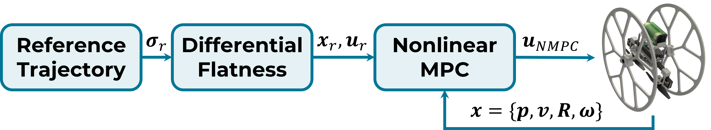

**图 6**：适用于两种运动模式的统一控制框架。

表 II：物理参数和 NMPC 增益。
物理参数
NMPC 增益
m, mw [kg]
0.83, 0.09
Qp
diag(1000, 1000, 500)
J
[g · m2] diag(4.1, 2.8, 3.5) Qv
diag(100, 100, 100)
l
[m]
0.07
Qq
diag(200, 200, 200, 200)
h1, h2
[m]
0.04, 0.02
Qω
diag(10, 10, 10)
r, W
[m]
0.15, 0.09
Qu
diag(10, 1, 1, 1)
ct
[N · s2] 1.75e−8
在满足约束的同时，NMPC 还可以减小不可行轨迹带来的跟踪误差。因此，本文采用 NMPC 进行轨迹跟踪控制，其控制框架如图 6 所示。
NMPC 通过滚动时域求解非线性优化问题，生成最优控制输入。优化目标是在时间区间 [t, t + K·dt] 内，最小化预测状态、控制输入与期望状态、期望输入之间的误差。该时间区间被划分为 K 个长度相等的步长，固定步长为 dt。NMPC 问题表述为：
uNMP C =min
u
K−1
X
k=0
(˜x(k)T Q˜x(k) + ˜u(k)T Qu ˜u(k))
+ ˜x(K)T Q˜x(K),
s.t. x(k + 1) = f(x(k), u(k)), x(0) = xcurrent,
s · Fn,left(k) ≥0, s · Fn,right(k) ≥0,
u ∈[umin umax],
(24)
其中，k 为当前时间步，˜x(k) = x(k) − xr(k) 和 ˜u(k) = u(k) − ur(k) 分别为估计状态、输入与参考状态、输入之间的误差。xr 和 ur 是由微分平坦性得到的参考状态和参考输入。Q = diag(Qp, Qv, Qq, Qω) 与 Qu 为权重矩阵。f(x(k), u(k)) 是式（8）～（11）的离散形式，xcurrent 为当前状态。Fn,left(k) 和 Fn,right(k) 表示第 k 步作用在左右车轮上的法向力，umin 和 umax 为控制输入的最小值和最大值。
NMPC 问题使用 ACADO [23] 和 qpOASES [24] 求解，运行频率为 200 Hz。K 和 dt 分别设为 20 和 50 ms。真实环境实验使用的物理参数和 NMPC 增益见表 II。
五、实验
A. 能量效率验证
在本实验中，机器人分别在空中运动模式和地面运动模式下跟踪两条 8 字形轨迹，同时记录其功耗。

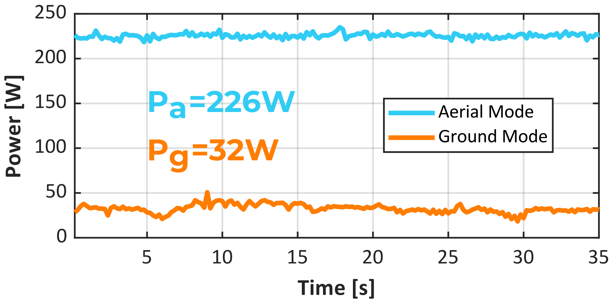

**图 7**：两种运动模式下进行轨迹跟踪时的功耗。

在后续所有实验中，机器人的位置和姿态均由动作捕捉系统估计。两条轨迹的区别在于高度，一条位于空中，另一条位于地面；两条轨迹的最大速度 vmax 和最大加速度 amax 均分别为 1.0 m/s 和 0.6 m/s²。车辆待机功率 Ps 为 9 W。扣除待机功率后，机器人空中模式的平均功率 Pa 为 226 W，地面模式的平均功率 Pg 为 32 W，如图 7 所示。因此，地面模式的节能效率 ξ = 1 − Pg/Pa = 85.8%，这意味着机器人地面运动模式的续航时间约为空中运动模式的 7 倍。
B. 轨迹跟踪控制
为验证所提出控制器的有效性，本文分别测试空中模式和地面模式的轨迹跟踪性能，并进行空地混合轨迹跟踪实验。采用均方根误差（RMSE）评价轨迹跟踪性能，其定义为：
RMSE =
sPN
i=0 ∥p(i) −pr(i)∥2
N
,
(25)
其中，p(i) 和 pr(i) 分别为车辆第 i 个采样时刻的估计位置和期望位置。
首先，机器人在空中模式下执行二维 8 字形轨迹，vmax 为 2.9 m/s，amax 为 3.0 m/s²。结果如图 8 所示，二维 RMSE 为 0.091 m。
随后，为验证机器人对不同地面条件的适应能力，分别在湿滑地面和粗糙地面上进行二维 8 字形轨迹跟踪测试，如图 1(b)、(c) 所示。湿滑地面测试中，vmax 设为 2.8 m/s，amax 为 3.0 m/s²，轨迹跟踪结果如图 9 所示，RMSE 为 0.118 m。粗糙地面测试中，vmax 为 2.9 m/s，amax 为 3.0 m/s²，对应 RMSE 为 0.095 m，说明机器人在不同地面条件下仍能保持较高的跟踪精度。

---

## 原文第 7 页核心内容与翻译

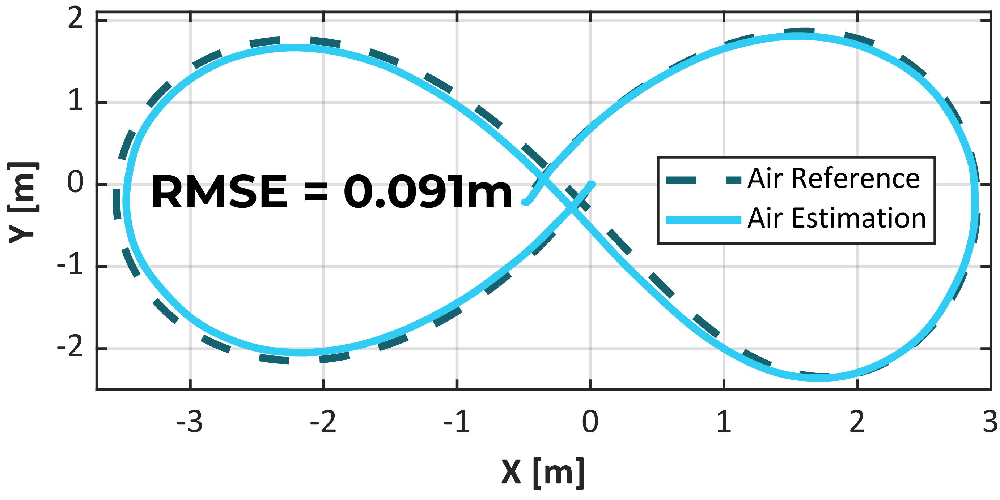

**图 8**：空中运动轨迹跟踪实验。

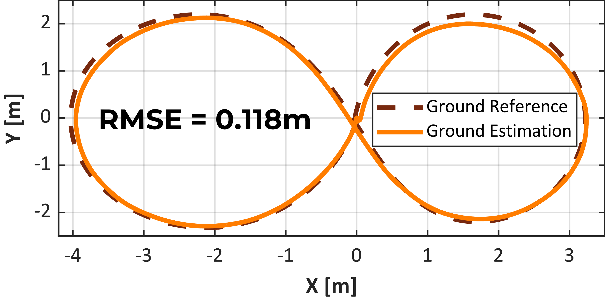

**图 9**：湿滑地面上的地面运动轨迹跟踪实验。

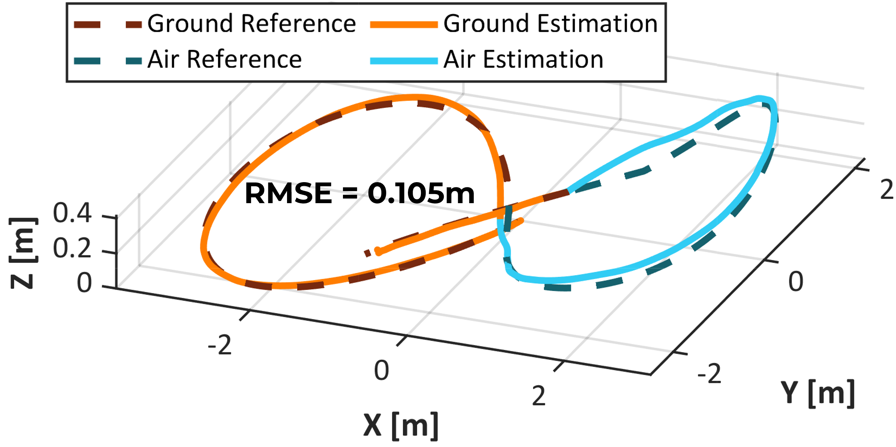

**图 10**：空地混合运动轨迹跟踪实验。

为展示机器人平滑切换运动模式的特点，本文开展了三维轨迹跟踪测试，如图 1(a) 所示。速度和加速度上限分别达到 2.4 m/s 和 2.2 m/s²。图 10 的结果表明，所提出的控制器能够在跟踪轨迹的同时实现两种模式的平滑切换。

C. 通过狭窄间隙
为验证所提出机器人的地形通过能力，本文开展了通过宽度为 210 mm 的狭窄间隙实验。图 11 展示了机器人使用所提出 NMPC 控制器通过狭窄间隙的过程，最大速度达到 1 m/s。

D. 基准对比
为验证所提出机器人对不同地面纹理的适应能力，本文将其与文献 [10] 中采用四旋翼的空地机器人进行比较：两者在同一湿滑地面上跟踪相同轨迹。当速度和加速度上限分别为 1 m/s 和 0.7 m/s² 时，两种机器人都能完整执行轨迹，但四旋翼机器人

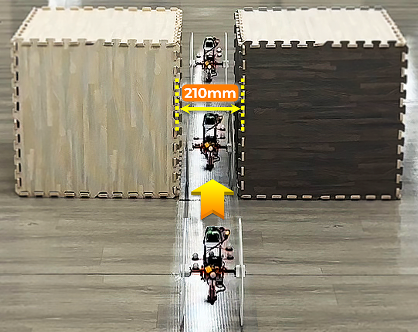

**图 11**：通过狭窄间隙示意图。

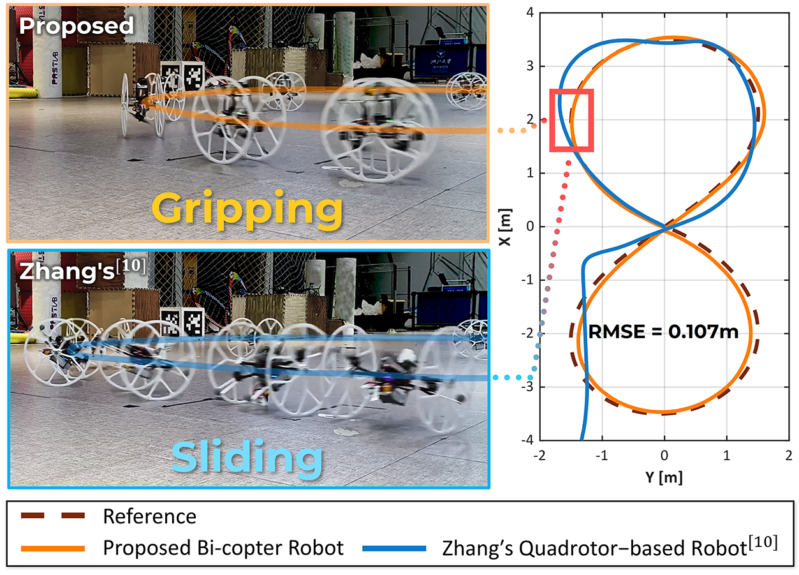

**图 12**：所提出的双旋翼机器人与 Zhang 等人的四旋翼空地机器人 [10] 在湿滑地面上进行轨迹跟踪的基准对比。最大速度和最大加速度分别达到 2 m/s 和 1.8 m/s²。

会出现打滑现象。当最大速度和最大加速度分别提高到 2 m/s 和 1.8 m/s² 时，转弯所需的向心力随之增大。此时湿滑地面无法提供足够的侧向摩擦力，因此四旋翼机器人失效。相比之下，本文机器人仍能在该湿滑地面上保持准确的轨迹跟踪，RMSE 为 0.107 m，如图 12 所示。
为突出本文机器人的特点，并清楚说明其相对于其他机器人的优点和不足，本文进一步与若干具有代表性的空地机器人 [3, 10]–[12, 14] 进行比较。数据主要来自相应论文，比较结果汇总于表 III，重点考察以下指标：
1) 统一执行系统：机器人在空中和地面运动模式下使用同一套执行器。
2) 平滑模式切换：机器人能够在两种模式之间切换，且没有明显中断。
3) 高速自主运行：机器人能够以较高速度（vmax > 1.5 m/s）自主跟踪轨迹。
4) 地面纹理适应性：机器人能够在

---

## 原文第 8 页核心内容与翻译

表 III：与多种空地机器人的性能比较。
粗糙和湿滑地面上保持稳定运动。
5) 通过宽度：第 III-A 节讨论的机器人理论最小通过宽度。
6) 能量效率：第 V-A 节分析的机器人地面模式相对于空中模式节省的能量。
分析表 III 可以得出，虽然本文机器人在地面上的能量效率低于主动轮式机器人，但在其他关键性能指标上具有明显优势。
六、结论
本文设计并建立了一种能够适应空中和多种地面的新型双旋翼机器人模型。通过比较常见多旋翼的通过能力和转向能力，本文确定沿纵向运动、配备两个被动轮的双旋翼，是空地机器人适应多种地形的优选构型。随后建立机器人动力学模型，说明其具有微分平坦性，为运动规划和控制提供便利。在此基础上，提出用于双模态轨迹跟踪的统一 NMPC 控制器。真实环境实验和基准对比验证了机器人的优势以及控制器的有效性。后续工作将考虑扩展机器人的模型和控制方法，使其能够在不平整地面上运行。
REFERENCES
[1] A. Kalantari and M. Spenko, “Design and experimental validation
of hytaq, a hybrid terrestrial and aerial quadrotor,” in 2013 IEEE
International Conference on Robotics and Automation.
IEEE, 2013,
pp. 4445–4450.
[2] A. Kalantari, T. Touma, L. Kim, R. Jitosho, K. Strickland, B. T.
Lopez, and A.-A. Agha-Mohammadi, “Drivocopter: A concept hybrid
aerial/ground vehicle for long-endurance mobility,” in 2020 IEEE
Aerospace Conference.
IEEE, 2020, pp. 1–10.
[3] M. Cao, X. Xu, S. Yuan, K. Cao, K. Liu, and L. Xie, “Doublebee:
A hybrid aerial-ground robot with two active wheels,” arXiv preprint
arXiv:2303.05075, 2023.
[4] E. Sihite, A. Kalantari, R. Nemovi, A. Ramezani, and M. Gharib,
“Multi-modal mobility morphobot (m4) with appendage repurpos-
ing for locomotion plasticity enhancement,” Nature communications,
vol. 14, no. 1, p. 3323, 2023.
[5] X. AEROHT. evtol flying car. [Online]. Available: https://intl.aeroht.
com/
[6] AeroMobil. Am 4.0. [Online]. Available: https://www.aeromobil.com/
[7] PAL-V. Pla-v liberty. [Online]. Available: https://www.pal-v.com/en
[8] J. Yang, Y. Zhu, L. Zhang, Y. Dong, and Y. Ding, “Sytab: A class of
smooth-transition hybrid terrestrial/aerial bicopters,” IEEE Robotics
and Automation Letters, vol. 7, no. 4, pp. 9199–9206, 2022.
[9] Q. Tan, X. Zhang, H. Liu, S. Jiao, M. Zhou, and J. Li, “Multimodal
dynamics analysis and control for amphibious fly-drive vehicle,”
IEEE/ASME Transactions on Mechatronics, vol. 26, no. 2, pp. 621–
632, 2021.
[10] R. Zhang, J. Lin, Y. Wu, Y. Gao, C. Wang, C. Xu, Y. Cao, and F. Gao,
“Model-based planning and control for terrestrial-aerial bimodal vehi-
cles with passive wheels,” in 2023 IEEE/RSJ International Conference
on Intelligent Robots and Systems (IROS).
IEEE, 2023, pp. 1070–
1077.
[11] H. Jia, R. Ding, K. Dong, S. Bai, and P. Chirarattananon, “Quadrolltor:
A reconfigurable quadrotor with controlled rolling and turning,” IEEE
Robotics and Automation Letters, vol. 8, no. 7, pp. 4052–4059, 2023.
[12] N. Pan, J. Jiang, R. Zhang, C. Xu, and F. Gao, “Skywalker: A compact
and agile air-ground omnidirectional vehicle,” IEEE Robotics and
Automation Letters, vol. 8, no. 5, pp. 2534–2541, 2023.
[13] S. Morton and N. Papanikolopoulos, “A small hybrid ground-air
vehicle concept,” in 2017 IEEE/RSJ International Conference on
Intelligent Robots and Systems (IROS).
IEEE, 2017, pp. 5149–5154.
[14] S. Mintchev and D. Floreano, “A multi-modal hovering and terrestrial
robot with adaptive morphology,” in Proceedings of the 2nd Interna-
tional Symposium on Aerial Robotics, no. CONF, 2018.
[15] N. B. David and D. Zarrouk, “Design and analysis of fcstar, a
hybrid flying and climbing sprawl tuned robot,” IEEE Robotics and
Automation Letters, vol. 6, no. 4, pp. 6188–6195, 2021.
[16] C. J. Dudley, A. C. Woods, and K. K. Leang, “A micro spherical
rolling and flying robot,” in 2015 IEEE/RSJ International Conference
on Intelligent Robots and Systems (IROS).
IEEE, 2015, pp. 5863–
5869.
[17] S. Atay, M. Bryant, and G. Buckner, “The spherical rolling-flying
vehicle: Dynamic modeling and control system design,” Journal of
Mechanisms and Robotics, vol. 13, no. 5, p. 050901, 2021.
[18] Y. Qin, Y. Li, X. Wei, and F. Zhang, “Hybrid aerial-ground locomo-
tion with a single passive wheel,” in 2020 IEEE/RSJ International
Conference on Intelligent Robots and Systems (IROS).
IEEE, 2020,
pp. 1371–1376.
[19] G. J. Leishman, Principles of helicopter aerodynamics with CD extra.
Cambridge university press, 2006.
[20] Y. Qin, W. Xu, A. Lee, and F. Zhang, “Gemini: A compact yet efficient
bi-copter uav for indoor applications,” IEEE Robotics and Automation
Letters, vol. 5, no. 2, pp. 3213–3220, 2020.
[21] X. He and Y. Wang, “Design and trajectory tracking control of a new
bi-copter uav,” IEEE Robotics and Automation Letters, vol. 7, no. 4,
pp. 9191–9198, 2022.
[22] S. Sun, A. Romero, P. Foehn, E. Kaufmann, and D. Scaramuzza,
“A comparative study of nonlinear mpc and differential-flatness-based
control for quadrotor agile flight,” IEEE Transactions on Robotics,
vol. 38, no. 6, pp. 3357–3373, 2022.
[23] B. Houska, H. J. Ferreau, and M. Diehl, “Acado toolkit—an open-
source framework for automatic control and dynamic optimization,”
Optimal Control Applications and Methods, vol. 32, no. 3, pp. 298–
312, 2011.
[24] H. J. Ferreau, C. Kirches, A. Potschka, H. G. Bock, and M. Diehl,
“qpoases: A parametric active-set algorithm for quadratic program-
ming,” Mathematical Programming Computation, vol. 6, pp. 327–363,
2014.

---
