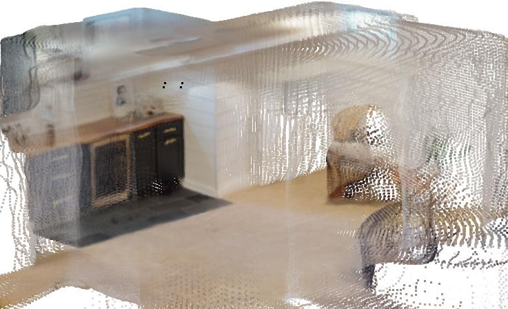
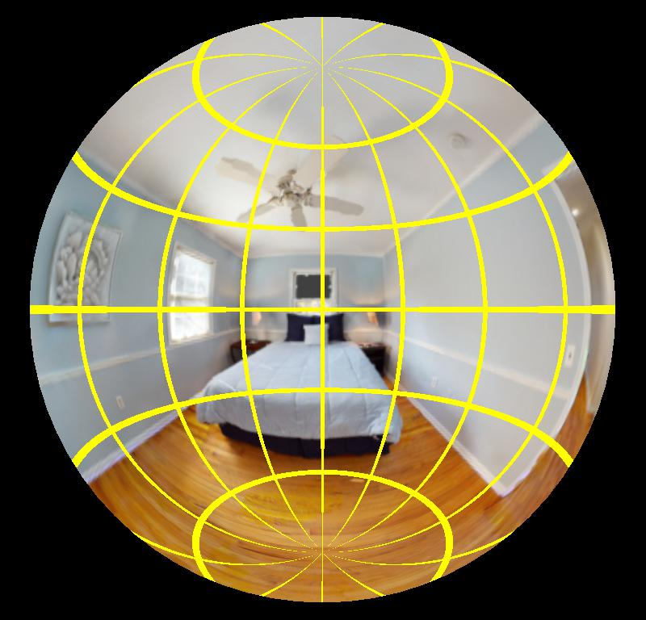
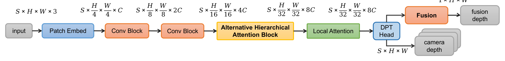
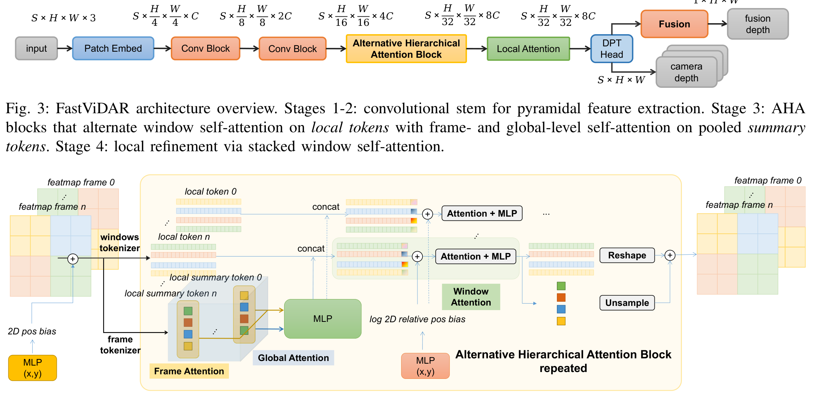
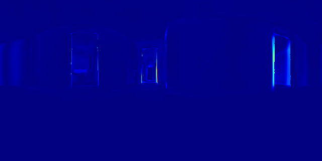

# FastViDAR全向深度估计（26_FastViDAR）：完整忠实学术翻译

> **原文标题**：26_FastViDAR  
> **作者**：Hangtian Zhao、Xiang Chen、Yizhe Li、Qianhao Wang、Haibo Lu、Fei Gao  
> **发表信息**：arXiv:2509.23733v1，2025-09-28  
> **原文 PDF**：[26_FastViDAR.pdf](../26_FastViDAR.pdf) ｜ **对应中文详解**：[26_FastViDAR全向深度估计.md](../中文详解/26_FastViDAR全向深度估计.md)  

---

## 原文第 1 页核心内容与翻译

FastViDAR：基于交替分层注意力的实时全向深度估计
Hangtian ZHAO1, Xiang Chen2, Yizhe Li3, Qianhao Wang4, Haibo Lu, 和 Fei Gao4∗
摘要——在本文中，我们提出了 FastViDAR，这是一种新颖的框架，它接收四个鱼眼摄像头的输入，并生成完整的 360° 深度图以及单摄像头的深度、融合深度和置信度估计。我们的主要贡献如下：(1) 我们引入了交替分层注意力 (AHA) 机制，该机制通过分离的帧内和帧间窗口自注意力有效地融合跨视角的特征，从而以较小的开销实现跨视角特征混合。(2) 我们提出了一种新颖的 ERP 融合方法，将多视角深度估计投影到共享的等距柱状坐标系中，以获得最终的融合深度。(3) 我们使用 HM3D 和 2D3D-S 数据集生成了 ERP 图像-深度对齐数据集以进行全面评估，展示了在真实数据集上具有竞争力的零样本性能，同时在 NVIDIA Orin NX 嵌入式硬件上实现了高达 20 FPS 的运行速度。项目主页：https://3f7dfc.github.io/FastVidar/

I. 引言
快速可靠的全向深度对于机器人和自动驾驶至关重要。主动式传感器（例如激光雷达）可以提供精确的 360° 深度，但成本高昂且功耗大，而配备鱼眼镜头的光学多相机系统提供了一种实用的替代方案。具有超大视场角 (FOV)（> 180°）的四相机系统能够覆盖整个球面，但从这些视图中推断出一致、准确且高效的深度图仍然具有挑战性。传统的立体视觉在鱼眼图像上的扩展主要依赖于球面极线几何和基于体素代价聚合的平面扫描算法，这通常阻碍了实时部署，并且假设相机之间的外参是完美的 [1], [2]。最近的单目方法通过将内参分解，能够在不同的相机上实现良好的泛化性能；特别是 Depth Any Camera [3]，它将输入（透视/鱼眼/全景）转换为常见的等距柱状投影 (ERP)，从而实现零样本度量深度估计 [3]。然而，单图像方法无法利用多视角几何，也无法估计相机之间的参数。与此同时，诸如 VGGT [4] 这样基于 Transformer 的多视角模型通过交替的局部/全局注意力聚合跨视角信息，以前馈的方式预测相机参数和稠密深度，这表明自注意力 [5] 可以取代繁重的代价体——尽管在自主移动机器人平台上实现实时推理仍然具有挑战性。

*通讯作者：Fei Gao
1作者单位为中国科学技术大学。htzhao@mail.ustc.edu.cn
2作者单位为华东师范大学。71285901012@stu.ecnu.edu.cn
3作者单位为西安电子科技大学。liyizhe666@stu.xidian.edu.cn
4作者单位为浙江大学 FAST 实验室。{wangqianhao, feigao}@zju.edu.cn

**图 1**：FastViDAR 的真实世界性能演示。第一行：由 220° 视场角鱼眼图像转换得到的 ERP 图像。第二行：FastViDAR 输出的各视角 ERP 深度图。第三行：与各视角对应的预测点云。第四行：预测的融合点云和全向鱼眼相机的朝向。

我们的方法。为了解决像 VGGT [4] 这种基于 Transformer 的多视角模型的实时推理挑战，我们提出了 FastViDAR，这是一个高效的全向深度系统。它处理多张鱼眼图像，并实时生成完整的 360° 深度图，以及各个相机的深度图、融合深度图和置信度估计，如图 1 所示。虽然我们的实验使用四相机设置来演示该方法，但 FastViDAR 支持任意数量的相机和任意视角的相机，包括超广角（> 180°）。我们将每张鱼眼图像投影为统一的 ERP 表示，避免了模型去学习各种鱼眼镜头畸变参数，使其能够专注于 ERP 表示。在分层/窗口注意力 [6] 的基础上，我们引入了交替分层注意力 (AHA) 机制，该机制交替进行帧内的窗口自注意力和对应窗口间的跨帧注意力。跨视角的 token 会被拼接并通过 MLP 进行融合，作为全局 token 来传播深度线索，而无需显式构建 3D 或 4D 的代价体。与纯窗口注意力方法相比，AHA 实现了良好的跨帧自注意力，且额外的计算和内存开销不到 10%，从而能够对各帧视角之外的区域进行准确的深度预测，并提高了多帧深度的连贯性。与完全注意力相比，AHA 理论上实现了约 16 倍的推理速度提升。在实际应用中，在 640×320 分辨率和 4 帧输入下，FastViDAR 的速度比 VGGT 快 3.3 倍，随着输入分辨率或帧数的增加，这一优势会进一步扩大。

评估。在真实世界的基准数据集（包括 HM3D [7] 和 Stanford 2D-3D-S [8]）上，我们的 AHA 和 ERP 融合方法有助于提高准确性和鲁棒性。与最近的全向立体视觉和 Transformer 基线模型相比，FastViDAR 表现出竞争力的性能，并在真实的零样本全景数据上实现了泛化，能够实时提供稠密且准确的 360° 深度。在 NVIDIA Orin NX 等嵌入式硬件平台上，我们的方法通过 TensorRT fp16 优化实现了高达 20 FPS 的推理速度，同时保持了较高的精度，证明了其在实际机器人应用中的实用性。

贡献。我们的主要贡献如下：
1) 交替分层注意力 (AHA)。我们引入了一种新颖的注意力机制，通过分离的帧内和帧间窗口自注意力高效地融合跨视角的特征，以较小的开销实现跨视角特征混合，同时实现了嵌入式硬件上的实时处理。
2) ERP 融合方法。我们提出了一种新颖的 ERP 融合方法，将多视角深度估计投影到共享的等距柱状坐标系中，无需昂贵的点云对齐即可实现无缝的 360° 深度融合。
3) 感知 ERP 的数据集生成与评估。我们使用 HM3D 和 2D3D-S 数据集生成了感知 ERP 的图像-深度对应数据集以进行全面评估，展示了在真实 360° 数据集上具有竞争力的零样本性能，同时保持了在嵌入式平台上的实时处理能力。
II. 相关工作
全向多视角深度。早期深度模型通过将图像投影到球面并构建代价体，将立体匹配扩展到鱼眼图像；后来的工作通过球面平面扫描和多阶段聚合来提高效率和准确性。最近的实时系统将多鱼眼输入矫正为全景立体图像 [9]，或采用类似 Cassini 的投影结合轻量级的立体主干网络和融合策略 [10]。这些方法实现了强大的精度和速度，但通常假设固定标定，并依赖于显式代价体。相比之下，FastViDAR 利用所提出的 AHA 融合任意视图，而无需构建立体的代价体，并采用 ERP 融合进行无缝的 360° 深度估计，同时能够灵活地为每个独立的视图输出度量深度。

全景/鱼眼单目深度。标准的针孔网络在视场受限和多视角深度一致性方面面临挑战。专门的球面/立方体贴图表示可以减轻畸变，而 DAC [3] 通过将任何输入映射到标准的 ERP 表示中，实现了零样本的度量深度。然而，单目方法仍面临尺度模糊的问题，并且无法利用跨视角的约束。FastViDAR 同样使用了 ERP 表示，但在各个帧之间采用了全局注意力机制以实现隐式的多视角尺度约束，并提供更好的尺度一致性。

高效立体匹配与 MVS。面向效率的设计通过 2D 聚合和轻量级模块 [11] 减轻了 3D 代价体的负担。从粗到细的多视角立体视觉（如 MVSNet/CasMVSNet [12], [13]）限制了深度假设。CasOmniMVS [1] 为全向场景调整了球面扫描的密度。我们的方法完全避免了显式的代价体，而是依赖于 AHA 学习到的隐式相关性。

用于 3D 感知的 Transformer。交替的局部/全局注意力在多视角几何和相机参数预测中已被证明是有效的 [4]。诸如 FasterViT [6] 的分层/窗口注意力通过载体 token 扩展了注意力的适用性。FastViDAR 将这一范式专为多相机全向深度任务量身定制，并采用 ERP 融合方法以提高跨视角的几何一致性。

III. 方法
A. 鱼眼相机与等距柱状投影 (ERP)
我们采用等距柱状投影 (ERP) 图像作为网络输入，以从学习过程中解耦出镜头特有的内参。任何中心鱼眼模型（例如 KB/等距/等立体角模型 [14]、OCamCalib 多项式模型 [15]、双球面 (DSCamera) 模型 [16]、统一中心模型 [17]）都能通过 π−1
θ (内参为 θ) 将像素 u = (u, v) 映射到相机坐标系下的单位视线射线 d = (dx, dy, dz) ∈ S2 上。在这一步之后，ERP 坐标变成了纯粹的球面重参数化，与 θ 无关；我们设定 +z 向前，+x 向右，+y 向上，ERP 大小为 W×H，原点位于左上角，经纬度 (λ, ϕ) 单位为弧度：
λ = atan2(dx, dz),
ϕ = arcsin(dy),
(1)
x =
 
λ
2π + 1
2
 
W,
y =
 
1
2 −ϕ
π
 
H.
(2)
因此，来自异构鱼眼镜头图像最终落到相同的 ERP 网格上，如图 2 所示，这允许网络在一个稳定的、与相机无关的域上进行学习，同时保留了原生的大视场（透视针孔相机往往会裁剪掉这些区域）。尽管 ERP 引入了极地区域畸变（局部尺度 ∝1/ cos ϕ），但我们的实验表明所提出的方法能够很好地处理它。为了进行可视化或图像合成，逆向路径是直接的：从 ERP (x, y) 恢复出 (λ, ϕ)，计算 d = [sin λ cos ϕ, sin ϕ, cos λ cos ϕ]⊤，并通过 u =
πθ(d)（例如 DSCamera 模型）在镜头 FOV 内渲染出鱼眼视图。
B. 交替分层注意力 (AHA)
单目深度从根本上具有尺度模糊性。在已标定的针孔模型下，如果 3D 点 X ∈ R3 和相机位姿 (R, t) 解释了观测结果，那么对于任何 α > 0，投影图像坐标满足
x ∝ K(R(αX) + αt) = α K(RX + t) ∝ K(RX + t)
(3)

---

## 原文第 3 页核心内容与翻译

**图 2**：不同相机类型的统一 ERP 表示。
上排：内参为 θpinhole 的针孔相机 (FOV=100°) 投影至 ERP。下排：内参为 θfisheye 的鱼眼相机 (FOV=220°) 投影至同一 ERP 网格。黄线显示了 ERP 网格位置与原始特定相机网格位置之间的对应关系。

其中 x = (u, v, 1)⊤ 表示齐次图像坐标，K 是相机内参矩阵。因此，在没有绝对度量线索（例如，已知的基线、物体尺寸先验或其他度量信息）的情况下，深度只能被识别到一个全局尺度。多帧建模可以约束相对结构和运动；然而，简单地对 S 帧中每一帧的 N 个 token 计算全局自注意力，会导致计算时间和内存产生 O((SN)^2) 的开销。VGGT [4] 有效地利用了多帧注意力，但对于嵌入式部署而言计算量依然过重。受 FasterViT [6] 和 CvT [18] 中卷积分词操作的启发，我们提出了交替分层注意力（AHA），它在局部 token 上应用窗口自注意力，并在紧凑的摘要 token 上交替执行帧级和全局级自注意力。

a) 概述与骨干网络：如图 3 所示，模型包含四个堆叠的阶段，支持任意帧数 S（例如 4 相机系统或时间视频剪辑）和任意输入分辨率，这得益于自适应填充和平均池化技术。虽然我们的实验使用了 S = 4 个相机，但该方法旨在处理任意数量的相机。该方法位姿灵活，适应任意相机配置和朝向，不需要特定的几何约束。阶段 1-2 构成了一个卷积干网络，由重复的 conv2d-bn-gelu 模块组成，并在阶段边界进行下采样，生成特征图 F ∈ RB×S×C×H×W，其中 B 是批量大小，S 是帧/相机数量，C 是通道数，H×W 是输入空间尺寸。阶段 i 输出分辨率为 H/2^(i+2) × W/2^(i+2)，通道数约 2^iC。阶段 3 堆叠了 L 个 AHA 模块，在局部 token 上应用窗口自注意力，并在紧凑的摘要 token 上交替应用帧级和全局级自注意力，详细内容如图 4 所示。阶段 4 通过应用于已分窗口局部 token 上的自注意力层堆叠执行局部细化。

b) Token 分词器与符号说明：我们对特征图添加可学习的位置偏置，从阶段 2 的特征图 F ∈ RB×S×C×H×W 中形成两个 token 集合。窗口是不重叠的，大小为 Ph × Pw，步长为 (Ph, Pw)。为确保完整的窗口覆盖，我们使用自适应填充到 H′ = ⌈H/Ph⌉Ph 和 W ′ = ⌈W/Pw⌉Pw，然后将每一帧划分为 Nh = H′/Ph 乘 Nw = W ′/Pw 个窗口；每帧的窗口数量为 M = NhNw。我们用 m ∈ {1, . . . , M} 索引一帧内的窗口（按 Nh×Nw 网格行优先排列），用 p ∈ {1, . . . , PhPw} 索引窗口内部的位置。为了清晰起见，我们将逐帧的局部 token 记为 Lb,s ∈ RM×(PhPw)×C，将局部摘要 token 记为 Sloc_b,s ∈ RM×C。
分词器作为操作符（输入 → 输出形状）：
WinTok(Ph,Pw) : RC×H′×W ′ → RM×(PhPw)×C,
(4)
FrameTok : RM×(PhPw)×C → RM×C.
(5)
(i) 局部 token。对于已填充的帧特征图 Fb,s ∈ RC×H′×W ′，我们定义
Lb,s := WinTok(Ph,Pw)
 
Fb,s
 
∈ RM×(PhPw)×C.
(ii) 局部摘要 token。逐窗口汇聚的描述符表示为
Sloc_b,s := FrameTok
 
Lb,s
 
∈ RM×C.
在逐元素计算时，对于窗口索引 m，我们在窗口维度上执行平均池化：
Sloc_b,s[m] =
1
PhPw
PhPw
X
p=1
Lb,s[m, p, :].
(6)
将批次和帧的维度拼接后，得到 L ∈ R(BS)M×(PhPw)×C
和 Sloc ∈ R(BS)×M×C。
c) AHA 中的三级注意力：每个 AHA 模块交替执行三种注意力，如图 4 所示。在这里，自注意力是指多头自注意力 (MHSA) [5]：
1) 窗口注意力（局部）。在每个窗口内独立应用自注意力。对于 m ∈ {1, . . . , M}，
Attnwin : Lb,s[m] ∈ R(PhPw)×C
7→ ˜Lb,s[m] ∈ R(PhPw)×C,
(7)
窗口内部具有相对位置偏置。
2) 帧注意力（帧级摘要）。在单个帧的摘要 token 上执行自注意力：
Attnframe : Sloc_b,s ∈ RM×C
7→ ˆSb,s ∈ RM×C.
(8)
添加了可学习的帧/相机嵌入向量 es 以编码视角/时间身份。
3) 全局注意力（多帧摘要）。对跨 S 帧的所有摘要 token 执行自注意力：
Attnglobal : concats
  ˆSb,s
 
∈ R(SM)×C
7→ ¯Sb ∈ R(SM)×C.
(9)
它融合了跨视角或时间的上下文信息，有助于解决尺度模糊问题并提高几何一致性。

---

## 原文第 4 页核心内容与翻译

相机
深度
交替分层注意力模块
输入
图像块嵌入
卷积模块
ƽ × Ʋ × ǁ × 3
ƽ × Ʋ
4 × ǁ
4 × ƭ
ƽ × Ʋ
8 × ǁ
8 × 2ƭ
卷积模块
ƽ × Ʋ
16 × ǁ
16 × 4ƭ
局部注意力
DPT
预测头
ƽ × Ʋ
32 × ǁ
32 × 8ƭ
阶段 1 × N1
阶段 2 × N2
阶段 3 × N3
阶段 4 × N4
ƽ × Ʋ
32 × ǁ
32 × 8ƭ
融合
ƽ × Ʋ × ǁ
相机
深度
相机
深度
融合
深度
1 × Ʋ × ǁ

**图 3**：FastViDAR 架构概览。阶段 1–2：用于提取金字塔特征的卷积主干网络。阶段 3：AHA 模块，交替在局部 token 上执行窗口自注意力，并在池化后的摘要 token 上执行帧级和全局级自注意力。阶段 4：通过堆叠窗口自注意力进行局部细化。

第 n 帧特征图
第 0 帧特征图
...
...
第 0 个局部 token
第 n 个局部 token
第 n 个局部摘要 token
第 0 个局部摘要 token
...
帧级注意力
帧分词器
窗口分词器
全局注意力
...
二维位置偏置
MLP
+
拼接
拼接
二维相对位置偏置的对数
注意力 + MLP
注意力 + MLP
+
+
重排形状
上采样
+
...
...
第 n 帧特征图
第 0 帧特征图
...
MLP
(x,y)
MLP
(x,y)
交替分层注意力模块
重复
窗口
注意力

**图 4**：AHA 模块。该模块依次对局部 token 执行窗口自注意力、对摘要 token 执行帧级自注意力，并对全部摘要 token 执行全局自注意力。

d) 通过堆叠的窗口自注意力进行局部细化：
阶段 4 纯粹是局部细化：我们在相同的 (Ph, Pw) 划分上应用 N4 层窗口 MHSA。对于每个 (b, s, m)，令 X(0) = Lb,s[m] ∈ R(PhPw)×C。每层使用带有 1 层 MLP 的前置归一化 MHSA：
X(r) = X(r−1) + MHSAwin
 
LN(X(r−1)); Brel
 
,
X(r) ← X(r) + MLP
 
LN(X(r))
 
,
r = 1, . . . , R,
(10)
其中 Brel 是窗口内的相对位置偏置。
将所有窗口叠加得到 L⋆_b,s ∈ RM×(PhPw)×C。
e) 复杂度：令 N = H′W ′ 为每帧密集的 token 数量（填充后），S 为帧数，P = PhPw 为以 token 为单位的窗口大小（因此每帧有 M = N/P 个窗口）。我们报告了每头的最高阶开销以及注意力矩阵的大小（这主导了激活内存），忽略了线性投影/MLP。
VGGT（对所有密集 token 的完全注意力）。序列长度 Lfull = SN：
Compute = O
 
(SN)2 
,
Memory = O
 
(SN)2 
. (11)
AHA（我们的方法）。序列长度：窗口 P，单帧摘要 M = N/P，全局摘要 SM = SN/P。
O
 
S M P 2 
|
{z
}
窗口注意力
+ O
 
S M 2 
|
{z
}
帧注意力
+ O
 
(SM)2 
|
{z
}
全局注意力
= O
 
SNP + (SN/P)2 
(12)
其激活内存阶数也相同（相应的注意力矩阵大小分别为 SNP，SM^2，和 (SM)^2）。
对比（每个模块，每个头）。
AHA
Full = SNP + (SN/P)2
(SN)2
= P
SN + 1
P 2 ,
(13)
其中 S 是帧数，N 是下采样后每帧的 token 数量，P=WhWw 是一个窗口中的 token 数量（例如，7×7 ⇒ P=49）。对于 640×320 像素的输入和 7×7 窗口，我们有 N ≈ 200，在 S=4 时，比值变为
AHA
Full
≈
49
4·200 +
1
492 ≈ 0.0604，即大约 16 倍的缩减。
随着 SN 的增长，线性项 P / SN 会消失，且比率趋近于极限 lim_SN→∞ AHA / Full = 1 / P^2，因此理论上的最大加速比为 P^2（对于 P=49，约为 2401 倍）。等价地，当 SN ≫ P^3 时，AHA 的绝对开销由其分组的平方项 (SN/P)^2 主导，但相对复杂度不再降低并保持在 1/P^2 附近。

C. ERP 融合
虽然我们的 AHA 机制利用高效的全局注意力实现了良好的跨帧/视角一致性，但我们可以通过多视角深度融合进一步提高深度的准确性。传统的融合方法经常面临单目和多视角深度估计中常见的尺度漂移和对齐问题 [19], [20]。我们提出了一种 ERP 融合方法，将多视角深度投影到共享的 ERP 坐标系中。

a) ERP 到 3D 及位姿合并（参考）：符号说明。令 ERP 网格为 W × H，像素索引为 (x, y) ∈ {0, . . . , W−1} × {0, . . . , H−1}。对于帧 s ∈ {1, . . . , S}，Ds(x, y) 是每个像素的深度，d(x, y) ∈ S2 是从第 III-A 节恢复的单位射线，(Rs, ts) 是到共同的刚体/世界坐标系的外参。我们形成 3D 点
ps(x, y) = Rs
 
Ds(x, y) d(x, y)
 
+ ts,
在共享坐标系中生成逐帧的点集。
b) ERP 上的距离感知渲染：我们将点集 {ps} 重新投影回共享的 ERP 网格 (u, v) 上，并将每个距离为 d = ∥ps∥ 的样本散布到以 (u, v) 为中心的 (k × k) 窗口中，其中 k = k(d) ∈ {1, 3, 5, 7} 是 1/d 的单调函数（近距离大，远距离小）。我们对深度（z-buffer）使用 amin 函数，对颜色进行累加和计数，然后进行少量空洞填充。这种随距离变化的覆盖范围受到 3D 高斯泼溅（3D Gaussian Splatting）[21] 中覆盖范围控制方法的启发，并将其调整到球面（ERP）域。令 Ms(u, v) ∈ {0, 1} 表示 ERP 上每帧的 FOV 掩码。
c) 多帧 ERP 融合（平均）：在同一个 ERP 网格上，
Dfuse(u, v) =
PS
s=1 Ms(u, v) Ds(u, v)
max
 
1, P
s Ms(u, v)
  ,
(14)
Cfuse(u, v) =
PS
s=1 Ms(u, v) Cs(u, v)
max
 
1, P
s Ms(u, v)
  .
(15)
经验上表明，预测值会稍微超出名义上的 FOV，因此掩码平均值提供了互补的覆盖，并减少了视图间的方差。（也支持最近邻/置信度加权等变体，但为简洁起见予以省略。）

---

## 原文第 5 页核心内容与翻译

相机 1
相机 2
相机 3
相机 4
融合
输入图像
真实值
No-Global
Error
AHA
Error

**图 5**：AHA 与 No-Global 注意力的定性对比。该表展示了 AHA（包含全局注意力）和 No-Global 注意力在不同相机视图及融合结果上的性能差异，主要差异用红色虚线框标出。

表 I：消融实验 A——分层结构。仅切换摘要 token 上的全局注意力。（w：窗口级；f：帧级；g：全局级。）最佳结果用粗体标出。

表 II：融合策略比较。最佳结果用粗体标出。

D. ERP 加权损失函数
我们使用带有掩码的、ERP 面积极加权的数据项和多尺度梯度项来监督深度；这两项都在每帧上操作，然后在 S 帧之间取平均。令 Ms ∈ {0, 1}^(H×W) 为有效性掩码，ˆDs 为预测值，Ds 为目标值，（可选地）Cs ≥ 0 为逐像素置信度（由网络输出或设为 1）。为了补偿 ERP 纬度上的面积畸变，行权重被设置为：
---

## 原文第 6 页核心内容与翻译

(a) 相机 1
(b) 真值
(c) 不融合
(d) 最近邻
(e) 加权
(f) 平均
**图 6**：融合策略比较，展示不同的融合方法。主要差异用红色虚线框标出。
真值
VGGT
OmniStereo
LightStereo
FastViDAR
输入
预测
误差
输入
预测
误差
**图 7**：FastViDAR 与基线模型在 2D-3D-S 数据集上的综合比较。第一行是真实深度图，后续各行是不同方法的预测结果和误差图。误差图中 δ < 1.25 的区域显示为纯深蓝色。

w(v) = cos ϕ(v),
ϕ(v) = π
 
(v + 0.5)/H − 1/2
 
.
a) 数据项：我们使用带有（可选）置信度的鲁棒残差：
L(s)
data =
X
u,v
w(v) Ms(u, v) Cs(u, v)
× ρ
  ˆDs(u, v) − Ds(u, v)
 
,
(16)
其中 ρ(·) 是 Huber 损失函数（除非另有说明，我们采用 δ=1）。
b) 多尺度梯度项：在尺度 r = 0, . . . , R−1（在 u 和 v 方向下采样 2^r 倍）时，我们用相同的面积权重匹配 ERP 梯度：
L(s)
∇ = 1
R
R−1
X
r=0
X
u,v
wr(v) M(r)
s (u, v) C(r)
s (u, v)
× ρ
  
∇ˆD(r)
s (u, v) − ∇D(r)
s (u, v)
 
,
(17)
其中 wr(v) = cos ϕr(v) 是在高度 H/2^r 处类似定义的，∇ 是有限差分算子。
c) 深度目标和可选的正则化项：我们每帧的深度损失为：
Ldepth = 1
S
S
X
s=1
 
L(s)
data + λ∇L(s)
∇
 
.
(18)
表 III：在 2D-3D-S（零样本）数据集上的性能和效率比较。最佳结果以粗体显示。

ERP 权重 w(v) 反映了我们的实现（逐行的 cos ϕ），并确保了等立体角监督；它通过防止极点（面积小但像素密集）主导损失，持续提高了稳定性。

IV. 实验
我们评估了 FastViDAR 及其 AHA 骨干网络（第 III-B 节）、ERP 融合（第 III-C 节）和 ERP 加权损失（第 III-D 节）。除非另有说明，输入为 ERP 640×320，帧数 S=4，窗口 (Ph, Pw)=(7, 7)，且阶段 4 使用 N4=2 个窗口 MHSA 层。我们的实验使用四个相机，每个相机捕获一帧，网络同时处理所有 4 帧。我们使用 AdamW 优化器 [22] 从头开始训练模型，学习率为 1×10^-4，批量大小为 20，共 20 个 epochs。我们采用了 OneCycleLR 学习率调度器 [23]，其中包含 10% 的预热和余弦退火策略。为了比较推理时间，我们在 RTX 4090 上针对以下输入分辨率进行测试：LightStereo 和 VGGT 为 4×512×512，OmniStereo 和 FastViDAR 为 4×640×320。

---

## 原文第 7 页核心内容与翻译

A. 数据集和评估协议
HM3D（训练/消融）。我们从 HM3D [7] 的 800/200 个训练/测试场景中渲染出多视角 ERP。每个样本使用具有随机相对位姿和 [160°, 360°] 内 FOV 的 4 相机刚体套件，从而产生不同的基线和重叠。该数据集包含 421,127 个训练组和 52,484 个测试组，其中每组由 4 个 ERP 视图组成。
2D-3D-S（零样本）。我们从 6 个大场景中渲染了一个固定的由 4 个鱼眼相机（FOV 220°）组成的刚性环，基线为 20√2 mm，相邻相机之间的角间距为 90°，共 6,000 组。每个相机捕获一帧，网络同时处理所有 4 帧。没有在 2D-3D-S [8] 上进行微调。
训练数据。对于消融实验，我们的方法仅对从 HM3D 的 800 个训练场景收集的图像进行训练。为了在 2D-3D-S 上进行零样本评估，我们的方法在包含 1,000 个场景的完整 HM3D 数据集以及 200 个公开可用的 Blend 场景（排除了 2D-3D-S 中的 3D 模型）上进行训练，没有使用额外数据。
预处理与评估域。所有鱼眼视图都被映射到一个公共的 ERP 网格（第 III-A 节）。所有指标都是在 ERP 网格上计算的，使用的是相交有效性掩码 M(u, v) = Mgt(u, v) ∧ Mmeth(u, v)（即，真值有效 ∩ 方法可用 FOV）。为了公平起见，无论置信度值如何，所有深度预测都被考虑在内。所有多视角深度预测在评估前都会被转换到第一个视图的坐标系中。
B. 指标
所有分数都是在 ERP 网格上使用上述定义的交集掩码 M 计算的。令 Z = P
u,v M(u, v)
并定义掩码平均值
EM[f] ≜ Z−1X
u,v
M(u, v) f(u, v).
(19)
给定真值深度 D 和预测 ˆD（单位：米），
设 ∆ = ˆD − D，并固定 ε > 0。
a) 统一误差泛函（越低越好）：对于变换 g : R+ → R 和 p ≥ 1，
Lp(g) ≜
 
EM
 
|g( ˆD) − g(D)|p   1/p
,
(20)
Rq ≜ EM
h   |∆|
D+ε
 q i
,
q ≥ 1.
(21)
对于阈值准确率（越高越好），令
τ
=
max( ˆD/D, D/ ˆD) 并定义
A(α) = EM
 
1(τ < α)
 
.
(22)
报告的指标。我们报告：AbsRel = R1，使用 g(x) = x 的 RMSE = L2，Log10 = L1(log10)，以及 δ < 1.25 = A(1.25)。
b) 协议：分数是按场景计算的（场景内的所有方法使用相同的 M），然后在测试分割上取平均。除非另有说明，ε = 10−6。RMSE 以米为单位报告；其他指标无量纲。
C. 消融实验与分析
我们在相同的训练和评估设置下进行消融实验，重点关注我们的两个主要贡献——AHA 和 ERP 融合。
a) AHA 与 No-Global：我们禁用了摘要 token 上的全局注意力（保留了窗口和单帧注意力）。网络容量、损失和训练计划保持不变。表 I 显示 AHA 提高了准确性指标，同时保持了效率，这证实了基于摘要级的全局推理能够改善跨帧的一致性。定性结果如图 5 所示。AHA 表现出了提升的性能，具有更好的尺度准确性和一致性，特别是在每个相机 FOV 之外的区域，与 No-Global 注意力基线相比，它提供了更准确的深度预测和更丰富的细节。
b) 融合策略：我们比较了无融合（逐帧）、平均（我们的方法）、最近邻和置信度加权融合策略。表 II 证明，平均融合始终能够实现最佳性能，在不同场景下提供了稳定和准确的深度预测。定性比较结果如图 6 所示。
D. 与最先进方法的零样本比较
我们基于最先进的基线方法评估了 FastViDAR：(i) VGGT（多视角立体视觉），(ii) OmniStereo（全向深度），和 (iii) LightStereo-M（实时立体视觉）。VGGT 和 OmniStereo 使用了没有自适应微调的预训练权重，而 LightStereo-M 在我们的训练数据上进行了微调。LightStereo-M 已在超过 150 万个来自 FoundationStereo [24] 和其他数据集 [25]–[39] 的样本上进行了广泛的训练。对于 LightStereo，我们将 ERP 分成双目立体图像对，并将视差转换为深度。对于 VGGT，我们将 4 张 ERP 图像转换为 8 张具有方向的针孔视图（100° FOV），然后将输出的点云投影到 ERP 深度图中。OmniStereo 和 FastViDAR 使用原始的 4 张 ERP 图像（220° FOV）。
表 III 展示了在 2D-3D-S 数据集上的零样本结果。FastViDAR 在没有任何微调的情况下，在所有指标上都达到了具有竞争力的性能，展示了强大的跨域泛化能力。定性结果如图 7 所示。尽管速度比 LightStereo 稍慢，但我们的方法提供了全面的 360° 深度覆盖，并具有更好的多视角一致性和准确性。
V. 结论
我们提出了 FastViDAR，一种以交替分层注意力 (AHA) 和 ERP 融合为特征的实时全向多视角深度估计方法。尽管仅在 1,200 个场景上进行训练，与 OmniStereo、VGGT 和 LightStereo（在 150 万以上样本进行训练）相比，我们的方法仍然展现了具有竞争力的结果，证明了 AHA 和融合方法的有效性。我们的方法在所有空间方向上都提供了更好的深度一致性和准确性，并且其灵活的位姿处理机制支持任意相机配置，使其非常适用于需要全面 360° 深度感知的应用场景。

---

## 原文第 8 页核心内容与翻译

REFERENCES
[1] X. Li et al., “Cascade omnidirectional depth estimation with dynamic
spherical sweeping,” Applied Sciences, vol. 14, no. 2, p. 5173, 2024.
[2] C. Won, J. Ryu, and J. Lim, “Sweepnet: Wide-baseline omnidirectional
depth estimation,” in Proceedings of the 2019 IEEE International
Conference on Robotics and Automation (ICRA).
IEEE, May 2019,
p. 6073–6079.
[3] Y. Guo et al., “Depth any camera: Zero-shot metric depth estimation
from any camera,” in Proceedings of the IEEE/CVF Conference on
Computer Vision and Pattern Recognition (CVPR), 2025.
[4] J. Wang, M. Chen, N. Karaev, A. Vedaldi, C. Rupprecht, and
D. Novotny, “Vggt: Visual geometry grounded transformer,” in Pro-
ceedings of the IEEE/CVF Conference on Computer Vision and Pattern
Recognition (CVPR), 2025.
[5] A. Vaswani, N. Shazeer, N. Parmar, J. Uszkoreit, L. Jones, A. N.
Gomez, Ł. Kaiser, and I. Polosukhin, “Attention is all you need,” in
Advances in Neural Information Processing Systems, vol. 30, 2017,
pp. 5998–6008.
[6] A. Hatamizadeh, G. Heinrich, H. Yin, A. Tao, J. M. Alvarez, J. Kautz,
and P. Molchanov, “Fastervit: Fast vision transformers with hierarchi-
cal attention,” 2024.
[7] S. K. Ramakrishnan, A. Gokaslan, E. Wijmans, O. Maksymets,
A. Clegg, J. M. Turner, E. Undersander, W. Galuba, A. Westbury,
A. X. Chang, M. Savva, Y. Zhao, and D. Batra, “Habitat-matterport
3d dataset (hm3d): 1000 large-scale 3d environments for embodied
ai,” in Proceedings of the 35th Conference on Neural Information
Processing Systems Datasets and Benchmarks Track (Round 2), 2021.
[8] I. Armeni, S. Sax, A. R. Zamir, and S. Savarese, “Joint 2d-3d-semantic
data for indoor scene understanding,” 2017.
[9] Y. Xie et al., “Omnividar: Omnidirectional depth estimation from
multi-fisheye images,” in Proceedings of the IEEE/CVF Conference
on Computer Vision and Pattern Recognition (CVPR), 2023.
[10] J. Deng et al., “Omnistereo: Real-time omnidirectional depth estima-
tion with multiview fisheye cameras,” in Proceedings of the IEEE/CVF
Conference on Computer Vision and Pattern Recognition (CVPR),
2025.
[11] J. Zhang et al., “Lightstereo: Channel boost is all you need for efficient
2d cost aggregation,” 2024.
[12] Y. Yao, Z. Luo, S. Li, T. Fang, and L. Quan, “Mvsnet: Depth inference
for unstructured multi-view stereo,” in ECCV, 2018.
[13] Y. Yao, Z. Luo, S. Li, T. Shen, T. Fang, and L. Quan, “Recurrent multi-
view stereo with sequential consistency,” in ICCV, 2019, commonly
referred to as CasMVSNet.
[14] J. Kannala and S. S. Brandt, “A generic camera model and calibration
method for conventional, wide-angle, and fish-eye lenses,” IEEE
Transactions on Pattern Analysis and Machine Intelligence, vol. 28,
no. 8, pp. 1335–1340, 2006.
[15] D. Scaramuzza, A. Martinelli, and R. Siegwart, “A toolbox for easily
calibrating omnidirectional cameras,” in Proceedings of the IEEE/RSJ
International Conference on Intelligent Robots and Systems (IROS),
2006, pp. 5695–5701.
[16] V. Usenko, N. Demmel, and D. Cremers, “The double sphere camera
model,” in Proceedings of the International Conference on 3D Vision
(3DV), 2018, pp. 552–560.
[17] C. Geyer and K. Daniilidis, “A unifying theory for central panoramic
systems and practical implications,” in Computer Vision – ECCV 2000,
Lecture Notes in Computer Science, vol. 1843.
Springer, 2000, pp.
445–461.
[18] H. Wu, B. Xiao, N. Codella, M. Liu, X. Dai, L. Yuan, and L. Zhang,
“CvT: Introducing Convolutions to Vision Transformers,” Mar. 2021.
[19] C. Wang, J. M. Buenaposada, Z. Rui, and S. Lucey, “Unsuper-
vised scale-consistent depth and ego-motion learning from monocular
video,” in Advances in Neural Information Processing Systems, vol. 32,
2019, pp. 35–45.
[20] N. Yang, L. v. Stumberg, R. Wang, and D. Cremers, “D3vo: Deep
depth, deep pose and deep uncertainty for monocular visual odometry,”
in Proceedings of the IEEE/CVF Conference on Computer Vision and
Pattern Recognition, 2020, pp. 1281–1290.
[21] B. Kerbl, G. Kopanas, T. Leimk¨uhler, and G. Drettakis, “3d gaussian
splatting for real-time radiance field rendering,” 2023.
[22] I. Loshchilov and F. Hutter, “Decoupled weight decay regularization,”
2019.
[23] L. N. Smith and N. Topin, “Super-convergence: Very fast training of
neural networks using large learning rates,” 2018.
[24] B. Wen, M. Trepte, J. Aribido, J. Kautz, O. Gallo, and S. Birchfield,
“Foundationstereo: Zero-shot stereo matching,” 2025.
[25] N. Mayer, E. Ilg, P. Hausser, P. Fischer, D. Cremers, A. Dosovitskiy,
and T. Brox, “A large dataset to train convolutional networks for
disparity, optical flow, and scene flow estimation,” in Proceedings of
the IEEE Conference on Computer Vision and Pattern Recognition
(CVPR), 2016.
[26] J. Li, P. Wang, P. Xiong, T. Cai, Z. Yan, L. Yang, J. Liu, H. Fan,
and S. Liu, “Practical stereo matching via cascaded recurrent network
with adaptive correlation,” in Proceedings of the IEEE Conference on
Computer Vision and Pattern Recognition (CVPR), 2022.
[27] J. Tremblay, T. To, B. Sundaralingam, Y. Xiang, D. Fox, and S. Birch-
field, “Falling things: A synthetic dataset for 3d object detection and
pose estimation,” in Proceedings of the IEEE Conference on Computer
Vision and Pattern Recognition Workshops (CVPRW), 2018.
[28] D. J. Butler, J. Wulff, G. B. Stanley, and M. J. Black, “A naturalistic
open source movie for optical flow evaluation,” in Proceedings of the
European Conference on Computer Vision (ECCV), 2012.
[29] Y. Cabon, N. Murray, and M. Humenberger, “Virtual kitti 2,” 2020.
[30] A. Dosovitskiy, G. Ros, F. Codevilla, A. Lopez, and V. Koltun, “Carla:
An open urban driving simulator,” in Proceedings of the Conference
on Robot Learning (CoRL), 2017.
[31] A. Geiger, P. Lenz, and R. Urtasun, “Are we ready for autonomous
driving? the kitti vision benchmark suite,” in Proceedings of the IEEE
Conference on Computer Vision and Pattern Recognition (CVPR),
2012.
[32] M. Menze and A. Geiger, “Object scene flow for autonomous vehi-
cles,” in Proceedings of the IEEE Conference on Computer Vision and
Pattern Recognition (CVPR), 2015.
[33] H. Hirschm¨uller and D. Scharstein, “Middle-resolution stereo datasets
(2005 - 2006),” in Proceedings of the IEEE/RSJ International Confer-
ence on Intelligent Robots and Systems (IROS), 2007.
[34] D. Scharstein, H. Hirschm¨uller, Y. Kitajima, G. Krathwohl, N. Nesic,
X. Wang, and P. Westling, “High-resolution stereo datasets with
subpixel-accurate ground truth,” in Proceedings of the German Con-
ference on Pattern Recognition (GCPR), 2014.
[35] G. Pan, T. Sun, T. Weed, and D. Scharstein, “2021 stereo datasets,”
2021.
[36] D. Scharstein and R. Szeliski, “A taxonomy and evaluation of dense
two-frame stereo correspondence algorithms,” International Journal of
Computer Vision (IJCV), vol. 47, no. 1-3, pp. 7–42, 2002.
[37] T. Sch¨ops, J. L. Sch¨onberger, S. Galliani, T. Sattler, K. Schindler,
M. Pollefeys, and A. Geiger, “A multi-view stereo benchmark with
high-resolution images and multi-camera videos,” in Proceedings of
the IEEE Conference on Computer Vision and Pattern Recognition
(CVPR), 2017.
[38] W. Bao, W. Wang, Y. Xu, Y. Guo, S. Hong, and X. Zhang, “Instereo2k:
A large real dataset for stereo matching in indoor scenes,” Science
China Information Sciences, vol. 63, no. 11, pp. 1–11, 2020.
[39] P. Z. Ramirez, F. Tosi, M. Poggi, S. Salti, S. Mattoccia, and
L. Di Stefano, “Open challenges in deep stereo: the booster dataset,” in
Proceedings of the IEEE Conference on Computer Vision and Pattern
Recognition (CVPR), 2022.

---
