# FLAP受限视场主动感知规划（28_FLAP_FOV-Constrained_Active_Perception_Planning）：完整忠实学术翻译

> **原文标题**：FLAP: FOV-Constrained Active Perception Planning for Prior-Map-Free 3D Navigation  
> **作者**：Mengke Zhang、Sitong Li、Tiancheng Lai、Ruitian Pang、Mingxuan Zhang、Qingcheng Chen、Fei Gao、Chao Xu、Yanjun Cao  
> **发表信息**：arXiv:2606.17630v1，2026-06-16  
> **原文 PDF**：[28_FLAP_FOV-Constrained_Active_Perception_Planning.pdf](../28_FLAP_FOV-Constrained_Active_Perception_Planning.pdf) ｜ **对应中文详解**：[28_FLAP受限视场主动感知规划.md](../中文详解/28_FLAP受限视场主动感知规划.md)

---

## 原文第 1 页核心内容与翻译

### FLAP：面向无先验地图三维导航的受视场约束主动感知规划

**摘要**——在未知、杂乱的三维环境中实现安全而高效的轨迹规划，是无人机走向实际应用的关键瓶颈。机载传感器有限的视场和探测距离进一步加剧了这一问题。现有许多方法要么对未探索空间作过于简单的假设，要么依赖限速、固定感知模式等保守规则，因而效率较低，也难以适应不同类型的传感器。

本文提出一种把主动感知直接加入轨迹优化的规划框架，在保持效率的同时提高安全性。感知约束由无人机动力学模型推导，并在传感器坐标系中表达，从而可以准确处理视场几何关系。由速度触发的激活机制使规划器能够在感知要求和运动效率之间进行平衡。本文还引入带有参数化起始时刻的主动感知子轨迹段，降低因过晚发现障碍物而发生碰撞的风险。该方法可以在任意三维机动中进行主动感知，不再局限于主要面向水平运动的已有方法。

所有约束和惩罚项都被纳入可微优化问题，因此规划器只需一个简单的前端全局路径作为引导，不需要计算量很大的、已经考虑感知因素的路径生成器。大量仿真和实物试验表明，在传感器配置不同的多种未知环境中，该方法均具有稳定表现。

**给实践者的说明**——在未知、杂乱的三维环境中，受限的传感器视场会限制无人机的部署。三维机动时，垂直视场较小以及机体姿态变化，可能使上方或下方区域处于未观测状态。现有规划方法往往需要在安全和效率之间取舍，结果通常是风险增加或效率降低。

本文提出的规划框架把主动感知融入轨迹优化，使无人机能够在进入未知区域前主动观察。方法通过优化轨迹中的主动感知段来平衡感知要求和运动效率，避免沿整条路径采取过于保守的动作。仿真和实物试验覆盖了 LiDAR、视觉传感器等多种配置。对于基础设施巡检、搜索救援等难以或无法建立先验地图的任务，这种能力尤其有价值。规划器可以在没有预先地图的情况下完成复杂的垂直机动，适用于受限工业空间和其他视野受限的结构。未来将研究多传感器融合并改进前端模块。

**关键词**——主动感知；轨迹优化；无人机（UAV）；传感器约束规划。

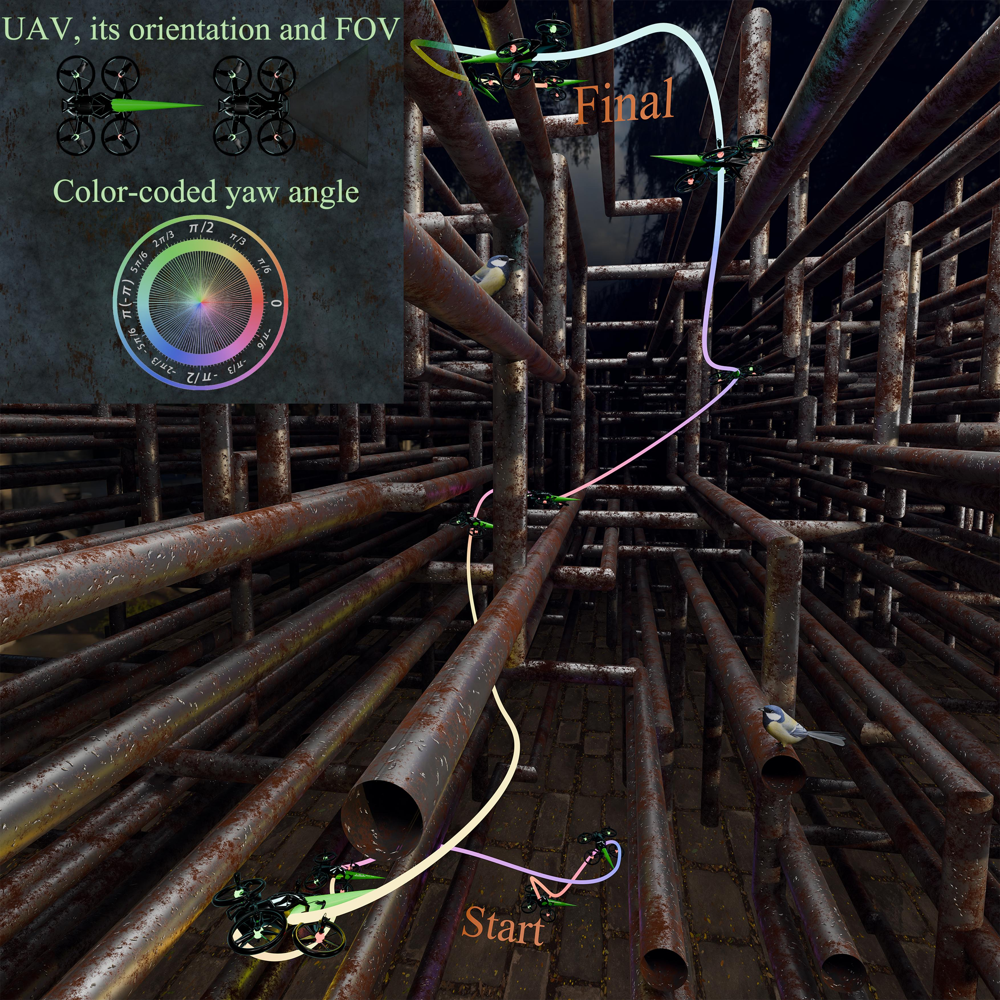

**图 1**：没有先验地图时，所提方法在密集金属管道网格中的仿真结果。无人机从地面起飞，利用机载视觉传感器主动感知未知空间，避开全部障碍物，最终到达管道上方的目标位置。

### 一、引言

在没有地图、障碍物高度密集的环境中实现安全自主飞行，可以显著扩大无人机在探索、搜索救援等任务中的应用范围。在这类任务中，无人机完全依靠机载传感器，且没有任何先验地图，规划器必须主动处理未知空间带来的风险。因此，规划器既要应对已知和未知障碍物，又要通过主动感知保持较高的工作效率。

现有方法常常低估未知空间的安全风险。通常，系统令偏航方向与速度方向一致，使前方路径尽量处于视场内，但路径仍可能有部分没有被看到。例如，指令转动速度可能超过平台能够实现的偏航速度；在垂直视场有限时，高速上升还会使上方区域无法观测。在当前可见区域内紧急停车能够提供保守的安全裕度，但会明显降低效率；对于非全向视场，还可能把无人机困在局部死路中。此外，这类方法依赖计算量较大的前端生成满足感知要求的路径，在密集环境中难以保证实时性。

基于优化的替代方法将主动感知和安全项加入优化，例如约束偏航、俯仰以保持未知区域可见，或限制速度。但这些约束通常只在已知区域与未知区域的边界附近才启用，导致观察开始得太晚，迫使无人机在进入未知空间前减速。已有方法还常常忽略无人机自身占据的体积，因而可能漏掉视场外、但仍会撞到机体的未知障碍物。

这些问题的根源是感知模型过于简单、感知时机过于保守。已有模型没有充分描述完整姿态动力学与传感器几何之间的耦合，也没有考虑加速度引起的俯仰会使传感器主视轴偏离飞行方向。因此，规划器只能设置保守的速度上限，防止无人机冲入未观测区域。感知往往被当作最后一道安全检查，而不是沿轨迹主动调整。更重要的是，垂直视场限制没有得到精确建模，垂直机动时的盲区被忽略。

为解决这些问题，本文提出 FLAP，即面向无先验地图全三维导航的受视场约束主动感知轨迹规划方法。FLAP 把主动感知直接嵌入轨迹优化，使其成为可微的组成部分，而不是独立模块。本文从无人机动力学模型出发，在传感器坐标系中建立精确的感知约束，并用与速度相关的安全判据触发风险感知惩罚。可见性约束难以满足时，优化轨迹会自然地转向更安全、更慢的运动；当能够保持可见时，则允许无人机继续高速运动。

本文的主要贡献如下：

1. 从无人机动力学模型出发，直接在传感器坐标系中建立感知约束，形成适用于不同传感器安装位置和视场几何的通用表达。
2. 提出带有速度触发机制的风险感知主动感知惩罚函数。只要可见性能够保持，无人机就可以维持较高速度；可见性难以保持时，系统会引导无人机减速。
3. 提出适用于任意三维机动的可微轨迹优化框架，将主动感知段参数化并优化，促使无人机尽早观察未知区域，降低晚观察风险。
4. 在有限视场和复杂三维结构下开展仿真与实物试验，验证无先验地图导航的安全性和效率。

全文安排如下：第二节介绍未知环境中的轨迹规划研究；第三节介绍双 ESDF 环境表示、前端路径规划和无人机动力学模型；第四节介绍主动感知惩罚函数及安全、可见性判据；第五节建立统一轨迹优化问题；第六、七节分别给出仿真和实物试验；第八节总结全文并讨论后续工作。

## 原文第 2 页核心内容与翻译

### 二、相关工作

未知环境中的轨迹规划缺少先验地图，最大的风险是与没有被探测到的障碍物相撞。规划器必须在安全观察和朝目标前进之间取得平衡：安全要求有足够时间观察环境，往往会带来谨慎、慢速甚至停车；效率则要求快速、直接地前进。本文把主动感知定义为：通过规划观察未知区域来降低环境不确定性，从而提高轨迹安全性。

已有工作大致分为三类：基于环境假设的方法、基于风险应对的方法和基于信息获取的方法。

#### A. 基于环境假设的规划器

一种常见做法是先对未知空间作假设，把规划转化为确定性问题。乐观原则把所有未知空间视为可通行区域 [1]–[4]，可以鼓励探索并降低计算量，但实际环境往往不满足这一假设，可能把无人机引入障碍物区域。相反，悲观原则把未知空间视为占用或危险区域，通常只允许轨迹在已知自由空间内运动 [5]–[9]，或者在进入未知区域前减速到停止 [10]，也有方法惩罚穿过未知空间的路径 [11]。还有一些方法使用运动基元，把运动限制在已经观测过的视场内 [12]、[13]。这些做法虽然提高了安全性，却容易过于保守，在杂乱环境中可能把无人机困在死路中。

下一最佳视点 [14] 和基于前沿的方法 [15]、[16] 通过主动选择已知空间中的观察位置缓解上述问题。它们对探索有效，但仍依赖悲观假设，因而会牺牲轨迹效率。

#### B. 基于风险应对的规划器

风险应对方法不试图消除环境不确定性，而是把安全判据加入规划目标或约束中来管理导航风险。一些方法根据与障碍物的距离限制速度 [17]、[18]，或者从环境特征中学习允许的最大速度 [19]。另一些方法限制运动方向与机器人朝向之间的夹角，以降低平面导航风险 [20]、[21]。这些启发式规则能够降低风险，但没有直接描述规划轨迹本身是否安全。

概率方法通过推断不确定条件下的碰撞可能性，提供较不保守的处理方式。有些方法估计未知空间中的碰撞风险 [22]，或依据先验信息预测未观测障碍物 [23]–[25]；更严格的不确定性方法同时建立定位、建图和运动不确定性模型，在信念空间内进行带概率安全保证的规划 [26]。不过，这些方法主要是评估概率碰撞约束，通常没有在传感器视场和遮挡约束下明确要求主动观察未知区域。

另一类方法同时保留具有不同风险水平的多条轨迹，例如把限制在已知空间内的安全路径与穿过未知区域的探索路径配对 [27]、[28]，并通过优化分支点来兼顾效率和安全备选路径 [29]。其关键不足是：如果探索路径被阻挡，安全路径仍可能把无人机带入保守的死路；尤其是传感器视场外的垂直未知区域，无法仅靠偏航调整来观察。

#### C. 基于信息获取的规划器

基于信息获取的方法把减少地图不确定性直接加入规划目标，同时处理安全导航。有些工作沿轨迹计算信息增益，例如评估各个视点能够揭示多少被遮挡区域 [30]，或直接最小化遮挡空间的范围 [31]。Janson 等人 [32] 提出不可避免碰撞状态（ICS），可以自然地产生提前减速或绕行观察等行为，但这类方法没有解决视场有限的问题。

另一类方法给轨迹施加感知约束，例如要求相邻路径点之间的路径始终位于前一个路径点的视场内 [33]、[34]，以避免进入未观测区域；也有方法主动把机器人引离造成遮挡的障碍物 [35]、[36]。近期方法把速度约束与感知目标结合，以平衡安全和信息增益 [34]、[37]。然而，它们通常建立二维假设或只处理基于偏航的水平感知，不能处理垂直视场限制。

本文把主动感知直接嵌入轨迹优化，而不是将其作为硬几何限制或独立的信息增益目标。感知约束由无人机动力学模型在传感器坐标系中推导，因此可以处理一般视场几何和超越二维、仅偏航方法的垂直机动。同时，速度触发的激活机制和经过优化的主动感知段，使规划器能够自适应平衡观察和减速，避免保守限速，并降低晚发现造成的风险。

## 原文第 3 页核心内容与翻译

### 三、预备知识

本节介绍 FLAP 使用的基础概念，包括采用双 ESDF 地图的环境表示、前端路径规划和无人机动力学模型。

### A. 双 ESDF 地图

为了获得环境的几何距离信息，并为轨迹优化提供可微约束，本文使用欧氏有符号距离场（ESDF）。首先利用传感器点云通过射线投射建立概率占据栅格地图，再依据概率阈值把栅格分为安全、障碍物和未知三类。针对不同的规划安全要求，建立两个 ESDF：Es(·) 把未知栅格和障碍物栅格都视为不安全；Eu(·) 只把障碍物栅格视为不安全。

考虑无人机自身占据的体积，定义安全裕度 ds。定义已知安全空间 Ds 和安全或未知空间 Du：

Ds = {p | Es(p) ≥ ds},  (1)

Du = {p | Eu(p) ≥ ds}.  (2)

进一步定义 Da = Du\Ds。Da 表示有条件可通行空间，即相对于已探测障碍物可能是安全的未知区域，但进入时必须进行主动感知。根据 ESDF 值和安全裕度，轨迹被分为位于 Ds 中的安全段 Ss，以及位于 Da 或 Ds 中的过渡段 St，两者由已知—未知边界平面 B 分开。

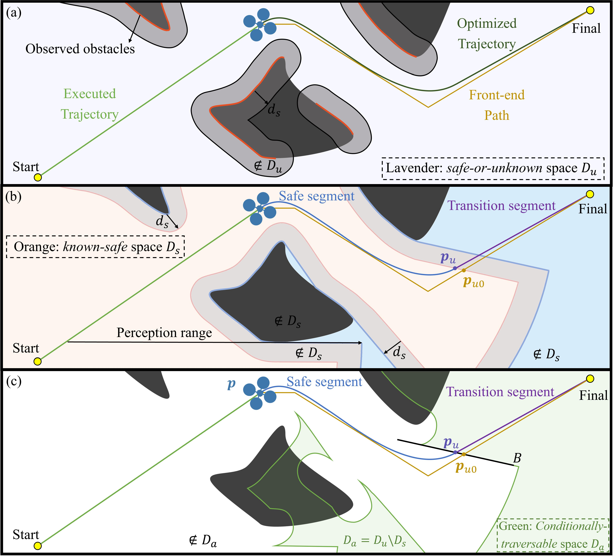

**图 2**：三个规划空间的独立可视化：(a) 未知空间 Du；(b) 已知安全空间 Ds；(c) 有条件可通行空间 Da。轨迹被划分为安全段 Ss 和过渡段 St，边界为已知—未知边界平面 B。安全段与过渡段之间的边界点以 pu0 初始化，并在 B 上优化。

### B. 前端路径规划

为利用无人机的灵活机动能力高效计算全局路径，本文在前端采用加权 A* 算法。水平和垂直视场都可能影响感知，但水平可见性通常能够通过偏航转动改善，或者由全向 LiDAR 自然提供。相比之下，垂直主动感知效率较低，因为垂直可见性同时受高度变化和有限垂直视场影响。因此，前端搜索鼓励无人机在已知安全空间内先接近目标高度，从而减少不必要地进入有条件可通行空间，也减少重复垂直感知。

对于第一次从 Ds 进入 Da、且高度不同于目标高度 izg 的前端点，加入额外代价 gh：

gh = { wr | izc − izg | + wa, if ip ∈ Ds and ic ∈ Da; 0, otherwise }.  (3)

其中 wr 惩罚与目标高度的偏差，wa 是进入未知空间的固定代价，优先选择能够利用已知安全空间的路径。

### C. 无人机动力学模型

控制输入定义为 u={f,ω}，其中 f∈R≥0 为总推力，ω∈R3 为机体系角速度。动力学为：

m v̇ = −mge3 − RDR⊤σ(∥v∥2)v + Rfe3， Ṙ = Rω̂。  (4)

其中 m 为质量，v 为速度，g 为重力加速度，e3=(0,0,1)⊤；R 是从机体系到世界坐标系的旋转矩阵，ω̂ 是 ω 的反对称矩阵。阻力系数矩阵 D=diag(dh,dh,dv)，σ(∥v∥2)=1+cp√(∥v∥2^2+εv) 为描述非线性动力学影响的项。

与推力方向一致的机体系 z 轴为：

zb = N(v̇ + ge3 + dh/m σ(∥v∥2)v), N(x):=x/∥x∥2。  (5)

本文通过 Hopf 纤维化把姿态四元数分解为偏航分量 qψ 和倾斜分量 qz：

qψ=(cos(ψ/2),0,0,sin(ψ/2))⊤，(6)

qz=1/√(2(1+z3b))(1+z3b,−z2b,z1b,0)⊤，(7)

完整姿态四元数为 q=qz⊗qψ，⊗ 表示四元数乘法；对应旋转矩阵为 R(q)=Rquat(q)。

## 原文第 4 页核心内容与翻译

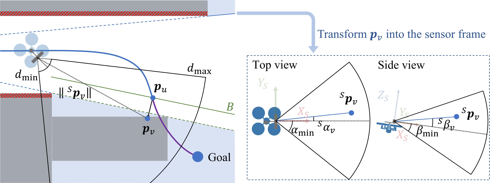

**图 3**：可见性判据及相关几何量的可视化。传感器需要在有效距离和水平、垂直视场内观察目标点，同时保持与已知—未知边界的安全关系。

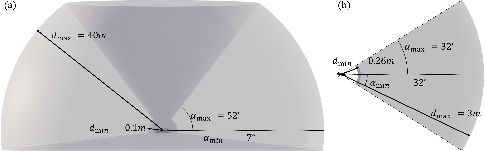

**图 4**：两种具有代表性的传感器配置。(a) Livox Mid-360 LiDAR 的垂直视场不对称；(b) 常见深度相机的垂直视场近似对称。

### 四、主动感知惩罚函数

为了把主动感知嵌入轨迹优化，本文建立一组风险感知的感知惩罚函数。惩罚函数由几何可见性判据和安全裕度推导，保证无人机在无碰撞运行的同时主动降低环境不确定性。

### A. 已知—未知空间边界

获得前端路径后，取路径从 Ds 第一次进入 Da 的点作为过渡点 pu0。由于 pu0 周围区域可能已经被此前的观测更新，当前 Ds 与 Da 的边界不能只根据当前位置 pc 到 pu0 的线段遮挡情况确定，因此使用最新地图的 ESDF 来确定边界。在以 pu0 为中心、每边跨越 I 个体素的立方区域内，找出所有已知安全且邻接 Da 未知栅格的网格点。用这些点拟合平面，并令法向量 nu 指向安全空间：

B: n⊤u(pB−pu0)=0。 (9)

待优化轨迹由安全段 Ss 和过渡段 St 构成；总轨迹段数 M=m1+m2，位于 B 上的 pu 表示轨迹从已知区域过渡到未知区域的位置。

### B. 未知点的可见性判据

由于无人机本身体积和安全裕度 ds，不能直接把边界点 pu 作为感知目标，否则无人机到达 pu 时，部分机体可能已经伸入相邻未知区域。因此沿 −nu 移动 pu，得到感知点 pv：

pv=pu−dmaxBs nu， dmaxBs>ds。 (10)

设机载传感器的有效距离为 [dmin,dmax]；垂直视场为 [αmin,αmax]，水平视场为 [βmin,βmax]，均相对于传感器主轴测量。传感器坐标系 S 为右手坐标系，+x 轴沿光轴，+y 轴指向侧方，+z 轴向上。传感器在机体系中的安装位置记为 BpS。

将世界坐标中的 pv 转到传感器坐标系，记为 Spv。垂直、水平角度约束分别为 Cver(Spv)≤0、Chor(Spv)≤0，要求目标处于传感器视场内。对距离加入：

Cdmax=∥Spv∥2−dmax≤0， Cdmin=dmin−∥Spv∥2≤0。 (14)

传感器应位于边界 B 的安全侧观察 pv：

pS=p+R(q)BpS， Cvd=−n⊤u(pS−pu)≤0。 (15)–(16)

为避免掠射角导致空间分辨率下降，设最小观察角 θv：

θ(pS,pv)=arcsin((dis(B,pS)+dmaxBs)/∥pS−pv∥2)≥θv。 (17)

其中 dis(B,pS)=n⊤u(pS−pu)。为避免 arcsin 和除法在可行性边界附近条件较差，使用等价形式：

Cvθ=∥pS−pv∥2 sinθv−(dis(B,pS)+dmaxBs)≤0。 (18)

### C. 风险感知主动感知

必须在无人机进入未知空间的 pu 之前观察到 pv。安全判据为：

Csd=∥v∥2^2/(2amax)+dm−∥p−pu∥2≤0。 (19)

其中 dm 是重新规划安全裕度，amax 是保守选取的减速度。定义连续激活函数 La(x)：当 x≤−εa 时为 0，当 x≥εa 时为 1，中间区间采用原文给出的两段三次平滑表达式。主动感知惩罚为：

Pap=La(Csd)·Σℓ∈P wℓL1(Cℓ)， P={ver,hor,dmin,dmax,vd,vθ}。 (20)–(21)

安全判据充分满足时感知约束不施加；风险增加时，感知惩罚逐步启用，推动无人机观察 pv。这样轨迹可以在安全导向和感知导向之间连续切换。

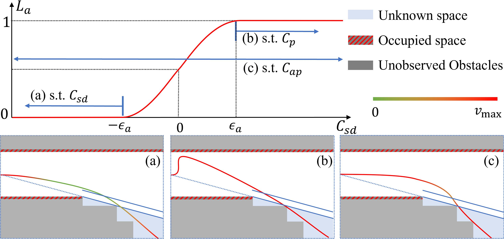

**图 5**：激活函数 La(Csd) 及其产生的轨迹行为。(a) 安全主导情形；(b) 感知主导情形；(c) 所提风险感知主动感知行为。

## 原文第 5 页核心内容与翻译

### 五、优化问题的建立

在主动感知惩罚函数和动力学模型基础上，本文把规划任务建立为统一的可微优化问题。目标是在满足安全和动力学约束、并纳入主动感知过程的同时，尽量减小控制量。

### A. 轨迹表示

采用 MINCO 轨迹类 [39]，进行最小控制量的时空轨迹优化。轨迹由微分平坦输出 o=[p⊤,ψ]⊤ 的时间多项式表示，其中 p∈R3 是位置，ψ 是偏航角。对于 M 段轨迹，MINCO 用可逆带状矩阵 K(T) 解耦空间参数和时间参数：

K(T)c=[o[h−1]0,o′1,0,…,o′M−1,0,o[h−1]f]⊤， oi(t)=c⊤iβ(t)。 (22)–(23)

每段轨迹是 2h−1 次多项式，式 (22) 保证相邻轨迹段的状态及其导数连续到 2h−2 阶。本文取 h=3。

### B. 轨迹截断和终端状态放松

运行中需要频繁重新规划，轨迹过长会带来不必要的计算，因此设定过渡段 St 的截断长度 lu。当路径进入 Da 且在其中的累计长度超过 lu 时，在该处截断并丢弃后续部分，将截断点设为临时目标位置 ptf。截断后，无人机只需飞向临时终端状态，不要求到达时完全停车，也不施加终端偏航约束。终端偏航角 ψf 和终端速度 ṗf 被作为优化变量；相关梯度按式 (24)、(25) 的单位向量求得。

### C. 主动感知段

主动感知惩罚 Pap 不适合施加在整个安全段 Ss 上。因此在 Ss 中定义一个持续时间固定为 Tp 的子轨迹 Sp，称为主动感知段，只在该段施加 Pap。令 Ss 的持续时间为 Ts，起始时刻为：

tas=ρ(Ts−Tp)， Ts=Σi=1m1 Ti， ρ∈(0,1)。 (26)

通过 ϱ(ρ)=log(ρ/(1−ρ))、ρ(ϱ)=1/(1+e−ϱ) 将有界变量转换为无约束变量 (27)，使优化器可以选择 AP 段的开始时间。为鼓励提前观察，在目标函数中加入 wρρ(ϱ)。AP 段划分为 κ 个子区间并数值积分：

Iap=Σj=0κ(Tp/κ)νjPap(tj)， tj=tas+jTp/κ。 (28)

AP 段中的安全主导、耦合和感知主导部分由风险加权自然形成，而不是人工预先划分。由于可见性约束只描述视场几何，没有描述遮挡，在 AP 段终点增加：

Sap(opf)=wsdL1(Csd(opf))+Σℓ∈P wℓL1(Cℓ(opf))。 (29)

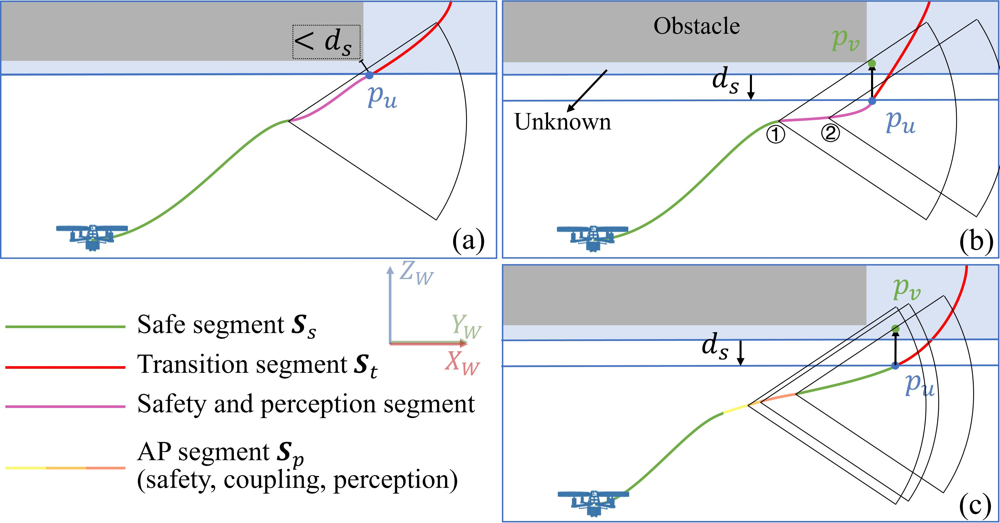

**图 6**：所提主动感知段与其他策略的对比。(a) 忽略安全距离，在 Ss 末段评价安全和感知约束；(b) 考虑安全距离，在 Ss 末段评价约束；(c) 所提 AP 段，由风险感知激活形成安全主导、耦合和感知主导部分。

### D. 约束和惩罚项

除 AP 段外，轨迹优化还包括安全、动力学可行性和时间一致性约束。边界点 pu 必须落在 B 上，取 Ss 末端航点并用 B 内两个正交基向量表示：

pu=pB+υ1Bζ1+υ2Bζ2， pB∈B。 (30)

各段时间 Ti 通过文中的光滑双射映射到无约束变量 τi，保证 Ti>Timin。对 Ss 取 Timin=Tp/m1，对 St 取 Timin=0。边界一致性惩罚为：

SminBs(pu)=wminBsL1(dminBs−Es(pu))， SmaxBs(pu)=wmaxBsL1(Es(pu)−dmaxBs)。 (32)

重新规划时，新旧轨迹交接点可能出现 jerk 跳变，因此加入：

Sjerk=wjerk∥o⃛0−o⃛old∥2^2。 (33)

将 Cd(o,…,o(h))≤0 在各轨迹段采样并数值积分：

Id(c,T)=wdΣi∈IΣj=0n(Ti/n)νjL1(Ci,jd(c,T))。 (34)

安全段要求 Css=ds−Es(p)≤0；过渡段允许进入未知空间，但要求 Csu=ds−Eu(p)≤0。速度和机体角速度约束为 Cv=∥ṗ∥2^2−vmax^2≤0、Cω=∥ω∥2^2−ωmax^2≤0；其余动力学、倾角和推力约束按原文对应公式施加。

## 原文第 6 页核心内容与翻译

### E. 优化问题

完整优化问题在 o′、τ、ϱ、ζ、ψf、ṗf 上求最小值。目标函数包括控制量积分、时间正则项、主动感知积分、AP 段终点惩罚，以及安全、动力学、边界和连续性惩罚。第一项表示控制量，εTsTs 和 εTuTu 用于时间正则化，TA 为总轨迹时间。各约束仅在其适用的轨迹段上积分。

### F. 重新规划

规划器在飞行过程中滚动运行。每次获得新地图后，先把旧轨迹截取到当前状态，再根据最新 ESDF 更新安全段、过渡段和边界平面，并求解优化问题。为考虑规划延迟，设定截止时间 TR；在 TR 内获得可行解就执行新轨迹，超时则保持上一条已经验证安全的轨迹并在下一次更新时重试。若整个前端路径都位于 Ds，则不需要过渡段和主动感知段。

## 原文第 7 页核心内容与翻译

### 六、仿真

本节在多种环境中用代表性基线评价 FLAP。对比方法包括 SUPER、FM、RAPTOR 和 NBV，评价指标包括到达时间、轨迹长度、控制能量、偏航平滑性、计算时间和重新规划次数。

### A. LiDAR 传感器

在水平狭窄空间、上方障碍物、U 形迷宫和垂直管道四类环境中开展仿真。LiDAR 的视场和探测距离按照实验设置建模，未知空间由传感器逐步更新。SUPER、FM 等方法分别代表基于视场的保守规划和双轨迹风险处理方法。

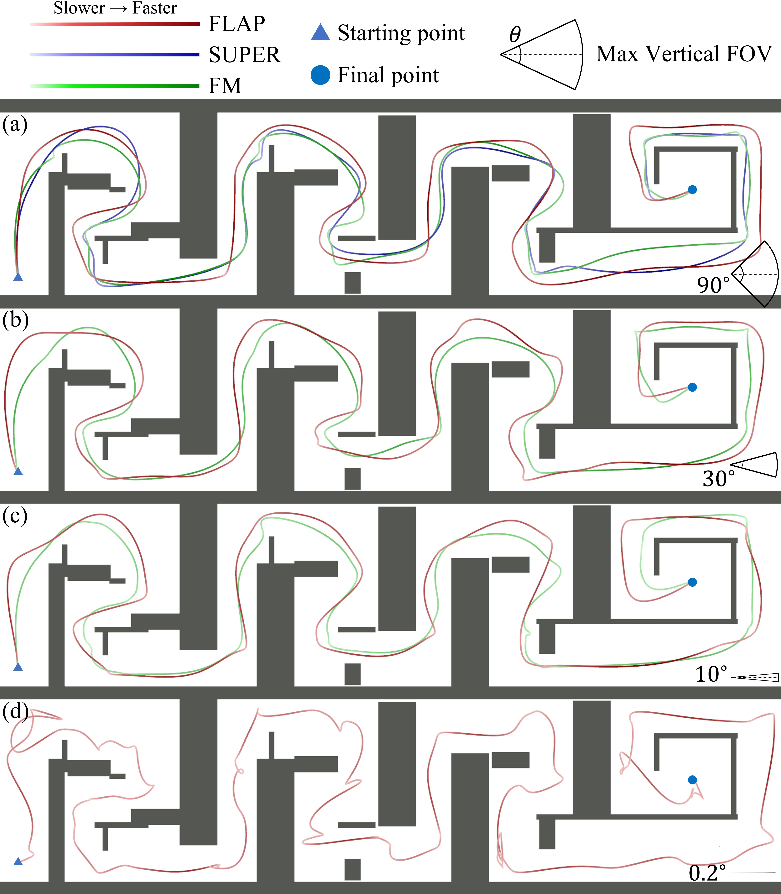

**图 7**：FLAP、SUPER 和 FM 在水平狭窄空间中的结果。颜色表示无人机高度，局部放大图展示典型位置的轨迹、视场和障碍物。

在水平狭窄空间中，FLAP 会在未知区域前提前调整偏航并观察遮挡区域；SUPER 受到保守视场限制，FM 则需要在探索轨迹和备用轨迹之间切换。FLAP 能在保持安全的同时减少停车和重复绕行。

**图 8**：FLAP 和 SUPER 在上方障碍物场景中的结果。颜色表示高度，局部图展示上方障碍物、感知段和无人机视场。当垂直视场为 90° 时，FLAP 即使在最大速度下也能提前观察上方区域；当垂直视场缩小到 10° 时，FLAP 会更早改变位置和姿态，为观察和制动留出时间。

## 原文第 8 页核心内容与翻译

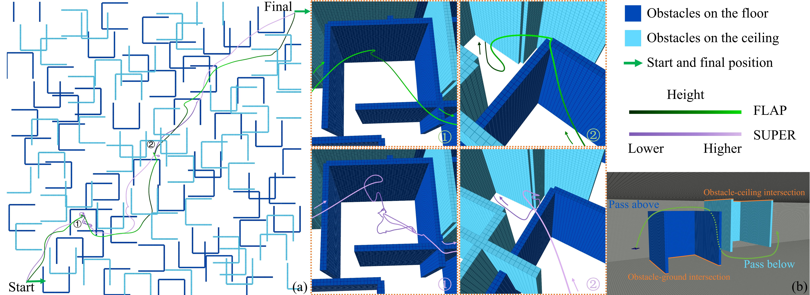

**图 9**：FLAP 和 SUPER 在 U 形迷宫中的结果。(a) 两种方法的轨迹，颜色表示无人机高度；(b) 两类 U 形障碍物，颜色区分连接地面和连接天花板的障碍物，橙线表示障碍物与地面或天花板的交线。

在 U 形迷宫中，SUPER 无法生成有效的备用轨迹，因而误判视场盲区内的障碍物。FLAP 先在已知空间内机动到适合观察的位置，再进入未知空间；若最直接的垂直路径被确认阻挡，就偏离原方向，在已知空间内继续上升并从侧面绕过障碍物。面对连接地面的障碍物，FLAP 上升避障；面对连接天花板的障碍物，FLAP 下降避障。

### B. 相机传感器

相机实验使用有限水平、垂直视场的深度相机。相机不仅要避免三维空间碰撞，还要主动调整偏航，使未知区域保持在视场内。实验包括水平狭窄空间、上方障碍物、U 形迷宫和垂直管道。

## 原文第 9 页核心内容与翻译

对连续轨迹的感知约束采用区间积分形式，每条约束只在相关安全段、过渡段或 AP 段上计算，避免把不必要的约束施加在整条轨迹上。每次重规划保留当前状态、旧轨迹 jerk 和已经确认的地图区域，增量更新约束值。

在相机视场较窄的环境中，若直接沿速度方向飞行，障碍物可能在转动和姿态调整完成前进入碰撞距离。FLAP 会把感知段提前，先在安全空间内改变偏航或高度，再继续前进。

## 原文第 10 页核心内容与翻译

### C. 仿真结果和评价指标

表 I 汇总 FLAP、SUPER 和 FM 的比较结果。指标包括轨迹持续时间 TD、轨迹长度 TL、控制能量 E、最大速度 MV，以及主动感知段和备用轨迹的结果。FLAP 通过主动感知减少不必要的停车，同时保持可行速度和轨迹长度；SUPER 更保守，FM 可能因备用轨迹而停滞。

优化问题在每次地图更新后求解。前端路径只用于提供全局方向，感知和动力学约束由后端可微优化统一处理。计算量随轨迹段数近似线性增长，适合滚动重新规划。

**表 I：FLAP、SUPER 和 FM 的比较结果。** TD 为轨迹时间（s），TL 为轨迹长度（m），E 为能量（m²/s⁵），MV 为平均速度（m/s）；结果中的 T 10/10 表示 10 次试验全部成功，F 后的百分数表示最大完成比例，P 为主动感知段或备用轨迹占总轨迹长度的比例。

| 垂直视场 | 方法 | TD/s | TL/m | E/(m²/s⁵) | MV/(m/s) | 结果 | P（AP/BT） |
|---|---|---:|---:|---:|---:|---|---:|
| 90° | FLAP | 40.78 | 72.22 | 138.01 | 1.77 | T 10/10 | 27.73% |
| 90° | SUPER | 41.85 | 81.44 | 171.42 | 1.95 | T 10/10 | 0.02% |
| 90° | FM | 44.42 | 69.42 | 137.50 | 1.56 | T 10/10 | 1.72% |
| 30° | FLAP | 51.81 | 77.38 | 188.01 | 1.49 | T 10/10 | 31.86% |
| 30° | SUPER | — | — | — | — | F 79.19% | — |
| 30° | FM | 55.09 | 73.56 | 158.34 | 1.34 | T 10/10 | 4.94% |
| 10° | FLAP | 69.85 | 88.06 | 170.76 | 1.26 | T 10/10 | 32.56% |
| 10° | SUPER | — | — | — | — | F 66.04% | — |
| 10° | FM | 85.68 | 76.27 | 162.23 | 0.89 | T 10/10 | 3.39% |
| 0.2° | FLAP | 155.55 | 115.22 | 288.70 | 0.74 | T 6/10 | 40.72% |
| 0.2° | SUPER | — | — | — | — | F 39.74% | — |
| 0.2° | FM | — | — | — | — | F，不可行 | — |

## 原文第 11 页核心内容与翻译

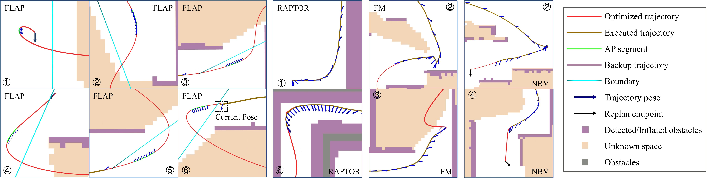

**图 10**：FLAP、RAPTOR、FM 和 NBV 在水平狭窄空间中的对比。无人机使用水平视场约 78° 的前向深度相机；标记 ①–⑥表示用于详细分析的代表位置。

RAPTOR 能够避障并进行感知相关优化，但没有显式施加可见性约束。由于航向独立规划，无人机可能来不及转向待观察区域；当起点靠近障碍物且初始偏航方向相反时，RAPTOR 可能在相机看到障碍物之前发生碰撞。FM 能通过较慢运动保留备用轨迹，但在狭窄区域中会出现停顿和绕行。NBV 能选择观察点，但到达观察点后常需要停车，导致加减速次数增加。

## 原文第 12 页核心内容与翻译

在上方障碍物场景中，FLAP 先满足制动安全条件，再安排主动感知段，避免高速上升到障碍物下方才开始观察。其风险感知激活函数使安全项、耦合项和感知项连续变化，不需要人工指定切换时刻。当垂直视场极小时，系统把观察动作安排在已知安全空间，并在确认绕行方向后继续飞行。

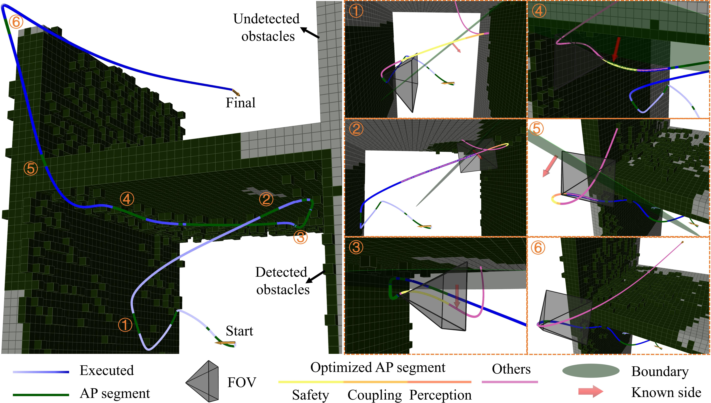

**图 11**：FLAP 在上方障碍物场景中的结果。左侧为包含 AP 段的执行轨迹，右侧为多个位置的放大图，展示优化轨迹、执行轨迹和无人机当前视场；AP 段由激活机制形成安全主导、耦合和感知主导部分。

## 原文第 13 页核心内容与翻译

FLAP 在包含大范围垂直运动的场景中先观察上方障碍物，再决定越过障碍物还是从侧面绕行。若直接越过不可行，系统改为侧向绕行；观察完成后才规划最终到达路径。

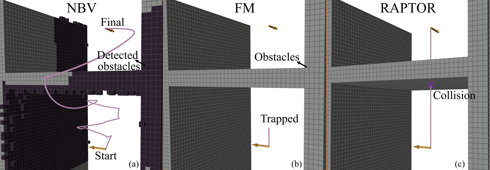

**图 12**：NBV、FM 和 RAPTOR 在上方障碍物场景中的结果。NBV 以保守方式到达目标；FM 被困在障碍物下方；RAPTOR 在快速上升过程中发生碰撞。

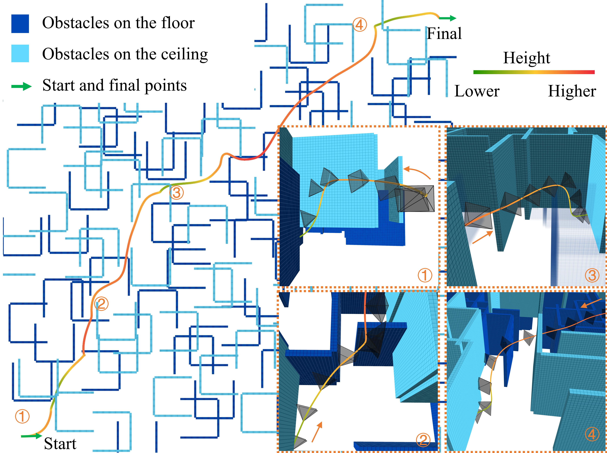

**图 13**：使用深度相机时，FLAP 在 U 形迷宫中的表现。轨迹颜色表示高度，轨迹上的姿态标记表示无人机方向。

在位置 ①、③、④，无人机下降以绕过两侧较高的障碍物；在位置 ②，上升以绕过较低障碍物。若右侧看起来更短、更接近目标，系统会先减速并转动偏航观察右侧，确认有高障碍物后再继续前进。当地形下方被遮挡时，系统先下降到能够确认安全的区域，再继续飞行。

## 原文第 14 页核心内容与翻译

在垂直管道场景中，墙面有多个平面障碍物，障碍物间距为 1 m，宽度为管道边长的一半。无人机从管道底部起飞，穿过多组障碍物并到达顶部目标，最大速度设为 2 m/s。FLAP 和 NBV 能够完成任务；NBV 在观察点处停顿，加减速频繁，整体飞行时间较长；FLAP 通过主动感知规划连续、平滑的轨迹，并利用靠近管壁的路径提高效率。

在水平狭窄空间中，表 II 的指标还包括偏航加速度平方和 SSAY（rad²/s⁴）、计算时间 CT（ms）和重新规划次数 RP。FLAP 的轨迹时间为 40.17 s、长度为 73.37 m、能量为 165.98 m²/s⁵、SSAY 为 121.10、计算时间为 5.49 ms、重新规划次数为 182；NBV 分别为 74.51 s、73.12 m、112.04 m²/s⁵、84.78、0.88 ms 和 231；FM 分别为 88.10 s、81.97 m、188.49 m²/s⁵、45.10、2.73 ms 和 563；RAPTOR 分别为 48.43 s、72.40 m、148.22 m²/s⁵、701.58、8.50 ms 和 163。FLAP 通过主动观察减少过度减速，在保持较高速度的同时控制偏航变化和计算量。

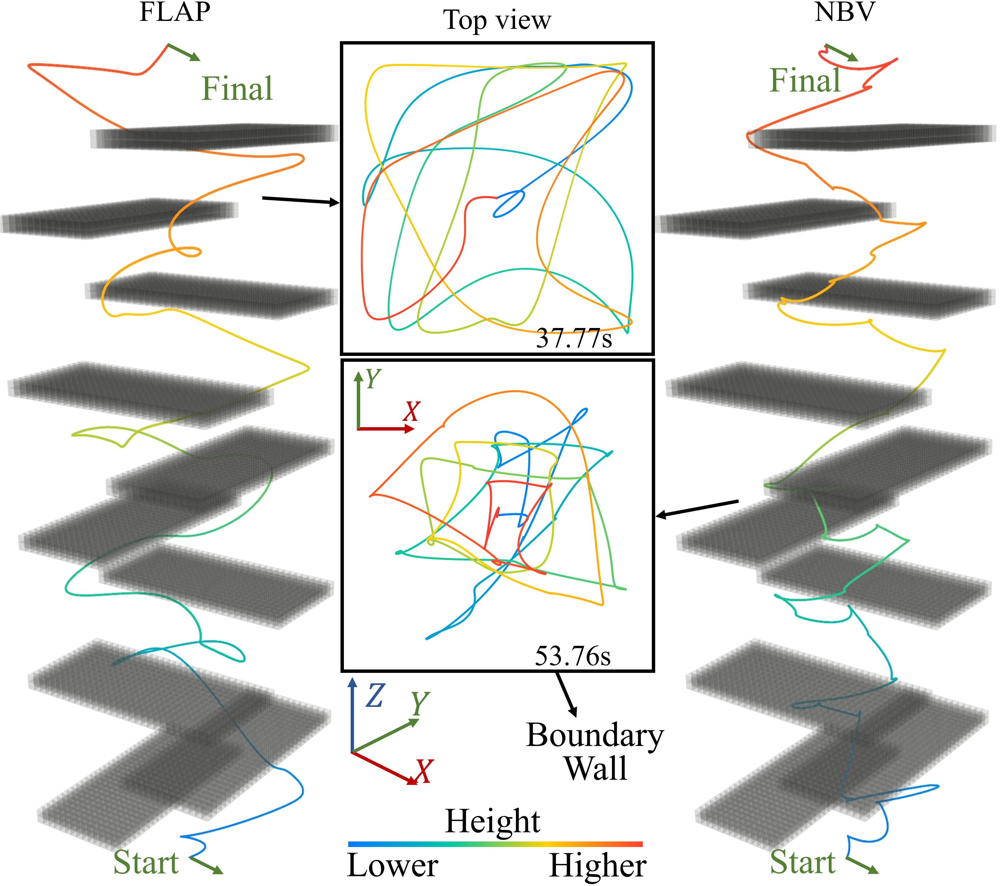

**图 14**：FLAP 与 NBV 在含有重叠垂直障碍物的杂乱环境中的表现。搭载视觉相机的无人机需要穿过垂直受限通道。为便于观察，图中省略管道壁；中间俯视图比较两条轨迹、障碍物边界和从起点到目标的飞行时间。

### 七、实物试验

本文在多个具有代表性的真实环境中验证 FLAP。

## 原文第 15 页核心内容与翻译

### A. 穿越高大障碍物

该试验评价无人机使用主动感知穿越高大垂直障碍物的能力。无人机需要先越过高墙，再谨慎下降到另一侧有障碍物的区域，而不是在没有充分观察的情况下快速下降。为比较不同感知方式，实现三种传感器配置：水平安装的 LiDAR、向前倾斜 15° 的 LiDAR，以及光轴沿机体前向 x 轴安装的 Orbbec Gemini 335 深度相机。

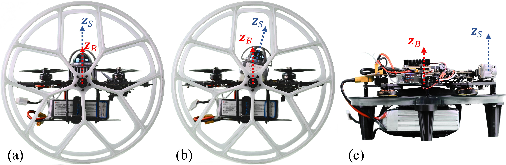

**图 15**：三种传感器配置的无人机平台：(a) 水平 LiDAR；(b) 倾斜 LiDAR；(c) 相机。图中给出机体系 B 和传感器系 S 的 z 轴；配备 LiDAR 的无人机安装了被动轮，作为安全试验中的保护装置。

## 原文第 16 页核心内容与翻译

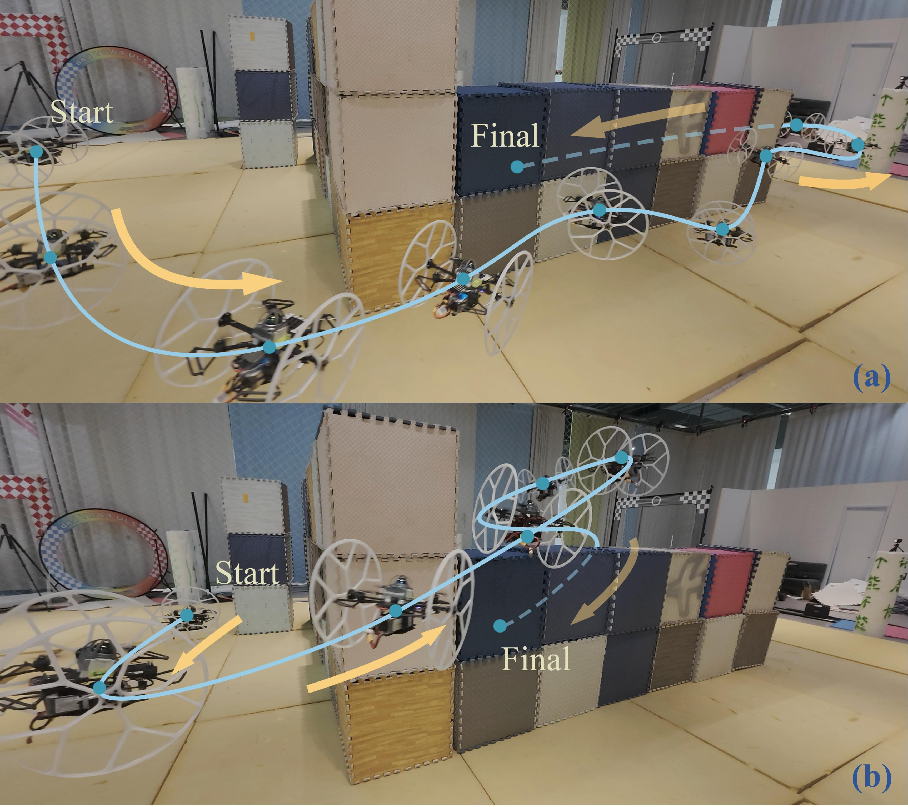

**图 16**：三种感知配置的实物试验结果：(a) 水平 LiDAR；(b) 倾斜 LiDAR；(c) 相机。无人机依靠机载传感器穿越正面高障碍物，并在另一侧着陆；视觉试验中，轨迹上的偏航角用渐变颜色表示。

水平 Mid-360 LiDAR 的垂直视场约为上方 52°、下方 7°。较大的上视场使无人机容易观察并越过正面障碍物，但越过障碍物后，下视场很小，下降时难以保持下方区域可见。无人机因此先从目标区域后退，再继续下降，轨迹呈波浪形。由于无人机具有尺寸，视场内的区域不一定都安全，盲区中的障碍物也可能碰撞，所以还需要向上机动来避开盲区障碍物。

将 LiDAR 绕机体 y 轴向前倾斜 15°后，前向垂直视场约为 [−22°，37°]，上限略高以适应飞行中的前倾。试验表明该配置有效：越过障碍物时先侧向接近并转动偏航，使机体侧面朝向目标；越过后再调整姿态观察下方空间，从而更快到达目标。

深度相机的水平、垂直视场约为 [−45°，45°] 和 [−32°，32°]，因此运动更保守。无人机采用折线轨迹上升到更高的已知自由空间，同时为偏航调整留出时间。下降时，加速度会引起机头下俯，略微改善观察效率，使无人机用较少的折线到达目标。

### B. 水平和垂直主动感知

该试验说明 FLAP 可以利用垂直运动进行主动感知，而不局限于水平绕行。垂直受限策略主要在水平方向搜索可行路径，以降低垂直盲区碰撞风险；垂直不受限策略允许无人机沿 z 轴运动，寻找可观察且可通行的空间。

在前方高障碍物、右侧略低障碍物的环境中，垂直受限策略被迫水平绕行；FLAP 则利用垂直方向从障碍物上方通过。下降过程中，倾斜安装的 LiDAR 主要在前方提供下视场，无人机会主动调整偏航以改善对未探索区域的观察。

## 原文第 17 页核心内容与翻译

**图 17**：搭载 LiDAR 的无人机在高度受限和高度不受限两种策略下的规划结果。场景包含正面高障碍物和右侧较低障碍物。

**图 18**：搭载相机的无人机在 L 形障碍环境中的规划结果：(a) 垂直运动受限；(b) 垂直运动不受限。

相机试验中，首先限制垂直运动，评价水平被遮挡环境。起飞后，规划器优先探索左侧；确认左侧不可通行后，在位置 ②转向右侧。到位置 ③时，规划器转动偏航，检查被障碍物遮挡的可能捷径；确认必须绕行后，在位置 ④观察未知空间，再到达目标。

允许垂直运动时，无人机从位置 ①上升到位置 ②，观察障碍物顶部，而不是进行水平绕行；随后在位置 ③朝目标前进。该结果说明垂直主动感知扩展了可用观察策略，使系统能够处理三维遮挡。图中未检查左侧，可能是因为初始规划状态和早期观测不确定性较高，使规划器偏向右侧；这一现象不是本试验关注的重点。

### C. 室外试验

室外试验评价规划器在非结构化环境中的三维导航能力，目标是从地面到达高处平台。无人机使用水平 LiDAR，部分上方空间最初处于传感器视野之外。系统先向上探索，确认正上方路线被阻挡后，在位置 ①–③选择水平绕行。穿过墙 b 下方时，墙 c、d 周围仍未建图，因此在位置 ④、⑤增加与墙的距离，以获得更好的可见性。确认附近存在可行自由空间后，在位置 ⑥上升到目标高度，再下降到位置 ⑦的低空最终目标。

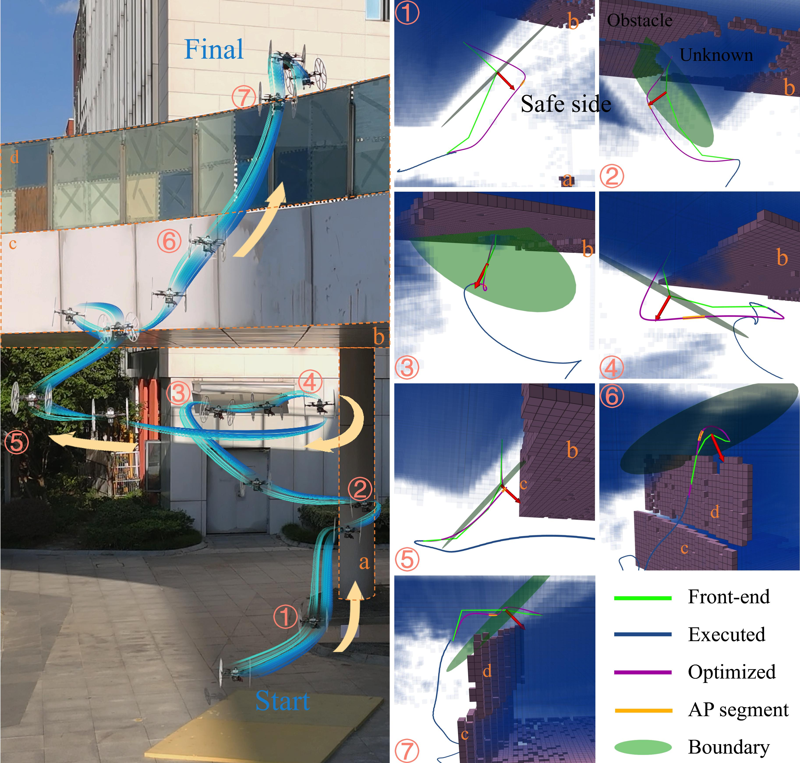

**图 19**：FLAP 在室外环境中的规划结果。左图为完整轨迹，右图给出代表时刻的轨迹和地图；用小写字母标记关键障碍物，便于说明观察位置。

### 八、结论

本文提出一种面向受限传感器视场三维未知环境的无人机轨迹优化框架。方法在传感器坐标系中建立可见性和安全判据，并引入带参数化起始时刻、由速度相关激活函数调节的主动感知段。该方法促使无人机尽早探索未知空间，同时保持动力学可行性和计算效率。仿真和实物试验表明，FLAP 能够生成平滑轨迹，在保证安全的同时保持较高效率，并在所给场景中优于对比方法。

已知—未知边界由前端生成，因此提高前端质量可以得到更好的全局路径，并在不显著增加计算量的情况下提高整体轨迹效率。后续工作将扩展到多传感器融合，利用不同传感器的互补性提高感知鲁棒性和规划性能。

## 原文第 18 页核心内容与翻译

本页为原文参考文献，按原文保留英文书目信息、作者姓名、期刊名称、会议名称、卷期页码和 DOI 等内容。参考文献中的英文不是论文正文，不作中文化处理。

---

> 说明：公式、变量、编号、图片引用和参考文献按原文保留；正文中的作者姓名、机构名称、算法名称、缩写和单位也按原文保留。
