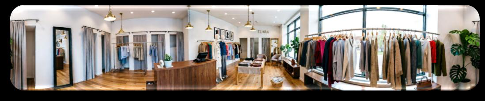
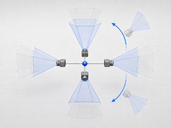
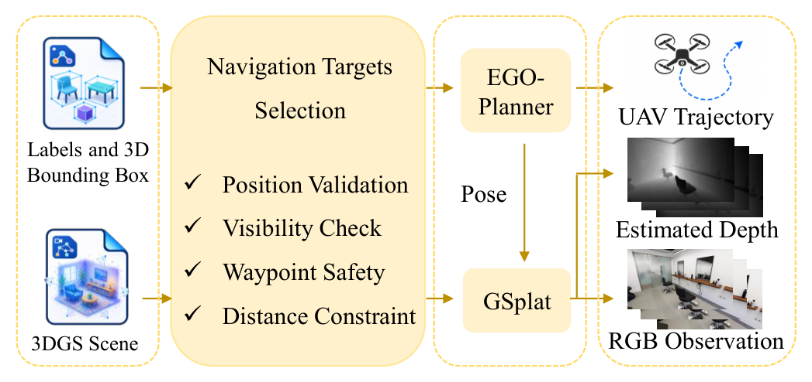
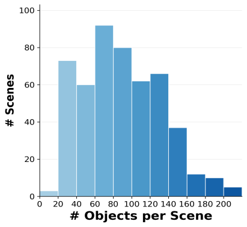

# FlyMirage 航空 VLN 数据生成（29_FlyMirage）：完整忠实学术翻译

> **原文标题**：FlyMirage：利用生成式世界模型实现多样化、可扩展无人机飞行数据的全自动生成流程
> **作者**：Jinhan Li、Xijie Huang、Zhaoqi Wang、Yijin Wang、Weiqi Ge、Qiyi He、Mo Zhu、Fei Gao、Yuze Wu、Xin Zhou
> **发表信息**：arXiv:2605.19600v1，2026-05-19
> **原文 PDF**：[29_FlyMirage.pdf](../29_FlyMirage.pdf) ｜ **对应中文详解**：[29_FlyMirage航空VLN数据生成.md](../中文详解/29_FlyMirage航空VLN数据生成.md)

---

## 原文第 1 页核心内容与翻译

**FlyMirage：利用生成式世界模型实现多样化、可扩展无人机飞行数据的全自动生成流程**

Jinhan Li1,2,∗、Xijie Huang1,2,∗、Zhaoqi Wang2、Yijin Wang1,2、Weiqi Ge2、Qiyi He2、Mo Zhu1,2、Fei Gao1,2,†、Yuze Wu1,2,†、Xin Zhou2,†

∗ 贡献相同。
1 State Key Laboratory of Industrial Control Technology, Zhejiang University, Hangzhou 310027, China。
2 Differential Robotics, Hangzhou 311121, China。
† 通讯作者：Fei Gao、Yuze Wu 和 Xin Zhou。

FlyMirage 面向场景生成与轨迹采集实现自动化：世界生成、场景标注、导航与采集。流程生成 500 个场景、5 万条轨迹，并采用 3DGS 场景表示。

**图 1**：FlyMirage。该流程使用大语言模型设计的场景规格、生成式世界模型、自动场景标注和适用于无人机的轨迹规划，生成规模可扩展、内容多样且具有照片级真实感的航空视觉语言导航数据。

**摘要**——在视觉语言导航（VLN）领域，航空数据集通常难以同时兼顾规模、多样性和真实感，往往依赖成本高昂的真实场景，或视觉表现有限的仿真环境。为解决这些问题，本文提出 FlyMirage，一套高度可扩展、完全自动化的航空 VLN 数据生成流程。该方法利用大语言模型（LLM）作为环境设计者，以促进场景多样性；同时使用生成式世界模型，将设计结果实例化为高保真的三维高斯泼溅（3DGS）场景。为大幅减少人工工作并确保飞行数据的可行性，FlyMirage 自动完成场景探索和语义信息获取，并进一步集成能够满足动力学要求的无人机轨迹规划器。借助这套工具链，本文生成了一个大规模、多样化且具有照片级真实感的航空 VLN 数据集，其中包含动力学可行的飞行轨迹，旨在支持下一代具身导航模型的研发。

## 一、引言

扩展高质量机器人数据的规模，已经成为提升具身人工智能模型能力的一条有前景的路径，这与其他领域中数据规模所发挥的作用相似 [1]。例如，在约 50 万小时真实世界数据上训练的 Gen-1 等模型 [2] 展现出很强的泛化能力，凸显了大规模数据的重要性。这自然引出了一个问题：类似的规模定律是否也适用于航空视觉语言导航（VLN）？目前可用的航空 VLN 数据集对此仍缺乏充分探索。为了更好地理解现有航空 VLN 数据来源，可以将其分为真实世界数据和仿真数据两类。

真实世界导航数据采集成本高、难以扩展，并且需要经验丰富的操作员。例如，UAV-Flow [3] 收集了 100 小时由飞手操控的飞行数据，但其环境覆盖范围仍局限于大学校园。相比之下，仿真数据提供了更安全、更廉价且更易扩展的方案。仿真数据是指在数字环境中采集的数据，包括真实世界重建环境 [4]、[5]、[6]、[7]，以及利用虚拟三维资产构建的场景。在这些仿真环境中，OpenFly [8] 等先前工作尝试在 18 个预先构建的场景中使用 A* [9] 自动生成轨迹，但其可扩展性受高质量预定义环境的可获得性限制。尽管取得了这些进展，现有数据流程能否提供足够真实且多样的数据，从而揭示规模定律的真实影响？

我们认为，当前的真实世界和仿真数据流程仍面临三个关键局限：

---

## 原文第 2 页核心内容与翻译

1）**视觉与几何保真度有限。** 基于资产的虚拟环境通常采用简化的纹理、材质和光照，从而加剧视觉仿真到真实环境的差距。

2）**数据多样性和规模不足。** 对于真实世界数据流程和仿真数据流程而言，要实现高质量场景的可扩展多样性仍然很困难，因为它们通常需要人工参与场景构建、场景标注或轨迹采集。

3）**轨迹生成未考虑动力学。** 尽管先前工作使用了基于搜索的算法自动生成轨迹，但这些算法忽略了机器人动力学，可能产生不自然或无法在真实世界部署的无人机轨迹。

生成式世界模型的最新进展为克服上述局限提供了极具吸引力的机会。特别是，Marble [10] 等基础模型能够根据文本或图像提示生成具有连贯空间结构、可供探索的三维世界。这一能力为重新思考航空 VLN 数据生成提供了新的途径：不再依赖真实环境中的数据采集或人工构建的虚拟空间，而是自动生成逼真且可探索的世界，并在其中采集导航数据。

基于这一能力，本文提出一套可扩展、完全自动化的航空 VLN 数据生成流程（图 1）。为丰富场景多样性，本文利用大语言模型（LLM）作为导航环境设计者，生成多样化的结构化场景规格，再由生成式世界模型将其实现为具有照片级真实感、可供探索的三维世界。这样，数据集可以覆盖广泛的环境，从常见的室内、室外场景，到存在辐射风险、访问受限或难以重建的化工设施等危险空间。为减小视觉仿真到真实环境的差距，本文采用 Marble 1.1 Plus 作为生成式世界模型，遵循“文本与图像到世界”的范式创建高保真的三维高斯泼溅（3DGS）[11] 场景。为减少人工参与，本文自动完成相机探索和场景标注，并在此基础上建立自动航空导航目标生成系统，同时集成适用于无人机的动力学可行轨迹规划器来生成轨迹。本文将这套完全自动化的流程称为 FlyMirage：通过一条命令即可持续生成近乎不受数量限制的多样化场景及其对应导航轨迹。

因此，本文将 FlyMirage 定位为下一代航空 VLN 数据自动采集工具。为验证其潜力，本文自动生成了从室内到室外的 500 个不同场景和 5 万条导航轨迹。与现有 VLN 数据集相比，FlyMirage 具有更好的扩展性和观测保真度，同时能够生成物理上可执行的航空轨迹。此外，数据生成所需的资金和时间成本明显更低：FlyMirage 只需要 Marble 和一块消费级 NVIDIA GPU，即可从三维高斯场景渲染 RGB 图像；相比之下，InteriorGS [12] 需要人工创建网格，UAV-Flow [3] 则需要飞手操控无人机采集数据，成本约为每小时 100 美元。

本文的主要贡献如下：
1）提出 FlyMirage，一种面向航空 VLN 的新型数据来源。它由生成式世界模型提供支持，并通过完全自动化的数据采集流程实现可扩展的场景多样性。
2）设计一种仅依赖三维高斯场景表示的迭代式场景标注策略，不需要训练图像等其他先验信息。
3）使用所提出的工具链生成并发布面向航空 VLN 社区的大规模开放数据集。

## 二、相关工作

### A. 劳动密集型数据集采集

视觉语言导航（VLN）任务起源于地面机器人领域，其本质上需要大规模数据集来训练导航模型。早期工作主要使用基于图的地图，以支持离散节点采样，同时配合人工数据标注 [4][5]。

在无人机场景中，更高的自由度使自动数据采集明显更加困难。为解决这一问题，一些工作依赖人工采集数据。例如，UAV-Flow [3] 在真实世界中收集了 3 万个由人工操作员控制的回合。另一些工作则从在仿真环境中驾驶无人机的人类操作者那里众包采集轨迹，包括 CityNAV [13]、AerialVLN [14] 和 AVDN [15]。尽管轨迹生成依赖人工，一些工作（如 OpenUAV [16]）仍利用大语言模型为这些路径自动生成自然语言标注。

### B. 自动数据集采集

人们也投入了大量精力来自动化轨迹生成，不过这类方法通常仍然需要人工构建三维场景。为此，SAGE-3D [7] 手工制作了 1,000 个 3DGS 场景，并将其作为 InteriorGS [12] 发布。在这些人工构建的场景基础上，基于搜索的规划算法已经成为自动生成地面机器人 [6]、[7] 和空中机器人 [8] 轨迹的标准方法。另一类方法则绕开三维表示，重新利用已有的房间参观视频，例如 Youtube-VLN [17] 和 Roomtour3D [18]。基于视频的方法有一个主要局限：它受制于预先存在的视点，并且通常缺少沿 z 轴的运动，而这对无人机导航至关重要。

虽然已有工作尝试生成规模化的三维网格场景表示 [19]、[20]，但这些方法主要充当网格组装器。基于网格的场景表示天然更适合视觉语言动作（VLA）操作任务，而非导航任务；其相对较低的保真度迄今也阻碍了专用导航数据集的采集。尽管近期工作 [21] 利用视频世界模型合成训练数据，但其计算成本高得难以承受：生成 24 万个样本约需 81,000 个 NVIDIA L40 GPU 小时。

---

## 原文第 3 页核心内容与翻译

图 2 中的流程分为三个步骤：步骤 1：世界生成；步骤 2：场景标注；步骤 3：导航与采集。流程依次包括场景描述、图像生成、Marble 1.1 Plus、3DGS 场景生成、初始边界框生成、额外相机观测、最终边界框生成、导航目标选择、无人机规划器、观测记录、轨迹记录和数据采集。

**图 2**：FlyMirage 数据集创建总体流程。该流程包括世界生成、场景标注以及导航与采集三个阶段。

## 三、数据集创建流程

如图 2 所示，本文的流程通过将批量生成的场景描述转换为用于训练导航策略的无人机轨迹，自动生成可扩展的无人机导航数据集。

### A. 世界生成

图 3 所示的世界生成过程包含描述指南、随机场景类型、场景描述、文本到文本、文本到图像和三维世界生成。随机场景类型的示例包括客厅、机场航站楼和服装店等。

**图 3**：世界生成。将描述指南与随机选择的场景类型结合，生成详细的场景描述和图像，再使用 Marble 创建三维高斯泼溅场景。

本文将常见场景类型组织成由类别和子类别构成的层次化分类体系。为了生成场景描述，首先在较宽泛的类别中随机选择一个子类别，然后提示 GPT-5.4 或 Gemini 3.1 描述与所选类型对应的场景。设计这一两步过程，是为了缓解直接提示大语言模型随机生成场景描述时观察到的采样不均衡问题。具体而言，直接提示往往会导致场景类型分布偏置；例如，GPT-5.4 生成的医疗相关描述明显多于其他常见环境。通过从层次化分类体系中显式预先选择场景类型，本文将场景类别的选择与语言模型的生成偏好解耦。这样，在继续利用模型生成多样、详细且自然的常见真实世界空间描述能力的同时，也能维持更加可控、均衡的场景类型分布。

得到文本描述后，本文使用 GPT Images 2.0 生成相应图像。这一步提供了具有视觉依据的场景表示，以具体的空间、外观和布局线索补充纯语言描述。与单独的文本描述相比，生成的图像能够捕捉更多视觉细节，例如物体摆放、材质外观、光照条件、色彩构成以及环境的整体空间布局。随后，本文将生成的图像和原始文本描述共同输入 Marble 1.1 Plus，生成基于 3DGS 的场景，如图 3 所示。

### B. 场景标注

Marble 只生成 3DGS 场景表示，不提供训练图像或物体级语义信息。为了获得物体级标注，本文使用 Boxer [22] 执行开放词汇物体检测，并估计检测物体的三维边界框。具体而言，本文将 GSplat [23] 渲染的 RGB 图像及其对应的估计深度图作为 Boxer 的输入。然而，由于 Boxer 算法的局限性，距离渲染视点较远的物体，其三维边界框估计会变得不够准确。

因此，本文采用如图 4 所示的简单迭代方法探索场景。由于 Marble 遵循“提示词到全景图再到世界”的流程，每个生成场景都有一个中心点 c。由于该点的紧邻区域通常没有物体，本文让相机以半径 $r_{orb}=0.1\,\mathrm{m}$ 绕其运行。对于每个偏航角—俯仰角对 $(\psi,\theta)$，其中偏航角 $\psi$ 从 +y 方向测量，定义如下：

---

## 原文第 4 页核心内容与翻译

图 4 的流程包括生成世界、RGB 图像、估计深度、相机位姿、Boxer、二维边界框、逐帧三维边界框、融合三维边界框、细化目标物体选择（算法 1）、目标列表、相机轨迹规划、额外相机观测、最终边界框生成、最终三维边界框列表、附加检测和细化边界框。

**图 4**：场景标注。采用迭代算法，为生成场景中的物体生成准确的边界框。（Boxer [22] 是 Meta Reality Labs 提出的三维边界框估计算法。）

$$
d(\psi,\theta)=
\begin{bmatrix}
\sin\psi\cos\theta\\
\cos\psi\cos\theta\\
\sin\theta
\end{bmatrix},
\qquad
p(\psi,\theta)=c-r_{orb}d(\psi,\theta).
$$

每个相机位置 $p(\psi,\theta)$ 都与观察方向 $d(\psi,\theta)$ 配对，使相机朝向穿过世界中心 $c$ 的方向。这种朝内的环绕运动使相机保持在空旷的中心区域内，并通过一个小的自由空间缓冲区（围绕 c 的无物体球体）提高观察到场景物体的可能性。相机视点在整个观察球面上的多个仰角处采样，并在每个仰角执行完整的偏航角扫描，图 4 的相机位姿可视化展示了这一过程。

给定这些相机位姿后，本文渲染 RGB 图像和估计深度图，并将其输入 Boxer。将返回的三维边界框记为候选集合
$$
O=\{o_i\}_{i=1}^{N}.
$$
由于 Boxer 存在局限，本文定义两个距离阈值 $0<d_{th1}<d_{th2}$。对于距离超过 $d_{th2}$ 的物体，预测边界框通常明显不准确，因此需要从更近的相机位置进行观测；距离位于 $d_{th1}$ 和 $d_{th2}$ 之间的物体，其边界框可能略有误差，但仍处于可接受范围内。随后，本文从 O 中采用一种有距离感知的过程选择额外相机观测目标，以促进空间多样性。令 $N_t$ 表示待选择目标的最大数量。对于 O 中中心为 $x_i$ 的每个候选边界框，计算其到场景中心的距离：
$$
d_i=\lVert x_i-c\rVert_2.
$$

如算法 1 所示，从距离最远的候选项开始，贪心地接受满足 $d_i>d_{th2}$ 的候选项。接受某个候选项后，删除距离其小于 $d_{prune}$ 的邻近物体，其中 $d_{prune}=d_{th1}$；同时删除相对于 c 的方位角差小于 $\theta_{th}$ 的物体，以避免选择彼此过近或位于同一方向的多个目标。如果没有选择到距离超过 $d_{th2}$ 的候选项，则退回到满足 $d_i\in(d_{th1},d_{th2}]$ 的候选项，并选择其中距离最远者；如果这样的候选项也不存在，则当前场景不需要额外相机观测。

对于选定的目标，本文在膨胀后的占据栅格上使用基于体素的 A* 搜索规划经过碰撞检查的三维航路点路径，并进行碰撞感知的拉普拉斯平滑，从而得到场景的稠密相机轨迹：
$$
\{q_k\}_{k=1}^{K},
$$
其中每个 $q_k\in\mathbb{R}^3$ 表示路径上的一个相机位置。在每个位置，相机朝向与局部路径切线的时间平滑估计对齐。在同一位置放置一个四视角相机组，其偏航角偏移分别对应前、左、右和后方视图。因此，每个相机位置都会产生四个同步观测，为轨迹提供近似全景覆盖。

本文将额外相机观测与初始旋转观测结合起来，重新运行修改后的 Boxer 流程。标准流程会将逐帧三维检测融合到全局地图中；本文加入了基于距离的剪枝约束：在每一帧中，过滤掉距离相机光心超过 $d_{th1}$ 的所有 Boxer 三维检测，从而消除远处伪影，确保最终融合全局边界框地图的保真度。

在具体实现中，为兼顾数据多样性和边界框定位准确性，本文设置 $N_t=5$、$\theta_{th}=35^\circ$、$d_{th1}=3.0\,\mathrm{m}$ 和 $d_{th2}=4.0\,\mathrm{m}$。

### C. 导航与采集

如图 5 所示，导航和数据采集过程只需要两个场景级输入：一个包含物体标签及其对应三维边界框的语义标注文件，以及一个三维高斯泼溅表示。对于每个场景，指定目标集合数量 $N_s$ 和每个集合中的目标数量 $N_o$。程序随后按顺序生成各个目标集合。在每个集合内，逐个选择目标，直到获得 $N_o$ 个有效目标。

---

## 原文第 5 页核心内容与翻译

### 算法 1 距离感知目标选择

**输入：**候选集合 $O=\{o_i\}_{i=1}^{N}$，其边界框中心为 $\{x_i\}_{i=1}^{N}$；场景中心 $c$；阈值 $d_{th1}$、$d_{th2}$、$\theta_{th}$；目标最大数量 $N_t$。

1. 对每个候选项 $o_i$ 计算 $d_i\leftarrow\lVert x_i-c\rVert_2$。
2. 按 $d_i$ 降序排列 O。
3. 初始化目标集合 $T\leftarrow\varnothing$。
4. 初始化活动候选集合 $A\leftarrow O$。
5. 按排序后的顺序遍历每个候选项 $o_i\in O$：
   - 如果 $o_i\notin A$，继续处理下一个候选项。
   - 如果 $d_i\le d_{th2}$，继续处理下一个候选项。
   - 将 $o_i$ 加入 T。
   - 设置 $d_{prune}=d_{th1}$。
   - 从 A 中删除所有满足下列任一条件的剩余候选项 $o_j$：
     $$
     \lVert x_j-x_i\rVert_2<d_{prune}
     \quad\text{或}\quad
     \Delta_{az}(i,j)<\theta_{th}.
     $$
   - 如果 $|T|=N_t$，退出遍历。
6. 如果 $T=\varnothing$：
   - 初始化集合 $Q\leftarrow\{o_i\in O:d_{th1}<d_i\le d_{th2}\}$。
   - 如果 $Q\ne\varnothing$，令 $T\leftarrow\{\arg\max_{o_i\in Q}d_i\}$。
7. 返回 T。

本文使用场景标注文件作为候选目标列表。每个候选目标在被接受并计入 $N_o$ 之前，都必须通过若干检查。资格条件如下：

- **位置验证**：当前无人机位置不得位于候选物体的三维边界框内部。
- **可见性检查**：只有从无人机当前位置可见的候选物体才会被接受。可见性通过从无人机向物体边界框投射射线进行检查。如果在射线到达物体之前，射线周围的圆柱区域内存在任何占据点，则认为该物体被遮挡，并拒绝该候选项。

候选项通过前两项检查后，本文在候选物体周围计算一个候选目标点，并使其略微朝起始位置偏移，以确保无人机最终处于自由空间中。

- **航路点安全性**：算法评估候选目标点周围的一小片区域。如果该安全区域内存在任何占据点，则拒绝该候选项。
- **距离约束**：从当前位置到候选目标点的行进距离必须处于 2.0 m 至 10.0 m 范围内。

满足全部条件的候选项会被加入目标集合，并用于更新无人机位置，以选择下一个目标。生成完全部 $N_s$ 个集合后，将目标点写入任务文件，并传递给 EGO-Planner [24] 进行在线轨迹规划。EGO-Planner 是一种动力学可行的无人机规划器，已经通过大量仿真和真实世界实验验证。沿每条规划轨迹，使用 GSplat 从三维高斯泼溅表示中渲染 RGB 观测和估计深度图，并将其与对应的无人机轨迹一同记录。

**图 5**：导航与采集。自动化流程确定轨迹目标，并使用 EGO-Planner 规划无人机在目标之间的飞行。

在采集的飞行数据中，每条轨迹的 RGB 图像按每 30 帧一次的间隔采样。随后将采样帧拼接起来，并调用 Qwen-3.5-Flash [27] 进行自动视觉质量评估，过滤掉存在严重渲染伪影、可见性差或飞行意图不清晰的轨迹。只有经过验证、质量较高的轨迹才会归档到 FlyMirage 中。

对于每条有效轨迹，本文还会调用 Qwen-3.5-Flash 生成最多三个提示词变体，每个变体强调目标物体的不同方面：

- **原始物体中心式**：直接指向目标物体，例如“找到书架”。
- **相对位置式**：通过目标物体与附近物体之间的空间关系描述目标，例如“前往书架旁边的椅子”。
- **外观中心式**：依据颜色、形状或材质等视觉属性识别目标物体，例如“导航至绿色沙发”。

通过为同一条轨迹采集多种提示词表述，FlyMirage 支持不同指代表达风格下的任务。

---

## 原文第 6 页核心内容与翻译

### 四、数据集分析

本文的数据集包含 500 个 3DGS 场景，涵盖图 6 所示的六类环境：交通空间；工作场所和办公室；商业与零售空间；工业及公用设施；休闲与酒店场所；家庭和住宅空间。现有航空 VLN 数据集通常主要在住宅场景中采集。例如，IndoorUAV 使用的 HM3D [28] 主要面向家庭环境，而 SAGE-3D 中约 75% 的场景属于住宅场景。相比之下，FlyMirage 提供了更加均衡、多样的场景类型分布，如图 6 所示，因此更适合训练能够在住宅空间之外的更广泛真实世界环境中泛化的模型。

在这些场景中，系统自动识别出超过 5,000 个不同的物体标签，并为每个物体实例生成相应的边界框。该数据集中的典型场景包含 60 至 100 个物体实例，为下游导航提供了充足的语义上下文。尽管 InteriorGS 等其他数据集也包含许多物体实例，但其中很大一部分实例是重复的，因此整个数据集只有约 700 个不同的物体类别。

利用这些数据，本文采集了约 50,000 条导航轨迹，主要连接以物体为中心的航路点。每条轨迹均使用 EGO-Planner 生成，提供考虑运动学约束的动力学可行运动信息；这不同于依赖 A* 规划或离散动作空间的先前数据集。如表 1 所示，本文是首个能够生成真正 6 自由度轨迹的自动航空轨迹生成流程；此前这一能力只有通过人工控制的数据采集才能获得。

轨迹长度的均值和中位数分别为 4.33 m 和 4.06 m。由于本文还会在一次连续运行中记录最多五个导航任务，因此可以将轨迹组合成最长约为典型路径长度四至五倍的长时域任务，即约 20 m。由此，本文数据集既支持短时域航空 VLN 任务，也支持长时域航空 VLN 任务的训练与评估。此外，通过基于大语言模型的提示词多样化过程，每条轨迹都关联 2 至 3 个提示词，从而为导航提供更加多样的语言监督。

图 6 中的示例指令包括“导航至柜子上的花朵”与“导航至黄色的花朵”，以及“前往桌子上方的吊灯”与“前往金色吊灯”；连续任务还包括“转向面对下一个目标”。物体到物体轨迹的均值为 4.33 m，中位数为 4.06 m；长时域轨迹的均值为 19.53 m，中位数为 19.10 m。

**图 6**：数据集统计。上方为场景类别分布，左下方为生成场景中的物体数量分布，右下方为轨迹统计信息和轨迹示例。

### 表 1 轨迹数据集比较

| 数据集 | 轨迹数 $N_{traj}$ | 动作空间 | 场景数 $N_{scenes}$ | 场景环境 | 轨迹生成 | 轨迹标注 | 运动学 | 场景/轨迹可扩展性 |
|---|---:|---|---:|---|---|---|---|---|
| R2R[4] | 7189 | 基于节点 | 90 | Matterport3D | 从节点采样 | 人工标注 | 否 | 手工扫描 |
| RxR[5] | 13992 | 基于节点 | 90 | Matterport3D | 从节点采样 | 人工标注 | 否 | 手工扫描 |
| VLN-CE[6] | 4475 | 2 DoF | 90 | Matterport3D | R2R 路径节点之间的 A* | 改编自 R2R | 否 | 手工扫描/自动记录 |
| LHPR-VLN[25] | 3260 | 2 DoF | 216 | HM3D | 基于 D* Lite | 基于 LLM | 否 | 手工扫描/自动记录 |
| SAGE-3D[7] | 100K+* | 2 DoF | 1000 | 3DGS | A* | 基于 LLM | 否 | 手工扫描/自动记录 |
| AVDN[15] | 6269 | 3 DoF | - | xView | 人工控制 | 人工标注 | 否 | 手工记录 |
| AerialVLN[14] | 8446 | 4 DoF | 25 | AirSim + UE | 人工控制 | 人工标注 | 否 | 手工扫描/记录 |
| CityNav[13] | 32637 | 4 DoF | 34 | SensatUrban | 人工控制 | 已有数据集（City Refer） | 否 | 手工扫描/记录 |
| OpenUAV[16] | 12149 | 6 DoF | 22 | AirSim + UE | 人工控制 | 基于 LLM | 是 | 手工扫描/记录 |
| OpenFly[8] | 100K | 4 DoF | 18 | AirSim、GTA5、3DGS、GE | A* | 基于 LLM | 否 | 手工扫描/自动记录 |
| UAV-Flow[3] | 40801 | 6 DoF | - | 真实世界、UnrealCV | 人工控制 | 人工标注 + LLM | 是 | 手工扫描/记录 |
| IndoorUAV[26] | 34925 | 4 DoF | 1075 | Mp3D、Gibson、HM3D、Replica | 人工控制 | 基于 LLM | 否 | 手工扫描/记录 |
| FlyMirage | 50K | 6 DoF | 500 | 3DGS | 动力学可行的无人机规划器 | 基于 LLM | 是 | 全自动 |

\*：尽管 SAGE-3D 提供了 200 万条指令—轨迹对，但每条轨迹关联 15 至 20 个提示词，轨迹总数约为 100K+。

---

## 原文第 7 页核心内容与翻译

此外，生成本文数据集所需的资金成本和人力投入都极低。包括 Marble 和所有大语言模型调用在内的 API 总成本约为每个场景 2 美元；使用 GSplat 批量渲染时，只需要一块消费级 NVIDIA RTX 4070 GPU。从初始化到轨迹采集，完整流程每个场景约需一小时，并且可以按批次并行处理。

相比之下，HM3D 等常用的仿真重建流程需要专用的 Matterport Pro2 传感器来扫描环境，其成本约为 3,000 美元；而 SAGE-3D 则需要为每个独立场景进行人工设计。因此，先前方法通常需要投入大量人力，而本文方法无需人工干预即可自动运行。

## 五、结论与未来工作

本文提出了 FlyMirage，一套弥合航空视觉语言导航中规模与真实感之间差距的自动化流程。借助该流程，本文生成了一个包含 5,000 多个不同物体标签和 50,000 条动力学可行无人机轨迹的数据集。该数据集提供适用于短时域和长时域导航的照片级真实感图像与 6 自由度轨迹数据，可用于航空 VLA/VLN [29] 以及面向航空导航的动作世界模型 [30]。未来，这套可扩展工具链及其数据集可以成为训练下一代具身人工智能智能体的稳健基础，包括能够在多样、复杂真实世界场景中有效运行的通用航空导航模型。

## 参考文献

参照原文，参考文献保留英文：

[1] J. Kaplan, S. McCandlish, T. Henighan, T. B. Brown, B. Chess,
R. Child, S. Gray, A. Radford, J. Wu, and D. Amodei, “Scaling laws
for neural language models,” arXiv preprint arXiv:2001.08361, 2020.
[2] G. A. Team, “Gen-1: Scaling embodied foundation models to mastery,”
Generalist AI Blog, 2026, https://generalistai.com/blog/apr-02-2026-
GEN-1.
[3] X. Wang, D. Yang, Y. Liao, W. Zheng, wenjun wu, B. Dai,
H. Li, and S. Liu, “Uav-flow colosseo: A real-world benchmark for
flying-on-a-word uav imitation learning,” 2025. [Online]. Available:
https://arxiv.org/abs/2505.15725
[4] P. Anderson, Q. Wu, D. Teney, J. Bruce, M. Johnson, N. S¨underhauf,
I. Reid, S. Gould, and A. van den Hengel, “Vision-and-language nav-
igation: Interpreting visually-grounded navigation instructions in real
environments,” in Proceedings of the IEEE Conference on Computer
Vision and Pattern Recognition (CVPR), 2018.
[5] A. Ku, P. Anderson, R. Patel, E. Ie, and J. Baldridge, “Room-
Across-Room: Multilingual vision-and-language navigation with dense
spatiotemporal grounding,” in Conference on Empirical Methods for
Natural Language Processing (EMNLP), 2020.
[6] J. Krantz, E. Wijmans, A. Majundar, D. Batra, and S. Lee, “Beyond
the nav-graph: Vision and language navigation in continuous environ-
ments,” in European Conference on Computer Vision (ECCV), 2020.
[7] B. Miao, R. Wei, Z. Ge, X. sun, S. Gao, J. Zhu, R. Wang,
S. Tang, J. Xiao, R. Tang, and J. Li, “Towards physically executable
3d gaussian for embodied navigation,” 2025. [Online]. Available:
https://arxiv.org/abs/2510.21307
[8] Y. Gao, C. Li, Z. You, J. Liu, Z. Li, P. Chen, Q. Chen, Z. Tang,
L. Wang, P. Yang, Y. Tang, Y. Tang, S. Liang, S. Zhu, Z. Xiong,
Y. Su, X. Ye, J. Li, Y. Ding, D. Wang, Z. Wang, B. Zhao, and
X. Li, “Openfly: A comprehensive platform for aerial vision-language
navigation,” CoRR, vol. abs/2502.18041, 2025.
[9] P. E. Hart, N. J. Nilsson, and B. Raphael, “A formal basis for
the heuristic determination of minimum cost paths,” IEEE Trans.
Syst. Sci. Cybern., vol. 4, pp. 100–107, 1968. [Online]. Available:
https://api.semanticscholar.org/CorpusID:206799161
[10] World Labs, “Marble models,” https://docs.worldlabs.ai/marble/
models, 2026, accessed: 2026-05-09.
[11] B. Kerbl, G. Kopanas, T. Leimk¨uhler, and G. Drettakis, “3d gaussian
splatting for real-time radiance field rendering,” ACM Transactions
on Graphics, vol. 42, no. 4, July 2023. [Online]. Available:
https://repo-sam.inria.fr/fungraph/3d-gaussian-splatting/
[12] M. T. I. SpatialVerse Research Team, “Interiorgs: A 3d gaussian
splatting dataset of semantically labeled indoor scenes,” https://
huggingface.co/datasets/spatialverse/InteriorGS, 2025.
[13] J. Lee, T. Miyanishi, S. Kurita, K. Sakamoto, D. Azuma, Y. Matsuo,
and N. Inoue, “Citynav: Language-goal aerial navigation dataset with
geographic information,” 2024.
[14] S. Liu, H. Zhang, Y. Qi, P. Wang, Y. Zhang, and Q. Wu, “Aerialvln:
Vision-and-language navigation for uavs,” in International Conference
on Computer Vision (ICCV), 2023.
[15] Y. Fan, W. Chen, T. Jiang, C. Zhou, Y. Zhang, and X. E. Wang, “Aerial
vision-and-dialog navigation,” in Findings of the Association for
Computational Linguistics: ACL 2023. Toronto, Canada: Association
for Computational Linguistics, Jul. 2023, pp. 3043–3061. [Online].
Available: https://aclanthology.org/2023.findings-acl.190
[16] X. Wang, D. Yang, Z. Wang, H. Kwan, J. Chen, W. Wu,
H. Li, Y. Liao, and S. Liu, “Towards realistic uav vision-language
navigation: Platform, benchmark, and methodology,” 2024. [Online].
Available: https://arxiv.org/abs/2410.07087
[17] K. Lin, P. Chen, D. Huang, T. H. Li, M. Tan, and C. Gan, “Learning
vision-and-language navigation from youtube videos,” arXiv preprint
arXiv:2307.11984, 2023.
[18] M. Han, L. Ma, K. Zhumakhanova, E. Radionova, J. Zhang,
X. Chang, X. Liang, and I. Laptev, “Roomtour3d: Geometry-aware
video-instruction tuning for embodied navigation,” arXiv preprint
arXiv:2412.08591, 2023.
[19] Y. Yang, F.-Y. Sun, L. Weihs, E. VanderBilt, A. Herrasti, W. Han,
J. Wu, N. Haber, R. Krishna, L. Liu, C. Callison-Burch, M. Yatskar,
A. Kembhavi, and C. Clark, “Holodeck: Language guided generation
of 3d embodied ai environments,” in Proceedings of the IEEE/CVF
Conference on Computer Vision and Pattern Recognition (CVPR), June
2024, pp. 16 227–16 237.
[20] Y. Yang, B. Jia, S. Zhang, and S. Huang, “Sceneweaver: All-in-one
3d scene synthesis with an extensible and self-reflective agent,” in
Advances in Neural Information Processing Systems (NeurIPS), 2025.
[21] J. Jang, S. Ye, Z. Lin, J. Xiang, J. Bjorck, Y. Fang, F. Hu, S. Huang,
K. Kundalia, Y.-C. Lin et al., “Dreamgen: Unlocking generaliza-
tion in robot learning through video world models,” arXiv preprint
arXiv:2505.12705, 2025.
[22] D. DeTone, T. Shen, F. Zhang, L. Ma, J. Straub, R. Newcombe, and
J. Engel, “Boxer: Robust lifting of open-world 2d bounding boxes to
3d,” 2026.
[23] V. Ye, R. Li, J. Kerr, M. Turkulainen, B. Yi, Z. Pan, O. Seiskari,
J. Ye, J. Hu, M. Tancik, and A. Kanazawa, “gsplat: An open-source
library for gaussian splatting,” Journal of Machine Learning Research,
vol. 26, no. 34, pp. 1–17, 2025.
[24] X. Zhou, Z. Wang, H. Ye, C. Xu, and F. Gao, “Ego-planner: An esdf-
free gradient-based local planner for quadrotors,” IEEE Robotics and
Automation Letters, vol. 6, no. 2, pp. 478–485, 2021.
[25] X. Song, W. Chen, Y. Liu, W. Chen, G. Li, and L. Lin, “Towards
long-horizon vision-language navigation: Platform, benchmark and
method,” in Proceedings of the IEEE/CVF Conference on Computer
Vision and Pattern Recognition, 2025.
[26] X. Liu, Y. Liu, H. Qiu, Y. Qirong, and Z. Lian, “Indooruav:
Benchmarking vision-language uav navigation in continuous indoor
environments,” in Proceedings of the AAAI Conference on Artificial
Intelligence, vol. 40, no. 28, 2026, pp. 23 864–23 872.
[27] Qwen Team, “Qwen3.5: Towards native multimodal agents,” February
2026. [Online]. Available: https://qwen.ai/blog?id=qwen3.5
[28] S. K. Ramakrishnan, A. Gokaslan, E. Wijmans, O. Maksymets,
A. Clegg, J. M. Turner, E. Undersander, W. Galuba, A. Westbury,
A. X. Chang, M. Savva, Y. Zhao, and D. Batra, “Habitat-matterport
3d dataset (HM3d): 1000 large-scale 3d environments for embodied
AI,” in Thirty-fifth Conference on Neural Information Processing
Systems Datasets and Benchmarks Track, 2021. [Online]. Available:
https://arxiv.org/abs/2109.08238

---

## 原文第 8 页核心内容与翻译

参考文献 [29]–[30]：

[29] Y. Wu, M. Zhu, X. Li, Y. Du, Y. Fan, W. Li, Z. Han, X. Zhou,
and F. Gao, “Vla-an: An efficient and onboard vision-language-action
framework for aerial navigation in complex environments,” 2025.
[Online]. Available: https://arxiv.org/abs/2512.15258
[30] X. Huang, W. Gai, T. Wu, C. Wang, Z. Liu, X. Zhou, Y. Wu, and
F. Gao, “Navdreamer: Video models as zero-shot 3d navigators,” arXiv
preprint arXiv:2602.09765, 2026.

---
