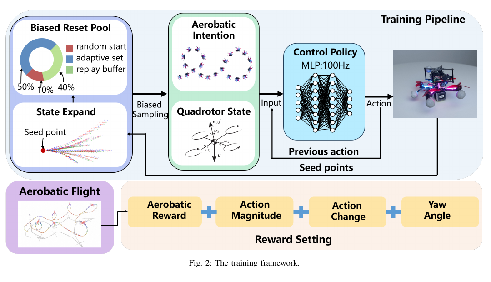
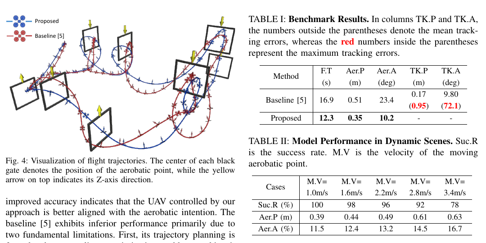
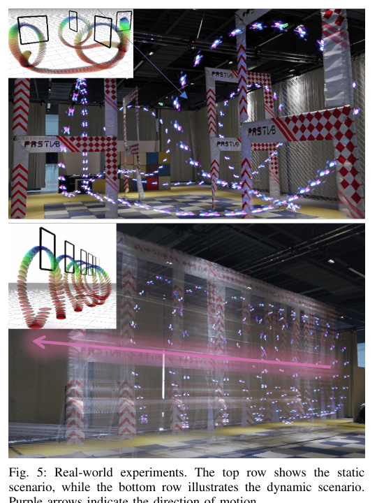

# 《Reactive Aerobatic Flight via Reinforcement Learning》中文详解

> 中文题名：基于强化学习的反应式特技飞行  
> 作者：Zhichao Han、Xijie Huang、Zhuxiu Xu、Jiarui Zhang、Yuze Wu、Mingyang Wang、Tianyue Wu、Fei Gao  
> 版本：arXiv:2505.24396v1，2025-05-30  
> [原始 PDF](../02_Reactive_Aerobatic_Flight_via_Reinforcement_Learning.pdf) ｜ [25 篇总览](../19篇论文核心技术与效果汇总.md)

## 1. 一句话概括

论文把四旋翼当前状态和连续特技航点直接输入强化学习策略，由策略每秒 100 次输出总推力和三轴旋转速度，省去在线轨迹优化与跟踪控制之间的分层，从而对移动门和状态扰动快速反应。

## 外行导读：它实际在做什么

可以把任务想成“让无人机像专业穿越机飞手一样，连续翻滚、倒飞，并从正在移动的门中穿过去”。系统并不是只要到达一个终点，而是必须在规定位置以规定倾斜姿态穿过每一道门。如果位置对了但机身角度不对，机翼仍可能撞门；如果动作太慢，移动门已经离开原位。

系统在每个控制时刻获得无人机的位置、姿态、速度，以及当前和下一道特技门相对自己的位置与方向。输出不是“下一秒飞到哪里”，而是更底层的总推力和机身旋转速度。成功意味着连续通过全部特技点，同时保持位置和姿态误差足够小。

这篇论文研究的重点是**已知特技意图以后，怎样快速而准确地执行**。它不负责从相机画面中识别门，也不负责决定“应该先过哪一道门”。可以把完整系统拆成三层：上层给出一串带位置和姿态要求的特技点；本文策略负责把这些要求实时变成推力和转动命令；飞控最内层再把命令换算为各电机转速。

对外行最重要的结论是：作者不是让神经网络凭空“看图飞行”，而是让它在已知自身状态和门的精确相对位姿时，学习一套反应非常快的特技控制规律。它比在线轨迹优化更快，但对定位、任务输入和训练分布仍有明确依赖。

## 当前研究现状与通用做法

截至本文发表前后，极限特技飞行主要有以下路线：

| 路线 | 通常怎样工作 | 优点 | 主要不足 | 成熟度判断 |
|---|---|---|---|---|
| 先规划轨迹、再跟踪 | 已知门和障碍位置后，先用动力学模型计算完整轨迹，再由控制器跟踪 | 过程可解释，约束容易检查 | 规划较慢；移动门改变后要重算；模型误差会造成跟踪偏差 | **共识型默认选型**，适合预先已知场景 |
| 模型预测控制 | 每隔几十毫秒重新预测并优化一小段未来动作 | 比离线规划更能应对变化 | 极限动作的非线性求解仍很重，依赖好初值 | 较成熟，但算力和调参要求高 |
| 人工遥控 | 专业飞手通过图像实时控制 | 对复杂临场情况很灵活 | 依赖人的经验，难以大规模自主执行 | 演示和竞速中常见，不是自主方案 |
| 学习型直接控制 | 在仿真中反复试错，直接从状态输出控制量 | 推理极快，能形成反应式行为 | 训练成本高，安全和分布外泛化难证明 | **研究型可选方案** |

这篇论文选择最后一条路线。它替代的是“在线轨迹优化＋部分跟踪控制”，但没有替代目标检测、无人机定位和高层任务设计。实机仍需要外部定位系统告诉策略门和无人机在哪里。

## 先把几个术语说清楚

- **强化学习**：让策略在模拟器中试错，成功穿门得到奖励，碰撞或偏离得到惩罚。
- **端到端控制**：这里指从飞行状态和特技意图直接得到推力/旋转命令，中间不在线求完整轨迹。
- **零样本仿真到现实**：训练完成后不再用真实飞行数据微调，直接部署到真机。
- **三维位置与三维姿态（论文写作 SE(3)）**：不仅描述“在哪里”，还描述“朝向哪里、倾斜多少”。

## 2. 要解决的问题

传统特技飞行通常分为两步：先求一条满足动力学约束的轨迹，再由控制器跟踪。该范式在静态、离线任务中有效，但在移动目标或强扰动下存在三个问题：

1. 非线性轨迹优化对初值敏感，容易陷入局部最优。
2. 规划需秒级时间，环境变化后难以及时重规划。
3. 规划模型与真实飞行器有偏差，极限姿态下跟踪误差会被放大。

论文目标不是让网络随意生成动作，而是让它执行一串同时带位置和姿态要求的特技航点。每个航点规定空间位置与希望通过时的机体角度，因此翻滚、倒飞和倾斜穿门都可以用同一种接口表达。

## 3. 系统输入与输出

下面这张表先把策略的接口说清楚。这里的“机体系”可以理解为以无人机自身为坐标原点：向前、向右和向下的方向会随着机身转动而变化。

| 类别 | 策略得到或输出的内容 | 为什么需要 |
|---|---|---|
| 当前任务意图 | 当前特技点相对位置、相对姿态 | 决定下一次应从哪里、以什么倾角通过 |
| 后续任务意图 | 下一个特技点相对位置、相对姿态 | 避免只顾当前门，穿过后却来不及衔接下一动作 |
| 自身运动状态 | 位置、姿态、机体系线速度 | 判断当前是否偏快、偏慢、偏斜或已经越过目标平面 |
| 动作历史 | 上一时刻控制动作 | 抑制控制跳变，并间接反映执行器正在怎样响应 |
| 策略输出 | 质量归一化总推力、三轴期望角速度 | 直接交给低层飞控执行，获得高反应速度 |

### 3.1 观测

观测由任务意图和本体状态两部分组成：

- 当前特技航点和下一个特技航点相对机体系的位置、姿态；同时看两个航点可避免只顾当前动作而无法衔接下一动作。
- 位置、单位四元数、机体系速度和上一时刻动作。
- 上一动作帮助网络抑制控制突变。

航点不是普通位置点。无人机沿航点局部坐标的指定方向穿过其局部平面，且横向和竖向误差在阈值内，才被判定完成该特技点。

### 3.2 动作

策略每秒输出 100 次控制指令：

\[
u=[T_r,\omega_x,\omega_y,\omega_z],
\]

其中 `T_r` 为质量归一化总推力，后三项为期望机体系角速度。该层级比位置/速度指令更敏捷，又比直接输出四个电机转速更容易跨越仿真—实机差距。机载飞控继续负责把总推力和体率转换成电机指令。

实机动作范围按论文设定为：质量归一化总推力 `0—20 m/s²`；滚转和俯仰角速度分别限制在 `±5 rad/s`；偏航角速度限制在约 `±3.14 rad/s`。策略以 **100 Hz** 运行，也就是每 10 毫秒更新一次动作。这里的频率是控制更新频率，不等于传感器或动作捕捉相机的原始采样频率。

## 4. 核心方法

### 4.1 端到端强化学习策略

论文把任务描述成“当前状态—选择动作—得到奖励—进入下一状态”的连续决策问题，并用近端策略优化算法最大化长期累计奖励。策略本身是全连接神经网络：先把观测编码成 512 个数值特征，再逐层压缩，最后用 `tanh` 函数把动作限制在归一化范围内。

更具体地说，观测先被编码为 512 维表示，之后依次通过规模为 `512、512、256、128` 的全连接隐藏层，最终输出 4 个归一化动作。`tanh` 是一个把任意实数压缩到 −1 到 1 的函数；网络输出再按上面的推力和角速度范围进行缩放。训练使用**近端策略优化**，这是连续控制强化学习中常用的一类算法：它反复收集当前策略的飞行数据，再限制每轮参数更新幅度，避免一次更新把刚学会的动作完全破坏。

奖励由四类项组成：

- **特技完成奖励**：只在穿过航点平面时触发，同时评价位置误差和姿态倾角误差；靠近精确解时提高奖励梯度，鼓励厘米/角度级修正。
- **动作幅值惩罚**：限制不必要的三轴体率。
- **动作变化惩罚**：提高平滑性和可跟踪性。
- **航向对齐奖励**：鼓励机头朝向与水平速度方向一致，使飞行动作更像根据机头相机操纵穿越机的专业飞手。

困难在于核心特技奖励非常稀疏：随机初始化的策略几乎不可能偶然以正确姿态穿过航点。

这些奖励项并不等价于安全证明。它们只是训练时告诉策略“哪些行为更值得重复”。如果训练环境没有覆盖某类故障，策略仍可能在现实中给出危险动作。

### 4.2 自动课程学习

> 图源：原论文 Fig. 2，PDF 第 4 页。图中左侧是策略与环境交互，右侧是从容易状态逐步向更早、更难状态扩张的课程生成过程。

论文提出基于“偏置重置”的自动课程：

1. 从特技航点的目标状态开始，利用差分平坦表示 `x_flat=[p,v,a]` 向时间反方向积分随机 jerk，生成靠近目标的较易初始状态。
2. 从当前策略访问的状态中，用价值网络挑选有学习价值的状态，再继续向后扩张。
3. 把扩张状态加入缓冲区；每个训练回合按概率从当前课程状态、历史缓冲状态或原始起点开始。
4. 随策略能力提升，初始状态自然从“几乎已经完成动作”扩展到完整的长距离组合特技任务。

它保留原始稀疏目标，不需要人为为每种新动作反复设计密集奖励。

### 4.3 零样本仿真到实机

训练模型加入旋翼阻力，并随机化：

- 三轴阻力系数：标称值上下约 50%。
- 推力和体率响应：动作扰动约 ±20%。
- 控制时延：使用历史动作的时间窗平均，固定窗长约 80 ms，时间偏移在 4—36 ms 随机。

这些随机化让训练分布覆盖质量、空气阻力、执行器响应和时延误差，部署时不再微调策略参数。

### 4.4 从训练到真机的完整流程

1. **统一任务表示**：先把翻滚、倒飞、倾斜穿门等动作都写成一串带位置和姿态的特技点。
2. **在仿真中建立容易样本**：从目标特技点附近开始，让初始策略先学会最后一小段修正。
3. **自动扩大课程范围**：从已经会做的状态反向扩张，让策略逐步学会更长、更早的准备动作。
4. **用近端策略优化更新网络**：策略采样飞行、获得奖励，评价网络估计长期收益，再小步更新参数。
5. **随机改变动力学与时延**：让同一策略适应一批略有不同的“模拟无人机”，降低只记住单一模型的风险。
6. **冻结网络部署**：真机根据动作捕捉和惯性测量融合得到状态，策略以 100 Hz 输出总推力和三轴角速度，低层飞控完成电机控制。

这个流程中，训练阶段计算量很大，但部署阶段只执行一次前向神经网络运算，所以推理可以做到约 0.3 毫秒。论文所谓“端到端”指的是从**状态与特技意图到低层控制命令**这一段，并不包含门检测、外部定位和电机级控制。

## 5. 实验设计

论文包含三类评估：

1. **训练消融**：比较只用原始稀疏奖励、人工增加引导奖励和自动课程学习，观察收敛速度及最终任务回报。
2. **静态任务基准**：与基于轨迹优化的近期方法比较任务耗时、特技点位置误差、姿态误差和计算时间。
3. **动态场景**：门以不同速度移动，统计成功率和可承受的目标速度；最后在真实四旋翼上验证连续倒飞穿门。

实机状态由实验室动作捕捉系统和扩展卡尔曼滤波器融合得到，因此论文主要验证决策和控制策略，不是无外部定位的纯视觉自主飞行。

## 6. 主要结果

> 图源：原论文 Fig. 4 及相邻表格，PDF 第 7 页。轨迹残影展示无人机如何随移动门位置即时调整；表格给出不同门速下的成功率和误差。

| 指标 | 规划—跟踪基线 | 本文方法 |
|---|---:|---:|
| 组合任务完成时间 | 16.9 s | 12.3 s |
| 特技点位置误差 | 0.51 m | 0.35 m |
| 特技点姿态误差 | 23.4° | 10.2° |
| 在线计算时间 | 约 1.5 s | 约 0.3 ms |

论文还报告，规划—跟踪基线在整段任务中的最大位置跟踪误差约为 `0.95 m`，最大姿态跟踪误差约为 `72.1°`。这说明两级结构在极限状态下不仅平均误差较大，还可能出现很大的瞬时偏离。学习策略的优势来自直接根据当前误差闭环反应，而不是等待重新求解完整轨迹。不过，这只是论文所设场景中的对比，不能推导为所有规划器都慢于学习策略。

动态门在每个速度档位测试 50 次，结果如下：

| 门的移动速度 | 成功率 | 特技点位置误差 | 特技点姿态误差 |
|---:|---:|---:|---:|
| 1.0 m/s | 100% | 0.39 m | 11.5° |
| 1.6 m/s | 98% | 0.44 m | 12.4° |
| 2.2 m/s | 96% | 0.49 m | 13.2° |
| 2.8 m/s | 92% | 0.61 m | 14.5° |
| 3.4 m/s | 78% | 0.63 m | 16.7° |

训练时移动特技点速度采样在 `0—2 m/s`，而评测继续提高到 `3.4 m/s`。因此高速度档可以看作一定程度的超出训练范围测试；成功率随速度上升而下降，也说明反应能力并非没有上限。位置和姿态误差是成功穿越时的任务精度指标，不能只看成功率而忽略门的实际余量。

> 图源：原论文 Fig. 5，PDF 第 8 页。上排为静态组合特技，下排为移动门场景，叠加残影表示飞行器随时间的姿态变化。

- 实机完成连续倒飞，并穿越约 `1 m/s` 运动的门。
- 对照实验表明，自动课程既缓解了稀疏奖励下几乎碰不到成功样本的问题，也比固定的人工引导奖励更不容易把策略带偏。
- 真机试验使用动作捕捉系统提供外部位置基准，并与惯性测量单元融合；所以这些结果主要证明低层策略的敏捷性，不证明纯机载视觉定位能力。

## 7. 论文的实质创新

1. 用连续两个同时包含三维位置与三维姿态的航点作为“特技意图接口”，统一表达多种极限动作。
2. 用反向平坦状态扩张构造自动课程，把长时域稀疏奖励问题分解成逐渐扩大的可解区域。
3. 在总推力/体率控制层实现毫秒以下推理，真正具备动态目标反应能力。

## 8. 局限与谨慎解读

- 安全主要来自训练场景覆盖和碰撞终止条件，没有控制屏障函数或可达集一类的数学安全保证。
- 任务意图仍需人工给出合理航点序列，策略不是全局任务规划器。
- 实机依赖动作捕捉系统与扩展卡尔曼滤波，户外无外部定位、强风和视觉感知误差没有被同时验证。
- 高速移动门的位置和姿态由上游系统提供；若门检测延迟或相对位姿估计错误，论文没有给出独立安全层进行兜底。
- 78% 的高速移动门成功率说明极端动态场景仍有明显失败尾部。
- 结果来自 arXiv 预印本和作者自报实验，尚不等同于独立复现。

## 9. 复现要点

- 首先统一仿真与飞控的总推力、体率定义和归一化范围。
- 课程生成依赖准确的差分平坦变换；反向扩张状态必须检查四元数、推力和速度可行性。
- 域随机化不能只改质量，应同时覆盖阻力、动作响应和控制时延。
- 评测必须同时报告成功率、位置/姿态精度和端到端延迟，仅报告最快一次不够。
- 动态门评测应按速度分档并保留失败样本，特别区分“撞门”“没有及时到达”和“姿态不符合要求”。
- 真机复现还需记录动作捕捉延迟、状态估计频率、飞控内环增益和动作限幅；这些接口差异会直接影响仿真到现实迁移。

## 10. 结论

本文证明了强化学习可以把多段极限特技压缩为一个反应式低层策略，并在动态门场景中显著优于需要在线求解的规划器。它最适合作为“已知意图下的敏捷执行器”，而不是完整自主导航系统。
