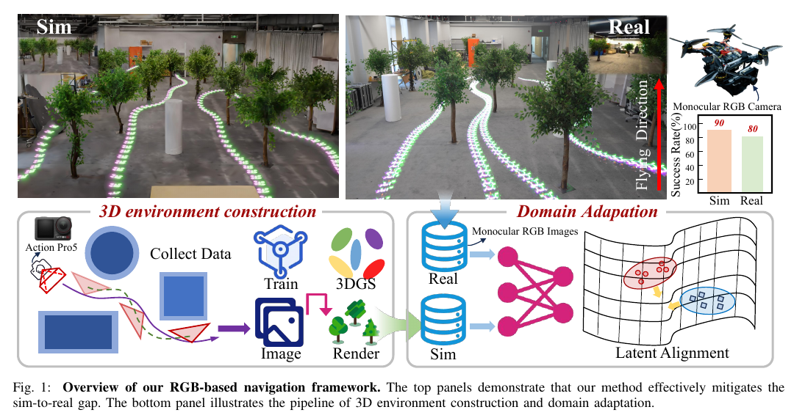
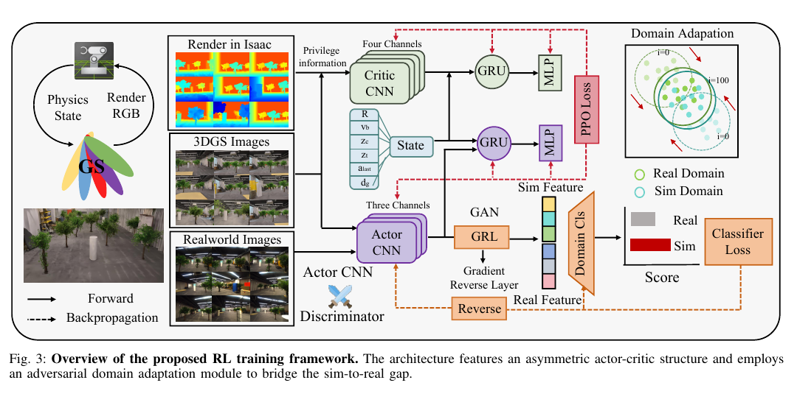
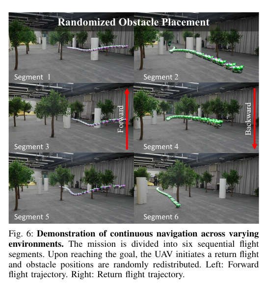
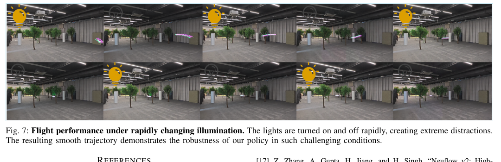

# 《Flying in Clutter on Monocular RGB》中文详解

> 中文题名：利用三维辐射场学习与域适配实现单目彩色视觉杂乱环境飞行  
> 作者：Xijie Huang、Jinhan Li、Tianyue Wu、Xin Zhou、Zhichao Han、Fei Gao  
> 版本：arXiv:2512.17349v1，2025-12-19  
> [原始 PDF](../04_Flying_in_Clutter_on_Monocular_RGB.pdf) ｜ [25 篇总览](../19篇论文核心技术与效果汇总.md)

## 1. 一句话概括

论文先把真实房间重建成可快速渲染的三维模拟环境，在训练时让“评价网络”额外看到精确深度，帮助只看普通彩色图像的“决策网络”学会避障；随后再用外观和动力学随机变化、模拟与现实特征对齐，把策略迁移到真实无人机。

## 外行导读：它实际在做什么

任务是让一架小无人机只用一台普通彩色相机，在摆满桌椅、立柱或其他障碍的室内空间飞向目标。它没有激光雷达，也没有能直接输出距离的深度相机。相机看到的是一张二维彩色图片，系统必须从物体大小变化、遮挡和连续画面运动中判断哪里能通过。

输入是低分辨率彩色图像、无人机速度、姿态、目标方向和高度；输出是飞行动作。成功不只是“最后到了”，还要求途中不碰撞、不飞出安全高度，并能在障碍布局和光照发生变化后继续工作。

这里的“单目彩色视觉”只描述**用于避障的外部环境传感器**。无人机仍使用向下光流和惯性测量来估计自身速度与姿态，也需要上层给出目标方向。因而不能把论文理解成“一台彩色相机独自完成定位、建图、目标选择和控制”。它真正展示的是：当自身状态和目标方向已经可用时，前视普通彩色相机可以替代深度相机，为局部高速避障策略提供环境线索。

## 当前研究现状与通用做法

杂乱环境自主飞行目前通常有四种技术路线：

| 路线 | 通用流程 | 优点 | 局限 | 成熟度判断 |
|---|---|---|---|---|
| 激光雷达/深度相机＋建图＋规划 | 先测距离，建立局部三维地图，再搜索路径和生成轨迹 | 几何清楚、容易调试，安全约束可解释 | 传感器有重量、价格、量程和功耗；整条链路有延迟 | **共识型默认选型**，工程最常见 |
| 单目深度估计＋传统规划 | 神经网络先把彩色图变成深度，再沿用建图规划 | 可以使用便宜相机，仍保留模块化结构 | 深度误差会层层传递，尺度和新场景泛化困难 | 常见研究/工程折中 |
| 视觉直接导航 | 网络直接从彩色图输出速度或控制量 | 链路短、推理快，不必显式建图 | 难解释、难保证安全，训练数据覆盖很关键 | **研究型可选方案** |
| 真实场景数字孪生训练 | 扫描真实环境，在逼真模拟器大量训练，再迁移真机 | 降低真机撞击风险，可批量生成数据 | 建模本身有成本，模拟外观与现实仍有差距 | 快速发展的训练基础设施 |

这篇论文将第三和第四条路线结合。它不代表激光雷达/建图已被普遍淘汰；在安全关键和长期运行系统中，显式距离传感器和模块化规划仍更常见。论文重点是证明：在有限场景类型中，普通彩色相机也能通过高保真训练和迁移方法实现快速避障。

## 先把几个术语说清楚

- **三维高斯泼溅**：一种用许多带颜色、大小和透明度的“柔软小椭球”重建真实场景的方法，论文及图表中常缩写为 3DGS。
- **决策网络**：根据当前图像选择动作，论文常称 Actor。
- **评价网络**：只在训练时判断当前状态好不好，论文常称 Critic；它可看到真值深度帮助学习。
- **域适配**：让模拟图像和真实相机图像在网络内部变得更相似。
- **特权信息**：训练时可以使用、实际部署时拿不到的信息，例如模拟器真值深度。

## 2. 研究问题

深度相机和激光雷达能直接给出几何信息，但会增加成本、重量和功耗，并可能受量程或反射材质限制。普通彩色相机轻且便宜，但单幅图像没有显式尺度，仿真图像与真实图像又存在纹理、曝光、畸变和重建伪影差异。

核心矛盾是：真实数据昂贵且危险，传统模拟器的图像又不够逼真。论文选择先扫描真实场景构建三维高斯场景，再在其中大规模并行训练，从源头提高视觉保真度。

> 图源：原论文 Fig. 1，PDF 第 1 页。左侧是真实场景扫描与三维重建，中间是大规模模拟训练，右侧展示模拟和真实飞行效果。图中的深度只在训练期辅助评价网络，部署端的决策网络只读取彩色图像。

论文试图同时解决三个互相牵连的问题：

1. **几何不直接可见**：单张彩色图没有每个像素的真实距离，纹理还会干扰判断。
2. **强化学习样本需求大**：策略要经过大量碰撞和重置才能学会避障，不能主要依靠真机试错。
3. **模拟与现实不一致**：即使模拟画面逼真，镜头、曝光、光照、执行时延和状态估计噪声仍会不同。

因此本文贡献不是某一个孤立网络，而是一条完整训练链：真实场景高保真重建解决数据生成，带特权深度的评价网络解决训练稳定性，视觉随机化与特征对齐解决模拟到现实迁移。

## 3. 三维高斯仿真环境

### 3.1 场景构建

作者用视频扫描 10 个不同真实场景，先用 COLMAP 摄影测量软件恢复拍摄相机的位置和朝向，再训练三维高斯场景。每个场景还通过增加、移除和移动障碍生成布局变化。

其中 9 个场景用于训练，1 个场景留作评价。这样的划分比在完全相同的扫描场景中测试更严格，但仍不等于开放世界泛化：测试环境仍来自相近的室内物体、成像方式和任务设置。

为提高训练吞吐：

- 用基于梯度影响的轻量重要性分数剪除贡献小的三维高斯点。
- 用 `gsplat` 软件在图形处理器上批量完成投影、排序和图像合成。
- 物理状态由并行仿真器推进，彩色图像根据无人机当前位姿实时渲染。

峰值渲染吞吐约每秒 30,000 帧；这是许多训练环境合计的生成速度，使 1,024 个环境并行训练成为可能，并不是一架真实无人机的相机帧率。

### 3.2 碰撞与终止

训练中仍用全局膨胀点云检查碰撞。高度离开 `[0.1,1.7] m`、发生碰撞或到达目标，都会终止当前训练回合。注意：点云和深度只服务于训练与评价，真实部署时的决策网络不读取它们。

## 4. 策略结构

> 图源：原论文 Fig. 3，PDF 第 4 页。上支路是部署时保留的彩色图像决策网络，下支路是训练时使用的深度辅助评价网络；来源分类器用于压低模拟图与真实图的特征差异。

### 4.1 决策网络的输入与输出

- 60×80 像素的单目彩色图像。
- 20 维状态：机体系速度、旋转矩阵、归一化目标方向、当前/目标高度以及上一动作。

三层卷积神经网络先从图像中提取 4,480 个数值特征，再与飞行状态拼接，送入含 512 个隐藏单元的门控循环网络，最后由全连接网络输出动作。循环网络会保留前几帧信息，因此能利用障碍在连续画面中的移动判断远近，缓解单张图片无法确定深度的问题。

输出动作是四个归一化数值 `[T, ϕ, θ, ψ]`：总推力，以及滚转、俯仰、偏航三个参考角。它们并不是四个电机转速；后续串级比例—积分—微分控制器根据姿态参考计算力矩和推力，再由飞控分配到电机。这样的分层保留了成熟内环控制器，让学习策略集中处理“看见障碍后该向哪里倾斜和加多大推力”。

完整输入输出可以概括为：

| 阶段 | 输入 | 输出/用途 | 真机是否需要 |
|---|---|---|---|
| 决策网络 | 60×80 彩色图＋20 维飞行状态 | 总推力与三轴参考角 | 是 |
| 评价网络 | 决策网络输入＋60×80 真值深度 | 估计当前动作长期好坏 | 否，只用于训练 |
| 来源分类器 | 图像编码特征 | 判断特征来自模拟还是真实 | 否，只用于迁移训练 |
| 串级控制器 | 网络动作＋实际姿态 | 电机可执行的力矩和推力 | 是 |

### 4.2 训练时“决策者看得少、评价者看得多”

决策网络只看真实部署时能够获得的彩色图像与飞行状态；评价网络额外接收模拟器生成的 60×80 深度图。评价网络因此能更准确地判断一次动作是否接近障碍、长期回报是否更好，从而让强化学习更稳定。真正飞行时会丢掉评价网络，所以不会增加机上推理负担，也不需要深度相机。

### 4.3 奖励

总奖励包含：

- 相邻时间步目标距离下降，权重 30。
- 到达目标奖励 80；碰撞惩罚 −80。
- z 方向速度、动作幅值和动作变化惩罚。
- 超过 2 m/s 目标速度后的指数惩罚。

它同时鼓励任务进度、避碰、速度约束与控制平滑。

论文给出的主要权重是：碰撞 `−80`、到达目标 `+80`、距离进度 `30`、竖直速度惩罚 `−0.5`、动作幅值惩罚 `−0.3`、动作变化惩罚 `−0.6`、超速惩罚权重 `−1`。距离进度会按单步最大可能移动距离裁剪，避免偶发定位跳变带来异常大的正奖励。

奖励设计可以用开车作类比：到达和碰撞是“最终考试分”，每一步更接近目标是“平时分”，控制幅值和变化惩罚则阻止驾驶员左右猛打方向。碰撞惩罚很大，却仍然只是软约束；策略可能为了更快到达而接受某些训练分布中较少见的风险，论文没有另外提供可证明的安全过滤器。

## 5. 从模拟训练迁移到真实飞行

### 5.1 对抗域适配

重建使用大疆运动相机，实机部署使用轻量工业相机，两者在镜头、色彩、曝光和伪影上不同。作者在决策网络的图像编码部分后接一个“来源分类器”：分类器尝试判断特征来自三维模拟图还是现实相机，图像编码器则反向学习让两类特征难以区分。这样，决策依据会更少依赖只在模拟图里出现的纹理和色彩。

训练目标把近端策略优化这一强化学习算法的目标，与图像来源分类目标加权组合。域适配只需几分钟真实相机视频，不要求人工标注每一帧应该采取什么动作。

### 5.2 域随机化

动力学侧随机改变动作噪声、0—80 毫秒时延及 10—100 毫秒的控制更新周期；状态侧加入随时间连续变化的速度、方向和高度噪声。视觉侧随机改变颜色比例 `[0.8,1.3]`、颜色偏置、光照表示参数以及 67°—106° 的相机视场角。目的不是模拟某一台相机，而是让策略习惯一批可能的现实差异。

训练分三阶段：先得到基础策略，再加入视觉与动力学随机变化进行微调，最后加入域适配。使用一张英伟达 L40 图形处理器约训练两天。

更完整的训练顺序是：

1. 在 9 个三维高斯扫描场景中启动 1,024 个并行环境，每轮每个环境采集 128 个时间步。
2. 决策网络只读取彩色图和带噪状态；评价网络额外读取模拟器真值深度，用近端策略优化更新策略。
3. 在基础策略上加入动作噪声、时延、控制更新间隔、状态估计噪声、颜色和视场角变化，继续微调。
4. 采集几分钟真实机载相机视频，不要求逐帧动作标签；来源分类器学习区分模拟/真实特征，图像编码器则学习让它难以区分。
5. 将域适配损失直接并入近端策略优化目标，兼顾“仍会导航”和“特征不依赖模拟风格”。
6. 训练结束后丢弃评价网络和来源分类器，只把决策网络部署到机载计算机。

需要注意，1,024 个环境和每秒约 30,000 帧描述的是训练基础设施吞吐，不是实际飞行时同时运行 1,024 架无人机，也不是相机以 30,000 帧/秒采集。

## 6. 部署

最终策略运行在 Jetson Orin NX 机载计算机上，每次神经网络推理约 2 毫秒。速度、目标方向和高度由扩展卡尔曼滤波器融合光流和惯性测量数据得到，无需深度相机和激光雷达。这里仍假定上游状态估计可靠；论文的神经网络主要负责局部避障动作，不负责从零完成定位和全局任务规划。

从传感器到电机的实际数据流是：前视彩色相机产生低分辨率图像；向下光流和惯性测量经过扩展卡尔曼滤波得到运动状态；两者共同进入决策网络；网络输出推力与三轴参考角；串级控制器再产生可执行命令。若光流在无纹理地面失效，或上层目标方向错误，即便前视图像正常，策略也可能失败。

## 7. 实验结果

- 三维高斯场景的峰值训练渲染吞吐约每秒 30,000 帧。
- 10 条测试轨迹中，仿真成功率 90%，真实环境成功率 80%。
- 不让评价网络看到特权深度时，训练回报比完整方法低约 20%，且难以稳定收敛。
- 只看彩色图像的决策网络最终接近直接使用真值深度的决策网络，说明连续彩色画面能够学到隐含的可通行性线索。
- 仅视觉随机化不足以可靠实机迁移；域适配与随机化联合使用效果最好。
- 域分类准确率降到约 40%，表明潜在特征中的仿真/真实可分性显著降低。
- 实机连续完成多段往返任务，期间改变障碍布局和照明，策略无需重置。

论文用于解释内部特征的分类准确率如下。这里是“用一个简单分类器判断特征来自哪个环境”的准确率，**越低代表不同环境的风格越难被区分**，但它不是导航成功率。

| 视觉迁移设置 | 环境分类准确率 | 应怎样理解 |
|---|---:|---|
| 基础策略 | 91% | 特征明显记住了各环境纹理和照明风格 |
| 视觉随机化 | 71% | 扩大外观覆盖后，环境间差异有所减弱 |
| 对抗域适配 | 54% | 主动去除来源特征，模拟和现实更接近 |
| 随机化＋域适配 | 40% | 两者组合后的特征最难按环境来源分类 |

> 图源：原论文 Fig. 6，PDF 第 7 页。作者在不中止算法的情况下改变障碍布置，并让无人机连续往返。该图证明了对场景变化的反应性，但没有给出无限时长运行保证。

> 图源：原论文 Fig. 7，PDF 第 8 页。灯光反复开关制造强烈外观变化，轨迹叠加展示策略仍能继续飞行。

在 10 条测试轨迹中，作者报告仿真成功率 `90%`、真实成功率 `80%`。样本量较小，因此更合适的表述是“在论文给定场景中表现出可行性”，而不是“已证明在所有室内杂乱环境中可靠”。论文指出主要真实失败原因是旋翼下洗让树叶摆动；这种随无人机运动产生的动态障碍变化没有在静态三维重建中充分建模。

## 8. 主要创新

1. 将高保真三维高斯重建与大规模并行强化学习结合，而非只把重建场景当作离线渲染工具。
2. 用能够看到真值深度的评价网络稳定训练，但保持部署端只使用单目彩色相机。
3. 把模拟—现实特征对齐直接并入近端策略优化训练，并与动力学、感知、相机参数随机变化形成完整迁移链。

## 9. 局限

- 三维高斯场景需要预先扫描目标类型环境，面对完全陌生的视觉环境时能否泛化，论文没有充分量化。
- 实机成功率 80%，仍有 20% 失败；论文未给出可证明安全机制。
- 真实测试轨迹数有限，80% 对应的统计不确定性较大，不能与大规模工程可靠性试验等同。
- 单目彩色相机对透明、镜面、极暗和强动态模糊天然敏感。
- 三维高斯重建主要描述静态外观；旋翼下洗造成的叶片摆动、行人等动态物体不会自动从静态扫描中出现。
- 碰撞真值、特权深度和训练重置依赖仿真先验，部署端无法直接诊断相同失效模式。
- 每秒约 30,000 帧是所有并行环境合计的渲染吞吐，不应理解为单机部署相机帧率。

## 10. 复现要点

- 先验证相机标定、摄影测量恢复的位姿和三维高斯几何一致性；漂亮渲染不等于碰撞几何准确。
- 训练数据应覆盖障碍重排和曝光变化，否则域分类器容易只记住场景纹理。
- 域适配需要监控导航回报，过强梯度反转可能消除任务有用特征。
- 应分别报告仿真成功率、真实成功率、推理延迟和状态估计开销。
- 必须保留训练场景和测试场景的划分，避免同一段扫描视频同时出现在训练和评价中造成数据泄漏。
- 复现报告应明确普通彩色相机、光流、惯性测量、状态估计和控制器各自的频率与延迟，不应把整套系统简写成“只用一张 RGB 图”。

## 11. 结论

本文说明，高保真重建、特权训练和特征域对齐，可以让低成本单目相机承担杂乱环境飞行感知。它给出了一条较完整的“模拟训练到真实部署”技术链，但还不是适用于任意新场景、具备严格安全保证的通用单目导航方案。
