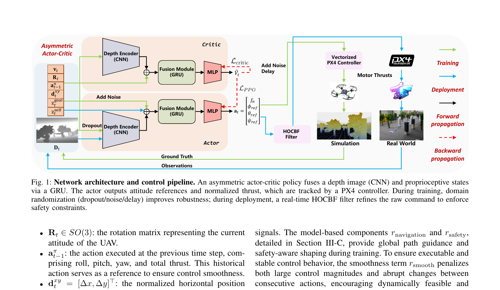
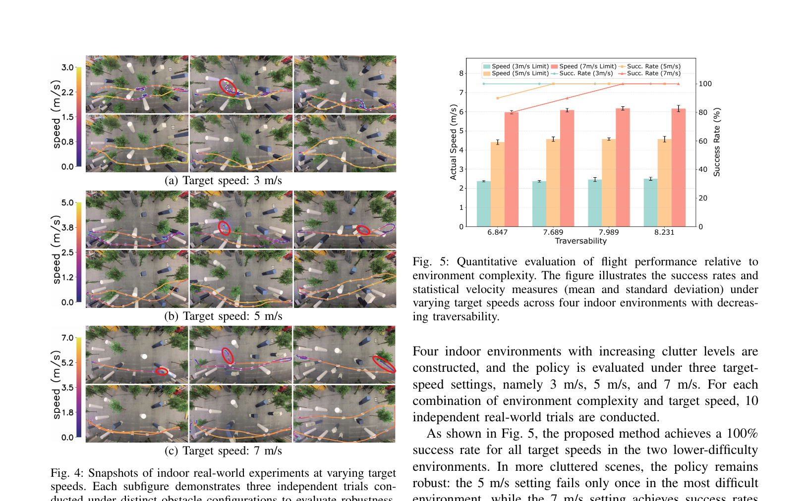
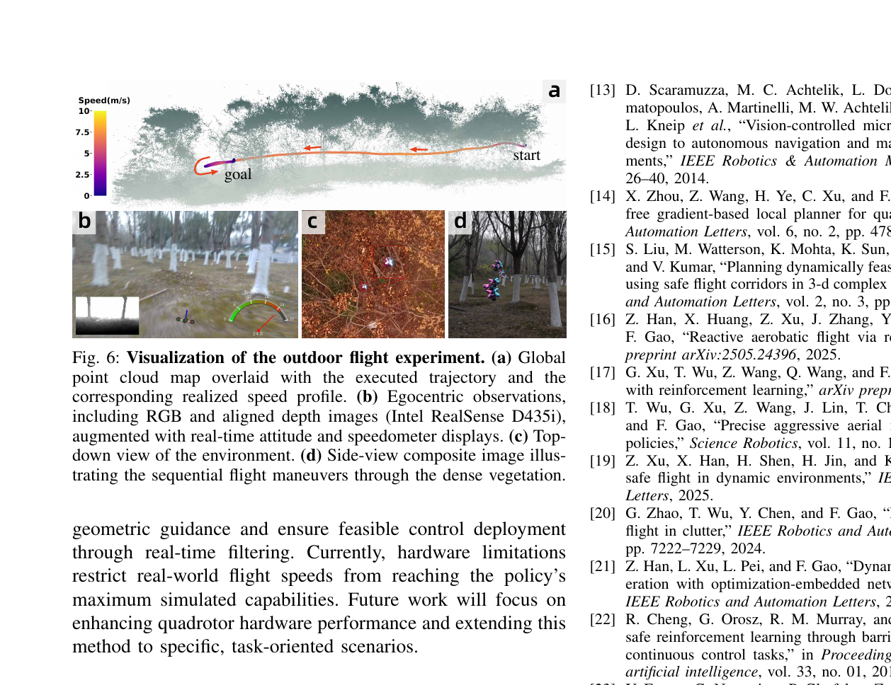

# 《High-Speed Vision-Based Flight in Clutter with Safety-Shielded Reinforcement Learning》中文详解

> 中文题名：基于安全屏蔽强化学习的杂乱环境高速视觉飞行  
> 作者：Jiarui Zhang、Chengyong Lei、Chengjiang Dai、Kenghou Hoi、Lijie Wang、Zhichao Han、Fei Gao  
> 版本：arXiv:2602.08653v2，2026-06-30  
> [原始 PDF](../05_High-Speed_Vision-Based_Flight_in_Clutter.pdf) ｜ [25 篇总览](../19篇论文核心技术与效果汇总.md)

## 1. 一句话概括

论文先用“绕开障碍后的真实路程”和“离危险边界还有多少余量”教强化学习策略正确绕行，再在真实部署时用高阶控制屏障函数和一个小型约束优化器实时检查动作，实现“学习策略负责快速前进、模型安全盾负责最后纠错”的混合系统。

## 外行导读：它实际在做什么

任务类似让无人机以自行车甚至更高的速度穿过树林、立柱和室内障碍。速度越高，从相机看到障碍到真正撞上障碍之间的时间越短；即使算法只慢几十毫秒，无人机也可能多飞几十厘米。系统既要“敢于快速前进”，又要在神经网络判断错误时有最后一道制动和转向保护。

输入主要是深度图、飞行状态和目标方向。学习策略先给出它认为最快的动作；一个很小的数学优化器随后检查该动作是否会使无人机过度接近障碍。如果危险，优化器尽量少改动作，只把危险部分修正掉。评价成功时既要看是否无碰撞到达，也要看实际速度、安全盾求解时间和它修改动作的幅度，不能只看最快的一次飞行。

## 当前研究现状与通用做法

高速避障常见路线如下：

| 路线 | 通用做法 | 优点 | 局限 | 成熟度判断 |
|---|---|---|---|---|
| 建图＋局部轨迹规划 | 深度/激光构图，持续重新搜索和优化短轨迹 | 可解释、容易加入速度和障碍约束 | 高速时感知、地图、规划延迟叠加 | **共识型默认选型** |
| 反应式避障 | 不建完整地图，只根据最近障碍立即转向或减速 | 很快、结构简单 | 容易在死胡同或复杂非凸障碍中失败 | 成熟的局部应急方案 |
| 学习型视觉策略 | 在大量随机环境训练，从深度图直接输出动作 | 推理固定且很快，适合高速 | 没见过的障碍、感知错误和安全证明是难点 | **研究型可选方案** |
| 学习策略＋安全过滤器 | 学习策略负责性能，模型约束在末端修正危险动作 | 兼顾反应速度和可解释安全约束 | 安全过滤依赖距离测量和模型准确；可能无可行动作 | 近年来重要的混合研究路线 |

本文属于最后一类。当前实际机器人中，单独依赖神经网络完成高速安全飞行仍不是普遍默认方案；更稳妥的通用思路是保留一个独立安全层，例如速度限制、紧急制动、模型预测控制或屏障函数过滤器。本文主要解决完整系统中的局部避障和动作安全修正，仍需要上游提供可靠深度图、飞行状态和目标方向，也需要下游飞控准确执行修正后的动作。

## 先把几个术语说清楚

- **Dijkstra 距离场**：先在训练地图上算出从每个位置绕开障碍到目标的最短距离，让策略知道“真正绕过去是否更接近目标”。
- **控制屏障函数**：把安全区域写成一个数学条件；只要控制动作持续满足条件，系统就不会轻易越过设定安全边界。
- **高阶控制屏障函数**：用于“动作不能立刻改变位置，只能先改变加速度”的系统，例如四旋翼。
- **二次规划**：一种很快的小型约束优化。本文用它寻找“离原动作最近、同时满足安全条件”的新动作。

## 2. 背景与问题

模块化的“感知—建图—规划”系统具有可解释性，但地图更新和迭代优化的延迟会随环境复杂度上升；纯强化学习从深度观测直接输出动作，延迟低，却没有严格安全约束，而且只用直线距离判断是否接近目标时，容易被墙壁或 U 形障碍误导。

论文同时处理两个层次：

- **训练层**：让策略学到绕障、贴合全局可行方向和保持安全距离。
- **部署层**：即使策略在未知场景输出危险动作，也由快速二次规划进行最小修改。

## 3. 策略输入、输出与网络

策略每秒运行 100 次。输入包含 `100×60` 的机载深度图、无人机自身运动状态以及目标的相对方向；卷积神经网络提取图像特征，全连接网络编码状态信息，二者再送入循环网络结合前后时刻变化，最终输出四个维度的高层控制动作。

动作层选择飞控能够稳定跟踪的高层控制量，而不是直接命令每个电机转速，这有利于把模拟训练结果迁移到真实无人机。训练时采用**非对称演员—评价者**结构：负责选动作的演员网络只接收带噪声、接近真实部署条件的观测；只负责评价动作好坏的评价网络可以利用模拟器中的无噪声真值。这种不对称只存在于训练阶段，真机无需评价网络。

| 接口 | 具体内容 | 外行解释 |
|---|---|---|
| 深度观测 | 100×60 深度图 | 每个像素表示该方向的障碍距离，不读取彩色纹理 |
| 自身状态 | 三维速度、三维旋转矩阵、上一动作 | 告诉策略现在飞多快、机身朝哪里、刚刚执行了什么 |
| 任务状态 | 目标的水平相对位移、当前高度、目标高度 | 告诉策略总体应往哪边走和应保持多高 |
| 策略动作 | 归一化总推力、滚转/俯仰/偏航参考角 | 交给低层飞控跟踪，不是直接电机转速 |
| 更新频率 | 100 Hz | 每 10 毫秒产生一组新动作，并运行一次安全过滤 |

图像由卷积网络编码，历史信息由门控循环网络保存，低维状态由多层感知器处理。循环记忆对部分可观测问题很重要：当前图像可能只看到一小段树干，而连续几帧能够提供接近速度和遮挡变化。评价网络读取无噪真值后可以给演员更稳定的训练信号，但不能把这一点误写成“真机有完美状态”。

### 3.1 从传感器到电机的完整链路

把图 1 中容易混在一起的模块拆开，可以得到一条清楚的数据链：

1. **深度相机感知**：Intel RealSense D435i 输出深度图。策略并不直接读取彩色纹理，因此主要依据障碍物的几何远近作判断。
2. **自身状态估计**：系统提供当前姿态、上一控制周期动作、目标相对方向和目标高度等低维状态。这一步依赖可靠的定位与姿态估计，并不是神经网络凭图像自行推断全部状态。
3. **非对称演员—评价者策略**：图像由卷积神经网络编码，状态由全连接层编码，随后通过门控循环单元保存短时运动记忆。演员网络输出总推力和姿态参考；评价者网络只在训练时帮助判断动作好坏。
4. **安全过滤**：部署时，高阶控制屏障函数把演员网络的原始动作投影到当前观测下的安全动作集合中。
5. **飞控跟踪**：PX4 飞控负责把姿态和推力参考转换为电机指令。论文的学习策略并没有替代底层姿态稳定环。

> **图读法（来源：原论文 Fig. 1，第 3 页）**：左侧上下两路分别是训练评价者和部署演员；绿色线表示训练数据流，蓝色线表示真实部署，黑色线表示正常前向控制，红色虚线表示反向传播。最值得注意的是，真实部署链仍保留高阶屏障过滤器和 PX4 飞控，所以这不是“一个神经网络直接控制四个电机”。

### 3.2 为什么使用循环记忆

一张深度图只能告诉系统“此刻障碍有多近”，不能直接分辨障碍正在接近还是远离。门控循环单元把最近若干时刻的图像特征和动作联系起来，为网络提供近似的短时速度线索。这对高速飞行尤其重要：同样距离 3 米的树，在无人机静止和以每秒 7 米前进时，对应的风险完全不同。

## 4. 物理先验奖励

### 4.1 Dijkstra 测地导航奖励

普通距离奖励为 `d(t-1)-d(t)`，遇到墙或 U 形障碍时可能鼓励飞行器直冲目标。论文在训练地图上预计算从目标到全空间的 Dijkstra 测地距离场 `Φ_g`，以

\[
r_{nav}=\operatorname{clip}(\Phi_g(p_{t-1})-\Phi_g(p_t))
\]

奖励沿全局可通行方向取得的真实进度。该地图只在训练时使用，部署不需已知全局地图。

### 4.2 控制屏障函数安全奖励

根据无人机与障碍的最小距离构造屏障函数。安全状态时屏障值为正，靠近或越过安全边界时为负。训练奖励惩罚违反屏障安全条件的状态，使策略在安全盾真正介入之前，就先学会保留制动和绕行余量。

为避免极少数严重违规样本产生过大的负奖励并压倒其他学习信号，论文把这一安全奖励的下界裁剪为 `−2`。这说明训练期屏障项仍是一个有权重、有截断的**软奖励**：它提高安全行为出现的概率，却不能强制每一个动作都满足约束。真正逐周期修改动作的是下一节的部署端二次规划。

总奖励还包括动作平滑、速度与高度软约束、碰撞惩罚和到达奖励。全局绕行距离与屏障安全条件都只在训练时充当“老师”，不增加真实部署时的传感器需求。

## 5. 部署端高阶控制屏障函数安全盾

四旋翼不能让位置瞬间发生变化，只能先改变加速度，再经过一段时间改变速度和位置。因此，普通的一阶屏障条件不能直接限制加速度动作。论文使用高阶控制屏障函数，把“离障碍必须足够远”这一条件逐层换算，直到它能直接约束当前加速度。

每个控制周期求解一个小型二次规划问题：

\[
\min_{a^*}\|a^*-a_{\text{策略}}\|^2,
\]

式中的 `a策略` 是学习策略原本想执行的加速度，`a*` 是安全盾检查后的加速度。目标函数表示“修改得越少越好”；约束则要求所有近邻障碍都满足高阶屏障安全条件，同时动作不能超过无人机能力上限。这样既保留策略的敏捷性，又会根据当前速度动态决定需要多大制动余量。

安全盾平均求解时间为 90.61 微秒，最大低于 384.5 微秒，远小于每秒 100 次控制所允许的 10 毫秒周期。

### 5.1 “安全盾”到底保证什么

安全条件不是一句抽象的“不碰撞”，而是依据当前深度观测得到的障碍距离、无人机速度和动力学模型，约束下一步控制不能让屏障函数继续朝危险方向恶化。速度越高，系统需要保留的制动距离越长，因此同一个空间位置在低速下可能安全、在高速下却需要立即修正动作。

需要特别区分三个层次：

- **数学层保证**：若障碍距离与动力学模型准确、二次规划存在可行解并持续及时求解，则过滤后的动作满足论文定义的局部屏障条件。
- **机器人层保证**：还要求相机没有漏检、状态估计正确、PX4 能跟上参考动作，并且总延迟没有超过设计余量。
- **任务层保证**：即便每一步局部安全，也不保证一定能走出死胡同或到达全局目标；全局可达性仍主要由训练期的测地距离指导和策略泛化能力决定。

因此，把它称作“安全屏蔽”比“绝对不会撞”更准确。它是一道很快的局部末端防线，而不是完整系统的形式化安全证明。

## 6. 训练与消融

训练在 Isaac Lab 机器人仿真平台中进行，使用 1,000 架虚拟无人机并行采样，并从 16 个程序化生成场景中不断随机产生任务。程序化场景包含不同密度、形状和布局的障碍，目的是让策略学习通用局部几何反应，而不是记住一张固定地图。训练使用近端策略优化算法，并像课程学习一样逐渐提高目标速度。到达目标点 `5 m` 半径内记为成功；这个判据适合高速长程评测，但不代表厘米级定点降落精度。

一次训练回合可以按以下逻辑理解：

1. 随机选择程序化场景、起点、目标和目标速度，并生成训练期可见的全局占据地图。
2. 在地图上计算 Dijkstra 测地距离，让绕过墙壁后仍接近目标的动作获得正反馈。
3. 演员读取带噪深度图和状态并输出动作；评价者读取更准确的仿真真值估计长期回报。
4. 环境检查碰撞、目标进度、速度、动作平滑和屏障条件，形成总奖励。
5. 1,000 个环境批量采样后更新策略，并逐步提高目标速度和场景难度。
6. 部署前冻结演员网络；真机运行时不再使用 Dijkstra 全局地图，也不读取训练真值，只保留深度策略和高阶屏障安全盾。

作者比较：

1. 欧氏距离奖励。
2. Dijkstra 测地奖励。
3. 全局绕行距离奖励＋控制屏障函数安全奖励。
4. 完整训练奖励＋部署端高阶屏障安全盾。

全局绕行距离明显提升了复杂非凸场景中的学习效率；加入屏障函数奖励进一步减少危险行为。仅扩大静态障碍的安全圈不能替代随速度变化的安全约束：在目标速度每秒 5 米的对照实验中，单纯几何膨胀的成功率为 87.08%，屏障函数引导策略为 92.50%，且后者实际飞行速度更高。

论文还报告了下面这组直接对照：

| 训练期安全处理 | 成功率 | 平均欧氏符号距离场间隙 |
|---|---:|---:|
| 固定几何障碍膨胀 | 87.08% | 0.89 m |
| 控制屏障函数奖励 | 92.50% | 0.92 m |

“欧氏符号距离场间隙”可理解为无人机与最近障碍边界之间的平均几何余量。两者平均间隙只差 0.03 米，成功率却差约 5.42 个百分点，说明速度相关的屏障条件不只是把所有障碍统一加粗，而是在高速时更重视能否及时制动。该表比较的是训练引导方式，并不等于部署端安全盾已经对所有风险作出严格保证。

## 7. 仿真结果

完整方法在未见过的杂乱环境中表现为：

| 目标速度 | 成功率 |
|---:|---:|
| 3 m/s | 96.88% |
| 5 m/s | 96.25% |
| 7 m/s | 73.75% |
| 9 m/s | 56.88% |

与 Ego-Planner、NavRL、YOPO 等方法比较时，本文在高速区间保持更好的成功率—实际速度折中。动态障碍仿真成功率为 64%，说明安全盾能够迁移到训练外运动障碍，但还没有达到静态场景水平。

## 8. 实机结果

- 室内困难障碍布局以 7 m/s 飞行，成功率 80%。
- 森林场景平均约 7 m/s，单次航程超过 35 m，最高报告速度约 7.5 m/s。
- 动态障碍实机试验 10/10 成功。
- 高阶屏障安全盾能在策略即将进入危险区时快速改变加速度，而多数时间保持原策略输出。

> **图读法（来源：原论文 Fig. 4–5，第 7 页）**：左侧每一组上排是 Ego-Planner、下排是本文方法，红圈表示碰撞；右侧把四个室内场景按可通行难度排列。本文的优势不是单次峰值速度，而是在障碍更密、目标速度更高时仍维持接近目标的实际速度和较高成功率。每种场景—速度组合进行了 10 次真实试验。

> **图读法（来源：原论文 Fig. 6，第 8 页）**：上方是点云地图、执行轨迹和速度着色；下方给出机载视角、俯视场景和连续动作合成。论文报告该段航程超过 35 米、平均速度约 7 米/秒。它证明了从随机仿真到自然森林的迁移，但仍是有限路线上的实验，不等于任意森林、任意光照都能保持相同性能。

### 8.1 怎样公平解读这些效果

- **成功率必须和速度一起看**：降低速度通常能提高成功率。本文的重要结果是实际速度没有随杂乱度明显塌缩，而不是只报告“曾经飞到多快”。
- **室内和室外训练设置不同**：室外策略在训练时降低了障碍密度并提高速度上限，不能把它理解为同一个权重不经任何配置变化覆盖所有场景。
- **动态障碍结果仍有限**：仿真中 100 次密集动态试验成功率为 64%；实机 10 次面对的是每秒 0.5 米移动的单个障碍。论文明确指出，障碍从传感器盲区接近时仍会失败。
- **基线条件影响结论**：Ego-Planner 的性能受到建图、规划和重规划延迟影响；学习方法则把大量计算前移到训练阶段。两者是在不同计算范式下比较在线表现。

## 9. 贡献判断

本文不是简单地“在强化学习后面加个限速器”。训练期的屏障奖励使策略学会预留安全余量，部署期的高阶屏障安全盾再处理未见场景中的危险动作，二者构成“先培养安全习惯、再做末端纠错”的两层架构。全局绕行距离则解决端到端导航容易只盯着目标直线方向的问题。

## 10. 局限

- 高阶屏障安全盾的可靠性取决于深度观测、障碍距离估计和动力学模型；如果感知系统根本漏掉障碍，相应安全约束也不会出现。
- 安全约束与到达性可能冲突，极高速下可行控制集合会缩小。
- 9 m/s 成功率降至 56.88%，动态障碍仿真仅 64%，尚不能称为全速度范围安全保证。
- 二次规划只能保证相对于当前观测和所用模型满足约束，不等于对包含感知误差、执行延迟在内的完整系统给出全局不碰撞证明。
- 论文版本为 2026 年预印本，需独立复现。

## 11. 复现要点

- Dijkstra 距离场的分辨率、障碍膨胀和训练场景多样性会直接影响策略偏好。
- 高阶屏障函数的增益不能只追求大；过强会导致没有可行动作或修正过于剧烈，过弱则制动不足。
- 必须记录二次规划找不到可行动作的比例、动作修正幅度、最小障碍距离和从看到障碍到执行动作的总延迟。
- 高速实机应把深度量程和最大制动距离一起纳入速度上限设计。

## 12. 结论

论文展示了一条工程价值很高的高速导航路线：用学习方法处理复杂视觉和快速决策，用全局绕行距离改善训练，再用高阶屏障函数与小型二次规划实时修正危险动作。它显著降低了风险，但没有消除高速感知漏检、动作延迟和动力学极限带来的失败。
