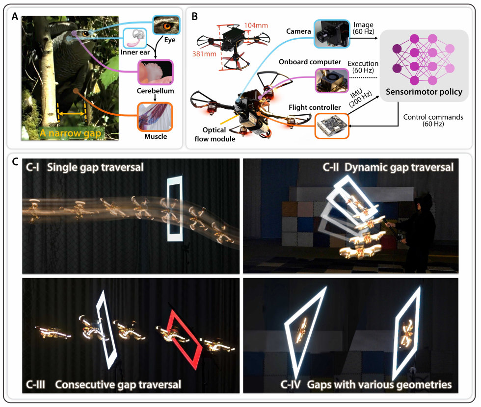
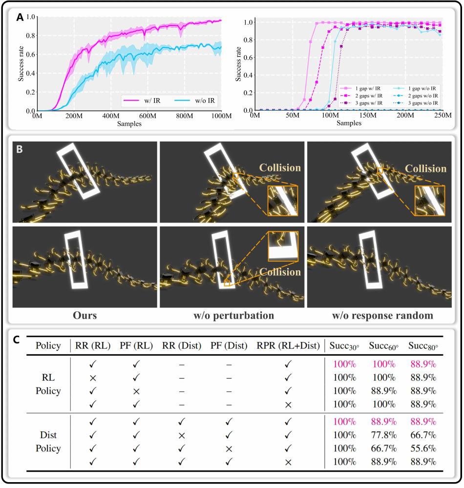
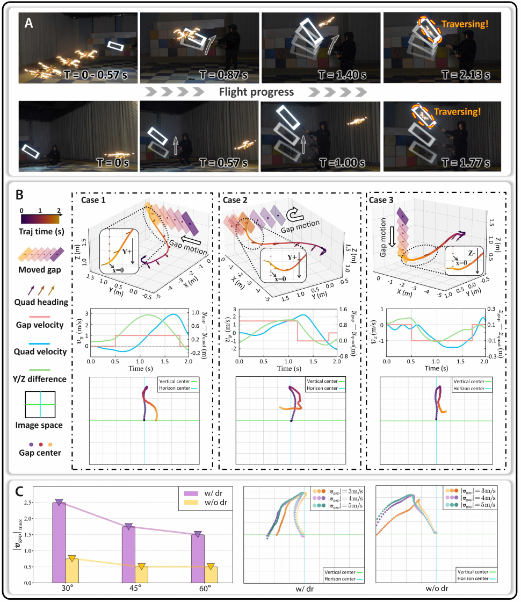
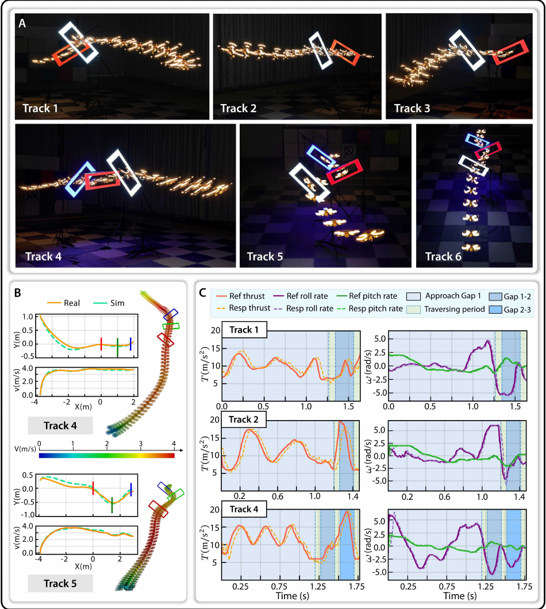

# 《Precise Aggressive Aerial Maneuvers with Sensorimotor Policies》中文详解

> 中文题名：基于传感运动策略的精准激进空中机动  
> 作者：Tianyue Wu、Guangtong Xu、Zihan Wang、Junxiao Lin、Tianyang Chen、Yuze Wu、Zhichao Han、Zhiyang Liu、Fei Gao  
> 版本：arXiv:2604.05828v2，2026-04-08  
> [原始 PDF](../06_Precise_Aggressive_Aerial_Maneuvers.pdf) ｜ [25 篇总览](../19篇论文核心技术与效果汇总.md)

## 1. 一句话概括

论文先让能看到精确缝隙位置和完整飞行状态的强化学习“专家”掌握穿越动作，再用在线模仿学习把专家能力教给只能看到历史视觉观测和自身状态的循环网络，使四旋翼在只剩 5 厘米几何余量时仍能完成大倾角和动态窄缝穿越。

## 外行导读：它实际在做什么

想象一架宽约 38 厘米的无人机，要从只比自己多 5 厘米余量的窗口中高速穿过。窗口可能倾斜、移动，后面还可能紧接第二个和第三个窗口。无人机不能只把中心对准窗口：它必须提前侧身或低头，让整个机体包络在穿越瞬间与窗口方向一致，并在穿过后迅速恢复。

系统先由视觉模块指出窗口边缘或可通过区域，控制策略再结合连续多帧观测和飞行状态输出低层动作。成功标准是整个机体无碰撞地通过，而不是相机或质心穿过即可。

论文最值得注意的地方是把“看”和“飞”分成两个训练难度，却在最终部署时重新合成一个实时策略。第一阶段先回答：如果已经知道缝隙的精确三维边缘和无人机速度，怎样控制才穿得过去？第二阶段再回答：只看连续的二维缝隙掩码，怎样恢复出足够的信息并模仿前面的控制？这样既避免一开始就在数万图像像素上盲目强化学习，又保持真机执行时的快速闭环反应。

> 图源：原论文 Fig. 1，PDF 第 3 页。图中展示约 38 厘米宽的真机、单目相机和从静态倾斜缝到动态缝的任务。这里的视觉地标是指定目标缝隙，不是任意场景中的通用自由空间识别。

## 当前研究现状与通用做法

精准穿缝通常有三类方案：

| 路线 | 怎样完成任务 | 优点 | 局限 | 成熟度判断 |
|---|---|---|---|---|
| 几何感知＋轨迹优化＋跟踪 | 测出窗口四角和位姿，计算一条倾斜穿越轨迹，再由控制器跟踪 | 精确、约束清楚，适合静态窗口 | 依赖准确定位；动态窗口需快速重规划；模块误差会累积 | **共识型默认选型** |
| 视觉伺服 | 根据窗口在图像中的偏差实时修正飞行方向 | 反应快，不必先构完整地图 | 很难同时规划大姿态、机体包络和连续窗口 | 常见局部控制方法 |
| 学习型传感—动作策略 | 从视觉历史直接产生控制，联合学习接近、侧身、穿越和恢复 | 能形成复杂闭环反应 | 训练困难、安全难保证、依赖数据覆盖 | **研究型可选方案** |

本文不是完全抛弃模型规划。它先用模型规划找到“可行解大概在哪里”，再让强化学习探索；之后才把有完整状态的专家压缩成视觉策略。因此它更像“模型帮助训练，学习负责最终实时执行”的混合路线。

## 先把几个术语说清楚

- **专家策略（论文称 Oracle）**：训练时能看到完整、准确状态的策略，相当于一位掌握答案的老师。
- **策略蒸馏**：让只能看相机的学生策略模仿专家，把专家能力压到更有限的输入中。
- **在线模仿学习**：学生先按自己的动作飞到可能犯错的状态，再让专家给这些状态标答案，减少“训练时从没见过自己的错误”的问题。
- **循环网络/信念状态**：利用连续多帧记忆，即使窗口边缘暂时离开画面，也能估计它大概在哪里。
- **视场**：相机能看到的角度范围，后文尽量不用英文缩写 FOV。

## 2. 为什么困难

窄缝穿越同时要求：

- 在到达缝隙前快速平移并建立正确姿态。
- 穿越瞬间机体包络全部落在可通过区域内。
- 穿越后及时恢复，避免撞上连续障碍。
- 相机在大滚转/俯仰、运动模糊和遮挡下仍持续看到缝隙。

直接让强化学习根据相机像素试错很难：图像信息量大，单帧又看不全真实状态，策略需要记住前几帧；同时，成功穿缝奖励非常稀少，真正动力学可行的动作只占所有可能动作中的一小部分。论文因此把“先学会怎么控制”和“再学会如何从视觉判断状态”拆成两个阶段。

## 3. 总体架构

整个问题原本是一个“部分可观测的连续决策问题”：相机只能看到投影后的局部画面，真实三维缝隙位置、相对速度和执行器误差都不会完整出现。论文把它拆成下表两步：

| 阶段 | 策略输入 | 策略输出 | 学习方法 | 部署时是否保留 |
|---|---|---|---|---|
| 特权专家 | 缝边缘 32 个三维点、滚转/俯仰、机体系线速度、上一动作 | 总推力＋三轴机体系角速度 | 近端策略优化强化学习 | 不直接保留 |
| 视觉学生 | 320×256 二值缝隙掩码、滚转/俯仰、上一动作、历史记忆 | 同样的 4 维控制＋1 维穿越完成判断 | 在线数据聚合模仿学习 | 是 |

专家输入更容易学习，因为三维点直接描述了“缝在哪里”，机体系速度直接描述了“正在怎样接近”。学生输入更接近真机，却缺少速度和三维几何，只能用循环网络从连续画面变化和动作历史中建立内部估计。

### 3.1 第一阶段：训练信息充分的专家策略

训练时用沿缝隙边缘均匀采样的 3D 地标点表示缝隙几何，并提供机体系速度等特权状态。观测包含：

- 当前/后续缝隙的边缘地标及相对几何。
- 飞行器姿态、角速度、上一动作等本体信息。
- 训练期可获得的完整运动状态。

具体实现从缝隙边缘均匀取 `32` 个三维点。对于连续多缝任务，专家当前只读取下一道即将穿越的缝，机体包络全部越过该缝平面后才切换到下一道。动作是 `[T, ωx, ωy, ωz]`：质量归一化总推力和三轴机体系角速度，由 PX4 飞控继续转成电机控制。

奖励包含五类：完整机体通过时的精度奖励、鼓励朝缝隙前进的塑形奖励、动作幅值与变化惩罚、鼓励主动让缝隙保持可观测的蒸馏正则，以及超过 `4 m/s` 后的软速度惩罚。碰撞检测把无人机保守建模成 `34×34×11 cm` 的长方体，不是只检查质心或相机。只有整个长方体无碰撞越过缝平面，才会得到核心精度奖励。

### 3.2 用规划结果选择更有学习价值的起点

随机探索几乎无法碰到窄缝可行解。作者先用模型轨迹规划得到一组动力学可行参考状态，让训练回合从这些轨迹附近开始，再随着策略能力提高，逐步把起点扩展到更远、更难的状态。这不是让策略跟踪固定轨迹，而是让规划器先告诉强化学习“可行解大致位于哪里”。

实验中，使用这种“知情重置”后，在 10 亿个训练样本预算内达到约 96% 平均成功率；不借助规划结果选择起点时，使用约三倍样本也只达到 70%。

“知情重置”最容易被误解成轨迹跟踪。实际流程是先离线优化出一批高质量状态，再从这些状态附近启动强化学习回合；重置之后采取什么动作仍由策略探索，奖励也不要求逐点贴着参考轨迹飞。它利用规划结果缩小早期搜索范围，却允许策略最终发现与参考轨迹不同、对模型误差更有鲁棒性的闭环动作。

### 3.3 第二阶段：传感运动策略蒸馏

部署策略不再读取训练时的精确状态，而是读取从历史图像中提取的缝隙边缘、分割结果以及无人机自身状态。循环网络把连续多帧信息汇成内部“信念状态”，在缝隙短时离开画面或只检测到一部分时，继续估计它大概在哪里。

在线模仿学习先让学生策略按自己的决定飞行，再请专家给学生实际到达的这些状态标出正确动作。这样，学生能专门学习怎样从自己的小错误中恢复，避免纯离线模仿在偏离示范轨迹后迅速累积误差。最终策略直接输出动作，不再保留独立的轨迹规划、视觉伺服和跟踪模块接口。

视觉学生先用轻量卷积网络编码 `320×256` 二值掩码，再把视觉特征、滚转/俯仰和上一动作送入单层门控循环网络。循环网络维护一个随时间更新的“信念状态”，相当于记住缝隙刚才在画面哪里、自己发出了什么动作、画面正在怎样变化。随后全连接网络产生 4 维控制命令。

学生还有第 5 个输出：判断整个机体是否已经完全穿过缝平面。输出小于 0 表示尚未完全通过，大于 0 表示已经通过；真机用它触发恢复程序，由光流辅助悬停系统重新稳定无人机。这个额外输出很关键，因为相机先穿过窗口并不代表后侧旋翼也已经安全通过。

论文采用在策略数据上运行的数据聚合算法：

1. 当前学生策略在仿真中自己飞，而不是始终沿专家轨迹飞。
2. 对学生实际到达的每一个状态，调用特权专家给出应采取的动作。
3. 用这些“学生观察—专家动作”样本监督更新学生网络。
4. 重复执行，让学生逐步覆盖自己会犯错和需要恢复的状态。

这比一次性收集专家演示再离线模仿更适合闭环控制，因为真实部署中的小误差会把学生带到专家演示从未经过的位置。

## 4. 域随机化与反应性

训练随机化初始位置和姿态、缝隙尺寸/倾角/速度、外力扰动、控制响应和响应参数等。特别重要的是：

- **外力扰动随机化**：扩大强风、碰撞小扰动等情况下的状态分布。
- **控制响应随机化**：覆盖执行器时延和响应快慢变化。
- **响应参数随机化**：覆盖不同动力学参数造成的飞行差异。

动态缝隙对照实验显示，带随机化的策略能根据实时观测变化，持续把缝隙中心留在相机视场内；没有随机化的策略更像机械复现训练轨迹，缝隙很快漂出画面。因此随机化不仅帮助策略从模拟器迁移到真机，也训练出了真正会根据当前情况纠偏的闭环行为。

> 图源：原论文 Fig. 7，PDF 第 20 页。曲线比较是否使用知情重置时的学习效率，序列图和表格比较去掉不同随机化后的动态反应与成功率。消融支持“课程起点”和“模拟到现实扰动覆盖”分别解决探索效率与部署鲁棒性。

两阶段训练使用 Intel i9-14900K 处理器推进仿真状态，使用英伟达 RTX 4090 图形处理器优化网络；蒸馏阶段还由图形处理器生成图像。训练计算平台与最终 Jetson Orin NX 机载平台不同，因此复现时既要验证训练吞吐，也要单独测量机载推理和传感链延迟。

## 5. 感知形式

主要实验采用二值化缝隙地标观测，减少像素外观影响。论文还用学习式分割器产生更噪声的地标，在背景杂乱、边缘缺失情况下验证策略，说明方法不必依赖手工完美角点。

二值掩码中目标缝隙区域与背景被分成两类。它丢掉纹理和颜色，可以缩小模拟与现实外观差异；代价是系统必须先知道哪一块是目标缝隙。在简单实验中可以用颜色阈值提取，在复杂背景中可以用轻量分割网络，但前端漏检、错选目标或遮挡严重时，后端控制策略无法凭空恢复正确语义。

需要注意：这不是从任意彩色图像中自动发现所有可穿区域的通用语义系统。前端仍需先指出目标缝隙或它的边界。

## 6. 实机平台与任务

飞行器约 38 cm 宽、10 cm 高，最紧缝隙只比机体包络多约 5 cm。测试包括：

- 不同滚转/俯仰倾角的静态缝。
- 最高 90° 倾斜缝。
- 速度不低于 3 m/s 的动态移动缝。
- 两个和三个连续缝。
- 不同长宽比、形状及含遮挡的物理缝。

真实物理缝试验总数超过 100 次。

真机平台约 `38.1 cm` 宽、`10.4 cm` 高，机载相机原始分辨率为 `1280×1024`，送入策略前降采样到 `320×256`。相机和策略控制均以约 `60 Hz` 更新，惯性测量约 `200 Hz`；机载计算使用 Jetson Orin NX，低层由 PX4 飞控执行。实验中总推力范围约为 `6—20 m/s²`，三轴角速度上限为 `6 rad/s`。这些动作上限、频率和推力标定是实现窄余量穿越的系统条件，不是只复制网络权重就能自动获得。

## 7. 量化结果

> 图源：原论文 Fig. 3，PDF 第 12 页。连续图像展示策略如何根据移动缝的实时视觉位置调整接近轨迹。论文验证的动态缝速度达到或超过 3 m/s，但这不是任意方向、任意加速度动态障碍的通用保证。

| 条件 | 结果 |
|---|---:|
| 滚转角 ≤60° | 29/30 成功 |
| 滚转角 >60° | 27/30 成功 |
| 俯仰 30° | 100% |
| 俯仰 45° | 80% |
| 俯仰 60° | 73.3% |
| 最大验证倾斜角 | 90° |
| 动态缝速度 | ≥3 m/s |
| 最小几何余量 | 约 5 cm |

连续缝任务证明策略不是只优化单次穿越瞬间，还能在前一动作恢复阶段为下一缝隙调整状态。

> 图源：原论文 Fig. 4，PDF 第 15 页。多道缝使前一次穿越的退出状态直接成为下一次的进入条件，比单缝更能检验历史记忆、切换逻辑和恢复能力。

这些比例需要结合试验次数解读。滚转分组分别是 30 次中的 29 次和 27 次成功；俯仰 30°、45°、60° 的成功率随倾角增加从 100% 降到 80% 和 73.3%。因此论文证明了在给定平台和目标缝识别条件下能达到很高精度，但没有证明倾角越大仍保持同样可靠性。

## 8. 与传统方法的区别

轨迹优化＋跟踪方法可显式处理模型约束，但依赖外部定位和准确几何，面对动态缝需要重规划。传统视觉伺服依赖固定误差接口，难以联合考虑未来姿态和机体包络。本文策略从观测历史直接形成任务相关表示，把看、转、加速、穿越和恢复放进同一闭环策略。

## 9. 创新点

1. 先让掌握完整状态的低维专家学控制，再通过在线蒸馏教给只能获得不完整视觉观测的学生策略。
2. 用模型规划初始化解决狭窄可行域探索，而非把规划轨迹当最终执行结果。
3. 证明域随机化可带来动态目标反应性，而不仅是参数鲁棒性。
4. 以大量物理缝、极小余量和大倾角验证端到端低层策略精度。

## 10. 局限

- 感知前端仍需明确输出缝隙地标/分割，完整的开放世界可通行区域发现尚未解决。
- 任务高度专注于窄缝，不能直接等价为长期未知环境导航。
- 部署输入是目标缝的二值掩码而非原始彩色图；开放环境中的目标检测、语义选择和错误拒绝仍是独立问题。
- 倾角和缝隙越极端成功率越低；俯仰 60° 已降到 73.3%。
- 策略缺少显式安全证书，分布外形状、强风和严重感知丢失仍可能失败。
- 训练样本规模很大，而且需要高质量仿真、掌握完整状态的专家和模型轨迹初始化。
- 部分试验使用硬件在环方式：真实飞行器运行策略，但用动作捕捉融合状态合成视觉观测以减少设备损坏。这类结果应与完整物理缝、真实相机观测的 100 余次试验区分。

## 11. 复现要点

- 先把机体真实碰撞包络而非质点纳入穿越判定。
- 专家观测坐标、学生视觉地标坐标和实机相机标定必须严格一致。
- 在线蒸馏要收集学生策略真正访问到的状态，不能只复用专家轨迹。
- 消融应分别覆盖外力、控制响应和参数随机化，否则难以判断鲁棒性来源。
- 成功率需按缝隙尺寸、滚转/俯仰角和动态速度分桶报告。
- 需要单独测试掩码延迟、缺失、错分和目标切换；只用完美模拟掩码会高估真实感知链可靠性。
- 推力—油门映射必须针对电机、电池和载荷实测标定；极限姿态下的小推力误差会放大成穿缝位置误差。

## 12. 结论

论文的核心并非单一网络结构，而是一套“模型规划缩小探索空间—强化学习掌握控制—在线模仿迁移到视觉观测—随机化形成反应性”的训练方法。它把窄缝机动精度推进到接近机体尺寸极限，但距离开放世界通用敏捷飞行仍有感知和安全两道门槛。
