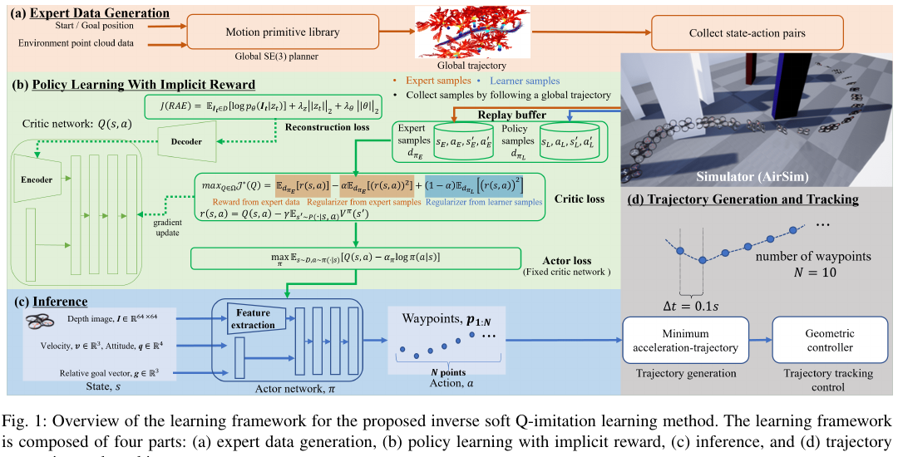
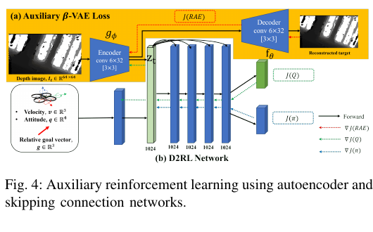
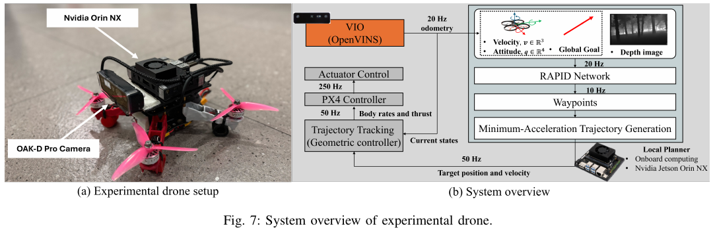
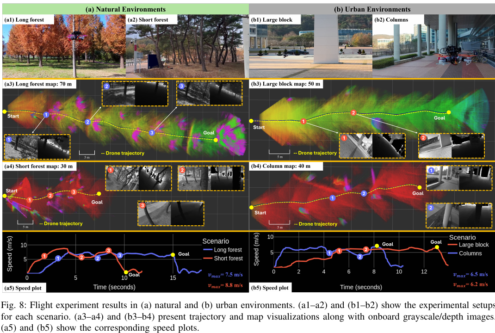

# 《RAPID》中文详解

> 全名：Robust and Agile Planner Using Inverse Reinforcement Learning for Vision-Based Drone Navigation  
> 中文题名：基于逆强化学习的鲁棒敏捷视觉无人机规划器  
> 作者：Minwoo Kim、Geunsik Bae、Jinwoo Lee、Woojae Shin、Changseung Kim、Myong-Yol Choi、Heejung Shin、Hyondong Oh  
> 发表信息：Robotics: Science and Systems（RSS）2025；arXiv:2502.02054v2  
> [原始 PDF](../09_RAPID_Robust_and_Agile_Planner.pdf) ｜ [25 篇总览](../19篇论文核心技术与效果汇总.md)

## 1. 一句话概括

RAPID 先让能够看到完整训练地图的传统规划器充当“老师”，生成大量安全飞行动作；再用改进的逆强化学习从老师的示范中推断“怎样的状态和动作值得鼓励”，训练只看深度图的神经网络。最终网络在 Jetson Orin NX 机载计算机上约 10 毫秒就能给出下一个局部航点。

## 外行导读：它实际在做什么

任务是让小无人机在没有提前地图的森林或厂房中高速前进。相机给出一张灰度“距离图”：每个像素代表该方向离物体有多远。系统要从中找到树干之间的缝，并不断给出下一小段飞行目标。它不在飞行时建立完整地图，而是用神经网络快速模仿一个训练阶段的传统规划专家。

成功既包括完整到达，也包括飞了多远、是否碰撞和实际速度。论文特别关注机载计算机速度，因为实验室台式显卡上很快的算法，放到小无人机上可能完全跑不动。

RAPID 不是从深度图直接输出四个电机转速，也不是一个包含全局决策的完整自动驾驶系统。它位于系统中间：视觉—惯性里程计提供速度和姿态，上层给出相对目标，RAPID 每次产生未来 1 秒左右的局部航点，轨迹生成器把离散航点变平滑，几何控制器和 PX4 飞控再执行。理解这个边界可以避免把“局部学习规划器”误写成“单网络完成所有导航”。

## 当前研究现状与通用做法

未知森林视觉导航常见路线如下：

| 路线 | 通用流程 | 优点 | 局限 | 成熟度判断 |
|---|---|---|---|---|
| 深度感知＋建图＋搜索＋轨迹 | 建局部占据地图，搜索通道并优化平滑轨迹 | 可解释，容易查看失败原因 | 地图与搜索增加延迟和内存；高速时旧地图很快过时 | **共识型默认选型** |
| 反应式局部规划 | 只根据当前深度图选择开阔方向 | 算法快、端侧容易运行 | 缺少记忆和全局意识，容易陷入局部死路 | 工程中常作短程避障 |
| 行为克隆 | 收集传统规划器或人类动作，直接训练网络模仿 | 训练简单，充分数据下效果好 | 一旦偏离专家轨迹，错误会连续积累 | 成熟的学习基线 |
| 强化学习 | 在模拟器试错，人工设计进度、避障、平滑等奖励 | 能探索专家数据外行为 | 奖励难设计、样本量大 | 研究型方案 |
| 逆强化学习 | 从专家行为反推出“什么是好动作”，再学习策略 | 少手工拼奖励，可提取专家偏好 | 算法更复杂，专家数据和终止处理很关键 | **较新的研究型可选方案** |

RAPID 属于最后一类。它并不声称传统规划失去价值：传统规划器正是训练数据的老师。论文做的是把慢但可靠的专家知识压缩成固定时间神经网络，适合机载高速运行。

## 先把几个术语说清楚

- **深度图**：每个像素记录该方向离障碍有多远，不是普通彩色照片。
- **运动基元**：提前准备的一小组可执行短动作，例如向左弯、向右弯、上升和直行；规划器快速组合它们。
- **行为克隆**：像学生照抄老师动作，只学“老师在这个画面会怎么做”。
- **逆强化学习**：不仅抄动作，还尝试推断老师行动背后的评分规则。
- **LS-IQ**：本文采用的一种逆强化学习算法名称；理解论文时只需知道它把奖励学习和动作价值学习合在一起。

## 2. 研究背景：为什么使用逆强化学习

行为克隆只在专家访问过的状态上学习，一旦真实飞行偏离示范轨迹，错误就可能连续积累；普通强化学习需要人工设计复杂的避障奖励，而且需要大量模拟试错。逆强化学习则从专家行为反推“什么状态和动作是好行为”，再优化策略，因此既能利用规划器知识，又不必逐动作完全照抄老师。

RAPID 面向未知森林和工厂，不在在线阶段维护显式地图。它输出局部目标/运动指令，再由轨迹生成和控制模块平滑执行。

> 图源：原论文 Fig. 1，PDF 第 4 页。左侧传统规划器只在训练期生成专家示范；中间从专家与学习者数据共同学习动作价值和策略；右侧把网络航点转换为连续轨迹，再交给控制器执行。

三种学习路线的差别可以用“学生向老师学习”作类比：行为克隆只背老师的答案；普通强化学习只看人工编写的打分标准；逆强化学习尝试从老师的选择中反推出打分偏好，并允许学生在模拟器中经历自己的状态。RAPID 选择第三种，是为了减少行为克隆偏离示范后的连续错误，又避免人工反复调整十几个高速避障奖励项。

## 3. 核心方法一：专家数据生成

训练仿真中放置锥体、方块、树和墙，并随机改变位置、大小和密度。专家可访问完整三维地图，使用运动基元搜索生成不碰撞的局部动作。系统记录专家当时看到了什么、处于什么状态、选择了什么动作，供逆强化学习使用。

专家优势是几何可解释且稳定，缺点是在线搜索较慢；学习目标是把专家行为压缩为固定时延神经网络。

论文的数据规模是：在 `600` 张训练地图中生成 `1,800` 条全局轨迹，再以 0.1 秒间隔切分并局部细化，得到约 `100,000` 条局部轨迹及对应状态—动作样本。专家平均速度设置为 `7 m/s`，最大速度 `8 m/s`，最大加速度 `10 m/s²`；为增加同一起点附近的行为多样性，还对滚转和偏航加入最高约 0.3 弧度扰动。

这些数量看起来很大，但对高维视觉策略仍属于有限专家覆盖。尤其在障碍非常密、从专家轨迹偏离或出现多种等价绕行方向时，数据可能没有给出完整答案。这也是论文后面同时使用学习者自身交互数据，并明确讨论专家回合不完整问题的原因。

## 4. 状态和动作设计

策略每次输入四类信息：`64×64` 深度图、三维速度、四元数姿态，以及从当前位置指向目标的三维相对向量。四元数是一种避免姿态奇异的四维旋转表示。深度图由双目相机生成；训练时也用立体匹配算法合成带现实噪声风格的深度，而不是始终使用完美仿真真值。视觉自编码器把高维深度图压缩为潜变量。

策略一次输出未来 `N=10` 个航点，相邻航点的目标时间间隔为 `0.1 s`，覆盖约 1 秒的局部未来。网络内部不直接自由预测每个航点的绝对横纵坐标，而是为每一步输出相对前进距离 `Δr` 和相对转角 `Δψ`，再把这些柱坐标增量累计转换为笛卡尔航点。这样把搜索空间限制为更接近专家“向前并逐渐转弯”的动作，减少训练初期突然跳到很远位置等明显不可行动作。

| 项目 | 具体形式 | 作用 |
|---|---|---|
| 外部环境 | 64×64 深度图 | 判断正前方自由空间与障碍轮廓 |
| 自身状态 | 三维速度＋四元数姿态 | 判断现有动量和机身方向 |
| 任务条件 | 三维相对目标向量 | 决定总体前进方向 |
| 原始网络动作 | 10 组 `(Δr, Δψ)` | 表示未来每 0.1 秒走多远、转多少 |
| 后处理结果 | 10 个笛卡尔航点 | 供平滑轨迹生成器使用 |

部署链为：视觉策略输出局部动作 → 生成平滑短轨迹 → 低层控制器跟踪。训练还把控制跟踪误差注入执行过程，避免策略只适应理想瞬时动作。

柱坐标设计是一种有效但带先验的折中：它提高训练稳定性，却主要适合以水平前进和转向为主的任务。它不能自动表达所有三维特技或任意大幅侧移，也不能从根本上保证网络生成的每条航迹都满足真实速度和加速度极限。

## 5. 网络与辅助学习

单纯让逆强化学习从图像中推断奖励，很容易因示范数量不足而学不到稳定视觉特征。RAPID 增加“把输入深度图还原出来”的辅助任务：同一组压缩视觉特征既用于选动作、评估动作长期价值，也必须能够重建原深度图。这迫使网络保留障碍形状和自由空间，而不是只记住训练场景中的偶然纹理。

策略优化使用 Soft Actor-Critic（软演员—评论家）算法。训练中还随机改变障碍布局、无人机动力学和观测误差，目的是让策略从模拟器迁移到真实无人机后，不会因细小差异立即失效。

> 图源：原论文 Fig. 4，PDF 第 6 页。左侧编码器同时服务于深度重建和动作价值学习；右侧把原始输入重复连接到后续隐藏层，减少深层网络遗忘输入信息。

网络稳定性还用了三项容易被忽略的设计：

- **重建自编码器**：编码器把深度图压缩，解码器再尝试复原原图；重建误差迫使表示保留几何。
- **深层稠密强化学习连接**：在多层感知器的后续层反复拼接原始状态，形成跳跃连接，使目标方向、速度等信息不容易在深层变换中消失。
- **正交初始化**：全连接层权重从相互正交的方向初始化，卷积层使用相应的正交初始化并把偏置设为零，以减小训练初期数值不稳定。

演员和动作价值网络共享图像编码器，但论文阻止演员梯度直接更新编码器，主要让动作价值学习信号塑造视觉表示；目标网络编码器再用较快的滑动平均速度跟随。对外行来说，这相当于让“负责判断动作长期好坏的老师”决定图像中该保留什么，而不是让正在不断探索的动作网络随意改动视觉基础。

## 6. 改进 LS-IQ 逆强化学习

LS-IQ 不单独训练一个明确输出奖励分数的网络，而是利用“当前动作的长期价值、即时奖励和下一状态价值之间的关系”，从动作价值反推出隐含奖励。这样，奖励推断和策略优化能在同一套价值函数中完成，减少传统对抗式逆强化学习中两个网络互相博弈造成的不稳定。

这里的“动作价值”可以理解为：从当前画面采取某个航点动作后，预计未来一段时间累计能有多好。专家样本告诉网络哪些动作通常价值较高；学习者自己的样本则告诉网络它会走到哪些偏离专家的状态。论文把专家与学习者分布都放进奖励幅值正则，混合系数 `α=0.5`，即两边各占一半，防止只在专家路径附近给出合理评分。

### 6.1 吸收状态问题

高速飞行中，碰撞和到达都会结束当前训练回合。若只把终止后的数据丢弃，网络可能错误地认为“马上要撞但还没撞”的状态价值很高。论文为终止后增加一个不会再离开的“吸收状态”，并把该状态奖励限制在 0 到 −2 之间，以减少终止处理造成的奖励偏差。

具体而言，专家终止对应的上界设为 `0`，学习者失败终止的下界设为 `−2`，并配合动作价值裁剪。这个数值是论文为高速视觉导航调整后的训练设计，不应解读为现实碰撞只有“负 2 分”，也不是安全阈值；它只影响隐式奖励学习的稳定性。

### 6.2 混合正则化

对专家分布和当前策略分布的隐式奖励做混合二次正则，平衡“贴近专家”和“覆盖策略自身状态”。这样既减少奖励无界增长，又改善有限专家数据下的稳定性。

### 6.3 从专家数据到可部署策略的完整流程

1. 在随机森林、墙体、方块和锥体地图中，用可访问完整地图的运动基元规划器生成专家轨迹。
2. 把每个专家时刻转成策略实际会看到的 64×64 模拟双目深度、速度、姿态和目标向量，并保存对应局部航点。
3. 初始化带深度重建辅助任务和跳跃连接的演员、动作价值网络。
4. 交替采样专家数据与学习者在模拟器中的实际交互数据，用改进的最小二乘逆动作价值学习更新隐式奖励和价值。
5. 用软演员—评论家更新动作策略，同时注入控制增益扰动、观测变化和轨迹跟踪误差。
6. 训练完成后保留编码器和演员；真机每 0.1 秒产生 10 个航点，再由最小加速度轨迹生成器、几何控制器和 PX4 依次执行。

因此，RAPID 既不是纯行为克隆，也不是只在固定专家数据上离线训练。学习者会在模拟环境中访问自己的状态分布，这是它缓解偏离示范后误差累积的重要来源。

## 7. 实验设置

仿真按不同树密度测试，每种密度进行 10 次；比较运动基元专家、行为克隆、AGILE 等学习式视觉导航方法。评价指标包括：

- 任务进度（实际前进距离/目标距离）。
- 成功率和碰撞情况。
- 平均/最大飞行速度。
- 端侧推理时间。

实机在长森林、密森林及其他杂乱环境中测试，策略运行于 Jetson Orin NX。

仿真测试地图为 `50×50 m`，树木尺寸、倾斜和方向随机；目标位于起点前方 60 米。四个树密度分别是每 `80、50、30、25 m²` 一棵树，每个密度、每种方法测试 10 次。任务进度等于实际朝目标完成的距离比例；撞毁前飞到 90% 会得到较高任务进度，但仍不算完整成功，所以必须与成功次数一起阅读。

> 图源：原论文 Fig. 7，PDF 第 10 页。图中展示 Oak-D Pro 双目深度相机、Jetson Orin NX、PX4 飞控及软件模块。RAPID 是局部规划模块，不替代视觉—惯性里程计和底层控制。

真机总重约 `1.1 kg`，实测推重比 `3.57`。Oak-D Pro 同时提供双目图像和深度，OpenVINS 根据相机与惯性测量完成视觉—惯性里程计。完整频率链如下：

| 模块 | 频率/耗时 | 作用 |
|---|---:|---|
| 双目图像和深度 | 20 Hz | 提供障碍距离与视觉输入 |
| 惯性测量 | 200 Hz | 提供高速角速度和加速度 |
| OpenVINS 里程计输出 | 20 Hz | 提供位置、速度和姿态 |
| RAPID 航点生成 | 10 Hz，平均约 10.24 ms | 每次生成未来 10 个局部航点 |
| 连续轨迹命令 | 50 Hz | 从平滑轨迹采样目标位置和速度 |
| PX4 执行器控制 | 250 Hz | 执行几何控制器给出的推力和机体系角速度 |

这个表也解释了为什么只报告神经网络 10.24 毫秒还不等于端到端感知—动作延迟：相机、里程计、轨迹采样和飞控各有自己的周期。

## 8. 主要结果

- 在最高密度 `1/25 trees/m²` 森林中，任务进度为 88.69%，10 次成功 6 次，在对比学习策略中最好。
- Orin NX 单次推理 10.24 ms；AGILE 为 63.89 ms，前者约快 6.2 倍。
- 实机常态飞行速度约 7 m/s。
- 长森林最高速度约 7.5 m/s，密集森林实验最高报告 8.8 m/s。
- 吸收状态处理和视觉辅助损失分别改善奖励稳定性和样本效率；训练中加入跟踪误差后，理想仿真策略更能适应实机控制偏差。

RAPID 在不同树密度的完整仿真数据如下，每格方括号内为 10 次中完整成功次数：

| 树密度 | 平均任务进度 | 完整成功 | 平均速度 |
|---:|---:|---:|---:|
| 1/80 trees/m² | 94.44% | 9/10 | 7.90 m/s |
| 1/50 trees/m² | 87.00% | 8/10 | 7.32 m/s |
| 1/30 trees/m² | 85.04% | 7/10 | 7.33 m/s |
| 1/25 trees/m² | 88.69% | 6/10 | 7.27 m/s |

最密场景的任务进度反而略高于前一档，并不意味着越密越容易；每档只有 10 次，起点、树形和碰撞发生位置都会造成波动。更稳妥的结论是：在论文四档测试中，RAPID 保持约 7.3—7.9 m/s 平均速度，并随密度增加出现成功次数下降。

机载延迟比较中，RAPID 有约 `6.34 M` 参数、`26 M` 次浮点运算和 `10.24 ms` 推理时间；AGILE 约 `2.68 M` 参数、`97 M` 次浮点运算和 `63.89 ms`。参数更多不一定更慢，RAPID 的运算结构更轻，因此在 Orin NX 上约快 6.2 倍。这个比较针对论文使用的实现和精度配置，不是所有逆强化学习网络与所有 AGILE 实现的普遍速度结论。

> 图源：原论文 Fig. 8，PDF 第 12 页。上半部分为自然森林，下半部分为城市大块障碍和立柱；彩色点云、轨迹与速度曲线共同展示飞行过程。

真机效果需按场景分别理解：

- 长森林路线约 60 米，峰值速度 `7.5 m/s`。
- 短而更密的森林约 30 米，树间距约 2 米，峰值速度 `8.8 m/s`。
- 城市大块体场景峰值约 `6.2 m/s`；立柱场景峰值约 `6.5 m/s`。作者主动降低硬质城市环境速度，以减少碰撞损坏风险。
- 专家数据以约 7 m/s 匀速生成，但训练后策略在障碍附近出现了主动加速和减速，说明它不是逐点机械复现专家速度。不过这是行为观察，不等于隐式奖励已经具备完全可解释的“避障意图”。

## 9. 核心贡献

1. 将 LS-IQ 型逆强化学习用于高速视觉无人机局部规划，避免手工组合大量奖励项。
2. 把运动基元专家的地图知识蒸馏到无需在线地图的视觉策略。
3. 联合吸收状态、视觉重建和控制误差建模，分别处理逆强化学习的终止偏差、高维图像难学，以及模拟训练迁移到真实飞行这三个薄弱点。
4. 在嵌入式平台实现毫秒级推理和约 7—8.8 m/s 实机飞行。

## 10. 局限

- 最密森林只有 60% 完整成功率；88.69% 任务进度不能替代碰撞安全率。
- 训练专家数据质量决定可学行为上限，专家未覆盖的恢复动作难以凭空出现。
- 深度相机的量程、噪声和运动模糊限制高速预见距离。
- 策略只读取单帧深度和当前状态，没有显式时间记忆；面对大墙等宽障碍时可能反复选择错误一侧并陷入局部极小。
- 训练探索仍会产生速度或加速度不可行的航点；柱坐标限制减少了问题，但没有从根本上解决动力学可行性。
- 专家局部轨迹的随机采样可能打断完整回合，导致逆强化学习缺少从起点到终止状态的一致示范；论文把它列为尚未解决的数据问题。
- 逆强化学习得到的是隐式奖励，解释性弱于显式几何代价。
- 无形式化安全过滤器；域随机化只能降低而不能排除分布外风险。

## 11. 复现要点

- 专家轨迹必须包含“动作前状态、所选动作、动作后状态”和终止标志，否则吸收状态奖励会计算错误。
- 柱坐标动作的尺度、速度/加速度上限要与轨迹跟踪器一致。
- 训练时应执行带跟踪误差的动作，而不是让策略看到理想状态转移。
- 评测需同时报告任务进度和完整成功率，避免“几乎到达”掩盖碰撞。
- 端侧延迟应包含图像预处理和网络推理，并说明精度模式。
- 分别记录深度帧、里程计、航点、轨迹命令和飞控频率，端到端延迟不能用单次网络推理时间代替。
- 复现专家集时应检查每个局部片段的终止标志和回合连续性，避免随机障碍代价优化造成中间断裂。
- 对生成航点做速度、加速度和控制可跟踪性统计；仅仅“航点不在障碍内部”还不足以说明高速真机可执行。

## 12. 结论

RAPID 的关键价值是把传统规划器的专家知识压缩成机载低延迟视觉策略，同时用逆强化学习减少繁琐的人工奖励设计。它在高速森林飞行中很有竞争力，但最密场景只有六成任务完整成功，说明学习型局部规划器仍需要更强感知或独立安全层来处理少见但危险的情况。
