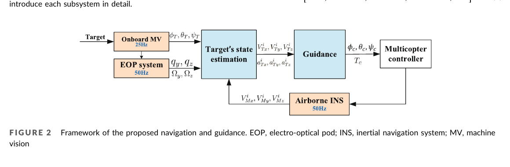
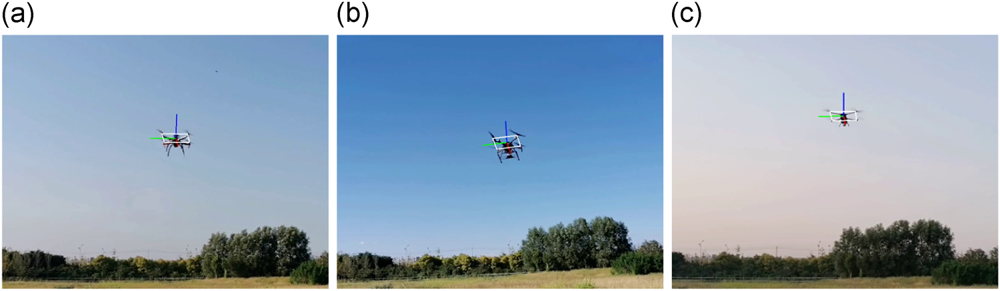
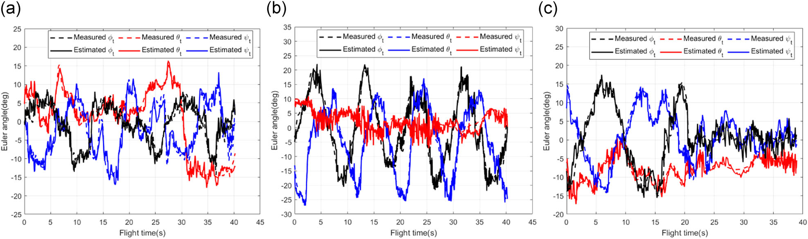
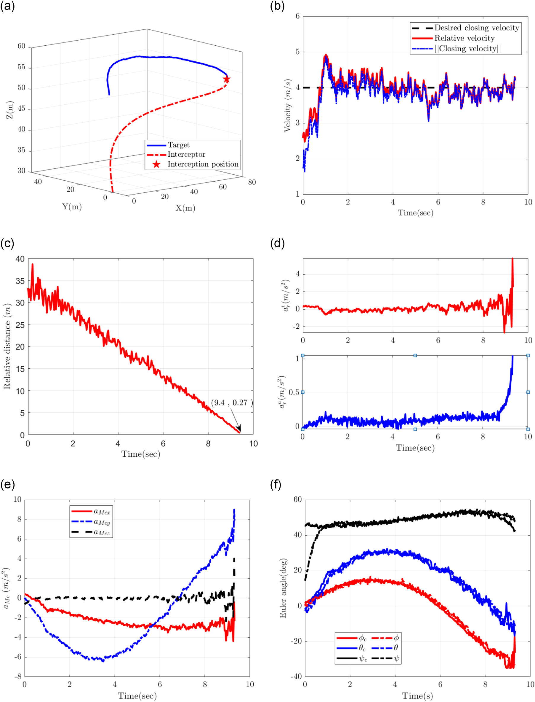

# 非合作机动四旋翼的终端速度约束最优拦截详解

## 论文信息

- 原题：*Optimal terminal-velocity-control guidance for intercepting non-cooperative maneuvering quadcopter*
- 作者：Hong Tao, Defu Lin, Shaoming He, Tao Song, Ren Jin
- 期刊：*Journal of Field Robotics*, 39:457–472, 2022
- 出版方：Wiley Periodicals LLC
- DOI：[10.1002/rob.22059](https://doi.org/10.1002/rob.22059)
- 原文：[PDF](../论文PDF/08_非合作四旋翼终端速度约束拦截.pdf)
- 证据等级：目标状态估计和完整拦截均含真实室外飞行证据；制导对比主要为数值/Gazebo 仿真

## 一句话概括

论文用视觉、光电吊舱和惯导融合估计非合作目标速度/加速度，再推导具有解析形式的三维最优制导律，使机动能力相当的四旋翼仍能以指定闭合速度完成机械碰撞或捕获。

## 外行导读

用无人机撞击或网捕另一架无人机时，“碰上”还不够：相对速度过大会损坏拦截器和捕获机构。传统比例导引还通常假设拦截器比目标更灵活，而消费级四旋翼之间机动能力往往相近。

本文通过先估计目标加速度，再把它补偿到制导命令中，减少拦截器额外机动负担；同时单独控制沿相对速度方向的闭合速度，让末端速度趋向预设值。

这实际上同时处理了三个不同问题：

1. **看得见**：在无合作标志的条件下，从图像中识别目标四旋翼及其姿态；
2. **追得上**：由姿态推断目标机动，经滤波得到目标位置、速度和加速度；
3. **碰得合适**：既让漏距趋近于零，又让接触瞬间的闭合速度接近期望值。

如果只解决第 1 项，系统还不能拦截；只解决前两项，传统导引可能以过高相对速度撞上目标；只解决制导律而没有可用的目标加速度估计，同等级机动能力下又容易出现控制饱和。因此论文的价值不只是一条公式，而是一条从感知到执行的完整链路。

## 系统组成

`单目视觉 PnP 姿态 → EOP 视线角/角速率 + INS 自机状态 → 多速率 EKF → 目标位置/速度/加速度 → 三维 OTVCG → 期望加速度 → 姿态与推力命令`

这里的多速率很重要：相机姿态、吊舱角度和惯导的更新频率不同，滤波器在各测量到达时异步更新，而不是强行降到同一低频率。

*原论文 Fig. 2（PDF 第 3 页）。机器视觉 MV 以 25 Hz 给出目标欧拉角；光电吊舱 EOP 和机载 INS 以 50 Hz 给出视线量及自机运动状态；EKF 输出目标运动状态，OTVCG 再生成期望姿态和推力。该图证明论文设计了完整接口和频率关系，但框图本身不证明各模块在强遮挡、丢帧或通信延迟下仍稳定。*

### 各模块到底输入和输出什么

| 模块 | 直接输入 | 提供给下游的信息 | 作用 |
|---|---|---|---|
| 机器视觉 MV | 单目图像、目标四电机几何 | 目标滚转/俯仰/偏航，25 Hz | 把目标姿态转换为机动加速度线索 |
| 光电吊舱 EOP | 稳定平台角度、像面偏差、轴角速率 | 视线角 `q_y,q_z` 与角速率，50 Hz | 约束目标相对方位及横向运动 |
| 机载 INS | 拦截器惯导数据 | 自机位置、速度、姿态，50 Hz | 把相对观测换到惯性系，并扣除自机运动 |
| 多速率 EKF | 上述异步观测和运动模型 | 目标位置、速度、加速度 | 为制导律提供统一时刻的状态估计 |
| OTVCG | 相对位置/速度、目标加速度、`V_d,N,K` | 拦截器期望加速度 | 同时处理相遇方向和终端速度 |
| 飞行控制器 | 期望加速度 | 滚转、俯仰、偏航、总推力命令 | 将质点制导指令落实为四旋翼可执行量 |

论文状态向量不仅有目标位置、速度和加速度，也把拦截器速度并入滤波状态。这样，EOP 的相对视线信息、视觉姿态与 INS 的自机运动可以在同一模型中闭合，而不是把各传感器结果简单拼接。

## 目标运动估计

状态包含目标位置、速度、加速度以及自机速度。单目视觉使用关系图关键点检测和 PnP 得到目标姿态，不需要人工标志；四旋翼姿态又可通过动力学映射为加速度线索。EOP 提供视线角 `qy, qz` 和角速度，INS 提供自机速度。多源数据经 EKF 转到统一惯性坐标系。

与只依赖预设目标机动模型的 EKF 不同，视觉姿态直接提供目标机动信息，因此目标实际采用正弦或 Singer 模型时，预测误差也能及时纠正。

### 姿态为什么能提示加速度

四旋翼平动主要由重力与机体推力决定。若目标滚转、俯仰角通常较小，且总推力可近似为 `T≈mg`，机体姿态就决定了推力在惯性系各方向的投影。于是视觉估得的欧拉角并不是为了“画一个姿态框”而已，而是被转换成目标加速度伪测量。

这里有两层近似：一是把目标视为主要受重力和旋翼总推力作用，二是用 `T≈mg` 处理常规飞行。激烈升降、强气动扰动或载荷突变时，姿态与加速度之间的映射会偏离模型；EKF 能平滑噪声，却不能消除错误物理假设造成的系统偏差。

### 多速率更新如何工作

论文把 25 Hz 的视觉称为慢采样相位，把 50 Hz 的 EOP/INS 称为快采样相位。每个 20 ms 基本周期都做状态预测；某类观测恰好到达时才把对应测量行加入 `H_k、R_k、Z_k` 更新，没有到达则不伪造该观测。这样做保留了 EOP/INS 的高频信息，也避免拿上一帧视觉结果冒充新测量。

它解决的是**不同采样周期**，并未自动解决时间戳不同步、相机处理延迟和外参误差；复现时仍需统一时钟并补偿链路延迟。

## 三维 OTVCG 制导律

论文把相对加速度分成：

- 法向通道：消除相对速度方向与视线方向的夹角，保证相遇；
- 切向通道：调节相对速度大小，使终端闭合速度达到 `Vd`。

通过最优控制最小化加权控制能量，切向解析命令可概括为：

`art = -K (Vd - Vr) / tgo · eV`。

其中 `Vr` 是当前相对速度，`eV` 为其方向，`K` 是权重/收敛增益，剩余时间近似为：

`tgo = r / V̄c,  V̄c ≈ (VrL + Vd)/2`。

闭合速度误差满足 Cauchy–Euler 方程，其解析解按 `(1-t/tf)^K` 单调衰减。`K=1` 时切向命令近似恒定，`K>1` 时末端趋零；增大 `K` 会更早、更强地控制速度，但增加前段能耗。

法向命令末端趋零，而拦截器总命令逐渐趋向目标加速度补偿，因此即使双方最大机动能力相当也有机会保持捕获条件。

### 两个终端条件分别约束什么

论文把“成功拦截”写成两个终端条件：

- `e_r(t_f)=e_V(t_f)`：末端视线方向与相对速度方向一致，等价于横向偏离被消除；
- `V_r(t_f)=V_d`：末端相对速度幅值达到指定闭合速度。

为此将相对加速度正交分解为法向 `a_nr` 和切向 `a_tr`。法向通道采用理想比例导航形式 `a_nr=N Ω×V_r`，其中 `Ω` 是视线角速度，`N≥3` 决定方向误差的收敛速度；切向通道才是本文新增的终端速度调节部分。二者正交，所以可以分别设计，再与目标加速度前馈组合成拦截器命令：

`a_Mc = â_T - a_tr - a_nr`。

这条式子的物理意义是：拦截器先复制目标的估计机动 `â_T`，再叠加为消除方向误差和速度误差所需的相对运动修正。目标加速度估得越准，拦截器就越不需要靠额外反馈去“猜”目标动作。

### `K` 不只是一个经验增益

切向性能指标以 `t_go^(K-1)` 对控制量加权，目的是更强地惩罚末端的大命令，给执行器时延、状态误差和接触不确定性留余量。若令速度误差 `ε_v=V_d-V_r`，解析结果为：

`ε_v(t)=ε_v(0)(1-t/t_f)^K`。

因此：

| `K` | 速度误差/命令特征 | 工程代价 |
|---:|---|---|
| `1` | 误差线性衰减，切向命令近似恒定 | 前段能量较低，但速度收敛较慢 |
| `>1` | 更早压低速度误差，切向命令在末端趋零 | 初段命令更大、总控制消耗增加 |
| 过大 | 理论上更快收敛 | 可能触及倾角/推力限制，使解析最优性失去实际意义 |

`t_go=r/\bar V_c` 也是关键近似，其中 `\bar V_c≈(V_{rL}+V_d)/2` 把期望末速纳入剩余时间估计。末端距离很小时，测量噪声和飞控时延相对变大，`t_go` 误差会直接被 `1/t_go` 放大，这正是论文末段指令轻微抖动的重要原因之一。

## 实验设计与结果

### 1. 视觉/滤波实飞

使用 DJI F450、DJI M210 和自研 FL5 三种不同尺寸目标做室外飞行。视觉姿态与目标 IMU 对比，多数角度误差在 5° 内。对恒加速度、正弦和 Singer 三种机动，纯模型 EKF 在后两者上失配，加入机器视觉的多速率 EKF 仍将加速度 RMS 误差控制在 1 m/s² 以内。

*原论文 Fig. 8（PDF 第 10 页）。从左到右为 DJI F450、DJI M210 和自研 FL5，说明视觉方案至少在三种尺寸/外形的真实室外目标上运行过。它不能单独证明跨任意机型泛化，因为算法仍需识别特定类型和已知几何的关键点。*

*原论文 Fig. 9（PDF 第 10 页）。每列对应一种机型，三行分别展示欧拉角曲线，视觉估计总体跟随机载 IMU，论文称除少量奇异点外角度误差在 5° 内。这里的 IMU 精度约为 1°，因而它是工程参考而非高精度动作捕捉真值；图中也不能直接推出位置、速度或末端漏距精度。*

三类机动实验还应分开理解：恒加速度模型与滤波先验相符，因此传统 EKF 已能较好跟踪；正弦和 Singer 机动故意制造模型失配，视觉加速度观测的收益才更明显。这说明论文真正要缓解的是“目标机动先验不可靠”，而不是声称视觉在任何噪声条件下都优于动力学模型。

### 2. 数值制导对比

目标终端闭合速度设 4 m/s、自机最大加速度 6 m/s²。OTVCG 与调参后的 PID 都能拦截，但 PID 命令大量时间饱和并出现速度超调。控制能量指标：

| 方法 | 总控制消耗 `Jtotal` |
|---|---:|
| OTVCG, K=1 | 1.29×10⁵ |
| OTVCG, K=3 | 1.95×10⁵ |
| OTVCG, K=5 | 2.23×10⁵ |
| PID | 2.22×10⁵ |

低 `K` 的 OTVCG 明显节能，但速度误差收敛更慢，体现了可解释的权衡。

### 3. Gazebo 全链路与室外拦截

8 字高机动目标的 Gazebo 全链路中，目标总加速度最高约 5.8 m/s²，估计量约 1 s 内收敛；最终漏距 0.27 m，闭合速度达到 4 m/s。论文还报告 DJI Phantom 4 和 F450 以约 10 m/s 飞行时被拦截器准确撞击，并完成对 F450 下悬直径 15 cm 小球的捕获；团队基于该系统赢得 MBZIRC 2020 Challenge I。

应区分：论文主表中的能量和终端速度对比是仿真，真实外场主要证明集成系统确实能完成任务。

*原论文 Fig. 14（PDF 第 14 页）。六个子图依次给出三维拦截轨迹、相对速度、相对距离、相对控制命令、拦截器加速度命令以及姿态指令/响应。结果显示期望闭合速度 4 m/s、最终漏距 0.27 m，并暴露末端轻微指令抖动。该图来自带传感器噪声和 Pixhawk 模型的 ROS/Gazebo 虚拟环境，不是真实外场轨迹，也不能证明真实飞行具有同样能耗和漏距。*

### 4. 证据强度逐项核对

| 论文结论 | 直接证据 | 可以支持 | 不能外推 |
|---|---|---|---|
| 视觉能估计多种四旋翼姿态 | 三机型室外图像 + 目标机 IMU 对比 | 所示机型、距离和光照下角度基本可跟踪 | 任意机型、远距离小目标、强遮挡 |
| 视觉加速度有助于机动状态估计 | CA/正弦/Singer 对比 | 模型失配时滤波误差可下降 | 未知强机动下必然小于 1 m/s² |
| OTVCG 比调参 PID 更节能 | 数值仿真的能量表 | 给定初值、限制和 PID 参数下成立 | 所有 PID、所有实机和风场下都最优 |
| 全链路能完成高机动拦截 | Gazebo 八字场景 | 估计—制导—飞控接口可闭环 | 真实外场同样达到 0.27 m 漏距 |
| 工程系统能撞击/捕获目标 | Phantom 4/F450 外场叙述与 MBZIRC 任务 | 所示任务链确实完成过实物演示 | 仿真中的最优能耗比例已被实飞验证 |

## 主要贡献

1. 将无标志视觉姿态、吊舱和惯导做多速率融合，减少对目标机动模型的依赖；
2. 给出三维终端闭合速度约束制导的解析解；
3. 解释 `K` 对速度收敛、命令形状和能耗的影响；
4. 从单模块、仿真全链路到室外拦截提供多层证据。

## 局限与复现提示

- 推导将双方视为质点，姿态内环、空气动力、执行器时延只在后续仿真/实机中体现；
- 时间剩余量是近似值，末端相机目标充满视场时估计会恶化并产生命令抖动；
- EKF 假设噪声统计已知，强遮挡、失光和背景诱饵未系统测试；
- 机械撞击与安全网捕不是同一种任务，真实应用还需目标识别、禁飞区和失效保护；
- 论文数据需联系作者获取，代码并未在文中给出公开仓库。

### 复现时最容易踩的坑

1. **坐标系和正负号**：闭合速度、相对速度、LOS 角速度以及目标/拦截器加速度采用不同方向定义，直接照搬单个公式容易把切向反馈符号写反；
2. **视觉不是 50 Hz**：机器视觉为 25 Hz，EOP/INS 为 50 Hz；把旧视觉帧在两个快周期中重复更新会人为高估视觉信息；
3. **先做外参与时延标定**：相机、EOP、机体与惯性系之间的旋转误差会直接变成虚假的目标横向加速度；
4. **同时实现饱和与抗积分饱和**：论文比较时拦截器最大加速度为 6 m/s²。忽略物理饱和会得到无法飞行的“更优”曲线；
5. **分别报告三个指标**：至少同时给出末端漏距、末端闭合速度误差和控制消耗，单报“命中”无法验证终端速度约束；
6. **先复现仿真再做实机**：逐步加入测量噪声、视觉丢帧、处理延迟和姿态内环，可定位性能下降来自估计还是制导。

## 关键术语、推理链与适用边界

### 论文在哪一层解决问题

| 层级 | 常见方案 | 本文处理方式 | 未覆盖内容 |
|---|---|---|---|
| 感知/状态估计 | 只用目标运动先验或单一视线量 | 视觉 PnP、EOP、INS 的多速率 EKF | 误检、诱饵、长期遮挡的数据关联 |
| 中制导 | PNG / PID 追踪、只追求零漏距 | 法向相遇 + 切向终端闭合速度 OTVCG | 复杂障碍、空域规则、碰撞后安全 |
| 飞控执行 | 将期望加速度交给姿态/推力内环 | Gazebo 与外场系统集成展示 | 对所有机型的稳定性与认证保证 |
| 任务效果 | 命中或捕获 | 有室外实际撞击/小球捕获证据 | 仿真能量最优不等于外场全局最优 |

**闭合速度** 是两机沿相对视线/相对速度方向接近的速度，而不是拦截器对地速度；**终端速度约束** 使“击中”还须满足安全接触条件；**多速率 EKF** 表示每类传感器在自己的时间戳到达时更新，不能把它误读为单纯提高了相机帧率。

### 从感知到可捕获相遇的推理链

1. 视觉关键点与 PnP 给出目标姿态，EOP/INS 给出自机与视线信息；EKF 将不同频率观测转为统一的目标位置、速度、加速度估计。
2. 法向制导消除会导致漏距的方向误差，并用目标加速度估计做前馈补偿；估计越准，拦截器额外机动需求越小。
3. 切向制导不直接改变相遇方向，而是调相对速度，使末端闭合速度接近 `Vd`。
4. 因此现实外场成功支持“该感知—制导—飞控链能在所示场景完成拦截”，但仿真中的 PID 能耗和 `K` 参数优劣不能自动外推到所有风、目标或碰撞机构。

### 核验依据

- 多速率估计器、视觉姿态和目标加速度误差：原文目标状态估计与飞行试验部分；
- OTVCG 的法向/切向分解、`K` 与解析收敛关系：原文最优制导推导；
- 控制消耗表和 Gazebo 8 字场景：原文数值仿真；
- Phantom 4/F450 室外撞击、小球捕获和 MBZIRC 说明：原文外场验证叙述。不同证据层级已在上文分开，不把它们合并成单一“实飞最优性”结论。

## 结论

在这组论文中，它是工程证据较强的一篇：不仅有解析制导和仿真对比，还包含多机型目标状态估计与室外拦截。最重要的思想是用目标机动估计换取较低的自身机动需求，并把“安全接近速度”作为制导终端约束显式设计。
