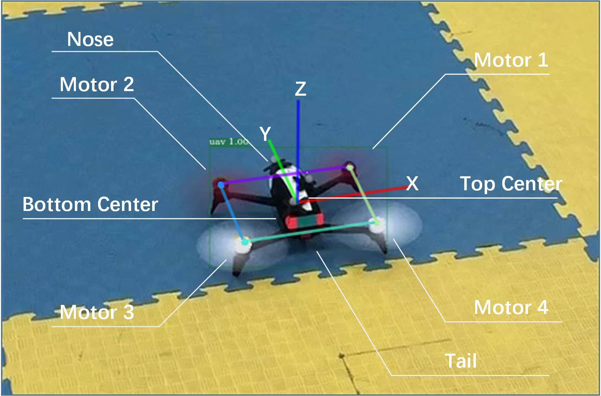
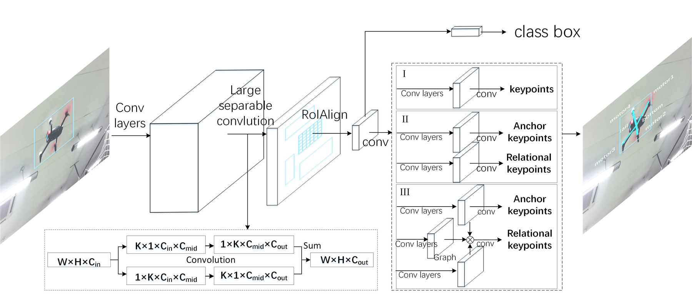
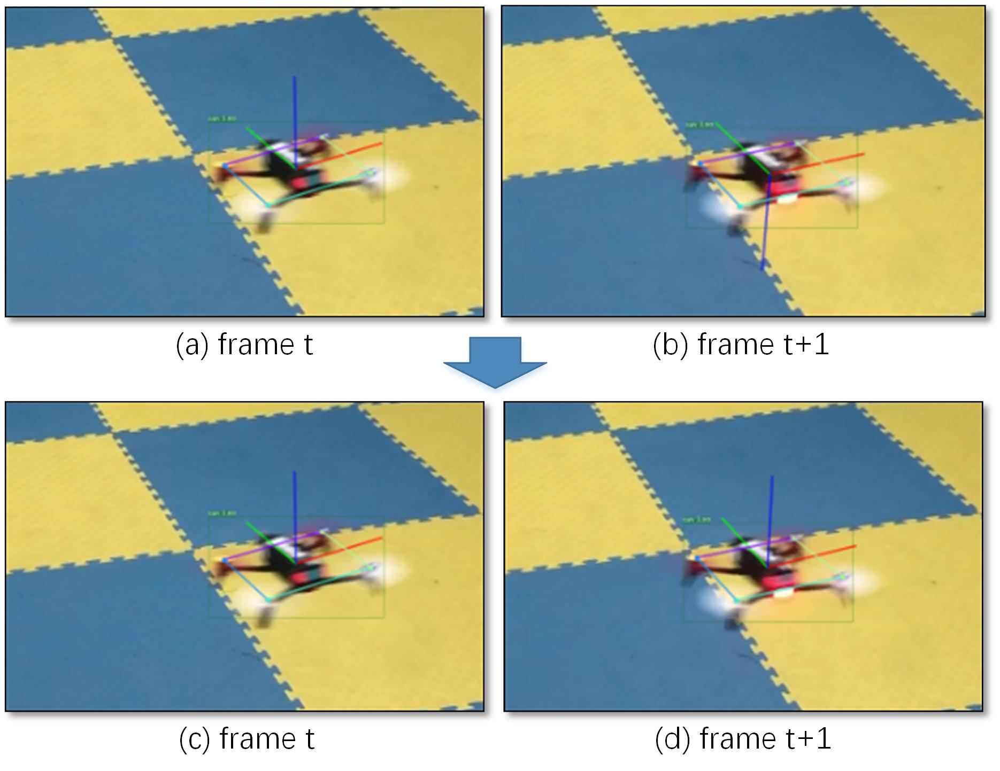
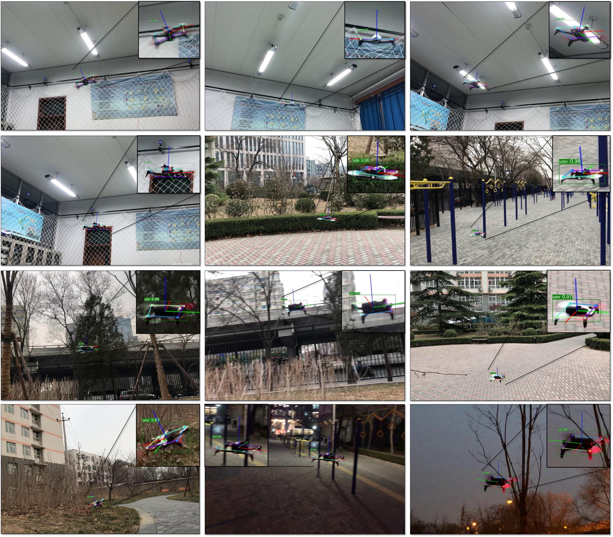

# 基于关系图网络的无人机检测与六维位姿估计详解

## 论文信息

- 原题：*Drone Detection and Pose Estimation Using Relational Graph Networks*
- 作者：Ren Jin, Jiaqi Jiang, Yuhua Qi, Defu Lin, Tao Song
- 期刊：*Sensors*, 19(6):1479, 2019
- 出版方：MDPI
- DOI：[10.3390/s19061479](https://doi.org/10.3390/s19061479)
- 原文：[PDF](../论文PDF/09_关系图网络无人机检测与位姿估计.pdf)
- 证据等级：合成与真实图像、OptiTrack 室内动态实验；无室外远距离或机载闭环避碰实验

## 一句话概括

论文先用“有明显外观的机头/机尾/上下表面”帮助推断“长得几乎一样的四个电机”各自编号，再用四电机关键点和改进 PnP 恢复无标志四旋翼的 6D 位姿，并由姿态估计目标加速度。

## 外行导读

从单目相机估计四旋翼姿态，难点不只是找到四个电机中心，还要知道哪个是 1 号、2 号、3 号、4 号。四个电机外观高度相同，若顺序错了，PnP 会给出完全错误或镜像的姿态。

论文的想法是把关键点分成两组：机头、机尾、机体上/下是“锚点”，外观较容易辨认；四个电机是“关系点”，单看局部很难编号。关系图网络学习每个电机与锚点及全局图像区域之间的关系，从结构上下文推断顺序。

真正困难的是“**语义编号**”而不只是“像素定位”。即使四个热图峰值都落在电机中心，只要把电机 1 和电机 3 对调，输入 PnP 的二维—三维对应关系就错了，最终旋转、平移甚至由姿态推算的加速度都会一起出错。本文因此把视觉任务设计为：先借助容易辨认的部位理解目标朝向，再给四个相似电机赋予正确身份。

## 研究定位

当时常见无人机位姿估计依赖 LED、红色标志、CAD 模型或逐图精确 6D 姿态标注。本文只要求在真实图像上标注八个二维关键点，对非合作目标更可行。它不是通用任意机型的类别级位姿模型：训练目标仍需具有可定义的机头、机尾和四电机几何尺寸。

*原论文 Fig. 1（PDF 第 3 页）。图中定义 motor 1–4、nose、tail、body top、body bottom，以及机体坐标轴；这些定义建立了图像关键点与已知三维电机坐标的对应。它也暴露了方法边界：若新机型没有稳定可见的机头/机尾特征，或电机布局不同，就不能在不重定义关键点和几何模型的情况下直接套用。*

### 论文没有解决的相邻任务

- 它做的是**已知类型四旋翼的检测与相对位姿**，不是先判断来袭目标属于哪种机型；
- 它以一帧 RGB 图像为主要视觉输入，没有显式利用视频时序关系做跨帧关键点关联；
- 它输出相机相对目标的 6D 位姿，但室外实验只给关键点指标，没有室外高精度 6D 真值；
- 它为后续状态估计提供目标加速度线索，却没有在本文中完成机载避碰或拦截闭环。

## 输入、输出与流程

输入是一张单目 RGB 图像；输出为无人机检测框、八个关键点、相机坐标系中的旋转 `R` 和平移 `t`，以及滤波后的目标位置、速度和加速度。

`两阶段轻量检测器 → 锚点分支 + 关系点分支 → 四电机有序 2D 点 → 改进 PnP → 6D 位姿 → 姿态动力学求加速度 → NCA 卡尔曼滤波`

| 阶段 | 输入 | 输出 | 主要误差来源 |
|---|---|---|---|
| 目标检测 | 整幅 RGB 图像 | 无人机候选框 | 小目标、背景混淆、运动模糊 |
| 关键点网络 | RoIAlign 后的目标特征 | 8 个关键点热图 | 遮挡、人工标注噪声、对称性 |
| 关系推理 | 锚点/关系点特征 | 有语义顺序的 motor 1–4 | 机头机尾误判、上下视角混淆 |
| 改进 PnP | 4 个电机的 2D—3D 对应 | `R,t` 候选中的合法解 | 共面多解、相机内参和机体尺寸误差 |
| 动力学映射 | 目标欧拉角 | 水平加速度伪测量 | `a_z≈0`、推力模型和姿态噪声 |
| NCA 滤波 | 位置、加速度及到达标志 | 平滑的位置、速度、加速度 | 过程噪声、间歇漏检、模型失配 |

## 关系图关键点网络

### 1. 锚点与关系点

八个标注点分为：

- 锚点：nose、tail、body top、body bottom；
- 关系点：motor 1–4。

锚点分支用卷积直接预测热图。关系分支构造类似注意力的图矩阵：锚点特征作为 key，关系点查询作为 query，经 ReLU 和平方归一化形成稀疏关系权重 `Gij`。随后每个位置的关系特征由其他位置按 `G` 加权汇聚，并保留残差连接。

论文的关系权重可写为：

`G_ij^l = ReLU((a_i^l)^T q_j^l + b_g^l)^2 / Σ_i' ReLU((a_i'^l)^T q_j^l + b_g^l)^2`。

其中 `a_i^l` 来自锚点分支的 key 特征，`q_j^l` 来自关系点分支的 query 特征，`i、j` 是 RoI 特征图上的空间位置。接着按关系权重汇聚特征并加残差：

`F_i^l = Σ_j G_ij^l F_j^(l-1) + F_i^(l-1)`。

这两个看似小的设计有明确作用：

- `ReLU` 把负相关直接截为零，使关系矩阵更稀疏，避免每个位置都与所有位置发生无意义联系；
- 平方放大正相关差异，论文称有助于稳定训练；
- 归一化使同一 query 对各 key 位置的权重可比较；
- 残差连接保留原始局部外观，关系推理失败时不至于完全抹掉电机自身特征。

与普通 non-local 模块相比，关系权重不是从同一组无差别特征自注意，而是显式利用可辨认锚点引导相似电机编号。

### 2. 轻量两阶段检测器

骨干是小型 Xception-like 网络，使用深度可分离卷积；RPN 提候选框，Light-head 分支并行输出类别、框和关键点。大核可分离卷积扩大感受野而不显著增加计算量。Titan X 上完整关系图版本达到 71 FPS。

*原论文 Fig. 2（PDF 第 5 页）。左侧是 Xception-like backbone、RPN、RoIAlign 和轻量检测头；右侧 I/II/III 分别是统一关键点头、锚点/关系点分头、以及用锚点特征经关系图指导电机关键点的完整模型。该图解释了消融实验比较的对象；71 FPS 是 1200×800 输入在桌面 Titan X 上的检测速度，不代表嵌入式机载平台也能达到该帧率。*

### 3. 三种关键点 head 的区别

| Head | 结构 | 能检验的问题 | 预期能力 |
|---|---|---|---|
| I | 8 点或 4 点共用普通卷积预测器 | 只增加标注点是否自然带来收益 | 容易把相似电机当作独立局部模式 |
| II | 锚点与关系点分成两个预测分支 | “任务分组”本身是否有效 | 减少两类关键点之间的优化干扰，但没有显式传递关系 |
| III | 分支结构 + 多层关系图 | 锚点上下文能否进一步帮助电机编号 | 本文完整方法，精度最高但速度由 85 FPS 降至 71 FPS |

关键实现细节包括：conv5 后使用 `15×15` 大核可分离卷积，`C_mid=64、C_out=128`；RoIAlign 分辨率为 14；RPN 在 conv4 上使用 `{1:1, 2:1}` 两种纵横比和五种尺度；关系图层每两个卷积层插入一次。它们说明网络是针对目标通常呈近方形/横向四旋翼形状做过工程裁剪的。

## 改进 PnP

四个有序电机中心的二维像素坐标，与已知机体坐标中的四个三维点共同构成 PnP。由于四点近似共面，会产生多个候选解和上下翻转歧义。论文增加：

1. 电机间几何距离约束；
2. 机体 `Z` 轴朝向检查；
3. 对候选解计算重投影损失，选取方向合法且损失最小者。

这减少了共面点 PnP 的多解跳变，但仍要求目标电机几何尺寸已知。

*原论文 Fig. 3（PDF 第 6 页）。相邻两帧观测几乎相同，普通共面 PnP 却可能把机体 Z 轴从向上翻为向下；加入 Z 轴测试点后选择与物理定义一致的候选解。图片证明了论文针对一种典型多解跳变给出修正，但不能保证在所有噪声、遮挡和近退化视角下都得到唯一正确解。*

### 候选解筛选的逻辑

1. 由已知电机间距离与相机射线夹角建立多项式约束，求可能的深度组合；
2. 对每组极小值恢复机体系到相机系的 `R_i,t_i`，并计算重投影损失；
3. 在机体平面法向上放置一个测试点，把它用每个候选位姿投影到相机；
4. 排除机体 Z 轴朝向与“向上”定义不符的解，再从剩余解中选损失最小者。

为什么不直接把 nose、tail、top、bottom 也送进 PnP？论文认为它们的外观区域较大，人工标注位置误差也更大；四个电机轴心虽有语义编号困难，一旦编号正确，其中心位置和机体几何反而更稳定。因此锚点主要负责“认方向”，电机点主要负责“算几何”。

## 从姿态到加速度

对稳定飞行四旋翼，假设垂向加速度近似零，则总推力可由滚转、俯仰反推，水平加速度为：

`ax = g/(cosφ cosθ) · (sinθ cosψ + sinφ cosθ sinψ)`

`ay = g/(cosφ cosθ) · (sinθ sinψ - sinφ cosθ cosψ)`。

把视觉位置和由姿态得到的加速度输入近恒加速度（NCA）卡尔曼滤波器，与只用位置的近恒速度（NCV）模型比较。检测丢失用二值变量 `γk` 表示：有测量时更新，无测量时仅预测。

这一步隐含 `F/m=g/(cosφ cosθ)`，来自垂向加速度近似为零。其价值在于不用对图像位置做二阶数值微分：后者会严重放大关键点/PnP 噪声；姿态则能较早反映目标正在倾斜并准备产生水平加速度。

但 `γ_k=0` 时滤波器只是按运动模型外推，不会凭空恢复被遮挡目标；连续漏检越久，协方差和模型偏差越大。论文没有加入多目标数据关联，因此多个外观相似无人机同时进入视野时，身份保持仍是另一问题。

## 数据与实验结果

### 关键点数据

- 合成数据：共约 6804 张，340 张训练、6464 张测试，用于检验结构推理；
- Parrot 室内：3957 张训练、1670 张评估；
- Parrot 室外：2232 张训练、957 张测试；
- 另采集 1 分钟室内序列，以 OptiTrack 作为 6D 位姿真值。

在合成集上，完整关系图模型的 `AP_OKS=0.5:0.95` 为 0.9366。真实室内集从仅四电机基线的 0.6453 提升至 0.7415，即约 9.6–9.7 个百分点；室外集达到 0.7298。

消融结果给出了比“最终 AP 高”更有价值的信息：

| 模型 | 合成 AP | 室内 AP | 说明 |
|---|---:|---:|---|
| 仅四电机普通头 `k4` | 0.8176 | 0.6453 | 缺少可辨认结构提示 |
| 8 点普通头 `k8` | 0.8123 | 0.6411 | 只增加锚点标注并没有自动解决关系推理 |
| 8 点 non-local | 0.8189 | 0.6481 | 通用自注意收益有限 |
| 锚点/关系点分头 `k4-4` | 0.9083 | 0.6891 | 显式分组已显著改善语义编号 |
| 完整关系图 `k4-4-RG` | **0.9366** | **0.7415** | 锚点引导关系点进一步提升 |

所以论文证据支持的不是“注意力都有效”，而是**按视觉可辨认性划分角色，再定向传递结构关系**有效。合成数据只用 340 张训练、6464 张测试，四电机外观被刻意画成完全一致，更突出测试的是结构推理而非纹理记忆。

速度/精度比较：

| 方法 | FPS | AP(0.5:0.95) |
|---|---:|---:|
| CMU-Pose | 20 | 0.5815 |
| Mask R-CNN | 10 | 0.6672 |
| 本文关系图模型 | 71 | 0.7415 |

### 状态估计

| 模型 | 位置均值误差 | 速度均值误差 |
|---|---:|---:|
| NCA（加入视觉加速度） | 0.0757 m | 0.1228 m/s |
| NCV | 0.0934 m | 0.2034 m/s |

相应位置、速度误差约降低 19% 和 40%。这证明姿态蕴含的机动信息能改善短时跟踪，不代表所有高速动作都满足垂向加速度为零的假设。

*原论文 Fig. 11（PDF 第 16 页）。绿色点/连线与坐标轴展示了从俯视、仰视、侧视及复杂室外背景得到的代表性结果。它说明方法在多种真实视角下可以给出视觉上合理的姿态；这是挑选的定性样例，不是室外旋转/平移误差统计，也不是闭环飞行验证。*

### 指标应该怎样读

- `AP_OKS` 同时受目标是否被检测到、关键点偏差和目标尺度归一化影响，是关键点指标；
- 71 FPS 包含检测与关键点网络，但论文的硬件是桌面 Intel i7-6700K + Titan X；
- 位置/速度均值误差来自约 1 分钟室内 OptiTrack 序列，不是室外数据集；
- 论文用曲线展示了 6D 位姿与 OptiTrack 的一致性，却没有按距离/像素尺寸给出旋转和平移误差分桶；
- NCA 相比 NCV 的改进证明“加入本文视觉加速度在该序列有帮助”，不是 NCA 在所有轨迹上都优于更复杂的交互多模型滤波器。

## 失败是怎样沿链路放大的

`锚点方向判断错 → 电机语义编号错 → 2D/3D 对应错 → PnP 跳到镜像/错误位姿 → 欧拉角错误 → 加速度伪测量错误 → NCA 速度估计偏移`

这条传播链解释了为什么关键点 AP 不能独立代表下游安全性。像素误差通常会随距离增大而放大平移误差；语义编号错误则不是小噪声，而是离散灾难性错误。实际系统至少应增加重投影误差门限、姿态连续性检查、目标尺寸/深度合理性检查，以及在不可信时退化到只用位置的 NCV 更新。

## 证据边界汇总

| 问题 | 论文有什么证据 | 当前仍缺什么 |
|---|---|---|
| 能否识别相似电机的编号 | 合成/真实消融，关系图 AP 明显提升 | 跨品牌、旋翼数量变化和强遮挡测试 |
| 能否恢复 6D 位姿 | 室内约 1 分钟 OptiTrack 曲线 + 多视角定性图 | 按距离统计的旋转/平移误差和失败率 |
| 能否适应室外背景 | 3189 张室外真实图像，测试 AP 0.7298 | 室外高精度 6D 真值、强逆光和远距离测试 |
| 姿态能否改善状态估计 | 室内 NCA/NCV 位置、速度误差对比 | 激烈升降和长时间丢检下的鲁棒性 |
| 能否支撑自主避碰/拦截 | 本文没有闭环实验 | 端到端时延、机载算力、控制安全性验证 |

## 主要贡献

1. 用锚点—关系点图推理解决相似电机关键点编号；
2. 只需二维关键点标注，不依赖逐帧 6D 真值或完整 CAD 纹理模型；
3. 处理共面 PnP 的方向与多解问题；
4. 将姿态转换为加速度观测，改善目标速度估计。

## 局限与复现提示

- 目标变小后关键点误差和 6D 位姿误差迅速放大，论文未给出按像素尺寸分桶的姿态指标；
- 只在 Parrot Bebop-2 为主的有限机型上训练，换机型需重新定义几何和关键点；
- `az≈0` 只适合近水平稳定飞行，激烈爬升/下降会造成加速度偏差；
- OptiTrack 试验是室内近距离，室外复杂背景只评价关键点而非精确 6D 真值；
- AP 是关键点指标，不能替代旋转角误差、平移误差和最终闭环任务成功率。

### 建议的复现顺序

1. 先核对 Fig. 1 的机体系、相机系和 motor 1–4 顺序，用人工完美关键点验证 PnP；
2. 单独复现普通 head、分组 head、关系图 head，确认提升来自关系模块而非训练轮次；
3. 分别记录目标检测召回率、关键点 OKS、编号正确率、旋转误差和平移误差；
4. 用 PnP 候选解可视化检查 Z 轴测试点，而不是只看最终重投影误差；
5. 把 NCA 与 NCV 放在同一检测序列、同一丢帧标志下比较，避免输入不同造成不公平；
6. 增加目标像素宽度、俯仰/滚转幅度、连续丢帧长度三类分桶，才能看出可用于制导的有效工作区间。

## 关键术语、推理链与适用边界

### 为什么“找四个电机”不等于“知道姿态”

| 路线 | 对称性如何处理 | 对训练标注的要求 | 对本文任务的局限 |
|---|---|---|---|
| 标志点 / LED | 用人工唯一外观消除编号歧义 | 需改装目标 | 不适合真正非合作目标 |
| CAD/模板匹配 | 用完整三维模型与渲染外观匹配 | 需精确模型和纹理 | 小目标、遮挡和光照变化敏感 |
| 直接关键点热图 | 检测每个电机的位置 | 仍难区分四个相似电机的编号 | 顺序错会使 PnP 错解 |
| 本文关系图 | 用可辨认锚点约束关系点编号 | 只标二维关键点即可训练 | 仍针对有固定几何的机型 |

**锚点** 是机头、机尾、机体上下等视觉可区分点；**关系点** 是局部相似、需靠结构上下文编号的电机。**PnP** 根据已知三维点与其二维投影恢复相机相对位姿；四电机近共面时会有多组数学候选解，所以论文还以机体朝向和重投影误差排除不合理解。**AP_OKS** 衡量关键点定位相似度，不等同于旋转角误差。

### 从图像到加速度估计的因果链

1. 检测器在目标框内分别预测锚点和关系点热图，关系图将锚点的上下文传给电机编号。
2. 有序四电机二维点与机体已知三维点进入 PnP，候选位姿再经几何/朝向筛选得到 `R,t`。
3. 在近水平飞行假设下，滚转、俯仰、偏航可转换为水平加速度伪观测；NCA 滤波器因而比只用位置的 NCV 有更多短时机动信息。
4. 这条链中任一环的编号错、尺度不准或 `az≈0` 失效都会放大到制导输入，故室内 OptiTrack 的位置/速度均值误差不能直接代表远距离室外拦截精度。

### 核验依据

- 锚点—关系点网络、轻量两阶段检测器和改进 PnP：原文 Method；
- 合成/真实数据划分、AP 与 FPS：原文关键点实验表；
- NCA/NCV 的位置速度对比、OptiTrack 真值：原文动态状态估计实验；
- 原文没有室外 6D 真值或闭环避碰，因此感知证据应分为“真实图像关键点”与“室内真值状态估计”两层。

## 结论

论文的亮点在于把四旋翼的结构关系用于关键点编号，而不是简单套用人体姿态网络。它为后续多速率目标状态估计和拦截制导提供了感知基础，但远距离小目标、跨机型泛化与激烈机动仍是主要瓶颈。
