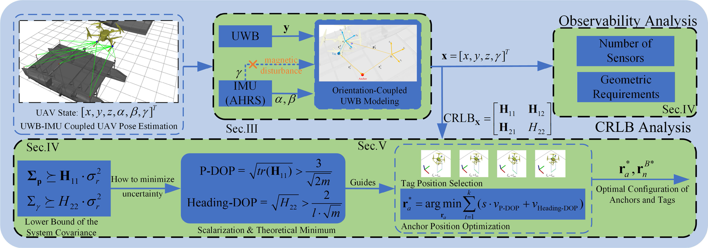
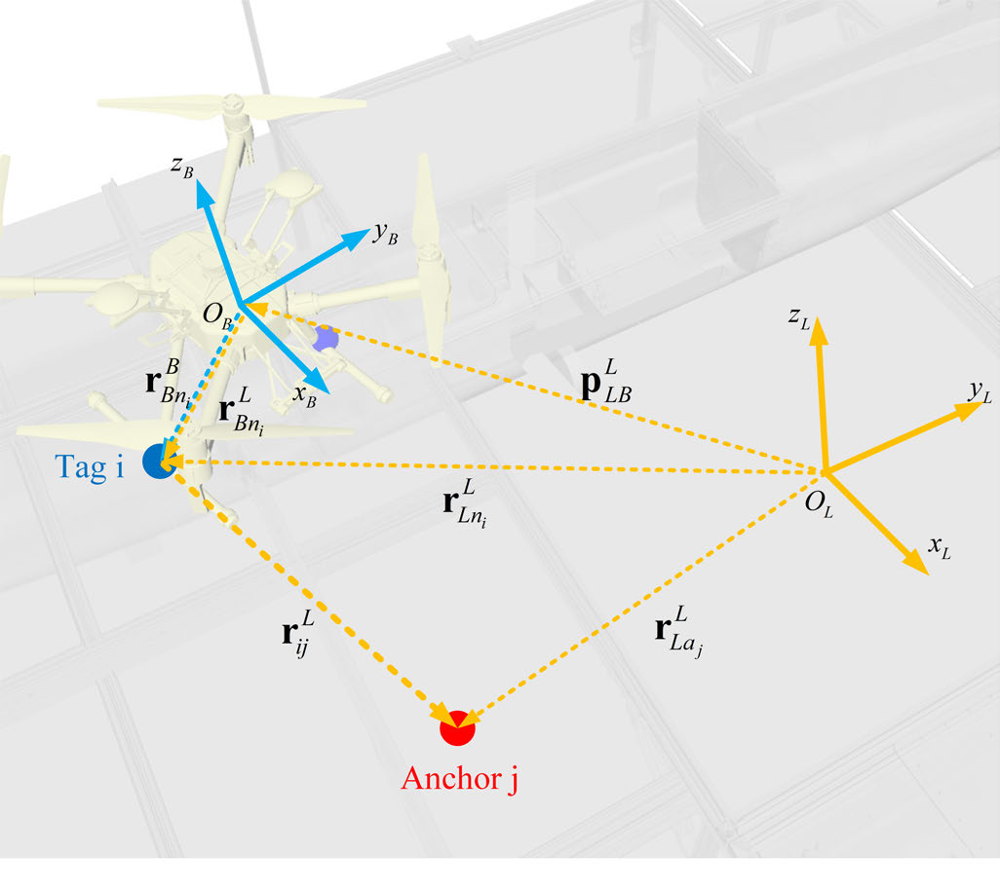
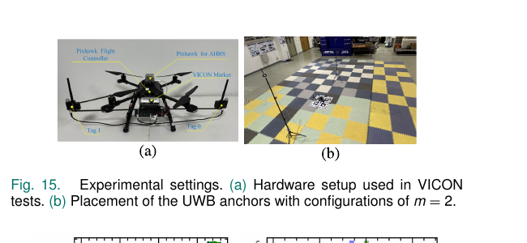
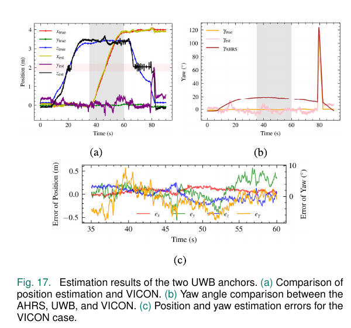

# 最少 UWB 设备的无人机无漂移四自由度位姿估计详解

## 论文信息

- 原题：*Drift-Free 4DoF Pose Estimation for UAVs: Minimizing UWB Devices With IMU Integration*
- 作者：Junning Lyu, Siyuan Yang, Tao Song, Shaoming He
- 期刊：*IEEE Sensors Journal*, 26(11):17618–17632, 2026
- 出版方：IEEE
- DOI：[10.1109/JSEN.2026.3686369](https://doi.org/10.1109/JSEN.2026.3686369)
- 原文：[PDF](../论文PDF/12_最少UWB设备的无漂移四自由度位姿.pdf)
- 代码：[dual-uwb-4dof-pose](https://github.com/LvJohny/dual-uwb-4dof-pose)
- 证据等级：可观性/CRLB 理论、仿真、VICON 室内真实飞行与开源代码

## 一句话概括

论文利用 IMU 对滚转和俯仰的可靠估计，把 6DOF 位姿降成“3D 位置 + 偏航”4DOF 问题，并证明静止时只需两枚机载 UWB 标签和两个固定基站就可观，再优化基站位置平衡位置与偏航精度。

## 外行导读

IMU 的滚转、俯仰可以借助重力方向长期校正，但偏航没有重力参考，磁力计又容易受室内钢结构和电机磁场干扰。因此，完全依赖 AHRS 的航向会漂移；完全依赖纯 UWB 估计 6D 位姿，又往往需要至少三标签和三基站，硬件多、标定复杂。

本文选择折中：IMU 负责滚转/俯仰，UWB 距离负责位置和偏航。与“运动起来才可观”的方案不同，它要求无人机悬停不动时也能确定这四个状态，这对起降和定点控制更有意义。

最关键的思想是“**不要用一种传感器包办所有自由度**”：

- 重力天然给 IMU 提供滚转、俯仰参考，因此把这两个角交给 AHRS；
- 磁场在舰船、厂房和电机附近不可靠，因此不把偏航完全交给磁力计；
- 两个相隔一定距离的 UWB 标签随无人机偏航会产生不同的距离变化，因此用绝对测距给偏航“锚定”；
- 只估计 `[x,y,z,yaw]` 后，原本的 6DOF 纯 UWB 问题变成硬件更少的 4DOF 融合问题。

*原论文 Fig. 2（PDF 第 3 页）。上半部分表示 UWB 提供距离、AHRS 提供滚转/俯仰，输出 `x=[x,y,z,γ]^T`；右侧分析最少节点和非退化几何；下半部分由 CRLB 构造位置/航向 DOP，再优化标签与基站布局。该图是研究路线总览，不是实验结果。还应注意：图中的 Heading-DOP 下界写成 `2/(l√m)`，而正文 Eq. (37) 的推导结果是 `√2/(l√m)`，二者存在内部不一致，本文以下按正文公式解释。*

## 问题建模

状态为 `x=[px, py, pz, γ]`，其中滚转 `α`、俯仰 `β` 由 AHRS 给定，偏航 `γ` 待估。两标签的机体系位置和各基站的局部坐标已标定，测距：

`řij = ||ra_j - Rγ Rβ Rα rn_i - p|| + εij`。

主要假设包括：滚转/俯仰误差很小；标签和基站位置准确；各测距独立且为高斯噪声。论文也说明这些是建模近似，不代表消费级 IMU 完全无误差。

*原论文 Fig. 4(b)（PDF 第 4 页）。机体系 `B` 随无人机运动，本地系 `L` 固定；已知机载标签外参 `r^B_Bn_i` 经姿态旋转和平移后得到标签在本地系的位置，再与基站 `a_j` 形成距离 `r_ij`。该图说明偏航怎样进入测距方程，也说明标签外参、基站坐标或坐标轴定义一旦标错，会作为系统偏差直接进入所有量测。*

### 测距方程逐项拆解

令标签 `i` 在机体系的位置为 `r^B_Bn_i`，基站 `j` 在本地系的位置为 `r^L_La_j`，无人机位置为 `p`，则标签的本地系位置为：

`r^L_Ln_i = R_γ R_β R_α r^B_Bn_i + p`。

因此测距预测值为：

`h_ij(x)=||r^L_La_j-R_γR_βR_αr^B_Bn_i-p||`。

其中 `α、β` 是 AHRS 输入，状态只保留 `x=[p_x,p_y,p_z,γ]^T`。偏航并不是由单个标签的绝对方向直接测得，而是通过旋转两个标签的机体基线，使不同标签—基站距离以不同方式变化，从联合几何中间接估出。

### 四个建模假设对应的现实风险

| 理论假设 | 数学上带来的便利 | 现实违反方式 | 可能后果 |
|---|---|---|---|
| 滚转/俯仰准确 | 6DOF 降为 4DOF | 加速飞行时重力/线加速度混叠，安装角误差 | 姿态误差被误认为位置或偏航变化 |
| 标签外参准确 | 标签位置是已知常量 | 支架弯曲、尺量误差、机体系定义不一致 | 所有距离预测出现姿态相关偏差 |
| 基站坐标准确 | 几何矩阵可直接计算 | 基站移动、测量误差 | 理论最优布局和实际布局不一致 |
| 独立零均值高斯测距 | FIM/CRLB 与 EKF 易求 | NLOS、多径、天线延迟是有偏且相关的 | EKF 过度相信异常量测，瞬时误差显著增大 |

## 为什么 2 标签 × 2 基站是最小配置

每一对标签—基站只提供一个标量距离。静态时可观性矩阵是测量对 `[px,py,pz,γ]` 的雅可比堆叠。四个未知量至少需要四条独立信息，两个标签、两个基站刚好产生四条测距。

论文进一步分析矩阵满秩条件，排除标签/基站几何退化。如果静态 `f=0` 时雅可比已满秩，那么加入运动后的高阶 Lie 导数只会增加信息，因此一般运动时仍可观。这比依赖持续激励的单标签最少节点方案假设更弱。

### 为什么“1 标签 × 很多基站”仍不能解偏航

单个标签的位置可写成 `R(γ)r_tag+p`。对偏航求导得到的雅可比列，始终可以表示成三个位置雅可比列的线性组合：对一个标签而言，“绕机体中心转一点”与“把该标签平移一点”在距离观测上无法区分。因此即便增加到 4 个或更多基站，矩阵秩仍不超过 3；多一枚空间分离的标签才提供偏航与整体平移之间的差异。

### 两标签两基站的非退化条件

四条距离形成 `4×4` 静态雅可比。论文将其行变换后，把行列式写成两个几何因子的乘积：

`det(O') = z_rv · V`。

- `z_rv=[(a_1-a_2)×(n_1-n_2)]_z` 必须非零：基站基线与标签基线都要有水平投影，而且两者的水平投影不能平行；
- `V` 是由两个基站和两个标签组成四面体的混合积，必须非零：四个点不能共面。

所以“四条距离对应四个未知量”只是必要的计数直觉，真正可观还要看这四条方程是否独立。处在近共面、近水平投影平行的区域时，即使理论上没有完全失秩，条件数也会很差，噪声被大幅放大。

### 静止可观不等于只适用于静止

论文先证明：若 `f=0` 时零阶量测雅可比已满秩，运动时可观矩阵至少保留这些行，并可能由高阶 Lie 导数增加信息。因此“静止也可观”是更强的硬件性质，意味着悬停、起飞前和低速段不必靠特定机动激励；它并不是说算法忽略运动模型或只允许无人机静止。

## P-DOP 与 Heading-DOP

由测距雅可比得到 Fisher 信息矩阵和 CRLB，论文分别取位置与偏航协方差块构造：

- **P-DOP**：几何布局对位置测距误差的放大；
- **Heading-DOP**：几何布局对偏航误差的放大。

论文推导两类指标的闭式理论下界及达到下界的基站几何条件：位置最优倾向于基站从多个方向均匀包围；偏航最优倾向于基站沿对标签基线最敏感的方向布置。二者最优位置通常不同。

设测距噪声方差为 `σ_r²`，Fisher 信息矩阵为 `J^T J/σ_r²`，其逆矩阵按位置与偏航分块：

`H=(J^T J)^(-1)=[[H_11,H_12],[H_21,H_22]]`。

于是：

- `P-DOP=√tr(H_11)`：单位测距噪声会被几何放大成多大的综合位置不确定度；
- `Heading-DOP=√H_22`：单位测距噪声会被几何放大成多大的偏航不确定度；
- `H_12、H_21` 表示位置和偏航估计并非彼此独立，糟糕布局会使两类误差强耦合。

正文推导的近似下界为：

`P-DOP > 3/√(2m)`，`Heading-DOP > √2/(l√m)`，

其中 `m` 是基站数，`l` 是两标签间距。它揭示三件事：增加基站数的收益大致按 `1/√m` 递减；标签距离越大，偏航越容易估；单纯拉大标签间距改善航向，却不直接保证位置最优。

这些是可自由布局、部署尺度远大于标签间距等假设下的理论下界，实际有限场地、禁放区域、近共面和 NLOS 会使真实下界更高。原论文总览 Fig. 2 将航向下界写为 `2/(l√m)`，与正文 Eq. (37) 的 `√2/(l√m)` 不同；从 `H_22=2(δp^TÃδp)^(-1)` 和 `δp^TÃδp<l²m` 推导，正文的 `√2` 与式链一致。

### 为什么标签采用横向布置

论文比较标签沿机体左右方向（横向）和前后方向（纵向）布置。无人机前飞常伴随明显俯仰，纵向基线在本地水平面的投影会缩短，使有效 `l` 变小并恶化 Heading-DOP；横向基线在纯俯仰下的水平投影基本不变。因此实验把两个标签横向分开安装。这里的结论依赖“主要是俯仰而非大滚转”的任务特点，并非所有飞行动作下横向永远最好。

## 多目标基站优化

沿任务轨迹选择若干代表点，对每一点的两类 DOP 加权求和：

`ra* = argmin Σ [s·P-DOP + Heading-DOP]`，

同时约束基站必须位于可部署长方体内、任意两基站间距大于 `τ`。权重 `s` 决定位置与偏航偏好；论文通过仿真选择 `s=9` 作为当前场景的折中，但强调换场景需重新调节。

单独最小化 P-DOP 会让基站尽量从三维不同方向包围无人机；单独最小化 Heading-DOP 会让测距方向对标签基线旋转最敏感。这两个解通常不是同一组坐标。论文因此沿计划轨迹选起点、中点、终点三个评价位置，把每个位置的 DOP 汇总后做加权优化。

这里的“最优”应读作：在给定长方体部署空间、最小站间距、三处评价点、噪声模型和权重下的数值最优。若任务轨迹改变、某面墙不能部署、NLOS 概率不均匀或更重视航向，最优坐标需要重新求解，`s=9` 不是跨场景物理常数。

## 估计算法

实际位姿采用扩展卡尔曼滤波：UWB 距离和 AHRS 滚转/俯仰进入非线性测量模型，状态传播维持连续性。论文目标是验证可观性和布站设计，而非宣称 EKF 本身是主要创新。

可按以下数据流理解一次更新：

1. AHRS 在当前时刻给出 `α、β`，EKF 先根据运动模型预测 `p、γ`；
2. 用预测状态、标签外参和基站坐标计算每条预测距离；
3. 由测距函数对 `[x,y,z,γ]` 求雅可比，形成当前几何的信息矩阵；
4. 用实测距离残差更新 4DOF 状态与协方差；
5. UWB 提供的绝对几何约束持续纠正偏航，避免单纯陀螺积分的长期漂移。

EKF 并不会改变可观性：如果当前几何完全退化，换成无迹滤波或滑窗也不能凭空创造独立信息；更复杂估计器最多利用跨时刻运动、鲁棒损失或额外先验缓解问题。

## 仿真设置与结果

两标签位于 `[0.06, ±0.36, 0] m`；基站部署空间约 3.5×4.8×1.6 m，最低高度 0.3 m；测距标准差 0.1 m，滚转/俯仰噪声标准差 0.5°。无人机沿预定路径从基站区域内部飞向外部。

两标签两基站即可在仿真中稳定估计 4DOF。增加基站会进一步改善精度：偏航 RMSE 从两基站的 2.99° 降至四基站的 2.39°。

仿真从基站覆盖区域内部飞向外部，故同时检验了良好几何和逐渐变差的几何。最小配置的意义是“非退化时能够收敛”，而不是“两个基站处处足够精确”。四基站不仅增加测量数量，也提高了在某两条测距方向不理想时的几何冗余。

## 实机实验

真实无人机在 VICON 场地飞至约 3.4 m 高并沿相似路径飞行。UWB 距离先做一次 LOS 静态天线延迟标定，VICON 同时提供基站/标签位置和位姿真值。

*原论文 Fig. 15（PDF 第 12 页）。左图标出两枚机载 UWB 标签、用于 AHRS 的 Pixhawk、飞控和 VICON 标志；右图为 `m=2` 的基站/场地布置。这是实物硬件与实验环境证据，但 VICON 同时用于真值和实际基站坐标测量，意味着实验仍是受控室内条件，而非未知建筑中的即插即用部署。*

- 最小两基站配置在 35–60 s 区间得到位置 RMSE 0.151 m、偏航 RMSE 3.33°；
- 四基站多目标优化布局得到位置 RMSE 0.083 m、偏航 RMSE 2.60°；
- 摘要写偏航 RMSE 2.40°，正文表述为 2.60°，存在版本/统计口径差异，引用时应说明采用哪处数值；
- 与 UWB-IMU-Integration、UWB-IMU-AHRS 和 Dual-Tag-Heading 统一重实现比较，本文方法综合误差最低；
- 单步计算 0.415 ms，慢于简单积分/双标签几何法，但显著快于四基站滑窗方法。

*原论文 Fig. 17（PDF 第 13 页）。(a) 为估计位置与 VICON，(b) 对比 AHRS、UWB 融合偏航与 VICON，(c) 放大 35–60 s 的位置/偏航误差。灰色区间对应论文统计区间，约 45 s 的偏差与 NLOS/近退化几何有关。图支持“两个基站可以在真实飞行中约束 4DOF 且航向不长期漂移”，也直观说明无漂移不等于没有瞬时尖峰或偏差。*

### 为什么约 45 s 会明显变差

论文给出两个相互叠加的原因：其一，飞行到粉色标记区域时，两标签与两基站接近共面，几何条件变差；其二，Fig. 16 的原始测距在约 45 s 出现严重 NLOS 有偏误差。前者是 DOP/可观性问题，后者违反零均值高斯假设。增加基站可以提供冗余，但若所有链路都经过同一遮挡物，仅增加数量也不等于解决 NLOS。

### 实验结论的证据层次

| 结论 | 证据 | 正确解读 |
|---|---|---|
| 2 标签 × 2 基站为最小静态可观配置 | 可观矩阵满秩证明 | 非退化理想几何下状态可区分，不保证高精度 |
| DOP 可指导布局 | CRLB 推导 + 仿真优化 | 在噪声与部署约束模型内降低理论放大因子 |
| 最小配置可实际飞行 | Fig. 15/17 的 VICON 室内试验 | 35–60 s 得到 0.151 m、3.33°，但有局部偏差 |
| 四基站优化布局更准 | 多布局实测对比 | 当前场地中达到 0.083 m、正文 2.60° |
| 航向无长期漂移 | UWB 几何持续给绝对约束 | 不等于 NLOS 时无误差，也不等于偏航恒定无波动 |
| 方法可实时 | 0.415 ms/步的实现统计 | 算法计算快；未计入所有无线调度、通信和系统集成延迟 |

## 主要贡献

1. 给出静态条件下 2 标签 × 2 基站最小可观配置的严格推导；
2. 用 UWB 修正偏航，避免磁力计漂移，同时保留 IMU 对滚转/俯仰的优势；
3. 推导 P-DOP、Heading-DOP 下界和最优基站条件；
4. 提出面向路径的多目标布局优化，并用真实飞行验证；
5. 公开代码与数据，复现条件优于同组早期 UWB 性能分析论文。

## 局限与复现提示

- 未显式处理 NLOS 和多径；实测约 45 s 的明显误差就与 NLOS 有关；
- 标签/基站坐标和天线延迟需要精确标定，布局误差会直接破坏理论最优性；
- 欧拉角在俯仰接近 90° 时万向节锁死，不适合近垂直姿态；
- “无漂移”指 UWB 为偏航提供绝对约束，不等于每时刻无波动；
- 最小配置只保证可观，不保证在所有几何位置都有高精度，远离基站或近共面时误差会增大；
- 摘要与正文偏航 RMSE 不一致，复现应从公开日志统一重算。

### 复现时建议按这条顺序

1. **固定坐标约定**：论文采用机体系 FLU、本地系 Z 轴反重力；统一角度正方向和标签编号；
2. **测外参而不是只信 CAD**：标定两个标签相对 IMU 的三维位置，确认横向间距 `l` 及高度差；
3. **先做 LOS 静态标定**：为每个标签—基站链路估计天线延迟常偏差，不能拿一条链路的偏差套全部链路；
4. **数值核对雅可比**：沿整条轨迹计算最小奇异值、条件数、P-DOP 和 Heading-DOP，标出近退化区；
5. **复现最小配置再加冗余**：先验证 2×2 的理论条件，再比较 2/3/4 基站，区分“测量更多”和“几何更好”的收益；
6. **单独记录 NLOS**：保存每条原始/校正距离、创新和滤波门限，避免把有偏异常解释成 EKF 调参问题；
7. **统一统计区间**：按论文 35–60 s 计算位置和偏航 RMSE，并分别核对摘要 2.40° 与正文/表格 2.60° 的口径；
8. **做模型外测试**：改变基站坐标、标签外参、滚俯误差和 NLOS 比例，才能判断“无漂移”在真实部署中的稳健范围。

## 关键术语、推理链与适用边界

### 它与“全 UWB 6D”或“纯 IMU 航向”的取舍

| 路线 | 状态信息来源 | 最小静态硬件/可观性特点 | 主要弱点 |
|---|---|---|---|
| 纯 IMU/AHRS | 重力校正滚俯，磁力计/积分给偏航 | 节点最少 | 偏航易受磁扰并长期漂移 |
| 纯测距 UWB 6D | 多标签、多基站距离 | 一般需更丰富的三维几何 | 硬件、标定和部署成本更高 |
| 单标签 + 运动激励 | 距离加动力学 | 常依赖持续运动才补足信息 | 悬停/起降时可能退化 |
| 本文 4D 融合 | IMU 固定滚俯，UWB 解位置+偏航 | 2 标签 × 2 基站在非退化静态几何下可观 | 对 NLOS、外参和 AHRS 误差仍敏感 |

**可观** 意味着不同的 `x=[p_x,p_y,p_z,γ]` 会在理想测量下产生可区分的距离序列，不等同于“噪声下足够精确”。**无漂移** 表示 UWB 距离为偏航提供绝对几何约束，不能理解为输出没有随机波动。**P-DOP/Heading-DOP** 是布局对位置/偏航测距噪声的放大因子，二者最优位置通常相互冲突。

### 四条距离为何足以约束四个状态

1. AHRS 将滚转、俯仰作为已知输入后，未知量只剩三维平移和偏航。
2. 两个机载标签分别看到两个固定基站，理想上形成四条独立距离；测量雅可比满秩时即可区分四个未知量。
3. FIM/CRLB 从这个雅可比得到位置、偏航的理论下界；多目标优化再在实际飞行路径上权衡二者。
4. EKF 把连续时刻信息平滑起来，但最小可观性来自几何而非 EKF 名称。因此两基站结果的意义是“最少可行”，四基站结果的意义是“更稳健/更精确”。

### 核验依据

- 静态可观性矩阵、最小节点证明及退化条件：原文理论部分；
- P-DOP、Heading-DOP 的界和权重布局优化：原文性能分析/优化部分；
- 仿真配置、VICON 真值、LOS 天线标定、两/四基站 RMSE 和 0.415 ms：原文实验部分；
- 摘要 `2.40°` 与正文 `2.60°` 的差异按原 PDF 并列保留；引用精度时须给出所采用的统计区间。

## 结论

这篇论文把“少用传感器”和“静止也可观”同时做到，并提供真实飞行与开源代码。其工程意义很明确：资源受限无人机可以用四个 UWB 节点获得绝对位置和无长期漂移的航向；但复杂建筑内的 NLOS 鲁棒性仍是走向应用的关键缺口。
