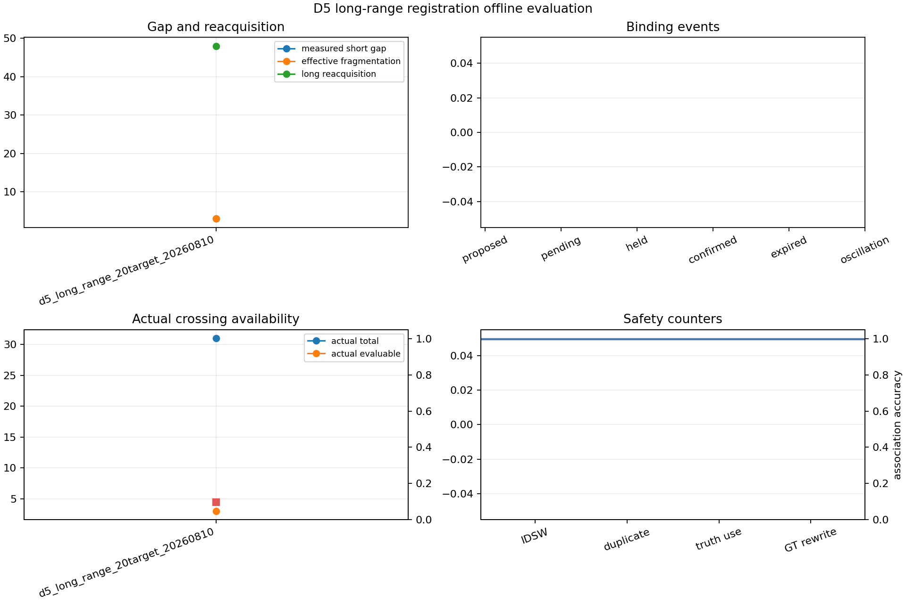

# D5长距离视觉配准离线评估

## 结论

本批按失败关闭处理。原因：effective_short_gap_fragmentation_count:failed:threshold not satisfied, binding_oscillation_count:unavailable:one_or_more_all_episodes_values_unavailable, actual_crossing_gate:failed:actual evaluable=3/31, ratio=0.096774。
输入共1个episode；多seed证据尚不可用。几何预检只说明场景设计，不计入实际交叉窗口分母。

## 汇总指标

| 指标 | 数值 | 可用性 | 原因/来源 |
|---|---:|---|---|
| 实测短缺口数 | 3 | available | D6 aggregate:all episodes |
| 实测短缺口总时长(秒) | 0.330000 | available | D6 aggregate:all episodes |
| 有效短缺口中断数 | 3 | available | D6 aggregate:all episodes |
| 有界保持事件数 | 不可用 | unavailable | one_or_more_all_episodes_values_unavailable |
| 有界保持帧数 | 不可用 | unavailable | one_or_more_all_episodes_values_unavailable |
| 最大保持时长(秒) | 不可用 | unavailable | one_or_more_all_episodes_values_unavailable |
| 同编号恢复数 | 不可用 | unavailable | one_or_more_all_episodes_values_unavailable |
| 保持过期数 | 不可用 | unavailable | one_or_more_all_episodes_values_unavailable |
| 长期重发现数 | 48 | available | D6 aggregate:all episodes |
| 长期重发现编号变化数 | 48 | available | D6 aggregate:all episodes |
| 绑定切换提出数 | 不可用 | unavailable | one_or_more_all_episodes_values_unavailable |
| 绑定切换待确认数 | 不可用 | unavailable | one_or_more_all_episodes_values_unavailable |
| 绑定切换保持数 | 不可用 | unavailable | one_or_more_all_episodes_values_unavailable |
| 绑定切换确认数 | 不可用 | unavailable | one_or_more_all_episodes_values_unavailable |
| 绑定切换过期数 | 不可用 | unavailable | one_or_more_all_episodes_values_unavailable |
| 绑定振荡数 | 不可用 | unavailable | one_or_more_all_episodes_values_unavailable |
| 几何绑定切换数 | 7 | available | D6 aggregate:all episodes |
| 实际交叉窗口总数 | 31 | available | D6 aggregate:all episodes |
| 实际交叉可评分数 | 3 | available | D6 aggregate:all episodes |
| 实际交叉不可评分数 | 28 | available | D6 aggregate:all episodes |
| 实际交叉可评分比例 | 0.096774 | available | D6 aggregate:all episodes |
| 实际交叉不可评分原因 | {"insufficient_temporal_samples": 1, "missing_pair_observation:GT-0001": 1, "missing_pair_observation:GT-0001,GT-0002": 1, "missing_pair_observation:GT-0002,GT-0003": 1, "missing_pair_observation:GT-0003,GT-0004": 2, "missing_pair_observation:GT-0005,GT-0006": 2, "missing_pair_observation:GT-0005,GT-0008": 1, "missing_pair_observation:GT-0007,GT-0008": 1, "missing_pair_observation:GT-0007,GT-0010": 2, "missing_pair_observation:GT-0009,GT-0010": 2, "missing_pair_observation:GT-0011,GT-0012": 2, "missing_pair_observation:GT-0011,GT-0014": 2, "missing_pair_observation:GT-0013,GT-0014": 1, "missing_pair_observation:GT-0013,GT-0016": 2, "missing_pair_observation:GT-0015,GT-0016": 2, "missing_pair_observation:GT-0015,GT-0018": 2, "missing_pair_observation:GT-0017,GT-0018": 2, "missing_pair_observation:GT-0017,GT-0020": 1} | available | D6 aggregate:all episodes |
| 交叉窗口身份切换数 | 不可用 | unavailable | one_or_more_all_episodes_values_unavailable |
| 交叉窗口轨迹纯度 | 不可用 | unavailable | one_or_more_all_episodes_values_unavailable |
| 交叉窗口轨迹连续性 | 不可用 | unavailable | one_or_more_all_episodes_values_unavailable |
| 关联准确率 | 0.997932 | available | D6 aggregate:all episodes |
| 可评分关联数 | 1934 | available | D6 aggregate:all episodes |
| 错误关联数 | 4 | available | D6 aggregate:all episodes |
| 身份切换数 | 0 | available | D6 aggregate:all episodes |
| 重复分配数 | 0 | available | D6 aggregate:all episodes |
| 在线真值使用数 | 0 | available | D6 aggregate:all episodes |
| 全局航迹编号改写数 | 0 | available | D6 aggregate:all episodes |

## 分相机结果

| 相机 | 短缺口 | 有效短缺口中断 | 长期重发现 | 身份切换 | 交叉可评分/总数 | 关联准确率 |
|---|---:|---:|---:|---:|---:|---:|
| Center_CV | 0 | 0 | 不可用 | 不可用 | 不可用/不可用 | 不可用 |
| Interceptor_CV | 3 | 3 | 不可用 | 不可用 | 不可用/不可用 | 不可用 |

## 门控

| 门控项 | 要求 | 结果 | 数值/原因 |
|---|---|---|---|
| 身份切换数 | = 0 | passed | 0 |
| 有效短缺口中断数 | = 0 | failed | 3 |
| 绑定振荡数 | = 0 | unavailable | one_or_more_all_episodes_values_unavailable |
| 重复分配数 | = 0 | passed | 0 |
| 在线真值使用数 | = 0 | passed | 0 |
| 全局航迹编号改写数 | = 0 | passed | 0 |
| 关联准确率 | >= 0.95 | passed | 0.997932 |
| 实际交叉窗口 | 可评分数不小于10且比例不小于0.30 | failed | actual evaluable=3/31, ratio=0.096774 |

## Episode明细

| Episode | schema | 准确率 | 短缺口 | 重发现 | 绑定切换 | 交叉窗口 | 状态 |
|---|---|---:|---:|---:|---:|---:|---|
| d5_long_range_20target_20260810 | d5-long-range-cv-scan-metrics-v2-frozen-sidecar | 0.997932 | 3 | 48 | 7 | 3/31 | fail_closed |

## 证据边界

本报告只消费main写盘的指标、连续性和关联记录。旧v2没有时序绑定与掉检事件时，保持帧数、保持恢复、绑定振荡等指标标为不可用，不按零处理。
当前冻结单seed结果即使关联准确率较高，也会因有效短缺口中断、时序证据缺失或实际交叉窗口不足而失败关闭。报告不声称P1、多seed标定或真实光电识别已经完成。
