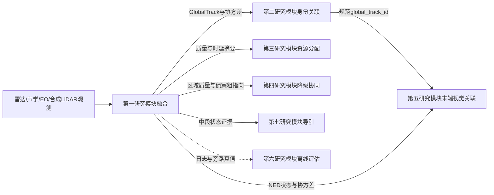

# 第一研究模块：多传感器融合与目标配准算法与实施说明

> 文档日期：2026-07-23
>
> 适用范围：离线科研仿真、受治理回放和系统接口验证
>
> 实现依据：当前第一研究模块代码、`README.md`、`PLAN.md`、模块原理文档和系统总汇总

## 当前权威增量（2026-07-23）

### Radar assignment ambiguity 实验候选 v1

生产默认 `radar_assignment_ambiguity_governance=False`，完全跳过本节候选并执行基线
Hungarian。只有显式传入严格布尔值 `True` 时，候选才挂在 `process_scan_batch()` 的全 radar
分支。原关联先在共同
`measurement_timestamp` 取得每条航迹的六维状态预测和协方差，以雷达三维位置创新构造：

```text
d_ij = z_position_j - x_position_i(t_measurement)
S_ij = P_position_i(t_measurement) + R_position_j + epsilon I
q_ij = d_ij^T pinv(S_ij) d_ij
valid_ij = finite(q_ij) and q_ij <= association_gate
```

原 Hungarian 或 SciPy 不可用时的 greedy fallback 先产生一对一集合 `M`。候选不修改
`q_ij`、门限或分配求解，而是在已匹配行列上构造有向图：

```text
column_by_row[i] = M 中分给 track row i 的 observation column
i -> k  当 i != k 且 valid[i, column_by_row[k]]
```

图中大小至少 2 的 strongly connected component 包含一条交替环。把该环上的匹配边替换为
交叉门内边，会得到另一组同基数匹配，因此当前扫描不能安全声明身份唯一。实现把整个强连通
分量作为保守治理单元：

1. 从 `assignments` 删除分量内 observation columns；
2. 为每条 observation 记录 `radar_assignment_ambiguity_suppressed` 并标记 processed；
3. 直接跳过 update 和 `_create_track()`，所以被抑制 observation 不能 birth；
4. track 只保留扫描前到 `arrival_timestamp` 的 CV prediction，不执行 EKF update；
5. 记录 component size、track IDs、measurement/arrival timestamp 和 policy version。

矩形矩阵只把 Hungarian/greedy 实际匹配的行列放入图。未匹配行不增加 ambiguity coast 计数；
未匹配列仍按原规则独立 birth，但分量内被抑制列不会落入 birth。首扫或空 track set 直接返回，
门拓扑唯一时所有 SCC 都是单点。扫描 API 已要求同 sensor、同 modality、同双时间戳和同
observer-scan key，所以 acoustic/EO/lidar 不进入该规则。

`association_audit_summary()` 的新增在线字段为：

- `radar_assignment_ambiguity_scan_count`
- `radar_assignment_ambiguity_observation_suppression_count`
- `radar_assignment_ambiguity_track_coast_count`
- `max_radar_assignment_ambiguity_component_size`
- `radar_assignment_ambiguity_governance_enabled`
- `radar_assignment_ambiguity_policy_version`
- `radar_assignment_ambiguity_governance_status`
- `latest_radar_assignment_ambiguity_track_ids`

track metadata 另保留 latest reason、双时间戳、component size 和 policy version。字段不含
truth 或 observation 名称派生身份。策略版本为
`fail_closed_gate_feasible_alternating_cycle_v1`；status 为 `disabled` 或
`experimental_enabled`。非 bool 构造参数直接抛 `TypeError`。

#### 根因与候选排除

seed 1000 中 `global_track_100/101` 在 scans 8--10 对两个 radar 谱系
swap/保持/swap-back；seed 1002 的 `global_track_187/188` 同构。相同 radar-only 输入把 delay
置零后，分配和代价保持而 OOSM 归零，说明不是 fixed-lag/OOSM。

20:1 likelihood-margin 原型只在首次近等价扫描抑制。coast 改变后验后，后续错误排列的单帧
代价会显得唯一并被提交，因此该门不能证明身份。v1 使用门拓扑可交换性而不是同一开发输入上的
真值调参。其代价是只要存在门内交替环就抑制，即使 winner 的代价明显更低。

#### 开发回放与 detached clean 阻断

truth sidecar 在参考和候选在线回放均结束后才连接。实际候选实现结果为：

开发冻结 A/B 曾得到：

| Seed | 混合 radar track 代理 | 终态 track | suppression |
| --- | ---: | ---: | ---: |
| 1000 | `2 -> 0` | `203 -> 203` | `22/1962=1.12%` |
| 1001 | `2 -> 0` | `201 -> 201` | `130/1966=6.61%` |
| 1002 | `2 -> 0` | `201 -> 201` | `78/1958=3.98%` |

这些输入是开发复现，不是泛化验收。main 随后对提交 `d967c96` 运行 detached clean 2.2 s，
候选 `/tmp/msm-clean-radar-d967c96` 与旧基线
`/tmp/msm-clean-disposition-488dc39-t0eXta` 的实际集成结果为：

| Seed | D2 ambiguous | strict IDSW | D1 tracks | 关键下游 | suppression |
| --- | ---: | --- | ---: | --- | ---: |
| 1000 | `2 -> 0` | 候选 `available=12` | `203 -> 202` | D3 assignments `200` | `16` |
| 1001 | `0 -> 1` | `available=9 -> unavailable` | `201 -> 201` | D2 `202 -> 198`；D3 `200 -> 188` | `114` |
| 1002 | `2 -> 0` | 候选 `available=3` | `201 -> 200` | D3 `200 -> 193` | `78` |

三组 finite=true、online truth=0、missing identity evidence=0。seed1000/1002 的改善不足以抵消
seed1001 新增 ambiguous mapping、strict unavailable 和下游可用性下降。

seed1001 的 `GT3D-000210` 与 D1 既有 `global_track_187` 的终态 state/covariance 相同，不是
D1 新 birth。该 D1 track 由 scan 1 radar 初始化，scan 8 接受另一离线谱系 radar，scan 9
回到原谱系，随后接入两条 vision；D2 在末帧重建 canonical track。scan 8 的关联矩阵为
`200x199`，有 209 条 gate-valid edge、198 个匹配、2 个 free row、1 个 free column：

```text
Hungarian: global_track_187 -> observation，cost = 0.80058
替代边:   global_track_186 -> same observation，cost = 1.58216
```

替代边占用 observation 并释放 `global_track_187`，匹配基数不变。这是 free-row alternating
path；v1 的已匹配行 SCC 看不到它。一般矩形图还存在通向 free column 的同基数路径，相关
unmatched observation 若不治理可能落入 birth。刚才未验证的 full alternating-path v2 已撤销，
当前没有实现该边界。

clean seed1001 的 1,966 条 radar 原始量测全部是三维 range/azimuth/elevation 和 `3x3`
covariance。转换后的第 4 维零值明确是
`radial_velocity_observed=False`、`filter_measurement_dimension=3` 的 placeholder，不能作为
独立速度观测缩图。

专项测试现在直接使用生产参数：默认实例复现原 Hungarian 换绑，显式 True 才验证 v1
suppression；性能和规模 fixture 不再 subclass override 生产逻辑。专项还以 gate-valid `3x2`
记录 free-row blocker，并覆盖三目标环、门拓扑唯一、首扫、OOSM、greedy fallback、双时间戳、
协方差和 `global_track_id`。专项 `13 passed`，D1 全量 `204 passed in 17.42s`。

结论是 v1 默认关闭、仅作实验候选，P1 未关闭。下一候选须严格覆盖最大基数 matching allowed
edges 的 cycle/free-row/free-column，并在新的 detached clean 输入上联合验收 ambiguous、
strict identity、continuity、D3 availability、suppression、birth/recall。10 s radar+vision
ambiguous 不能单独证明 radar-only 根因，但长期 coast 与跨模态传播仍必须进入集成验收。

### 匿名跨模态几何门控

雷达初始化的航迹在视觉扫描到达时，D1 先在 `measurement_timestamp` 取得该航迹的 NED 后验
`(x_i, P_i)`，再使用观测自身的相机模型构造像素预测：

```text
p_c = R_camera_from_ned * (p_ned - p_camera_ned)
u = fx * p_c.x / p_c.z + cx
v = fy * p_c.y / p_c.z + cy
```

`p_c.z <= 0`、非法外参或非有限投影返回 unavailable。合法候选继续计算：

```text
r_ij = z_j - h_i
S_ij = H_i P_i H_i^T + R_j
NIS_ij = r_ij^T pinv(S_ij) r_ij
```

其中 `R_j` 是当前视觉观测的像素协方差。`NIS_ij` 仍使用原 `association_gate`，扫描内仍由
Hungarian 完成一对一分配。更新后的非量距笛卡尔修正还要通过原有状态修正门。量测时刻用于
历史更新，到达时刻用于 OOSM/延迟审计；六秒 fixed-lag 不变。

根因修复位于 `CameraModel.from_metadata()`：解析器现在接受 `Mapping`，因此
`SensorScanFrame` 冻结后的嵌套 `camera_model` 不会丢失；同时兼容
`rotation_camera_from_ned` 和 `camera_intrinsics`。相机模型构造检查位置、旋转、焦距和图像
尺寸。该变化没有加入任何 truth ID、Actor/Object 名称或 D6 结果。

`association_audit_summary()` 增加以下在线诊断：

- `eo_projection_gate_pass_count`
- `eo_projection_gate_rejection_count`
- `eo_projection_unavailable_count`
- `eo_one_to_one_unassigned_count`
- `max_eo_projection_gate_pass_nis`
- `latest_eo_projection_rejection_reason`

字段只反映投影门和一对一分配结果。seed 1000 候选计数为通过 2,255、拒绝 215、不可计算 0、
一对一冲突 3；最大门内 NIS 为 39.326205。构造负例另行覆盖非法外参和相机后方点，因此该
episode 的不可计算为 0 不表示拒绝分支未测试。

专项 A/B 使用同一 771 scans/11,889 observations。旧/新规范状态与谱系哈希分别为
`39d0cdf5...02d7` 和 `b0d6c4ac...d717`。D2 标出的 17 条污染视觉观测 17/17 得到单一离线标签
谱系；标签只用于回放后核验。D1 全量回归为 `191 passed in 16.88s`。

### Scan claim 单次 JSON 安全物化

`ScanInputOrganizer` 在接纳扫描前构造 `_ScanClaim`。claim 包含逐 observation 谱系摘要、
整扫描谱系摘要、内容摘要和完整帧摘要。旧路径先构造带 NumPy 数组和冻结 mapping 的 Python
记录，再由两个 `_digest()` 分别递归执行 `_json_safe()`。共享内容因此被处理两次。

当前 `_claim_for_frame()` 按以下顺序执行：

```text
只读 SensorScanFrame
  -> 每条来源谱系转换一次并计算原 SHA-256
  -> 每条 observation 的共享内容转换一次
  -> 共享内容 + 到达/转发/scan 字段形成完整帧记录
  -> 两组记录按相同谱系键排序
  -> 使用原 JSON 编码参数分别计算内容摘要和帧摘要
  -> 原 claim registry 与拒绝状态机
```

`_digest_json_safe()` 只接收已经完成规范化的内部记录；外部任意对象仍通过 `_digest()` 进入完整
`_json_safe()` 校验。帧专有字段也单独执行一次 `_json_safe()`，因此非有限通信时间戳或不支持
类型仍会 fail closed。`ScanInputOrganizer._build_claim()` 是受保护覆写点，仅用于冻结性能基准
运行旧参考实现，生产默认始终使用新路径。

clean `5263e2b` seed 1000 冻结输入的完整参考/候选流水均处理 771 scans 和 11,889
observations。claim registry、逐输入结果、release schedule、逐 fusion 后验、操作数、累计
诊断、终态和一致性证据严格一致。5 轮交错计时 P50 由 `3.618 s` 降至 `1.905 s`；
`_json_safe` cProfile 累计由 `5.781 s` 降至 `1.992 s`。门限、协方差、6 s fixed-lag、观测
数量和滤波公式没有变化。

### SensorScanFrame 完整性封印与 organizer 复用

`SensorScanFrame.__post_init__` 继续执行原有完整流程：逐 observation alias-free 快照、只读
数组和递归冻结 metadata、在线 truth 隔离、协方差合同、双时间戳、统一 frame/scan identity
及 source lineage 校验。新增 `_snapshot_integrity` 只描述该已验证快照的对象和不可变结构，
不替代上述校验。

`ScanInputOrganizer.ingest()` 收到 `SensorScanFrame` 时先调用
`_frame_snapshot_is_intact()`。封印完整则直接进入原 `_ingest_frame()`，继续生成相同
claim、content/frame digest、audit event、watermark 和 release schedule；封印不完整则按
原路径重新构造 `SensorScanFrame`。`performance_diagnostics()` 记录完整帧复用、变异帧重建、
iterable 帧构造和 organizer 内 observation 快照数，供冻结 benchmark 使用。

测试覆盖完整帧对象直接复用、数组恢复可写后的 alias-free 回退，以及 metadata 注入 truth 后
的 fail-closed 拒绝。完整 `4ac3bb2` seed 1000 冻结复放进一步比较：

- 771 个逐输入 organizer 结果、close 结果、audit 和 94 个 release groups；
- 771 个逐 fusion posterior，包括状态、协方差、时间戳、source lineage 和 track level；
- 每次物化的 `GlobalTrack`、201 条终态航迹和一致性证据；
- 每个 fusion 的 batch operation counts 与累计 `FusionPerformanceDiagnostics`。

所有语义检查相等。逐 fusion operation snapshot hash 为
`sha256:82728a8e0fed0adedd0254368e29a3c117157b066158595d7ca6dac558bfb5bf`，累计诊断
snapshot hash 为
`sha256:b28df84d6664ba17d097990f7186a2a611f2e3469394e3d2a12122dbec521766`。
main 实测当前 D1 全量回归为 `185 passed`，作为本工作区当前权威测试计数。

### Fusion profiler 结论

fusion 算法代码本轮未改。完整 cProfile 的主要累计路径为
`global_tracks 17.559 s`、`_scan_one_to_one_assignments 17.027 s`、
`_to_global_track 16.930 s`、`_cached_non_radar_scan_cost_matrix 14.971 s`、
`_replay_record 8.601 s`、`_state_at 5.023 s` 和完整 checkpoint 查询 `3.735 s`。
累计操作数与 clean episode 相同：2,345,793 candidate pairs、505,926 innovation solves、
152,799 checkpoint queries、3,837 fixed-lag rebases、286,792 checkpoint reuses 和
91,151 次 GlobalTrack 物化。

48 个 radar scans 的未剖析 P95 为 `343.059 ms`，候选对峰值 40,000，单扫描 rebase 峰值
197；308 次同 fusion timestamp 调用保持 state-only，463 次完整物化。进一步减少
GlobalTrack audit metadata 或 radar/rebase 成本需要单独合同设计，本轮不实施不确定优化。

当前优化验证运行在未提交 D1 工作区，并使用 clean `4ac3bb2` 的单 seed 三维质点冻结输入；
不是新的 clean full-stack、AirSim、正式多 seed 或实时证据。

## 前一权威增量（2026-07-22）

### Nominal 200v200 clean 单 seed 全栈校准

算法实现完成后，main 在 detached clean
`4ac3bb2c12cc6af6ebd372107ced00bcdc5adf6a` 上运行 10 s、seed 1000 的
`200v200-nominal-v1` 全栈，并以 clean
`0d2da25c14e50f8f9a10ad47a7bd74e5c5e577fb` 的同 seed、同配置运行作为基线。候选世界状态
有限，11,889 条匿名在线观测均保持 truth 隔离，`online_truth_use_count=0`。

| 计时口径 | 基线 | 候选 | 变化 |
| --- | ---: | ---: | ---: |
| episode 核心 wall | 94.104939744 s | 85.002427712 s | -9.6727%，1.1071x |
| D1 fusion 累计 | 49.697406826 s | 40.272795088 s | -18.9640%，1.2340x |
| D1 scan input 累计 | 12.315225105 s | 12.560936034 s | +1.9952% |

候选核心 RTF 为 `0.1176437`。`stage_timings.csv` 对 771 次 D1 fusion 调用给出的
P50/P95/max 为 `33.25249/224.76351/592.95713 ms`。跨构建审计的规范在线载荷、离线 truth
state 和计划谱系比较全部通过；因此当前结果支持同 seed 业务语义保持，但 fusion 尾部仍有
显著长调用，scan-input 也没有同步改善。

外部 `/usr/bin/time` 总进程 elapsed `1:55.95`、峰值 RSS `2,468,928 KiB` 是不同层次的
资源证据。总进程包含解释器启动、离线后处理和写盘，不能与核心 wall 混用。验收范围只覆盖
两端 clean、同 seed/配置、有限状态、在线 truth 0 和跨构建语义一致。这是单 seed 描述性 clean
校准，不是 20-seed 或正式性能矩阵，且 RTF 小于 1；fusion P95/max 尾延时与 scan-input 成本
仍是 P1，不扩展为 AirSim、RMSE/NEES/NIS 或物理效果结论。

### 非雷达创新协方差矩阵栈

非雷达候选的归一化创新平方仍定义为：

```text
r_ij = wrap(z_j - h_i)
S_ij = H_i P_i H_i^T + R_j
q_ij = r_ij^T pinv(S_ij) r_ij
```

其中 `i` 是候选航迹，`j` 是同一扫描内观测。旧路径对每个 `(i,j)` 单独进入
`numpy.linalg.pinv()`。新路径只在量测几何、量测维度、协方差维度和角度残差索引完全相同时
分组，构造 `S[group, track, observation, :, :]` 后批量求伪逆。`R_j` 不共享，`P_i/H_i`
不跨航迹共享。批量返回后仍按旧顺序逐候选计算 `r_ij^T pinv(S_ij) r_ij`，因此代价矩阵、
门控和 Hungarian 分配保持。批量调用异常时，该组逐候选回退。

```text
同一扫描观测
  -> 按实际几何与矩阵形状分组
  -> 每航迹构造一次 h_i、H_i、H_i P_i H_i^T
  -> 每观测加入自己的 R_j
  -> pinv(S_stack)
  -> 逐候选原顺序计算 q_ij
  -> 原门限与 Hungarian
```

未见 seed 1000 的完整 10 s 输入含 771 个扫描和 11,889 条观测。旧/新无 profiler 墙钟为
`50.458/39.994 s`；逐扫描摘要、终态航迹和一致性证据哈希相同，操作计数和累计诊断也相同。
前 256 扫描在同进程预热后交错 7 次，P50 加速 `1.196x`。实现保留
`batched_non_radar_innovation_solve=False` 参考开关，便于后续冻结回归。

### 缓存一致性证据的计数更新

固定滞后检查点复用时，`_refresh_cached_consistency_evidence_if_enabled()` 只需要把缓存证据推进到
当前 replay revision，并增加 replay count。旧实现调用通用 `replace()`。该调用会重新验证
记录的双时间戳、状态、协方差、NIS、门控、可用性和谱系，并重新推导 `evidence_id`。代表
10 s seed 中这一路径调用 194,916 次，累计 27.122 s。

新实现增加 `OnlineConsistencyEvidenceRecord.with_replay_counters()`。方法先把两个输入按旧语义
转换为整数并拒绝负值，再从原冻结记录复制全部 slots，只覆盖两个计数。原对象已经通过
`__post_init__`，其余字段没有写入口；嵌套 availability 和状态/协方差元组也都是不可变值。
融合器以 `trusted_consistency_counter_refresh` 控制 A/B，默认启用受限路径，关闭时继续执行旧
完整重验。

```text
合法缓存前缀
    -> 后验、门控、协方差、时间戳、谱系均未变化
    -> 校验 replay_revision/replay_count 为非负整数
    -> 复制冻结记录并覆盖两个计数

新证据或内容变化
    -> 完整构造
    -> 完整字段校验
    -> 重新生成当前证据内容
```

冻结 A/B 对 seeds 42000-42002 逐扫描比较内部后验和航迹分级，并比较终态航迹、最终证据、操作
计数和物化计划。全部通过，在线 truth 使用为 0。未剖析纯融合均值
`64.844 -> 52.657 s`；代表 seed 的重放累计 `35.348 -> 9.410 s`。其后的非雷达代价矩阵工作
已由上节完成，下一性能工作转向航迹物化和 scan input，不应放宽固定滞后、门控或协方差合同。

### 集成执行与等价验收

certified radar pre-gating 在扫描代价矩阵构造阶段工作。通过认证且保守下界已越过原门限的候选
不再执行伪逆；其余候选仍进入原精确 `np.linalg.pinv`、原门限和 Hungarian 一对一分配。该优化
没有更改 `SensorObservation`、固定时滞重放、`GlobalTrack` 或下游 D2-D7 合同。

main 以 clean `8f86192` 为参考、clean `f80b5bd` 为候选，对 10 s、200v200 nominal seeds
42000/42001/42002 独立运行完整总线。三组 D1 终态航迹数在两条路径均为 `202/207/203`，有限
状态和在线 truth 使用 0 均保持。D1 fusion 累计耗时均值由 `92.991088 s` 降至
`88.330438 s`；scan input 由 `16.902643 s` 增至 `17.524242 s`。精确创新求解总数由
`7,130,228` 降至 `1,578,677`。

业务等价检查逐条比较在线总线。独立运行产生的 D3 `plan_id` 按规划出现次序和版本建立一一
映射；映射前先校验 ACK 原始载荷 SHA，映射后仍比较 predecessor、owner、version、coalition、
`global_track_id` 和 command 等业务字段。三个 seed 的全部主题检查均通过，D1 fused-track 主题
规范哈希一致。`association_innovation_solve_count` 是实现成本计数，明确不参与业务等价比较，
不能用来解释融合精度。

该验收说明预门控和 A95 复用在当前 integrated 三 seed 上保持业务语义。它不证明 D1 已实时，
也不解决当前长时归一化超线性、AirSim 接线或正式 RMSE/NEES/NIS。

### 雷达候选的可证明预门控

雷达扫描中每个航迹和观测候选原本都计算
`q = d.T @ np.linalg.pinv(S) @ d`。直接用 `||d||^2 / trace(S)` 预拒绝并不安全：`S` 可能不定，
也可能包含被 `pinv` 截断的近零奇异值，此时该比值不是旧伪逆二次型的可靠下界。

当前实现先执行廉价认证。设第 `i` 行非对角绝对值和为 `r_i`：

```text
g = min_i(S_ii - r_i)
U = max_i(sum_j(abs(S_ij)))
```

只有 `S` 全部有限、逐元素严格对称，且加入浮点安全裕量后的 `g > 0` 并满足
`g > 1e-15 * U` 时才认证。严格对称与 `g > 0` 通过 Gershgorin 圆盘定理保证 `S` 严格正定；
`U` 是其最大特征值和谱范数的保守上界。第二个条件保证最小特征值高于旧
`np.linalg.pinv` 的 cutoff 上界，因此伪逆不会截断任何方向并等于通常逆。此时：

```text
d.T @ pinv(S) @ d >= ||d||^2 / U
```

只有右侧在保守数值裕量后严格大于原关联门限，候选才记为无穷代价而跳过精确求解。不定、近
奇异、非对称或非有限矩阵全部回退旧 `pinv`。原门限、伪逆、Hungarian 分配和候选集合生成没有
放宽。

负例分别使用带负特征值的交叉协方差和 `diag(1e12, 1, 1e-20)`。差向量沿负特征方向或被截断
方向设置，使旧 `pinv` 代价不超过门限，而朴素 trace 比值超过门限。新认证对两者均失败，
rejection mask 全 false；扫描回归中参考和候选路径执行相同数量的精确求解并输出相同后验。

完整快照物化还把同一航迹协方差的 A95 从分级和 metadata 两次特征分解改为一次计算复用。
关闭开关后的参考路径与默认路径输出逐字段相同。10 s seeds 42000-42002 的精确创新求解合计
`7,130,228 -> 1,578,677`，逐扫描、终态和一致性证据哈希一致；旧/新墙钟均值
`91.313/88.619 s`。这仍是冻结三维质点输入上的 D1-only 证据，不代表实时或正式精度。

### Clean 200v200 接线证据

算法接口完成后，main 在 clean 候选提交 `8f86192` 中按量测扫描顺序执行状态更新，并仅在同一
fusion timestamp 的最后后验构造完整 `GlobalTrack` 快照。10 s、200v200 三维质点 seeds
42000、42001、42002 均 clean、finite，在线 truth 使用 0，D1/D2 overflow 和全部安全合同通过。

三例 scan/state-only/full snapshot 计数分别为
`764/310/454`、`844/328/516`、`782/278/504`。state-only 与 full snapshot 之和逐例等于扫描
总数，说明每个扫描仍被融合并发布。与旧 clean `3bac3ff` 相比，事件、scan input、共享摘要及
世界真值相同；D1 fusion 三 seed 均值 `103.339 -> 92.991 s`，下降 10.0%。seed 42000 的
2.2 s 全栈墙钟 `18.611 -> 18.302 s`。

该结果验证 main 调用方式和算法语义，没有改变滤波公式、门控、固定时滞窗口、双时间戳、
协方差或规范身份。D1 fusion 处理 10 s 输入仍平均耗时 92.991 s，实时性、AirSim 和正式精度
继续开放。

### 扫描状态更新与航迹物化分离

同一 runtime tick 可能由扫描整理器释放多个不同传感器或不同量测时刻的扫描。扫描不能拼接成一个伪
扫描，因为每个扫描都有独立 observer-scan key、一对一关联集合、双时间戳和乱序语义。当前实现
保持逐扫描状态更新，只把完整航迹对象构造从同一 fusion timestamp 的中间扫描移到该组末尾：

```text
released scan 1 -> process_scan_batch(..., materialize_tracks=False) -> state/audit
released scan 2 -> process_scan_batch(..., materialize_tracks=False) -> state/audit
released scan n -> process_scan_batch(..., materialize_tracks=False) -> state/audit
                                                            |
                                                            v
                                         materialize_global_tracks() once
                                                            |
                                                            v
                                  GlobalTrack snapshot -> D2 / persistence
```

状态-only 调用完整执行观测校验、扫描级代价矩阵和一对一分配、航迹起始、固定时滞重放、检查点
前 OOSM、预测、协方差限制、健康统计、一致性证据修订、来源谱系和性能计数。它只不调用
`global_tracks()`。返回的 `FusionStateUpdateResult` 包含准确的 `current_track_count`，因此 main
可记录轻量状态，而无须从 `tracks` 推导数量。`tracks` 属性主动抛出
`TracksNotMaterializedError`，防止空列表被解释为当前没有航迹。main-owned scalable 三维质点
runtime 已按该调用方式完成上述 clean 三 seed 复跑。

显式物化接口在当前内部后验上构造 `FusionTrackSnapshot`。它共享一次 association/latency/
sensor-health 发布上下文，再逐航迹复制状态、协方差、生命周期、支持来源和元数据。物化不执行
新关联或新滤波，也不改变 `global_track_id`。实际航迹物化数和健康快照构造数进入累计性能诊断。

测试序列包含 3 个目标、量测时刻 0/3/10 秒的扫描和一帧量测时刻 1.5 秒、到达时刻 10.2 秒的
检查点前 OOSM。默认 6 秒固定时滞使检查点推进到 3 秒。逐扫描完整发布与四次 state-only 后一次
物化的终态航迹、协方差、分级、元数据、时延审计、健康摘要和 consistency evidence 相同；
物化数从 12 降到 3。

发布日志审计 schema 升为 `d1.fused_track_publication_audit.v2`。没有
`tracks_materialized` 的旧记录按完整快照读取。新状态记录使用
`tracks_materialized=false`、`tracks=[]`、`track_count=0` 和准确的 `current_track_count`；
audit 仍兼容过渡期的 `tracks=null`。审计分别统计总发布数、完整快照数、状态更新数和完整快照
内航迹记录数。定向测试 `30 passed`，D1 全量 `168 passed in 29.43s`。没有运行
AirSim；完整 200v200 运行时的 clean 三 seed 结果见上节，但仍未形成实时闭合结论。

### 长时固定滞后检查点复用

长时专项使用同一份 10 s 冻结扫描序列对照旧路径和优化路径。输入包含 764 个扫描、12,107 条
匿名观测和 202 条终态航迹，在线 truth 使用为 0。优化由四个可关闭开关组成，默认开启：

1. 完整缓存可用时，`_state_at()` 在有序检查点中二分定位最近后验，再预测到查询时刻；
2. 固定滞后重基时保留重基边界之后的合法检查点后缀；
3. 检查点失效逻辑已维护合法前缀时，不再逐项重复比较 observation ID 和排序键；
4. 未变化前缀的一致性证据复用原后验、归一化创新平方和门控结果，仅刷新 replay revision/count。

任何历史插入、起始状态变化或检查点前乱序量测仍按原规则失效缓存并完整重算。6 s fixed-lag、
`measurement_timestamp`/`arrival_timestamp`、协方差、候选集合、Hungarian 分配、创新门限、
`GlobalTrack` 和在线真值隔离保持不变。

确定性对照结果为 history replay `170,106 -> 13,397`、filter update `120,440 -> 9,549`，候选对
和创新求解均为 2,393,969。纯融合墙钟 `157.237 s -> 107.449 s`。逐扫描、终态和一致性证据
哈希全部一致。`FusionAdapter.fusion_performance_diagnostics()` 返回 schema 版本化、固定大小的
累计计数，包含用户侧 episode summary 缺失的 `replay_filter_update_count` 和
`replay_checkpoint_reuse_count`。本次优化路径记录状态查询 152,861、固定滞后后缀复用 110,891、
合法前缀快路径 300,024 和缓存一致性刷新 194,916 次；该接口不保留逐扫描快照，不要求修改 main
合同。

冻结日志的 764 条全量航迹发布约 186.2 MiB，只有 407 个唯一融合时刻。该数据来自延迟物化接口
引入前。D1 已提供同一 tick 中间状态更新和末尾快照接口，main 也已在 scalable 三维质点全栈
接线。跨 tick 合并和轻量 heartbeat/lineage 仍是后续建议，必须保留规范状态、身份、生命周期、
质量跨档和来源谱系事件。

### 第二阶段扫描关联工作区

第一阶段增量后验成为默认路径后，clean `492979e` 的 200 规模五 seed D1 fusion 均值仍为
12.103 s。第二阶段使用 seed 42000 的冻结输入进行 current-default 与优化路径对照；输入
SHA-256 为 `bc539686b130d96c63b76b9161fadbae2dba59de44cb61ac80d92f2ea1018406`，包含
86 个扫描和 2,051 条匿名观测。

`FusionAdapter` 新增默认启用的扫描关联模型缓存。非雷达扫描先为每条观测构造一次
`MeasurementModel`，并为每条候选航迹取得一次共同量测时刻状态。`MeasurementModel` 的
`geometry_key` 由实际参与量测函数的传感器位置、相机位置、世界到相机旋转矩阵和相机内参组成。
几何键相同的观测可复用该航迹的预测量测和数值雅可比；不同几何仍分别投影。

缓存不保存候选对判定。每个航迹-观测对继续独立计算角度残差、创新协方差、伪逆、归一化创新
平方和门限结果，再形成完整代价矩阵并执行 Hungarian 一对一分配。雷达继续使用原有批量状态和
门控矩阵路径。扫描原子性、OOSM、fixed-lag、双时间戳、covariance、observer-scan conflict、
航迹起始/分级、consistency evidence 和 `global_track_id` 均未改变。

新增操作计数分别记录候选对、量测模型构造、投影构造、创新求解、雷达航迹状态和雷达观测状态
构造。冻结输入中 candidate pair 和 innovation solve 均保持 371,054；measurement model build
为 `16,457 -> 82`，projection build 为 `16,457 -> 14,648`，radar 状态构造和 16,653 次
`GlobalTrack` 物化均保持。86 个逐扫描语义哈希、终态航迹哈希和 consistency evidence 哈希
完全一致，在线 truth 使用为 0。

模块级纯融合墙钟为 `10.792 s -> 8.635 s`，本机单次 1.25 倍。专项
`10 passed in 10.33s`，D1 全量 `161 passed in 38.02s`。性能单测不使用墙钟阈值；验收依赖
确定性操作计数和输出哈希。后续 clean 三 seed 全栈已经复跑，AirSim 尚未复跑。

### 第一阶段增量后验与发布快照

本轮在 `FusionAdapter` 中实现逐航迹增量后验检查点和每扫描公共发布审计快照。检查点记录观测
身份、量测/到达排序键、滤波后验、归一化创新平方和 gate 结果。正常顺序扫描直接复用匹配前缀；
窗口内乱序只失效插入点及之后的后缀；固定滞后重基、起始观测变化和检查点前 OOSM 清空相关
缓存。缓存命中仍执行 consistency evidence 捕获，以当前 replay revision 重建证据。

发布阶段先生成一份 association、latency 和 sensor-health 上下文，再复制到当前扫描的全部
`GlobalTrack`。每条航迹仍独立物化，state/covariance 与内部后验不共享数组。新增四项确定性
计数：实际 replay filter update、checkpoint reuse、global-track materialization 和
sensor-health snapshot build。

冻结 seed 42000/200v200 输入包含 86 个扫描、2,051 条匿名观测，SHA-256 为
`38d24429711b67d612f2f398478386ebf0df690fae55cd9dcc36434aac4fb078`。未缓存参考与优化路径
的逐扫描语义、最终 201 条航迹和 consistency evidence 哈希一致；filter update
`93,234 -> 1,797`，health snapshot `16,653 -> 86`。墙钟 `34.701 s -> 9.073 s`，本机单次
3.82 倍。该结果只关闭 D1-owned 冻结输入热点。

## 历史权威增量（2026-07-16）

本轮新增 `local_image_track.py` 的保守适配算法。输入是 main-owned
`LocalImageTrackObservation`，输出是 `SensorObservation | None`：

```text
track_state == lost
  -> None

track_state == measured
  -> revalidate timestamps/confidence/center/bbox/2x2 covariance/metadata identity
  -> SensorObservation(modality=eo, frame_id=pixel)
  -> explicit lineage=(local_image_track, source_track_key, measurement_time)
```

visible 与 infrared 不拆成新的内部 modality，而是统一使用 EO 量测模型，并在
`metadata.spectral_band` 区分。默认 observation ID 显式编码 sensor、stream、local epoch、
local track ID 和量测时刻；因此同一本地样本重投递生成同一 ID/lineage，新量测时刻仍保持
唯一。输入 metadata 深复制并保留 backend、batch 与相机等在线审计字段；global/truth identity
键在任意嵌套层级触发拒绝。

融合器接受 EO 更新后，将 namespaced `source_track_key` 去重累积到
`GlobalTrack.metadata.source_track_ids`。该集合用于来源审计而非规范身份，算法不读取它来
生成、选择或改写 `global_track_id`。2026-07-16 的无随机 seed 构造验证为专项 13/13、D1
全量 111/111；没有运行 AirSim，也没有新增 RMSE/NIS/NEES 或 runtime 性能结论。

## 历史权威增量（2026-07-15）

最新真实 AirSim 证据覆盖 M5N2 baseline 10 case 和 candidate 10 case，共 20 case、3,805 个
main-bus tick。D1 fusion 的 mean/P95/max 为 `320.00/451.46/1234.88 ms`，明显主导
main-bus 内层 `349.34/487.40/1305.99 ms`，所以当前算法实施缺口是 fixed-lag/batch 路径在
真实多航迹、多观测循环中的运行时预算，而不是缺少接口级批处理函数。

当前实施约束保持不变：

- 以 `measurement_timestamp` 更新，以 `arrival_timestamp` 审计传输和乱序；
- 每条正式观测和每条航迹必须携带合法 covariance；
- 工作状态在 NED 表达，AirSim truth identity/state 不进入在线估计；本批计数均为 0；
- 性能优化只允许复用预测/雅可比/历史状态和减少重复终结回放，不允许通过观测降采样、时间
  伪同步或 covariance 人为收紧绕过正确性合同。

本批没有输出可用 NIS、NEES 或 RMSE，故不用于选择 EKF/UKF/IMM，也不用于关闭真实
sensor-specific covariance 标定。M5N2 之外仅额外完成 1 个被排除的 `png_ttc_2v2_seed001`，
dropout 为 0；二者不构成算法比较证据。后文历史算法与实现记录继续保留。

## 1. 文档目的与模块边界

第一研究模块的项目代号为 D1。D1 将异步雷达、声学、光电和可选合成激光雷达观测统一到
同一时间基准和坐标工作空间，输出带完整不确定度证据的 `GlobalTrack`。它解决的是“不同
传感器的观测如何形成可供后续处理的航迹候选”，不负责下列事项：

- 不承担第二研究模块（D2）的密集多目标身份保持；
- 不决定第三研究模块（D3）的资源分配；
- 不决定第四研究模块（D4）的主动或被动降级；
- 不执行第五研究模块（D5）的末端视觉绑定；
- 不计算第七研究模块（D7）的导引控制量；
- 不提供真实飞控、硬件驱动、火控、毁伤或自动处置接口。

当前默认在线研究路径是 NumPy 数值计算库实现的常速度扩展卡尔曼滤波、基础门控关联和固定
滞后乱序量测回放。代码按输入数组长度处理目标与观测，不把 2 对 2 或 5 对 5 写成算法常量。

## 2. 术语、缩写与代码名称

本文首次使用的英文缩写统一在此定义，后文直接使用缩写或代码名称。

| 中文名称 | 英文全称与缩写 | 本文含义 |
| --- | --- | --- |
| 北-东-地坐标系 | North-East-Down，NED | D1 的状态估计和跨模块工作空间 |
| 东-北-天坐标系 | East-North-Up，ENU | 外部工具可能使用的本地切平面坐标 |
| 世界大地测量系统 1984 | World Geodetic System 1984，WGS84 | 外部地理参考，不直接作为滤波状态坐标 |
| 扩展卡尔曼滤波 | Extended Kalman Filter，EKF | 当前默认非线性状态估计器 |
| 无迹卡尔曼滤波 | Unscented Kalman Filter，UKF | 尚未进入默认实现的可选对照 |
| 交互多模型 | Interacting Multiple Model，IMM | 尚未进入默认实现的多运动模型路线 |
| 常速度模型 | Constant Velocity，CV | 当前默认运动模型；不是 AirSim 计算机视觉模式 |
| 常加速度模型 | Constant Acceleration，CA | 后续运动模型对照项 |
| 协调转弯模型 | Coordinated Turn，CT | 后续运动模型对照项 |
| 乱序量测 | Out-of-Sequence Measurement，OOSM | 到达顺序晚于物理量测时间顺序的观测 |
| 光电传感器 | Electro-Optical sensor，EO | 当前以像素中心和检测框表达的视觉观测 |
| 激光雷达 | Light Detection and Ranging，LiDAR | 当前仅有合成三维位置观测路径 |
| 归一化创新平方 | Normalized Innovation Squared，NIS | 不使用真值的创新一致性和门控统计量 |
| 归一化估计误差平方 | Normalized Estimation Error Squared，NEES | 需要离线真值的状态一致性指标 |
| 均方根误差 | Root Mean Square Error，RMSE | 需要离线真值和正确身份映射的误差指标 |
| 轻量故障检测、隔离与恢复 | Fault Detection, Isolation and Recovery Light，FDIR-light | 输出健康证据，不执行硬件隔离 |
| 加权最小二乘 | Weighted Least Squares，WLS | 已确认同一身份后的多视线定位助手 |
| 协方差交集 | Covariance Intersection，CI | 未知交叉相关性下的保守状态融合助手 |
| 视线 | Line of Sight，LOS | 观察者到目标的方向射线 |
| 逗号分隔值 | Comma-Separated Values，CSV | 可审计表格回放格式 |
| 逐行存储的 JavaScript 对象表示法 | JSON Lines，JSONL | 观测和运行日志回放格式 |
| JavaScript 对象表示法 | JavaScript Object Notation，JSON | 清单、配置和摘要的结构化文本格式 |
| 应用程序编程接口 | Application Programming Interface，API | 模块对外的 Python 调用接口 |
| 命令行界面 | Command-Line Interface，CLI | 脚本执行入口 |
| 机器人操作系统第二版 | Robot Operating System 2，ROS 2 | 后置工程消息与坐标变换运行环境 |
| 第二代坐标变换库 | Transform Library Version 2，tf2 | ROS 2 中维护坐标变换关系的库 |
| 开源计算机视觉库 | Open Source Computer Vision Library，OpenCV | 后置相机标定和几何后端候选 |
| 佐治亚理工平滑与建图库 | Georgia Tech Smoothing and Mapping，GTSAM | 后置图优化几何后端候选 |

AirSim 是微软开源的无人系统仿真平台；本文中的 AirSim 数据只作为仿真输入和离线评分证据。
`SensorObservation`、`GlobalTrack` 等名称是当前 Python 数据类或字段名，不属于英文缩写。

## 3. 软件结构与实施职责

D1 的主要实现文件如下。

| 文件 | 当前职责 |
| --- | --- |
| `src/d1_sensor_fusion/types.py` | 观测、航迹、质量、健康、协同定位和回放摘要数据合同 |
| `src/d1_sensor_fusion/motion.py` | 常速度状态转移、过程噪声和角度残差处理 |
| `src/d1_sensor_fusion/observations.py` | 雷达、声学、EO、合成 LiDAR 观测模型和默认协方差 |
| `src/d1_sensor_fusion/local_image_track.py` | 本地图像航迹到 EO/pixel 观测的 fail-closed 适配与来源谱系 |
| `src/d1_sensor_fusion/ekf.py` | EKF 预测、数值雅可比、Joseph 协方差更新 |
| `src/d1_sensor_fusion/fusion.py` | `FusionAdapter`、关联、OOSM 回放、分级和健康审计 |
| `src/d1_sensor_fusion/replay.py` | JSONL/CSV 读写、版本化回放和受治理序列化 |
| `src/d1_sensor_fusion/airsim_replay_freeze.py` | 真实 AirSim 持久化输入冻结和在线真值隔离 |
| `src/d1_sensor_fusion/quality.py` | 协方差增长率和区域时间窗口汇总 |
| `src/d1_sensor_fusion/recon_cue.py` | 给机动高空侦察节点的粗指向摘要 |
| `src/d1_sensor_fusion/cooperative.py` | 可选多观察者方位 WLS 和 CI 数值助手 |
| `src/d1_sensor_fusion/long_replay.py` | 可复现长时异步合成回放和摘要 |
| `src/d1_sensor_fusion/p2_benchmark.py` | 隔离的滤波器和一致性指标对照入口 |

main 全局编排模块负责 AirSim 启动、场景重置、回合顺序、跨模块消息路由和结果收集。D1 只
负责上述数据合同和算法，不在模块内部启动 AirSim，也不控制 D2-D7。

## 4. 统一输入合同

### 4.1 `SensorObservation`

统一观测数据类位于 `types.py`，关键字段如下。

```python
SensorObservation(
    observation_id: str,
    sensor_id: str,
    modality: str,
    measurement_timestamp: float,
    arrival_timestamp: float,
    frame_id: str,
    measurement: np.ndarray,
    covariance: np.ndarray | None,
    classification_hint: str | None,
    confidence: float,
    quality_flags: tuple[str, ...],
    metadata: dict[str, Any],
    source_node_id: str | None,
    target_node_id: str | None,
    relay_node_id: str | None,
    link_type: str | None,
    sent_timestamp: float | None,
    received_timestamp: float | None,
    payload_kind: str | None,
    stale_after_s: float | None,
    source_support: dict[str, int] | None,
    timestamp_uncertainty_s: float | None,
)
```

硬性合同如下。

1. `measurement_timestamp` 和 `arrival_timestamp` 必须同时存在且为有限数。
2. `measurement_timestamp` 表示物理采样时刻；`arrival_timestamp` 表示融合节点接收时刻。
3. 每条严格受治理观测必须携带与量测维度匹配的协方差。
4. `radar`、`acoustic` 和 `lidar` 只接受 `frame_id="ned"`；`eo` 只接受
   `frame_id="pixel"`。
5. 外部 WGS84、ENU、机体系和传感器体系必须在进入融合器前转换，或提供构成观测模型所需
   的完整外参。
6. `classification_hint` 是类别提示，不是规范目标身份。
7. 通信字段描述来源、转发和新鲜度，不会自动改变任务分配或控制状态。

数据类会规范化通信元数据和时间戳不确定度。秒和毫秒形式的时钟偏差、抖动或不确定度会归并
为 `timestamp_uncertainty_s`。若到达时刻早于量测时刻，异常差值也会计入时间不确定度证据。

### 4.2 来源谱系与重复抑制

`source_lineage_key` 用于识别“同一源载荷经不同中继重复到达”的情况。优先使用显式
`source_lineage_key` 或 `lineage_id`；否则组合源节点、传感器、模态、载荷类型、源序号和
载荷指纹。`FusionAdapter` 默认启用 `source_deduplication=True`，重复载荷只增加审计计数，
不能再次执行滤波更新并虚假缩小协方差。

来源谱系只用于去重和审计。它不能替代 D2 的目标身份关联，也不能把不同观察者的相关估计
当成独立信息重复融合。

### 4.3 在线身份和真值隔离

在线 D1 输入不得携带或使用 AirSim actor 名称、对象名称、真值目标编号或真值位置来选择
航迹。当前 `FusionAdapter` 保留 `use_truth_hints_for_association` 测试兼容参数和部分旧仿真
元数据兼容代码，但受治理回放、main 运行总线和正式在线验证必须保持该参数为 `False`，且在
进入在线记录前递归移除身份真值。

真值只允许写入 evaluator-only truth sidecar，即“仅评估器可见的真值旁路文件”。D2 和
第六研究模块（D6）在在线算法完成后读取该旁路计算身份切换、RMSE 或 NEES。任何真值进入
在线观测、`GlobalTrack`、D5 或 D7 都属于合同违规。

## 5. 输出合同与质量证据

### 5.1 `GlobalTrack`

输出状态为 NED 下的六维向量：

```text
x = [p_n, p_e, p_d, v_n, v_e, v_d]^T
```

其中前三项是北、东、地位置，后三项是对应速度。`GlobalTrack` 同时携带：

- `global_track_id`：D1 候选航迹编号；进入规范身份链后由 D2 维护稳定身份；
- `state`：六维状态均值；
- `covariance`：6×6 状态协方差；
- `timestamp`：状态有效时刻；
- `track_level`：粗略、稳定、可交接或枚举中的丢失等级；
- `source_support`：各传感器模态的累计支持；
- `identity_likelihood`：类别提示的归一化权重，不是敌我结论；
- `last_nis`：最近创新一致性证据；
- `metadata`：时间、帧、来源、健康、时延和协方差治理审计。

发布元数据至少说明 `frame_id="ned"`、`valid_at`、`published_at`、`hits`、最近量测和到达
时刻、延迟补偿状态、来源支持、重复计数、时延审计和传感器健康摘要。

### 5.2 衍生摘要

D1 还提供以下只读证据，不直接作出分配或降级决定。

- `TrackUncertaintySummary`：位置/速度协方差迹、水平 95% 误差尺度、量测年龄、来源多样性、
  NIS、协方差限制原因、增长率和交接准备度；
- `SensorHealthSummary`：每个传感器的观测、拒绝、重复、OOSM、陈旧、低质量、协方差异常、
  期望时延偏差和恢复状态；
- `LatencyAuditSummary`：融合回放、OOSM、陈旧、重复、最大/平均时延和最大回放观测数；
- `FusionQualityRegionSummary`：同一覆盖单元内的航迹数量、质量分布、时延、协方差和来源缺口；
- `FusionQualityRegionWindowSummary`：多个时刻的区域趋势、增长率和时延窗口统计；
- `ReconCueSummary`：给机动高空侦察节点的粗位置、协方差、时间戳和来源摘要。

这些摘要是 D3 成本、D4 仲裁、D5 投影门限和 D6 评估的输入证据。D1 不输出
`active_degrade_recommendation`，也不直接改变中心、二级或分布式模式。

## 6. 时间处理与固定滞后回放

### 6.1 双时间戳语义

量测时延定义为：

```text
latency = arrival_timestamp - measurement_timestamp
```

通信时延在同时存在 `sent_timestamp` 和 `received_timestamp` 时定义为：

```text
communication_latency = received_timestamp - sent_timestamp
```

量测时刻决定状态在哪一时刻更新；到达时刻只决定消息何时可见、回放顺序和延迟审计。把二者
合并会让迟到雷达量测在错误时刻修正当前状态，造成系统性位置偏差和过度自信。

### 6.2 OOSM 处理流程

`FusionAdapter.process()` 按到达顺序接收观测，默认执行以下步骤：

1. `_prepare_observation()` 补齐或限制量测协方差，记录时间不确定度和质量放大原因；
2. 更新当前到达时刻和时延、陈旧、OOSM、传感器健康计数；
3. 将现有航迹预测到当前到达时刻；
4. 按来源谱系拒绝重复载荷；
5. 在观测的 `measurement_timestamp` 计算关联分数；
6. 将新观测插入航迹历史，按“量测时刻、到达时刻、观测编号”确定性排序；
7. 从最早雷达初始化状态开始，逐条预测到各量测时刻并更新；
8. 将回放后的状态重新传播到当前发布时刻；
9. 裁剪固定滞后窗口内非必要旧观测，保留初始化观测；
10. 发布当前 `GlobalTrack` 和审计摘要。

默认 `buffer_horizon=6.0 s`，`bucket_size=0.1 s`。固定滞后窗口必须覆盖预期最大传感器延迟；
超出窗口的行为需通过陈旧计数和场景配置审计，不能假定任意长延迟都能无损恢复。

设置 `latency_compensation=False` 时，融合器把量测时刻替换为到达时刻，形成延迟补偿消融
基线。该开关用于对比，不是推荐在线配置。

## 7. 坐标转换与空间基准

D1 内部统一使用 NED：`x` 轴指北、`y` 轴指东、`z` 轴向下。推荐外部链路为：

```text
WGS84 -> 本地 ENU -> NED -> 传感器观测模型
机体系/传感器体系 -> 标定外参 -> NED
NED 目标状态 -> 相机外参和内参 -> EO 像素平面
```

实施规则如下。

1. WGS84 只作为外部参考；应固定局部原点后转换为本地切平面。
2. 雷达和声学桥接器先将传感器位置、姿态和方向转换到 NED。
3. EO 保留像素量测，但必须提供相机 NED 位置、世界到相机旋转和内参。
4. 相机默认模型只是测试后备值；真实回放必须携带场景实际标定值和版本。
5. 不允许把像素中心、声学方位或检测器编号直接解释为三维目标位置或规范身份。
6. 当前 D1 未接入机器人操作系统第二版（Robot Operating System 2，ROS 2）的坐标变换库
   `tf2`；工程部署中的动态坐标树仍属于后置适配。

## 8. 状态模型与滤波算法

### 8.1 常速度预测

当前状态转移为：

```text
x_k = F(dt) x_(k-1) + w_k

F(dt) = [[I3, dt I3],
         [03, I3   ]]
```

过程噪声采用白加速度谱密度近似：

```text
Q(dt) = q [[dt^4/4 I3, dt^3/2 I3],
           [dt^3/2 I3, dt^2 I3  ]]
```

默认 `process_noise=6.0`。仿真真值可以转弯或加速，但当前滤波器不切换模型，只依靠过程噪声
吸收机动误差。因此高动态目标的状态滞后和协方差一致性必须通过后续多模型基准验证。

### 8.2 EKF 更新

对非线性观测 `z=h(x)+v`，当前实现执行：

```text
x_minus = F x
P_minus = F P F^T + Q
y = wrap(z - h(x_minus))
S = H P_minus H^T + R
K = P_minus H^T S^(-1)
x_plus = x_minus + K y
P_plus = (I-KH) P_minus (I-KH)^T + K R K^T
NIS = y^T S^(-1) y
```

`H` 由数值雅可比计算。角度残差使用包角处理，避免正负圆周边界跳变。协方差采用 Joseph
稳定形式更新，并在矩阵求解失败时使用伪逆后备路径。

### 8.3 默认选型理由

当前使用 NumPy EKF 的原因是状态维度低、实现可审计、依赖少，且适合大量随机种子回放。
UKF、IMM、FilterPy 和 Stone Soup 并未替换默认路径。它们只有在同一冻结输入上证明身份、
一致性或时延收益，并满足运行预算后，才可能进入后续升级评审。

## 9. 各传感器观测模型

### 9.1 雷达

雷达量测为：

```text
z_radar = [range, azimuth, elevation, radial_velocity]^T
```

设目标与雷达的 NED 相对向量为 `r=p-s`，则：

```text
range = ||r||
azimuth = atan2(r_e, r_n)
elevation = atan2(-r_d, sqrt(r_n^2+r_e^2))
radial_velocity = v dot (r / ||r||)
```

缺少显式协方差时，默认标准差按距离增长：

```text
sigma_range = 2.0 + 0.012 * range
sigma_azimuth = deg2rad(0.25 + 0.0008 * range)
sigma_elevation = deg2rad(0.35 + 0.0010 * range)
sigma_radial_velocity = 0.35 + 0.0015 * range
```

这些系数由 `RadarCovarianceConfig` 管理，可由场景配置覆盖。当前只有雷达可初始化新航迹，
因为它能提供三维位置骨架和径向速度。雷达初始化不代表完整三维速度已被直接观测，未观测的
切向速度以较大初始协方差表达。

### 9.2 声学

声学量测只包含水平粗方位：

```text
z_acoustic = [azimuth]
azimuth = atan2(r_e, r_n)
```

默认角度标准差为：

```text
sigma_deg = 2.5 + 8.0 * (1 - confidence)
```

单个声学方位不包含距离和高度信息，不能独立初始化三维航迹，也不能单独把粗略航迹提升为
可交接航迹。声纹或类别提示只进入 `classification_hint` 和来源支持，不构成敌我身份判定。

### 9.3 EO

当前 EO 量测是检测框中心：

```text
z_eo = [u_center, v_center]^T
p_camera = R_world_to_camera (p_ned - camera_position_ned)
u = fx * x_camera / z_camera + cx
v = fy * y_camera / z_camera + cy
```

相机模型支持嵌套或扁平元数据，包含位置、世界到相机旋转、焦距、主点和图像尺寸。缺少显式
像素协方差时，`eo_covariance_from_bbox()` 根据检测框大小和置信度生成后备值：置信度越低，
误差越大；`occluded` 和 `small_bbox` 标志继续放大协方差。

EO 只提供投影方向约束，不把单帧检测框恢复成无协方差三维点。原始图像和视频不由 D1 保存；
D1 接收的是检测框、相机参数、时间戳、质量和协方差。

### 9.4 合成 LiDAR

合成 LiDAR 量测为 NED 三维位置：

```text
z_lidar = [p_n, p_e, p_d]^T
h_lidar(x) = x[0:3]
```

默认标准差为：

```text
sigma_xy = (0.35 + 0.0025 * distance) / confidence
sigma_z = (0.50 + 0.0035 * distance) / confidence
```

该路径用于 dry-run 和回放合同测试，不表示真实 LiDAR 驱动或 AirSim LiDAR 插件已经接入。
LiDAR 当前不能创建新航迹，只能更新已有航迹。

## 10. 量测关联、初始化与生命周期边界

### 10.1 D1 基础关联

D1 的 `_associate()` 对每条观测和已有航迹计算量测时刻的分数：

- 雷达使用三维位置差及观测、预测位置协方差构成马氏距离；
- 声学、EO 和 LiDAR 使用对应观测创新的 NIS；
- 最小分数不超过 `association_gate` 时接受，否则尝试新建航迹；
- 非雷达观测无法初始化时被拒绝并记录 `unsupported_track_initializer`。

默认 `association_gate=40.0`。该关联器只是融合前端的轻量基线，不替代 D2 的全局最近邻、
联合概率数据关联或多假设跟踪。密集交叉场景中的规范身份、身份切换计数和航迹连续性归 D2。

### 10.2 身份所有权

D1 创建的 `global_track_001` 等编号是融合候选编号。规范 `global_track_id` 的跨时保持由 D2
确认；D5 和 D7 禁止自行改写。协同 WLS/CI 也要求调用方先提供由 D2 确认的同一规范身份，
不能利用几何助手绕过身份确认。

### 10.3 当前生命周期限制

`TrackLevel` 枚举包含 `LOST`，但默认 `_classify()` 只输出 `COARSE`、`STABLE` 和
`HANDOVER`。当前没有完整的超时丢失、删除、合并、拆分或带迟滞质量状态机。因此长期目标
消失时，上层运行总线和后续模块必须显式治理，不能把枚举存在误写为完整生命周期已实现。

## 11. 协方差治理与轻量健康诊断

### 11.1 量测协方差

`_prepare_observation()` 对每条观测执行：

1. 根据模态和元数据生成缺省协方差；
2. 验证维度、有限性和对称性；
3. 对对角值施加模态相关下限和统一上限；
4. 对不合理成对相关项限幅；
5. 根据低置信度、杂波、遮挡或低信噪比记录 `covariance_scale_reason`；
6. 将限制原因写入观测和后续航迹元数据。

严格受治理回放要求原始协方差存在且满足合同；普通运行入口允许使用后备模型是为了原型兼容，
不应掩盖真实传感器未标定的问题。

### 11.2 状态协方差

默认六维状态协方差对角下限为：

```text
[0.25, 0.25, 0.25, 0.04, 0.04, 0.04]
```

位置上限为 `1e6`，速度上限为 `1e4`。长时间外推、量测异常或限制动作都会写入
`covariance_limit_reasons`。当前普通入口主要执行有限性、对称性、对角和相关项治理，尚未
形成统一特征值投影和真实统计一致性保证。

### 11.3 FDIR-light

传感器健康摘要统计：

- 重复、拒绝、OOSM 和陈旧观测；
- 低质量、异常协方差和时间戳不确定度；
- 实际时延相对 `SensorTimingExpectation` 的超限；
- 预期或意外 OOSM；
- 故障原因、隔离提示和故障后的名义样本数量。

达到拒绝阈值只产生健康和隔离建议，不会关闭真实传感器、切断通信或触发 D4 降级。恢复状态
同样是审计证据，不是硬件认证。

## 12. 航迹质量等级与交接准备度

水平 95% 误差尺度由位置协方差左上 2×2 子矩阵计算：

```text
a95 = sqrt(chi2_2_0.95 * max_eigenvalue(P_xy))
chi2_2_0.95 = 5.991464547...
```

当前分类规则是：

- `handover`：`a95 <= 12 m`、至少两类传感器支持、命中不少于 8 次、近期 NIS 通过率不低于
  0.55；
- `stable`：`a95 <= 30 m`、命中不少于 3 次、近期 NIS 通过率不低于 0.45；
- `coarse`：其他情况。

`handover_readiness` 被限制在 `[0,1]`，取协方差、量测新鲜度、来源多样性、NIS 和等级得分
中的最小值。它是保守质量证据，不是行动授权。单帧高协方差、等级回退或 OOSM 不应直接触发
D4 主动降级；D4 必须结合持续时间、D2 身份风险、D3 计划状态、D5 末端冲突和指挥控制健康。

质量等级当前没有独立迟滞，因此阈值附近可能往返变化。D3/D4 应在各自决策层实施版本、驻留
时间和恢复门限，D1 不越权实现任务状态迟滞。

## 13. 受治理回放与证据链

### 13.1 一般 JSONL/CSV 回放

`replay.py` 支持版本化 JSONL、兼容旧 Blocks JSONL 和最小 CSV 读写。回放记录保留：

- 双时间戳和量测协方差；
- 规范观测帧和 NED 融合工作空间；
- 通信、相机、覆盖单元和来源谱系；
- 可用的处理/发布时间、健康和质量元数据。

旧格式可读取不代表满足严格证据合同。正式比较应使用受治理入口。

### 13.2 受治理序列化

`serialize_governed_replay()` 返回：

```text
{
  "manifest": {...},
  "records": [...]
}
```

清单结构版本为 `d1.governed_replay_manifest.v1`，记录观测结构、NED 工作空间、场景/配置标识
及版本、摘要、随机种子、时间范围、覆盖单元和每条观测的不透明来源谱系。严格路径会在返回前
验证整个批次：双时间戳必须有限且有序，协方差必须匹配量测维度，覆盖单元和来源谱系必须存在，
所有记录必须可安全序列化。

在线记录递归删除真值、actor 和对象身份。`serialize_offline_governed_replay()` 是唯一显式
离线入口，将评估标签置于独立 `offline_truth`，不会把标签恢复到在线元数据。

### 13.3 AirSim 持久化输入冻结

`freeze_airsim_replay_payloads()` 和对应 CLI 不连接 AirSim 软件开发工具包，只读取 main 已经
落盘的 JSON/JSONL。输出为：

- `manifest.json`；
- `sensor_observations.jsonl`；
- `offline_truth.json`；
- `summary.json`。

冻结器只为真实存在的量测创建观测。遮挡、漏检或节点退出事件若没有量测，只记录事件，不
伪造传感器数据。在线观测编号改为不透明序号；真值编号和 NED 真值位置只进入旁路。

捕获端必须显式声明场景版本、配置版本、随机种子、`target_spacing_m` 和 `evidence_path`。
目标间距以捕获声明为权威，不从真值位置反推；调用参数、不同载荷声明或证据摘要冲突时拒绝
冻结。清单和真值旁路通过来源摘要绑定。

同一 `(truth_id, timestamp)` 的离线真值样本确定性去重：有位置样本覆盖仅身份样本；两个位置
在 `1e-6 m` 容差外不一致时拒绝冻结；缺失位置不插值、不外推。

### 13.4 长回放构造器

`build_long_replay_scenario()` 可生成任意配置目标数的 60 秒级合成挑战，包含雷达距离噪声、
声学粗方位、EO 像素观测、交叉杂波、遮挡、延迟雷达 OOSM 和中继重复。在线观测不含稳定
目标槽位，真值轨迹只在独立旁路。该构造器验证回放和审计链，不替代真实传感器数据。

## 14. 可选协同定位与保守航迹融合

### 14.1 多观察者方位定位

`localize_bearing_observation_group()` 对已经由 D2 确认为同一 `global_track_id` 的 2..N 条
标定方位射线执行中心化 WLS。每条 `CooperativeBearingObservation` 携带：

- 双时间戳；
- 平台 NED 位置和机体到 NED 旋转；
- 传感器安装平移和旋转；
- 传感器系单位方位向量；
- 方位、平台位姿、外参和时间不确定度协方差；
- 不可变观察者来源谱系。

助手拒绝观察者不足、基线过短、LOS 近共线、时间偏斜过大、缺少必需协方差、信息矩阵病态、
负深度或残差过大。输出保留所有量测/到达时刻、交会角、信息矩阵条件数、残差、协方差膨胀
和明确拒绝原因。

### 14.2 协方差交集

`covariance_intersection()` 将多个六状态 NED 估计传播到共同时间，在未知交叉相关性时搜索
保守权重。它按消息编号和来源谱系去重，保持调用方给定的规范身份，并避免把相关信息按独立
估计简单相加。

WLS 和 CI 当前是已实现的独立数值基础，但没有接入默认 `FusionAdapter` 或真实多节点运行
总线。它们不执行 D2 关联、不实现分布式共识，也不证明 3->2->1 观察节点退出时的端到端性能。

## 15. 跨模块接口和消费方式



### 15.1 D2

D2 消费 D1 航迹候选、状态、协方差、时间和来源证据，维护规范身份并计算身份切换。D1 的
最近邻门控不能替代 D2；离线真值只有 D2 关联完成后才能用于评分。

### 15.2 D3

D3 可把位置/速度协方差、量测年龄、等级和交接准备度加入分配成本。高不确定度应产生惩罚或
更强迟滞，但不应由 D1 直接取消分配。

### 15.3 D4

D4 聚合 `TrackUncertaintySummary`、区域窗口、传感器健康和时延审计，区分节点失效导致的
被动降级与态势质量不足导致的主动降级。D1 只提供证据；二级节点接管、完全分布式协商、租约
和仲裁均由 D4 管理。

### 15.4 D5

D5 使用 NED 状态、完整协方差、双时间戳和相机标定，将规范航迹投影到各相机像素平面。
D5 的局部检测或多目标跟踪编号不得回写 D1/D2 的 `global_track_id`。D5 反馈可以作为质量
冲突证据，但不能让 D1 利用局部真值重新绑定。

### 15.5 D6

D6 只读消费在线记录、质量摘要和离线真值旁路，计算 RMSE、NIS、NEES、时延、健康和区域
趋势。指标缺少真值、身份映射、协方差或分母时必须标为不可用，不能填零。

### 15.6 D7

D7 使用 D1/D2 的中段状态和协方差支撑位置比例导引，并在 D5 与 D3/D4 合同一致时考虑末端
视觉切换。D1 不计算导引律，也不决定控制许可。

## 16. 默认参数与调参原则

| 参数 | 当前默认值 | 实施含义 |
| --- | ---: | --- |
| `process_noise` | 6.0 | 机动吸收能力；过小会滞后，过大会膨胀协方差 |
| `bucket_size` | 0.1 s | 时间离散桶和摘要对齐粒度 |
| `buffer_horizon` | 6.0 s | 固定滞后历史窗口 |
| `stable_threshold_m` | 30.0 m | 稳定等级水平误差门限 |
| `handover_threshold_m` | 12.0 m | 可交接等级水平误差门限 |
| `association_gate` | 40.0 | 基础马氏距离/NIS 关联门限 |
| `latency_compensation` | `True` | 在量测时刻更新并重传播 |
| `source_deduplication` | `True` | 抑制中继重复载荷 |
| `long_extrapolation_s` | 3.0 s | 记录长外推协方差原因的门限 |
| `timestamp_uncertainty_fault_s` | 0.05 s | 时间不确定度健康告警门限 |
| `sensor_isolation_reject_threshold` | 3 | 生成隔离提示的连续拒绝基线 |

调参必须使用版本化场景、冻结输入和 D6 统计。不能为了降低单次 RMSE 人为压小协方差；不能
用单帧表现设定 D4 降级门限；不能用离线真值帮助在线关联。真实雷达距离曲线、相机检测框误差、
声学置信度和传感器时延应分别标定，不能共用一个经验放大系数。

## 17. 当前实施流程

典型离线或 main 运行总线调用链如下。

1. main 或传感器适配器构造满足合同的 `SensorObservation`。
2. 严格运行先通过受治理序列化或 AirSim 持久化冻结，建立清单、来源和真值旁路。
3. 观测按 `arrival_timestamp` 输入 `FusionAdapter.process()`。
4. D1 完成协方差准备、健康审计、基础关联、雷达初始化和固定滞后回放。
5. `global_tracks()` 发布当前航迹候选。
6. `track_uncertainty_summaries()`、`sensor_health_summaries()`、
   `latency_audit_summary()` 和 `region_quality_summaries()` 发布质量证据。
7. D2 维护规范身份，D3/D4/D5/D7 按各自合同消费，不反向改写 D1 航迹身份。
8. D6 在回合结束后读取在线日志和隔离真值，输出可用性、指标和失败原因。

基础测试命令为：

```bash
PYTHONPATH=research_modules/d1_sensor_fusion/src \
pytest -q research_modules/d1_sensor_fusion/tests
```

长回放和隔离基准分别由 `scripts/run_long_replay.py`、
`scripts/run_p2_isolated_benchmark.py` 调用。文档更新不改变这些入口。

## 18. 当前能力状态

### 18.1 默认主线已实现

- NED 六状态、观测和航迹协方差；
- 双时间戳、时间不确定度和固定滞后 OOSM 回放；
- 雷达、声学、EO 和合成 LiDAR 观测模型；
- NumPy CV/EKF、数值雅可比和 Joseph 协方差更新；
- 雷达初始化、基础马氏距离/NIS 关联和来源谱系去重；
- 粗略、稳定和可交接质量分级；
- 协方差限制原因、FDIR-light、时延和区域质量摘要；
- JSONL/CSV 回放、受治理清单、AirSim 输入冻结和在线真值隔离；
- 不写死 2 对 2、5 对 5或固定目标数。

### 18.2 已实现但不在默认主线

- 2..N 个已确认同一身份观察者的方位 WLS；
- 未知交叉相关性的 CI；
- 合成长回放和隔离滤波评分；
- 旧 Blocks JSONL 兼容读取；
- `use_truth_hints_for_association` 测试兼容参数。该参数严禁用于受治理在线验证。

### 18.3 尚未实现或尚未闭合

- UKF、IMM-EKF、IMM-UKF 和完整多运动模型主线；
- FilterPy、Stone Soup 可执行后端替换；
- ROS 2 `tf2`、消息同步和真实传感器驱动；
- D1 直连 AirSim 在线传感器；
- 纯 EO/声学新航迹初始化；
- 完整 `lost/dropped` 生命周期、航迹合并/拆分和质量迟滞；
- WLS/CI 的真实多节点运行总线闭环；
- 工程级真实雷达、声学和相机误差曲线冻结。

## 19. 2026-07-13 验证结果

### 19.1 D1 回归基线

当前模块原理和计划记录的 D1 全量回归为 **79 passed**。本次只同步文档，没有修改代码，
因此不重新声称执行全量测试。

### 19.2 真实 AirSim 密集交叉输入

当前严格输入证据包括：

- AirSim 计算机视觉模式，5 个目标；
- 常规相邻间距严格 4 m、紧密相邻间距严格 2 m；
- 每种间距 20 个随机种子，共 40 个真实 AirSim 回合；
- 每回合 51 帧，默认不保存截图；
- evaluator-only truth sidecar 共 10,200 个样本；
- 在线真值泄漏计数为 0；
- 全部冻结记录保留双时间戳、协方差、NED、来源谱系、场景/配置版本、随机种子、目标间距和
  证据路径；
- D6 将 `d1_dense_crossing` 证据标记为可用。

这组结果证明 AirSim 持久化输入冻结、捕获来源校验、真值旁路隔离和下游可消费性已经闭合。
它不证明真实雷达/声学/EO 误差模型已经标定，也不证明 D1 在密集交叉中保持规范身份；后者
属于 D2 的离线评分。

### 19.3 隔离合成基准

六条雷达观测的小型冻结样本曾得到：

- 位置 RMSE 约 0.2335 m；
- 平均 NIS 约 0.0426；
- 平均 NEES 约 0.0651；
- 验证主机相关耗时约 6.9 至 10.1 ms。

该样本规模很小，低 NIS/NEES 反而说明协方差偏保守。它只证明评分路径可运行，不能作为真实
传感器精度或实时性结论。验证环境中的 FilterPy 和 Stone Soup 均不可用，结果明确标记
`unavailable_reason`，没有替换当前 NumPy 路径。

### 19.4 合成长回放证据

默认长回放曾生成 843 条观测、21 个注入雷达 OOSM、6 个被抑制中继重复和 29 个区域窗口，
在线真值泄漏为 0。RMSE/NEES 在缺少 D2 规范身份映射时保持不可用，不由 D1 猜测或填零。

## 20. 剩余限制与下一步实施重点

当前优先级一限制如下。

1. **真实传感器挑战数据不足**：现有严格 4 m/2 m 回放主要验证几何声明、冻结和离线身份
   输入，尚未覆盖有代表性的雷达/声学/EO 漏检、匿名虚警、遮挡、异步采样、特定时延、时钟
   异常和节点退出分布。
2. **长期阈值未冻结**：区域协方差增长、量测新鲜度、交接准备度、NIS/NEES、期望时延和
   健康误报/漏报仍需正常/故障多随机种子对照。
3. **协同定位未运行时闭环**：WLS/CI 助手存在，但 D1/D2 规范身份适配、部分共享谱系、
   真实多节点回放和 3->2->1 节点退出质量退化尚未闭合。
4. **单模型限制**：高机动目标仍由 CV 过程噪声吸收，缺少 CA/CT/IMM 同输入对照。
5. **长期 D6 一致性**：跨场景和长时运行中的结构版本、可用性、证据路径、健康、区域窗口和
   RMSE/NIS/NEES 汇总还需持续校验。
6. **数值治理边界**：普通入口未形成统一半正定特征值投影与统计一致性保证。
7. **生命周期不完整**：默认融合器尚无完整丢失、删除、合并、拆分和状态迟滞。

优先级二只做隔离对照：UKF、IMM、FilterPy、Stone Soup、OpenCV/GTSAM 协同几何后端和
ROS 2 适配均不得在未完成冻结输入、依赖、指标和收益评审前写成默认能力。下一阶段应先由
main 提供版本化真实多随机种子长回放，D1 冻结实际观测并保持真值隔离，再由 D2/D6 完成身份
映射和统计校准。

## 21. 实施结论

D1 已形成一条可执行、可审计的研究链：异构观测先经过双时间戳、坐标和协方差规范化，再由
常速度 EKF 在量测时刻更新，通过固定滞后回放传播到发布时刻，最后输出带质量、来源、健康和
不确定度证据的 `GlobalTrack`。严格回放将在线算法与离线真值物理分离，来源谱系避免中继重复
造成虚假收敛。

当前结论应限定为“科研仿真的融合合同和证据链已经闭合，真实传感器长期标定和高机动、多节点
协同融合仍需验证”。不得把 AirSim 几何回放、合成低误差样本或枚举中存在的状态解释为真实
设备性能、完整身份保持或工程部署能力。

## 22. 在线 Scene Observation 匿名化算法（2026-07-14）

scene-derived observation 的边界流程为：

```text
scene truth
-> sensor projection/noise/miss/occlusion generation
-> SensorObservation[] + separate offline truth labels
-> anonymize_online_observations()
-> assert_online_observations_identity_free()
-> online D1/D2 algorithms
```

匿名化先从调用方 `identity_tokens` 和递归身份 metadata 键收集 token。随后深拷贝观测，删除
truth/actor/object/segmentation/identity/instance 等身份键，清理嵌套字符串、quality flag 和
`classification_hint` 中的 token，并删除原 source-lineage metadata。frame 优先使用已存在的
frame index，否则使用 `measurement_timestamp`；每个 frame 按输入顺序分配不透明 observation
序号。原始 source lineage 在 frame 内按首次出现顺序映射为不透明 source 序号，因此 relay
重复可保持同 lineage，而目标名字不会进入新 ID。

算法只复制而不改写输入，并逐元素复制 measurement/covariance。双时间戳、sensor ID、通信
时间、payload kind、NED/pixel frame、bbox 和相机内外参保持。构造完成后 validator 遍历全部
在线字符串、metadata 容器和 dataclass；任何身份键或已知 token 立即抛出 `ValueError`。对于
未出现在身份键中的任意别名，main/runtime 必须通过 `identity_tokens` 显式声明，不能假设 D1
可从任意字符串自动判断语义身份。

2026-07-14 单测以两组各 2 条仅更换 target/actor/truth 名字的 EO 观测验证全字段严格相等、
数值和 camera geometry 不变、嵌套 key/value、observation ID、classification 和 lineage 无
泄漏；同时验证人工注入泄漏 fail closed，以及原始 observation/offline sidecar 不变。专项
`4 passed`，模块全量 `83 passed`。本实现不改变 dry-run、replay reader、offline serializer
或 evaluator sidecar。

## 23. 无真值关联治理与事件对齐检查点（2026-07-14）

关联阶段为每条已接受观测生成 `(modality, observer_id, scan_id)` 键。同一航迹已消费该键时，
后续候选记为 `observer_scan_conflict`，不更新也不生成新航迹。因为键中含 modality，同一时刻
的 radar 与 acoustic/EO 可分别提供一次支持。雷达严格关联失败后，只对近期、至少已有两次
雷达支持且总命中成熟的航迹计算独立重捕候选；唯一候选可重捕，多候选记为
`ambiguous_radar_birth_suppressed`。非测距更新则以更新前后位置改变量对先验位置协方差计算
马氏分数，异常修正拒绝并记录传感器健康原因。

固定滞后裁剪不再把初始雷达状态长期作为唯一回放起点。算法先找到滞后边界之前最新的已接受
量测时刻，重放到该时刻并保存量测后的后验，再只保留其后的活动窗口。选择量测时刻而不是任意
墙钟边界，是因为当前常随机加速度离散过程噪声不满足任意分段后协方差完全等价；事件对齐可
保持原预测区间和后续更新增益。被裁剪观测进入 archive，仅在合法旧 OOSM 到达时从 origin
重建检查点。输出审计使用 `d1.association_audit.v1`，不包含 actor/truth ID。

专项测试覆盖同扫描去重、唯一雷达重捕、非测距异常修正拒绝、检查点连续性和检查点之前的
声学 OOSM。结果专项 `5/5`、D1 全量 `87/87`；main 的 AirSim runtime 接口回归为
`134/134`。修复后的真实同 seed episode 仍待 main 复跑。

## 24. Observation Covariance 硬门控（2026-07-14）

`validate_sensor_observation_covariance()` 按 modality 固定 measurement/covariance 维度，并依次
检查缺失、数值转换、shape、finite、symmetry 和最小特征值。`FusionAdapter` 使用
`validate_online_sensor_observation()`，额外拒绝带 offline imputation provenance 的对象；
测量模型和雷达初始化不再调用 default covariance 作为缺值回退。合法输入随后仍执行既有低
质量 scale、diagonal floor/ceiling、EKF 更新和 fixed-lag/OOSM replay。

普通 JSONL/CSV reader 对 legacy 和 v1 均要求 covariance，且不再把 flat array reshape 成矩阵。
`migrate_offline_legacy_sensor_observation()` 是唯一缺值兼容入口：根据 radar range、acoustic
confidence、EO bbox/confidence/flags 或 synthetic lidar distance 显式生成研究默认值，并写入
可 JSON 序列化的 model/default provenance。该 observation 在 online/governed/AirSim 路径被
拒绝。

2026-07-14 验收覆盖 missing、non-finite、non-symmetric、non-PSD、wrong shape、显式 legacy
migration、governed round trip、合法 OOSM 和 AirSim freeze 回归；无随机 seed，D1 `92/92`。
这些测试证明合同行为，不证明默认噪声模型已按真实传感器标定。

## 25. 批量观测的惰性状态重放算法（2026-07-14）

逐条模式对每条观测执行两类高成本操作：关联时计算每个候选航迹的 measurement-time 状态，
接受后再把该航迹全历史重放到 current time。同一帧有 `M` 条观测、`N` 条航迹时，未缓存的
关联近似重复执行 `O(MN)` 次历史遍历，接受更新又增加 `O(M)` 次发布重放。

批量实现维护 `_BatchProcessingContext`：

```text
state_cache[(track_id, history_revision, measurement_timestamp)] -> EKFState
dirty_track_ids                                               -> set
checkpoint_dirty_track_ids                                    -> set
```

算法步骤：

1. 先对全批观测执行不修改滤波状态的正式 covariance/online 合同校验；
2. 按调用方输入顺序逐条更新融合器的 current arrival-time cursor、latency/OOSM 和 sensor health；
3. 逐条执行 duplicate、observer scan、关联和非测距修正门控；
4. `_state_at()` 先按 track history revision 查缓存，命中返回副本；
5. 接受量测后写入原始 observation history，并仅增加对应 track revision；
6. 检查点前 OOSM 写入 archive 并标记 checkpoint dirty，只有需要检查点后状态时才重建；
7. 批末按 track ID 排序，每个 dirty track 重放一次到最终 current time、更新 NIS、covariance
   限制和 fixed-lag checkpoint，然后统一生成 `GlobalTrack[]`。

缓存不能跨 batch 保留，避免配置、健康状态或外部调用导致隐式陈旧。输出顺序沿用内部 track
插入顺序，终结处理使用 track ID 排序，因此相同初始状态和相同输入序列产生确定输出。异常
语义与 streaming API 一致：预校验失败不修改状态；处理阶段发生意外异常时已经成功处理的前缀
不会自动回滚。

`FusionBatchResult.tracks` 是批末快照，`summary` 给出接受/拒绝/重复、创建/更新、实际 replay、
cache hit/miss 和合并的发布重放。2026-07-14 的 5 航迹/15 观测测试中 replay 为 95 -> 24；
真实 M5N2 seed-001 前 40 帧 D1-only 为 1267 -> 351，最终数值完全一致。完整 D1 回归为
`98 passed`。

## 26. 可扩展三维扫描级一对一融合算法（2026-07-20）

### 26.1 总线适配与球坐标 covariance 传播

`Scalable3DFusionAdapter` 通过字段合同而非 Python 类型依赖读取 `OnlineSensorBatch`。适配前
递归遍历字段名并拒绝在线身份真值。三维雷达量测为

```text
z = [rho, azimuth, elevation]
```

当 producer 未提供径向速度时，D1 为兼容 canonical radar 合同扩展为：

```text
z_contract = [rho, azimuth, elevation, 0]
R_contract = block_diag(R_spherical_3x3, sigma_rdot_placeholder^2)
radial_velocity_observed = false
```

第 4 维只是序列化/接口占位。`measurement_model_for()` 在该标志为 false 时构造
`z_filter=z_contract[:3]`、`R_filter=R_contract[:3,:3]`，观测函数也只返回 range/azimuth/
elevation；因此补零径向速度不会进入创新。位置转换为：

```text
pN = sN + rho cos(elevation) cos(azimuth)
pE = sE + rho cos(elevation) sin(azimuth)
pD = sD - rho sin(elevation)
```

位置 Jacobian `Jp` 只对前三维球坐标求导。无多普勒起始状态和 covariance 为：

```text
x0 = [pN, pE, pD, 0, 0, 0]
P0 = [[Jp R_spherical Jp^T + P_sensor, 0],
      [0,                                  25 I3]]
```

`25 m2/s2` 是公开可配置的各轴零均值高斯先验，不是速度裁剪，也不读取场景真实速度。若 producer
确实提供第 4 维多普勒且标为 observed，则保留原四维量测路径，并仅对未观测切向速度增加方差。
输入原 `3x3` spherical covariance 不被默认模型替换，canonical observation 的左上块逐元素
保留。最终 track 始终是 `[pN,pE,pD,vN,vE,vD]` 和 `6x6` covariance。

### 26.2 扫描级关联与批量 birth

设扫描前航迹数为 `T`、点迹数为 `O`。radar 路径先把所有航迹传播/重放到统一
measurement time，把每个点迹转为 NED 位置和 covariance，再向量化计算：

```text
d(i,j) = (z_j - x_i)^T (P_i + R_j)^-1 (z_j - x_i)
```

门外项设为大代价，使用 `scipy.optimize.linear_sum_assignment` 求一对一最小代价；SciPy
不可用时退化为确定性门内贪心匹配。求解后再次检查原始门限。所有匹配只针对 scan 前航迹，
随后再应用 measurement-time EKF/OOSM 更新；未匹配 radar 点迹逐条调用合法起始器。这样第一
条 birth 不会参与同一 scan 后续点迹的竞争，从算法上消除固定门限造成的空间 packing 上限。

更新仍使用 `_BatchProcessingContext`：同测量时刻的 track state 只重放一次，dirty track 在
批末各重放一次到融合发布时刻。历史 scan 迟到时写入原 observation history，并按既有
fixed-lag/origin/archive 规则重建；track 输出同时保留 measurement/arrival timestamp。

### 26.3 三维声学弱约束

`acoustic_3d` 的观测函数为：

```text
h(x) = [atan2(rE, rN), atan2(-rD, sqrt(rN^2 + rE^2))]
```

两个角度残差均 wrap，Jacobian 数值计算，输入 `2x2` covariance。该模态只进入已有航迹的
创新和 EKF 更新，不属于 radar 起始器。soundprint 概率先检查有限、非负、和大于零，再归一化
并仅作为 category metadata 保存；它不进入代价矩阵，也不作为 truth hint。

### 26.4 回归证据与复杂度边界

2026-07-20、seed 7，5/20/50/100/200 各两次 scan，共 750 条匿名 radar measurement：首扫
全部 birth，次扫全部一对一 update，200 档航迹数保持 200；状态有限、`6x6` covariance 半
正定。2 目标 delayed scan 验证 2 条 OOSM 重放；声学验证 0 birth/5 update 类别边界；身份注入
全部拒绝。专项 `9 passed`、模块全量 `120 passed`。

radar 关联的矩阵规模为 `O(T*O)`，200x200 当前可接受，但本轮没有给出长 episode、多 sensor、
虚警增长下的正式实时上界。track confirmation/deletion、跨 scan ID continuity 和至少 20 个
未见 seed 的 recall/NIS/NEES 由后续 D2/D6/main 集成验收。

### 26.5 位置-only radar 创新门控与速度稳定性

对于预测状态 `x-`、covariance `P-` 和三维量测模型，先计算：

```text
nu = z_filter - h_filter(x-)
S = H P- H^T + R_filter
NIS = nu^T S^-1 nu
```

默认门限 `gamma=chi2_3(0.999)=16.26623619623813`。若 `NIS>gamma`，replay 保留预测状态和预测
covariance，不应用该 measurement update；量测仍保留在按 measurement timestamp 排序的历史
中，所以顺序处理与 OOSM 重放会得到相同的门控判定。metadata 记录本次 replay 的创新数、
实际滤波更新数、拒绝数及匿名 observation IDs。扫描关联接受数和滤波更新数因此是两个不同
审计口径。

2026-07-20 的自动化证据包括：无多普勒三维模型/`25I` 先验、一个门内关联但超 NIS 阈值的
离群点、2 航迹顺序/乱序 3 scan 数值等价，以及 seed 17 的 200 航迹/10 scan/2,000 条匿名
radar measurement。200 条末帧速度 median/P90/max=`3.87/6.43/8.54 m/s`，速度 covariance
trace=`57.97/60.69/61.19`；数量和 ID 全程保持 200。专项 `13 passed`、模块全量
`124 passed`。

该结果只证明短基线噪声不再被当前 D1 路径过度写入速度均值，且不确定性仍显式存在。固定
零均值先验会收缩早期速度；过程噪声仍为现有 CV 参数。多 seed 速度误差 coverage、NIS/NEES、
机动和漏检/虚警，以及 D2 二次滤波/D3 分配仍需后续正式验证。

## 27. 逐更新 consistency evidence 与纯离线 evaluator（2026-07-20）

### 27.1 在线 evidence 采集

`FusionAdapter` 为每个 observation 建立固定 schema record。track birth 写六维初始化 estimate，
不伪造 innovation；正式 `_finalize_record_replay()` 和 checkpoint 前 origin replay 在已有
`_filter_update()` 返回后记录 posterior/prediction、NIS 与 gated 标志。采集不参与 association
candidate 的临时 `_state_at()` 查询，因此不会把代价矩阵内部探针误写成 episode evidence。
OOSM 触发新 replay 时，同一 observation record 按 revision 更新；算法仍调用原 NumPy EKF 和
原 gate，evidence 不反馈状态、门限或 track ID。

online record 使用 opaque lineage SHA-256，保留 sensor 和 lineage 等价关系但不复制潜在身份
值。radar 直接 range 按 `d1.consistency.range_bins.v1` 输出 `[0,1000)`、`[1000,3000)`、
`[3000,5000)`、`[5000,+inf)`；同时保留 `range_m`，D6 可按正式实验另行重分箱。records digest
覆盖排序后的所有 DTO，bundle digest 覆盖 schema、range profile、provenance、count 和 records
digest。所有序列化均要求 `allow_nan=False` 可通过。

### 27.2 离线严格对齐与指标

truth sidecar 的键为 `(truth_id, timestamp)`，state 必须是六维 NED；D2 先用 source
observation lineage 形成 canonical identity，再输出以
`(observation_id, measurement_timestamp) -> (D2 global_track_id, truth_id)` 表示的 adapter，
并绑定 online/truth digest。D1 evidence 内的航迹键明确命名为 `source_global_track_id`，不进入
D2 canonical namespace。对每个 available estimate，evaluator 要求：

```text
estimate_timestamp == measurement_timestamp
exactly_one_lineage_mapping(observation_id, measurement_timestamp)
exactly_one_truth_sample(truth_id, estimate_timestamp)
```

容差默认 `1e-9 s`，不插值、不外推、不做 proximity matching。对误差 `e=x_est-x_truth`：

```text
position_rmse = sqrt(mean(||e_position||^2))
velocity_rmse = sqrt(mean(||e_velocity||^2))
NEES = e^T P^-1 e
normalized_nees = NEES / 6
nis_gate_coverage = mean(NIS <= configured_gate)
```

NEES 先对 `P` 做 Cholesky 正定检查，再使用 `solve`；任一样本奇异则 episode-level NEES
unavailable，不能仅挑选可逆样本形成偏置统计。NIS 与 gate coverage 不依赖 truth，因此缺失
mapping/truth 时仍可单独 available。result 不嵌入 online state 或完整 truth，只保留误差、
metric availability 与三个输入 digest，形成物理分离的离线 artifact。

### 27.3 输出和验证边界

online/offline `aggregation_records()` 均输出 scenario/version/run/seed、sensor ID/type、range、
observation/update 指标和 source/input digest，记录数随输入变化，无 2v2/5v5 常量。2026-07-20
新增 `12` 项合同测试，包含额外在线 truth 字段 fail-closed；main 复跑 D1 全量
`136 passed`。oracle 夹具为 position RMSE `5 m`、
velocity RMSE `12 m/s`、NIS gate coverage `0.5`；其目的仅是验证公式和 fail-closed 路径。
正式多 seed 精度、统计 coverage 和传感器 covariance 校准尚无新证据。

## 28. 扫描输入的事件时间水位线（2026-07-22）

### 28.1 与固定滞后回放的分工

扫描输入整理和卡尔曼 OOSM 回放是两个连续阶段。输入整理判断完整扫描能否进入融合器；固定
滞后回放在扫描释放后，根据 measurement time 重建状态。前者不读取航迹、不计算 Kalman 增益，
后者不负责等待未来扫描或限制上游缓冲。

```text
arrival-order scans
  -> ScanInputOrganizer
  -> measurement-order released scans
  -> process_scan_batch
  -> measurement-time EKF/fixed-lag replay
```

设已经接收的唯一扫描最大量测时刻为 `M_k`，最大允许迟到为 `L`，水位线为：

```text
W_k = M_k - L
```

接收新帧前，如果 `t_measurement < W_(k-1)`，该帧已越过关闭边界，全部拒绝。接收后，缓冲中
满足 `t_measurement < W_k` 的帧按 `(t_measurement, received_sequence)` 排序释放。严格不等号
保留了 `t_measurement == W_k` 的边界，使不同来源的同时间扫描能在迟到窗口内汇合。episode
结束的 `close()` 表示调用方确认不再有新帧，此时按同一顺序释放尚未过期的尾部。

### 28.2 扫描身份与冲突

每帧由 source namespace、sensor/modality/frame、scan ID 和 observation lineage 描述。在线输入
先经过 covariance 与 truth 隔离检查，再计算两个摘要：

```text
content_digest = H(measurement time, measurement, covariance, lineage,
                   geometry, quality, non-transport metadata)
frame_digest   = H(content_digest, scan ID, arrival/transport envelope)
```

- 相同 scan key 和相同 frame digest：duplicate；
- 相同 source lineage/content、不同 transport envelope：replay；
- scan key 或 lineage 被不同 measurement time、covariance 或 payload 复用：timestamp/payload
  conflict；
- 一帧中只有部分 lineage 已出现：mixed replay/conflict，整帧拒绝。

摘要不使用 truth、actor、object、目标顺序或 `global_track_id`。拒绝分类可以与 too-late 同时为
真，便于区分“来源重复”和“已经越过水位线”两个事实。

### 28.3 有限资源与审计

扫描帧不再调用通用 `deepcopy`。D1 按 `SensorObservation` 字段建立快照：measurement、
covariance 以及相机内外参等元数据数组独立复制并设为只读；嵌套 `Mapping`、列表和集合递归
冻结。这样可以直接接收 main `OnlineSensorBatch` 中的 `mappingproxy` 相机模型，同时保持原始
生产者后续修改不会影响已接收帧。递归 truth 检查在快照后执行，冻结结构不会绕过身份隔离。

配置同时限制：最大迟到时间、最大缓冲驻留时间、缓冲扫描数、缓冲观测数、claim scan 数和
claim observation-lineage 数。新帧会推进水位线时，先原子计算可释放集合和加入后的容量；只有
容量满足才接收。已关闭的扫描先释放，再接收边界帧，因此缓冲在函数执行期间也不超过数量
上限。驻留超时、buffer/claim overflow 都 fail closed，不用丢弃旧帧换入新帧。

`ScanInputAuditEvent` 按扫描记录 buffered/reordered/released/duplicate/replay/conflict/too-late/
overflow/expiry，`ScanInputAuditSummary` 累计上述数量，并给出当前和最大缓冲、latest arrival、
max measurement、水位线和 closed 状态。事件与摘要使用独立 v1 schema，可直接有限 JSON
序列化。

### 28.4 main 组合接口

```python
observations = sensor_observations_from_online_batch(batch)
frame = SensorScanFrame.from_observations(observations, scan_id=batch.batch_id)
decision = organizer.ingest(frame)
latest_result = None
for released in decision.released_scans:
    latest_result = adapter.process_scan_batch(released.observations)
if latest_result is not None:
    publish_to_d2(latest_result.tracks)
```

输入时间必须先归一到同一 episode clock，观测坐标必须先符合 D1 canonical frame。organizer
本身不估计 clock offset，也不做外部 frame 变换。没有扫描的 episode tick 只调用
`advance_arrival_time(now)` 维护驻留上限；它不改变 event-time
水位线。episode 结束必须调用 `close()` 并处理尾部 `released_scans`。main 只把融合后的 tracks
交给 D2，逐帧 events 和累计 audit 交给 D6。D1 本轮未修改 main-owned runtime。

2026-07-22 的 15 项确定性合同测试和 D1 全量 `151 passed` 验证该行为，无随机 seed、无
AirSim。main 随后从 clean 提交对 20/50/100/200 各运行 5 个 formal 快速治理 episode，完成
延迟窗口、缓冲、拒绝和资源审计复跑；这些结果仍不代替 fixed-lag 数值正确性、融合吞吐或真实
传感器精度验收。

## 29. 扫描释放粒度与后验处理预算（2026-07-22）

main 正式治理接线表明，输入整理和融合计算需要分别计时。提交
`e4d66db02a0b8f1b867a0e81b4a73de84588426b` 的快速治理 benchmark 中，四档规模各 5 个
seed 的每个 episode 都能在峰值 3 帧缓冲下处理 136 帧，重排 12、拒绝/过旧/溢出 0、尾部缓冲
0；20/20 为 clean/formal，200 规模峰值内存均值约 40.91 MB、最大 40,926,870 B。该路径不运行
完整融合。旧 development 单次 200v200 全栈则对 86 个释放扫描逐一调用
`process_scan_batch()`，fusion 累计 35.115 s、平均 408.313 ms，明显高于输入整理的
2.682 s/31.186 ms。

扫描级一对一关联不能被简单跨来源合并。雷达 scan、拦截相机 scan 和侦察相机 scan 有不同的
observer namespace；把它们拼成一个伪扫描会改变“一条航迹每 observer scan 最多一次更新”的
语义。性能优化只能复用计算和延迟后验物化：先按原顺序完成每帧关联和 evidence，再对同一已
关闭 measurement-time cohort 合并发布传播；只重放 revision 变化的 dirty tracks，未变航迹
复用只读快照。

优化的数值护栏是相同冻结输入下 track 集、每条 state/covariance、双时间戳、OOSM、innovation/
gate、接受/拒绝和 truth-use 与当前基线一致，容差沿用 `1e-9`。该段记录优化前方案；增量后验
检查点和公共发布快照已经按下节实现。

## 30. 增量后验检查点（2026-07-22）

### 30.1 检查点结构

对航迹 `r`，将除起始观测外、截至查询时刻 `t` 的有效观测按以下键排序：

```text
k_i = (measurement_timestamp_i, arrival_timestamp_i, observation_id_i)
```

第 `i` 个检查点保存应用该观测后的后验 `(x_i+, P_i+)`、NIS 和 gate 结果。新的状态查询先从
第一项开始比较观测身份与排序键，最长匹配前缀直接复用；余下后缀运行原有 `predict_to()` 和
`_filter_update()`。检查点不缓存发布时刻外推，因此查询末端仍按原有过程噪声传播到 `t`。

### 30.2 失效规则

- 顺序追加观测：保留全部旧前缀，只计算新后缀；
- 历史中部插入 OOSM：删除第一个排序键不小于插入键的检查点及其后缀；
- 起始观测变化：重新生成起始状态并清空全部检查点；
- 固定滞后重基：旧锚点后验成为新的初始状态，清空检查点后按保留窗口重建；
- 检查点前合法 OOSM：从可用历史锚点完整重建，不使用旧后验。

`_capture_consistency_update_if_enabled()` 对缓存命中和新计算路径都执行。缓存只复用数值后验，
不复用或跳过当前 replay revision 的证据记录。observer-scan conflict、measurement/arrival 双
时间戳和航迹 covariance 均沿用原路径。

### 30.3 发布快照

association audit、latency audit 和 sensor-health 都是扫描完成时的全局快照。优化前每物化一条
航迹都会重新构造一次；优化后每扫描构造一次，再为每条航迹复制字典。状态和协方差数组使用
独立副本，调用方修改发布对象不会改变内部 `TrackRecord`。协方差限幅增加内部状态标志，只在
状态变化后重新执行，限幅原因和阈值保持不变。

### 30.4 可复核基准

`scan_fusion_performance.py` 从冻结 JSONL 读取 `topic=sensor.observations`，仍经过正式
`sensor_observations_from_online_batch()` 和 `ScanInputOrganizer`，然后分别运行关闭/开启优化
的两个适配器。每扫描计算输出与批次摘要哈希，结束后计算航迹和 consistency evidence 哈希。
性能验收使用操作计数；墙钟和 cProfile 用于解释热点，不进入脆弱单测。

冻结输入上 filter update 下降 98.07%，逐扫描和终态语义相同。1/7/200 动态规模、乱序后缀
失效、检查点前 OOSM、evidence revision 和发布数组防别名均进入测试。性能专项 `6 passed`，
main 复跑 D1 全量 `157 passed in 28.77s`。该基准不读取在线 truth，也不证明 AirSim、正式
传感器精度或完整系统实时性。
