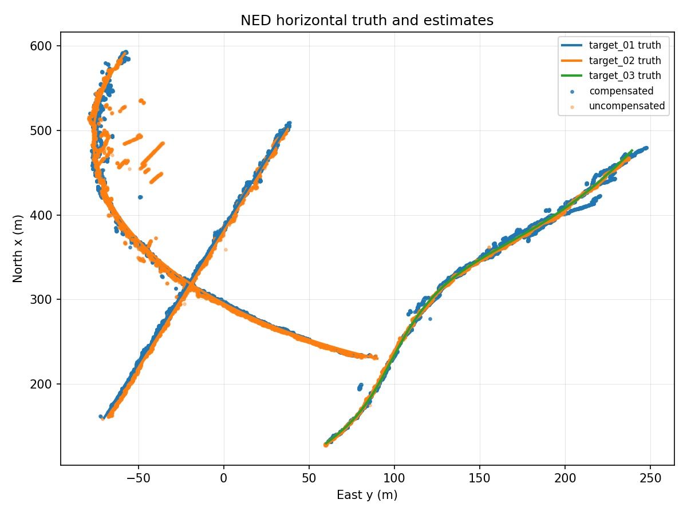
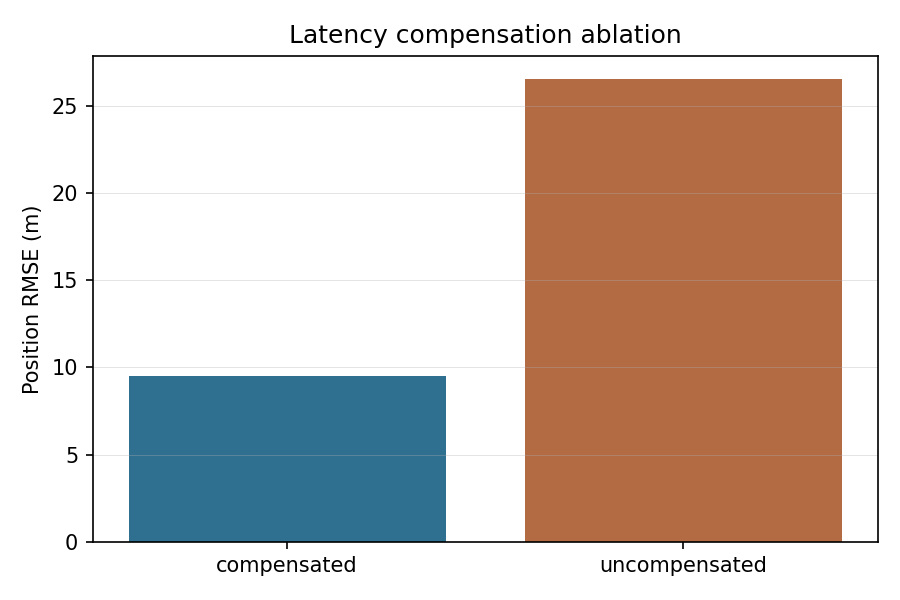

# D1 多传感器融合实验报告

## 1. 实验边界

本报告仅覆盖离线科研仿真中的雷达、声学、光电异构观测融合。模块不包含真实火控参数、毁伤逻辑、实机飞控、硬件驱动、自动处置或绕过人工授权的流程。

## 2. 实验目的

D1 的核心目标是把不同时间基准、不同坐标系和不同误差模型的观测统一为带协方差的 `GlobalTrack`。本轮重点验证：

- `measurement_timestamp` 与 `arrival_timestamp` 分离后，延迟观测能否按测量时刻回放更新。
- 雷达随距离变化的协方差、声学粗方位、EO 像素观测能否进入统一航迹质量分级。
- `coarse/stable/handover` 分级能否作为后续 D2/D3/D5 的输入质量门控依据。

## 3. 场景配置

| 项目 | 设置 |
|---|---:|
| 目标数 | 3 |
| 仿真时长 | 60.0 s |
| 基础步长 | 0.10 s |
| 随机种子 | 7 |
| 传感器 | 延迟雷达、声学方位、EO 像素框 |
| 滤波器 | NumPy EKF + 固定滞后 measurement-time replay |

## 4. 指标结果

| 指标 | 数值 |
|---|---:|
| 延迟补偿后 RMSE | 9.496 m |
| 不补偿 RMSE | 26.522 m |
| 延迟补偿后航迹连续性 | 0.991 |
| 不补偿航迹连续性 | 0.991 |
| 延迟补偿后分级准确率 | 0.927 |
| 不补偿分级准确率 | 0.847 |
| 观测总数 | 3069 |
| 雷达平均延迟 | 1.267 s |

## 5. 图表与曲线

### 5.1 XY 航迹融合效果

图中展示目标真值、传感器观测和融合航迹在 XY 平面的相对关系。融合航迹在延迟观测回放后能维持连续曲线，适合作为 D2 数据关联和 D3 目标分配输入。

### 5.2 延迟补偿消融曲线

曲线对比了“按测量时刻更新并回放”和“按到达时刻直接更新”的误差差异。延迟补偿显著降低 RMSE，说明在雷达扫描周期和通信延迟存在时，不能把到达时刻当作真实测量时刻。

## 6. 结论

延迟补偿是 D1 的必要机制。当前实现已强制观测携带时间戳和合法 `frame_id`，并在输出航迹 metadata 中标记 `frame_id="ned"`、`valid_at` 和 `published_at`。后续接入 D2/D3/D5 时，应继续使用协方差和分级状态做准入门控，不应把单次传感器位置当作真值。
