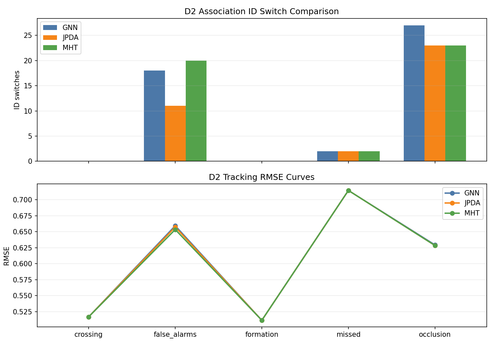
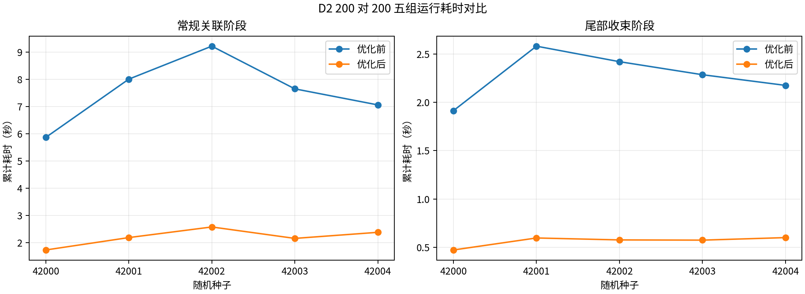

# D2 多目标跟踪与数据关联实验报告

## 2026-07-23 身份证据承诺 v2 模块验证

本节记录身份承诺 v2 的模块验证阶段。该阶段修复结构歧义 hold/hard-cap 释放后，航迹
仍携带旧 source observation 并触发 `source_observation_outside_lineage_window` 的
合同缺口；当时没有启动 AirSim，也没有复跑 200v200 seed 1100。输入均为 D2-owned
确定性 DTO 和六维质点观测。后续 clean A/B 结果见第 32 节。

实现新增三态承诺：

```text
committed
  -> identity_uncommitted_ambiguity_hold
  -> identity_uncommitted_after_hold
  -> committed
```

租约到期后，航迹继续保持 `identity_uncommitted_after_hold`。重复观测、超龄观测、旧
generation、仅预测和显式已知假警不能恢复。只有通过新鲜性检查且实际被匹配或用于合法
建轨的新原始观测恢复 `committed`。本次加固后，D2 还保存歧义候选 key 阻断集合和最大
component measurement timestamp。reservation 删除不清理这两项状态。恢复必须使用未
出现过的新 key，source timestamp 严格晚于水位线，claim 是本扫描首次接纳且 replay
count 为 0，活动 lease 为 0，处置为 truth-free `target_candidate`。

恢复判定在量测更新前执行。被阻断的匹配不更新航迹、不增加 hit、不绑定 claim，也不进入
`detection_to_track`。公开未提交 payload 只给出 blocker count、水位线和 overflow，不
输出候选 key 或 source observation binding。默认容量为每航迹 2048 个 key、全局
250000 个；溢出保持 fail-closed。

专项验证覆盖：

- 活动 hold 时 prediction-only 和 `identity_uncommitted_ambiguity_hold`；
- soft deadline 到期后仍为 `identity_uncommitted_after_hold`；
- reservation 释放后再次送入同一旧候选 key，freshness 可接纳但身份恢复被阻断；
- 不同 key 的 source timestamp 未严格晚于水位线时仍阻断，严格更晚的新 key 才恢复；
- source timestamp 晚于当前扫描时刻时按未来证据阻断；
- 阻断集合容量溢出后保持 fail-closed；
- 重复、超龄和 `known_false_alarm` 证据不恢复；
- `known_false_alarm/unknown` 不能构造 committed DTO，在线处置不读取离线 truth
  sidecar；
- 新鲜原始证据恢复并记录 measurement/arrival timestamp 与 evidence generation；
- 无 hold 的正常路径保持 `committed`；
- 37 目标输入按实际集合长度输出 37 条承诺记录；
- v1 evidence round-trip 不变，v1 拒绝 v2 字段；
- v2 未提交帧不绑定候选真值，严格指标仍可用；
- committed 锚点跨一个未提交空窗从 `GT3D-000001` 变为
  `GT3D-000002` 时，IDSW 记 1，coverage 为 `2/3`。

当前完整 D2 回归结果为 `291 passed, 1 warning in 29.05s`，验收阈值为零失败。warning
来自本机 Matplotlib `Axes3D` 多版本环境，不影响本专项。

本批结论只适用于 D2 模块合同。main 原子持久化、D6 汇总和 clean seed 1100 已在后续
提交 `909669b` 执行，但候选仍未通过系统级 P1 晋级门槛。

### 发布新鲜度补充验证

clean seed 1100 的旧候选允许三条晚于水位线的雷达证据恢复，但这些证据到评分帧时年龄
为 `0.930815 s`，超过固定 `0.9 s` 谱系窗口。D2 随后把恢复配置升级为
`d2.identity-commitment-recovery-config.v2`，默认增加同一 `0.9 s` 发布新鲜度门控。

专项使用确定性六维质点夹具，无随机 seed、未启动 AirSim。测试构造一个水位线
`0.1 s`、原始证据时刻 `0.11 s`、tracker frame `1.05 s` 的恢复样例。证据虽然晚于
水位线，但发布年龄为 `0.94 s`，结果保持
`identity_uncommitted_after_hold`，阻断原因为
`source_observation_outside_recovery_publication_freshness_window`。下一帧使用原始
时刻 `0.2 s`、tracker frame `1.06 s` 的新 key，发布年龄 `0.86 s`，恢复为 committed。

专项文件共 `32 passed`。测试还确认 same/older timestamp、同 key replay 和未来来源
时刻继续阻断；无 hold 正常路径不受恢复预算影响；Detection 状态时刻与 tracker frame
不一致时整帧拒绝；显式兼容关闭可复现旧行为。完整模块为
`291 passed, 1 warning in 29.05s`，零失败门槛通过。

本节在当时没有复跑 clean seed 1100，因此只形成模块合同结论。main 后续复跑结果见
第 33 节：strict 指标恢复可用，在线真值使用和未提交绑定违规均为 0，但 D2/D3 数量及
两项 continuity 退化，候选仍未通过算法准入。

## 2026-07-23 结构歧义保持单 seed 集成门槛

main 在固定提交 `9cd2a79` 上完成 nominal 200v200、seed 1100、2.2 s、
`recon_count=2` 的 baseline/candidate 对照。candidate 仅显式启用
`--d1-d2-structural-ambiguity-hold`，默认配置未改变。该试验属于三维质点全栈集成，
不是 AirSim 或实飞。

| 指标 | baseline | hold candidate | 判定 |
|---|---:|---:|---|
| D1 evidence received/consumed | 未启用 | 46/46 | 候选接线实际生效 |
| D2 消费周期 | 未启用 | 7 | 7 个周期处理侧车 |
| accepted component event | 未启用 | 33 | 合法分量进入租约 |
| prevented hit/miss/birth | 未启用 | 69/69/4 | prediction-only hold 实际执行 |
| D2 终态航迹数 | 203 | 201 | 候选减少 2 条 |
| D3 分配数 | 200 | 197 | 候选减少 3 条 |
| available mapping | 1566 | 1492 | 候选减少 74 条 |
| unavailable mapping | 230 | 294 | 候选增加 64 条 |
| IDSW | 9 | unavailable | 候选不能作数值比较 |
| track/identity continuity | 0.865 | unavailable | 候选不能作数值比较 |
| coverage continuity | 0.870 | unavailable | 候选不能作数值比较 |
| RTF | 0.2245 | 0.2112 | 候选未形成运行收益 |
| online truth use | 本次指令未单列 | 0 | 候选在线真值隔离保持 |

候选身份指标不可用的直接原因是
`source_observation_outside_lineage_window`。该原因不能直接归结为当前 `0.9 s`
lineage window 太小，因为航迹也可能在较长时间内依赖旧观测。候选 IDSW 或
continuity 不能记为零，也不能从本批判断身份连续性变好或变坏。另一方面，D2 航迹、
D3 分配和 mapping availability 已出现明确退化，因此即使暂不使用身份指标，候选也
没有达到业务可用性不退化门槛。

本候选不晋级，seeds 1101/1102 停止，默认 `enabled=False` 保持。下一轮先定义歧义
保活帧的可评分谱系合同，而不是直接放宽 window。歧义保活帧应标记为
`identity_uncommitted/ambiguity_hold`，与普通 `lineage_missing` 分开；分量、证据和
lease 继续审计，但候选观测不得硬分给 `global_track_id`。该合同冻结后，再根据 evidence
age、soft/hard deadline 和实际评分分母联合校准 window/lease，并定位 4 次 prevented
birth、保持轨释放和映射缺失对航迹及分配的影响。禁止仅放宽 `0.9 s` window 作为准入
修复。完成后先复跑同一 seed 1100；只有指标口径有效、在线 truth use 仍为零、航迹/
分配/映射不退化且联合门槛通过，才继续未见 seed。

## 2026-07-23 结构歧义保持租约模块验证

本批验证 D1/D2 接口、prediction-only 保持不变式和来源绑定更新顺序。未启动 AirSim，
未使用在线 truth。候选配置和 D1 不透明来源适配均默认关闭。本节只记录模块测试；
后续 main 单 seed 集成门槛见上一节。

| 验证项 | 模块结果 | 结论边界 |
|---|---:|---|
| D1 固定摘要向量与三段式 `source_key` | 通过 | D2 字节级镜像 D1 公开规则 |
| D1 v1 `member_states/observations/candidate_edges` payload | 通过 | 原始 observation ID 不进入 D2 |
| 默认关闭 adapter 等价 | 通过 | 默认 Detection 序列化不变 |
| 随机上游本地 ID | 通过 | 只进入摘要，D2 ID 仍为 `GT3D-*` |
| 2x2、3x2、1xN 完整分量 | 通过 | 均可建立有界预留，不写死目标数 |
| 量测/状态有效 `0.40 s`、到达/发布与 D2 消费 `0.65 s` | 接受 | `component_age_seconds=0.25 s`，租约从 `0.65 s` 起算 |
| 状态有效时刻晚于 D2 epoch | 拒绝 | 原因为 `component_from_future`，不建立租约 |
| 分量年龄超过显式上限 | 拒绝 | 原因为 `component_stale_age_exceeded`，不建立租约 |
| 双时间戳与发布时刻序列化 | 不变 | D2 不重写 D1 measurement/state-valid/arrival/published |
| 保持期间 update/hit/miss/birth/rebind | 全部阻断 | 航迹只预测，ID 与身份置信度不变 |
| 协方差半正定与不收缩 | 通过 | 保持期间无重复 posterior 收缩 |
| replay/generation 回退 | 拒绝 | 不刷新软截止 |
| 新原始 evidence | 通过 | 只延长至首次硬上限 |
| 硬上限后递增 generation | 拒绝 | 不允许重置硬截止 |
| publisher epoch 轮换与回退 | 轮换接受、回退拒绝 | 旧 epoch 不延长租约 |
| 来源绑定关联前硬掩码 | 通过 | 错误航迹未先更新，同源 shadow birth 为零 |
| truth key、缺协方差、posterior 已更新 | 拒绝 | 坏侧车不建立或延长租约 |
| D2 完整测试 | `271 passed` | 零失败 |

完整命令为：

```bash
PYTHONPATH=research_modules/d2_data_association \
  pytest -q research_modules/d2_data_association/tests
```

运行时间为 `28.82 s`，另有 1 条环境 warning：Matplotlib `Axes3D` 因本机多版本安装
无法导入。该 warning 不影响 D2 数值、关联或合同测试。

本批只能确认模块内合同和状态不变式。main 后续单 seed 集成门槛已证明候选路径可执行，
但因可用性和分配退化且身份指标 unavailable 而被拒绝，没有提供 IDSW 或 continuity
改善数据。首版自动消歧、component-level JPDA 和 bounded MHT 仍未实现。
`max_component_age_seconds=1.0` 是覆盖当前 main 常见 `0.5 s` D1 scan lateness 和
传输余量的开发默认值，尚未用真实时延分布标定。

## 0. 2026-07-15 M5N2 20-case 补充结果

| 项目 | 结果 | D2 解释 |
|---|---:|---|
| 场景 | baseline 10 seed + candidate 10 seed | 5 资源、2 actor 目标的 SimpleFlight 运行 |
| 完成 case | 20/20 | M5N2 完成后已停止后续多 seed 批次 |
| D2 association timing availability | 3805/3805 | 全部 main-bus tick 可用 |
| D2 association mean/P95/max | 2.521/3.147/98.942 ms | 常态不是总周期主瓶颈，但存在单次长尾 |
| 在线 truth identity/state use | 0/0 | 在线身份边界通过 |
| 在线 IDSW/continuity | unavailable | 无 truth assignment，禁止补零 |
| 第二 primary 进入 5 m | 0/20 | 物理末端结果，不是 D2 身份指标 |
| 最终停止原因 | 20/20 `collision_stop` | 碰撞对象未写盘，不能归因于 D2 |

本批没有形成 D2 专项 offline truth assignment，因此不能从在线日志宣称“IDSW=0”或
“continuity=1”。此前 strict replay 的离线身份结论属于另一套冻结证据，不能混入本批
20 case 的在线统计。D2 只据此确认：在线没有使用真值身份/状态，阶段时延已有真实多
seed 样本，且默认 GNN/Hungarian 与中心 `global_track_id` 所有权保持不变。

candidate 的第二 primary 和 coalition 没有获得物理收益，但当前失败横跨末端视觉、控制
窗口和碰撞诊断，不能由 D2 单独解释。后续 D2 验收仍需单独冻结 offline truth sidecar，
对 duplicate source、teleport、clutter、dropout 和合法新目标进行身份连续性评分。

停止边界：`TERM` 生效前额外完成一个 `png_ttc_2v2_seed001`，该 case 被排除在上述
M5N2 聚合之外；dropout 完成数为 0。

## 1. 实验边界

本报告仅覆盖离线合成数据上的多目标跟踪、航迹生命周期和数据关联算法评估。模块不包含真实火控参数、毁伤逻辑、实机飞控、硬件驱动、自动处置或绕过人工授权的流程。

## 2. 实验目的

D2 的核心任务是维护稳定的 `global_track_id`。本轮实验比较 GNN/Hungarian、JPDA 和 MHT 接口在交叉、编队、遮挡、漏检和虚警条件下的表现，重点关注：

- `id_switch_count`：同一真值目标被不同全局航迹接续的次数。
- `coverage_continuity`：目标存在时是否被任意航迹覆盖。
- `identity_continuity`：目标存在时是否由同一身份连续覆盖。
- `duplicate_assignment_count`：同一帧重复分配或一对多异常。

## 3. 算法配置

详细算法原理、数学模型、参数调节和跨模块接口见 [ALGORITHM_AND_IMPLEMENTATION.md](ALGORITHM_AND_IMPLEMENTATION.md)。本报告只记录当前离线仿真结果和图表解读。

| 算法 | 作用 | 当前定位 |
|---|---|---|
| GNN/Hungarian | 马氏门限 + 一对一硬关联 | 默认工程基线 |
| JPDA | 多假设边缘概率关联 | 交叉/遮挡时的进阶候选 |
| MHT | 有界假设树接口 | 后续完整 MHT 的占位基线 |

## 4. 场景配置

| 场景 | 说明 |
|---|---|
| `crossing` | 两目标中心交叉 |
| `crossing_dense_5v5` | 确定性 dense/crossing 5v5 baseline fixture，用于同场比较 GNN/JPDA/MHT |
| `formation` | 五目标近距编队 |
| `occlusion` | 三目标短时遮挡 |
| `missed` | 四目标随机漏检 |
| `false_alarms` | 四目标叠加虚警杂波 |

运行命令：

```bash
python3 research_modules/d2_data_association/scripts/run_simulation.py --steps 36 --seed 7
```

## 5. 图表与曲线

### 5.1 ID Switch 与 RMSE 对比



上半部分为不同场景下的 ID Switch 柱状图，下半部分为 RMSE 曲线。该图用于判断是否需要从 GNN/Hungarian 升级到 JPDA/MHT：如果遮挡或虚警场景中 IDSW 明显升高，应优先检查门限、协方差和局部特征，再评估软关联算法。

## 6. 结果解读

- `crossing` 与 `formation` 场景主要验证门控和一对一约束是否稳定。
- `occlusion` 是主要失败模式，遮挡后重新出现的目标容易产生身份断裂。
- JPDA 在高歧义场景可能减少 ID Switch，但代价是运行时间更高。
- 当前 MHT 为有界研究接口，不应直接宣称优于 JPDA。

## 7. 结论

D2 兼容默认路线是 `GNN/Hungarian + 二维常速度 Kalman fallback`；另有显式选择的六维稀疏规则路径，不自动替换旧 replay。候选门内观测数量升高、目标轨迹交叉或 `identity_continuity` 快速下降时，JPDA/MHT 仍只做离线对照；IMM/EKF/UKF、Stone Soup 和 FilterPy 仍是 optional benchmark。D2 输出的 `global_track_id` 是后续 D3 分配、D4 主动降级证据、D5 终端配准和 D6 指标评估的核心键，不能由下游模块改写。D2/D6 必须保留显式 `id_switch_count`。

## 8. 2026-07-14 Truthless 与 Lifecycle 回归

本批是接口和指标语义回归，不是新的 AirSim 参数实验。验证场景为 8 类拒绝输入、main owner 四布尔状态正例、3 帧与 5 帧无 truth replay、7 帧 birth/lost/rebirth/drop 状态序列；seed 不适用。验收阈值为 owner 状态正例通过、在线身份/offline payload 100% 在状态变更前拒绝、truthless IDSW/continuity/RMSE 100% 输出 `None + unavailable reason`、truth 可用零 IDSW 保持 available `0`、完整模块零失败。

2026-07-14 结果为 `98 passed, 1 warning`；warning 是环境中的 Matplotlib `Axes3D` 多版本导入问题。truth-free lifecycle summary 成功导出 birth/lost/drop/rebirth 计数和 transitions。本结果只关闭 P0 truth policy、owner 状态兼容与伪零边界，不构成 lost/drop/gate 参数收益证据；真实 `T001 -> T005` 生命周期调参仍为 P1。

## 9. 2026-07-14 真实 AirSim `T008` 根因审计与模块回归

修复前样本为 M5N2 baseline seed 1，共 351 帧，真实目标数 2。31.3 秒 D1 首次输出
第三条航迹；该航迹和原第二航迹都位于第二个离线真实目标附近，D2 因一对一硬关联
选择其中一个，并为另一个创建 `T003`。31.8 秒起原 D1 来源发生不符合运动学的状态
跳变，D2 继续产生 `T004...T008`。到 34.4 秒统计为 birth 8、drop 4，34.5 秒 D3 已
对 `T008` 形成分配。这解释了额外计划版本、pair churn 和离线物理配对不可用。

修复后算法测试不使用离线真值：四帧输入包含两条正常来源、一个同门限影子来源和
一个已绑定来源 teleport。验收条件是规范航迹数始终为 2、影子不 birth、teleport
被隔离、新来源可在几何允许时加入既有规范航迹来源集合。专项测试通过，完整回归为
`99 passed, 1 warning`。

离线 truth 只用于事后定位，不进入 D2 在线代价、门限、绑定或建轨逻辑。修复后同
seed 结果见下一节；2026-07-15 的 20-case 后续普通 M5N2 已完成，但显式来源扰动和
该批 offline identity 评分仍开放。

## 10. 2026-07-14 Post-batch M5N2 同 seed 复验

### 10.1 场景和验收

| 项目 | baseline | candidate |
| --- | ---: | ---: |
| AirSim 模式 | Blocks / real AirSim | Blocks / real AirSim |
| 场景 | M5N2 | M5N2 |
| seed | 1 | 1 |
| 帧数 | 142 | 141 |
| 在线活动航迹帧 | 140 | 139 |
| 最大 canonical track 数 | 2 | 2 |
| birth/lost/drop/rebirth | `2/0/0/0` | `2/0/0/0` |
| `T008` | 0 | 0 |

两组在线 track record 都只有 `T001/T002`。baseline 每条 ID 各 140 条记录，candidate
各 139 条；状态依次为一次 tentative、一次 confirmed，之后保持 engageable。来源绑定
全程收敛为 `global_track_001 -> T001`、`global_track_002 -> T002`。

### 10.2 在线与离线指标口径

在线关联不含 truth，故两组 `id_switch_count`、`track_continuity` 都是 `None`，并带
`truth_assignment_unavailable`。这表示不可观测，不表示零。

写盘后的 `offline_truth_labels.jsonl` 分别有 284/282 条记录。现有 D2 governed replay
评分得到两组 IDSW 0、identity continuity 1.0、coverage continuity 1.0、false track 0、
truth isolation violation 0。对 main 实际 track records 直接做 evaluator-only 位置
匈牙利裁决，baseline/candidate 仍均为 IDSW 0，continuity 分别为
0.985915/0.985816；缺失比例恰好对应启动前 2 帧，混淆关系始终一一对应。

### 10.3 结论与限制

同 seed 修复后的 `T008` 航迹膨胀未复发，D2-owned 代码未发现新断点，因此没有调整
GNN/Hungarian、门限或生命周期参数。两组平稳 episode 的 suppression、quarantine、
source conflict 都为 0，只证明来源治理没有误触发；teleport 抑制仍由匿名专项回归
验证。D2 P1 不能据单 seed 关闭。2026-07-15 的后续 20-case 已满足普通运行数量，
但没有显式覆盖重复来源、teleport、dropout、clutter 和合法新目标 birth，也没有输出
该批 D2 offline IDSW/continuity；后续应做专项受治理 replay，而不是继续堆叠同类 seed。

## 11. 2026-07-15 Ceiling-aware 准入回归

### 11.1 问题与算法

旧准入要求候选 continuity 绝对提高 `0.10`。当基线为 `0.9810` 时，理论最大提升仅
`0.0190`，因此该条件不可达。新策略版本
`d2-p1-identity-admission/ceiling-aware-error-reduction-v1` 定义：

- `H=max(0,1-C_b)`：基线到理论上限 1.0 的剩余误差空间；
- `Delta=C_c-C_b`：候选实际提升；
- `Delta_req=min(0.10,0.10H)`：至少消除 10% 基线剩余身份错误；
- `Delta/H`：headroom/error reduction fraction；`H=0` 时要求候选合法且不退化。

IDSW 至少改善 30%、false-track 最多增长 10%、P95 不超过冻结预算、在线 truth
leakage 为 0 等联合门限保持。所有指标必须 available、有限且在合法范围内；基线
IDSW 为 0 时不能构造“改善比例”，因此 fail-closed。报告逐 gate 输出原因，v1
`+0.10` 只作为弃用审计字段。

### 11.2 单元与完整回归

| 项目 | 验收 | 结果 |
| --- | --- | --- |
| `0.981 -> 0.984` | 不再被固定 `+0.10` 机械拒绝 | continuity gate 通过 |
| 理论上限 | `C_b + Delta_req <= 1.0` | `0/0.5/0.981/0.999999/1.0` 边界通过 |
| 完美基线 | 候选不得退化或越界 | `1.0 -> 1.0` 通过，退化/`>1` 拒绝 |
| 缺指标 | IDSW/continuity/false-track/latency/leakage 均 fail-closed | 通过 |
| 联合门限 | 零 IDSW 基线、false-track 超限、超时、truth leakage 拒绝 | 通过 |
| 单项 IDSW | 不得自动产生 promotion review | 通过 |
| 默认路径 | `default_online_path_changed=false` | 通过 |
| D2 完整测试 | 零失败 | `113 passed, 1 warning` |

验证日期为 2026-07-15，测试数据是模块单元 fixture，未启动或重新运行 AirSim。
warning 为本机 Matplotlib `Axes3D` 多版本导入问题，不影响准入逻辑。

### 11.3 历史真实数据重新解释

该节记录的是完整冻结重算前的中间判断，现已被下一节的 2026-07-15 六档 v2 完整
证据取代。默认在线 GNN/Hungarian 始终没有自动改变。

## 12. 2026-07-15 六档冻结真实 Replay v2 完整证据

### 12.1 输入与执行

本批没有启动 AirSim，而是消费 main 已冻结的真实 AirSim replay/truth：screening 为
六档各 10 seeds，共 60 case；confirmation 为六档各 20 seeds，共 120 case；P95
预算 0.1 秒。完整 runner 耗时 `2501.32 s`，退出码 0。输出为：

`outputs/p1_identity_ceiling_aware_v2_20260715/d2_identity_calibration_v2.json`

报告 schema 为 `d2-p1-identity-calibration/v2`，policy 为
`d2-p1-identity-admission/ceiling-aware-error-reduction-v1`。screening 和
confirmation 均 available；阶段内 input digest 唯一；全部在线 truth leakage 为 0。

### 12.2 总体结果

| 指标 | Baseline GNN | Candidate GNN | JPDA research |
| --- | ---: | ---: | ---: |
| 平均 IDSW | 1.358333 | 0.616667 | 74.375000 |
| Identity continuity | 0.981046 | 0.983954 | 0.690999 |
| False track | 0 | 0 | 0 |
| P95 loop latency | 12.917 ms | 15.470 ms | 52.655 ms |
| Online truth leakage | 0 | 0 | 0 |

候选 IDSW 下降 `54.6012%`。continuity 的 headroom 为 `0.018954`，所需提升
`0.001895`，实际提升 `0.002908`，error reduction `15.3448%`。候选的 IDSW、
continuity、false-track、P95 和 truth isolation 五项总体 gate 全部通过。

因此：

- `promotion_recommended=true`；
- `promotion_candidates=[gnn-g5.99-qa1-ld3_7-mw0.5x]`；
- `selected_online_path=baseline_gnn_hungarian`；
- `default_online_path_changed=false`。

该结果是晋级评审建议，不是 runner 自动改默认参数。轻量 JPDA 的 IDSW 和 continuity
gate 失败，不是主线候选。

### 12.3 分档结果与限制

clutter 和 combined 的候选五项 gate 全部通过。nominal、tight_crossing、dropout 和
delayed_noisy 的 baseline IDSW 均为 0，候选也为 0；continuity 保持 1.0、不退化，
但无法证明 IDSW “至少下降 30%”，故 reason 为
`baseline_zero_no_measurable_reduction_evidence`，完整分档 gate fail-closed。

dropout 的 offline truth alignment 为 partial：confirmation 20 个 case 共 440 个
unmatched evaluator sample。未做最近邻补齐，online truth leakage 仍为 0。

完整中文审计和图表见：

- `outputs/p1_identity_ceiling_aware_v2_20260715/D2_P1_IDENTITY_CEILING_AWARE_V2_REPORT_CN.md`；
- `outputs/p1_identity_ceiling_aware_v2_20260715/d2_identity_calibration_v2_comparison.png`。

## 13. 2026-07-16 来源身份治理指标专项

### 13.1 目的与方法

本专项验证 D5 人工视频支线暴露的“tracker success 仍可能伴随本地身份塌缩”能够以
审计计数进入 D2，而不把像素/local ID 变成 D2 观测或规范身份。D2 继续使用现有
GNN/Hungarian、Mahalanobis gate 和 source-lineage governance。

样本包括：连续 namespaced source、同一来源集合跨两个 canonical track 的 binding
conflict、绑定来源统计大跳 quarantine、零 detection 的 upstream rejection、5 类非法
frame metadata，以及缺 metadata 的 legacy 帧。replay 使用 synthetic seed 7/8，
每个 3 帧；本批没有启动 AirSim Blocks，也没有使用 actor/truth ID 或原始像素。

### 13.2 结果

| 指标 | Seed 7 | Seed 8 | 多 seed 均值 |
| --- | ---: | ---: | ---: |
| `source_binding_conflict_count` | 1 | 1 | 1.0 |
| `source_lineage_quarantine_count` | 1 | 1 | 1.0 |
| `upstream_local_identity_rejection_count` | 2 | 4 | 3.0 |

连续同一 source 的冲突/隔离均为 0；legacy 无 metadata 的三项均为 0。零 detection
upstream rejection 只增加审计数，track 数和 birth 数保持 0。负数、布尔、浮点、
字符串和 `None` 均在 tracker 状态变化前被拒绝。

全量 D2 结果为 `123 passed, 1 warning`，验收阈值为零失败、表中计数精确一致、非法
输入零状态副作用。warning 为本机 Matplotlib `Axes3D` 多版本导入，不影响指标。

### 13.3 结论与限制

三项已进入 metrics summary、逐帧/episode risk summary、replay threshold sensitivity
逐 seed 行、多 seed group 以及 dense/long/P1 calibration 聚合；`id_switch_count` 仍显式
保留。本轮没有改变默认关联器、门限、source weight、lifecycle 或 risk classification。

该专项证明的是接口、计数与 fail-closed 行为，不是实际 AirSim 场景的统计性能。至少
10 个真实 duplicate-source/teleport/dropout/clutter/合法新目标 case 的 recall、false
suppression、offline IDSW/continuity 和置信区间仍不可用，继续作为 P1 验收限制。

## 14. 2026-07-20 六维稀疏规模实验

### 14.1 场景与验收

本批是 D2-owned 合成规则测试，不启动 AirSim。状态采用
`[pN,pE,pD,vN,vE,vD]`，目标位于 100 m 间隔三维网格并作匀速运动；位置 covariance
为单位阵，速度提示 covariance 为 `0.25 I`。规模依次为 5、20、50、100、200。

验收条件：

- 第二帧匹配数等于输入目标数，state/covariance 维度为 6/6x6；
- gate 的 innovation dimension 为 3，Down 轴统计不一致会被拒绝；
- 候选图不分配全局 cost/distance matrix，candidate/component 数显式可审计；
- crossing、连续两帧漏检和 15 个匿名虚警不造成离线 ID switch；
- 在线对象无 truth 字段，上游 `global_track_id` 不成为 D2 canonical ID；
- track history 和 frame log 不超过配置上限；完整 D2 测试零失败。

### 14.2 结果

| 目标数 | 候选边 | 潜在全对 | 分量矩阵元素 | 裁剪率 |
| ---: | ---: | ---: | ---: | ---: |
| 5 | 5 | 25 | 5 | 80.0% |
| 20 | 20 | 400 | 20 | 95.0% |
| 50 | 50 | 2,500 | 50 | 98.0% |
| 100 | 100 | 10,000 | 100 | 99.0% |
| 200 | 200 | 40,000 | 200 | 99.5% |

原六维专项 13 个测试通过；增加 3 个速度稳定性专项后，完整命令结果为
`139 passed, 1 warning`，验收阈值零失败。
warning 是环境 Matplotlib `Axes3D` 导入，不影响本批三维数值代码。

200 目标另做 3 个独立 trial，每个 trial 预热 1 帧后连续测量 30 帧。90 个测量帧的
候选边始终为 200，最大单分量矩阵元素为 1；下表为 90 帧聚合值：

| 阶段 | Mean | P50 | P95 | Max |
| --- | ---: | ---: | ---: | ---: |
| 稀疏关联 | 6.683 ms | 6.306 ms | 7.056 ms | 22.471 ms |
| Tracker step | 25.491 ms | 25.016 ms | 26.797 ms | 41.613 ms |

crossing 用例在同位置时形成 4 条候选边，通过门内速度一致性打破平局，离线
`id_switch_count=0`、continuity 1.0；漏检用例 20 目标中 1 个目标连续缺失两帧，重获后
IDSW 0，identity/coverage continuity 均为 0.98；虚警用例 50 个真目标叠加 15 个无标签
虚警，真目标 IDSW 0、continuity 1.0，15 个虚警 assignment 只在离线 evaluator 计数。

### 14.3 证据限制

上述性能只来自当前主机、单进程、一个确定性网格和 3 x 30 个测量帧，尾值包含系统
调度抖动；它不是多 seed 置信区间、实时 SLA、AirSim 或 200v200 全链路结果。KD-tree
避免无条件全对扩张，但极端全重叠目标
仍会形成大连通分量；候选预算、分区与召回率需要联合标定。main-owned scalable
point-mass bus 已有只读运行诊断，但该阶段修复后的跨模块复跑和多 seed 验收尚未完成；
后续第 18 节已实现有界 whole-scan OOSM adapter。六维 JPDA/MHT、OOSM 状态回溯/平滑
和高机动滤波仍未实现。

## 15. 2026-07-20 六维速度状态稳定性实验

### 15.1 问题与实现前证据

main 在不向 D2 暴露 truth/actor/object ID 的只读诊断中运行 50v50、seed 17、2.2 s、
radar-only。D1 与旧 D2 的帧末分布为：

| 指标 | D1 输入 | 旧 D2 输出 |
| --- | ---: | ---: |
| 速度 P50 | 6.28 m/s | 8.89 m/s |
| 速度 P90 | 12.16 m/s | 17.43 m/s |
| 速度 max | 21.03 m/s | 27.49 m/s |
| Pvv trace P50 | 101.24 | 62.95 |
| Pvv trace P90 | 110.31 | 69.37 |
| Pvv trace max | 112.32 | 70.86 |

速度均值放大的同时 covariance 反而收缩，说明不是单纯保守预测。代码审计确认旧 D1
adapter 只传位置和速度 marginal，丢弃完整 6x6 的 position-velocity cross block；旧
tracker 出生时复制一次 D1 速度，后续只把每帧 D1 posterior 当作独立位置量测。CV 预测
生成的 Ppv 令位置 random-walk residual 持续修正速度，Joseph update 又把 Pvv 伪收缩。

修复后，D1 source posterior 携带完整 covariance，并使用固定
`correlated_state_ci_track_weight=0.5` 的 6D covariance intersection。速度创新 NIS
超过三自由度 99% 门限时，以 `NIS/gate` 膨胀速度 covariance；关联速度项在相同门限
封顶。3D 位置马氏门控、稀疏候选、中心 ID 和离线 truth 隔离不变，没有按 4.7 m/s、
场景名或速度模长硬裁剪。

### 15.2 50 条多帧噪声验收

测试使用 seed 17、50 条、12 帧、0.2 s 周期，即时间戳 0.0--2.2 s。在线 Detection3D
只有匿名六维 source posterior、timestamp 和 covariance；离线标签只在每帧关联完成后
进入 `Sparse3DOfflineEvaluator`。验收要求输出速度 P50/P90/max 不高于相应输入分位数
的 `1.05/1.05/1.00` 倍，Pvv trace 中位数不少于输入 trace 的 90%，位置 RMSE 不劣于
输入 posterior，活动航迹 50、IDSW 0、continuity 1.0。

| 指标 | 匿名输入 | 旧 D2 复现 | 修复后 D2 |
| --- | ---: | ---: | ---: |
| 速度 P50 | 5.415 m/s | 9.41 m/s | 5.082 m/s |
| 速度 P90 | 7.960 m/s | 14.31 m/s | 6.401 m/s |
| 速度 max | 12.274 m/s | 21.88 m/s | 7.218 m/s |
| Pvv trace | 102 | 62.76 | 101.181 |
| 最终位置 RMSE | 52.634 m | 未作为旧门限 | 48.364 m |
| 离线 IDSW / continuity | evaluator-only | 0 / 1.0 | 0 / 1.0 |

全部门限通过。该结果证明当前固定输入下 D2 不再把位置 residual 解释成过大的高置信
速度，不表示输出速度已接近某个场景真值或 CI 参数已最优。

### 15.3 交叉和 200 条批量验收

seed 29 双目标交叉运行 21 帧、0.2 s 周期，在交叉帧向一条六维 posterior 注入一次
速度离群值。交叉帧仍有 4 条三维位置门内候选；update velocity NIS gate 和有限速度
tie-break 均触发，最终活动航迹 2、IDSW 0、continuity 1.0。速度离群值没有被当作位置
拒配依据，也没有创建新 canonical ID。

seed 41 的 200 条批量回归运行 10 帧、0.2 s 周期：

| 指标 | 结果 |
| --- | ---: |
| 每更新帧 candidate / dense pair | 200 / 40,000 |
| component matrix pair | 200 |
| 活动航迹 | 200 |
| 输入 / 输出速度 P90 | 8.097 / 5.980 m/s |
| 输入 / 输出 Pvv trace 中位数 | 75 / 69.685 |
| 离线 IDSW / continuity | 0 / 1.0 |

这同时通过速度稳定性、位置/身份连续性和稀疏规模验收，没有按目标数量建立固定 shape。

### 15.4 回归与证据限制

执行命令为：

```bash
PYTHONPATH=research_modules/d2_data_association \
pytest -q research_modules/d2_data_association/tests
```

结果 `139 passed, 1 warning in 27.49s`；warning 是本机 Matplotlib `Axes3D` 多版本导入
提示，不影响六维数值测试。相关 Python 入口 `py_compile` 通过。

固定 CI track weight `0.5` 只是本轮一致性基线，尚无多 seed 最优性证据。当前专项只
检查速度 NIS gate 是否按模型冲突触发，没有形成按距离、covariance、量测频率分组的
六维 NIS coverage；离线标签只用于身份和位置验收，没有形成六维 NEES coverage。
至少 20 个未见 seed 的 CI weight sweep、持续加速度/协调转弯/漏检、不同交叉 covariance
结构以及 main 修复后 50v50/200v200 与 D3 reachability 复跑仍未完成。上述合成数据不是
AirSim、实时 SLA 或端到端物理拦截证据。

## 16. Scalable 3D 离线身份合同回归（2026-07-20）

### 16.1 目的与场景

本批只验证 evaluator 合同，不比较关联参数性能。23 个专项覆盖：稳定 identity、真实
ID switch、一个 truth 对多 track、一个 track 对多 truth、缺 lineage、同帧重复
lineage、跨 track 冲突、显式/未标记 replay、冲突 truth label、标签文件篡改、label/ref
timestamp 不一致、未来/超窗 observation、dropped 后 canonical ID 复用、无 truth、在线
truth 字段泄漏、未知 record sequence、schema 拒绝、artifact round-trip、非六维 source
track、非 D2-owned ID、在线 IDSW 伪零、矛盾 availability，以及 37 目标两帧输入规模。

### 16.2 验收结果

| 验收项 | 结果 |
| --- | --- |
| 稳定 identity | IDSW 0，track/identity/coverage continuity 1.0 |
| 真实换轨 | IDSW 1，identity continuity 0.5 |
| 一个 truth / 两条有效 track | duplicate 1，mapping 均 available |
| 一条 track / 两个 truth | ambiguous，全部 identity values `None` |
| 缺失、冲突、时间/lifecycle 不一致 | unavailable/ambiguous 且带原因，不填 0 |
| 显式 replay generation | 去重审计 1 次，稳定 mapping available |
| truth 文件篡改、在线 actor identity、未知 sequence | evaluator 入口 fail closed |
| 非六维 source、非 D2-owned ID、在线 IDSW 伪零 | evaluator 入口 fail closed |
| public IDSW availability 与值/reason 矛盾 | artifact loader fail closed |
| 动态规模 | 37 目标 x 2 帧共 74 mappings，无 2/5 固定维度 |

专项命令结果为 `23 passed in 0.71s`。完整命令：

```bash
PYTHONPATH=research_modules/d2_data_association \
pytest -q research_modules/d2_data_association/tests
```

结果 `162 passed, 1 warning in 30.63s`；warning 为本机 Matplotlib `Axes3D` 环境问题，
不影响 evaluator。相关 Python 入口 `py_compile` 通过。

### 16.3 证据限制

本批输入是确定性 DTO/文件 fixture，没有启动 AirSim、没有 point-mass episode、没有
正式 seed，也没有修改在线算法。因此它只关闭 schema、hash、lineage mapping、指标
availability 和 main/D6 公共 artifact 的 D2-owned 合同缺口；不能声明 scalable 3D
IDSW 性能、多 seed continuity、门限收益或实时性。main producer 当前会跳过无 lineage
的 D2 track/frame，尚不满足完整 evidence 集合合同；修正后仍需使用独立 sidecar 生成
正式 episode artifact。

## 17. active-risk seed 1005 陈旧观测重放治理（2026-07-22）

### 17.1 现象与根因

专项使用 scalable 3D 质点场景 `active_risk`、seed 1005、5 个目标和 2.2 s 短时回放。
旧路径在 `t=0.247 s` 建立 5 条 tentative 航迹；`t=0.439 s` 时原 GT4 未匹配，D1 的
第 4 条后验触发 GT6。此后 GT4 持续接收新的雷达观测，GT6 却反复携带同一个
`latest_observation_id=radar-s000002-d0003`。GT6 的状态有效时刻随帧更新，但底层量测
谱系没有变化。旧 D2 将每帧包装出的新 detection ID 计为新命中，因而把陈旧后验确认成
第二条全局航迹。

GT4 与 GT6 相距约 1.5--1.6 km。二者不满足合理的统计近距合并条件。本次治理在关联前
使用传感器命名空间与不透明 `latest_observation_id` 组成在线证据键。同一证据只能贡献
一次关联和一次命中；重复证据进入 quarantine，不参与 KD-tree、Hungarian、状态更新或
确认计数。证据键不解析目标序号，也不读取仿真 truth、actor ID 或 object name。

### 17.2 生命周期与重复合并边界

tentative 航迹首次缺少新证据时保留，连续第二次缺少新证据时删除。该规则允许 GT4 在
短时漏配后被新的雷达观测重获，同时使只依靠陈旧后验维持的 GT6 退出。重复航迹合并仅在
共享在线观测谱系或带命名空间的 source-track 谱系、且位置和速度三维马氏门同时通过时
启用；同帧双方都有新证据时禁止合并。survivor 按航迹成熟度、创建时间、命中数、漏失数
和 ID 顺序确定，保留原 `global_track_id`。本 seed 没有触发合并，GT6 通过 tentative
生命周期删除。

### 17.3 结果

| 项目 | 结果 |
| --- | --- |
| 10 个 D2 发布帧的活动航迹数 | `5, 6, 6, 5, 5, 5, 5, 5, 5, 5` |
| 最终活动航迹 | `GT3D-000001` 至 `GT3D-000005` |
| replay quarantine | 9 次 |
| tentative stale drop | 1 次 |
| duplicate coalescence | 0 次 |
| 在线 truth 使用 | 0 次 |
| 专项回归 | 6 个通过 |
| D2 完整回归 | `168 passed, 1 warning in 26.15s` |

warning 是既有 Matplotlib `Axes3D` 环境提示，不影响关联结果。在线
`id_switch_count` 继续显式输出 `None + unavailable`，没有用缺失 truth 伪造零值。

### 17.4 限制

本批关闭的是 seed 1005 暴露出的 D2-owned 陈旧观测重复确认缺口。证据来自一个质点
seed，不是 AirSim、200 对 200 或物理拦截结论。该初版在当时仍按 episode 保存 claim
且不淘汰；该限制已由第 18 节的有界 ledger、离线误抑制基准和整帧 OOSM adapter 后续
关闭。真实 AirSim 与 200v200 多 seed 证据仍开放。

### 17.5 development 20-seed 集成复跑

main 于 2026-07-22 在脏工作树运行 `/tmp/msm_active_risk_d2_fix_20260722/`。场景为
active-risk seeds 1000--1019，共 20 对隔离的 control/treatment 质点 episode，每个
episode 1.0 s。该批用于检查修复后的运行时证据链，不是 clean formal benchmark。

| 验收项 | 结果 |
| --- | --- |
| plan consumption availability | 20/20 |
| guidance lineage availability | 20/20 |
| physical window availability | 20/20 |
| D4 degraded adoption availability | 20/20 |
| paired physical effect availability | 20/20 |
| paired non-degradation availability | 20/20 |
| degraded paired comparison availability | 20/20 |
| D4 adoption | control 94 + treatment 94 = 188/188 |
| 控制命令 | control 1960，treatment 1960，held 0 |
| seed 1005 离线身份 | GT1-GT5 五条 `unique_lineage_verified` |
| 在线 truth / global ID 改写 | 0 / 0 |

总线已持久化 `d2-observation-evidence-governance-v1`，包含 fresh/replay、timestamp
conflict、coalescence、suppressed births 和 tentative stale drop 的逐帧/累计字段。D6
报告的 control/treatment 平均最近距离相同，物理差值为 0；paired non-degradation 为
20/20。counterfactual 和 causal availability 均为 0/20，production runtime ACK 未评估。
因此该批只证明开发期接线、可用性和非退化记录完整，不证明因果收益或生产运行能力。

main 同批回归记录 D2 `168 passed, 1 warning`、scalable `110 passed`，其余 D1、D3-D7
也全部通过。该 development 结果随后由 clean-tree 运行取代，不能单独作为正式来源。

### 17.6 clean-tree 20-seed 复跑

提交 `0fa7c00c3514c4fa87a17953ab66fdfb73489b0b` 的输出 manifest 记录
`repository_dirty=false`、`dirty_source_episode_count=0` 和统一源提交。active-risk
seeds 1000--1019 共 20 个 pair；D4 adoption 188/188，control/treatment 各 1960 条命令，
离线唯一身份映射合计 100，seed 1005 为 GT1-GT5 五条唯一映射。物理窗、D4 adoption、
paired physical effect 和 paired non-degradation 均为 20/20 可用。

两臂在 1 s 计划有效窗内的 5 m 拦截成功均为 0。counterfactual、causal 和 production
runtime ACK 不可用。该批证明提交与输入来源可复现，未证明物理拦截效果或主动降级收益。

## 18. 长 episode 声明和 OOSM 模块测试（2026-07-22）

本轮不启动 AirSim，不运行随机 seed。新增 15 个确定性测试，完整 D2 为
`183 passed, 1 warning in 29.08s`；warning 是既有 Matplotlib `Axes3D` 环境提示。

| 验收项 | 输入 | 结果 |
| --- | --- | --- |
| 小规模长期循环 | 5 目标 x 500 帧，max-count=30 | peak/current <=30，overflow 0，evicted >0 |
| 中规模长期循环 | 40 目标 x 200 帧，max-count=240 | peak/current <=240，overflow 0，evicted >0 |
| 近邻离线基准 | 3 目标，16 帧，0.75 m | 43 条合法检测，误抑制 0，recall 1.0，错误合并 0 |
| 动态 N 离线基准 | 12 目标，16 帧，末目标第 5 帧进入 | 187 条合法检测，误抑制 0，recall 1.0，错误合并 0 |
| 确认延迟 | 3/12 目标基准 | mean/P95 0.25/0.25 s |
| 离线身份 | 3/12 目标基准 | IDSW 0，continuity 1.0，truth 仅 evaluator 可见 |
| OOSM 排序 | 0.0、2.0、1.5、3.0 s 到达序列 | Tracker 释放为 0.0、1.5、2.0、3.0 s |
| OOSM fail closed | 超窗、buffer overflow、早于已释放 state | 逐原因拒绝，状态时间不回退 |

模块测试证明 `O(C_max)` 常驻 claim 上界、旧证据水位线防重放、动态 N 和公开审计合同。
数据没有覆盖真实 AirSim observation ID、传感器时钟偏差、长尾网络迟到、遮挡/杂波、
20/50/100/200 多 seed 或最坏大连通分量。这些仍是 P1 实验项。

## 19. 重复全量后验 coast 模块测试（2026-07-22）

5 个确定性专项验证 D2 自身的 bounded replay 分支。跨帧重复后验在 0.5 s grace 内不
增加 hit、birth 或 miss；0.25 s 配置下，0.30 s replay 恢复 miss 并进入 lost；同一
observation ID 对应冲突量测时间时不 coast。12 目标、200 帧、雷达每 0.5 s 更新的
fixture 产生 1920 次 coast，所有航迹 misses=0，claim 未超过 max-count。

此前 main 尾部逐次调用 D2 时，active-risk seed 1005 曾记录 replay quarantine/coast 9。
该数值只描述旧接线版本。main 现已在 D2 前合并尾部融合后验，当前集成结果见第 20 节。
D2 的 coast 算法和上述模块 fixture 均未修改，真实 AirSim grace 仍待按传感器节拍标定。

## 20. scalable 尾部合并复核（2026-07-22）

### 20.1 seed 1005 当前结果

active-risk 5v5、seed 1005、1.1 s 当前运行发布 2 个 D2 帧：1 个来自常规在线关联，
1 个来自 episode finalize。两帧均为 GT1-GT5 五条航迹，终帧全部 confirmed。main 在
尾部按量测时间逐条融合 D1 扫描，只把最终融合后验送 D2 一次，并禁止该 finalize 路径
生成相机或运动控制命令。

| 项目 | 当前结果 |
| --- | --- |
| D2 发布帧 | 2，航迹数均为 5 |
| birth / claim | 5 / 10 |
| replay quarantine / coast | 0 / 0 |
| tentative stale drop / coalescence | 0 / 0 |
| D2 finalize 调用 | 1 |
| `coalesced_release_count` | 5 |
| 在线 truth 使用 | 0 |

旧报告的 7 帧、claim 26、replay 9 来自 D1 尾部每次释放都调用 D2 的上一版 main。当前
`replay=0` 表示重复尾部后验没有进入 D2，并不表示 D2 删除了 replay quarantine 或 coast。

### 20.2 D2 复现脚本与测试口径

复现报告升级为 `d2.active-risk-seed1005-reproduction.v3`，验收 profile 为
`canonical_five_tracks_with_optional_bounded_replay_v3`。replay=0 与正数 bounded replay
均可接受；正数分支只允许 `repeated_latest_observation_id`，两种分支都要求 coast 与
quarantine 一致。报告还检查全部发布帧为 GT1-GT5、owner 为 `D2_center`、birth 5、最终
confirmed、无 stale drop/错误合并且 online truth 0。

当前 2.2 s 运行得到 6 个五航迹发布帧，birth 5、active track 5、replay
quarantine/coast 0、stale drop 0、coalescence 0、online truth 0，
`acceptance_passed=true`。专项测试 2 个通过，完整 D2 回归为 `189 passed, 1 warning`；
warning 是既有 Matplotlib `Axes3D` 环境提示。本次只调整复现和测试验收合同，没有修改
GNN/Hungarian、claim ledger、coast 或生命周期算法。

### 20.3 干预库存

保留 seeds 1011 和 1019 在 1.0 s 干预时刻各只有 4 条在线航迹。两例首个雷达扫描各漏检
一个目标，第 5 条新鲜观测在干预时刻之后到达，终态恢复为 5 条 confirmed。干预源应冻结
实际在线库存，并把相对场景目标总数的差额记录为覆盖率和初始化延迟；在线 D2 不使用
离线 truth 补轨。

## 21. 200v200 单 seed development 复核（2026-07-22）

持久化的 `point_mass_integrated_observation_smoke_20260722_development_coalesced` 制品采用
200 个目标、200 个资源、seed 42000、2.2 s 质点场景。manifest 标记
`repository_dirty=true`。它验证 main 尾部调用数量和 D2 治理审计，不是正式性能验收。

| 项目 | 结果 |
| --- | --- |
| 常规 D2 关联 | 8 次，共 6.135 s |
| 尾部 D2 关联 | 1 次，2.033 s |
| 合并的尾部释放 | 30 |
| claim current / peak / capacity | 1583 / 1583 / 60000 |
| overflow / too-old | 0 / 0 |
| duplicate coalescence | 0 |
| online truth use | 0 |

上一份 `development_optimized` 制品在尾部仍调用 D2 31 次，claim current/peak 为
1976/1976。该数值不能与新制品的单次 finalize 和 2.033 s 时延合并报告。当前代码的
独立 `/tmp` 复跑同样得到 `coalesced_release_count=30`、单次 finalize、claim
1583/1583 和 truth use 0；运行时波动使尾部关联为 2.881 s，说明本批时延只能作为
development 主机样本，不能声明实时服务等级。

## 22. 四规模 formal/clean 治理标定（2026-07-22）

快速 runner 的初次 development 结果已在 clean 提交
`e4d66db02a0b8f1b867a0e81b4a73de84588426b` 上复跑。正式批次覆盖 20、50、
100、200 四个规模，每档 5 个唯一 seed，共 20 个 episode。各档
`formal_episode_count=5`，合计 20/20 formal；20 个 manifest 均记录
`repository_dirty=false` 和同一提交。truth 仅在 online step 之后由 evaluator
sidecar 使用，20 个 sidecar 均标记 `evaluator_only=true`、`online_consumed=false`，
在线 truth use 合计为 0。

| 规模 | seed 数 | claim peak | capacity | safe evicted | overflow / too-old |
| ---: | ---: | ---: | ---: | ---: | ---: |
| 20 | 5 | 2390 | 4800 | 285 | 0 / 0 |
| 50 | 5 | 6020 | 12000 | 735 | 0 / 0 |
| 100 | 5 | 12070 | 24000 | 1485 | 0 / 0 |
| 200 | 5 | 24170 | 48000 | 2985 | 0 / 0 |

四档 near-neighbor recall 均为 1.0，false suppression rate 和 erroneous coalescence
rate 均为 0，confirmation latency mean/P95 均为 0.25/0.25 s。输入清单绑定的
20 个 manifest、20 个 online audit 和 20 个 evaluator sidecar 已逐文件重算
SHA-256，60/60 与登记值一致。

该批次只关闭 clean 来源上的四规模治理复跑，输入结构和难度受控。它没有
覆盖完整 D1-D7 融合、真实 AirSim、多场景身份连续性、实时服务等级或物理拦截闭环。
后续仍需扩大未见 seed，加入代表性漏检、遮挡、杂波和 OOSM 分布，并以独立离线
身份标签验证 IDSW 和连续性。

## 23. 200v200 五 seed 热路径对照（2026-07-22）

本批使用 clean 基线 `nominal/200v200` seeds 42000--42004。候选以同一场景配置和离线
真值 sidecar 运行。每个 episode 有 8 个常规 D2 关联周期和 1 个尾部收束周期，共比较
45 个发布周期。



| 阶段 | 基线均值（秒） | 候选均值（秒） | 加速 |
| --- | ---: | ---: | ---: |
| 常规关联累计 | 7.5552 | 2.2033 | 3.429 倍 |
| 尾部收束累计 | 2.2747 | 0.5646 | 4.029 倍 |
| 单 episode D2 合计 | 9.8299 | 2.7679 | 3.551 倍 |
| 五 seed D2 总墙钟 | 49.1497 | 13.8397 | 3.551 倍 |

profile 将热点定位到在线 metadata 身份审计和 adapter 重复扫描。候选采用容量 1024 的
键归一化/禁用键分类缓存、原生前后缀判断，并删除 adapter 的一次冗余预扫描。
`Detection3D` 构造与 Tracker step 审计保持，GNN/Hungarian、三维门控、航迹更新、claim
ledger 和生命周期没有调整。

比较器分别校验完整 D2 发布、关联、规范 ID/生命周期、claim/审计和逐周期哈希。45/45
周期全部一致；五组场景配置和离线 truth sidecar 的 SHA-256 也一致，在线 truth use 为
0。机器可读结果 SHA-256 为
`955c1e5e3d5e113e6ffe11f0524d4f38a02bbaa8ea5c3eca33682faff28539d2`。

完整方法、逐 seed 数据和复现命令见
`D2_SCALABLE_3D_PERFORMANCE_BENCHMARK_CN.md`。候选来自未提交开发态工作树；本批没有
真实 AirSim、极端全重叠候选图或固定环境 clean-tree promotion，不能据此声明实时 SLA。

## 24. 200v200 长时元数据审计对照（2026-07-22）

2.2 秒与 10 秒同配置 profile 显示，递归元数据访问从 2,879,628 次增至 62,249,840 次，
而 GNN/Hungarian 累计时间只从 `0.161 s` 增至 `0.990 s`。D1 的批内共享传感器健康和
融合审计树随传感器数量增长，并被复制到每条航迹，是长时超线性增长的主因。

候选对完整输入先做批审计，再只保留 D2 消费字段。最终审查加固代码在 200 航迹、48
周期、20 至 181 个传感器诊断上的自包含基准为 `16.858297 -> 6.472896 s`，加速
`2.604444x`，48/48 周期语义一致。机器可读文件 SHA-256 为
`8a8f9781955e22e91f87aecdeb1cb9f049fda43e1bbd0340ae62da6d5583afa5`。

冻结五 seed 短时回放的 D2 总墙钟 `13.3842 -> 4.9606 s` 来自自定义 Mapping 等价审查
加固前候选。45/45 周期语义哈希仍是有效的非退化证据，最终加固版本性能需 main 复跑。

seed 42000 的 10 秒长时回放中，加固前候选的常规关联为
`35.8121 -> 5.5057 s`，finalize 为 `1.1951 -> 0.1525 s`，D2 合计加速 `6.540x`。
这些计时不代表最终加固代码。终态 205 条航迹，claim current/peak 为 9233/9233；
48/48 周期的完整发布、关联、身份/生命周期和 claim/审计哈希一致，在线 truth use 为 0。
完整数据和状态标记见 `D2_SCALABLE_3D_LONG_DURATION_PERFORMANCE_CN.md` 及
`d2_actual_long_validation_20260722.json`。

全量 D2 回归为 `214 passed, 1 warning in 48.48s`。该批没有 AirSim、极端全重叠图或
固定硬件循环分位数，因此不声明实时 SLA。

## 25. 200v200 关联内核冻结回放对照（2026-07-22）

### 25.1 输入与归因

输入来自 clean 代码 `8f86192` 的 10 秒、200v200、seed 42000
`online_observations.jsonl`，SHA-256 为
`3d2b4ae9f8036ae036d877a9f0e48fc7b7b1d9555bc9662b909cc9df2206924e`。runner 只读
online records，`truth_sidecar_read=false`、`online_truth_used=false`。原 episode 常规
D2 association 为 `8.062584 s`，finalize 为 `0.208472 s`；长短归一化增长
`1.993045x`。

48 周期共有 9644 条输入，其中 fresh 9233、replay quarantine 411；dense pair
1,820,766，空间候选/位置马氏求解 9215，reject 198，合法边/速度 NIS 求解 9017，匹配
9012。分量矩阵单元总数 9017、峰值 2，表明该 nominal 输入没有大型候选连通分量。

### 25.2 计时和 profile

同一主机 Python 3.12.3、NumPy 2.5.0、SciPy 1.17.1，各 1 次 warmup、7 次样本：

| 阶段 | baseline 中位数 / s | candidate 中位数 / s | 加速 |
|---|---:|---:|---:|
| D1->D2 adapter | 2.127001 | 1.913712 | 1.111x |
| Tracker | 2.747088 | 2.118685 | 1.297x |
| 合计 | 4.859477 | 4.018963 | 1.209x |

候选在 7/7 对应样本中更快，合计中位墙钟降低 17.3%。单次 profile 中
`govern_covariance` 调用 `66,090 -> 47,434`、`eigvalsh` `84,789 -> 47,529`，
`associate` 累计 `1.0850 -> 0.6531 s`，`_update_track` `2.3741 -> 1.2788 s`；更新路径
重复 `_quadratic_form` 调用 `9012 -> 0`。

### 25.3 等价与边界

baseline/candidate 固定操作数完全相等，48/48 周期与冻结输出相等，重复运行哈希一致；
双方语义 SHA-256 为
`dd3f65f01fd5e0941fe5c37def42650edd7107213f7ae97c528c64688a8721ab`。安全补充测试确认
普通 `Detection3D` 构造不能伪造 full covariance 预验证，整体非 PSD 的交叉 covariance
仍被拒绝。完整回归为 `219 passed, 1 warning in 41.91s`，warning 是环境中的 Matplotlib
`Axes3D` 版本冲突。

机器报告为 `d2_association_hotpath_benchmark_20260722.json`，文件 SHA-256 为
`785233fdf8f861307d54f4f85b895494f0325b93b4f72760c8eabf1cbae8297c`。该报告是冻结
质点回放，不是 AirSim、固定硬件实时 SLA、最坏全重叠候选图、多 seed 身份评分或完整
200v200 闭环结果。

## 26. 200v200 三 seed clean 集成复核（2026-07-22）

### 26.1 配置

main 在独立 clean worktree 中比较 reference `8f86192` 与 candidate `f80b5bd`。场景为
nominal 200v200，时长 10.0 s，随机种子为 42000、42001、42002。三个 candidate
episode 均记录有限状态、`online_truth_use_count=0`，每个 seed 的 D2 association 调用
数均为 47。

| 项目 | reference `8f86192` | candidate `f80b5bd` | 结果 |
| --- | ---: | ---: | --- |
| D2 association 累计耗时三 seed 均值 | 8.317513 s | 7.671266 s | 下降约 7.77% |
| 每 seed association 调用数 | 47 | 47 | 相同 |
| seed 42000 终态 D2 航迹数 | 205 | 205 | 相同 |
| seed 42001 终态 D2 航迹数 | 204 | 204 | 相同 |
| seed 42002 终态 D2 航迹数 | 203 | 203 | 相同 |

### 26.2 语义审计

三组在线逐条语义和 topic counts 均相同。跨提交审计只对独立 D3 planner 产生的不透明
`plan_id` 按 plan occurrence/version 做规范化，并在规范化前验证 ACK 原始载荷 SHA。
owner、version、coalition、`global_track_id` 和 command 业务字段仍逐项比较，D2 发布
记录本身没有通过忽略字段取得相等结果。

### 26.3 结论

三 seed clean 复核确认批量 KD-tree/eigenvalue、同周期 velocity innovation 复用、可信
covariance governance 复用和 1x1 component bypass 没有改变 nominal 集成语义。该批
没有加入真实 AirSim observation ID/时钟、遮挡、杂波、OOSM 或极端全重叠候选图。
短长对照仍把 D2 association 列为超线性阶段，因而不能据此声明系统达到实时速度或 D2
性能 P1 已关闭。文档同步后的完整 D2 回归为 `219 passed, 1 warning in 49.75s`，验收
阈值为零失败；warning 为环境 Matplotlib `Axes3D` 导入提示。

## 27. seed 1000 部分身份诊断复算（2026-07-22）

本次使用 clean source commit `0d2da25` 已生成的 nominal 200v200、10.0 s、seed 1000
持久化文件，只读调用更新后的 D2 evaluator。没有重跑场景，也没有把该结果扩展到其他
19 个 seed。配置沿用 `lineage_time_window_s=0.9` 和
`truth_presence_window_s=0.9`。

| 项目 | 数值 |
| --- | ---: |
| 评估帧 | 48 |
| 全部 track/frame mapping | 9644 |
| available / ambiguous / unavailable | 8906 / 13 / 725 |
| 受评分 mapping | 9038 |
| 非评分状态审计 mapping | 606 |
| 可评估 mapping | 8906 |
| mapping coverage | 0.985395 |
| missing identity evidence mapping | 119 |
| 完整可评估帧 | 3 / 48 |
| 相邻可评估转移 | 0 / 9400 |
| 多航迹真值帧锚点排除 | 1 |
| 排除原因 | multiple_evaluable_global_tracks_for_truth_frame |
| lower-bound anchor transition | 385 |
| IDSW lower bound | 7 |

严格 `id_switch_count`、continuity、duplicate 和 confusion matrix 仍为 unavailable，
首要原因为 `multiple_truth_targets_for_global_track`；另一阻断为
`truth_label_missing`。修正后的下界只使用每个真值帧恰好一条可评估全局航迹的锚点。
本批发现 1 个重复映射真值帧；该帧同时存在其他不完整证据，原本就未进入锚点集合，因此
385 个区间和下界 7 没有变化。下界 7 只表示这些区间中至少有 7 次唯一航迹变化，不能
解释为完整 IDSW，也不能用于计算严格 continuity。未计算上界。

相关身份测试共 32 项，覆盖全可用、部分缺失、歧义、双目标交叉、一真值多航迹、
不完整帧中的重复映射、零可评估转移、在线 DTO 真值隔离、制品篡改和旧 v1 兼容。重复
映射顺序互换场景中，strict metrics 仍按冻结策略得到 `IDSW=1`、duplicate=2；部分诊断
得到 0 个锚点转移和 unavailable 下界，证明两条路径没有互相改写。完整 D2 回归为
`228 passed, 1 warning in 29.26s`。验收要求是 strict metrics 原值不变、零分母不写
0、重复映射不产生伪下界、部分计数与逐帧 mapping 一致。正式多 seed 复算和 D6 聚合
尚未执行。

## 28. clean `4ac3bb2` seed 1000 热路径归因实验（2026-07-23）

### 28.1 输入、方法与验收

原始问题来自 clean `4ac3bb2` nominal 200v200、seed 1000、10.0 s 完整阶段：
47 次 regular D2 association 的 P50/P95/max 为
`121.972/137.335/145.966 ms`，10.0 s 相对 2.2 s 的单次成本约 `1.579x`。本轮没有
重跑或修改 main-owned lineage/publication 阶段，而是只读同一 10.0 s 冻结在线总线，
恢复 48 条 D2 输出对应的最新前置 D1 输入。

输入文件 SHA-256 为
`c1dda8523e48c255bbeef48d9516b05863eb1bbb3a3ae2e09733259e6a66f77a`。
`truth_sidecar_read=false`、`online_truth_used=false`。环境为 Python 3.12.3、
NumPy 2.5.0、SciPy 1.17.1；CPU affinity 固定为 0，
`OPENBLAS_NUM_THREADS=1`、`OMP_NUM_THREADS=1`，两侧各 1 次 warmup 和 7 次计时。
墙钟仅作描述性诊断；验收硬条件是同输入、48/48 业务语义相等、重复哈希相等、固定
操作数相等和 truth isolation，不设置墙钟 pass/fail 阈值。

### 28.2 归因与改动

profile 确认三项明确的重复成本：

| 热点 | baseline | candidate | 处理 |
| --- | ---: | ---: | --- |
| CV transition/process build | 9246 次 | 46 次 | 每周期按唯一 `dt` 复用 |
| trusted marginal `allclose` | 19252 次 | 0 次 | 同一已治理 6x6 covariance 原生切片跳过冗余比较 |
| claim ledger summary | 96 次 / 63.184 ms | 48 次 / 0.405 ms | 增量精确计数，每帧汇总一次 |

普通 `Detection3D`、regularized covariance、完整 6x6 governance、metadata truth
审计、candidate generation、三维马氏门控、velocity gate、Hungarian、claim watermark/
淘汰、生命周期和逐条发布均保持原路径。

### 28.3 结果

| 阶段 | baseline 中位数 / s | candidate 中位数 / s |
| --- | ---: | ---: |
| D1 -> D2 adapter | 1.365946 | 0.990528 |
| tracker | 1.562883 | 1.206957 |
| D2 core 合计 | 2.928830 | 2.204672 |

合计描述性加速为 `1.328465x`。固定诊断两侧一致：
input/fresh/replay quarantine/candidate edge/matched 分别为
`9626/9038/588/8862/8823`。48/48 周期公开输出和完整 tracker 状态相等，重复语义
SHA-256 均为
`b2334c619b9d2f7c467387ad27b62614d028af83f0b7842b867cab1c4aa9824b`。
`global_track_id`、`id_switch_count` availability、门控、版本、claim ledger 字段及
在线 truth use 均无变化。

早 8 个与晚 8 个 regular 周期的平均中位总成本比，baseline 为 `1.119661x`，
candidate 为 `1.123036x`。因此本轮降低了绝对常数成本，但没有改善长窗口增长率，
性能 P1 继续开放。完整 D2 回归为 `234 passed, 1 warning in 34.83s`，验收阈值为零
失败；warning 是既有 Matplotlib `Axes3D` 环境提示。

机器报告为 `d2_clean_4ac3bb2_seed1000_hotpath_20260723.json`，文件 SHA-256 为
`2256d6fdd29223ed5dd75351cd6bb208a4d67c55925eeba047620ac865b6c7da`。该实验只有一个
seed，使用冻结质点总线，没有运行真实 AirSim、完整 D1-D7、多 seed offline
IDSW/continuity 或极端大连通分量，不能声明实时 SLA。

## 29. nominal 200v200 严格身份阻断复核（2026-07-23）

### 29.1 输入和方法

输入为 clean commit `5263e2b343dc4b96d239f77ef09437eb132f9efb` 生成的 nominal
200v200、10 秒、seed 1000--1019，共 20 个 episode。每组重新校验 identity manifest
登记的 D1/D2 在线记录、observation truth labels、identity evidence 和 evaluation
SHA-256，重新执行 D2 evaluator，并与持久化 evaluation 逐项比较。D1 consistency
`online_evidence.json` 也按其 manifest SHA-256 校验。20/20 重建一致，20/20 在线真值
隔离通过。

### 29.2 严格和部分指标

| 指标 | 结果 |
| --- | ---: |
| strict IDSW 可用 episode | 0/20 |
| 多真值航迹帧 | 118 |
| 多真值连续区间 | 107 |
| 缺标签受评分映射 | 2464 |
| 缺标签连续区间 | 2451 |
| 部分 mapping coverage | 178531/181110，98.5760% |
| 完整帧 coverage | 103/959，10.7404% |
| 相邻转换 coverage | 1149/187800，0.6118% |
| 保守 IDSW 下界 | 199/15215 anchor intervals |

118 个多真值帧均能由同帧 observation ID、measurement timestamp、谱系哈希和独立标签
复核。常见情况是雷达观测对应真值 A，视觉观测对应真值 B，但两者进入同一融合/关联
航迹。seed 1016 还出现相邻雷达观测在两个近邻真值间互换。该现象属于持久化数据中的
真实混轨，不是 evaluator 分母过严。strict 指标未回填，部分下界未生成上界。

### 29.3 D1 映射检查

D1 evidence 中有 191425 条可用估计。通过 observation ID、量测时刻、D2 谱系和独立
标签可形成 188951 条唯一候选；2474 条无法形成候选，原因全部为
`truth_label_missing`。20 个 episode 均未满足 D1 v1 的全观测覆盖要求，因而
`d2_lineage_mapping` 可消费 episode 为 `0/20`，诊断器没有输出部分 mapping records。

受评分缺标签映射为 2464，D1 estimate 缺标签观测为 2474。差额来自没有进入 D2
`created/matched` 评分映射的 D1 可用估计。冻结 sidecar 没有显式 non-target
disposition，因此不能通过 observation 名称把这些记录排除。

### 29.4 结论

本批关闭“strict unavailable 原因不清”和“D1 mapping 缺口未分型”两项诊断缺口。
严格身份指标本身仍开放：D1 需先修复跨模态混轨，标签 producer 需覆盖真实目标、
已知虚警和未知状态，D1/main 需决定部分误差指标的 coverage 合同。提交内报告和聚合
JSON 为 `docs/D2_SCALABLE_3D_IDENTITY_BLOCKER_AUDIT_CN.md` 与
`docs/d2_scalable_3d_identity_blocker_audit_20260723.json`；本机逐 episode 明细保存在
模块输出目录。完整 D2 回归为
`238 passed, 1 warning in 32.88s`，warning 为既有 Matplotlib `Axes3D` 环境提示。

## 30. observation truth v2 合同验证（2026-07-23）

本轮没有启动 AirSim，也没有改写旧 20-seed 制品。验证对象是离线 sidecar 合同和已有
冻结 producer 的兼容性。

新增 11 项测试覆盖 D2 v1 target-only 规范化、v2 三种处置 round-trip、target 与已知
虚警混合、纯虚警排除、unknown、处置冲突、时间戳不一致、sidecar 文件哈希篡改、
内存评估哈希篡改，以及 D1 target-only mapping 和 false-alarm exclusion。完整 D2
回归为 `249 passed, 1 warning in 32.08s`；warning 是既有 Matplotlib `Axes3D` 环境
提示。

另使用 clean `5263e2b` nominal 200v200、10 秒、seed 1000 的旧 v1 sidecar 运行真实
producer/evaluator 重放。来源和持久化 evaluation 一致，strict 仍 unavailable；该
结果只证明 v1 兼容，不表示虚警缺口已在 producer 侧修复。

当前已验证的行为是：已知虚警不生成目标身份；target 与虚警混合时保留唯一 target；
纯虚警不进入 strict 或 partial scored denominator；unknown、冲突和时间错误阻断。
尚待 main 生成包含显式 `known_false_alarm` 的 20-seed v2 sidecar，再确认原
`truth_label_missing` 是否按预期消失。真实多目标混轨必须继续单独保留。

## 31. identity commitment evaluator v2 合同验证（2026-07-23）

本轮没有启动 AirSim，也没有重跑 seed 1100。专项测试构造 committed、hold 释放后
uncommitted、恢复拒绝、后续新观测重新 committed 和同一航迹多次 overflow 记录。审计
结果按全部 4 条记录得到 committed/uncommitted=`2/2`、coverage=`0.5`；按
`created/matched` 3 条记录得到 `2/1`、coverage=`0.666667`。blocker count 的
sum/mean/max 为 `6/1.5/4`，两条水位线年龄的 min/mean/max 为
`0.5/0.625/0.75 s`；overflow record/track 为 `2/1`。

测试还覆盖 v1 unavailable/`None`、负水位线年龄拒绝、持久化 audit 篡改拒绝，以及在
同步篡改 audit 后仍拒绝未提交 candidate binding。两个未提交 binding violation count
均为 0。D2 全量回归为 `286 passed, 1 warning in 29.22s`，warning 是既有 Matplotlib
`Axes3D` 环境提示。

这些结果证明 D2 evaluation v2 的计算和反序列化自洽。main 持久化、D6 聚合和 clean
seed 1100 A/B 的后续结果见第 32 节；本候选真实 AirSim 与扩展 seeds 1101/1102 尚未
执行。

## 32. identity commitment v2 clean seed 1100 A/B（2026-07-23）

### 32.1 试验条件

- clean 提交：`909669b`；
- 输出：`/tmp/MSM-identity-commitment-ab-909669b/{baseline,candidate}`；
- 场景：nominal 200v200；
- 时长：`2.2 s`；
- 侦察节点数：`recon_count=2`；
- 随机种子：1100（首个预留的未见 gate seed）；
- candidate 只启用结构歧义 hold/身份承诺 v2 路径，固定 `0.9 s` lineage window 未改。

该试验是三维质点全栈 clean A/B，不是 AirSim 或实飞。

### 32.2 结果

| 指标 | baseline | candidate | 判定 |
|---|---:|---:|---|
| D2 终态航迹数 | 203 | 201 | candidate 少 2 条 |
| D3 分配数 | 200 | 197 | candidate 少 3 条 |
| strict IDSW | 9 | unavailable | 不可比较 |
| track continuity | 0.865 | unavailable | 不可比较 |
| coverage continuity | 0.870 | unavailable | 不可比较 |
| all-record commitment coverage | 1.0 | 0.9591494124 | 状态覆盖显式下降 |
| committed records | 全部 committed | 1714 | 合同可审计 |
| uncommitted records | 0 | 73 | 69 active hold，4 after hold |
| uncommitted source binding violation | 0 | 0 | fail-closed 通过 |
| uncommitted candidate binding violation | 0 | 0 | fail-closed 通过 |
| online truth use | 0 | 0 | 在线真值隔离通过 |

candidate 的 73 条未提交记录没有绑定 source observation 或 truth candidate，说明
`identity_uncommitted_ambiguity_hold` 和 `identity_uncommitted_after_hold` 已按公开
合同进入 episode 与 D6 审计。该结果关闭“v2 状态未持久化、未聚合”的接线缺口。

### 32.3 阻断原因

`GT3D-000185`、`GT3D-000186`、`GT3D-000202` 使用了新的原始雷达量测恢复 committed。
三条量测的 `measurement_timestamp` 均为 `1.2 s`，评分帧时刻为 `2.130815 s`。谱系
年龄约为：

\[
2.130815 - 1.2 = 0.930815\ \mathrm{s}
\]

该值比固定 `0.9 s` lineage window 多约 `0.030815 s`。评估器按合同输出
`source_observation_outside_lineage_window`，strict IDSW、track continuity 和
coverage continuity 保持 unavailable。缺失值不能写成 0，也不能据此判断 candidate
身份性能优于 baseline。

### 32.4 判定

身份承诺 v2 的状态迁移、未提交绑定隔离、公开审计和 online truth isolation 通过。
结构歧义算法候选没有通过准入：strict 指标不可用，D2 航迹和 D3 分配也未达到 baseline
非退化门槛。固定 `0.9 s` window 不扩大。candidate 保持默认关闭，seeds 1101/1102
停止；后续先分析恢复量测到评分帧之间约 `0.030815 s` 的调度与发布边界，再在同 seed
复核。

## 33. 发布新鲜度修复后的 clean seed 1100 A/B（2026-07-23）

### 33.1 试验条件

- clean 提交：`65568579c99e4ef9939f0519f66c46d3076ef035`；
- baseline：`/tmp/MSM-identity-freshness-ab-6556857/baseline`；
- candidate：`/tmp/MSM-identity-freshness-ab-6556857/candidate`；
- 场景：nominal 200v200；
- 时长：`2.2 s`；
- 侦察节点数：`recon_count=2`；
- 随机种子：1100；
- 发布新鲜度预算：固定 `0.9 s`，未放宽。

本次仍是三维质点全栈试验，不是 AirSim 或实飞。复核同时读取 `summary.json`、
`offline_identity/identity_evaluation.json` 和
`d6_truth_isolated/episode_record.json`。三份制品登记同一 clean 提交，D6 的严格身份
指标保持 `available=true`，且 `strict_id_switch_count_backfilled=false`。

### 33.2 结果

| 指标 | baseline | candidate | 判定 |
|---|---:|---:|---|
| D2 终态航迹数 | 203 | 201 | candidate 少 2 条 |
| D3 分配数 | 200 | 197 | candidate 少 3 条 |
| 可用身份映射 | 1566 | 1491 | candidate 少 75 条 |
| strict IDSW | 9 | 3 | 可用，下降 6 次 |
| track continuity | 0.8650000 | 0.8266667 | 绝对下降 0.0383333 |
| coverage continuity | 0.8700000 | 0.8283333 | 绝对下降 0.0416667 |
| duplicate assignment | 0 | 0 | 无新增重复分配 |
| all-record commitment coverage | 1.0000000 | 0.9574706212 | 候选存在显式未承诺区间 |
| commitment records | 1800 | 1787 | candidate 少 13 条 |
| committed records | 1800 | 1711 | candidate 另有 76 条未提交 |
| active-hold uncommitted | 0 | 69 | 与结构歧义保持一致 |
| after-hold uncommitted | 0 | 7 | 其中 3 条由发布新鲜度门控阻断 |
| uncommitted source/candidate binding violation | 0/0 | 0/0 | 通过 |
| online truth use | 0 | 0 | 通过 |
| real-time factor | 0.2203106 | 0.2075997 | 本短窗口不作为性能晋级依据 |

candidate 的三条阻断航迹为 `GT3D-000185`、`GT3D-000186` 和
`GT3D-000202`。在最终评分帧 `2.130815 s`，三条航迹保持
`identity_uncommitted_after_hold`，原因统一为
`source_observation_outside_recovery_publication_freshness_window`。公开 evidence 不
携带 source observation 或 truth candidate，两个绑定违规计数为 0。

candidate 共 1787 条承诺记录，其中 1711 条 committed、69 条 active hold、7 条
after hold。D6 独立适配结果与 D2 离线评估一致：strict IDSW 为 3，track continuity
为 `0.8266667`，coverage continuity 为 `0.8283333`。严格指标没有使用部分诊断回填，
也没有把未提交空窗当作零 IDSW。

### 33.3 判定

发布新鲜度门控修复通过。它消除了旧 A/B 中
`source_observation_outside_lineage_window` 导致的 strict-unavailable 阻断，并把超龄
恢复留在未承诺状态。在线真值隔离、来源绑定、候选绑定和重复分配合同均未退化。

结构歧义算法候选仍被拒绝。IDSW 由 9 降至 3，但 D2 航迹、D3 分配、track continuity
和 coverage continuity 同时下降。联合准入要求身份指标可用、安全合同通过且业务可用性
不退化；该候选只满足前两项。

候选继续默认关闭。固定 `0.9 s` 不放宽，seeds 1101/1102、10 s 和 20-seed 矩阵不运行。
后续若提出新候选，应先解释并修复航迹数量、分配数量及连续性下降，再从 seed 1100
重新进入准入评审。
