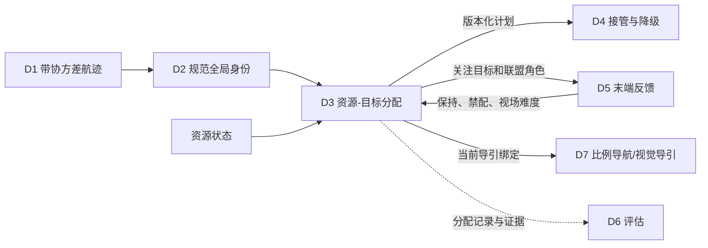

# D3 集中式资源-目标分配算法与实施方案

> 状态基线：2026-07-13。
>
> 本文依据本模块当前源码、测试、`README.md`、`PLAN.md`、
> `docs/MODULE_PRINCIPLES_CN.md` 和根目录系统汇总同步编写。本文区分默认主线、
> 已实现辅助能力、可选离线对照和未实现能力，不把计划项写成已完成能力。

## 1. 模块定位

D3 是反无人机系统（Counter-Unmanned Aircraft System，C-UAS）科研仿真流程中的
集中式资源-目标分配模块。它在中心节点可用时接收 D2 维护的规范全局航迹和资源状态，
生成版本化 `AssignmentPlan`（分配计划），并向下游提供：

1. 资源与 `global_track_id`（规范全局航迹标识）的绑定；
2. 普通一资源对一目标分配；
3. 高威胁目标的多资源联盟分配；
4. 计划版本、迟滞、有效期和旧版本拒绝证据；
5. D5 末端视觉反馈的保守写回入口；
6. D4 二级节点接管时可继承的中心计划基线；
7. D7 可消费但不能自行修改的导引绑定；
8. D6 可记录和统计的分配证据。

D3 输出的是科研仿真候选计划，不执行飞行控制，不决定目标身份，不执行分布式选主，
也不生成真实处置授权。默认 `human_authorization_state`（人工授权状态）为
`required`（需要授权），仿真运行时可由外部授权层传入记录态；D3 本身不能绕过授权。

## 2. 术语和缩写

| 中文名称 | 英文全称与缩写 | 本模块含义 |
|---|---|---|
| 应用程序编程接口 | Application Programming Interface，API | 模块公开函数和结构化调用合同 |
| 数据传输对象 | Data Transfer Object，DTO | 只携带结构化数据、不执行控制的对象 |
| 北-东-地坐标系 | North-East-Down，NED | 上游融合工作坐标系；D3 消费结果但不负责坐标转换 |
| 视场 | Field of View，FOV | 某资源持续观察和确认某目标的相对困难程度 |
| 预计到达时间 | Estimated Time of Arrival，ETA | 上游或 D7 提供的可达性信息；当前 D3 不求解完整到达动力学 |
| 到达关键区时间 | Time to Critical Zone，TTC | D3 可解释威胁基线中的时间紧迫度；不同于 D7 末端语境的预计碰撞时间 |
| 线性和分配问题 | Linear Sum Assignment Problem，LSAP | 普通匈牙利一对一匹配模型 |
| 动态规划 | Dynamic Programming，DP | SciPy 不可用时的小规模后备求解方法 |
| 约束规划-可满足性 | Constraint Programming-Satisfiability，CP-SAT | 规划中的复杂约束离线参考方法，当前未实现 |
| 混合整数线性规划 | Mixed-Integer Linear Programming，MILP | 规划中的联盟全局参考方法，当前未实现 |
| 确认应答 | Acknowledgement，ACK | D4 联盟提交协议中的确认消息，不由 D3 产生 |
| 比例导航 | Proportional Navigation，PN | D7 中段导引方法，不属于 D3 |
| 比例导航制导 | Proportional Navigation Guidance，PNG | D7 末端视觉导引方法，不属于 D3 |
| 微软空中信息与机器人仿真器 | Aerial Informatics and Robotics Simulation，AirSim | 由 main 运行时负责启动、重置和场景编排 |
| 简化飞行控制后端 | SimpleFlight | AirSim 内的多旋翼飞行控制后端，不是 D3 求解器 |

MSM 是项目既定代号，D1-D7 是模块编号，不作为英文缩写展开。
本文将目标数记为 \(m\)，资源数记为 \(n\)。项目材料中的“动态 M 对 N”包含两层含义：

- \(m\) 与 \(n\) 可以相等，也可以不相等，并可在运行中变化；
- 单个目标 \(i\) 还可以要求 \(k_i>1\) 个资源组成联盟。

2 对 2、5 对 5 和 5 资源/2 目标只是试验配置，不是算法规模上限。

## 3. 系统位置和数据流



边界规则如下：

- D1/D2 提供位置、速度、协方差、规范全局航迹身份和关联风险；
- D3 只引用 `global_track_id`，不创建、合并或重命名规范航迹；
- D5 可以报告锁定、模糊、重复锁定和跨视角冲突，但不能本地改写分配；
- D4 决定是否由中心、二级节点或完全分布式路径持有计划；
- D7 只执行当前、有效、角色允许且通过 D4/D5 门控的绑定；
- D6 被动消费计划、拒绝、重分配和联盟证据。

## 4. 输入数据结构

### 4.1 目标航迹 `TargetTrack`

| 字段 | 含义 | 算法用途 |
|---|---|---|
| `track_id` | D2 维护的规范全局航迹标识 | 分配目标身份，不允许 D3 改名 |
| `threat_score` | 归一化威胁分数 | 降低高威胁目标分配成本并提高其未分配惩罚 |
| `covariance` | 上游协方差的标量摘要 | 构成航迹不确定性惩罚 |
| `window_cost` | 当前软窗口代价 | 对开放可行边排序 |
| `assignable` | 是否允许进入分配 | 为假时所有真实资源边硬拒绝 |
| `fov_difficulty_by_resource` | 按资源的视场困难度 | 接收 D5/main 写回并进入边代价 |
| `conflict_risk_by_resource` | 按资源的冲突风险 | 进入边代价 |
| `feasibility_by_resource` | 按资源的硬可行性 | 为假时对应边硬拒绝 |
| 硬时间窗字段 | 开启、关闭、状态和资源特定窗口 | 当前规划时刻位于窗外时硬拒绝 |
| `demand` | 可选 `TargetDemand` | 为空时严格退化为单资源独立需求 |
| `metadata` | 来源、反馈和审计信息 | 不得作为未定义控制命令 |

D1/D2 的 `measurement_timestamp`（量测时间戳）和
`arrival_timestamp`（到达时间戳）仍由上游合同保留。D3 的 `timestamp`
是规划评估时刻，不能替代这两个传感器时间语义。

### 4.2 资源状态 `ResourceState`

| 字段 | 含义 | 算法用途 |
|---|---|---|
| `resource_id` | 资源身份 | 每个资源最多占用一个可执行需求槽 |
| `status` | 可用、忙碌、降级或不可用 | 不可用硬拒绝，降级增加代价 |
| `health_score` | 健康程度 | 健康越差，资源状态代价越高 |
| `busy_until` | 忙碌截止时刻 | 当前时刻早于该值时硬拒绝 |
| `operator_hold` | 外部保持状态 | 为真时该资源全部边硬拒绝 |
| `capability_class` | 资源能力类别 | 与多资源需求槽能力匹配 |
| `energy_fraction` | 剩余能量比例 | 为零时硬拒绝，其余进入代价 |
| `availability_score` | 可用性分数 | 为零时硬拒绝，其余进入代价 |
| `current_load` | 当前负载 | 进入资源状态代价 |
| `history_failure_rate` | 历史失败率 | 进入资源状态代价 |
| 目标可达字段 | 按目标的可行性和可达分数 | 硬拒绝或提高资源风险 |

### 4.3 多资源目标需求 `TargetDemand`

显式需求的核心参数是：

- \(k_i=\)`required_resource_count`：目标所需资源总数；
- \(p_i=\)`primary_resource_count`：其中主资源数量，满足
  \(1\le p_i\le k_i\)；
- `coordination_mode`：独立、同时、顺序或混合；
- `required_capability_counts`：各能力类别所需槽数；
- 到达窗口起止时刻、波次间隔和最小间隔；
- `terminal_authorization_scope="per_primary"`：每个主资源独立接受末端门控；
- `arrival_coordination_required=False`：当前阶段不要求同时到达。

只有显式构造 `TargetDemand()` 时，研究默认才是
**2 个主资源（primary）+ 1 个备用资源（reserve）**。未提供 `demand` 的普通目标
自动形成 \(k_i=1,p_i=1\) 的独立需求，不能把所有目标都误写成默认需要三架资源。

## 5. 输出数据结构

### 5.1 单条分配 `Assignment`

单条分配记录目标、资源、总成本、成本分解、可行性、计划版本、联盟标识、联盟版本、
成员角色、波次和到达窗口。多资源场景下，同一目标可以合法拥有多条分配。

### 5.2 版本化计划 `AssignmentPlan`

计划至少包含：

- `plan_id`、`version`、`previous_plan_id` 和 `window_id`；
- `resource_count`、`target_count` 和实际矩阵形状；
- 可执行 `assignments` 和 `unassigned_target_ids`；
- 当前、候选和旧计划重评分成本；
- `decision_state`、`changed` 和人工授权状态；
- `coalitions`、`demand_summaries` 和 `incomplete_target_ids`；
- 来源节点、目标节点、链路类型、计划所有者和有效期；
- 代价矩阵、拒绝原因、迟滞理由和反馈配置等审计元数据。

多资源调用方必须使用 `assignments_by_target()`。旧
`assignment_map()` 只适用于每个目标恰好一条分配，遇到合法多资源目标会抛出错误，
避免静默丢掉联盟成员。

### 5.3 联盟 `CoalitionPlan`

联盟记录：

- 联盟身份、版本、纪元和状态；
- 目标需要数、已分配数、缺口数和完整性；
- 成员资源、主用/备用/重试角色；
- 波次、能力要求和到达窗口；
- 成员是否可执行。

完整联盟状态为 `committed`（已提交）；资源或能力不足时状态为
`incomplete`（不完整）。不完整联盟保留候选成员和缺口证据，但不发布可执行分配。

## 6. 数学模型

### 6.1 普通一对一模型

令 \(x_{ij}\in\{0,1\}\) 表示资源 \(j\) 是否分配给目标 \(i\)。普通目标满足：

\[
\sum_{j=1}^{n}x_{ij}\le1,\qquad
\sum_{i=1}^{m}x_{ij}\le1.
\]

目标函数为：

\[
J=
\sum_{i=1}^{m}\sum_{j=1}^{n}x_{ij}
\left(C_{ij}+S_{ij}\right)
+\sum_{i=1}^{m}u_iU_i,
\]

其中：

- \(C_{ij}\) 是可解释基础边代价；
- \(S_{ij}\) 是目标从旧资源切换到新资源时的切换惩罚；
- \(u_i=1\) 表示目标选择虚拟未分配列；
- \(U_i\) 是未分配惩罚。

当前未分配惩罚为：

\[
U_i=C_{base}(0.5+q_i),
\]

其中 \(q_i\) 是威胁分数，\(C_{base}\) 是
`unassigned_base_cost`。高威胁目标因此更不容易被保留为未分配。

### 6.2 多资源需求槽模型

当目标 \(i\) 需要 \(k_i>1\) 个资源时，将目标展开为
\(\ell=1,\ldots,k_i\) 个需求槽。定义 \(x_{i\ell j}\) 表示资源 \(j\) 是否占用槽
\(\ell\)：

\[
\sum_j x_{i\ell j}\le1,\qquad
\sum_{i,\ell}x_{i\ell j}\le1.
\]

理想的联盟全有或全无约束可写为：

\[
\sum_{\ell,j}x_{i\ell j}=k_i z_i,\qquad z_i\in\{0,1\}.
\]

当前默认代码没有用混合整数线性规划直接求解 \(z_i\)。它采用需求槽启发式准入，
在发布层保证全有或全无，不能据此宣称获得复杂联盟全局最优解。

## 7. 可解释代价模型

对可行目标-资源边，基础代价为：

\[
\begin{aligned}
C_{ij}={}&
w_w C^{window}_{ij}
+w_p C^{cov}_{i}
+w_t(1-q_i)\\
&+w_r C^{resource}_{ij}
+w_f C^{fov}_{ij}
+w_c C^{conflict}_{ij}.
\end{aligned}
\]

### 7.1 接近窗口

`window_cost` 表示当前滚动时刻的软窗口偏好。它只排序开放边，不等于真实飞行到达时间，
也不构成完整时空轨迹约束。

### 7.2 航迹不确定性

`covariance` 来自 D1/D2 的航迹不确定性摘要。数值越大，错误分配和末端配准风险越高，
代价越大。D3 不修改协方差，也不把缺失协方差伪装为高精度。

### 7.3 威胁度

边代价使用 \(1-q_i\)，未分配惩罚随 \(q_i\) 增大。模块还提供
`compose_threat_score_baseline()`，将关键区接近程度、到达关键区时间、速度、
协方差和目标状态组合成可解释基线。该函数不是完整动态威胁评估模型。

### 7.4 资源状态

资源状态项综合健康、能量、可用性、当前负载、历史失败率和旧接口负载惩罚。不可用、
人工保持、仍在忙碌、能量为零、可用性为零或目标不可达会形成硬拒绝，而不是仅增加小代价。

### 7.5 视场与冲突

视场困难度可接收 D5 对遮挡、目标重叠、检测不稳定和跨视角困难的反馈。冲突风险用于表达
资源空间或任务冲突摘要。当前二者都是边级特征，不等同于真实多机路径冲突求解。

### 7.6 硬时间窗和拒绝

目标可配置通用或资源特定的硬时间窗。当前规划时刻尚未进入窗口、已经超过窗口或状态明确
关闭时，对应边直接拒绝并导出原因。当前实现没有用真实预计到达时间求解多窗口连续动力学。

## 8. 默认求解算法

### 8.1 普通匈牙利路径

普通目标使用 SciPy 科学计算库的
`scipy.optimize.linear_sum_assignment()` 求解线性和分配问题。矩阵右侧为每个目标
增加一个虚拟未分配列，因此 \(m>n\)、\(m<n\) 和 \(m=n\) 使用同一接口。

选择匈牙利算法作为默认主线的原因是：

- 适合当前中心化一资源占用一个任务槽的基线；
- 结果确定、透明、易于重放；
- 复杂度通常记为 \(O(r^3)\)，其中 \(r\) 是补齐后的矩阵规模；
- 可以完整保留每条边的成本分解和拒绝原因；
- 不需要复杂求解器运行时。

SciPy 不可用时可使用小规模位掩码动态规划后备。后备路径的列数上限为 22，包含真实资源列
和虚拟未分配列，因此不能把它当作大规模替代后端。

### 8.2 多资源需求槽路径

显式多资源需求由 `HungarianDemandSlotSolver` 执行：

1. 按目标需求展开角色、波次、能力和窗口槽；
2. 将目标-资源边代价复制到各槽；
3. 应用能力门控、D5 反馈保护和旧主资源保护；
4. 对高威胁目标施加更高准入优先级；
5. 使用匈牙利算法求解槽-资源匹配；
6. 若目标只得到部分槽，选择低优先目标整目标退出活动集合；
7. 重新求解，直到剩余目标均完整满足；
8. 只把完整联盟发布为可执行 `Assignment`；
9. 对退出目标保留缺口、候选成员和拒绝证据。

该方法保证**发布层全有或全无准入**。它是轻量确定性启发式，不保证与
约束规划-可满足性或混合整数线性规划参考模型具有相同全局最优解。

## 9. 角色、波次和窗口

| 协同模式 | 角色和波次 | 当前含义 |
|---|---|---|
| 独立 | 一个主资源，波次 0 | 普通一对一目标 |
| 同时 | 所有成员为主资源，波次 0 | 共享合同窗口；是否要求同步仍由显式字段决定 |
| 顺序 | 首个成员为主资源，后续为重试资源 | 波次依次递增 |
| 混合 | 前 \(p_i\) 个为波次 0 主资源，其余为波次 1 备用资源 | 当前高威胁研究默认 |

第 \(w\) 波的合同窗口为：

\[
[t_i^{start}+w\Delta_i,\ t_i^{end}+w\Delta_i],
\]

其中 \(\Delta_i\) 是波次间隔。

当前默认高威胁方案是 **2 primary + 1 reserve**：

- 两个主资源分别接受 D4、D5 和 D7 门控；
- 一个备用资源保留容量但保持待命；
- 备用绑定固定为 `hold/reserve_standby_not_activated`；
- 只有新版本计划将其角色改为主资源或重试资源后，才可能进入执行；
- 当前 `arrival_coordination_required=False`，不要求两个主资源同时到达；
- 到达窗口是计划合同，不代表 D3 已经实现同步导引。

## 10. 滚动重规划与迟滞

### 10.1 全局迟滞

候选计划形成后，D3 将旧分配在当前矩阵上重新计价。默认相对改善阈值为
\(\delta=0.2\)，最小驻留时间为 \(T_{min}=2.0\) 秒。普通换配需满足：

\[
J_{new}<(1-\delta)J_{old},\qquad
T_{dwell}\ge T_{min},
\]

并满足可选的单窗口最大变更数限制。

以下情况可以释放普通迟滞：

- 旧计划边已经不可行；
- 候选显著降低高威胁未分配目标数；
- 收益、驻留和变更限制同时满足。

否则保持旧分配，决策状态标为迟滞保持，并用当前矩阵更新诊断成本。

### 10.2 切换惩罚

`reassignment_switch_penalty` 在求解前加入矩阵：

- 旧目标换到不同可行资源时计一次；
- 保持原资源不计；
- 新目标、不可行边和未分配列不计；
- 求解器目标值、分配成本、成本分解和证据使用同一数值。

这避免求解后再次追加惩罚造成目标值和证据不一致。

### 10.3 联盟成员迟滞

多资源目标按目标维护成员最近变化时刻。旧联盟完整且旧边仍可行时，成员或角色替换同样需要
20% 成本改善和 2 秒驻留。资源失效、硬禁配、需求结构变化和主资源硬冲突会立即释放。

普通成本评估刷新不会重置成员驻留时钟，也不会推动联盟版本和纪元。

### 10.4 短时视觉反馈驻留

D5 报告“主资源锁定稳定性不足”或短暂重新获取时，D3 在普通迟滞前应用帧级驻留：

\[
F_{effective}=\max(F_{D3},F_{D5}),
\]

其中 D3 默认最少 2 帧，不能削弱 D5 要求的更长稳定窗口。版本匹配且旧主资源仍可行时，
在窗口完成前保持旧主资源。窗口完成只结束该前置保护，soft candidate 仍必须进入联盟成员和
全局 `delta/min_dwell/change-limit` 迟滞，不能直接发布新执行版本。

重复锁定、verified friend/友方冲突、错误绑定、资源不可用、显式禁配或旧边不可行会立即绕过驻留；普通检测丢失仍是当前边 soft feedback。
其他计划版本的反馈只用于审计。

## 11. 计划身份、版本和旧计划拒绝

`AssignmentPlanner` 是单个仿真回合内有状态的规划器：

1. 首次规划允许 `previous_plan=None`，创建版本 1；
2. 当前计划发布后，下一次规划必须精确传入该计划；
3. 缺失前序计划会抛出 `StalePlanError(reason="previous_plan_required")`；
4. 计划标识、版本或 `expected_previous_version` 不匹配时硬拒绝；
5. `publish=False` 只生成候选，不推进当前身份；
6. 新仿真回合必须新建规划器实例，不存在隐式重置。

计划执行身份由 `execution_signature()`（执行签名）决定。签名覆盖资源、目标、联盟、
角色、波次、窗口、所有者、授权和激活/租约语义：

- 只更新成本和诊断时，保留计划标识、版本、创建时刻和联盟纪元；
- 执行签名变化时，生成严格连续的新版本；
- 强制重规划但签名不变时返回 `replan_ack_no_change`；
- 强制重规划且签名变化时返回 `replan_applied`；
- 跨中心/二级所有者切换形成明确的新计划谱系。

旧版本不能因为尚未超过 `stale_after_s` 就覆盖当前版本；“新鲜”与“当前身份”是两个独立门控。

## 12. D5 反馈闭环

`evaluate_terminal_feedback()` 将 D5/main 已聚合的末端证据映射为保守建议：

| D5 状态 | D3 建议 | 实施方式 |
|---|---|---|
| 一致 | 继续 | 保持当前计划 |
| 模糊、普通保持 | 保持 | 当前资源-目标边 soft cost + D7 hold，不设置资源 `operator_hold` |
| 重新获取、几何/FOV/检测不稳定 | 中心重规划 | 提高当前边代价并进入普通迟滞，不硬禁配 |
| 友方重叠保持 | 保持 | resource-hard，整资源保持 |
| verified friend | 保持 | target-hard，目标停止分配 |
| 不匹配、多帧不一致、跨视角冲突 | 二级仲裁 | 请求 main/D4 仲裁 |
| 重复末端锁定风险 | 二级仲裁 | 禁配冲突边并阻断本地换绑 |

`apply_terminal_feedback_to_planner_inputs()` 可将权威反馈写入下一轮：

- 将安全身份冲突、duplicate 或显式 feasibility reject 边设置为 `feasibility_by_resource=False`；
- 对普通 ambiguous/hold/reacquire、几何/FOV/检测不稳定提高对应 `fov_difficulty_by_resource`；
- 仅对明确 resource-hard 风险设置 `operator_hold=True`，verified friend 则设置 target-hard；
- 保留源计划、联盟、稳定帧和冲突原因；
- 输出 constraint class、scope、classification reason 和 hard-reject 审计字段；
- 给 D4 形成仲裁建议，给 D7 形成保持动作。

`allow_local_rebind` 始终为假。D5 的本地视觉身份不能替换 D3 中的规范全局航迹绑定。

备用资源的软反馈采用角色感知保护：若所有旧主资源仍一致、至少一个备用资源只报告软保持或
重新获取，且旧主资源边仍可行，D3 固定健康主资源，只允许重解备用槽，避免健康主资源被旋转
成备用角色。

## 13. D4 接管接口

D3 不决定主动或被动降级，也不选择二级节点。D4/main 负责健康判断、节点选择、领导者纪元、
租约续期、完全分布式协商和中心恢复仲裁。

D3 为 D4 提供三类能力：

1. `AssignmentValiditySummary`：计划年龄、分配延迟、成本差、旧版本、重复分配、
   高威胁未分配、迟滞和重分配计数；
2. 最新中心计划：作为二级或分布式协商基线；
3. 二级计划盖章和续行合同。

`prepare_secondary_takeover_plan()` 只在 main/D4 已提供以下证据后激活候选：

- 具体二级节点；
- 持续满足的接管就绪状态；
- 激活时刻；
- 有效且未过期的租约；
- 正数且单调的领导者纪元；
- 精确替代的中心计划身份。

`continue_active_secondary_plan()` 要求同一二级所有者、严格前序连续性、不回退的纪元和租约。
main 应先用 `publish=False` 产生候选，再盖章或续行，最后调用
`publish_plan()`，避免中间中心候选错误推进当前版本。

中心和二级节点都失效时，D4 负责基于共识的捆绑算法
（Consensus-Based Bundle Algorithm，CBBA）或拍卖式协商。D3 不实现该协议，只提供
最新中心联盟、需求和版本语义作为参考。

## 14. D7 导引绑定

`guidance_bindings_from_assignment_plan()` 为每个合法成员生成
`AssignmentGuidanceBinding`（分配-导引绑定），携带：

- 当前计划和联盟身份、版本；
- 资源和规范全局航迹绑定；
- 主用/备用/重试角色；
- 波次、协同模式和合同窗口；
- 人工授权、有效期、所有者和链路；
- 当前、保持、旧版本、撤销或已换配状态。

活动绑定至少要求：

1. 计划身份等于 main 声明的当前身份；
2. 计划未过期、未撤销且资源未保持；
3. 联盟已提交、版本一致且需求完整；
4. 成员不是未激活备用资源；
5. 二级计划已激活、持续就绪、纪元单调且租约有效。

D7 还要独立检查 D4 许可和 D5 的末端锁定。D3 只发布绑定，不计算比例导航或视觉比例导航，
不发飞控命令，也不授权处置。

当前两个主资源是**独立门控**：每个主资源分别满足当前计划、D4 许可、D5 锁定和 D7 控制条件
即可执行。本阶段不把“同时到达”设为成功前提。

## 15. 增量规划

`plan_incremental()` 是已实现辅助入口，不会根据一次耗时自动替换默认全量规划。流程为：

1. 校验精确前序计划和输入指纹；
2. 比较调用方声明的变化目标/资源与实际变化；
3. 在当前可行二部图上定位受影响连通分量；
4. 只求解安全的局部分量；
5. 保留其他仍可行分配、联盟身份、角色和波次；
6. 合并完整候选后再执行统一反馈驻留、成员迟滞和全局迟滞。

缺少快照、漏报变化、目标/资源集合变化、需求变化、计划过期、时间相关约束或受影响分量扩展
到全局时，会带 `incremental_fallback_reason` 回退全量规划。版本不一致仍是硬错误，
不能静默回退。

## 16. 一次全量规划的实施流程

### Canonical 单 planning-tick 历史

主运行时在每次成功规划后调用：

```python
record = plan_history_record_from_plan(
    plan,
    sequence_index=tick_sequence_index,
    timestamp=planning_timestamp_s,
    previous_plan=previous_plan,
    feedback_metadata=None if writeback is None else writeback.metadata,
)
payload = record.to_dict()
```

`PlanningTickHistoryRecord` 使用 `d3_plan_history_record_v1`。main 提供的
`sequence_index` 和 `timestamp` 形成 `[sequence_index, timestamp]` 字典序，
不能从计划版本推断 tick 顺序。计划级字段只记录一次；assignment 按目标、联盟、
波次、角色、资源排序，coalition member 也稳定排序。记录覆盖 primary/reserve 的
active/standby、联盟 id/version/epoch、有效性和成本，以及迟滞、成员变化、soft/hard
feedback、总/候选/前序成本和 stale/rollback/replan 原因。

`to_dict()` 只输出 JSON 原生值，使用白名单而不是透传整个 metadata，并排除 truth
命名字段。`assignment_records_from_plan()` 兼容不变。D3 只定义单 tick schema；JSONL
写盘属于 main，跨 tick churn 计算属于 D6。

```text
输入 TargetTrack[]、ResourceState[]、当前时刻、精确 previous_plan
    |
    +-- 1. 校验 plan_id/version/expected_previous_version
    +-- 2. 构造边成本、硬拒绝、未分配成本和输入快照
    +-- 3. 在求解前加入一次切换惩罚
    +-- 4. 无显式 k>1 -> 普通匈牙利
    |       显式 k>1 -> 需求槽匈牙利 + 全有或全无准入
    +-- 5. 形成 Assignment、CoalitionPlan 和需求满足摘要
    +-- 6. 应用短时 D5 反馈驻留
    +-- 7. 应用联盟成员迟滞
    +-- 8. 应用全局成本/驻留迟滞
    +-- 9. 比较执行签名并确定计划身份和版本
    +-- 10. publish=True 时正式发布
    +-- 11. 导出 D4 摘要、D6 记录和 D7 绑定
```

核心伪代码如下：

```python
def plan(tracks, resources, now, previous_plan):
    validate_previous_identity(previous_plan)
    matrix = cost_model.build_matrix(tracks, resources, now)
    matrix = add_switch_penalty_once(matrix, previous_plan)

    if uses_demand_slots(tracks):
        slots = expand_role_wave_capability_slots(tracks)
        candidate = demand_slot_hungarian(slots, resources, matrix)
        candidate = remove_partial_coalitions_and_resolve(candidate)
    else:
        candidate = hungarian_with_unassignment(matrix)

    candidate = apply_transient_terminal_feedback_dwell(candidate, previous_plan)
    candidate = apply_coalition_membership_hysteresis(candidate, previous_plan)
    selected = apply_global_hysteresis(candidate, previous_plan)
    selected = assign_identity_from_execution_signature(selected, previous_plan)
    return publish_if_requested(selected)
```

## 17. 代码模块对应关系

| 文件 | 实施职责 |
|---|---|
| `models.py` | DTO、计划身份、D5 反馈、D4 接管、D6 记录、canonical history 和 D7 绑定 |
| `costs.py` | 可行性门控、成本矩阵、硬时间窗和成本分解 |
| `solver.py` | SciPy 匈牙利、动态规划后备和需求槽求解 |
| `planner.py` | 全量/增量规划、全有或全无准入、迟滞和版本发布 |
| `cooperative_prescreen.py` | 末端距离、到达窗口和扇区候选预筛 |
| `calibration.py` | 动态非等量场景的全量/增量配对校准 |
| `fixtures.py` | 5v5、3v5、5v3 和动态事件确定性夹具 |
| `min_cost_flow.py` | 可选 OR-Tools 最小费用流隔离求解器 |
| `p2_benchmark.py` | SciPy 容量列展开与可选最小费用流同输入对照 |

## 18. 默认、可选和未实现边界

| 分类 | 能力 | 2026-07-13 状态 |
|---|---|---|
| 默认主线 | SciPy 匈牙利普通分配 | 已实现并作为默认一对一后端 |
| 默认主线 | 匈牙利需求槽与全有或全无发布 | 已实现；是轻量启发式，不是 MILP 全局最优 |
| 默认主线 | 可解释成本、硬可行性、迟滞、版本和旧计划拒绝 | 已实现 |
| 默认主线 | 2 primary + 1 reserve 显式高威胁需求 | 已实现；普通无需求目标仍是 \(k=1\) |
| 已实现辅助 | 保守增量规划 | 已实现，条件不满足时回退全量 |
| 已实现辅助 | D5 反馈写回、主资源保护和短时反馈驻留 | 已实现，真实权重仍需继续标定 |
| 已实现辅助 | D4 二级接管盖章/续行和 D7 多绑定 | 已实现 D3 合同层 |
| 已实现辅助 | 27 组协同候选预筛 | 已实现，不改变求解主线 |
| 可选离线对照 | SciPy 容量列展开基准 | 已实现隔离对照 |
| 可选离线对照 | 谷歌 OR-Tools 运筹优化工具库最小费用流 | 代码接口已实现；当前环境未安装，不进入默认规划器 |
| 未实现 | CP-SAT/MILP 联盟全局参考模型 | 仅研究计划 |
| 未实现 | 完整多窗口、连续动力学和承诺前缀优化 | 仅研究计划 |
| 未实现 | 生产级分布式联盟协商 | 属于 D4，不属于 D3 |
| 未实现 | 多主资源同步到达控制 | 当前明确不要求，具体导引属于 D7 |

不得声称 OR-Tools、最小费用流、约束规划-可满足性或混合整数线性规划已经替换默认
SciPy 匈牙利/需求槽主线。

## 19. 2026-07-14 验证证据

### 19.1 模块回归

当前 D3 回归基线为：

```text
157 passed, 1 skipped
```

唯一跳过项是当前环境缺少可选 OR-Tools 的已安装求解测试。标准命令为：

```bash
python3 -m pytest -q research_modules/d3_assignment_planner/tests
```

本轮在既有 feedback 分级/迟滞 case 上新增 5 个 canonical history case，并运行全量模块测试。新增覆盖 primary/reserve、owner/epoch/lease、soft/hard feedback、迟滞/成本、稳定排序、严格 JSON 序列化、旧 metadata、truth 排除和 ordering 输入校验。唯一跳过项仍是当前环境缺少可选 OR-Tools 的已安装求解测试。

### 19.2 确定性动态规模校准

8 类夹具覆盖：

- 5v5；
- 3v5；
- 5v3；
- 新目标出现；
- 资源失效；
- 高威胁目标需求变化；
- D5 备用资源反馈；
- 硬时间窗变化。

全量和增量规划在 8/8 转换中达到分配与成本等价，并输出回退原因、联盟缺口、
高威胁未分配和角色保持证据。该结果证明接口一致性，不等于真实 AirSim 多种子性能已经闭合。

### 19.3 计算机视觉合同验证

2026-07-11 的 5 资源/2 目标 AirSim 计算机视觉模式 10 个随机种子中，高威胁目标
`T001` 的双主资源视觉共识与当前计划门控达到 8/10；种子 7 和 27 保留为回归样例。
这关闭的是 D3 多资源合同层，不等同于物理拦截完成。

### 19.4 SimpleFlight 物理闭环

2026-07-13 完成 40 个 5 资源/2 目标 SimpleFlight 回合，每种配置 10 个随机种子：

| 配置 | 联盟完成数 |
|---|---:|
| 基线 | 0/10 |
| 20 米末端交接 / 3 秒主资源窗口 / 40 度扇区 | 5/10 |
| 20 米末端交接 / 5 秒主资源窗口 / 40 度扇区 | 2/10 |
| 20 米末端交接 / 8 秒主资源窗口 / 40 度扇区 | 1/10 |

最佳候选是 5/10，低于 8/10 验收门限。全部配置合计是 8/40，不能误写为 40 个独立候选。
主要失败来自 D5 未锁定和末端检测获取超时，少量失败来自检测框面积过小。

2026-07-14 已修复普通 pair hold 被扩大为资源 `operator_hold` 的 D3 根因机制，并以 5 个新增
确定性 case 验证 soft/hard 分类和 `min_dwell`。该机制是解释 40-case churn 的根因线索，
不是已证明因果：正式 aggregate 缺逐 planning tick 的 plan/feedback/迟滞历史，不能把某次
成员变化或物理失败归因于该机制。

安全合同保持：

- 备用资源越权执行：0；
- `global_track_id` 本地改写：0；
- 在线使用 AirSim 真实身份标签：0。

D4 故障矩阵还证明二级和分布式提交正例可以消费 D3 当前绑定；缺确认应答时按保守原则关闭
D7 执行许可。该结果不代表 D3 实现了 D4 的通信和共识协议。

## 20. 当前结论与剩余工作

当前默认主线继续采用 SciPy 匈牙利算法、需求槽全有或全无准入、可解释成本、版本和迟滞。
已有证据没有支持切换到更复杂求解后端。

D3 当前没有开放的优先级零或优先级一合同层阻塞项；优先级一的真实物理性能和参数标定仍然
开放，最佳联盟完成数只有 5/10。这里的优先级零、优先级一和优先级二分别对应仓库中的
Priority 0、Priority 1 和 Priority 2（P0、P1、P2）工作分级。

仍需补充的证据包括：

1. D3 已提供 canonical 单 tick history schema/export，但 main 尚未写入 40 回合正式 aggregate，D6 也未计算联盟成员/版本抖动；feedback 扩大机制仅为根因线索，尚不能形成因果结论；
2. 真实 3v5、5v3、目标新增、资源失效和高威胁需求变化仍缺多种子标定；
3. D5 反馈权重、视场困难度、禁配边、驻留和切换惩罚尚未联合标定；
4. 硬时间窗尚未接入真实预计到达时间、多窗口和连续动力学；
5. 完整动态威胁模型仍未建立；
6. 需求槽准入不具备 CP-SAT/MILP 意义下的全局最优证明；
7. OR-Tools 当前未安装，最小费用流只有隔离合同和结构化不可用证据；
8. 当前不要求主资源同时到达，不能从窗口字段推断已实现同步协同。

## 21. 文档维护原则

后续只有代码、测试和正式验证证据已经改变能力状态时，才更新本文对应结论。更新时必须：

- 保持动态 \(m\) 目标/\(n\) 资源，不写死 2v2 或 5v5；
- 保持 `global_track_id` 的中心所有权；
- 保持计划版本、前序连续性和旧版本拒绝；
- 区分合法多资源联盟与异常重复分配；
- 区分计划窗口与真实同步到达；
- 区分默认主线、可选离线对照和未实现能力；
- 不把一次候选结果或缺失依赖写成默认算法升级。

## 22. Hold 分支的执行范围实现（2026-07-14）

### 22.1 问题

原 hold 分支使用 `_score_previous_plan(...)` 返回的 `previous_unassigned` 构造输出。
该集合是把上一 assignment 投影到“当前”目标矩阵后得到的，因此会包含本 tick 新出现
但尚未获准执行的目标。`AssignmentPlan.execution_signature()` 又包含
`unassigned_target_ids` 和 coalition，结果是 `decision_state=held_*` 仍可能推进
plan ID/version。

### 22.2 修复

普通迟滞、联盟成员迟滞和 transient feedback dwell 的 held plan 现在使用：

```python
unassigned_target_ids = previous_plan.unassigned_target_ids
incomplete_target_ids = previous_plan.incomplete_target_ids
coalitions = previous_plan.coalitions
assignments = rescored_previous_assignments
```

重评分成本只用于评估，assignment 的目标、资源、角色、coalition version 和激活语义
不变。当前候选范围通过 `_held_candidate_scope_metadata(...)` 输出，不参与 executable
identity。字段包括：

- `hysteresis_candidate_target_ids`；
- `hysteresis_candidate_unassigned_target_ids`；
- `hysteresis_candidate_incomplete_target_ids`；
- `hysteresis_held_execution_target_ids`；
- `hysteresis_pending_new_target_ids`；
- `hysteresis_missing_previous_target_ids`。

该实现保留动态 M/N，且没有引入 truth、目标白名单或 D2 身份重绑。

### 22.3 验证边界

新增测试分别覆盖普通一对一迟滞和 `2 primary + 1 reserve` 联盟成员迟滞。新目标进入
时，held plan 的 ID/version 和 execution signature 必须与上一 current plan 一致，
而 `target_count` 与候选审计仍反映当前输入。另外，上一已分配目标从当前矩阵消失时，
`_score_previous_plan(...)` 将上一计划判为
不可行，避免 same-assignment 快路径错误 hold；新版本记录
`previous_missing_execution_target_ids`。当前全量结果为 `157 passed, 1 skipped`。
该测试不证明 D2 新生航迹真实，也不修复 runtime reserve
状态同步。

## 23. 累计 Window Budget 与统一 Comparison Objective（2026-07-14）

### 23.1 两层成本

候选求解目标 (J_{search}) 可以包含稳定搜索所需的正则项，但迟滞收益必须使用同一
口径 (J_{cmp})：

```text
J_search(candidate) = base + switch + soft-feedback shaping + slot search terms
J_cmp(plan) = current base edges + hard feasibility + current unassigned * demand
release if J_cmp(candidate) < (1 - delta) * J_cmp(previous)
```

`_hysteresis_comparison_matrix(...)` 从当前矩阵去除 switch penalty 和由
`apply_terminal_feedback_to_planner_inputs(...)` 标记的 soft FOV 增量；candidate 与
previous 再通过相同的 `_score_previous_plan(...)` 投影到当前 target/demand。硬 reject
不被去除。demand-slot priority 和 primary role pin 只生成候选，不进入单边 gain。
metadata schema 为 `d3_hysteresis_current_objective_v1`，同时输出 search candidate、
comparison candidate 和 comparison previous cost。

### 23.2 累计预算

同一 `window_id=w` 的普通 release 条件改为：

```text
used_w + candidate_change_count <= max_changes_per_window
```

`used_w` 存在 previous plan metadata 中，只有接受执行 assignment 变化时增加；hold 和
evaluation refresh 保持原值，新 `window_id` 从零开始。schema
`d3_cumulative_window_change_budget_v1` 输出 used-before/after、candidate、remaining、
是否满足和 hard bypass reason。目标消失、资源硬失效、高威胁保护及 plan-level
owner/activation/authorization 变化可绕过普通预算；旧版本仍因新 identity fail closed。
联盟成员角色候选继续走 membership hysteresis，不能按 activation 强制释放。

### 23.3 Missing + Hold 顺序

先判定 previous execution target 是否仍存在及旧资源是否硬可行，再决定另一联盟能否
hold。previous-only target 是 lifecycle removal，不生成 membership record。只要有
真实 missing/hard failure，就发布 candidate 新版本；新输出不保留消失目标的
assignment、coalition、demand summary 或 audit。

最新真实动因是 M5N2 seed 1 的 347 records/v1..v35；本批没有重跑 Blocks。5 个新增
确定性测试函数使全量达到 `157 passed, 1 skipped`，接受阈值为零失败。真实至少
10-seed churn、高威胁未分配和物理结果仍需 main+D6 复验。

## 24. Actual-v2 计划身份闭环（2026-07-14）

本批不改变 D3 算法，只校验已写盘产物。tuned 2v2 seed 1 的 command、actual、
24 条 history 均使用 `d3-plan-c3cc6d28c365/1`；M5N2 seed 1 的 command、
actual、214 条 history 均使用 `d3-plan-cfdd088a10e1/1`。D6 history
available/unavailable=`2/0` 且 validation reasons 为空，command/actual/history
身份链 P0 关闭。

M5N2 feedback churn=50，plan version/membership/owner churn=0。物理
pair/target/coalition=`2/3`、`2/2`、`0/1`，第二 primary 最近约 11.02 m；
因此参数稳定性、第二 primary 和多 seed P1 均未关闭。

## 25. 20-Case History 对迟滞实现的复核（2026-07-15）

对 20 个 M5N2 case 的 `d3_plan_history.json` 逐条读取后，迟滞实现的运行证据如下：

| 项目 | 结果 | 实现解释 |
|---|---:|---|
| canonical planning ticks | 3725 | baseline 1869、candidate 1856，全部 schema/version 可用 |
| actual plan/version transitions | 0 | 每 case 仅一个 current `plan_id/version=1` |
| actual coalition roster transitions | 0 | 成员/角色组合在单个 case 内不变化 |
| owner transitions | 0 | 全部为 center / `d3_central` |
| stale rejects / rollback | 0 / 0 | 本批未触发旧计划或身份回退 |
| membership candidate audit | 3555 | 3524 member hold；31 member pass 后由 global hysteresis hold |
| transient feedback dwell hold | 150 | 保护短时反馈，不推进执行身份 |

实现上必须以 consecutive record 的 execution identity/roster transition 计算 actual
churn，不能直接把 `membership_change_records` 数量或 `changed=true` 数量当成换员。
本批每个 case 只有第一个 accepted tick 的 `changed=true`，它表示首次发布，不是重分配。

跨 case 的成员组合不同也不是 churn。D3 通过 demand-slot 成本在每个新 episode 选择
资源；统计“第二 primary”时必须读取 current assignment 的 `member_role=primary` 和
目标绑定，不得固定资源编号。系统 candidate 的非退化门限失败不改变上述 D3 结论，
因为 baseline/candidate 都没有计划版本或 roster 抖动。

物理层的 `collision_stop` 只作为外部 outcome 进入 D6。当前 D3 history 没有碰撞对象
和控制状态，因此不依据该字段自动修改 switch penalty、`delta` 或成员角色。后续如需
调整代价，必须先由 main/runtime 提供可区分的 collision lineage，再做配对标定。

## 20. 可扩展三维稀疏分配与学习残差（2026-07-20）

### 20.1 三维规则边

`PlannerConfig.scalable_3d()` 只扩展规则成本，不替换 Hungarian 主线。对目标位置
`p_t`、速度 `v_t`、资源位置 `p_r` 和资源最大速率 `s_r`，忽略路径障碍的解析基线求
最早非负根：

```text
||(p_t - p_r) + v_t * tau||^2 = (s_r * tau)^2
```

若无非负根、超过 `max_intercept_time_s` 或资源声明的最大截获距离，则边 hard reject。
该模型是 constant-speed reachability screening，不是 D7 动力学或轨迹规划。可行边的
`reachability_3d` 使用截获时间/距离归一化值，并与上游
`intercept_feasibility_score_by_target` 的不足取最大值。

目标与资源可携带 3x3/6x6 NED 位置协方差。规则项采用双方位置 block trace 之和除以
`covariance_trace_scale`，再与旧的标量 `TargetTrack.covariance` 取较大值，保证旧合同
不被丢弃。区域相同成本为零；显式允许跨区时使用 `cross_region_cost`，启用区域硬门控
且无邻区许可时跨区边直接拒绝。

当前边代价为：

```text
C_rule = C_window + C_covariance + C_threat + C_resource
       + C_fov + C_conflict + C_reachability_3d + C_region
       + C_switch_search
```

`assignment_capacity <= 0`、`friendly_conflict_by_resource=true`、区域不兼容和三维不可达
均在学习前 hard reject。Hungarian 继续保证一个资源最多进入一个 executable assignment；
M-to-N 继续通过目标需求槽表达，不把资源容量交给学习模型决定。

### 20.2 稀疏候选图

规则先计算硬可行边，再按每目标 `(C_rule, resource_id)` 确定性排序并保留 top-k。
实际保留数为：

```text
k_effective = max(max_candidate_edges_per_target, required_resource_count)
```

上一 current plan 中仍可行的成员边额外保留，因此 top-k 变化本身不会把旧计划伪造为
不可行。图外边在 solver dense matrix 中写入 `infeasible_penalty`，所以最终仍调用
SciPy Hungarian/现有 demand-slot solver；策略输入和大规模 evidence 只枚举候选边。
200v200、每目标 4 边时，策略 batch 为 `800 x 12`，不是 40,000 个独立动作。

### 20.3 学习辅助和动作掩码

`SharedCandidateEdgeResidualPolicy` 对每条候选边共享同一两层 MLP，输出 `delta_C` 和
selection confidence。12 个输入特征是压缩后的规则总成本、威胁、窗口、协方差、
三维可达性、区域、资源状态、FOV、冲突、需求数、primary 数和 previous-binding 标志。
模型不输出 resource index、target index、coalition、plan version 或 assignment。

`LearningActionMask` 继承规则 reject mask，并额外比较
`expected_previous_version == current_plan_version`。不可达、容量耗尽、友方冲突、区域
拒绝、top-k 裁剪和版本不匹配的边均不进入模型。planner 自身仍先执行
`_validate_previous_plan`，因此 published stale plan 是异常拒绝，不会通过学习回退继续执行。

assist 模式唯一允许的成本变换为：

```text
C_final = C_rule + alpha * tanh(delta_C)
```

没有额外缩放、离散动作或模型直接换绑。shadow 模式计算同一 proposed cost 但把原始
`C_rule` 交给 solver。timeout、低于 `min_confidence`、OOD、非有限/错误维度输出和
模型异常均逐元素保留 `C_rule`。当前 timeout 是同步调用返回后的 deadline 检查；超时
输出不生效，但尚不是可抢占推理。

### 20.4 最小训练接口和能力边界

`behavior_clone_warmup()` 使用 masked BCE 预热共享 selection head，并可用 teacher
`delta_C` 做附加 MSE。该接口只用于最小可测 BC/shadow pipeline。2026-07-20 的测试
仅含 1 个 32-edge synthetic batch，证明 loss 可下降和输出 shape 可变；没有真实标签、
checkpoint、离线 policy evaluation 或 PPO。

本轮 13 个新增确定性测试覆盖 3v5、5v3、200v200、M-to-N、三维成本、四类 mask、
严格公式、shadow、timeout/低置信/OOD、版本推进/stale 和 BC。200v200 为单样本，
结果 200/200、800 候选边、2% 密度，单次本地调用 0.621 s；不作为实时或多 seed
统计。全量 `170 passed, 1 skipped`，接受阈值零失败，skip 仅 optional OR-Tools。

后续必须用真实 D2/D3 序列建立 train/validation/未见 seed 数据集，保存模型与特征
统计，标定 confidence/OOD/deadline，并完成 shadow paired non-degradation。当前环境
没有 gymnasium/stable_baselines3，本轮也未实现大规模 PPO；不得把 BC 单测或随机
初始化 shadow 写成强化学习验收完成。

## 26. 向量化稀疏成本与局部 Hungarian（2026-07-20）

### 26.1 路径选择

`CostModel.build_matrix()` 仅在候选稀疏化、向量化稀疏成本和每目标候选上限同时启用
时进入 `_build_vectorized_sparse_matrix()`。`PlannerConfig.scalable_3d()` 默认满足
该条件。若输入包含按资源定义的视场、冲突、可达性、友方冲突或时间窗覆盖，方法自动
回退 `_build_matrix_legacy()`，并在 metadata 中记录
`legacy_complex_constraint_fallback`。该回退用于保持复杂规则的原有解释和优先级。

### 26.2 批量成本构造

目标和资源的位置、速度、协方差、最大速度、最大距离、状态、区域及需求先转成 NumPy
数组。广播运算一次计算 `N_target × N_resource` 的解析截获根、截获距离、协方差项、
资源状态项和区域项。硬拒绝按固定顺序写入拒绝原因。随后按 `(规则成本,
resource_id)` 稳定排序，每个目标保留：

```text
k_effective = max(configured_top_k, required_resource_count)
```

上一发布计划中仍可行的成员边额外保留。矩阵仍保留完整形状，以兼容学习残差、迟滞
重评分和既有 DTO；只有候选边生成完整 `CostBreakdown`。剪枝边共享不可行解释模板，
并以 `candidate_pruned_sparse` 标记，避免逐边构造字典。

### 26.3 稀疏确定性求解

`HungarianAssignmentSolver.solve()` 接收与成本矩阵同形的 `candidate_mask`。求解器先
在候选二部图上查找连通分量，再为每个分量构造目标行、资源列和虚拟未分配列组成的
局部矩阵。分量之间没有共享资源，因此局部最优值之和等于该稀疏候选图的全局最优值。
没有候选资源的目标直接计入未分配代价。默认求解器仍为 SciPy
`linear_sum_assignment`；没有新增强制依赖。

### 26.4 语义与性能验收

20×23 对照场景逐边比较新旧路径。成本矩阵、候选掩码和拒绝原因一致，候选解释的
浮点差在 `1e-11` 容差内。200×200、top-32、同进程各重复 5 次的中位耗时由
1904.261 ms 降到 85.367 ms，加速 22.307 倍；两条路径均分配 200/200。结构计数由
40,000 次 Python 全边规则调用降到 0，完整解释物化数由 40,000 降到 6,400。

## 27. D4 裁决后的区域计划接口（2026-07-20）

### 27.1 输入合同

`RegionalAuthorityInput` 表示同一 D4 裁决帧，可包含多个 `RegionalAuthorityGrant`。
每个 grant 指定区域、owner 层级、owner 节点、角色、epoch、来源计划、lease、目标
集合和 D4 已确定的资源成员。`RegionalCoalitionCommitEvidence` 提供联盟协调者、
成员集合、ACK 集合、commit 状态、epoch、lease 及可选联盟身份。D3 不导入 D4 类型，
由 main 负责 DTO 映射。

### 27.2 验证和发布

`AssignmentPlanner.plan_regional_authority()` 先执行既有 previous plan/version 校验，
再验证完整目标范围、来源身份、epoch 单调性、lease、资源唯一性和执行许可。指定成员
必须存在于本轮资源输入中，并通过规则候选、能力和 M-to-N 需求完整性检查。提交要求
由 `required_resource_count` 决定，不由 owner 层级决定。

`k=1` 可以只依赖 D4 grant：来源计划 current、区域 owner/epoch/lease 有效、
`execution_allowed=True`、资源数恰为 1 且边可行。若 main 同时映射 D4
`CoalitionCommitSummary`，`RegionalCoalitionCommitEvidence` 必须满足：

```text
commit_required = false
state = single_member_authorized
atomic_committed = false
execution_authorized = true
required_member_ids = acked_member_ids = assigned member
timestamp < evidence lease <= regional grant lease
```

`k>1` 必须提供 `commit_required=True` 的证据。提交状态不是 committed、未 atomic
committed、ACK 不完整、协调者/epoch/成员不一致、联盟 lease 超出区域 lease、联盟
身份或版本不匹配时，接口抛出 `RegionalPlanAuthorityError`。通过验证后，普通
`Assignment`、`CoalitionPlan` 和 `AssignmentPlan` 写入区域 owner、epoch、lease 及
commit metadata，并继续进入迟滞和严格版本发布。D3 不改写 `global_track_id`。

计划级 `regional_commit_modes` 和计数字段、区域记录中的 target contract，以及每条
assignment 的 `regional_commit_required`、`regional_commit_mode`、
`regional_commit_state`、`regional_commit_evidence_present` 使 D6 能区分单成员授权与
原子联盟提交。

### 27.3 当前边界

模块测试覆盖 secondary/distributed k=1、D4 `single_member_authorized` summary、
单成员无授权、过期 lease、owner/epoch/member 不一致、错误 atomic/commit-required
标记和重复资源，以及 distributed k=3 committed、缺 ACK、旧 epoch 和 stale source。
2026-07-20 D3 全量共收集 194 项，
结果为 193 passed、1 optional OR-Tools skipped。main/D4 尚未完成运行时 DTO 映射，
D6 尚未汇总区域计划形成时间、拒绝原因和 owner/epoch/lease 迁移。因此本节只能声明
D3 接口已实现并通过模块测试。

## 28. 故障代际 Fence 接口（2026-07-20）

### 28.1 调用位置

中心或二级节点故障发生后，main 先调用：

```text
fenced_plan = planner.advance_authority_generation(
    current_published_plan,
    timestamp,
    expected_previous_version=current_published_plan.version,
    fence_reason=故障原因,
)
```

D3 发布 fenced plan 后，main 才把新 `plan_id/version` 作为 D4 区域重新裁决的来源。
该接口不接收 tracks/resources，也不运行成本构造、Hungarian 或迟滞，因此不会因成员
未变退回旧版本。

### 28.2 构造规则

接口首先执行 `_validate_previous_plan()`，并要求输入与 planner 当前已登记计划的执行
签名一致。timestamp 必须有限且不早于当前 identity/最近评估时间，fence reason 不得
为空。输出采用：

```text
new_version = latest.version + 1
new_plan_id = fresh D3 identity
previous_plan_id = latest.plan_id
assignments = same membership with new plan context version
coalitions = exact previous coalition objects
last_changed_at = latest.last_changed_at
changed = false
decision_state = authority_generation_fenced
```

metadata schema 为 `d3_fault_authority_generation_fence_v1`。关键字段包括 source
plan id/version、fence generation、reason、`non_reassignment=True`、
`execution_authorization=False`、`requires_d4_gate=True` 和 D7 directive
`defer_to_d4_hold_or_continue`。

### 28.3 发布门控

既有 `publish_plan()` 在执行签名相同但身份变化时默认报错。Fence 例外仅在以下条件
全部满足时开放：

- fence schema 和来源计划精确匹配当前 latest；
- version 严格为 latest + 1，`previous_plan_id` 指向 latest；
- assignment signature、coalition、总成本、owner 和授权均未改变；
- `changed=False` 且 decision state 为 `authority_generation_fenced`；
- metadata 明确声明非重分配、非执行授权和需要 D4 gate。

重复发布同一 fence、错误 expected version、旧 source generation 或伪造执行变化均
fail closed。正常 evaluation refresh 的身份规则没有放宽。

### 28.4 当前证据

5 个专项测试覆盖一次 fence、M-to-N coalition 身份不变、expected version 错误、两次
连续 fence、重复发布和伪造 coalition。2026-07-20 D3 全量共 199 项，结果为
`198 passed, 1 skipped`，唯一 skip 为 optional OR-Tools。尚未由 main 接入 50v50
中心故障运行时，也未形成 D4/D6 全栈结果。

## 29. 可复现 BC、原生 PPO 与 Shadow 实现（2026-07-20）

### 29.1 帧与切分 schema

`LearningFrameRecord` 是逐帧 JSONL 合同。当前 frame/manifest schema 为
`d3_learning_dataset_v2`，split policy 为 `d3_numeric_seed_atomic_split_v2`。在线采集
helper 不知道完整 catalog，只能生成 `split=unassigned` 的 staging record；训练、shadow
和 finalized loader 均拒绝把 staging record 当成数据集。

finalize 先收集唯一数值 seed，按
`SHA256(policy_version | split_seed | numeric_seed)` 的稳定顺序排列，再根据唯一 seed 数量
计算 test、validation、train 的精确数量。scenario version、2v2/5v5 名称、规模和 episode
均不进入 seed 身份，因此同一数值 seed 在所有 scenario/scale/episode/frame 中只有一个
split。少于 3 个唯一 seed、任一 split 为空、test 少于声明 unseen 数或输入已声明冲突
split 时直接失败。正式 writer 默认 `minimum_unseen_seed_count=20`；synthetic smoke 必须
显式使用 1，且不获得 promotion 资格。

manifest 记录 split seed/fraction、唯一 seed 数、逐 split seed/episode/frame 数、split
hash 和 canonical frame-file SHA256。split hash 的 payload 显式含 v2 policy、全局数值
seed->split 映射和排序后的完整 episode membership。loader 先校验 frame SHA，再验证
frame 唯一性、episode 原子性、三组数值 seed 两两不交、按 manifest 参数重算分配和全部
统计。v1 manifest/frame 明确拒绝，不自动迁移或解释。

每个 frame 保存：

```text
anonymous target/resource summaries
candidate_edge_indices[E, 2]
candidate_features[E, 12]
action_mask[N_target, N_resource]
rule_cost_matrix + candidate rule_costs + unassigned_costs
rule_selected_edges + previous_selected_edges + previous_plan_version
feedback_result + hysteresis_result + hold/replan labels
high-threat coverage + rule cost + unmet slots + churn + expiry + safety rejection
```

匿名 entity schema 是 allow-list，token 必须为 ordinal。序列化路径不复制输入 ID 或
metadata，因此 actor/truth 字段没有进入训练产物。`build_learning_frame_record()` 从
已有 `CostMatrixResult`、tracks/resources 和 versioned plans 构造记录；synthetic CLI
仅用于可复现 smoke。

### 29.2 共享边 actor-critic

`SharedEdgeActorCriticPolicy` 对每条边使用同一两层 MLP。其输出为 residual latent mean、
共享 log standard deviation 和 rule-selection logit。只对当前 mask 中的 hidden state
做 mean pooling，再生成三分类 advice logits 和 scalar value：

```text
h_e = EdgeEncoder(x_e)
delta_e = residual_bound * tanh(mu(h_e))
h_frame = mean({h_e | mask_e = true})
advice = Categorical(neutral, hold, replan | h_frame)
V(s) = ValueHead(h_frame)
```

mask 外 residual 在采样时强制为 0，transition 构造器拒绝任何 mask 外非零动作。
advice 只在 frame 的 `advice_allowed=true` 时进入 log probability；其余帧强制 neutral。
该结构对 E 可变，不含 target/resource 数相关参数。

### 29.3 多 episode BC

BC 的 split 输入按完整 seed 保持，mini-batch 单元是 frame。训练目标为：

```text
L_BC = BCE(rule_selected_edge, selection_logit)
     + 0.25 * SmoothL1(rule_residual_teacher, bounded_residual)
     + 0.25 * CE(hold/replan/neutral, advice_logit)
```

规则选边的 teacher residual 对 selected edge 为负、未选候选为正，只用于 warm start，
不构成最终 assignment label。输出同时给出初始/最终 train loss、validation loss，以及
按数值 seed 跨 scenario 聚合的 edge/advice accuracy；不输出边级随机 holdout 指标。

### 29.4 原生 clipped PPO

`ClippedPPOTrainer` 直接使用 PyTorch distribution、Adam、GAE 和 clipped surrogate：

```text
r_t = exp(log_pi_new - log_pi_old)
L_policy = -mean(min(r_t * A_t, clip(r_t, 1-epsilon, 1+epsilon) * A_t))
L = L_policy + c_v * MSE(V_t, return_t) - c_entropy * entropy
```

rollout 不接受 policy assignment。bounded residual 先仅写入候选边 proposal matrix，
随后复用 `HungarianDemandSlotSolver` 和 action mask。hold 建议只能引用上一规则选边，且
必须再次通过 mask、唯一资源和 demand 数检查；失败计为 safety rejection 并使用 solver
结果。最终在原始规则成本上评价 proposal-selected edges，默认 reward 为：

```text
R = 2.0 * high_threat_coverage
  - 0.05 * rule_total_cost
  - 2.0 * unmet_demand_slots
  - 0.5 * reassignment_churn
  - 2.0 * plan_expired
  - 2.0 * safety_rejections
```

该实现是小型 offline/synthetic 研究管线，不是正式 on-policy AirSim 环境训练。PPO 不
替代 Hungarian，也不读取或修改 D7 控制。

### 29.5 Bundle 与 fail-safe load

bundle schema `d3_learning_model_bundle_v2` 固定 `manifest.json` 和 `state_dict.pt`，并
显式绑定 `d3_learning_dataset_v2` 与 `d3_numeric_seed_atomic_split_v2`。manifest 含
feature/schema/policy version、split hash、normalization mean/scale、模型
结构、alpha、confidence、OOD z threshold、deadline、训练结果、promotion manifest 和
state SHA256。loader 顺序为：解析纯 JSON、校验合同、检查 assist promotion、检查文件
与 SHA、`torch.load(weights_only=True)`、严格 `load_state_dict(strict=True)`。任何失败
都返回 `RuleFallbackLearningAssistant`，保留规则矩阵；旧 bundle v1 的稳定原因是
`model_bundle_schema_unsupported`，dataset/split 合同错误为
`model_dataset_contract_unsupported`，version mismatch 的优先原因仍是
`version_constraint`。

### 29.6 Paired shadow 与晋级

shadow evaluator 为每帧保留 `rule_snapshot`，从副本生成 proposal，再对两者调用同一
demand-slot solver。输出 frame、数值 seed 和 aggregate 三层成本、高威胁 unmet、churn、
duplicate、hard violation、fallback 和 inference percentile。promotion 条件全部满足
才为 true：test split、证据源 eligible、全局数值未见 seed 数不少于 20、fallback=0、安全非
退化、assignment cost 非退化。synthetic CLI 自动标为 evidence-ineligible。

当前在线 assistant 只消费 residual。advice head 尚未接入 planner 的迟滞/发布状态机，
因此文档不得把离线 hold/replan 训练写成在线策略部署。

### 29.7 有界写出与 200v200 边界

`write_learning_dataset()` 不再对输入执行 `tuple(sorted(records))`。当前实现逐条验证并
canonical 编码到临时 payload JSONL；SQLite 只保存
`(scenario_version, seed, episode, frame_index)` 唯一键、supplied split 和 payload
offset/size。取得完整 seed catalog 后按稳定键读取单帧字节、注入 v2 split，并增量计算
frame SHA。`staging_batch_size` 只控制索引提交批次，不改变 split/hash。
`iter_learning_frame_records()` 提供逐行 staging 解析，因此调用者可保持一帧级内存。

实测单个 dense 200v200 fixture 有 40,000 candidate edge，canonical JSON 为 5,854,691
bytes；NumPy payload 和 edge tuple 浅层约 5,161,640 bytes。此前 main batch finalize 的
全量 `read_text().splitlines()` 会把文本和 record 同时常驻；当前 scalable finalize 已改为
直接传入 iterator。剩余边界是正式批量容量和最坏场景，不再是 D3 调用侧 tuple。

## 30. 单帧 PlanningFrameEvidence 实现（2026-07-20）

### 30.1 成本链捕获点

`AssignmentPlanner._build_search_matrices()` 一次返回两个 D3-owned 结果：

```text
C_rule      = cost_model + candidate sparsification + switch penalty
C_effective = learning_assistant(C_rule) or C_rule
plan        = solver/state_machine(C_effective, previous_plan)
```

regular、incremental 和 regional 入口把二者与最终 plan 一起交给本地 snapshot builder。
证据不是从 plan metadata 反序列化，因此能保持 shadow proposal、assist effective 和
fallback 的真实区别。default planner 没有 assistant，两个结果数值相同，solver 和
版本状态机代码不变。

### 30.2 值对象与一致性门

公开 schema 为 `d3_planning_frame_evidence_v1`，主要字段是
`available/reason/planning_path/selection_source/timestamp_s/plan_id/plan_version/
previous_plan_version`、rule/effective `CostMatrixResult`、可选 shadow proposal、learning
state/fallback reason、solver name 及匿名 tracks/resources/plan snapshot。

snapshot builder 验证：输入 ID 唯一；rule/effective 的 ID 顺序与 roster 相同；矩阵和
unassigned cost shape 正确；plan 的 N/M 等于当前输入；每条 assignment 都能映射到当前
target/resource。shadow 必须保持 effective 与 rule 相同且 proposal 数量等于 candidate
mask；fallback 也必须保持两矩阵相同。任一条件失败返回 unavailable，不抛错影响在线
规划结果。

### 30.3 隔离与 helper

匿名化以矩阵顺序生成 `target_0000/resource_0000`，同时重映射 plan assignments。输入
metadata、区域 node、actor/object/truth alias 和原 ID 不保留；只复制 frame builder
所需数值。array 由 immutable bytes buffer 重建，mapping 使用只读视图。证据不实现
online `to_dict()`，也不写入 `AssignmentPlan.metadata`。

`build_latest_learning_frame_record(planner, scenario_version=..., seed=..., episode=...,
frame_index=...)` 检查 availability 后，把证据的 rule result、匿名 snapshot 和 timestamp
传给现有 `build_learning_frame_record()`。synthetic generator 已使用该 helper，删除了
私有 `_build_search_matrix()` 预计算，因此同一帧不会再规划一次矩阵。

规划入口在验证 previous plan 前先置 `planning_in_progress`。失败 reason、invalid
regional、authority fence 和 unmatched publish 都没有 payload；成功后只替换这一帧，
不累计 history。2026-07-20 新增 11 个专项测试；全量收集 226 项，结果
`225 passed, 1 skipped`，门限为零失败。main/runtime 真实整 seed 写盘尚未完成。

## 31. RegionalPlanningHint 候选图约束（2026-07-20）

### 31.1 公共合同与回退

schema `d3_regional_planning_hint_v1` 包含 advisory id/version、created/expiry、source
plan id/version、projected、逐区域 owner/layer/epoch/lease、quota delta、reserve ratio、
hold/request-replan，以及有向邻区 transfer allowance。DTO 为 frozen dataclass；严格
mapping 工厂要求完整且仅允许已知字段，并递归拒绝 truth/actor/object/target/resource
身份键。D3 不导入 D4 类。

运行校验依次检查 previous plan 精确匹配、时间窗、当前 region roster、区域 authority
摘要（若 source plan 含该摘要）、总资源守恒和 transfer 净额。对源区 `r`：

```text
post_r = current_r + quota_delta_r
reserve_r = ceil(reserve_ratio_r * post_r)
transferable_r = current_r - protected_committed_r - reserve_r
outgoing_allowance_r <= transferable_r
```

`protected_committed_r` 包括上一计划全部 assignment 和 coalition member。任一校验失败或
后续找不到足量物理可行候选时抛出内部稳定 `RegionalPlanningHintError.reason`；公共
`plan()` 捕获该提示错误，重新调用未携带 context 的原 `_plan_candidate()`，并把 reason
写入最终 plan。stale `previous_plan` 本身仍由 `StalePlanError` fail closed，不被提示回退
吞掉。

### 31.2 候选 mask 与基数上限

提示分支先让成本模型只计算原同区和被许可源区，并把潜在 transfer 边加入 sparse
preservation；资源状态、D5 pair feasibility、能力、距离、时间和 friendly conflict 仍按
原规则拒绝。随后每条 route 按最小可行规则成本和 resource id 稳定排序，从未承诺资源中
选出恰好 `resource_count` 个互斥 pool member。最终 mask 为：

```text
candidate(t, r) = base_rule_feasible(t, r)
                  and (same_region_base_allowed(t, r)
                       or r in transfer_pool[source_region, target_region])
```

受保护的历史跨区资源只允许保留其原 edge，且也计入该 route allowance。不同 route 的
pool 不共享资源。Hungarian 每列最多选一次，因此每条 route 的实际跨区 assignment 数
天然不超过 pool 大小。M-to-N 展开只复制该 mask 到 demand slot；资源列仍全局共享，
all-or-none coalition admission 不变。learning assistant 在 mask 之后执行，不能恢复被
删边。

### 31.3 审计与验证

plan metadata 输出 hint 生命周期布尔值、advisory/source identity、projected、明确
fallback/rejection reason、hold/request-replan region、逐 route allowed/actual count、
actual cross-region total 和 limit-satisfied。无提示调用仅追加 unavailable 审计值，成本
构造、学习和 solver 分支保持原调用顺序。

14 个新增确定性 case 覆盖 1-to-1、M-to-N、D5 hard edge、learning assist、commit/
reserve 和非法回退。2026-07-20 全量收集 240 项，结果 `239 passed, 1 skipped`；没有
AirSim、正式多 seed 性能或物理结果。

## 32. Learning 安全补正：Split、Evidence 与共同评分（2026-07-20）

### 32.1 训练与评估入口

`train_behavior_cloning(records)` 只物化 `train` 和 `validation`，并检查数值 seed 不跨
split；`train_native_ppo(records)` 只物化 `train`。两者在遍历输入时一旦遇到 `test`
立即报错，因此 BC validation/whole-seed metric 和 PPO transition 都不能观察 test。
CLI 先调用 dataset loader 验证完整 canonical 文件、三分合同及摘要，随后只把上述允许
split 传入训练 API。`test` 仅由显式 `shadow-eval --split test` 独立入口使用。

### 32.2 Frame 与动作集合

`LearningFrameRecord.from_dict()` 在类型转换前递归检查输入，并要求字段集合精确等于
v2 allow-list。truth/actor/identity、`id`、`*_id`、`*_ids`、UUID、vehicle name 类键在
任意嵌套层级都失败关闭；匿名 target/resource 字段采用固定 schema 和数值/整数/布尔
强校验。兼容 hard-reject reason 可保留 `identity_conflict` 这类纯语义计数，但不能携带
actor/truth/entity ID；其他扩展需要新 schema 版本。

对规则矩阵形状为 `T x R`，最终 learning mask 为：

```text
M_learning = M_candidate AND (reject_reason is None) AND M_version
```

`CostMatrixResult.hard_safe_candidate_mask` 统一执行前两项求交，并由候选索引、assistant
返回值及一对一/M-to-N solver 入口共同消费；任一 mask/reason shape 不一致即报错。版本
不兼容时 learning 返回再把全部边清零。candidate mask 因而只是稀疏/区域提示，不能恢复
hard reject。

### 32.3 Bundle 与 Promotion 证据

`d3_learning_model_bundle_v2` 固化 `split_hash`、`dataset_frames_sha256` 和
`state_dict_sha256`。正式 promotion 使用 `d3_shadow_promotion_evidence_v1`，kind 为
`paired_rule_residual_shadow`，cost basis 为 `rule_cost_matrix_v1`，并重复绑定这三项
摘要。`update_bundle_promotion_manifest()` 拒绝摘要或合同错配；assist loader 还要求
`evaluated_split=test`、`evidence_eligible is True`、严格布尔/整型字段、至少 20 个未见
数值 seed、零 fallback、安全和成本非退化。`require_promotion_for_assist=False` 明确返回
`promotion_bypass_forbidden`，不能绕过。

### 32.4 共同最终代价重评分

proposal 仅用于选择 assignment：

```text
C_proposal = C_rule + alpha * tanh(delta_C)
A_rule     = solve(C_rule, mask, U)
A_proposal = solve(C_proposal, mask, U)
J(A)       = sum((t,r) in A, C_rule[t,r])
             + sum(t, unmet_slots(t,A) * U[t])
```

promotion 比较 `J(A_rule)` 与 `J(A_proposal)`；禁止直接比较两个 solver 在各自矩阵上返回的
objective。安全、高威胁 unmet、duplicate、hard violation 和 fallback 仍独立门控。无论
shadow 或 assist，模型均不输出执行授权，最终计划仍经过 demand-slot、all-or-none、迟滞、
版本和下游 gate。

本轮全量 252 项为 `251 passed, 1 skipped`，门限零失败通过；skip 是 optional OR-Tools。
没有产生正式权重、真实/高保真 20-seed promotion evidence、AirSim 或 200v200 模型收益。

## 33. 学习帧构造与 JSONL 收口实现（2026-07-20）

### 33.1 帧构造

200×200 top-32 一帧包含 6,400 条候选边。旧实现对每条边访问
`track.effective_demand`，每次都会规范化并构造一个需求对象。当前实现先对 200 个目标
各构造一次 demand，再由同目标的所有候选边共享。frame builder 同时复用该 demand
生成目标匿名摘要，并复用 `LearningActionMask.reason_counts`，避免第二次扫描 40,000 个
reject reason。候选特征公式、顺序、`float32` feature、规则成本和掩码没有变化。

### 33.2 单帧编码和校验

`LearningFrameRecord.to_json_line()` 使用现有 `to_dict()` 生成 compact、ASCII、键排序的
canonical JSONL。`from_json_line()` 仍经 `from_dict()` 执行 v2 字段集合、truth/actor/
identity 拒绝、匿名实体强类型、shape、有限值和 candidate-mask 等价校验。identity 扫描
从递归函数改为显式栈，只对 mapping/list/tuple 容器继续展开；数值标量不再产生递归调用
和路径字符串，拒绝条件不变。

writer 不能假定 frozen dataclass 内部不可变。NumPy 数组和 mapping 可能在构造后被外部
修改，因此每个输入先用 dataclass constructor 重新验证当前状态，并单独检查动态 hard
reject reason 键。任一 mask、edge、匿名 schema、非有限值或身份字段异常都在临时文件
替换正式输出前失败。

### 33.3 有界 finalization

收口过程如下：

```text
LearningFrameRecord iterator
  -> revalidate current state
  -> canonical encode once with split=unassigned
  -> append temporary payload JSONL
  -> SQLite stores sort key + byte offset + byte size
  -> complete numeric-seed split assignment
  -> query keys in canonical order
  -> seek/read one payload line
  -> replace the unique writer-controlled top-level split token
  -> write final frames.jsonl and update SHA256
  -> atomically replace final frames and manifest
```

SQLite 不再保存 2.20 MB payload text，也不在最终排序阶段执行
`json.loads -> LearningFrameRecord.from_dict -> dataclasses.replace -> to_dict -> json.dumps`。
任一 payload 截断、缺换行、占位符缺失/重复或 split 非法均停止输出。临时目录在失败后
清理；正式 manifest 只在全部帧和 hash 成功后生成。

设帧数为 (F)，单帧序列化字节为 (B_i)。进程内不保存全部 record，主要瞬时内存为
一帧的字典/JSON 编码临时量，即 (O(\max B_i))；SQLite 内存记录为 (O(F)) 个小型排序
元组，payload 和最终输出使用磁盘 (O(\sum B_i))。该设计没有减少 schema 数据量。

### 33.4 等价与性能证据

新增测试直接构造旧语义 expected bytes：先按 canonical key 排序，再对每帧执行
`replace(record, split=assigned_split).to_json_line()`。优化后的 `frames.jsonl` 必须逐字节
相同。另有负例在构造后修改 action mask、注入 `truth_track_id`，确认 writer 仍失败关闭。
微基准测试只验证输出结构和非负计时，不用易受机器负载影响的硬墙钟断言。

200×200、top-32、6 帧的开发 profile 显示 frame build 2.10×、逐行 decode/validate
1.71×、dataset finalize 3.74×；匹配 cProfile/Tracemalloc 峰值降低 12.69%。标准库 JSON
编码和 NumPy `tolist()` 是剩余主要热点。本批全量为 `254 passed, 1 skipped`，默认
Hungarian、学习公式、plan version 与安全门控均未改变。

## 34. Clean-tree 三维生成链验证（2026-07-20）

main 使用 nominal 200v200 配置连续生成 seed 930、931、932，每个 episode 仿真 2 s。
优化前后使用同一场景口径；优化后 producer commit 为
`4052d9411363c39d52100c0e3a4f60ee88443cab`，清单记录工作树干净。

| 计时字段 | 优化前 | 优化后 |
|---|---:|---:|
| `episode_run_wall_s` | 125.2205 s | 127.9871 s |
| `artifact_stage_wall_s` | 225.9243 s | 126.4682 s |
| `finalization_wall_s` | 116.5624 s | 7.7377 s |
| `generation_wall_s` | 467.8007 s | 262.2866 s |

每个 episode 的 D3 stage 分别为 0.0917/0.1129/0.0999 s。writer 最终得到 6 帧，按数值
seed 原子切分为 train、validation、test 各 2 帧；数据集 schema 为
`d3_learning_dataset_v2`，在线真值使用为 0。该结果验证了单次编码、offset 索引和受控
split 替换已用于 main 的实际三维质点生成链。

`finalization_wall_s` 是 D3、D4、D5 数据集收口的联合计时。它从 116.5624 s 降到
7.7377 s 的变化不能由 D3 单独认领；D3 的直接耗时证据是三个 `d3_stage_wall_s`。
这节 clean-tree probe 本身没有训练模型。其后正式 900 episode 与 BC 开发训练已完成，
见第 35 节；AirSim、PPO、外部保留 seed 和 assist promotion 仍未完成。

## 35. 正式 BC 开发训练与 Bundle v3（2026-07-20）

### 35.1 数据审计

训练入口先调用 v2 loader 完成 canonical frame SHA、split hash、排序和完整对象校验，再
单独重算 episode/seed 原子性与五档规模。正式清单为 900 episode、1604 帧、100 seed；
train/validation/internal-test 分别有 962/320/322 帧。seed 1000-1019 必须与三分集合零
交集，且状态写为 `excluded_not_evaluated`。

### 35.2 加权行为克隆

每条候选边标签为规则计划是否选择该边。正式数据候选边 3658815 条，规则已选边 117304
条，正类比例约 3.206%。对单帧正边使用

```text
w_pos = min(w_cap, max(1, N_negative / max(1, N_positive)))
```

正式配置 `w_cap=16`。相同权重同时作用于选边二元交叉熵和 residual 平滑 L1，避免大量
未选边压倒少数已选边。低频 hold/replan head 保持既有监督；在线 assistant 仍只消费
residual，不把 advice 接入状态机。

残差 teacher 对规则已选边为 -1，对未选边为 +1。网络输出先被自身 residual bound 限制，
运行矩阵再按下式更新：

```text
C_final(i,j) = C_rule(i,j) + alpha * tanh(delta_C(i,j))
```

正式开发配置 `alpha=0.25`。只有 `action_mask=true` 的候选边可更新；硬拒绝、容量、
不可达、友方冲突、D5 反馈和版本禁边不进入模型动作空间。更新后仍由
`HungarianDemandSlotSolver` 求解，计划发布、迟滞和 D7 binding 沿用原实现。

### 35.3 开发评估

新增 evaluator 对 train、validation 和 internal-test 分开输出：残差平滑 L1/MSE、选边
BCE、边排序 AUC、计划 exact/Jaccard、共同规则成本差、全部及高威胁需求满足、duplicate、
hard violation、相对上一计划的对称差 churn、模型和 solver 时延、confidence 与 fallback。
边排序 AUC 使用正负边秩和计算，不构造正负边笛卡尔积，因而可处理 200×200 候选图。

名义规模由场景版本解析，实际目标数可因新增/消失变化，不用于写死网络 shape。5/20/50/
100/200 的模型推理 P95 分别为 0.247/0.433/0.860/1.434/2.793 ms。internal-test 排序 AUC
0.8031、计划 exact 0.6770、成本均值差 +0.022345、需求满足 0.975689，duplicate/hard
violation 为 0。当前任一候选边任一特征超过 6σ 即整帧 OOD，导致 163/322 帧回退。

### 35.4 Bundle v3 与准入

v3 manifest 在 v2 的 data/split/state SHA、feature、normalization、guardrails 和 config
之外，新增：

- provenance：Git 基线提交及其角色、训练工作树状态、训练日期、dataset manifest SHA、
  训练源码 SHA、入口；
- admission：stage、allowed modes、assist authorization、外部保留 seed/status、规则回退。

development admission 只接受 `allowed_modes=[shadow]`、`assist_authorized=false`、
`external_holdout_status=not_evaluated`。`load_model_bundle(mode=assist)` 先检查 admission，
失败时返回 `bundle_shadow_only`，随后才可能检查 promotion。旧 v2 bundle 保留原兼容
加载语义，新正式开发产物使用 v3。

权重 SHA 为 `e3da9fd5...f8e0b2`。`.pt` 和完整 bundle 保存在 ignored `outputs/`；tracked
results 保存数据审计、训练命令/配置、评估 JSON、中文报告和权重定位。当前环境未配置
Git LFS，长期归档需 main 使用 Git LFS 可用环境或独立制品存储。

### 35.5 能力边界

训练日期按任务冻结为 2026-07-20。训练 12 epoch 用时 23.81 s，开发评估 8.42 s，整条
命令 wall 73.43 s，峰值 RSS 约 1.58 GB。该计时是当前 CPU 环境开发结果，不是硬实时
保证。PPO 没有启动；内部 test 不作为 1000-1019 最终准入；本轮没有 AirSim 或物理收益。
新增功能纳入 D3 全量回归后结果为 `257 passed, 1 skipped`，唯一 skip 是 optional
OR-Tools installed-only case。

## 36. Detached 共享 Seed 注册表验证（2026-07-21）

### 36.1 验证对象

共享注册表 schema 为 `scalable3d-shared-seed-split-registry-v1`，策略为
`scalable3d-numeric-seed-atomic-split-v1`。D3 要求其 ordering compatibility 明确等于
`d3_numeric_seed_atomic_split_v2`。注册表引用冻结的
`scalable3d-training-seed-registry-v1`，源文件给出训练 seed、保留 seed、生成提交和
schedule SHA。

### 36.2 哈希链

验证器读取文件后执行四层检查：

```text
shared registry file bytes
  -> registry_file_sha256
  -> remove content_sha256 and canonical JSON hash
  -> canonical assignments list hash
  -> source training registry file sha256
```

content hash 防止字段或 provenance 被修改；assignment hash 单独绑定逐 seed 映射；source
文件 SHA 防止 registry 被移接到另一份训练 seed 清单。即使同步重算前两项，D3 仍使用
`assign_seed_splits()` 按 registry 参数重放 v2 算法，映射不同会以
`assignment_policy_reproduction_mismatch` 失败。

### 36.3 数据绑定

source training seed 是全集。验证器要求 registry assignments、三个 split seed list、
D3 manifest 和全部 frame records 覆盖同一集合，不能有缺失或额外 seed。每个数值 seed
只能对应一个 split；scenario、scale、episode 和 frame 不参与切分身份。source 中的保留
seed 不允许出现在 manifest 或 records。manifest 的 split seed、validation/test fraction
和最小 test seed 数也必须与 registry 一致。

`load_learning_dataset()` 的两个新参数是可选且必须成对出现：

```python
manifest, records = load_learning_dataset(
    dataset_path,
    shared_seed_registry_path=shared_registry_path,
    training_seed_registry_path=source_registry_path,
)
```

默认调用不启用跨模块验证，保持旧数据和旧 bundle 的开发兼容。C1 联合路径必须显式传入
两个文件。验证器不提供写接口，不修改原 dataset、manifest、registry 或 bundle。

### 36.4 产物绑定

启用共享 registry 的新 BC/PPO bundle 在 `training_results` 中保存
`d3_shared_seed_split_binding_v1`。字段包括 registry file/content/assignment SHA、source
registry SHA、dataset split/frame SHA、seed 数量和保留 seed。正式 BC 入口还写独立
`shared_seed_registry_binding.json`，并把 sidecar 纳入 tracked artifact hash。shadow 或
PPO 从已有 bundle 继续时，若请求 shared registry，bundle 中 binding 必须完全相同。

这只是训练输入合同。PPO CLI 获得验证能力不代表本轮启动 PPO。模型输出、Hungarian、
安全投影、迟滞、plan version 和 D7 binding 没有变化；当前 BC admission 仍只允许 shadow。

### 36.5 正式验证

2026-07-21 对 900 episode、1604 frame 的正式 D3 数据执行只读验证。100 个训练 seed 的
split 为 60/20/20，保留 seed 1000-1019 交集为 0。registry file/content/assignment/
source SHA 依次为 `68608d29...032f`、`29eb6895...f146`、`31c6a3fc...6ab5` 和
`2ab928a4...15f`。dataset manifest、frames 和两个 registry 文件的验证前后 SHA 相同。
全量模块测试为 `269 passed, 1 skipped`。

## 37. 正式分配数据流式全样本审计（2026-07-21）

### 37.1 输入绑定

审计器接受正式数据目录、训练 seed 注册表、共享切分注册表、生成摘要、episode 进度和
批量导出摘要。正式 profile 冻结 7 个文件 SHA256、数据 split hash、共享 registry
content hash、生成提交和 schedule hash。运行前先复算文件摘要；任一来源路径、内容或
profile 不一致即记录违规。输出路径若位于正式数据根目录内，审计直接拒绝，防止报告写入
改变源数据。

### 37.2 流式检查

`frames.jsonl` 约 883 MiB。实现按二进制行读取，每行完成 JSON 有限常量检查和
`LearningFrameRecord.from_dict()` v2 重建，处理完即释放，不构造全量 records tuple。
单帧检查顺序如下：

```text
规范 JSON 和严格字段集合
  -> 匿名目标/资源 token 与有限数值
  -> candidate edge、feature、mask、cost 维度
  -> selected edge 合法索引与 candidate 子集
  -> 每资源 assignment_capacity
  -> 每目标 target_demand_slots
  -> seed/episode split、frame/timestamp/version 顺序
  -> 累加 split、edge、action 和 hard-reject 计数
```

候选边 `(i,j)` 的 `rule_costs` 必须与 `rule_cost_matrix[i,j]` 一致。每个候选边产生一个
资源-目标动作标签，故本批 edge sample 与 action label 都是 3658815；规则正标签为
117304。资源列的选中次数不得超过 `assignment_capacity`，目标行的选中次数不得超过
`target_demand_slots`。该检查适用于输入规模，不写死 2v2、5v5 或 200v200。

### 37.3 切分与进度复核

共享 registry 的 100 个数值 seed 先按 D3 v2 算法重放，结果必须精确等于 60/20/20。
frame 的 seed、manifest seed list 和 registry assignment 必须一致。实际场景展开产生
900 个 episode，按相同 seed 身份得到 540/180/180；1604 个决策帧为 962/320/322。
审计同时重算 split hash，防止只修改 manifest 计数。

episode 进度文件逐行绑定 `(scenario_version, seed, episode_id)` 和导出帧数，并检查
`finite_state`、`repository_dirty`、`online_truth_use_count`。`feedback_result` 和
`hysteresis_result` 作为字符串分类统计，不按数值或布尔量解释。未导出帧原因单独累加，
不使用上一有效帧填充。

### 37.4 输出状态

审计 JSON 自身使用规范 JSON 内容 SHA256。0 违规时，数据结构状态为 `complete`；由于
当前 owner/version、真实 ACK/outcome、可归因 reward 和 paired shadow 未携带，总体仍为
`partial`。存在任何结构、哈希或约束违规时，数据状态和总体状态都降为 `pending`。所有
状态下 `model_training_performed=false`、`weights_written=false`、`ppo=false`、
`assist=false`、`online_authority=false`，并要求规则回退。

## 38. Runtime Plan ACK 验证算法（2026-07-21）

### 38.1 输入与输出

`validate_assignment_plan_runtime_ack()` 接收五项输入：ACK envelope schema、ACK
mapping、D3 来源 envelope mapping、可选 D7 来源 envelope mapping 和预期
`AssignmentPlan`。来源 mapping 必须使用 `VersionedEnvelope.to_dict()` 的完整结构，
因为裸 payload 无法独立验证 bus sequence。输出为 frozen
`AssignmentPlanRuntimeAckEvidence`，binding 使用 tuple 保存，`to_dict()` 每次返回
新的序列化对象。

### 38.2 验证步骤

1. 对 ACK 和来源 envelope 执行字段白名单、类型、正整数序号及有限时间检查。
2. 独立规范化来源 payload，并复算 SHA-256。D3 来源序号必须与 ACK 一致；存在 D7
   来源时，其序号和摘要必须成对提供，并且序号晚于同 tick D3 计划。
3. 从预期计划构造 `resource_id -> binding`。逐项比较 plan id/version/schema、
   target/resource/assignment count、solver、metadata、未分配目标和 assignment 顺序。
4. 从 D7 命令构造 `(resource_id, global_track_id) -> command`。命令必须引用当前
   plan id/version，同资源不得重复，额外绑定直接拒绝。
5. 解析 ACK binding rows。每个资源必须且只能出现一次，中心航迹、coalition id/version
   和 member role 必须等于预期计划。随后根据 D7 来源重算 command-present、mode、
   gate reason、control-applied 和 held。
6. 重算 aggregate count 和 fully-bound。ACK 自报统计与逐行结果不一致时失败关闭。
7. 将学习和区域提示元数据与 D3 来源计划比较。缺失学习字段归为 unavailable；
   assist/applied/bundle-loaded 条件未同时满足时不得输出学习 applied ACK。
8. 强制 `physical_outcome_available=false` 和 `reward_available=false`。D6 已有独立
   profile-bound availability sidecar，但它不是本 ACK 验证函数的输入；ACK 自报 true 使用
   `physical_outcome_sidecar_required` 或 `reward_sidecar_required` 拒绝。

### 38.3 验证结果

稳定错误码覆盖 schema/hash/sequence/version、重复/缺失/额外 binding、
`global_track_id_mismatch`、联盟语义、统计、学习证据和 availability。验证器不调用
`AssignmentPlanner`、`publish_plan()` 或训练入口，不改变规则代价、Hungarian、
迟滞和 D7 binding。

类型兼容采用受约束结构验证。consumer 仅接受项目现有两种 D3 包导入路径对应的明确
模块名和类名，并要求数据类字段集合与本地合同完全相同、计划 schema 为受支持版本。
这解决同一源码经顶层和 namespaced 路径载入后 Python 类对象不相等的问题，同时拒绝
`SimpleNamespace` 等任意鸭子类型。consumer 源码不导入 main；真实 main 集成栈只由
D3 自动化测试导入，避免形成运行时耦合或循环导入。

专项 24 项全部通过。自动化真实 main 集成测试运行 3v3、seed 7、1.2 秒，最后一条 ACK
含 3 条 assignment，全部 binding 到 D7，验证后 control-applied=3、held=0；在线 truth
use=0。D3 全量为 `303 passed, 1 skipped`。冻结 900-episode 数据仍没有该 ACK，不能
用于 PPO 或 assist 准入。

## 已采用窗口到奖励证据的实现（2026-07-21）

### 输入

`build_runtime_plan_window_reward_evidence(...)` 接收六项输入：经过既有 ACK 校验器生成的
`AssignmentPlanRuntimeAckEvidence`、ACK 总线序号、D6 v1 结果、D6 结果规范载荷摘要、
资源编号和中心航迹编号。D3 不直接读取 D6 文件，也不接受 command-only mapping 替代
已验证 ACK 对象。

来源顺序必须满足：

```text
source_plan_bus_sequence
  < consumption_bus_sequence
  < ack_bus_sequence
```

现有 ACK 合同要求 D3 计划、D7 消费命令和 ACK 属于同一调度 tick，所以新输出分别保留
命令、消费和 ACK 时间，同时把结果窗口起点锁定为 ACK 时间。窗口终点由该资源的下一条
ACK 或 episode 终点确定。

### 集合验证

适配器先校验完整 D6 规范载荷 SHA-256，再验证 v1 顶层字段、11 项来源文件摘要、episode
摘要、运行 ACK 统计、observed diagnostics、admission 和 audit。随后对所有 binding
window 执行下列检查：

1. 同一资源窗口按起点和 ACK 序号严格递增；除最后一个闭区间外，前序窗口使用左闭右开，
   任意重叠均拒绝。
2. 同 plan id 的版本不能回退。每个 plan id/version 的 occurrence 从 1 连续编号；第 1
   次必须是新计划 identity，后续只能是 evaluation refresh 或 plan refresh。
3. 同 identity 刷新的 execution signature 必须相同。资源、`global_track_id`、联盟、角色、
   guidance mode、gate reason、control-applied 和 held 必须与 ACK 逐项一致。
4. D6 报告必须保持在线真值使用为 0、来源序号和摘要已验证、审计零违规、PPO/assist/
   authority 关闭并要求规则回退。D6 或 ACK 自报正式 reward、反事实或因果结果会被拒绝。

### 可用性输出

输出按证据层保存，不做隐式类型转换：

- `command`：D3 来源计划中存在指定 binding；
- `ack_applied`：D7 命令存在、未 hold 且 main 确认已写回世界；
- `observed_outcome`：有界最佳距离进展、指定目标五米事件和同资源其他目标五米事件；
- `paired`、`counterfactual`、`causal`：当前 D6 v1 均为 unavailable；
- `raw_reward_components`：沿用六项规则教师名称，但当前全部为 null，并给出缺失原因；
- `formal_reward`：固定为 unavailable，不调用现有离线 `weighted_total()`。

五米事件即使为 true，也只说明该窗口观察到事件。没有配对干预时不能计算计划的边际
贡献。距离进展同样只是范围 `[-1,1]` 的诊断值，不进入
`C_final=C_rule+alpha*tanh(delta_C)`，不修改 Hungarian 选边或安全外壳。

### 验证

16 项专项覆盖正常/hold、缺 ACK、owner 缺失、摘要篡改、窗口重叠、刷新错误、版本回退、
在线真值泄漏、缺字段、自报 reward/反事实/因果、错误 binding、序号错误、双包导入和真实
main-D6 集成。真实样本为三维质点 3v3、seed 41、1.2 秒。D3 全量为
`319 passed, 1 skipped`，唯一 skip 是可选 OR-Tools。

## 保留 Seed 配对干预合同（2026-07-21）

### 规范结构

`PairedInterventionSpecification` 固定 seed `1000-1019`。每个
`PairedInterventionSeedPair` 由 control/treatment 两条
`PairedInterventionArmSpecification` 组成。arm 重复保存输入 lineage，使校验器可以直接
发现两条路径的场景配置、初始状态、观测快照、D1/D2 lineage、规则代价、bundle、阈值、
安全外壳或计划版本不一致。bundle 和阈值除版本外还必须携带 SHA-256 和 frozen 标志。

计划时序同时约束 source plan version、expected previous version、current version、计划
创建时刻、干预时刻和有效期。版本不相等或干预发生在有效期外时返回 stale 错误。规范还
固定 `PPO=false`、`online_assist=false`、`online_authority=false` 和
`rule_fallback=true`，因此 treatment 的实验行为不能被解释为线上授权。

### 执行收据

control 的 planner path 固定为 `rule_cost_then_hungarian`，不得声明学习代价已应用。
treatment 固定为 `bounded_residual_then_hungarian`。学习输出只改变隔离 arm 的候选代价：

```text
C_treatment = C_rule + alpha * tanh(delta_C)
```

收据绑定 arm SHA、paired evaluator report SHA、输入快照、规则矩阵、动作掩码和输出计划
SHA。动作掩码、可达性、容量、版本、迟滞和安全门必须全部标记为已执行；原规则矩阵必须
保持不变。若学习输出不可用，treatment 必须记录规则回退和原因，不能同时声称 residual
已应用。非有限值、在线标签字段或 `global_track_id` 改写计数非零时拒绝收据。

完整执行层必须一次提供 20 个 seed 的 40 条 arm 收据，缺一条即失败关闭。运行时 ACK
引用通过 `PairedInterventionRuntimeAckReference.from_verified_ack(...)` 从既有
`AssignmentPlanRuntimeAckEvidence` 建立，并再次核对输出 plan id/version 和学习采用状态。
部分 ACK 可以被记录为 partial，但不能声明完整运行 ACK 可用。

### 可用性和命令行

manifest 的可用性分为 paired input equivalence、isolated treatment applied、runtime
ACK、outcome、counterfactual 和 causal。前三层分别由规范、执行收据和已验证 ACK 决定。
D3 manifest 不接收 D6 结果，因此后三层在本版本固定为 unavailable。

现有学习命令行增加：

```bash
python3 -m d3_assignment_planner.learning_cli \
  validate-paired-intervention \
  --input paired_manifest.json \
  --output paired_manifest.canonical.json
```

该入口只做严格载入、哈希复核和规范化 JSON 输出，不运行 PPO、不启动仿真、不产生实际
20-seed 结果。2026-07-21 专项测试为 `36 passed`，D3 全量为
`355 passed, 1 skipped`；唯一 skip 为可选 OR-Tools。

## 40. 保留 Seed 隔离执行算法（2026-07-21）

### 40.1 接口

公开入口为：

```python
execute_offline_paired_intervention(
    specification,
    planning_frames,
    bundle_dir=...,
    planner_config=...,
)
```

`planning_frames` 必须精确包含 seed `1000-1019`，不能缺失或增加。返回
`OfflinePairedInterventionExecution`，其中包含 40 个隔离计划、40 条 receipt、一个共享
`ShadowEvaluationReport` 和一个严格 `PairedInterventionManifest`。另有三个公开哈希函数
用于 main 构造 specification：输入快照、规则成本矩阵和学习动作掩码分别计算 SHA-256。

### 40.2 输入冻结

输入快照哈希定义为：

```text
H_input = SHA256(
  frame schema,
  planning path,
  timestamp,
  forced replan state,
  anonymous tracks,
  anonymous resources,
  previous plan,
  rule CostMatrixResult
)
```

`effective_matrix_result` 和当前 `plan` 是被比较的输出，不进入 `H_input`。规则矩阵哈希除
数值矩阵外还包含目标/资源顺序、不可分配成本、威胁度、拒绝原因、候选掩码和逐边成本
分解。动作掩码哈希包含目标/资源顺序、硬安全布尔矩阵及 expected/current plan version。
版本不等时动作集合为空。control/treatment 的三个哈希必须一致。

规划帧只接受可用、匿名、有限的 `PlanningFrameEvidence`。前序 plan id/version、干预
时刻、规范中的输入 SHA 和 seed 必须匹配。输入 learning state 只能是 rule-only、shadow
proposal 或 rule fallback，已经由 assist 改写的 frame 不能再充当 control。

### 40.3 Bundle 校验

执行器不调用生产 assist 模式。校验顺序为：

1. 对 `manifest.json` 原始文件计算 SHA-256，并与 specification 的 bundle SHA 比较。
2. 调用 `load_model_bundle(..., mode="shadow")`，复用 schema、数据合同、state dict 文件
   SHA、`weights_only=True` 和严格 state dict 结构检查。
3. 核对 `policy_version`、v3 schema、`stage=development`、`allowed_modes=[shadow]`、
   `assist_authorized=false`、`rule_fallback_required=true`，并确认 1000-1019 均在外部保留
   seed 清单中。
4. 扫描已加载 state dict 的全部 tensor。任何非有限权重直接返回
   `model_state_nonfinite`，不执行推理。

全部通过后，执行器复用已验证 predictor 和训练分布 guard，在仅存于离线执行器内部的
`LearningCostAssistant(mode="assist")` 中施加残差。该 mode 不通过生产 loader 创建，
结果计划也带 `runtime_execution_allowed=false`，因此不会改变在线 admission。

### 40.4 两臂复放

规划器使用冻结成本适配器。适配器先移除规划帧中已记录的重分配切换罚项，再由传入的
planner config 按前序计划重新施加，随后要求复放规则矩阵与原矩阵在 `1e-12` 绝对误差内
一致。匿名规划帧同时提供人工作业状态、节点/链路端点和 `forced_replan`，用于恢复原状态机
分支。control 直接求解：

```text
X_control = Hungarian(C_rule, M_safe)
```

treatment 先提取当前稀疏候选边特征，再计算：

```text
C_treatment[i,j] = C_rule[i,j] + alpha * tanh(delta_C[i,j])
X_treatment = Hungarian(C_treatment, M_safe)
```

模型只能修改 `M_safe=true` 的成本。分布外、置信度不足、推理超过 manifest deadline、
输出形状错误、非有限输出或模型异常时，`C_treatment` 恢复为 `C_rule`。M-to-N 需求继续
由原 demand-slot planner 展开，迟滞和前序计划评分继续使用现有 D3 逻辑。
执行器在求解后再次比较 effective matrix 与规则矩阵的硬安全动作掩码。模型已经装载但因
分布外或超时回退时，计划分别记录 `bundle_loaded=true`、`learning_applied=false` 和明确
回退原因，避免把“模型未装载”和“模型未采用”混为同一状态。

### 40.5 收据与证据边界

所有 seed 完成后，执行器以规则矩阵为共同评价基准，计算两臂的 assignment cost、高威胁
需求缺口、资源重复、硬掩码违规和相对前序计划的 binding 变化。20 个 frame 聚合成同一
paired report，再生成 40 条 receipt，因此 manifest 可以验证全部 receipt 引用同一报告。

receipt 记录实际 plan id/version、计划载荷 SHA、矩阵/掩码 SHA、学习是否应用、规则回退
原因、迟滞结果和推理时延。输出中 nonfinite admitted count、在线标签 key 和
`global_track_id` 改写均为 0。runtime ACK、物理 outcome、反事实和因果可用性固定为 false；
执行器不生成这些对象。

### 40.6 验证状态

专项 9 项以 20 个保留 seed 结构和临时 v3 development bundle 实际运行 40 臂，覆盖成功、
manifest SHA、policy version、分布外、deadline、非有限权重、输入快照篡改、真实形态
迟滞/重规划和严格 binding 负例。结果 `9 passed`。D3 全量为
`364 passed, 1 skipped`，skip 为可选 OR-Tools。本节不报告策略收益或晋级结论。

## 41. 执行控制状态的匿名重放（2026-07-21）

### 41.1 失配机理

迟滞释放不仅取决于成本和驻留时间。planner 会比较前序计划与候选计划的所有权字段、
激活字段和人工授权状态：

```text
control_change =
    owner(previous) != owner(candidate)
    or activation(previous) != activation(candidate)
    or authorization(previous) != authorization(candidate)
```

`control_change=true` 会允许候选计划绕过普通迟滞。旧匿名化把前序 metadata 清空，而新候选
仍由 planner config 生成中心所有权，于是产生虚假的 `accepted_execution_control_change`。
规则矩阵没有变化，状态机输入却已不等价。严格 binding 门随后发现输出不同并拒绝执行。

### 41.2 证据结构

修复后的规划帧保留三类输入。第一类是计划所有权、激活、授权、源/目标节点和链路；第二类
是 `hysteresis_change_window_id` 与 `hysteresis_window_changes_used`；第三类是调用级
`forced_replan`。前两类进入匿名 `AssignmentPlan`，第三类是
`PlanningFrameEvidence` 的显式字段并进入 `H_input`。

目标、资源、联盟和节点分别建立 token 映射。前序计划可能包含当前帧已不存在的目标或资源，
这些身份不能直接删除，否则 `_missing_previous_execution_target_ids` 会失去生命周期证据。
实现为其建立 `previous_target_%04d` 和 `previous_resource_%04d`。当前 roster 的矩阵顺序和
动作掩码保持不变，前序占位符只用于迟滞重评分和执行语义比较。

### 41.3 控制臂验收

离线 planner 从记录计划恢复 `human_authorization_state`、匿名 source/target node 和
`link_type`，再用记录的 `forced_replan` 调用普通中心规划入口。control 通过条件为：

```text
binding(replay) == binding(recorded)
execution_signature(replay) == execution_signature(recorded)
version/window/decision/changed/scale(replay)
    == version/window/decision/changed/scale(recorded)
```

隔离计划编号不参与比较，因为执行器会生成新的不可发布 plan id。其余任一差异都保留原
错误码 `control_plan_replay_mismatch`。该检查发生在离线结果注入不可发布标记之前。

### 41.4 验证

单元回归构造完整 20-seed inventory。场景包含 3 个 5v5 迟滞保持帧、2 个由 4 个目标增加
到 5 个目标且 `forced_replan=true` 的无变化确认帧，以及 1 个从 5 个目标减少到 4 个目标
的生命周期帧。所有 control 精确复现；篡改一个资源-目标 binding 后仍以严格错误码拒绝。

另读取 main 当前 nominal 5v5、duration 2.2、seed 1000-1019 源帧并使用冻结 development
bundle 做不写盘验证。20 个 control 的状态分布为 15 个 `unchanged`、3 个
`held_by_hysteresis`、2 个 `replan_ack_no_change`，逐 seed binding 和执行状态一致，共完成
40 个 arm。该运行没有 runtime ACK、物理 outcome、counterfactual 或 causal 证据，不改变
production loader 的 shadow-only 准入。

## 42. 特征语义分布门（2026-07-21）

### 42.1 原错误

旧实现对 12 个候选边特征统一计算 `abs((x-mean)/scale)`。正式 bundle 中
`previous_binding` 的均值和尺度为 `0.013906895` 和 `0.116464332`。合法值 1 因此产生
`z=8.4669`，导致含前序绑定的 98 条边使 20 个 treatment 全部在模型调用前回退。

### 42.2 新判据

特征 schema 显式声明 `previous_binding` 为二元项，其余项为连续项。实现先检查数组形状和
有限性，再执行：

```text
for previous_binding:
    valid = isclose(x, 0, atol=1e-6) or isclose(x, 1, atol=1e-6)

for every continuous feature j:
    z_j = abs((x_j - mean_j) / scale_j)
    valid = z_j <= ood_z_threshold
```

`0.5` 返回 `binary_feature_not_endpoint`；小于 0 或大于 1 的值返回
`binary_feature_out_of_range`；非有限值返回 `non_finite_feature`。连续特征超过原 6σ 时
返回 `continuous_feature_z_threshold`。绝对值上限、模型超时、置信度、动作掩码和规则
回退检查顺序未放宽。

### 42.3 诊断与兼容

`FeatureDistributionAssessment` 使用独立 schema
`d3_feature_distribution_assessment_v1`。结果包含 OOD 标志、原因、触发特征及索引、候选边
偏移、最大连续 z、对应特征和阈值。`to_metadata()` 只增加
`learning_distribution_*` 字段，不删除旧字段；`FeatureDistributionGuard.is_ood()` 继续
返回布尔值。production loader 从已校验的 manifest 显式传入 `feature_names`，normalization
数组仍按原值送入预测器。

### 42.4 验证边界

正式 bundle 的 manifest、state dict、阈值和权重未改变。不写盘运行 seed `1000-1019`
后，20 个 treatment 均实际调用模型；最大连续 z=`1.6229`。该路径仍是隔离实验 arm，输出
不可发布，且不生成运行 ACK、物理结果、反事实或因果证据。

## 43. v2 正式证据复核方法（2026-07-21）

### 43.1 完整性校验

复核入口是版本化目录，不使用报告中的自然语言结论。先计算 `SHA256SUMS` 文件和 manifest
摘要，再用清单逐文件校验 D3/D4 执行产物、中文报告和 source lineage。manifest 中的 D3
artifact 摘要还需与文件实算值再次比较。v2 本次验证值为：

```text
source commit: 78912963b67fe86ee9a8d29186b18a9dd60c460c
SHA256SUMS:    821f15035e628d8db86f13c22d93f8e05142c5f00aae9118974a74bdc98b72bc
manifest:      d6ef23b28add92e9a24a185ea72a7275e341bd796a2e11930c4d5f46b19a883c
D3 artifact:   e878cd97f2a0f1c84fbd68b5ee996d0dc6d4e550cce42eab53558a33a120270b
```

source lineage 必须严格覆盖 seed `1000-1019`，每个 seed 只有一个 source episode、一个
不同的 D3 输入摘要，并同时满足 clean、finite 和 online truth use=0。D3 JSON 递归检查
所有浮点值，非有限计数必须为 0。

### 43.2 配对重算

按 seed 将 40 个 arm 重新组成 20 个 control/treatment 对。每对分别计算：

```text
matrix_changed = H(C_effective_control) != H(C_effective_treatment)
binding_changed = sort(target_id, resource_id)_control
                  != sort(target_id, resource_id)_treatment
```

本次 `matrix_changed=20/20`、`binding_changed=0/20`。前者证明学习残差已进入隔离有效代价
矩阵；后者说明最终 Hungarian 选择未变化。`rule_matrix_unchanged=true` 表示冻结规则基线
没有被原地修改，与 treatment 有效矩阵发生变化并不矛盾。

规则成本、treatment 规则评分、高威胁缺口、重复、硬违规和抖动从 20 条 frame 逐项求和或
求均值，不直接采用 manifest 汇总。推理 P50/P95 由 20 条 frame latency 重新计算。复算值
与产物一致：成本均值 `17.0560260319065`，所有安全计数为 0，P50/P95 为
`0.246385/0.310801 ms`。

### 43.3 可用性判定

隔离 treatment applied 的依据是 arm 字段、计划 metadata 和 manifest availability 三处
一致，且 fallback 为 0。runtime ACK、outcome、counterfactual 和 causal 必须分别有独立
证据引用；本次均缺失。promotion manifest 的 `promotion_status=unavailable` 是证据不足，
不能改写为性能退化，也不能改写为准入通过。

## 44. D6 Profile-Bound v2 独立消费（2026-07-22）

### 44.1 绑定对象

D6 提交 `d4e8562` 对 v2 producer bundle 执行 profile-bound 只读审计。输出目录为
`research_modules/d6_evaluation_metrics/outputs/reserved_seed_interventions_nominal_5v5_1000_1019_formal_7891296_d6_profile_bound_v2_audit_20260722/`。
`outcome_availability_sidecar.json` 的文件 SHA-256 是
`f3852251daf02ec87fe878e7fb80aad6f381d8c0756a5c956a32e737a3871c3b`，去除自引用字段后按
规范 JSON 计算的内容 SHA-256 是
`c02a345c46ddc642dea7fb6bfcfb24184e7dc2a9f35b754c90324d074b445d2d`。状态固定为
`pass_offline_assignment_comparison_only`。

### 44.2 D3 可用性判定

D6 从 20 对 control/treatment 收据重算以下条件：

```text
treatment_applied = 20/20
treatment_fallback = 0
effective_matrix_changed = 20/20
final_binding_changed = 0/20
rule_cost_mean = treatment_cost_mean = 17.0560260319065
high_threat_unmet = duplicate = hard_violation = churn = 0
```

这些条件通过后，`offline_assignment_comparison.status=available`，scope 为
`same_frame_offline_assignment_only`。因此 D3 assignment 层可用性和独立消费缺口关闭。
最终 binding 相同只说明本批 residual 没有越过 Hungarian 最优解切换边界，不证明候选策略
有效，也不构成 physical non-degradation。

### 44.3 保持关闭的证据层

当前 artifact set 没有 runtime ACK reference，也没有 intervention 后的物理状态窗口。
physical outcome、paired physical effect/non-degradation、counterfactual 和 causal 均保持
`unavailable`。promotion 继续不可用；PPO、assist、authority 均为 false，rule fallback
为 true。D3 的 ACK 验证器和窗口归因接口不读取该 sidecar，也不从离线比较结果生成运行
权限。

## 45. 隔离计划消费验证（2026-07-22）

### 45.1 合同对象

`IsolatedPlanSourceLineage` 保存场景版本、场景配置摘要、初始世界摘要、匿名观测输入摘要
和 D1/D2 lineage。`IsolatedPlanConsumptionEvidence` 在此基础上增加 experiment、seed、
arm、execution receipt、plan identity、消费周期/时刻和 binding inventory。两者均提供
严格字段白名单、JSON 往返和规范 SHA-256。

构造入口为：

```python
build_isolated_plan_consumption_evidence(
    specification=specification,
    arm_specification=arm,
    execution_receipt=receipt,
    plan=plan,
    rollout_cycle=cycle,
    consumption_timestamp_s=timestamp,
)
```

计划摘要通过 `validated_assignment_plan_payload_sha256()` 生成。该函数先执行生产 runtime
ACK 已使用的 `AssignmentPlan` 结构检查，再计算规范载荷摘要。这样可复用 plan schema、
规模、重复 binding、目标 inventory 和 metadata 有限性门控，同时不创建 ACK envelope。

### 45.2 交叉校验

构造和校验依次检查：

1. arm 必须属于指定 experiment，receipt 的 pair/seed/arm/spec SHA 和输入快照必须一致；
2. receipt 的输出 plan id/version/payload SHA 必须与内存中的预期计划一致；
3. 计划必须标记隔离仿真、禁止 production runtime execution，并关闭 PPO、assist、authority；
4. accepted consumption 的 binding count 必须等于 assignment count，binding inventory SHA
   由资源、中心航迹、coalition/version 和角色重算；
5. 消费时间必须位于计划创建时刻和 arm 有效期之间；
6. evidence 中的 experiment、arm、source lineage、receipt、plan 和计数必须与重新构造的
   预期值逐项相等。

`IsolatedPlanConsumptionValidator` 在上述检查通过后写入内存账本。账本键包含 experiment、
version、seed、arm 和 isolation；同一 `consumption_id` 视为重放。低于最新 plan version、
等于最新版本的另一个计划、非递增 rollout cycle 或非递增消费时刻均拒绝。control 和
treatment 使用不同 validator，避免交叉污染。

### 45.3 权限和证据边界

输出状态固定为 `accepted_by_isolated_simulation_consumer`。以下值固定，不允许调用方
覆盖：

```text
production_runtime_ack = false
isolated_simulation_only = true
control_applied_to_production_world = false
physical_outcome_available = false
reward_available = false
causal_evidence_available = false
ppo_enabled = false
online_assist_enabled = false
online_authority_enabled = false
rule_fallback_enabled = true
```

因此计划消费只证明克隆世界入口已接受计划。D7 command lineage、隔离世界状态推进、
物理结果和 D6 归因必须由后续独立合同提供。专项 8 项和 D3 全量回归在 2026-07-22 通过，
全量结果为 `380 passed, 1 skipped`。

## 46. 离线目标库存规范化（2026-07-21）

离线 arm 的当前目标集合记为 `T_current`。规范化后必须满足：

```text
T_current = unique(assigned targets ∪ unassigned targets ∪ incomplete targets)
target_count = |T_current|
```

实际 binding 数为 0 的目标进入未分配和不完整清单；binding 数大于 0 但小于
`required_resource_count` 的 M-to-N 目标只进入不完整清单。需求摘要由当前
`TargetDemand` 和实际 binding 数计算。已退出 `T_current` 的旧诊断项被删除；若旧目标仍
带可执行 binding，则无法安全规范化并直接拒绝。

该步骤位于 `_annotate_isolated_plan` 之前。规范化完成后才生成离线 plan id、完整 payload
SHA 和 receipt，因此消费构造器无需容忍不完整库存。目标计数、联盟需求、摘要或类结构不
一致仍由严格校验失败关闭。生产 runtime ACK 的 `_validate_expected_plan` 未修改。

缺失开发 bundle 的 20 seed、40 arm 回归全部通过。`seed=1011/1019` 的 control/treatment
均把 `target_0004` 记录为 unassigned+incomplete；完整的 `seed=1000/control` 保持 5 个
binding、无未分配项。删除新增库存项后仍返回 `expected_plan_target_count_invalid`。

## 47. 在线故障代际目标库存（2026-07-22）

### 47.1 规范化位置

`_normalize_versioned_target_inventory()` 位于中心候选、增量候选和区域授权候选的身份最终化
之前。输入为候选计划、当前 `TargetTrack` 集合、规划时刻和来源路径。算法先建立当前目标
集合，再拒绝不在集合中的可执行绑定。输出满足：

```text
T_current = unique(executable targets ∪ unassigned targets ∪ incomplete targets)
target_count = |T_current|
```

若规范化改变 `target_count`、未分配清单、不完整清单、联盟或需求摘要，变化进入执行签名。
`_finalize_identity()` 因而生成新的计划编号和严格递增版本。assignment 集合可以保持不变，
库存变化仍不能沿用旧版本。

### 47.2 联盟计数

对目标 `j` 定义可执行绑定数 `e_j`、联盟候选成员数 `a_j` 和需求数 `r_j`。无联盟时，
需求摘要使用 `e_j`。存在完整联盟时要求 `a_j=e_j=r_j`。存在不完整联盟时要求：

```text
0 <= a_j < r_j
e_j = 0
shortfall_j = r_j - a_j
all(member.executable == false)
```

不完整联盟的需求摘要写入 `demand_assigned=a_j`，同时因 `e_j=0` 将目标列入未分配清单，
并因 shortfall 大于 0 列入不完整清单。这样保留候选资源进度，但不会产生部分联盟控制权限。
联盟需求数、成员数、shortfall、complete 状态或 assignment 需求字段不一致均抛出错误。

### 47.3 故障 fence

`advance_authority_generation()` 读取 `_latest_planning_context`。只有上下文计划身份与最近已
发布计划完全一致时，才按上下文中的当前 tracks 规范库存。随后生成 `version+1` 的 fence，
保留已有绑定，记录库存变化标志，并调用
`validated_assignment_plan_payload_sha256()` 后发布。该调用复用生产 ACK 的严格计划结构
检查，不生成 ACK，也不放宽 `_validate_expected_plan()`。

外部二级 owner 转换发布后，`_rebase_planning_evidence_after_authority_publish()` 仅在绑定
签名、未分配/不完整清单、联盟、需求摘要、目标数、资源数、成本和求解器均一致时重建规划
证据。任一内容变化都会留下 unavailable evidence，不把旧成本帧关联到新执行语义。

### 47.4 验证

定向测试覆盖 4→5 库存、二级 owner 证据重绑定、区域旧绑定加新增未分配目标、迟滞保持、
增量需求变化和两类不完整联盟。D3 全量共 386 项，结果为 `385 passed, 1 skipped`；skip
为未安装的可选 OR-Tools。

只读集成复核运行 `center_failure`、5v5、3.2 秒、seed 1011/1019。每组故障后均有 2 个
available planning frame，最终为二级 v3/epoch 3；4 个绑定保留，`GT3D-000005` 同时列入
未分配和不完整清单，5 条需求摘要齐全，严格载荷摘要通过，在线真值使用为 0。

## 48. 故障代际离线 authority 重放（2026-07-22）

### 48.1 两阶段重放

对 `planning_path=authority_identity_publish` 的帧，记录计划已经是 authority 转换后的
结果。离线执行器将重放拆为：

```text
previous-plan transport context
        -> frozen rule/effective matrix planning
        -> candidate plan identity
        -> recorded secondary authority transform
        -> strict payload validation
        -> exact control replay match
```

`_offline_replay_planner_config()` 在此路径使用 `previous_plan` 的授权状态、source、target 和
link，恢复在线计划器生成候选时的上下文。普通 planning frame 继续使用记录计划配置，API
行为不变。

### 48.2 authority 合同

`_replay_recorded_authority_identity()` 只接受 active secondary 记录。记录计划和前序计划
必须存在，时间有限，owner 具体，状态为 `secondary_plan_active`，计划可执行，lease 和
leader epoch 有效。前序 owner 不是 secondary 时调用 `prepare_secondary_takeover_plan()`；
前序 owner 已为 secondary 时调用 `continue_active_secondary_plan()`。

该函数不复制 recorded assignments 或 decision state。候选仍由 planner 独立计算，authority
helper 只重放 owner、lease、epoch 和 transport identity。输出随后调用
`validated_assignment_plan_payload_sha256()`。control 仍由原
`_control_plan_replay_matches()` 比较执行签名、版本、窗口、决策状态、changed 和规模。

### 48.3 验证

新增模块回归构造 20 个稳定 5v5 二级接管 frame，全部从中心候选重放为 secondary，且
control 保持 `replan_ack_no_change/changed=false`。原 binding 篡改负例和 4→5 库存负例
继续通过。

真实命令运行 `center_failure`、5v5、3.2 秒、seed 1000-1019。D3 生成 40 个 arm，20/20
treatment 应用离线代价，40/40 authority replay 和严格回执可用，20/20 control 为
`replan_ack_no_change`。seed 1011/1019 的四个 arm 各为 4 个 binding、1 个未分配且不完整
目标、5 条需求摘要。在线真值使用为 0，输出清单 5/5 通过。D3 全量共 387 项，结果为
`386 passed, 1 skipped`。

## 49. 区域授权待分配目标处理（2026-07-22）

### 49.1 目标集合校验

`_validate_regional_authority()` 先拒绝 grant 中不属于当前航迹集合的目标，并拒绝上一计划
中已经退出当前航迹集合的可执行绑定。当前航迹减去 grant 目标得到待分配差集。差集目标
必须满足以下条件：上一计划无 assignment；在未分配和不完整清单中各出现一次；存在与
当前需求一致的摘要；`demand_assigned=0`、`demand_shortfall=demand_required` 且联盟未
完成。若上一计划带联盟记录，其成员数和已分配数也必须为零。

校验成功后返回稳定排序的待分配目标标识。该返回值是本次计划构造的显式输入，不能由
`_regional_assignments()` 自行猜测。旧来源计划、旧 epoch、过期 lease、禁止执行和缺少
联盟提交等原有检查在同一函数中继续执行。

### 49.2 计划构造

`_regional_assignments()` 只遍历有 grant 的目标并构造可执行 assignment 与区域 coalition。
待分配目标直接跳过。调用方依据当前 `TargetDemand` 为其构造零分配需求摘要，并保留上一
摘要中的联盟标识作为库存沿革；计划本体不创建该目标的 coalition 记录。随后统一目标库存
规范化，保证目标计数、未分配清单、不完整清单和需求摘要一致。

`_annotate_regional_authority()` 为所有目标生成审计合同，但用 `authority_granted` 明确区分
授权与库存。待分配目标的模式为 `unassigned_fail_closed`，commit evidence 和执行许可均
为 false。`regional_authorities` 只列出实际 grant，因此不会给待分配目标写入区域 owner、
epoch 或 lease。

### 49.3 回归

单元测试以 D3 实际生成的 5 目标、4 资源前序计划为输入，验证 4 个绑定经区域授权保持、
第 5 个目标继续为 `0/1` 且严格载荷摘要可计算。负例覆盖漏掉已绑定目标、未证明新增目标、
篡改不完整清单、未知目标和 previous-only 可执行绑定。三维质点
`secondary_failure`、4.2 秒、seed 1011/1019 的 main 集成测试文件为 `10 passed`。D3 全量
为 `390 passed, 1 skipped`。

## 50. 非生产隔离执行计划转换（2026-07-22）

### 50.1 输入校验

公共接口 `build_isolated_execution_plan(...)` 接收配对干预规范、arm specification、候选
execution receipt、`PlanningFrameEvidence`、离线求解源计划、正式权威计划和离线候选。
离线求解源必须与规划帧 `previous_plan` 的完整载荷摘要一致；正式权威必须与规划帧 `plan`
一致。匿名输入快照摘要必须等于 arm 和 receipt 记录的输入摘要。

完整规划帧转换摘要同时包含 planning path、时间、输入快照、求解源 id/version/hash 和正式
权威 id/version/hash。正式权威与求解源同版本时必须保持同一计划号，允许帧内评估刷新；
正式权威前进时只能增加一个版本，且 `previous_plan_id` 必须指向求解源。跨帧、版本跳跃、
同 ID/version 载荷替换和错误前序关系均失败关闭。

arm、receipt 和候选元数据继续绑定离线求解源。候选版本只能等于求解源版本或求解源版本
加一，候选创建时刻不得晚于干预时刻。两个源计划和候选均先通过严格计划载荷检查，再递归
拒绝 truth、actor、object 等禁用字段。

### 50.2 计划生成

设正式权威版本为 \(v_a\)，输出版本固定为

\[
v_e = v_a + 1.
\]

新计划号由 arm spec 摘要、规划帧转换摘要、求解源摘要、正式权威摘要、候选摘要、版本、
前序计划和时间窗口进行规范哈希后生成。同一冻结输入重复构造得到同一计划号、载荷摘要和
转换证据。输出的 `previous_plan_id` 等于正式权威计划号。

创建时刻取正式权威创建时刻与 arm 干预时刻的较大值，再使用 `nextafter(..., +inf)` 取下一
个可表示浮点数。有效期取 arm 请求截止、authority lease、stale 截止和正式权威已有有效期
中的最早值。该值不晚于创建时刻时停止转换。

候选 assignment 的目标、资源、代价、可行状态、联盟角色、波次和到达窗口保持不变；只
重签 plan version、当前计划身份和正式权威通信/authority 字段。未分配目标、不完整目标、
coalition、demand summary、`resource_count` 和 `target_count` 按值精确复制。输出再次调用
严格计划载荷校验，并分别计算 binding 语义摘要、目标库存摘要和 authority 摘要。

### 50.3 证据分层

`IsolatedExecutionPlanConversionEvidence` 使用 v2 schema，记录规划帧输入与转换摘要、求解
源、正式权威、候选和执行计划的 id/version/schema/SHA-256。原 execution receipt 仍只指向
离线候选。转换证据说明候选如何形成新计划。隔离 consumption evidence 最后指向新计划。
三者职责分离，均不表示生产运行确认。

消费 API 的转换上下文必须同时提供 `planning_frame_evidence`、
`offline_solve_source_plan`、`formal_authority_plan`、`offline_candidate_plan` 和
`conversion_evidence`。校验通过后，消费证据使用新计划的 id/version/payload SHA-256 和
实际有效期。未提供转换上下文时继续执行原候选直接消费路径，保持 API 兼容。生产
`validate_assignment_plan_runtime_ack(...)` 及在线 planner 没有修改。

### 50.4 验证范围

2026-07-22 专项 18 项通过，覆盖同代刷新、authority 高于求解源、同 ID/version 载荷替换、
错误前序链、跨帧、无时间空间、lease 不足、候选库存、跨 arm/seed/source 和真值泄漏。
普通 5v5 与 `center_failure` 各完成 20 seed、40 arm 扫描。中心失效扫描中，规划帧求解源为
版本 1，正式二级权威为版本 2，隔离执行计划为版本 3。D3 全量结果为
`408 passed, 1 skipped`。本轮未运行 AirSim，也未验证 D4 adoption 或物理结果。

## 51. 区域权威离线重放

### 51.1 转换摘要

`build_planning_frame_evidence()` 在区域授权路径中，对匿名 `previous_plan`、记录 `plan`、
规划路径、选择来源和时间戳生成 `recorded_authority_transition_sha256`。摘要使用两个计划的
严格载荷摘要。离线执行在构造 arm 前重新计算并比较该值。普通中心求解和二级身份发布不
携带该字段，避免把普通输出计划错误并入干预输入。

### 51.2 授权恢复

离线执行按记录计划的目标顺序读取 assignment。同一目标的所有成员必须具有一致的区域层、
区域号、owner、epoch、lease、commit 模式和 commit 状态。assignment 的 source、target、
link、激活状态和 executable 标志同时校验。计划级 owner、最小 lease 和最大 epoch 必须与
assignment 集合一致。

通过校验后，D3 构造匿名 `RegionalAuthorityInput`。grant 只包含已有执行 binding 的目标；
显式未分配且不完整的目标不进入 grant。单成员授权与原子联盟分别恢复对应 commit 证据。
恢复结果调用同一个 `AssignmentPlanner.plan_regional_authority()`，因此不会形成一套较弱的
离线区域规划器。

### 51.3 重放判定

线上区域规划函数输出后，D3 先核对 binding、assignment 执行签名、未分配和不完整库存、
需求摘要、版本、前序计划、窗口、决策状态、规模和时间。匿名证据过滤掉的计划级区域记录
只按记录的执行字段投影，随后继续调用原 `_control_plan_replay_matches()` 比较完整执行签名。
该函数没有新增例外。

处理臂使用相同区域授权 DTO。学习残差仍受原 action mask 约束；区域 binding 由 D4 记录
授权固定，因此处理臂不能以较低代价换成未授权成员。最终离线计划仍声明非生产、不可发布、
不可作为运行 ACK。

### 51.4 验证

单元测试覆盖 5 个授权目标、4 个授权目标加 1 个显式待分配目标，以及 source、link、owner、
epoch、lease、commit、前序计划、版本、时间和转换摘要篡改。真实三维质点
`secondary_failure` 以规模 5、3.2 秒运行 seed 1000-1019，40/40 arm 生成；seed
1011/1019 的待分配目标无区域 assignment。离线干预专项 `23 passed`，D3 全量
`419 passed, 1 skipped`。本轮未运行 AirSim。
