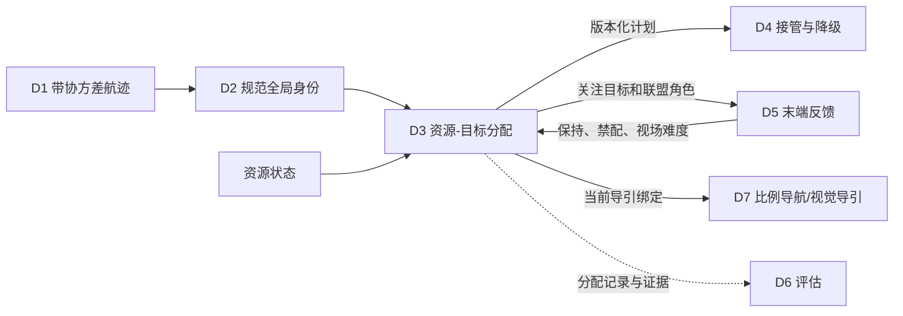

# D3 集中式资源-目标分配算法与实施方案

> 状态基线：2026-07-13。
>
> 本文依据本模块当前源码、测试、`README.md`、`PLAN.md`、
> `docs/MODULE_PRINCIPLES_CN.md` 和根目录系统汇总同步编写。本文区分默认主线、
> 已实现辅助能力、可选离线对照和未实现能力，不把计划项写成已完成能力。

## 1. 模块定位

D3 是反无人机系统（Counter-Unmanned Aircraft System，C-UAS）科研仿真流程中的
集中式资源-目标分配模块。它在中心节点可用时接收 D2 维护的规范全局航迹和资源状态，
生成版本化 `AssignmentPlan`（分配计划），并向下游提供：

1. 资源与 `global_track_id`（规范全局航迹标识）的绑定；
2. 普通一资源对一目标分配；
3. 高威胁目标的多资源联盟分配；
4. 计划版本、迟滞、有效期和旧版本拒绝证据；
5. D5 末端视觉反馈的保守写回入口；
6. D4 二级节点接管时可继承的中心计划基线；
7. D7 可消费但不能自行修改的导引绑定；
8. D6 可记录和统计的分配证据。

D3 输出的是科研仿真候选计划，不执行飞行控制，不决定目标身份，不执行分布式选主，
也不生成真实处置授权。默认 `human_authorization_state`（人工授权状态）为
`required`（需要授权），仿真运行时可由外部授权层传入记录态；D3 本身不能绕过授权。

## 2. 术语和缩写

| 中文名称 | 英文全称与缩写 | 本模块含义 |
|---|---|---|
| 应用程序编程接口 | Application Programming Interface，API | 模块公开函数和结构化调用合同 |
| 数据传输对象 | Data Transfer Object，DTO | 只携带结构化数据、不执行控制的对象 |
| 北-东-地坐标系 | North-East-Down，NED | 上游融合工作坐标系；D3 消费结果但不负责坐标转换 |
| 视场 | Field of View，FOV | 某资源持续观察和确认某目标的相对困难程度 |
| 预计到达时间 | Estimated Time of Arrival，ETA | 上游或 D7 提供的可达性信息；当前 D3 不求解完整到达动力学 |
| 到达关键区时间 | Time to Critical Zone，TTC | D3 可解释威胁基线中的时间紧迫度；不同于 D7 末端语境的预计碰撞时间 |
| 线性和分配问题 | Linear Sum Assignment Problem，LSAP | 普通匈牙利一对一匹配模型 |
| 动态规划 | Dynamic Programming，DP | SciPy 不可用时的小规模后备求解方法 |
| 约束规划-可满足性 | Constraint Programming-Satisfiability，CP-SAT | 规划中的复杂约束离线参考方法，当前未实现 |
| 混合整数线性规划 | Mixed-Integer Linear Programming，MILP | 规划中的联盟全局参考方法，当前未实现 |
| 确认应答 | Acknowledgement，ACK | D4 联盟提交协议中的确认消息，不由 D3 产生 |
| 比例导航 | Proportional Navigation，PN | D7 中段导引方法，不属于 D3 |
| 比例导航制导 | Proportional Navigation Guidance，PNG | D7 末端视觉导引方法，不属于 D3 |
| 微软空中信息与机器人仿真器 | Aerial Informatics and Robotics Simulation，AirSim | 由 main 运行时负责启动、重置和场景编排 |
| 简化飞行控制后端 | SimpleFlight | AirSim 内的多旋翼飞行控制后端，不是 D3 求解器 |

MSM 是项目既定代号，D1-D7 是模块编号，不作为英文缩写展开。
本文将目标数记为 \(m\)，资源数记为 \(n\)。项目材料中的“动态 M 对 N”包含两层含义：

- \(m\) 与 \(n\) 可以相等，也可以不相等，并可在运行中变化；
- 单个目标 \(i\) 还可以要求 \(k_i>1\) 个资源组成联盟。

2 对 2、5 对 5 和 5 资源/2 目标只是试验配置，不是算法规模上限。

## 3. 系统位置和数据流



边界规则如下：

- D1/D2 提供位置、速度、协方差、规范全局航迹身份和关联风险；
- D3 只引用 `global_track_id`，不创建、合并或重命名规范航迹；
- D5 可以报告锁定、模糊、重复锁定和跨视角冲突，但不能本地改写分配；
- D4 决定是否由中心、二级节点或完全分布式路径持有计划；
- D7 只执行当前、有效、角色允许且通过 D4/D5 门控的绑定；
- D6 被动消费计划、拒绝、重分配和联盟证据。

## 4. 输入数据结构

### 4.1 目标航迹 `TargetTrack`

| 字段 | 含义 | 算法用途 |
|---|---|---|
| `track_id` | D2 维护的规范全局航迹标识 | 分配目标身份，不允许 D3 改名 |
| `threat_score` | 归一化威胁分数 | 降低高威胁目标分配成本并提高其未分配惩罚 |
| `covariance` | 上游协方差的标量摘要 | 构成航迹不确定性惩罚 |
| `window_cost` | 当前软窗口代价 | 对开放可行边排序 |
| `assignable` | 是否允许进入分配 | 为假时所有真实资源边硬拒绝 |
| `fov_difficulty_by_resource` | 按资源的视场困难度 | 接收 D5/main 写回并进入边代价 |
| `conflict_risk_by_resource` | 按资源的冲突风险 | 进入边代价 |
| `feasibility_by_resource` | 按资源的硬可行性 | 为假时对应边硬拒绝 |
| 硬时间窗字段 | 开启、关闭、状态和资源特定窗口 | 当前规划时刻位于窗外时硬拒绝 |
| `demand` | 可选 `TargetDemand` | 为空时严格退化为单资源独立需求 |
| `metadata` | 来源、反馈和审计信息 | 不得作为未定义控制命令 |

D1/D2 的 `measurement_timestamp`（量测时间戳）和
`arrival_timestamp`（到达时间戳）仍由上游合同保留。D3 的 `timestamp`
是规划评估时刻，不能替代这两个传感器时间语义。

### 4.2 资源状态 `ResourceState`

| 字段 | 含义 | 算法用途 |
|---|---|---|
| `resource_id` | 资源身份 | 每个资源最多占用一个可执行需求槽 |
| `status` | 可用、忙碌、降级或不可用 | 不可用硬拒绝，降级增加代价 |
| `health_score` | 健康程度 | 健康越差，资源状态代价越高 |
| `busy_until` | 忙碌截止时刻 | 当前时刻早于该值时硬拒绝 |
| `operator_hold` | 外部保持状态 | 为真时该资源全部边硬拒绝 |
| `capability_class` | 资源能力类别 | 与多资源需求槽能力匹配 |
| `energy_fraction` | 剩余能量比例 | 为零时硬拒绝，其余进入代价 |
| `availability_score` | 可用性分数 | 为零时硬拒绝，其余进入代价 |
| `current_load` | 当前负载 | 进入资源状态代价 |
| `history_failure_rate` | 历史失败率 | 进入资源状态代价 |
| 目标可达字段 | 按目标的可行性和可达分数 | 硬拒绝或提高资源风险 |

### 4.3 多资源目标需求 `TargetDemand`

显式需求的核心参数是：

- \(k_i=\)`required_resource_count`：目标所需资源总数；
- \(p_i=\)`primary_resource_count`：其中主资源数量，满足
  \(1\le p_i\le k_i\)；
- `coordination_mode`：独立、同时、顺序或混合；
- `required_capability_counts`：各能力类别所需槽数；
- 到达窗口起止时刻、波次间隔和最小间隔；
- `terminal_authorization_scope="per_primary"`：每个主资源独立接受末端门控；
- `arrival_coordination_required=False`：当前阶段不要求同时到达。

只有显式构造 `TargetDemand()` 时，研究默认才是
**2 个主资源（primary）+ 1 个备用资源（reserve）**。未提供 `demand` 的普通目标
自动形成 \(k_i=1,p_i=1\) 的独立需求，不能把所有目标都误写成默认需要三架资源。

## 5. 输出数据结构

### 5.1 单条分配 `Assignment`

单条分配记录目标、资源、总成本、成本分解、可行性、计划版本、联盟标识、联盟版本、
成员角色、波次和到达窗口。多资源场景下，同一目标可以合法拥有多条分配。

### 5.2 版本化计划 `AssignmentPlan`

计划至少包含：

- `plan_id`、`version`、`previous_plan_id` 和 `window_id`；
- `resource_count`、`target_count` 和实际矩阵形状；
- 可执行 `assignments` 和 `unassigned_target_ids`；
- 当前、候选和旧计划重评分成本；
- `decision_state`、`changed` 和人工授权状态；
- `coalitions`、`demand_summaries` 和 `incomplete_target_ids`；
- 来源节点、目标节点、链路类型、计划所有者和有效期；
- 代价矩阵、拒绝原因、迟滞理由和反馈配置等审计元数据。

多资源调用方必须使用 `assignments_by_target()`。旧
`assignment_map()` 只适用于每个目标恰好一条分配，遇到合法多资源目标会抛出错误，
避免静默丢掉联盟成员。

### 5.3 联盟 `CoalitionPlan`

联盟记录：

- 联盟身份、版本、纪元和状态；
- 目标需要数、已分配数、缺口数和完整性；
- 成员资源、主用/备用/重试角色；
- 波次、能力要求和到达窗口；
- 成员是否可执行。

完整联盟状态为 `committed`（已提交）；资源或能力不足时状态为
`incomplete`（不完整）。不完整联盟保留候选成员和缺口证据，但不发布可执行分配。

## 6. 数学模型

### 6.1 普通一对一模型

令 \(x_{ij}\in\{0,1\}\) 表示资源 \(j\) 是否分配给目标 \(i\)。普通目标满足：

\[
\sum_{j=1}^{n}x_{ij}\le1,\qquad
\sum_{i=1}^{m}x_{ij}\le1.
\]

目标函数为：

\[
J=
\sum_{i=1}^{m}\sum_{j=1}^{n}x_{ij}
\left(C_{ij}+S_{ij}\right)
+\sum_{i=1}^{m}u_iU_i,
\]

其中：

- \(C_{ij}\) 是可解释基础边代价；
- \(S_{ij}\) 是目标从旧资源切换到新资源时的切换惩罚；
- \(u_i=1\) 表示目标选择虚拟未分配列；
- \(U_i\) 是未分配惩罚。

当前未分配惩罚为：

\[
U_i=C_{base}(0.5+q_i),
\]

其中 \(q_i\) 是威胁分数，\(C_{base}\) 是
`unassigned_base_cost`。高威胁目标因此更不容易被保留为未分配。

### 6.2 多资源需求槽模型

当目标 \(i\) 需要 \(k_i>1\) 个资源时，将目标展开为
\(\ell=1,\ldots,k_i\) 个需求槽。定义 \(x_{i\ell j}\) 表示资源 \(j\) 是否占用槽
\(\ell\)：

\[
\sum_j x_{i\ell j}\le1,\qquad
\sum_{i,\ell}x_{i\ell j}\le1.
\]

理想的联盟全有或全无约束可写为：

\[
\sum_{\ell,j}x_{i\ell j}=k_i z_i,\qquad z_i\in\{0,1\}.
\]

当前默认代码没有用混合整数线性规划直接求解 \(z_i\)。它采用需求槽启发式准入，
在发布层保证全有或全无，不能据此宣称获得复杂联盟全局最优解。

## 7. 可解释代价模型

对可行目标-资源边，基础代价为：

\[
\begin{aligned}
C_{ij}={}&
w_w C^{window}_{ij}
+w_p C^{cov}_{i}
+w_t(1-q_i)\\
&+w_r C^{resource}_{ij}
+w_f C^{fov}_{ij}
+w_c C^{conflict}_{ij}.
\end{aligned}
\]

### 7.1 接近窗口

`window_cost` 表示当前滚动时刻的软窗口偏好。它只排序开放边，不等于真实飞行到达时间，
也不构成完整时空轨迹约束。

### 7.2 航迹不确定性

`covariance` 来自 D1/D2 的航迹不确定性摘要。数值越大，错误分配和末端配准风险越高，
代价越大。D3 不修改协方差，也不把缺失协方差伪装为高精度。

### 7.3 威胁度

边代价使用 \(1-q_i\)，未分配惩罚随 \(q_i\) 增大。模块还提供
`compose_threat_score_baseline()`，将关键区接近程度、到达关键区时间、速度、
协方差和目标状态组合成可解释基线。该函数不是完整动态威胁评估模型。

### 7.4 资源状态

资源状态项综合健康、能量、可用性、当前负载、历史失败率和旧接口负载惩罚。不可用、
人工保持、仍在忙碌、能量为零、可用性为零或目标不可达会形成硬拒绝，而不是仅增加小代价。

### 7.5 视场与冲突

视场困难度可接收 D5 对遮挡、目标重叠、检测不稳定和跨视角困难的反馈。冲突风险用于表达
资源空间或任务冲突摘要。当前二者都是边级特征，不等同于真实多机路径冲突求解。

### 7.6 硬时间窗和拒绝

目标可配置通用或资源特定的硬时间窗。当前规划时刻尚未进入窗口、已经超过窗口或状态明确
关闭时，对应边直接拒绝并导出原因。当前实现没有用真实预计到达时间求解多窗口连续动力学。

## 8. 默认求解算法

### 8.1 普通匈牙利路径

普通目标使用 SciPy 科学计算库的
`scipy.optimize.linear_sum_assignment()` 求解线性和分配问题。矩阵右侧为每个目标
增加一个虚拟未分配列，因此 \(m>n\)、\(m<n\) 和 \(m=n\) 使用同一接口。

选择匈牙利算法作为默认主线的原因是：

- 适合当前中心化一资源占用一个任务槽的基线；
- 结果确定、透明、易于重放；
- 复杂度通常记为 \(O(r^3)\)，其中 \(r\) 是补齐后的矩阵规模；
- 可以完整保留每条边的成本分解和拒绝原因；
- 不需要复杂求解器运行时。

SciPy 不可用时可使用小规模位掩码动态规划后备。后备路径的列数上限为 22，包含真实资源列
和虚拟未分配列，因此不能把它当作大规模替代后端。

### 8.2 多资源需求槽路径

显式多资源需求由 `HungarianDemandSlotSolver` 执行：

1. 按目标需求展开角色、波次、能力和窗口槽；
2. 将目标-资源边代价复制到各槽；
3. 应用能力门控、D5 反馈保护和旧主资源保护；
4. 对高威胁目标施加更高准入优先级；
5. 使用匈牙利算法求解槽-资源匹配；
6. 若目标只得到部分槽，选择低优先目标整目标退出活动集合；
7. 重新求解，直到剩余目标均完整满足；
8. 只把完整联盟发布为可执行 `Assignment`；
9. 对退出目标保留缺口、候选成员和拒绝证据。

该方法保证**发布层全有或全无准入**。它是轻量确定性启发式，不保证与
约束规划-可满足性或混合整数线性规划参考模型具有相同全局最优解。

## 9. 角色、波次和窗口

| 协同模式 | 角色和波次 | 当前含义 |
|---|---|---|
| 独立 | 一个主资源，波次 0 | 普通一对一目标 |
| 同时 | 所有成员为主资源，波次 0 | 共享合同窗口；是否要求同步仍由显式字段决定 |
| 顺序 | 首个成员为主资源，后续为重试资源 | 波次依次递增 |
| 混合 | 前 \(p_i\) 个为波次 0 主资源，其余为波次 1 备用资源 | 当前高威胁研究默认 |

第 \(w\) 波的合同窗口为：

\[
[t_i^{start}+w\Delta_i,\ t_i^{end}+w\Delta_i],
\]

其中 \(\Delta_i\) 是波次间隔。

当前默认高威胁方案是 **2 primary + 1 reserve**：

- 两个主资源分别接受 D4、D5 和 D7 门控；
- 一个备用资源保留容量但保持待命；
- 备用绑定固定为 `hold/reserve_standby_not_activated`；
- 只有新版本计划将其角色改为主资源或重试资源后，才可能进入执行；
- 当前 `arrival_coordination_required=False`，不要求两个主资源同时到达；
- 到达窗口是计划合同，不代表 D3 已经实现同步导引。

## 10. 滚动重规划与迟滞

### 10.1 全局迟滞

候选计划形成后，D3 将旧分配在当前矩阵上重新计价。默认相对改善阈值为
\(\delta=0.2\)，最小驻留时间为 \(T_{min}=2.0\) 秒。普通换配需满足：

\[
J_{new}<(1-\delta)J_{old},\qquad
T_{dwell}\ge T_{min},
\]

并满足可选的单窗口最大变更数限制。

以下情况可以释放普通迟滞：

- 旧计划边已经不可行；
- 候选显著降低高威胁未分配目标数；
- 收益、驻留和变更限制同时满足。

否则保持旧分配，决策状态标为迟滞保持，并用当前矩阵更新诊断成本。

### 10.2 切换惩罚

`reassignment_switch_penalty` 在求解前加入矩阵：

- 旧目标换到不同可行资源时计一次；
- 保持原资源不计；
- 新目标、不可行边和未分配列不计；
- 求解器目标值、分配成本、成本分解和证据使用同一数值。

这避免求解后再次追加惩罚造成目标值和证据不一致。

### 10.3 联盟成员迟滞

多资源目标按目标维护成员最近变化时刻。旧联盟完整且旧边仍可行时，成员或角色替换同样需要
20% 成本改善和 2 秒驻留。资源失效、硬禁配、需求结构变化和主资源硬冲突会立即释放。

普通成本评估刷新不会重置成员驻留时钟，也不会推动联盟版本和纪元。

### 10.4 短时视觉反馈驻留

D5 报告“主资源锁定稳定性不足”或短暂重新获取时，D3 在普通迟滞前应用帧级驻留：

\[
F_{effective}=\max(F_{D3},F_{D5}),
\]

其中 D3 默认最少 2 帧，不能削弱 D5 要求的更长稳定窗口。版本匹配且旧主资源仍可行时，
在窗口完成前保持旧主资源。窗口完成只结束该前置保护，soft candidate 仍必须进入联盟成员和
全局 `delta/min_dwell/change-limit` 迟滞，不能直接发布新执行版本。

重复锁定、verified friend/友方冲突、错误绑定、资源不可用、显式禁配或旧边不可行会立即绕过驻留；普通检测丢失仍是当前边 soft feedback。
其他计划版本的反馈只用于审计。

## 11. 计划身份、版本和旧计划拒绝

`AssignmentPlanner` 是单个仿真回合内有状态的规划器：

1. 首次规划允许 `previous_plan=None`，创建版本 1；
2. 当前计划发布后，下一次规划必须精确传入该计划；
3. 缺失前序计划会抛出 `StalePlanError(reason="previous_plan_required")`；
4. 计划标识、版本或 `expected_previous_version` 不匹配时硬拒绝；
5. `publish=False` 只生成候选，不推进当前身份；
6. 新仿真回合必须新建规划器实例，不存在隐式重置。

计划执行身份由 `execution_signature()`（执行签名）决定。签名覆盖资源、目标、联盟、
角色、波次、窗口、所有者、授权和激活/租约语义：

- 只更新成本和诊断时，保留计划标识、版本、创建时刻和联盟纪元；
- 执行签名变化时，生成严格连续的新版本；
- 强制重规划但签名不变时返回 `replan_ack_no_change`；
- 强制重规划且签名变化时返回 `replan_applied`；
- 跨中心/二级所有者切换形成明确的新计划谱系。

旧版本不能因为尚未超过 `stale_after_s` 就覆盖当前版本；“新鲜”与“当前身份”是两个独立门控。

## 12. D5 反馈闭环

`evaluate_terminal_feedback()` 将 D5/main 已聚合的末端证据映射为保守建议：

| D5 状态 | D3 建议 | 实施方式 |
|---|---|---|
| 一致 | 继续 | 保持当前计划 |
| 模糊、普通保持 | 保持 | 当前资源-目标边 soft cost + D7 hold，不设置资源 `operator_hold` |
| 重新获取、几何/FOV/检测不稳定 | 中心重规划 | 提高当前边代价并进入普通迟滞，不硬禁配 |
| 友方重叠保持 | 保持 | resource-hard，整资源保持 |
| verified friend | 保持 | target-hard，目标停止分配 |
| 不匹配、多帧不一致、跨视角冲突 | 二级仲裁 | 请求 main/D4 仲裁 |
| 重复末端锁定风险 | 二级仲裁 | 禁配冲突边并阻断本地换绑 |

`apply_terminal_feedback_to_planner_inputs()` 可将权威反馈写入下一轮：

- 将安全身份冲突、duplicate 或显式 feasibility reject 边设置为 `feasibility_by_resource=False`；
- 对普通 ambiguous/hold/reacquire、几何/FOV/检测不稳定提高对应 `fov_difficulty_by_resource`；
- 仅对明确 resource-hard 风险设置 `operator_hold=True`，verified friend 则设置 target-hard；
- 保留源计划、联盟、稳定帧和冲突原因；
- 输出 constraint class、scope、classification reason 和 hard-reject 审计字段；
- 给 D4 形成仲裁建议，给 D7 形成保持动作。

`allow_local_rebind` 始终为假。D5 的本地视觉身份不能替换 D3 中的规范全局航迹绑定。

备用资源的软反馈采用角色感知保护：若所有旧主资源仍一致、至少一个备用资源只报告软保持或
重新获取，且旧主资源边仍可行，D3 固定健康主资源，只允许重解备用槽，避免健康主资源被旋转
成备用角色。

## 13. D4 接管接口

D3 不决定主动或被动降级，也不选择二级节点。D4/main 负责健康判断、节点选择、领导者纪元、
租约续期、完全分布式协商和中心恢复仲裁。

D3 为 D4 提供三类能力：

1. `AssignmentValiditySummary`：计划年龄、分配延迟、成本差、旧版本、重复分配、
   高威胁未分配、迟滞和重分配计数；
2. 最新中心计划：作为二级或分布式协商基线；
3. 二级计划盖章和续行合同。

`prepare_secondary_takeover_plan()` 只在 main/D4 已提供以下证据后激活候选：

- 具体二级节点；
- 持续满足的接管就绪状态；
- 激活时刻；
- 有效且未过期的租约；
- 正数且单调的领导者纪元；
- 精确替代的中心计划身份。

`continue_active_secondary_plan()` 要求同一二级所有者、严格前序连续性、不回退的纪元和租约。
main 应先用 `publish=False` 产生候选，再盖章或续行，最后调用
`publish_plan()`，避免中间中心候选错误推进当前版本。

中心和二级节点都失效时，D4 负责基于共识的捆绑算法
（Consensus-Based Bundle Algorithm，CBBA）或拍卖式协商。D3 不实现该协议，只提供
最新中心联盟、需求和版本语义作为参考。

## 14. D7 导引绑定

`guidance_bindings_from_assignment_plan()` 为每个合法成员生成
`AssignmentGuidanceBinding`（分配-导引绑定），携带：

- 当前计划和联盟身份、版本；
- 资源和规范全局航迹绑定；
- 主用/备用/重试角色；
- 波次、协同模式和合同窗口；
- 人工授权、有效期、所有者和链路；
- 当前、保持、旧版本、撤销或已换配状态。

活动绑定至少要求：

1. 计划身份等于 main 声明的当前身份；
2. 计划未过期、未撤销且资源未保持；
3. 联盟已提交、版本一致且需求完整；
4. 成员不是未激活备用资源；
5. 二级计划已激活、持续就绪、纪元单调且租约有效。

D7 还要独立检查 D4 许可和 D5 的末端锁定。D3 只发布绑定，不计算比例导航或视觉比例导航，
不发飞控命令，也不授权处置。

当前两个主资源是**独立门控**：每个主资源分别满足当前计划、D4 许可、D5 锁定和 D7 控制条件
即可执行。本阶段不把“同时到达”设为成功前提。

## 15. 增量规划

`plan_incremental()` 是已实现辅助入口，不会根据一次耗时自动替换默认全量规划。流程为：

1. 校验精确前序计划和输入指纹；
2. 比较调用方声明的变化目标/资源与实际变化；
3. 在当前可行二部图上定位受影响连通分量；
4. 只求解安全的局部分量；
5. 保留其他仍可行分配、联盟身份、角色和波次；
6. 合并完整候选后再执行统一反馈驻留、成员迟滞和全局迟滞。

缺少快照、漏报变化、目标/资源集合变化、需求变化、计划过期、时间相关约束或受影响分量扩展
到全局时，会带 `incremental_fallback_reason` 回退全量规划。版本不一致仍是硬错误，
不能静默回退。

## 16. 一次全量规划的实施流程

### Canonical 单 planning-tick 历史

主运行时在每次成功规划后调用：

```python
record = plan_history_record_from_plan(
    plan,
    sequence_index=tick_sequence_index,
    timestamp=planning_timestamp_s,
    previous_plan=previous_plan,
    feedback_metadata=None if writeback is None else writeback.metadata,
)
payload = record.to_dict()
```

`PlanningTickHistoryRecord` 使用 `d3_plan_history_record_v1`。main 提供的
`sequence_index` 和 `timestamp` 形成 `[sequence_index, timestamp]` 字典序，
不能从计划版本推断 tick 顺序。计划级字段只记录一次；assignment 按目标、联盟、
波次、角色、资源排序，coalition member 也稳定排序。记录覆盖 primary/reserve 的
active/standby、联盟 id/version/epoch、有效性和成本，以及迟滞、成员变化、soft/hard
feedback、总/候选/前序成本和 stale/rollback/replan 原因。

`to_dict()` 只输出 JSON 原生值，使用白名单而不是透传整个 metadata，并排除 truth
命名字段。`assignment_records_from_plan()` 兼容不变。D3 只定义单 tick schema；JSONL
写盘属于 main，跨 tick churn 计算属于 D6。

```text
输入 TargetTrack[]、ResourceState[]、当前时刻、精确 previous_plan
    |
    +-- 1. 校验 plan_id/version/expected_previous_version
    +-- 2. 构造边成本、硬拒绝、未分配成本和输入快照
    +-- 3. 在求解前加入一次切换惩罚
    +-- 4. 无显式 k>1 -> 普通匈牙利
    |       显式 k>1 -> 需求槽匈牙利 + 全有或全无准入
    +-- 5. 形成 Assignment、CoalitionPlan 和需求满足摘要
    +-- 6. 应用短时 D5 反馈驻留
    +-- 7. 应用联盟成员迟滞
    +-- 8. 应用全局成本/驻留迟滞
    +-- 9. 比较执行签名并确定计划身份和版本
    +-- 10. publish=True 时正式发布
    +-- 11. 导出 D4 摘要、D6 记录和 D7 绑定
```

核心伪代码如下：

```python
def plan(tracks, resources, now, previous_plan):
    validate_previous_identity(previous_plan)
    matrix = cost_model.build_matrix(tracks, resources, now)
    matrix = add_switch_penalty_once(matrix, previous_plan)

    if uses_demand_slots(tracks):
        slots = expand_role_wave_capability_slots(tracks)
        candidate = demand_slot_hungarian(slots, resources, matrix)
        candidate = remove_partial_coalitions_and_resolve(candidate)
    else:
        candidate = hungarian_with_unassignment(matrix)

    candidate = apply_transient_terminal_feedback_dwell(candidate, previous_plan)
    candidate = apply_coalition_membership_hysteresis(candidate, previous_plan)
    selected = apply_global_hysteresis(candidate, previous_plan)
    selected = assign_identity_from_execution_signature(selected, previous_plan)
    return publish_if_requested(selected)
```

## 17. 代码模块对应关系

| 文件 | 实施职责 |
|---|---|
| `models.py` | DTO、计划身份、D5 反馈、D4 接管、D6 记录、canonical history 和 D7 绑定 |
| `costs.py` | 可行性门控、成本矩阵、硬时间窗和成本分解 |
| `solver.py` | SciPy 匈牙利、动态规划后备和需求槽求解 |
| `planner.py` | 全量/增量规划、全有或全无准入、迟滞和版本发布 |
| `cooperative_prescreen.py` | 末端距离、到达窗口和扇区候选预筛 |
| `calibration.py` | 动态非等量场景的全量/增量配对校准 |
| `fixtures.py` | 5v5、3v5、5v3 和动态事件确定性夹具 |
| `min_cost_flow.py` | 可选 OR-Tools 最小费用流隔离求解器 |
| `p2_benchmark.py` | SciPy 容量列展开与可选最小费用流同输入对照 |

## 18. 默认、可选和未实现边界

| 分类 | 能力 | 2026-07-13 状态 |
|---|---|---|
| 默认主线 | SciPy 匈牙利普通分配 | 已实现并作为默认一对一后端 |
| 默认主线 | 匈牙利需求槽与全有或全无发布 | 已实现；是轻量启发式，不是 MILP 全局最优 |
| 默认主线 | 可解释成本、硬可行性、迟滞、版本和旧计划拒绝 | 已实现 |
| 默认主线 | 2 primary + 1 reserve 显式高威胁需求 | 已实现；普通无需求目标仍是 \(k=1\) |
| 已实现辅助 | 保守增量规划 | 已实现，条件不满足时回退全量 |
| 已实现辅助 | D5 反馈写回、主资源保护和短时反馈驻留 | 已实现，真实权重仍需继续标定 |
| 已实现辅助 | D4 二级接管盖章/续行和 D7 多绑定 | 已实现 D3 合同层 |
| 已实现辅助 | 27 组协同候选预筛 | 已实现，不改变求解主线 |
| 可选离线对照 | SciPy 容量列展开基准 | 已实现隔离对照 |
| 可选离线对照 | 谷歌 OR-Tools 运筹优化工具库最小费用流 | 代码接口已实现；当前环境未安装，不进入默认规划器 |
| 未实现 | CP-SAT/MILP 联盟全局参考模型 | 仅研究计划 |
| 未实现 | 完整多窗口、连续动力学和承诺前缀优化 | 仅研究计划 |
| 未实现 | 生产级分布式联盟协商 | 属于 D4，不属于 D3 |
| 未实现 | 多主资源同步到达控制 | 当前明确不要求，具体导引属于 D7 |

不得声称 OR-Tools、最小费用流、约束规划-可满足性或混合整数线性规划已经替换默认
SciPy 匈牙利/需求槽主线。

## 19. 2026-07-14 验证证据

### 19.1 模块回归

当前 D3 回归基线为：

```text
157 passed, 1 skipped
```

唯一跳过项是当前环境缺少可选 OR-Tools 的已安装求解测试。标准命令为：

```bash
python3 -m pytest -q research_modules/d3_assignment_planner/tests
```

本轮在既有 feedback 分级/迟滞 case 上新增 5 个 canonical history case，并运行全量模块测试。新增覆盖 primary/reserve、owner/epoch/lease、soft/hard feedback、迟滞/成本、稳定排序、严格 JSON 序列化、旧 metadata、truth 排除和 ordering 输入校验。唯一跳过项仍是当前环境缺少可选 OR-Tools 的已安装求解测试。

### 19.2 确定性动态规模校准

8 类夹具覆盖：

- 5v5；
- 3v5；
- 5v3；
- 新目标出现；
- 资源失效；
- 高威胁目标需求变化；
- D5 备用资源反馈；
- 硬时间窗变化。

全量和增量规划在 8/8 转换中达到分配与成本等价，并输出回退原因、联盟缺口、
高威胁未分配和角色保持证据。该结果证明接口一致性，不等于真实 AirSim 多种子性能已经闭合。

### 19.3 计算机视觉合同验证

2026-07-11 的 5 资源/2 目标 AirSim 计算机视觉模式 10 个随机种子中，高威胁目标
`T001` 的双主资源视觉共识与当前计划门控达到 8/10；种子 7 和 27 保留为回归样例。
这关闭的是 D3 多资源合同层，不等同于物理拦截完成。

### 19.4 SimpleFlight 物理闭环

2026-07-13 完成 40 个 5 资源/2 目标 SimpleFlight 回合，每种配置 10 个随机种子：

| 配置 | 联盟完成数 |
|---|---:|
| 基线 | 0/10 |
| 20 米末端交接 / 3 秒主资源窗口 / 40 度扇区 | 5/10 |
| 20 米末端交接 / 5 秒主资源窗口 / 40 度扇区 | 2/10 |
| 20 米末端交接 / 8 秒主资源窗口 / 40 度扇区 | 1/10 |

最佳候选是 5/10，低于 8/10 验收门限。全部配置合计是 8/40，不能误写为 40 个独立候选。
主要失败来自 D5 未锁定和末端检测获取超时，少量失败来自检测框面积过小。

2026-07-14 已修复普通 pair hold 被扩大为资源 `operator_hold` 的 D3 根因机制，并以 5 个新增
确定性 case 验证 soft/hard 分类和 `min_dwell`。该机制是解释 40-case churn 的根因线索，
不是已证明因果：正式 aggregate 缺逐 planning tick 的 plan/feedback/迟滞历史，不能把某次
成员变化或物理失败归因于该机制。

安全合同保持：

- 备用资源越权执行：0；
- `global_track_id` 本地改写：0；
- 在线使用 AirSim 真实身份标签：0。

D4 故障矩阵还证明二级和分布式提交正例可以消费 D3 当前绑定；缺确认应答时按保守原则关闭
D7 执行许可。该结果不代表 D3 实现了 D4 的通信和共识协议。

## 20. 当前结论与剩余工作

当前默认主线继续采用 SciPy 匈牙利算法、需求槽全有或全无准入、可解释成本、版本和迟滞。
已有证据没有支持切换到更复杂求解后端。

D3 当前没有开放的优先级零或优先级一合同层阻塞项；优先级一的真实物理性能和参数标定仍然
开放，最佳联盟完成数只有 5/10。这里的优先级零、优先级一和优先级二分别对应仓库中的
Priority 0、Priority 1 和 Priority 2（P0、P1、P2）工作分级。

仍需补充的证据包括：

1. D3 已提供 canonical 单 tick history schema/export，但 main 尚未写入 40 回合正式 aggregate，D6 也未计算联盟成员/版本抖动；feedback 扩大机制仅为根因线索，尚不能形成因果结论；
2. 真实 3v5、5v3、目标新增、资源失效和高威胁需求变化仍缺多种子标定；
3. D5 反馈权重、视场困难度、禁配边、驻留和切换惩罚尚未联合标定；
4. 硬时间窗尚未接入真实预计到达时间、多窗口和连续动力学；
5. 完整动态威胁模型仍未建立；
6. 需求槽准入不具备 CP-SAT/MILP 意义下的全局最优证明；
7. OR-Tools 当前未安装，最小费用流只有隔离合同和结构化不可用证据；
8. 当前不要求主资源同时到达，不能从窗口字段推断已实现同步协同。

## 21. 文档维护原则

后续只有代码、测试和正式验证证据已经改变能力状态时，才更新本文对应结论。更新时必须：

- 保持动态 \(m\) 目标/\(n\) 资源，不写死 2v2 或 5v5；
- 保持 `global_track_id` 的中心所有权；
- 保持计划版本、前序连续性和旧版本拒绝；
- 区分合法多资源联盟与异常重复分配；
- 区分计划窗口与真实同步到达；
- 区分默认主线、可选离线对照和未实现能力；
- 不把一次候选结果或缺失依赖写成默认算法升级。

## 22. Hold 分支的执行范围实现（2026-07-14）

### 22.1 问题

原 hold 分支使用 `_score_previous_plan(...)` 返回的 `previous_unassigned` 构造输出。
该集合是把上一 assignment 投影到“当前”目标矩阵后得到的，因此会包含本 tick 新出现
但尚未获准执行的目标。`AssignmentPlan.execution_signature()` 又包含
`unassigned_target_ids` 和 coalition，结果是 `decision_state=held_*` 仍可能推进
plan ID/version。

### 22.2 修复

普通迟滞、联盟成员迟滞和 transient feedback dwell 的 held plan 现在使用：

```python
unassigned_target_ids = previous_plan.unassigned_target_ids
incomplete_target_ids = previous_plan.incomplete_target_ids
coalitions = previous_plan.coalitions
assignments = rescored_previous_assignments
```

重评分成本只用于评估，assignment 的目标、资源、角色、coalition version 和激活语义
不变。当前候选范围通过 `_held_candidate_scope_metadata(...)` 输出，不参与 executable
identity。字段包括：

- `hysteresis_candidate_target_ids`；
- `hysteresis_candidate_unassigned_target_ids`；
- `hysteresis_candidate_incomplete_target_ids`；
- `hysteresis_held_execution_target_ids`；
- `hysteresis_pending_new_target_ids`；
- `hysteresis_missing_previous_target_ids`。

该实现保留动态 M/N，且没有引入 truth、目标白名单或 D2 身份重绑。

### 22.3 验证边界

新增测试分别覆盖普通一对一迟滞和 `2 primary + 1 reserve` 联盟成员迟滞。新目标进入
时，held plan 的 ID/version 和 execution signature 必须与上一 current plan 一致，
而 `target_count` 与候选审计仍反映当前输入。另外，上一已分配目标从当前矩阵消失时，
`_score_previous_plan(...)` 将上一计划判为
不可行，避免 same-assignment 快路径错误 hold；新版本记录
`previous_missing_execution_target_ids`。当前全量结果为 `157 passed, 1 skipped`。
该测试不证明 D2 新生航迹真实，也不修复 runtime reserve
状态同步。

## 23. 累计 Window Budget 与统一 Comparison Objective（2026-07-14）

### 23.1 两层成本

候选求解目标 (J_{search}) 可以包含稳定搜索所需的正则项，但迟滞收益必须使用同一
口径 (J_{cmp})：

```text
J_search(candidate) = base + switch + soft-feedback shaping + slot search terms
J_cmp(plan) = current base edges + hard feasibility + current unassigned * demand
release if J_cmp(candidate) < (1 - delta) * J_cmp(previous)
```

`_hysteresis_comparison_matrix(...)` 从当前矩阵去除 switch penalty 和由
`apply_terminal_feedback_to_planner_inputs(...)` 标记的 soft FOV 增量；candidate 与
previous 再通过相同的 `_score_previous_plan(...)` 投影到当前 target/demand。硬 reject
不被去除。demand-slot priority 和 primary role pin 只生成候选，不进入单边 gain。
metadata schema 为 `d3_hysteresis_current_objective_v1`，同时输出 search candidate、
comparison candidate 和 comparison previous cost。

### 23.2 累计预算

同一 `window_id=w` 的普通 release 条件改为：

```text
used_w + candidate_change_count <= max_changes_per_window
```

`used_w` 存在 previous plan metadata 中，只有接受执行 assignment 变化时增加；hold 和
evaluation refresh 保持原值，新 `window_id` 从零开始。schema
`d3_cumulative_window_change_budget_v1` 输出 used-before/after、candidate、remaining、
是否满足和 hard bypass reason。目标消失、资源硬失效、高威胁保护及 plan-level
owner/activation/authorization 变化可绕过普通预算；旧版本仍因新 identity fail closed。
联盟成员角色候选继续走 membership hysteresis，不能按 activation 强制释放。

### 23.3 Missing + Hold 顺序

先判定 previous execution target 是否仍存在及旧资源是否硬可行，再决定另一联盟能否
hold。previous-only target 是 lifecycle removal，不生成 membership record。只要有
真实 missing/hard failure，就发布 candidate 新版本；新输出不保留消失目标的
assignment、coalition、demand summary 或 audit。

最新真实动因是 M5N2 seed 1 的 347 records/v1..v35；本批没有重跑 Blocks。5 个新增
确定性测试函数使全量达到 `157 passed, 1 skipped`，接受阈值为零失败。真实至少
10-seed churn、高威胁未分配和物理结果仍需 main+D6 复验。

## 24. Actual-v2 计划身份闭环（2026-07-14）

本批不改变 D3 算法，只校验已写盘产物。tuned 2v2 seed 1 的 command、actual、
24 条 history 均使用 `d3-plan-c3cc6d28c365/1`；M5N2 seed 1 的 command、
actual、214 条 history 均使用 `d3-plan-cfdd088a10e1/1`。D6 history
available/unavailable=`2/0` 且 validation reasons 为空，command/actual/history
身份链 P0 关闭。

M5N2 feedback churn=50，plan version/membership/owner churn=0。物理
pair/target/coalition=`2/3`、`2/2`、`0/1`，第二 primary 最近约 11.02 m；
因此参数稳定性、第二 primary 和多 seed P1 均未关闭。

## 25. 20-Case History 对迟滞实现的复核（2026-07-15）

对 20 个 M5N2 case 的 `d3_plan_history.json` 逐条读取后，迟滞实现的运行证据如下：

| 项目 | 结果 | 实现解释 |
|---|---:|---|
| canonical planning ticks | 3725 | baseline 1869、candidate 1856，全部 schema/version 可用 |
| actual plan/version transitions | 0 | 每 case 仅一个 current `plan_id/version=1` |
| actual coalition roster transitions | 0 | 成员/角色组合在单个 case 内不变化 |
| owner transitions | 0 | 全部为 center / `d3_central` |
| stale rejects / rollback | 0 / 0 | 本批未触发旧计划或身份回退 |
| membership candidate audit | 3555 | 3524 member hold；31 member pass 后由 global hysteresis hold |
| transient feedback dwell hold | 150 | 保护短时反馈，不推进执行身份 |

实现上必须以 consecutive record 的 execution identity/roster transition 计算 actual
churn，不能直接把 `membership_change_records` 数量或 `changed=true` 数量当成换员。
本批每个 case 只有第一个 accepted tick 的 `changed=true`，它表示首次发布，不是重分配。

跨 case 的成员组合不同也不是 churn。D3 通过 demand-slot 成本在每个新 episode 选择
资源；统计“第二 primary”时必须读取 current assignment 的 `member_role=primary` 和
目标绑定，不得固定资源编号。系统 candidate 的非退化门限失败不改变上述 D3 结论，
因为 baseline/candidate 都没有计划版本或 roster 抖动。

物理层的 `collision_stop` 只作为外部 outcome 进入 D6。当前 D3 history 没有碰撞对象
和控制状态，因此不依据该字段自动修改 switch penalty、`delta` 或成员角色。后续如需
调整代价，必须先由 main/runtime 提供可区分的 collision lineage，再做配对标定。
