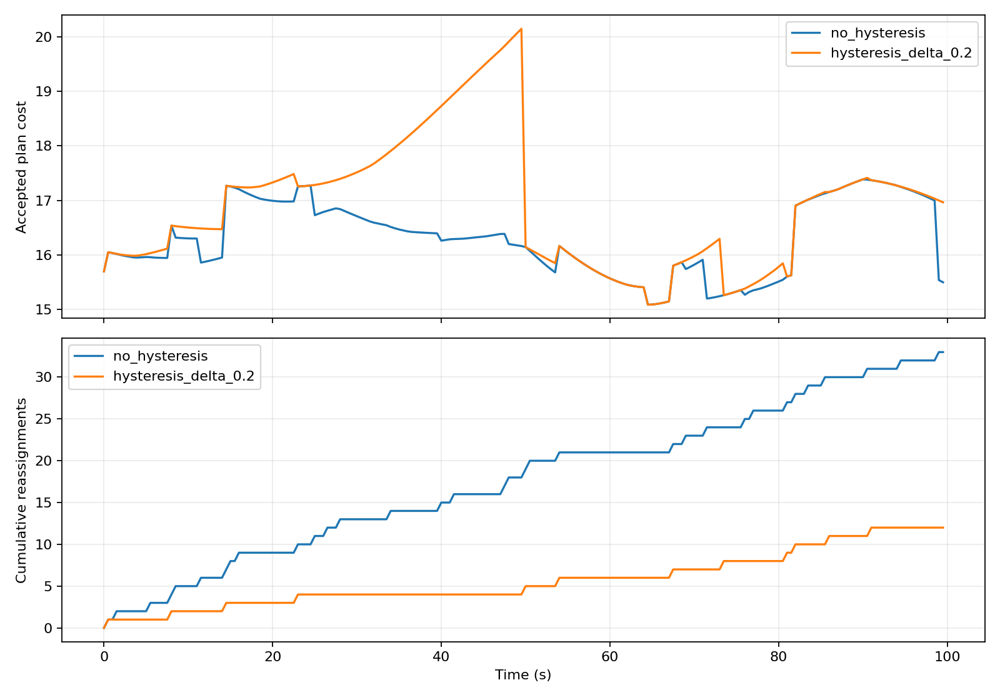
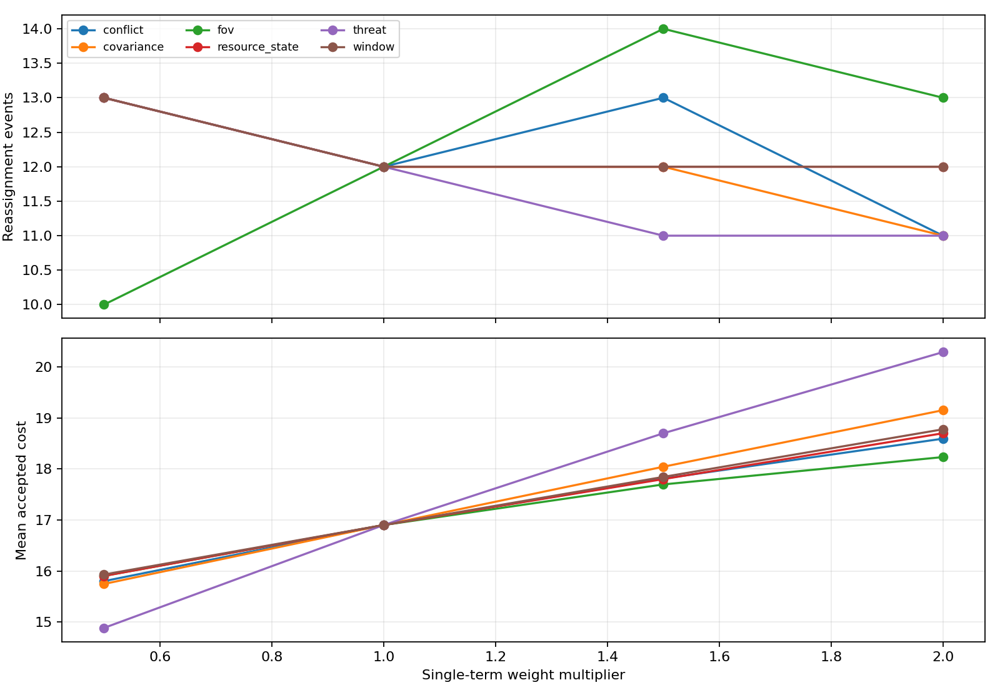

# D3 集中式资源-目标分配实验报告

## 学习准入复核（2026-07-26）

本轮没有运行新的物理仿真，也没有修改模型制品。实际 bundle 位于
`outputs/formal_bc_development_20260720/bundle/`。manifest 和权重 SHA-256 分别为
`a9213d65606a9e2f921040e153488c0f4cdebb10882fa16013fce5b59f9314c0`、
`e3da9fd5b54451da83358405b6051991e0c78bcf9f538b350d459b05faf8e0b2`。

只读加载结果如下：

| 检查 | 结果 |
| --- | --- |
| shadow | loaded=true |
| assist | loaded=false，`bundle_shadow_only` |
| main effective mode | `rule_fallback` |
| A1 正式预检 | 写 episode 前拒绝 |
| C1/F1 正式预检 | D3 条件拒绝，且仍需其他模型独立准入 |

软件负例复核发现，原测试可通过手工把 v3 admission 改为 qualified，并填入正向布尔和
格式正确的占位 SHA，使 loader 返回 loaded。当前 writer 已在写文件前拒绝这种调用；
手工清单即使通过字段和 promotion 校验，也返回
`bundle_assist_evidence_assembler_unavailable`。该结果关闭自我晋级 P0，不产生模型
效果数据。

现有多周期 shadow 汇总文件 SHA-256 为
`5093e5d0b0a3df63ad23f49c543030a52412d71b25fe8a300a446e74825c135c`。该开发结果有
20 个保留 seed 和 120 个绑定差异周期，但没有生产 runtime ACK 或物理结果。D6
profile-bound sidecar 的文件 SHA-256 为
`f3852251daf02ec87fe878e7fb80aad6f381d8c0756a5c956a32e737a3871c3b`，状态为
`pass_offline_assignment_comparison_only`；paired non-degradation 明确不可用。

代码复核保留 v2 shadow 兼容，v2 assist 返回
`bundle_assist_admission_missing`。D6 formal-scope auditor 已具备文件树、实际采用、
物理结果和同键 R0 非退化审计能力，但当前没有实际 A1 审计输出，且该审计器明确不授予
模型晋级。定向测试 `21 passed`；全量结果为 `465 passed, 1 skipped`。本轮结果只证明
准入失败关闭，不构成模型效果证据。

## 正式 R0 滚动需求复验（2026-07-25）

### 原始失败

正式来源为 clean commit `32b3b40`。场景是 `high_threat_m_to_n`，规模 200v200，
seed 1000，时长 2.0 秒。该分片前 44 个单元已完成，第 45 个单元在 `t=1.0` 抛出
`ValueError("coalition demand does not match current demand")`。

诊断显示 `GT3D-000021` 的上一库存是 required=1、assigned=0、无成员的 incomplete
coalition。当前输入把该目标提升为 required=3，候选 coalition 有 3 个成员且完整。
同一时刻其他 12 个高威胁目标出现成员变化，其中多个目标尚未满足 2.0 秒驻留要求。
全局成员迟滞保留上一计划时，把 `GT3D-000021` 的旧空 coalition 一并保留。

### 修复结果

旧计划计分现在先检查需求合同，再处理无 assignment 的目标。需求合同变化使上一计划不可
保留，当前候选按现有求解器和硬约束重新发布。需求未变化的正常成员换位仍受原迟滞控制。

当前工作树按同一场景、规模、seed 和时长完成开发复验：

| 指标 | 结果 |
| --- | ---: |
| episode 有限状态 | true |
| 模拟时长 | 2.0 秒 |
| 在线真值使用 | 0 |
| 需求重建时刻 | 1.0 秒 |
| 重建目标 | GT3D-000021 |
| 当前需求和完成状态 | k=3，complete |
| 最终 assignment | 197 |
| 唯一资源 | 197 |
| 过分配目标 | 0 |
| coalition/需求摘要失配 | 0 |
| D3 全量测试 | 464 passed，1 optional skip |

验收门限是规划过程无异常、有限状态为真、在线真值为 0、重复资源为 0、过分配为 0、当前
需求与 coalition 摘要一致。开发复验满足这些门限。

该结果没有覆盖新的 clean-source formal R0。原失败制品仍绑定 `32b3b40`，不能用当前
未提交工作树结果替换。main 需在新 clean commit 下重建正式执行来源，并重跑该单元和
对应分片。

## 多周期行为克隆残差影子评估（2026-07-25）

### 条件

- 模型：冻结行为克隆残差，权重 SHA-256 为
  `e3da9fd5b54451da83358405b6051991e0c78bcf9f538b350d459b05faf8e0b2`。
- 种子：1000-1019，共 20 个；训练种子为 0-99，交集为 0。
- 场景：匈牙利切换边界、5资源3目标、3资源5目标、资源失效与恢复、目标增删、
  M-to-N 需求变化。
- 周期：每个 seed 31 个周期，共 620 个；规则组和处理组使用相同匿名输入和外生事件。
- 权限：PPO、线上 assist、线上 authority、运行计划发布全部关闭。

### 汇总

| 指标 | 结果 |
| --- | ---: |
| 实际改变有效代价矩阵 | 580 周期 |
| 规则组与处理组绑定不同 | 120 周期 |
| 切换边界出现绑定差异 | 20/20 seed，60 周期 |
| 规则组累计抖动 | 520 |
| 处理组累计抖动 | 200 |
| 处理减规则的规则代价周期均值 | +0.000707 |
| 分布外回退 | 40 周期 |
| 推理时延 P50 / P95 / 最大 | 0.228 / 0.361 / 1.014 ms |
| 重复资源 | 0 |
| 硬约束或计划谱系违规 | 0 |
| 旧版本采用 | 0 |
| 在线真值使用 | 0 |

推理时延是 2026-07-25 本机单次运行的墙钟诊断，不作为线上准入门限。

绑定差异出现在匈牙利切换边界和资源失效场景。5资源3目标、3资源5目标及目标增删场景中，
学习残差改变了候选代价，但没有跨越最终求解边界。M-to-N 需求增加的 40 个周期被训练
分布检查判为分布外，处理组使用与规则组逐元素相同的矩阵继续求解。

处理组在切换边界保留了更多历史绑定，因此抖动较少，但按规则矩阵重评分的代价略高。当前
缺少执行 ACK、后续状态、物理结果和因果奖励，该取舍不能解释为模型优于规则算法。
正式状态继续为 shadow-only，不更新模型准入清单，不启动 PPO，不开放线上辅助。

原始结果位于 `results/multi_cycle_shadow_bc_20260725/`，包括完整 JSON、逐 seed JSON/CSV、
逐周期 CSV 和中文报告。新增专项 9 项通过；D3 全量为 `459 passed, 1 skipped`，跳过项为
可选 OR-Tools。

结果已绑定训练种子注册表、模型清单、权重、数据帧和切分摘要。生成时源码尚未形成 clean
commit，目录当前属于开发证据。正式准入审计仍需在 clean worktree 复跑，并记录源码提交
和配置摘要。

接口复核另验证了自定义 `cost_weights` 同时进入规则组和处理组。零权重专项中两组规则
矩阵逐元素一致，规则组重评分成本均为 0；该测试修复接口配置被静默忽略的问题，不改变
上述默认权重落盘结果。

2026-07-25 收尾时，两份 CSV 已使用显式 LF 重新生成。去除旧 CR 后的内容摘要与新文件
摘要一致；20 个逐 seed 记录和 620 个逐周期记录的字段、顺序和数值均未变化。

## 身份承诺准入专项（2026-07-23）

本专项包含单元合同和 clean 可扩展三维运行两类证据。单元输入覆盖
committed/uncommitted 首次规划、上一计划去绑定、两类 uncommitted 状态、
2 primary + 1 reserve 的 M-to-N、stale predecessor、AirSim dry-run 缺失/未知字段
拒绝，以及 1x4、7x3、9x12 非等量规模。

专项结果为 `12 passed`。D3 全量结果为 `450 passed, 1 skipped`，跳过项是可选
OR-Tools。验收结果为：所有非 committed assignment 为 0；上一绑定撤销后计划严格升一版；
M-to-N 全部成员角色阻断；缺失和未知状态均失败关闭。

### clean 运行条件

| 项目 | `hold_only` | `hold_plus_centroid` |
|---|---:|---:|
| 固定提交 | `7e15dac9cdaf6743999dfe045a70676fd31a17d6` | 同左 |
| 仓库状态 | `repository_dirty=false` | 同左 |
| 资源/目标 | 200/200 | 200/200 |
| 时长/种子 | 2.2 秒 / 1100 | 同左 |
| 在线真值使用 | 0 | 0 |
| D1 质心候选 | 关闭 | 开启，46 个候选、0 个应用 |

### 计划时序

| 时刻 | 计划 | 分配数 | 身份承诺处置 |
|---:|---:|---:|---|
| 0.75 秒 | v1 | 193 | 初始已提交目标进入计划 |
| 1.00 秒 | v2 | 186 | 11 个原 v1 目标进入歧义保持，全部撤回 |
| 2.00 秒 | v3 | 186 | 11 个目标继续保持零分配 |

v2 记录 `identity_commitment_forced_replan=true`、
`identity_commitment_replan_reason=previous_target_identity_uncommitted` 和
`identity_commitment_hysteresis_bypassed=true`。11 个拒绝目标全部列入 v2 未分配集合，
没有任何一个留在 v2 assignment。`t>=1.0` 后，D3 分配、D5 主动视觉、D5 终端绑定和 D7
导引对这 11 个目标的违规继续执行均为 0。两臂结果一致。

main 终态诊断的 binding hold count 为 13、event count 为 1。13 是同一撤回事件中的运行时
绑定保持统计，不是 D3 拒绝目标数；D3 拒绝数为 11。

### 证据边界

该结果证明 D2 commitment map 已进入 D3 运行输入，目标身份撤销可触发严格升版、迟滞绕过
和下游停用。它不是 AirSim 物理拦截结果。本 episode 没有主动伪造 stale plan；stale
拒绝由 AirSim/module unit regression 独立覆盖。两臂一致只证明安全门行为一致。D1 质心
候选没有实际应用，D2 在线 ID switch 指标不可用，因此不能从本次试验推断 D1/D2 算法
收益。

全量回归还发现 D6 只读结果已升级为 v2 并增加身份恢复配置来源字段。D3 证据适配器补充
v1/v2 兼容，并继续要求来源验证通过。该兼容修复不改变分配算法。

## 1. 实验边界

本报告仅覆盖离线抽象资源-目标候选分配。规划器输出是候选 `AssignmentPlan`，必须经过人工或外部授权层确认。模块不包含真实火控参数、毁伤逻辑、飞控接口、硬件驱动、自动处置或绕过人工授权的流程。

## 2. 实验目的

D3 研究多目标、多资源条件下的滚动分配稳定性。重点验证：

- Hungarian 是否能作为 5v5 及更大规模的一对一分配基线。
- 迟滞逻辑是否能减少频繁重分配。
- 代价函数是否显式包含接近窗口、航迹不确定性、威胁权重、资源状态、视场难度和冲突风险。
- 分配计划是否版本化，并验证默认 `human_authorization_state="required"` 与 `PlannerConfig` 配置化授权状态透传。

完整算法原理、接口契约和调参建议见 [ALGORITHM_AND_IMPLEMENTATION.md](ALGORITHM_AND_IMPLEMENTATION.md)。

## 3. 分配模型

分配变量：

```text
x_ij in {0, 1}
```

总代价：

```text
J = sum_i sum_j x_ij C_ij
```

重分配条件：

```text
J_new < (1 - delta) * J_old
and dwell_time > min_dwell
and changes_used_in_window + change_count <= max_changes_per_window
```

## 4. 场景配置

| 项目 | 设置 |
|---|---:|
| 随机种子 | 20260630 |
| 目标数 | 8 |
| 资源数 | 8 |
| 仿真时长 | 100.0 s |
| 决策频率 | 2.0 Hz |
| 步数 | 200 |
| 迟滞参数 | `delta=0.2`, `min_dwell=2.0` |

运行命令：

```bash
cd research_modules/d3_assignment_planner
python3 simulations/run_rolling_assignment.py
```

## 5. 结果表

| 工况 | 重分配事件 | 变更边数 | 总成本 | 平均成本 | 高威胁未分配比例 | 平均耗时 ms |
|---|---:|---:|---:|---:|---:|---:|
| 无迟滞 | 33 | 96 | 3261.348 | 16.307 | 0.0000 | 0.162 |
| 迟滞 `delta=0.2` | 12 | 46 | 3380.071 | 16.900 | 0.0000 | 0.171 |

## 6. 图表与曲线

### 6.1 分配成本与重分配曲线



该图展示无迟滞与迟滞策略下的滚动成本和重分配事件。迟滞策略牺牲少量成本，换取更少的任务抖动。

### 6.2 权重敏感性分析



该图用于判断代价项权重变化对平均成本、重分配次数和高威胁未分配比例的影响。后续扩展到不同目标密度时，应优先扫描 `threat`、`covariance` 和 `conflict` 权重。

## 7. 结论

Hungarian 仍是中心节点存在时的默认主线。迟滞逻辑显著减少重分配事件，但会带来可解释的成本上升。当前版本已加入 stale plan 拒绝、版本递增、强制人工授权状态、换配上限和 `reassignment_switch_penalty` 分项，适合作为 D4 降级协商和 D5 终端锁定的候选计划来源。

## 8. 2026-07-14 Feedback 分级回归

本轮不重跑 AirSim，也不改变上表随机实验。feedback 分级确定性合同继续检查：普通 ambiguous/legacy pair hold 不产生资源 `operator_hold`；verified friend、friend overlap、duplicate assignment/lock 和显式 feasibility reject 保持 fail-closed；transient 窗口完成后的 soft candidate 仍受 `min_dwell`/联盟成员迟滞。

现有 40-case M5N2 aggregate 缺逐 planning tick 的计划、feedback 分类和迟滞历史。因此“普通 pair hold 被扩大为整资源不可行”只能列为 churn 根因线索，不能写成已证明导致某次成员抖动、版本抖动或物理失败。验收阈值仍是最佳 profile 至少 `8/10` coalition completion；现有最佳 `5/10`，P1 物理性能与逐时刻权重/迟滞标定继续开放。

## 9. 2026-07-14 Canonical History Schema 验收

本轮新增 `PlanningTickHistoryRecord`、`d3_plan_history_record_v1` 和 `plan_history_record_from_plan(...)`，不修改 main、D6、AirSim runtime 或既有实验输出。单 tick payload 由 main 提供的 `[sequence_index, timestamp]` 排序，包含 plan/count/owner/epoch/lease、ordered assignment/coalition members、迟滞/成员变化、soft/hard feedback、成本及 stale/rollback/replan 审计；`to_dict()` 可用 `json.dumps(..., allow_nan=False)` 严格序列化，且不输出 truth 字段。

2026-07-14 的 D3 全量结果现为 `157 passed, 1 skipped`。最新 5 个测试函数覆盖 soft-feedback/往返稳定性、同窗口累计预算、跨窗口恢复、资源硬失效、missing + membership hold、owner fail-closed 和 history 预算导出；既有 history 与 held-scope/lifecycle case 继续通过。唯一 skip 是未安装 OR-Tools 的 optional installed-only benchmark。

## 10. AirSim M5N2 Baseline Seed 001 计划历史专项（2026-07-14）

### 10.1 数据范围

- 输入：`p1_terminal_closure_truthisolated_preflight_v2_20260714_m5n2_baseline_seed001/episode_006_full_flow`；
- 样本：1 个真实 AirSim seed，仿真时间 35 秒，349 个 planning tick；
- 在线 truth：本专项只读取 main 已保存的在线 D2/D3 历史，不用离线 actor truth 修正分配；
- 本次没有重跑 Blocks，因此结论属于日志审计和确定性合同修复，不是多 seed 性能结论。

### 10.2 现象

初始 v1 为 T001 的 2 primary + 1 standby reserve、T002 的 1 primary，共 4 个
assignment 记录。0.2 至 30.5 秒间计划从 v1 变到 v31，基本每 1.0 至 1.1 秒切换一次
成员；每次记录均满足该 episode 的 `delta=0.2` 和 `min_dwell=1.0 s`，所以没有违反
现有数学门限，但形成了明显周期性 churn。

31.3 秒后 D2 依次产生 T003 至 T008。T008 在 34.4 秒创建，34.5 秒 confirmed 并被
当前计划接纳，34.6 秒才进入 engageable。最终 v45 有 T001 三成员、T002 一成员和
T008 一成员，对应 `intercept_summary.json` 的 5 个 pair。T008 无离线 truth 映射，
其物理证据不可用。

另有 8 个 hold tick 因当前新目标进入 `unassigned_target_ids` 而推进版本。该行为与
“hold 不改变 current execution identity”冲突，是 D3-owned P1 缺陷。修复后 held
计划保留上一执行范围，候选目标只进入审计字段。

### 10.3 Reserve 复核

D3 v44/v45 中 INT-01 的角色是 reserve，计划记录为 standby，D3 guidance binding
按合同应为 hold。最终拦截摘要把该 pair 标为 active，是 runtime 在资源此前作为
primary 激活后没有随新 binding 降级，并非 D3 发布了 reserve activation。该问题需
由 main/runtime owner 修复，D3 不跨模块改写。

### 10.4 确定性验收

新增两个 case：普通迟滞 + 新目标、M-to-N 联盟成员迟滞 + 新目标。验收阈值均为：

- held plan ID/version 不变；
- execution signature 与上一 current plan 完全一致；
- candidate/pending target 可审计；
- 不使用 truth，不限制目标数量，不降低 stale/version/coalition 门控。

结果为 `157 passed, 1 skipped`。同时验证上一已分配目标从当前输入消失时，D3
跳过 same-assignment hold，按 `accepted_previous_infeasible` 发布新版本并记录缺失
目标。下一阶段需要 main 修复生命周期准入和 reserve
demotion 后按同几何至少运行 10 seeds；D6 再判断 churn、错误准入和物理结果是否收敛。

## 11. 最新 M5N2 347-Record 抖动专项与确定性验收（2026-07-14）

### 11.1 输入与现象

- 数据：最新 truth-isolated M5N2 baseline seed 001；
- 样本：347 条 planning records，执行版本 v1..v35；
- 现象：稳定目标/资源/需求阶段约每秒往返换员；
- 在线 truth：0；本次只读取计划/history，不用 truth 修正输入；
- 本批未重跑 Blocks。

一个代表性 membership record 为 candidate coalition cost `0.8868`、previous
coalition cost `2.8520`。previous 的当前成员边含 `2.2` soft-feedback FOV shaping；
在两侧统一排除 search-only shaping 后，previous base 约 `0.6520`，candidate 不满足
`0.8 * previous`。原日志中的 20% improvement 因而不是同一 objective 下的收益。

### 11.2 修复与门限

- `d3_hysteresis_current_objective_v1`：双侧包含当前 base edge、hard feasibility、
  当前 demand/unassigned；排除 switch、soft-feedback FOV、slot priority/role pin；
- `d3_cumulative_window_change_budget_v1`：同 `window_id` 累计已接受 change count；
  hold/refresh 不计费，新 window 清零；
- 普通验收：`J_candidate < 0.8 * J_previous`、dwell 满足且
  `used + candidate_changes <= max_changes_per_window`；
- 安全优先：missing execution target、资源 hard unavailable、plan-level owner/
  activation/authorization 变化立即新版本；预算超限时记录 bypass；
- missing + 另一联盟 hold：消失目标不得进入 assignment/coalition/membership audit。

### 11.3 结果与限制

新增 5 个确定性测试函数，D3 全量 `157 passed, 1 skipped`，接受阈值为零失败；
唯一 skip 是 optional OR-Tools 未安装。该结果关闭 D3-owned 周期性换员实现 P1，
不是 AirSim 多 seed 物理证据。剩余验收为至少 10 个同几何 seeds，比较 churn、
high-threat unassigned、stale reject 和 reserve unauthorized activation；物理 coalition
completion 仍需从最佳 `5/10` 达到 `8/10`。

## 12. Actual-v2 真实 AirSim 证据（2026-07-14）

本节只同步已写盘结果，不重跑 AirSim、不改代码。接受条件为两个 required case 均有
有效 actual metrics，且 command、actual、history 的唯一 plan ID/version 一致。

| 场景 | command/actual/history | History | Feedback churn | 物理层级 |
|---|---|---:|---:|---|
| tuned 2v2 seed 1 | `d3-plan-c3cc6d28c365/1` | 24 | 3 | pair `2/2`，target `2/2` |
| M5N2 seed 1 | `d3-plan-cfdd088a10e1/1` | 214 | 50 | pair `2/3`，target `2/2`，coalition `0/1` |

D6 actual required/available/unavailable=`2/2/0`，history available/unavailable=
`2/0` 且无 validation reason，P0 证据链通过。M5N2 第二 primary 最近约 11.02 m，
目标级 `2/2` 不能写成联盟完成；第二 primary 与多 seed 仍为 P1。

## 13. M5N2 20-Case 计划与成员稳定性复核（2026-07-15）

### 13.1 样本范围

- baseline：10 seeds，`1869` 个 planning tick；
- `candidate_soft_prediction_trend_coast`：10 seeds，`1856` 个 planning tick；
- 合计：20 case、`3725` 个 tick；
- 排除：TERM 生效前额外完成的 `png_ttc_2v2_seed001`；
- 未执行：其余 tuned case 与全部 dropout case，结果保持 `unavailable`。

### 13.2 D3 history 结果

| 指标 | Baseline + Candidate | 可用性/解释 |
|---|---:|---|
| history case | 20/20 | `record_count` 与数组长度全部一致 |
| history record | 3725/3725 | `d3_plan_history_record_v1` |
| 规模记录 | 3725 个 5-resource/2-target | 无 N=N 假设 |
| T001 角色结构 | 每 tick 2 primary + 1 reserve | reserve 为 standby |
| T002 角色结构 | 每 tick 1 primary | active/current |
| plan/version transition | 0 | 每 case 只有一个 plan/version=1 |
| member roster transition | 0 | 单 case 内没有实际换员 |
| owner transition | 0 | center 所有权保持 |
| stale reject / rollback | 0 / 0 | 本批未触发 |
| membership candidate audit | 3555 | 不是实际 churn |
| member hold / outer hold | 3524 / 31 | 31 个候选通过成员层后被全局迟滞保持 |
| transient feedback dwell hold | 150 | 不推进 current identity |

20 个 case 的成员并非完全相同：19 个 case 为 T001 primary
`INT-02/INT-03`、reserve `INT-01`；candidate seed 002 为 primary
`INT-01/INT-02`、reserve `INT-03`。因此分析第二 primary 必须从每 case 的 current
plan/role 读取，不能写死资源编号。

### 13.3 物理结果与 D3 归因边界

| 层级 | 结果 | 结论 |
|---|---:|---|
| active pair | 12/60 | 系统物理结果，不等价于计划稳定性 |
| canonical target | 12/40 | 标准目标级统计，不等价于协同联盟完成 |
| T001 coalition | 0/20 | required-primary 协同物理闭环未完成 |
| 第二 primary 5 m | 0/20 | 仍为 P1 |
| 第二 primary stop reason | 20/20 `collision_stop` | 缺 collision object，原因不可判定 |

candidate 与 baseline 的系统成功总数相同，但 paired non-degradation 判据失败，因此
candidate 不晋级默认路径。该结论不应写成“D3 退化”：两组均保持单一 current plan、
零实际成员 churn 和零 owner churn。当前证据只说明下游 candidate 没有形成稳定物理
收益，并且第二 primary/coalition 仍未闭合。

后续报告统一使用两个术语：`canonical target success` 保留 D6 标准目标分母 40；
`cooperative target diagnosis` 单独报告 T001 的 primary pair、第二 primary 和
coalition 分母 20。缺失 case 不补零，也不把 canonical target 成功数用于关闭联盟 P1。

证据完整性验收要求 20/20 case 可读、3725/3725 record 可解析且 churn 字段可计算，
本批满足；物理验收要求 active primary 进入 5 m，第二 primary 和 coalition 不满足。
文档同步后 D3 回归为 `157 passed, 1 skipped`，唯一 skip 是未安装 optional OR-Tools
的 installed-only 对照，接受门限为零测试失败。

## 2026-07-20 可扩展三维与学习辅助确定性验收

本批没有运行 AirSim，也没有使用 truth label 或 PPO。新增测试样本为：1 个 3v5、
1 个 5v3、1 个 200v200、1 个 2-target/5-resource 高威胁 M-to-N、三维规则成本、
mask/fallback/version cases，以及 1 个 32-edge synthetic behavior-cloning batch。

| 指标 | 接受阈值 | 结果 |
|---|---:|---:|
| 新增测试 | 零失败 | 13/13 通过 |
| D3 全量 | 零失败 | 170 passed、1 optional skip |
| 200v200 executable assignment | 200/200 | 200/200 |
| 200v200 策略候选动作 | `< 40000` | 800 |
| 候选密度 | 记录实际值 | 2% |
| fallback cost | 与 `C_rule` 逐元素相同 | timeout/低置信/OOD 均通过 |
| stale previous plan | 必须拒绝 | `StalePlanError` 通过 |
| BC 最小接口 | final loss 小于 initial | 32-edge synthetic batch 通过 |

200v200 单次本地调用耗时 0.621 s。该数字没有 warm-up 分布、重复样本、置信区间或
阶段归因，只作为本机功能样本，不设实时通过结论。完整分配也只证明该确定性几何中
top-4 候选保留了 perfect matching，不证明所有密集/交叉/资源失效场景都能用相同 k。

学习侧只证明共享候选边网络、严格残差公式、shadow/assist 和 fail-safe fallback
可执行。当前无真实轨迹训练集、checkpoint、未见 seed、收益对照、PPO 或大规模训练
验收；gymnasium/stable_baselines3 未安装。后续必须由 main 接入 scalable simulation
总线并由 D6 做多 seed 非退化、时延和物理结果统计后，才能更新能力等级。

## 2026-07-20 200×200 性能与区域合同验收

### 实验设置

性能样本固定为 200 个资源、200 个目标和每目标最多 32 条候选边。旧参考路径与向量化
路径在同一 Python 进程、同一输入上各运行 5 次，以中位耗时比较。验收要求两条路径
均完成 200 个分配，规则语义对照一致，新路径不再逐个调用全部 40,000 条 Python 边
规则。原始结果记录在 `results/scalable_3d_assignment_benchmark_20260720.json`。

| 路径 | 中位耗时 | Python 全边规则调用 | 完整解释物化 | 候选边 | 分配数 |
|---|---:|---:|---:|---:|---:|
| 旧参考路径 | 1904.261 ms | 40,000 | 40,000 | 6,400 | 200 |
| 向量化稀疏路径 | 85.367 ms | 0 | 6,400 | 6,400 | 200 |

中位加速为 22.307 倍。另用 20 个目标、23 个资源逐边比较矩阵、候选掩码、拒绝原因和
候选解释，浮点容差设为 `1e-11`，结果通过。该基准没有包含 D1、D2、D4-D7、网络、
AirSim 或控制循环，因此不作为系统实时指标。

区域合同专项现有 18 个测试，覆盖同一计划中的两个 secondary owner、secondary 和
distributed k=1、D4 `single_member_authorized` summary、单成员无授权、证据过期、
owner/epoch/member 不一致、错误 atomic/commit-required 标记、grant 禁止执行、重复
资源，以及 distributed k=3 committed、缺 ACK、旧 epoch、grant 过期和 stale source。
稀疏求解专项同时覆盖两个
不连通候选分量和无候选目标。D3 全量共收集 194 项，结果为
`193 passed, 1 skipped`，接受阈值为零失败；唯一跳过项为未安装的可选 OR-Tools 对照。

k=1 正例的 assignment metadata 为 `commit_required=False`、模式
`single_member_authority`。无 summary 时 state 为 `single_member_authority`；D4 提供
有效 summary 时 state 为 `single_member_authorized`，且 evidence-present 为真。k=3
正例仍为 `commit_required=True`、模式 `atomic_coalition_commit`、state committed。
该结果验证了合同分类，没有降低多成员全 ACK 和原子提交门限。

本批没有运行 AirSim 或多 seed。区域接口尚未由 main 接入 D4 运行时裁决，因而没有
center failure、multiple secondary owner、secondary failure 或网络分区的全栈结果。
后续验收应记录 plan version 单调性、stale 拒绝、lease 过期执行数、缺 ACK 执行数和
每阶段耗时，再由 D6 汇总。

## 2026-07-20 故障代际 Fence 确定性验收

本批针对 50v50 中心故障时 `authority_generation_not_advanced` 阻塞增加 D3 模块级
测试。测试使用一个显式 k=3 混合联盟，以同时检查 assignment 成员和 coalition
identity/version。没有运行 scalable 3D 全栈、AirSim 或多 seed。

| 验收项 | 门限 | 结果 |
|---|---|---|
| 单次 fence | version 严格 +1，正常 publish | 通过 |
| assignment/目标身份 | 成员和 target 不变 | 通过 |
| coalition | identity/version/成员不变 | 通过 |
| owner/授权 | 不改变 | 通过 |
| expected version 错误 | fail closed | `expected_previous_version_mismatch` |
| 连续 fence | v1 -> v2 -> v3 | 通过 |
| 重复 fence 版本 | fail closed | `authority_fence_duplicate_version` |
| 伪造 coalition | fail closed | 通过 |

新增专项测试 5 个。D3 全量共收集 199 项，结果为 `198 passed, 1 skipped`，接受门限
为零失败；唯一 skip 是未安装的 optional OR-Tools。该结果证明 D3 fence 接口和发布
门控可执行，不证明 main 已修复 50v50 故障流程。下一项系统验收是 main 在 D4 裁决前
调用 fence，并确认所有区域不再出现 `authority_generation_not_advanced`。

## 2026-07-20 可复现学习管线 Synthetic Smoke（Legacy v1）

### 设置与门限

本节记录旧 `d3_learning_dataset_v1` / `d3_scenario_seed_group_split_v1` 的历史开发
smoke，不是当前 v2 证据。该批未运行 AirSim、未使用 truth actor ID、未提交正式权重。
固定 30 个 seed、每 seed 1 episode/2 frame；旧 split 按 `scenario_version + seed` 哈希，
实际 train/validation/test seed 为 `23/1/6`，frame 为 `46/2/12`。

接受门限如下：

| 项目 | 门限 |
|---|---|
| split | legacy v1 同一 scenario/seed 不得跨 split |
| BC | final train loss < initial，validation loss 有限 |
| PPO | policy/value/entropy/KL/clip/gradient 指标均有限 |
| mask/solver | duplicate=0、hard violation=0、mask 外动作不可生效 |
| bundle | SHA/feature/policy/version 错误必须回退规则；weights-only load |
| promotion | 至少 20 未见 test seed，且零 fallback、安全/成本非退化 |

### 结果

| 阶段 | 样本/配置 | 结果 | 本地耗时 |
|---|---|---|---:|
| dataset | 30 seed、30 episode、60 frame | split hash 可复算，无 seed 泄漏 | 0.375 s |
| BC | 5 epoch、8-frame mini-batch | train `1.1001 -> 0.5014`；validation `0.3768` | 0.920 s |
| PPO | 46 transitions、1 update、2 optimization epoch | 所有更新指标有限；smoke clip fraction=0 | 0.132 s |
| shadow | 6 test seed、12 frame | fallback=0、duplicate=0、hard violation=0 | 0.006 s |

legacy shadow inference P50/P95 为 `0.281/0.350 ms`。安全非退化为 true，但 assignment-cost
非退化为 false；同时 test 只有 6 个未见 seed，且数据源是 synthetic。因此 promotion
manifest 为 `promotion_recommended=false`、`promotion_status=unavailable`、reason
`evidence_source_not_promotion_eligible`。v2 loader/bundle 会稳定拒绝该产物；这不是当前
模型收益证据。

专项测试共新增 16 项：dataset/bundle 8 项、PPO/shadow 7 项、四命令 CLI 1 项。覆盖
3v5、5v3、200 candidate edge shape、整 seed 泄漏拒绝、BC loss、PPO clipped-ratio、
mask 外动作拒绝、bundle missing/SHA/feature/policy mismatch、version fallback、shadow
规则矩阵不变、少于 20 seed 拒绝和 20-seed gate 正例。最终全量测试结果在本轮复验后
为 `214 passed, 1 skipped`，共收集 215 项、耗时 6.95 s；接受门限为零失败，唯一
skip 是 optional OR-Tools installed-only case。

### 尚缺正式证据

- truth-isolated 真实 D2/D3 连续轨迹和反馈标签；
- 至少 20 个完全未参与训练、归一化、阈值选择的真实或高保真 test seed；
- 目标增删、资源失效、3v5/5v3、M-to-N demand 变化及 stale/timeout/OOD 故障注入；
- CPU/GPU P50/P95/P99、可抢占 timeout、confidence/OOD calibration；
- paired assignment cost、高威胁 unmet、churn 和系统物理结果全部非退化。

在这些条件满足前，assist 不得晋级；默认继续使用规则 Hungarian/demand-slot。

## 2026-07-20 数值 Seed 隔离 v2 软件合同验收

### 设置与门限

本批只运行 D3 单元和全量回归，不运行 AirSim、不训练新模型、不比较拦截或 assignment
性能。dataset fixture 使用 8 个唯一数值 seed；每个 seed 同时出现在 2v2/5v5 风格的两个
scenario/scale 中，每个 scenario 含两个 episode、每 episode 两帧。相同记录分别按正序、
逆序和逐行 iterator 输入 finalize。

| 验收项 | 门限 |
|---|---|
| seed 原子性 | 同一数值 seed 的全部 scenario/scale/episode/frame 只有一个 split |
| split 隔离 | train/validation/test 数值 seed 集合两两零交集且均非空 |
| 数量门 | 少于 3 个唯一 seed 或 test 少于声明 unseen 数必须失败 |
| 确定性 | 正序/逆序的 canonical frames、split hash、frame SHA 和 manifest 完全一致 |
| 篡改/版本 | 修改 frame/split/hash、冲突预分配、dataset v1、bundle v1 均稳定拒绝 |
| 下游 | BC/PPO/shadow 先验证完整三分；whole-seed/unseen 按数值 seed 跨 scenario 计数 |

### 结果

专项正负例全部通过。D3 全量收集 244 项，结果为 `243 passed, 1 skipped`，接受门限为
零失败；唯一 skip 是环境未安装 optional OR-Tools 的 installed-only benchmark。schema
结果为 `d3_learning_dataset_v2`、`d3_numeric_seed_atomic_split_v2`、
`d3_learning_model_bundle_v2` 和 `d3_shadow_paired_evaluation_v2`。这是软件合同结果，
不表示模型 loss、成本、时延或物理拦截性能改善。

写出边界另用一个 dense 200v200 fixture 量化：40,000 candidate edge，单帧 canonical
JSON 5,854,691 bytes，NumPy payload 加 edge tuple 浅层约 5,161,640 bytes。D3 writer
已改为 iterator + 磁盘 payload + SQLite 索引 + 增量 SHA；当前 scalable main 已直接传入
iterator，不再执行全量 `read_text().splitlines()`。正式批量最坏容量仍待 main 验收。

## 2026-07-20 单帧规划证据确定性验收

### 设置与门限

本批只运行 D3 单元/回归测试，不运行 AirSim，不导出真实 seed。新增测试直接调用
`AssignmentPlanner.plan()` 和 `plan_regional_authority()`，构造包含 truth/actor/object
metadata 的输入，检查 retained evidence 不出现原 ID；同时覆盖 mutable input、只读
matrix/mapping、失败调用替换旧帧和公开 frame helper。

接受门限为：默认 Hungarian assignment/版本结果不变；rule/effective 与实际 learning
模式一致；shadow proposal 不进入 solver；fallback effective 逐元素等于 rule；所有
失败路径不返回陈旧 payload；动态 roster shape 不固定；全量零失败。

### 结果

| 验收项 | 样本 | 结果 |
|---|---|---|
| regular lifecycle | initial、held、unchanged、forced-replan ack、stale | 通过；timestamp/previous version 对应当前 tick |
| learning matrix state | shadow、assist、low-confidence fallback | 通过；三类矩阵/状态明确分离 |
| solver fallback | SciPy disabled | `fallback_dp` 可审计，规则矩阵不变 |
| regional authority | 1 个有效、1 个 target-set mismatch | 有效帧可记录；拒绝后 unavailable 且无旧 payload |
| 隔离 | 原输入 metadata、plan/record 外部修改 | retained snapshot 不受影响；无原 truth/actor/object ID |
| 动态规模 | 1x3、3x2、7x4 | matrix 和 snapshot shape 均跟随输入 |
| 公开 helper | scenario/seed/episode/frame index | 生成既有匿名 `LearningFrameRecord` |

专项测试 11 项全部通过。D3 全量共收集 226 项，结果为
`225 passed, 1 skipped`；接受门限零失败达到，唯一 skip 是环境未安装 optional
OR-Tools 的 installed-only benchmark。该结果只证明 D3 recorder API 与 fail-closed
生命周期，尚无 main 集成、真实 episode frame 数、真实 seed split、AirSim outcome 或
shadow non-degradation 数据。

## 2026-07-20 区域资源提示候选约束确定性验收

### 设置与门限

本批使用 D3 本地 pytest fixture，不启动 AirSim，不运行性能 benchmark。输入覆盖普通
1-to-1 和 `required_resource_count=2` 的 M-to-N；构造 A/B 两区域、上一计划已承诺成员、
空闲源区资源、目标区资源失效、reserve ratio、D5 hard edge 和 learning assist。seed
不适用。接受门限为：无提示求解同解；合法提示真实改变 candidate edge；每 route actual
不超过 allowance；committed/coalition/reserve 不被 transfer；非法提示 reason 非空且
结果等于同帧无提示基线；全量零失败。

### 结果

| 验收项 | 样本 | 结果 |
|---|---|---|
| DTO/mapping | frozen、未知字段、truth/actor/object identity | 严格解析和拒绝 reason 通过 |
| 无提示 | 隐式缺省与显式 `None` | assignment、成本、solver 和候选数一致 |
| 1-to-1 transfer | A -> B allowance=1 | 原 region-incompatible 资源成为候选并被 Hungarian 选择；actual=1 |
| 非法/过时提示 | source、expiry、region、conservation、transfer net、projected、lease、truth | 8 类均回退原规则且 reason 明确 |
| commit/reserve | previous assignment + post-quota reserve | 超额 transfer 整体拒绝 |
| M-to-N | simultaneous k=2、allowance=2 | 两个跨区成员组成 complete coalition；actual=2 |
| D5 + learning | 1 条 hard edge、assist residual | hard edge 未恢复，另一许可边进入 Hungarian，learning 正常执行 |

新增 14 个 case 全部通过。D3 全量收集 240 项，结果为
`239 passed, 1 skipped`，接受门限为零失败；skip 是 optional OR-Tools installed-only
case。该结果证明 D3 DTO、候选约束、fallback 和审计合同，不证明 main 已接入 D4，也
没有正式多 seed、AirSim 时延/非退化或物理拦截结果。

## 2026-07-20 Learning 数据与 Promotion 安全负例验收

### 设置与门限

本批只运行 D3 pytest，不启动 AirSim，也不训练或发布模型。接受门限为：训练入口对
test frame 零消费；BC 训练期指标不含 test seed；递归 identity/未知 frame 字段全部拒绝；
candidate hint 不能恢复 hard reject；assist 只接受 eligible 正式 test paired evidence，
dataset split/frame/model 三摘要完全匹配；rule/proposal 非退化在同一
`rule_cost_matrix_v1 + unassigned_costs` 基准计算；全量零失败。

### 结果

| 验收项 | 负例/样本 | 结果 |
|---|---|---|
| seed 隔离 | BC 输入 train/validation/test；PPO 输入 train/test | 训练 API 拒绝 test，BC whole-seed metric 仅含 train/validation |
| frame 真值隔离 | 顶层/嵌套 truth、actor、identity、未知扩展、数值字段 actor 字符串 | 全部 fail closed；v2 兼容字段保持显式 allow-list |
| action mask | 人为设置 `candidate_mask=True` 重开 D5/容量/冲突禁边 | 候选索引、assistant 返回和 solver mask 都继续拒绝 hard edge |
| bundle/evidence | frame SHA 错配、validation、non-eligible、promotion bypass、证据摘要/类型伪装 | assist 均回退规则 |
| cost non-degradation | residual 诱导选择较贵的规则边 | 共同 `C_rule` 重评分识别成本退化并拒绝 promotion |

D3 全量收集 252 项，结果 `251 passed, 1 skipped`；零失败达到门限，唯一 skip 是环境
未安装 optional OR-Tools。本批没有正式权重、真实 D2/D3 训练、至少 20 个未见真实/高
保真 test seed、eligible promotion 或 assist 准入结论。没有运行 AirSim，因此也不形成
模型时延、物理收益、拦截率或 200v200 全栈实验结论。

## 2026-07-20 学习帧导出微基准

### 目的与设置

本实验只测 D3 在 planner evidence 已存在之后的学习帧构造、JSONL 编解码和 dataset
finalization。输入为 200 targets、200 resources、top-32 稀疏候选；每帧 6,400 条候选
边，canonical JSONL 约 2.20 MB。finalization 使用 3 个数值 seed、每 seed 2 帧，共 6 帧。
同一进程预热后重复测量中位数；cProfile 与 Tracemalloc 另以相同 fixture 比较函数调用和
峰值。墙钟不进入 pytest 验收门限。

基线 revision 为 `98edde32fa96b4d4c618dcdaf71f004bd17d66f8`。复现实验命令：

```bash
python3 research_modules/d3_assignment_planner/simulations/run_learning_export_profile.py \
  --count 200 --max-candidate-edges 32 --frame-count 6 --repeat 5 \
  --output research_modules/d3_assignment_planner/results/scalable_3d_learning_export_profile_20260720.json
```

### 结果

| 指标 | 修改前 | 修改后 | 改善 |
|---|---:|---:|---:|
| frame build 中位数 | 0.048187 s | 0.022992 s | 2.10× |
| `to_dict + canonical json.dumps` | 0.025082 s | 0.025794 s | 无实质变化 |
| JSON decode + v2 validate | 0.095920 s | 0.056090 s | 1.71× |
| 6-frame finalize 中位数 | 0.910200 s | 0.243647 s | 3.74× |
| cProfile 函数调用 | 11,848,558 | 51,612 | -99.56% |
| 匹配 Tracemalloc 峰值 | 14,575,699 B | 12,725,690 B | -12.69% |

函数调用下降主要来自删除 finalization 内的第二轮完整 JSON 解析、递归 identity 扫描、
record 重建和重编码。frame build 收益主要来自按目标缓存 demand，以及取消重复 reject
reason 扫描。修改后 cProfile 的主要累计项为 canonical `json.dumps()`、NumPy
`tolist()` 和写盘前 record revalidation。

### 等价与边界

确定性测试证明优化结果与旧语义逐字节相同，逆序输入仍生成相同 canonical order、frame
SHA 和 manifest。构造后篡改 mask 或注入真值键仍在写正式文件前拒绝。schema、candidate
数量、规则矩阵、学习特征、split 和存储字节没有删减；九场景 D3 数据约 27.86 MB。

按本微基准估算，6 帧的 D3 frame build、首次 encode、逐行 decode/validate 和 finalize
合计约 0.87 s。该范围不含 planner 求解、D4/D5 数据构造、世界传播和 main 编排，因此
不能把 74-76 s 的总 staging 时间归因于 D3。后续总线优化应使用 main 的分模块 stage
计时。本批没有运行 AirSim、训练模型或生成物理收益证据。

新增确定性和微基准结构测试后，D3 全量收集 255 项，结果为
`254 passed, 1 skipped`；唯一 skip 是 optional OR-Tools，零失败满足门限。

## 2026-07-20 Clean-tree 200v200 三 seed 复测

### 设置

main 使用 nominal 200v200 配置运行 seed 930、931、932，每个 episode 时长 2 s。基线产物
为 `capacity_probe_v2/nominal_timed`，优化后产物为
`capacity_probe_v2/nominal_timed_postopt`。优化后 producer commit 为
`4052d9411363c39d52100c0e3a4f60ee88443cab`，生成计划与汇总均记录
`repository_dirty=false`。该批 `formal=false`，用于容量与耗时复核。

### 总体结果

| 指标 | 基线 | 优化后 | 变化 |
|---|---:|---:|---:|
| episode run | 125.2205 s | 127.9871 s | +2.7666 s |
| artifact staging | 225.9243 s | 126.4682 s | -99.4561 s |
| D3/D4/D5 联合 finalization | 116.5624 s | 7.7377 s | -108.8247 s |
| 总生成 | 467.8007 s | 262.2866 s | -205.5141 s |

episode run 基本保持，时间下降集中在 staging 和联合 finalization。联合 finalization 是
D3、D4、D5 的汇总字段，不能全部归因于 D3。

### D3 分项

| seed | D3 stage | 导出帧数 | 在线真值使用 |
|---:|---:|---:|---:|
| 930 | 0.0917 s | 2 | 0 |
| 931 | 0.1129 s | 2 | 0 |
| 932 | 0.0999 s | 2 | 0 |

D3 最终数据集共 6 帧，train、validation、test 各 2 帧，manifest 正常生成。该结果证明
D3-owned 重复编码和最终化热点已经关闭，并已在 main 的三维质点生成链中生效。它没有
证明模型收益、AirSim 性能或物理拦截效果。

### 剩余工作

本节形成时正式 schedule 尚未执行。其后 900 episode 与 BC 开发训练已完成，见第 16 节。
PPO、外部保留 seed 1000-1019、AirSim 收益和 assist promotion 仍未完成。后续报告继续
分别列出 D3 stage 与联合 finalization，避免跨模块误归因。

## 16. 正式 900 Episode 行为克隆开发实验

### 16.1 输入与审计

实验使用三维规模化仿真的正式 D3 数据。文件只读，未原地修改。

| 指标 | 结果 |
|---|---:|
| episode | 900 |
| frame | 1604 |
| 数值 seed | 100 |
| train/validation/internal-test frame | 962/320/322 |
| train/validation/internal-test seed | 60/20/20 |
| 候选边 | 3658815 |
| 规则已选边 | 117304 |
| 外部 seed 1000-1019 重叠 | 0 |

frames SHA256 为 `6761d35d...fdb59a2`，split hash 为 `679a9051...70a2`。schema、完整
文件哈希、分割重算、episode/seed 原子性和 5/20/50/100/200 覆盖全部通过。

### 16.2 配置

训练日期记录为 2026-07-20。随机 seed `20260720`，12 epoch，mini-batch 8，hidden size
64，Adam 学习率 0.001，正类权重上限 16，PyTorch CPU 线程 4。残差 `alpha=0.25`，开发
shadow 的 confidence 下限设为 0，OOD 阈值 6σ，deadline 50 ms。confidence 下限为 0 只
用于观察原始模型提案；v3 admission 禁止 assist。

训练 loss `1.083713 -> 0.468781`，validation loss `0.469243`。训练 23.81 s，开发评估
8.42 s，总 wall 73.43 s，峰值 RSS 1577868 KiB。

### 16.3 三分结果

| 分割 | 残差平滑 L1 | 排序 AUC | 计划一致率 | 成本均值差 | 需求满足率 | duplicate | 硬违规 | 推理 P95 |
|---|---:|---:|---:|---:|---:|---:|---:|---:|
| train | 0.321209 | 0.7999 | 0.6705 | +0.021641 | 0.969966 | 0 | 0 | 2.516 ms |
| validation | 0.320446 | 0.8097 | 0.6750 | +0.020823 | 0.973180 | 0 | 0 | 2.500 ms |
| internal-test | 0.315898 | 0.8031 | 0.6770 | +0.022345 | 0.975689 | 0 | 0 | 2.554 ms |

internal-test 的 rule-only 与 BC shadow 高威胁需求满足率均为 0.887165，平均 churn 均为
70.1149。相同指标说明学习提案没有破坏需求和抖动口径；共同规则成本轻微增加，不能写成
收益。计划一致率低于边排序 AUC，说明局部边排序变化在 Hungarian 全局竞争中会改变一部分
完整计划。

### 16.4 规模时延

| 名义规模 | frame | 模型推理 P50 | 模型推理 P95 | BC shadow 总路径 P95 | 成本均值差 |
|---:|---:|---:|---:|---:|---:|
| 5 | 320 | 0.226 ms | 0.247 ms | 0.331 ms | +0.000000 |
| 20 | 324 | 0.338 ms | 0.433 ms | 0.694 ms | +0.005758 |
| 50 | 320 | 0.707 ms | 0.860 ms | 1.531 ms | +0.015900 |
| 100 | 320 | 1.134 ms | 1.434 ms | 3.889 ms | +0.034839 |
| 200 | 320 | 2.064 ms | 2.793 ms | 10.857 ms | +0.051798 |

模型推理在当前 CPU 上低于 50 ms deadline。该值不含跨模块通信、D1-D2 更新或 D7 控制，
也不构成目标硬件时延保证。

### 16.5 回退与准入

内部 test 有 163/322 帧触发 `out_of_distribution`。原因是当前 guard 对整帧采用最大值：
任一候选边任一特征超过训练均值 6σ，整帧回退规则。大候选图和稀有离散特征会放大该
触发概率。规则回退确保 duplicate 和 hard violation 维持 0，但当前门限不适合直接用于
assist。

开发权重 SHA256 为
`e3da9fd5b54451da83358405b6051991e0c78bcf9f538b350d459b05faf8e0b2`。bundle admission 为
`development/shadow-only`，外部 1000-1019 状态为 `not_evaluated`，promotion 为
`unavailable`。`39b097e...` 记录数据生成和训练基线，训练时 D3 模块改动由独立源码
SHA256 绑定。权重保存在 ignored `outputs/`，tracked results 不含 `.pt`。PPO 未启动。

结论是正式数据和 BC 开发闭环已经跑通，模型尚未达到 assist 准入。main 后续需要使用
同一冻结 SHA 在外部 20 seed 上复核，并由 D6 独立判断成本、安全、需求、抖动、OOD 和
时延。没有这组证据时，规则 Hungarian 保持唯一默认执行路径。

代码验收执行 D3 全量测试，收集 258 项，结果 `257 passed, 1 skipped`。唯一 skip 为未
安装 optional OR-Tools 的 installed-only benchmark；正式训练入口和修改文件语法检查通过。

## 17. 共享 Seed 注册表只读验证（2026-07-21）

### 输入

本次复用第 16 节的正式 900-episode D3 数据，不重新生成样本、不训练模型，也不运行
AirSim。额外输入为 main detached shared split registry 及其 source training seed
registry。验证前记录 dataset manifest、frames 和两个 registry 文件的 SHA256。

### 结果

| 检查项 | 结果 |
|---|---:|
| episode/frame | 900/1604 |
| 训练 seed | 100 |
| train/validation/internal-test seed | 60/20/20 |
| 保留 seed 1000-1019 重叠 | 0 |
| schema/policy | 通过 |
| content/assignment/source SHA | 通过 |
| D3 v2 policy 独立重放 | 逐 seed 完全一致 |
| 输入文件前后 SHA | 完全一致 |

registry file SHA 为 `68608d29...032f`，content SHA 为 `29eb6895...f146`，assignment SHA
为 `31c6a3fc...6ab5`，source registry SHA 为 `2ab928a4...15f`。dataset frame SHA 和
split hash 仍为 `6761d35d...fdb59a2` 与 `679a9051...70a2`。

新增 12 个测试覆盖正确 fixture、schema/policy 篡改、content/assignment 篡改、有效自哈希
但映射变化、source SHA 不同、缺 seed、多 seed、保留 seed、跨 split、路径参数成对、原
文件零修改和新 bundle binding。D3 全量为 `269 passed, 1 skipped`。

该结果关闭 D3 对 C1 shared split 的验证缺口，不改变第 16 节的模型结论。现有权重未重训、
未改写，仍是 `development/shadow-only`。外部保留 seed 没有参与模型评估，PPO 未启动。

## 18. 正式分配数据全样本审计（2026-07-21）

### 实验对象

审计对象为正式三维质点生成批次中的 D3 分配数据。源数据包括 900 个场景 episode 和
1604 个决策帧，帧文件约 883 MiB。审计器按行读取全部帧，并绑定数据清单、两个 seed
注册表、生成摘要、episode 进度和批量导出摘要。审计过程中没有训练模型、运行 PPO、
生成权重或启动 AirSim。

### 计数结果

| 计数单位 | 训练 | 验证 | 测试 | 合计 |
|---|---:|---:|---:|---:|
| 规范数值 seed/episode 身份 | 60 | 20 | 20 | 100 |
| 实际场景 episode | 540 | 180 | 180 | 900 |
| 决策帧 | 962 | 320 | 322 | 1604 |
| 候选边/动作标签 | 2229182 | 721445 | 708188 | 3658815 |
| 规则选中动作 | 71425 | 23147 | 22732 | 117304 |

全部 43905780 个候选特征值通过有限性检查。匿名目标记录 118109 条，匿名资源记录
120080 条。容量违规、需求槽违规、动作索引违规、seed/episode 泄漏、前序版本回退、
非法 `global_track_id` 字段、在线真值使用和脏 episode 均为 0。900 个 episode 的有限状态
记录齐全。进度文件保留 194 个未导出帧原因，其中权威代次围栏无成本帧 120 次、已发布
计划无匹配成本帧 74 次；审计没有补入旧帧。

### 完整性与结论

7 个源文件审计前后 SHA256 一致。正式 manifest SHA256 为
`816fe6e965d4f8d790e89a00a7c90e28bb8cd08a257fe685790669ab774a9089`，frame SHA256 为
`6761d35d6b48639a5eb4f3306f7b3f12ca72352a1028296a0c39a4b90fdb59a2`。审计 JSON 文件
SHA256 为 `62a47df8058c0238498f2181229a5f6d45f6d958799eda354f03e25ea24b17fb`，规范内容
SHA256 为 `954f3e96d563412644ec88d1b621e2a58c781af8af99de79b859d22079fc1867`。

数据结构状态为 `complete`，总体状态为 `partial`。当前计划 owner/current version、真实
applied ACK、outcome 归因、因果/反事实 reward 和同 seed paired shadow 都未携带。
`reward_components` 仅是规则教师诊断，不能作为运行时 reward。默认规则代价和需求槽
匈牙利不变，PPO、assist 和在线权限继续关闭。

专项测试覆盖正常数据、非有限值、split 错误、truth 泄漏、版本/索引/容量错误、文件篡改、
描述文件哈希变化和输出路径保护。D3 全量收集 280 项，结果 `279 passed, 1 skipped`；
唯一 skip 为可选 OR-Tools 安装检查。

## 30. 运行计划 ACK 验证试验（2026-07-21）

本次试验验证 D3 能否在不依赖 main Python 包的条件下，复核 main 发布的运行计划确认。
专项用例构造两资源协同指向同一中心航迹的 M-to-N 计划，覆盖 primary、reserve、联盟
版本、一个中段导引命令和一个 hold 命令。验收门限为所有正例通过、所有篡改负例失败
关闭、`AssignmentPlan` 与输入 mapping 前后不变。

专项共 24 项，全部通过。负例覆盖错误 ACK schema、D3/D7 来源 SHA、旧 plan version、
非正来源 sequence、重复/缺失/额外 binding、ACK 和来源计划的中心航迹替换、错误
fully-bound、自报物理 outcome、自报 reward、非有限时间、shadow 冒充 applied，以及
非约束鸭子类型。另以正例覆盖顶层 consumer 对 namespaced plan、namespaced consumer
对顶层 plan 两种导入组合。序列化结果通过 `json.dumps(..., allow_nan=False)`。

自动化真实 main 集成测试使用当前三维集成栈运行 3v3、seed 7、1.2 秒。总线产生 2 条
`runtime.assignment_plan_ack`；测试通过公开 consumer 验证最后一条 ACK。最终计划版本
1，assignment=3、binding ACK=3、control-applied=3、held=0、fully-bound=true，在线
真值使用为 0。最终 ACK 的学习 mode 为空，验证器输出 runtime learning applied ACK
unavailable；物理 outcome 和 reward 也为 unavailable。consumer 源码不导入 main，
main 集成栈只在 D3 测试中导入。该场景是三维质点软件测试，不是 AirSim 或实飞试验。

D3 全量收集 304 项，结果 `303 passed, 1 skipped`，唯一 skip 为 optional OR-Tools。
冻结正式数据仍是 900 episode、1604 决策帧，生成时间早于 ACK producer，因此正式逐样本
ACK 覆盖率仍为 0。当前结论只证明验证接口和新 producer 的小规模对接可用，不证明学习
动作收益、物理拦截结果或 reward 归因。

## 运行窗口归因合同验证（2026-07-21）

### 目的

本次验证检查 D3 是否能把一个已验证的计划 ACK 与 D6 的离线观测窗口严格连接，同时避免
把命令、相邻状态变化或五米事件误写成因果奖励。没有启动 PPO，没有加载 assist，也没有
改变 Hungarian、代价残差公式和安全外壳。

### 样本与门限

| 项目 | 设置或门限 |
|---|---|
| 专项单元测试 | 16 项，要求零失败 |
| 集成样本 | 三维质点 3v3，seed 41，1.2 秒 |
| 在线真值使用 | 必须为 0 |
| 来源关系 | D3 source sequence < D7 consumption sequence < ACK sequence |
| 窗口 | 同资源不重叠，版本和刷新语义一致 |
| 正式奖励 | 配对、反事实、因果证据缺失时必须 unavailable |
| 学习权限 | PPO/assist/authority 必须 false，规则回退必须 true |

### 结果

专项结果为 `16 passed`。真实 main 集成样本由当前 runtime 自动生成 D3 计划、D7 命令、
ACK 和 D6 `runtime_plan_outcome_join.json`。当前重放产生两条 ACK。D3 使用各自发布时的
计划快照验证两条 ACK，首条总线序号为 16，包含 3 个非保持 binding；末条总线序号为 33，
3 个 binding 均因 `global_track_stale` 保持。D3 选择首条 ACK 的一个 active binding，完成
来源、消费、ACK、owner、资源-航迹、执行签名和时间窗联接，在线真值使用为 0。
输出中 command 和 ACK applied 可用；观测诊断按 D6 实际状态保留；paired、
counterfactual、causal 和 formal reward 均不可用。

2026-07-22 修复后的定向用例通过。D3 全量共 439 项，结果为
`438 passed, 1 skipped, 0 failed`，最终 JUnit 记录耗时 `24.793 s`。唯一跳过项为未安装的可选
OR-Tools；Matplotlib `Axes3D` 环境警告不影响本用例的 ACK 与窗口联接。

D3 全量收集 320 项，结果 `319 passed, 1 skipped`。唯一 skip 是当前环境未安装的可选
OR-Tools 对照。冻结 900 episode/1604 帧正式数据没有新 ACK，本次没有修改或回填这些
文件。

### 判断

ACK 到 observed outcome 的合同断点已关闭。正式 reward 仍缺计划级运行分项、同 seed
配对结果、反事实和因果证据，因此尚不能启动 PPO。五米事件和距离改善可用于诊断窗口
是否有结果，不用于宣称分配策略收益。末条保持 ACK 不构成故障；它证明 D7 在真实航迹年龄
超过 `0.75 s` 时拒绝继续制导。旧用例固定取最后 ACK 的取样口径已修正，没有调整安全门。

## 保留 Seed 配对干预合同测试（2026-07-21）

本轮只验证 D3 配对干预的软件合同，没有运行 seed `1000-1019` 的实际 episode。测试构造
完整的 20 组 control/treatment 规范，检查 JSON 往返、规范哈希、隔离 arm、输入等价、
执行收据和既有 runtime ACK 引用。验收门限为所有正例通过、所有篡改负例失败关闭、
outcome/counterfactual/causal 在无 D6 sidecar 时保持 unavailable。

专项共 36 项，覆盖缺 arm、seed 重复或缺失、场景/初始状态/观测快照不一致、bundle 或
阈值未冻结、PPO/assist/authority 非法开启、规则回退关闭、stale plan、非有限值、在线
truth key、安全门缺失、非法身份改写、收据不完整和 ACK/输出计划不一致。专项结果为
`36 passed`。D3 全量结果为 `355 passed, 1 skipped`，唯一 skip 为未安装的可选
OR-Tools 检查。

这些测试证明合同能够拒绝不等价或不安全的配对声明，不代表学习代价修正取得性能收益。
本轮没有生成正式 treatment applied 比例、运行 ACK 覆盖率、计划结果、反事实或因果指标，
也没有修改冻结的 900-episode 数据。实际 20-seed 运行和 D6 sidecar 联接仍是后续工作。

## 保留 Seed 隔离执行器测试（2026-07-21）

### 测试对象

本次测试对象是 D3 新增的离线配对执行入口，不是正式三维 episode。测试按规范建立 seed
`1000-1019` 的 20 个匿名 `PlanningFrameEvidence`。每个 seed 包含两个目标、两个资源、
一个前序计划和一个当前规则成本帧。测试临时生成 v3 development/shadow-only bundle，
权重、manifest 和配置均绑定 SHA-256；临时 bundle 不替代项目已冻结的正式 BC 权重。

### 验收条件

- 20 个 seed 必须全部存在，每个 seed 必须执行 control 和 treatment，共 40 臂；
- 两臂的输入快照、规则矩阵、动作掩码和前序版本哈希一致；
- 成功路径生成 40 条真实 receipt，全部引用同一个配对报告 SHA；
- development bundle 仍不能通过生产 assist 准入；
- manifest SHA、policy version、分布外、deadline 和非有限权重异常均使用规则回退；
- 输入快照被替换时，在生成任何 receipt 前失败关闭；
- 输出不包含在线真值，PPO、online assist、authority 和 runtime publication 均关闭；
- runtime ACK、物理 outcome、counterfactual 和 causal 不得被声明为 available。

### 结果

专项共 7 项，全部通过。正常路径实际生成 20 个 paired frame、40 个隔离计划和 40 条
receipt。manifest/version 不一致时，20 个 treatment 均记录同一稳定回退原因；分布外和
deadline 场景中，treatment 与 control 的资源-目标 binding 一致，规则矩阵 SHA 和动作
掩码 SHA 保持相同。注入非有限权重后，模型在推理前以 `model_state_nonfinite` 被拒绝。
生产 `load_model_bundle(..., mode="assist")` 对测试 development bundle 返回
`bundle_shadow_only`。
分布外和 deadline 用例同时确认 bundle 已成功装载、学习修正未应用、规则回退已执行；
三个状态独立记录。求解后的 effective action mask 与输入规则 action mask 保持一致。

D3 全量收集 363 项，结果为 `362 passed, 1 skipped`。唯一 skip 是当前环境没有安装的
可选 OR-Tools。语法检查和有限 JSON 写出均通过。

### 结论

D3 已具备让 main 运行正式保留 seed 配对实验的模块内入口，模型加载、矩阵复放、规则
回退和 receipt 生成不再需要 main 重写。该阶段证据只覆盖软件接口和匿名单元规划帧；当时
尚未消费正式三维 seed 1000-1019。bundle 继续保持 development/shadow-only，PPO、
online assist 和 authority 继续关闭。

## 保留 Seed 控制臂重放修复测试（2026-07-21）

### 问题

main 当前 nominal 5v5、duration 2.2、seed 1000-1019 在 `t=1.0` 选取干预帧。旧执行器在
seeds 1002、1009、1011、1017、1019 触发 `control_plan_replay_mismatch`。记录帧分别为
`held_by_hysteresis` 或 `replan_ack_no_change`，重放帧却因所有权 metadata 缺失进入
`accepted_execution_control_change`。严格门拒绝了不同 binding，没有产生错误收据。

### 修复和验收

规划证据增加 `forced_replan`，并保留匿名执行所有权、激活、授权、节点/链路、迟滞窗口
计数和联盟语义。前序计划中退出当前 roster 的实体不再被删除，改用 `previous_*` token。
control 门扩展为校验 binding、执行签名、版本、窗口、决策状态、changed 和 N/M 规模。

专项夹具仍使用完整 20-seed inventory 和临时 development bundle。新增场景覆盖 5v5 成本
切换但驻留时间不足、4→5 目标强制重规划、5→4 目标生命周期移除，以及人为篡改 binding。
专项结果为 `9 passed`；D3 全量收集 365 项，结果 `364 passed, 1 skipped`，唯一 skip 为
可选 OR-Tools。

### 当前源帧复验

复验直接消费 main 当前源帧生成器的 20 个匿名规划帧和项目冻结 development bundle，未
写入 main 输出目录。结果如下：

| 项目 | 结果 |
|---|---:|
| seed | 20 |
| control/treatment arm | 40 |
| control `unchanged` | 15 |
| control `held_by_hysteresis` | 3 |
| control `replan_ack_no_change` | 2 |
| control binding/状态失配 | 0 |
| bundle loaded | true |
| runtime ACK / outcome / counterfactual / causal | 全部 unavailable |

这次复验关闭了 D3 精确重放阻塞。它没有生成 main 正式落盘产物，也没有 D6 非退化统计、
物理拦截结果或因果结论。冻结 bundle 保持 development/shadow-only；PPO、online assist、
authority 继续关闭，规则回退继续启用。main 仍需重跑完整 D3/D4 runner 并交给 D6 汇总。

## 二元特征分布门复验（2026-07-21）

### 问题与基线

main 首轮正式 nominal 5v5、2.2 秒、seed `1000-1019` 产物正常加载冻结 bundle，但
treatment applied 为 0，20 次全部因 `out_of_distribution` 回退。独立特征复算表明 11 个
连续特征均未超过 6σ。`previous_binding=1` 按旧高斯判据得到 `z=8.4669`，共影响 98 条
绑定边。

### 修改后结果

保持同一 bundle、同一 20 个 seed、同一场景和阈值执行不写盘复验。结果如下：

| 指标 | 结果 |
| --- | ---: |
| treatment 数 | 20 |
| 模型实际应用 | 20 |
| 规则回退 | 0 |
| 最大连续特征 z | 1.6229 |
| 推理时延最小值 | 0.238 ms |
| 推理时延均值 | 0.340 ms |
| 推理时延 P50 | 0.268 ms |
| 推理时延 P95 | 0.692 ms |
| 推理时延最大值 | 0.899 ms |
| treatment 重复分配 | 0 |
| treatment 硬约束违规 | 0 |
| treatment 高威胁未满足 | 0 |

规则和 treatment 的平均规则成本均为 `17.0560`，平均抖动均为 0，说明本批残差没有改变
最终 binding。规则矩阵哈希保持不变。manifest SHA256 仍为
`a9213d65606a9e2f921040e153488c0f4cdebb10882fa16013fce5b59f9314c0`，state dict SHA256
仍为 `e3da9fd5b54451da83358405b6051991e0c78bcf9f538b350d459b05faf8e0b2`。

### 回归与限制

回归覆盖合法 1、容差内端点、`0.5`、上下越界、非有限二元值、连续 6σ 超限和 loader
特征顺序绑定。D3 全量 `372 passed, 1 skipped`；skip 为可选 OR-Tools。

本次复验未写入 main 正式输出，不替换首轮 20 次 OOD 的历史产物。它证明修复后的隔离
模型路径可达，并未证明物理效果、反事实收益或因果收益。生产 assist 和 authority 继续
关闭，规则回退继续启用。

## v2 正式保留 Seed 证据（2026-07-21）

### 输入

权威目录为
`reserved_seed_interventions_nominal_5v5_1000_1019_formal_7891296`，场景为 nominal 5v5，
时长 2.2 秒，seed 为 `1000-1019`。源提交
`78912963b67fe86ee9a8d29186b18a9dd60c460c` 与当前检出提交、manifest 和 20 条 lineage
记录一致。20 个源均 clean、finite，在线 truth 使用为 0。

`SHA256SUMS` 文件和 manifest 的 SHA256 分别为
`821f15035e628d8db86f13c22d93f8e05142c5f00aae9118974a74bdc98b72bc` 和
`d6ef23b28add92e9a24a185ea72a7275e341bd796a2e11930c4d5f46b19a883c`。清单内 5 个文件
全部通过校验。D3 artifact SHA256 为
`e878cd97f2a0f1c84fbd68b5ee996d0dc6d4e550cce42eab53558a33a120270b`，JSON 内非有限数值为 0。

### 结果

| 指标 | control | treatment |
| --- | ---: | ---: |
| arm 数 | 20 | 20 |
| 隔离学习 applied | 0 | 20 |
| 规则回退 | 0 | 0 |
| assignment cost mean | 17.0560260319065 | 17.0560260319065 |
| 高威胁未满足总数 | 0 | 0 |
| duplicate 总数 | 0 | 0 |
| hard violation 总数 | 0 | 0 |
| churn 总数 | 0 | 0 |

20/20 配对的 treatment 有效代价矩阵 SHA 与 control 不同，最终 binding 变化为 0/20。模型
在隔离路径中确实改变了求解代价，但变化幅度没有改变本批 Hungarian 最优匹配。冻结规则
矩阵保持不变，最终规则评分也没有变化。

20 条 treatment frame 的推理时延为：P50 `0.246385 ms`、P95 `0.310801 ms`，最小值
`0.234524 ms`，最大值 `0.792214 ms`。最大值主要影响单帧尾部，不改变 P95 结论；当前只
报告本机离线运行结果，不外推为部署时延指标。

### 证据边界

`treatment_safely_applied_in_isolated_simulation` 已 available，表示 20 个 treatment 均通过
D3 隔离安全外壳并形成收据。runtime ACK、physical outcome、counterfactual 和 causal 均
为 unavailable，运行时发布为 false。D6 profile-bound v2 sidecar 已在后续独立审计中生成，
但没有补入上述缺失的运行时和物理结果证据，因此 promotion 仍为 unavailable。

因此，本次正式结果关闭了修复后二元特征门的正式落盘验证缺口，并证明本批同帧规划安全
计数与规则臂相等。它不证明学习计划已在线采用，也不证明物理非退化或因果收益。PPO、online
assist、authority 继续关闭，规则回退继续启用。

## D6 Profile-Bound v2 独立审计（2026-07-22）

### 证据绑定

D6 在提交 `d4e8562` 中独立消费上述 v2 正式产物。审计目录为
`research_modules/d6_evaluation_metrics/outputs/reserved_seed_interventions_nominal_5v5_1000_1019_formal_7891296_d6_profile_bound_v2_audit_20260722/`。
sidecar 状态为 `pass_offline_assignment_comparison_only`；文件 SHA-256 为
`f3852251daf02ec87fe878e7fb80aad6f381d8c0756a5c956a32e737a3871c3b`，规范内容
SHA-256 为 `c02a345c46ddc642dea7fb6bfcfb24184e7dc2a9f35b754c90324d074b445d2d`。

### 审计结果

| 指标 | D6 独立结果 |
| --- | ---: |
| isolated treatment applied | 20/20 |
| treatment fallback | 0 |
| effective matrix changed | 20/20 |
| final binding changed | 0/20 |
| rule/treatment cost mean | 17.0560260319065 / 17.0560260319065 |
| high-threat unmet / duplicate / hard violation / churn | 0 / 0 / 0 / 0 |

D6 将 `same_frame_offline_assignment_comparison` 标为 available，关闭 D3 分配层可用性和
独立消费缺口。该结果只覆盖同帧规划输出。runtime ACK、post-intervention physical
outcome、paired physical effect/non-degradation、counterfactual 和 causal 仍为
unavailable。promotion 不可用；PPO、assist、authority 保持 false，规则回退保持 true。

## 隔离计划消费合同试验（2026-07-22）

### 方法

试验构造完整 seed `1000-1019` paired specification，并选取其中一个 control arm 生成两个
资源、两个中心航迹的离线 `AssignmentPlan` 和匹配 execution receipt。测试只运行 D3
软件合同，没有启动 AirSim，也没有推进质点世界。正常样本经 JSON 编码和解码后，交给
有状态 validator 记录。

负例覆盖计划 payload SHA 篡改、同一计划重复消费、control 证据按 treatment arm 校验、
预期计划版本不一致、先消费 v3 后提交另一 v2、source snapshot SHA 篡改，以及将
`production_runtime_ack` 改为 true。所有负例的预期结果均为失败关闭，且失败记录不能
进入消费账本。

### 结果

| 项目 | 结果 |
| --- | ---: |
| 专项测试 | 8 passed |
| D3 全量 | 380 passed, 1 skipped |
| 正常 assignment / binding | 2 / 2 |
| 重复消费接受数 | 0 |
| 旧版本消费接受数 | 0 |
| 错 arm / 错快照 / 错摘要接受数 | 0 |
| production runtime ACK 声明接受数 | 0 |

唯一 skip 为当前环境未安装的可选 OR-Tools，不影响该合同。正常证据明确输出隔离仿真、
非生产 ACK、非生产控制；physical outcome、reward 和 causal evidence 均为 false。

### 限制

本次结果只验证 D3 构造、校验、去重和版本门控。main 尚未运行 control/treatment 两套
克隆世界的多周期状态推进，也没有记录 D7 command lineage 或干预后物理窗口。当前结果
不能替代生产 runtime ACK，不能说明物理非退化，也不能形成反事实、因果或 promotion
结论。

## 离线目标库存兼容试验（2026-07-21）

### 方法

使用 missing development bundle 的规则回退路径运行真实 reserved seed `1000-1019`，对
每个 control/treatment arm 依次调用严格计划载荷摘要和隔离消费构造。诊断记录 arm index、
seed、arm、dataclass 类身份、`target_count`、binding 目标、未分配目标、不完整目标和需求
摘要。另构造不可分配当前目标、previous-only 诊断目标和部分 M-to-N 需求，并删除规范化
后的库存项验证失败关闭。

### 结果

| 项目 | 结果 |
| --- | ---: |
| reserved seed | 20 |
| 严格扫描 arm | 40/40 通过 |
| `seed=1000/control` | 5 binding，未分配 0，不完整 0 |
| `seed=1011/1019` control+treatment | 各 4 binding，`target_0004` 未分配且不完整 |
| 删除缺失目标库存后的接受数 | 0 |
| D3 专项 | 19 passed |
| D3 全量 | 382 passed, 1 skipped |

首个历史失败位置为 `arm index=22, seed=1011, control`。修复后计划类身份仍为允许的 D3
`AssignmentPlan`，receipt payload SHA 与严格重算一致。篡改库存后返回
`expected_plan_target_count_invalid`。唯一 skip 为未安装的可选 OR-Tools。

### 限制

试验确认离线计划可被严格消费，并未执行生产总线 ACK 或物理控制。多周期世界状态、D7
命令 lineage、post-intervention outcome、reward 和 causal evidence 仍不可用。

## 在线故障代际库存试验（2026-07-22）

### 方法

先运行覆盖迟滞新增目标、增量需求变化、不完整联盟、区域授权和故障 fence 的 D3 定向测试，
再运行 D3 完整测试集。集成复核只读调用 main 的三维质点栈，不修改其代码或输出。场景为
`center_failure`，规模 5v5，时长 3.2 秒，seed 为 1011 和 1019。故障时刻为 1.067 秒。

复核项包括故障后可用规划帧数量、计划 owner、版本、二级 epoch、绑定数、目标库存、需求
摘要、严格载荷摘要和在线真值使用计数。严格摘要直接调用 D3 既有计划校验入口。

### 结果

| 项目 | seed 1011 | seed 1019 |
| --- | ---: | ---: |
| 故障后可用规划帧 | 2 | 2 |
| 最终 owner | secondary / RECON-001 | secondary / RECON-001 |
| 计划版本 / 二级 epoch | 3 / 3 | 3 / 3 |
| 可执行绑定 | 4 | 4 |
| 未分配且不完整目标 | GT3D-000005 | GT3D-000005 |
| 需求摘要 | 5 | 5 |
| 严格摘要通过帧 | 2 | 2 |
| 在线真值使用 | 0 | 0 |

D3 定向 5 项全部通过。完整测试集共收集 386 项，结果为 `385 passed, 1 skipped`。唯一
skip 是当前环境未安装可选 OR-Tools。

### 判断

故障后的二级计划保留了 4 个合法旧绑定，第 5 个当前目标没有从库存消失。该目标没有获得
执行绑定，计划明确记录未分配和需求不完整。二级 owner 身份发布后仍有对应的当前成本帧，
严格计划摘要可以重算。

本次结果只证明 D3 合同和三维质点集成路径。样本只有 2 个 seed，未覆盖二级再次失效、通信
退化和大规模目标增删，也没有 AirSim 或物理拦截结果。

## 故障代际离线重放试验（2026-07-22）

### 方法

使用 main reserved-seed 入口运行 `center_failure`，规模 5v5，时长 3.2 秒，seed 固定为
1000-1019。输出写入临时验收目录，不作为生产数据。D3 对每个 source frame 分别运行 control
和 treatment，并在 control 路径严格比较在线记录计划与离线重放计划。

检查项包括 authority 重放标志、计划版本和窗口、决策状态、changed、binding、未分配和
不完整目标、需求摘要、严格回执、在线真值使用及输出文件 SHA-256。另运行 D3 模块专项和
完整测试集。

### 结果

| 项目 | 结果 |
| --- | ---: |
| reserved seed | 20 |
| D3 arm | 40 |
| authority identity replay | 40/40 |
| control 决策状态 | 20/20 `replan_ack_no_change` |
| 严格计划回执 | 40/40 |
| treatment 离线代价应用 | 20/20 |
| 在线真值使用 | 0 |
| 输出 SHA-256 | 5/5 通过 |
| D3 offline 专项 | 12 passed |
| D3 全量 | 386 passed, 1 skipped |

seed 1000 的 control 为 version 2、window 2、`changed=false`，5 个目标均有 binding。seed
1011/1019 的 control 和 treatment 为 version 3、window 3，保留 4 个 binding；
`target_0004` 同时进入未分配和不完整清单，需求摘要均为 5 条。四个计划均通过严格回执。

### 判断

原失败来自 owner 应用顺序不同，不是 Hungarian binding 差异。两阶段重放恢复后，稳定
binding 不再被误判为 replan。4→5 库存仍完整，严格匹配器和 payload 校验均保持。

本轮未验证 secondary-to-distributed、通信退化、大规模或 AirSim，也没有生产 ACK 和物理
结果。D4 treatment 在该临时运行中回退不属于 D3 本项验收结论。

## 区域授权待分配库存试验（2026-07-22）

### 条件

模块正例使用 5 个当前目标和上一计划的 4 个可执行绑定。第 5 个目标在上一计划中同时标为
未分配和不完整，需求摘要为 required 1、assigned 0、shortfall 1。D4 grant 只覆盖 4 个
已有绑定目标。集成复核使用三维质点 `secondary_failure`、规模 5、时长 4.2 秒、seed
1011/1019。

### 结果

| 项目 | 结果 |
| --- | ---: |
| 区域授权绑定 | 4 |
| 无授权待分配目标 | 1 |
| 待分配需求摘要 | 0/1，shortfall 1 |
| 待分配 assignment/coalition/owner/commit | 0/0/0/0 |
| 严格计划载荷校验 | 通过 |
| 区域计划与规划证据专项 | 34 passed |
| main 集成测试文件 | 10 passed |
| D3 全量 | 390 passed, 1 skipped |

负例覆盖漏掉上一计划已绑定目标、未证明的当前新增目标、篡改待分配清单、grant 引用未知
目标和 previous-only 可执行绑定。旧 epoch、过期 lease、旧来源计划和缺少 commit/ACK 的
既有测试继续通过。

### 判断

原失败由“grant 目标集合必须等于当前航迹集合”的条件触发。D4 已按安全语义只为 4 个执行
目标提供区域授权，第 5 个目标没有执行绑定，不应获得虚构授权。D3 现把这类目标作为严格
证明的库存差集处理，同时保持计划载荷完整。

证据只覆盖两个指定 seed 的三维质点集成和模块回归。尚无 AirSim、生产 runtime ACK、D7
控制采用或物理结果；更大规模、更多 seed 和通信退化仍待 main 验证。

## 隔离执行计划升版合同试验（2026-07-22）

### 条件

专项夹具使用 version 3 的离线求解源、version 4 的正式二级权威、同 arm 的 version 3 离线
候选和合法 receipt。两个源计划由同一 `PlanningFrameEvidence` 绑定。
候选包含 1 个 binding、1 个显式未分配且不完整目标、非空 coalition 和 2 条需求摘要。
正式权威提供 secondary owner、source/link、epoch 7 和 lease 30 秒；干预时刻为 12 秒，
计划有效期至 25 秒。

### 结果

| 项目 | 结果 |
| --- | ---: |
| 输出版本 | 5，即正式权威版本 + 1 |
| 新 plan id / 正确 previous plan | 通过 |
| 规划帧双源载荷绑定 | 通过 |
| assignment 与目标库存保留 | 通过 |
| coalition 与需求摘要保留 | 通过 |
| 正式源 authority 语义保留 | 通过 |
| 转换证据 JSON/哈希稳定 | 通过 |
| 新计划隔离消费绑定 | 通过 |
| 普通 5v5 离线 arm 扫描 | 20 seed、40/40 通过 |
| center_failure 离线 arm 扫描 | 20 seed、40/40 通过，版本 1 -> 2 -> 3 |
| 篡改专项 | 18 passed |
| D3 全量 | 408 passed, 1 skipped |

负例覆盖同版本换新计划号、错误前序计划、创建时刻不递增、有效期篡改、binding/未分配/
不完整/coalition/需求摘要篡改、同 ID/version 权威载荷替换、错误 authority 前序链、跨
frame、跨 arm、跨 seed、跨源、无时间空间、lease 不足、过期源和 truth 字段。所有负例均
在转换或消费前失败关闭。唯一 skip 为可选 OR-Tools，与本合同无关。

### 边界

结果只证明 D3 升版和证据合同。没有运行 AirSim 或系统级多周期 rollout，也没有形成生产
runtime ACK、D7 实际控制应用、D4 adoption 结果、物理拦截、奖励或因果结论。

## 区域权威离线重放试验（2026-07-22）

### 条件

- 场景：三维质点 `secondary_failure`。
- 规模：5 个资源、5 个目标。
- 时长：3.2 秒。
- 种子：1000-1019，共 20 个。
- 干预：每个种子一个 control 和一个 treatment，共 40 个 arm。
- 安全状态：生产 ACK、线上 assist、PPO 和线上 authority 均关闭。

### 结果

40/40 arm 均生成，在线真值使用计数为 0。记录帧路径均为区域授权时，离线执行恢复同帧
owner、区域、epoch、lease 和 commit，并通过线上区域规划校验及原 control 精确匹配器。
处理臂仍受记录区域成员集合和 action mask 约束。

seed 1011 和 1019 的 control/treatment 均为 4 个执行 binding。`target_0004` 同时保留在
`unassigned_target_ids` 和 `incomplete_target_ids`，需求摘要为 `assigned=0`、
`shortfall=1`，没有对应区域 assignment。其余种子为 5 个执行 binding。

新增回归覆盖记录摘要、source、link、owner、epoch、lease、commit、前序计划、版本和时间
篡改。离线干预专项结果为 `23 passed`；D3 全量收集 420 项，结果为
`419 passed, 1 skipped`，skip 为未安装的可选 OR-Tools。

### 边界

本试验证明 D3 可以在匿名离线帧中复现 D4 已记录的区域权威，不证明 D4 物理采用、D7 控制
应用或拦截成功。真实 seed 均为单成员目标授权；M-to-N 区域原子联盟仍需单独的多 seed
验证。本轮未运行 AirSim。

## 200×200 规划证据性能试验（2026-07-22）

### 条件

- 目标与资源：200 个目标、200 个资源。
- 候选限制：每个目标最多 32 条边，共 6,400 条候选边。
- 求解矩阵：40,000 单元，Hungarian 主线不变。
- 重复次数：独立基准 3 次；集成复跑使用 seed 42000、2.2 秒、3 次 D3 规划。
- 证据类别：development performance benchmark。

### 结果

| 项目 | 优化前 | 优化后 |
|---|---:|---:|
| 独立向量化中位数 | 2651.953 ms | 189.111 ms |
| 独立向量化加速 | - | 14.023x |
| planning evidence cProfile 累计 | 9.697 s | 0.210072 s |
| breakdown 清洗调用 | 80,200 | 6,601 |
| 集成三次 D3 规划 | 7.329949 s | 1.013593 s |
| 完整边/候选边/assignment | 40,000/6,400/200 | 40,000/6,400/200 |

当前工作树再次运行同一独立命令，向量化中位数为 `195.716 ms`。该差异属于开发环境墙钟
波动，单元测试只约束语义和操作计数。优化后集成运行 `finite_state=true`，在线真值使用为
0，assignment 为 200，计划 ACK 为 3。定向测试为 `62 passed`；D3 全量选定集为
`422 passed, 1 skipped, 2 deselected`，skip 是可选 OR-Tools，两项 deselected 是已在
未修改 HEAD 复现的跨模块 `global_track_stale` 用例。

### 分析

性能改善来自证据快照去重。代价公式、候选数量和 Hungarian 没有减少。cProfile 表明优化
后的主要局部开销转为规划证据约 `0.210 s`、输入快照约 `0.083 s`、向量化代价构造约
`0.093 s`；这些数据用于后续排序，不构成实时承诺。

完整 episode 墙钟还包含 D1-D7 其他阶段，两次 development 运行之间也存在波动，因此不把
episode 总耗时变化全部归因于 D3。完整 200v200 多 seed、AirSim、长期 previous-plan 周期
和物理拦截尚未验收。原始汇总保存在
`results/scalable_3d_planner_hotpath_20260722.json`。

## AssignmentPlan 成本证据载荷试验（2026-07-22）

### 条件

- 合成输入：200 个目标、200 个资源、每目标最多 32 条候选边。
- 结构：40,000 个完整数值单元、6,400 条候选成本记录、200 个 assignment。
- 历史样本：clean 10 秒、seed 42000，只读；抽取首条包含重复字段的计划记录。
- 比较方法：旧结构内联规范字段和 `current_` 别名；新结构保留规范字段并增加 schema、
  count、SHA-256、storage 和 ref。

### 结果

| 对象 | 旧结构 | 新结构 | 减少 |
|---|---:|---:|---:|
| 合成 200x200 完整计划 | 10,466,292 B | 5,622,366 B | 4,843,926 B，46.28% |
| 10 秒样本单条总线 payload 投影 | 9,905,419 B | 5,147,795 B | 4,757,624 B，48.03% |

合成测试中，旧结构与新结构的 assignment、稳定签名、执行签名、plan id/version 和完整边
成本内容相同。v2 记录的 6,400 条计数和规范 SHA-256 可重算。v1 仅旧别名仍可由 D3 导出
函数读取。计数或摘要篡改会被拒绝。

专项 `5 passed`。该阶段全量收集 430 项，结果为 `427 passed, 1 skipped, 2 failed`。skip
是未安装的可选 OR-Tools。两个失败表现为真实主总线用例中的 `global_track_stale`，未修改
HEAD 已记录可复现；本项没有调整 D7 gate 或 stale 规则。后续修复见本报告的 ACK 取样记录，
当前 439 项全量为 `438 passed, 1 skipped, 0 failed`。

### 边界

样本的新结构大小通过旧 JSON 的确定性字段投影计算，没有改写只读产物。main 仍需在 clean
worktree 生成新 schema 的 10 秒以上 episode，再核对总文件大小、内存峰值、D6 读取和
runtime ACK。结果不属于 AirSim 或物理拦截证据。

## 冻结输入规划归因试验（2026-07-22）

### 条件

- 输入：200 个匿名目标代理、200 个资源，seed 42000。
- 候选图：每目标最多 32 条边，共 6,400 条候选边。
- 重复：SciPy 求解器暖启动后，每条路径重复 3 次。
- 路径：默认、身份重复计算参考、关闭离线证据参考。
- 产物：计划外结构操作计数、阶段墙钟、绑定哈希、规范业务哈希和计划版本。
- 输入 SHA-256：`c7c86f22252add5a6e201577ec99baa63050e56d00898e66d514ab3c0c46c7ff`。

### 结构结果

| 项目 | 首帧 | 上一计划帧 |
|---|---:|---:|
| 完整目标资源对 | 40,000 | 40,000 |
| 候选边 | 6,400 | 6,400 |
| Hungarian 准备矩阵单元 | 80,000 | 80,000 |
| 计划边规范哈希条目 | 6,400 | 6,400 |
| 匿名证据数值单元复制 | 80,000 | 80,000 |
| breakdown 访问/实际净化 | 40,000/6,401 | 40,000/6,401 |
| 迟滞候选边访问 | 0 | 6,400 |
| 迟滞绑定重评分 | 0 | 400 |

### 墙钟结果

| 路径 | 首帧中位/ms | 上一计划帧中位/ms |
|---|---:|---:|
| 默认 | 274.275 | 334.735 |
| 身份重复计算参考 | 251.385 | 389.673 |
| 关闭离线证据参考 | 188.047 | 223.147 |

默认上一计划帧中，成本矩阵为 `66.401 ms`，Hungarian 为 `4.460 ms`，计划边证据为
`82.342 ms`，迟滞为 `31.602 ms`，身份固化为 `2.967 ms`，发布为 `0.156 ms`，匿名离线
证据为 `74.305 ms`。阶段为包含式边界，不相加解释端到端时间。

三条路径的资源目标 binding、计划版本和规范业务 SHA-256 一致。刷新帧都复用首帧
`plan_id`。latest published execution signature 来自 planner-owned cache，caller previous
只做一致性校验。身份、区域、直接发布、authority fence 和性能诊断定向组合为
`46 passed`。该阶段 D3 全量 439 项初次结果为 `436 passed, 1 skipped, 2 failed`；两个失败
均表现为 `global_track_stale`。后续 seed 7 调度修复和 seed 41 取样修复未改变本试验的性能
数据，当前全量结果为 `438 passed, 1 skipped, 0 failed`。

### 边界

关闭离线证据仅用于归因，不是生产开关。墙钟来自当前机器的三次暖启动样本，不能据此声明
实时上限，也不能单独解释 clean 10 秒 seed 42000-42002 的累计时间变化。该集成复测已在
下一节单独记录。初次全量中的两项 `global_track_stale` 已按真实原因分别处理；本试验和后续
修复均没有放宽 stale 门控。

## clean 10 秒三种子集成复核（2026-07-22）

### 条件

- 场景：三维质点 200v200，单组仿真 10 秒。
- 当前提交：clean commit `8f86192`。
- 对照提交：clean commit `3bac3ff`。
- 种子：42000、42001、42002。
- 判据：D3 调用数、计划发布与 ACK、业务摘要、有限状态和在线真值隔离。

### 结果

| Seed | 旧提交累计/s | 当前提交累计/s | 当前 D3 调用/计划 ACK |
|---:|---:|---:|---:|
| 42000 | 3.435 | 3.437 | 10/10 |
| 42001 | 3.428 | 3.319 | 10/10 |
| 42002 | 3.181 | 3.110 | 10/10 |
| 均值 | 3.348 | 3.289 | 10/10 |

三组当前产物均为 clean、finite，在线 truth 使用计数为 0。新旧提交的 binding ACK、control
applied 和 hold 摘要逐 seed 完全一致，依次为 `1983/1983/199`、`1977/1977/0`、
`1980/1980/400`。D1 快照优化没有改变 D3 计划执行语义。

当前均值相对旧提交约下降 1.8%。seed 42000 略有增加，另外两个 seed 下降，变化不足以从
完整进程调度中分离出 D3 代码因果效应。因此结论为基本持平或调度噪声，不作为性能晋级、
规则调整或实时能力证据。

### 证据边界

本节是 10 次 D3 调用组成的完整 episode 累计证据。上一节冻结 benchmark 是 200x200 固定
输入的单次规划归因，`334.735 ms` 等原数字保持不变。当前已经关闭 clean 三种子调用密度、
计划 ACK 和业务一致性复核；AirSim、物理拦截、长期内存峰值和生产实时预算仍未验证。

## 干预候选帧资格验证（2026-07-26）

### 背景结果

main 对 20 个保留 seed 的共同检查点执行了 D3/D7 物理续跑。规则组和处理组各施加 980 条
控制命令，计划消费和物理观察窗口均为 20/20。两组最终绑定变化为 0/20，轨迹与指标完全
相同。该运行来自脏工作树，只作为开发诊断。它没有形成可辨识 D3 干预，不能用于模型准入、
因果收益或物理效果结论。

### 合同试验

本轮增加真值无关候选帧资格测试。正例使用 3 个资源和 2 个目标，其中一个目标要求两个
primary。学习处理实际修改 6 条 hard-safe 候选边，Hungarian 需求槽输出相对规则组改变
3 个资源绑定；输入快照、前序计划、版本、需求槽和联盟原子性保持一致，资格为真。

负例覆盖以下情况：

- 成本改变但最终绑定不变；
- 模型未应用、规则回退、分布外、推理超时和非有限诊断；
- 规则/处理输入或前序计划谱系不一致；
- 旧版本、前序计划过期和硬拒绝边被选择；
- M-to-N 联盟只执行部分成员；
- 序列化字段缺失、手工 eligibility、占位 SHA、规范摘要篡改、序号乱序、重复及逆序
  时间戳；
- 在线规划元数据混入 truth 字段。

专项结果为 `19 passed`。D3 全量收集 485 项，结果为
`484 passed, 1 skipped`，唯一跳过是可选 OR-Tools。测试没有运行 AirSim，也没有生成新的
物理拦截数据。

### 结论

D3 现在可以对 main 提供的规则/处理规划帧严格判断 eligibility。selector 同时要求序号和
规划时间戳严格递增，因此返回值才具备“按规划时间首个合格帧”的合同含义。该结果关闭 D3
模块内“候选帧资格无法复算”和“首帧时间顺序未验证”两个缺口。main 仍需在真实历史中
持久化逐帧证据、按 seed 调用接口，并与 D7 共同检查点求交。没有合格共同帧时应保持
不可比较。

## 单帧隔离重放生产者验证（2026-07-26）

### 条件

本次只验证 D3 模块内的单帧生产者，不运行 AirSim，也不使用真实保留 seed 结果。正例使用
三资源、两目标的匿名规划帧。第一个目标要求两个 primary，第二个目标要求一个资源。规则
成本矩阵为：

```text
[[0.1, 0.2, 0.4],
 [0.4, 0.3, 0.1]]
```

临时 bundle 由生产 writer 生成，清单为 v3 development、shadow-only。冻结策略只根据
`previous_binding` 特征产生确定性残差，使前序 binding 成本上升、其他 hard-safe 边成本
下降。bundle 仍不能通过生产 assist 准入。

### 结果

正例中 bundle 正常装载，规则组保持 `rule_only`，处理组记录 `assist_effective`。处理模型
实际作用于 6 条候选边，规则组与处理组的资源绑定变化数为 3。两组均形成 3 个完整需求槽，
未分配目标为 0，不完整联盟为 0，资格为真。序列化 DTO 的内容 SHA-256 可重算一致，运行
发布、运行 ACK 和 authority 均为 false。

专项共 17 项，全部通过。负例覆盖 bundle hash/version 不一致、非 shadow-only 清单、
truth/reward/outcome 字段、前序版本与有效期、规则/有效矩阵不一致、非有限值、航迹标识
顺序或集合变化、内容和谱系篡改、OOD、超时及零残差绑定不变。身份错误和安全外壳回退均
保留规则计划，资格不得为真。

共享 `_replay_planning_arm(...)` 的回归由原离线执行器 23 项测试覆盖，全部通过。单帧
专项、离线执行和资格选择合并为 `59 passed`。D3 全量收集 502 项，结果为
`501 passed, 1 skipped`；唯一跳过是可选 OR-Tools。`py_compile` 通过。

### 边界

本次证据只说明匿名单帧生产者和失败关闭合同已实现并测试。匿名规划帧没有 seed，本接口
不验证 seed `1000-1019` 是否齐全，也不验证 split manifest、逐 seed 时间历史、D7 共同
检查点或物理结果。该接口形成时尚未完成的外层 manifest/runner 校验和 clean 20-seed
正式运行，现已按后续两节完成；正式结果仍为绑定变化 0/20，不能改写为策略正例。

## 20-seed 隔离批量合同验证（2026-07-26）

### 试验条件

本次验证 batch runner，不验证物理拦截。输入由生产 writer 生成 20 个匿名文件，对应固定
seed `1000-1019`，每 seed 1 帧。每帧为三资源、两目标，其中一个目标需要两个 primary。
planner 使用 `hungarian_demand_slots`，规则矩阵、资源和目标与单帧生产者正例一致。
bundle 为临时 v3 development/shadow-only 产物，外部 holdout 明确覆盖全部 20 seed。

测试包含两种处理策略。第一种根据 previous binding 输出残差，预期改变资源目标绑定。
第二种输出零残差，预期不能形成可辨识干预。两者都没有生产 assist、计划发布、运行 ACK、
authority、物理 outcome 或 reward。

### 结果

可辨识夹具的 20/20 seed 均选择序号 0 为首个合格帧。零残差夹具的 20/20 seed 均返回
`unavailable/no_eligible_frame`，没有替换为规则/处理绑定相同的帧。全部 seed 的规则和
处理硬约束违规计数为 0，全局航迹编号改写计数为 0。

同一输入 manifest 和固定 `2026-07-26T16:00:00Z` 分别写入两个空目录。四个输出文件逐
字节一致，校验清单中的三个业务文件 SHA-256 可复算。非空目录和第二次发布均拒绝，原
文件保持不变。运行中修改输入帧时，最终输入复核拒绝发布。

专项当前覆盖正常、不可用和失败关闭路径。它还检查缺失/重复/乱序 seed、乱序帧、额外
eligibility、dirty source、truth、frame hash/schema、bundle hash/holdout、非有限值和
输入变化。

### 证据边界

旧 `active_risk_clean_*` 和 `checkpoint_paired_physical_20seed_*` 目录仍不能补写为新
合同输入。main 后续已在 clean commit `0ed7ca2` 重新生成满足合同的独立匿名规划帧，结果
见下一节。夹具的 20/20 只验证合同，不作为模型能力。

加入真实形态回归后的代码验收为单帧专项 `23 passed`，相关干预合同组合 `79 passed`，
D3 全量 `521 passed, 1 skipped`（522 项）。唯一跳过是可选 OR-Tools。本轮没有运行
AirSim 或三维质点物理 episode。

## 真实 20-seed 隔离重放（2026-07-26）

### 输入

输入由 main 在 detached clean source commit
`0ed7ca2730f5354be1e6021f9882f1ae26bc42df` 生成，固定 seed `1000-1019`。每 seed
包含 5 个按序号和规划时间严格递增的匿名规则帧，共 100 帧。在线 truth 字段计数为 0，
输入 `SHA256SUMS` 全部通过。manifest SHA-256 为
`e5367d2651955f809b482d78ef3205cbdf44d57eae576c80f64cbd38eac59a44`，bundle
manifest SHA-256 为
`a9213d65606a9e2f921040e153488c0f4cdebb10882fa16013fce5b59f9314c0`，policy version
为 `d3_shared_edge_actor_critic_v1`。

### 首次失败

首次运行在 seed 1011、序号 3、4.0 秒失败，错误为
`control_plan_replay_mismatch`。逐字段比对表明资源目标绑定、总成本、候选成本、前序计划
当前成本、迟滞释放、计划版本、窗口、决策状态、目标与资源数量以及需求满足均一致。新增
`target_0004` 的记录联盟标识为 `coalition_0004`，重放侧本地生成
`d3-coalition-target_0004`。

该差异来自匿名顺序。原运行用真实目标名创建联盟后统一匿名化；隔离重放从匿名目标名重新
创建联盟。既有目标从前序计划继承标识，因此只在新增联盟上出现。联盟标识属于计划执行
签名，原严格门拒绝是正确行为。

### 修复

D3 增加记录联盟身份恢复层。恢复层先验证记录、重放和前序计划的联盟目标库存、标识唯一性、
assignment 引用、需求摘要、成员角色和 metadata 引用。前序已有联盟必须保持原标识；只有
前序尚无联盟的目标可采用记录计划中已哈希绑定的匿名标识。恢复只修改联盟标识及其一致性
引用，不覆盖成员、成本、版本、迟滞、窗口或决策。规则控制臂随后继续执行原完整执行签名
比较。

负例覆盖重复联盟标识、前序联盟重写、assignment 和需求摘要引用不一致、metadata 篡改。
非联盟资源绑定篡改仍由原控制门返回 `control_plan_replay_mismatch`。

### 结果

开发确定性复核中，两个独立空目录均成功生成 JSON、逐 seed CSV、中文报告和校验清单，
四个文件逐字节一致。正式 clean evaluator 使用代码提交
`bdb665eb8e63a17f5f15dbf3fe472af10e5e5b5c` 对同一冻结输入重放，输出
`SHA256SUMS` 全部通过。批量内容 SHA-256 为
`c01b13fb5925d99078a3bb9505dc0f9511ec5ab700a432399d3ebe0fcfb55592`。输入与正式输出的
外部归档 SHA-256 为
`127ad91d864b136ab10cde7111bf6241a7a765ad4467aa449ef29cbb5557ef5e`。

| 指标 | 结果 |
|---|---:|
| seed 数 | 20 |
| 规划帧数 | 100 |
| 学习代价实际应用帧 | 80 |
| 分布外规则回退帧 | 20 |
| 有绑定变化的帧 | 0 |
| eligible seed | 0 |
| unavailable seed | 20 |
| 规则组硬违规 | 0 |
| 处理组硬违规 | 0 |
| `global_track_id` 改写 | 0 |

20 个 seed 的不可用原因均为 `no_eligible_frame`。其中 100 帧均含
`binding_unchanged`；4 帧另有规则组和处理组需求槽证据不完整原因。输出固定
`publish=false`，运行 ACK、生产分配权限、生产控制权限、物理结果和 reward 均为 false；
`production_authority=false`，不存在默认路径授权。

### 判断

真实批量输入已经越过联盟标识重放阻塞，隔离批处理合同和失败关闭行为正式成立。当前
development policy 没有在这 100 帧中改变最终 Hungarian 绑定，因此没有可进入 D7
共同检查点的 D3 候选。该结果不支持 A1 准入、默认路径、PPO、assist、生产控制采用、
物理拦截或收益声明。下一步应调整训练数据或冻结 bundle 后重新执行同一 manifest 合同，
不能降低硬安全、联盟连续性或 eligibility 门限。

## A1 隔离批次读取合同验证（2026-07-28）

### 条件

本次为软件合同夹具，不是新的模型试验或 AirSim 运行。主输入固定为 20 个 seed，每个
seed 2 个匿名规划帧，共 40 个 candidate 和 20 个 selection。另一个 20-seed 夹具使用
零离散变化策略，验证 0 个选择时仍按 unavailable 读取。writer 先生成完整七文件目录，
loader 再从磁盘独立读取。

### 结果

正向读取验证了固定目录、六文件校验和覆盖、四个 JSON 内容摘要、20-seed 顺序、40 个
候选到旧批次帧的一对一关系、20 个选择的计数守恒和首个安全候选关系。读取结果中的发布、
运行确认、物理窗口、R0 pair、准入、分配权限和控制权限均为 false。

负例包含普通字节篡改，以及同步重算 JSON 内容摘要和 `SHA256SUMS` 后的语义篡改。缺文件、
两类路径逃逸、模型摘要错配、帧摘要错配、未知字段、非有限值、复合真值身份字段、权限
升级、候选和选择计数错配、seed 越界及计划跳版均被拒绝。

隔离批次专项结果为 `46 passed`。D3 全量结果为
`593 passed, 1 skipped`，跳过项为可选 OR-Tools；既有 Matplotlib `Axes3D` 告警与本项
无关。

### 判断

公共 strict loader 软件缺口已关闭。该结果没有重跑正式 20-seed/100-frame A1 数据，
没有产生新模型、可辨识候选、计划发布、运行确认、物理窗口或同键 R0。既有正式结果仍为
`0/20 eligible`，不能据此形成 A1 准入或收益结论。

## A2 当前谱系后继证据合同验证（2026-07-28）

### 条件

本次为 D3 软件合同试验，没有运行 AirSim 或新的三维质点 episode。正向夹具包含三区域、
三个目标和五个资源。前序计划具有中心 owner、epoch 7 和 10 秒租约。下一帧同时发生 B 区
资源不可用和 C 区成本变化，因此无提示 R0 自身形成普通 `version+1` 计划。

D4 处理臂使用一单位 A→B 守恒转移、C 区 hold 和三个区域的重规划请求。安全投影动作与
D3 区域提示完全一致。候选后继恢复 B 区跨区绑定并保持 C 区原安全绑定，执行签名同时
区别于前序和同输入 R0。

### 当前候选读取

D3 loader 对本地 D4 current-lineage candidate manifest 完成独立读取：

| 项目 | SHA-256 |
|---|---|
| manifest 文件 | `7cc10ad770bd95fcb813dbf3d16b17040ec5f41f80fe0dc53e3e291a32f4de64` |
| manifest 内容 | `b51f2ed01d7f8b963166fe1d7e73acd6a481c5359d54ed5c3712371733aa6ba9` |
| 模型权重 | `fd1b9c4cf7580083fadc04a70b87aa6439930eba764a970279611ccc57f30047` |
| 源码身份 | `b81780cece11c792acb3113af2d4be48a19b51c0337a67c926b388197d09dfdf` |

候选仍为 development/shadow-only，manifest 的 assist、assignment、authority、takeover、
coalition commit、control 和 benefit 权限均为 false。

身份读取不构成运行兼容性证据。D4/main 的预检结果为：

| 场景 | 预检结果 | 非回退模型执行 |
|---|---|---:|
| 5v5、2 区域 | 3/3 `feature_ood` | 0 |
| 200v200、8 区域 | 2/2 `feature_ood` | 0 |

当前候选因此不具备正式 20-seed successor 批次的启动条件。

### 结果

正例记录中 `ordinary_periodic_replan_changed=true`，说明 R0 相对前序已有普通变化。
`candidate_specific_execution_changed=true` 只来自候选后继与同输入 R0 的执行签名差异。
记录没有运行确认、owner/coalition ACK、物理窗口、D7 执行或收益字段。

负例覆盖：

- D4 投影无操作和资源不可行；
- 后继版本未严格递增；
- candidate id 或 model state 错配；
- 把候选计划作为 R0；
- 候选与 R0 执行签名相同；
- D4 投影动作与 D3 提示不一致；
- 在线真值字段或 R0 输入摘要不一致；
- 批次伪造运行权限和重复比较键。

新增专项 `16 passed`，区域提示与新证据组合 `41 passed`。D3 全量收集 610 项，结果为
`609 passed, 1 skipped`。唯一跳过项为可选 OR-Tools；既有 Matplotlib `Axes3D` 告警
不影响本项。

### 判断

D3 已具备 current-lineage 候选身份加载和 A2/R0 严格后继记录的独立审计能力。该结果仍是
合同夹具，不是 20-seed 候选效果。当前候选在两组运行尺度均全部分布外回退，必须阻断
正式 20-seed。

D4 下一步应基于实际运行特征和动作课程生成 clean-lineage、runtime-compatible 的新
development/shadow 候选。D3 完成身份和权限复核后，main 先运行非正式预检。只有出现
非回退模型执行且安全投影通过，才能冻结新候选并生成正式未见 seed 证据。真正未见 seed
的非零决策、拒绝分母、运行确认、物理窗口和配对非退化尚未生成，不能据此开放 A2 assist
或声明收益。

## readiness-v3 区域提示合同试验（2026-07-29）

### 修改前基线

main 固定 seeds 2003-2012，运行 20v20、8-region 隔离双臂。10/10 seed 的 D4 原始推理、
运行门、确定性投影和隔离采用均通过，D3 successor 为 0/10。拒绝分布为：

- `regional_hint_no_executable_successor`：3/10；
- `regional_hint_previous_cross_region_commit_exceeds_allowance`：7/10。

该数据是修改前基线，不是修复后结果。

### 模块验证

D3 使用确定性夹具验证一个来源跨区绑定。零新增 allowance 时原边可以保留，新目标不能
使用同 route 的其他资源；新增 allowance=1 时只能增加一个未承诺资源；原边硬失效时提示
整体拒绝。另验证 `reconnaissance_priority=0.5001` 不属于 D3 合同，不能触发计划升版。

区域提示专项 `30 passed`。D3 全量 `614 passed, 1 skipped`；skip 为可选 OR-Tools，
既有 Matplotlib 三维导入警告不影响结果。

### 结果边界

模块测试证明既有跨区承诺不应重复消耗增量 allowance，同时保留了精确边和硬安全约束。
main 尚未重跑 seeds 2003-2012。旧 7 个拒绝即使不再触发跨区重复计数，也可能因没有实际
绑定变化而转为 `no_executable_successor`。当前没有新的后继、运行确认或物理收益证据。

## seed 2007 同身份刷新验证（2026-07-29）

main 复跑 seed 2007 后，区域提示在前一周期形成严格后继，下一无提示周期的 19 条
assignment/coalition 执行关系未变化。修复后的 D3 保留同一 plan id/version，并继承原
owner、epoch 和 lease。D6 runtime join 接受 4 条 ACK、77 条 binding 和 1 次合法
same-identity evaluation refresh，完整 episode 成功写盘，online truth 计数为 0。

模块负例覆盖租约到期、owner 失活、epoch 篡改和 fault generation fence。A2 对照夹具
同步 R0 权属后，仍以 `a2_effect_not_distinct_from_r0` 拒绝普通重规划误归因。A2 专项
`16 passed`，区域提示/身份/围栏组合 `51 passed`，D3 全量
`618 passed, 1 skipped`。该结果验证运行合同，不代表物理收益或 A2 策略性能。
