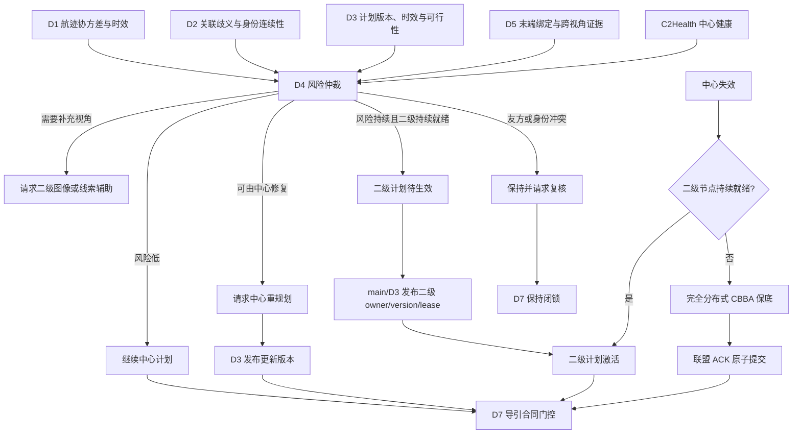
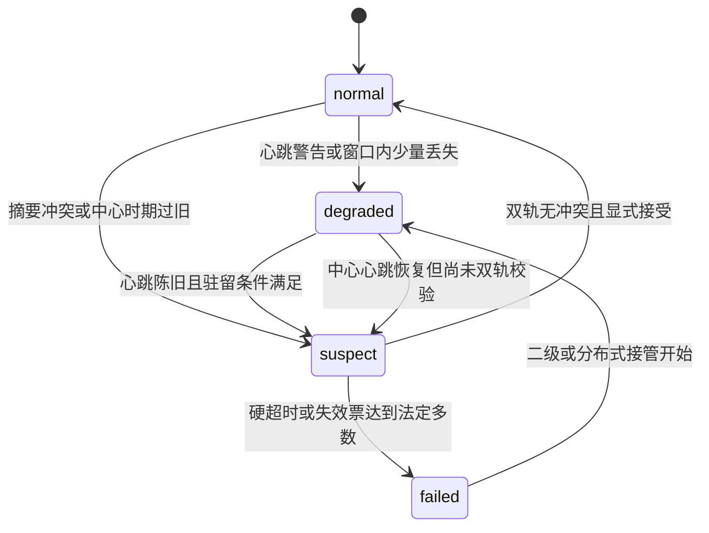
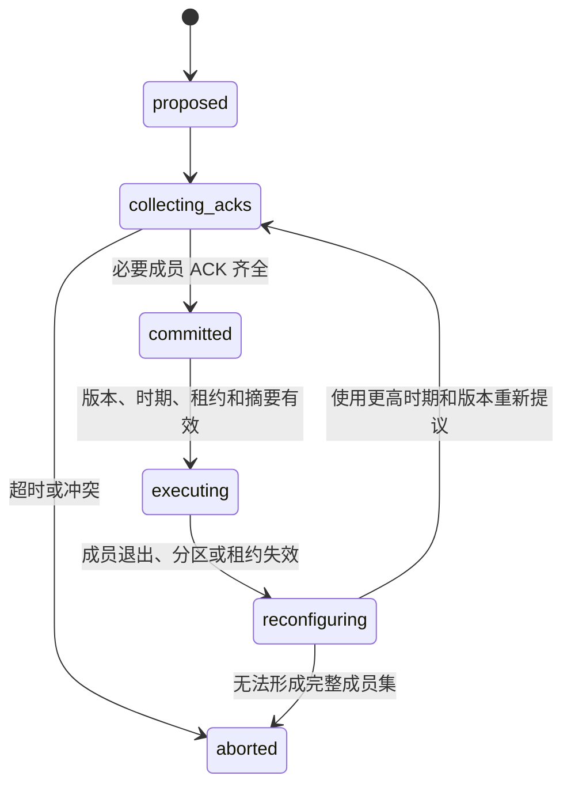

# D4 分布式协同与降级接管算法及实施方案

## 2026-07-26 A2 证据装配审计

### 已有校验链

当前 A2 软件链由多个独立验证器组成：

```text
development bundle writer/loader
        -> projected RegionResourceAdvisoryContract
        -> RegionResourceRuntimeAckParser
        -> CoalitionCommitState + delivered ACK receipts
        -> RegionResourceRewardEvidenceAdapter
        -> D6 external audit
```

前四段已经有严格数据合同，但最后没有 D4 准入装配器。`RuntimeAckParser` 能绑定
advisory、main consumption、新 D3 plan、D7 commands 和 main plan ACK，并区分
`new_execution_plan_applied` 与同代 evaluation refresh。联盟状态机能验证 required members
和 ACK 位图；通信证据门能证明成员消息在决策前实际到达。reward adapter 能验证 ACK 后窗口
内 authority 和执行/联盟 binding 不变。它明确只输出非因果区域观测，不能声明物理执行或配对
非退化。

### 最小装配键

未来 D4 装配器不能只按布尔量连接证据。至少应以以下不可变键重验：

```text
candidate:
  bundle manifest/tree/model/training SHA256
  policy/version, advisory_id/payload SHA256, model/projector fingerprint

experiment:
  clean source commit, scenario/version, seed, comparison_key
  paired exogenous config and random schedule identity

adoption:
  candidate considered + all gates passed + no rule fallback
  source plan id/version -> strictly newer applied plan id/version
  advisory/main/D3/D7 sequence and payload SHA256

authority:
  region, owner layer/id, plan version, epoch, lease
  fault generation, partition generation

coalition:
  global_track_id, coalition id/version
  required members == acked members
  each member receipt id/digest/source/destination/sent/arrival

outcome:
  post-ACK physical-result availability and source artifact SHA256
  exact R0 pair, required metric availability and non-degradation
  D6 audit JSON/CSV/Markdown/SHA256SUMS identity
```

同一 SHA-256 字符串只证明一段字节内容，不能替代字段语义和来源关系。装配器必须从原始制品
重算摘要并验证完整对象；跨 seed、跨计划、跨 authority、跨联盟代次或跨 comparison key 的
证据直接拒绝。`coalition_ack_complete` 快照布尔只能作为快速条件，正式装配必须有 required/
acked 清单和逐成员因果回执。

### 后续实现边界

当前不新增代码。D6 外部审计输出和真实 A2 正样本尚未冻结，先实现 schema 会产生一套无法用
实物验证的重复合同。待 D6 输出稳定后，D4 只实现模块 evidence assembler 和新 bundle
writer/loader；D6 继续拥有通用外部审计，main 继续拥有 episode 与物理制品。新 bundle 使用
独立 schema 和目录，不覆写 `d4-region-resource-model-bundle-v2`。

本轮审计未发现模块内 P0 旁路。v2 writer/loader、manifest-less policy、runtime/reward/
paired evidence 均不能自行打开 assist 或 authority。现有 development bundle 和两批历史
证据不可拼接，正式权限状态不变。

验证日期为 2026-07-26，没有新增场景或 seed。验收条件为所有生产加载路径保持 shadow 上限、
证据 DTO 不能授予下游权限、D4 全量测试零失败；结果为 **569/569 passed**。尚未验证的是
真实候选采用、采用后物理窗和 D6 同键非退化。

## 2026-07-26 学习 bundle 失败关闭

### v2 写入门

`save_region_resource_model_bundle()` 现在只接受 `lifecycle_stage=development` 和 `maximum_advisor_mode=shadow`。该检查位于目录创建和 `torch.save()` 之前。调用方传入 `qualified/assist`、伪造 reward availability、holdout 数量或动作多样性布尔值时，函数直接抛出异常，不留下部分 bundle。

`RegionResourceModelManifest.assist_admitted` 对 v2 固定返回 false。`RegionResourceAdvisor` 只在 manifest 类型和准入属性同时成立时考虑 assist；没有 manifest 的测试注入策略不再默认获得 assist。推理、置信度、分布外、时延和确定性投影逻辑保持原样，规则回退和正式 D4 裁决未放宽。

### 证据判定

正式 nominal 20-seed 干预只证明冻结 development 候选可加载并按门限失败关闭。候选置信度为 `0.508892953` 至 `0.569492280`，低于既定 `0.6`，安全采用为 0/20。运行 ACK、物理 outcome 和配对非退化均不能从同帧比较推导。

`active_risk` clean 制品绑定提交 `0fa7c00c3514c4fa87a17953ab66fdfb73489b0b`。其根 manifest SHA-256 为 `58f01f4fe055de60eb7db44fd82e3b74ef575fd9a43fcfe5fd8e82ec5015191a`，D6 sidecar 文件/内容 SHA-256 为 `dbbda16194f14a63b66e3fc9f2360103b8fe401a6db9b1f1e693dc8c169a7515`/`1aae70cd5612cce3f20ab4e2723533bd6ab1a0775d5e254cf425aeede85e3489`。20/20 对具有物理窗和非退化值，188/188 区域具有隔离执行证据记录；但每条 treatment 都写明 `d4_development_candidate_not_admitted`、`candidate_considered=false`、`execution_source=deterministic_rule_fallback` 和 `production_runtime_ack=false`。因此该制品验证的是规则回退后的隔离链路，不是 D4 模型干预效果。

### 后续接口

新的 admitted bundle 需要独立 promotion schema。该 schema 应引用候选 bundle 全树摘要、D6 审计摘要和逐 seed 运行证据，并由 loader 重新计算。D4 只消费证据，不自行把 nominal、同帧离线比较或 unavailable 字段改写为通过。main 还需在 scope 预检和 episode 发布后分别核验准入与实际 assist 采用；当前 `d59352b` 已提供 bundle 树绑定，但 D4 仍因运行 shadow gate 未闭合而被拒绝。

## 2026-07-25 异步联盟确认算法

### 状态保持

`CoalitionCommitCoordinator` 以 `global_track_id` 保存当前联盟状态。同一 `epoch/plan_version/coalition_version` 再次提案时，先校验联盟摘要；摘要一致则返回既有状态和 ACK 位图，摘要不同则以 `coalition_digest_conflict` 失败关闭。首次有效评估把 `proposed` 转为 `collecting_acks`。

### 分时 ACK 更新

每个区域快照只遍历已经到达的 `CoalitionMemberAck`：

```python
state = propose_or_reuse(current_generation)
for delivered_ack in snapshot.coalition_acks:
    state = record_ack(state, delivered_ack)
state = evaluate(
    state,
    timestamp=snapshot.timestamp_s,
    finalize=snapshot.finalize_coalition_collection,
)
```

`record_ack` 逐项校验成员、全局航迹、联盟、双版本、时期、证据时间和有效期。合法 ACK 只增加一次成员位；部分成员确认后继续 `collecting_acks`，位图完整后写入 `committed_at` 并原子转为 `committed`。重复 ACK 幂等。无效 ACK 被审计拒绝，不产生授权；合法后续 ACK 仍可在租约内继续。

### 终结条件

普通快照的 `finalize_coalition_collection` 默认为 `False`。显式截止才以 `missing_required_acks` 中止。租约到期、网络分区、摘要冲突或必要成员明确不可执行不等待显式截止；未提交状态进入 `aborted`，已提交或执行状态进入 `reconfiguring`。区域输出只有在状态为 `committed`、成员位图完整且租约仍有效时，才同时置 `atomic_committed=true` 和 `execution_authorized=true`。

2026-07-25 新增 5 项异步生命周期回归，三文件专项 **97 passed**，D4 全量 **569 passed**。验收要求是完整 ACK 前零授权、三成员分时到达后一次提交、所有截止/租约/分区/陈旧/无效输入均不产生执行权限。该组数字只表示 D4 模块测试。

main-owned scalable 3D 随后完成单随机种子集成复跑。场景使用 2 目标、4 资源和 1 个二级侦察节点，随机种子 `1271`；一个高威胁目标要求 2 个主成员和 1 个备用成员。中心在 `1.5 s` 失效，二级计划版本 2 在 `2.00 s` 发布；`2.05 s` 为 0/3 ACK 和 `collecting_acks`，`2.10 s` 为 3/3 ACK 和 `committed`。提交前主成员保持，提交后两个主成员进入 `midcourse_pn_3d`，备用成员继续待命。该测试的在线真值使用与 `global_track_id` 改写均为 0；main-owned 模块栈为 66 passed，scalable 3D 全量为 272 passed。AirSim 多随机种子、真实网络和正式 5700 单元矩阵仍未执行。

## 2026-07-25 区域通信因果证据

### 投递合同

`CommunicationDeliveryReceipt` 是不可变运输证据。它保存消息和回执身份、源/目的节点、版本化 topic、总线序号、envelope schema、双时间戳、authority、plan version、epoch、lease expiry、partition generation 和 payload digest。它不保存 truth ID，也不包含任何授权开关。

`from_delivered_message()` 使用 duck typing 读取 main 运输对象，处理步骤如下：

1. 读取 delivered source、destination、send timestamp 和 arrival timestamp。
2. 读取 envelope sequence、topic、source、timestamp、schema version 和 payload。
3. 交叉检查 delivered source 与 envelope source、send timestamp 与 envelope timestamp。
4. 按固定映射解析 topic：`d4.secondary_readiness.v1`、`d4.regional_plan_broadcast.v1`、`d4.coalition_member_ack.v1`。
5. 要求 payload 提供 schema、message ID、message kind、authority、plan version、epoch、lease expiry 和 partition generation，并校验 message kind 与 topic 一致。
6. 对 truth-free payload 计算规范 SHA-256；以运输字段、总线序号和 payload digest 生成内容寻址 receipt ID。

调用方不能向工厂传入或覆盖上述业务字段。字段缺失、truth 字段、未知 topic、源或时间不一致直接抛出合同错误，main 应将其处理为无有效回执。

### 验证算法

三个公开入口共享同一失败关闭核心：

```text
validate_secondary_readiness()
validate_regional_plan_broadcast()
validate_coalition_member_ack()
```

验证器先建立 receipt 不可变摘要和 expectation 摘要，再按固定顺序检查 schema、topic/type、source/destination、message ID、authority、plan、epoch、lease、arrival time、partition generation 和 payload digest。旧 plan/epoch 分别返回 `plan_version_stale`、`epoch_stale`；未来但不匹配的值返回 `plan_version_mismatch`、`epoch_mismatch`。通信关闭或丢包没有 delivered receipt，统一返回 `receipt_missing`。

精确相同的 receipt 与 expectation 可幂等重放。receipt ID 相同但内容摘要不同返回 `receipt_conflict_replay`；同一不可变回执用于不同证据入口或不同 expectation 返回 `receipt_reused_for_different_evidence`。结果固定 `authority_granted=false`，现有二级 readiness、区域 authority 和 coalition coordinator 必须另行消费该结果，证据门自身不改变状态。

### 当前验证

2026-07-25 因果证据专项 56/56、加入异步联盟测试后的 D4 全量 569/569 通过。五档成员规模均完成 readiness、逐成员计划投递和逐成员 ACK 正例，正序与逆序结果一致。负例覆盖缺回执、错源/目的/类型、旧 plan/epoch、到期 lease、晚到、错分区代次、摘要不一致、payload 缺字段、envelope 交叉冲突和 truth 字段。main 复现的 5v5 通信关闭场景现为 0 个可执行区域、8 个失败关闭区域。

统一 episode 已把 D4 控制消息送入确定性通信队列。异步三成员单随机种子正例已经通过；当前限制是 AirSim 多随机种子、真实网络条件、正式矩阵和规模性能尚未复跑。

**模块**：D4 分布式协同与降级接管

**同步基线**：2026-07-25 D4 代码、模块说明、计划、GAP/review 与模块报告

**适用范围**：Python 科研仿真、AirSim 单次试验时钟接线和离线故障回放

**当前集成事实**：main-owned scalable 3D 质点模块栈已接入单一二级、多二级区域 owner 和中心/二级连续失效后的 distributed D3 plan，D7 按 owner/epoch/lease/commit/fault fence 门控。本轮定向集成测试 8/8 passed；该证据不是 AirSim、真实网络或实飞验证。新增区域资源学习能力只提供默认 disabled/shadow 的聚合建议，不能替代本文的确定性状态机与安全合同。D4 已实现运行时采用 ACK v2、区域结果/奖励证据 v1、保留 seed 配对干预 specification/manifest v1、arm evidence v2，以及冻结 development bundle 的隔离只读加载/执行入口；计划代际专项 26/26、模块全量 508/508。nominal 5v5 保留 seed execution receipts 和 D6 profile-bound v2 outcome-availability sidecar 均已存在。sidecar 状态为 `pass_offline_assignment_comparison_only`，只证明同帧离线分配比较及 D4 门控/回退；中心失效 20-seed 的首轮物理续跑因 source/applied 代际构造错误未形成区域采用，paired effect/non-degradation、counterfactual、causal 和降级策略效果仍未形成，PPO、assist 和 authority 保持关闭。

## 0.0A 隔离 degraded rollout 采用合同

### 场景与来源

新合同位于 `region_resource_isolated_rollout.py`。它面向 main 的克隆世界 rollout，和生产 `runtime_ack` 分开。每条证据对应一个 `region_id + arm_id + cycle_index`，只允许三类场景：

1. `center_failed`：中心健康为 failed，formal D4 decision 已形成可执行 secondary authority；
2. `center_and_secondary_failed`：中心 failed，当前区域没有可用二级节点，formal decision 已形成可执行 distributed authority；
3. `active_risk`：中心未 failed，D1/D2/D3/D5 风险存在，formal action 为请求中心重规划或二级辅助。

lineage 记录 scenario/version、seed、arm、cycle、区域和来源时间，并保存下列规范哈希：

```text
H_lineage = H(
  scenario_config,
  initial_state,
  communication_schedule,
  fault_schedule,
  D4_source_snapshot,
  D4_formal_decision,
  D3_source_plan,
  candidate_gate
)
```

验证器重新计算 snapshot、decision、source plan 和 candidate gate 哈希。场景名含 nominal、区域不唯一、标签与 health/action/layer 不一致、网络分区或来源哈希变化均拒绝。该限制使 nominal 5v5 门控记录不能被重新标注为降级策略效果证据。

### 候选门

候选采用前保存六项门：

```text
g_conf = confidence >= 0.60
g_ood  = candidate_ood_passed
g_time = candidate_latency_ms <= 50
g_fin  = candidate_finite
g_fail = candidate_failure_gate_passed
g_proj = candidate_safety_projection_passed
gate_pass = candidate_considered and all(g_conf, g_ood, g_time, g_fin, g_fail, g_proj)
```

0.6 与 50 ms 是当前冻结值，合同拒绝其他值。候选缺失或任一门失败时 `rule_fallback=true`。门通过后仍可保守选择规则 override，但必须保存原因。候选 payload SHA 与后续 D3 plan metadata 绑定，避免把另一个候选或规则计划记到当前候选名下。

### 计划采用

源计划必须与 formal D4 regional ownership 的 plan ID/version、owner、epoch 和 lease 一致。新执行计划满足：

这里的 source 是 formal decision 实际命名的计划代际。D3 帧中的 `previous_plan` 只表示规划祖先。中心失效后，`previous_plan` 通常仍是中心 owner；中心和二级连续失效后，它通常仍是二级 owner。它们不能分别作为 secondary 或 distributed formal decision 的 source。main 应先取与 formal decision 同帧的当前计划，按区域写入 formal owner/node/epoch/lease，再让 D3 从该 source 产生 applied successor。

三种场景的区域权威关系如下：

1. `center_failed`：source 和 applied 都使用选中二级节点的 owner，epoch/lease 取 secondary formal ownership；applied 的计划版本严格高于 source。
2. `center_and_secondary_failed`：source 和 applied 都使用当前区域的 distributed coordinator，epoch/lease 取 distributed formal ownership；不同区域可以有不同 owner，但每条区域证据只绑定一个 owner。
3. `active_risk`：source 仍由中心持有。重规划改变 binding 时发布严格后继；未改变执行时保留原身份并走刷新分支。

若 owner、epoch 或 lease 发生改变，原 formal decision 已不再描述 applied authority。main 必须生成新的 snapshot、formal decision 和 lineage，不能只改计划 metadata。

```text
plan_id_new != plan_id_source
plan_version_new > plan_version_source
execution_signature_changed = true
plan_refresh_only = false
evaluation_refresh_only = false
t_created_new > t_created_source
t_source <= t_created_new <= t_ack < t_lease
```

应用计划和隔离 ACK 还必须同时匹配 formal owner/node/epoch/lease、计划 payload SHA、执行 binding SHA 和 assignment count。ACK 要求全部 binding 已由隔离世界消费，且 `network_partition_observed=false`。验证器按 ACK ID 防重放，并按 arm/region 保存最高 `(epoch, plan_version)`，旧 generation 不可再次采用。

同 plan ID/version 只能形成 `evaluation_refresh_applied`。它要求恰好一个 refresh-only flag 为真，`execution_signature_changed=false`，并保持 binding、未分配航迹集合、owner、epoch、lease 和 plan creation time 不变。刷新只证明同代评估被隔离世界记录，不表示执行改变，也不计入候选采用。

低置信或其他候选门失败时，可以由 main 发布严格更新的确定性规则 fallback 计划。此时 `new_execution_plan_applied=true` 只描述规则计划已消费，`isolated_candidate_adoption_available=false`。缺 ACK、formal commit 不完整、旧 epoch、到期 lease、owner/binding 篡改或网络分区时，两类 applied 标志均为 false。

### 权限边界

隔离 ACK 和采用证据固定以下状态：

```text
isolated_simulation_only = true
production_runtime_ack = false
physical_outcome_available = false
paired_non_degradation_available = false
counterfactual_available = false
causal_effect_available = false
degradation_effectiveness_claim_allowed = false
ppo_enabled = assist_enabled = authority_enabled = false
rule_fallback_enabled = true
```

`build_region_resource_isolated_plan_ack_from_d3_evidence()` 为 D3 v1 隔离消费证据提供边界桥接。它不导入 D3，按冻结字段集合独立验证来源 lineage 及其哈希、计划身份和 payload 哈希、assignment/binding 完整性、消费时间窗、内容寻址 consumption ID，以及生产、物理、回报、因果、PPO、assist、authority 全部关闭。通过后仍只生成 `production_runtime_ack=false` 的 D4 隔离回执。

2026-07-22 本地验证包含三类严格后继正例、三类同代刷新、同版本异 ID 拒绝、被动降级故障前 owner 拒绝、低置信规则回退、D3 回执桥接、缺 ACK、receipt replay、旧 epoch、到期 lease、owner/binding 篡改、生产 ACK 伪标记、网络分区、缺联盟 ACK、nominal 重标记和 refresh binding 变化，共 26/26；D4 全量 508/508。测试使用确定性 Python fixture。main 尚需修正物理续跑 producer 后重新形成 20-seed 区域采用和 D6 描述性比较。

## 0.0 同 seed 配对干预

配对规范固定 seed 集合 `S={1000,...,1019}`。每个 seed 建立两个互相隔离的 arm：

```text
control:   相同输入 -> 确定性区域规则 -> 安全投影 -> 下一周期消费门
treatment: 相同输入 -> 候选学习建议 -> 安全投影 -> 下一周期消费门
```

“相同输入”由 scenario/version、配置、初始状态、通信 schedule、故障 schedule 和区域快照 lineage 的 SHA256 共同定义。specification 同时冻结候选 bundle manifest、模型权重、策略版本、置信度门限、推理时限、分布外检查裕量、最低备用和 advisory 有效期。任何字段或哈希变化都形成另一项实验，不能与原 control 配对。

冻结候选加载按以下顺序执行：

1. 路径和 specification 必须同时指向 `region_resource_bc_900_20260720/bundle`，拒绝其他同结构模型包；
2. 先核对 bundle manifest SHA256，再由原模型加载合同核对权重和训练数据 manifest SHA256，并解析训练数据来源；
3. 复核模型版本、共享区域图结构、development 生命周期、`maximum_advisor_mode=shadow`、正式数据集 SHA 和 split SHA；reward、动作多样性和策略能力准入字段必须保持 false；
4. 将 manifest、权重和训练清单组成三文件指纹。每次原始推理前后重算指纹，载入后篡改或推理期间变化立即中止候选；
5. 使用 `torch.no_grad()` 路径生成 `projected=false` 的 raw learned recommendation。加载器不构造 `RegionResourceAdvisor`，不读取在线真值，也不请求 assist 或 authority；
6. 将 raw candidate 连同实测推理时延、分布外结果和 bundle manifest SHA 交给原 `RegionResourcePairedInterventionExecutor.execute_arm()`。后续投影、消费和规则 fallback 均复用既有确定性实现。

三份冻结文件 SHA256 分别为 manifest `dad2adbe...c05c9`、权重 `3da0360b...d5f62`、训练清单 `ff3081c8...30dc6`。manifest 内的数据集 SHA 为 `b06d741b...d36158`，切分 SHA 为 `18a2c600...d7f0`。这些值只固定本次 development candidate 的身份，不构成策略性能或生产准入证据。

treatment 的候选只允许影响隔离仿真的下一周期。候选先通过 bundle、模型、策略版本、置信度、时延、分布外和有限值检查，再进入已有确定性投影。投影核对当前 owner、计划版本、epoch、严格未过期 lease、fault fence 和联盟 ACK；跨区域转移只允许走当前可通信、可机动的邻边，受边容量、发送区域备用和已提交资源约束，所有区域 quota delta 之和必须为零。容量过大的建议可被裁剪到安全上限；未知边、旧 generation、缺 ACK、联盟不完整或无法守恒的建议被拒绝并回退规则。加载、原始推理、门限或投影出现异常时，treatment evidence 保存具体拒绝原因，`candidate_considered` 只在实际得到 raw candidate 时为 true。显式候选失败不能继续被选择；规则 fallback 使用原确定性 projector。

arm evidence v2 的候选合成门保持原语义：

```text
g_confidence = finite(confidence) and confidence >= minimum_confidence
g_ood        = candidate_ood_passed is true
g_latency    = candidate_latency_ms <= candidate_latency_limit_ms
g_finite     = recommendation fields are all finite
g_failure    = no loader/inference failure reason
candidate_thresholds_passed = candidate_considered and all(g_*)
```

`minimum_confidence` 仍为 `0.6`，latency limit 仍为 `50 ms`，边界相等时通过。四个可分解失败分别写入 `candidate_low_confidence`、`candidate_ood_rejected`、`candidate_inference_timeout`、`candidate_output_nonfinite`；`candidate_threshold_or_finite_gate_rejected` 只作为旧消费者兼容的 aggregate code。candidate 缺失时各候选 gate 为未评估，并保留加载/推理失败原因，不能伪造 low-confidence 或 nonfinite 状态。bundle identity、pair input、authority/projection 和 next-cycle consumption 继续是独立门，候选阈值通过不能覆盖其失败。

arm evidence 区分五组事实：

1. candidate 原始值、冻结阈值、逐项 gate 与 aggregate gate；
2. `pair_input_match`：该 arm 的实际输入是否与冻结规范一致；
3. `isolated_treatment_safe_adopted`：候选是否通过安全投影并可进入隔离 arm 下一周期；
4. `runtime_advisory_applied_ack_available`：线上 main-D3-D7 是否确认执行，本合同固定为 false；
5. outcome、paired non-degradation、counterfactual 和 causal availability：D4 arm/manifest 生成时字段保持 false；D6 后续独立 sidecar 已形成，但这些物理与因果字段在 sidecar 中仍为 unavailable。

manifest 要求 20 个 seed 的 40 个 arm 记录齐全，并逐 seed 比较两个 arm 的 observed input 与实际 snapshot payload SHA。v1 arm evidence reader 先按旧字段集合和旧 manifest content ID 验证，再迁移为新增诊断 unavailable 的 v2 对象；冻结 v1 artifact 不回填。manifest 只证明实验可配对和候选是否被安全采用，不计算区域 reward，也不把投影后的 recommendation 当作 applied ACK。D6 已用源 schema、源提交、manifest、输入制品及 bundle 摘要建立 profile-bound v2 sidecar，并完成同帧离线分配比较；下一版证据仍须补入可认证 runtime ACK、干预后物理状态窗口和 paired effect/non-degradation。D4 在这些物理证据接入前不得宣称非退化、反事实或因果效果。

## 0. 区域观测奖励

### 0.1 证据链

区域建议经过确定性投影后，main、D3 和 D7 的运行时链路先产生 ACK v2。奖励适配器随后核对 advisory 内容哈希、策略名称和版本、模型权重哈希、源计划、当前计划、ACK 序号与时间、owner、epoch、lease、fault generation、源区域快照和结果区域快照。执行绑定和联盟绑定分别保存窗口首尾哈希。任一哈希变化都使窗口不可归因。

窗口采用 `[t_ack,t_end)`。`t_end` 必须早于全局和逐区域 lease 截止时间。适配器按 episode 和 region 保存已接收区间，后续区间不得重叠。结果快照必须与源快照具有相同的场景、seed 和区域集合，authority generation 保持不变，并携带 ACK 所确认的当前计划。在线载荷中出现 truth、actor、object 或 evaluator identity 时直接拒绝；D6 的目标级真值距离进展只属于离线诊断，不能转换成 D4 区域 reward。

### 0.2 分项和公式

每个分项记录原始值 `m_i`、单位、归一化分母 `d_i`、来源制品名称与 SHA256。归一化成本为：

```text
c_i = min(m_i / d_i, 1)
```

固定分项为高威胁积压、配额满足缺口、转移完成缺口、备用不足、通信负载、分配冲突、降级失败和计划抖动。v1 权重依次为 `3.0, 2.0, 1.0, 2.0, 0.5, 3.0, 5.0, 1.0`。观测成本和奖励为：

```text
J_obs = sum(w_i * c_i) / sum(w_i)
R_window = -J_obs
```

只有八项均为 `available` 才计算 `J_obs`。任一分项缺失时，该分项携带原因且 `R_window` 不可用，不能将缺测解释为零成本。`new_execution_plan_applied` 可输出 `R_window`，其归因范围固定为“计划采用后的时间窗口观测”，不代表因果收益。`evaluation_refresh_applied` 的执行签名没有变化，只输出 `J_obs`，不输出动作归因奖励。

### 0.3 准入边界

该适配器没有连接 `load_region_ppo_training_episodes()`，也不生成 advantage、return 或 on-policy transition。输出固定声明成员 ACK、物理执行结果、因果归因、paired shadow、on-policy、PPO、assist 和 authority 均不可用，规则回退必须保留。`region_resource.py` 中原有的 `compute_region_resource_reward()` 缺少 ACK、分项 availability、来源哈希和结果窗口，只用于既有研究 fixture，不能作为正式数据集或 PPO 奖励。后续只有在 main/D6 生成真实区域窗口、保留 seed paired shadow 和独立因果审计后，才能另行评审训练数据准入。

## 1. 文档目的与模块边界

D4 解决的不是单一“中心掉线后换一个节点”问题，而是以下三类协调状态之间的安全转换：

1. 中心节点仍有效，由 D3 维持中心化分配；
2. 中心节点失效，或中心计划在高动态条件下持续不适用，由机动高空侦察二级节点接管；
3. 中心和二级节点均不可用，拦截资源通过完全分布式协商维持最低任务连续性。

本文中的指挥与控制（Command and Control，C2）表示中心协调权威；`C2Health` 表示其健康状态。D4 同时处理：

- **被动降级**（passive failover）：节点被摧毁、心跳超时、摘要冲突或网络分区导致原协调者不可用；
- **主动降级**（active degradation）：中心仍在线，但传感器不确定性、目标身份歧义、计划时效或末端关联证据表明当前计划已不适用。

必须纠正旧口径：主动降级不只包含“请求中心重规划”。系统允许两条受控路径：

- 风险尚可由中心修复时，D4 请求中心重规划，由 D3 发布新版本计划；
- 风险持续、当前计划明显不适用，且机动高空侦察二级节点持续就绪时，D4 可提出转移到二级节点，随后由 main/D3 发布严格更新的二级计划并转移计划所有者。

D4 自身不创建完整 `AssignmentPlan`，也不在本地改写 `global_track_id`。主动转移必须通过 main/D3 的计划发布、所有者、版本、时期和租约合同，不能把 D4 的单次风险判断直接解释为执行授权。

模块边界如下：

- D4 读取 D1-D5 的摘要，不重复实现传感器滤波、数据关联、中心优化和像素几何；
- D4 输出协调动作、二级接管元数据、联盟提交状态和审计记录，不直接输出飞控命令；
- D7 仍独立检查计划、末端锁定和运动学条件；
- 当前网络是内存队列或 AirSim 单次试验时钟上的故障注入，不代表真实无线链路；
- 本模块不包含真实硬件、射频设备、视频编码器、火控、毁伤或自动处置逻辑。

## 2. 总体分层架构



默认优先级是：

```text
中心计划可用
  -> 继续中心
  -> 请求二级观测辅助
  -> 请求中心重规划
  -> 风险持续且二级持续就绪时，发布更新的二级计划
  -> 中心和二级均不可用时，进入完全分布式保底
  -> 证据、版本、租约或成员确认不完整时，闭锁或保持复核
```

主动转移和被动接管都可到达二级节点，但触发原因不同：前者是计划持续不适用，后者是中心不可用。两者进入同一套二级计划版本、来源、租约和 D7 门控，不允许维护两套互相矛盾的执行规则。

## 3. 机动高空侦察二级节点

### 3.1 当前场景角色

当前系统假设中的二级节点是**机动高空侦察无人机**，不是固定系留节点。它与拦截资源同步出动，但不执行拦截，承担两种职责：

1. **正常运行时的观测辅助**：利用高性能光电云台、雷达或 GlobalTrack 粗指向，在局部区域搜索目标，并向小范围拦截资源发送图像、检测结果、投影线索和覆盖摘要；
2. **降级时的区域协调**：在中心失效或当前中心计划持续不适用时，基于其覆盖区、通信链路、计算能力和最新态势发布候选重分配，由 main/D3 转换为版本化二级计划。

代码仍保留 `FIXED_TETHERED_SECONDARY` 等历史兼容枚举，以便读取旧回放，但新场景和实施说明以 `MOBILE_HIGH_RECON` 或 `MOBILE_SECONDARY_RECON` 为默认角色。兼容枚举不表示当前方案仍以固定系留节点为主。

二级节点通常设置：

- `coordinator_only=True`：只参与侦察和协调，不作为拦截执行资源出价；
- `coverage_cell`：限定可辅助或接管的区域；
- `heartbeat_timestamp_s` 和 `heartbeat_stale_after_s`：描述节点生命状态；
- `cue_freshness_s`：描述图像或线索新鲜度；
- `gimbal_pointing_ok`：表示云台是否正确指向目标区域；
- `secondary_coverage_ratio`：表示覆盖目标的比例；
- `secondary_network_joint_full_view_frame_rate`：表示二级网络同一帧联合覆盖完整目标集合的比例；
- `cross_view_association_count` 和 `stable_cross_view_registration_count`：表示 D5 已形成的跨视角支持；
- `lease_epoch` 和 `lease_expires_at_s`：表示接管权有效世代和到期时间。

### 3.2 正常运行时的图像和线索流

```text
D1/D2 GlobalTrack 粗位置
  -> main 生成雷达/航迹指向线索
  -> 机动高空侦察节点调整云台
  -> D5 处理二级图像和局部多目标轨迹
  -> D5 输出跨视角注册、覆盖率和歧义摘要
  -> D4 只消费摘要并评估二级节点就绪性
```

二级节点“看见目标”不等于“能接管”。检测框存在、云台指向正确或平均覆盖率较高，都不能替代时间同步、全局绑定、稳定跨视角注册、通信新鲜度、计划版本和租约检查。

## 4. 输入、内部状态与输出合同

### 4.1 上游输入

| 来源 | D4 输入 | 关键语义 |
|---|---|---|
| D1 多传感器融合 | `TrackUncertaintySummary` | 位置标准差、协方差迹、速度标准差、量测年龄和覆盖小区 |
| D2 多目标关联 | `AssociationRiskSummary` | 关联歧义、显式身份切换计数、重复航迹、连续率及真值指标可用性 |
| D3 分配规划 | `AssignmentValiditySummary` | `global_track_id`、资源、计划版本、是否当前、最近评估年龄、代价裕度和资源可行性 |
| D5 末端关联 | `TerminalAssociationSummary` | 当前绑定、末端证据适用性、锁定/歧义/保持/重捕获、友方冲突、重复锁定和跨视角证据 |
| main/runtime | `C2Health`、`ResourceSummary[]`、`CommunicationSummary[]` | 当前时间、心跳、链路新鲜度、二级节点能力、计划所有者、时期和租约 |

D4 只接受上游规范 `global_track_id`。D5 本地轨迹标识、AirSim actor 名称和离线真值标识都不能在 D4 内生成新的全局身份。

### 4.2 主要内部状态

- `C2Health`：中心健康状态；
- `ActiveDegradationDecision`：本次仲裁动作；
- `SecondaryNodeLifecycleSummary`：二级节点心跳、链路、覆盖和就绪性；
- `SecondaryTakeoverPlanMetadata`：二级计划待生效或已激活状态；
- `CenterReplanStatus`：中心重规划请求生命周期；
- `CoalitionMemberAck`：联盟成员确认应答；
- `CoalitionCommitState`：联盟从提议到执行或中止的状态；
- `CBBAResult`：完全分布式一对一保底结果；
- `MergeResult`：中心恢复后的双轨校验结果。

### 4.3 下游输出

| 输出 | 消费者 | 用途 |
|---|---|---|
| `ActiveDegradationDecision` | main、D6 | 继续中心、重规划、二级辅助、二级转移、分布式或保持复核 |
| `D4DecisionRecord` | main、D6 | 保存触发证据、动作、时延、所有者、版本、租约和拒绝原因 |
| `SecondaryTakeoverPlanMetadata` | main、D3、D7 | 描述二级计划待生效/已激活，不代替系统计划 |
| `D7SecondaryHandoff` | D7 | 二级交接两阶段门控和视觉比例导航制导许可前置条件 |
| `CBBAResult` | main、D6 | 分布式保底分配、共识轮数、冲突和消息开销 |
| `CoalitionCommitState` | main、D5、D7、D6 | 多资源联盟是否已经原子提交并可执行 |
| `HealthTransition[]`、`MergeResult` | main、D6 | 健康迁移、恢复审计和防双主评价 |

## 5. `C2Health` 中心健康状态机

### 5.1 状态定义

| 状态 | 中文含义 | 判定依据 |
|---|---|---|
| `normal` | 正常 | 心跳、计划摘要校验值和中心时期可信 |
| `degraded` | 降质 | 心跳抖动或已有降级协调者维持连续性 |
| `suspect` | 可疑 | 心跳陈旧、摘要冲突、中心时期倒退或恢复待校验 |
| `failed` | 失效 | 心跳硬超时或对等节点失效票达到法定多数 |

### 5.2 状态迁移



`FailoverCoordinator.update_health()` 使用心跳滑动窗口、丢失阈值和状态驻留时间，避免单个迟到消息把中心直接判为失效。对等节点法定多数（quorum）可在明确分区或中心损坏时加速失效判定。

恢复路径刻意不对称：心跳恢复只证明中心重新发送消息，不能证明其计划是最新版本。因此 `observe_center()` 将恢复中的中心置为 `suspect`，只有双轨校验通过后才能回到 `normal`。

## 6. D1-D5 风险融合与主动降级

### 6.1 D1 航迹不确定性

D1 以带协方差的全局航迹作为依据。位置风险可用位置协方差子矩阵表示：

\[
\sigma_p=\sqrt{\frac{\mathrm{tr}(P_{pos})}{3}}.
\]

当前轻量规则以位置标准差约 20 米作为中风险分档、50 米作为高风险分档，并结合协方差迹和量测年龄。门限是仿真基线，需要依据传感器配置和真实回放重新标定，不能直接作为硬件指标。

### 6.2 D2 关联风险

D4 读取：

- 关联歧义分数；
- 显式身份切换（Identity Switch，IDSW）计数；
- 显式重复航迹事件；
- 航迹连续率；
- `truth_metrics_available` 和 `continuity_available` 可用性标志。

在线真值隔离时，缺失真值产生的零值或占位值不能成为硬风险。连续重复风险评分只作软证据；只有显式重复计数、事件或增量才构成硬阻断。

### 6.3 D3 计划有效性

D4 不用计划创建时间简单判断陈旧，而优先读取最近评估时间。主要硬风险包括：

- 计划不是当前版本；
- 计划超过允许年龄；
- 资源已不可行；
- 当前资源、目标或联盟版本不匹配。

代价裕度过低只表示计划容易抖动，是软证据，不能单独触发所有权转移。

### 6.4 D5 末端证据

D4 首先检查 `terminal_evidence_applicable`。尚未进入末端视觉适用窗口时，低置信度、高歧义和普通重捕获不会逐帧触发降级；友方冲突、重复锁定、资源错配和明确全局航迹错配仍是硬风险。

进入末端窗口后，D4区分：

- **绑定安全性**：资源、规范全局航迹、计划版本和联盟版本是否一致；
- **视觉准备度**：D5 是否已经锁定、置信度是否足够、是否需要重捕获。

`terminal_consistent=true` 只表示当前计划绑定未被硬证据推翻，不表示 D5 已锁定，也不授权 D7 切换视觉导引。

### 6.5 主动降级动作选择

| 条件 | 动作 | 所有者变化 |
|---|---|---|
| 风险低、绑定一致 | `continue_center` | 无 |
| 软风险暂时升高 | 继续中心或 `request_secondary_assist` | 无 |
| 计划陈旧、非当前或资源不可行 | `request_center_replan` | 等待 D3 新计划 |
| D5 持续硬失配但中心仍能及时修复 | `request_center_replan` | 等待 D3 新计划 |
| 风险持续、原计划明显不适用、中心重规划不足以及二级持续就绪 | `degrade_to_secondary` 候选 | main/D3 发布新版本后才转移 |
| 友方冲突、身份冲突或联盟合同不完整 | `hold_for_review` | 不转移 |

主动转移采用递进策略：

1. 记录 D1-D5 风险并经过风险窗口和驻留时间，过滤单帧噪声；
2. 能由中心滚动重规划修复时，先发出 `request_center_replan`；
3. 中心计划在高动态条件下持续不适用，且二级节点达到持续 `takeover_ready` 时，允许提出二级转移；
4. D4 只形成二级接管候选和待生效元数据；
5. main/D3 生成严格更新的计划标识和版本，把计划来源设为选中的二级节点；
6. 新计划通过来源、版本、时期和租约校验后，计划所有者才变为 `secondary_node`。

当前通用 `ActiveDegradationArbiter` 主要实现继续中心、二级辅助、中心重规划和失效后的分层回退；系统级 AirSim 运行时已经接入主动 `degrade_to_secondary` 的两阶段场景。实施时应保持这一所有权边界：D4 做风险和转移仲裁，main/D3 做计划发布，不能让本地资源自行更换所有者。

### 6.6 迟滞和中心重规划生命周期

主动仲裁按资源/航迹对保存独立状态，避免一个目标的风险污染另一个目标。主要防抖机制包括：

- `risk_window_size` 和 `risk_window_threshold`：风险窗口内满足足够样本才触发；
- `min_dwell_s`：动作最短驻留时间；
- `release_consecutive_consistent_frames`：恢复中心前需要的连续低风险帧；
- `non_locked_frame_limit` 和 `mismatch_frame_limit`：区分普通失锁与持续错配；
- `center_replan_cooldown_s`：中心重规划请求默认 2 秒冷却。

`CenterReplanStatus` 包含 `pending`、`applied`、`acknowledged_no_change` 和 `expired`。硬安全风险可绕过冷却；非硬风险在冷却期内不重复发送请求。

## 7. 二级节点就绪性与接管计划

### 7.1 四级就绪性

二级节点能力不是二值状态，而是四级状态：

| 等级 | 含义 | 可否接管 |
|---|---|---|
| `not_ready` | 心跳、链路、云台、覆盖、租约或证据不足 | 否 |
| `visible_only` | 能检测目标，但尚未完成稳定全局注册 | 否 |
| `registration_usable` | 已有跨视角注册，但完整覆盖或综合能力不足 | 否，只可辅助 |
| `takeover_ready` | 覆盖、网络全视野、注册、新鲜度、通信和综合评分均满足 | 可作为候选 |

综合评分可抽象为：

\[
Q_s=w_c c+w_n n+w_r r+w_f f+w_g g+w_l l,
\]

其中 (c) 为覆盖率，(n) 为二级网络同帧全覆盖率，(r) 为跨视角注册质量，(f) 为线索新鲜度，(g) 为云台指向状态，(l) 为链路和租约状态。当前代码的接管基线包括：综合评分不低于 0.70、覆盖率不低于 0.65、网络同帧全覆盖率不低于 0.80。

这些门限必须与场景配置一起记录。它们不是通用工程标准，也不能为了形成接管正例而降低身份、版本或租约安全门限。

### 7.2 持续就绪

单帧 `takeover_ready` 不足以接管。适配器默认要求：

- 至少 3 个不同时间戳的连续就绪决策；
- 持续时间至少 0.2 秒；
- 相邻证据时间间隔不超过 1.0 秒。

计数按二级节点、目标和覆盖小区隔离；同一时刻多次调用不增加连续计数。心跳、链路、云台、覆盖、注册或租约回落都会使持续就绪失效。

### 7.3 所有者、版本、时期和租约

二级计划是否可执行可写为：

\[
E_{sec}=I_{active}I_{source}I_{ready}I_{epoch}I_{lease}I_{version}.
\]

其中：

- (I_{active})：main/D3 已明确回填二级计划激活；
- (I_{source})：计划来源等于 D4 选中的二级节点；
- (I_{ready})：二级节点持续就绪；
- (I_{epoch})：租约时期不低于要求时期；
- (I_{lease})：expiry 与当前时间都存在，且严格满足 `current_time < lease_expiry`；
- (I_{version})：新计划版本严格高于被替代计划，或确认为同一已激活二级计划。

`SecondaryTakeoverPlanMetadata` 有三种状态：

1. `not_applicable`：本次不是二级转移；
2. `pending_secondary_plan`：D4 已选择二级来源，但当前所有者仍保持原值；
3. `secondary_plan_active`：main/D3 已发布正确来源和更新版本，租约有效且持续就绪，所有者变为二级节点。

缺 expiry、缺当前时间、`current_time == lease_expiry`、过期、旧时期、来源不匹配或就绪性回落都会使计划保持待生效或不可执行。该规则同时用于 resource candidate、plan 发布、已激活 owner 维持和 D7 handoff，不能由同 plan id/version 绕过。

### 7.4 两阶段 D7 交接

```text
阶段 1：D4 提出 degrade_to_secondary
  -> 当前计划仍有效或进入保持
  -> secondary_reassignment_complete=false
  -> visual_png_allowed=false

阶段 2：main/D3 回填新的二级计划
  -> owner/source/version/epoch/lease 全部通过
  -> secondary_reassignment_complete=true
  -> D7 仍需检查 D5 锁定和自身运动学门控
```

D4 的阶段 2 不是视觉比例导航制导（Proportional Navigation Guidance，PNG）的充分条件，只是 D7 的必要前置合同之一。

## 8. 被动降级实施流程

被动降级用于中心结构性失效：

```text
C2Health normal/degraded/suspect
  -> 心跳硬超时、摘要长期冲突或 peer 法定多数判定失败
  -> C2Health failed
  -> 选择覆盖当前区域且持续就绪的机动高空侦察二级节点
  -> 发布二级计划候选
  -> main/D3 回填 owner/version/epoch/lease
  -> 二级计划激活
  -> 二级失效或不可用时进入完全分布式协商
```

如果二级节点只是可见、注册可用但未达到接管门限，系统不能把它解释为可执行协调者。中心已失效且无持续就绪二级节点时，D4 进入 `degrade_to_distributed` 或安全保持，而不是降低门限。

## 9. 完全分布式 CBBA 保底

### 9.1 算法角色

中心和二级节点都不可用时，D4 使用本地轻量基于共识的捆绑算法（Consensus-Based Bundle Algorithm，CBBA）作为一对一任务连续性基线。它不是麻省理工学院外部 CBBA 工程，也不是通信感知 CBBA 的生产实现。

对任务 (j) 和资源 (i)，基础出价为：

\[
s_{ij}=2.0q_j+1.4a_i+0.5c_i+1.2m_{ij}+b_{source}-0.8p_{age}+\Delta s_{D5},
\]

其中 (q_j) 是航迹置信等级，(a_i) 是资源可用性，(c_i) 是通信等级，(m_{ij}) 是能力匹配，(b_{source}) 是多源观测增益，(p_{age}) 是航迹年龄惩罚，(Delta s_{D5}) 是分布式视觉证据修正。

### 9.2 共识过程

1. 每个资源根据本地任务摘要建立 bundle；
2. 节点广播任务获胜者、出价、时期和约束摘要；
3. 收到更高出价或更新时期后，节点更新 winner view；
4. 节点失去 bundle 中某任务后释放该任务及其后续任务；
5. 所有节点 winner view 一致或达到最大轮数后结束。

确定性消歧按出价、时期、资源标识和约束摘要排序，避免相同输入产生随机所有者。

全连接 (N) 个资源、(T) 个任务的单轮通信复杂度约为：

\[
O(N^2T).
\]

稀疏网络可降低单轮消息量，但会增加传播轮数。`converged=false` 时不能把空结果或局部 winner view 当作有效计划。

### 9.3 D5 分布式视觉证据

D5 多相机证据只作为风险或出价修正：

- 多个资源支持同一个上游 `global_track_id`，可增加相应资源的支持分；
- `hypothesis_only` 只产生弱正向证据；
- 友方冲突、缺失或陈旧全局标识、身份冲突会阻断执行；
- 重复末端锁定进入审计并强惩罚；
- D4 不根据局部视觉生成新全局标识。

### 9.4 能力边界

当前轻量 CBBA 默认是单获胜者、一任务一资源保底。对于一个高威胁目标需要多个资源的情况，CBBA 可选择协调者或候选成员，但不能冒充完整联盟形成算法。多成员执行必须经过独立原子提交合同。

## 10. 多资源联盟与原子 ACK

### 10.1 数据合同

`CoalitionMemberAck`（联盟成员确认应答）至少绑定：

- 目标 `global_track_id`；
- 联盟标识和联盟版本；
- 计划标识和计划版本；
- 成员资源标识；
- 时期；
- 租约到期时间；
- 能力证据时间和摘要校验值。

`CoalitionCommitState` 状态机为：



原子提交条件可表示为：

\[
C=I_{members}I_{plan}I_{coalition}I_{epoch}I_{lease}I_{digest}I_{network}.
\]

任一项为零都必须失效时闭锁（fail closed）。缺一个主成员确认、旧计划版本、旧联盟版本、过期租约、摘要冲突或网络分区都不能形成部分执行。

### 10.2 独立执行与联盟执行

多个独立主资源不要求在同一时刻到达，但每个资源仍需满足自己的计划和 D5/D7 门控。需要共享联盟状态的多成员任务则必须先原子提交；备用成员未被新版本计划激活前保持待命，不能自行补位。

现有 `member_loss_replacement`/成员补位 replay 由测试预先给定替换成员，再验证更高 epoch/version 和全员重新 ACK。它不是在线 reserve 发现、选择、激活或自主补位状态机；这些能力继续保持 P1 未实现。

### 10.3 二级和完全分布式联盟

- 二级节点可作为联盟协调者，但必须是持续就绪且持有有效计划租约；
- 二级节点失效后，完全分布式 peer 协调者必须使用更高时期、计划版本和联盟版本重新提议；
- 分区恢复后全部必要成员重新确认，旧 ACK 不可复用；
- D5 只认可当前 committed/executing 联盟中的成员锁定；
- D7 只执行当前 committed/executing 联盟及当前计划。

### 10.4 区域 authority 与受约束候选形成

设区域集合为 \(R\)，每个区域 \(r\) 在任一时刻最多有一个可执行 authority：

\[
\sum_{o \in O} I[owner(r)=o \land active(r)] \le 1.
\]

中心 health 不为 `failed` 时，\(owner(r)=center\)。主动证据可以请求侦察辅助或中心重规划，但不改变该等式中的 owner；若中心计划包含 \(k>1\) 任务，中心 owner 也只有在 required-member ACK 完整后才 active。中心失效后，二级候选必须同时满足 region coverage、strict readiness、`lease_epoch >= authority_epoch` 和未过期租约；候选按 priority、coverage、lease epoch 和 node id 确定性排序。owner/layer 改变要求：

\[
epoch_{new}>epoch_{old}\quad\land\quad planVersion_{new}>planVersion_{old}.
\]

二级不可用时，对每个区域任务按 member availability、communication、operator hold、跨区域 capacity、required capability 和 D5 member evidence 进行 bounded bid selection。一个成员可覆盖多项 required capability；按 region id 的确定性顺序记账，已在前一区域达到 capacity 的成员不会在后一区域重复获权。该步骤只产生候选成员集合；若 \(k>1\)，可执行性仍由第 10.1 节的完整 ACK 原子条件决定。区域 authority/commit lease 取 authority、D3 task 和二级 lease 的最早到期值。候选不足、能力并集不满足、D2 已观察到身份切换/重复航迹、D5 一致性未确认、D5 member hold、分区或旧 generation 都输出 `hold_for_review`。该 bounded selection 没有多轮网络共识和耦合时序最优性保证，不能称为完整 CCBBA。

### 10.5 全局区域资源建议与学习研究管线

`d4-region-resource-snapshot-v1` 把每个区域编码为聚合节点：目标需求/高威胁积压、D1/D2 不确定性、D5 可见/一致性、可用/备用/已提交资源、二级 coverage/readiness、通信容量/时延/丢包、当前 owner layer/node、plan version、epoch、lease、ACK 与 fault fence。边编码 transferable resource capacity、距离、转移时间、带宽、通信/机动可用性和 partition。数据合同不包含 actor truth ID、target ID、`global_track_id` 或具体 resource-target pair。

规则或学习策略只能输出：逐区域 quota delta、备用比例、侦察优先级、hold/replan，以及相邻区域 transfer。`DeterministicResourceProjector` 不信任策略给出的 quota delta，而是从接受的 transfer 重建：

\[
\Delta q_r=\sum_u x_{ur}-\sum_v x_{rv},\qquad
\sum_r\Delta q_r=0.
\]

只有可通信、可机动、未 partition 的邻边可接受 transfer；源区域转出预算为可用资源减去 formal commit 成员和最低备用。snapshot/action 的 owner、plan、epoch、lease 必须与 formal D4 verdict 一致；过期 lease、缺 ACK、fault fence、formal fail-closed 或 commit 不完整都使相关区域保持 hold。该投影独立于模型置信度，学习策略不能关闭或改变它。

投影后使用 `d4-region-resource-advisory-v1` 冻结消费合同。合同的 `advisory_id` 为除自身 ID 外全部字段的 SHA256 内容地址；相同内容得到相同幂等键，字段被改动时 `from_dict()` 拒绝 ID 不匹配。有效区间为

\[
[t_c,\;\min(t_c+\Delta_{adv},\min_r t^{lease}_r)),
\]

其中 `t_c` 是 episode-clock 创建时间，默认 \(\Delta_{adv}=1.0\) s，可由 `RegionResourceProjectionConfig.advisory_ttl_s` 配置。顶层记录 scenario/snapshot/authority、source plan versions、policy/model/projector identity 与总资源守恒量；逐区域记录 source snapshot/version、owner/layer、plan id/version、epoch/lease、ACK/fault、资源前后量与 protected reserve/committed；逐 transfer 记录两端完整 source version、edge 端点、capacity、time、bandwidth 和 availability/partition。输出不复制 formal verdict 中的 target、truth、actor、object 或 member identity。

`validate_for_consumption()` 在下一轮 planning boundary 对 current snapshot 和可选 current formal verdict 重验。旧 snapshot/plan/epoch、严格 lease 到期、非 projected、ACK 不完整、fault fence、formal commit 数变化、总量或逐区 transfer delta 不守恒、reserve/committed 保护失败，以及未知、非邻接、不可用、partition 或超 capacity edge 均为拒绝。`RegionResourceAdvisoryGate` 在首次成功后记录 `advisory_id`，同一进程内再次消费返回 `advisory_already_consumed`；跨进程 ledger 由 main 持久化。`consumable=true` 仅允许 main 将区域聚合建议作为下一轮 D3 输入，D4 不创建或修改 `AssignmentPlan`。

#### 10.5.1 跨独立运行的内容身份

区域 authority 摘要对按 `region_id` 排序的以下载荷计算 SHA256：owner、layer、plan id/version、epoch、lease、owner active、coalition ACK、committed resources 和 fault fence。正式裁决摘要对完整 `RegionalFailoverDecision.to_dict()` 计算 SHA256。`advisory_id` 对移除自身字段后的完整 `RegionResourceAdvisoryContract` 计算 SHA256。因此独立 D3 planner 只要生成不同的原始 `plan_id`，三类摘要就会级联变化。

该变化只在跨独立运行的派生比较视图中允许规范化。原始运行先执行四项验证：正式裁决事件与 advice 使用同一时间戳和确定顺序；before/after 摘要相等且可由正式裁决原文回算；authority 摘要可由完整区域 authority payload 回算，且 recommendation、region、transfer 中的副本全部相等；`RegionResourceAdvisoryContract.from_dict()` 可回算原始内容地址。任一检查失败即停止比较。

通过后，比较器使用 D3 已审计的谱系映射替换所有 source plan 引用。它依次重算规范 authority 摘要、规范正式裁决摘要和规范 advisory 内容地址，再比较完整载荷。`advisory_id` 不能替换为事件序号；事件序号只负责对齐。owner、layer、role、plan version、epoch、lease、ACK、fault fence、region/task/global-track/resource/node/coalition identity、正式动作以及 recommendation 内容均不得规范化。若制品没有完整 authority payload，只有候选重建载荷能够精确回算原始摘要时才可继续；否则结果为不可比较。

2026-07-22 对 clean `8f86192` 与 `f80b5bd` 的 seed 42000-42002 进行只读复核。两侧各 30 条正式裁决和建议均通过上述原始检查，30/30 对规范重算载荷相同。该结果只证明同输入跨提交业务语义等价，不提供 D4 降级性能或学习策略收益证据。

#### 10.5.2 运行时应用确认

`RegionResourceRuntimeAckParser` 解决“建议通过消费门”和“建议在运行时被采纳”之间的证据缺口。它不导入 main、D3 或 D7，只读取冻结对象、`to_dict()` 结果或版本化 envelope。输入包括 D4 advisory/result、main 区域消费记录、main 计划运行时确认、当前 D3 计划与 D7 导引源 envelope；同代刷新还必须提供 advisory 对应的前序 D3 source-plan envelope。

运行时确认条件写为：

\[
ACK_{D4}=C_{main}\land A_{D3}\land (N_{plan}\lor R_{eval})\land B_{D7}
\land V_{authority}\land H_{source}.
\]

其中，`C_main` 要求消费记录为 `consumable=true`、无 rejection/bridge reason，且内嵌 advisory 与 D4 原合同逐字段一致；`A_D3` 要求 considered/applied/rejected 严格为 `true/true/false`，建议 ID、建议版本和 source plan 与 D4 合同一致；`N_plan` 要求执行签名变化、plan ID 改变、版本严格增加且创建时间不早于消费时间；`R_eval` 要求 plan ID/version 与 source plan 相同、`execution_signature_changed=false`、两个 refresh-only 标志中恰有一个为真、评估/消费/确认时间一致，并逐项比较前序和当前的资源-航迹 binding、coalition ID/version、member role、区域 owner 字段和未分配目标集合。`B_D7` 要求当前 D3 assignment、D7 command 和 ACK binding 完全一致；`H_source` 要求 ACK 中的当前 D3/D7 bus sequence 与 envelope 一致，并复算 payload SHA256。新执行计划的 `V_authority` 要求 D3/ACK 的 owner/layer、epoch 和 lease 与 D4 source authority 一致；同代评估刷新只允许 D3/ACK 同时缺省 epoch/lease，并继续以 D4 advisory 中未到期的 authority fence 约束证据范围。

验证器按 `(advisory_id, advisory_version)` 记录成功消费。重复确认、缺失前序计划、refresh 标志矛盾、同版本 binding 变化、执行签名变化但未提升代次、旧 epoch、到期 lease、非有限时间、schema/source/hash 错误或部分 binding 都返回稳定拒绝 code。v2 输出的 `adoption_kind` 仅取 `evaluation_refresh_applied` 或 `new_execution_plan_applied`。它不修改 formal D4 authority、D3 plan 或 D7 gate；`CoalitionMemberAck`、物理 outcome、可归因 reward、paired shadow、PPO、assist 和 authority 字段固定为不可用/不允许。

冻结 900 episode 生成于该合同之前，没有 main consumption、D3/D7 source envelope 和运行时确认字段，不能离线补造 applied ACK。新的 5v5 seed 41 质点 episode 已证明真实 main 的同代评估刷新可被识别；单独在旧 plan 上回填 `regional_hint_applied=true`、缺少 source-plan envelope、改变 binding 或声明执行签名变化仍会失败关闭。

`SharedRegionGraphActorCritic` 对任意节点数使用同一 node encoder、edge encoder、message network、node/edge actor 和 pooled value/confidence head，不写死 8 区或 200 架资源。行为克隆以规则投影建议为 teacher，连续动作使用均方误差，hold/replan 使用二元交叉熵。原生 clipped PPO 对每个变长图计算联合高斯 log probability：

\[
L_{policy}=-\mathbb E\left[\min(\rho_t A_t,\operatorname{clip}(\rho_t,1-\epsilon,1+\epsilon)A_t)\right].
\]

critic 使用 return 的平方误差并加 entropy regularization。reward 是高威胁积压、跨区转移耗时、通信负载、备用不足、分配冲突、降级失败和计划抖动的负加权和。

离线数据使用 `d4-region-learning-dataset-v1`。`RegionLearningEpisodeSource` 固化 scenario/version/scale、数值 seed、episode ID、Git commit/dirty 与 config SHA256；每个 `RegionLearningFrame` 固化 snapshot、`rule|formal` target 或显式 unavailable、reward 或显式 unavailable，以及可选 recommendation。target 必须是覆盖全部区域的安全投影建议；snapshot/target/recommendation identity 必须一致。`target` 是教师标签容器，`target.kind=rule` 是规则教师类别，都不属于 truth。递归 key 检查拒绝 actor/target/object/global-track/evaluator/offline truth 标识及键变体，在线特征仍只有区域聚合量。

`stage_region_learning_episode()` 接受完整 frame iterable，按 frame index 规范化后写 canonical JSONL header/frame/footer；frame index 必须从 0 连续、时间单调、snapshot ID 唯一，只有完整 footer 的 episode 才进入 finalizer。`finalize_region_learning_dataset()` 以 episode 为最小单元，并先按数值 seed 哈希排序再确定性计数分桶；同数值 seed 下所有 scenario/scale 和多个 episode 均进入同一 split，train/validation/test seed 两两零交集。唯一 seed 少于 3，或 validation+test 的实际 unseen seed 少于调用方声明值，均失败关闭。manifest 固化 feature/target/reward semantics、全部 source identity、dirty/target/reward/recommendation availability、seed split/SHA、逐 episode SHA 和 dataset SHA。

`load_region_behavior_cloning_samples()` 要求所选 split 每帧 target available；`load_region_ppo_training_episodes()` 还要求 reward available，并保留完整 episode，不以 0 代替缺值，也不伪造 old log probability、value、advantage 或 return。两者默认拒绝 dirty source。模型 bundle 升为 `d4-region-resource-model-bundle-v2`；基础文件仍为 `manifest.json + state_dict.pt`，绑定正式 dataset 时额外嵌入 `training_dataset_manifest.json`，并校验 dataset SHA、split SHA、嵌入 manifest SHA、train groups 和 state_dict SHA。推理超时、低置信、OOD、非有限输出或 bundle 不匹配统一回退 `RuleRegionResourcePolicy`。规则 fallback 和学习候选共用 advisor 内同一个 `DeterministicResourceProjector` 对象，学习实现只有 `recommend_raw()`，不能直接发布消费合同。API 默认 `disabled`，CLI 默认 `shadow`。paired evaluator 按数值 seed 判断 seen/unseen，报告 backlog、transfer time、plan churn、communication load、fail-closed、安全违规和 candidate latency P50/P95；少于 20 个未见 seed，或安全/backlog/fail-closed 回归时，不推荐 assist。assist 也只表示建议可见，不授予 D4/D3/D7 执行权。

正式训练入口先调用 `audit_region_learning_dataset()`。加载器验证 manifest 内容哈希和逐 episode 文件哈希，审计器再核对 source/schema/episode identity、数值 seed 和 `(scenario, version, scale, seed)` 原子性、三份 split 零交集及外部保留 seed。`train_region_behavior_cloning()` 使用固定随机种子和确定性 PyTorch 算法，以完整变长图样本做小批量更新；验证损失选择最佳 epoch。训练后逐 split 比较 quota、reserve、reconnaissance、hold、request-replan 和 transfer，报告二分类混淆、确定性投影拒绝、资源守恒、通信邻接、owner/plan/version/epoch/lease 一致性，以及按规模分组的推理延时。

正式 900 episode/1798 frame 数据按 70/15/15 个数值 seed 分为 1258/270/270 帧，seed 1000-1019 未进入数据。固定 seed `20260720` 训练 66 epoch，最佳 epoch 54，内部测试 loss `0.071545`；2026-07-21 准入复跑的 CPU 端到端推理 P95 为 `0.7774 ms`，权重 SHA256 仍为 `3da0360be8788f3ffeb8e9f9eba3e0d5369ec0bdf9e05729dfb1db07d71d5f62`。训练、验证、测试中的配额/转移零误差不具备策略判别力，因为 14384 个 target action 的 nonzero quota、transfer、hold、request-replan 均为 0；只有 reserve ratio 和 reconnaissance priority 存在标签变化。D6 进一步确认 898/1798 帧只有无归因相邻状态转移，reward/causal/counterfactual 可用数均为 0。训练器不把这些状态变化转换成 reward。

模型 manifest 新增开发准入字段。当前 bundle 固定 `development/shadow`，并记录缺 reward、缺最终 holdout、动作正样本缺失、置信度未校准和因果归因不可用。advisor 在运行时读取 `maximum_advisor_mode`，开发包不能因调用方传入 `unseen_seed_count=20` 而升级 assist。权重放在 ignored `outputs/`；`publish_region_behavior_cloning_results()` 只向普通 Git 范围发布审计、配置、命令、指标、权重 SHA256 和本地相对定位，不复制 `.pt`。

### 10.6 跨模块共享 seed 切分

D4 原正式 dataset 的 70/15/15 切分属于模块内历史合同。D3、D4、D5 联合训练要求同一数值 seed 在三个模块中处于同一 split，因此使用 main 发布的 `scalable3d-shared-seed-split-registry-v1` 作为 source-external 注册表。D4 不调用 main 的 Python 实现，而在 `canonical_seed_split.py` 内独立验证并复现公开 schema。这样可发现两个实现同时发生同类错误的情况，也避免训练代码依赖 main runtime。

共享注册表要求 schema、policy、D3 兼容排序版本、split seed、20% 验证比例、20% 测试比例、最少 20 个测试 seed 和 consumer contract 全部匹配。对 assignment 列表先计算

\[
h_a=\operatorname{SHA256}(\operatorname{canonicalJSON}(assignments)),
\]

再对除 `content_sha256` 外的完整 registry 计算内容哈希。源 `training_seed_registry.json` 的文件 SHA256 必须与 registry 中的 source binding 相等，Git commit、dirty 状态和 schedule SHA 也必须一致。dataset 的全部数值 seed 集合必须与源 training seed 集合完全相等；漏 seed、多 seed、重复 assignment 或保留 seed 1000-1019 混入均失败关闭。随后独立复现 `d3_numeric_seed_atomic_split_v2` 的哈希排序，防止攻击者同时重算 assignment/content 哈希后改变分桶策略。

通过校验后只构造冻结内存视图。每条记录保留 source episode、原 split 和原 manifest，同时增加 canonical split；原 manifest 和 episode JSONL 不写入。视图绑定原 dataset SHA、原 split SHA、manifest 文件 SHA、源 seed registry SHA、共享 registry 文件/内容 SHA 和 assignment SHA。`load_region_behavior_cloning_samples()` 只有显式收到 `canonical_split_view` 时从该视图选取样本；缺省仍读取原 D4 split。

2026-07-21 对正式 900 episode 做只读审计。共享视图为 60/20/20 seed，对应 540/180/180 episode 和 1079/359/360 frame；同一数值 seed 原子，保留 seed 出现数为 0。源数据目录树审计前后 SHA256 均为 `8cde5cace4bd8106e35801f6179775ae39298592f3b556f712ea857b9c496bc1`。该结果只证明数据治理一致性。reward 仍全部 unavailable，动作多样性仍不足，PPO、assist、authority、lease、epoch 和确定性安全投影没有变化。

### 10.7 区域动作覆盖补充课程

正式 900 episode 的 teacher 标签没有 hold、request-replan、非零 quota 或 transfer 正类。`region_resource_curriculum.py` 在 D4 目录内生成独立课程，不修改正式数据，也不修改 main/scalable3d producer。课程配置只指定区域数 (R) 和资源总量 (N)，并要求 (R\ge2)、(N\ge R+2)；没有 (R=N) 假设。

每个共享训练 seed 生成三个 frame。保持 frame 将一个区域的 `degradation_failed` 置为真，规则输出 hold 和 replan；重规划 frame 将一个区域的 `assignment_conflict_count` 置为正且关闭转移边；转移 frame 将安全余量集中到源区域，在相邻目标区域构造恰好可由该余量消解的需求缺口。源区安全转出预算为

\[
B_s=A_s-C_s-\max(R_s,R_{min},\lceil \rho_{min}A_s\rceil),
\]

课程取 (x_{st}\le B_s) 且 (x_{st}\le capacity_{st})。投影器根据 (x_{st}) 重建 (Delta q_s=-x_{st})、(Delta q_t=x_{st})，并重新检查资源守恒、备用、边状态、owner、plan version、epoch 和 lease。课程审计再次调用 advisory contract 构造器；任何 publication rejection 都计为硬约束违规并阻止原子发布。

dataset 先由既有 stage/finalize API 写到新的原子输出目录，再使用共享 registry 建立只读 canonical view。生成前检查训练/保留 seed 列表，生成后由 canonical loader 核对完整 seed 集、60/20/20 assignment、source/registry/content SHA 和保留 seed 隔离。reward 使用 `supplemental_curriculum_has_no_observed_outcome` 原因显式 unavailable；没有 outcome 时不调用 `compute_region_resource_reward()`，也不把缺值填为零。

2026-07-21 clean 课程在 detached worktree commit `9445ed6` 上生成，配置为 4 区域、17 聚合资源、100 seed、100 episode、300 frame。动作总计 1200 个，含 hold 100、request-replan 200、非零 quota 200、transfer 100；训练/验证/测试三个 canonical 桶均有四类正样本。硬约束违规、在线真值字段、保留 seed 泄漏和 dirty episode 均为 0。canonical train 的 180 帧可由行为克隆只读 view 加载；PPO 因 300/300 reward unavailable 失败关闭，assist 和 authority 不开放。首次 dirty 产物只保留为开发期结构审计历史。

该课程只补 teacher 动作覆盖。它没有真实状态转移结果、回报、因果标签、反事实基线或策略收益，也没有改变正式 900 episode 和现有模型 bundle。clean 重生已经完成；正式数据与课程采样比例、外部 1000-1019 paired shadow 和 D6 outcome 绑定完成前，PPO 与 assist 保持关闭。

### 10.8 全样本准入审计

`region_resource_full_sample_audit.py` 以 manifest 为根，对正式数据和 clean supplemental 课程逐文件、逐 episode、逐 frame/sample 审计。调用方必须通过命令行提供两类数据目录、training/shared seed registry、补充课程 canonical view、课程摘要，以及所有来源和文件的预期 SHA256/Git commit。预期绑定来自带外可信通道，不能从待审数据自动接受。输出路径不得位于冻结数据目录内，也不得覆盖输入文件；审计前后重新计算目录和辅助文件哈希，发现变更立即失败关闭。

每个 frame 的检查分为四层。第一层验证 schema/source、数值有限性和在线真值隔离；这里允许 `target` 容器和 `target.kind=rule`，只拒绝真实身份字段。第二层按 action/transfer 合同检查区域动作集合完整、配额增量总和为零、每条 transfer 对应合法可通信和可机动边、容量为正且未超限，并要求各区域 quota delta 与 transfer 净流量一致。第三层核对 action 中的 expected owner/layer/plan/version/epoch/lease 与当前 snapshot 相等，活跃 owner 的租约严格满足 `timestamp < expiry`，跨帧 owner/plan 变化必须同时提升 version 和 epoch。第四层重建 `DeterministicResourceProjector` advisory，原始合同或重投影任一拒绝都使样本无效。

2026-07-21 审计的正式数据为 900 episode、1798 frame/sample、14384 action；规范 60/20/20 seed 视图对应 540/180/180 episode、1079/359/360 sample、8632/2872/2880 action。补充课程为 100 episode、300 frame/sample、1200 action；对应 60/20/20 episode、180/60/60 sample、720/240/240 action。900/900 与 100/100 episode SHA256 通过，有限和安全有效样本分别为 1798/1798、300/300，真值字段、dirty episode、保留 seed 和安全违规均为 0。

“全样本 complete”只关闭 D4 模块内数据结构和确定性安全合同。正式和补充数据中的规则 target 都是教师标签，projected recommendation 是后投影建议；它们不是 runtime applied ACK。当前 corpus 没有显式投影前 action mask、被拒旧 generation 候选、真实 `CoalitionMemberAck`、observed outcome、可归因 reward 或同 seed paired shadow。报告将这些能力显式标为 `unavailable/pending`，并固定 `ppo_allowed=false`、`assist_allowed=false`、`online_authority_allowed=false`。D6 还需从 tracked JSON 的显式路径读取并使用带外 JSON 文件 SHA256 复核。

## 11. 中心恢复与双轨校验

中心恢复后同时存在两条状态轨迹：

- 中心恢复前最后掌握的计划和航迹摘要；
- 降级期间形成的二级或分布式计划、联盟提交和执行状态。

`merge_recovery()` 当前比较任务所有者、时期和基础分配状态：

- 完全一致进入 `accepted`；
- 只在单侧存在或需要人工判断进入 `review`；
- 重复所有者、时期倒退或版本冲突进入 `conflicts`。

只有 `review` 和 `conflicts` 均为空，并且 `human_accept=true` 时才恢复中心权威。恢复心跳不能立即夺权。

当前恢复合并仍是基础版。完整工程恢复还应比较：

- 航迹摘要和协方差摘要校验值；
- D3 计划及联盟摘要校验值；
- D5 当前锁定和身份冲突；
- D7 当前控制许可和执行前缀；
- 通信链路状态、成员退出和租约历史。

## 12. 与 D7 导引门控的关系

D4 只决定协调权和计划状态，不决定比例导引或视觉导引公式。D7 放行至少需要：

1. D3 当前计划和资源绑定有效；
2. D4 当前所有者、模式、时期、版本和租约一致；
3. 多成员任务已经完成必要 ACK 和原子提交；
4. D5 锁定的 `assigned_global_track_id` 与计划一致；
5. 没有友方冲突、重复锁定和身份冲突；
6. D7 的相机识别能力、闭合速度、机动能力和导引切换条件满足。

以下情况 D7 必须阻断视觉 PNG：

- 二级计划仍为 `pending_secondary_plan`；
- 所有者、来源或版本不匹配；
- 租约过期或时期落后；
- 二级节点只达到 `visible_only` 或 `registration_usable`；
- 联盟缺 ACK、处于 `reconfiguring` 或 `aborted`；
- D5 为歧义、保持、重捕获或友方冲突；
- 当前计划已被替代但执行资源仍持有旧计划。

## 13. 代码实施映射

| 文件 | 实施职责 |
|---|---|
| `models.py` | 航迹、资源、通信、健康、分配和结果数据结构 |
| `active_degradation.py` | D1-D5 风险规则、二级能力评分、动作仲裁、二级计划和 D7 交接合同 |
| `adapter.py` | 上游字段归一化、按绑定隔离迟滞、持续就绪、中心重规划和 D6 事件输出 |
| `coordinator.py` | 中心健康、协调者选择、被动接管和基础恢复合并 |
| `cbba.py` | 轻量 CBBA、D5 视觉风险修正和中心代价差距辅助计算 |
| `coalition_safety.py` | 多成员计划、联盟版本、ACK、时期、租约和摘要安全门控 |
| `regional_failover.py` | scalable3d 场景元数据适配、逐区域唯一 authority、机动高空二级覆盖接管、主动证据和受约束原子 fallback |
| `region_resource.py` | truth-free 区域资源快照、动作、规则基线、安全投影、版本化限时 advisory、一次性消费门、reward、scenario/seed 划分和 paired evaluator |
| `region_resource_runtime_ack.py` | main-independent 的 advisory 消费、D3 新计划、D7 binding、authority、sequence 和 payload SHA 运行时证据验证；只产只读 ACK 证据 |
| `region_resource_learning.py` | 共享区域图 actor-critic、BC、原生 clipped PPO、manifest/state_dict/SHA、OOD 与 advisor 回退 |
| `region_resource_cli.py`、`scripts/run_region_resource_advisor.py` | 默认 shadow 的建议和 paired evaluator CLI |
| `network.py` | 内存丢包和延迟模型、消息数量和估计字节统计 |
| `episode_communication.py` | AirSim 单次试验时钟驱动的中心、二级、peer 顺序接管接口 |
| `communication_fault_replay.py` | 多随机种子通信故障矩阵 |
| `p1_failover_replay.py` | 确定性接管扰动回放 |
| `p2_coalition_replay.py` | 隔离式联盟算法对照和外部能力探测 |

main/runtime 负责：

- AirSim 启动、重置和单次试验时钟；
- 把 D1-D5 摘要送入 D4；
- 把主动或被动二级转移请求交给 D3；
- 回填新的计划标识、版本、所有者、时期和租约；
- 把 D4 状态送给 D5、D7 和 D6；
- 注入中心失效、二级失效、延迟、丢包和网络分区。

## 14. 关键参数与调参原则

| 参数 | 当前用途 | 调参原则 |
|---|---|---|
| `heartbeat_warning_s` | 进入降质观察 | 应大于正常心跳抖动 |
| `heartbeat_stale_s` | 进入可疑状态 | 应结合消息周期和排队延迟 |
| `heartbeat_failure_s` | 硬失效判定 | 必须大于正常抖动和短时丢包上界 |
| `heartbeat_window_size` | 心跳滑动窗口 | 太小易误降级，太大增加接管延迟 |
| `position_sigma_medium_m/high_m` | D1 风险分档 | 按雷达和融合真实误差标定 |
| `max_plan_age_s` | D3 计划陈旧门限 | 按目标动态和分配周期标定 |
| `non_locked_frame_limit` | D5 持续失锁门限 | 不可替代 D5 自身锁定门限 |
| `risk_window_size/threshold` | 主动降级持续风险 | 用同随机种子正常/异常配对校准 |
| `center_replan_cooldown_s` | 防止重规划抖动 | 默认 2 秒，硬风险可绕过 |
| `takeover_ready_required_decisions` | 二级持续就绪帧数 | 默认 3 个不同时间戳 |
| `takeover_ready_required_duration_s` | 二级持续时间 | 默认 0.2 秒 |
| `lease_epoch/lease_expires_at_s` | 防止旧协调者复活 | 接管和重构必须单调更新 |
| `bundle_limit/max_rounds` | CBBA 束长和轮数 | 网络越差，轮数预算越高 |
| `packet_loss/min_delay/max_delay` | 内存网络实验 | 只作敏感性分析，不冒充真实链路 |

调参顺序应为：先固定身份、版本、租约和 ACK 安全门限，再标定风险窗口、覆盖和持续时间；不得为了提高接管率降低 `global_track_id`、友方冲突、旧版本或过期租约门控。

## 15. 典型实施流程

### 15.1 正常中心流程

1. D1 输出带协方差和双时间戳的 GlobalTrack；
2. D2 稳定全局身份并输出关联风险；
3. D3 发布中心计划；
4. 机动高空侦察节点根据雷达/GlobalTrack 线索调整云台并提供图像或摘要；
5. D5 形成末端关联和跨视角证据；
6. D4 风险低时输出 `continue_center`；
7. D7 独立执行导引门控。

### 15.2 主动降级到中心重规划

1. 中心仍健康；
2. D3 计划陈旧或资源不可行，或 D5 形成明确持续失配；
3. D4 输出 `request_center_replan`；
4. D3 使用当前 GlobalTrack 和资源状态发布更高版本计划；
5. D4 验证新版本和风险消退；
6. D5/D7 只消费新计划，不沿用旧绑定。

### 15.3 主动降级到二级节点

1. 中心仍在线，但高动态条件下计划持续不适用；
2. 风险窗口、驻留和重规划生命周期确认问题不是单帧噪声；
3. 机动高空侦察二级节点持续达到 `takeover_ready`；
4. D4 输出二级转移候选，状态为 `pending_secondary_plan`；
5. main/D3 以选中二级节点为来源发布更高版本和有效租约；
6. D4 校验来源、版本、时期、租约和持续就绪，状态变为 `secondary_plan_active`；
7. D5 根据新计划重新确认目标；
8. D7 在全部门控通过后才切换导引。

### 15.4 被动中心失效

1. 心跳窗口、硬超时或法定多数把中心判为 `failed`；
2. D4 优先选择覆盖区内持续就绪的二级节点；
3. 二级计划经过同一 owner/version/epoch/lease 流程激活；
4. 二级不可用时，资源节点交换摘要并运行轻量 CBBA；
5. 多成员任务必须完成原子 ACK；
6. 中心恢复后进入双轨校验，不立即夺权。

### 15.5 中心和二级均失效

1. D4 明确进入 `degrade_to_distributed`；
2. peer 使用当前时期的压缩航迹和资源摘要构造出价；
3. CBBA 形成一对一任务所有者；
4. 多资源任务使用更高计划/联盟版本发起 ACK；
5. ACK 完整且租约有效时原子提交；
6. 缺 ACK、分区、旧时期或摘要冲突时保持闭锁；
7. 成员变化必须进入 `reconfiguring` 并全量重新确认。

## 16. 当前验证结果

### 16.1 D4 模块与规范回放

截至当前同步基线，D4 验证记录包括：

- 2026-07-21 全样本准入阶段为 **397/397 项通过**；加入运行时确认和区域奖励合同时为 **449/449**，候选门诊断阶段为 **482/482**，验收阈值均为零失败；2026-07-25 当前 D4 全量为 **569/569**；
- `SecondaryReadinessEvidence` 统一要求 current time、lease epoch/expiry、fresh heartbeat/cue/communication、gimbal、coverage、network full-view 和 sustained readiness；coordinator、episode adapter 与 coalition proposal 任一缺字段均拒绝 secondary owner；
- `build_d7_secondary_handoff()` 与 `build_secondary_takeover_plan_metadata()` 对 active secondary plan 要求 readiness exact-true、expected/actual source 均存在且匹配、plan/required lease epoch 均存在且有效、`current_time < expiry`；逐字段缺失给出稳定 reject reason，同 id/version 维持路径不豁免；
- distributed interceptor/peer 路径不消费上述二级视觉 readiness，原 ACK/lease/epoch/commit 合同保持；
- D6 coalition metadata 缺 current time 时不再推断 lease valid 或 atomic coalition formed；
- 七个规范单次试验时间轴场景 **7/7 通过**，覆盖正常中心、中心失效后二级接管、二级再次失效后 peer 接管、缺 ACK、旧时期、过期租约和网络分区；
- 逻辑时钟步为 0.25 秒时，中心故障到二级可执行所有者为 **1.25 秒**，二级故障到 peer 原子执行为 **1.00 秒**；
- 二级和 peer 正例均以 3/3 ACK 进入执行，确认窗口显式截止后的缺 ACK 负例以 2/3 ACK 中止并保持闭锁；截止前普通快照保持 `collecting_acks`。

### 16.2 60 组通信故障矩阵

main/runtime 按 AirSim 单次试验时钟运行六类场景，每类 10 个随机种子，共 60 个案例：

| 场景 | 主要验证内容 |
|---|---|
| 正常中心 | 不应误降级 |
| 中心失效 | 二级节点优先接管 |
| 中心和二级均失效 | 才允许 peer 完全分布式接管 |
| 0.5 秒延迟 | 延迟 ACK 和旧消息拒绝 |
| 30% 丢包 | ACK 完整才执行，缺 ACK 闭锁 |
| 分区恢复 | 新时期、新计划/联盟版本和全员重新 ACK |

结果为：

- 安全结果 **60/60 通过**；
- 正常场景误降级为 **0**；
- 重复计划所有者为 **0**；
- 脑裂防护失败为 **0**；
- 30% 丢包场景中 3/10 ACK 完整后执行，7/10 因缺 ACK 保守闭锁。

这些结果证明的是实验时钟上的状态迁移、版本、时期、租约、ACK 和唯一所有者合同。它们不能证明真实网络吞吐、实时性或硬件可靠性。

### 16.3 二级视觉覆盖证据

历史 5v5、50/200 米高差、多个机动高空二级节点的校准表明：基础投影和跨视角注册已能形成，但网络同帧完整覆盖持续性曾是二级接管的主要断点。D4 因此保留 `visible_only -> registration_usable -> takeover_ready` 的分级，不把平均覆盖率或单帧检测直接提升为接管能力。

### 16.4 系统级边界

D4 的 60/60 安全通过不等于整个拦截闭环完成。系统级多资源对少目标场景仍受 D5 第二主资源视觉锁定、D7 末端许可和物理闭合影响。D4 的职责是确保计划转移时不出现旧版本执行、部分联盟执行、重复所有者或脑裂。

### 16.5 2026-07-15 M5N2 中心继续执行负对照

真实 AirSim M5N2 baseline/candidate 各运行 10 seeds，共完成 20/20 case。所有 case 中心 owner 保持有效，`active degradation=0`；因此该批只验证中心路径下的 D4 不误降级和 M-to-N 末端断点，不验证二级接管、完全分布式 commit、网络分区恢复或降级后的物理任务连续性。

聚合结果为 coalition completion `0/20`、第二 primary 进入 5 m `0/20`。20 个第二 primary 最终状态均为 `collision_stop`，但当前日志没有 collision object，算法层不得把它自动映射为 `request_center_replan`、`degrade_to_secondary` 或 `degrade_to_distributed`。主动仲裁仍按第 6 节执行：组合 D1 协方差和时效、D2 关联与重复风险、D3 计划 current/version/resource feasibility、D5 current binding/身份/跨视角证据，并保留迟滞和 fail-closed 规则。

D4 main-bus 阶段 timing 样本的 mean/P95/max 约为 `5.59/6.70/94.10 ms`。该阶段不是当前约 1 s control tick 的主要瓶颈，后续优化应保持 D4 合同门控，不以放宽仲裁换取性能。终止多 seed suite 前额外完成的 `png_ttc_2v2_seed001` 不纳入上述统计，dropout case 数为 0。

### 16.6 2026-07-20 scalable3d 区域化合同验证

本轮新增 `d4-regional-failover-v1`。输入由 `RegionalScenarioMetadata`、区域 definition、逐任务 D1/D2/D3/D5 evidence、机动高空二级节点逐区域 readiness、fallback member 和 coalition ACK 组成；输出逐区域 `selected_layer`、唯一 ownership、action、risk、candidate assignment、commit 和 reject reason。中心未 `failed` 时风险证据不会转移 owner；中心 `failed` 后只选择覆盖当前区域且 readiness/lease epoch 完整的 `mobile_high_recon`；二级也不可用时才形成 distributed candidate。

测试样本为 23 个确定性 pytest case，无随机 seed。规模参数覆盖 5、20、50、100、200 个 region，每档同时构造同数量 active task 与 resource metadata；验收门限为每档 region/task count 完整、全部 region 只有中心 active owner、无数组或固定规模假设，并拒绝超过 scenario 声明的 resource/recon summaries。故障与边界测试覆盖中心失效后二级接管、二级失效后 distributed、双区域 coverage 隔离、中心/二级/distributed 完整 ACK 原子 `committed`、缺 ACK 失败关闭、旧 ACK epoch、中心健康及 fallback 分区闭锁、旧 authority epoch/plan version、最早 task/authority lease、旧 secondary lease epoch、D5 member hold、单成员多能力和跨区域 capacity。23/23 新测试及当时 303/303 全量均通过，候选门诊断阶段为 482/482，当前全量为 569/569。普通快照的缺 ACK 当前保持 `collecting_acks`；只有显式终结或租约到期才进入 `aborted`。

该 23 项验证只关闭 D4 模块内的区域 metadata、authority 顺序和安全门控缺口。main 后续已把合同接入 scalable 3D 质点模块栈：单一二级、多二级区域 owner 和连续失效后的 distributed D3 plan 均有接口测试，D7 对 owner/epoch/lease/commit/fault fence 保持闭锁。本轮定向 `test_module_stack.py` 为 8/8 passed。它仍不是 AirSim、真实网络、硬件、实飞或长时 200v200 多 seed 证据。distributed member formation 是按 region、跨区域 capacity、capability 和 D5 member evidence 的 bounded deterministic bid selection；没有 CBBA 多轮通信/收敛证明、CCBBA 耦合时序、全局组合最优性、reserve 激活、补位/缩编或整盟重构。

### 16.7 2026-07-20 区域资源建议层验证

`tests/test_region_resource_advisor.py` 当前共 51 项，全部通过。原 32 项中，3/5/8/32 区参数化用例验证共享图网络的节点/边张量与输出随输入长度变化；投影用例验证总资源守恒、最低备用、formal committed member 保护、断边/partition、中心/多二级/distributed owner、旧 epoch、过期 lease、缺 ACK 与 fault fence；研究管线用例验证 BC loss/更新有限、两个不同规模图的原生 clipped PPO 更新有限、manifest/state_dict/SHA256 往返、版本/SHA/OOD/timeout/低置信/非有限回退，以及 shadow 对 formal D4 verdict 的摘要前后不变。新增准入负例要求 assist bundle 必须携带动作多样性和策略能力证据。

新增 15 个 case 验证 advisory 内容 ID/JSON 回读、创建时间和严格有效期、逐区域/transfer source version 与资源/edge proof、下一周期首次消费和重复拒绝、旧 snapshot/plan/epoch、ACK/fault 变化、非 projected/总配额不守恒、unknown/non-adjacent transfer、partition/edge unavailable、`k>1` formal committed member 保护，以及规则/学习共用同一 projector。该消费合同阶段专项 47/47、D4 全量 350/350，门限均为零失败；当前结果见 16.8。新增 case 是确定性纯 Python 合同/接口测试，无随机 seed；本轮没有运行新的 main planning loop、正式多 seed、AirSim、真实网络或物理拦截试验。

paired evaluator 的 19 个未见 seed 负例不推荐 assist，20 个未见 seed 的合成零安全违规正例通过门槛并报告 backlog、transfer、churn、communication、fail-closed、安全违规和 latency P50/P95。该正例是确定性测试 fixture，不是训练后模型结果。当前已有 development checkpoint，但它没有动作多样性、可验证回报、实际 20-seed shadow suite、AirSim 或真实网络收益证据，因此不是可推广模型，生产/正式 assist 状态仍不可用。

### 16.8 2026-07-20 区域学习 episode 数据合同验证

`tests/test_region_resource_dataset.py` 共 15 项，全部通过。高基数用例仍为单 dataset 96 episode/192 frame；新增负例拒绝伪造 `projected=true`、旧 epoch/lease、低备用和未知边，拒绝 actor/object/global-track/evaluator/offline-truth key 变体，并重验 manifest availability/split inventory；中心、二级、distributed owner 的 plan/version/epoch/lease 回读保持一致。正式审计和训练准入回归还验证外部保留 seed 隔离、D6 availability、无权重文本发布和 shadow-only bundle。建议/消费合同文件为 51/51；运行时确认原合同 28 项和真实集成 5 项、区域 reward 19 项加入后，候选门诊断阶段 D4 全量为 482/482，当前全量为 569/569，门限均为零失败。

上述 96 episode 是程序构造的确定性合同样本，只用于 16.8 的接口回归，不能替代 16.9 的正式数据和开发 checkpoint。它本身没有模型收益、至少 20 个真实未见 seed、AirSim 或网络性能结论。main 的正式 writer 应继续构造公开 source/frame DTO，episode 完成后调用 stage，批次结束调用 finalize；不得只写 frame_index/timestamp/snapshot/recommendation，也不得解析 D4 私有文件结构。

### 16.9 2026-07-20 正式数据审计与行为克隆开发训练

正式数据审计覆盖 900 episode/1798 frame 和全部 900 个 episode SHA256。数据集 SHA256 为 `b06d741bd22a0cd84ef1e47a48a0b8cd81ceb7e4ea294eeeb38b892e69d36158`，split SHA256 为 `18a2c60097fefe05cb70ed811d28faf90c51bbbba0bbe984e07f23fb12f8d7f0`。训练、验证、内部测试分别为 630/135/135 episode、70/15/15 seed；外部 1000-1019 全部未出现。2026-07-21 准入复跑在 CPU 单线程训练 66.02 秒，66 epoch 后早停，最佳 epoch 54；权重 SHA256 与首次训练一致。

内部测试的 reserve ratio 平均绝对误差为 `0.000317`，reconnaissance priority 平均绝对误差为 `0.000100`，hold/request-replan 表面准确率均为 `0.992593`。两类二值 target 的正样本数均为 0，平衡准确率、召回率和 F1 保持 unavailable；模型产生 16 个假阳性。quota 和 transfer 的目标非零数均为 0，因此其 1.0 exact accuracy 标记为 non-informative。投影后资源守恒和 owner/plan/version/epoch/lease 一致率为 1.0，模型没有输出 transfer，通信邻接指标保持 unavailable。

D6 外部审计记录 898/1798 帧无归因相邻状态转移，reward、causal、counterfactual 可用数均为 0。当前尚未提供该 D6 制品的 SHA256 绑定。bundle admission 直接保存 14384 个动作的四类计数、`action_diversity_sufficient=false`、`strategy_capability_claim_allowed=false`，并记录 `action_diversity_insufficient`、`causal_attribution_unavailable` 和 `d6_audit_artifact_binding_pending`。因此当前结论是“管线可用但动作多样性不足，shadow-only”，不以低损失宣称调度策略能力，不启动 PPO。

### 16.10 2026-07-21 共享切分只读审计

`tests/test_canonical_seed_split.py` 新增 12 项。正例覆盖 100 个 seed 的 D3 兼容 60/20/20 映射、BC 显式切换和源数据零修改；负例覆盖 schema/policy 变化、content/assignment 哈希篡改、registry 或 dataset 漏/多 seed、保留 seed 和源 registry SHA 不匹配。共享切分专项 12/12，当时 D4 全量为 381/381；候选门诊断阶段为 482/482，当前全量为 569/569，新增/修改 Python 入口编译通过。

正式 registry 审计的 dataset SHA 为 `b06d741bd22a0cd84ef1e47a48a0b8cd81ceb7e4ea294eeeb38b892e69d36158`，原 split SHA 为 `18a2c60097fefe05cb70ed811d28faf90c51bbbba0bbe984e07f23fb12f8d7f0`，源 registry SHA 为 `2ab928a476a4430b99326f245222f058bc5be5025158134ba89b01b3dec7815f`，共享 registry content SHA 为 `29eb6895c4aa570b068f15141cbbbfede3041519117852d1ad48e848a25af146`。这组哈希和计数是数据切分证据，不替代 16.9 的模型准入结论。

### 16.11 2026-07-21 区域动作覆盖课程

`tests/test_region_resource_curriculum.py` 共 6 项，结果 6/6 通过；该阶段 D4 全量为 387/387。专项覆盖四类动作、非等量区域/资源规模、完整生成内容确定性、每个 canonical 桶的正类、在线真值隔离、保留 seed 拒绝、advisory 安全投影、reward unavailable、BC clean-source 正例和 PPO 缺 reward 负例。

clean 课程为 100 episode/300 frame，canonical 60/20/20 seed 对应 180/60/60 frame。总动作分布为 hold 100、request-replan 200、nonzero quota 200、transfer 100，转移资源总量 300；`hard_constraint_violation_count=0`，在线真值字段数、保留 seed 出现数和 dirty episode 数均为 0。dataset SHA256 为 `7e17aba7911602c1b9e9f5b917aea97f1eeec478f03963b119fbcfc8de299e72`，view SHA256 为 `9aa28765bc6e09fd912b2899716e8f0b046d538a0cb96da610519963784cc8de`。

clean 课程的 `behavior_cloning_manifest_available=true`，canonical BC 只读 view 已可用；这不表示已运行新的模型训练或获得策略收益。首次 dirty 输出只作结构与动作覆盖开发历史。课程报告和机器可读摘要分别位于 `reports/D4_REGION_ACTION_COVERAGE_CURRICULUM_20260721.md` 与 `reports/region_action_coverage_curriculum_20260721.json`。本轮未运行 AirSim、PPO、在线 assist 或新的模型训练。

### 16.12 2026-07-21 区域调度全样本准入

`tests/test_region_resource_full_sample_audit.py` 共 10 项，结果 10/10 通过；该阶段 D4 全量为 397/397。负例覆盖非有限特征、规范 split 错误、配额不守恒、非法 transfer、旧 epoch/plan version/lease、跨帧 generation 回退、真值标识泄漏和文件篡改。正例显式验证 `target` 容器和 `target.kind=rule` 不被误判为 truth，并验证 tracked 结果保持 PPO、assist 和 authority 关闭。

正式数据和 clean supplemental 课程的全样本状态均为 complete。正式数据为 900 episode/1798 sample/14384 action，补充课程为 100 episode/300 sample/1200 action；规范 60/20/20 切分和全部 episode SHA256 均通过。审计内容 SHA256 为 `94f4f4bf914dde9fee0ce1d92ac491902019dd7388502fbee5f96c4edfac3e7f`。tracked JSON 文件的带外 SHA256 为 `4245f1db36f1af47259554f0770e75a3fe97fcc5e9b75c1b04c83d5bfb5c9e46`，D6 尚未完成外部复核。

该结果不提供运行时成员 ACK、执行结果、策略回报、中心/二级接管效果或网络分区效果。无法从当前字段证明的能力保持 unavailable；确定性区域规则、lease/epoch 和安全投影继续是唯一可执行路径。

### 16.13 2026-07-21 区域建议运行时确认

`tests/test_region_resource_runtime_ack.py` 的原合同专项为 28/28。`tests/test_region_resource_runtime_ack_integration.py` 直接运行 `IntegratedScalableModuleStack` 的 5v5 seed 41、1.2 s assist 场景，真实同代评估刷新正例和四项失败关闭用例为 5/5；运行时确认专项合计 33/33，该阶段 D4 全量为 430/430。加入 19 项区域奖励合同和候选门诊断回归后，候选门诊断阶段为 482/482，当前全量为 569/569。负例明确覆盖 refresh flags 篡改、同版本 coalition binding 变化、`execution_signature_changed=true` 但没有版本提升，以及缺失 advisory source-plan envelope。

测试没有启动 AirSim，也没有修改冻结 900 episode。手工 fixture 继续验证“旧 source plan -> 严格更新的新 D3 plan”；真实 main 集成测试验证“同 source plan ID/version -> evaluation-only refresh -> 同周期 D7 与 accepted ACK”。该质点 episode 只提供评估采纳证据。冻结数据中的 runtime applied ACK、`CoalitionMemberAck`、物理 outcome、可归因 reward 和 paired shadow 仍为 unavailable，PPO、assist 和 authority 均为 false。

### 16.14 2026-07-21 冻结候选隔离加载、门诊断与回退

`tests/test_region_resource_paired_intervention.py` 现为 33 项，结果 33/33 通过；D4 全量为 482/482。既有六项冻结加载测试直接读取 `region_resource_bc_900_20260720/bundle`，核对 manifest、权重和训练清单三份 SHA，并确认一次 raw inference 前后文件摘要不变。模型保持 evaluation mode，输出来源为 learned、`projected=false`，模型权重摘要与冻结值一致。

新增七项门诊断回归逐项覆盖 low-confidence、OOD、timeout、nonfinite、四门组合、`confidence=0.6/latency=50 ms` 原边界和 v1 40-arm manifest 迁移。每个单门失败及组合失败都产生明确 treatment rejection code 并回到 `RuleRegionResourcePolicy`；pair input mismatch、bundle mismatch 和 authority/next-cycle 负例确认各自安全门不被诊断字段替代。没有生成候选时 `candidate_considered=false` 且 gate 为未评估。control 和 treatment 的 observed input SHA、snapshot payload SHA 语义保持不变；D4 源 arm/manifest 内 PPO、assist、online authority、runtime ACK、observed outcome、paired non-degradation、counterfactual 和 causal availability 全部保持 false。后续 D6 sidecar 的离线比较可用性不回填这些冻结源字段。

当前权威正式输入为 `reserved_seed_interventions_nominal_5v5_1000_1019_formal_7891296`，源提交为 `78912963b67fe86ee9a8d29186b18a9dd60c460c`；`SHA256SUMS` 文件及 manifest SHA256 分别为 `821f15035e628d8db86f13c22d93f8e05142c5f00aae9118974a74bdc98b72bc`、`d6ef23b28add92e9a24a185ea72a7275e341bd796a2e11930c4d5f46b19a883c`，清单内五个文件逐项校验通过。`source_lineage.jsonl` 含 seed 1000-1019 的 20 个唯一 source，20/20 clean、20/20 finite、在线 truth 使用总数 0；D4 记录含 20 control 与 20 treatment，40/40 schema 为 `d4-region-resource-paired-arm-evidence-v2`，pair input、bundle identity 和 next-cycle gate 均为 40/40 通过。

20 个 treatment 均 `candidate_considered=true`。confidence min/mean/max 为 `0.508892953/0.563426384/0.569492280`，默认 `minimum_confidence=0.6` 不变，因此 confidence gate 通过 0/20；OOD、latency、finite、failure gate 各通过 20/20。aggregate gate 通过 0/20、safe adopted 0/20、规则回退 20/20；`candidate_low_confidence` 与兼容 `candidate_threshold_or_finite_gate_rejected` 均记录 20 次。D6 将执行记录 `treatment_candidate_latency_ms` 按 nearest-rank 计算 P95，结果为 `2.241315 ms`；门控摘要 `candidate_gate_summary.candidate_latency_ms` 按线性插值计算 P95，结果为 `2.264415 ms`。两者样本相同但统计方法不同，报告时必须携带字段和方法。旧 v1 latency 属于独立历史运行，不能覆盖或混入该 v2 统计。冻结 bundle 仍声明 confidence head uncalibrated，正式 manifest 同时固定 `formal_twenty_seed_performance_completed=false`、`PPO/assist/authority=false`；本结果只支持在独立 calibration split 上评估 ECE/Brier/reliability 并校准或重训 head，不支持用保留 seed 降阈值，也不支持候选有效、降级策略效果、非退化或因果收益结论。

D6 profile-bound v2 outcome-availability sidecar 位于 `research_modules/d6_evaluation_metrics/outputs/reserved_seed_interventions_nominal_5v5_1000_1019_formal_7891296_d6_profile_bound_v2_audit_20260722/`，状态为 `pass_offline_assignment_comparison_only`。sidecar 文件 SHA256 为 `f3852251daf02ec87fe878e7fb80aad6f381d8c0756a5c956a32e737a3871c3b`，规范内容 SHA256 为 `c02a345c46ddc642dea7fb6bfcfb24184e7dc2a9f35b754c90324d074b445d2d`。D6 独立重算确认 candidate considered 20/20、confidence 0/20、OOD/latency/finite/failure 各 20/20、aggregate 0/20、safe adoption 0/20 和 fallback 20/20。availability sidecar 已存在不表示 physical outcome sidecar 有值；runtime ACK、post-intervention physical outcome、paired effect/non-degradation、counterfactual、causal 和故障场景降级策略效果均为 unavailable。该 nominal 5v5 证据只关闭门控分解与规则回退审计，不关闭策略效果 P1。

## 17. 真实网络限制与后续实施

当前 `SimulatedNetwork` 和 episode 故障接口只模拟或记录：

- 丢包概率；
- 固定或随机消息延迟；
- 消息数量和估计字节；
- ACK 丢失；
- 中心、二级和 peer 分区；
- 租约、时期、版本和恢复状态。

尚未验证：

1. 真实射频（Radio Frequency，RF）链路预算和覆盖；
2. 视频编码码率、突发流量与控制消息优先级；
3. 节点时钟漂移、时间同步误差和时间戳回绕；
4. 操作系统调度、网络队列、拥塞、抖动和乱序；
5. 传输控制协议或用户数据报协议的重传和拥塞行为；
6. 中心到二级、二级到拦截机以及 peer 网状链路的真实吞吐差异；
7. 密钥、消息来源认证、重放防护和设备失陷；
8. 长时间运行下的租约刷新、成员退出和分区合并统计；
9. 真实视频与压缩 TrackSummary 竞争带宽时的接管时延。

因此下一阶段网络实施应采用与现有合同一致的消息封装，至少保存：发送时间、到达时间、序列号、来源、目标、载荷类型、字节数、时期、计划版本、联盟版本、租约和认证状态。真实网络测试应逐步替换延迟/丢包模型，但不能绕过现有 fail-closed 规则。

## 18. 已实现、可选和未实现能力

| 类别 | 能力 | 当前状态 |
|---|---|---|
| 默认主线 | C2Health 四态、心跳窗口和恢复待校验 | 已实现 |
| 默认主线 | scalable3d 动态区域 metadata 与逐区域 authority/epoch/version/最早 lease | D4 合同已实现并由 main 质点模块栈消费；AirSim/真实网络/长时多 seed 未验证 |
| 默认主线 | D1-D5 风险摘要和主动仲裁 | 已实现 |
| 默认主线 | 中心重规划请求生命周期 | 已实现 |
| 默认主线 | 二级四级就绪、持续窗口和计划元数据 | 已实现 |
| 系统集成 | 主动高动态场景转移到二级计划 | main/runtime 已接线，D4 不直接生成 D3 计划 |
| 默认主线 | 中心失效后二级优先、再完全分布式 | 已实现 |
| 默认主线 | 轻量一对一 CBBA 和 D5 风险修正 | 已实现 |
| 默认主线 | 多成员 ACK、时期、租约和原子提交 | 已实现安全合同 |
| 默认主线 | 中心恢复基础双轨校验 | 已实现基础版 |
| 离线可选 | CBBA 与 D3 中心代价差距 | 辅助函数已实现，依赖 main/D3 保存代价矩阵 |
| 离线可选 | 外部 CBBA 能力探测 | 只探测路径，不导入、不执行 |
| 可选建议 | 区域资源规则、确定性安全投影与 next-cycle advisory contract | 已实现，只输出聚合建议；消费需 current generation 重验且一次性，不改变 D4/D3/D7 裁决 |
| 离线研究 | 共享区域图 actor-critic、BC 与原生 clipped PPO | 正式 BC development checkpoint 已生成并强制 shadow-only；PPO 因 reward unavailable 失败关闭 |
| 离线研究 | episode dataset、模型 bundle 与 paired evaluator | 900 episode 已完成数据审计和 70/15/15 seed split；动作正样本、D6 reward/causal、外部 20-seed paired 结果仍缺失 |
| 未实现 | 麻省理工学院 CBBA 生产适配器 | 未集成 |
| 未实现 | 通信感知 CBBA、独立拍卖和合同网完整状态机 | 未实现 |
| 部分实现 | 区域多成员候选形成 | 仅 distributed fallback 的能力/跨区域 capacity 受约束 bid selection 已实现；中心和二级沿用 D3 成员，三层 `k>1` 均需完整 ACK 原子提交；完整 CBBA/CCBBA 共识、全局组合最优、时序约束和动态重构未实现 |
| 未实现 | 完整恢复摘要校验 | 尚未覆盖 D1-D7 全部状态 |
| 未实现 | 真实无线、视频和安全认证链路 | 未实现 |

## 19. 复核命令与证据入口

本次新增区域化代码、测试和文档，并已运行全量测试。复核命令为：

```bash
python3 -m py_compile \
  research_modules/d4_distributed_fallback/d4_distributed_fallback/region_resource_full_sample_audit.py
PYTHONPATH=research_modules/d4_distributed_fallback \
python3 -m pytest -q research_modules/d4_distributed_fallback/tests
```

主要证据入口：

- `region_resource.py`：版本化区域图合同、规则、安全投影、reward、split 与 paired evaluator；
- `region_resource_dataset.py`：版本化 source/frame、完整 episode stage/finalize/load、manifest/availability/hash；
- `canonical_seed_split.py`：共享 seed registry 的独立校验、source/dataset 多级 SHA 绑定和只读 canonical split view；
- `region_resource_curriculum.py`、`region_resource_curriculum_cli.py`：独立动作覆盖课程 producer、CLI、canonical 绑定与安全/真值/reward 审计；
- `region_resource_full_sample_audit.py`：正式与补充数据的全清单、全文件哈希、全样本、规范切分、确定性安全合同和 availability 审计；
- `region_resource_learning.py`：共享图 actor-critic、严格 BC/PPO dataset loader、bundle-v2/SHA/OOD 与 advisor；
- `region_resource_training.py`：正式数据只读审计、固定 seed BC、动作/安全/延时评估和无权重结果发布；
- `reports/region_resource_bc_900_20260720/`：正式数据准备度、训练配置、指标、模型准备度、训练命令和本地 bundle 定位；
- `tests/test_region_resource_advisor.py`：51 项区域建议/学习/消费与 bundle 准入安全回归；
- `tests/test_region_resource_dataset.py`：15 项 episode 数据、正式审计和训练发布回归；
- `tests/test_canonical_seed_split.py`：12 项共享切分正反回归；
- `tests/test_region_resource_curriculum.py`：6 项动作覆盖、确定性、真值隔离、安全投影、canonical split、保留 seed 和 reward/PPO 边界回归；
- `tests/test_region_resource_full_sample_audit.py`：10 项全样本准入和 fail-closed 负例回归；
- `reports/D4_REGION_RESOURCE_FULL_SAMPLE_ADMISSION_20260721.json`：D6 显式路径和带外 SHA256 复核入口；
- `research_modules/scalable_3d_simulation/tests/test_module_stack.py`：main-owned 质点接线定向 8 项，只作接口证据；

- `research_modules/d4_distributed_fallback/README.md`
- `research_modules/d4_distributed_fallback/PLAN.md`
- `research_modules/d4_distributed_fallback/docs/MODULE_PRINCIPLES_CN.md`
- `research_modules/d4_distributed_fallback/d4_distributed_fallback/active_degradation.py`
- `research_modules/d4_distributed_fallback/d4_distributed_fallback/adapter.py`
- `research_modules/d4_distributed_fallback/d4_distributed_fallback/coordinator.py`
- `research_modules/d4_distributed_fallback/d4_distributed_fallback/cbba.py`
- `research_modules/d4_distributed_fallback/d4_distributed_fallback/coalition_safety.py`
- `research_modules/d4_distributed_fallback/d4_distributed_fallback/regional_failover.py`
- `research_modules/d4_distributed_fallback/d4_distributed_fallback/episode_communication.py`
- `subagent_reviews/D4_DISTRIBUTED_FALLBACK_REVIEW_AND_PLAN.md`
- `C_UAS_D1_D7_MODULE_PRINCIPLES_SUMMARY_CN.md`

## 20. 缩写与术语

| 术语 | 中文全称与英文全称 | 本文含义 |
|---|---|---|
| C-UAS | 反无人机系统（Counter-Unmanned Aircraft System） | 本仓库研究的多模块拦截仿真体系 |
| C2 | 指挥与控制（Command and Control） | 中心协调权威及其健康状态 |
| CBBA | 基于共识的捆绑算法（Consensus-Based Bundle Algorithm） | 完全分布式的一对一轻量保底基线 |
| ACK | 确认应答（Acknowledgement） | 成员对同一计划、联盟、时期和租约的有效确认 |
| IDSW | 身份切换（Identity Switch） | D2 显式输出的目标身份交换事件 |
| PNG | 比例导航制导（Proportional Navigation Guidance） | D7 末端导引模式，不是 D4 的执行动作 |
| RF | 射频（Radio Frequency） | 当前尚未进行真实链路验证 |
| GlobalTrack | 全局航迹 | D1/D2 维护、带规范全局标识和协方差的航迹 |
| owner | 计划所有者 | 当前经 main/D3 认可的计划协调来源 |
| version | 版本 | 拒绝过期计划和联盟状态的单调编号 |
| epoch | 时期 | 接管、重构和分区恢复时拒绝旧状态的代际编号 |
| lease | 租约 | 所有者、计划或联盟状态的限时有效合同 |
| digest | 摘要校验值 | 用于比较计划、联盟和恢复双轨一致性的摘要 |
| readiness | 就绪性 | 二级节点从未就绪到可持续接管的能力分级 |
| fail closed | 失效时闭锁 | 证据缺失、冲突或过期时不允许执行 |
| main/runtime | 主编排器/运行时 | 负责 AirSim 时钟、D3 计划发布和跨模块接线 |
