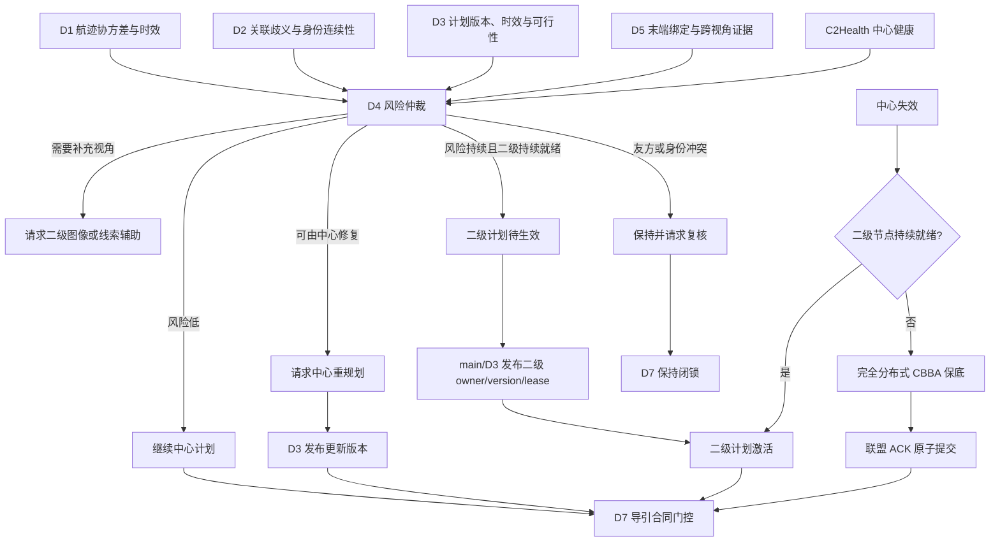
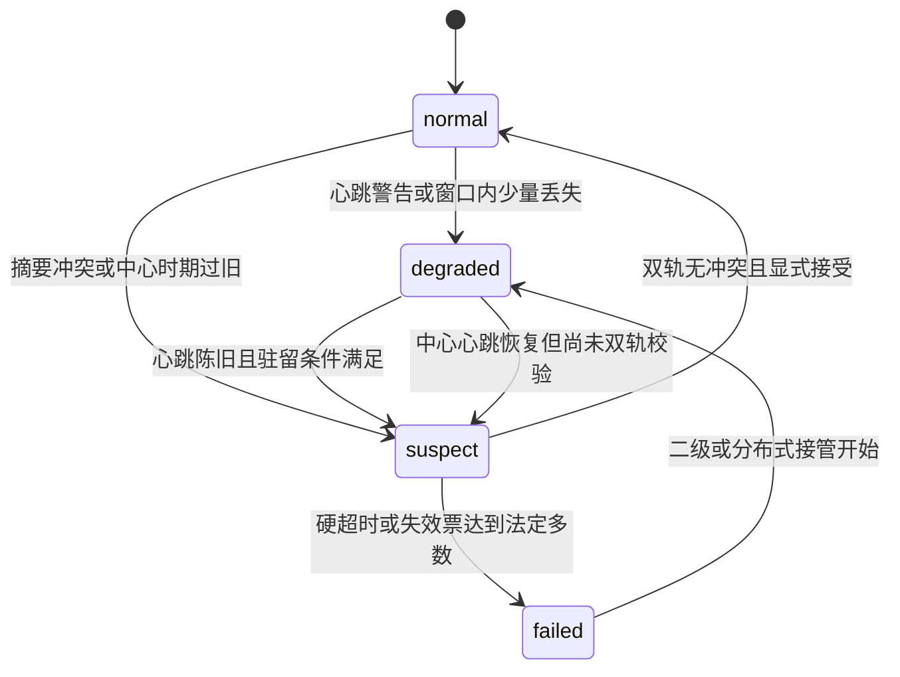
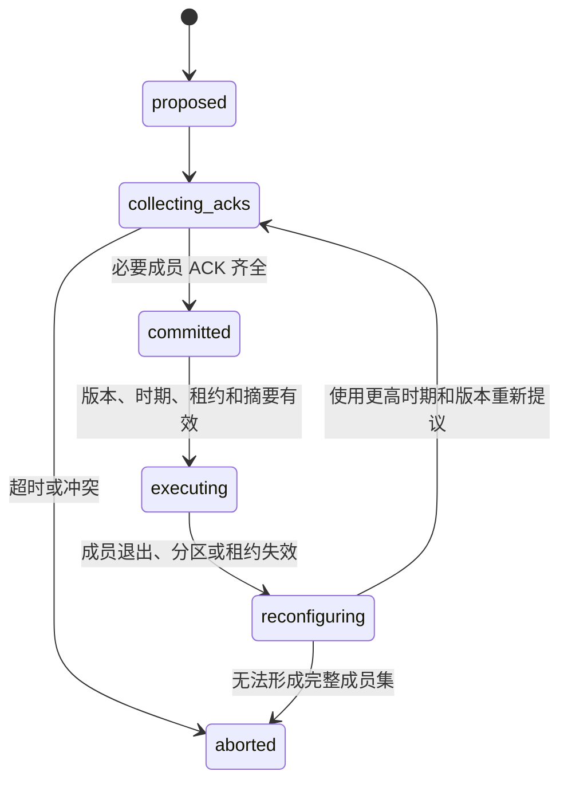

# D4 分布式协同与降级接管算法及实施方案

**模块**：D4 分布式协同与降级接管

**同步基线**：2026-07-13 代码、模块说明文件、模块计划文件、模块原理文档和系统总汇总

**适用范围**：Python 科研仿真、AirSim 单次试验时钟接线和离线故障回放

## 1. 文档目的与模块边界

D4 解决的不是单一“中心掉线后换一个节点”问题，而是以下三类协调状态之间的安全转换：

1. 中心节点仍有效，由 D3 维持中心化分配；
2. 中心节点失效，或中心计划在高动态条件下持续不适用，由机动高空侦察二级节点接管；
3. 中心和二级节点均不可用，拦截资源通过完全分布式协商维持最低任务连续性。

本文中的指挥与控制（Command and Control，C2）表示中心协调权威；`C2Health` 表示其健康状态。D4 同时处理：

- **被动降级**（passive failover）：节点被摧毁、心跳超时、摘要冲突或网络分区导致原协调者不可用；
- **主动降级**（active degradation）：中心仍在线，但传感器不确定性、目标身份歧义、计划时效或末端关联证据表明当前计划已不适用。

必须纠正旧口径：主动降级不只包含“请求中心重规划”。系统允许两条受控路径：

- 风险尚可由中心修复时，D4 请求中心重规划，由 D3 发布新版本计划；
- 风险持续、当前计划明显不适用，且机动高空侦察二级节点持续就绪时，D4 可提出转移到二级节点，随后由 main/D3 发布严格更新的二级计划并转移计划所有者。

D4 自身不创建完整 `AssignmentPlan`，也不在本地改写 `global_track_id`。主动转移必须通过 main/D3 的计划发布、所有者、版本、时期和租约合同，不能把 D4 的单次风险判断直接解释为执行授权。

模块边界如下：

- D4 读取 D1-D5 的摘要，不重复实现传感器滤波、数据关联、中心优化和像素几何；
- D4 输出协调动作、二级接管元数据、联盟提交状态和审计记录，不直接输出飞控命令；
- D7 仍独立检查计划、末端锁定和运动学条件；
- 当前网络是内存队列或 AirSim 单次试验时钟上的故障注入，不代表真实无线链路；
- 本模块不包含真实硬件、射频设备、视频编码器、火控、毁伤或自动处置逻辑。

## 2. 总体分层架构



默认优先级是：

```text
中心计划可用
  -> 继续中心
  -> 请求二级观测辅助
  -> 请求中心重规划
  -> 风险持续且二级持续就绪时，发布更新的二级计划
  -> 中心和二级均不可用时，进入完全分布式保底
  -> 证据、版本、租约或成员确认不完整时，闭锁或保持复核
```

主动转移和被动接管都可到达二级节点，但触发原因不同：前者是计划持续不适用，后者是中心不可用。两者进入同一套二级计划版本、来源、租约和 D7 门控，不允许维护两套互相矛盾的执行规则。

## 3. 机动高空侦察二级节点

### 3.1 当前场景角色

当前系统假设中的二级节点是**机动高空侦察无人机**，不是固定系留节点。它与拦截资源同步出动，但不执行拦截，承担两种职责：

1. **正常运行时的观测辅助**：利用高性能光电云台、雷达或 GlobalTrack 粗指向，在局部区域搜索目标，并向小范围拦截资源发送图像、检测结果、投影线索和覆盖摘要；
2. **降级时的区域协调**：在中心失效或当前中心计划持续不适用时，基于其覆盖区、通信链路、计算能力和最新态势发布候选重分配，由 main/D3 转换为版本化二级计划。

代码仍保留 `FIXED_TETHERED_SECONDARY` 等历史兼容枚举，以便读取旧回放，但新场景和实施说明以 `MOBILE_HIGH_RECON` 或 `MOBILE_SECONDARY_RECON` 为默认角色。兼容枚举不表示当前方案仍以固定系留节点为主。

二级节点通常设置：

- `coordinator_only=True`：只参与侦察和协调，不作为拦截执行资源出价；
- `coverage_cell`：限定可辅助或接管的区域；
- `heartbeat_timestamp_s` 和 `heartbeat_stale_after_s`：描述节点生命状态；
- `cue_freshness_s`：描述图像或线索新鲜度；
- `gimbal_pointing_ok`：表示云台是否正确指向目标区域；
- `secondary_coverage_ratio`：表示覆盖目标的比例；
- `secondary_network_joint_full_view_frame_rate`：表示二级网络同一帧联合覆盖完整目标集合的比例；
- `cross_view_association_count` 和 `stable_cross_view_registration_count`：表示 D5 已形成的跨视角支持；
- `lease_epoch` 和 `lease_expires_at_s`：表示接管权有效世代和到期时间。

### 3.2 正常运行时的图像和线索流

```text
D1/D2 GlobalTrack 粗位置
  -> main 生成雷达/航迹指向线索
  -> 机动高空侦察节点调整云台
  -> D5 处理二级图像和局部多目标轨迹
  -> D5 输出跨视角注册、覆盖率和歧义摘要
  -> D4 只消费摘要并评估二级节点就绪性
```

二级节点“看见目标”不等于“能接管”。检测框存在、云台指向正确或平均覆盖率较高，都不能替代时间同步、全局绑定、稳定跨视角注册、通信新鲜度、计划版本和租约检查。

## 4. 输入、内部状态与输出合同

### 4.1 上游输入

| 来源 | D4 输入 | 关键语义 |
|---|---|---|
| D1 多传感器融合 | `TrackUncertaintySummary` | 位置标准差、协方差迹、速度标准差、量测年龄和覆盖小区 |
| D2 多目标关联 | `AssociationRiskSummary` | 关联歧义、显式身份切换计数、重复航迹、连续率及真值指标可用性 |
| D3 分配规划 | `AssignmentValiditySummary` | `global_track_id`、资源、计划版本、是否当前、最近评估年龄、代价裕度和资源可行性 |
| D5 末端关联 | `TerminalAssociationSummary` | 当前绑定、末端证据适用性、锁定/歧义/保持/重捕获、友方冲突、重复锁定和跨视角证据 |
| main/runtime | `C2Health`、`ResourceSummary[]`、`CommunicationSummary[]` | 当前时间、心跳、链路新鲜度、二级节点能力、计划所有者、时期和租约 |

D4 只接受上游规范 `global_track_id`。D5 本地轨迹标识、AirSim actor 名称和离线真值标识都不能在 D4 内生成新的全局身份。

### 4.2 主要内部状态

- `C2Health`：中心健康状态；
- `ActiveDegradationDecision`：本次仲裁动作；
- `SecondaryNodeLifecycleSummary`：二级节点心跳、链路、覆盖和就绪性；
- `SecondaryTakeoverPlanMetadata`：二级计划待生效或已激活状态；
- `CenterReplanStatus`：中心重规划请求生命周期；
- `CoalitionMemberAck`：联盟成员确认应答；
- `CoalitionCommitState`：联盟从提议到执行或中止的状态；
- `CBBAResult`：完全分布式一对一保底结果；
- `MergeResult`：中心恢复后的双轨校验结果。

### 4.3 下游输出

| 输出 | 消费者 | 用途 |
|---|---|---|
| `ActiveDegradationDecision` | main、D6 | 继续中心、重规划、二级辅助、二级转移、分布式或保持复核 |
| `D4DecisionRecord` | main、D6 | 保存触发证据、动作、时延、所有者、版本、租约和拒绝原因 |
| `SecondaryTakeoverPlanMetadata` | main、D3、D7 | 描述二级计划待生效/已激活，不代替系统计划 |
| `D7SecondaryHandoff` | D7 | 二级交接两阶段门控和视觉比例导航制导许可前置条件 |
| `CBBAResult` | main、D6 | 分布式保底分配、共识轮数、冲突和消息开销 |
| `CoalitionCommitState` | main、D5、D7、D6 | 多资源联盟是否已经原子提交并可执行 |
| `HealthTransition[]`、`MergeResult` | main、D6 | 健康迁移、恢复审计和防双主评价 |

## 5. `C2Health` 中心健康状态机

### 5.1 状态定义

| 状态 | 中文含义 | 判定依据 |
|---|---|---|
| `normal` | 正常 | 心跳、计划摘要校验值和中心时期可信 |
| `degraded` | 降质 | 心跳抖动或已有降级协调者维持连续性 |
| `suspect` | 可疑 | 心跳陈旧、摘要冲突、中心时期倒退或恢复待校验 |
| `failed` | 失效 | 心跳硬超时或对等节点失效票达到法定多数 |

### 5.2 状态迁移



`FailoverCoordinator.update_health()` 使用心跳滑动窗口、丢失阈值和状态驻留时间，避免单个迟到消息把中心直接判为失效。对等节点法定多数（quorum）可在明确分区或中心损坏时加速失效判定。

恢复路径刻意不对称：心跳恢复只证明中心重新发送消息，不能证明其计划是最新版本。因此 `observe_center()` 将恢复中的中心置为 `suspect`，只有双轨校验通过后才能回到 `normal`。

## 6. D1-D5 风险融合与主动降级

### 6.1 D1 航迹不确定性

D1 以带协方差的全局航迹作为依据。位置风险可用位置协方差子矩阵表示：

\[
\sigma_p=\sqrt{\frac{\mathrm{tr}(P_{pos})}{3}}.
\]

当前轻量规则以位置标准差约 20 米作为中风险分档、50 米作为高风险分档，并结合协方差迹和量测年龄。门限是仿真基线，需要依据传感器配置和真实回放重新标定，不能直接作为硬件指标。

### 6.2 D2 关联风险

D4 读取：

- 关联歧义分数；
- 显式身份切换（Identity Switch，IDSW）计数；
- 显式重复航迹事件；
- 航迹连续率；
- `truth_metrics_available` 和 `continuity_available` 可用性标志。

在线真值隔离时，缺失真值产生的零值或占位值不能成为硬风险。连续重复风险评分只作软证据；只有显式重复计数、事件或增量才构成硬阻断。

### 6.3 D3 计划有效性

D4 不用计划创建时间简单判断陈旧，而优先读取最近评估时间。主要硬风险包括：

- 计划不是当前版本；
- 计划超过允许年龄；
- 资源已不可行；
- 当前资源、目标或联盟版本不匹配。

代价裕度过低只表示计划容易抖动，是软证据，不能单独触发所有权转移。

### 6.4 D5 末端证据

D4 首先检查 `terminal_evidence_applicable`。尚未进入末端视觉适用窗口时，低置信度、高歧义和普通重捕获不会逐帧触发降级；友方冲突、重复锁定、资源错配和明确全局航迹错配仍是硬风险。

进入末端窗口后，D4区分：

- **绑定安全性**：资源、规范全局航迹、计划版本和联盟版本是否一致；
- **视觉准备度**：D5 是否已经锁定、置信度是否足够、是否需要重捕获。

`terminal_consistent=true` 只表示当前计划绑定未被硬证据推翻，不表示 D5 已锁定，也不授权 D7 切换视觉导引。

### 6.5 主动降级动作选择

| 条件 | 动作 | 所有者变化 |
|---|---|---|
| 风险低、绑定一致 | `continue_center` | 无 |
| 软风险暂时升高 | 继续中心或 `request_secondary_assist` | 无 |
| 计划陈旧、非当前或资源不可行 | `request_center_replan` | 等待 D3 新计划 |
| D5 持续硬失配但中心仍能及时修复 | `request_center_replan` | 等待 D3 新计划 |
| 风险持续、原计划明显不适用、中心重规划不足以及二级持续就绪 | `degrade_to_secondary` 候选 | main/D3 发布新版本后才转移 |
| 友方冲突、身份冲突或联盟合同不完整 | `hold_for_review` | 不转移 |

主动转移采用递进策略：

1. 记录 D1-D5 风险并经过风险窗口和驻留时间，过滤单帧噪声；
2. 能由中心滚动重规划修复时，先发出 `request_center_replan`；
3. 中心计划在高动态条件下持续不适用，且二级节点达到持续 `takeover_ready` 时，允许提出二级转移；
4. D4 只形成二级接管候选和待生效元数据；
5. main/D3 生成严格更新的计划标识和版本，把计划来源设为选中的二级节点；
6. 新计划通过来源、版本、时期和租约校验后，计划所有者才变为 `secondary_node`。

当前通用 `ActiveDegradationArbiter` 主要实现继续中心、二级辅助、中心重规划和失效后的分层回退；系统级 AirSim 运行时已经接入主动 `degrade_to_secondary` 的两阶段场景。实施时应保持这一所有权边界：D4 做风险和转移仲裁，main/D3 做计划发布，不能让本地资源自行更换所有者。

### 6.6 迟滞和中心重规划生命周期

主动仲裁按资源/航迹对保存独立状态，避免一个目标的风险污染另一个目标。主要防抖机制包括：

- `risk_window_size` 和 `risk_window_threshold`：风险窗口内满足足够样本才触发；
- `min_dwell_s`：动作最短驻留时间；
- `release_consecutive_consistent_frames`：恢复中心前需要的连续低风险帧；
- `non_locked_frame_limit` 和 `mismatch_frame_limit`：区分普通失锁与持续错配；
- `center_replan_cooldown_s`：中心重规划请求默认 2 秒冷却。

`CenterReplanStatus` 包含 `pending`、`applied`、`acknowledged_no_change` 和 `expired`。硬安全风险可绕过冷却；非硬风险在冷却期内不重复发送请求。

## 7. 二级节点就绪性与接管计划

### 7.1 四级就绪性

二级节点能力不是二值状态，而是四级状态：

| 等级 | 含义 | 可否接管 |
|---|---|---|
| `not_ready` | 心跳、链路、云台、覆盖、租约或证据不足 | 否 |
| `visible_only` | 能检测目标，但尚未完成稳定全局注册 | 否 |
| `registration_usable` | 已有跨视角注册，但完整覆盖或综合能力不足 | 否，只可辅助 |
| `takeover_ready` | 覆盖、网络全视野、注册、新鲜度、通信和综合评分均满足 | 可作为候选 |

综合评分可抽象为：

\[
Q_s=w_c c+w_n n+w_r r+w_f f+w_g g+w_l l,
\]

其中 (c) 为覆盖率，(n) 为二级网络同帧全覆盖率，(r) 为跨视角注册质量，(f) 为线索新鲜度，(g) 为云台指向状态，(l) 为链路和租约状态。当前代码的接管基线包括：综合评分不低于 0.70、覆盖率不低于 0.65、网络同帧全覆盖率不低于 0.80。

这些门限必须与场景配置一起记录。它们不是通用工程标准，也不能为了形成接管正例而降低身份、版本或租约安全门限。

### 7.2 持续就绪

单帧 `takeover_ready` 不足以接管。适配器默认要求：

- 至少 3 个不同时间戳的连续就绪决策；
- 持续时间至少 0.2 秒；
- 相邻证据时间间隔不超过 1.0 秒。

计数按二级节点、目标和覆盖小区隔离；同一时刻多次调用不增加连续计数。心跳、链路、云台、覆盖、注册或租约回落都会使持续就绪失效。

### 7.3 所有者、版本、时期和租约

二级计划是否可执行可写为：

\[
E_{sec}=I_{active}I_{source}I_{ready}I_{epoch}I_{lease}I_{version}.
\]

其中：

- (I_{active})：main/D3 已明确回填二级计划激活；
- (I_{source})：计划来源等于 D4 选中的二级节点；
- (I_{ready})：二级节点持续就绪；
- (I_{epoch})：租约时期不低于要求时期；
- (I_{lease})：当前时间没有超过租约到期时间；
- (I_{version})：新计划版本严格高于被替代计划，或确认为同一已激活二级计划。

`SecondaryTakeoverPlanMetadata` 有三种状态：

1. `not_applicable`：本次不是二级转移；
2. `pending_secondary_plan`：D4 已选择二级来源，但当前所有者仍保持原值；
3. `secondary_plan_active`：main/D3 已发布正确来源和更新版本，租约有效且持续就绪，所有者变为二级节点。

旧版本、旧时期、过期租约、来源不匹配或就绪性回落都会使计划保持待生效或不可执行。

### 7.4 两阶段 D7 交接

```text
阶段 1：D4 提出 degrade_to_secondary
  -> 当前计划仍有效或进入保持
  -> secondary_reassignment_complete=false
  -> visual_png_allowed=false

阶段 2：main/D3 回填新的二级计划
  -> owner/source/version/epoch/lease 全部通过
  -> secondary_reassignment_complete=true
  -> D7 仍需检查 D5 锁定和自身运动学门控
```

D4 的阶段 2 不是视觉比例导航制导（Proportional Navigation Guidance，PNG）的充分条件，只是 D7 的必要前置合同之一。

## 8. 被动降级实施流程

被动降级用于中心结构性失效：

```text
C2Health normal/degraded/suspect
  -> 心跳硬超时、摘要长期冲突或 peer 法定多数判定失败
  -> C2Health failed
  -> 选择覆盖当前区域且持续就绪的机动高空侦察二级节点
  -> 发布二级计划候选
  -> main/D3 回填 owner/version/epoch/lease
  -> 二级计划激活
  -> 二级失效或不可用时进入完全分布式协商
```

如果二级节点只是可见、注册可用但未达到接管门限，系统不能把它解释为可执行协调者。中心已失效且无持续就绪二级节点时，D4 进入 `degrade_to_distributed` 或安全保持，而不是降低门限。

## 9. 完全分布式 CBBA 保底

### 9.1 算法角色

中心和二级节点都不可用时，D4 使用本地轻量基于共识的捆绑算法（Consensus-Based Bundle Algorithm，CBBA）作为一对一任务连续性基线。它不是麻省理工学院外部 CBBA 工程，也不是通信感知 CBBA 的生产实现。

对任务 (j) 和资源 (i)，基础出价为：

\[
s_{ij}=2.0q_j+1.4a_i+0.5c_i+1.2m_{ij}+b_{source}-0.8p_{age}+\Delta s_{D5},
\]

其中 (q_j) 是航迹置信等级，(a_i) 是资源可用性，(c_i) 是通信等级，(m_{ij}) 是能力匹配，(b_{source}) 是多源观测增益，(p_{age}) 是航迹年龄惩罚，(Delta s_{D5}) 是分布式视觉证据修正。

### 9.2 共识过程

1. 每个资源根据本地任务摘要建立 bundle；
2. 节点广播任务获胜者、出价、时期和约束摘要；
3. 收到更高出价或更新时期后，节点更新 winner view；
4. 节点失去 bundle 中某任务后释放该任务及其后续任务；
5. 所有节点 winner view 一致或达到最大轮数后结束。

确定性消歧按出价、时期、资源标识和约束摘要排序，避免相同输入产生随机所有者。

全连接 (N) 个资源、(T) 个任务的单轮通信复杂度约为：

\[
O(N^2T).
\]

稀疏网络可降低单轮消息量，但会增加传播轮数。`converged=false` 时不能把空结果或局部 winner view 当作有效计划。

### 9.3 D5 分布式视觉证据

D5 多相机证据只作为风险或出价修正：

- 多个资源支持同一个上游 `global_track_id`，可增加相应资源的支持分；
- `hypothesis_only` 只产生弱正向证据；
- 友方冲突、缺失或陈旧全局标识、身份冲突会阻断执行；
- 重复末端锁定进入审计并强惩罚；
- D4 不根据局部视觉生成新全局标识。

### 9.4 能力边界

当前轻量 CBBA 默认是单获胜者、一任务一资源保底。对于一个高威胁目标需要多个资源的情况，CBBA 可选择协调者或候选成员，但不能冒充完整联盟形成算法。多成员执行必须经过独立原子提交合同。

## 10. 多资源联盟与原子 ACK

### 10.1 数据合同

`CoalitionMemberAck`（联盟成员确认应答）至少绑定：

- 目标 `global_track_id`；
- 联盟标识和联盟版本；
- 计划标识和计划版本；
- 成员资源标识；
- 时期；
- 租约到期时间；
- 能力证据时间和摘要校验值。

`CoalitionCommitState` 状态机为：



原子提交条件可表示为：

\[
C=I_{members}I_{plan}I_{coalition}I_{epoch}I_{lease}I_{digest}I_{network}.
\]

任一项为零都必须失效时闭锁（fail closed）。缺一个主成员确认、旧计划版本、旧联盟版本、过期租约、摘要冲突或网络分区都不能形成部分执行。

### 10.2 独立执行与联盟执行

多个独立主资源不要求在同一时刻到达，但每个资源仍需满足自己的计划和 D5/D7 门控。需要共享联盟状态的多成员任务则必须先原子提交；备用成员未被新版本计划激活前保持待命，不能自行补位。

### 10.3 二级和完全分布式联盟

- 二级节点可作为联盟协调者，但必须是持续就绪且持有有效计划租约；
- 二级节点失效后，完全分布式 peer 协调者必须使用更高时期、计划版本和联盟版本重新提议；
- 分区恢复后全部必要成员重新确认，旧 ACK 不可复用；
- D5 只认可当前 committed/executing 联盟中的成员锁定；
- D7 只执行当前 committed/executing 联盟及当前计划。

## 11. 中心恢复与双轨校验

中心恢复后同时存在两条状态轨迹：

- 中心恢复前最后掌握的计划和航迹摘要；
- 降级期间形成的二级或分布式计划、联盟提交和执行状态。

`merge_recovery()` 当前比较任务所有者、时期和基础分配状态：

- 完全一致进入 `accepted`；
- 只在单侧存在或需要人工判断进入 `review`；
- 重复所有者、时期倒退或版本冲突进入 `conflicts`。

只有 `review` 和 `conflicts` 均为空，并且 `human_accept=true` 时才恢复中心权威。恢复心跳不能立即夺权。

当前恢复合并仍是基础版。完整工程恢复还应比较：

- 航迹摘要和协方差摘要校验值；
- D3 计划及联盟摘要校验值；
- D5 当前锁定和身份冲突；
- D7 当前控制许可和执行前缀；
- 通信链路状态、成员退出和租约历史。

## 12. 与 D7 导引门控的关系

D4 只决定协调权和计划状态，不决定比例导引或视觉导引公式。D7 放行至少需要：

1. D3 当前计划和资源绑定有效；
2. D4 当前所有者、模式、时期、版本和租约一致；
3. 多成员任务已经完成必要 ACK 和原子提交；
4. D5 锁定的 `assigned_global_track_id` 与计划一致；
5. 没有友方冲突、重复锁定和身份冲突；
6. D7 的相机识别能力、闭合速度、机动能力和导引切换条件满足。

以下情况 D7 必须阻断视觉 PNG：

- 二级计划仍为 `pending_secondary_plan`；
- 所有者、来源或版本不匹配；
- 租约过期或时期落后；
- 二级节点只达到 `visible_only` 或 `registration_usable`；
- 联盟缺 ACK、处于 `reconfiguring` 或 `aborted`；
- D5 为歧义、保持、重捕获或友方冲突；
- 当前计划已被替代但执行资源仍持有旧计划。

## 13. 代码实施映射

| 文件 | 实施职责 |
|---|---|
| `models.py` | 航迹、资源、通信、健康、分配和结果数据结构 |
| `active_degradation.py` | D1-D5 风险规则、二级能力评分、动作仲裁、二级计划和 D7 交接合同 |
| `adapter.py` | 上游字段归一化、按绑定隔离迟滞、持续就绪、中心重规划和 D6 事件输出 |
| `coordinator.py` | 中心健康、协调者选择、被动接管和基础恢复合并 |
| `cbba.py` | 轻量 CBBA、D5 视觉风险修正和中心代价差距辅助计算 |
| `coalition_safety.py` | 多成员计划、联盟版本、ACK、时期、租约和摘要安全门控 |
| `network.py` | 内存丢包和延迟模型、消息数量和估计字节统计 |
| `episode_communication.py` | AirSim 单次试验时钟驱动的中心、二级、peer 顺序接管接口 |
| `communication_fault_replay.py` | 多随机种子通信故障矩阵 |
| `p1_failover_replay.py` | 确定性接管扰动回放 |
| `p2_coalition_replay.py` | 隔离式联盟算法对照和外部能力探测 |

main/runtime 负责：

- AirSim 启动、重置和单次试验时钟；
- 把 D1-D5 摘要送入 D4；
- 把主动或被动二级转移请求交给 D3；
- 回填新的计划标识、版本、所有者、时期和租约；
- 把 D4 状态送给 D5、D7 和 D6；
- 注入中心失效、二级失效、延迟、丢包和网络分区。

## 14. 关键参数与调参原则

| 参数 | 当前用途 | 调参原则 |
|---|---|---|
| `heartbeat_warning_s` | 进入降质观察 | 应大于正常心跳抖动 |
| `heartbeat_stale_s` | 进入可疑状态 | 应结合消息周期和排队延迟 |
| `heartbeat_failure_s` | 硬失效判定 | 必须大于正常抖动和短时丢包上界 |
| `heartbeat_window_size` | 心跳滑动窗口 | 太小易误降级，太大增加接管延迟 |
| `position_sigma_medium_m/high_m` | D1 风险分档 | 按雷达和融合真实误差标定 |
| `max_plan_age_s` | D3 计划陈旧门限 | 按目标动态和分配周期标定 |
| `non_locked_frame_limit` | D5 持续失锁门限 | 不可替代 D5 自身锁定门限 |
| `risk_window_size/threshold` | 主动降级持续风险 | 用同随机种子正常/异常配对校准 |
| `center_replan_cooldown_s` | 防止重规划抖动 | 默认 2 秒，硬风险可绕过 |
| `takeover_ready_required_decisions` | 二级持续就绪帧数 | 默认 3 个不同时间戳 |
| `takeover_ready_required_duration_s` | 二级持续时间 | 默认 0.2 秒 |
| `lease_epoch/lease_expires_at_s` | 防止旧协调者复活 | 接管和重构必须单调更新 |
| `bundle_limit/max_rounds` | CBBA 束长和轮数 | 网络越差，轮数预算越高 |
| `packet_loss/min_delay/max_delay` | 内存网络实验 | 只作敏感性分析，不冒充真实链路 |

调参顺序应为：先固定身份、版本、租约和 ACK 安全门限，再标定风险窗口、覆盖和持续时间；不得为了提高接管率降低 `global_track_id`、友方冲突、旧版本或过期租约门控。

## 15. 典型实施流程

### 15.1 正常中心流程

1. D1 输出带协方差和双时间戳的 GlobalTrack；
2. D2 稳定全局身份并输出关联风险；
3. D3 发布中心计划；
4. 机动高空侦察节点根据雷达/GlobalTrack 线索调整云台并提供图像或摘要；
5. D5 形成末端关联和跨视角证据；
6. D4 风险低时输出 `continue_center`；
7. D7 独立执行导引门控。

### 15.2 主动降级到中心重规划

1. 中心仍健康；
2. D3 计划陈旧或资源不可行，或 D5 形成明确持续失配；
3. D4 输出 `request_center_replan`；
4. D3 使用当前 GlobalTrack 和资源状态发布更高版本计划；
5. D4 验证新版本和风险消退；
6. D5/D7 只消费新计划，不沿用旧绑定。

### 15.3 主动降级到二级节点

1. 中心仍在线，但高动态条件下计划持续不适用；
2. 风险窗口、驻留和重规划生命周期确认问题不是单帧噪声；
3. 机动高空侦察二级节点持续达到 `takeover_ready`；
4. D4 输出二级转移候选，状态为 `pending_secondary_plan`；
5. main/D3 以选中二级节点为来源发布更高版本和有效租约；
6. D4 校验来源、版本、时期、租约和持续就绪，状态变为 `secondary_plan_active`；
7. D5 根据新计划重新确认目标；
8. D7 在全部门控通过后才切换导引。

### 15.4 被动中心失效

1. 心跳窗口、硬超时或法定多数把中心判为 `failed`；
2. D4 优先选择覆盖区内持续就绪的二级节点；
3. 二级计划经过同一 owner/version/epoch/lease 流程激活；
4. 二级不可用时，资源节点交换摘要并运行轻量 CBBA；
5. 多成员任务必须完成原子 ACK；
6. 中心恢复后进入双轨校验，不立即夺权。

### 15.5 中心和二级均失效

1. D4 明确进入 `degrade_to_distributed`；
2. peer 使用当前时期的压缩航迹和资源摘要构造出价；
3. CBBA 形成一对一任务所有者；
4. 多资源任务使用更高计划/联盟版本发起 ACK；
5. ACK 完整且租约有效时原子提交；
6. 缺 ACK、分区、旧时期或摘要冲突时保持闭锁；
7. 成员变化必须进入 `reconfiguring` 并全量重新确认。

## 16. 当前验证结果

### 16.1 D4 模块与规范回放

截至当前同步基线，D4 验证记录包括：

- D4 全量模块回归已有记录为 **198 项通过**；本次只同步文档，没有重跑测试；
- 七个规范单次试验时间轴场景 **7/7 通过**，覆盖正常中心、中心失效后二级接管、二级再次失效后 peer 接管、缺 ACK、旧时期、过期租约和网络分区；
- 逻辑时钟步为 0.25 秒时，中心故障到二级可执行所有者为 **1.25 秒**，二级故障到 peer 原子执行为 **1.00 秒**；
- 二级和 peer 正例均以 3/3 ACK 进入执行，缺 ACK 负例以 2/3 ACK 中止并保持闭锁。

### 16.2 60 组通信故障矩阵

main/runtime 按 AirSim 单次试验时钟运行六类场景，每类 10 个随机种子，共 60 个案例：

| 场景 | 主要验证内容 |
|---|---|
| 正常中心 | 不应误降级 |
| 中心失效 | 二级节点优先接管 |
| 中心和二级均失效 | 才允许 peer 完全分布式接管 |
| 0.5 秒延迟 | 延迟 ACK 和旧消息拒绝 |
| 30% 丢包 | ACK 完整才执行，缺 ACK 闭锁 |
| 分区恢复 | 新时期、新计划/联盟版本和全员重新 ACK |

结果为：

- 安全结果 **60/60 通过**；
- 正常场景误降级为 **0**；
- 重复计划所有者为 **0**；
- 脑裂防护失败为 **0**；
- 30% 丢包场景中 3/10 ACK 完整后执行，7/10 因缺 ACK 保守闭锁。

这些结果证明的是实验时钟上的状态迁移、版本、时期、租约、ACK 和唯一所有者合同。它们不能证明真实网络吞吐、实时性或硬件可靠性。

### 16.3 二级视觉覆盖证据

历史 5v5、50/200 米高差、多个机动高空二级节点的校准表明：基础投影和跨视角注册已能形成，但网络同帧完整覆盖持续性曾是二级接管的主要断点。D4 因此保留 `visible_only -> registration_usable -> takeover_ready` 的分级，不把平均覆盖率或单帧检测直接提升为接管能力。

### 16.4 系统级边界

D4 的 60/60 安全通过不等于整个拦截闭环完成。系统级多资源对少目标场景仍受 D5 第二主资源视觉锁定、D7 末端许可和物理闭合影响。D4 的职责是确保计划转移时不出现旧版本执行、部分联盟执行、重复所有者或脑裂。

## 17. 真实网络限制与后续实施

当前 `SimulatedNetwork` 和 episode 故障接口只模拟或记录：

- 丢包概率；
- 固定或随机消息延迟；
- 消息数量和估计字节；
- ACK 丢失；
- 中心、二级和 peer 分区；
- 租约、时期、版本和恢复状态。

尚未验证：

1. 真实射频（Radio Frequency，RF）链路预算和覆盖；
2. 视频编码码率、突发流量与控制消息优先级；
3. 节点时钟漂移、时间同步误差和时间戳回绕；
4. 操作系统调度、网络队列、拥塞、抖动和乱序；
5. 传输控制协议或用户数据报协议的重传和拥塞行为；
6. 中心到二级、二级到拦截机以及 peer 网状链路的真实吞吐差异；
7. 密钥、消息来源认证、重放防护和设备失陷；
8. 长时间运行下的租约刷新、成员退出和分区合并统计；
9. 真实视频与压缩 TrackSummary 竞争带宽时的接管时延。

因此下一阶段网络实施应采用与现有合同一致的消息封装，至少保存：发送时间、到达时间、序列号、来源、目标、载荷类型、字节数、时期、计划版本、联盟版本、租约和认证状态。真实网络测试应逐步替换延迟/丢包模型，但不能绕过现有 fail-closed 规则。

## 18. 已实现、可选和未实现能力

| 类别 | 能力 | 当前状态 |
|---|---|---|
| 默认主线 | C2Health 四态、心跳窗口和恢复待校验 | 已实现 |
| 默认主线 | D1-D5 风险摘要和主动仲裁 | 已实现 |
| 默认主线 | 中心重规划请求生命周期 | 已实现 |
| 默认主线 | 二级四级就绪、持续窗口和计划元数据 | 已实现 |
| 系统集成 | 主动高动态场景转移到二级计划 | main/runtime 已接线，D4 不直接生成 D3 计划 |
| 默认主线 | 中心失效后二级优先、再完全分布式 | 已实现 |
| 默认主线 | 轻量一对一 CBBA 和 D5 风险修正 | 已实现 |
| 默认主线 | 多成员 ACK、时期、租约和原子提交 | 已实现安全合同 |
| 默认主线 | 中心恢复基础双轨校验 | 已实现基础版 |
| 离线可选 | CBBA 与 D3 中心代价差距 | 辅助函数已实现，依赖 main/D3 保存代价矩阵 |
| 离线可选 | 外部 CBBA 能力探测 | 只探测路径，不导入、不执行 |
| 未实现 | 麻省理工学院 CBBA 生产适配器 | 未集成 |
| 未实现 | 通信感知 CBBA、独立拍卖和合同网完整状态机 | 未实现 |
| 未实现 | 多成员能力组合搜索和自主联盟形成 | 未实现，当前只提交上游给定成员集 |
| 未实现 | 完整恢复摘要校验 | 尚未覆盖 D1-D7 全部状态 |
| 未实现 | 真实无线、视频和安全认证链路 | 未实现 |

## 19. 复核命令与证据入口

本次只修改算法与实施文档，不改代码，因此无需运行全量测试。代码能力复核命令为：

```bash
PYTHONPATH=research_modules/d4_distributed_fallback \
python3 -m pytest -q research_modules/d4_distributed_fallback/tests
```

主要证据入口：

- `research_modules/d4_distributed_fallback/README.md`
- `research_modules/d4_distributed_fallback/PLAN.md`
- `research_modules/d4_distributed_fallback/docs/MODULE_PRINCIPLES_CN.md`
- `research_modules/d4_distributed_fallback/d4_distributed_fallback/active_degradation.py`
- `research_modules/d4_distributed_fallback/d4_distributed_fallback/adapter.py`
- `research_modules/d4_distributed_fallback/d4_distributed_fallback/coordinator.py`
- `research_modules/d4_distributed_fallback/d4_distributed_fallback/cbba.py`
- `research_modules/d4_distributed_fallback/d4_distributed_fallback/coalition_safety.py`
- `research_modules/d4_distributed_fallback/d4_distributed_fallback/episode_communication.py`
- `subagent_reviews/D4_DISTRIBUTED_FALLBACK_REVIEW_AND_PLAN.md`
- `C_UAS_D1_D7_MODULE_PRINCIPLES_SUMMARY_CN.md`

## 20. 缩写与术语

| 术语 | 中文全称与英文全称 | 本文含义 |
|---|---|---|
| C-UAS | 反无人机系统（Counter-Unmanned Aircraft System） | 本仓库研究的多模块拦截仿真体系 |
| C2 | 指挥与控制（Command and Control） | 中心协调权威及其健康状态 |
| CBBA | 基于共识的捆绑算法（Consensus-Based Bundle Algorithm） | 完全分布式的一对一轻量保底基线 |
| ACK | 确认应答（Acknowledgement） | 成员对同一计划、联盟、时期和租约的有效确认 |
| IDSW | 身份切换（Identity Switch） | D2 显式输出的目标身份交换事件 |
| PNG | 比例导航制导（Proportional Navigation Guidance） | D7 末端导引模式，不是 D4 的执行动作 |
| RF | 射频（Radio Frequency） | 当前尚未进行真实链路验证 |
| GlobalTrack | 全局航迹 | D1/D2 维护、带规范全局标识和协方差的航迹 |
| owner | 计划所有者 | 当前经 main/D3 认可的计划协调来源 |
| version | 版本 | 拒绝过期计划和联盟状态的单调编号 |
| epoch | 时期 | 接管、重构和分区恢复时拒绝旧状态的代际编号 |
| lease | 租约 | 所有者、计划或联盟状态的限时有效合同 |
| digest | 摘要校验值 | 用于比较计划、联盟和恢复双轨一致性的摘要 |
| readiness | 就绪性 | 二级节点从未就绪到可持续接管的能力分级 |
| fail closed | 失效时闭锁 | 证据缺失、冲突或过期时不允许执行 |
| main/runtime | 主编排器/运行时 | 负责 AirSim 时钟、D3 计划发布和跨模块接线 |
