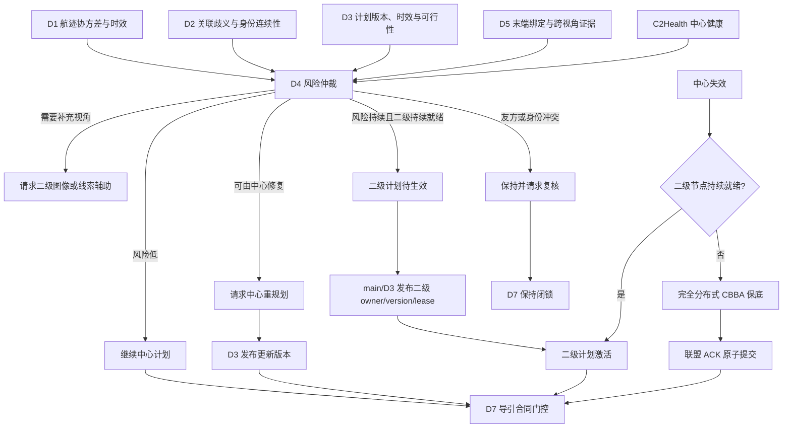
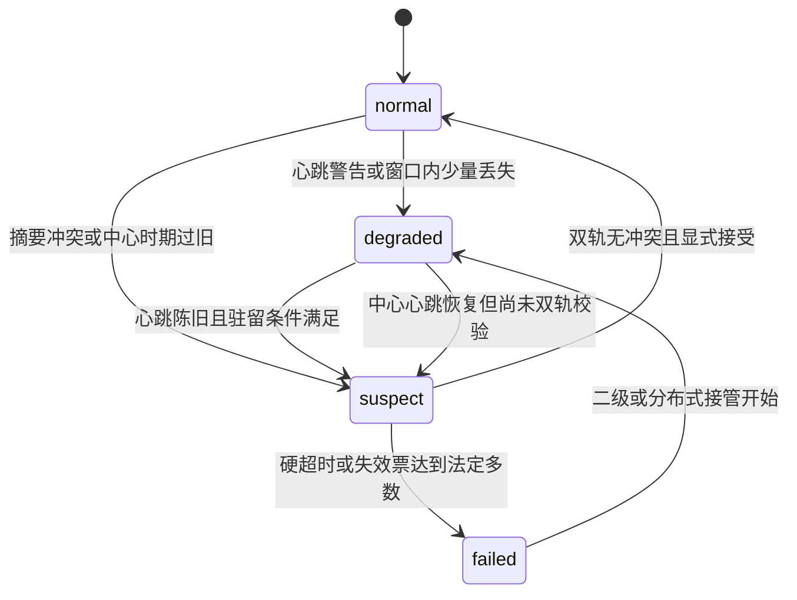
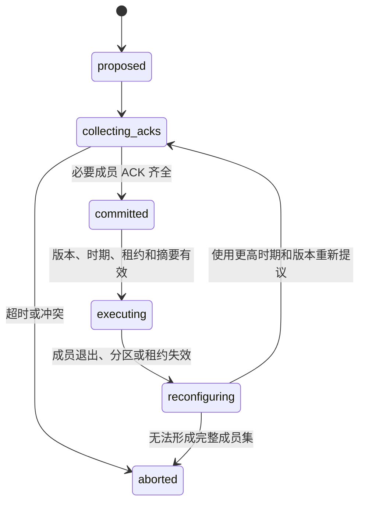

# D4 分布式协同与降级接管算法及实施方案

**模块**：D4 分布式协同与降级接管

**同步基线**：2026-07-20 D4 代码、模块说明、计划、GAP/review 与模块报告

**适用范围**：Python 科研仿真、AirSim 单次试验时钟接线和离线故障回放

**当前集成事实**：main-owned scalable 3D 质点模块栈已接入单一二级、多二级区域 owner 和中心/二级连续失效后的 distributed D3 plan，D7 按 owner/epoch/lease/commit/fault fence 门控。本轮定向集成测试 8/8 passed；该证据不是 AirSim、真实网络或实飞验证。新增区域资源学习能力只提供默认 disabled/shadow 的聚合建议，不能替代本文的确定性状态机与安全合同。

## 1. 文档目的与模块边界

D4 解决的不是单一“中心掉线后换一个节点”问题，而是以下三类协调状态之间的安全转换：

1. 中心节点仍有效，由 D3 维持中心化分配；
2. 中心节点失效，或中心计划在高动态条件下持续不适用，由机动高空侦察二级节点接管；
3. 中心和二级节点均不可用，拦截资源通过完全分布式协商维持最低任务连续性。

本文中的指挥与控制（Command and Control，C2）表示中心协调权威；`C2Health` 表示其健康状态。D4 同时处理：

- **被动降级**（passive failover）：节点被摧毁、心跳超时、摘要冲突或网络分区导致原协调者不可用；
- **主动降级**（active degradation）：中心仍在线，但传感器不确定性、目标身份歧义、计划时效或末端关联证据表明当前计划已不适用。

必须纠正旧口径：主动降级不只包含“请求中心重规划”。系统允许两条受控路径：

- 风险尚可由中心修复时，D4 请求中心重规划，由 D3 发布新版本计划；
- 风险持续、当前计划明显不适用，且机动高空侦察二级节点持续就绪时，D4 可提出转移到二级节点，随后由 main/D3 发布严格更新的二级计划并转移计划所有者。

D4 自身不创建完整 `AssignmentPlan`，也不在本地改写 `global_track_id`。主动转移必须通过 main/D3 的计划发布、所有者、版本、时期和租约合同，不能把 D4 的单次风险判断直接解释为执行授权。

模块边界如下：

- D4 读取 D1-D5 的摘要，不重复实现传感器滤波、数据关联、中心优化和像素几何；
- D4 输出协调动作、二级接管元数据、联盟提交状态和审计记录，不直接输出飞控命令；
- D7 仍独立检查计划、末端锁定和运动学条件；
- 当前网络是内存队列或 AirSim 单次试验时钟上的故障注入，不代表真实无线链路；
- 本模块不包含真实硬件、射频设备、视频编码器、火控、毁伤或自动处置逻辑。

## 2. 总体分层架构



默认优先级是：

```text
中心计划可用
  -> 继续中心
  -> 请求二级观测辅助
  -> 请求中心重规划
  -> 风险持续且二级持续就绪时，发布更新的二级计划
  -> 中心和二级均不可用时，进入完全分布式保底
  -> 证据、版本、租约或成员确认不完整时，闭锁或保持复核
```

主动转移和被动接管都可到达二级节点，但触发原因不同：前者是计划持续不适用，后者是中心不可用。两者进入同一套二级计划版本、来源、租约和 D7 门控，不允许维护两套互相矛盾的执行规则。

## 3. 机动高空侦察二级节点

### 3.1 当前场景角色

当前系统假设中的二级节点是**机动高空侦察无人机**，不是固定系留节点。它与拦截资源同步出动，但不执行拦截，承担两种职责：

1. **正常运行时的观测辅助**：利用高性能光电云台、雷达或 GlobalTrack 粗指向，在局部区域搜索目标，并向小范围拦截资源发送图像、检测结果、投影线索和覆盖摘要；
2. **降级时的区域协调**：在中心失效或当前中心计划持续不适用时，基于其覆盖区、通信链路、计算能力和最新态势发布候选重分配，由 main/D3 转换为版本化二级计划。

代码仍保留 `FIXED_TETHERED_SECONDARY` 等历史兼容枚举，以便读取旧回放，但新场景和实施说明以 `MOBILE_HIGH_RECON` 或 `MOBILE_SECONDARY_RECON` 为默认角色。兼容枚举不表示当前方案仍以固定系留节点为主。

二级节点通常设置：

- `coordinator_only=True`：只参与侦察和协调，不作为拦截执行资源出价；
- `coverage_cell`：限定可辅助或接管的区域；
- `heartbeat_timestamp_s` 和 `heartbeat_stale_after_s`：描述节点生命状态；
- `cue_freshness_s`：描述图像或线索新鲜度；
- `gimbal_pointing_ok`：表示云台是否正确指向目标区域；
- `secondary_coverage_ratio`：表示覆盖目标的比例；
- `secondary_network_joint_full_view_frame_rate`：表示二级网络同一帧联合覆盖完整目标集合的比例；
- `cross_view_association_count` 和 `stable_cross_view_registration_count`：表示 D5 已形成的跨视角支持；
- `lease_epoch` 和 `lease_expires_at_s`：表示接管权有效世代和到期时间。

### 3.2 正常运行时的图像和线索流

```text
D1/D2 GlobalTrack 粗位置
  -> main 生成雷达/航迹指向线索
  -> 机动高空侦察节点调整云台
  -> D5 处理二级图像和局部多目标轨迹
  -> D5 输出跨视角注册、覆盖率和歧义摘要
  -> D4 只消费摘要并评估二级节点就绪性
```

二级节点“看见目标”不等于“能接管”。检测框存在、云台指向正确或平均覆盖率较高，都不能替代时间同步、全局绑定、稳定跨视角注册、通信新鲜度、计划版本和租约检查。

## 4. 输入、内部状态与输出合同

### 4.1 上游输入

| 来源 | D4 输入 | 关键语义 |
|---|---|---|
| D1 多传感器融合 | `TrackUncertaintySummary` | 位置标准差、协方差迹、速度标准差、量测年龄和覆盖小区 |
| D2 多目标关联 | `AssociationRiskSummary` | 关联歧义、显式身份切换计数、重复航迹、连续率及真值指标可用性 |
| D3 分配规划 | `AssignmentValiditySummary` | `global_track_id`、资源、计划版本、是否当前、最近评估年龄、代价裕度和资源可行性 |
| D5 末端关联 | `TerminalAssociationSummary` | 当前绑定、末端证据适用性、锁定/歧义/保持/重捕获、友方冲突、重复锁定和跨视角证据 |
| main/runtime | `C2Health`、`ResourceSummary[]`、`CommunicationSummary[]` | 当前时间、心跳、链路新鲜度、二级节点能力、计划所有者、时期和租约 |

D4 只接受上游规范 `global_track_id`。D5 本地轨迹标识、AirSim actor 名称和离线真值标识都不能在 D4 内生成新的全局身份。

### 4.2 主要内部状态

- `C2Health`：中心健康状态；
- `ActiveDegradationDecision`：本次仲裁动作；
- `SecondaryNodeLifecycleSummary`：二级节点心跳、链路、覆盖和就绪性；
- `SecondaryTakeoverPlanMetadata`：二级计划待生效或已激活状态；
- `CenterReplanStatus`：中心重规划请求生命周期；
- `CoalitionMemberAck`：联盟成员确认应答；
- `CoalitionCommitState`：联盟从提议到执行或中止的状态；
- `CBBAResult`：完全分布式一对一保底结果；
- `MergeResult`：中心恢复后的双轨校验结果。

### 4.3 下游输出

| 输出 | 消费者 | 用途 |
|---|---|---|
| `ActiveDegradationDecision` | main、D6 | 继续中心、重规划、二级辅助、二级转移、分布式或保持复核 |
| `D4DecisionRecord` | main、D6 | 保存触发证据、动作、时延、所有者、版本、租约和拒绝原因 |
| `SecondaryTakeoverPlanMetadata` | main、D3、D7 | 描述二级计划待生效/已激活，不代替系统计划 |
| `D7SecondaryHandoff` | D7 | 二级交接两阶段门控和视觉比例导航制导许可前置条件 |
| `CBBAResult` | main、D6 | 分布式保底分配、共识轮数、冲突和消息开销 |
| `CoalitionCommitState` | main、D5、D7、D6 | 多资源联盟是否已经原子提交并可执行 |
| `HealthTransition[]`、`MergeResult` | main、D6 | 健康迁移、恢复审计和防双主评价 |

## 5. `C2Health` 中心健康状态机

### 5.1 状态定义

| 状态 | 中文含义 | 判定依据 |
|---|---|---|
| `normal` | 正常 | 心跳、计划摘要校验值和中心时期可信 |
| `degraded` | 降质 | 心跳抖动或已有降级协调者维持连续性 |
| `suspect` | 可疑 | 心跳陈旧、摘要冲突、中心时期倒退或恢复待校验 |
| `failed` | 失效 | 心跳硬超时或对等节点失效票达到法定多数 |

### 5.2 状态迁移



`FailoverCoordinator.update_health()` 使用心跳滑动窗口、丢失阈值和状态驻留时间，避免单个迟到消息把中心直接判为失效。对等节点法定多数（quorum）可在明确分区或中心损坏时加速失效判定。

恢复路径刻意不对称：心跳恢复只证明中心重新发送消息，不能证明其计划是最新版本。因此 `observe_center()` 将恢复中的中心置为 `suspect`，只有双轨校验通过后才能回到 `normal`。

## 6. D1-D5 风险融合与主动降级

### 6.1 D1 航迹不确定性

D1 以带协方差的全局航迹作为依据。位置风险可用位置协方差子矩阵表示：

\[
\sigma_p=\sqrt{\frac{\mathrm{tr}(P_{pos})}{3}}.
\]

当前轻量规则以位置标准差约 20 米作为中风险分档、50 米作为高风险分档，并结合协方差迹和量测年龄。门限是仿真基线，需要依据传感器配置和真实回放重新标定，不能直接作为硬件指标。

### 6.2 D2 关联风险

D4 读取：

- 关联歧义分数；
- 显式身份切换（Identity Switch，IDSW）计数；
- 显式重复航迹事件；
- 航迹连续率；
- `truth_metrics_available` 和 `continuity_available` 可用性标志。

在线真值隔离时，缺失真值产生的零值或占位值不能成为硬风险。连续重复风险评分只作软证据；只有显式重复计数、事件或增量才构成硬阻断。

### 6.3 D3 计划有效性

D4 不用计划创建时间简单判断陈旧，而优先读取最近评估时间。主要硬风险包括：

- 计划不是当前版本；
- 计划超过允许年龄；
- 资源已不可行；
- 当前资源、目标或联盟版本不匹配。

代价裕度过低只表示计划容易抖动，是软证据，不能单独触发所有权转移。

### 6.4 D5 末端证据

D4 首先检查 `terminal_evidence_applicable`。尚未进入末端视觉适用窗口时，低置信度、高歧义和普通重捕获不会逐帧触发降级；友方冲突、重复锁定、资源错配和明确全局航迹错配仍是硬风险。

进入末端窗口后，D4区分：

- **绑定安全性**：资源、规范全局航迹、计划版本和联盟版本是否一致；
- **视觉准备度**：D5 是否已经锁定、置信度是否足够、是否需要重捕获。

`terminal_consistent=true` 只表示当前计划绑定未被硬证据推翻，不表示 D5 已锁定，也不授权 D7 切换视觉导引。

### 6.5 主动降级动作选择

| 条件 | 动作 | 所有者变化 |
|---|---|---|
| 风险低、绑定一致 | `continue_center` | 无 |
| 软风险暂时升高 | 继续中心或 `request_secondary_assist` | 无 |
| 计划陈旧、非当前或资源不可行 | `request_center_replan` | 等待 D3 新计划 |
| D5 持续硬失配但中心仍能及时修复 | `request_center_replan` | 等待 D3 新计划 |
| 风险持续、原计划明显不适用、中心重规划不足以及二级持续就绪 | `degrade_to_secondary` 候选 | main/D3 发布新版本后才转移 |
| 友方冲突、身份冲突或联盟合同不完整 | `hold_for_review` | 不转移 |

主动转移采用递进策略：

1. 记录 D1-D5 风险并经过风险窗口和驻留时间，过滤单帧噪声；
2. 能由中心滚动重规划修复时，先发出 `request_center_replan`；
3. 中心计划在高动态条件下持续不适用，且二级节点达到持续 `takeover_ready` 时，允许提出二级转移；
4. D4 只形成二级接管候选和待生效元数据；
5. main/D3 生成严格更新的计划标识和版本，把计划来源设为选中的二级节点；
6. 新计划通过来源、版本、时期和租约校验后，计划所有者才变为 `secondary_node`。

当前通用 `ActiveDegradationArbiter` 主要实现继续中心、二级辅助、中心重规划和失效后的分层回退；系统级 AirSim 运行时已经接入主动 `degrade_to_secondary` 的两阶段场景。实施时应保持这一所有权边界：D4 做风险和转移仲裁，main/D3 做计划发布，不能让本地资源自行更换所有者。

### 6.6 迟滞和中心重规划生命周期

主动仲裁按资源/航迹对保存独立状态，避免一个目标的风险污染另一个目标。主要防抖机制包括：

- `risk_window_size` 和 `risk_window_threshold`：风险窗口内满足足够样本才触发；
- `min_dwell_s`：动作最短驻留时间；
- `release_consecutive_consistent_frames`：恢复中心前需要的连续低风险帧；
- `non_locked_frame_limit` 和 `mismatch_frame_limit`：区分普通失锁与持续错配；
- `center_replan_cooldown_s`：中心重规划请求默认 2 秒冷却。

`CenterReplanStatus` 包含 `pending`、`applied`、`acknowledged_no_change` 和 `expired`。硬安全风险可绕过冷却；非硬风险在冷却期内不重复发送请求。

## 7. 二级节点就绪性与接管计划

### 7.1 四级就绪性

二级节点能力不是二值状态，而是四级状态：

| 等级 | 含义 | 可否接管 |
|---|---|---|
| `not_ready` | 心跳、链路、云台、覆盖、租约或证据不足 | 否 |
| `visible_only` | 能检测目标，但尚未完成稳定全局注册 | 否 |
| `registration_usable` | 已有跨视角注册，但完整覆盖或综合能力不足 | 否，只可辅助 |
| `takeover_ready` | 覆盖、网络全视野、注册、新鲜度、通信和综合评分均满足 | 可作为候选 |

综合评分可抽象为：

\[
Q_s=w_c c+w_n n+w_r r+w_f f+w_g g+w_l l,
\]

其中 (c) 为覆盖率，(n) 为二级网络同帧全覆盖率，(r) 为跨视角注册质量，(f) 为线索新鲜度，(g) 为云台指向状态，(l) 为链路和租约状态。当前代码的接管基线包括：综合评分不低于 0.70、覆盖率不低于 0.65、网络同帧全覆盖率不低于 0.80。

这些门限必须与场景配置一起记录。它们不是通用工程标准，也不能为了形成接管正例而降低身份、版本或租约安全门限。

### 7.2 持续就绪

单帧 `takeover_ready` 不足以接管。适配器默认要求：

- 至少 3 个不同时间戳的连续就绪决策；
- 持续时间至少 0.2 秒；
- 相邻证据时间间隔不超过 1.0 秒。

计数按二级节点、目标和覆盖小区隔离；同一时刻多次调用不增加连续计数。心跳、链路、云台、覆盖、注册或租约回落都会使持续就绪失效。

### 7.3 所有者、版本、时期和租约

二级计划是否可执行可写为：

\[
E_{sec}=I_{active}I_{source}I_{ready}I_{epoch}I_{lease}I_{version}.
\]

其中：

- (I_{active})：main/D3 已明确回填二级计划激活；
- (I_{source})：计划来源等于 D4 选中的二级节点；
- (I_{ready})：二级节点持续就绪；
- (I_{epoch})：租约时期不低于要求时期；
- (I_{lease})：expiry 与当前时间都存在，且严格满足 `current_time < lease_expiry`；
- (I_{version})：新计划版本严格高于被替代计划，或确认为同一已激活二级计划。

`SecondaryTakeoverPlanMetadata` 有三种状态：

1. `not_applicable`：本次不是二级转移；
2. `pending_secondary_plan`：D4 已选择二级来源，但当前所有者仍保持原值；
3. `secondary_plan_active`：main/D3 已发布正确来源和更新版本，租约有效且持续就绪，所有者变为二级节点。

缺 expiry、缺当前时间、`current_time == lease_expiry`、过期、旧时期、来源不匹配或就绪性回落都会使计划保持待生效或不可执行。该规则同时用于 resource candidate、plan 发布、已激活 owner 维持和 D7 handoff，不能由同 plan id/version 绕过。

### 7.4 两阶段 D7 交接

```text
阶段 1：D4 提出 degrade_to_secondary
  -> 当前计划仍有效或进入保持
  -> secondary_reassignment_complete=false
  -> visual_png_allowed=false

阶段 2：main/D3 回填新的二级计划
  -> owner/source/version/epoch/lease 全部通过
  -> secondary_reassignment_complete=true
  -> D7 仍需检查 D5 锁定和自身运动学门控
```

D4 的阶段 2 不是视觉比例导航制导（Proportional Navigation Guidance，PNG）的充分条件，只是 D7 的必要前置合同之一。

## 8. 被动降级实施流程

被动降级用于中心结构性失效：

```text
C2Health normal/degraded/suspect
  -> 心跳硬超时、摘要长期冲突或 peer 法定多数判定失败
  -> C2Health failed
  -> 选择覆盖当前区域且持续就绪的机动高空侦察二级节点
  -> 发布二级计划候选
  -> main/D3 回填 owner/version/epoch/lease
  -> 二级计划激活
  -> 二级失效或不可用时进入完全分布式协商
```

如果二级节点只是可见、注册可用但未达到接管门限，系统不能把它解释为可执行协调者。中心已失效且无持续就绪二级节点时，D4 进入 `degrade_to_distributed` 或安全保持，而不是降低门限。

## 9. 完全分布式 CBBA 保底

### 9.1 算法角色

中心和二级节点都不可用时，D4 使用本地轻量基于共识的捆绑算法（Consensus-Based Bundle Algorithm，CBBA）作为一对一任务连续性基线。它不是麻省理工学院外部 CBBA 工程，也不是通信感知 CBBA 的生产实现。

对任务 (j) 和资源 (i)，基础出价为：

\[
s_{ij}=2.0q_j+1.4a_i+0.5c_i+1.2m_{ij}+b_{source}-0.8p_{age}+\Delta s_{D5},
\]

其中 (q_j) 是航迹置信等级，(a_i) 是资源可用性，(c_i) 是通信等级，(m_{ij}) 是能力匹配，(b_{source}) 是多源观测增益，(p_{age}) 是航迹年龄惩罚，(Delta s_{D5}) 是分布式视觉证据修正。

### 9.2 共识过程

1. 每个资源根据本地任务摘要建立 bundle；
2. 节点广播任务获胜者、出价、时期和约束摘要；
3. 收到更高出价或更新时期后，节点更新 winner view；
4. 节点失去 bundle 中某任务后释放该任务及其后续任务；
5. 所有节点 winner view 一致或达到最大轮数后结束。

确定性消歧按出价、时期、资源标识和约束摘要排序，避免相同输入产生随机所有者。

全连接 (N) 个资源、(T) 个任务的单轮通信复杂度约为：

\[
O(N^2T).
\]

稀疏网络可降低单轮消息量，但会增加传播轮数。`converged=false` 时不能把空结果或局部 winner view 当作有效计划。

### 9.3 D5 分布式视觉证据

D5 多相机证据只作为风险或出价修正：

- 多个资源支持同一个上游 `global_track_id`，可增加相应资源的支持分；
- `hypothesis_only` 只产生弱正向证据；
- 友方冲突、缺失或陈旧全局标识、身份冲突会阻断执行；
- 重复末端锁定进入审计并强惩罚；
- D4 不根据局部视觉生成新全局标识。

### 9.4 能力边界

当前轻量 CBBA 默认是单获胜者、一任务一资源保底。对于一个高威胁目标需要多个资源的情况，CBBA 可选择协调者或候选成员，但不能冒充完整联盟形成算法。多成员执行必须经过独立原子提交合同。

## 10. 多资源联盟与原子 ACK

### 10.1 数据合同

`CoalitionMemberAck`（联盟成员确认应答）至少绑定：

- 目标 `global_track_id`；
- 联盟标识和联盟版本；
- 计划标识和计划版本；
- 成员资源标识；
- 时期；
- 租约到期时间；
- 能力证据时间和摘要校验值。

`CoalitionCommitState` 状态机为：



原子提交条件可表示为：

\[
C=I_{members}I_{plan}I_{coalition}I_{epoch}I_{lease}I_{digest}I_{network}.
\]

任一项为零都必须失效时闭锁（fail closed）。缺一个主成员确认、旧计划版本、旧联盟版本、过期租约、摘要冲突或网络分区都不能形成部分执行。

### 10.2 独立执行与联盟执行

多个独立主资源不要求在同一时刻到达，但每个资源仍需满足自己的计划和 D5/D7 门控。需要共享联盟状态的多成员任务则必须先原子提交；备用成员未被新版本计划激活前保持待命，不能自行补位。

现有 `member_loss_replacement`/成员补位 replay 由测试预先给定替换成员，再验证更高 epoch/version 和全员重新 ACK。它不是在线 reserve 发现、选择、激活或自主补位状态机；这些能力继续保持 P1 未实现。

### 10.3 二级和完全分布式联盟

- 二级节点可作为联盟协调者，但必须是持续就绪且持有有效计划租约；
- 二级节点失效后，完全分布式 peer 协调者必须使用更高时期、计划版本和联盟版本重新提议；
- 分区恢复后全部必要成员重新确认，旧 ACK 不可复用；
- D5 只认可当前 committed/executing 联盟中的成员锁定；
- D7 只执行当前 committed/executing 联盟及当前计划。

### 10.4 区域 authority 与受约束候选形成

设区域集合为 \(R\)，每个区域 \(r\) 在任一时刻最多有一个可执行 authority：

\[
\sum_{o \in O} I[owner(r)=o \land active(r)] \le 1.
\]

中心 health 不为 `failed` 时，\(owner(r)=center\)。主动证据可以请求侦察辅助或中心重规划，但不改变该等式中的 owner；若中心计划包含 \(k>1\) 任务，中心 owner 也只有在 required-member ACK 完整后才 active。中心失效后，二级候选必须同时满足 region coverage、strict readiness、`lease_epoch >= authority_epoch` 和未过期租约；候选按 priority、coverage、lease epoch 和 node id 确定性排序。owner/layer 改变要求：

\[
epoch_{new}>epoch_{old}\quad\land\quad planVersion_{new}>planVersion_{old}.
\]

二级不可用时，对每个区域任务按 member availability、communication、operator hold、跨区域 capacity、required capability 和 D5 member evidence 进行 bounded bid selection。一个成员可覆盖多项 required capability；按 region id 的确定性顺序记账，已在前一区域达到 capacity 的成员不会在后一区域重复获权。该步骤只产生候选成员集合；若 \(k>1\)，可执行性仍由第 10.1 节的完整 ACK 原子条件决定。区域 authority/commit lease 取 authority、D3 task 和二级 lease 的最早到期值。候选不足、能力并集不满足、D2 已观察到身份切换/重复航迹、D5 一致性未确认、D5 member hold、分区或旧 generation 都输出 `hold_for_review`。该 bounded selection 没有多轮网络共识和耦合时序最优性保证，不能称为完整 CCBBA。

### 10.5 全局区域资源建议与学习研究管线

`d4-region-resource-snapshot-v1` 把每个区域编码为聚合节点：目标需求/高威胁积压、D1/D2 不确定性、D5 可见/一致性、可用/备用/已提交资源、二级 coverage/readiness、通信容量/时延/丢包、当前 owner layer/node、plan version、epoch、lease、ACK 与 fault fence。边编码 transferable resource capacity、距离、转移时间、带宽、通信/机动可用性和 partition。数据合同不包含 actor truth ID、target ID、`global_track_id` 或具体 resource-target pair。

规则或学习策略只能输出：逐区域 quota delta、备用比例、侦察优先级、hold/replan，以及相邻区域 transfer。`DeterministicResourceProjector` 不信任策略给出的 quota delta，而是从接受的 transfer 重建：

\[
\Delta q_r=\sum_u x_{ur}-\sum_v x_{rv},\qquad
\sum_r\Delta q_r=0.
\]

只有可通信、可机动、未 partition 的邻边可接受 transfer；源区域转出预算为可用资源减去 formal commit 成员和最低备用。snapshot/action 的 owner、plan、epoch、lease 必须与 formal D4 verdict 一致；过期 lease、缺 ACK、fault fence、formal fail-closed 或 commit 不完整都使相关区域保持 hold。该投影独立于模型置信度，学习策略不能关闭或改变它。

投影后使用 `d4-region-resource-advisory-v1` 冻结消费合同。合同的 `advisory_id` 为除自身 ID 外全部字段的 SHA256 内容地址；相同内容得到相同幂等键，字段被改动时 `from_dict()` 拒绝 ID 不匹配。有效区间为

\[
[t_c,\;\min(t_c+\Delta_{adv},\min_r t^{lease}_r)),
\]

其中 `t_c` 是 episode-clock 创建时间，默认 \(\Delta_{adv}=1.0\) s，可由 `RegionResourceProjectionConfig.advisory_ttl_s` 配置。顶层记录 scenario/snapshot/authority、source plan versions、policy/model/projector identity 与总资源守恒量；逐区域记录 source snapshot/version、owner/layer、plan id/version、epoch/lease、ACK/fault、资源前后量与 protected reserve/committed；逐 transfer 记录两端完整 source version、edge 端点、capacity、time、bandwidth 和 availability/partition。输出不复制 formal verdict 中的 target、truth、actor、object 或 member identity。

`validate_for_consumption()` 在下一轮 planning boundary 对 current snapshot 和可选 current formal verdict 重验。旧 snapshot/plan/epoch、严格 lease 到期、非 projected、ACK 不完整、fault fence、formal commit 数变化、总量或逐区 transfer delta 不守恒、reserve/committed 保护失败，以及未知、非邻接、不可用、partition 或超 capacity edge 均为拒绝。`RegionResourceAdvisoryGate` 在首次成功后记录 `advisory_id`，同一进程内再次消费返回 `advisory_already_consumed`；跨进程 ledger 由 main 持久化。`consumable=true` 仅允许 main 将区域聚合建议作为下一轮 D3 输入，D4 不创建或修改 `AssignmentPlan`。

`SharedRegionGraphActorCritic` 对任意节点数使用同一 node encoder、edge encoder、message network、node/edge actor 和 pooled value/confidence head，不写死 8 区或 200 架资源。行为克隆以规则投影建议为 teacher，连续动作使用均方误差，hold/replan 使用二元交叉熵。原生 clipped PPO 对每个变长图计算联合高斯 log probability：

\[
L_{policy}=-\mathbb E\left[\min(\rho_t A_t,\operatorname{clip}(\rho_t,1-\epsilon,1+\epsilon)A_t)\right].
\]

critic 使用 return 的平方误差并加 entropy regularization。reward 是高威胁积压、跨区转移耗时、通信负载、备用不足、分配冲突、降级失败和计划抖动的负加权和。

离线数据使用 `d4-region-learning-dataset-v1`。`RegionLearningEpisodeSource` 固化 scenario/version/scale、数值 seed、episode ID、Git commit/dirty 与 config SHA256；每个 `RegionLearningFrame` 固化 snapshot、`rule|formal` target 或显式 unavailable、reward 或显式 unavailable，以及可选 recommendation。target 必须是覆盖全部区域的安全投影建议；snapshot/target/recommendation identity 必须一致。递归 key 检查拒绝 target/actor/global-track/evaluator/offline truth identity，在线特征仍只有区域聚合量。

`stage_region_learning_episode()` 接受完整 frame iterable，按 frame index 规范化后写 canonical JSONL header/frame/footer；frame index 必须从 0 连续、时间单调、snapshot ID 唯一，只有完整 footer 的 episode 才进入 finalizer。`finalize_region_learning_dataset()` 以 episode 为最小单元，并先按数值 seed 哈希排序再确定性计数分桶；同数值 seed 下所有 scenario/scale 和多个 episode 均进入同一 split，train/validation/test seed 两两零交集。唯一 seed 少于 3，或 validation+test 的实际 unseen seed 少于调用方声明值，均失败关闭。manifest 固化 feature/target/reward semantics、全部 source identity、dirty/target/reward/recommendation availability、seed split/SHA、逐 episode SHA 和 dataset SHA。

`load_region_behavior_cloning_samples()` 要求所选 split 每帧 target available；`load_region_ppo_training_episodes()` 还要求 reward available，并保留完整 episode，不以 0 代替缺值，也不伪造 old log probability、value、advantage 或 return。两者默认拒绝 dirty source。模型 bundle 升为 `d4-region-resource-model-bundle-v2`；基础文件仍为 `manifest.json + state_dict.pt`，绑定正式 dataset 时额外嵌入 `training_dataset_manifest.json`，并校验 dataset SHA、split SHA、嵌入 manifest SHA、train groups 和 state_dict SHA。推理超时、低置信、OOD、非有限输出或 bundle 不匹配统一回退 `RuleRegionResourcePolicy`。规则 fallback 和学习候选共用 advisor 内同一个 `DeterministicResourceProjector` 对象，学习实现只有 `recommend_raw()`，不能直接发布消费合同。API 默认 `disabled`，CLI 默认 `shadow`。paired evaluator 按数值 seed 判断 seen/unseen，报告 backlog、transfer time、plan churn、communication load、fail-closed、安全违规和 candidate latency P50/P95；少于 20 个未见 seed，或安全/backlog/fail-closed 回归时，不推荐 assist。assist 也只表示建议可见，不授予 D4/D3/D7 执行权。

正式训练入口先调用 `audit_region_learning_dataset()`。加载器验证 manifest 内容哈希和逐 episode 文件哈希，审计器再核对 source/schema/episode identity、数值 seed 和 `(scenario, version, scale, seed)` 原子性、三份 split 零交集及外部保留 seed。`train_region_behavior_cloning()` 使用固定随机种子和确定性 PyTorch 算法，以完整变长图样本做小批量更新；验证损失选择最佳 epoch。训练后逐 split 比较 quota、reserve、reconnaissance、hold、request-replan 和 transfer，报告二分类混淆、确定性投影拒绝、资源守恒、通信邻接、owner/plan/version/epoch/lease 一致性，以及按规模分组的推理延时。

正式 900 episode/1798 frame 数据按 70/15/15 个数值 seed 分为 1258/270/270 帧，seed 1000-1019 未进入数据。固定 seed `20260720` 训练 66 epoch，最佳 epoch 54，内部测试 loss `0.071545`；2026-07-21 准入复跑的 CPU 端到端推理 P95 为 `0.7774 ms`，权重 SHA256 仍为 `3da0360be8788f3ffeb8e9f9eba3e0d5369ec0bdf9e05729dfb1db07d71d5f62`。训练、验证、测试中的配额/转移零误差不具备策略判别力，因为 14384 个 target action 的 nonzero quota、transfer、hold、request-replan 均为 0；只有 reserve ratio 和 reconnaissance priority 存在标签变化。D6 进一步确认 898/1798 帧只有无归因相邻状态转移，reward/causal/counterfactual 可用数均为 0。训练器不把这些状态变化转换成 reward。

模型 manifest 新增开发准入字段。当前 bundle 固定 `development/shadow`，并记录缺 reward、缺最终 holdout、动作正样本缺失、置信度未校准和因果归因不可用。advisor 在运行时读取 `maximum_advisor_mode`，开发包不能因调用方传入 `unseen_seed_count=20` 而升级 assist。权重放在 ignored `outputs/`；`publish_region_behavior_cloning_results()` 只向普通 Git 范围发布审计、配置、命令、指标、权重 SHA256 和本地相对定位，不复制 `.pt`。

### 10.6 跨模块共享 seed 切分

D4 原正式 dataset 的 70/15/15 切分属于模块内历史合同。D3、D4、D5 联合训练要求同一数值 seed 在三个模块中处于同一 split，因此使用 main 发布的 `scalable3d-shared-seed-split-registry-v1` 作为 source-external 注册表。D4 不调用 main 的 Python 实现，而在 `canonical_seed_split.py` 内独立验证并复现公开 schema。这样可发现两个实现同时发生同类错误的情况，也避免训练代码依赖 main runtime。

共享注册表要求 schema、policy、D3 兼容排序版本、split seed、20% 验证比例、20% 测试比例、最少 20 个测试 seed 和 consumer contract 全部匹配。对 assignment 列表先计算

\[
h_a=\operatorname{SHA256}(\operatorname{canonicalJSON}(assignments)),
\]

再对除 `content_sha256` 外的完整 registry 计算内容哈希。源 `training_seed_registry.json` 的文件 SHA256 必须与 registry 中的 source binding 相等，Git commit、dirty 状态和 schedule SHA 也必须一致。dataset 的全部数值 seed 集合必须与源 training seed 集合完全相等；漏 seed、多 seed、重复 assignment 或保留 seed 1000-1019 混入均失败关闭。随后独立复现 `d3_numeric_seed_atomic_split_v2` 的哈希排序，防止攻击者同时重算 assignment/content 哈希后改变分桶策略。

通过校验后只构造冻结内存视图。每条记录保留 source episode、原 split 和原 manifest，同时增加 canonical split；原 manifest 和 episode JSONL 不写入。视图绑定原 dataset SHA、原 split SHA、manifest 文件 SHA、源 seed registry SHA、共享 registry 文件/内容 SHA 和 assignment SHA。`load_region_behavior_cloning_samples()` 只有显式收到 `canonical_split_view` 时从该视图选取样本；缺省仍读取原 D4 split。

2026-07-21 对正式 900 episode 做只读审计。共享视图为 60/20/20 seed，对应 540/180/180 episode 和 1079/359/360 frame；同一数值 seed 原子，保留 seed 出现数为 0。源数据目录树审计前后 SHA256 均为 `8cde5cace4bd8106e35801f6179775ae39298592f3b556f712ea857b9c496bc1`。该结果只证明数据治理一致性。reward 仍全部 unavailable，动作多样性仍不足，PPO、assist、authority、lease、epoch 和确定性安全投影没有变化。

## 11. 中心恢复与双轨校验

中心恢复后同时存在两条状态轨迹：

- 中心恢复前最后掌握的计划和航迹摘要；
- 降级期间形成的二级或分布式计划、联盟提交和执行状态。

`merge_recovery()` 当前比较任务所有者、时期和基础分配状态：

- 完全一致进入 `accepted`；
- 只在单侧存在或需要人工判断进入 `review`；
- 重复所有者、时期倒退或版本冲突进入 `conflicts`。

只有 `review` 和 `conflicts` 均为空，并且 `human_accept=true` 时才恢复中心权威。恢复心跳不能立即夺权。

当前恢复合并仍是基础版。完整工程恢复还应比较：

- 航迹摘要和协方差摘要校验值；
- D3 计划及联盟摘要校验值；
- D5 当前锁定和身份冲突；
- D7 当前控制许可和执行前缀；
- 通信链路状态、成员退出和租约历史。

## 12. 与 D7 导引门控的关系

D4 只决定协调权和计划状态，不决定比例导引或视觉导引公式。D7 放行至少需要：

1. D3 当前计划和资源绑定有效；
2. D4 当前所有者、模式、时期、版本和租约一致；
3. 多成员任务已经完成必要 ACK 和原子提交；
4. D5 锁定的 `assigned_global_track_id` 与计划一致；
5. 没有友方冲突、重复锁定和身份冲突；
6. D7 的相机识别能力、闭合速度、机动能力和导引切换条件满足。

以下情况 D7 必须阻断视觉 PNG：

- 二级计划仍为 `pending_secondary_plan`；
- 所有者、来源或版本不匹配；
- 租约过期或时期落后；
- 二级节点只达到 `visible_only` 或 `registration_usable`；
- 联盟缺 ACK、处于 `reconfiguring` 或 `aborted`；
- D5 为歧义、保持、重捕获或友方冲突；
- 当前计划已被替代但执行资源仍持有旧计划。

## 13. 代码实施映射

| 文件 | 实施职责 |
|---|---|
| `models.py` | 航迹、资源、通信、健康、分配和结果数据结构 |
| `active_degradation.py` | D1-D5 风险规则、二级能力评分、动作仲裁、二级计划和 D7 交接合同 |
| `adapter.py` | 上游字段归一化、按绑定隔离迟滞、持续就绪、中心重规划和 D6 事件输出 |
| `coordinator.py` | 中心健康、协调者选择、被动接管和基础恢复合并 |
| `cbba.py` | 轻量 CBBA、D5 视觉风险修正和中心代价差距辅助计算 |
| `coalition_safety.py` | 多成员计划、联盟版本、ACK、时期、租约和摘要安全门控 |
| `regional_failover.py` | scalable3d 场景元数据适配、逐区域唯一 authority、机动高空二级覆盖接管、主动证据和受约束原子 fallback |
| `region_resource.py` | truth-free 区域资源快照、动作、规则基线、安全投影、版本化限时 advisory、一次性消费门、reward、scenario/seed 划分和 paired evaluator |
| `region_resource_learning.py` | 共享区域图 actor-critic、BC、原生 clipped PPO、manifest/state_dict/SHA、OOD 与 advisor 回退 |
| `region_resource_cli.py`、`scripts/run_region_resource_advisor.py` | 默认 shadow 的建议和 paired evaluator CLI |
| `network.py` | 内存丢包和延迟模型、消息数量和估计字节统计 |
| `episode_communication.py` | AirSim 单次试验时钟驱动的中心、二级、peer 顺序接管接口 |
| `communication_fault_replay.py` | 多随机种子通信故障矩阵 |
| `p1_failover_replay.py` | 确定性接管扰动回放 |
| `p2_coalition_replay.py` | 隔离式联盟算法对照和外部能力探测 |

main/runtime 负责：

- AirSim 启动、重置和单次试验时钟；
- 把 D1-D5 摘要送入 D4；
- 把主动或被动二级转移请求交给 D3；
- 回填新的计划标识、版本、所有者、时期和租约；
- 把 D4 状态送给 D5、D7 和 D6；
- 注入中心失效、二级失效、延迟、丢包和网络分区。

## 14. 关键参数与调参原则

| 参数 | 当前用途 | 调参原则 |
|---|---|---|
| `heartbeat_warning_s` | 进入降质观察 | 应大于正常心跳抖动 |
| `heartbeat_stale_s` | 进入可疑状态 | 应结合消息周期和排队延迟 |
| `heartbeat_failure_s` | 硬失效判定 | 必须大于正常抖动和短时丢包上界 |
| `heartbeat_window_size` | 心跳滑动窗口 | 太小易误降级，太大增加接管延迟 |
| `position_sigma_medium_m/high_m` | D1 风险分档 | 按雷达和融合真实误差标定 |
| `max_plan_age_s` | D3 计划陈旧门限 | 按目标动态和分配周期标定 |
| `non_locked_frame_limit` | D5 持续失锁门限 | 不可替代 D5 自身锁定门限 |
| `risk_window_size/threshold` | 主动降级持续风险 | 用同随机种子正常/异常配对校准 |
| `center_replan_cooldown_s` | 防止重规划抖动 | 默认 2 秒，硬风险可绕过 |
| `takeover_ready_required_decisions` | 二级持续就绪帧数 | 默认 3 个不同时间戳 |
| `takeover_ready_required_duration_s` | 二级持续时间 | 默认 0.2 秒 |
| `lease_epoch/lease_expires_at_s` | 防止旧协调者复活 | 接管和重构必须单调更新 |
| `bundle_limit/max_rounds` | CBBA 束长和轮数 | 网络越差，轮数预算越高 |
| `packet_loss/min_delay/max_delay` | 内存网络实验 | 只作敏感性分析，不冒充真实链路 |

调参顺序应为：先固定身份、版本、租约和 ACK 安全门限，再标定风险窗口、覆盖和持续时间；不得为了提高接管率降低 `global_track_id`、友方冲突、旧版本或过期租约门控。

## 15. 典型实施流程

### 15.1 正常中心流程

1. D1 输出带协方差和双时间戳的 GlobalTrack；
2. D2 稳定全局身份并输出关联风险；
3. D3 发布中心计划；
4. 机动高空侦察节点根据雷达/GlobalTrack 线索调整云台并提供图像或摘要；
5. D5 形成末端关联和跨视角证据；
6. D4 风险低时输出 `continue_center`；
7. D7 独立执行导引门控。

### 15.2 主动降级到中心重规划

1. 中心仍健康；
2. D3 计划陈旧或资源不可行，或 D5 形成明确持续失配；
3. D4 输出 `request_center_replan`；
4. D3 使用当前 GlobalTrack 和资源状态发布更高版本计划；
5. D4 验证新版本和风险消退；
6. D5/D7 只消费新计划，不沿用旧绑定。

### 15.3 主动降级到二级节点

1. 中心仍在线，但高动态条件下计划持续不适用；
2. 风险窗口、驻留和重规划生命周期确认问题不是单帧噪声；
3. 机动高空侦察二级节点持续达到 `takeover_ready`；
4. D4 输出二级转移候选，状态为 `pending_secondary_plan`；
5. main/D3 以选中二级节点为来源发布更高版本和有效租约；
6. D4 校验来源、版本、时期、租约和持续就绪，状态变为 `secondary_plan_active`；
7. D5 根据新计划重新确认目标；
8. D7 在全部门控通过后才切换导引。

### 15.4 被动中心失效

1. 心跳窗口、硬超时或法定多数把中心判为 `failed`；
2. D4 优先选择覆盖区内持续就绪的二级节点；
3. 二级计划经过同一 owner/version/epoch/lease 流程激活；
4. 二级不可用时，资源节点交换摘要并运行轻量 CBBA；
5. 多成员任务必须完成原子 ACK；
6. 中心恢复后进入双轨校验，不立即夺权。

### 15.5 中心和二级均失效

1. D4 明确进入 `degrade_to_distributed`；
2. peer 使用当前时期的压缩航迹和资源摘要构造出价；
3. CBBA 形成一对一任务所有者；
4. 多资源任务使用更高计划/联盟版本发起 ACK；
5. ACK 完整且租约有效时原子提交；
6. 缺 ACK、分区、旧时期或摘要冲突时保持闭锁；
7. 成员变化必须进入 `reconfiguring` 并全量重新确认。

## 16. 当前验证结果

### 16.1 D4 模块与规范回放

截至当前同步基线，D4 验证记录包括：

- 2026-07-21 D4 全量模块回归为 **369/369 项通过**，验收阈值为零失败；区域建议/学习/消费与准入当前 51 项，episode dataset、正式审计和训练回归当前 15 项，历史阶段计数保持不变；
- `SecondaryReadinessEvidence` 统一要求 current time、lease epoch/expiry、fresh heartbeat/cue/communication、gimbal、coverage、network full-view 和 sustained readiness；coordinator、episode adapter 与 coalition proposal 任一缺字段均拒绝 secondary owner；
- `build_d7_secondary_handoff()` 与 `build_secondary_takeover_plan_metadata()` 对 active secondary plan 要求 readiness exact-true、expected/actual source 均存在且匹配、plan/required lease epoch 均存在且有效、`current_time < expiry`；逐字段缺失给出稳定 reject reason，同 id/version 维持路径不豁免；
- distributed interceptor/peer 路径不消费上述二级视觉 readiness，原 ACK/lease/epoch/commit 合同保持；
- D6 coalition metadata 缺 current time 时不再推断 lease valid 或 atomic coalition formed；
- 七个规范单次试验时间轴场景 **7/7 通过**，覆盖正常中心、中心失效后二级接管、二级再次失效后 peer 接管、缺 ACK、旧时期、过期租约和网络分区；
- 逻辑时钟步为 0.25 秒时，中心故障到二级可执行所有者为 **1.25 秒**，二级故障到 peer 原子执行为 **1.00 秒**；
- 二级和 peer 正例均以 3/3 ACK 进入执行，缺 ACK 负例以 2/3 ACK 中止并保持闭锁。

### 16.2 60 组通信故障矩阵

main/runtime 按 AirSim 单次试验时钟运行六类场景，每类 10 个随机种子，共 60 个案例：

| 场景 | 主要验证内容 |
|---|---|
| 正常中心 | 不应误降级 |
| 中心失效 | 二级节点优先接管 |
| 中心和二级均失效 | 才允许 peer 完全分布式接管 |
| 0.5 秒延迟 | 延迟 ACK 和旧消息拒绝 |
| 30% 丢包 | ACK 完整才执行，缺 ACK 闭锁 |
| 分区恢复 | 新时期、新计划/联盟版本和全员重新 ACK |

结果为：

- 安全结果 **60/60 通过**；
- 正常场景误降级为 **0**；
- 重复计划所有者为 **0**；
- 脑裂防护失败为 **0**；
- 30% 丢包场景中 3/10 ACK 完整后执行，7/10 因缺 ACK 保守闭锁。

这些结果证明的是实验时钟上的状态迁移、版本、时期、租约、ACK 和唯一所有者合同。它们不能证明真实网络吞吐、实时性或硬件可靠性。

### 16.3 二级视觉覆盖证据

历史 5v5、50/200 米高差、多个机动高空二级节点的校准表明：基础投影和跨视角注册已能形成，但网络同帧完整覆盖持续性曾是二级接管的主要断点。D4 因此保留 `visible_only -> registration_usable -> takeover_ready` 的分级，不把平均覆盖率或单帧检测直接提升为接管能力。

### 16.4 系统级边界

D4 的 60/60 安全通过不等于整个拦截闭环完成。系统级多资源对少目标场景仍受 D5 第二主资源视觉锁定、D7 末端许可和物理闭合影响。D4 的职责是确保计划转移时不出现旧版本执行、部分联盟执行、重复所有者或脑裂。

### 16.5 2026-07-15 M5N2 中心继续执行负对照

真实 AirSim M5N2 baseline/candidate 各运行 10 seeds，共完成 20/20 case。所有 case 中心 owner 保持有效，`active degradation=0`；因此该批只验证中心路径下的 D4 不误降级和 M-to-N 末端断点，不验证二级接管、完全分布式 commit、网络分区恢复或降级后的物理任务连续性。

聚合结果为 coalition completion `0/20`、第二 primary 进入 5 m `0/20`。20 个第二 primary 最终状态均为 `collision_stop`，但当前日志没有 collision object，算法层不得把它自动映射为 `request_center_replan`、`degrade_to_secondary` 或 `degrade_to_distributed`。主动仲裁仍按第 6 节执行：组合 D1 协方差和时效、D2 关联与重复风险、D3 计划 current/version/resource feasibility、D5 current binding/身份/跨视角证据，并保留迟滞和 fail-closed 规则。

D4 main-bus 阶段 timing 样本的 mean/P95/max 约为 `5.59/6.70/94.10 ms`。该阶段不是当前约 1 s control tick 的主要瓶颈，后续优化应保持 D4 合同门控，不以放宽仲裁换取性能。终止多 seed suite 前额外完成的 `png_ttc_2v2_seed001` 不纳入上述统计，dropout case 数为 0。

### 16.6 2026-07-20 scalable3d 区域化合同验证

本轮新增 `d4-regional-failover-v1`。输入由 `RegionalScenarioMetadata`、区域 definition、逐任务 D1/D2/D3/D5 evidence、机动高空二级节点逐区域 readiness、fallback member 和 coalition ACK 组成；输出逐区域 `selected_layer`、唯一 ownership、action、risk、candidate assignment、commit 和 reject reason。中心未 `failed` 时风险证据不会转移 owner；中心 `failed` 后只选择覆盖当前区域且 readiness/lease epoch 完整的 `mobile_high_recon`；二级也不可用时才形成 distributed candidate。

测试样本为 23 个确定性 pytest case，无随机 seed。规模参数覆盖 5、20、50、100、200 个 region，每档同时构造同数量 active task 与 resource metadata；验收门限为每档 region/task count 完整、全部 region 只有中心 active owner、无数组或固定规模假设，并拒绝超过 scenario 声明的 resource/recon summaries。故障与边界测试覆盖中心失效后二级接管、二级失效后 distributed、双区域 coverage 隔离、中心/二级/distributed 完整 ACK 原子 `committed`、缺 ACK `aborted`、旧 ACK epoch、中心健康及 fallback 分区闭锁、旧 authority epoch/plan version、最早 task/authority lease、旧 secondary lease epoch、D5 member hold、单成员多能力和跨区域 capacity。23/23 新测试及当时 303/303 全量均通过，当前全量为 381/381。

该 23 项验证只关闭 D4 模块内的区域 metadata、authority 顺序和安全门控缺口。main 后续已把合同接入 scalable 3D 质点模块栈：单一二级、多二级区域 owner 和连续失效后的 distributed D3 plan 均有接口测试，D7 对 owner/epoch/lease/commit/fault fence 保持闭锁。本轮定向 `test_module_stack.py` 为 8/8 passed。它仍不是 AirSim、真实网络、硬件、实飞或长时 200v200 多 seed 证据。distributed member formation 是按 region、跨区域 capacity、capability 和 D5 member evidence 的 bounded deterministic bid selection；没有 CBBA 多轮通信/收敛证明、CCBBA 耦合时序、全局组合最优性、reserve 激活、补位/缩编或整盟重构。

### 16.7 2026-07-20 区域资源建议层验证

`tests/test_region_resource_advisor.py` 当前共 51 项，全部通过。原 32 项中，3/5/8/32 区参数化用例验证共享图网络的节点/边张量与输出随输入长度变化；投影用例验证总资源守恒、最低备用、formal committed member 保护、断边/partition、中心/多二级/distributed owner、旧 epoch、过期 lease、缺 ACK 与 fault fence；研究管线用例验证 BC loss/更新有限、两个不同规模图的原生 clipped PPO 更新有限、manifest/state_dict/SHA256 往返、版本/SHA/OOD/timeout/低置信/非有限回退，以及 shadow 对 formal D4 verdict 的摘要前后不变。新增准入负例要求 assist bundle 必须携带动作多样性和策略能力证据。

新增 15 个 case 验证 advisory 内容 ID/JSON 回读、创建时间和严格有效期、逐区域/transfer source version 与资源/edge proof、下一周期首次消费和重复拒绝、旧 snapshot/plan/epoch、ACK/fault 变化、非 projected/总配额不守恒、unknown/non-adjacent transfer、partition/edge unavailable、`k>1` formal committed member 保护，以及规则/学习共用同一 projector。该消费合同阶段专项 47/47、D4 全量 350/350，门限均为零失败；当前结果见 16.8。新增 case 是确定性纯 Python 合同/接口测试，无随机 seed；本轮没有运行新的 main planning loop、正式多 seed、AirSim、真实网络或物理拦截试验。

paired evaluator 的 19 个未见 seed 负例不推荐 assist，20 个未见 seed 的合成零安全违规正例通过门槛并报告 backlog、transfer、churn、communication、fail-closed、安全违规和 latency P50/P95。该正例是确定性测试 fixture，不是训练后模型结果。当前已有 development checkpoint，但它没有动作多样性、可验证回报、实际 20-seed shadow suite、AirSim 或真实网络收益证据，因此不是可推广模型，生产/正式 assist 状态仍不可用。

### 16.8 2026-07-20 区域学习 episode 数据合同验证

`tests/test_region_resource_dataset.py` 共 15 项，全部通过。高基数用例仍为单 dataset 96 episode/192 frame；新增负例拒绝伪造 `projected=true`、旧 epoch/lease、低备用和未知边，拒绝 actor/object/global-track/evaluator/offline-truth key 变体，并重验 manifest availability/split inventory；中心、二级、distributed owner 的 plan/version/epoch/lease 回读保持一致。正式审计和训练准入回归还验证外部保留 seed 隔离、D6 availability、无权重文本发布和 shadow-only bundle。建议/消费合同文件当前 51/51；两文件合计 66/66，加共享切分 12 项后 D4 全量 381/381，门限均为零失败。

上述 96 episode 是程序构造的确定性合同样本，只用于 16.8 的接口回归，不能替代 16.9 的正式数据和开发 checkpoint。它本身没有模型收益、至少 20 个真实未见 seed、AirSim 或网络性能结论。main 的正式 writer 应继续构造公开 source/frame DTO，episode 完成后调用 stage，批次结束调用 finalize；不得只写 frame_index/timestamp/snapshot/recommendation，也不得解析 D4 私有文件结构。

### 16.9 2026-07-20 正式数据审计与行为克隆开发训练

正式数据审计覆盖 900 episode/1798 frame 和全部 900 个 episode SHA256。数据集 SHA256 为 `b06d741bd22a0cd84ef1e47a48a0b8cd81ceb7e4ea294eeeb38b892e69d36158`，split SHA256 为 `18a2c60097fefe05cb70ed811d28faf90c51bbbba0bbe984e07f23fb12f8d7f0`。训练、验证、内部测试分别为 630/135/135 episode、70/15/15 seed；外部 1000-1019 全部未出现。2026-07-21 准入复跑在 CPU 单线程训练 66.02 秒，66 epoch 后早停，最佳 epoch 54；权重 SHA256 与首次训练一致。

内部测试的 reserve ratio 平均绝对误差为 `0.000317`，reconnaissance priority 平均绝对误差为 `0.000100`，hold/request-replan 表面准确率均为 `0.992593`。两类二值 target 的正样本数均为 0，平衡准确率、召回率和 F1 保持 unavailable；模型产生 16 个假阳性。quota 和 transfer 的目标非零数均为 0，因此其 1.0 exact accuracy 标记为 non-informative。投影后资源守恒和 owner/plan/version/epoch/lease 一致率为 1.0，模型没有输出 transfer，通信邻接指标保持 unavailable。

D6 外部审计记录 898/1798 帧无归因相邻状态转移，reward、causal、counterfactual 可用数均为 0。当前尚未提供该 D6 制品的 SHA256 绑定。bundle admission 直接保存 14384 个动作的四类计数、`action_diversity_sufficient=false`、`strategy_capability_claim_allowed=false`，并记录 `action_diversity_insufficient`、`causal_attribution_unavailable` 和 `d6_audit_artifact_binding_pending`。因此当前结论是“管线可用但动作多样性不足，shadow-only”，不以低损失宣称调度策略能力，不启动 PPO。

### 16.10 2026-07-21 共享切分只读审计

`tests/test_canonical_seed_split.py` 新增 12 项。正例覆盖 100 个 seed 的 D3 兼容 60/20/20 映射、BC 显式切换和源数据零修改；负例覆盖 schema/policy 变化、content/assignment 哈希篡改、registry 或 dataset 漏/多 seed、保留 seed 和源 registry SHA 不匹配。共享切分专项 12/12，D4 全量 381/381，新增/修改 Python 入口编译通过。

正式 registry 审计的 dataset SHA 为 `b06d741bd22a0cd84ef1e47a48a0b8cd81ceb7e4ea294eeeb38b892e69d36158`，原 split SHA 为 `18a2c60097fefe05cb70ed811d28faf90c51bbbba0bbe984e07f23fb12f8d7f0`，源 registry SHA 为 `2ab928a476a4430b99326f245222f058bc5be5025158134ba89b01b3dec7815f`，共享 registry content SHA 为 `29eb6895c4aa570b068f15141cbbbfede3041519117852d1ad48e848a25af146`。这组哈希和计数是数据切分证据，不替代 16.9 的模型准入结论。

## 17. 真实网络限制与后续实施

当前 `SimulatedNetwork` 和 episode 故障接口只模拟或记录：

- 丢包概率；
- 固定或随机消息延迟；
- 消息数量和估计字节；
- ACK 丢失；
- 中心、二级和 peer 分区；
- 租约、时期、版本和恢复状态。

尚未验证：

1. 真实射频（Radio Frequency，RF）链路预算和覆盖；
2. 视频编码码率、突发流量与控制消息优先级；
3. 节点时钟漂移、时间同步误差和时间戳回绕；
4. 操作系统调度、网络队列、拥塞、抖动和乱序；
5. 传输控制协议或用户数据报协议的重传和拥塞行为；
6. 中心到二级、二级到拦截机以及 peer 网状链路的真实吞吐差异；
7. 密钥、消息来源认证、重放防护和设备失陷；
8. 长时间运行下的租约刷新、成员退出和分区合并统计；
9. 真实视频与压缩 TrackSummary 竞争带宽时的接管时延。

因此下一阶段网络实施应采用与现有合同一致的消息封装，至少保存：发送时间、到达时间、序列号、来源、目标、载荷类型、字节数、时期、计划版本、联盟版本、租约和认证状态。真实网络测试应逐步替换延迟/丢包模型，但不能绕过现有 fail-closed 规则。

## 18. 已实现、可选和未实现能力

| 类别 | 能力 | 当前状态 |
|---|---|---|
| 默认主线 | C2Health 四态、心跳窗口和恢复待校验 | 已实现 |
| 默认主线 | scalable3d 动态区域 metadata 与逐区域 authority/epoch/version/最早 lease | D4 合同已实现并由 main 质点模块栈消费；AirSim/真实网络/长时多 seed 未验证 |
| 默认主线 | D1-D5 风险摘要和主动仲裁 | 已实现 |
| 默认主线 | 中心重规划请求生命周期 | 已实现 |
| 默认主线 | 二级四级就绪、持续窗口和计划元数据 | 已实现 |
| 系统集成 | 主动高动态场景转移到二级计划 | main/runtime 已接线，D4 不直接生成 D3 计划 |
| 默认主线 | 中心失效后二级优先、再完全分布式 | 已实现 |
| 默认主线 | 轻量一对一 CBBA 和 D5 风险修正 | 已实现 |
| 默认主线 | 多成员 ACK、时期、租约和原子提交 | 已实现安全合同 |
| 默认主线 | 中心恢复基础双轨校验 | 已实现基础版 |
| 离线可选 | CBBA 与 D3 中心代价差距 | 辅助函数已实现，依赖 main/D3 保存代价矩阵 |
| 离线可选 | 外部 CBBA 能力探测 | 只探测路径，不导入、不执行 |
| 可选建议 | 区域资源规则、确定性安全投影与 next-cycle advisory contract | 已实现，只输出聚合建议；消费需 current generation 重验且一次性，不改变 D4/D3/D7 裁决 |
| 离线研究 | 共享区域图 actor-critic、BC 与原生 clipped PPO | 正式 BC development checkpoint 已生成并强制 shadow-only；PPO 因 reward unavailable 失败关闭 |
| 离线研究 | episode dataset、模型 bundle 与 paired evaluator | 900 episode 已完成数据审计和 70/15/15 seed split；动作正样本、D6 reward/causal、外部 20-seed paired 结果仍缺失 |
| 未实现 | 麻省理工学院 CBBA 生产适配器 | 未集成 |
| 未实现 | 通信感知 CBBA、独立拍卖和合同网完整状态机 | 未实现 |
| 部分实现 | 区域多成员候选形成 | 仅 distributed fallback 的能力/跨区域 capacity 受约束 bid selection 已实现；中心和二级沿用 D3 成员，三层 `k>1` 均需完整 ACK 原子提交；完整 CBBA/CCBBA 共识、全局组合最优、时序约束和动态重构未实现 |
| 未实现 | 完整恢复摘要校验 | 尚未覆盖 D1-D7 全部状态 |
| 未实现 | 真实无线、视频和安全认证链路 | 未实现 |

## 19. 复核命令与证据入口

本次新增区域化代码、测试和文档，并已运行全量测试。复核命令为：

```bash
PYTHONPATH=research_modules/d4_distributed_fallback \
python3 -m pytest -q research_modules/d4_distributed_fallback/tests
```

主要证据入口：

- `region_resource.py`：版本化区域图合同、规则、安全投影、reward、split 与 paired evaluator；
- `region_resource_dataset.py`：版本化 source/frame、完整 episode stage/finalize/load、manifest/availability/hash；
- `canonical_seed_split.py`：共享 seed registry 的独立校验、source/dataset 多级 SHA 绑定和只读 canonical split view；
- `region_resource_learning.py`：共享图 actor-critic、严格 BC/PPO dataset loader、bundle-v2/SHA/OOD 与 advisor；
- `region_resource_training.py`：正式数据只读审计、固定 seed BC、动作/安全/延时评估和无权重结果发布；
- `reports/region_resource_bc_900_20260720/`：正式数据准备度、训练配置、指标、模型准备度、训练命令和本地 bundle 定位；
- `tests/test_region_resource_advisor.py`：51 项区域建议/学习/消费与 bundle 准入安全回归；
- `tests/test_region_resource_dataset.py`：15 项 episode 数据、正式审计和训练发布回归；
- `tests/test_canonical_seed_split.py`：12 项共享切分正反回归；
- `research_modules/scalable_3d_simulation/tests/test_module_stack.py`：main-owned 质点接线定向 8 项，只作接口证据；

- `research_modules/d4_distributed_fallback/README.md`
- `research_modules/d4_distributed_fallback/PLAN.md`
- `research_modules/d4_distributed_fallback/docs/MODULE_PRINCIPLES_CN.md`
- `research_modules/d4_distributed_fallback/d4_distributed_fallback/active_degradation.py`
- `research_modules/d4_distributed_fallback/d4_distributed_fallback/adapter.py`
- `research_modules/d4_distributed_fallback/d4_distributed_fallback/coordinator.py`
- `research_modules/d4_distributed_fallback/d4_distributed_fallback/cbba.py`
- `research_modules/d4_distributed_fallback/d4_distributed_fallback/coalition_safety.py`
- `research_modules/d4_distributed_fallback/d4_distributed_fallback/regional_failover.py`
- `research_modules/d4_distributed_fallback/d4_distributed_fallback/episode_communication.py`
- `subagent_reviews/D4_DISTRIBUTED_FALLBACK_REVIEW_AND_PLAN.md`
- `C_UAS_D1_D7_MODULE_PRINCIPLES_SUMMARY_CN.md`

## 20. 缩写与术语

| 术语 | 中文全称与英文全称 | 本文含义 |
|---|---|---|
| C-UAS | 反无人机系统（Counter-Unmanned Aircraft System） | 本仓库研究的多模块拦截仿真体系 |
| C2 | 指挥与控制（Command and Control） | 中心协调权威及其健康状态 |
| CBBA | 基于共识的捆绑算法（Consensus-Based Bundle Algorithm） | 完全分布式的一对一轻量保底基线 |
| ACK | 确认应答（Acknowledgement） | 成员对同一计划、联盟、时期和租约的有效确认 |
| IDSW | 身份切换（Identity Switch） | D2 显式输出的目标身份交换事件 |
| PNG | 比例导航制导（Proportional Navigation Guidance） | D7 末端导引模式，不是 D4 的执行动作 |
| RF | 射频（Radio Frequency） | 当前尚未进行真实链路验证 |
| GlobalTrack | 全局航迹 | D1/D2 维护、带规范全局标识和协方差的航迹 |
| owner | 计划所有者 | 当前经 main/D3 认可的计划协调来源 |
| version | 版本 | 拒绝过期计划和联盟状态的单调编号 |
| epoch | 时期 | 接管、重构和分区恢复时拒绝旧状态的代际编号 |
| lease | 租约 | 所有者、计划或联盟状态的限时有效合同 |
| digest | 摘要校验值 | 用于比较计划、联盟和恢复双轨一致性的摘要 |
| readiness | 就绪性 | 二级节点从未就绪到可持续接管的能力分级 |
| fail closed | 失效时闭锁 | 证据缺失、冲突或过期时不允许执行 |
| main/runtime | 主编排器/运行时 | 负责 AirSim 时钟、D3 计划发布和跨模块接线 |
