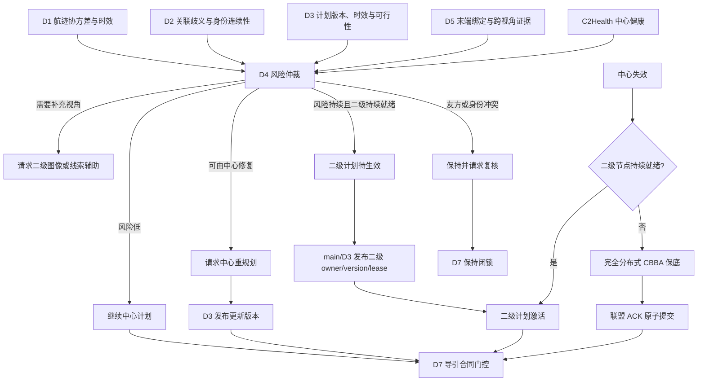
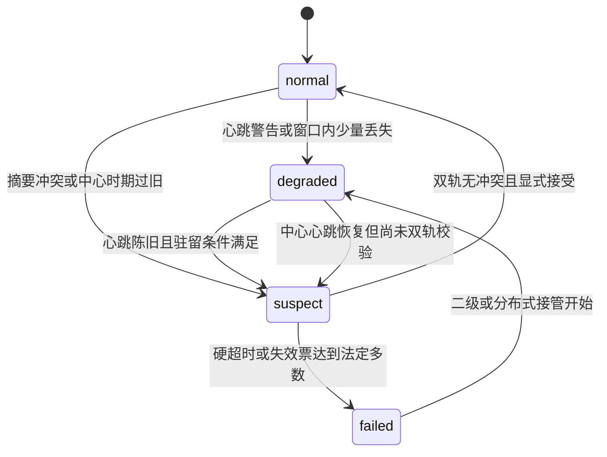
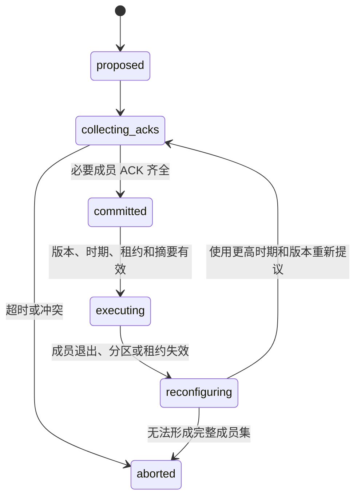

# D4 分布式协同与降级接管算法及实施方案

## 2026-07-30 v7 来源独立评价实现

### 输入绑定

评价实现与 v6 版本隔离，入口为
`region_resource_v7_external_evaluation.py`。CLI 要求显式传入冻结 v7 candidate、
原始 source root、labeled dataset、证据、推导清单、导出摘要和冻结 v4 candidate。
实现硬绑定以下身份：

- v7 manifest、training audit、source binding、model content 和 state file；
- source commit、64 个 seed、generation plan、generation summary 和 batch summary；
- labeled root、dataset、split、evidence、derivation 和 export summary；
- 冻结 v4 source binding 和完整候选树。

输出目录不得位于任一受保护输入树内，也不得位于模型注册目录。评价前后分别计算五棵
输入树，变化时抛出稳定的失败关闭错误。评价不会写回 candidate manifest，也不会创建
runtime loader 或注册记录。

### 逐帧流程

每个外部帧按固定顺序处理：

1. 从同一快照运行 `RuleRegionResourcePolicy`，得到 R0。
2. 由 `V7RuleNodeTransferResidualPolicy.decide()` 得到 raw recommendation、
   同帧 baseline、actor 激活有向边和预测资源数。
3. 比较 raw 与 R0 transfer，形成实际残差变化；同时比较完整 raw action tuple。
4. 用 `DeterministicResourceProjector` 生成 projected action。
5. 将 target、R0 和 projected action 转为同一 D3 可消费签名，判断 exact 正动作和
   负类 exact R0。
6. 执行 v4 干预不变量，分开记录正确有向边、错误方向、错误数量、错误边、虚假转移、
   投影拒绝和约束失败。

逐帧 JSONL 和 CSV 保存 target/raw/projected transfer、完整 R0/raw/projected action
tuple、逐字段偏差、actor 激活边、预测资源数和失败原因。投影后配额变化与 raw 节点
继承分别统计，避免把投影守恒改写误判为 node actor 输出。

### 数据用途

外部 train/validation/test 的读取数为 90/20/18。三类 payload 对 v7 的 fit、
checkpoint、threshold 和 confidence calibration 使用数全部为 0。正式 holdout
1000-1019 和旧评价 3008-3039 没有作为评价 payload 读取。候选和输入 mutation、
注册、准入和权限授予计数均为 0。

评价产物包括：

- `evaluation_records.jsonl` 和 `evaluation_records.csv`；
- `input_integrity.json`；
- `observable_overlap_audit.json`；
- `external_evaluation_summary.json`；
- `REPORT_CN.md`；
- `artifact_manifest.json`。

artifact reviewer 重新验证内容摘要、文件清单和全部关闭状态。actor-derived 分母为 0
时保留 `None/unavailable`，不生成伪比率。

### 实测行为

train 的 raw residual activation 为 10，实际 transfer change 为 3，exact 正动作
0/24，负类 exact R0 63/66。validation 和 test 的 activation/change 均为 0/0，
exact 正动作均为 0/9，负类 exact R0 为 11/11 和 9/9。train 的 3 次变化均为错误边
和虚假转移。所有划分的 projection rejection、invariant failure 和 raw R0 action
tuple preservation failure 均为 0。

summary 将处置写为 `failed_closed`。候选没有置信校准器，固定置信门不应用；所有
assist、authority、assignment、degradation、takeover、coalition、control、
physical、D3、D7 和生产确认权限保持 false。

## 2026-07-30 v7 规则节点与转移残差实现

### 设计边界

v7 候选标识为
`region_resource_a2_rule_node_transfer_residual_shadow_v7`。该候选没有覆盖或修改
v4、v5、v6。它针对 v6 在 M16N24 来源上出现的两个问题：学习节点动作偏离同帧规则
动作，转移头在新来源上不激活。v7 将节点动作和转移学习分开：

1. `RuleRegionResourcePolicy` 先对当前区域快照生成确定性规则建议 R0。
2. v7 actor 只预测帧级残差激活、一条有向转移边及该边的绝对资源数。
3. 未激活时完整保留 R0；激活时只覆盖所选有向边的资源数。
4. 组合建议经过 `DeterministicResourceProjector`，再执行既有 v4 干预不变量。

v7 不生成区域节点动作头。原始建议直接复用 R0 的完整 action tuple，包含：

- `resource_quota_delta`；
- 储备比例；
- 侦察优先级；
- `hold` 和 `request_replan`；
- owner 标识和 owner 层级；
- plan 标识、plan version、epoch 和 lease；
- `reasons`。

raw action 保持审计直接比较完整不可变数据类，而不是抽取部分字段。投影器随后可以根据
转移守恒关系重算资源配额增量并追加确定性拒绝原因。该变化属于投影结果，不属于学习
节点动作。模型不能修改 owner、epoch、lease、分配权限、联盟权限或控制权限。

### 数学表示

区域快照记为 \(G\)，R0 输出记为

\[
R_0(G)=\{a_i^0,\tau_e^0\},
\]

其中 \(a_i^0\) 是区域节点动作，\(\tau_e^0\) 是有向边 \(e\) 上的基线转移资源数。
v7 actor 输出帧激活分数 \(g(G)\)、有向边分数 \(s_e(G)\) 和资源数
\(q_e(G)\)。当前固定激活阈值为 0，不使用置信校准：

\[
\tau_e =
\begin{cases}
\tau_e^0, & g(G)<0,\\
\operatorname{round}(q_e), & g(G)\ge 0,\ e=e^\*,\\
\tau_e^0, & g(G)\ge 0,\ e\ne e^\*,
\end{cases}
\qquad
e^\*=\arg\max_e s_e(G).
\]

每帧最多激活一条残差边。预测资源数受该边可转移资源上限约束；预测为 0 时删除 R0
在该边上的转移。这样可以表达新增、删除和修改数量三类残差，同时保留其他 R0 转移。

### 网络与监督

actor 使用节点特征、源节点与目标节点差、全图节点均值、边特征和 R0 转移比例构造
有向边上下文。边上下文经过两层全连接网络，分别输出边激活值和资源数。帧激活头使用
全图节点的均值、最大值、最小值，以及边特征的均值和最大值。网络不含 node actor。

残差标签由目标转移和 R0 转移之差产生：

\[
y_e=\mathbf{1}(\tau_e^{target}\ne\tau_e^0).
\]

冻结配置的损失为

\[
L=L_{edge}
+0.75L_{rank}
+0.50L_{count}
+2.0L_{frame+}
+2.0L_{frame-}.
\]

`edge` 项显式监督残差边激活；`rank` 项要求正确有向边比分内其他边至少高 0.5；
`count` 项只监督正残差边的绝对资源数。正帧和负帧分别监督帧门。负帧一致性损失直接
压低帧激活，解决首版 v7 在 M16N24 VALIDATION 上 20/20 帧激活的问题。

正负帧、正边与零边、两个来源之间的平衡权重只由合并 TRAIN 推导。VALIDATION 不更新
参数，不派生类别权重，也不调整阈值。

### 数据用途

构建器只加载以下数据：

- 冻结 v4 来源：TRAIN 350 帧、VALIDATION 75 帧；
- M16N24 来源：TRAIN 89 帧、VALIDATION 20 帧。

合并 TRAIN 含 84 个正帧、355 个负帧、84 条正残差边和 5260 条零残差边。M16N24
数据集内容摘要为
`b1295091d4d79e423e1ced02269895d486e2dbcca9d80834d5af0cc14882b42c`，
划分摘要为
`c767a48b90f6e2a3f077be4f931d95102a6b2a925a2f813ca8440c8951aae332`。

M16N24 TEST 17 帧不加载为 episode payload。seed 5216-5279、正式 holdout
1000-1019 和旧评价 3008-3039 均由载入守卫显式拒绝。4016-4079 已作为 v7 开发
来源，不能再用于声明 v7 的未见评价。

### 选模与开发门

每个 checkpoint 先比较投影后行为，再比较固定 TRAIN 权重下的验证损失。排序顺序为：

1. M16N24 开发门是否通过；
2. exact 正动作数；
3. 正确有向残差边数；
4. 负类 exact R0 数；
5. 不变量失败、负类虚假转移和投影拒绝；
6. 验证损失和较早 epoch。

全 no-transfer、仅节点变化或没有正确有向边的 checkpoint 不能成为合格候选。
M16N24 VALIDATION 的固定开发门为：

- actor 原始残差激活大于 0；
- actor 相对 R0 的实际 transfer change 大于 0；
- exact 正动作大于 0；
- 负类 exact R0 至少 8/11；
- 投影拒绝为 0；
- 完整投影后不变量失败为 0；
- R0 完整 action tuple 偏差为 0。

最佳 checkpoint 为 epoch 137，训练在 epoch 182 提前停止。逐来源结果如下。

| 来源与划分 | exact 正动作 | 正确有向残差 | 负类 exact R0 | actor 激活 | 投影拒绝 | 不变量失败 | 节点字段偏差 |
| --- | ---: | ---: | ---: | ---: | ---: | ---: | ---: |
| 冻结 v4 TRAIN | 58/60 | 58/60 | 278/290 | 70 | 0 | 0 | 0 |
| 冻结 v4 VALIDATION | 13/15 | 13/15 | 58/60 | 17 | 0 | 0 | 0 |
| M16N24 TRAIN | 1/24 | 1/24 | 62/65 | 5 | 0 | 0 | 0 |
| M16N24 VALIDATION | 2/9 | 2/9 | 9/11 | 6 | 0 | 0 | 0 |

M16N24 VALIDATION 通过开发门。M16N24 TRAIN 正类只命中 1/24，说明当前模型对新域
正帧激活的覆盖仍低。该结果是使用 VALIDATION 选模后的开发证据，不是来源独立泛化
结论。

### 构建与内容身份

构建入口为
`scripts/build_region_resource_v7_rule_node_residual_candidate.py`。模型状态使用按参数
名、类型、形状和原始字节排序的规范张量流。两次独立构建的全部文件逐字节一致。

| 内容 | SHA-256 |
| --- | --- |
| 模型参数内容 | `bec99032bc176854f7ba265977ed35bf828d415be4bc260c9b6703a95d70082d` |
| 状态文件 | `d0f7f17599fba382d9aa436c6ae34ef5f23b582a5ed9068f3475cb545b4f88f5` |
| 训练审计内容 | `1d60fbd1e3841eddc76914f7dad4421ae024eaf4ff63190269dc1a2046f6385e` |
| 候选 manifest 内容 | `fe9b18f6da8d9daf6d443a89f4cc321a9bda7645be3367b69c4ac29b3ac4f45f` |
| 候选树内容 | `b143a6bc6787c97d16a8ab58af23e02341e9ce42992cb50e4bcb049b4a04a2fa` |

候选树摘要按排序后的相对路径和每个文件 SHA-256 计算。两个输出目录执行 `diff -qr`
无差异。候选位于忽略的 `outputs/`，没有写入模型注册表。

### 权限状态

v7 保持 development、shadow only、unregistered、admission closed 和 rule fallback
required。候选没有置信校准器，不应用固定 0.60 门。assist、assignment、
degradation、takeover、coalition commit、control、physical、D3 和 D7 权限全部
为 false。来源独立评价、正式 holdout、运行预检、AirSim 和物理收益均未开始。

## 2026-07-30 v6 来源独立外部评价实现

评价器位于
`d4_distributed_fallback/region_resource_v6_external_evaluation.py`，命令行入口为
`scripts/run_region_resource_v6_external_evaluation.py`。该路径只加载 v6 专属规范
张量 bundle，不调用训练函数、优化器、反向传播、checkpoint 写入或置信门。

入口固定核验以下身份：

1. v6 候选目录、manifest 内容、训练审计内容、模型内容和状态文件 SHA-256；
2. 候选 artifact 库存以及 bundle manifest，拒绝额外文件、符号链接和内容篡改；
3. M16N24 外部数据集和 split SHA-256、126 帧、64 个 seed、8 区域及 source clean
   commit；
4. evidence、derivation、export summary 的内容和文件摘要，以及 exporter clean
   commit；
5. 外部 seed 4016-4079 与旧评价 3008-3039、正式 holdout 1000-1019 的隔离；
6. 冻结 v4 TRAIN+VALIDATION 的数据身份，供在线可观测键精确重合审计使用。

评价前记录候选树、整个外部输入树、外部 dataset 树和冻结 v4 来源树摘要。全部逐帧
推理和重合审计完成后再次计算。任一摘要变化时停止写出并返回 mutation error。输出
目录不得位于任一冻结输入树内，也不得写入 model registry。

每帧执行固定流程：

1. 从同一快照重算确定性 R0。
2. 调用 v6 actor 的 raw recommendation，不读取其未校准置信值。
3. 通过冻结 v4 同配置的确定性投影得到候选动作。
4. 对 R0、外部目标和候选动作构造 D3 实际消费字段的 executable signature。
5. 对正目标和 actor 可执行差异重新执行 owner、plan、epoch、lease、备用资源、邻接、
   容量和总量守恒不变量。
6. 按有向转移键分开统计正确边、反向边、错误数量和其他错误边。
7. 输出 raw/projected transfer、exact 正动作、负类 exact R0、虚假转移、投影拒绝、
   不变量失败和 actor-derived 正类分母。

外部 train/validation/test 全部只用于评价。汇总固定写入三个 split 的 actor fit、
checkpoint selection 和 threshold fit 计数为 0。actor-derived 正类分母为 0 时，其
条件比率写为 JSON `null` 和状态 `unavailable_zero_actor_derived_positive_denominator`。

输出目录
`outputs/d4_v6_source_independent_external_evaluation_20260730/` 包含：

- `evaluation_records.jsonl` 和 `evaluation_records.csv`：126 帧机器记录；
- `input_integrity.json`：候选、输入、v4 来源及前后树摘要；
- `observable_overlap_audit.json`：251 个冻结键与 94 个外部键的重合审计；
- `external_evaluation_summary.json`：分 split 和总体指标、数据用途及权限状态；
- `REPORT_CN.md`：中文结论；
- `artifact_manifest.json`：输出库存与逐文件 SHA-256。

输出经临时目录完整写出后原子替换。reviewer 不加载模型，按 artifact manifest 复核
库存、文件摘要、JSON 内容摘要和全部关闭字段。身份或制品篡改、置信门应用、正式
holdout 读取、输入突变和权限开放均失败关闭。

本次结果的 raw/projected transfer 为 0/0/0，exact 正动作命中为 0/24、0/9、0/9，
负类 exact R0 为 61/65、9/11、7/8，不变量失败为 6/6/3。在线可观测键精确交集为 0。
结果不支持准入；v6 继续未注册并强制规则回退。

## 2026-07-29 v6 转移动作学习实现

v6 实现在 `region_resource_v6_transfer_candidate.py`，构建入口为
`scripts/build_region_resource_v6_transfer_candidate.py`。候选标识为
`region_resource_a2_edge_transfer_shadow_v6`，模型版本为
`d4-region-resource-graph-bc-edge-transfer-v6`。代码不改 v4/v5 文件和注册常量。

构建器先核验冻结 v4 manifest 文件、内容、模型、数据和 split 哈希，再只请求 TRAIN 和
VALIDATION payload。载入记录含 TEST、seed 1000-1019 或 seed 3008-3039 时立即失败。
TRAIN 派生帧和边权重；VALIDATION 只执行每 epoch 的投影后 checkpoint 审计。

`V6EdgeTransferGraphActorCritic` 复用共享节点/边编码、消息传递和节点动作头，新增
`edge_activation_actor`。训练接口同时返回激活 logits 和正边数量；运行兼容接口只返回
`GraphPolicyOutput`。激活为负的边输出固定无转移值，激活为正的边输出数量头结果，并
继续由 `LearnedRegionResourcePolicy` 和 `DeterministicResourceProjector` 解码。

训练审计逐 split 记录：

- 正/负动作和正/零边数量；
- 正确 source-target 有向边；
- 投影后 exact executable action；
- raw/projected no-transfer bias；
- 投影拒绝和不变量失败；
- 边级真阳性、假阳性、假阴性和真阴性；
- 失败原因库存及 checkpoint 选择轨迹；
- TRAIN/VALIDATION/TEST/holdout/来源评价的读取、拟合和权重计数。

候选 bundle 使用按参数名、类型、形状和原始字节排序的规范张量流。该格式不注册到通用
运行时。两次独立构建逐文件一致，避免 PyTorch 默认序列化内部存储标识导致文件哈希
漂移。

固定构建的最佳 epoch 为 119，训练在 epoch 164 提前停止。TRAIN/VALIDATION 的 exact
正动作和正确有向边为 58/60、13/15，负类基线动作保持为 255/290、55/60，投影拒绝为
0/0。负类按“与 R0 无可执行差异”定义，允许 R0 自身带转移。v6 专项 12/12、D4 全量
855/855 通过。

候选 manifest 固定 `unregistered`、`admission_closed`、
`rule_fallback_required`。0.60 置信门不降低，置信校准状态为“actor 冻结后再开始”。
assist、assignment、degradation、takeover、coalition、control、physical、D3 和 D7
权限全部为 false。

## 2026-07-29 v5 来源独立外部评价实现

### 输入与校验

评价器位于
`d4_distributed_fallback/region_resource_v5_external_evaluation.py`，命令行入口为
`scripts/run_region_resource_v5_external_evaluation.py`。入口接收来源根目录、外部标签
数据集、冻结 v4 候选、冻结 v5 候选和输出目录。配置固定 M16N20、32 个 episode、
63 帧、0.60 门及四类 seed 范围，构造时拒绝改门、读正式 holdout、拟合、改 split、
生成正类和开放生产权限。

加载数据前依次校验：

1. 来源 generation plan、generation summary 和 D4 dataset manifest 的文件摘要；
2. 外部导出 summary、来源推导 manifest 和 evidence 的内容摘要与文件摘要；
3. 标签数据集 SHA-256、split SHA-256、32 个 episode 的 clean commit、M16N20 和
   seed 3008-3039；
4. 训练 0-99、正式 holdout 1000-1019、pilot 3000-3007 与外部评价 3008-3039 的
   两两隔离；
5. v4/v5 候选的 manifest、模型、校准状态和完整文件树，评价前后重新计算树摘要。

输出目录在任何写入前做路径边界检查。输出等于或位于来源、标签、v4 候选或 v5 候选
目录之下时立即拒绝；只有这些冻结输入树之外的目录可以进入临时写出和原子替换过程。

来源 dataset 只读取 manifest，不读取其在线 recommendation payload。评价读取外部标签
数据的 train/validation/test payload。标签必须是 `kind=rule`，并与来源推导 manifest
列出的正动作逐项一致。

### 逐帧评价

每帧先从同一快照重算 R0，再运行冻结 v4 actor 和确定性投影。评价器对 R0、外部规则目标
和 actor 建立 D3 实际消费字段的可执行签名。外部目标与 R0 不同时，重新执行既有 v4
干预不变量，确认一资源转移没有破坏 authority、计划版本、租约、备用资源、通信边和
总量守恒。

规则安全正动作、actor-derived 正类和门控通过分别计算。actor-derived 正类要求外部目标
是安全正动作、actor 签名完全匹配目标，且 actor 动作通过安全不变量。冻结 actor 的
pooled latent 输入 v5 11 近邻 calibrator，分数只用于离线审计。固定门通过定义为
`score >= 0.60`。候选未注册，因此逐帧仍固定
`candidate_authorized=false`、`rule_fallback_used=true`。

可观测键审计从 v4 候选 development dataset 只加载 TRAIN 和 VALIDATION，不读取旧
TEST。新数据三个 split 都只用于评价，不参与拟合。评价器分别统计旧/新记录数、唯一键、
交集和新记录重合数。

### 持久化产物

输出目录
`outputs/d4_v5_source_independent_external_evaluation_20260729/` 包含：

- `evaluation_records.jsonl`：63 条逐帧签名、标签、分数、门控和回退记录；
- `input_integrity.json`：来源、标签、配置、v4/v5 候选和 seed 隔离哈希；
- `observable_overlap_audit.json`：旧 425 帧和新 63 帧的输入键重合结果；
- `external_evaluation_summary.json`：按 split 和总体统计、读取事实、准入状态和限制；
- `REPORT_CN.md`：中文评价结论；
- `artifact_manifest.json`：上述文件的 SHA-256 清单和内容摘要。

输出先写入同目录临时路径，全部成功后原子替换。reviewer 不加载候选，只按 artifact
manifest 复核库存、逐文件 SHA-256、JSON 内容摘要和准入关闭字段。任一篡改、额外文件、
正式 holdout 读取或权限开放都会失败关闭。

### 结果

train/validation/test 样本为 43/10/10，规则安全正动作为 1/1/0，actor-derived 正类
均为 0。三个 split 的得分 min/mean/max 均为 0，固定门通过和负类误接收均为 0，规则
回退为 43/10/10。旧开发数据有 251 个唯一可观测键，新数据有 41 个，交集为 0。

新增评价专项 8/8，与既有 v5 候选专项合计 18/18、D4 全量 843/843 通过。测试覆盖
固定配置不可放宽、规则正动作不能冒充 actor 正类、正类召回分母、持久化制品复核和
字节篡改拒绝。新增路径测试还覆盖候选子目录、来源子目录拒绝和外部目录接受。

D6 已完成独立只读复核，按 split 的样本、规则安全正动作和 actor-derived 正类为
43/10/10、1/1/0 和 0/0/0；63 个得分均为 0，固定门通过 0，负类误接收 0，回退
63/63，旧/新唯一键 251/41 且重合 0，正式 holdout 读取 0。该实现和审计均未运行
D3 successor、D7 权限、AirSim 或正式 holdout，正类分母仍不可用。

## 2026-07-29 v5 置信校准实现

`region_resource_v5_confidence_candidate.py` 是独立于 v4 builder 和 v3 registry 的
开发路径。入口先用 v4 离线 loader 核验 D6 冻结的 manifest 文件/内容、模型、数据和
切分 SHA-256。随后在拟合前后重算整个 v4 候选树和 v3 registry 树。任一摘要变化时删除
新输出并失败关闭。

数据 loader 只请求 TRAIN 和 VALIDATION。它从冻结 v4 actor 重新生成正负置信记录，
不读取 TEST episode payload。执行顺序如下：

1. 冻结 actor，复算每个图消息传递后的实际 24 维节点均值 latent。24 来自冻结 v4
   `hidden_dim` 和 v5 `feature_dimension`，不修改通用模型默认维度。
2. 只用 TRAIN 350 条记录计算逐维均值、标准差和 11 近邻库存。TRAIN 标签为
   58 正、292 负；latent 同键异标签直接拒绝。
3. 使用固定逆距离公式计算 TRAIN 和 VALIDATION 得分。算法没有可调 epoch，也不根据
   validation 改变近邻数、距离、标准化、阈值或状态。
4. 在固定 0.60 门上重算正类召回、负类特异度、最小越门正裕量和 Brier 分数。
5. 用预置开发门验收。TRAIN/VALIDATION 召回均须不低于 0.80，特异度均须为 1.0，
   最小正裕量均须不低于 0.02。
6. 开发门失败时不创建候选目录，只在独立 sibling 路径保存
   `candidate_created=false` 的失败回执和原因。
7. 开发门通过时，以 staging 目录写入校准状态、摘要和固定门，再生成逐 artifact
   SHA-256 与 manifest 内容摘要，最后原子改名到 v5 独立路径。

本次构建的 TRAIN/VALIDATION 召回为 1.0/1.0，特异度为 1.0/1.0，最小正裕量为
0.400000/0.209319。TRAIN/VALIDATION Brier 分数为 0/0.000485。VALIDATION
fit/weight/threshold/hyperparameter/selection 均为 0；TEST 和正式 holdout payload
read/fit 均为 0。

构建器在开发门计算后执行只读重合诊断。原始图键只由冻结 actor 可见的节点张量、边张量、
边索引及其 shape/dtype 形成；latent 距离在 TRAIN 均值和标准差定义的同一标准化空间中
计算。诊断不改变近邻库存、阈值、候选选择或任何拟合状态，并显式记录
`validation_overlap_diagnostic_fit_count=0`。

当前 75 条 VALIDATION 记录中，原始图键、latent 以及两者同时完全重合的数量均为 42。
最近距离分桶为 `exact_le_1e_12=42`、`nonexact_lt_1e_3=20`、
`ge_1e_3_lt_1e_1=10`、`ge_1e_1=3`；最近距离 P50/P90/P95 为
`0/0.0123058/0.0940144`。最近 TRAIN 标签匹配 75/75，VALIDATION 的 13 条正类中
12 条完全重合。

D6 使用固定外部哈希完成独立只读审计。四个候选 artifact、v4/v3 身份、数据用途和
TRAIN/VALIDATION 原开发门均可复现；冻结 v4 hidden state 与 v5 feature state 的实际
维度均为 24。TRAIN 全库存评分将被评样本自身置于近邻库，self-match 为 350/350。
raw observable key 留组与 latent exact key 留组的 recall/specificity/Brier 均为
`0.965517/0.958904/0.037610440`。移除 validation exact overlap 后只剩 1 个正类，
独立泛化指标 unavailable。

开发门结果仍为通过，但独立门固定失败。summary 和 manifest 写入
`candidate_classification=memorization_development_control`、
`independence_evidence_available=false` 和
`generalization_evidence_available=false`，并保存来源相同、原始图重合、latent 重合、
近重复和缺少来源独立扰动集五项 blocker。reviewer 会重算这些字段；同步篡改并重签为
可泛化声明时失败关闭。

默认 loader 在读取 artifact 前检查注册摘要。三个 v5 注册摘要都是 `None`，因此返回
`v5_candidate_unregistered`。只有显式 `offline_development` 上下文可以检查候选和读取
校准状态。loader 不提供 D3 建议发布、D4 接管、D7 控制或 runtime ACK 接口。

候选 reviewer 要求目录只有 manifest、状态、摘要和固定门四个文件，逐文件验证
SHA-256 和内容摘要。即使攻击者同步改写 artifact hash 和 manifest content hash，
0.60/0.80/1.0/0.02 固定门或权限字段变化仍由代码常量拒绝。定向测试还覆盖普通字节
篡改、数据用途越界、失败回执、未注册加载、重合诊断、虚假泛化声明以及 v4/v3 文件树
不变性，当前 10/10 通过；D4 全量为 835/835。全量测试仅报告环境中 Matplotlib
`Axes3D` 不可用警告，不影响 v5 代码路径。候选 manifest 内容、manifest 文件、校准
状态、校准摘要和 builder 源码 SHA-256 分别为 `83192d4f...2c52`、`caa77414...9459`、
`d8bd5437...12a3`、`7f0047f7...9c60` 和 `77e91e06...e1e0`。

## 2026-07-29 v4 落盘候选复核实现

落盘复核直接调用既有 manifest loader、candidate reviewer 和离线 development loader。
reviewer 重算候选目录的 artifact 清单，重新加载冻结 TRAIN/VALIDATION 数据、bundle、
模型权重、外部 evidence、训练配置、训练摘要和 intervention gate。manifest 文件本身
单独计算 SHA-256，不进入其自身 `artifact_files`。

第二层复核从冻结 payload 重新构造 Actor 和 confidence 记录。Actor 的 frame/edge
TRAIN-only 权重、置信正负类与硬负例权重、可辨识性审计、TRAIN/VALIDATION 命中指标均
与落盘训练摘要逐项比较。实际 TRAIN 非零/零 edge target 为 `72/3848`。候选只含
TRAIN 140 和 VALIDATION 30 个 episode payload；TEST 30 个 episode 仅保留 manifest
身份，不复制、不加载、不拟合。

离线 loader 必须显式设置 `evaluation_context="offline_development"`，并保持
`registered_binding_verified=false`。默认 loader 仍要求 registry 绑定，本候选返回
`v4_candidate_unregistered`。本轮没有调用 registry writer，也没有执行 runtime
preflight、formal holdout 或运行推理。

完整身份、权限和重算结果见
`../reports/D4_V4_PERSISTED_CANDIDATE_IMMUTABILITY_REVIEW_20260729.md`。该审查关闭
clean build 与 D4 artifact review 缺口，不改变模型算法、门限、投影器或准入状态。

## 2026-07-29 v4 observable-group 置信校准实现

v4 actor 训练继续把 frame 转为同键 \(R_0\) 可执行签名记录。安全 transfer target 是
正类，no-op target 是负类。frame 正类权重上限为 8，非零 edge 权重上限为 32；通用
`behavior_cloning_loss()` 和 `behavior_cloning_step()` 没有修改。投影拒绝、签名不匹配
和干预不变量失败记录全部保留。

新数据按 confidence 模型实际消费的 `node_features`、`edge_features` 和 `edge_index`
分组标注，并绑定 shape、dtype 和架构。272 个输入键没有混标或 target conflict。actor
最佳 epoch 107；train 正/负命中 58/60、276/290，validation 为 13/15、58/60。

冻结 actor 后，confidence train 标签为 58 正、292 负。TRAIN-only 权重为

\[
w_+=\frac{292}{58}=5.034483,\qquad
w_{\mathrm{hard}}=\min\left(\frac{292}{14},32\right)=20.857143.
\]

其中 14 条 hard negative 表示 actor 产生了可执行差异，但与外部安全 target 不一致。
16 条动作不一致负例使用上限 8，普通负例为 1。validation/test 不参与权重、间隔或梯度
计算。

运行门固定为 \(p_0=0.60\)，对应 logit
\(z_0=\log(p_0/(1-p_0))\)。正类要求向 \(z_0+0.20\) 推进，负类要求向
\(z_0-0.20\) 推进，损失只累计越过相应边界的平方距离。置信头仍为线性 head，学习率
0.003，固定全 TRAIN 批次。checkpoint 必须在 train 和 validation 同时满足
positive>0、negative=0、inconsistent=0、executable>0；随后按类别命中率、固定 TRAIN
权重下的 validation loss 和 epoch 排序。

完整只读复跑得到 8 个合格 epoch，最长连续 7 个。最佳 epoch 66 的四类计数为 train
`12/0/0/12`、validation `4/0/0/4`。`validation_weight_fit_count=0`，
`test_payload_fit_count=0`。

旧 development fixture 使用 8 区域 attribution 场景，其中
`d2_uncertainty_log=0.693147`、最低视觉可见率和一致率均为 0.20。当前 TRAIN 对应范围
分别为 0 至 0.122218、0.85 至 1.0、0.87 至 1.0。固定余量 0.05 不能覆盖这些值。
简单修正三项后虽然不再 OOD，置信度只有 0.481511，投影后没有转移。

候选构建现使用专用的 4 区域域内代表夹具。夹具是固定常量，不在构建时搜索数据。其定义
来自 TRAIN 的模型可见张量：先限定存在通信、机动和转移容量的图，再按归一化域中心距离
排序，选取首个同时通过固定 OOD、固定置信门、安全投影和非零可执行差异的代表。选择不读
target、reward、validation、test、seed 或来源身份。模型可见张量、shape、dtype 和架构
形成固定指纹；指纹漂移立即失败关闭。

评估先比较夹具指纹，再执行 OOD、模型推理、确定性投影和同键 R0。实际 source/target
从投影后的 transfer 读取。输出分别保存 source、R0 和 treatment 的可执行签名，要求
treatment 同时区别于前两者，配额净和为 0，owner、epoch 和 lease 不变。同一数据只读
复跑得到置信度 0.602367，原始/投影转移 1/1，投影拒绝 0。

该固定指纹就是 TRAIN 中的模型输入键。payload 将夹具标记为
`training_domain_smoke_only=true`，并将独立泛化证据和正式验证声明固定为 false。
manifest 重算 `confidence_margin_above_threshold=effective_confidence-0.60`，要求其
有限且为正。本轮裕量约 0.002367，属于薄裕量，不能作为准入证据。专项 42/42、D4 全量
825/825 通过。该只读校准阶段没有写候选；后续 clean build 和 D4 落盘复核状态见本文件
首节。registry 和权限字段仍未开放。

## 2026-07-29 规划资格和执行权限实现

`RegionResourceAuthorityCapabilities` 从同一份正式区域裁决生成。对象保存正式动作、
拒绝原因、风险因素、正式裁决 SHA-256，以及 planning、assignment、coalition、
takeover、control 五项能力。planning 为 true 时，后四项必须全为 false；内容摘要不
匹配时对象拒绝构造。

生成流程如下：

1. `RegionResourceSnapshot.from_regional_decision()` 读取中心 owner、plan/version、
   epoch、lease、ACK、网络和故障代际状态，生成逐区域 capability。
2. `_planning_only_eligible()` 重验正式动作
   `REQUEST_CENTER_REPLAN`，并要求拒绝原因非空且仅属于
   `d3_resource_infeasible`、`d3_required_member_count_unsatisfied`。
3. 投影器只允许 execution-authorized 源区向 planning-only 目标区转移。目标区不能成为
   source；源区预算继续扣除 committed resource 和
   `max(1, ceil(0.10 * available), reserve_resources)`。
4. 投影结果把目标区写为 `hold=false/request_replan=true/planning_only=true`。transfer
   同时写入 `planning_only_target=true`。这组字段可被 D3 表达为下一周期区域约束，不会
   触发 transfer touches hold 拒绝。
5. advisory-v2 保存 planning authority digest 和逐端 source version。消费时使用当前
   snapshot 和 formal decision 重新计算 capability；任一 plan、epoch、lease、owner、
   摘要或故障状态变化均拒绝。
6. `RegionResourceConsumptionView` 只在全部校验通过后设置
   `planning_replan_eligible=true`。其 execution、assignment、coalition、takeover 和
   control 字段始终为 false。

普通执行授权区域继续生成 snapshot/advisory v1。v1 的序列化移除新增证明字段并维持历史
内容标识；只有完整 v2 payload 可以获得 planning-only 资格。该迁移不会把旧 payload
静默解释成新合同。

专项测试覆盖中心资源不足正例、D3 transfer 两端无 hold、正常 v1 行为、过期 lease、旧
plan/epoch、网络分区、中心失效和 secondary、D5 friend/duplicate/identity hard hold、
ACK 不完整、真实 fault-generation fence、正式裁决变更和 legacy payload。2026-07-29
结果为 14/14，D4 全量为 794/794。真实 main/D3 successor 尚未执行；本实现只提供 D4
合同和消费语义。v4 注册状态保持 unregistered、shadow/development only。

## 2026-07-29 v4 builder 实施

v4 构建入口接收三个必需输入：输出目录、外部 `RegionLearningDataset` 和外部来源证据。
输出目录在未登记阶段不得位于 `model_registry`。来源证据绑定数据集 SHA-256、split
SHA-256、main runtime 或独立数据生产制品 SHA-256、来源类型、无在线真值声明和 clean
状态。全零摘要、dirty 来源或声明由 v4 builder 自生成时立即拒绝。

构建流程如下：

1. 解析完整数据 manifest，只加载 train 和 validation episode；test/holdout payload
   不读取。
2. 检查三个 seed 分区均达到配置下限，train/validation episode 的 commit 与配置摘要
   完整，数据清单没有 truth 字段。
3. 对每个 train 和 validation frame 使用固定 0.10/1/1.5 投影器重算同键 R0。每个
   split 必须同时有合法跨区差异和 no-op，且差异通过资源守恒、转移容量、权威版本和
   配额净流检查。
4. 只用 train 更新图网络动作参数。frame 正例和非零 edge 分别使用上限 8/32 的 train-only
   权重。validation 以双类命中、平衡命中率、固定加权 loss、投影拒绝和 epoch 的确定性
   顺序选模。test 不用于梯度、选模、阈值或诊断。
5. 冻结动作网络，构造正负置信度记录。模型必须匹配外部正例的可执行签名才能得到正标签；
   no-op、目标签名不匹配、投影裁剪和动作不一致得到负标签。
6. train 与 validation 均具正负标签后拟合置信度头。置信度正类和不一致负类权重只由
   train 计算且上限为 8；validation 中负例越过 0.60 或不一致样本越过门限时，构建失败。
7. 保存 development/shadow bundle、数据 manifest、train/validation episode、训练摘要、
   外部来源证据和独立 intervention gate。test episode 不复制。
8. 用版本化域内代表 fixture 检查模型可见图指纹、固定 OOD、固定置信门和安全投影，并
   要求形成区别于 source 和 R0 的可执行签名。指纹漂移、域外、低置信、无转移或无差异
   时删除临时目录并失败关闭。

制品 reviewer 重算文件清单、bundle 和数据绑定，重新执行外部数据治理检查，并确认
`runtime_confidence_gate=None`、`action_diversity_sufficient=true`、正式 holdout 数为
0、策略能力声明为 false。当前五项注册摘要均为 `None`。默认
`RegionResourceV4CandidateLoader` 因 `v4_candidate_unregistered` 拒绝运行加载；只有未来
独立准入流程固化全部摘要后才能改变这一状态。

## 2026-07-29 安全投影和回退

候选投影后的转移集合记为 \(E_L\)，区域配额记为 \(q_i\)。v4 要求：

\[
\sum_i q_i=0,\qquad
q_i=\sum_{e\rightarrow i}n_e-\sum_{e\leftarrow i}n_e,
\]

其中每条边本轮最多转移 1 个资源，总转移量不超过资源总数的 10%。源区转移后的资源必须
同时覆盖既有承诺和固定备用下限。owner、owner layer、plan id/version、epoch 与 lease
逐区域保持不变。`hold` 和 `request_replan` 与同键 R0 不一致时拒绝；未知区域、边身份
错误、过期 lease、联盟确认缺失和 formal decision 不一致也拒绝。

投影器出现任何裁剪记录都视为原始动作非法，不能用“投影后合法”掩盖过容量提议。运行评价
还检查 0.05 分布外余量、0.60 最低置信度和 250 毫秒 development 推理上限。任一条件
失败，treatment advisory 与 control advisory 的可执行签名保持一致，权限字段全部为
false。

2026-07-29 专项测试共 11 项，覆盖安全配置、同键 R0、21 资源/19 绑定 fixture、外部数据
正负治理、dirty/全正拒绝、来源摘要、v3 登记树、未登记 runtime 拒绝以及 OOD、过期、
过容量和低置信规则回退。D4 全量 780 项通过。该结果验证代码框架，没有生成或登记 v4
模型，也没有运行 AirSim。

## 2026-07-29 v2b 运行审计判定

最终审计使用两个相互独立的 episode。control 和 treatment 共享冻结的 seed、初态、场景
参数、通信与故障配置，但拥有独立 world、模块栈、总线和日志。treatment 仅在冻结帧执行
一次 readiness v3 候选评价；通过身份、运行门、安全投影和 1.5 秒有效期检查后，advisory
才可在下一周期送入 D3。普通 assist 桥未参与。

审计将候选状态写成两个独立判定：

\[
C_{\mathrm{runtime}} =
I_{\mathrm{raw}}\land I_{\mathrm{gate}}\land I_{\mathrm{projection}}
\land I_{\mathrm{isolated\ adoption}},
\]

\[
C_{\mathrm{promotion}} =
C_{\mathrm{runtime}}\land I_{\mathrm{identifiable\ action}}
\land I_{\mathrm{complete\ chain}}\land I_{\mathrm{positive\ benefit}}.
\]

其中可辨识动作要求候选经过确定性投影后形成 D3 能执行且能与规则臂区分的区域动作；完整
链要求该动作绑定严格后继计划、development ACK、D7 指令及物理窗口；正收益由 D6 在同键
规则基线上独立计算。运行兼容不能直接设置模型晋级。

seeds 2003-2012 的 \(C_{\mathrm{runtime}}\) 为 10/10。D3 后继、development ACK 和
producer 物理摘要为 1/10，另外 9/10 返回
`regional_hint_no_executable_successor`。D6 对候选动作的可辨识判定为 0/10。seed 2007
的完整 episode 可重放，但 candidate 与规则臂的 D3 可执行 successor 字段以及
source/successor 的资源—目标、联盟绑定完全相同，不能把计划升版本身当作学习动作。
该 seed 的 19 条 D7 控制绑定中 18 条具有物理窗口；`GT3D-000004` 因身份映射不可用而
缺失。该身份链由 D2/main 另行审计，D4 不补造 truth。

结果层中，control/treatment 的拦截数均为 0，10 个 seed 的最小距离逐项相同。有界非退化
只对这两个已声明指标可用且为 true。正收益因 3.2 秒内无拦截、最小距离没有严格改善、
可辨识动作缺失和同链覆盖不完整而保持 unavailable/false。因此
\(C_{\mathrm{promotion}}=0\)。

实现约束保持不变：所有生产权限字段为 false，候选继续
`development/shadow`，普通 `assist_eligible` 不开放。后续应通过新 development 候选在
现有投影和安全门内产生合法动作，再重新运行配对审计；不得修改 PNG、D3/D6 或 main
逻辑，也不得以人工 ACK、版本升高或时间相邻替代动作归因。本节记录的是三维质点集成审计，
不代表 AirSim 或实飞结果。

## 2026-07-29 v3 隔离配对算法

新接口使用独立 development schema，输入清单固定为 seeds 2003-2012。每个 seed 建立
control 和 treatment 两个 arm specification；两者的场景配置、初态、通信日程、故障
日程及区域快照谱系哈希必须完全相同。旧 paired spec 继续固定正式保留 seeds 1000-1019，
旧 evidence 默认建议有效期仍为 1.0 秒。

v3 loader 从候选根目录开始验证以下身份链：

1. 候选目录名、manifest 文件 SHA-256 和 manifest 内容 SHA-256；
2. manifest 所列全部 artifact 文件、bundle manifest 和 model state SHA-256；
3. 候选 schema、策略名称、模型版本、8-region 适用域及 development/shadow 生命周期；
4. 内嵌运行门 SHA-256、确定性投影配置和规则策略配置；
5. assist、assignment、takeover、coalition、control、physical、runtime ACK 和 formal
   evaluation 权限均为 false。

运行阈值不从命令行重配。固定值为：

\[
T_{\mathrm{ttl}}=1.5\ \mathrm{s},\quad
c_{\min}=0.60,\quad
m_{\mathrm{ood}}=0.05,\quad
r_{\min}=0.10,\quad
n_{\mathrm{reserve}}\geq1.
\]

模型推理超时为 50 毫秒。候选原始建议先检查有限值、模型身份、8-region scope 和特征
分布。随后调用 bundle 内嵌一致性门。候选与规则建议都使用同一投影器和同一 formal
decision；比较项包括区域集合、归一化资源配额误差、预备比例误差、侦察优先级误差、
保持/重规划布尔状态及转移多重集。连续量最大误差门限为 0.10。动作不一致时：

\[
c_{\mathrm{effective}}=\min(c_{\mathrm{raw}},0.59)<c_{\min}.
\]

因此动作不一致不能通过候选门。低置信、分布外、超时、非有限、合同/身份不符也进入相同
失败关闭路径。通过运行门后，候选原始建议再次进入 D4 确定性安全投影；投影通过且 advisory
在 `snapshot_timestamp + 1.5 s` 前可消费，才形成下一周期隔离采用。

`RegionResourceV3IsolatedPairedAdvisor.advise_pair` 返回
`RegionResourceV3IsolatedPairedDecision`。每臂提供实际选中的 recommendation、
advisory contract 和 paired arm evidence。treatment 另外给出：

- `raw_inference_completed`；
- `runtime_gate_applied` 与 `runtime_gate_passed`；
- `projection_passed`；
- `next_cycle_isolated_adoption`；
- `isolated_treatment_influence_allowed` 与实际 adopted 状态。

main 只能把 `next_cycle_isolated_adoption=true` 的 advisory 送入独立 treatment 的下一轮
D3。该接口不设置普通 advisor 的 `assist_eligible`，不产生生产 ACK，也不改变降级状态、
owner、epoch、lease 或联盟提交状态。

## 2026-07-29 clean development preflight

main 在 clean commit `83b8869...0226` 上从固定 v3 registry 加载模型。兼容性判定同时要求：

\[
N_{\mathrm{frame}}\geq N_{\min},\qquad
\frac{N_{\mathrm{in\mbox{-}distribution}}}{N_{\mathrm{frame}}}\geq0.80,
\qquad N_{\mathrm{model\ evaluated}}\geq1.
\]

单 seed 适用域检查取 \(N_{\min}=2\)，名义 10-seed 批次取 \(N_{\min}=20\)。每个 case
运行 2.2 秒。批次使用 seeds 2003-2012，与训练 0-99 和正式保留 1000-1019 无交集。

20v20/8-region seed 2001 和 200v200/8-region seed 2002 均有 3 帧。每组
`raw inference/gate applied/action consistent/candidate permitted=3/3/3/3`，规则回退、
在线 truth、gate truth、非有限值、context/formal/permission mismatch 和 formal decision
变化均为 0。两组 blocker 为空，进入受控 paired development rollout 的前置门。

名义多 seed 中，20v20/8-region/recon2 与 200v200/8-region/recon8 各产生 30 帧。
两档的分布内、原始推理、门应用、动作一致和门后许可均为 30/30；规则回退、在线 truth、
gate truth、非有限值、context/formal/permission mismatch 和 formal decision changed
均为 0，blocker 为空。JSON SHA-256 分别为 `5f97c818...53db9` 和
`77a3ef45...d6cf4`。

5v5/2-region seed 2000 的 3 帧均被适用域和 OOD 门拒绝。`distance_log` 与
`transfer_time_log` 各有 6/6 个边值超过训练上界，原始推理、门应用和候选许可均为 0。
这条负例验证 8-region 候选不会静默接受 2-region 几何。2-region 支持不通过修改 v3
阈值实现。

preflight 只读取 shadow 建议，不生成 D3 后继计划、运行 ACK、联盟提交或收益。下一阶段
需要通信退化、中心/二级失效和 readiness 转换等扰动多 seed，并把候选 episode 与唯一
同键确定性规则 episode 分开运行，随后检查可辨识干预、时延、物理结果可用性和非退化。
正式 holdout 仍关闭。

## 2026-07-29 readiness v3 实现

readiness v3 在 v2 训练流程外增加独立的版本合同，不修改 v2 registry。候选 ID 为
`region_resource_a2_8region_runtime_action_readiness_shadow_v3`，模型版本为
`d4-region-a2-8region-runtime-action-readiness-shadow-v3`。candidate/source/view/
training/config 各自使用 v3 schema，reviewer 不允许 v2 schema、ID 或模型版本混入。

`RegionResourceEightRegionReadinessV3CandidateConfig` 固定运行投影
`minimum_reserve_ratio=0.1`、`minimum_reserve_resources=1`、
`advisory_ttl_s=1.5`。规则配置固定高威胁权重 2.0、不确定性权重 0.5、转移压力余量
0.05。运行门继续固定 OOD 0.05、confidence 0.60、cap 0.59 和 tolerance 0.10。配置对象
拒绝其他数值，默认配置内容 SHA-256 为 `e8ce37c4...0592`。

构建器通过同一个版本合同完成以下步骤：

```text
v3 配置
  -> 1.5 秒 DeterministicResourceProjector
  -> 共用该 projector 的 RuleRegionResourcePolicy
  -> 生成并哈希绑定 runtime confidence gate
  -> 写入 v3 source/view/training/bundle/candidate manifest
  -> review 按 v3 固定合同重算并核对
```

运行门内容 SHA-256 为 `77972834...6872`。validation 仍显式使用
`formal_decision=None`，与三来源数据语义相同。把 view 中的门改为 v2 的 1.0 秒后，即使
重新计算 view 内容哈希，v3 validator 仍按固定 1.5 秒合同拒绝。1.5 秒 Advisor 可执行门；
1.0 秒 Advisor 返回 `runtime_confidence_gate_context_mismatch` 并在原始模型推理前回退。

main 已在 clean commit `4ba2c8a...4114` 构建 v3。D4 review loader 核对后将 8 个文件
逐字节登记，源与登记树摘要均为 `07c770b0...a93a`。manifest 文件/内容、模型、源码身份、
复合数据和 split 为 `5e575ec4...59c3`、`7978aec0...ada2`、
`ace5df6d...7f52d`、`e260ff2f...4ef`、`5d174dd3...ee03` 和
`69ae1b0e...d817`。validation 门后 293/344 通过，动作不一致通过 0，通过动作一致率
1.0，Brier 为 0.056837453793788656。

2026-07-29 v3/v2 registry 联合专项 13/13、D4 全量 754/754 passed；v2 registry 文件树
摘要 `324a5118...5010` 未改变，旧 v1/v2 兼容测试通过。后续单 seed 8-region main
preflight 已通过，2-region 负例按适用域拒绝；名义 10-seed 兼容性也已闭合，扰动、
配对收益和正式评价仍未完成，全部运行权限为 false。

## 2026-07-28 readiness v2 实施状态

### 三来源候选

readiness v2 builder 只读合并运行特征源、动作课程源和真实 readiness 补样源。补样源绑定
commit `9a1f6fc97e86a7e0204b5fbb0d92e4fd13e3c763`、manifest 文件 SHA-256
`a1056c721be0c49066912f51e9f1ce0b4eebfac0e832da47a912f9573a22f0c2` 和数据内容
SHA-256 `34244f1fe4f15cf82ff144e6c6cb5cabedccf5ba7f7880adcd2b820b681c9c56`。
100 episode/199 frame 中包含 1592 个 readiness 值，1572 个为 0，数值范围 [0, 1]。
全部帧具有规则标签，在线真值和 dirty episode 均为 0。

三个来源必须具有相同的数字 seed 0-99 库存。builder 忽略来源各自原 split，按数字 seed
全局原子切分；一个 seed 的全部来源记录只能进入同一个 split。1000-1019 在读取后立即硬
拒绝。预期复合视图为 1100 episode/2297 frame，适用域固定 8 region，旧候选目录不覆盖。

### 单一门控路径

实现顺序如下：

1. `LearnedRegionResourcePolicy.recommend_raw()` 只执行模型并返回未投影建议，不宣称已完成
   运行门。
2. `RegionResourceAdvisor` 核对 bundle 声明的门配置与自身 minimum confidence、OOD
   margin、projector 和 rule policy/config。
3. Advisor 将同一 snapshot、projector、rule policy 和 `formal_decision` 传入
   `recommend_with_runtime_confidence_gate()`。
4. helper 对学习建议执行确定性投影，并以同一 formal decision 生成规则参考。动作一致时
   保留原始 confidence；不一致时有效 confidence 至多为 0.59。
5. Advisor 在固定 0.60 门限前检查门结果。通过时直接复用 helper 的已投影建议；拒绝、
   配置不匹配、非有限输出、超时或 OOD 时使用同一 rule policy 回退。

门配置内容哈希覆盖投影和规则配置。具有相同数值配置但 rule policy 未共享 Advisor
projector 实例时也拒绝，防止两个状态不同的投影器形成表面一致。非默认 projection config
只有在 bundle 构建时绑定、Advisor 运行时逐字段相同的情况下可用。降低 OOD 0.05 或
confidence 0.60 会失败关闭。

### 验证与诊断

validation metrics 调用同一 helper，并显式传入 projector、rule policy、
`formal_decision=None`、0.60 和 0.05。validation target 只核对 runtime rule reference，
不能决定 cap。接受条件为至少 5% validation 样本越过 0.60，且越过门限的动作不一致样本
为 0。

Advisor 输出稳定诊断结构，包含 `model_raw_inference_executed`、`gate_applied`、
`action_consistent`、`raw_confidence`、`effective_confidence`、
`candidate_permitted_after_gate` 和 `rule_fallback_due_to_gate`。无门旧 bundle 不输出该
字段，保持旧序列化。诊断 truth ID 使用数固定为 0，且不进入任何权限判定。

专项测试覆盖 formal decision 改变投影、自定义配置匹配和拒绝、规则/projector 实例错配、
固定门限降低、manifest 参数和哈希篡改、validation/runtime 一致性及旧 bundle 兼容。
main 已在 detached clean worktree commit `891b542...fea9e` 完成构建。候选已逐字节登记
到独立 v2 registry，八个文件与构建源目录相同。manifest 文件/内容、权重和源码身份为
`c3194c90...af72b`、`48148034...3852f`、`ace5df6d...7f52d` 和
`331b4f29...92ce0`。

validation 原始通过为 344/344，其中动作不一致 51；门后通过为 293/344，动作不一致 0，
通过动作一致率 1.0，Brier 为 0.056837453793788656，接受结果为 true。登记专项
**3/3**、v1/v2/运行门联合专项 **37/37**、D4 全量 **743/743 passed**。main runtime
preflight 后续已执行但因 TTL 1.0/1.5 上下文不匹配未通过，也未开放正式评价或运行权限。

本阶段评估过将 readiness v2 拆为独立候选模块。v2 当前与 v1 共用来源校验、数字 seed
原子切分、训练视图、内容寻址 manifest 和 reviewer 的内部合同；立即拆分会复制这些安全
检查或扩大私有接口。现阶段保留同一候选模块，通过独立 v2 schema、candidate ID 和命令
入口隔离，不覆盖 v1。旧 v1 manifest/load/build/review 测试与完整 D4 回归均已通过。
main runtime preflight 完成后，再根据模块稳定性决定是否提取公共构建内核。

## 2026-07-28 八区域复合候选实现

构建器先对两个只读源执行固定哈希、episode/frame 数量、区域数和动作库存检查。运行源为
900 episode/1798 frame/8 区域；动作课程为 100 episode/300 frame/4 区域。两个来源都必须
精确包含数字 seed 0-99，任一来源出现 1000-1019 或缺失 seed 时构建终止。课程的三个动作
帧在八区域运行 donor 上重新生成，标签再次通过 `RuleRegionResourcePolicy` 和
`DeterministicResourceProjector`，因此四区域张量不会直接进入八区域模型。

全局切分使用固定 seed `20260728`，按数字 seed 形成 70 train、15 validation 和 15 test。
复合数据为 1000 episode/2098 frame；训练实际读取 1468 个样本，validation 读取 315 个
样本，test payload 读取数为 0。train 的 hold/request-replan/nonzero-quota/transfer
库存为 70/171/140/70，validation 为 15/39/30/15，未触碰 test 为 15/34/30/15。

置信度使用候选专用两阶段训练：

```text
训练动作模型
  -> 冻结全部动作模型参数
  -> 根据动作输出与规则加安全投影标签计算误差和一致性
  -> 只更新 confidence_head
  -> validation 独立审计
```

五项误差等权。连续动作一致阈值为 0.10；hold/replan 位与解码转移数量要求精确一致。一致
样本目标为 `clip(1 - mean(errors), 0, 1)`，不一致样本目标为该值与 0.59 的较小值。
损失为连续 Brier 等价均方误差，权重 1.0，训练 30 epoch。动作模型参数在该阶段不更新。

validation Brier 从 0.258170 降至 0.021107，十箱期望校准误差为 0.028258。校准后的
confidence 范围为 0.699148 至 0.921956，315/315 越过固定 0.60；其中 264 个满足动作
一致性，51 个不满足。接受条件要求至少一个样本越过门限，且所有越过门限的样本满足动作
一致性。因此 `confidence_calibration_accepted=false`，blocker 为
`validation_action_inconsistent_threshold_pass:51`。

外层 manifest 同时绑定两个源数据 SHA-256、复合数据与 split、源码、配置、置信度目标
定义、训练摘要、模型包和全部权限。shadow 加载器先执行原置信度/OOD/时延/有限值/安全投影
门，再叠加 8 区域范围和校准接受门。校准未接受时将
`candidate_failure_gate_passed=false`，保持聚合门诊断自洽。旧候选加载分支默认沿用原
语义，不读取该新字段。

当前候选从 clean detached checkout
`923f3f6e91af0f85aed446c66420c834d2de63fb` 构建。manifest 文件/内容、权重、源码身份、
bundle manifest、复合数据和 split SHA-256 分别为
`ad5846b1...f5e5`、`52866167...e2f`、`43157f4e...b0ee`、
`f9c52715...53ed`、`824aecf1...b8f`、`ee6bd202...cfd4` 和
`69ae1b0e...d817`。一个八区域代表帧没有 feature OOD，原始 confidence 为
0.909641；校准门拒绝后 `gate_pass=false`、非零干预为 false、执行源为规则回退。该结果
是专项软件审计，不是 main runtime preflight 或正式性能证据。2026-07-28 最终 registry
专项 14/14、D4 全量 720/720 通过。

main 随后使用固定候选运行 development preflight。5v5/2 区域 seed 2000 的 3 帧均被
区域数和特征分布门拒绝，分布内 0/3、raw model execution 0。200v200/8 区域 seed 2001
的 3 帧中，1 帧进入 raw 模型，2 帧因 `secondary_readiness` OOD 回退；raw model
execution 为 1，candidate-permitted execution 为 0。该特征训练范围为 [1.0, 1.0]，
运行范围为 [0.0, 1.0]，24 个节点值中 16 个低于边界。两组 `finite=true`，在线真值使用
数为 0。

该结果说明双源重切分修复了“八区域没有任何 raw 推理”的一部分问题，没有形成运行分布
兼容性。下一训练视图需纳入真实八区域二级节点未就绪帧，并保持 seed 原子切分和评价 seed
隔离。置信度训练还需在 train/validation 上修复 51/315 个动作不一致样本跨过 0.60 的
误接收。新候选在运行分布和校准接受门同时通过前，模型输出只能留在只读 shadow，正式
20-seed/900-cell 不得启动。

## 2026-07-28 当前谱系影子运行

影子适配器把每个 `RegionResourceSnapshot` 转为区域图，按模型清单逐特征检查

\[
x_f\in[x_{f,\min}-0.05s_f,\;x_{f,\max}+0.05s_f],\quad
s_f=\max(|x_{f,\min}|,|x_{f,\max}|,1).
\]

越界记录包含节点或有向边身份、特征名、观测值、训练范围、允许范围、方向和超出量。候选
门通过与否都不改变运行权限。模型输出只进入共享确定性投影器形成诊断，实际执行源固定为
规则回退。verifier 按 episode 顺序重放模型和投影，检查 seed 注册、帧顺序、计划代次、
输入摘要、原始动作、投影动作、分类和内容摘要。

冻结适配器的可复现来源为
`model_registry/region_resource_a2_current_lineage_development_v1/`。加载时重算候选
manifest 文件、候选内容、源码摘要、bundle manifest、权重和内嵌训练数据 manifest 的
SHA-256，并检查其余摘要/配置文件与候选 manifest 清单一致。测试直接使用该路径，不依赖
本地 `outputs/`。登记文件只读，不提供覆盖、重训或门限参数。

main 的 5v5/2 区域 3 帧和 200v200/8 区域 2 帧均被 `feature_ood` 拒绝。后续复合训练
视图必须将运行数据和动作课程先映射到同一全局数字 seed 分区，再合并样本。源场景与数字
seed 组成来源键，数字 seed 决定 train/validation/test，避免同一 seed 跨来源泄漏。
运行数据提供特征覆盖，课程数据提供安全非零动作。默认适用域为已覆盖的 8 区域几何；
2 区域边距离继续视为 OOD。

## 2026-07-28 当前谱系候选构建与复核

### 数据使用

数据集 manifest 继续保存 train、validation 和 test 三个互斥 seed 目录。新选择性 loader
只打开 train 和 validation 对应的 episode 文件。完整 manifest 仍参与摘要绑定，但 test
episode payload 不读取，也不计算 test 指标。

模型参数更新为

\[
\theta_{e+1}=\theta_e-\eta\nabla_\theta
\frac{1}{|\mathcal{D}_{train}|}\sum_{i\in\mathcal{D}_{train}}
\mathcal{L}(f_\theta(G_i),a_i^{rule}).
\]

每个 epoch 后只计算 validation 损失。最佳参数为

\[
\theta^\*=\arg\min_{\theta_e}
\frac{1}{|\mathcal{D}_{val}|}\sum_{i\in\mathcal{D}_{val}}
\mathcal{L}(f_{\theta_e}(G_i),a_i^{rule}).
\]

test、旧 calibration 和正式保留 seed 不参与上述两个式子，也不用于修改门限。当前置信头
仍标记未正式校准；validation 有限值复核不能写成正式性能。

### 源码身份

`inspect_region_resource_current_lineage()` 调用只读 Git 命令检查工作区。状态非空立即返回
`source_worktree_dirty`。固定文件集合包含区域资源规则和投影、数据集、图策略模型、既有
训练实现及当前候选构建器。每个文件同时比较工作区字节与 `HEAD:path` 字节。

源码身份为

\[
H_{source}=SHA256(commit,tree,H_{impl},\{path:SHA256(file)\}).
\]

候选生成后的 review 再执行一次相同检查。构建期间源码发生变化，或者在另一个干净提交上
加载旧候选，均返回 lineage mismatch。

### Manifest 绑定

候选目录包含源码摘要、数据摘要、训练配置、训练摘要和 bundle。外层 manifest 固定绑定：

```text
source commit/tree/file hashes
  + dataset manifest/dataset/split hashes
  + train/validation/untouched-test seed catalogs
  + training config hash
  + bundle manifest/model weights/training manifest hashes
  + validation finite-output summary
  + all-false permission object
  -> current-lineage candidate identity
```

split 合同要求四组目录两两互斥：train、validation、untouched test、reserved evaluation。
读取计数要求 train 和 validation 大于 0，test、calibration 和 reserved 使用数精确为 0。
模型加载后重新检查全部参数有限，并对 validation episode 再运行一次原始建议推理。出现
NaN、无穷值、未知文件、哈希变化、额外字段或权限字段为 true 时失败关闭。

### 开发诊断

端到端专项在临时干净 Git 仓库中复制同字节实现文件，使用五 seed 微型数据集调用正式 CLI。
切分为 3 train、1 validation 和 1 untouched test。两 epoch 模型可从磁盘重新加载，
validation 非有限输出为 0，所有权限为 false。

该临时仓库只用于证明 builder/loader/reviewer 的行为。main 提交后，实际构建从独立
clean checkout `b0d498d9...` 运行，使用 60 个 train seed、20 个 validation seed，
留下 20 个 test seed 未读取。训练样本为 180，validation 样本为 60；60 epoch 中最佳
epoch 为 60，最佳 validation loss 为 `0.2042998969554901`。这些数值是开发训练记录，不是
正式性能指标。

构建完成后先执行独立 `review-only`，再使用既有单样本实际策略诊断函数遍历已加载的
train/validation，不调用 calibration 批次入口。固定 `minimum_confidence=0.60`、
`ood_margin=0.05` 和功能性分类时延覆盖，未修改任何门限。分类结果为：

| 切分 | 样本 | 门通过 | 安全非零 | 与基线相同 | 资源不可行 | 非有限 |
| --- | ---: | ---: | ---: | ---: | ---: | ---: |
| train | 180 | 180 | 168 | 12 | 0 | 0 |
| validation | 60 | 60 | 54 | 6 | 0 | 0 |

训练和验证的原始可执行动作签名分别为 11 和 10，模型身份错配均为 0。该诊断证明实际
development 模型可产生经过确定性投影和 D3 消费检查的非零动作。它没有读取 test、历史
calibration 或 seed 1000-1019，也没有生成后继计划、ACK、物理窗口、准入或收益。完整
命令、摘要和权限状态见
`../reports/D4_A2_CURRENT_LINEAGE_CANDIDATE_DIAGNOSTIC_20260728.md`。

## 2026-07-27 实际策略干预诊断实现

新增 `region_resource_actual_policy_diagnostic.py`，用于检查实际开发模型，不包装
`ConstrainedDevelopmentRegionResourceAdapter`。入口先严格读取候选 manifest、模型 bundle
和 composite dataset，再按 manifest 中的 calibration seed 白名单选样本。train、
validation、calibration 和 seed 1000-1019 必须互斥；数据 loader 继续递归拒绝 truth、
actor 和 evaluator 身份字段。

单样本诊断执行以下步骤：

1. 调用实际 `recommend_raw()`，验证 `source=learned` 和模型 SHA-256。
2. 使用固定 `minimum_confidence=0.60`、`ood_margin=0.05` 调用现有 development
   gate。动作分类固定覆盖 `latency=0 ms`，避免主机调度抖动改变分类；运行门
   `latency_limit_ms=50` 保持不变，本路径不输出时延性能证据。
3. 对每个区域保存原始和投影后的配额、整数备用资源、`hold`、`request_replan`，并逐字段
   比较 owner、layer、plan ID/version、epoch 和 lease。
4. 对每条转移保存请求数量、投影保留数量、边容量、源资源预算、邻接和分区掩码。
5. 复用安全采用链的 projected-intervention 口径，只有投影安全、advisory 可消费且 D3
   可消费字段非空时输出 `safe_nonzero_actual_model`。

稳定原因码分为：`action_same_as_baseline`、`confidence_insufficient`、
`out_of_distribution`、`owner_lease_epoch_blocked`、`action_masked`、
`resource_infeasible` 和 `policy_output_invalid`。批次另统计原始离散动作签名；只有全部
样本无非零动作且签名不超过一种时，才标记 `policy_output_degenerate=true`。

本地实际候选诊断为 20 seed/420 sample。固定门通过 420、门回退 0；安全非零 76、资源
不可行无操作 344。360 个样本至少一个区域的正备用请求超过可行备用量，其中 16 个样本仍由
其他区域或动作形成非零干预。非零字段累计为备用资源 197、重规划请求 40、配额 40、保持
20、转移 20。无低置信、分布外、权威错绑、动作掩码或非有限输出。原始离散动作签名 88，
批次输出未塌缩。

命令入口
`scripts/run_region_resource_actual_policy_diagnostic.py` 默认只写小型 JSON、中文报告和每类
代表样本；`--include-all-samples` 仅用于显式调试。入口要求提供可信候选 manifest
SHA-256，并核对模型 manifest 版本、权重 SHA-256、数据集 SHA-256 和逐 seed 样本分母。
候选实现谱系与当前代码不一致时，历史非零观察与当前谱系开发证据分开记录，后者保持 false。

专项测试覆盖非零转移、低置信、时期错绑、资源不可行、分区掩码、模型/manifest 身份错绑、
未知与非有限动作、缺失权威字段、独立 seed 隔离和批次输出退化，共 **10/10 passed**。
D4 全量 **689/689 passed**。两次重跑的逐 seed 分母、76/344 分类、样本身份摘要和分类
摘要一致。该实现未改动
`RegionResourceAdvisor`、投影器、安全采用 assembler、降级状态机或正式权限。

## 2026-07-27 提交前验证加固

联盟嵌套确认 DTO 现在严格检查 `can_execute`、版本/时期整数和有限时间。安全采用 DTO
严格检查 availability、projection、ACK、coalition、physical-window、benefit 和 authority
布尔字段。通信回执及期望映射采用字段全集校验，并在反序列化前递归拒绝真值前缀字段。

回归覆盖中心、二级和完全分布式三种当前 owner。三类证据链均可闭合，但输出的 authority、
收益和在线真值标志始终为 false。字符串执行标志、非有限执行时间、额外映射字段和开发
策略正式收益输入均失败关闭。该阶段 D4 全量验证为 **679/679 passed**；加入实际策略诊断
专项后当前全量为 **689/689 passed**。

## 2026-07-27 A2 开发态非零候选

### 适用范围

`ConstrainedDevelopmentRegionResourceAdapter` 是 development/test-only 适配器。输入必须
是已有学习策略生成的、未投影、无 fallback、模型摘要有效且与当前 snapshot/authority
一致的候选。适配器不训练模型，也不把规则动作写成模型输出。它通过固定策略名和 reason
标记规则派生的开发干预。

### 候选选择

原候选是否包含可消费动作，按确定性投影后的结果判断。适配器和规则策略共享同一个
`DeterministicResourceProjector`。原候选先完成投影、advisory 构造和同 snapshot 消费
检查，再使用安全采用链相同的干预证据比较资源配额、投影后整数备用资源、被接受的跨区
转移、`hold` 和 `request_replan`。

原始 `reserve_ratio` 变化不直接构成干预。若 committed resource 或最低备用约束使投影后的
整数备用资源回到基线，该候选仍是无操作。投影拒绝、advisory 发布拒绝或同 snapshot 消费
拒绝也不能触发“已有干预”提前返回。

formal decision 可能包含 snapshot 聚合字段尚未反映的已提交联盟成员。适配器通过
`formal_decision_aware` 协议接收该裁决，并在首次投影、规则候选投影、advisory 构造和消费
检查中一致使用。`RegionResourceAdvisor` 只对显式声明该协议的策略传入 formal decision，
其他策略接口不变；advisor 随后仍执行正式第二次投影。

原候选投影后为无操作时执行：

```text
learned no-op candidate
  -> rule policy computes legal aggregate alternatives
  -> request_replan-only -> project and check D3-consumable fields
  -> if still no-op, bounded transfer -> project and check
  -> if still no-op, hold on one committed_resources=0 region -> project and check
  -> if every level is no-op or rejected, return original candidate
  -> deterministic projector and formal D4 decision
  -> safe-adoption evidence assembler
```

request-replan 区域按未满足需求、分配冲突、降级失败和区域标识确定性排序。该动作不同时携带
hold 或 transfer，避免把已承诺 assignment 送入 held-assignment 路径。transfer 的总资源数
不超过 `maximum_total_transfer_resources`，投影后仍满足
\(\sum_i \Delta q_i=0\)。hold 只允许 snapshot 中 `committed_resources=0`、owner active、
coalition ACK 完整、未 fault-fenced 且租约未过期的区域。formal decision 中出现额外承诺或
权威冲突时，后续投影器仍会拒绝。

在 5 resource 全部被 committed resource 与 reserve 保护时，规则策略可能同时没有
request、transfer 和安全 hold。开发探针可显式设置
`force_request_replan_on_projected_noop=true`。该选项默认关闭，只从 owner active、
coalition ACK 完整、未 fault-fenced 且租约有效的区域中选择一个 request-replan-only。
它不改变 quota，不生成 transfer，也不允许 committed region 进入 hold。

适配器不重建 action 的 owner、plan ID、plan version、epoch 或 lease。原候选带旧绑定时，
投影返回 `deterministic_projection_rejected_or_modified`。网络分区、邻接、容量、备用资源、
已提交资源、D3 held-assignment 和严格 successor 条件保持原实现。

### 权限与证据

适配器要求 `enabled=true`、非空 `run_label` 和精确 `allowed_scenario_ids`。类属性固定
`maximum_advisor_mode=shadow`，且不提供 admitted manifest。通过
`RegionResourceAdvisor(mode=assist)` 调用时仍得到 shadow 和
`model_bundle_shadow_only`，不能进入 main 的 assist bridge。

开发 harness 可以把原始非零候选直接送入 `prepare()` 检查投影和干预证据。只提供候选时，
合法结果为：

```text
stage = awaiting_d3_plan
reason = d3_successor_plan_missing
identifiable_intervention_available = true
authority_granted = false
a2_benefit_available = false
```

正式收益窗口若使用开发探针策略名，`RegionResourceA2AuditWindowReference` 返回
`development_intervention_benefit_forbidden`。因此该路径可验证软件链，不能成为模型准入、
assist 或收益证据。

### 验证

main 先前固定最小区域 hold+request helper 的 20-seed 内存探针为 15/20。seed
1000、1002、1007、1009、1013 因所选区域存在 committed binding，D3 返回
`regional_hint_held_assignment_infeasible`。D4 对这五个 seed 增加 committed-region
request-only 回归，确认候选不含 hold，均形成非空干预并停在 `awaiting_d3_plan`。另有
transfer 总量、未承诺 hold、已承诺 hold 拒绝、均衡无操作、旧 epoch、assist 和正式收益
审计负例。

2026-07-27 新增投影一致性、formal-only committed member 和强制 request-only 回归。
区域 A 有 3 个可用资源、2 个 committed resource 和
1 个基线备用资源；原候选 `reserve_ratio=0.6` 在投影前表面对应 2 个备用资源，投影后因
可行备用上限回到 1。原候选的干预证据为空，适配器继续选择一个 request-replan-only；
再次投影后形成 `region:region-a:request_replan` 干预字段。安全采用专项为
**68/68 passed**，D4 全量为 **674/674 passed**。

同日用真实适配器、formal-aware 调用和 development-only admitted transport 夹具运行
1 次指定内存 full episode。配置为 5 target/5 resource/1 recon/2 region、3.0 s、seed 1、
radar detection probability 0.45。1 条 A2 记录到达 `physical_window_available`；
可辨识、安全采用和物理窗口均为 true，online truth 为 0，authority 和 benefit 为 false。
标准 advisor 仍限制为 shadow。main 固化开发夹具、20-seed 新策略重跑、独立 R0 和实际
模型收益仍待完成。

## 2026-07-27 A2 非空干预门

`RegionResourceSafeAdoptionAssembler.prepare()` 仍负责学习候选、正式权威和确定性投影
检查。投影成功只产生链路级 `RegionResourceAppliedRecommendation`。新增的
`RegionResourceProjectedInterventionEvidence` 从 advisory 自身重建基线和投影载荷：

```text
baseline:
  resource_count = resources_before
  reserve_resources = protected_reserve_resources
  transfers = []
  hold = false
  request_replan = false

projected:
  resource_count = resources_after
  reserve_resources = ceil(reserve_ratio * resources_after)
  transfers = advisory.transfers
  hold/request_replan = advisory value
```

以下任一变化形成可辨识干预：逐区域 `resource_quota_delta != 0`、至少一条跨区转移、整数
备用资源变化、`hold=true` 或 `request_replan=true`。`total_quota_delta` 不进入判定；
跨区转移在资源守恒时该值本来就是零。侦察优先级未进入当前 D3 提示执行面，也不进入干预
摘要。

基线与投影载荷分别计算规范 JSON 的 SHA-256。无变化时两个摘要必须相等，干预字段必须为空，
并记录 `no_d3_consumable_regional_intervention`。有变化时两个摘要必须不同，且至少包含
一个干预字段。干预标识由可用状态、字段、两个摘要和原因码共同内容寻址。

`assemble()` 在解析 D3 后继计划前检查干预证据。无操作建议直接返回：

```text
stage = safe_adoption_rejected
reason = identifiable_regional_intervention_missing
projection_available = true
identifiable_intervention_available = false
safe_adoption_available = false
```

该结果不携带后继计划、运行确认、所有者确认、联盟提交或物理窗口。即使调用方同时提供一条
合法但无关的普通 D3 升版链，也不能改变结论。`RegionResourceA2SafeAdoptionAuditSource`
进一步要求 `identifiable_intervention_available=true` 和非空 `intervention_fields`，
否则 A2/R0 收益输入失败关闭。

2026-07-27 的安全采用专项测试为 **52/52 passed**。正例覆盖资源守恒但存在真实跨区转移，
负例覆盖仅侦察优先级变化的无操作建议，以及无操作建议与同期普通后继计划同时出现的错误
归因路径。运行时集成专项 **6/6 passed**，分别验证无操作 `no_successor` 和真实干预
`new_execution_plan_applied`，以及 refresh 标志、执行变化、计划标识和版本篡改的失败关闭。
D4 全量 **658/658 passed**。

main/D6 于 2026-07-27 对开发批次完成正确 20-seed 重算。链路证据为 20/20，可辨识区域
干预、实际 A2 动作采用和 A2/R0 收益审计均为 0/20；全部拒绝原因为
`identifiable_regional_intervention_missing`。批次 SHA-256 为
`ff3c10a089b6a94582451ae05d8a884af3a2bd7485acd4df0496442ea7e0ec55`。原 18/20 采用
统计由普通 D3 后继计划误归因产生，已被本次结果取代。

## 2026-07-27 A2 同键 R0 审计输入

### 数据合同

`region_resource_a2_benefit_audit.py` 提供四层只读合同：

1. `RegionResourceA2AuditContext` 冻结 comparison key、场景/版本、规模、seed、逻辑窗口、
   窗口时长和 `paired_exogenous_config_sha256`。
2. `RegionResourceA2AuditWindowReference` 描述 A2 或 R0 执行臂。每个引用携带 episode
   execution arm、事件日志 ID/hash、物理窗口 ID/hash、计划版本、计划有效期、租约和硬约束
   状态，不携带结果指标。
3. `RegionResourceA2BenefitAuditInput` 保存一组候选与 R0 引用、失败原因和
   `d6_benefit_audit_eligible`。其所有运行权限字段固定为 false。
4. `RegionResourceA2BenefitAuditBatch` 检查 comparison key、R0 窗口、R0 事件日志和 R0
   execution arm 的批内唯一性。

`RegionResourceA2SafeAdoptionAuditSource` 负责候选来源归一化。输入可以是进程内
`RegionResourceSafeAdoptionEvidence`，也可以是 episode 持久化 JSON 中的一条完整 A2
记录。持久化路径先检查顶层精确字段集合和原始 `content_sha256`，再严格重建建议、后继计划
与物理窗口，避免离线组装依赖原进程对象。

### 装配流程

```text
candidate episode learning_adoption_evidence.json
  -> safe-adoption source hash verification
  -> A2 candidate window reference

R0 episode + independent event log
  -> deterministic rule identity verification
  -> R0 window reference

same paired_exogenous_config_sha256 + comparison/window identity
  -> distinct execution arm / event log / physical window checks
  -> duration / plan / lease / completeness / hard-constraint checks
  -> D6 read-only benefit-audit eligibility
```

候选窗口与安全采用来源逐项绑定：安全采用内容摘要、建议 ID/版本、策略名称/版本、计划
ID/版本、计划有效期、租约、物理窗口 ID/时间/摘要、执行状态和硬约束计数。R0 窗口必须使用
`d4-region-resource-rule/v1`，且不得携带候选建议或安全采用摘要。

候选和 R0 的 comparison key、场景、场景版本、规模、seed、逻辑窗口和外生配置摘要必须
相同。两臂窗口开始、结束和持续时间相同；execution arm、事件日志 ID/hash、物理窗口 ID/hash
必须不同。结构错绑直接抛出稳定错误码；窗口缺失、不完整、未观察物理执行、计划/租约过期或
硬约束违规形成 blocker，审计资格为 false。

严格 `from_mapping` 会重算 context、window、input 和 batch 的内容 SHA-256，并重新执行
eligibility 与权限计算。调用方不能通过修改 blocker、资格布尔或权限字段绕过装配器。新文件
同时进入既有 A2 implementation evidence 文件清单，后续外层包必须重新生成实现摘要。

### 验证边界

2026-07-27，安全采用专项 **50/50 passed**，D4 全量 **655/655 passed**。正例覆盖进程内
对象、持久化 episode 记录、严格往返和批量装配。负例覆盖缺 R0、字段/哈希篡改、计划版本
错绑、跨 key、重复 R0、事件日志/执行臂/物理窗口复用、时长不一致、过期、不完整、硬约束
和在线真值。测试未运行 AirSim，也没有 D6 结果计算；`a2_benefit_available`、assist 和
全部运行 authority 保持 false。

## 2026-07-27 确认收据幂等复用

### 绑定摘要

通信证据门为每个 `receipt_id` 保存收据不可变摘要和期望绑定摘要。期望绑定摘要包含
evidence kind、source、destination、authority、message ID、plan version、epoch、lease
scope、partition generation 和 payload SHA-256，不包含 `decision_timestamp_s`。因此同一
确认在后续物理窗口评估时仍属于同一证据链。

### 时间水位

每个 `receipt_id + evidence kind + binding digest` 维护最新评估时刻。处理顺序为：

```text
校验 receipt ID 对应的不可变内容
  -> 校验 evidence kind 与期望绑定未变化
  -> 拒绝 decision timestamp 回退
  -> 重新执行消息类型、路由、计划、时期、租约、到达和载荷检查
  -> 保存本次验证结果
```

更晚评估不直接返回旧结果。这样可在后续时刻识别租约到期，也可阻止先处理新时刻、再回放旧
时刻的证据。完全相同的已接受收据在同一绑定下标记为 `idempotent_replay=true`。改变绑定
返回 `receipt_reused_for_different_evidence`，时间回退返回
`decision_timestamp_rewind`，租约到期返回 `lease_expired`。

### 验证

正向用例先验证 owner ACK 并保持物理窗口缺失，随后用同一 ACK、同一计划与权威绑定装配更晚
物理窗口。反向用例覆盖 source/destination、authority、message、plan、epoch、lease、
partition、payload、evidence kind、时间回退和收据内容冲突。2026-07-27 专项
**99/99 passed**，D4 全量 **637/637 passed**。本次没有修改安全采用状态机、计划合同、
AirSim 接口或 D7 导引算法。

## 2026-07-27 A2 公共确认接口

### 运行时确认引用

`RegionResourceRuntimeAckParser` 读取实际 `runtime.assignment_plan_ack` envelope。验证
D4 advisory、D3 successor plan、D7 command binding 和 main 消费状态后，输出
`RegionResourceRuntimeAckEvidence`。新增的
`assignment_plan_ack_payload_sha256` 保存 main ACK payload 的规范 SHA-256，
`ack_bus_sequence` 保存 ACK envelope 的总线序号。两项共同区分“业务字段看起来相同”与
“确实引用同一条运行时确认”。

所有者确认载荷包含以下约束组：

- 权威：owner node、owner layer、epoch、lease expiry、partition generation；
- 建议：advisory ID、version、payload SHA-256；
- 计划：source plan ID/version、successor plan ID/version、successor payload SHA-256、
  successor bus sequence；
- 运行确认：assignment ACK payload SHA-256、assignment ACK bus sequence；
- 交付：message ID、acknowledged/sent timestamp、arrival timestamp、source、
  destination 和 transport sequence。

`acknowledged_at_s` 与 delivered message 的发送时间必须一致，到达时间不得早于发送时间，
也不得晚于安全采用决策时间。决策时间必须早于租约到期。

### 公共 API

main 的最小调用方式如下。散列和 receipt ID 均由 D4 公共函数计算。

```python
from d4_distributed_fallback import (
    RegionResourceOwnerAckDelivery,
    RegionResourceRuntimeAckParser,
    build_region_resource_owner_plan_ack,
    validate_region_resource_owner_ack_delivery,
)

runtime_ack = RegionResourceRuntimeAckParser().consume(
    advisory_source=advisory,
    consumption_source=consumption_envelope,
    assignment_plan_ack_source=assignment_ack_envelope,
    d3_plan_source_envelope=d3_plan_envelope,
    d7_guidance_source_envelope=d7_guidance_envelope,
)

expected_owner_ack = build_region_resource_owner_plan_ack(
    message_id=message_id,
    applied_recommendation=applied_recommendation,
    d3_successor_plan=d3_plan_reference,
    runtime_ack=runtime_ack,
    context=adoption_context,
    acknowledged_at_s=owner_ack_timestamp_s,
)

# 所有者发送 expected_owner_ack.to_transport_payload()；main 只消费实际交付对象。
owner_delivery = RegionResourceOwnerAckDelivery.from_delivered_message(
    delivered_message
)
owner_verdict = validate_region_resource_owner_ack_delivery(
    owner_delivery,
    expected_ack=expected_owner_ack,
    expected_destination_node_id="MAIN-RUNTIME",
    decision_timestamp_s=decision_timestamp_s,
)
if not owner_verdict.accepted:
    # 保持 unavailable/hold，不能补造确认。
    ...
```

接收方也可先调用
`RegionResourceOwnerPlanAck.from_transport_payload(envelope.payload)` 做严格 payload
解析。解析器要求字段集合精确相等，并检查 `authority_id`、`plan_version` 等 transport
别名与业务对象一致。

联盟确认不增加新的成员业务字段。`RegionResourceCoalitionAckDelivery` 的 payload 必须
嵌套完整 `CoalitionMemberAck`，由
`RegionResourceCoalitionAckDelivery.from_delivered_message()` 解析。随后调用
`validate_region_resource_coalition_ack_delivery()`，传入 D3/联盟状态导出的期望成员、
协调者、计划摘要和序号、租约、分区代次及决策时间。validator 同时检查嵌套对象和内容寻址
回执，返回 `RegionResourceAckDeliveryValidation`；该结果固定不能授予 authority。

### 安全采纳次序

实现只接受以下因果次序：

```text
learned candidate
  -> deterministic projection
  -> strict D3 successor plan
  -> main runtime assignment ACK
  -> delivered owner ACK
  -> delivered coalition member ACKs（需要时）
  -> atomic coalition commit/executing
  -> truth-free physical execution window
  -> same-key R0 and D6 benefit audit
```

前一阶段缺失时停在对应 `awaiting_*` 状态。字段错绑、摘要篡改、旧代次、过期、晚到或分区
冲突进入 rejected。物理窗口和同键 R0 缺失时保持 unavailable，不写成数值 0。候选实际
执行来源为 `deterministic_rule_fallback` 时，不产生 learned adoption。

### 验证

2026-07-27，运行时确认、所有者/联盟公共接口、通信因果门和联盟状态四文件联合测试
**130/130 passed**，D4 全量 **626/626 passed**。正例验证 payload 往返解析、内容寻址
回执和全部交叉绑定；负例验证运行时 ACK 摘要篡改、缺少严格 payload 字段和嵌套成员字段。
验收要求所有负例失败关闭，权限授予数为 0。测试未启动 AirSim 或真实网络，也未形成正式
多随机种子 physical window 和 same-key R0。

## 2026-07-26 A2 安全采用生产与验证

### 模块边界

`region_resource_safe_adoption.py` 位于区域建议器和既有 A2 最终证据装配器之间。它不导入
main、D3、D6、D7、AirSim 或 scalable 3D runtime，也不生成系统级分配计划。调用方提供
已经产生的候选、正式 D4 裁决、后继 D3 计划引用、通信投递回执和物理窗口；D4 只验证这些
事实是否属于同一次采用。

```text
真实学习候选
  -> DeterministicResourceProjector
  -> RegionResourceAppliedRecommendation
  -> D3 严格后继计划
  -> production runtime ACK
  -> secondary/peer owner delivered ACK
  -> coalition executing + all delivered member ACKs（需要时）
  -> physical execution window
  -> safe-adoption evidence prefix
  -> D6 same-key R0 / paired non-degradation
  -> 既有 A2 20-seed evidence assembler
```

混合所有者、时期或租约的区域建议不在一个记录内采用。main 必须按权威域拆分，再分别建立
证据。该约束避免跨区域通信中一部分所有者确认、另一部分未确认时产生部分执行声明。

### 建议准备

`prepare()` 的输入为 `RegionResourceSnapshot`、
`RegionResourceRecommendation`、`RegionResourceSafeAdoptionContext` 和当前
`RegionalFailoverDecision`。处理顺序如下：

1. 递归检查输入键，拒绝 truth、ground-truth、actor/object ID、outcome 和 reward。
2. 校验 snapshot、context 和正式裁决覆盖同一组区域。
3. 校验层级：中心正常只能使用中心；中心失效优先可用二级；无可用二级才允许 peer；主动
   降级必须有显式区域证据摘要。
4. 拒绝规则来源、带 fallback reason 的候选、无有效模型 SHA-256 的候选和置信度低于
   0.60 的候选。
5. 调用现有 `DeterministicResourceProjector`，检查邻接、边可用性、转移容量、资源守恒、
   备用资源、已提交资源、owner、plan version、epoch、lease、ACK 和 fault fence。
6. 生成并重新消费 `RegionResourceAdvisoryContract`，确认建议仍在有效时间窗和正式权威内。
7. 生成内容寻址的 `RegionResourceAppliedRecommendation`。其摘要同时绑定源 snapshot、
   原候选、投影结果、正式 advisory 和 context。

投影发现非法转移或容量裁剪时，本合同不把裁剪后的动作冒充原候选实际采用。它返回
`candidate_rejected`，由调用方继续使用确定性规则路径或重新生成候选。

### 运行证据装配

`assemble()` 按固定顺序检查下游证据，缺项时停在对应阶段：

```text
applied_recommendation_prepared
  -> awaiting_d3_plan
  -> awaiting_runtime_ack
  -> awaiting_owner_ack
  -> awaiting_coalition_commit
  -> awaiting_physical_window
  -> physical_window_available
```

字段无效、内容交叉绑定不一致或安全门失败时进入 `safe_adoption_rejected`。缺项和拒绝分开，
便于 main 判断是消息尚未到达，还是证据已经无效。

D3 后继计划必须满足：

- `previous_plan_id/version` 等于建议来源计划；
- 新 `plan_id` 不同，`plan_version` 严格增加；
- owner、authority layer 和 epoch 与正式建议一致；
- 建议 ID、建议版本和建议载荷 SHA-256 一致；
- main 已接受计划、区域建议已应用、旧版本已拒绝；
- 计划创建时间不早于建议消费，计划有效期不越过权威租约。

生产运行时确认除既有 owner/plan/epoch/lease/advisory 检查外，还必须让
`source_plan_bus_sequence` 和 `source_plan_payload_sha256` 与本条 D3 后继计划引用一致。
这阻断了“计划号相同、实际总线载荷不同”的拼接。

`RegionResourceOwnerPlanAck` 由当前二级或对等所有者生成。载荷包含区域集合、建议标识和
版本、源与后继计划、后继计划载荷摘要和总线序号、epoch、lease 和 partition generation。
只有 `d4.regional_plan_owner_ack.v1` 消息经实际传输并由
`CommunicationDeliveryReceipt.from_delivered_message()` 建立内容寻址回执后才可使用。

多成员计划在 `RegionResourceD3PlanReference.coalition_requirements` 中列出目标、联盟
标识/版本和必要成员。每项要求必须对应一个执行态 `CoalitionCommitState`。required 和
acked 集合必须完全相同；每个 `CoalitionMemberAck` 必须与计划、联盟、epoch 和 lease
一致，并通过 `d4.coalition_member_ack.v1` 实际送达协调者。缺任一成员、旧代次、过期、
错误计划摘要或网络分区均拒绝。

物理窗口绑定建议 ID/版本/摘要、后继计划 ID/版本、运行时确认摘要、所有者回执 ID 和全部
联盟提交摘要。窗口起点不得早于计划创建、运行时确认、所有者确认到达和联盟执行；终点不得
晚于评估时刻、计划有效期或权威租约。窗口只记录在线物理状态摘要和硬约束计数，不包含奖励、
目标真值或离线结果。

### 输出与接线

完整结果可通过 `to_a2_runtime_record_prefix()` 提供采用前缀。该前缀固定
`a2_benefit_available=false` 和 `authority_granted=false`。D6 仍需添加正式 comparison
key、同键规则基线、物理指标及非退化结论；既有 A2 装配器随后检查 20 条记录的候选指纹、
实现谱系、唯一 R0 和联盟完整性。D4 不允许调用方用模块正例 fixture 填充正式记录。

main 接线需要保存并路由：

- 当前候选、advisory version 和按权威域拆分的 context；
- D3 后继计划载荷 SHA-256 与总线序号；
- 现有生产 runtime ACK；
- owner ACK 和逐成员 coalition ACK 的 delivered-message 回执；
- 计划确认后的物理状态窗口。

D3 需要输出可验证的 predecessor、advisory lineage、owner/epoch/lease、计划载荷摘要和总线
序号。D6 只在带外消费 reward/outcome/truth，并负责最终收益判断。

### 验证

2026-07-26 新增 26 项测试，覆盖有效二级采用、有效 peer 联盟采用、缺 D3 计划、缺运行时或
所有者确认、缺联盟提交、缺物理窗口、旧 epoch/version、过期 lease、非法区域转移、容量
超限、网络分区、中心正常误降级、二级优先级、主动降级证据不足、truth/outcome/reward
拒绝、规则回退、低置信、计划摘要错绑和确定性重放。专项 27/27、通信与 A2 联合 100/100、
D4 全量 621/621 通过。

该验证没有启动 AirSim，没有使用真实网络，也没有生成正式多随机种子物理结果。现有 main
隔离记录仍走确定性规则回退，真实学习候选采用数为 0。

## 2026-07-26 A2 evidence assembler

### 分层结构

实现保留 `d4-region-resource-model-bundle-v2` 作为内层 development/shadow 候选，新增
`d4-region-resource-a2-evidence-bundle-v1` 外层证据包。装配入口接收调用方预先冻结的每个
输入文件 SHA-256，先验证原开发包及 D6 审计，再读取实现 evidence、正式 scope、
`SHA256SUMS` 和逐 seed runtime chain。全部校验完成后才在 staging 目录复制制品、生成
manifest 和总校验清单，并用原子重命名发布。输出目录已存在时直接拒绝。

```text
development manifest / weights / training manifest
                    + current implementation evidence
                    + D6 external audit
                    + 20-seed formal scope and SHA256SUMS
                    + per-seed advisory -> D3 plan -> runtime ACK
                    + physical window -> same-key R0 -> paired result
                    + coalition commit and member ACK
                                      |
                                      v
                  d4-region-resource-a2-evidence-bundle-v1
                                      |
                                      v
                       strict loader recomputation
```

### 逐种子校验

正式 scope 固定为未见 seed 1000-1019，要求 20 个候选 cell、20 个唯一 R0 cell 和 20 个
可用配对键完全一致。advisory 必须声明 assist 请求和实际安全采用，`effective_mode=assist`，
置信度不低于 0.6，且三种规则回退标志均为 false。后继计划必须引用该 advisory，使用新
plan ID 和严格更高 plan version，并受当前 owner、epoch 和最早 lease 约束。

`d4-region-resource-runtime-ack-evidence-v2` 必须表示
`new_execution_plan_applied`，其 advisory、计划、owner、epoch、lease、模型状态和确认时间
与本条记录一致。物理窗口从 ACK 后开始，在租约前结束；same-key R0 必须唯一且绑定该物理
窗口；paired 结果的必需指标全部 available 且 non-degraded。联盟校验重新构造
`CoalitionCommitState` 和 `CoalitionMemberAck`，要求状态为 executing、required 与 acked
集合相等、成员 ACK 与计划/联盟/epoch 一致，并覆盖物理窗口。

### 加载与权限

strict loader 拒绝符号链接、额外清单项、额外 manifest 字段和任一摘要变化。它重新加载内层
模型，复算当前 12 个 D4 实现文件摘要，并再次执行 D6、正式 scope、runtime chain 和联盟
语义校验。返回对象只设置 `a2_assist_eligible=true`；default、PPO、model promotion、
failover、assignment 和 control 均为 false，`rule_fallback_required=true`。

命令行入口提供 `assemble` 和 `validate` 两个子命令，失败关闭时输出稳定错误码并返回 2。
脚本入口为 `scripts/run_region_resource_a2_evidence.py`。

### 验证

2026-07-26 合成完整 fixture 专项 **17/17 passed**。负例覆盖输入文件和 JSON 内容摘要、
候选指纹、实现谱系、D6/runtime 权限、0.6 门限、规则臂冒充、非严格后继计划、旧 epoch、
过期 lease、配对非退化、联盟完整性、额外清单项和输出覆盖。相关证据合同
**124/124 passed**，D4 全量 **594/594 passed**，四个新增或修改入口通过 `py_compile`。

实际 development bundle 与 D6 当前 fail-closed 审计的组合返回
`d6_external_audit_fail_closed`，不创建输出，也不改写源包。该结果确认当前真实候选仍没有
A2 资格；合成正例只验证软件装配路径。

## 2026-07-26 A2 development 候选实现

新版实现增加独立候选构建器和命令行入口。构建器只读加载正式与 supplemental 数据的
canonical 60/20/20 视图，逐 episode 合成新的内容寻址数据清单，不修改两个源数据集。
训练样本按来源分组，supplemental 训练帧重复 5 次；非零连续动作权重为 6，hold 和
request-replan 正类权重为 8。动作网络最多训练 70 epoch，实际在第 26 epoch 早停，最佳
checkpoint 为第 14 epoch。

动作模型训练完成后冻结主体参数，只在 validation 桶训练置信头。正样本是 validation 域内
区域图，负样本由训练特征边界外推形成；固定训练 50 epoch。test 桶只运行候选门和动作质量
检查，不反向更新权重，不调整 0.6 门、50 ms 门或 OOD margin 0.05。校准报告记录置信分布、
时延分布、Brier score、期望校准误差、动作覆盖和每类拒绝原因。

候选门执行顺序为：原始推理、有限值检查、置信门、特征域门、时延门、确定性投影、advisory
发布校验和下一规划边界消费校验。任一步失败都输出稳定拒绝原因并选择规则回退。非有限载荷
使用带显式非有限标记的诊断哈希，避免规范 JSON 哈希异常中断 fail-closed。测试覆盖低置信、
OOD、超时、非有限、旧 epoch、到期 lease、ACK 不完整、网络分区和投影异常。

候选 manifest 绑定 bundle manifest、权重、组合数据、split、正式/补充源视图、实现文件及
全部校准证据。paired loader 只允许两类输入：历史冻结 development bundle，或携带该
evidence manifest SHA 的新版 development bundle。两类均只允许 isolated/offline；
production writer/loader 没有 qualified、assist 或 authority 输出。

本次 calibration 为 420/420 gate-pass，预测动作覆盖 quota 40、transfer 20、hold 20、
request-replan 40；OOD 420/420 拒绝，时延 P95 为 0.969215 ms。权重 SHA-256 为
`cf393eaa2e7777e63645ef244f8e9bf733123fdc768f2610a91954c5f6c4632f`。这些数字是
training/validation/calibration 数据上的模块证据，不是 reserved-seed、AirSim、物理结果或
系统收益。

2026-07-26 D4 全量测试为 **577/577 passed**，新增和修改入口通过 `py_compile`。

## 2026-07-26 A2 证据装配审计

### 已有校验链

当前 A2 软件链由多个独立验证器组成：

```text
development bundle writer/loader
        -> projected RegionResourceAdvisoryContract
        -> RegionResourceRuntimeAckParser
        -> CoalitionCommitState + delivered ACK receipts
        -> RegionResourceRewardEvidenceAdapter
        -> D6 external audit
```

这些分段合同现已由页首的 D4 准入装配器连接。`RuntimeAckParser` 能绑定
advisory、main consumption、新 D3 plan、D7 commands 和 main plan ACK，并区分
`new_execution_plan_applied` 与同代 evaluation refresh。联盟状态机能验证 required members
和 ACK 位图；通信证据门能证明成员消息在决策前实际到达。reward adapter 能验证 ACK 后窗口
内 authority 和执行/联盟 binding 不变。它明确只输出非因果区域观测，不能声明物理执行或配对
非退化。

### 最小装配键

现有 D4 装配器不按布尔量直接连接证据，而是按以下不可变键重验：

```text
candidate:
  bundle manifest/tree/model/training SHA256
  policy/version, advisory_id/payload SHA256, model/projector fingerprint

experiment:
  clean source commit, scenario/version, seed, comparison_key
  paired exogenous config and random schedule identity

adoption:
  candidate considered + all gates passed + no rule fallback
  source plan id/version -> strictly newer applied plan id/version
  advisory/main/D3/D7 sequence and payload SHA256

authority:
  region, owner layer/id, plan version, epoch, lease
  fault generation, partition generation

coalition:
  global_track_id, coalition id/version
  required members == acked members
  each member receipt id/digest/source/destination/sent/arrival

outcome:
  post-ACK physical-result availability and source artifact SHA256
  exact R0 pair, required metric availability and non-degradation
  D6 audit JSON/CSV/Markdown/SHA256SUMS identity
```

同一 SHA-256 字符串只证明一段字节内容，不能替代字段语义和来源关系。装配器必须从原始制品
重算摘要并验证完整对象；跨 seed、跨计划、跨 authority、跨联盟代次或跨 comparison key 的
证据直接拒绝。`coalition_ack_complete` 快照布尔只能作为快速条件，正式装配必须有 required/
acked 清单和逐成员因果回执。

### 后续实现边界

当前不新增代码。D6 外部审计输出和真实 A2 正样本尚未冻结，先实现 schema 会产生一套无法用
实物验证的重复合同。待 D6 输出稳定后，D4 只实现模块 evidence assembler 和新 bundle
writer/loader；D6 继续拥有通用外部审计，main 继续拥有 episode 与物理制品。新 bundle 使用
独立 schema 和目录，不覆写 `d4-region-resource-model-bundle-v2`。

本轮审计未发现模块内 P0 旁路。v2 writer/loader、manifest-less policy、runtime/reward/
paired evidence 均不能自行打开 assist 或 authority。现有 development bundle 和两批历史
证据不可拼接，正式权限状态不变。

验证日期为 2026-07-26，没有新增场景或 seed。验收条件为所有生产加载路径保持 shadow 上限、
证据 DTO 不能授予下游权限、D4 全量测试零失败；结果为 **569/569 passed**。尚未验证的是
真实候选采用、采用后物理窗和 D6 同键非退化。

## 2026-07-26 学习 bundle 失败关闭

### v2 写入门

`save_region_resource_model_bundle()` 现在只接受 `lifecycle_stage=development` 和 `maximum_advisor_mode=shadow`。该检查位于目录创建和 `torch.save()` 之前。调用方传入 `qualified/assist`、伪造 reward availability、holdout 数量或动作多样性布尔值时，函数直接抛出异常，不留下部分 bundle。

`RegionResourceModelManifest.assist_admitted` 对 v2 固定返回 false。`RegionResourceAdvisor` 只在 manifest 类型和准入属性同时成立时考虑 assist；没有 manifest 的测试注入策略不再默认获得 assist。推理、置信度、分布外、时延和确定性投影逻辑保持原样，规则回退和正式 D4 裁决未放宽。

### 证据判定

正式 nominal 20-seed 干预只证明冻结 development 候选可加载并按门限失败关闭。候选置信度为 `0.508892953` 至 `0.569492280`，低于既定 `0.6`，安全采用为 0/20。运行 ACK、物理 outcome 和配对非退化均不能从同帧比较推导。

`active_risk` clean 制品绑定提交 `0fa7c00c3514c4fa87a17953ab66fdfb73489b0b`。其根 manifest SHA-256 为 `58f01f4fe055de60eb7db44fd82e3b74ef575fd9a43fcfe5fd8e82ec5015191a`，D6 sidecar 文件/内容 SHA-256 为 `dbbda16194f14a63b66e3fc9f2360103b8fe401a6db9b1f1e693dc8c169a7515`/`1aae70cd5612cce3f20ab4e2723533bd6ab1a0775d5e254cf425aeede85e3489`。20/20 对具有物理窗和非退化值，188/188 区域具有隔离执行证据记录；但每条 treatment 都写明 `d4_development_candidate_not_admitted`、`candidate_considered=false`、`execution_source=deterministic_rule_fallback` 和 `production_runtime_ack=false`。因此该制品验证的是规则回退后的隔离链路，不是 D4 模型干预效果。

### 后续接口

新的 admitted bundle 需要独立 promotion schema。该 schema 应引用候选 bundle 全树摘要、D6 审计摘要和逐 seed 运行证据，并由 loader 重新计算。D4 只消费证据，不自行把 nominal、同帧离线比较或 unavailable 字段改写为通过。main 还需在 scope 预检和 episode 发布后分别核验准入与实际 assist 采用；当前 `d59352b` 已提供 bundle 树绑定，但 D4 仍因运行 shadow gate 未闭合而被拒绝。

## 2026-07-25 异步联盟确认算法

### 状态保持

`CoalitionCommitCoordinator` 以 `global_track_id` 保存当前联盟状态。同一 `epoch/plan_version/coalition_version` 再次提案时，先校验联盟摘要；摘要一致则返回既有状态和 ACK 位图，摘要不同则以 `coalition_digest_conflict` 失败关闭。首次有效评估把 `proposed` 转为 `collecting_acks`。

### 分时 ACK 更新

每个区域快照只遍历已经到达的 `CoalitionMemberAck`：

```python
state = propose_or_reuse(current_generation)
for delivered_ack in snapshot.coalition_acks:
    state = record_ack(state, delivered_ack)
state = evaluate(
    state,
    timestamp=snapshot.timestamp_s,
    finalize=snapshot.finalize_coalition_collection,
)
```

`record_ack` 逐项校验成员、全局航迹、联盟、双版本、时期、证据时间和有效期。合法 ACK 只增加一次成员位；部分成员确认后继续 `collecting_acks`，位图完整后写入 `committed_at` 并原子转为 `committed`。重复 ACK 幂等。无效 ACK 被审计拒绝，不产生授权；合法后续 ACK 仍可在租约内继续。

### 终结条件

普通快照的 `finalize_coalition_collection` 默认为 `False`。显式截止才以 `missing_required_acks` 中止。租约到期、网络分区、摘要冲突或必要成员明确不可执行不等待显式截止；未提交状态进入 `aborted`，已提交或执行状态进入 `reconfiguring`。区域输出只有在状态为 `committed`、成员位图完整且租约仍有效时，才同时置 `atomic_committed=true` 和 `execution_authorized=true`。

2026-07-25 新增 5 项异步生命周期回归，三文件专项 **97 passed**，D4 全量 **569 passed**。验收要求是完整 ACK 前零授权、三成员分时到达后一次提交、所有截止/租约/分区/陈旧/无效输入均不产生执行权限。该组数字只表示 D4 模块测试。

main-owned scalable 3D 随后完成单随机种子集成复跑。场景使用 2 目标、4 资源和 1 个二级侦察节点，随机种子 `1271`；一个高威胁目标要求 2 个主成员和 1 个备用成员。中心在 `1.5 s` 失效，二级计划版本 2 在 `2.00 s` 发布；`2.05 s` 为 0/3 ACK 和 `collecting_acks`，`2.10 s` 为 3/3 ACK 和 `committed`。提交前主成员保持，提交后两个主成员进入 `midcourse_pn_3d`，备用成员继续待命。该测试的在线真值使用与 `global_track_id` 改写均为 0；main-owned 模块栈为 66 passed，scalable 3D 全量为 272 passed。AirSim 多随机种子、真实网络和正式 5700 单元矩阵仍未执行。

## 2026-07-25 区域通信因果证据

### 投递合同

`CommunicationDeliveryReceipt` 是不可变运输证据。它保存消息和回执身份、源/目的节点、版本化 topic、总线序号、envelope schema、双时间戳、authority、plan version、epoch、lease expiry、partition generation 和 payload digest。它不保存 truth ID，也不包含任何授权开关。

`from_delivered_message()` 使用 duck typing 读取 main 运输对象，处理步骤如下：

1. 读取 delivered source、destination、send timestamp 和 arrival timestamp。
2. 读取 envelope sequence、topic、source、timestamp、schema version 和 payload。
3. 交叉检查 delivered source 与 envelope source、send timestamp 与 envelope timestamp。
4. 按固定映射解析 topic：`d4.secondary_readiness.v1`、
   `d4.regional_plan_broadcast.v1`、`d4.regional_plan_owner_ack.v1`、
   `d4.coalition_member_ack.v1`。
5. 要求 payload 提供 schema、message ID、message kind、authority、plan version、epoch、lease expiry 和 partition generation，并校验 message kind 与 topic 一致。
6. 对 truth-free payload 计算规范 SHA-256；以运输字段、总线序号和 payload digest 生成内容寻址 receipt ID。

调用方不能向工厂传入或覆盖上述业务字段。字段缺失、truth 字段、未知 topic、源或时间不一致直接抛出合同错误，main 应将其处理为无有效回执。

### 验证算法

三个公开入口共享同一失败关闭核心：

```text
validate_secondary_readiness()
validate_regional_plan_broadcast()
validate_coalition_member_ack()
```

验证器先建立 receipt 不可变摘要和 expectation 摘要，再按固定顺序检查 schema、topic/type、source/destination、message ID、authority、plan、epoch、lease、arrival time、partition generation 和 payload digest。旧 plan/epoch 分别返回 `plan_version_stale`、`epoch_stale`；未来但不匹配的值返回 `plan_version_mismatch`、`epoch_mismatch`。通信关闭或丢包没有 delivered receipt，统一返回 `receipt_missing`。

精确相同的 receipt 与 expectation 可幂等重放。receipt ID 相同但内容摘要不同返回 `receipt_conflict_replay`；同一不可变回执用于不同证据入口或不同 expectation 返回 `receipt_reused_for_different_evidence`。结果固定 `authority_granted=false`，现有二级 readiness、区域 authority 和 coalition coordinator 必须另行消费该结果，证据门自身不改变状态。

### 当前验证

2026-07-25 因果证据专项 56/56、加入异步联盟测试后的 D4 全量 569/569 通过。五档成员规模均完成 readiness、逐成员计划投递和逐成员 ACK 正例，正序与逆序结果一致。负例覆盖缺回执、错源/目的/类型、旧 plan/epoch、到期 lease、晚到、错分区代次、摘要不一致、payload 缺字段、envelope 交叉冲突和 truth 字段。main 复现的 5v5 通信关闭场景现为 0 个可执行区域、8 个失败关闭区域。

统一 episode 已把 D4 控制消息送入确定性通信队列。异步三成员单随机种子正例已经通过；当前限制是 AirSim 多随机种子、真实网络条件、正式矩阵和规模性能尚未复跑。

**模块**：D4 分布式协同与降级接管

**同步基线**：2026-07-25 D4 代码、模块说明、计划、GAP/review 与模块报告

**适用范围**：Python 科研仿真、AirSim 单次试验时钟接线和离线故障回放

**当前集成事实**：main-owned scalable 3D 质点模块栈已接入单一二级、多二级区域 owner 和中心/二级连续失效后的 distributed D3 plan，D7 按 owner/epoch/lease/commit/fault fence 门控。本轮定向集成测试 8/8 passed；该证据不是 AirSim、真实网络或实飞验证。新增区域资源学习能力只提供默认 disabled/shadow 的聚合建议，不能替代本文的确定性状态机与安全合同。D4 已实现运行时采用 ACK v2、区域结果/奖励证据 v1、保留 seed 配对干预 specification/manifest v1、arm evidence v2，以及冻结 development bundle 的隔离只读加载/执行入口；计划代际专项 26/26、模块全量 508/508。nominal 5v5 保留 seed execution receipts 和 D6 profile-bound v2 outcome-availability sidecar 均已存在。sidecar 状态为 `pass_offline_assignment_comparison_only`，只证明同帧离线分配比较及 D4 门控/回退；中心失效 20-seed 的首轮物理续跑因 source/applied 代际构造错误未形成区域采用，paired effect/non-degradation、counterfactual、causal 和降级策略效果仍未形成，PPO、assist 和 authority 保持关闭。

## 0.0A 隔离 degraded rollout 采用合同

### 场景与来源

新合同位于 `region_resource_isolated_rollout.py`。它面向 main 的克隆世界 rollout，和生产 `runtime_ack` 分开。每条证据对应一个 `region_id + arm_id + cycle_index`，只允许三类场景：

1. `center_failed`：中心健康为 failed，formal D4 decision 已形成可执行 secondary authority；
2. `center_and_secondary_failed`：中心 failed，当前区域没有可用二级节点，formal decision 已形成可执行 distributed authority；
3. `active_risk`：中心未 failed，D1/D2/D3/D5 风险存在，formal action 为请求中心重规划或二级辅助。

lineage 记录 scenario/version、seed、arm、cycle、区域和来源时间，并保存下列规范哈希：

```text
H_lineage = H(
  scenario_config,
  initial_state,
  communication_schedule,
  fault_schedule,
  D4_source_snapshot,
  D4_formal_decision,
  D3_source_plan,
  candidate_gate
)
```

验证器重新计算 snapshot、decision、source plan 和 candidate gate 哈希。场景名含 nominal、区域不唯一、标签与 health/action/layer 不一致、网络分区或来源哈希变化均拒绝。该限制使 nominal 5v5 门控记录不能被重新标注为降级策略效果证据。

### 候选门

候选采用前保存六项门：

```text
g_conf = confidence >= 0.60
g_ood  = candidate_ood_passed
g_time = candidate_latency_ms <= 50
g_fin  = candidate_finite
g_fail = candidate_failure_gate_passed
g_proj = candidate_safety_projection_passed
gate_pass = candidate_considered and all(g_conf, g_ood, g_time, g_fin, g_fail, g_proj)
```

0.6 与 50 ms 是当前冻结值，合同拒绝其他值。候选缺失或任一门失败时 `rule_fallback=true`。门通过后仍可保守选择规则 override，但必须保存原因。候选 payload SHA 与后续 D3 plan metadata 绑定，避免把另一个候选或规则计划记到当前候选名下。

### 计划采用

源计划必须与 formal D4 regional ownership 的 plan ID/version、owner、epoch 和 lease 一致。新执行计划满足：

这里的 source 是 formal decision 实际命名的计划代际。D3 帧中的 `previous_plan` 只表示规划祖先。中心失效后，`previous_plan` 通常仍是中心 owner；中心和二级连续失效后，它通常仍是二级 owner。它们不能分别作为 secondary 或 distributed formal decision 的 source。main 应先取与 formal decision 同帧的当前计划，按区域写入 formal owner/node/epoch/lease，再让 D3 从该 source 产生 applied successor。

三种场景的区域权威关系如下：

1. `center_failed`：source 和 applied 都使用选中二级节点的 owner，epoch/lease 取 secondary formal ownership；applied 的计划版本严格高于 source。
2. `center_and_secondary_failed`：source 和 applied 都使用当前区域的 distributed coordinator，epoch/lease 取 distributed formal ownership；不同区域可以有不同 owner，但每条区域证据只绑定一个 owner。
3. `active_risk`：source 仍由中心持有。重规划改变 binding 时发布严格后继；未改变执行时保留原身份并走刷新分支。

若 owner、epoch 或 lease 发生改变，原 formal decision 已不再描述 applied authority。main 必须生成新的 snapshot、formal decision 和 lineage，不能只改计划 metadata。

```text
plan_id_new != plan_id_source
plan_version_new > plan_version_source
execution_signature_changed = true
plan_refresh_only = false
evaluation_refresh_only = false
t_created_new > t_created_source
t_source <= t_created_new <= t_ack < t_lease
```

应用计划和隔离 ACK 还必须同时匹配 formal owner/node/epoch/lease、计划 payload SHA、执行 binding SHA 和 assignment count。ACK 要求全部 binding 已由隔离世界消费，且 `network_partition_observed=false`。验证器按 ACK ID 防重放，并按 arm/region 保存最高 `(epoch, plan_version)`，旧 generation 不可再次采用。

同 plan ID/version 只能形成 `evaluation_refresh_applied`。它要求恰好一个 refresh-only flag 为真，`execution_signature_changed=false`，并保持 binding、未分配航迹集合、owner、epoch、lease 和 plan creation time 不变。刷新只证明同代评估被隔离世界记录，不表示执行改变，也不计入候选采用。

低置信或其他候选门失败时，可以由 main 发布严格更新的确定性规则 fallback 计划。此时 `new_execution_plan_applied=true` 只描述规则计划已消费，`isolated_candidate_adoption_available=false`。缺 ACK、formal commit 不完整、旧 epoch、到期 lease、owner/binding 篡改或网络分区时，两类 applied 标志均为 false。

### 权限边界

隔离 ACK 和采用证据固定以下状态：

```text
isolated_simulation_only = true
production_runtime_ack = false
physical_outcome_available = false
paired_non_degradation_available = false
counterfactual_available = false
causal_effect_available = false
degradation_effectiveness_claim_allowed = false
ppo_enabled = assist_enabled = authority_enabled = false
rule_fallback_enabled = true
```

`build_region_resource_isolated_plan_ack_from_d3_evidence()` 为 D3 v1 隔离消费证据提供边界桥接。它不导入 D3，按冻结字段集合独立验证来源 lineage 及其哈希、计划身份和 payload 哈希、assignment/binding 完整性、消费时间窗、内容寻址 consumption ID，以及生产、物理、回报、因果、PPO、assist、authority 全部关闭。通过后仍只生成 `production_runtime_ack=false` 的 D4 隔离回执。

2026-07-22 本地验证包含三类严格后继正例、三类同代刷新、同版本异 ID 拒绝、被动降级故障前 owner 拒绝、低置信规则回退、D3 回执桥接、缺 ACK、receipt replay、旧 epoch、到期 lease、owner/binding 篡改、生产 ACK 伪标记、网络分区、缺联盟 ACK、nominal 重标记和 refresh binding 变化，共 26/26；D4 全量 508/508。测试使用确定性 Python fixture。main 尚需修正物理续跑 producer 后重新形成 20-seed 区域采用和 D6 描述性比较。

## 0.0 同 seed 配对干预

配对规范固定 seed 集合 `S={1000,...,1019}`。每个 seed 建立两个互相隔离的 arm：

```text
control:   相同输入 -> 确定性区域规则 -> 安全投影 -> 下一周期消费门
treatment: 相同输入 -> 候选学习建议 -> 安全投影 -> 下一周期消费门
```

“相同输入”由 scenario/version、配置、初始状态、通信 schedule、故障 schedule 和区域快照 lineage 的 SHA256 共同定义。specification 同时冻结候选 bundle manifest、模型权重、策略版本、置信度门限、推理时限、分布外检查裕量、最低备用和 advisory 有效期。任何字段或哈希变化都形成另一项实验，不能与原 control 配对。

冻结候选加载按以下顺序执行：

1. 路径和 specification 必须同时指向 `region_resource_bc_900_20260720/bundle`，拒绝其他同结构模型包；
2. 先核对 bundle manifest SHA256，再由原模型加载合同核对权重和训练数据 manifest SHA256，并解析训练数据来源；
3. 复核模型版本、共享区域图结构、development 生命周期、`maximum_advisor_mode=shadow`、正式数据集 SHA 和 split SHA；reward、动作多样性和策略能力准入字段必须保持 false；
4. 将 manifest、权重和训练清单组成三文件指纹。每次原始推理前后重算指纹，载入后篡改或推理期间变化立即中止候选；
5. 使用 `torch.no_grad()` 路径生成 `projected=false` 的 raw learned recommendation。加载器不构造 `RegionResourceAdvisor`，不读取在线真值，也不请求 assist 或 authority；
6. 将 raw candidate 连同实测推理时延、分布外结果和 bundle manifest SHA 交给原 `RegionResourcePairedInterventionExecutor.execute_arm()`。后续投影、消费和规则 fallback 均复用既有确定性实现。

三份冻结文件 SHA256 分别为 manifest `dad2adbe...c05c9`、权重 `3da0360b...d5f62`、训练清单 `ff3081c8...30dc6`。manifest 内的数据集 SHA 为 `b06d741b...d36158`，切分 SHA 为 `18a2c600...d7f0`。这些值只固定本次 development candidate 的身份，不构成策略性能或生产准入证据。

treatment 的候选只允许影响隔离仿真的下一周期。候选先通过 bundle、模型、策略版本、置信度、时延、分布外和有限值检查，再进入已有确定性投影。投影核对当前 owner、计划版本、epoch、严格未过期 lease、fault fence 和联盟 ACK；跨区域转移只允许走当前可通信、可机动的邻边，受边容量、发送区域备用和已提交资源约束，所有区域 quota delta 之和必须为零。容量过大的建议可被裁剪到安全上限；未知边、旧 generation、缺 ACK、联盟不完整或无法守恒的建议被拒绝并回退规则。加载、原始推理、门限或投影出现异常时，treatment evidence 保存具体拒绝原因，`candidate_considered` 只在实际得到 raw candidate 时为 true。显式候选失败不能继续被选择；规则 fallback 使用原确定性 projector。

arm evidence v2 的候选合成门保持原语义：

```text
g_confidence = finite(confidence) and confidence >= minimum_confidence
g_ood        = candidate_ood_passed is true
g_latency    = candidate_latency_ms <= candidate_latency_limit_ms
g_finite     = recommendation fields are all finite
g_failure    = no loader/inference failure reason
candidate_thresholds_passed = candidate_considered and all(g_*)
```

`minimum_confidence` 仍为 `0.6`，latency limit 仍为 `50 ms`，边界相等时通过。四个可分解失败分别写入 `candidate_low_confidence`、`candidate_ood_rejected`、`candidate_inference_timeout`、`candidate_output_nonfinite`；`candidate_threshold_or_finite_gate_rejected` 只作为旧消费者兼容的 aggregate code。candidate 缺失时各候选 gate 为未评估，并保留加载/推理失败原因，不能伪造 low-confidence 或 nonfinite 状态。bundle identity、pair input、authority/projection 和 next-cycle consumption 继续是独立门，候选阈值通过不能覆盖其失败。

arm evidence 区分五组事实：

1. candidate 原始值、冻结阈值、逐项 gate 与 aggregate gate；
2. `pair_input_match`：该 arm 的实际输入是否与冻结规范一致；
3. `isolated_treatment_safe_adopted`：候选是否通过安全投影并可进入隔离 arm 下一周期；
4. `runtime_advisory_applied_ack_available`：线上 main-D3-D7 是否确认执行，本合同固定为 false；
5. outcome、paired non-degradation、counterfactual 和 causal availability：D4 arm/manifest 生成时字段保持 false；D6 后续独立 sidecar 已形成，但这些物理与因果字段在 sidecar 中仍为 unavailable。

manifest 要求 20 个 seed 的 40 个 arm 记录齐全，并逐 seed 比较两个 arm 的 observed input 与实际 snapshot payload SHA。v1 arm evidence reader 先按旧字段集合和旧 manifest content ID 验证，再迁移为新增诊断 unavailable 的 v2 对象；冻结 v1 artifact 不回填。manifest 只证明实验可配对和候选是否被安全采用，不计算区域 reward，也不把投影后的 recommendation 当作 applied ACK。D6 已用源 schema、源提交、manifest、输入制品及 bundle 摘要建立 profile-bound v2 sidecar，并完成同帧离线分配比较；下一版证据仍须补入可认证 runtime ACK、干预后物理状态窗口和 paired effect/non-degradation。D4 在这些物理证据接入前不得宣称非退化、反事实或因果效果。

## 0. 区域观测奖励

### 0.1 证据链

区域建议经过确定性投影后，main、D3 和 D7 的运行时链路先产生 ACK v2。奖励适配器随后核对 advisory 内容哈希、策略名称和版本、模型权重哈希、源计划、当前计划、ACK 序号与时间、owner、epoch、lease、fault generation、源区域快照和结果区域快照。执行绑定和联盟绑定分别保存窗口首尾哈希。任一哈希变化都使窗口不可归因。

窗口采用 `[t_ack,t_end)`。`t_end` 必须早于全局和逐区域 lease 截止时间。适配器按 episode 和 region 保存已接收区间，后续区间不得重叠。结果快照必须与源快照具有相同的场景、seed 和区域集合，authority generation 保持不变，并携带 ACK 所确认的当前计划。在线载荷中出现 truth、actor、object 或 evaluator identity 时直接拒绝；D6 的目标级真值距离进展只属于离线诊断，不能转换成 D4 区域 reward。

### 0.2 分项和公式

每个分项记录原始值 `m_i`、单位、归一化分母 `d_i`、来源制品名称与 SHA256。归一化成本为：

```text
c_i = min(m_i / d_i, 1)
```

固定分项为高威胁积压、配额满足缺口、转移完成缺口、备用不足、通信负载、分配冲突、降级失败和计划抖动。v1 权重依次为 `3.0, 2.0, 1.0, 2.0, 0.5, 3.0, 5.0, 1.0`。观测成本和奖励为：

```text
J_obs = sum(w_i * c_i) / sum(w_i)
R_window = -J_obs
```

只有八项均为 `available` 才计算 `J_obs`。任一分项缺失时，该分项携带原因且 `R_window` 不可用，不能将缺测解释为零成本。`new_execution_plan_applied` 可输出 `R_window`，其归因范围固定为“计划采用后的时间窗口观测”，不代表因果收益。`evaluation_refresh_applied` 的执行签名没有变化，只输出 `J_obs`，不输出动作归因奖励。

### 0.3 准入边界

该适配器没有连接 `load_region_ppo_training_episodes()`，也不生成 advantage、return 或 on-policy transition。输出固定声明成员 ACK、物理执行结果、因果归因、paired shadow、on-policy、PPO、assist 和 authority 均不可用，规则回退必须保留。`region_resource.py` 中原有的 `compute_region_resource_reward()` 缺少 ACK、分项 availability、来源哈希和结果窗口，只用于既有研究 fixture，不能作为正式数据集或 PPO 奖励。后续只有在 main/D6 生成真实区域窗口、保留 seed paired shadow 和独立因果审计后，才能另行评审训练数据准入。

## 1. 文档目的与模块边界

D4 解决的不是单一“中心掉线后换一个节点”问题，而是以下三类协调状态之间的安全转换：

1. 中心节点仍有效，由 D3 维持中心化分配；
2. 中心节点失效，或中心计划在高动态条件下持续不适用，由机动高空侦察二级节点接管；
3. 中心和二级节点均不可用，拦截资源通过完全分布式协商维持最低任务连续性。

本文中的指挥与控制（Command and Control，C2）表示中心协调权威；`C2Health` 表示其健康状态。D4 同时处理：

- **被动降级**（passive failover）：节点被摧毁、心跳超时、摘要冲突或网络分区导致原协调者不可用；
- **主动降级**（active degradation）：中心仍在线，但传感器不确定性、目标身份歧义、计划时效或末端关联证据表明当前计划已不适用。

必须纠正旧口径：主动降级不只包含“请求中心重规划”。系统允许两条受控路径：

- 风险尚可由中心修复时，D4 请求中心重规划，由 D3 发布新版本计划；
- 风险持续、当前计划明显不适用，且机动高空侦察二级节点持续就绪时，D4 可提出转移到二级节点，随后由 main/D3 发布严格更新的二级计划并转移计划所有者。

D4 自身不创建完整 `AssignmentPlan`，也不在本地改写 `global_track_id`。主动转移必须通过 main/D3 的计划发布、所有者、版本、时期和租约合同，不能把 D4 的单次风险判断直接解释为执行授权。

模块边界如下：

- D4 读取 D1-D5 的摘要，不重复实现传感器滤波、数据关联、中心优化和像素几何；
- D4 输出协调动作、二级接管元数据、联盟提交状态和审计记录，不直接输出飞控命令；
- D7 仍独立检查计划、末端锁定和运动学条件；
- 当前网络是内存队列或 AirSim 单次试验时钟上的故障注入，不代表真实无线链路；
- 本模块不包含真实硬件、射频设备、视频编码器、火控、毁伤或自动处置逻辑。

## 2. 总体分层架构



默认优先级是：

```text
中心计划可用
  -> 继续中心
  -> 请求二级观测辅助
  -> 请求中心重规划
  -> 风险持续且二级持续就绪时，发布更新的二级计划
  -> 中心和二级均不可用时，进入完全分布式保底
  -> 证据、版本、租约或成员确认不完整时，闭锁或保持复核
```

主动转移和被动接管都可到达二级节点，但触发原因不同：前者是计划持续不适用，后者是中心不可用。两者进入同一套二级计划版本、来源、租约和 D7 门控，不允许维护两套互相矛盾的执行规则。

## 3. 机动高空侦察二级节点

### 3.1 当前场景角色

当前系统假设中的二级节点是**机动高空侦察无人机**，不是固定系留节点。它与拦截资源同步出动，但不执行拦截，承担两种职责：

1. **正常运行时的观测辅助**：利用高性能光电云台、雷达或 GlobalTrack 粗指向，在局部区域搜索目标，并向小范围拦截资源发送图像、检测结果、投影线索和覆盖摘要；
2. **降级时的区域协调**：在中心失效或当前中心计划持续不适用时，基于其覆盖区、通信链路、计算能力和最新态势发布候选重分配，由 main/D3 转换为版本化二级计划。

代码仍保留 `FIXED_TETHERED_SECONDARY` 等历史兼容枚举，以便读取旧回放，但新场景和实施说明以 `MOBILE_HIGH_RECON` 或 `MOBILE_SECONDARY_RECON` 为默认角色。兼容枚举不表示当前方案仍以固定系留节点为主。

二级节点通常设置：

- `coordinator_only=True`：只参与侦察和协调，不作为拦截执行资源出价；
- `coverage_cell`：限定可辅助或接管的区域；
- `heartbeat_timestamp_s` 和 `heartbeat_stale_after_s`：描述节点生命状态；
- `cue_freshness_s`：描述图像或线索新鲜度；
- `gimbal_pointing_ok`：表示云台是否正确指向目标区域；
- `secondary_coverage_ratio`：表示覆盖目标的比例；
- `secondary_network_joint_full_view_frame_rate`：表示二级网络同一帧联合覆盖完整目标集合的比例；
- `cross_view_association_count` 和 `stable_cross_view_registration_count`：表示 D5 已形成的跨视角支持；
- `lease_epoch` 和 `lease_expires_at_s`：表示接管权有效世代和到期时间。

### 3.2 正常运行时的图像和线索流

```text
D1/D2 GlobalTrack 粗位置
  -> main 生成雷达/航迹指向线索
  -> 机动高空侦察节点调整云台
  -> D5 处理二级图像和局部多目标轨迹
  -> D5 输出跨视角注册、覆盖率和歧义摘要
  -> D4 只消费摘要并评估二级节点就绪性
```

二级节点“看见目标”不等于“能接管”。检测框存在、云台指向正确或平均覆盖率较高，都不能替代时间同步、全局绑定、稳定跨视角注册、通信新鲜度、计划版本和租约检查。

## 4. 输入、内部状态与输出合同

### 4.1 上游输入

| 来源 | D4 输入 | 关键语义 |
|---|---|---|
| D1 多传感器融合 | `TrackUncertaintySummary` | 位置标准差、协方差迹、速度标准差、量测年龄和覆盖小区 |
| D2 多目标关联 | `AssociationRiskSummary` | 关联歧义、显式身份切换计数、重复航迹、连续率及真值指标可用性 |
| D3 分配规划 | `AssignmentValiditySummary` | `global_track_id`、资源、计划版本、是否当前、最近评估年龄、代价裕度和资源可行性 |
| D5 末端关联 | `TerminalAssociationSummary` | 当前绑定、末端证据适用性、锁定/歧义/保持/重捕获、友方冲突、重复锁定和跨视角证据 |
| main/runtime | `C2Health`、`ResourceSummary[]`、`CommunicationSummary[]` | 当前时间、心跳、链路新鲜度、二级节点能力、计划所有者、时期和租约 |

D4 只接受上游规范 `global_track_id`。D5 本地轨迹标识、AirSim actor 名称和离线真值标识都不能在 D4 内生成新的全局身份。

### 4.2 主要内部状态

- `C2Health`：中心健康状态；
- `ActiveDegradationDecision`：本次仲裁动作；
- `SecondaryNodeLifecycleSummary`：二级节点心跳、链路、覆盖和就绪性；
- `SecondaryTakeoverPlanMetadata`：二级计划待生效或已激活状态；
- `CenterReplanStatus`：中心重规划请求生命周期；
- `CoalitionMemberAck`：联盟成员确认应答；
- `CoalitionCommitState`：联盟从提议到执行或中止的状态；
- `CBBAResult`：完全分布式一对一保底结果；
- `MergeResult`：中心恢复后的双轨校验结果。

### 4.3 下游输出

| 输出 | 消费者 | 用途 |
|---|---|---|
| `ActiveDegradationDecision` | main、D6 | 继续中心、重规划、二级辅助、二级转移、分布式或保持复核 |
| `D4DecisionRecord` | main、D6 | 保存触发证据、动作、时延、所有者、版本、租约和拒绝原因 |
| `SecondaryTakeoverPlanMetadata` | main、D3、D7 | 描述二级计划待生效/已激活，不代替系统计划 |
| `D7SecondaryHandoff` | D7 | 二级交接两阶段门控和视觉比例导航制导许可前置条件 |
| `CBBAResult` | main、D6 | 分布式保底分配、共识轮数、冲突和消息开销 |
| `CoalitionCommitState` | main、D5、D7、D6 | 多资源联盟是否已经原子提交并可执行 |
| `HealthTransition[]`、`MergeResult` | main、D6 | 健康迁移、恢复审计和防双主评价 |

## 5. `C2Health` 中心健康状态机

### 5.1 状态定义

| 状态 | 中文含义 | 判定依据 |
|---|---|---|
| `normal` | 正常 | 心跳、计划摘要校验值和中心时期可信 |
| `degraded` | 降质 | 心跳抖动或已有降级协调者维持连续性 |
| `suspect` | 可疑 | 心跳陈旧、摘要冲突、中心时期倒退或恢复待校验 |
| `failed` | 失效 | 心跳硬超时或对等节点失效票达到法定多数 |

### 5.2 状态迁移



`FailoverCoordinator.update_health()` 使用心跳滑动窗口、丢失阈值和状态驻留时间，避免单个迟到消息把中心直接判为失效。对等节点法定多数（quorum）可在明确分区或中心损坏时加速失效判定。

恢复路径刻意不对称：心跳恢复只证明中心重新发送消息，不能证明其计划是最新版本。因此 `observe_center()` 将恢复中的中心置为 `suspect`，只有双轨校验通过后才能回到 `normal`。

## 6. D1-D5 风险融合与主动降级

### 6.1 D1 航迹不确定性

D1 以带协方差的全局航迹作为依据。位置风险可用位置协方差子矩阵表示：

\[
\sigma_p=\sqrt{\frac{\mathrm{tr}(P_{pos})}{3}}.
\]

当前轻量规则以位置标准差约 20 米作为中风险分档、50 米作为高风险分档，并结合协方差迹和量测年龄。门限是仿真基线，需要依据传感器配置和真实回放重新标定，不能直接作为硬件指标。

### 6.2 D2 关联风险

D4 读取：

- 关联歧义分数；
- 显式身份切换（Identity Switch，IDSW）计数；
- 显式重复航迹事件；
- 航迹连续率；
- `truth_metrics_available` 和 `continuity_available` 可用性标志。

在线真值隔离时，缺失真值产生的零值或占位值不能成为硬风险。连续重复风险评分只作软证据；只有显式重复计数、事件或增量才构成硬阻断。

### 6.3 D3 计划有效性

D4 不用计划创建时间简单判断陈旧，而优先读取最近评估时间。主要硬风险包括：

- 计划不是当前版本；
- 计划超过允许年龄；
- 资源已不可行；
- 当前资源、目标或联盟版本不匹配。

代价裕度过低只表示计划容易抖动，是软证据，不能单独触发所有权转移。

### 6.4 D5 末端证据

D4 首先检查 `terminal_evidence_applicable`。尚未进入末端视觉适用窗口时，低置信度、高歧义和普通重捕获不会逐帧触发降级；友方冲突、重复锁定、资源错配和明确全局航迹错配仍是硬风险。

进入末端窗口后，D4区分：

- **绑定安全性**：资源、规范全局航迹、计划版本和联盟版本是否一致；
- **视觉准备度**：D5 是否已经锁定、置信度是否足够、是否需要重捕获。

`terminal_consistent=true` 只表示当前计划绑定未被硬证据推翻，不表示 D5 已锁定，也不授权 D7 切换视觉导引。

### 6.5 主动降级动作选择

| 条件 | 动作 | 所有者变化 |
|---|---|---|
| 风险低、绑定一致 | `continue_center` | 无 |
| 软风险暂时升高 | 继续中心或 `request_secondary_assist` | 无 |
| 计划陈旧、非当前或资源不可行 | `request_center_replan` | 等待 D3 新计划 |
| D5 持续硬失配但中心仍能及时修复 | `request_center_replan` | 等待 D3 新计划 |
| 风险持续、原计划明显不适用、中心重规划不足以及二级持续就绪 | `degrade_to_secondary` 候选 | main/D3 发布新版本后才转移 |
| 友方冲突、身份冲突或联盟合同不完整 | `hold_for_review` | 不转移 |

主动转移采用递进策略：

1. 记录 D1-D5 风险并经过风险窗口和驻留时间，过滤单帧噪声；
2. 能由中心滚动重规划修复时，先发出 `request_center_replan`；
3. 中心计划在高动态条件下持续不适用，且二级节点达到持续 `takeover_ready` 时，允许提出二级转移；
4. D4 只形成二级接管候选和待生效元数据；
5. main/D3 生成严格更新的计划标识和版本，把计划来源设为选中的二级节点；
6. 新计划通过来源、版本、时期和租约校验后，计划所有者才变为 `secondary_node`。

当前通用 `ActiveDegradationArbiter` 主要实现继续中心、二级辅助、中心重规划和失效后的分层回退；系统级 AirSim 运行时已经接入主动 `degrade_to_secondary` 的两阶段场景。实施时应保持这一所有权边界：D4 做风险和转移仲裁，main/D3 做计划发布，不能让本地资源自行更换所有者。

### 6.6 迟滞和中心重规划生命周期

主动仲裁按资源/航迹对保存独立状态，避免一个目标的风险污染另一个目标。主要防抖机制包括：

- `risk_window_size` 和 `risk_window_threshold`：风险窗口内满足足够样本才触发；
- `min_dwell_s`：动作最短驻留时间；
- `release_consecutive_consistent_frames`：恢复中心前需要的连续低风险帧；
- `non_locked_frame_limit` 和 `mismatch_frame_limit`：区分普通失锁与持续错配；
- `center_replan_cooldown_s`：中心重规划请求默认 2 秒冷却。

`CenterReplanStatus` 包含 `pending`、`applied`、`acknowledged_no_change` 和 `expired`。硬安全风险可绕过冷却；非硬风险在冷却期内不重复发送请求。

## 7. 二级节点就绪性与接管计划

### 7.1 四级就绪性

二级节点能力不是二值状态，而是四级状态：

| 等级 | 含义 | 可否接管 |
|---|---|---|
| `not_ready` | 心跳、链路、云台、覆盖、租约或证据不足 | 否 |
| `visible_only` | 能检测目标，但尚未完成稳定全局注册 | 否 |
| `registration_usable` | 已有跨视角注册，但完整覆盖或综合能力不足 | 否，只可辅助 |
| `takeover_ready` | 覆盖、网络全视野、注册、新鲜度、通信和综合评分均满足 | 可作为候选 |

综合评分可抽象为：

\[
Q_s=w_c c+w_n n+w_r r+w_f f+w_g g+w_l l,
\]

其中 (c) 为覆盖率，(n) 为二级网络同帧全覆盖率，(r) 为跨视角注册质量，(f) 为线索新鲜度，(g) 为云台指向状态，(l) 为链路和租约状态。当前代码的接管基线包括：综合评分不低于 0.70、覆盖率不低于 0.65、网络同帧全覆盖率不低于 0.80。

这些门限必须与场景配置一起记录。它们不是通用工程标准，也不能为了形成接管正例而降低身份、版本或租约安全门限。

### 7.2 持续就绪

单帧 `takeover_ready` 不足以接管。适配器默认要求：

- 至少 3 个不同时间戳的连续就绪决策；
- 持续时间至少 0.2 秒；
- 相邻证据时间间隔不超过 1.0 秒。

计数按二级节点、目标和覆盖小区隔离；同一时刻多次调用不增加连续计数。心跳、链路、云台、覆盖、注册或租约回落都会使持续就绪失效。

### 7.3 所有者、版本、时期和租约

二级计划是否可执行可写为：

\[
E_{sec}=I_{active}I_{source}I_{ready}I_{epoch}I_{lease}I_{version}.
\]

其中：

- (I_{active})：main/D3 已明确回填二级计划激活；
- (I_{source})：计划来源等于 D4 选中的二级节点；
- (I_{ready})：二级节点持续就绪；
- (I_{epoch})：租约时期不低于要求时期；
- (I_{lease})：expiry 与当前时间都存在，且严格满足 `current_time < lease_expiry`；
- (I_{version})：新计划版本严格高于被替代计划，或确认为同一已激活二级计划。

`SecondaryTakeoverPlanMetadata` 有三种状态：

1. `not_applicable`：本次不是二级转移；
2. `pending_secondary_plan`：D4 已选择二级来源，但当前所有者仍保持原值；
3. `secondary_plan_active`：main/D3 已发布正确来源和更新版本，租约有效且持续就绪，所有者变为二级节点。

缺 expiry、缺当前时间、`current_time == lease_expiry`、过期、旧时期、来源不匹配或就绪性回落都会使计划保持待生效或不可执行。该规则同时用于 resource candidate、plan 发布、已激活 owner 维持和 D7 handoff，不能由同 plan id/version 绕过。

### 7.4 两阶段 D7 交接

```text
阶段 1：D4 提出 degrade_to_secondary
  -> 当前计划仍有效或进入保持
  -> secondary_reassignment_complete=false
  -> visual_png_allowed=false

阶段 2：main/D3 回填新的二级计划
  -> owner/source/version/epoch/lease 全部通过
  -> secondary_reassignment_complete=true
  -> D7 仍需检查 D5 锁定和自身运动学门控
```

D4 的阶段 2 不是视觉比例导航制导（Proportional Navigation Guidance，PNG）的充分条件，只是 D7 的必要前置合同之一。

## 8. 被动降级实施流程

被动降级用于中心结构性失效：

```text
C2Health normal/degraded/suspect
  -> 心跳硬超时、摘要长期冲突或 peer 法定多数判定失败
  -> C2Health failed
  -> 选择覆盖当前区域且持续就绪的机动高空侦察二级节点
  -> 发布二级计划候选
  -> main/D3 回填 owner/version/epoch/lease
  -> 二级计划激活
  -> 二级失效或不可用时进入完全分布式协商
```

如果二级节点只是可见、注册可用但未达到接管门限，系统不能把它解释为可执行协调者。中心已失效且无持续就绪二级节点时，D4 进入 `degrade_to_distributed` 或安全保持，而不是降低门限。

## 9. 完全分布式 CBBA 保底

### 9.1 算法角色

中心和二级节点都不可用时，D4 使用本地轻量基于共识的捆绑算法（Consensus-Based Bundle Algorithm，CBBA）作为一对一任务连续性基线。它不是麻省理工学院外部 CBBA 工程，也不是通信感知 CBBA 的生产实现。

对任务 (j) 和资源 (i)，基础出价为：

\[
s_{ij}=2.0q_j+1.4a_i+0.5c_i+1.2m_{ij}+b_{source}-0.8p_{age}+\Delta s_{D5},
\]

其中 (q_j) 是航迹置信等级，(a_i) 是资源可用性，(c_i) 是通信等级，(m_{ij}) 是能力匹配，(b_{source}) 是多源观测增益，(p_{age}) 是航迹年龄惩罚，(Delta s_{D5}) 是分布式视觉证据修正。

### 9.2 共识过程

1. 每个资源根据本地任务摘要建立 bundle；
2. 节点广播任务获胜者、出价、时期和约束摘要；
3. 收到更高出价或更新时期后，节点更新 winner view；
4. 节点失去 bundle 中某任务后释放该任务及其后续任务；
5. 所有节点 winner view 一致或达到最大轮数后结束。

确定性消歧按出价、时期、资源标识和约束摘要排序，避免相同输入产生随机所有者。

全连接 (N) 个资源、(T) 个任务的单轮通信复杂度约为：

\[
O(N^2T).
\]

稀疏网络可降低单轮消息量，但会增加传播轮数。`converged=false` 时不能把空结果或局部 winner view 当作有效计划。

### 9.3 D5 分布式视觉证据

D5 多相机证据只作为风险或出价修正：

- 多个资源支持同一个上游 `global_track_id`，可增加相应资源的支持分；
- `hypothesis_only` 只产生弱正向证据；
- 友方冲突、缺失或陈旧全局标识、身份冲突会阻断执行；
- 重复末端锁定进入审计并强惩罚；
- D4 不根据局部视觉生成新全局标识。

### 9.4 能力边界

当前轻量 CBBA 默认是单获胜者、一任务一资源保底。对于一个高威胁目标需要多个资源的情况，CBBA 可选择协调者或候选成员，但不能冒充完整联盟形成算法。多成员执行必须经过独立原子提交合同。

## 10. 多资源联盟与原子 ACK

### 10.1 数据合同

`CoalitionMemberAck`（联盟成员确认应答）至少绑定：

- 目标 `global_track_id`；
- 联盟标识和联盟版本；
- 计划标识和计划版本；
- 成员资源标识；
- 时期；
- 租约到期时间；
- 能力证据时间和摘要校验值。

`CoalitionCommitState` 状态机为：



原子提交条件可表示为：

\[
C=I_{members}I_{plan}I_{coalition}I_{epoch}I_{lease}I_{digest}I_{network}.
\]

任一项为零都必须失效时闭锁（fail closed）。缺一个主成员确认、旧计划版本、旧联盟版本、过期租约、摘要冲突或网络分区都不能形成部分执行。

### 10.2 独立执行与联盟执行

多个独立主资源不要求在同一时刻到达，但每个资源仍需满足自己的计划和 D5/D7 门控。需要共享联盟状态的多成员任务则必须先原子提交；备用成员未被新版本计划激活前保持待命，不能自行补位。

现有 `member_loss_replacement`/成员补位 replay 由测试预先给定替换成员，再验证更高 epoch/version 和全员重新 ACK。它不是在线 reserve 发现、选择、激活或自主补位状态机；这些能力继续保持 P1 未实现。

### 10.3 二级和完全分布式联盟

- 二级节点可作为联盟协调者，但必须是持续就绪且持有有效计划租约；
- 二级节点失效后，完全分布式 peer 协调者必须使用更高时期、计划版本和联盟版本重新提议；
- 分区恢复后全部必要成员重新确认，旧 ACK 不可复用；
- D5 只认可当前 committed/executing 联盟中的成员锁定；
- D7 只执行当前 committed/executing 联盟及当前计划。

### 10.4 区域 authority 与受约束候选形成

设区域集合为 \(R\)，每个区域 \(r\) 在任一时刻最多有一个可执行 authority：

\[
\sum_{o \in O} I[owner(r)=o \land active(r)] \le 1.
\]

中心 health 不为 `failed` 时，\(owner(r)=center\)。主动证据可以请求侦察辅助或中心重规划，但不改变该等式中的 owner；若中心计划包含 \(k>1\) 任务，中心 owner 也只有在 required-member ACK 完整后才 active。中心失效后，二级候选必须同时满足 region coverage、strict readiness、`lease_epoch >= authority_epoch` 和未过期租约；候选按 priority、coverage、lease epoch 和 node id 确定性排序。owner/layer 改变要求：

\[
epoch_{new}>epoch_{old}\quad\land\quad planVersion_{new}>planVersion_{old}.
\]

二级不可用时，对每个区域任务按 member availability、communication、operator hold、跨区域 capacity、required capability 和 D5 member evidence 进行 bounded bid selection。一个成员可覆盖多项 required capability；按 region id 的确定性顺序记账，已在前一区域达到 capacity 的成员不会在后一区域重复获权。该步骤只产生候选成员集合；若 \(k>1\)，可执行性仍由第 10.1 节的完整 ACK 原子条件决定。区域 authority/commit lease 取 authority、D3 task 和二级 lease 的最早到期值。候选不足、能力并集不满足、D2 已观察到身份切换/重复航迹、D5 一致性未确认、D5 member hold、分区或旧 generation 都输出 `hold_for_review`。该 bounded selection 没有多轮网络共识和耦合时序最优性保证，不能称为完整 CCBBA。

### 10.5 全局区域资源建议与学习研究管线

`d4-region-resource-snapshot-v1` 把每个区域编码为聚合节点：目标需求/高威胁积压、D1/D2 不确定性、D5 可见/一致性、可用/备用/已提交资源、二级 coverage/readiness、通信容量/时延/丢包、当前 owner layer/node、plan version、epoch、lease、ACK 与 fault fence。边编码 transferable resource capacity、距离、转移时间、带宽、通信/机动可用性和 partition。数据合同不包含 actor truth ID、target ID、`global_track_id` 或具体 resource-target pair。

规则或学习策略只能输出：逐区域 quota delta、备用比例、侦察优先级、hold/replan，以及相邻区域 transfer。`DeterministicResourceProjector` 不信任策略给出的 quota delta，而是从接受的 transfer 重建：

\[
\Delta q_r=\sum_u x_{ur}-\sum_v x_{rv},\qquad
\sum_r\Delta q_r=0.
\]

只有可通信、可机动、未 partition 的邻边可接受 transfer；源区域转出预算为可用资源减去 formal commit 成员和最低备用。snapshot/action 的 owner、plan、epoch、lease 必须与 formal D4 verdict 一致；过期 lease、缺 ACK、fault fence、formal fail-closed 或 commit 不完整都使相关区域保持 hold。该投影独立于模型置信度，学习策略不能关闭或改变它。

投影后使用 `d4-region-resource-advisory-v1` 冻结消费合同。合同的 `advisory_id` 为除自身 ID 外全部字段的 SHA256 内容地址；相同内容得到相同幂等键，字段被改动时 `from_dict()` 拒绝 ID 不匹配。有效区间为

\[
[t_c,\;\min(t_c+\Delta_{adv},\min_r t^{lease}_r)),
\]

其中 `t_c` 是 episode-clock 创建时间，默认 \(\Delta_{adv}=1.0\) s，可由 `RegionResourceProjectionConfig.advisory_ttl_s` 配置。顶层记录 scenario/snapshot/authority、source plan versions、policy/model/projector identity 与总资源守恒量；逐区域记录 source snapshot/version、owner/layer、plan id/version、epoch/lease、ACK/fault、资源前后量与 protected reserve/committed；逐 transfer 记录两端完整 source version、edge 端点、capacity、time、bandwidth 和 availability/partition。输出不复制 formal verdict 中的 target、truth、actor、object 或 member identity。

`validate_for_consumption()` 在下一轮 planning boundary 对 current snapshot 和可选 current formal verdict 重验。旧 snapshot/plan/epoch、严格 lease 到期、非 projected、ACK 不完整、fault fence、formal commit 数变化、总量或逐区 transfer delta 不守恒、reserve/committed 保护失败，以及未知、非邻接、不可用、partition 或超 capacity edge 均为拒绝。`RegionResourceAdvisoryGate` 在首次成功后记录 `advisory_id`，同一进程内再次消费返回 `advisory_already_consumed`；跨进程 ledger 由 main 持久化。`consumable=true` 仅允许 main 将区域聚合建议作为下一轮 D3 输入，D4 不创建或修改 `AssignmentPlan`。

#### 10.5.1 跨独立运行的内容身份

区域 authority 摘要对按 `region_id` 排序的以下载荷计算 SHA256：owner、layer、plan id/version、epoch、lease、owner active、coalition ACK、committed resources 和 fault fence。正式裁决摘要对完整 `RegionalFailoverDecision.to_dict()` 计算 SHA256。`advisory_id` 对移除自身字段后的完整 `RegionResourceAdvisoryContract` 计算 SHA256。因此独立 D3 planner 只要生成不同的原始 `plan_id`，三类摘要就会级联变化。

该变化只在跨独立运行的派生比较视图中允许规范化。原始运行先执行四项验证：正式裁决事件与 advice 使用同一时间戳和确定顺序；before/after 摘要相等且可由正式裁决原文回算；authority 摘要可由完整区域 authority payload 回算，且 recommendation、region、transfer 中的副本全部相等；`RegionResourceAdvisoryContract.from_dict()` 可回算原始内容地址。任一检查失败即停止比较。

通过后，比较器使用 D3 已审计的谱系映射替换所有 source plan 引用。它依次重算规范 authority 摘要、规范正式裁决摘要和规范 advisory 内容地址，再比较完整载荷。`advisory_id` 不能替换为事件序号；事件序号只负责对齐。owner、layer、role、plan version、epoch、lease、ACK、fault fence、region/task/global-track/resource/node/coalition identity、正式动作以及 recommendation 内容均不得规范化。若制品没有完整 authority payload，只有候选重建载荷能够精确回算原始摘要时才可继续；否则结果为不可比较。

2026-07-22 对 clean `8f86192` 与 `f80b5bd` 的 seed 42000-42002 进行只读复核。两侧各 30 条正式裁决和建议均通过上述原始检查，30/30 对规范重算载荷相同。该结果只证明同输入跨提交业务语义等价，不提供 D4 降级性能或学习策略收益证据。

#### 10.5.2 运行时应用确认

`RegionResourceRuntimeAckParser` 解决“建议通过消费门”和“建议在运行时被采纳”之间的证据缺口。它不导入 main、D3 或 D7，只读取冻结对象、`to_dict()` 结果或版本化 envelope。输入包括 D4 advisory/result、main 区域消费记录、main 计划运行时确认、当前 D3 计划与 D7 导引源 envelope；同代刷新还必须提供 advisory 对应的前序 D3 source-plan envelope。

运行时确认条件写为：

\[
ACK_{D4}=C_{main}\land A_{D3}\land (N_{plan}\lor R_{eval})\land B_{D7}
\land V_{authority}\land H_{source}.
\]

其中，`C_main` 要求消费记录为 `consumable=true`、无 rejection/bridge reason，且内嵌 advisory 与 D4 原合同逐字段一致；`A_D3` 要求 considered/applied/rejected 严格为 `true/true/false`，建议 ID、建议版本和 source plan 与 D4 合同一致；`N_plan` 要求执行签名变化、plan ID 改变、版本严格增加且创建时间不早于消费时间；`R_eval` 要求 plan ID/version 与 source plan 相同、`execution_signature_changed=false`、两个 refresh-only 标志中恰有一个为真、评估/消费/确认时间一致，并逐项比较前序和当前的资源-航迹 binding、coalition ID/version、member role、区域 owner 字段和未分配目标集合。`B_D7` 要求当前 D3 assignment、D7 command 和 ACK binding 完全一致；`H_source` 要求 ACK 中的当前 D3/D7 bus sequence 与 envelope 一致，并复算 payload SHA256。新执行计划的 `V_authority` 要求 D3/ACK 的 owner/layer、epoch 和 lease 与 D4 source authority 一致；同代评估刷新只允许 D3/ACK 同时缺省 epoch/lease，并继续以 D4 advisory 中未到期的 authority fence 约束证据范围。

验证器按 `(advisory_id, advisory_version)` 记录成功消费。重复确认、缺失前序计划、refresh 标志矛盾、同版本 binding 变化、执行签名变化但未提升代次、旧 epoch、到期 lease、非有限时间、schema/source/hash 错误或部分 binding 都返回稳定拒绝 code。v2 输出的 `adoption_kind` 仅取 `evaluation_refresh_applied` 或 `new_execution_plan_applied`。它不修改 formal D4 authority、D3 plan 或 D7 gate；`CoalitionMemberAck`、物理 outcome、可归因 reward、paired shadow、PPO、assist 和 authority 字段固定为不可用/不允许。

冻结 900 episode 生成于该合同之前，没有 main consumption、D3/D7 source envelope 和运行时确认字段，不能离线补造 applied ACK。2026-07-21 的 5v5 seed 41 同代刷新属于历史 parser 夹具；2026-07-27 的运行桥合同已明确无操作建议只能返回 `no_successor`。当前真实 successor 正例使用可辨识 `hold/request_replan` 干预，并验证新 plan ID、严格更高版本和正确前序计划；单独在旧 plan 上回填 `regional_hint_applied=true`、改变 binding 或声明执行签名变化仍会失败关闭。

`SharedRegionGraphActorCritic` 对任意节点数使用同一 node encoder、edge encoder、message network、node/edge actor 和 pooled value/confidence head，不写死 8 区或 200 架资源。行为克隆以规则投影建议为 teacher，连续动作使用均方误差，hold/replan 使用二元交叉熵。原生 clipped PPO 对每个变长图计算联合高斯 log probability：

\[
L_{policy}=-\mathbb E\left[\min(\rho_t A_t,\operatorname{clip}(\rho_t,1-\epsilon,1+\epsilon)A_t)\right].
\]

critic 使用 return 的平方误差并加 entropy regularization。reward 是高威胁积压、跨区转移耗时、通信负载、备用不足、分配冲突、降级失败和计划抖动的负加权和。

离线数据使用 `d4-region-learning-dataset-v1`。`RegionLearningEpisodeSource` 固化 scenario/version/scale、数值 seed、episode ID、Git commit/dirty 与 config SHA256；每个 `RegionLearningFrame` 固化 snapshot、`rule|formal` target 或显式 unavailable、reward 或显式 unavailable，以及可选 recommendation。target 必须是覆盖全部区域的安全投影建议；snapshot/target/recommendation identity 必须一致。`target` 是教师标签容器，`target.kind=rule` 是规则教师类别，都不属于 truth。递归 key 检查拒绝 actor/target/object/global-track/evaluator/offline truth 标识及键变体，在线特征仍只有区域聚合量。

`stage_region_learning_episode()` 接受完整 frame iterable，按 frame index 规范化后写 canonical JSONL header/frame/footer；frame index 必须从 0 连续、时间单调、snapshot ID 唯一，只有完整 footer 的 episode 才进入 finalizer。`finalize_region_learning_dataset()` 以 episode 为最小单元，并先按数值 seed 哈希排序再确定性计数分桶；同数值 seed 下所有 scenario/scale 和多个 episode 均进入同一 split，train/validation/test seed 两两零交集。唯一 seed 少于 3，或 validation+test 的实际 unseen seed 少于调用方声明值，均失败关闭。manifest 固化 feature/target/reward semantics、全部 source identity、dirty/target/reward/recommendation availability、seed split/SHA、逐 episode SHA 和 dataset SHA。

`load_region_behavior_cloning_samples()` 要求所选 split 每帧 target available；`load_region_ppo_training_episodes()` 还要求 reward available，并保留完整 episode，不以 0 代替缺值，也不伪造 old log probability、value、advantage 或 return。两者默认拒绝 dirty source。模型 bundle 升为 `d4-region-resource-model-bundle-v2`；基础文件仍为 `manifest.json + state_dict.pt`，绑定正式 dataset 时额外嵌入 `training_dataset_manifest.json`，并校验 dataset SHA、split SHA、嵌入 manifest SHA、train groups 和 state_dict SHA。推理超时、低置信、OOD、非有限输出或 bundle 不匹配统一回退 `RuleRegionResourcePolicy`。规则 fallback 和学习候选共用 advisor 内同一个 `DeterministicResourceProjector` 对象，学习实现只有 `recommend_raw()`，不能直接发布消费合同。API 默认 `disabled`，CLI 默认 `shadow`。paired evaluator 按数值 seed 判断 seen/unseen，报告 backlog、transfer time、plan churn、communication load、fail-closed、安全违规和 candidate latency P50/P95；少于 20 个未见 seed，或安全/backlog/fail-closed 回归时，不推荐 assist。assist 也只表示建议可见，不授予 D4/D3/D7 执行权。

正式训练入口先调用 `audit_region_learning_dataset()`。加载器验证 manifest 内容哈希和逐 episode 文件哈希，审计器再核对 source/schema/episode identity、数值 seed 和 `(scenario, version, scale, seed)` 原子性、三份 split 零交集及外部保留 seed。`train_region_behavior_cloning()` 使用固定随机种子和确定性 PyTorch 算法，以完整变长图样本做小批量更新；验证损失选择最佳 epoch。训练后逐 split 比较 quota、reserve、reconnaissance、hold、request-replan 和 transfer，报告二分类混淆、确定性投影拒绝、资源守恒、通信邻接、owner/plan/version/epoch/lease 一致性，以及按规模分组的推理延时。

正式 900 episode/1798 frame 数据按 70/15/15 个数值 seed 分为 1258/270/270 帧，seed 1000-1019 未进入数据。固定 seed `20260720` 训练 66 epoch，最佳 epoch 54，内部测试 loss `0.071545`；2026-07-21 准入复跑的 CPU 端到端推理 P95 为 `0.7774 ms`，权重 SHA256 仍为 `3da0360be8788f3ffeb8e9f9eba3e0d5369ec0bdf9e05729dfb1db07d71d5f62`。训练、验证、测试中的配额/转移零误差不具备策略判别力，因为 14384 个 target action 的 nonzero quota、transfer、hold、request-replan 均为 0；只有 reserve ratio 和 reconnaissance priority 存在标签变化。D6 进一步确认 898/1798 帧只有无归因相邻状态转移，reward/causal/counterfactual 可用数均为 0。训练器不把这些状态变化转换成 reward。

模型 manifest 新增开发准入字段。当前 bundle 固定 `development/shadow`，并记录缺 reward、缺最终 holdout、动作正样本缺失、置信度未校准和因果归因不可用。advisor 在运行时读取 `maximum_advisor_mode`，开发包不能因调用方传入 `unseen_seed_count=20` 而升级 assist。权重放在 ignored `outputs/`；`publish_region_behavior_cloning_results()` 只向普通 Git 范围发布审计、配置、命令、指标、权重 SHA256 和本地相对定位，不复制 `.pt`。

### 10.6 跨模块共享 seed 切分

D4 原正式 dataset 的 70/15/15 切分属于模块内历史合同。D3、D4、D5 联合训练要求同一数值 seed 在三个模块中处于同一 split，因此使用 main 发布的 `scalable3d-shared-seed-split-registry-v1` 作为 source-external 注册表。D4 不调用 main 的 Python 实现，而在 `canonical_seed_split.py` 内独立验证并复现公开 schema。这样可发现两个实现同时发生同类错误的情况，也避免训练代码依赖 main runtime。

共享注册表要求 schema、policy、D3 兼容排序版本、split seed、20% 验证比例、20% 测试比例、最少 20 个测试 seed 和 consumer contract 全部匹配。对 assignment 列表先计算

\[
h_a=\operatorname{SHA256}(\operatorname{canonicalJSON}(assignments)),
\]

再对除 `content_sha256` 外的完整 registry 计算内容哈希。源 `training_seed_registry.json` 的文件 SHA256 必须与 registry 中的 source binding 相等，Git commit、dirty 状态和 schedule SHA 也必须一致。dataset 的全部数值 seed 集合必须与源 training seed 集合完全相等；漏 seed、多 seed、重复 assignment 或保留 seed 1000-1019 混入均失败关闭。随后独立复现 `d3_numeric_seed_atomic_split_v2` 的哈希排序，防止攻击者同时重算 assignment/content 哈希后改变分桶策略。

通过校验后只构造冻结内存视图。每条记录保留 source episode、原 split 和原 manifest，同时增加 canonical split；原 manifest 和 episode JSONL 不写入。视图绑定原 dataset SHA、原 split SHA、manifest 文件 SHA、源 seed registry SHA、共享 registry 文件/内容 SHA 和 assignment SHA。`load_region_behavior_cloning_samples()` 只有显式收到 `canonical_split_view` 时从该视图选取样本；缺省仍读取原 D4 split。

2026-07-21 对正式 900 episode 做只读审计。共享视图为 60/20/20 seed，对应 540/180/180 episode 和 1079/359/360 frame；同一数值 seed 原子，保留 seed 出现数为 0。源数据目录树审计前后 SHA256 均为 `8cde5cace4bd8106e35801f6179775ae39298592f3b556f712ea857b9c496bc1`。该结果只证明数据治理一致性。reward 仍全部 unavailable，动作多样性仍不足，PPO、assist、authority、lease、epoch 和确定性安全投影没有变化。

### 10.7 区域动作覆盖补充课程

正式 900 episode 的 teacher 标签没有 hold、request-replan、非零 quota 或 transfer 正类。`region_resource_curriculum.py` 在 D4 目录内生成独立课程，不修改正式数据，也不修改 main/scalable3d producer。课程配置只指定区域数 (R) 和资源总量 (N)，并要求 (R\ge2)、(N\ge R+2)；没有 (R=N) 假设。

每个共享训练 seed 生成三个 frame。保持 frame 将一个区域的 `degradation_failed` 置为真，规则输出 hold 和 replan；重规划 frame 将一个区域的 `assignment_conflict_count` 置为正且关闭转移边；转移 frame 将安全余量集中到源区域，在相邻目标区域构造恰好可由该余量消解的需求缺口。源区安全转出预算为

\[
B_s=A_s-C_s-\max(R_s,R_{min},\lceil \rho_{min}A_s\rceil),
\]

课程取 (x_{st}\le B_s) 且 (x_{st}\le capacity_{st})。投影器根据 (x_{st}) 重建 (Delta q_s=-x_{st})、(Delta q_t=x_{st})，并重新检查资源守恒、备用、边状态、owner、plan version、epoch 和 lease。课程审计再次调用 advisory contract 构造器；任何 publication rejection 都计为硬约束违规并阻止原子发布。

dataset 先由既有 stage/finalize API 写到新的原子输出目录，再使用共享 registry 建立只读 canonical view。生成前检查训练/保留 seed 列表，生成后由 canonical loader 核对完整 seed 集、60/20/20 assignment、source/registry/content SHA 和保留 seed 隔离。reward 使用 `supplemental_curriculum_has_no_observed_outcome` 原因显式 unavailable；没有 outcome 时不调用 `compute_region_resource_reward()`，也不把缺值填为零。

2026-07-21 clean 课程在 detached worktree commit `9445ed6` 上生成，配置为 4 区域、17 聚合资源、100 seed、100 episode、300 frame。动作总计 1200 个，含 hold 100、request-replan 200、非零 quota 200、transfer 100；训练/验证/测试三个 canonical 桶均有四类正样本。硬约束违规、在线真值字段、保留 seed 泄漏和 dirty episode 均为 0。canonical train 的 180 帧可由行为克隆只读 view 加载；PPO 因 300/300 reward unavailable 失败关闭，assist 和 authority 不开放。首次 dirty 产物只保留为开发期结构审计历史。

该课程只补 teacher 动作覆盖。它没有真实状态转移结果、回报、因果标签、反事实基线或策略收益，也没有改变正式 900 episode 和现有模型 bundle。clean 重生已经完成；正式数据与课程采样比例、外部 1000-1019 paired shadow 和 D6 outcome 绑定完成前，PPO 与 assist 保持关闭。

### 10.8 全样本准入审计

`region_resource_full_sample_audit.py` 以 manifest 为根，对正式数据和 clean supplemental 课程逐文件、逐 episode、逐 frame/sample 审计。调用方必须通过命令行提供两类数据目录、training/shared seed registry、补充课程 canonical view、课程摘要，以及所有来源和文件的预期 SHA256/Git commit。预期绑定来自带外可信通道，不能从待审数据自动接受。输出路径不得位于冻结数据目录内，也不得覆盖输入文件；审计前后重新计算目录和辅助文件哈希，发现变更立即失败关闭。

每个 frame 的检查分为四层。第一层验证 schema/source、数值有限性和在线真值隔离；这里允许 `target` 容器和 `target.kind=rule`，只拒绝真实身份字段。第二层按 action/transfer 合同检查区域动作集合完整、配额增量总和为零、每条 transfer 对应合法可通信和可机动边、容量为正且未超限，并要求各区域 quota delta 与 transfer 净流量一致。第三层核对 action 中的 expected owner/layer/plan/version/epoch/lease 与当前 snapshot 相等，活跃 owner 的租约严格满足 `timestamp < expiry`，跨帧 owner/plan 变化必须同时提升 version 和 epoch。第四层重建 `DeterministicResourceProjector` advisory，原始合同或重投影任一拒绝都使样本无效。

2026-07-21 审计的正式数据为 900 episode、1798 frame/sample、14384 action；规范 60/20/20 seed 视图对应 540/180/180 episode、1079/359/360 sample、8632/2872/2880 action。补充课程为 100 episode、300 frame/sample、1200 action；对应 60/20/20 episode、180/60/60 sample、720/240/240 action。900/900 与 100/100 episode SHA256 通过，有限和安全有效样本分别为 1798/1798、300/300，真值字段、dirty episode、保留 seed 和安全违规均为 0。

“全样本 complete”只关闭 D4 模块内数据结构和确定性安全合同。正式和补充数据中的规则 target 都是教师标签，projected recommendation 是后投影建议；它们不是 runtime applied ACK。当前 corpus 没有显式投影前 action mask、被拒旧 generation 候选、真实 `CoalitionMemberAck`、observed outcome、可归因 reward 或同 seed paired shadow。报告将这些能力显式标为 `unavailable/pending`，并固定 `ppo_allowed=false`、`assist_allowed=false`、`online_authority_allowed=false`。D6 还需从 tracked JSON 的显式路径读取并使用带外 JSON 文件 SHA256 复核。

## 11. 中心恢复与双轨校验

中心恢复后同时存在两条状态轨迹：

- 中心恢复前最后掌握的计划和航迹摘要；
- 降级期间形成的二级或分布式计划、联盟提交和执行状态。

`merge_recovery()` 当前比较任务所有者、时期和基础分配状态：

- 完全一致进入 `accepted`；
- 只在单侧存在或需要人工判断进入 `review`；
- 重复所有者、时期倒退或版本冲突进入 `conflicts`。

只有 `review` 和 `conflicts` 均为空，并且 `human_accept=true` 时才恢复中心权威。恢复心跳不能立即夺权。

当前恢复合并仍是基础版。完整工程恢复还应比较：

- 航迹摘要和协方差摘要校验值；
- D3 计划及联盟摘要校验值；
- D5 当前锁定和身份冲突；
- D7 当前控制许可和执行前缀；
- 通信链路状态、成员退出和租约历史。

## 12. 与 D7 导引门控的关系

D4 只决定协调权和计划状态，不决定比例导引或视觉导引公式。D7 放行至少需要：

1. D3 当前计划和资源绑定有效；
2. D4 当前所有者、模式、时期、版本和租约一致；
3. 多成员任务已经完成必要 ACK 和原子提交；
4. D5 锁定的 `assigned_global_track_id` 与计划一致；
5. 没有友方冲突、重复锁定和身份冲突；
6. D7 的相机识别能力、闭合速度、机动能力和导引切换条件满足。

以下情况 D7 必须阻断视觉 PNG：

- 二级计划仍为 `pending_secondary_plan`；
- 所有者、来源或版本不匹配；
- 租约过期或时期落后；
- 二级节点只达到 `visible_only` 或 `registration_usable`；
- 联盟缺 ACK、处于 `reconfiguring` 或 `aborted`；
- D5 为歧义、保持、重捕获或友方冲突；
- 当前计划已被替代但执行资源仍持有旧计划。

## 13. 代码实施映射

| 文件 | 实施职责 |
|---|---|
| `models.py` | 航迹、资源、通信、健康、分配和结果数据结构 |
| `active_degradation.py` | D1-D5 风险规则、二级能力评分、动作仲裁、二级计划和 D7 交接合同 |
| `adapter.py` | 上游字段归一化、按绑定隔离迟滞、持续就绪、中心重规划和 D6 事件输出 |
| `coordinator.py` | 中心健康、协调者选择、被动接管和基础恢复合并 |
| `cbba.py` | 轻量 CBBA、D5 视觉风险修正和中心代价差距辅助计算 |
| `coalition_safety.py` | 多成员计划、联盟版本、ACK、时期、租约和摘要安全门控 |
| `regional_failover.py` | scalable3d 场景元数据适配、逐区域唯一 authority、机动高空二级覆盖接管、主动证据和受约束原子 fallback |
| `region_resource.py` | truth-free 区域资源快照、动作、规则基线、安全投影、版本化限时 advisory、一次性消费门、reward、scenario/seed 划分和 paired evaluator |
| `region_resource_runtime_ack.py` | main-independent 的 advisory 消费、D3 新计划、D7 binding、authority、sequence 和 payload SHA 运行时证据验证；只产只读 ACK 证据 |
| `region_resource_learning.py` | 共享区域图 actor-critic、BC、原生 clipped PPO、manifest/state_dict/SHA、OOD 与 advisor 回退 |
| `region_resource_cli.py`、`scripts/run_region_resource_advisor.py` | 默认 shadow 的建议和 paired evaluator CLI |
| `network.py` | 内存丢包和延迟模型、消息数量和估计字节统计 |
| `episode_communication.py` | AirSim 单次试验时钟驱动的中心、二级、peer 顺序接管接口 |
| `communication_fault_replay.py` | 多随机种子通信故障矩阵 |
| `p1_failover_replay.py` | 确定性接管扰动回放 |
| `p2_coalition_replay.py` | 隔离式联盟算法对照和外部能力探测 |

main/runtime 负责：

- AirSim 启动、重置和单次试验时钟；
- 把 D1-D5 摘要送入 D4；
- 把主动或被动二级转移请求交给 D3；
- 回填新的计划标识、版本、所有者、时期和租约；
- 把 D4 状态送给 D5、D7 和 D6；
- 注入中心失效、二级失效、延迟、丢包和网络分区。

## 14. 关键参数与调参原则

| 参数 | 当前用途 | 调参原则 |
|---|---|---|
| `heartbeat_warning_s` | 进入降质观察 | 应大于正常心跳抖动 |
| `heartbeat_stale_s` | 进入可疑状态 | 应结合消息周期和排队延迟 |
| `heartbeat_failure_s` | 硬失效判定 | 必须大于正常抖动和短时丢包上界 |
| `heartbeat_window_size` | 心跳滑动窗口 | 太小易误降级，太大增加接管延迟 |
| `position_sigma_medium_m/high_m` | D1 风险分档 | 按雷达和融合真实误差标定 |
| `max_plan_age_s` | D3 计划陈旧门限 | 按目标动态和分配周期标定 |
| `non_locked_frame_limit` | D5 持续失锁门限 | 不可替代 D5 自身锁定门限 |
| `risk_window_size/threshold` | 主动降级持续风险 | 用同随机种子正常/异常配对校准 |
| `center_replan_cooldown_s` | 防止重规划抖动 | 默认 2 秒，硬风险可绕过 |
| `takeover_ready_required_decisions` | 二级持续就绪帧数 | 默认 3 个不同时间戳 |
| `takeover_ready_required_duration_s` | 二级持续时间 | 默认 0.2 秒 |
| `lease_epoch/lease_expires_at_s` | 防止旧协调者复活 | 接管和重构必须单调更新 |
| `bundle_limit/max_rounds` | CBBA 束长和轮数 | 网络越差，轮数预算越高 |
| `packet_loss/min_delay/max_delay` | 内存网络实验 | 只作敏感性分析，不冒充真实链路 |

调参顺序应为：先固定身份、版本、租约和 ACK 安全门限，再标定风险窗口、覆盖和持续时间；不得为了提高接管率降低 `global_track_id`、友方冲突、旧版本或过期租约门控。

## 15. 典型实施流程

### 15.1 正常中心流程

1. D1 输出带协方差和双时间戳的 GlobalTrack；
2. D2 稳定全局身份并输出关联风险；
3. D3 发布中心计划；
4. 机动高空侦察节点根据雷达/GlobalTrack 线索调整云台并提供图像或摘要；
5. D5 形成末端关联和跨视角证据；
6. D4 风险低时输出 `continue_center`；
7. D7 独立执行导引门控。

### 15.2 主动降级到中心重规划

1. 中心仍健康；
2. D3 计划陈旧或资源不可行，或 D5 形成明确持续失配；
3. D4 输出 `request_center_replan`；
4. D3 使用当前 GlobalTrack 和资源状态发布更高版本计划；
5. D4 验证新版本和风险消退；
6. D5/D7 只消费新计划，不沿用旧绑定。

### 15.3 主动降级到二级节点

1. 中心仍在线，但高动态条件下计划持续不适用；
2. 风险窗口、驻留和重规划生命周期确认问题不是单帧噪声；
3. 机动高空侦察二级节点持续达到 `takeover_ready`；
4. D4 输出二级转移候选，状态为 `pending_secondary_plan`；
5. main/D3 以选中二级节点为来源发布更高版本和有效租约；
6. D4 校验来源、版本、时期、租约和持续就绪，状态变为 `secondary_plan_active`；
7. D5 根据新计划重新确认目标；
8. D7 在全部门控通过后才切换导引。

### 15.4 被动中心失效

1. 心跳窗口、硬超时或法定多数把中心判为 `failed`；
2. D4 优先选择覆盖区内持续就绪的二级节点；
3. 二级计划经过同一 owner/version/epoch/lease 流程激活；
4. 二级不可用时，资源节点交换摘要并运行轻量 CBBA；
5. 多成员任务必须完成原子 ACK；
6. 中心恢复后进入双轨校验，不立即夺权。

### 15.5 中心和二级均失效

1. D4 明确进入 `degrade_to_distributed`；
2. peer 使用当前时期的压缩航迹和资源摘要构造出价；
3. CBBA 形成一对一任务所有者；
4. 多资源任务使用更高计划/联盟版本发起 ACK；
5. ACK 完整且租约有效时原子提交；
6. 缺 ACK、分区、旧时期或摘要冲突时保持闭锁；
7. 成员变化必须进入 `reconfiguring` 并全量重新确认。

## 16. 当前验证结果

### 16.1 D4 模块与规范回放

截至当前同步基线，D4 验证记录包括：

- 2026-07-21 全样本准入阶段为 **397/397 项通过**；加入运行时确认和区域奖励合同时为 **449/449**，候选门诊断阶段为 **482/482**，验收阈值均为零失败；2026-07-25 当前 D4 全量为 **569/569**；
- `SecondaryReadinessEvidence` 统一要求 current time、lease epoch/expiry、fresh heartbeat/cue/communication、gimbal、coverage、network full-view 和 sustained readiness；coordinator、episode adapter 与 coalition proposal 任一缺字段均拒绝 secondary owner；
- `build_d7_secondary_handoff()` 与 `build_secondary_takeover_plan_metadata()` 对 active secondary plan 要求 readiness exact-true、expected/actual source 均存在且匹配、plan/required lease epoch 均存在且有效、`current_time < expiry`；逐字段缺失给出稳定 reject reason，同 id/version 维持路径不豁免；
- distributed interceptor/peer 路径不消费上述二级视觉 readiness，原 ACK/lease/epoch/commit 合同保持；
- D6 coalition metadata 缺 current time 时不再推断 lease valid 或 atomic coalition formed；
- 七个规范单次试验时间轴场景 **7/7 通过**，覆盖正常中心、中心失效后二级接管、二级再次失效后 peer 接管、缺 ACK、旧时期、过期租约和网络分区；
- 逻辑时钟步为 0.25 秒时，中心故障到二级可执行所有者为 **1.25 秒**，二级故障到 peer 原子执行为 **1.00 秒**；
- 二级和 peer 正例均以 3/3 ACK 进入执行，确认窗口显式截止后的缺 ACK 负例以 2/3 ACK 中止并保持闭锁；截止前普通快照保持 `collecting_acks`。

### 16.2 60 组通信故障矩阵

main/runtime 按 AirSim 单次试验时钟运行六类场景，每类 10 个随机种子，共 60 个案例：

| 场景 | 主要验证内容 |
|---|---|
| 正常中心 | 不应误降级 |
| 中心失效 | 二级节点优先接管 |
| 中心和二级均失效 | 才允许 peer 完全分布式接管 |
| 0.5 秒延迟 | 延迟 ACK 和旧消息拒绝 |
| 30% 丢包 | ACK 完整才执行，缺 ACK 闭锁 |
| 分区恢复 | 新时期、新计划/联盟版本和全员重新 ACK |

结果为：

- 安全结果 **60/60 通过**；
- 正常场景误降级为 **0**；
- 重复计划所有者为 **0**；
- 脑裂防护失败为 **0**；
- 30% 丢包场景中 3/10 ACK 完整后执行，7/10 因缺 ACK 保守闭锁。

这些结果证明的是实验时钟上的状态迁移、版本、时期、租约、ACK 和唯一所有者合同。它们不能证明真实网络吞吐、实时性或硬件可靠性。

### 16.3 二级视觉覆盖证据

历史 5v5、50/200 米高差、多个机动高空二级节点的校准表明：基础投影和跨视角注册已能形成，但网络同帧完整覆盖持续性曾是二级接管的主要断点。D4 因此保留 `visible_only -> registration_usable -> takeover_ready` 的分级，不把平均覆盖率或单帧检测直接提升为接管能力。

### 16.4 系统级边界

D4 的 60/60 安全通过不等于整个拦截闭环完成。系统级多资源对少目标场景仍受 D5 第二主资源视觉锁定、D7 末端许可和物理闭合影响。D4 的职责是确保计划转移时不出现旧版本执行、部分联盟执行、重复所有者或脑裂。

### 16.5 2026-07-15 M5N2 中心继续执行负对照

真实 AirSim M5N2 baseline/candidate 各运行 10 seeds，共完成 20/20 case。所有 case 中心 owner 保持有效，`active degradation=0`；因此该批只验证中心路径下的 D4 不误降级和 M-to-N 末端断点，不验证二级接管、完全分布式 commit、网络分区恢复或降级后的物理任务连续性。

聚合结果为 coalition completion `0/20`、第二 primary 进入 5 m `0/20`。20 个第二 primary 最终状态均为 `collision_stop`，但当前日志没有 collision object，算法层不得把它自动映射为 `request_center_replan`、`degrade_to_secondary` 或 `degrade_to_distributed`。主动仲裁仍按第 6 节执行：组合 D1 协方差和时效、D2 关联与重复风险、D3 计划 current/version/resource feasibility、D5 current binding/身份/跨视角证据，并保留迟滞和 fail-closed 规则。

D4 main-bus 阶段 timing 样本的 mean/P95/max 约为 `5.59/6.70/94.10 ms`。该阶段不是当前约 1 s control tick 的主要瓶颈，后续优化应保持 D4 合同门控，不以放宽仲裁换取性能。终止多 seed suite 前额外完成的 `png_ttc_2v2_seed001` 不纳入上述统计，dropout case 数为 0。

### 16.6 2026-07-20 scalable3d 区域化合同验证

本轮新增 `d4-regional-failover-v1`。输入由 `RegionalScenarioMetadata`、区域 definition、逐任务 D1/D2/D3/D5 evidence、机动高空二级节点逐区域 readiness、fallback member 和 coalition ACK 组成；输出逐区域 `selected_layer`、唯一 ownership、action、risk、candidate assignment、commit 和 reject reason。中心未 `failed` 时风险证据不会转移 owner；中心 `failed` 后只选择覆盖当前区域且 readiness/lease epoch 完整的 `mobile_high_recon`；二级也不可用时才形成 distributed candidate。

测试样本为 23 个确定性 pytest case，无随机 seed。规模参数覆盖 5、20、50、100、200 个 region，每档同时构造同数量 active task 与 resource metadata；验收门限为每档 region/task count 完整、全部 region 只有中心 active owner、无数组或固定规模假设，并拒绝超过 scenario 声明的 resource/recon summaries。故障与边界测试覆盖中心失效后二级接管、二级失效后 distributed、双区域 coverage 隔离、中心/二级/distributed 完整 ACK 原子 `committed`、缺 ACK 失败关闭、旧 ACK epoch、中心健康及 fallback 分区闭锁、旧 authority epoch/plan version、最早 task/authority lease、旧 secondary lease epoch、D5 member hold、单成员多能力和跨区域 capacity。23/23 新测试及当时 303/303 全量均通过，候选门诊断阶段为 482/482，当前全量为 569/569。普通快照的缺 ACK 当前保持 `collecting_acks`；只有显式终结或租约到期才进入 `aborted`。

该 23 项验证只关闭 D4 模块内的区域 metadata、authority 顺序和安全门控缺口。main 后续已把合同接入 scalable 3D 质点模块栈：单一二级、多二级区域 owner 和连续失效后的 distributed D3 plan 均有接口测试，D7 对 owner/epoch/lease/commit/fault fence 保持闭锁。本轮定向 `test_module_stack.py` 为 8/8 passed。它仍不是 AirSim、真实网络、硬件、实飞或长时 200v200 多 seed 证据。distributed member formation 是按 region、跨区域 capacity、capability 和 D5 member evidence 的 bounded deterministic bid selection；没有 CBBA 多轮通信/收敛证明、CCBBA 耦合时序、全局组合最优性、reserve 激活、补位/缩编或整盟重构。

### 16.7 2026-07-20 区域资源建议层验证

`tests/test_region_resource_advisor.py` 当前共 51 项，全部通过。原 32 项中，3/5/8/32 区参数化用例验证共享图网络的节点/边张量与输出随输入长度变化；投影用例验证总资源守恒、最低备用、formal committed member 保护、断边/partition、中心/多二级/distributed owner、旧 epoch、过期 lease、缺 ACK 与 fault fence；研究管线用例验证 BC loss/更新有限、两个不同规模图的原生 clipped PPO 更新有限、manifest/state_dict/SHA256 往返、版本/SHA/OOD/timeout/低置信/非有限回退，以及 shadow 对 formal D4 verdict 的摘要前后不变。新增准入负例要求 assist bundle 必须携带动作多样性和策略能力证据。

新增 15 个 case 验证 advisory 内容 ID/JSON 回读、创建时间和严格有效期、逐区域/transfer source version 与资源/edge proof、下一周期首次消费和重复拒绝、旧 snapshot/plan/epoch、ACK/fault 变化、非 projected/总配额不守恒、unknown/non-adjacent transfer、partition/edge unavailable、`k>1` formal committed member 保护，以及规则/学习共用同一 projector。该消费合同阶段专项 47/47、D4 全量 350/350，门限均为零失败；当前结果见 16.8。新增 case 是确定性纯 Python 合同/接口测试，无随机 seed；本轮没有运行新的 main planning loop、正式多 seed、AirSim、真实网络或物理拦截试验。

paired evaluator 的 19 个未见 seed 负例不推荐 assist，20 个未见 seed 的合成零安全违规正例通过门槛并报告 backlog、transfer、churn、communication、fail-closed、安全违规和 latency P50/P95。该正例是确定性测试 fixture，不是训练后模型结果。当前已有 development checkpoint，但它没有动作多样性、可验证回报、实际 20-seed shadow suite、AirSim 或真实网络收益证据，因此不是可推广模型，生产/正式 assist 状态仍不可用。

### 16.8 2026-07-20 区域学习 episode 数据合同验证

`tests/test_region_resource_dataset.py` 共 15 项，全部通过。高基数用例仍为单 dataset 96 episode/192 frame；新增负例拒绝伪造 `projected=true`、旧 epoch/lease、低备用和未知边，拒绝 actor/object/global-track/evaluator/offline-truth key 变体，并重验 manifest availability/split inventory；中心、二级、distributed owner 的 plan/version/epoch/lease 回读保持一致。正式审计和训练准入回归还验证外部保留 seed 隔离、D6 availability、无权重文本发布和 shadow-only bundle。建议/消费合同文件为 51/51；运行时确认原合同 28 项和真实集成 5 项、区域 reward 19 项加入后，候选门诊断阶段 D4 全量为 482/482，当前全量为 569/569，门限均为零失败。

上述 96 episode 是程序构造的确定性合同样本，只用于 16.8 的接口回归，不能替代 16.9 的正式数据和开发 checkpoint。它本身没有模型收益、至少 20 个真实未见 seed、AirSim 或网络性能结论。main 的正式 writer 应继续构造公开 source/frame DTO，episode 完成后调用 stage，批次结束调用 finalize；不得只写 frame_index/timestamp/snapshot/recommendation，也不得解析 D4 私有文件结构。

### 16.9 2026-07-20 正式数据审计与行为克隆开发训练

正式数据审计覆盖 900 episode/1798 frame 和全部 900 个 episode SHA256。数据集 SHA256 为 `b06d741bd22a0cd84ef1e47a48a0b8cd81ceb7e4ea294eeeb38b892e69d36158`，split SHA256 为 `18a2c60097fefe05cb70ed811d28faf90c51bbbba0bbe984e07f23fb12f8d7f0`。训练、验证、内部测试分别为 630/135/135 episode、70/15/15 seed；外部 1000-1019 全部未出现。2026-07-21 准入复跑在 CPU 单线程训练 66.02 秒，66 epoch 后早停，最佳 epoch 54；权重 SHA256 与首次训练一致。

内部测试的 reserve ratio 平均绝对误差为 `0.000317`，reconnaissance priority 平均绝对误差为 `0.000100`，hold/request-replan 表面准确率均为 `0.992593`。两类二值 target 的正样本数均为 0，平衡准确率、召回率和 F1 保持 unavailable；模型产生 16 个假阳性。quota 和 transfer 的目标非零数均为 0，因此其 1.0 exact accuracy 标记为 non-informative。投影后资源守恒和 owner/plan/version/epoch/lease 一致率为 1.0，模型没有输出 transfer，通信邻接指标保持 unavailable。

D6 外部审计记录 898/1798 帧无归因相邻状态转移，reward、causal、counterfactual 可用数均为 0。当前尚未提供该 D6 制品的 SHA256 绑定。bundle admission 直接保存 14384 个动作的四类计数、`action_diversity_sufficient=false`、`strategy_capability_claim_allowed=false`，并记录 `action_diversity_insufficient`、`causal_attribution_unavailable` 和 `d6_audit_artifact_binding_pending`。因此当前结论是“管线可用但动作多样性不足，shadow-only”，不以低损失宣称调度策略能力，不启动 PPO。

### 16.10 2026-07-21 共享切分只读审计

`tests/test_canonical_seed_split.py` 新增 12 项。正例覆盖 100 个 seed 的 D3 兼容 60/20/20 映射、BC 显式切换和源数据零修改；负例覆盖 schema/policy 变化、content/assignment 哈希篡改、registry 或 dataset 漏/多 seed、保留 seed 和源 registry SHA 不匹配。共享切分专项 12/12，当时 D4 全量为 381/381；候选门诊断阶段为 482/482，当前全量为 569/569，新增/修改 Python 入口编译通过。

正式 registry 审计的 dataset SHA 为 `b06d741bd22a0cd84ef1e47a48a0b8cd81ceb7e4ea294eeeb38b892e69d36158`，原 split SHA 为 `18a2c60097fefe05cb70ed811d28faf90c51bbbba0bbe984e07f23fb12f8d7f0`，源 registry SHA 为 `2ab928a476a4430b99326f245222f058bc5be5025158134ba89b01b3dec7815f`，共享 registry content SHA 为 `29eb6895c4aa570b068f15141cbbbfede3041519117852d1ad48e848a25af146`。这组哈希和计数是数据切分证据，不替代 16.9 的模型准入结论。

### 16.11 2026-07-21 区域动作覆盖课程

`tests/test_region_resource_curriculum.py` 共 6 项，结果 6/6 通过；该阶段 D4 全量为 387/387。专项覆盖四类动作、非等量区域/资源规模、完整生成内容确定性、每个 canonical 桶的正类、在线真值隔离、保留 seed 拒绝、advisory 安全投影、reward unavailable、BC clean-source 正例和 PPO 缺 reward 负例。

clean 课程为 100 episode/300 frame，canonical 60/20/20 seed 对应 180/60/60 frame。总动作分布为 hold 100、request-replan 200、nonzero quota 200、transfer 100，转移资源总量 300；`hard_constraint_violation_count=0`，在线真值字段数、保留 seed 出现数和 dirty episode 数均为 0。dataset SHA256 为 `7e17aba7911602c1b9e9f5b917aea97f1eeec478f03963b119fbcfc8de299e72`，view SHA256 为 `9aa28765bc6e09fd912b2899716e8f0b046d538a0cb96da610519963784cc8de`。

clean 课程的 `behavior_cloning_manifest_available=true`，canonical BC 只读 view 已可用；这不表示已运行新的模型训练或获得策略收益。首次 dirty 输出只作结构与动作覆盖开发历史。课程报告和机器可读摘要分别位于 `reports/D4_REGION_ACTION_COVERAGE_CURRICULUM_20260721.md` 与 `reports/region_action_coverage_curriculum_20260721.json`。本轮未运行 AirSim、PPO、在线 assist 或新的模型训练。

### 16.12 2026-07-21 区域调度全样本准入

`tests/test_region_resource_full_sample_audit.py` 共 10 项，结果 10/10 通过；该阶段 D4 全量为 397/397。负例覆盖非有限特征、规范 split 错误、配额不守恒、非法 transfer、旧 epoch/plan version/lease、跨帧 generation 回退、真值标识泄漏和文件篡改。正例显式验证 `target` 容器和 `target.kind=rule` 不被误判为 truth，并验证 tracked 结果保持 PPO、assist 和 authority 关闭。

正式数据和 clean supplemental 课程的全样本状态均为 complete。正式数据为 900 episode/1798 sample/14384 action，补充课程为 100 episode/300 sample/1200 action；规范 60/20/20 切分和全部 episode SHA256 均通过。审计内容 SHA256 为 `94f4f4bf914dde9fee0ce1d92ac491902019dd7388502fbee5f96c4edfac3e7f`。tracked JSON 文件的带外 SHA256 为 `4245f1db36f1af47259554f0770e75a3fe97fcc5e9b75c1b04c83d5bfb5c9e46`，D6 尚未完成外部复核。

该结果不提供运行时成员 ACK、执行结果、策略回报、中心/二级接管效果或网络分区效果。无法从当前字段证明的能力保持 unavailable；确定性区域规则、lease/epoch 和安全投影继续是唯一可执行路径。

### 16.13 2026-07-21 区域建议运行时确认

`tests/test_region_resource_runtime_ack_integration.py` 当前直接运行两条
`IntegratedScalableModuleStack` 5v5 链。无操作链验证消费成功但 D3 返回 `no_successor`，
计划身份不变、authority/lease 不刷新且 applied ACK 不存在。真实干预链加入一个受约束
`hold/request_replan`，验证新 plan ID、严格更高版本、正确 `previous_plan_id` 和
`new_execution_plan_applied`。四项负例覆盖 refresh 标志、执行变化、计划 ID 和版本篡改。
集成专项 **6/6 passed**，D4 全量 **658/658 passed**。

测试没有启动 AirSim，也没有修改冻结 900 episode。同代 `evaluation_refresh_applied` 仍是
parser 可识别的传输事实，但无操作区域建议不得使用该路径，且任何 refresh 都不计为 A2
动作采用。冻结数据中的 runtime applied ACK、`CoalitionMemberAck`、物理 outcome、可归因
reward 和 paired shadow 仍为 unavailable，PPO、assist 和 authority 均为 false。

### 16.14 2026-07-21 冻结候选隔离加载、门诊断与回退

`tests/test_region_resource_paired_intervention.py` 现为 33 项，结果 33/33 通过；D4 全量为 482/482。既有六项冻结加载测试直接读取 `region_resource_bc_900_20260720/bundle`，核对 manifest、权重和训练清单三份 SHA，并确认一次 raw inference 前后文件摘要不变。模型保持 evaluation mode，输出来源为 learned、`projected=false`，模型权重摘要与冻结值一致。

新增七项门诊断回归逐项覆盖 low-confidence、OOD、timeout、nonfinite、四门组合、`confidence=0.6/latency=50 ms` 原边界和 v1 40-arm manifest 迁移。每个单门失败及组合失败都产生明确 treatment rejection code 并回到 `RuleRegionResourcePolicy`；pair input mismatch、bundle mismatch 和 authority/next-cycle 负例确认各自安全门不被诊断字段替代。没有生成候选时 `candidate_considered=false` 且 gate 为未评估。control 和 treatment 的 observed input SHA、snapshot payload SHA 语义保持不变；D4 源 arm/manifest 内 PPO、assist、online authority、runtime ACK、observed outcome、paired non-degradation、counterfactual 和 causal availability 全部保持 false。后续 D6 sidecar 的离线比较可用性不回填这些冻结源字段。

当前权威正式输入为 `reserved_seed_interventions_nominal_5v5_1000_1019_formal_7891296`，源提交为 `78912963b67fe86ee9a8d29186b18a9dd60c460c`；`SHA256SUMS` 文件及 manifest SHA256 分别为 `821f15035e628d8db86f13c22d93f8e05142c5f00aae9118974a74bdc98b72bc`、`d6ef23b28add92e9a24a185ea72a7275e341bd796a2e11930c4d5f46b19a883c`，清单内五个文件逐项校验通过。`source_lineage.jsonl` 含 seed 1000-1019 的 20 个唯一 source，20/20 clean、20/20 finite、在线 truth 使用总数 0；D4 记录含 20 control 与 20 treatment，40/40 schema 为 `d4-region-resource-paired-arm-evidence-v2`，pair input、bundle identity 和 next-cycle gate 均为 40/40 通过。

20 个 treatment 均 `candidate_considered=true`。confidence min/mean/max 为 `0.508892953/0.563426384/0.569492280`，默认 `minimum_confidence=0.6` 不变，因此 confidence gate 通过 0/20；OOD、latency、finite、failure gate 各通过 20/20。aggregate gate 通过 0/20、safe adopted 0/20、规则回退 20/20；`candidate_low_confidence` 与兼容 `candidate_threshold_or_finite_gate_rejected` 均记录 20 次。D6 将执行记录 `treatment_candidate_latency_ms` 按 nearest-rank 计算 P95，结果为 `2.241315 ms`；门控摘要 `candidate_gate_summary.candidate_latency_ms` 按线性插值计算 P95，结果为 `2.264415 ms`。两者样本相同但统计方法不同，报告时必须携带字段和方法。旧 v1 latency 属于独立历史运行，不能覆盖或混入该 v2 统计。冻结 bundle 仍声明 confidence head uncalibrated，正式 manifest 同时固定 `formal_twenty_seed_performance_completed=false`、`PPO/assist/authority=false`；本结果只支持在独立 calibration split 上评估 ECE/Brier/reliability 并校准或重训 head，不支持用保留 seed 降阈值，也不支持候选有效、降级策略效果、非退化或因果收益结论。

D6 profile-bound v2 outcome-availability sidecar 位于 `research_modules/d6_evaluation_metrics/outputs/reserved_seed_interventions_nominal_5v5_1000_1019_formal_7891296_d6_profile_bound_v2_audit_20260722/`，状态为 `pass_offline_assignment_comparison_only`。sidecar 文件 SHA256 为 `f3852251daf02ec87fe878e7fb80aad6f381d8c0756a5c956a32e737a3871c3b`，规范内容 SHA256 为 `c02a345c46ddc642dea7fb6bfcfb24184e7dc2a9f35b754c90324d074b445d2d`。D6 独立重算确认 candidate considered 20/20、confidence 0/20、OOD/latency/finite/failure 各 20/20、aggregate 0/20、safe adoption 0/20 和 fallback 20/20。availability sidecar 已存在不表示 physical outcome sidecar 有值；runtime ACK、post-intervention physical outcome、paired effect/non-degradation、counterfactual、causal 和故障场景降级策略效果均为 unavailable。该 nominal 5v5 证据只关闭门控分解与规则回退审计，不关闭策略效果 P1。

## 17. 真实网络限制与后续实施

当前 `SimulatedNetwork` 和 episode 故障接口只模拟或记录：

- 丢包概率；
- 固定或随机消息延迟；
- 消息数量和估计字节；
- ACK 丢失；
- 中心、二级和 peer 分区；
- 租约、时期、版本和恢复状态。

尚未验证：

1. 真实射频（Radio Frequency，RF）链路预算和覆盖；
2. 视频编码码率、突发流量与控制消息优先级；
3. 节点时钟漂移、时间同步误差和时间戳回绕；
4. 操作系统调度、网络队列、拥塞、抖动和乱序；
5. 传输控制协议或用户数据报协议的重传和拥塞行为；
6. 中心到二级、二级到拦截机以及 peer 网状链路的真实吞吐差异；
7. 密钥、消息来源认证、重放防护和设备失陷；
8. 长时间运行下的租约刷新、成员退出和分区合并统计；
9. 真实视频与压缩 TrackSummary 竞争带宽时的接管时延。

因此下一阶段网络实施应采用与现有合同一致的消息封装，至少保存：发送时间、到达时间、序列号、来源、目标、载荷类型、字节数、时期、计划版本、联盟版本、租约和认证状态。真实网络测试应逐步替换延迟/丢包模型，但不能绕过现有 fail-closed 规则。

## 18. 已实现、可选和未实现能力

| 类别 | 能力 | 当前状态 |
|---|---|---|
| 默认主线 | C2Health 四态、心跳窗口和恢复待校验 | 已实现 |
| 默认主线 | scalable3d 动态区域 metadata 与逐区域 authority/epoch/version/最早 lease | D4 合同已实现并由 main 质点模块栈消费；AirSim/真实网络/长时多 seed 未验证 |
| 默认主线 | D1-D5 风险摘要和主动仲裁 | 已实现 |
| 默认主线 | 中心重规划请求生命周期 | 已实现 |
| 默认主线 | 二级四级就绪、持续窗口和计划元数据 | 已实现 |
| 系统集成 | 主动高动态场景转移到二级计划 | main/runtime 已接线，D4 不直接生成 D3 计划 |
| 默认主线 | 中心失效后二级优先、再完全分布式 | 已实现 |
| 默认主线 | 轻量一对一 CBBA 和 D5 风险修正 | 已实现 |
| 默认主线 | 多成员 ACK、时期、租约和原子提交 | 已实现安全合同 |
| 默认主线 | 中心恢复基础双轨校验 | 已实现基础版 |
| 离线可选 | CBBA 与 D3 中心代价差距 | 辅助函数已实现，依赖 main/D3 保存代价矩阵 |
| 离线可选 | 外部 CBBA 能力探测 | 只探测路径，不导入、不执行 |
| 可选建议 | 区域资源规则、确定性安全投影与 next-cycle advisory contract | 已实现，只输出聚合建议；消费需 current generation 重验且一次性，不改变 D4/D3/D7 裁决 |
| 离线研究 | 共享区域图 actor-critic、BC 与原生 clipped PPO | 正式 BC development checkpoint 已生成并强制 shadow-only；PPO 因 reward unavailable 失败关闭 |
| 离线研究 | episode dataset、模型 bundle 与 paired evaluator | 900 episode 已完成数据审计和 70/15/15 seed split；动作正样本、D6 reward/causal、外部 20-seed paired 结果仍缺失 |
| 未实现 | 麻省理工学院 CBBA 生产适配器 | 未集成 |
| 未实现 | 通信感知 CBBA、独立拍卖和合同网完整状态机 | 未实现 |
| 部分实现 | 区域多成员候选形成 | 仅 distributed fallback 的能力/跨区域 capacity 受约束 bid selection 已实现；中心和二级沿用 D3 成员，三层 `k>1` 均需完整 ACK 原子提交；完整 CBBA/CCBBA 共识、全局组合最优、时序约束和动态重构未实现 |
| 未实现 | 完整恢复摘要校验 | 尚未覆盖 D1-D7 全部状态 |
| 未实现 | 真实无线、视频和安全认证链路 | 未实现 |

## 19. 复核命令与证据入口

本次新增区域化代码、测试和文档，并已运行全量测试。复核命令为：

```bash
python3 -m py_compile \
  research_modules/d4_distributed_fallback/d4_distributed_fallback/region_resource_full_sample_audit.py
PYTHONPATH=research_modules/d4_distributed_fallback \
python3 -m pytest -q research_modules/d4_distributed_fallback/tests
```

主要证据入口：

- `region_resource.py`：版本化区域图合同、规则、安全投影、reward、split 与 paired evaluator；
- `region_resource_dataset.py`：版本化 source/frame、完整 episode stage/finalize/load、manifest/availability/hash；
- `canonical_seed_split.py`：共享 seed registry 的独立校验、source/dataset 多级 SHA 绑定和只读 canonical split view；
- `region_resource_curriculum.py`、`region_resource_curriculum_cli.py`：独立动作覆盖课程 producer、CLI、canonical 绑定与安全/真值/reward 审计；
- `region_resource_full_sample_audit.py`：正式与补充数据的全清单、全文件哈希、全样本、规范切分、确定性安全合同和 availability 审计；
- `region_resource_learning.py`：共享图 actor-critic、严格 BC/PPO dataset loader、bundle-v2/SHA/OOD 与 advisor；
- `region_resource_training.py`：正式数据只读审计、固定 seed BC、动作/安全/延时评估和无权重结果发布；
- `reports/region_resource_bc_900_20260720/`：正式数据准备度、训练配置、指标、模型准备度、训练命令和本地 bundle 定位；
- `tests/test_region_resource_advisor.py`：51 项区域建议/学习/消费与 bundle 准入安全回归；
- `tests/test_region_resource_dataset.py`：15 项 episode 数据、正式审计和训练发布回归；
- `tests/test_canonical_seed_split.py`：12 项共享切分正反回归；
- `tests/test_region_resource_curriculum.py`：6 项动作覆盖、确定性、真值隔离、安全投影、canonical split、保留 seed 和 reward/PPO 边界回归；
- `tests/test_region_resource_full_sample_audit.py`：10 项全样本准入和 fail-closed 负例回归；
- `reports/D4_REGION_RESOURCE_FULL_SAMPLE_ADMISSION_20260721.json`：D6 显式路径和带外 SHA256 复核入口；
- `research_modules/scalable_3d_simulation/tests/test_module_stack.py`：main-owned 质点接线定向 8 项，只作接口证据；

- `research_modules/d4_distributed_fallback/README.md`
- `research_modules/d4_distributed_fallback/PLAN.md`
- `research_modules/d4_distributed_fallback/docs/MODULE_PRINCIPLES_CN.md`
- `research_modules/d4_distributed_fallback/d4_distributed_fallback/active_degradation.py`
- `research_modules/d4_distributed_fallback/d4_distributed_fallback/adapter.py`
- `research_modules/d4_distributed_fallback/d4_distributed_fallback/coordinator.py`
- `research_modules/d4_distributed_fallback/d4_distributed_fallback/cbba.py`
- `research_modules/d4_distributed_fallback/d4_distributed_fallback/coalition_safety.py`
- `research_modules/d4_distributed_fallback/d4_distributed_fallback/regional_failover.py`
- `research_modules/d4_distributed_fallback/d4_distributed_fallback/episode_communication.py`
- `subagent_reviews/D4_DISTRIBUTED_FALLBACK_REVIEW_AND_PLAN.md`
- `C_UAS_D1_D7_MODULE_PRINCIPLES_SUMMARY_CN.md`

## 20. 缩写与术语

| 术语 | 中文全称与英文全称 | 本文含义 |
|---|---|---|
| C-UAS | 反无人机系统（Counter-Unmanned Aircraft System） | 本仓库研究的多模块拦截仿真体系 |
| C2 | 指挥与控制（Command and Control） | 中心协调权威及其健康状态 |
| CBBA | 基于共识的捆绑算法（Consensus-Based Bundle Algorithm） | 完全分布式的一对一轻量保底基线 |
| ACK | 确认应答（Acknowledgement） | 成员对同一计划、联盟、时期和租约的有效确认 |
| IDSW | 身份切换（Identity Switch） | D2 显式输出的目标身份交换事件 |
| PNG | 比例导航制导（Proportional Navigation Guidance） | D7 末端导引模式，不是 D4 的执行动作 |
| RF | 射频（Radio Frequency） | 当前尚未进行真实链路验证 |
| GlobalTrack | 全局航迹 | D1/D2 维护、带规范全局标识和协方差的航迹 |
| owner | 计划所有者 | 当前经 main/D3 认可的计划协调来源 |
| version | 版本 | 拒绝过期计划和联盟状态的单调编号 |
| epoch | 时期 | 接管、重构和分区恢复时拒绝旧状态的代际编号 |
| lease | 租约 | 所有者、计划或联盟状态的限时有效合同 |
| digest | 摘要校验值 | 用于比较计划、联盟和恢复双轨一致性的摘要 |
| readiness | 就绪性 | 二级节点从未就绪到可持续接管的能力分级 |
| fail closed | 失效时闭锁 | 证据缺失、冲突或过期时不允许执行 |
| main/runtime | 主编排器/运行时 | 负责 AirSim 时钟、D3 计划发布和跨模块接线 |
