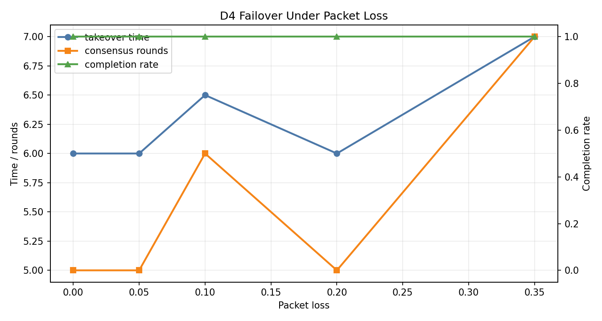

# D4 分布式降级与接管实验报告

## 1. 实验边界

本报告覆盖两类离线降级逻辑：中心节点失效后的被动降级连续性仿真，以及中心节点未失效但局部不确定性升高时的主动降级仲裁规则测试。节点通过内存网络交换粗粒度摘要，不涉及真实无线通信、火控参数、毁伤逻辑、实机飞控、硬件驱动、自动处置或绕过人工授权的流程。

2026-07-15 新增证据严格限定为已完成的 20 个真实 AirSim M5N2 case。终止命令生效前额外完成的 `png_ttc_2v2_seed001` 不纳入本报告 M5N2 聚合；其余 tuned case 未执行，dropout case 完成数为 0，缺失项保持 unavailable。

## 2. 实验目的

D4 验证中心节点异常时的保底策略：

- 使用 `C2Health` 状态机判断 `normal/degraded/suspect/failed`。
- 正常状态由中心节点统一融合、分配和发布计划。
- 中心节点失效后，优先降级到高空系留侦察无人机等二级节点，由二级节点作为区域协调者。
- 二级节点失效或不可用时，才进入完全无中心的 CBBA 风格协商。
- 优先考虑备份节点、二级侦察节点、lease 优先级和覆盖小区。
- 中心恢复后不允许靠单次心跳直接回到 normal，必须经过双轨合并和人工确认。
- CBBA 未收敛时只输出审计信息，不发布有效 assignment。
- 中心节点未失效但 D1/D2/D3/D5 风险升高时，由 `ActiveDegradationArbiter` 判断继续中心计划、请求中心重分配、请求二级节点辅助或安全保持；不转移 plan owner。

## 3. 二级节点降级层级

本阶段假设存在若干高空系留侦察无人机，作为区域二级节点。二级节点具备更稳定的视场和更大的通信覆盖，但在本模块中只作为离线协调与观测摘要源，不代表真实通信、控制或执行链路。

降级顺序为：

```text
中心 C2 正常
  -> 中心失效：二级侦察节点接管局部区域协调
  -> 二级节点失效或不可用：集群代表 / CBBA 完全无中心协商
  -> CBBA 不收敛：保持/继续观测/安全回退的离线状态
```

`ResourceSummary.node_role` 用于区分 `ground_backup`、`secondary_recon`、`cluster_representative` 和 `interceptor`。`coordinator_only=True` 表示该节点只做协调/观测摘要，不作为执行资源参与任务所有权分配。

## 4. 主动降级仲裁

主动降级不是中心被摧毁后的接管，而是中心仍在运行时的保守仲裁。D4 汇总四类输入：

- D1：`TrackUncertaintySummary`，表示定位协方差、位置标准差和量测年龄。
- D2：`AssociationRiskSummary`，表示关联 ambiguity、ID switch、重复航迹和连续性。
- D3：`AssignmentValiditySummary`，表示分配版本、是否 current、计划年龄、cost margin 和资源可行性。
- D5：`TerminalAssociationSummary`，表示末端视觉是否来自被指派 `resource_id`、是否 `locked`、是否多帧 `ambiguous/hold/reacquire`、是否与 assigned `global_track_id` 一致。

仲裁结论：

| 场景 | D4 输出 |
|---|---|
| D5 与分配目标一致，且 D1/D2/D3 风险低 | `continue_center` |
| D1/D2 风险上升但 D5 一致 | `request_secondary_assist`，请求二级节点辅助观测/cue |
| D3 分配 stale/not current 或资源不可行 | `request_center_replan` |
| 仅 cost margin 过低且 D5 一致 | `continue_center` 或请求二级 cue，继续观察 |
| D5 多帧非锁定但无观测 ID mismatch、资源错配、重复锁定或友方冲突 | `continue_center` 或 `request_secondary_assist` |
| D5 持续 global-track mismatch、资源错配或重复锁定 | 中心可用时 `request_center_replan` |
| 中心 failed，二级节点持续 ready | `degrade_to_secondary` |
| 中心 failed 且二级节点不可用/不覆盖 | `degrade_to_distributed` |
| 友方身份冲突 | `hold_for_review` |

该逻辑已由 `tests/test_active_degradation.py` 的规则测试覆盖。当前报告图表仍是被动降级/CBBA 通信退化曲线；主动降级的批量统计曲线应在后续 D6 集成后生成。

### 4.1 2026-07-15 secondary readiness/lease P0 边界验证

本次只运行 D4 Python 模块测试，未启动 AirSim。此前 278/278 验收覆盖 coordinator election、episode readiness DTO、secondary coalition proposal、resource lease 和 D6 metadata，但没有覆盖两个公开 secondary plan helper 对 sustained/source/epoch 的 `None`；此前“所有公开入口都已闭锁”的结论过度，现不再作为证据。新增矩阵对 `build_d7_secondary_handoff()` 与 `build_secondary_takeover_plan_metadata()` 逐项删除 readiness、expected/actual source、plan/required lease epoch、expiry/current time，并覆盖完整 evidence 与同一 active plan 维持正例。统一判定为仅 exact-true readiness、匹配 source、有效 epoch 且 `current_time < expiry` 的二级 plan 可 execute；interceptor peer distributed fallback 不使用二级视觉门。

验收命令为 `PYTHONPATH=research_modules/d4_distributed_fallback python3 -m pytest -q research_modules/d4_distributed_fallback/tests`，阈值为 100% 测试通过且任何不完整 readiness/source/epoch/time evidence 都不得产生 executable secondary owner。结果为 280/280 passed，满足阈值；本次样本为确定性单元测试，无 AirSim seed/episode 样本。剩余限制是未生成新的 AirSim、真实网络或物理任务证据；P1 自主成员形成、reserve 激活、补位/缩编/整盟重组也未实现。

### 4.2 2026-07-15 M5N2 中心负对照

| 项目 | 结果 | D4 解释 |
|---|---:|---|
| 完整 case | 20/20 | baseline/candidate 各 10 seeds |
| active degradation | 0 | 中心 owner 继续执行，无 secondary/distributed 动作 |
| coalition completion | 0/20 | M-to-N 联盟物理闭环未完成 |
| 第二 primary 进入 5 m | 0/20 | 第二 primary 仍是主要物理断点 |
| 第二 primary `collision_stop` | 20/20 | collision object 未记录，不能判定碰撞类型 |
| D4 main-bus mean/P95/max | 5.59/6.70/94.10 ms | 不是当前 control tick 的主要瓶颈 |

该批是负对照，不评价二级接管或完全分布式联盟性能。`collision_stop` 和 5 m 未闭合只进入诊断记录，不自动触发主动降级。D4 动作仍需 D1/D2/D3/D5 的可审计组合证据；本批没有这些降级条件，因此 `active degradation=0` 是预期行为。

验收阈值按证据域分开：中心负对照要求 `active degradation=0` 且 center owner 持续 current，本批满足；M-to-N 物理闭环要求第二 primary 进入 5 m 且 coalition completion 成立，本批 `0/20`，未满足；secondary/distributed 性能因本批未执行而标记 unavailable，不以零值替代。

## 5. 默认被动降级场景

运行命令：

```bash
python3 research_modules/d4_distributed_fallback/scripts/run_failover_simulation.py --nodes 5 --tasks 4 --packet-loss 0.10 --seed 7
```

| 项目 | 设置 |
|---|---:|
| 节点数 | 5 |
| 连续性任务数 | 4 |
| 中心故障时间 | 30.0 s |
| heartbeat warning | 1.0 s |
| suspect 阈值 | 2.0 s |
| failed 阈值 | 4.0 s |
| 网络延迟 | 0.1-0.5 s |
| 默认丢包率 | 10% |
| CBBA round period | 0.5 s |

## 6. 样例结果

| 指标 | 数值 |
|---|---:|
| 接管开始时间 | 34.0 s |
| 接管完成时间 | 36.0 s |
| 接管耗时 | 6.0 s |
| 共识轮数 | 5 |
| 任务完成率 | 1.0 |
| transient conflict count | 5 |
| messages sent | 80 |
| messages delivered | 73 |
| messages dropped | 7 |
| estimated bytes | 22404 |

## 7. 图表与曲线

### 7.1 丢包率对降级接管的影响



图中横轴为丢包率，曲线同时展示接管耗时、共识轮数和任务完成率。它用于判断分布式降级是否在通信质量下降时仍能保守运行。若 CBBA 不收敛，当前实现会输出空的安全保持结果，而不是把不一致分配当成成功。

## 8. 结果解读

- 中心故障后，状态机先进入 `failed`，再启动降级规划。
- 当存在可用二级侦察节点时，`coordination_mode=secondary_node`，二级节点承担局部协调者角色。
- 当二级节点不可用时，系统才切换到 `coordination_mode=distributed_cbba`。
- 备份/二级节点/lease 优先级先于普通资源质量排序，可避免“能力强但不是协调节点”的资源抢占接管权。
- 非收敛 CBBA 结果不再写入有效分配，这可以防止 D6 将失败降级错误统计为完成。
- 中心恢复必须通过 `merge_recovery()` 的双轨校验和人工接受，不允许由一次 heartbeat 自动恢复 normal。
- 主动降级中，D5 与中心/二级分配一致时不会直接切到完全分布式；只有多帧末端不一致或二级节点不可用时才进入更强降级。

## 9. 结论

D4 当前适合作为“中心节点、二级侦察节点、完全分布式”三级被动降级链路，以及“中心未失效但局部证据冲突”的主动降级仲裁框架。secondary resource、plan、owner 和 handoff 已统一执行严格 lease fail-closed，但该模块结果仍不是 AirSim 物理闭环或自主成员补位证明。系统应继续通过 D3/D5/D6 的统一合同传递 `plan_id/version/authorization_state`、`global_track_id`、`risk_factors` 和 `terminal_consistent`。

M5N2 中心负对照已完成 20/20，但 coalition 和第二 primary 5 m 均为 0/20；这说明物理协同闭环仍开放，不说明 D4 fallback 失败。本批未执行二级或完全分布式接管，真实 secondary/distributed 多 seed 继续列为 P1。后续必须补 collision object，并运行同 seeds 的中心失效、中心与二级连续失效和可审计主动风险 paired case。
