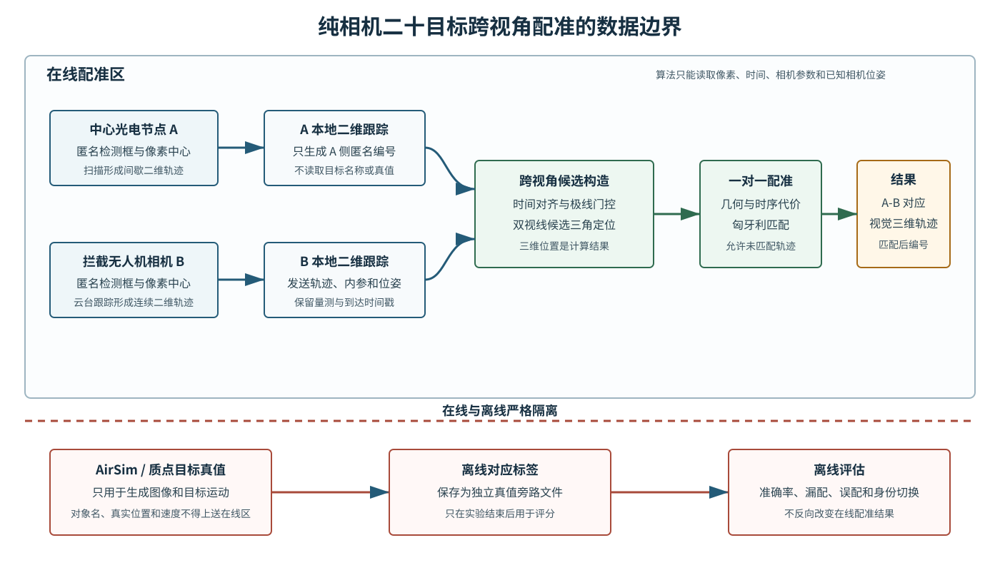
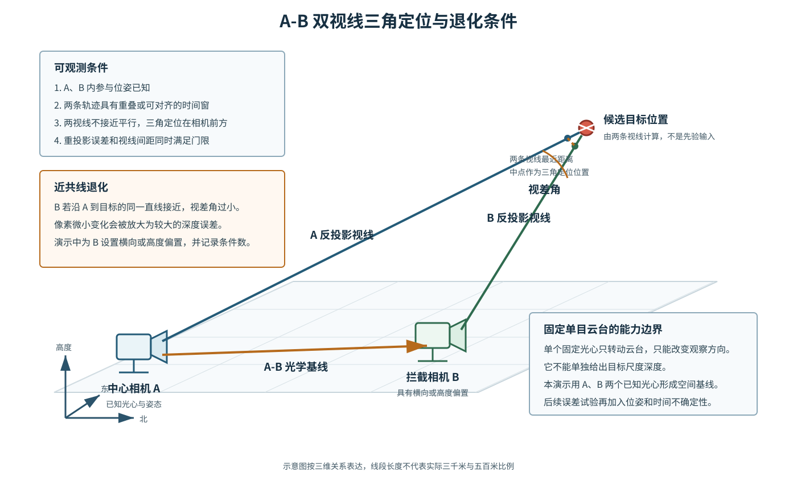
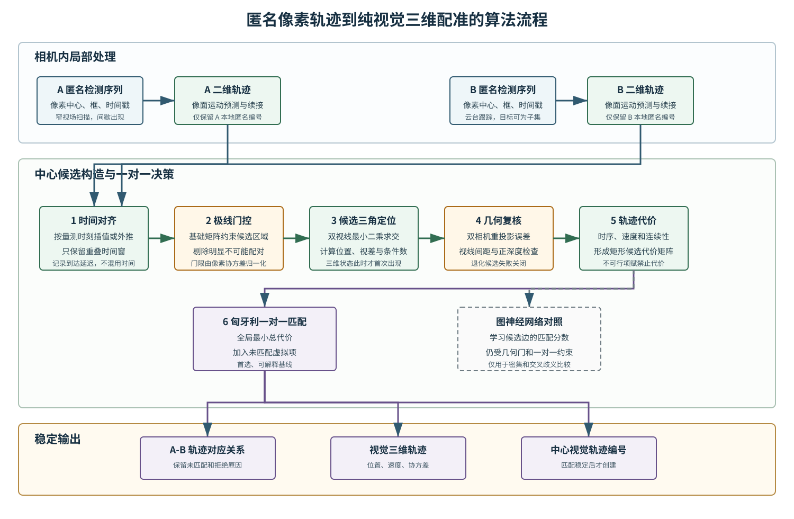
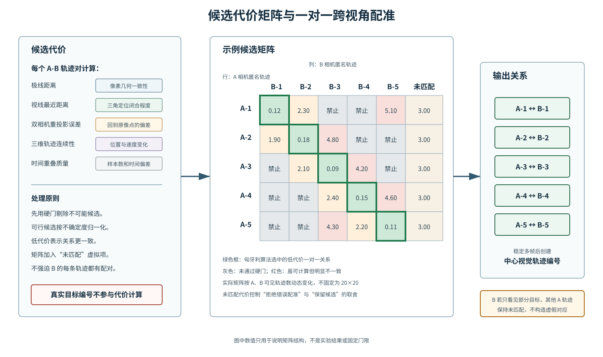
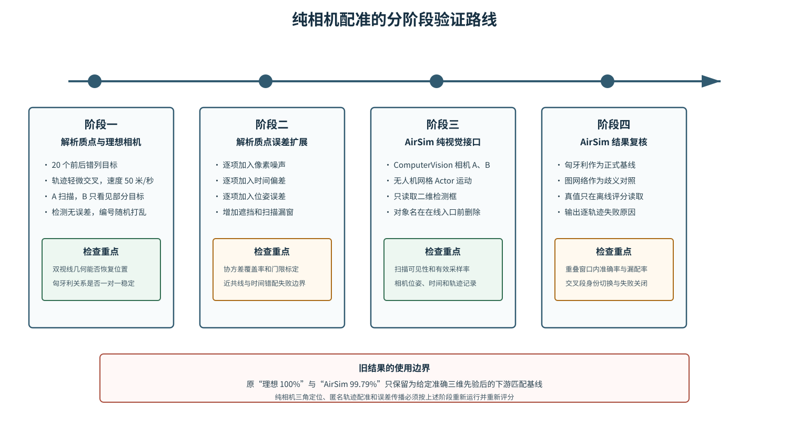

# 纯相机二十目标三角定位与跨视角配准演示方案

**文档状态：待实施方案**

**适用范围：D5 末端视觉关联专项演示**

**编制日期：2026-08-10**

## 1. 结论与纠偏

本专项从中心光电节点 A 和拦截无人机相机 B 的匿名像素检测开始。两端先在各自图像内形成二维轨迹，中心再利用相机内参、已知相机位姿和近同时观测完成时间对齐、极线门控、候选三角定位及一对一匹配。目标三维位置、速度和协方差均由这条视觉链路计算产生，不能作为在线输入预先提供。

本专项不运行、不接入也不借用 D1 多传感器融合和 D2 多目标关联。在线链路不读取雷达量测、GlobalTrack、既有三维航迹、AirSim 对象名、Actor 标识、目标真实位置或真实速度。匹配关系稳定后，中心只在本专项内部建立 center_visual_track_id。该编号用于管理 A、B 已配准的视觉轨迹，不得命名为 global_track_id，也不得改写系统其他模块维护的全局编号。

现有“理想条件 100%”和“AirSim 99.79%”结果使用了准确三维目标先验，只能保留为“已知三维先验后的投影和下游匹配基线”。这两组结果没有验证从匿名像素轨迹出发的三角定位，也没有验证纯视觉跨视角配准。本方案实施后必须重新运行实验并重新评分。

## 2. 任务边界

### 2.1 节点职责

中心光电节点 A 负责 45°扇区扫描、A 侧二维轨迹维护、接收 B 侧轨迹、跨视角候选计算、三角定位、一对一匹配和 center_visual_track_id 管理。A 在配准前不掌握目标三维状态，也不掌握 B 画面中目标的真实身份。

拦截无人机相机 B 使用云台跟踪局部可见目标。B 只形成本机匿名二维轨迹，并向中心发送以下信息：

- 本机相机编号和本地匿名轨迹编号；
- 量测时间戳 measurement_timestamp 和到达时间戳 arrival_timestamp；
- 检测框、像素中心、检测质量和像素协方差；
- 相机内参、畸变参数及其版本；
- 与量测时间对应的相机光心位置、相机姿态和位姿协方差；
- 轨迹有效期、连续性和丢失状态。

B 不计算目标三维位置，不向中心声明目标真实身份，也不生成中心视觉轨迹编号。

### 2.2 在线允许输入

在线配准只允许读取：

1. A、B 的匿名检测和二维轨迹；
2. A、B 相机内参和畸变参数；
3. A、B 在每个量测时刻的已知相机位姿；
4. 双时间戳、像素协方差和位姿协方差；
5. 云台扫描角、焦距状态和图像尺寸；
6. 为保障通信和数据完整性所需的消息序号、版本和有效期。

### 2.3 在线禁止输入

以下信息只能保存在离线真值旁路，不能进入在线候选构造、三角定位、代价计算或匹配：

- AirSim 对象名、Actor ID、分割编号和检测返回的目标名称；
- 目标真实三维位置、真实速度和真实航迹编号；
- 根据目标配置文件直接生成的三维状态；
- D1、D2 的输出或仿制 GlobalTrack；
- 离线评分阶段建立的 A-B 真值对应表。

AirSim 中使用目标网格名称配置检测过滤器属于场景配置。simGetDetections 返回后，在线适配器只保留二维框和时间等允许字段，必须在配准入口前删除对象名、相对真值位姿和三维框。

### 2.4 输出

在线输出包括：

- A 本地轨迹与 B 本地轨迹的一对一对应关系；
- 未匹配、候选不足、几何退化和超时等明确拒绝原因；
- 由匹配轨迹对计算的视觉三维位置、速度和协方差；
- 匹配稳定后创建的 center_visual_track_id；
- 每次匹配使用的时间窗、候选代价、几何残差和算法版本。

离线输出包括准确率、召回率、误配数、漏配数、身份切换数、三角定位误差、协方差覆盖率和失败原因分布。离线结果不能反向修改在线输出。

## 3. 场景和相机条件

### 3.1 场景条件

首轮演示使用 20 个无人机网格目标。目标在三维空间前后错列，航迹存在少量交叉，不排列成规则矩形。目标速度设为 50 米/秒。中心相机 A 到目标群的典型距离约 3 千米，拦截相机 B 到局部目标的典型距离约 500 米。

A 采用窄视场扫描，不要求单帧看全 20 个目标。A 通过扇区扫描累计形成间歇二维轨迹。B 的视场只覆盖目标群的一个子集，实际可见数量由视场、云台指向和目标分布决定。配准和评分只针对 A、B 具有重叠或可可靠对齐时间窗的轨迹，不把未进入 B 视场的目标计为配准错误。

B 不能位于 A 到目标群的近共线方向上。首轮场景应给 B 设置横向或高度偏置，使有效候选的视差角具有可测量幅度。建议将中位视差角控制在 5°至 25°，最低有效视差角暂取 2°作为初始实验门槛。该门槛属于待标定参数，后续按三角定位条件数和定位误差修订。

### 3.2 相机参数

| 参数 | 中心光电节点 A | 拦截无人机相机 B |
| --- | --- | --- |
| 图像分辨率 | 2600×2160 | 1920×1080 |
| 等效焦距 | 600 毫米 | 约 100 毫米 |
| 水平视场 | 0.621° | 约 2.750979° |
| 垂直视场 | 0.516° | 约 1.548°（按 1920×1080 和 2.750979°水平视场推算） |
| 标称采样率 | 约 100 赫兹 | 约 100 赫兹 |
| 工作方式 | 45°扇区扫描 | 云台跟踪 |
| 典型目标距离 | 约 3 千米 | 约 500 米 |

A 的水平瞬时角分辨率约为：

$$
\Delta\theta_A=\frac{0.621^\circ}{2600}\approx 4.17\times10^{-6}\ \text{rad/pixel}
$$

在 3 千米处，一个像素约对应 12.5 毫米横向尺度。B 的水平瞬时角分辨率约为：

$$
\Delta\theta_B=\frac{2.750979^\circ}{1920}\approx 2.50\times10^{-5}\ \text{rad/pixel}
$$

在 500 米处，一个像素也约对应 12.5 毫米横向尺度。因此，两端对同一尺寸目标的理想像素尺度接近。这个关系只说明成像尺度可比，不能直接证明两幅图中的目标身份一致。

### 3.3 扫描采样约束

A 的窄视场扫描必须满足相邻图像覆盖约束。设水平视场为 $\Theta_h$、采样频率为 $f_s$、相邻帧期望重叠比例为 $\rho$、云台角速度为 $\omega$，则应满足：

$$
\frac{\omega}{f_s}\leq (1-\rho)\Theta_h
$$

以 100 赫兹、0.621°水平视场和 30%重叠计算，云台角速度不宜高于约 43.5°/秒；取 50%重叠时不宜高于约 31.1°/秒。机械上能够快速周扫不代表每帧都能连续覆盖。首轮 45°扇区扫描应采用降速、局部驻留或发现后短时凝视，避免相邻帧间出现未成像空带。实际有效采样率和扫描角速度必须写入实验记录。

## 4. 可观测条件

### 4.1 单目深度边界

固定单目相机仅转动云台时，光心位置不变。每个像素只能给出一条从光心出发的空间射线，无法单独确定目标沿射线方向的距离。云台偏航和俯仰改变观察方向，不形成平移基线，因此不能独立恢复尺度深度。

本演示使用 A、B 两个已知光心提供三角定位基线。两路相机在相同或可对齐时刻观测同一目标时，两条反投影视线共同约束空间位置。

### 4.2 基线和视差

当 A、B 两条视线接近平行时，像素微小误差会放大成较大的深度误差。该退化常出现在 B 沿 A 到目标的直线方向接近目标时。演示场景必须给 B 设置横向或高度偏置，并在每次三角定位时记录：

- A-B 基线长度；
- 两条候选视线夹角；
- 最小二乘矩阵条件数；
- 两条视线最近距离；
- 三角定位点在两相机中的正深度状态。

视差角过小、条件数过大或三角定位点位于相机后方时，候选应失败关闭，不得为了获得满配率强制建立关系。

### 4.3 时间可观测性

目标以 50 米/秒运动。10 毫秒时间偏差对应约 0.5 米位置变化，100 毫秒偏差对应约 5 米位置变化。A 扫描形成的轨迹可能间歇出现，B 轨迹相对连续。中心必须使用 measurement_timestamp 对齐观测，arrival_timestamp 只用于统计传输延迟和判断消息是否过期。

两条轨迹没有共同观测时刻时，可在限定时间内按二维运动模型插值或短时外推。外推时间超过门限、扫描间隔过长或运动模型残差过大时，该轨迹对不进入评分分母，也不进入强制匹配。

## 5. 数学模型

### 5.1 坐标和相机模型

设仿真世界坐标系为 $W$，相机 $i\in\{A,B\}$ 的内参矩阵为：

$$
\mathbf K_i=
\begin{bmatrix}
f_{x,i} & s_i & c_{x,i}\\
0 & f_{y,i} & c_{y,i}\\
0 & 0 & 1
\end{bmatrix}
$$

相机光心在世界系中的位置为 $\mathbf C_i$。旋转矩阵 $\mathbf R_{C_iW}$ 将世界坐标向量转换到相机坐标系。世界点 $\mathbf P_W$ 在相机中的坐标为：

$$
\mathbf P_{C_i}=\mathbf R_{C_iW}(\mathbf P_W-\mathbf C_i)
$$

针孔投影为：

$$
\tilde{\mathbf z}_i=
\mathbf K_i\mathbf P_{C_i},\qquad
\mathbf z_i=
\begin{bmatrix}
u_i\\v_i
\end{bmatrix}
=
\begin{bmatrix}
\tilde z_{i,1}/\tilde z_{i,3}\\
\tilde z_{i,2}/\tilde z_{i,3}
\end{bmatrix}
$$

理想质点阶段令镜头畸变为零。AirSim 阶段按配置读取内参；后续误差试验再加入径向和切向畸变以及标定残差。

### 5.2 像素反投影

对齐时刻的齐次像素为 $\tilde{\mathbf x}_i=[u_i,v_i,1]^T$。相机坐标系中的单位视线为：

$$
\mathbf d_{C_i}=
\frac{\mathbf K_i^{-1}\tilde{\mathbf x}_i}
{\|\mathbf K_i^{-1}\tilde{\mathbf x}_i\|}
$$

世界坐标系中的单位视线为：

$$
\mathbf d_{W_i}=\mathbf R_{C_iW}^{T}\mathbf d_{C_i}
$$

目标只知道位于射线

$$
\mathbf L_i(\lambda_i)=\mathbf C_i+\lambda_i\mathbf d_{W_i},\quad \lambda_i>0
$$

上。单条射线没有尺度深度。

### 5.3 时间对齐

每路相机先独立维护二维轨迹状态：

$$
\mathbf y_i(t)=[u_i,v_i,\dot u_i,\dot v_i]^T
$$

在理想阶段使用常像面速度插值。对 A 轨迹 $a$ 和 B 轨迹 $b$，只在共同时间区间

$$
\mathcal T_{ab}=\mathcal T_a\cap\mathcal T_b
$$

或允许的短时外推区间内构造候选。对齐时间 $t_k$ 由 measurement_timestamp 确定。若采用线性插值：

$$
\hat u_i(t_k)=u_i(t_0)+\dot u_i(t_0)(t_k-t_0)
$$

垂直方向同理。插值和外推必须传播像素状态协方差，且外推协方差随时间增长。

### 5.4 基础矩阵和极线门控

设从 A 相机坐标到 B 相机坐标的相对旋转和平移为：

$$
\mathbf R_{BA}=\mathbf R_{C_BW}\mathbf R_{C_AW}^{T}
$$

$$
\mathbf t_{BA}=\mathbf R_{C_BW}(\mathbf C_A-\mathbf C_B)
$$

本质矩阵和基础矩阵分别为：

$$
\mathbf E=[\mathbf t_{BA}]_\times\mathbf R_{BA}
$$

$$
\mathbf F=\mathbf K_B^{-T}\mathbf E\mathbf K_A^{-1}
$$

同一空间点的理想像素满足：

$$
\tilde{\mathbf x}_B^T\mathbf F\tilde{\mathbf x}_A=0
$$

A 像点在 B 图像中的极线为 $\mathbf l_B=\mathbf F\tilde{\mathbf x}_A$。候选门控使用对称极线距离或 Sampson 距离。Sampson 距离写为：

$$
d_{\mathrm{epi}}^2=
\frac{(\tilde{\mathbf x}_B^T\mathbf F\tilde{\mathbf x}_A)^2}
{(\mathbf F\tilde{\mathbf x}_A)_1^2+
(\mathbf F\tilde{\mathbf x}_A)_2^2+
(\mathbf F^T\tilde{\mathbf x}_B)_1^2+
(\mathbf F^T\tilde{\mathbf x}_B)_2^2}
$$

极线门控用于缩小候选集合。它不能单独确认身份，因为密集目标或交叉航迹可能同时落在相近极线区域内。

### 5.5 双视线最小二乘三角定位

对通过时间和极线门的候选轨迹对，求两条空间射线的最近点。令：

$$
\mathbf M=[\mathbf d_{W_A},-\mathbf d_{W_B}]
$$

$$
\begin{bmatrix}
\hat\lambda_A\\
\hat\lambda_B
\end{bmatrix}
=
(\mathbf M^T\mathbf M)^{-1}\mathbf M^T(\mathbf C_B-\mathbf C_A)
$$

两条射线上的最近点为：

$$
\mathbf Q_A=\mathbf C_A+\hat\lambda_A\mathbf d_{W_A}
$$

$$
\mathbf Q_B=\mathbf C_B+\hat\lambda_B\mathbf d_{W_B}
$$

候选三维位置取最近点中点：

$$
\hat{\mathbf P}_W=\frac{\mathbf Q_A+\mathbf Q_B}{2}
$$

视线闭合残差为：

$$
d_{\mathrm{ray}}=\|\mathbf Q_A-\mathbf Q_B\|
$$

同时计算视差角：

$$
\theta_{\mathrm{parallax}}=
\arccos(\mathbf d_{W_A}^{T}\mathbf d_{W_B})
$$

当 $\hat\lambda_A\leq0$、$\hat\lambda_B\leq0$、视差角过小或矩阵条件数过大时，该候选无效。

### 5.6 重投影误差

将候选三维位置重新投影到 A、B 图像，得到 $\hat{\mathbf z}_A$ 和 $\hat{\mathbf z}_B$。双视图重投影误差为：

$$
e_{\mathrm{reproj}}^2=
(\mathbf z_A-\hat{\mathbf z}_A)^T\mathbf R_A^{-1}
(\mathbf z_A-\hat{\mathbf z}_A)
+
(\mathbf z_B-\hat{\mathbf z}_B)^T\mathbf R_B^{-1}
(\mathbf z_B-\hat{\mathbf z}_B)
$$

$\mathbf R_A$ 和 $\mathbf R_B$ 为像素量测协方差。理想无误差阶段可同时报告未归一化像素误差和数值条件数。加入误差后使用归一化误差进行门控。

### 5.7 三维速度和轨迹一致性

对同一候选轨迹对在多个对齐时刻得到的三维点序列 $\hat{\mathbf P}(t_k)$，采用加权最小二乘拟合：

$$
\hat{\mathbf P}(t)=\mathbf P_0+\mathbf V(t-t_0)
$$

候选时序残差为：

$$
e_{\mathrm{motion}}=
\sum_k
(\hat{\mathbf P}(t_k)-\mathbf P_0-\mathbf V(t_k-t_0))^T
\mathbf P_k^{-1}
(\hat{\mathbf P}(t_k)-\mathbf P_0-\mathbf V(t_k-t_0))
$$

轨迹轻微交叉时，单帧几何可能出现多个近似候选。连续多时刻的三维速度、方向和加速度残差用于区分这些候选。首轮不把真实 50 米/秒速度直接作为身份输入，只使用宽松的物理可行范围排除明显错误解。

### 5.8 协方差传播

令三角定位函数为：

$$
\hat{\mathbf P}=g(u_A,v_A,u_B,v_B,\boldsymbol\xi_A,\boldsymbol\xi_B)
$$

$\boldsymbol\xi_A$ 和 $\boldsymbol\xi_B$ 表示相机位姿扰动。对像素和位姿进行一阶线性化：

$$
\mathbf P_{\hat P}\approx
\mathbf J_z\mathbf R_z\mathbf J_z^T+
\mathbf J_\xi\mathbf P_\xi\mathbf J_\xi^T
$$

其中 $\mathbf J_z$ 和 $\mathbf J_\xi$ 为数值或解析雅可比矩阵。速度协方差可由相邻位置协方差和时间不确定性传播：

$$
\mathbf P_V\approx
\frac{\mathbf P_{\hat P,k}+\mathbf P_{\hat P,k-1}}
{(t_k-t_{k-1})^2}
$$

理想无误差演示主要验证算法顺序和数值闭合，不据此宣称协方差已经标定。协方差覆盖率必须在像素、时间和位姿误差注入后单独验证。

## 6. 配准算法

### 6.1 候选生成

对每条 A 轨迹和 B 轨迹，按以下顺序构造候选：

1. 检查轨迹版本、时间戳和相机参数版本；
2. 求重叠时间窗，剔除无共同时间或外推过长的组合；
3. 将两条二维轨迹插值到统一量测时刻；
4. 计算多时刻极线距离，剔除持续不满足极线约束的组合；
5. 对剩余组合逐时刻执行双视线三角定位；
6. 检查正深度、视差角、条件数、视线闭合残差和重投影误差；
7. 对三维点序列拟合位置和速度，计算时序连续性；
8. 汇总为轨迹对代价。

这一路径先建立候选，再从候选中求三维位置。它不会先读取三维位置再投影到像面。

### 6.2 候选代价

对 A 轨迹 $a_i$ 和 B 轨迹 $b_j$，定义归一化代价：

$$
C_{ij}=
w_e\bar d_{\mathrm{epi}}+
w_r\bar d_{\mathrm{ray}}+
w_p\bar e_{\mathrm{reproj}}+
w_m\bar e_{\mathrm{motion}}+
w_t\bar e_{\mathrm{time}}+
w_q\bar e_{\mathrm{condition}}
$$

各项含义如下：

- $\bar d_{\mathrm{epi}}$：多时刻归一化极线距离；
- $\bar d_{\mathrm{ray}}$：两视线最近距离；
- $\bar e_{\mathrm{reproj}}$：双相机重投影误差；
- $\bar e_{\mathrm{motion}}$：三维位置和速度连续性残差；
- $\bar e_{\mathrm{time}}$：时间重叠不足、插值距离和外推时长惩罚；
- $\bar e_{\mathrm{condition}}$：小视差和三角定位病态程度惩罚。

未通过硬门的候选设置为禁止代价。各权重不在方案阶段写死，先在无误差质点场景验证量纲和排序，再通过单因素误差试验标定。

## 7. 匈牙利一对一匹配基线

设二元变量 $x_{ij}\in\{0,1\}$ 表示 A 轨迹 $a_i$ 是否与 B 轨迹 $b_j$ 配对。求解：

$$
\min_{\mathbf X}\sum_{i,j} C_{ij}x_{ij}
$$

约束为：

$$
\sum_jx_{ij}\leq1,\qquad
\sum_ix_{ij}\leq1
$$

矩阵按当前时间窗内 A、B 的轨迹数量动态生成，不固定为 20×20。B 只能看到部分目标时，A 中其余轨迹保持未匹配。实现时为行列增加“未匹配”虚拟项和可解释的拒绝代价，避免算法为了填满矩阵而产生错误对应。

匈牙利算法输出当前窗口的最小总代价一对一关系。关系还需通过稳定窗口确认。建议首轮要求至少三个有效对齐时刻，或连续两个 A 扫描驻留段给出同一关系，才创建 center_visual_track_id。稳定窗口长度属于实验参数，报告中必须给出其对漏配和误配的影响。

## 8. 图神经网络对照

图神经网络只作为目标密集、轨迹交叉或几何代价相近时的对照路径。它不替代相机几何约束，也不直接从真值身份生成配准结果。

### 8.1 图结构

构造 A、B 两侧轨迹组成的二部图：

- 节点：A 或 B 的一个匿名二维轨迹片段；
- 节点输入：归一化像素轨迹、像面速度、检测框尺度变化、时间跨度、连续性、相机编号和可见性质量；
- 候选边：只连接通过时间门和极线门的 A-B 轨迹对；
- 边输入：多时刻极线距离、视线闭合残差、重投影误差、视差角、三角定位条件数、三维运动残差和时间重叠质量；
- 输出：每条候选边的匹配概率或代价修正量。

图网络输出后仍执行几何硬门和一对一离散匹配。建议采用“规则几何代价加学习修正”的形式：

$$
C_{ij}^{\mathrm{final}}=
C_{ij}^{\mathrm{geometry}}+
\alpha\Delta C_{ij}^{\mathrm{GNN}}
$$

$\alpha$ 从零开始逐步增加。若学习模型失效、置信度不足或输出违反几何硬门，系统退回匈牙利几何基线。

### 8.2 训练和评分边界

质点和 AirSim 的 Actor 真值可以在离线训练数据生成阶段提供候选边标签。训练完成后的在线模型只读取允许的节点和边特征。训练集、验证集和测试集按场景与随机种子分离，交叉航迹、不同视场覆盖和不同基线几何应单独分层统计。

首轮纯相机演示先完成匈牙利基线。只有在密集交叉区间出现可重复歧义，且图网络能够降低身份切换而不显著增加延迟时，才进入正式对照。

## 9. 数据合同和真值隔离

### 9.1 在线轨迹消息

每条 A 或 B 本地二维轨迹至少包含：

| 字段 | 含义 | 使用限制 |
| --- | --- | --- |
| camera_id | 相机实例编号 | 只标识传感器 |
| local_visual_track_id | 相机内匿名轨迹编号 | 只在本相机内有效 |
| measurement_timestamp | 图像实际量测时刻 | 用于时间对齐 |
| arrival_timestamp | 消息到达中心的时刻 | 用于延迟和过期判断 |
| bbox_xyxy | 二维检测框 | 不附带对象名称 |
| pixel_center | 检测框中心或跟踪中心 | 用于几何计算 |
| pixel_covariance | 像素中心不确定度 | 用于归一化门控 |
| camera_intrinsics | 内参和畸变版本 | 必须与图像一致 |
| camera_pose | 量测时刻光心位置和姿态 | 必须带时间戳 |
| pose_covariance | 位姿不确定度 | 理想阶段可设为零并明确标注 |
| track_quality | 连续帧数、丢失和外推状态 | 用于稳定窗口 |

在线消息中不得出现 global_track_id、Actor ID、对象名、真实目标位置或真实速度。

### 9.2 中心视觉轨迹

跨视角关系稳定后，中心创建 center_visual_track_id，并记录：

- 对应的 A 本地轨迹编号和 B 本地轨迹编号；
- 创建时间、最近更新时间和有效期；
- 三角定位位置、速度和协方差；
- 当前匹配代价及各分项残差；
- 匹配状态：候选、稳定、歧义、失配等待或终止；
- 关系版本和生成算法版本。

center_visual_track_id 是本专项内部编号。它不声明已经与中心全局航迹完成身份绑定。

### 9.3 离线真值旁路

真值旁路保存目标 Actor、A 检测、B 检测和真实轨迹之间的对应关系。它应使用独立文件和独立读取入口。在线程序运行期间禁止加载该文件。实验结束后，评分程序读取在线结果与真值旁路，计算指标。

至少记录以下审计量：

- online_truth_access_count；
- online_actor_name_count；
- online_global_track_id_count；
- truth_sidecar_read_phase；
- 每个在线输出的输入字段来源。

前三项验收值必须为零。

## 10. 质点演示设计

### 10.1 目标

质点阶段使用解析相机和确定性运动，先验证纯相机算法顺序、二维轨迹匿名化、三角定位数值闭合和一对一配准。首轮不加入探测误差、位姿误差、误识别和漏检。真值只负责生成像素观测和离线评分。

### 10.2 关键步骤

| 步骤 | 输入 | 处理 | 在线输出 | 记录文件 | 验收指标 |
| --- | --- | --- | --- | --- | --- |
| 场景生成 | 随机种子、20目标数量、速度和空间范围 | 生成前后错列、略有交叉的三维质点轨迹 | 无 | scenario_config.json、truth_sidecar.jsonl | 20目标；速度50米/秒；目标不形成规则网格 |
| 相机运动 | A/B位置姿态、A扫描和B云台规则 | 生成每个量测时刻的相机内外参 | 相机状态流 | camera_states.csv | 位姿时间连续；B具备横向或高度偏置 |
| 图像观测 | 真值位置仅进入投影器 | 按视场裁剪并输出匿名像素框；每帧随机打乱顺序 | A/B匿名检测 | a_detections.csv、b_detections.csv | 在线字段无真值编号；视场外目标不输出 |
| 相机内跟踪 | 本机匿名检测 | 常像面速度预测加本机一对一关联 | A/B匿名二维轨迹 | a_local_tracks.csv、b_local_tracks.csv | 交叉段记录连续性；不读取真值身份 |
| 时间对齐 | A/B二维轨迹和双时间戳 | 求重叠窗口、插值和受限外推 | 对齐轨迹样本 | aligned_track_samples.csv | 只保留可观测窗口；超窗明确拒绝 |
| 极线门控 | 对齐像素、内参和位姿 | 计算基础矩阵和多时刻极线距离 | 候选轨迹对 | epipolar_candidates.csv | 真配对保留；明显错误配对被剔除 |
| 三角定位 | 候选轨迹对的两条视线 | 最小二乘求交、正深度和条件数检查 | 候选三维点序列 | triangulation_candidates.csv | 理想重投影误差接近数值精度；退化几何拒绝 |
| 轨迹代价 | 候选三维点序列 | 拟合位置速度并计算时序残差 | 矩形代价矩阵 | association_cost_matrix.csv | 正确候选代价排序稳定 |
| 一对一配准 | 代价矩阵和未匹配代价 | 匈牙利求解和稳定窗口确认 | A-B关系、视觉三维轨迹 | association_matches.csv、center_visual_tracks.csv | 只在稳定后创建中心视觉编号 |
| 离线评分 | 在线结果和独立真值旁路 | 实验结束后比对 | 指标与图表 | metrics.json、report.md | 真值在线访问为0；指标分母只含可评分窗口 |

### 10.3 首轮验收门槛

以下数值为计划验收门槛，当前尚未验证：

- 在线真值访问、对象名读取和 global_track_id 使用次数均为 0；
- 具有有效视差和重叠时间窗的真配对保留率为 100%；
- 理想无误差条件下，三角定位重投影误差不高于 $10^{-6}$ 像素，位置误差不高于 $10^{-3}$ 米；
- 可评分重叠窗口内的 A-B 配准准确率为 100%，身份切换数为 0；
- B 视场外目标保持未匹配，强制错误配准数为 0；
- 小视差、负深度和超时外推候选的失败关闭率为 100%；
- 所有指标同时报告可用样本数和不可评分原因。

首轮通过后再逐项加入像素噪声、时间偏差、位姿误差、遮挡、漏检和虚警。每次只改变一种误差源，避免无法判断性能下降原因。

## 11. AirSim 演示设计

### 11.1 运行方式

AirSim 阶段使用 ComputerVision 模式。A 和 B 均为无飞行动力学的相机节点，目标为移动无人机网格 Actor。目标按照质点阶段相同的三维初始几何和 50 米/秒运动规律更新。A 执行 45°扇区扫描，B 云台指向局部目标群。

主调度负责启动 Blocks、应用 settings、重置场景、驱动 Actor、采集日志和关闭 AirSim。D5 在线适配器只接收允许字段。simGetDetections 返回的对象名、相对真实位姿和三维框必须在适配器边界删除。

相机标称采样率约为 100 赫兹。实际 AirSim 调用频率可能受渲染帧率和接口延迟限制，因此每帧必须记录量测时间、到达时间和实际采样间隔。报告使用实测频率，不以配置值代替。

### 11.2 关键步骤

| 步骤 | 输入 | 处理 | 在线输出 | 记录文件 | 验收指标 |
| --- | --- | --- | --- | --- | --- |
| 配置冻结 | A/B相机参数、20目标几何、扫描规则 | 生成并保存本次 settings 摘要和场景版本 | 配置版本 | settings_snapshot.json、scenario_config.json | 相机参数与文档一致；随机种子可复现 |
| Actor运动 | 目标初始位姿和50米/秒速度 | main按仿真时钟更新目标网格 | 无在线配准输入 | actor_truth_sidecar.jsonl | 真值文件独立；在线程序不加载 |
| 相机位姿 | ComputerVision节点和云台姿态 | 读取量测时刻相机光心与姿态 | A/B位姿流 | camera_states.csv、gimbal_commands.csv | 位姿与图像时间对应；扫描角无跳变 |
| 二维检测 | simGetDetections结果 | 只提取二维框；删除对象名和三维真值字段 | A/B匿名检测 | a_detections_anonymous.csv、b_detections_anonymous.csv | 禁止字段计数为0；保存实际帧率 |
| 本地二维跟踪 | 每相机匿名检测 | 像面预测、一对一关联和短时续接 | A/B匿名二维轨迹 | a_local_tracks.csv、b_local_tracks.csv | 记录扫描再发现和交叉段中断 |
| 时间与极线候选 | 轨迹、内参、位姿和双时间戳 | 时间对齐、基础矩阵和极线门控 | A-B候选集合 | overlap_windows.csv、epipolar_candidates.csv | 只处理重叠窗口；超窗拒绝原因完整 |
| 三角定位与代价 | 候选轨迹对 | 双视线求交、重投影和轨迹连续性 | 三维候选及代价矩阵 | triangulation_candidates.csv、association_cost_matrix.csv | 条件数、视差角和残差全部可审计 |
| 稳定配准 | 候选代价矩阵 | 匈牙利求解、未匹配处理和稳定窗口 | A-B关系及中心视觉轨迹 | association_matches.csv、center_visual_tracks.csv | 不强配视场外目标；关系版本连续 |
| 离线评分 | 在线输出和真值旁路 | episode结束后单独读取真值 | 评分结果 | metrics.json、failure_reasons.csv、report.md | 真值隔离通过；分母和覆盖率分开报告 |

### 11.3 AirSim 阶段验收门槛

以下为首轮待验证门槛：

- online_truth_access_count、online_actor_name_count 和 online_global_track_id_count 均为 0；
- A 扫描和 B 跟踪的实际采样率、帧间隔和可见时间窗完整记录；
- 对满足时间、视差和视场条件的轨迹对，有效三角定位比例不低于 95%；
- 可评分重叠窗口内配准准确率不低于 99%，配准召回率不低于 95%；
- 连续可见区间身份切换数为 0；
- 不可观测目标、退化几何和超时轨迹的强制配准数为 0；
- 每条拒绝记录具有明确原因，指标同时报告可用性和样本数。

本阶段不主动注入额外检测噪声；AirSim 渲染和 simGetDetections 自身造成的漏检、框抖动仍作为实测结果记录。后续主动加入检测噪声、误识别和位姿误差时应另设分层门槛，不能沿用本阶段结论。

## 12. 输出图表与指标

每个关键步骤至少输出一幅结果图或可审计表格：

1. 三维场景图：A、B、20个目标、目标轨迹、基线和视差分布；
2. A 扫描时间线：扫描角、各目标进入视场时刻和驻留帧数；
3. B 云台时间线：指向角、局部可见目标数和轨迹连续性；
4. A/B 匿名像素轨迹图：编号独立、轨迹前后错列和交叉段；
5. 极线候选图：A 像点在 B 图像中的极线及保留候选；
6. 双视线三角定位图：候选射线、最近点间距、视差角和三维结果；
7. 候选代价矩阵热图：禁止项、未匹配项和匈牙利选择；
8. 配准关系图：A 轨迹到 B 轨迹的一对一连线；
9. 三角定位误差曲线：位置、速度、重投影和协方差覆盖率；
10. 失败原因分布：无重叠时间窗、小视差、负深度、超门、歧义和超时；
11. 交叉区间局部放大图：比较匈牙利基线与图神经网络对照；
12. 数据隔离审计图：在线读取字段和离线真值读取阶段。

评分至少包含：

- 可观测轨迹对数量和占总目标数比例；
- 极线候选保留率与候选压缩比；
- 有效三角定位率；
- 三维位置和速度误差；
- 重投影误差及分位数；
- 匹配准确率、召回率和未匹配率；
- 连续可见区间身份切换数；
- 轨迹中断、重发现和错误续接数；
- 单帧、单窗口和整段处理延迟；
- 各失败原因数量和比例；
- 真值隔离违规计数。

只对同时满足视场、时间和几何可观测条件的样本计算纯配准准确率。覆盖率单独报告，避免把“没有看到”与“看到后配错”混为一个指标。

## 13. 验收门槛

### 13.1 合同验收

- 在线接口中不出现对象名、Actor ID、真实位置、真实速度和 global_track_id；
- A、B 最初输出均为匿名像素检测和二维轨迹；
- B 消息保留 measurement_timestamp、arrival_timestamp、相机参数、位姿和协方差；
- center_visual_track_id 只在稳定匹配后创建；
- 离线真值文件与在线记录分离，评分程序只在 episode 结束后读取。

### 13.2 几何验收

- 基础矩阵由 A、B 同一时刻的相机内外参计算；
- 每个三角定位结果保存视差角、条件数、正深度、视线间距和重投影误差；
- 近共线候选失败关闭；
- 位置、速度和协方差来源能够追溯到对应的 A/B 像素样本。

### 13.3 配准验收

- 候选矩阵支持 A、B 轨迹数量不相等；
- 匈牙利匹配包含未匹配选项；
- B 看不到的目标不会被强制绑定；
- 交叉区间单独统计身份切换；
- 图神经网络输出不能越过几何硬门。

### 13.4 报告验收

- 明确区分理想质点、AirSim接口验证、误差注入和离线评分；
- 旧 100% 和 99.79% 结果只标为准确三维先验下的下游基线；
- 新实验给出随机种子、场景参数、可用样本数、门槛、结果和剩余限制；
- 不把仿真结果写成设备性能或实飞能力。

## 14. 风险与处置

### 14.1 A-B 近共线

现象是视差角小、条件数大、深度对像素扰动敏感。场景设计时给 B 设置横向或高度偏置；运行时用视差角和条件数门控。无法满足条件时只保留二维轨迹，不输出虚假三维位置。

### 14.2 A 扫描采样不足

窄视场高速扫过会使目标只出现一至两帧，难以形成稳定二维轨迹。扫描速度按相邻帧重叠约束设置；发现目标后短时驻留；记录实际帧率和每次过扫的有效帧数。不能通过读取 Actor 名称弥补轨迹中断。

### 14.3 时间错配

50 米/秒目标对时间误差敏感。A、B 使用量测时间对齐，到达时间只参与延迟管理。外推时间超过门限时拒绝候选。后续单独注入时钟偏差，评估三角定位误差随偏差增长的关系。

### 14.4 位姿误差

相机位置、机体姿态和云台角误差会直接改变空间视线。理想阶段使用已知精确位姿；误差阶段逐项加入位置、姿态和云台编码误差，传播到三维协方差。位姿质量不足时提高匹配不确定度或停止三角定位。

### 14.5 交叉轨迹歧义

目标像素轨迹交叉时，单帧最近邻容易换号。采用多时刻极线残差、三维速度连续性和稳定窗口。图神经网络只在几何候选内部学习边分数，并保留匈牙利一对一约束。

### 14.6 真值泄漏

simGetDetections 会返回对象名称，Actor 更新程序也掌握真实位置。在线适配器采用允许字段清单，测试检查禁止字段不存在；真值旁路使用独立文件和独立进程阶段。任何在线真值读取都判定本轮实验无效。

### 14.7 B 只见目标子集

候选矩阵必须支持矩形规模和未匹配项。评分分开报告 B 视场覆盖率与已覆盖目标的配准准确率。算法不以“20个目标全部配齐”为目标。

## 15. 实施步骤和交付物

### 15.1 实施步骤

1. 冻结纯相机数据合同，增加禁止字段审计，明确 center_visual_track_id 的专项命名空间。
2. 建立 20 目标不规则交叉质点场景，并实现 A 扫描、B 云台和匿名像素观测生成。
3. 完成 A、B 相机内二维跟踪，确保每路编号独立且不读取真值。
4. 完成时间对齐、基础矩阵、极线门控和候选双视线三角定位。
5. 完成重投影、三维运动残差、协方差传播和候选代价矩阵。
6. 以匈牙利算法完成一对一基线，加入未匹配项和稳定窗口。
7. 运行理想无误差质点实验，输出逐步图表和离线真值审计。
8. 分别注入像素、时间和位姿误差，标定门限和协方差覆盖率。
9. 由 main 配置 AirSim ComputerVision 场景，按相同合同接入二维检测和已知相机位姿。
10. 重新运行 AirSim 纯相机实验，形成独立结果，不沿用旧 99.79%评分。
11. 若交叉区间仍有稳定歧义，再增加图神经网络离线对照。

### 15.2 交付物

- 纯相机专项场景配置和相机参数快照；
- A、B 匿名检测与本地二维轨迹记录；
- 时间重叠窗口和极线候选记录；
- 候选三角定位、协方差和重投影记录；
- 匈牙利代价矩阵、匹配关系和拒绝原因；
- center_visual_track_id 生命周期记录；
- 独立真值旁路和真值隔离审计；
- 质点理想、误差注入和 AirSim 三类实验报告；
- 关键步骤结果图、指标 JSON、逐轨迹 CSV 和中文结论；
- 图神经网络对照结果，仅在满足启动条件时生成。

## 16. 当前状态说明

本文档只给出纠偏后的实施方案，没有执行新的质点或 AirSim 实验，也没有声明纯相机三角定位已经完成。现有代码和报告中的准确三维先验下游基线可以用于比较投影和匹配上限，但不能作为本方案验收证据。

本方案没有改变 D5 当前默认在线能力、跨模块合同、GAP 状态或 AirSim 已有运行结果。后续进入代码实施时，应由 D5 所有者按本方案建立独立演示入口，并由 main 负责 AirSim 运行编排和最终实验汇总。
