# D5 多相机关联报告

## 1. 结论与范围

第五研究模块（D5）已经实现以中心全局航迹对象（GlobalTrack）为锚点的末端多相机视觉关联基线。处理链按每路相机的量测时刻预测三维航迹，将北东地坐标系（North-East-Down，NED）中的位置和协方差投影到像素平面，再通过马氏距离门、相机内一对一匹配和时序稳定窗口形成跨视角支持。中心全局航迹标识 `global_track_id` 在整个过程中保持只读；本地检测编号、跟踪编号和离线真值标签均不能替代或改写该标识。

2026-07-16 的正式 AirSim 计算机视觉（ComputerVision）专项使用 5 路局部相机、1 路宽视场侦察相机和 5 个移动目标。两个 episode 均运行 12.0 s，共 49 帧，seed 为 7。AirSim detect 几何基线在这一次固定场景中通过全部专项门限。第八版“只看一次”目标检测器（YOLOv8）与 ByteTrack 组合的离线检测召回为 0.622，侦察全覆盖帧率为 0.878，本地身份切换计数（Identity Switch，IDSW）为 25，未通过相应门限，因此仍属于可选研究后端。

上述数字来自同一批正式产物。它们描述单个 seed、固定相机布局、固定目标运动和既定尺度下的结果，不能解释为多场景统计性能。专项没有在线运行第一研究模块（D1）和第二研究模块（D2），中心航迹由编排侧根据 actor 真值运动学生成测试夹具；视觉候选代价、匈牙利选择和稳定窗口未读取真值身份。报告评价范围止于 D5 视觉关联，不包含导引控制、拦截距离、实飞能力或物理拦截效果。

## 2. 体系架构

### 2.1 信息流

D5 位于中心航迹、版本化任务分配、主动降级和末端视觉导引之间。上游给出中心已经建立的目标状态与资源—目标绑定；D5 只判断当前本地视觉证据是否支持这个既有绑定。输出进入第四研究模块（D4）的主动降级判断和第七研究模块（D7）的视觉导引切换门，但 D5 自身不分配目标、不选择导引律，也不发送控制量。

图 1 将这条职责链分为三层。左侧是中心状态和分配合同，中间是按相机处理的视觉关联，右侧是仍由 D4、D7 独立执行的运行决策。图中的两条右向分支说明，同一份视觉一致性证据可以被不同决策者消费，却不会把两个决策合并成一个隐式开关。

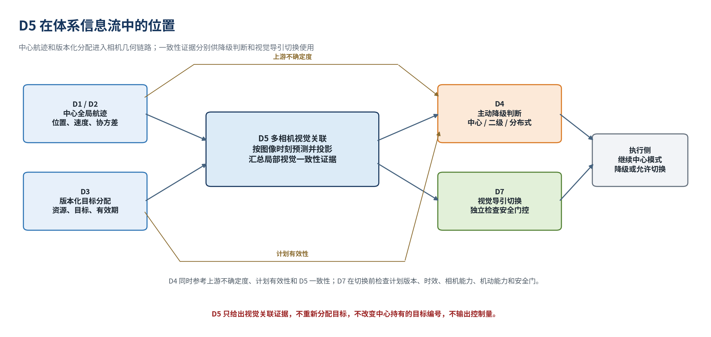

图 1 的关键判断是视觉关联成立仍不足以直接授权末端交接。D7 还需核对计划版本、证据时效、相机能力、机动能力和安全条件；D4 则综合上游不确定度、计划有效性与视觉一致性决定是否继续中心模式或进入受控降级。该分工把视觉误配风险限制在证据层，避免局部相机获得中心身份或控制权限。

### 2.2 只读身份

`GlobalTrack` 中的 `global_track_id` 由中心创建和维护。D5 使用位置、速度、三维位置协方差、状态时间与航迹版本完成投影和审计，输出时仅复制输入标识。即使一个本地框在像素上更接近另一个全局目标，末端重获取也只能围绕原分配目标搜索，不能在本地完成换绑。

本地多目标跟踪编号只在资源和相机命名空间内有效。示例键 `INT-01/D5_Primary_1:0:track-1` 同时包含资源、相机和本地编号。另一相机也产生 `track-1` 时，两条轨迹仍互不相同。这样的命名空间隔离是跨视角汇总的前提，也使本地 IDSW 不会直接传播成中心身份改写。

离线真值与在线关联采用单向隔离。actor 名称、`object_id` 和真值目标编号可用于生成本专项的中心输入夹具，也可在运行结束后计算召回、错配和 IDSW；这些字段不能进入像素门、候选排序、匈牙利选择或稳定窗口。正式结果中两个 episode 的在线真值身份使用计数和中心标识改写计数均为 0。

### 2.3 处理主线

一帧多相机数据到达后，各相机先独立完成时间对齐和几何投影。有效投影与当前实测框形成候选边，门外边被拒绝；门内边进入相机内唯一匹配。即时选择只代表当前帧候选，满足稳定窗口后才进入跨视角稳定汇总。

图 2 把几何、代价和时序状态连成一条可审计链路。每个箭头都对应可记录的中间量，包括预测像素、像素协方差、马氏距离、候选代价、选择结果和稳定计数。发生错误时可以区分投影无效、门控拒绝、一对一竞争失败与稳定窗口不足。

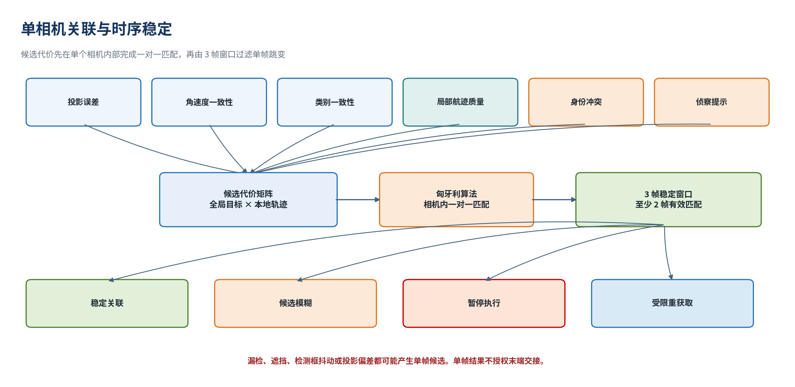

图 2 中“候选”与“稳定注册”属于批量几何注册层；稳定关联（`locked`）、候选模糊（`ambiguous`）、暂停执行（`hold`）和受限重获取（`reacquire`）属于末端决策层。两组状态服务于不同阶段，不能把一次匈牙利选择直接解释为稳定锁定。

## 3. 数据与相机

### 3.1 输入输出合同

中心航迹、相机批次、本地视觉轨迹和末端关联构成四个主要合同。它们分别约束中心状态所有权、相机作用域、检测与跟踪证据，以及下游可消费的保守判断。

| 对象 | 核心内容 | D5 使用方式 |
| --- | --- | --- |
| 中心全局航迹 `GlobalTrack` | `global_track_id`、NED 位置与速度、三维位置协方差、状态时间、航迹版本、类别 | 只读预测和投影；不创建、不改写、不换绑标识 |
| 相机本地轨迹批 `CameraLocalTrackBatch` | 资源与相机标识、内外参、图像尺寸、本地轨迹集合、帧号、量测与到达时间、附加像素协方差 | 每路相机独立处理；空批次只表示该相机当前无量测 |
| 本地视觉轨迹 `LocalVisualTrack` | 本地编号、框与中心、像面变化率、质量、历史长度、量测状态、检测和跟踪来源 | 仅 `measured` 状态可通过正常几何门 |
| 末端关联 `TerminalAssociation` | 已分配全局标识、本地轨迹、置信度、歧义度、友方冲突、决策状态、计划与时间证据 | 向下游报告关联证据；不等同于控制授权 |

量测时间戳 `measurement_timestamp` 表示图像或检测对应的物理采样时刻，到达时间戳 `arrival_timestamp` 表示证据进入 D5 的时刻。两者随候选和输出一并保留。预测轨迹要使用量测时刻，证据新鲜度则由到达时刻减去量测时刻计算。

末端关联还保留计划版本、授权状态、联盟角色、候选代价、拒绝原因和真值使用标志。这样，下游能够判断视觉证据为何成立、是否过期、是否仍处于原计划作用域，而不需要根据一个简化布尔量重新猜测上下文。

### 3.2 局部检测与跟踪

局部视觉链先从单帧图像产生检测框，再由多目标跟踪（Multi-Object Tracking，MOT）维护相机内连续编号。正式 detect episode 使用匿名 AirSim detect 轨迹验证几何链；YOLOv8 episode 的五路局部相机使用 YOLOv8 与 ByteTrack，侦察相机继续使用 AirSim detect。后端差异发生在本地框和本地轨迹生成阶段，后续投影、门控、唯一匹配与稳定规则保持一致。

`LocalVisualTrack` 区分 `measured`、`predicted` 和 `lost`。实测状态携带当前帧检测证据；预测状态是跟踪器在短时漏检后的外推；丢失状态表示当前无法提供可用视觉量测。后两者不能直接形成稳定注册，必须等待重新出现的实测框通过门控和稳定确认。

质量分数、MOT 历史长度、框裁切状态、检测来源和跟踪器状态用于解释候选可靠性。完整末端决策可以把这些因素纳入代价和安全门。正式 5+1 批量注册专项刻意以门内马氏距离作为匈牙利代价，用于单独验证时间—几何—唯一匹配主链；这项实验不能替代对所有质量项和身份项的组合验收。

### 3.3 局部与侦察视角

五路局部相机各自绑定一个资源、相机模型和本地轨迹批。局部视场允许只覆盖五个目标中的一个子集；D5 不要求单路相机看全目标，也不允许从其他相机借用检测框补齐当前批次。一路高位侦察相机采用更宽视场和更高分辨率，为同一组中心目标提供广域观察。

图 3 中，六路投影都从中心航迹层出发，但每一路使用自己的内参、外参、图像尺寸和量测时刻。局部相机承担当前近端实测，侦察相机承担广域覆盖和附加视角。相机内匹配完成后，稳定证据按既有 `global_track_id` 汇总。

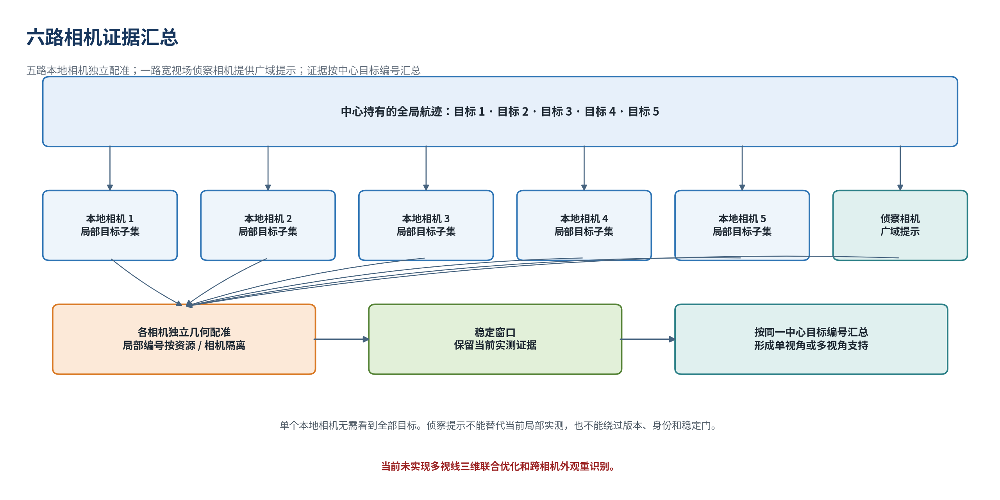

图 3 所示互补关系受三条边界约束。侦察提示必须满足目标作用域和时效，不能绕过稳定窗口；侦察框不能代替局部相机当前帧的实测框；跨视角汇总只增加同一中心目标的支持视角，不生成新的三维航迹。多视线三维联合优化和跨相机外观重识别尚未实现。

## 4. 时间与投影

### 4.1 双时间戳

相机链路会引入曝光、传输、排队和推理延迟。若用到达时刻代替量测时刻投影，延迟会被错误计入目标运动，产生方向一致的系统像素偏差。D5 因此保留状态时刻 \(t_0\)、量测时刻 \(t_m\) 和到达时刻 \(t_a\)。

图 4 将运动补偿与证据年龄分开表示。上方蓝色关系用于把中心状态预测到图像采样时刻；下方绿色关系只计算证据进入处理链时已经过去的时间。

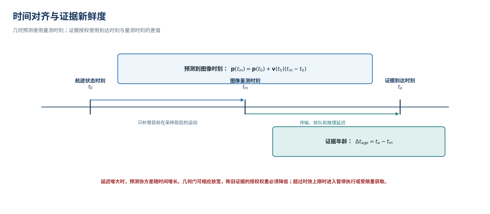

对常速度基线，状态预测为

\[
\mathbf p(t_m)=\mathbf p(t_0)+\mathbf v(t_0)(t_m-t_0).
\]

证据年龄为

\[
\Delta t_{\mathrm{age}}=t_a-t_m.
\]

预测只生成当前相机投影输入，不在 D5 内建立新的全局滤波器。预测间隔增长时，三维位置协方差按实现中的保守规则膨胀；证据年龄超过时效上限时，末端决策应进入暂停或受限重获取。正式专项采用“逐相机批次量测时刻”策略，指标中明确记录了该策略名称。

### 4.2 坐标变换

中心状态采用 NED 工作坐标。对世界点 \(\mathbf P_w\)，相机外参将其变换到光学坐标：

\[
\mathbf P_c=
\begin{bmatrix}X_c&Y_c&Z_c\end{bmatrix}^{\mathsf T}
=\mathbf R\mathbf P_w+\mathbf t.
\]

AirSim 的前、右、下轴需要转换到 OpenCV 的右、下、前光学轴。相机位置、姿态或轴约定出现错误时，所有目标会呈现有方向的残差，不能通过扩大门限掩盖。

图 5 从全局坐标、相机外参和视场边界三个层次说明投影关系。目标先变换到相机坐标，再由内参映射到图像；镜头后方、深度非正、结果非有限或越出图像边界的点被标记为无效。

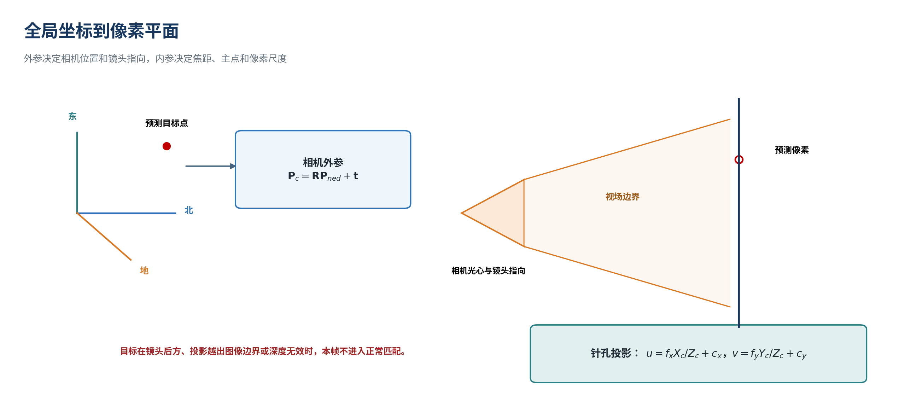

忽略畸变时，针孔投影为

\[
u=f_x\frac{X_c}{Z_c}+c_x,\qquad
v=f_y\frac{Y_c}{Z_c}+c_y.
\]

OpenCV 可用时，当前实现可消费畸变系数并调用其投影函数；缺少 OpenCV 时使用针孔公式。正式场景报告了相机分辨率和水平视场，但没有给出独立标定板残差或实测外参不确定度，因此本轮结论仍属于仿真几何验证。

## 5. 不确定性与匹配

### 5.1 像素协方差

固定像素半径无法同时适应不同距离、分辨率、航迹不确定度和框尺度。D5 先计算针孔投影对世界位置的雅可比：

\[
\mathbf J=
\begin{bmatrix}
f_x/Z_c & 0 & -f_xX_c/Z_c^2\\
0 & f_y/Z_c & -f_yY_c/Z_c^2
\end{bmatrix}\mathbf R.
\]

三维位置协方差传播到像素平面后，与相机量测协方差、局部框附加协方差和正则项相加：

\[
\boldsymbol\Sigma_{px}
=\mathbf J\mathbf P\mathbf J^{\mathsf T}
+\mathbf R_{\mathrm{meas}}
+\mathbf R_{\mathrm{local}}
+\epsilon\mathbf I_2.
\]

当前正则项为 \(\epsilon=10^{-6}\)。批量注册还支持根据边界框面积和图像分辨率形成自适应局部协方差；无法取得框面积时使用批次给定的附加协方差。该处理用于表达检测中心的不确定程度，不使用 actor 或真值身份。

图 6 中的椭圆是 \(\boldsymbol\Sigma_{px}\) 在像素平面的几何表达。长轴方向反映当前投影最不确定的方向，椭圆尺度随三维协方差、相机几何和局部量测误差共同变化。

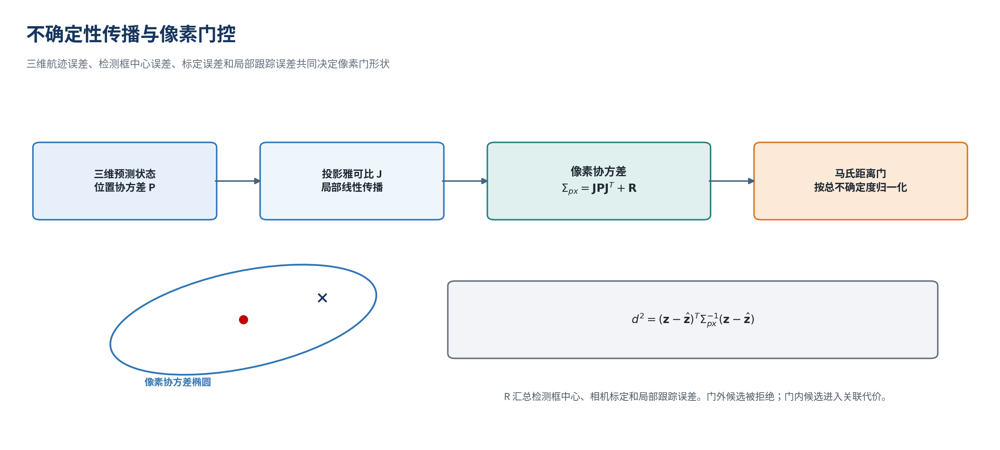

本地检测中心 \(\mathbf z\) 与预测像素 \(\hat{\mathbf z}\) 的平方马氏距离为

\[
d_M^2=(\mathbf z-\hat{\mathbf z})^{\mathsf T}
\boldsymbol\Sigma_{px}^{\dagger}
(\mathbf z-\hat{\mathbf z}).
\]

当前默认门限为 \(d_M^2\le9.21\)。门外候选被赋予不可选大代价，门内候选才进入唯一匹配。同样的 15 px 残差在紧致协方差下可能被拒绝，在更大且方向一致的协方差下可能通过；因此像素误差与马氏距离必须同时记录。

### 5.2 代价与一对一匹配

通用末端关联器的候选总代价为

\[
C=d_M^2+C_{\mathrm{rate}}+C_{\mathrm{class}}
+C_{\mathrm{quality}}+C_{\mathrm{friend}}+C_{\mathrm{recon}}.
\]

各项依次描述像面运动一致性、类别一致性、本地质量和历史、友方冲突以及侦察提示。经过验证的友方重叠产生高惩罚并触发暂停。符合授权、作用域和时效的侦察提示可降低候选代价，但不能把门外候选变成有效锁定。

正式 5+1 批量注册路径构建“既有全局航迹 × 当前相机本地轨迹”的矩阵，并用门内 \(d_M^2\) 作为匹配代价。SciPy 可用时调用匈牙利线性和分配，保证一条全局航迹和一条本地轨迹在同一相机批次内最多被选择一次。SciPy 不可用时采用确定性贪心唯一匹配；该回退保持一对一约束，但不宣称与全局最优匈牙利结果等价。

门内未选边仍保留为候选，并根据马氏距离形成归一化候选概率，便于解释竞争关系和后续研究。联合概率数据关联（Joint Probabilistic Data Association，JPDA）尚未在线实现。未来若引入 JPDA，只能消费门内候选，仍需遵守中心绑定、友方冲突、计划版本、授权和稳定窗口。

### 5.3 稳定注册与跨视角一致性

当前批量注册使用 3 帧窗口，要求同一资源、相机、本地轨迹和全局航迹组合至少 2 次同时满足“被选中且通过门控”。第一次有效选择保留为 candidate；累计达到要求后，当前选择标记为 stable，并进入稳定跨视角汇总。资源、相机、本地编号或中心绑定改变时会形成新的稳定键。

这一规则过滤单帧框抖动和偶发竞争，却不会伪造缺失帧。在三帧内先后出现两次有效实测时可以形成稳定支持；只出现一次的局部轨迹仍停留在候选状态。正式 detect 与 YOLO episode 分别有 31 和 36 个即时选择未满足稳定窗口。

跨视角汇总按只读 `global_track_id` 聚合稳定观测。单目标可由一个或多个相机支持；多个资源同时支持同一目标时还需检查联盟成员、所需资源数、计划版本和授权作用域。合同缺失、成员越界或一个本地轨迹支持多个全局目标时，输出重复锁定风险，不以本地多数票重写中心身份。

## 6. 状态与交接

### 6.1 四态判定

批量注册层的 candidate、registered 和 rejected 用于描述候选边及稳定过程。末端决策层进一步结合当前分配、质量、历史、身份和时效，输出以下四种状态。

| 状态 | 进入条件 | 运行含义 |
| --- | --- | --- |
| 稳定关联 `locked` | 唯一实测候选通过几何、代价、质量、历史、身份、版本和执行门 | 视觉关联证据成立；下游继续独立门控 |
| 候选模糊 `ambiguous` | 存在候选，但代价间隔、质量、历史、身份可信度或时序稳定性不足 | 保持观测，可请求有效侦察提示 |
| 暂停执行 `hold` | 计划过期、未授权、版本冲突、时效超限、框不稳或已验证友方重叠 | 阻止当前视觉交接，必要时请求仲裁 |
| 受限重获取 `reacquire` | 分配航迹缺失、投影无效、无门内候选、检测丢失或证据过期 | 仅在原分配全局航迹附近重新搜索 |

友方身份处理只支持正向确认。已验证友方声明与当前候选重叠时进入 `hold`；过期、未签名或疑似伪造的声明保持保守状态；缺少身份声明时维持“未知”。D5 不从类别、运动方向或检测置信度推断敌我属性。

### 6.2 交接与降级

图 7 展示同一 D5 证据进入两个独立门控的方式。上支路由 D7 判断视觉导引切换，下支路由 D4 判断中心、二级或分布式模式的可用性。两条支路都保留自己的拒绝原因和状态机。

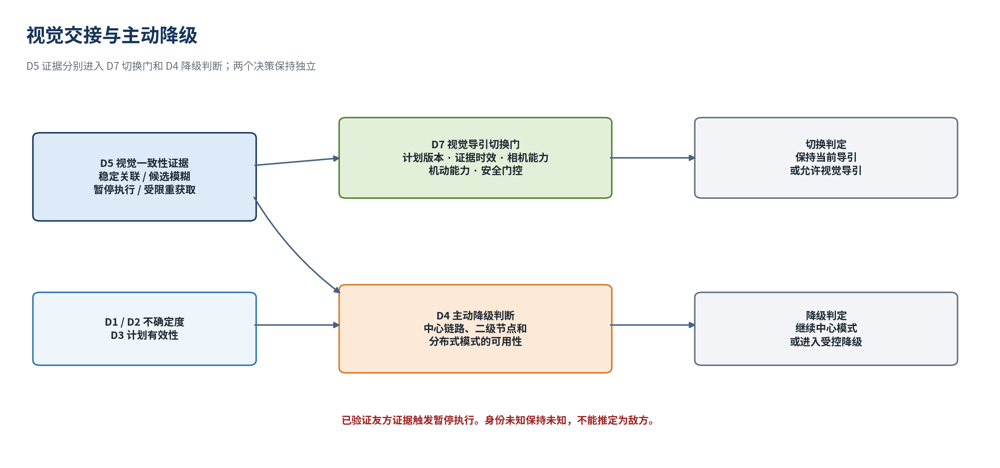

图 7 强调 `locked` 是必要证据之一，并非充分授权。相机几何不可用、计划版本落后、证据过期、联盟范围不符或安全条件不足时，下游仍应拒绝切换。D5 只提供当前视觉关联及其置信度、歧义、时效和冲突依据。

## 7. 实验条件

### 7.1 场景设置

正式专项包含 detect 几何基线和 YOLOv8 + ByteTrack 候选后端两个 episode。二者使用相同 seed、相机布局、目标初始位置和运动时长，便于在固定场景内比较后端差异。侦察相机在两个 episode 中均使用 AirSim detect，因此 YOLO 分支的“侦察全覆盖”仍会受到同一侦察几何和 detect 可见性的约束。

| 项目 | 正式设置 |
| --- | --- |
| 仿真模式 | AirSim Blocks，ComputerVision |
| 时间 | 12.0 s，采样间隔 0.25 s，共 49 帧 |
| 随机种子 | 7 |
| 局部相机 | 5 路，1920×1080，水平视场 60° |
| 侦察相机 | 1 路，3840×2160，水平视场 75° |
| 目标 | 5 个移动 `Quadrotor1` actor |
| 初始几何 | 目标距局部相机约 30 m，横向间隔 8 m，actor scale 2.0 |
| 高度 | 局部相机与目标高度约 50 m；侦察相机再高约 50 m |
| detect episode | 六路均使用匿名 AirSim detect |
| YOLO episode | 五路局部相机使用 YOLOv8 + ByteTrack；侦察相机使用 AirSim detect |

五个目标保持高度不变，12 s 内沿 NED 平面运动：

| 目标顺序 | 速度 `(north, east, down)` m/s | 12 s 位移 `(north, east, down)` m |
| ---: | --- | --- |
| 1 | `(0.60, 0.50, 0)` | `(7.2, 6.0, 0)` |
| 2 | `(0.65, 0.25, 0)` | `(7.8, 3.0, 0)` |
| 3 | `(0.70, 0.00, 0)` | `(8.4, 0.0, 0)` |
| 4 | `(0.75, -0.25, 0)` | `(9.0, -3.0, 0)` |
| 5 | `(0.80, -0.50, 0)` | `(9.6, -6.0, 0)` |

前向位移达到 7.2–9.6 m，横向位移绝对值达到 0–6.0 m。若将整段观测统一投影到 episode 末时刻，早期帧会引入显著系统误差；这也是正式专项必须使用逐相机量测时刻的原因。

### 7.2 评分边界

专项未在线运行 D1/D2。编排侧根据 actor 真值运动生成带中心标识、位置、速度和协方差的航迹夹具，使 D5 几何注册可以在隔离条件下验证。该夹具不代表完整上游融合链已通过在线联调。

离线检测召回以真值框为基准。关联准确率只统计已选且能与真值框匹配的结果；严格关联准确率把已选但无法匹配真值框的结果也计为错误。IDSW 根据相机本地轨迹与离线身份标签计算。所有评分均在候选选择之后执行，不回流在线代价和状态。

本专项门限在正式分支报告中预先列出：detect 召回不低于 0.95，YOLO 路线召回不低于 0.90；两条路线严格关联准确率不低于 0.95、稳定注册率不低于 0.90、局部联合覆盖不低于 0.95、侦察全覆盖不低于 0.90；detect 本地 IDSW 要求为 0，YOLO 路线不高于 5；在线真值身份使用和中心标识改写均要求为 0。这些是本次分支验收门限，不等同于多场景通用准入标准。

## 8. 结果证据

### 8.1 总体结果

表 1 汇总两个 episode 的正式指标。第 50 和第 95 百分位分别记为 P50 和 P95。detect 的 1254 个在线检测全部与离线真值框匹配，1220 个已选注册全部可评分且错配为 0。YOLO 路线产生 822 个在线检测，其中 781 个与真值框匹配；794 个注册被选中，770 个可评分，24 个无法匹配真值框。

| 指标 | detect | YOLOv8 + ByteTrack |
| --- | ---: | ---: |
| 在线检测数 | 1254 | 822 |
| 离线检测召回 | 1.000 | 0.622 |
| 关联准确率 | 1.000 | 0.996 |
| 严格关联准确率 | 1.000 | 0.966 |
| 局部相机关联准确率 | 1.000 | 0.994 |
| 稳定注册率 | 0.975 | 0.955 |
| 局部相机联合覆盖 | 1.000 | 1.000 |
| 侦察全覆盖帧率 | 0.918 | 0.878 |
| 本地 IDSW | 0 | 25 |
| 在线真值身份使用 | 0 | 0 |
| `global_track_id` 改写 | 0 | 0 |
| YOLO 推理时延 P50 | 不适用 | 10.42 ms |
| YOLO 推理时延 P95 | 不适用 | 12.37 ms |

图 8 把实测值与本专项门限放在同一张图中。绿色只表示该项在 seed 7 固定场景中达到分支门限，不能解释为多种子统计通过。

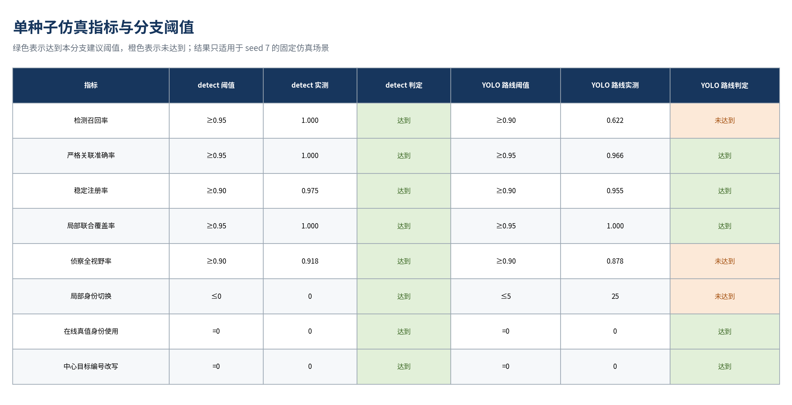

detect 所有指标通过。YOLO 路线的严格关联准确率、稳定注册率、局部联合覆盖、在线真值隔离和中心标识不变式通过；召回、侦察全覆盖和本地 IDSW 未通过。3 个可评分错配分别为 `G-102→G-103` 1 次和 `G-105→G-104` 2 次。结果支持保留几何基线，同时不支持把 YOLOv8 + ByteTrack 提升为默认在线后端。

### 8.2 逐相机结果

逐相机统计有助于定位后端问题是否集中在特定视角。表中准确率以可评分结果为分母；无真值匹配数量单列，并已在总体严格准确率中按错误处理。

| 相机 | 角色 | detect 已选 / 错配 / 无真值 | detect 准确率 | YOLO 已选 / 错配 / 无真值 | YOLO 准确率 |
| --- | --- | ---: | ---: | ---: | ---: |
| `D5_Primary_1:0` | 局部 | 167 / 0 / 0 | 1.000 | 110 / 0 / 2 | 1.000 |
| `D5_Primary_2:0` | 局部 | 210 / 0 / 0 | 1.000 | 149 / 3 / 11 | 0.978 |
| `D5_Primary_3:0` | 局部 | 240 / 0 / 0 | 1.000 | 139 / 0 / 9 | 1.000 |
| `D5_Primary_4:0` | 局部 | 205 / 0 / 0 | 1.000 | 101 / 0 / 2 | 1.000 |
| `D5_Primary_5:0` | 局部 | 160 / 0 / 0 | 1.000 | 56 / 0 / 0 | 1.000 |
| `D5_Recon_1:0` | 侦察 | 238 / 0 / 0 | 1.000 | 239 / 0 / 0 | 1.000 |

YOLO 路线的 3 个可评分错配和 11 个无真值匹配结果集中在第二路局部相机；第三路另有 9 个无真值匹配。侦察相机在两个 episode 中继续使用 detect，逐相机关联准确率均为 1.000。该对照说明主要退化来自局部检测与跟踪链，不能据此宣称侦察几何对遮挡或标定扰动具有普遍鲁棒性。

### 8.3 像素误差

下表由正式候选记录中 `selected=True` 的结果复算。像素误差是所选本地中心与预测投影中心的欧氏距离；P50/P95 描述分布位置，不能代替带协方差归一化的马氏距离。

| 相机 | detect 均值 / P50 / P95 px | YOLO 均值 / P50 / P95 px |
| --- | ---: | ---: |
| `D5_Primary_1:0` | 10.12 / 10.68 / 14.74 | 9.44 / 8.50 / 14.79 |
| `D5_Primary_2:0` | 9.31 / 10.04 / 13.09 | 17.94 / 12.52 / 15.13 |
| `D5_Primary_3:0` | 9.57 / 10.95 / 13.56 | 11.72 / 13.19 / 17.56 |
| `D5_Primary_4:0` | 11.49 / 11.00 / 15.49 | 9.28 / 9.33 / 17.29 |
| `D5_Primary_5:0` | 10.07 / 7.10 / 16.02 | 9.65 / 8.98 / 15.05 |
| `D5_Recon_1:0` | 6.25 / 6.49 / 10.08 | 6.24 / 6.51 / 10.08 |

YOLO 第二路局部相机包含一个 284.93 px 的所选结果，使均值升至 17.94 px，而 P95 为 15.13 px。均值与 P95 的明显分离表明这是单个尾部异常点；同一相机还产生全部 3 个可评分错配。当前数据足以定位异常，尚不足以判断其由检测框、局部 ID 变化还是标定误差单独造成。

以候选时间 \(t<6\) s 和 \(t\ge6\) s 划分，detect 前后半程关联准确率均为 1.000；YOLO 前半程为 1.000，后半程为 0.992。像素误差统计如下。

| 后端 | 前半程样本 | 前半程均值 / P50 / P95 px | 后半程样本 | 后半程均值 / P50 / P95 px |
| --- | ---: | ---: | ---: | ---: |
| detect | 558 | 9.05 / 8.27 / 15.42 | 662 | 9.58 / 10.05 / 15.34 |
| YOLOv8 + ByteTrack | 384 | 9.10 / 8.65 / 15.01 | 410 | 11.74 / 9.19 / 15.13 |

YOLO 后半程均值受第二路局部相机尾部异常影响。正式产物未保留修复前的可比指标，因而不能量化逐相机时间投影修复带来的数值增益。

### 8.4 六路画面

t=6 s 的六路拼图用于核对“局部子集 + 侦察广域”是否真实出现在画面中。图 9 对应 detect 几何基线；五个局部相机标题栏的检测数依次为 4、5、5、4、3，侦察相机检测到 5 个目标。

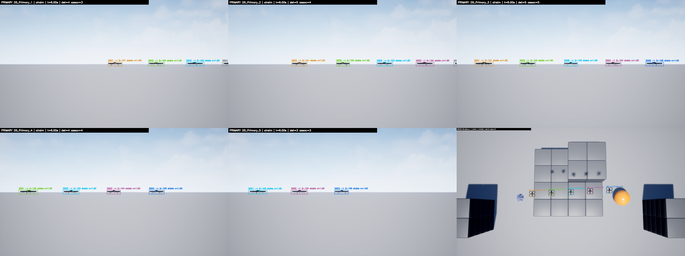

图 9 中各局部画面的目标子集不同，侦察俯视画面提供全局覆盖。这与“单路局部相机无需看全目标”的架构假设一致。拼图只用于视觉核对，不单独构成召回或关联准确率证据；相应判断仍来自逐帧正式指标。

图 10 对应 YOLOv8 + ByteTrack 路线。五个局部相机标题栏的检测数依次为 4、2、3、2、1，侦察相机继续使用 AirSim detect 并检测到 5 个目标。

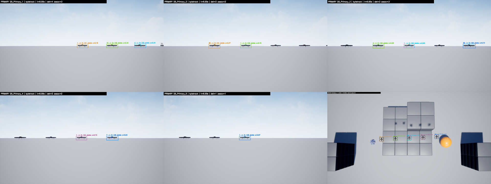

图 10 的局部漏检比 detect 分支明显，和 0.622 的总体召回一致。侦察画面保持全目标可见并不意味着局部实测已被补齐；稳定注册仍要求各局部相机自己的当前框满足几何和时序条件。

### 8.5 覆盖与时间线

图 11 给出 detect 六路相机随时间的在线局部轨迹数。曲线用于观察各局部视场覆盖子集的变化，以及侦察相机是否持续接近全目标覆盖。

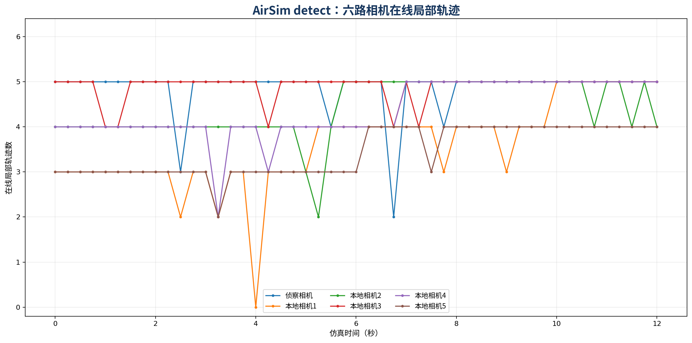

detect 的五路局部相机联合覆盖率为 1.000，侦察全覆盖帧率为 0.918。联合覆盖表示五路局部视场的并集覆盖全部目标，不要求每条曲线都等于 5；侦察全覆盖低于 1.000 说明仍有少数帧未同时覆盖五个目标。

图 12 比较 detect 每帧即时选择与通过稳定窗口的注册数。起始阶段和局部轨迹刚出现时，两条曲线之间会形成差值。

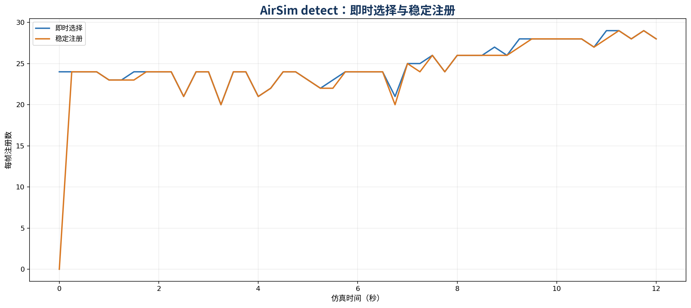

detect 共选择 1220 个注册，其中 1189 个形成稳定支持，31 个因稳定窗口不足未进入稳定汇总，对应稳定注册率 0.975。正式指标的几何门拒绝数为 0；该结果只适用于本次协方差、目标间距和相机标定设置。

图 13 给出 YOLO 路线的六路在线局部轨迹数。侦察曲线仍来自 AirSim detect，五条局部曲线反映 YOLOv8 与 ByteTrack 的检测和轨迹输出。

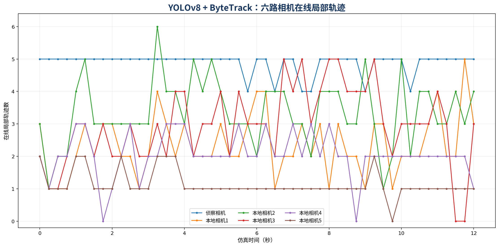

YOLO 路线的局部相机联合覆盖仍为 1.000，但单路检测数普遍低于 detect。侦察全覆盖帧率为 0.878。联合覆盖对互补视场有意义，却不能抵消 0.622 的逐框检测召回，也不能解释本地 IDSW。

图 14 比较 YOLO 路线的即时选择与稳定注册。局部检测稀疏和 ID 变化会使稳定键重新累计，从而增加即时选择与稳定支持之间的差距。

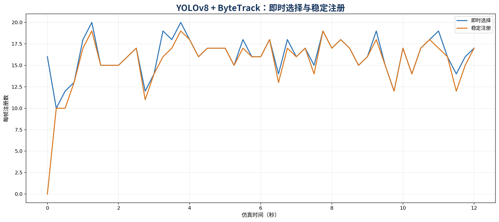

YOLO 路线共选择 794 个注册，其中 758 个形成稳定支持，36 个未通过稳定窗口，稳定注册率为 0.955。该比例本身达到 0.90 门限，但必须与召回、严格准确率和 IDSW 联合判读，不能用较高稳定率掩盖漏检和身份连续性问题。

图 15 将两个 episode 的六路检测总数和每帧稳定注册数置于同一时间轴，用于观察后端差异是否持续存在。

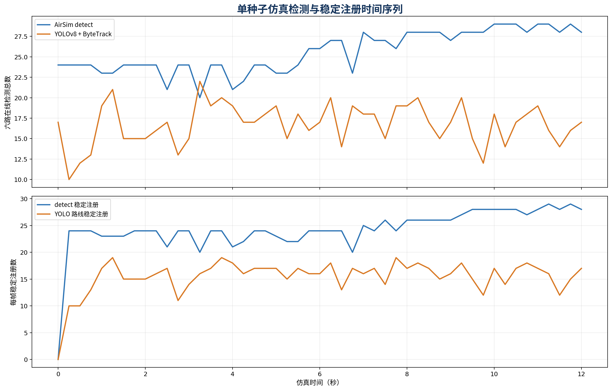

图 15 显示 YOLO 路线的检测总数长期低于 detect，稳定注册数也随本地检测供应变化。该图不提供独立统计显著性；两个 episode 只有同一 seed 的一次配对运行。

## 9. 失败边界

### 9.1 时间投影错误

早期实现曾把 episode 最后一帧时间用于整段观测投影。对 \(t=0\) s 的框错误使用 \(t=12\) s 时，五个目标的预测位置会提前前移 7.2–9.6 m，并产生最多 6.0 m 的横向偏移。像素残差因此随运动方向系统变化，可能扩大马氏距离、改变候选排序或引发错配。

正式结果已改为每个 `CameraLocalTrackBatch` 使用自己的量测时间，且该时间独立传入中心航迹预测；本地轨迹继续保存实际量测和到达时间。正式指标将策略记录为 `per_camera_batch_measurement_timestamp`。由于修复前没有保留同配置、同 seed 的完整可比产物，本报告只确认正式结果使用正确策略，不报告修复收益百分比。

### 9.2 真值隔离

| 环节 | 真值身份使用情况 | 结论范围 |
| --- | --- | --- |
| D1/D2 在线链路 | 未运行 | 本专项不能证明上游在线融合与身份维护性能 |
| 中心航迹夹具生成 | 使用 actor 真值运动学 | 只形成隔离测试输入 |
| 局部框到中心航迹的代价 | 0 次 | 使用像素中心、协方差、相机几何和本地质量 |
| 匈牙利选择与稳定窗口 | 0 次 | 使用门内代价、作用域和时序历史 |
| 召回、错配和 IDSW 评分 | 使用离线真值 | 评分发生在在线选择之后 |
| `global_track_id` 改写 | 0 次 | 两个 episode 均满足只读约束 |

候选记录包含离线真值目标列，用于判断已选结果是否正确。在线路径不读取这些列完成选择。`online_truth_identity_use_count=0` 不能被解读为整个专项完全没有真值；它只证明被审计的在线关联环节未使用真值身份。

### 9.3 已知限制

本轮只有一个 seed，没有遮挡分级、近距离交叉、背景变化、目标尺度变化、强机动或长时间丢失。YOLO 的 25 次 IDSW 与 3 次错配暴露出局部连续性问题，但单次运行无法估计发生概率和置信区间。

正式场景没有注入内参误差、外参旋转和平移偏差、时钟偏移或网络抖动。几何门拒绝为 0 不能证明门限在标定漂移下仍然有效；它只说明本次相机模型、协方差设置和目标间距没有产生门外所选候选。

侦察相机提供宽视场证据，但当前没有多视线三维联合优化、跨相机外观重识别或在线 JPDA。侦察全覆盖也没有达到 1.000。局部相机全部丢失时，侦察框不能自动转化为局部稳定锁定。

## 10. 状态与标定

### 10.1 能力分层

| 分层 | 内容 | 当前判断 |
| --- | --- | --- |
| 已实现 | 双时间戳、NED 到相机投影、协方差传播、像素马氏门、相机内唯一匹配、3 帧 2 次稳定窗口、跨视角汇总、四态决策、友方冲突门、`global_track_id` 只读 | 代码能力；按输入数组规模运行 |
| 已验证 | 2026-07-16、seed 7、12.0 s、49 帧的 AirSim 5+1 固定场景；detect 与 YOLO 两条路线均产生正式指标 | 单种子、隔离式中心航迹夹具 |
| 本次通过 | detect 的召回、严格准确率、稳定率、联合覆盖、侦察全覆盖、IDSW、真值隔离和标识不变式 | 仅限本专项门限 |
| 本次未通过 | YOLO 路线的召回、侦察全覆盖和本地 IDSW | 保持可选后端 |
| 建议值 | 至少 10 个配对 seeds；沿用同一指标口径报告均值、标准差、置信区间和最差 seed | 尚未执行 |
| 待验证 | 遮挡、目标交叉、外参与时钟偏差、距离和尺度变化、侦察时效、在线 D1/D2 联调 | 当前无正式结论 |
| 未实现 | 在线 JPDA、多视线三维联合优化、跨相机外观重识别 | 不计入本轮能力 |

### 10.2 后续标定

下一轮标定应先建立可追溯的相机内参、畸变、相机到机体外参、机体到 NED 姿态和时钟同步基线。每次标定需记录来源、时间、适用分辨率和有效期，并用独立数据给出重投影误差分布。当前报告中的像素误差来自目标关联过程，不能替代标定板或独立场景的标定残差。

外参扰动实验应分别注入旋转和平移偏差，并固定检测框与目标轨迹。输出至少包括像素误差 P50/P95、马氏门通过率、错配率、稳定窗口失败数和恢复时间。时间实验需要分开扰动量测时间与到达时间：前者影响几何预测，后者影响证据年龄和授权，两类误差不应合并为一个“延迟”参数。

多 seed 验证建议采用配对设计，使 detect 与 YOLOv8 + ByteTrack 在相同 seed、相机配置和 actor 轨迹下运行。遮挡、近距离交叉、目标间距、侦察视场、目标距离和分辨率应分层改变，每一层保留总体指标、逐相机结果、候选记录和失败原因。YOLO 后端只有在召回、严格准确率、IDSW、侦察覆盖和时延同时满足后续正式准入条件，并完成多 seed 统计后，才适合重新评估默认状态。

当前结论保持克制：几何关联基线已实现，并在一个正式固定场景中得到完整证据；检测与跟踪后端、标定扰动鲁棒性和端到端在线链路仍需后续实验。
