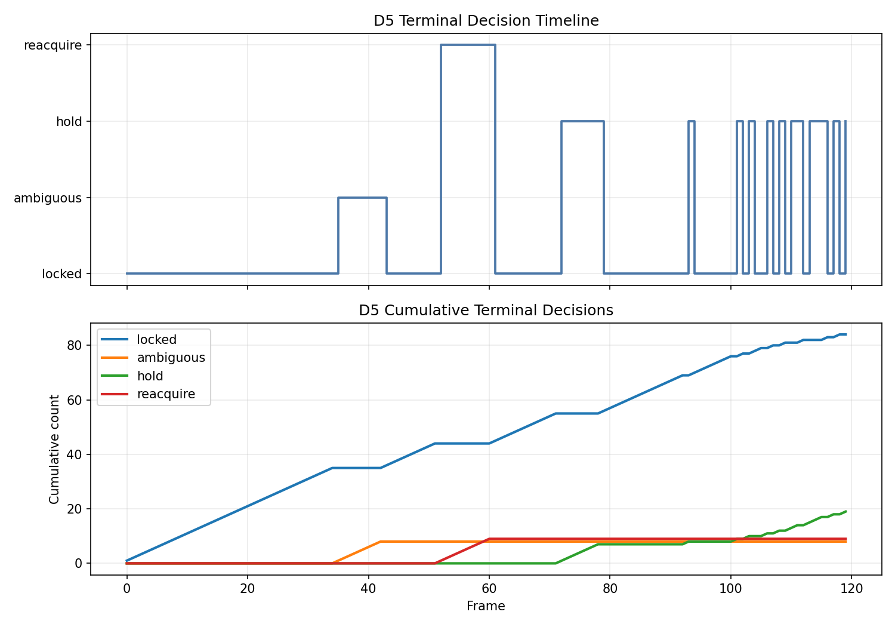

# D5 末端视觉配准与身份认证实验报告

## 2026-07-26 G1 v4 正式装配

### 正式输入

本次只装配既有证据，不重训。输入文件 SHA-256 如下：

| 输入 | SHA-256 |
| --- | --- |
| development manifest | `0eff183f7579551f83a0519d30e09abfa4f15899981ad8ffb2eb7e2e871bda77` |
| development weights | `7fb5db8b6099ca4da5706a3bec53ff7cd634e8bd267c036ce3ee4ee4bf71ca71` |
| development `SHA256SUMS` | `bf61c96e30fe8cf338a9f98152670735be657d31f338fcaa7d23c064fab58528` |
| held-out JSON | `4ec0b82402a2ba415a8522bd3ac92fd049f0b10823cff48d2aeb544331b50c3a` |
| paired-shadow JSON | `f25c9428933fc8bd5e4bbe5db5e9fe573c60053418da224fc047576c27eef57b` |
| D6 外审 JSON | `10bf19f5fa89788c9cc0a24ab18b647c6cf863149bae08d22fc40796d15210b0` |

D6 JSON 内容 SHA-256 为
`4e24ab33ca290133cf107f2c4ad5fee85d763001556f35fcd0ecdb819bef9e54`。
正式审计为 `audit_passed=true`、blocker 为空，D6 authority 全 false；其 consumer contract
绑定运行时实现摘要 `408e71fe...f4fe` 和本次模型、held-out、paired 输入。

### 装配结果

2026-07-26T14:14:12Z 在 clean `fa3ec10` 生成
`outputs/d5_g1_clean_source_chain_d437744_20260726/model_candidate/g1_assist_v4_7fb5db8b_d6_10bf19f5/`。

| 输出 | SHA-256 |
| --- | --- |
| `manifest.json` | `a5a53de7d7a6b0aebd60f478b3c2768aa2767f4b3e440c92db4891b324337154` |
| `weights.pt` | `7fb5db8b6099ca4da5706a3bec53ff7cd634e8bd267c036ce3ee4ee4bf71ca71` |
| `SHA256SUMS` | `1221ec238f6b5dfeef70fca05c111877ea20ec2792eb262d8ada50f422c75956` |
| held-out evidence | `4ec0b82402a2ba415a8522bd3ac92fd049f0b10823cff48d2aeb544331b50c3a` |
| paired evidence | `f25c9428933fc8bd5e4bbe5db5e9fe573c60053418da224fc047576c27eef57b` |
| D6 audit evidence | `10bf19f5fa89788c9cc0a24ab18b647c6cf863149bae08d22fc40796d15210b0` |

根清单五项全部通过。输出 schema 为 `d5.tracklet-model-bundle.v4`；
`g1_assist_eligible=true`，`default_model=false`，全局航迹标识、分配和控制 authority 均为
false。公开 strict loader 在 `require_g1_assist_eligible=True` 下返回
`CalibratedTrackletEdgeScorer`。第二次向同目录装配返回退出码 2 和 `output_not_empty`，六份
输入与六份输出哈希均未变化。

定向执行 `test_tracklet_g1_evidence_assembler.py` 和 `test_tracklet_model_pipeline.py`，
结果为 `34 passed, 1 warning in 2.39s`。警告来自本机 PyTorch 无法初始化 NVML，不影响 CPU
严格加载和证据校验。D5 全量结果为 `589 passed, 1 warning in 99.17s`。这些结果不表示在线
G1 已启用，也不证明真实候选门或真实相机泛化。

## 2026-07-26 冻结 registry 正式发布

### clean 输入

验证输入来自 clean commit `d437744c030785859b61cf893d15d0463ab54ffb`。模型权重 SHA-256
为 `7fb5db8b...ca71`，manifest 为 `0eff183f...da77`。held-out 覆盖 seed `1000-1019`、
45 个场景规模单元和 900 帧；paired lineage 为 900 条。held-out、paired 和 lineage 文件
SHA-256 分别为 `4ec0b824...c3a`、`f25c9428...57b` 和 `ca122b71...b57`。

paired-shadow 的名义边/簇 F1 均为 1.0，五类固定候选图困难扰动的边/簇 F1 也均为 1.0。
最高单特征 AUC 为 0.720073；`shared_global_track_count=1` 和 other 分层的候选边数均为 0。
这些数据仍是合成固定候选图，不能代表真实候选门重新构图或真实相机泛化。

### 软件验证

producer assembler 专项覆盖低 AUC、高 AUC、共享计数捷径、带外文件哈希、规范化内容
哈希、schema、逐帧 lineage、权限字段、输出清单和非空目标目录。定向执行结果为
`17 passed in 3.43s`，其中新装配专项 `11 passed`。另对 7fb5 clean 五份输入执行
只读预检，bundle、corpus、held-out、paired、lineage、20/900/45 目录和权限边界全部一致。

只读预检派生的 limitation 为
`counterfactual_profiles_hold_candidate_graph_fixed`、
`d6_external_audit_required` 和 `no_online_authority`。旧
`synthetic_heldout_single_feature_shortcut` 未保留；共享全局航迹计数捷径未触发。

producer 提交 `fa3ec10` 于 `2026-07-26T13:49:10Z` 在 clean worktree 完成正式发布。输出目录为
`outputs/d5_g1_clean_source_chain_d437744_20260726/model_registry/tracklet_gnn_7fb5db8b_registry_fa3ec10/`。
正式文件摘要如下：

| 文件 | SHA-256 |
| --- | --- |
| `FROZEN_GNN_AUDIT_REPORT_CN.md` | `1dfe1b3b5c13d7be1ec4c20cf2e32a45040a16709deedc0d93484bce392e8c7c` |
| `audit_evidence.json` | `bcee8cbcaeda066398127fcf2da8697ace8922404774a0d84235aac4194c8f29` |
| `frozen_bundle_reference.json` | `9441fa843928c45125cda4ee160ed22bd145e721cd82ef66163f714ffa73da5d` |
| `SHA256SUMS` | `c1abebfa957d8bea5be5e03a76d2027d964ea0db219b63eb84c4aaed04097f63` |

根清单三项全部通过。正式 evidence schema 为
`d5.frozen-tracklet-audit-evidence.v1`；manifest、weights 和 lineage SHA-256 分别为
`0eff183f...da77`、`7fb5db8b...ca71` 和 `ca122b71...b57`。所有 authority 字段为 false。
第二次发布返回非零退出码并以 `registry_destination_exists` 失败关闭，正式输出和历史输入哈希
均未变化。

D6 在该 registry 发布后完成正式外审，结果及后续 G1 v4 装配见上节。main 的临时 preflight
仍不计作正式外审。producer registry 本身不授予 G1 assist、默认路径、全局航迹标识或控制权限。
同日 D5 全量回归为 `589 passed in 112.89s`。

## 2026-07-26 G1 稳健候选失败关闭结果

本轮从 4,500 帧补充课程与 472 帧正式可用图形成 4,972 帧组合视图。训练、验证和内部测试分别
为 2,961、1,006 和 1,005 帧；独立 held-out 使用 seed `1000-1019` 的 900 帧和 45 个场景规模
单元。训练运行 12 轮，最佳轮次为 11，耗时 234.6347 s。

新候选权重 SHA-256 为 `7fb5db8b...ca71`，bundle manifest 为 `ddd7ce4a...2f17`。冻结温度
0.6541651703、阈值 0.8964798918 后，held-out 精确率、召回率、F1 和候选召回率均为 1.0，
错误合并率为 0，CPU P95 为 1.121304 ms。paired-shadow 中名义与五类困难扰动的 edge/cluster
F1 均为 1.0，最高单特征 AUC 为 0.720073。在线 truth 特征、同相机互斥违规和
`global_track_id` 改写均为 0。

该段记录 clean 重建前的内部运行。这些结果来自合成固定候选图。supplemental 和训练来源记录为 dirty，D6 外部审计和 G1
assembler 未运行。候选状态为 `development_only_fail_closed`，没有生成 admitted v4，也没有
改变默认运行路径。完整哈希、门限和 clean commit 重跑清单见
`../reports/D5_TRACKLET_G1_ROBUST_V2_FAIL_CLOSED_20260726.md`。
2026-07-26 D5 全量回归为 `578 passed in 103.88s`。

## 2026-07-26 G1 证据装配验证

本轮实现了 D5 独立 G1 evidence assembler。正向 fixture 使用一份新生成的 development bundle、
held-out、paired-shadow 和 D6 pass audit，完成原子 v4 装配。公开 strict loader 和 runtime 在
每次加载时复核 manifest、weights、三份 evidence、内容摘要和 admission 交叉绑定。fixture
只验证软件合同可运行，不代表当前模型获准，也不提供真实多相机、AirSim 或物理拦截证据。

负例覆盖 D6 fail、缺文件、文件及内容 SHA 篡改、跨模型/数据集/实现、field unavailable、布尔与
整数类型伪造、装配后 evidence 篡改、非空目标目录、失败无半成品和旧手工 v4 绕过。生产
`write_tracklet_model_bundle()` 仍拒绝 caller-provided report。v4 的 `default_model`、全局航迹
编号、分配和控制 authority 均为 false。

G1 实现摘要已纳入 `tracklet_g1_evidence_assembler.py`，当前为
`41381db3d11371c049e5569658820ce98abf1a9966ecf86edc0f13f140894b07`。专项回归模拟只改变
assembler 文件摘要，整体实现摘要随之改变。旧 development bundle 未绑定该文件，公开严格
loader 返回 `implementation_runtime_mismatch`，没有使用兼容白名单。

实际复核使用 `99fa4428...d4cd` 权重和 post-assembler D6 审计
`d5_g1_external_audit_99fa4428_post_assembler_20260726`。审计文件 SHA-256 为
`98bf9e0251567a330bf16951acf07da576a6ba3dc47627c3671cd2d491cdc8ed`，内容 SHA-256 为
`40a42af015211d5e721584053e052a893e31aa35b7393195530a5d3d2dc9b90d`，当前实现摘要为
`41381db3d11371c049e5569658820ce98abf1a9966ecf86edc0f13f140894b07`。审计状态为
`fail_closed`，assembler 稳定返回 `d6_external_audit_fail_closed`，退出码为 2，目标 bundle
目录不存在。五项 blocker 是：

1. `implementation_evidence_unavailable`
2. `implementation_lineage_mismatch`
3. `robustness_threshold_not_met.cluster_f1`
4. `robustness_threshold_not_met.edge_f1`
5. `synthetic_single_feature_shortcut`

阈值、实现兼容白名单、旧 bundle、held-out、paired-shadow 和 D6 输出均未修改。当前模型仍无
G1 assist eligibility。A3 evidence assembler 尚未实现，主动视觉学习 assist 继续失败关闭。
最终证据同步复测为 assembler 专项 `14 passed in 1.15s`、模型流水线
`20 passed in 4.08s`；既有 D5 全量结果为 `571 passed in 99.00s`。

## 2026-07-25 同一冻结权重 20-seed 成对影子评估

### 条件

冻结模型 manifest SHA-256 为
`c4284b2442dba56c0d2857146760f840e72cbe02ffe9a98964a0c68bb69bc674`，weights SHA-256 为
`99fa4428849773458eb1a537d5f6cd72a23275215a6dfe5d558dbaa3df92d4cd`。模型状态为
`development_only_fail_closed`。评估使用 seed `1000-1019`、45 个场景规模单元和 900 个匿名图
帧，共 13,344 个节点和 74,024 条候选边。

held-out report 文件 SHA-256 为 `765d39a...20a`。paired report/lineage 文件 SHA-256 为
`cc960206...f23` / `14f2c1d6...19f`，内部内容 SHA-256 为 `53bdc658...7a0`。输入文件在评估前后
哈希不变。

### 名义结果

| 指标 | 几何规则 | 冻结模型 | 模型减规则 |
| --- | ---: | ---: | ---: |
| 候选召回率 | 1.000000 | 1.000000 | 0.000000 |
| 边 F1 | 0.367980 | 1.000000 | 0.632020 |
| 簇对 F1 | 0.239234 | 1.000000 | 0.760766 |
| 簇错误合并率 | 0.762462 | 0.000000 | -0.762462 |
| 评分 P50 | 0.172179 ms | 0.983052 ms | 0.810873 ms |
| 评分 P95 | 0.230245 ms | 1.219528 ms | 0.989283 ms |

模型异常回退探针覆盖 9 类故障，9 类均返回与规则概率逐值一致的结果，回退率为 1.0。评估进程最大
常驻内存为 2,655.551 MiB，包含语料、PyTorch 运行时、五类扰动和报告聚合，不能解释为单图推理
独占内存。

### 困难扰动

| 扰动 | 模型边 F1 | 模型簇 F1 | 模型簇错误合并率 |
| --- | ---: | ---: | ---: |
| 异步时间抖动 | 0.998650 | 0.998830 | 0.000000 |
| 外参漂移 | 1.000000 | 1.000000 | 0.000000 |
| 遮挡重现代理 | 0.563264 | 0.572845 | 0.000000 |
| 相似运动干扰 | 1.000000 | 1.000000 | 0.000000 |
| 独立 bbox 尺度扰动 | 0.893470 | 0.949131 | 0.000000 |

最高单特征 AUC 为 `0.997340`，对应 bbox 尺度变化率差。遮挡重现和独立尺度扰动主要造成同目标边
漏判，没有产生错误合并。名义满分仍受合成数据捷径影响。

### 判断

本次关闭了“当前训练权重与 20-seed 审计权重不一致”的证据断点。它没有关闭真实相机泛化、候选门
重建、D6 独立复核和模型制品移交。`G1=false`、`assist=false`、`authority=false`，默认在线路径
仍为确定性几何规则；主动视觉 PPO 未启动。

软件回归结果为 D5 `552 passed in 114.25s`。main 在 D4 因果通信修正后复跑统一
module stack，结果为 `66 passed, 1 warning in 10.17s`。警告来自既有 Matplotlib
三维绘图导入环境，不影响本次数值结果。该通过状态只覆盖软件合同，不替代真实相机泛化、
D6 独立复核或在线权限准入。

## 2026-07-23 clean 4ac3bb2 seed 1000 profiler 与等价 A/B

### 条件与接受门

输入为 clean `4ac3bb2c12cc6af6ebd372107ced00bcdc5adf6a` nominal 200v200 seed 1000 的冻结 online bus 日志。短日志 SHA-256 为 `223bd225...ca0c`，覆盖 2.15 秒、25 次调用、100 个相机批次和 106 个检测；长日志 SHA-256 为 `c1dda852...6f77a`，覆盖 9.95 秒、114 次调用、723 个相机批次和 2479 个检测。两组均未加载 truth source。

业务接受阈值为逐帧核心、最终 binding 和冻结 v1 操作数哈希与各自 clean 记录完全一致，online truth use、`global_track_id` mutation、减少帧/候选/门控均为 0。性能测试只断言固定操作数、缓存命中/避免量和旧/新公式等价，不设置硬墙钟阈值。

### Profiler 归因

加载、JSON 解析和依赖导入完成后，只对同一内存 replay 的一次 `benchmark_terminal_replay()` 开启 cProfile。该 profile 对应最终零符号边界修复前的 `sparse_tracklet_graph.py`（`dc6bcd81...b4c4c`），不作为最终源码 profile。

| 累计项 | 旧实现 | 边界修复前候选 |
| --- | ---: | ---: |
| `process()` | 2.320 s | 1.987 s |
| `adapt_batches()` | 1.428 s | 1.122 s |
| 匿名 payload 审计 | 0.358 s | 0.162 s |
| transport truth 隔离审计 | 0.400 s | 0.239 s |
| 历史 gauge 刷新 | 0.0544 s | 0.00288 s |
| cluster binding | 0.0578 s | 0.0312 s |
| profiler 函数调用 | 7,646,774 | 5,786,264 |

实施项均为局部等价优化：历史 gauge 使用 tracker 更新差量；匿名 ID 正则使用 8192 项有界 LRU；payload 对精确内建叶子直接返回但继续审计子类；singleton cluster 复制现有 projection distance 行。长日志固定诊断记录 723 次增量刷新避免扫描 91,871 个 tracker 引用、复用 2289 个 singleton 行；79 个多节点聚合、32 个无矩阵输出、476401 个 binding 单元和 108 次 Hungarian 求解保留。

### A/B 与语义审计

两轮旧/新各 7 次长日志描述性 A/B 的中位总耗时分别为 `1.221619→0.947894 s`、`1.077104→0.911096 s`。两轮中位值均值为 `1.149362→0.929495 s`，下降约 `19.13%`。该墙钟只用于确认 profiler 方向。

边界修复前候选短/长平均单次成本为 `4.057/8.263 ms`、增长 `2.036x`；中位单次成本为 `3.535/9.061 ms`、增长 `2.563x`。短/长逐帧业务哈希为 `e9903257...5d23` / `d9629adc...35ca0`，最终 binding 哈希为 `3ee4ea36...946d` / `996763e3...24b6`，冻结 v1 操作数哈希为 `8d8d7c1e...062a` / `c8a19ee8...affc`。全部与各自 clean 记录一致；truth/ID mutation/帧/候选/门控变化为 0。

### 最终边界修复

singleton 有限投影行增加 `+0.0` 规范化，以保持合法 `-0.0` 输入与旧求和路径的符号位一致。当前 `sparse_tracklet_graph.py` SHA-256 为 `0e8a5880...19d5b`。机器 JSON 已增加独立 `post_boundary_fix_verification`，没有把旧 `dc6b...` 哈希写成当前候选，也没有复用旧 cProfile 形成新的性能结论。

最终源码对同一短/长日志各重放 7 次。短、长逐帧业务哈希、最终 binding 哈希、v2 操作数哈希和冻结 v1 operation-equivalence 哈希均与原记录一致；online truth use 和 `global_track_id` mutation 均为 0。main 随后完成 D5 全量回归，当前权威结果为 `551 passed in 100.83s`。`550 passed in 102.41s` 只代表 boundary-fix 前源码。

结构化结果为 `results/scalable_3d_seed1000_duration_operation_20260723.json`，中文明细为 `reports/D5_SCALABLE_3D_SEED1000_DURATION_OPERATION_20260723.md`。

### 结论边界

本实验关闭冻结日志范围内的 profiler 归因及历史 gauge、匿名审计、singleton binding 三类低风险重复工作子项。它没有重跑当前源码的完整 clean 集成。原 10 秒集成 P50/P95/max 约 `11.497/15.969/18.632 ms`、相对 2.2 秒约 `2.556x` 的 P1 保持开放；后续仍需 main/D6 对检测数、活跃相机数、中心候选数和时长做预注册正交多 seed 操作数/阶段耗时联合准入。本轮未运行 AirSim，也不形成硬件实时性结论。

## 2026-07-22 相机重叠索引配对实验

### 条件

实验消费 clean `f80b5bd` nominal 200v200、10 秒、seeds `42000-42002` 的冻结在线日志，不读取离线真值。旧臂使用原整数偏移立方体探测，新臂使用占用桶对直接枚举。两臂在同一进程内交替运行，每次重建 D5 adapter；seed 42000 每臂 8 次，seeds 42001/42002 每臂各 4 次。

### 结果

| seed | 旧臂中位耗时 | 新臂中位耗时 | 下降 | 帧数 |
| ---: | ---: | ---: | ---: | ---: |
| 42000 | 1.5508 s | 1.3129 s | 15.34% | 116 |
| 42001 | 1.5009 s | 1.2625 s | 15.88% | 119 |
| 42002 | 1.4064 s | 1.1495 s | 18.27% | 118 |

三 seed 中位值均值由 `1.4860 s` 降至 `1.2416 s`，下降 `16.45%`。函数剖析中，seed 42000 的相机重叠索引累计约由 `0.357 s` 降至 `0.117 s`，新占用桶对 helper 累计约 `0.005 s`。计时含主机调度离群值，结论采用中位数。

局部 tracker 匹配与中心投影矩阵在同一剖析中约为 `0.209/0.173 s`。主动视觉同规模合成负载的快照构造和 truth-free 审计约为 `0.691/0.306 s`。冻结在线日志不能重建真实逐帧主动视觉输入，故本轮不缓存主动视觉快照，也不跳过真值隔离审计。

### 语义审计

每个 seed 的旧、新臂只产生一组逐帧核心、最终 binding 和操作数哈希，并与冻结在线发布一致。核心哈希覆盖几何诊断、图节点/边、绑定代价和决策状态。online truth use 和 `global_track_id` mutation 均为 0；没有减少视觉帧、检测、合法相机对或中心候选，没有改变投影/身份门限和 D7 gate。seed 42000 主动视觉命令哈希前后相同。

定向回归为 `52 passed`，另用 500 组随机占用桶、半径和搜索上限对照旧算法，候选桶对集合全部一致。结构化结果见 `results/scalable_3d_camera_overlap_ab_20260722.json`。
全量 D5 回归为 `545 passed in 129.59s`。

### 边界

实验只关闭空网格重复探测子项。长时超线性、主动视觉输入 replay 与安全等价缓存、D6 正式操作数/阶段耗时联合准入、AirSim 和硬件实时性继续列为 P1。

## 2026-07-22 f80b5bd 三种子集成实验

### 条件

参考组为 clean 提交 `8f86192`，候选组为 clean 提交 `f80b5bd`。两组均运行 nominal 200v200、10.0 秒和 seeds `42000/42001/42002`，并使用相同场景配置与模块合同。三个候选 episode 均为有限状态，在线真值使用次数为 0；D1、D2、D3、D5、D7 最终数量与参考组相同。

### 结果

| 指标 | 参考组 | 候选组 | 变化 |
| --- | ---: | ---: | ---: |
| D5 终端关联累计耗时三 seed 均值 | 2.545876 s | 1.974446 s | -22.45% |
| D5 主动视觉累计耗时三 seed 均值 | 4.174315 s | 4.183797 s | +0.23% |
| seed 42000 投影 DTO 缓存命中/未命中 | 68/48 | 68/48 | 相同 |
| seed 42001 投影 DTO 缓存命中/未命中 | 71/48 | 71/48 | 相同 |
| seed 42002 投影 DTO 缓存命中/未命中 | 70/48 | 70/48 | 相同 |
| 最终 binding 数 | 22/29/28 | 22/29/28 | 相同 |

终端关联三 seed 平均累计耗时下降约 22.45%。主动视觉变化约 0.23%，处于基本持平范围。投影 DTO 缓存计数和最终 binding 数没有变化，说明收益没有来自减少调用、丢弃中心快照或减少最终绑定。

### 语义审计

逐条视觉 binding 与主动视觉 payload 均语义相同。独立规划器会生成不同的不透明 `plan_id`，main 审计按 D3 计划出现次序和版本建立对应关系。归一化前先校验 ACK 原始来源载荷 SHA-256；owner、plan version、coalition、`global_track_id`、command 等业务字段仍逐条比较。审计没有用数量相同替代载荷等价，也没有忽略下游计划引用。

候选实现只在单次 `process()` 内按唯一量测时刻复用只读 center prediction。缓存不跨调用；全部检测、中心候选、像素投影、协方差传播、几何门、聚类和匈牙利唯一绑定继续执行。D5 仍只能引用输入中心航迹的 `global_track_id`。

### 结论边界

本次结果关闭当前源码三 seed 集成复跑和逐条业务等价子项。文档同步后的 D5 全量回归为 `544 passed in 163.09s`。累计阶段耗时受每 seed 输入规模、调用次数和主机调度共同影响，不能替代单次复杂度证明。既有短长归一化成本仍超出线性门，D5 长时超线性 P1 和正式实时性准入保持开放；本次也没有运行 AirSim 或硬件相机。

## 2026-07-22 中心预测工作区实验

### 条件与验收

实验使用 seed 42000 的冻结在线总线日志。短序列 SHA-256 为 `6ef6198a...06e`，覆盖 2.15 秒、23 次调用、76 个相机批次和 85 个检测；长序列 SHA-256 为 `3efa561a...51a`，覆盖 9.95 秒、116 次调用、715 个相机批次和 2493 个检测。实验不加载 truth。语义验收要求逐帧业务、最终 binding 和固定大小操作数哈希与原记录完全一致，online truth use 和 `global_track_id` mutation 必须为 0；性能证据必须覆盖完整长路径，不接受缩小候选微基准代替。

### 进一步归因

基线长路径函数级计时中，局部 tracker 的 33315 次 pair evaluation 累计约 `0.098 s`，中心投影矩阵 499505 单元约 `0.706 s`，binding 矩阵 472288 单元约 `0.057 s`。相机重叠索引、batch 准备和 tracker 更新也分别贡献约 `0.349/0.249/0.331 s`。因此本轮只优化中心投影中的重复数组/对象物化，没有截断合法候选，也没有改写局部匹配或 Hungarian 语义。

短序列 76 个 `(camera, timestamp)` 组只有 23 个唯一帧时刻，长序列 715 个组只有 116 个唯一帧时刻。单调用只读工作区把中心状态预测物化收敛为 `23/116` 份；所有投影和 binding 矩阵单元继续计算。长路径中心投影函数累计时间约为 `0.706 -> 0.164 s`。

### 配对与独立结果

| 指标 | 旧实现 | 当前实现 | 变化 |
| --- | ---: | ---: | ---: |
| 配对短序列平均单次成本中位数 | 10.879 ms | 7.610 ms | -30.0% |
| 配对长序列平均单次成本中位数 | 26.078 ms | 19.145 ms | -26.6% |
| 配对归一化增长中位数 | 2.418x | 2.450x | 未改善 |
| 独立五次候选平均单次成本 | - | 8.522/20.163 ms | 2.366x |
| 独立五次候选中位总耗时 | - | 0.199048/2.364263 s | - |

配对实验交替运行旧/新矩阵实现五轮，并在每轮重建 adapter。独立结果来自当前 tracked JSON。两种计时都显示 10 秒绝对路径下降或保持有限，但短序列、CPU 热态和动态频率使归一化比值在约 `2.37-2.45x` 波动；该比值尚未达到线性准入，超线性 P1 保持开放。

短/长逐帧业务哈希分别为 `14b86bee...d9d1` / `7f212c56...54e4`，最终 binding 哈希为 `8cd7bb99...6591` / `20b3680b...d61f`，操作数哈希为 `a8e7a6dc...2b4` / `2577b181...fcf`。在线真值使用与全局 ID 改写为 0。当前源码 D5 全量测试为 `544 passed in 155.17s`。本冻结日志小节本身不包含完整系统或 AirSim 复跑；当前源码三种子完整系统已由本报告顶部实验补齐，正式性能结论仍需 main/D6 的预注册多 seed 验证。

## 2026-07-22 clean 三种子集成实验

### 条件

实验使用提交 `8f86192` 的统一三维 200v200 候选，仿真时长 10 秒，seeds 为 `42000-42002`。对照为旧 clean 提交 `3bac3ff` 的相同三个 seed。两组都从完整 D1-D7 episode 的阶段计时读取 D5 终端关联墙钟值；调用次数逐 seed 相同，因此没有以降低调用频率换取耗时下降。

### 结果

| seed | 旧候选耗时 | clean 候选耗时 | 调用次数 |
| ---: | ---: | ---: | ---: |
| 42000 | 2.6207 s | 2.4496 s | 116 |
| 42001 | 2.8591 s | 2.6355 s | 119 |
| 42002 | 2.6157 s | 2.5526 s | 118 |
| 均值 | 2.6985 s | 2.5459 s | 117.67 |

三种子均值下降 `5.7%`。seed 42000 的性能快照记录 116 次处理、2493 个输入检测/图节点、33315 次局部匹配对比较、715 个相机模板构建和 1778 次模板复用。相同短长对照的归一化单次成本增长由旧候选 `2.696x` 降至 `2.423x`。调用和操作数未被削减，但该增长仍高于线性范围，D5 超线性规模成本保持 P1。

三种子的在线真值使用与 `global_track_id` 改写均为 0。D6 离线汇总包含 3 个 episode，全部标记为 `descriptive_clean_source_calibration`，脏源 episode 为 0。该状态证明来源清洁和描述统计可用，不代表正式性能准入，也不能将跨提交墙钟差异全部归因于 D5。

权威输入目录为 `research_modules/scalable_3d_simulation/outputs/scalable_3d_long_duration_candidate_20260722_clean_8f86192/`。本节是系统集成实验；下节使用冻结在线日志做五次 D5 单模块重放。两者的输入生产过程、重复方式和计时边界不同，结果不合并求平均。

## 2026-07-22 三维长短序列操作数实验

### 输入与方法

实验只读取冻结在线总线日志，不加载离线真值或 AirSim 实体编号。短日志 SHA-256 为 `6ef6198a...06e`，覆盖 2.15 秒和 23 次终端调用；长日志 SHA-256 为 `3efa561a...51a`，覆盖 9.95 秒和 116 次调用。每组执行五次，计时结果采用中位总耗时，并单独计算逐调用平均值、中位值和第 95 百分位。

### 时间结果

| 项目 | 短序列 | 长序列 | 增长 |
| --- | ---: | ---: | ---: |
| 调用次数 | 23 | 116 | - |
| 调用密度 | 10.698 次/仿真秒 | 11.658 次/仿真秒 | `1.090x` |
| 中位总耗时 | 0.213419 s | 2.289464 s | `10.728x` |
| 平均单次耗时 | 9.165 ms | 19.564 ms | `2.135x` |
| 单次 P95 | 18.657 ms | 33.994 ms | `1.822x` |

### 操作数结果

| 阶段 | 短序列累计 | 长序列累计 | 每调用增长 |
| --- | ---: | ---: | ---: |
| 相机批次 | 76 | 715 | `1.865x` |
| 检测/图节点 | 85 | 2493 | `5.815x` |
| 局部历史更新 | 102 | 5861 | `11.393x` |
| 局部匹配对比较 | 35 | 33315 | `188.730x` |
| 候选边进入门控 | 12 | 151 | `2.495x` |
| 几何拒绝/保留边 | 11/1 | 16/135 | `0.288x/26.767x` |
| 投影矩阵单元 | 13615 | 499505 | `7.274x` |
| 绑定矩阵单元 | 13415 | 472288 | `6.980x` |
| 匈牙利求解 | 17 | 110 | `1.282x` |
| 绑定输出 | 84 | 2358 | `5.566x` |

长序列的活跃相机流峰值为 180，活跃局部历史峰值为 416；短序列分别为 63 和 81。局部轨迹历史仍受丢帧清理。量测时间戳审计项为 76/715，随接受相机批次增长，用于精确重复和乱序检测。固定大小性能诊断器本身不保存这些条目的副本。

### 等价优化

同批次相机模板复用把完整模板构建次数从按检测的 2493 次降到按批次的 715 次，另外复用 1778 次。剖析中的模板准备累计耗时由 `1.012200 s` 降至 `0.532869 s`，`process()` 累计耗时由 `5.403226 s` 降至 `4.701830 s`。该剖析用于定位局部收益，与五次墙钟中位数采用不同的计时方式，二者不能直接相减。

短、长日志的逐帧业务哈希、最终核心哈希和最终 binding 哈希均与各自原记录一致。在线真值使用为 0，`global_track_id` 改写为 0。相机内外参变化、几何门、友方冲突、身份、计划版本和保守决策门均未放宽。

权威结构化结果为 `results/scalable_3d_duration_operation_benchmark_20260722.json`，中文报告为 `reports/D5_SCALABLE_3D_DURATION_OPERATION_BENCHMARK_20260722.md`。该实验是冻结日志的软件重放，不代表真实 AirSim 实时性。后续需由 main/D6 对更长 episode 和多 seed 保存旁路快照，并分别控制目标密度和可见相机数量。

## 2026-07-22 三维长时性能复核

本轮使用 main clean 10 秒在线日志做固定输入重放，并以提交 `c0460e0` 的 D5 源码作为只读基线。三次重复的中位结果显示，终端关联墙钟由 `4.132718 s` 降至 `2.776239 s`，主动视觉由 `37.431125 ms/轮` 降至 `25.917585 ms/轮`，分别加速 `1.489x` 和 `1.444x`。

系统阶段剖析表明，主动视觉单次成本在 2.2 秒和 10 秒 clean 对照中保持 `53.127/53.261 ms`。终端关联单次成本由 `13.152 ms` 增至 `32.143 ms`，同时每次视觉检测均值由 `3.696` 增至 `21.491`。长时增长来自稳态调用次数和帧内候选规模，不是 tracklet 历史无界累积。

重放覆盖 116 次终端调用、2493 条局部轨迹和 135 条稀疏图边。116/116 输出记录精确匹配，绑定状态保持 `bound=1938`、`ambiguous=36`、`unbound=384`；在线真值使用和 `global_track_id` 改写均为 0。主动视觉 20 轮输出 4160 个意图，其中 `observe_target=3980`、`search_sector=180`，学习辅助仍未授权。

10 秒日志中，`modules.d5.active_vision` 为 93 条、8,273,001 字节，`modules.d5.terminal_association` 为 116 条、779,439 字节。两个 D5 阶段计时在发布载荷构造和总线序列化前结束，发布载荷不会解释 D5 内部阶段的超线性增长，但会增加 main 总线和日志写出成本。本轮未改变跨模块消息合同。

权威结果为 `results/scalable_3d_long_duration_performance_20260722.json`，中文摘要为 `reports/D5_SCALABLE_3D_LONG_DURATION_PERFORMANCE_20260722.md`。该结果属于在线日志重放和同规模确定性主动视觉负载，不代表 AirSim 实时性。

## 2026-07-22 正式同图 paired shadow v2

### 结论

v2 完成 20 个保留 seed、45 个场景规模单元和 900 个图帧的确定性规则/冻结图神经网络同图对照。
冻结模型在当前合成保留集上通过全部非退化门，边级和簇对级精确率、召回率、F1 均为 1.0。该
满分不能解释为真实跨视角泛化。后验审查发现三个运动尺度特征对标签接近确定性可分，保留集难度
不足以支持线上准入。

权威目录为 `outputs/d5_tracklet_paired_shadow_1000_1019_e39a54d_v2`。首次正式输出未删除、未覆盖，
状态为 `superseded_preserved`。v2 使用当前最终源码重新运行，报告内的
`tracklet_paired_shadow.py` SHA 与源码一致。

### 输入绑定

| 输入 | SHA-256 |
| --- | --- |
| held-out manifest | `496f8b3139c7c439ebd68213d17ffd5791989c1200aea29b7f30867b7eb44d2f` |
| held-out content | `da8839d48acbf24e819106d089ca9cf261de18d7a1d6d95a4e72a1832909aac9` |
| held-out config | `0c3569e0479f24f865f3f9b8d1169c683b544c77caa6bd04a3a672a72eb6b768` |
| held-out 评估报告文件 | `8095acc32347c0cef1573a589f46a35eca990592125774926e5c0bab2abd715c` |
| held-out 评估内容 | `859da178e9081d105899730f7c4c97aa0aadc5f7eae00a83b32cc2d1f72063fe` |
| 模型 manifest | `d7feb24867734496464785585beaef3fb8e888ba79884bfd4e1472a4340c7921` |
| 模型权重 | `4f5e8cee1b25c1a449ec1731f1e585c8b7714325d53147b63e792689021a1e50` |
| 模型校验清单 | `d987b8cc4e46dfdfc1d0a885b69f3e7aed913da9a14517ab90d1c1aee6636d85` |

输入运行前后哈希完全相同。旧 report/lineage 文件 SHA 为 `71de83fe...e9a` / `d71bd144...0eb`，
v2 报告显式记录其 `superseded_preserved` 状态。

### 完整性与隔离

| 项目 | 实测 | 验收 |
| --- | ---: | --- |
| seed / cell / 帧 | 20 / 45 / 900 | 完整，无缺失、额外或重复 |
| 匿名节点 / 候选边 | 13,344 / 74,024 | 全部可评分 |
| 图 identity | 900/900 | 规则、模型和聚类 checkpoint 一致 |
| 候选边 identity | 900/900 | 模型新增或删除 0 |
| 标签 identity | 900/900 | 评分前后哈希一致 |
| truth 评分顺序 | 900/900 | 两臂推理和聚类后评分 |
| 同相机边 / 未标注边 | 0 / 0 | 通过 |
| 在线真值特征 / 全局 ID 改写 | 0 / 0 | 通过 |

### 对照结果

| 指标 | 几何规则 | 冻结模型 | 模型减规则 |
| --- | ---: | ---: | ---: |
| 边精确率 | 0.225484 | 1.000000 | +0.774516 |
| 边召回率 | 0.999820 | 1.000000 | +0.000180 |
| 边 F1 | 0.367980 | 1.000000 | +0.632020 |
| 边错误合并率 | 0.774516 | 0.000000 | -0.774516 |
| 簇对精确率 | 0.237538 | 1.000000 | +0.762462 |
| 簇对召回率 | 0.240954 | 1.000000 | +0.759046 |
| 簇对 F1 | 0.239234 | 1.000000 | +0.760766 |
| 簇对错误合并率 | 0.762462 | 0.000000 | -0.762462 |
| 错误合并对 | 12,910 | 0 | -12,910 |
| 同目标拆分对 | 12,670 | 0 | -12,670 |
| 候选召回率 | 1.000000 | 1.000000 | 0 |
| CPU 评分 P95 | 0.602028 ms | 3.292009 ms | +2.689981 ms |

45/45 cell 和 20/20 seed 均无质量退化。规则基线的高错误合并源于其简单门分数概率和当前阈值，
所以对照只证明冻结模型在同一候选图上更能区分边。该差值不能直接换算为真实关联收益。

当前最终源码的 paired-shadow 专项回归为 `5 passed in 3.21s`，D5 全量回归为
`534 passed in 141.66s`。测试通过不改变下述证据边界和权限状态。

### 分层与数据难度

`shared_global_track_count=0` 包含全部 74,024 条边，其中正边 16,692、负边 57,332。两臂在该层的
指标等于总体指标。`=1` 和 `other` 均无候选边，指标 unavailable；该特征与标签互信息为 0 bit。

| 单特征 | 最佳方向 AUC | 点二列相关 | 正样本零值比例 | 负样本零值比例 |
| --- | ---: | ---: | ---: | ---: |
| 边界框对数尺度差 | 0.997319 | -0.165731 | 0.992212 | 0.005320 |
| 边界框尺度变化率差 | 0.997340 | -0.621539 | 1.000000 | 0.005320 |
| 角速度差 | 0.997340 | -0.595473 | 1.000000 | 0.005320 |

以上 AUC 只衡量单特征与离线标签的可分性，不是模型权重解释。正样本的尺度变化率差和角速度差
全部为 0，说明同目标跨相机 tracklet 的运动历史在合成器中高度同步。后续评估应使用独立生成器，
加入跨相机尺度偏置、独立像素噪声、异步采样、外参漂移、遮挡重入和同运动困难负样本，并补齐
`shared_global_track_count=1`。

### 证据文件与权限

| 制品 | SHA-256 |
| --- | --- |
| v2 report 文件 | `b1528af84d8ad7141e146cc355c4e2e74f296d6a6b67a9bed15155d9e66940e1` |
| v2 lineage 文件 | `03f92ad173f695d82d10d6b9c092e00bf7a3fb40cba08e48efff10f7592b4c1d` |
| v2 中文报告 | `90e3c111d91e502c0d9804171de4f5e9be5878447810bf0b671997a4737526a4` |
| v2 报告内部内容 | `69cb055539f30ae9e84f1e3be25afd09e9dad5df9297ceb1d806305b530fe29e` |
| evaluator 当前源码 | `791b843b0cf4f4a1a55616dc92d1a59f530b930ec76bcea864df278ad6b4249e` |

评估状态为 pass，运行权限仍为 `pending_d6_external_audit`。`G1=false`、`assist=false`、
`authority=false`、`rule_fallback=true`。本次没有运行 AirSim，不含真实图像、真实外参、在线联盟或
物理拦截证据。

## 2026-07-21 候选图预算回归（历史阶段）

修复前 clean supplemental 共 4,500 帧。逐级审计得到 370,211 个可能跨相机 pair，几何门后
370,190 条，仅 21 条因几何条件被拒绝；最终 8 邻居预算删除 125,158 条，留下 245,032 条。
canonical test 中 16,698 个可评价同目标 pair 只保留 11,409 个，候选召回率为 0.683255。该结果
定位为最终预算缺口，不是图分类器或几何门失败。

代码将最终默认预算从 8 调整到 24，与前置候选预算一致。所有时间、视场、极线、射线、重投影、
协方差、全局投影、同相机互斥、身份、版本和友方门保持原值。图仍满足最大度数 24 和边数上界
`12V`。

固定 seed 5、`delayed_noisy`、scale 200 的四相机困难帧用于回归。该帧有 15 个匿名节点和 83 条
门后边，最终保留 83 条；15/15 个同目标跨相机 pair 被保留，候选召回率为 1.0，实际最大度数为
12，最终预算删除数为 0。人为设置 cap=2 的测试保持最大度数不超过 2，正反输入顺序得到相同边集，
几何门通过与拒绝计数不变。

专项测试结果为 `test_sparse_tracklet_graph.py: 20 passed in 3.03s`、
`test_tracklet_supplemental_curriculum.py: 13 passed in 5.66s`。D5 全量回归为
`529 passed in 122.96s`。这些是 2026-07-21 的软件与内存测试结果，没有重建 4,500 帧 clean
supplemental，也没有重生成 composite view、重训模型或执行 900 帧 held-out。下文旧 clean
`training_readiness=pass` 及其哈希保留为修复前历史证据，不能作为当前 24 邻居配置的准入结论。

## 2026-07-21 保留集管线 smoke（历史阶段）

本轮验证 held-out producer、strict loader 和 development bundle evaluator 的软件合同，没有生成
完整 900 帧。代表性配置使用 seed `1000`，选取 2 个冻结场景规模单元，共生成 2 个图帧。两帧均
具有正、负候选边，未标注边为 0；在线 NPZ 不含 truth 或 global 字段。图、标签、descriptor、配置
和 gzip lineage 经清单 SHA 复载，全部 episode 只标记 `held_out_evaluation`。

随机初始化的 development-only bundle 使用自身 validation 温度和阈值完成评估。该模型没有性能
证据，结果按实际指标保持 `fail_closed`。权重、bundle manifest 和 held-out manifest 的评估前后
哈希一致。paired shadow 为 `not_run`，G1、assist 和 authority 均为 false。此结果只证明数据与
评估链路可执行，不说明模型达到跨视角关联指标。

专项测试运行 `pytest -q research_modules/d5_terminal_association/tests/test_tracklet_heldout_evaluation.py`，
结果为 `17 passed in 1.09s`。用例覆盖 seed 目录、cell 完整性、逐制品哈希、lineage、同相机互斥、
标签完整性、冻结温度/阈值、权重只读和路径隔离。D5 全量回归为
`527 passed in 120.93s`。完整 900 帧生成、全样本评估与 paired shadow 待 main 在 clean 提交和
训练 bundle 就绪后执行。

成本基准另取 seed `1000` 的全部 45 个 cell，不属于正式保留集生成。实测生成与 strict reload
0.686 s，得到 45 帧、2,404 边、138 个文件和 613,567 bytes；随机 development bundle 在
`latency_repeats=1` 下评估用时 0.117 s。线性外推 900 帧约 13.7 s 和 12,271,340 bytes，固定目录
开销扣除后预计 2,703 个文件。考虑文件系统与正式三次延迟重复，执行预算取 30 s、20 MB。该数字
是本机软件基准估算，不是正式 900 帧结果。

## 2026-07-21 Composite 内部训练预检（历史阶段）

本轮只运行只读预检，没有执行模型训练。严格 loader 复载 clean formal + supplemental 组合视图，
得到 4,972 个图帧和 245,040 条候选边。seed 为 `60/20/20`，每个 split 覆盖 45 个场景规模单元，
同相机候选边、未标注边和保留 seed 重叠均为 0。

| 项目 | train | validation | test |
| --- | ---: | ---: | ---: |
| 正候选边 | 34,539 | 11,350 | 11,409 |
| 负候选边 | 112,314 | 37,694 | 37,734 |
| 未标注边 | 0 | 0 | 0 |
| 场景规模单元 | 45 | 45 | 45 |

预检 JSON 文件 SHA-256 为
`f4a498582cffa6672aa5775311f39ea1f5f12756383c9216ff04cbf8aaa026a8`，运行耗时 29.72 s，峰值
RSS 917,312 KiB。当前代码尚未提交，报告正确记录 `repository_dirty=true`；该状态不阻断只读预检，
但会阻断正式内部训练。专项测试 `12 passed in 1.05s`，覆盖最小完整预检、哈希和 registry 绑定、
保留 seed、split、同相机边、未标注边、权限分层及 D6 三件套导出。D5 全量为
`510 passed in 121.82s`。

D6-facing 导出代码已经实现，但本轮没有实际模型和 bundle，因此没有生成
`d5.tracklet-graph-model-evaluation.v1` 制品。后续报告中的 cell `sample_count` 将使用实际已标注候选
边数。正式 30-epoch 训练、保留 seed 独立评估和 paired shadow 均待 main 在 clean worktree 执行；
G1、assist 和 authority 保持关闭。

## 2026-07-21 跨视角困难样本全量审计（历史首轮语料）

冻结正式语料含 12,851 个图帧、480 条候选边，正/负/未标注为 `362/19/99`。99 条未标注边在
train/validation/test 中为 `65/19/15`，涉及 194 个缺失端点；95 条边两端缺失，4 条边缺 source
端。冻结输出没有可精确绑定的 offline observation lineage，可靠回填为 0，99 条全部保持
`unavailable`。审计没有写回正式源。

| 验收项 | 实测 | 判定 |
| --- | --- | --- |
| 补充规模 | 100 seed、45 cell、4,500 帧、66,726 节点 | 通过 |
| 候选边 | 245,032；正/负/未标注 `57292/187740/0` | 通过 |
| 标签与隔离 | 标签可用率 100%，online truth=0 | 通过 |
| 因素覆盖 | 外参扰动 4,500；时间偏差 4,000；漏检 3,824；虚警 3,050 | 通过 |
| 遮挡覆盖 | 进入/遮挡/退出各 1,500；重入碎片 1,275 | 通过 |
| 重复与 seed | 正式源重复违规 0；canonical seed `60/20/20`；保留 seed 重叠 0 | 通过 |
| 组合视图 | 正式 472 + 补充 4,500 = 4,972 帧，245,040 边 | 通过 |
| 数据支持门 | 各 split 无边率 `8.68%/10.34%/10.45%`，全部既有门通过 | 通过 |
| 训练数据准入 | clean commit `79b2550...`，`repository_dirty=false`，失败原因 0 | 通过 |
| 模型权限 | 未训练、无 `.pt`、G1/assist=false | 保持关闭 |

补充 manifest SHA-256 为
`4b9875fee86b5c425f683a6da23e6af1308bcf2383d3633d4fd6207fe2f25a32`，dataset manifest 为
`4c49aebae8040f8a7dace329b5d1769739e2e40d811c3ad5eb733f302ebd8f6f`，evaluator lineage 为
`587a05927a00f795ab5b1828f0443f41297b79ae1d115dcc1193f35164b77c49`。组合准入报告 JSON/Markdown
SHA-256 为 `d13df9973ea35829938b792e068b121f1f0aef12a3f6d19e237f63cfbcd3fbc8` 和
`0af24a89580dadedd7c0da413ddd8694d211eb7b10d51c3c34d274d86bf0da13`，composite view SHA-256 为
`11e8acbdbe268574ead402f2be5c9aa8e3459a7e4147a18e0570df3402892415`。主工作区严格复载通过，专项
测试 `12 passed in 5.40s`；此前 D5 全量回归为 `498 passed in 124.90s`。正式源全树 SHA-256 在
复载前后均为 `1f28b0e04486555c7849e8a887de0fea3fb0f6ce6b3d11857646dfb035682197`。

结论限定为困难样本 producer、clean 数据来源和训练数据支持闭合。JSON 字段
`training_readiness=pass` 不表示已有模型；当前未训练、未生成 `.pt`，保留 seed 独立评估和同 seed
shadow 未完成，promotion、G1、assist 和 authority 仍关闭。本轮没有运行 AirSim，也没有改变在线
关联或 `global_track_id` 合同。

## 2026-07-21 Supplemental BC 全样本 clean 审计

本轮以 clean producer commit `13e37286d2996a227924bb1a8e2766e52116a534`、实际 ignored
supplemental output、tracked producer summary 及正式 training/shared registry 为只读输入。接受阈值为
100 episode、1200 sample、canonical episode `60/20/20` 和 sample `720/240/240`、文件集合完整且
全部 SHA 命中、1200 个样本的 35 维候选特征全部有限、规则示范在候选集中唯一，以及
truth/reserved/dirty/audit violation 均为 0。

| 验收项 | 实测 | 判定 |
| --- | --- | --- |
| 完整数据集 | 303 个 dataset 文件，其中 302/302 由 `SHA256SUMS` 校验 | 通过 |
| episode 文件集合 | descriptor/online/offline 各 100，全部与 manifest 一致 | 通过 |
| 规模 | 100 episode、800 segment、1200 sample | 通过 |
| canonical | episode `60/20/20`、sample `720/240/240`，数值 seed 原子分桶 | 通过 |
| BC 特征 | 1200/1200 样本有限，35 维，7800 候选行，规则示范 1200/1200 唯一 | 通过 |
| 分布 | intent `200/600/200/200`、FOV `1000/200`、role `600/600` | 通过 |
| 版本/身份 | 100/100 episode 单调，1200/1200 样本一致；唯一 caller-owned center ID | 通过 |
| 隔离 | online truth=0、reserved overlap=0、dirty episode=0、audit violation=0 | 通过 |
| offline label | reward/outcome/counterfactual/causal 均 `0/1200 available`，未补零 | 保持 unavailable |
| 权限 | PPO/assist/online/camera authority=false；rule fallback required=true | 保持关闭 |

tracked JSON 和中文报告分别为
`results/active_vision_supplemental_bc_full_sample_audit_20260721.json`、
`reports/D5_ACTIVE_VISION_SUPPLEMENTAL_BC_FULL_SAMPLE_AUDIT_20260721.md`，审计内容 SHA256 为
`a11b65596a4c416deba6d0cb35dcc0c32342a5bae0481291d43e8de0e26550dd`。dataset manifest、canonical
view、dataset config、training registry、shared registry、producer summary content SHA 依次为
`0c474ee1b0bab34a46c2ebce328761983cf2ecc757da30c2d3d2e03a06cd1acf`、
`0ab1a4a6bdd439f6c8a74df5059de3c4950791fba35a1b9514942e83779f72a8`、
`e93ca6310338be5db4539fac195f5257e28d16a64b78b1a0351bf6aeca01fcee`、
`2ab928a476a4430b99326f245222f058bc5be5025158134ba89b01b3dec7815f`、
`68608d29d1f733beea87f1faf06464fededb68a9c2972c51c10cd4c2160f032f`、
`0577c73810413ced6277e679477422f467cb2db094f1d376e39e4cbb2a3abd65`。supplemental 输出保持
308 files/约 2.2 MiB；正式 900-episode 树保持 43973 files、SHA256
`8ffbe5cf044d121163c8acc3dce1bbd54e14bb6b211b8e1cf440f24c93294fca`。

结论为 `behavior-cloning full-sample audit=complete`，但只针对 synthetic 补充规则教师数据，并非
D6 跨模块准入或模型训练结果。ACK `400/400/400` 只是故障注入覆盖，不是 runtime 分布。真实
ACK/outcome attribution、reward/counterfactual/causal、paired shadow 仍缺失；本轮未训练、未运行
AirSim、未写 `.pt` 或修改数据树。新增专项 `4 passed in 35.72s`，D5 全量
`486 passed in 119.63s`，零失败阈值通过。

## 2026-07-21 Supplemental curriculum B1b2 clean evidence

main 于 `2026-07-21T18:19:52Z` 在 detached clean worktree
`13e37286d2996a227924bb1a8e2766e52116a534` 执行 CLI。接受阈值为 100 个 training seed 完整、严格
lazy/canonical audit 零违规、truth/reserved/dirty 泄漏为 0、所有 SHA 命中且正式 900-episode 输入树
前后不变。实测全部通过，clean supplemental producer/canonical evidence 子项关闭。

| 验收项 | 实测结果 | 判定边界 |
| --- | --- | --- |
| 制品 | ignored output `outputs/active_vision_supplemental_curriculum_20260721_clean_13e3728`，`2.2 MiB/308 files` | 独立 synthetic supplemental 数据集 |
| tracked 证据 | `results/active_vision_supplemental_curriculum_20260721.json` 与 `reports/D5_ACTIVE_VISION_SUPPLEMENTAL_CURRICULUM_20260721.md` | 与 output 内 summary/report 字节一致 |
| 规模 | 100 episode、800 segment、1200 sample | 每 seed 1/8/12 |
| canonical | seed/episode `60/20/20`，sample `720/240/240` | source manifest/episode/sample 未改写 |
| 课程覆盖 | intent `200/600/200/200`；FOV `1000/200`；role `600/600` | 固定 synthetic curriculum 覆盖 |
| ACK | applied/rejected/missing `400/400/400` | 每 seed `4/4/4` 故障注入，不是实际运行分布 |
| 隔离审计 | online truth=0、reserved overlap=0、dirty episode=0、audit violation=0 | clean source、strict audit pass |
| availability | reward/outcome/counterfactual/causal 均 `0/1200 available` | PPO/assist/online/camera authority=false |
| BC 准备度 | view available=true、development eligible=true | 后续绑定全样本审计已完成；仍不构成模型准入 |
| 完整性 | dataset `SHA256SUMS` 全部通过 | 100 descriptor、100 online、100 offline 均校验通过 |
| 正式输入隔离 | 900-episode tree 前后 SHA 均为 `8ffbe5cf...94fca` | formal input 未修改 |

SHA 绑定如下：

| 对象 | SHA256 |
| --- | --- |
| dataset manifest | `0c474ee1b0bab34a46c2ebce328761983cf2ecc757da30c2d3d2e03a06cd1acf` |
| canonical view | `0ab1a4a6bdd439f6c8a74df5059de3c4950791fba35a1b9514942e83779f72a8` |
| dataset config | `e93ca6310338be5db4539fac195f5257e28d16a64b78b1a0351bf6aeca01fcee` |
| training registry | `2ab928a476a4430b99326f245222f058bc5be5025158134ba89b01b3dec7815f` |
| shared registry | `68608d29d1f733beea87f1faf06464fededb68a9c2972c51c10cd4c2160f032f` |
| summary `content_sha256` | `0577c73810413ced6277e679477422f467cb2db094f1d376e39e4cbb2a3abd65` |

生成时 canonical readiness 要求的绑定全样本 BC 审计已由本文顶部证据关闭；真实 applied ACK
attribution、reward/counterfactual/causal label 和 paired shadow non-degradation 仍开放。下一步为
main/D6 跨模块准入审计；本轮没有训练或 AirSim 运行，不开启 PPO/assist/authority。

## 2026-07-21 Supplemental curriculum B1b2 临时验收

本小节记录 producer 软件实现时的临时验收，所有数据均由 pytest 在 tmp_path 中生成；该测试阶段没有
保留仓库内输出，没有运行 AirSim、训练 BC/PPO 或修改正式 900 episode。接受阈值为新增专项和 D5
全量零失败。

| 验收项 | 临时输入 | 结果 | 边界 |
| --- | --- | --- | --- |
| 小 fixture | 1 seed、既有 staging/unavailable-label API | 1 episode、12 sample，四类 label unavailable | 不 finalise、不作为数据证据 |
| 完整 producer | 100 training seed、保留 seed `1000-1019` | 100 episode、800 segment、1200 sample；保留泄漏 0 | synthetic development only |
| canonical | shared registry | seed/episode `60/20/20`，sample `720/240/240` | 源 manifest/episode/sample 不改写 |
| 覆盖 | 每 seed 固定 builder | intent `200/600/200/200`，FOV `1000/200`，角色 `600/600` | 只证明固定课程覆盖 |
| ACK | executor 故障注入 | applied/rejected/missing 各 400 | 每 seed `4/4/4`，非真实分布/收益 |
| availability | unavailable offline label | reward/outcome/counterfactual/causal 全部 unavailable | PPO=false |
| provenance | clean/dirty 测试分支 | dirty 标记为 `fail_closed_dirty_source` | fixture clean 分支不是正式 clean 证据 |
| source-root guard | 正式嵌套 registry 布局及两个独立 registry 根 | output/tracked 路径在根内均于建目录前拒绝，registry 哈希不变 | 不写入正式 900-episode 输入树 |
| 失败关闭 | 目的目录、异常清理、registry、reserved、truth guard | 全部拒绝且不发布残留目录 | 不回滚或覆盖调用方目录 |
| 报告 | 临时 summary | 中文标题、说明和约束，明确 `4/4/4` 非实际运行分布 | 技术 token/SHA 保留 |
| 确定性 | 相同 registry/config/provenance 两次完整生成 | summary、dataset manifest、view 和 Markdown 一致 | 固定测试 provenance |

新增专项 `15 passed in 71.87s`，D5 全量 `482 passed in 83.05s`。本小节的 tmp_path 结果证明软件
回归；其后的 clean 实际制品证据见上节。真实 runtime ACK/outcome、paired shadow 和因果标签仍未
获得，assist/PPO/在线 authority/相机命令权保持 false。

## 2026-07-21 宽视场稳定门代码实验

本轮只验证 D5 模块内确定性规则，没有启动 AirSim、没有生成补充课程，也没有训练或评估模型。
验收对象为宽视场连续性状态、重置条件和既有失败关闭门。

| 用例 | 输入 | 结果 |
| --- | --- | --- |
| 默认窗口 | 同一相机、目标和双版本的 3 个严格递增有效帧 | 前 2 帧 `OBSERVE_TARGET + WIDE`，第 3 帧 `ZOOM` |
| 重复帧 | 第二帧重复调用一次 | 重复调用不累计，第 3 个独立帧才缩放 |
| 可配置窗口 | `N=2` 与 `N=1` | 分别在第 2 帧和第 1 帧缩放 |
| 计划或目标变化 | 稳定过程中改变计划版本或分配目标 | 新键从第 1 帧重新累计 |
| 证据和时间异常 | stale 投影、策略时间回退 | 宽视场重捕获/扫描，后续重新累计 |
| 运行门 | 版本不一致、通信异常、友方保留冲突、宽视场下相机忙 | 宽视场失败关闭，旧计数清除 |
| 多目标歧义 | 两个已分配投影质量间隔小于 `0.05` | `REACQUIRE + WIDE`，不积累缩放资格 |
| 多相机 | 一个相机先达到稳定窗口，另一个相机首次进入 | 前者缩放，后者仍为宽视场 |

新增稳定门专项 8 项全部通过。主动视觉规则、控制器和 episode 数据合同组合测试为
`47 passed in 4.97s`，D5 全量为 `437 passed in 10.28s`。200 相机确定性 writer 的解压字节数仍为
`732814`；规则示范首帧由即时缩放改为宽视场后，确定性流 SHA256 更新为
`9f062a650d0660d46a78f6bbc642a97652db2dfee1d16e652aa525561629dfc8`。

该结果只证明状态机按设计工作。当前策略看不到 runtime ACK，不能证明相机动作已经应用，也不能
证明目标可见率、重捕获时间或关联准确率改善。正式 900 episode、既有开发模型、GNN 准入和
active-vision assist/PPO 状态均未改变。旧 v5 bundle 绑定修改前实现哈希，在当前严格 loader 下应
失败关闭；本轮没有运行模型加载、重训或权重迁移实验。

## 2026-07-21 canonical seed 只读视图验证

本轮未训练模型。测试目标是验证正式 D5 图数据和主动视觉数据能否在不修改源数据的条件下使用
main 共享 `60/20/20` seed 分桶。两类视图均先完成原 strict loader 全量审计，再生成 detached
manifest 和 readiness。training registry 文件 SHA256 为 `2ab928a4...7815f`，shared registry 文件
SHA256 为 `68608d29...f032f`，assignment SHA256 为 `31c6a3fc...46ab5`。

| 数据 | canonical seed | episode | sample/edge | 重分 episode | 保留 seed 泄漏 |
| --- | --- | --- | --- | ---: | ---: |
| tracklet graph | 60/20/20 | 7715/2574/2562 | edge 281/116/83 | 8350 | 0 |
| active vision | 60/20/20 | 540/180/180 | sample 695705/229651/227886 | 558 | 0 |

图数据源树在视图操作前后均为
`b3bccc7eb4b9c3d27874fae162a277e70c0f11a3ebcf680f90982cf86b18ab79`；主动视觉源树前后均为
`46f7b415a2ed29a6f0f1370b075fe9d2c768bfba49c9d0a64a779039453c20e6`。哈希按相对文件清单和逐文件
SHA256 汇总。两个原 manifest SHA256 仍分别为 `d9a84007...5426` 和 `cd2ee22e...3d9d`。

split alignment 通过。图 readiness 仍有 15 个失败门：全量 `12532/12851` 无边，canonical
train/validation/test 负边只有 `13/4/2`，candidate recall availability/pair 支持和场景规模双类别
覆盖不足。主动视觉绑定上一轮全量审计后仍为 `hold=0`、`observe_target` 低占比且召回为 0、
`reacquire` 主导、无 applied-action ACK/reward/counterfactual/causal attribution。图 G1/assist 和
主动视觉 assist/PPO 均未准入。

新增 canonical 专项 `15 passed`，D5 全量 `429 passed in 10.21s`。未运行 AirSim，未生成新权重，
未改变在线视觉 DTO、相机配置或末端关联阈值。正式 JSON 和中文报告位于模块 `results/`、`reports/`
的 `*CANONICAL_SEED_VIEW_20260721*` 同名制品。

## 2026-07-20 主动视觉行为克隆正式开发实验

正式数据集通过逐制品 SHA256、schema、只读、整 seed 分割和保留 seed 隔离审计。数据包含 900 个
episode、1,153,242 个样本，train/validation/test episode 为 `540/180/180`，唯一 seed 为
`60/20/20`。完整 train split 685,005 个样本用于固定 seed 的 5-epoch 行为克隆。PPO 未启动，
observed outcome 未作 reward。

| 分割 | 样本 | 损失 | 精确动作 | 意图准确率 | FOV 准确率 | 偏航 MAE |
| --- | ---: | ---: | ---: | ---: | ---: | ---: |
| train | 685005 | 0.106584 | 0.956748 | 0.982764 | 0.982764 | 0.119820 度 |
| validation | 238354 | 0.105403 | 0.957811 | 0.983302 | 0.983302 | 0.119211 度 |
| test | 229883 | 0.109311 | 0.955978 | 0.982378 | 0.982378 | 0.124794 度 |

test 的分层结果否定了 assist 准入。`observe_target` 支持数 4,051，precision/recall/F1 均为 0；
`hold` 支持数为 0；`reacquire` 支持数 211,290，F1 为 `0.990505`；`search_sector` 支持数 14,542，
意图 F1 为 1.0，但精确动作准确率仅 `0.582657`。拦截相机和侦察相机精确动作准确率分别为
`0.970229/0.621823`。5v5/20v20/50v50/100v100/200v200 test 精确动作准确率分别为
`0.977165/0.978000/0.972592/0.961015/0.946216`。

验证集温度缩放 `T=0.906731` 后，test NLL `0.109311→0.108656`，Brier
`0.059946→0.059955`，15-bin ECE `0.020389→0.020856`。ECE 未改善，校准参数不写入模型。
严格审计、缓存、训练、评估耗时分别为 `786.998/1348.215/53.043/10.630 s`，总流程
`2239.694 s`；峰值 RSS `1865.87 MiB`。CPU 推理 P50/P95/P99 为
`0.1074/0.1203/0.2220 ms`，样本数 2,048。

开发 bundle v5 的权重 SHA256 为
`829d016611967d7f7adddcb58c99a96e418486e33a7fc987042a16d294c2b77b`。shadow 加载成功，assist
加载以 `bundle_assist_not_admitted` 拒绝。模型没有相机命令权，规则回退必需，PPO=false。
结果只证明完整数据管线可训练和评估；类别覆盖、动作归因、paired shadow 和运行准入仍未完成。
2026-07-20 D5 全量 `414 passed`。

## 2026-07-20 正式图数据训练前审计

正式 900 episode 生成后的 D5 数据有 12851 个图帧。strict loader 校验全部图/标签 SHA256、schema、
feature order 和整 seed split，train/validation/test 为 `60/20/20` 个互斥 seed，保留 seed
`1000-1019` 未进入训练。

| 分割 | 图帧 | edge-free | 候选边 | 正边 | 负边 | 未标注边 | partial recall pair |
| --- | ---: | ---: | ---: | ---: | ---: | ---: | ---: |
| train | 7671 | 7475 | 286 | 210 | 11 | 65 | 4/4 |
| validation | 2550 | 2485 | 99 | 76 | 4 | 19 | 1/1 |
| test | 2630 | 2572 | 95 | 76 | 4 | 15 | 1/1 |

总体 edge-free 为 `12532/12851 (97.52%)`，训练准入 15 项失败。固定 seed `20260720` 开发训练
40 epoch，最佳 epoch 38；训练/验证/测试损失为 `0.033137/0.050519/0.001287`，验证和测试已标注
边 F1 为 `0.9804/1.0`。两组各只有 4 条负边，误合并率和完整 candidate recall 不可用，promotion
维持 `fail_closed`。权重 SHA256 为
`9bbe53d6cab52e529155b8b92318e98e9bf7e373846fdee38a1f3b39235cbf2d`，两次固定 seed 运行一致。

图训练专项为 `16 passed`，D5 全量为 `412 passed`。完整审计见
`../reports/D5_TRACKLET_GRAPH_TRAINING_READINESS_20260720.md`。本轮没有修改 AirSim 场景、相机、
detector、主动视觉 reward 或 D7 控制。

## 2026-07-20 同相机多批次回归

正式 `learning_generation_v1_oosmfix` 的 `episode_progress.jsonl` 有 209 条完成记录，最后一条为
sequence 208、`communication_degraded` 100v100。下一项 200v200 在 D5 结构门处抛出
`one adapt_batches call may contain at most one batch per camera stream`，未写入新的完成记录。本节
只验证 D5 修复，不宣称正式生成已恢复。

| 用例 | 输入 | 实测结果 |
| --- | --- | --- |
| 同流两正常批次 | 一次 `process()` 输入两帧，并反转输入排列 | 输出按 arrival 排列，history 为 1/2；图只含最新一个稳定 local track |
| 正常与 OOSM 混合 | 同一调用先到新 measurement，后到旧 measurement | 正常帧更新，迟到帧为 `oosm_ignored`；恢复帧 history 不计迟到帧 |
| 重复 arrival | 同流两批次具有相同 arrival | 整个调用在提交前拒绝，恢复帧 history 证明无前缀污染 |
| arrival 回退 | 输入 arrival 早于已提交高水位 | 整个调用在提交前拒绝，OOSM 计数不变 |
| 重复 measurement | 两个更晚 arrival 携带同一当前 measurement | 整个调用在提交前拒绝 |
| 历史 measurement 重传 | 重传较早正常帧，再重传已忽略 OOSM | 两类输入均判为 duplicate；恢复帧 history 和 OOSM 计数无污染 |
| 多相机多批次 | 两个相机各两帧，正序和逆序各运行一次 | 规范输出相同；每流独立 history 1/2；图为两个当前节点、两个相机几何 |

定向文件为 `31 passed in 1.76s`，D5 全量为 `410 passed in 11.68s`，语法检查和 owned-path
`git diff --check` 通过。接受阈值为零失败、错误前无状态污染、图节点键唯一、双时间戳不改写、
online truth identity use=0。最后一项由代码与测试边界验证，不代替 main 对正式制品的全量审计。

剩余验收是 main 在同时包含 D5 与 runner 修复的新干净提交上，使用新输出目录从 sequence 0 重建
全部 900 episode，再检查每个场景/规模/seed 计数、有限状态、clean revision、online truth use、
checkpoint、最终 manifest 和 D5 图/主动视觉制品。绑定 `c5a9f6d` 的旧 209 条目录只保留为故障
证据，不得恢复、续写或与新数据集拼接。当前没有新 900 集的完成证据。

## 2026-07-20 通信乱序单元验证

测试针对正式分块 sequence 29 暴露的时序边界，不运行或伪造 scalable main resume。接受阈值为
定向测试和 D5 全量测试零失败，合法 OOSM 不回退状态，非法到达与重复输入在状态变化前拒绝。

| 用例 | 输入 | 实测结果 | 判定 |
| --- | --- | --- | --- |
| arrival 单调、measurement 乱序 | 有效帧 `m=1.0/1.2` 后接收 `m=1.1`，arrival 为 `1.10/1.25/1.35` | 后到帧保留 `m=1.1,a=1.35`，`status=oosm_ignored`，无 tracklet，累计计数为 1 | 通过 |
| OOSM 后恢复 | 随后接收 `m=1.3,a=1.45` | local ID 保持，history 为 3 而非 4，速度相对 `m=1.2` 状态计算 | 通过 |
| arrival 回退 | 已接收 `a=2.20` 后输入 `a=2.15` | 提交前稳定拒绝；下一合法帧 history 仅增加 1 | 通过 |
| 原样重复 | 同一批次以相同 arrival 再次输入 | `duplicate camera scan arrival timestamp`，状态不变 | 通过 |
| 同 measurement 重传 | 同量测时间以更晚 arrival 输入 | `duplicate camera scan measurement timestamp`，状态不变 | 通过 |
| 普通顺序回归 | 既有 D5 全部测试 | `403 passed in 9.74s` | 通过 |

定向 `test_scalable_3d_adapter.py` 当时为 `24 passed in 1.72s`。测试未使用 truth ID，未创建或改写
`global_track_id`。main 后续在新目录完成首个 45-cell、一次 checkpoint resume，并累计 209 条完成
进度，原 sequence 29 OOSM 异常没有复现。第 210 项因同相机多批次限制中断，已由本报告上一节的
`31/410 passed` 修复覆盖。忽略 OOSM 对跨视角召回的影响仍需在 900 episode 完成后统计。

## 2026-07-20 clean-tree 200v200 postopt2 系统复测

main 在提交 `45b36500dc3c6935b1f116614993e291041eb12d` 上，以 nominal 200v200、2 s、
seed 930-932 运行 writer 优化后的完整生成链。证据目录为
`capacity_probe_v2/nominal_timed_postopt2/`。三场 `repository_dirty=false`、
`online_truth_use_count=0`，状态均有限；D5 graph dataset 正常最终化。

| seed | episode run | artifact staging | D5 active-vision staging | 状态 |
| ---: | ---: | ---: | ---: | --- |
| 930 | 34.3668 s | 4.1704 s | 4.0494 s | finite，truth use=0 |
| 931 | 41.8854 s | 4.1311 s | 3.9898 s | finite，truth use=0 |
| 932 | 48.4893 s | 4.1357 s | 3.9995 s | finite，truth use=0 |

| 三 seed 合计 | postopt1 | postopt2 | 判定 |
| --- | ---: | ---: | --- |
| episode run | 127.9871 s | 124.7415 s | 基本持平，不作在线加速结论 |
| artifact staging | 126.4682 s | 12.4372 s | writer 系统级热点关闭 |
| finalization | 7.7377 s | 7.2777 s | 基本持平 |
| generation total | 262.2866 s | 144.5513 s | 离线生成总墙钟下降 |

D5 active-vision staging 从 postopt1 的 `41.5623/43.2639/41.2271 s` 降到
`4.0494/3.9898/3.9995 s`。接受依据为同配置、同 seed、干净工作树、三场有限、online truth use=0
和 D5 graph 正常最终化，以上条件均满足。该证据关闭 D5 writer P1 的系统级复跑项；本次没有修改
末端关联算法，不能据此宣称在线实时、关联精度提高或主动视觉收益。

active-vision 数据只有 3 个唯一 seed，规划测试集只有 1 个 seed。finalizer 返回
`insufficient_unseen_test_seeds` 并保留未最终化 staging。正式 900-episode corpus、至少 20 个未见
测试 seed、正式 BC/PPO、checkpoint、paired shadow 和 assist 准入均未完成。

## 2026-07-20 active-vision staging 专项

实验使用 200 camera、400 center track、1 个共享 snapshot、200 个 camera sample 的确定性 fixture，
重复 3 次取中位数。修改前基于提交 `153ba1ec4dc89903802ac48ede9ef1fa57a68a53`。测试同时记录
函数调用、gzip/解压字节和 SHA256；墙钟只作辅助证据，单元测试以调用次数、逐字节等价和失败关闭
为门。

| 指标 | 修改前 | 修改后 | 判定 |
| --- | ---: | ---: | --- |
| fixture 构造 | 2.3597 s | 0.1097 s | 约 21.50 倍 |
| online stage | 0.0634 s | 0.0432 s | 约 1.47 倍 |
| offline stage | 0.1359 s | 0.1288 s | 基本持平，公共流审计保留 |
| materialized load | 2.3948 s | 0.1802 s | 约 13.29 倍 |
| public audit | 0.1339 s | 0.1277 s | 基本持平，保持独立 |
| fixture 构造 truth-audit 调用 | 80,601 | 1,001 | 共享快照重复扫描消除 |
| online canonical JSON 调用 | 809 | 407 | payload 编码复用 |
| online object-key helper 调用 | 402 | 0 | 对已编码字节直接哈希 |
| online SHA256 文件调用 | 2 | 2 | 合同未减少 |

gzip 继续使用固定 level 6。修改前后文件均为 `37,001` 字节，解压后均为 `732,814` 字节；gzip
SHA256 为 `b5d1c5e9...f0b28d3`，解压流 SHA256 为 `45d5179e...1409ec`。既有真实规模制品包含
3,536 samples 和 17 snapshots，writer `3.5529→0.7313 s`，materialized load
`38.0052→2.8435 s`，writer 输出逐字节相同。cProfile 显示优化后主要保留开销是公共/离线流的
独立 truth-free 审计，这部分按合同不合并。

新增两项回归：同一输入两次 gzip 输出与固定解压语义一致；在 snapshot payload 转换后注入
`truth_entity_id` 时，writer 在产生正式 online 文件前以 `online_truth_identity_forbidden` 拒绝。
数据专项 `18 passed`，D5 全量 `400 passed in 9.74s`，接受阈值为零失败。

本专项关闭 D5-owned sample/writer 重复处理。main clean-tree seed 930-932 端到端复跑已在上节
完成并关闭 writer P1；900-episode corpus、正式 BC/PPO、20 个未见 seed、checkpoint、paired
shadow 和 assist 准入仍未完成。

## 2026-07-20 clean-tree 200v200 postopt1 历史复测

本次实验使用 nominal 200v200、2 s、seed 930-932。优化后产物由提交
`4052d9411363c39d52100c0e3a4f60ee88443cab` 生成，三场 `repository_dirty=false`。基线为
`capacity_probe_v2/nominal_timed/`，复测为 `capacity_probe_v2/nominal_timed_postopt/`。

| 指标 | 基线 | 复测 | 结果 |
| --- | ---: | ---: | --- |
| episode 数 | 3 | 3 | 相同 seed、规模和 2 s 时长 |
| episode run | 125.2205 s | 127.9871 s | 基本持平 |
| artifact staging | 225.9243 s | 126.4682 s | 降低约 44.0% |
| finalization | 116.5624 s | 7.7377 s | 降低约 93.4% |
| generation total | 467.8007 s | 262.2866 s | 降低约 43.9% |
| online truth use | 0 | 0 | 满足隔离要求 |

| seed | D5 graph staging | D5 active-vision staging | active-vision 占本场 staging |
| ---: | ---: | ---: | ---: |
| 930 | 0.0250 s | 41.5623 s | 99.6% 以上 |
| 931 | 0.0259 s | 43.2639 s | 99.6% 以上 |
| 932 | 0.0290 s | 41.2271 s | 99.6% 以上 |

D5 graph dataset 正常最终化。active-vision 只有 3 个唯一 seed，预检只规划出 1 个测试 seed，低于
正式要求的 20 个未见测试 seed；finalizer 返回 `insufficient_unseen_test_seeds`，没有伪造正式
manifest。该结果证明重复 finalization 审计热点已经关闭，并形成上节 writer 专项的历史基线。
当前 D5-owned 重复处理已经修复，并已用上节 postopt2 同三 seed 复跑确认。postopt1 数据继续
作为历史基线，不能用于声明正式 BC/PPO、checkpoint、paired shadow、
assist 准入或 200v200 实时运行；900-episode 正式 corpus 也尚未生成。

后续性能优化的接受条件是同一输入生成同一 schema、样本数、特征、动作/ACK、版本、在线/离线
隔离和哈希语义。降低采样、删除特征或放松真值隔离不属于可接受优化。

## 2026-07-20 主动视觉整 episode 数据管线代码实验

本节同时记录 D5-owned 合成合同测试与 main 提供的新格式 nominal 容量复测。D5 本轮没有修改
main/AirSim；容量数值只证明单 seed 数据生成，不是训练、checkpoint、20-unseen-seed test 或
模型性能结论。代码接受阈值为全部测试零失败。

| 实验 | 样本/故障注入 | 实测 | 接受阈值 | 判定 |
| --- | --- | --- | --- | --- |
| 整 episode round-trip | 8 个 `(scenario_version, seed)` group；每组动态 1-4 camera、1-6 center track；ACK present/absent | online record、offline label、descriptor、manifest、`SHA256SUMS` 严格回载；train/validation/test 均非空 | group 跨 split=0；未知制品=0；加载错误=0 | 通过 |
| 多场景共享 seed split | 8 个唯一 seed x 2 个 scenario/scale，外加同 group 重复 episode；两份目录按正序/逆序写入 | 同 seed 的全部 group/episode 仅有一个 split；两目录 assignment、split SHA、training-set SHA 一致 | train/validation/test seed 两两交集=0；非确定 assignment=0 | 通过 |
| 在线/离线真值分流 | online snapshot/action/feedback/ACK；offline `truth_entity_id` outcome | online 文件 truth 字段 occurrence=0；truth 只存在于 `offline/` | online truth occurrence=0；label 回流 snapshot=0 | 通过 |
| BC/PPO 视图 | 规则示范、effective action；reward available 与全 unavailable 两组 | BC reward 全为 null；PPO available 组读到 `0.5`；unavailable 组稳定拒绝 | 缺 reward 补 0 次数=0；unavailable PPO 执行=0 | 通过 |
| split fail-closed | 2 group；4 group 但仅 2 个唯一 seed；5 个唯一 seed 且声明 minimum unseen=2 | 前两组返回 `insufficient_split_groups`，后一组返回 `insufficient_unseen_test_seeds` | 不伪造 split；错误 finalize=0 | 通过 |
| ID 与 truth 注入 | online 额外 truth 字段、未知中心 ID、另一个中心候选局部换绑 | 分别由 truth guard、`unknown_center_reference`、`global_track_id_local_rewrite` 拒绝 | 污染/未知/换绑接受数=0 | 通过 |
| reward/join/hash 审计 | observation key 错配、unavailable reward 填 0、无 outcome reward、无 counterfactual causal、在线文件字节篡改 | 全部失败关闭；缺失数字保持 null；SHA 篡改由 checksum 拒绝 | 错配/占位/篡改接受数=0 | 通过 |
| 去重体量 | 16/64 camera，track 数为 camera 两倍；另有 200 camera/400 track | 旧嵌套 `302709/4336869` B；v2 解压 `59617/234721` B；gzip `3995/13084` B；200 camera 为 `731412/37004` B | 4 倍输入下 v2 解压和 gzip 增长 `<6x`；200 camera snapshot count=1 | 通过 |
| main nominal 容量复测 | seed 91、每档 2 s、5/20/50/100/200v200 | 总制品约 `0.086/0.295/0.733/1.543/2.884 MB`；200v200 online/offline `1.064/1.818 MB`、`3536` samples、RSS约 `1.04 GB` | online truth=0；去重容量门 | 通过，非 corpus/模型性能 |
| 多 episode finalize/audit | 6 个唯一 seed × 2 scenario、每 episode 48 camera/96 track，共 12 episode/576 samples | 完整 record、staged materialize、全量 dataset loader 均设为一调用即失败；所有 online audit 均为 `materialize=False` | 全量物化调用=0；episode/sample count 精确 | 通过 |
| finalization 调用计数 | 6 episode × 48 camera × 96 track；相同 fixture 对照修改前后 | online stream parse `12→6`；offline join parse `12→6`；`sha256_file` `67→20`，20 个实际制品各一次；finalize 内 public audit 调用=0 | 每 episode 内容审计=1；每制品哈希=1；物化=0 | 通过 |
| 公开 audit 独立性 | 上述 finalized dataset，计数清零后单独调用 public audit | 重新产生 6 次 stream parse、6 次 offline join、20 次 SHA256；truth/未知中心/局部换绑在非物化路径仍拒绝 | 不复用 finalize 内存证据；全部合同独立复核 | 通过 |
| 非物化 stream profile | 200 camera/400 track 合成共享 snapshot；另取既有 nominal/dense 200v200 gzip | 合成辅助墙钟约 `9.81→0.37 s`；`1.066/1.134 MB`、`3536/3744` sample 实际文件独立 audit 约 `2.08/2.21 s` | 硬门只采用调用计数和零失败；墙钟仅作辅助 | 通过软件门，非正式吞吐验收 |
| lazy BC/PPO | 8 episode；逐次推进 iterator | lazy handle 创建加载 episode=0；BC/PPO 每次 `next()` 只加载当前 episode；BC 不读 offline label | 跨 episode 累积=0；PPO reward 均为 `0.5` | 通过 |
| 最终合同复核 | 相对 dataset root、伪造 fallback effective action、truth-like resource/camera ID | 相对 staging/finalize/load 成功；伪造动作和污染命名全部拒绝 | 误拒合法路径=0；错误动作/身份接受=0 | 通过 |
| 新数据管线专项 | 18 项测试 | `18 passed` | 零失败 | 通过 |
| D5 全量回归 | 全部 D5 tests | `400 passed in 9.74s` | 零失败 | 通过 |

共享 seed 原子 split 将 learning dataset 升为 v2；去重磁盘合同将 episode dataset 升为 v3、
record/descriptor/sample 升为 v2，bundle 升为 `d5.active-vision-model-bundle.v4` 并绑定 episode
dataset v3。snapshot/action/feedback/ACK/offline-label 保持 v1。lazy/final-audit 修改不改变磁盘
语义，故不再升版。测试中的 bundle/checkpoint 仍只位于 `tmp_path`。正式 assist 继续要求与正式
dataset/split/training-set SHA 及模型指纹一致的 paired shadow report，并至少包含 20 个完全未见
seed 的非合成非退化证据。

下一步不是从本表推导收益，而是由 main 用实际 Git/config identity 与独立 evaluator 构建约
900 episode 正式 corpus，实测 finalize/lazy 训练峰值 RSS、吞吐和恢复，再执行正式 split、BC/PPO、
paired shadow 和准入审查。当前单 seed nominal 容量通过不能代替该验收。

本轮未改变磁盘 schema、公开 DTO、采样频率、训练特征、真值物理隔离、whole-seed split、
SHA256SUMS 或只读合同。用户提供的 clean-tree 证据显示 200v200 单 episode 在线 gzip 约
`0.66-1.07 MB`、主动视觉写入时间戳跨度约 `27-45 s`，三 seed nominal 整体 staging 约
`74-76 s`、批次 finalization 约 `116.6 s`。这些时间包含 main 生成、其他模块 staging、文件系统和
D5 路径，不能全部归因于 D5。本次只消除了 D5 内已由调用计数证明的重复反序列化与哈希；正式
900-episode clean-tree profile 仍需 main 复跑后分段归因。

## 2026-07-20 统一三维 episode 主动视觉接口冒烟

main-owned 统一三维 episode 已消费 D5 truth-free snapshot 和规则 look-at/reacquire/scan 输出，
生成带 plan/coalition/communication version 与有效期的相机/FOV 命令。命令通过资源一致性复核
后在下一视觉帧应用，并形成 `runtime.camera_command_ack`。在线目标引用只来自 D2 中心
`GlobalTrack` 和 D3 当前计划，D5 没有创建或改写 `global_track_id`。

| 场景 | 范围 | 命令结果 | 证据等级 |
| --- | --- | ---: | --- |
| 5v5 开发冒烟 | 单 seed、脏工作树 | `84/84` applied | 接口与 ACK 证据 |
| 200v200 开发诊断 | seed 17、1.2 s、脏工作树 | `1872/1872` applied | 规模接口证据 |

两组结果不用于证明主动视觉提高可见率、缩短重捕获或改善物理拦截。当前没有正式主动视觉
训练数据/checkpoint、至少 20 个未见 seed 的 paired 准入、真实 AirSim 云台或实机执行证据。
默认执行路径仍是确定性规则；shadow 只记录建议，assist 未准入时回退规则。

## 2026-07-20 主动视觉与 source-observation 代码级实验

本节仅记录确定性单元/训练 smoke。没有运行 AirSim、没有真实云台动作、没有正式 checkpoint，
也没有形成可用于 assist 准入的 paired report。

| 实验 | 样本/注入 | 实测 | 接受阈值 | 判定 |
| --- | --- | --- | --- | --- |
| v1 snapshot/action 与规则基线 | 1/3/6 相机、不同 assignment 目标子集 | 按输入规模生成 observe 或 scan/hold；输出 ID 始终来自中心候选 | 无 truth/control/assignment 输出；ID rewrite=0 | 通过 |
| safety fail-closed | 缺候选、旧 plan、云台限位、FOV、友方冲突、stale evidence、action timeout、低置信、OOD、NaN、慢推理 | 全部保留规则动作并给出稳定 fallback reason；shadow effective=rule | 任一无效学习动作执行数=0 | 通过 |
| BC/PPO smoke | 8 个合成 `(scenario_version, seed)` group；BC/PPO 各 1 epoch | 整 group 进入唯一 split；loss 均有限；原生 PyTorch actor-critic 可前后向 | seed 跨 split=0；非有限 loss=0 | 管线通过，不是策略质量证据 |
| bundle | 临时 state_dict；SHA tamper、schema mismatch、OOD | weights-only round-trip 通过；篡改/schema 全拒绝；OOD 返回 unavailable proposal | 错误制品执行数=0 | 通过 |
| paired admission gate | 20-seed 合同 fixture；含 synthetic 标志反例 | 正向合同分支要求 20 unseen/non-degrading；synthetic fixture 明确 `assist_admitted=false` | 合成证据正式准入数=0 | 门控通过，不是正式准入 |
| source observation join | 两 detection/同帧、重复 observation、无 label 假目标 | source key 一对一导出；重复在 tracker 更新前拒绝；假目标令 labels incomplete | source key 不等于 local/global ID；补造 truth=0 | 通过 |
| 主动视觉专项 | 17 项参数化测试 | `17 passed in 3.79s` | 零失败 | 通过 |
| D5 全量回归 | 全部 D5 tests | `376 passed in 9.94s` | 零失败 | 通过 |

模型只对有限 camera action 候选评分，不能输出飞控/D3 assignment/global ID。bundle/admission
报告绑定 model fingerprint、dataset manifest、split 和 training-set SHA。正式 assist 仍需至少
20 个完全未见 seed 的真实/代表性 paired shadow 数据，并证明逐 episode/总体 safety、visibility、
reacquisition delay 非退化。当前上述证据全部缺失，因此 library 默认 disabled、CLI 默认 shadow，
规则观察策略不变。

`source_observation_id` 是在线 truth-free 审计键。离线 join 后的 `truth_entity_id` 只存在于
evaluator label，不进入 tracklet graph feature、主动视觉 snapshot 或在线 binding。

## 2026-07-20 训练与模型制品代码级实验

本轮没有运行 AirSim，也没有使用正式图像数据。全部新增实验为 D5-owned 确定性合成图和
`tmp_path` 临时制品，接受阈值均为零测试失败、truth 不进入 graph/online scorer、输出
`global_track_id` 不变。结果只验收软件管线，不验收模型质量或默认准入。

| 实验 | 样本/故障注入 | 实测 | 接受阈值 | 判定 |
| --- | --- | --- | --- | --- |
| 整 episode split | 4 个 `(scenario_version, seed)` group，其中一个 seed 含 2 个 episode | 同 group 全部进入同一 split；train/validation/test 均非空；manifest 明确 edge random split=false | 同 seed 跨 split 为 0 | 通过 |
| graph/label 分流 | 3 相机、2 匿名 tracklet/相机、12 candidate edges | graph NPZ 无 truth 字段、无 `shared_global_track_ids`、无 `ENTITY-*`；truth 只在 label JSON | graph truth occurrence=0 | 通过 |
| 正式训练到评估 | 5 个 synthetic seed group；2 epoch；多图累积；validation calibration | 生成并严格回载 manifest/state_dict/SHA256；test 报告 10 类必需指标字段；admission=`research_candidate_not_default` | 训练/校准只读 train/validation；test 不调参；bundle 可回载 | 管线通过，不是质量准入 |
| bundle fail-closed | 权重追加损坏；graph/model/edge-feature version 和 node feature order 共 4 类 manifest mismatch | SHA 损坏及 4 类版本/顺序错误全部拒绝；runtime wrapper 标记 unavailable | 5/5 拒绝 | 通过 |
| 在线安全回退 | 3 相机、1 中心目标；无模型、缺 bundle、NaN 概率、5 ms 慢模型/0.1 ms 门 | 分别记录 missing/unavailable/invalid-output/timeout，并全部使用 deterministic geometry rule | 不使用无效模型结果；中心 ID 不变 | 通过 |
| D5 新管线专项 | 14 项测试 | `14 passed` | 零失败 | 通过 |
| 稀疏图/adapter/新管线组合 | 46 项测试 | `46 passed` | 零失败 | 通过 |
| D5 全量回归 | 全部 D5 tests | `355 passed in 9.48s` | 零失败 | 通过 |

数据 manifest 现可记录 graph schema、node/edge feature names/version、generation config
SHA256、candidate-recall availability、class balance、hard-negative provenance、split hash 和
training-set hash。加载使用 `allow_pickle=False`，bundle 使用
`torch.load(weights_only=True)`。test 指标实现 precision/recall/F1、false-merge rate、candidate
recall、Brier/ECE、P50/P95 inference latency 和 model size；不完整 truth fixture 验证这些
身份/校准指标均为 unavailable/null，而不是 0。

checkpoint round-trip 只证明 state_dict、temperature 和 threshold 可一致恢复；该段记录
2026-07-20 的管线状态。2026-07-25 已冻结一份 development-only bundle，并用同一权重完成
20 个未见 seed 的合成独立 test；代表性近邻交叉/遮挡/时延/外参漂移困难集、冻结质量/时延
准入门限和默认 checkpoint 仍未批准。因此几何规则继续默认。

该训练制品阶段本身没有 settings、相机、detector、runtime episode、云台或 handoff 接线变化。
其后 main 完成统一三维模拟相机接线；仍没有新增真实 AirSim 实验结论。

## 2026-07-20 稀疏图代码级实验

本轮未运行 AirSim。几何样本由 `scalable_3d_simulation.camera_projection` 的 NED 针孔投影和
协方差合同生成，节点只使用匿名 local ID；中心 ID 只作为只读投影/binding 输入，离线
truth 仅在图构建后生成训练边标签。

| 实验 | 样本与 seed | 实测 | 接受阈值 | 判定 |
| --- | --- | --- | --- | --- |
| 200 目标稀疏压力 | seed 200；200 目标；4 相机；800 节点 | 240000 可能跨相机 pair；索引后 tracklet 候选 3050；中心投影门/最终 cap 前 2953；最终 1923 边；密度 0.006017；最大度 6；本次 0.442 s | 密度 `<0.01`；最大度 `<=6`；中心投影候选 `<2%`；`<15 s` | 代码门通过 |
| 相机规模结构矩阵 | 5/20/50/100/200 相机；每相机 1 tracklet；预算 `2C` | 200 相机总对 19900；检查/保留 400；预算丢弃 19500；tracklet 候选 397；全部相机有候选覆盖；本次约 59.2 ms | 检查数不超过预算；每节点候选度 `<=4`；顺序确定；预算不足不猜身份；不设窄时延门 | 结构门通过，不是 episode 性能验收 |
| 原生 PyTorch 训练 smoke | seed 4；8 目标；3 相机；24 节点；192 边 | 24 正边；72 困难负边；正类权重 3.0；60 epoch loss `1.038521 -> 0.011535`；训练准确率 1.0；2.594 s | loss 降低至少 50%；训练准确率 `>=0.90`；困难负样本非空 | 训练管线通过，不是模型准入 |
| scalable DTO adapter | 17 个确定性 case；2/3/4 相机；3 个中心目标 | `17 passed in 2.27s`；部分可见均绑定 3 个输入中心 ID；7 类污染全拒绝 | 零失败；污染后首 ID 仍为 `trk-000001`；中心 ID 不变 | 模块入口通过，不是 episode 验收 |
| D5 回归 | 全量测试 | 训练/制品同步后 `355 passed in 9.48s` | 零失败 | 通过 |

几何专项另验证了三相机/三目标正确边、全部要求的边特征、逐级 gate count、同相机互斥聚类、
Hungarian 只回显中心 ID、递归 truth/actor/object/global identity 拒绝、原生 `index_add_`
前向及四类主动视觉动作。P0 复审新增构造与嵌套 payload 回归，确认 `TGT-0001`、
`TargetDrone_1` 及同类 truth-like local ID 失败关闭，`cam01-track-0001` 不被误伤。超时、
低置信或无效中心 binding 均回退规则扫描。
新增样本共 12 个参数化 case：5 个构造拒绝、3 个递归嵌套拒绝、4 个正常 local-ID 正例；
接受门为 truth-like case 全部拒绝且正常 case 全部构造/递归通过，实测 12/12 满足。

adapter 专项另覆盖跨帧角速度/尺度变化、中心与 bbox covariance、per-camera 重名 namespace、
假目标消失、单帧空扫描恢复、episode reset、六维中心航迹 copy isolation、无模型/低 certainty/
有效注入模型三种 scoring provenance，以及真实 scalable DTO 类形状。当前 DTO 类形状测试没有
运行 world/orchestrator；其 pose covariance 缺失路径按合同记录 configured fallback。

相机索引专项另验证了重叠/非重叠视锥、相机量测时间窗、预算截断、输入顺序确定性、公平
覆盖、tracklet 候选度上限、预算耗尽后的 unbound、递归 truth 拒绝和中心 ID 不变。构图不再
枚举完整相机对，也不再形成每相机对 `n_left x n_right` 矩阵。诊断字段记录总相机对、空间
索引 pair space、检查/保留/预算丢弃、tracklet 候选、几何拒绝原因和模型/规则路径。

该结构结果不代表真实 200 路图像已达实时。真实 checkpoint、跨场景候选召回、内存峰值、
多随机种子 P50/P95 和跨视角准确率仍需 main/D6 运行集成 episode 后确认。

训练 smoke 使用同一小样本拟合和评估，预期可过拟合，不能提供泛化、IDF1/IDSW、真实遮挡
恢复或 200v200 episode 准确率证据。独立 split、概率校准和 test 指标的软件管线现已实现。
2026-07-25 已用同一 development-only 权重完成 20 个未见 seed 的合成成对影子审计，但没有
代表性真实结果或默认 checkpoint；D5 DTO adapter 已实现，
main scalable module stack 已调用该 adapter，但新增诊断尚未持久化到 episode/D6；也无真实
大规模 AirSim 云台闭环或学习型
主动视觉策略验收，因此既有几何默认路径不变。

## 2026-07-16 真实 AirSim ComputerVision 5+1 专项报告

样本为单个 seed（seed 7）的两个 reset-separated episode，每个 12 秒、49 帧。
场景包含 5 个 `1920x1080`/60 度局部相机、1 个 `3840x2160`/75 度侦察相机和
5 个 `Quadrotor1` actor。注册按每个相机 batch 的 `measurement_timestamp` 投影；
该隔离专项没有运行 D1/D2，main 使用 actor truth 运动学合成带中心
`global_track_id` 的 `GlobalTrack` fixture，truth 同时用于离线评分。
`online_truth_identity_use=0` 仅表示 D5 的 local bbox 到 fixture 关联代价、
Hungarian 选择和稳定窗口不读取 actor/object/truth identity，不表示整个专项完全
不读取 truth。
原始报告和两份指标 JSON 位于
`research_modules/airsim_runtime/outputs/d5_cv_5v5_multicamera_formal_20260716/`。

| 主检测后端 | 召回 | 配准准确率 | 严格准确率 | 稳定配准率 | 联合覆盖 | 侦察全覆盖 | IDSW |
| --- | ---: | ---: | ---: | ---: | ---: | ---: | ---: |
| AirSim detect | 1.000 | 1.000 | 1.000 | 0.975 | 1.000 | 0.918 | 0 |
| YOLOv8 + ByteTrack | 0.622 | 0.996 | 0.966 | 0.955 | 1.000 | 0.878 | 25 |

YOLO+ByteTrack 的 P50/P95 约为 `10.42/12.37 ms`；两路 online truth use 和
`global_track_id` rewrite 均为 `0`。

门限为 detect/YOLO 召回 `>=0.95/>=0.90`、严格配准 `>=0.95`、稳定配准
`>=0.90`、联合覆盖 `>=0.95`、侦察全覆盖 `>=0.90`、IDSW `<=0/<=5`，
truth use/rewrite=0。detect 几何基线全部通过；YOLO+ByteTrack 仅配准、稳定与
联合覆盖通过，因召回、侦察全覆盖和 IDSW 未通过而保持 optional。剩余实验缺口是
召回、IDSW、侦察全覆盖及多 seed；单 seed 不构成主线晋级或总体完成证据。
该专项分支不替换默认 D1-D7 流程，也不形成物理拦截结论。

## 2026-07-16 人工轨迹局部观测合同复核

本次不重新运行 tracker，也不启动 AirSim。输入为 2026-07-15
`b.mp4` 五目标实验已生成的 95 帧、475 条 `ManualTrackFrameRecord` 等价记录；
image size 为 `640x496`，local ID 数为 5，identity audit 的重复量测为 0。

调用 `manual_records_to_local_image_observations()` 后得到：

| 输出状态 | 数量 | 合同判读 |
| --- | ---: | --- |
| measured | 470 | center、`xyxy`、`2x2` 自适应像素协方差、双时间戳可用 |
| lost | 5 | center/bbox/covariance 为空，confidence 为 0 |
| 总计 | 475 | 与 `95 frames x 5 local IDs` 一致 |

确定性测试另使用 infrared、非零 arrival delay 和 measured-lost-recovered 序列验证：
双时间戳保持顺序，`xywh` 正确转为 `xyxy`，连续 measured history 在 lost 后重置；
重复框/中心坍缩输入在生成任何观测前被 identity audit 拒绝。根包导入测试屏蔽
OpenCV/SciPy，确认不加载 `manual_video_tracker`，从而保持离线依赖边界。

验证日期为 2026-07-16；真实记录样本为 1 个视频、95 帧、5 个 local ID、
475 条记录，确定性边界用例覆盖 visible/infrared、协方差、双时间戳、lost、
duplicate 和 import boundary；D5 全量 `288 passed`。接受阈值为零测试失败、
重复量测必须 fail closed、lost 不得携带 stale 量测。剩余限制为人工初始化、
单相机和离线转换；本结果不代表默认 AirSim、跨视角身份或 D7 控制接入。

## 2026-07-15 `b.mp4` 人工五目标 local MOT

输入视频为 `496x640`、5 FPS、95 帧。五个目标用 `12x12` ROI 按顺序初始化。纯 CSRT 12/16 像素框分别在第 38/28 帧出现中心/框塌缩，尽管 summary 显示 95/95 measured；KCF 仅保持 2-3 帧。因此 tracker success 不作为身份连续验收。

人工 ROI 为：

```text
367,275,12,12; 386,262,12,12; 405,268,12,12;
431,260,12,12; 451,260,12,12
```

选择顺序固定生成 `local-001...local-005`。实验没有读取视频真值身份，也没有使用 `global_track_id`。

最终配置为 CSRT proposal + `bright_hungarian`：全帧 `gray - GaussianBlur(31x31)`、阈值 12、常速度预测、Hungarian 一对一关联和 20 像素门。五 ID 有效/丢失为 `92/3`、`95/0`、`93/2`、`95/0`、`95/0`；`duplicate_measurement_count=0`、重复帧 0、最小中心间距 5 px、最大 bbox IoU 0.4118。contact sheet 复核 frame 0/20/40/60/80/94 未发现 ID 同帧共享同一量测。

### 对照结果

| 配置 | tracker success 表象 | 身份连续性复核 | 判定 |
| --- | --- | --- | --- |
| CSRT，16 px ROI | 五 ID 均 `95/95 measured` | 第 28 帧起出现完全重叠，末端多 ID 收敛到同一亮点 | 假连续性，不验收 |
| CSRT，12 px ROI | 五 ID 均 `95/95 measured` | 第 38 帧 `local-002/local-003=(208,286)`；后续 `local-001/002/003` 继续塌缩 | 假连续性，不验收 |
| KCF，12 px ROI | 每 ID 仅 2-3 帧 measured | 不能维持本视频目标 | 失败对照 |
| CSRT + `bright_hungarian` | 允许显式 lost | 重复量测 0，短时 lost 后恢复原 ID | 本视频通过 |

### 五轨迹结果

| 本地 ID | measured | lost | lost 帧 | 最终状态 |
| --- | ---: | ---: | --- | --- |
| `local-001` | 92 | 3 | 57, 58, 89 | measured |
| `local-002` | 95 | 0 | 无 | measured |
| `local-003` | 93 | 2 | 34, 35 | measured |
| `local-004` | 95 | 0 | 无 | measured |
| `local-005` | 95 | 0 | 无 | measured |

本实验的接受条件不是“五条 tracker 都返回 true”，而是 95 帧处理完成、lost 不伪造量测、`duplicate_measurement_count=0`，并由 contact sheet 确认六个抽样时刻没有同帧共享量测。最终 MP4 为 95 帧，逐帧 CSV 为 `95x5=475` 行。

本实验只证明该亮目标视频中的人工初始化 local ID 可区分，不证明通用无人机检测/MOT、GlobalTrack 注册、敌我识别、跨相机关联或 D7 视觉控制准入。完整报告见 `../reports/D5_MANUAL_VIDEO_TRACKING_B_20260715.md`。

验证日期为 2026-07-15，样本为 1 个真实视频、95 帧、5 个 ID、475 条逐帧记录；D5 全量 `284 passed`，零测试失败，语法与格式检查通过。

## 2026-07-15 真实 AirSim M5N2 20-case 复核

### 范围与数据

本节只使用以下 20 个已完成目录：

- `p1_terminal_timing_funnel_10seed_20260715_m5n2_baseline_seed001-010`
- `p1_terminal_timing_funnel_10seed_20260715_m5n2_candidate_soft_prediction_trend_coast_seed001-010`

场景为 M5N2、SimpleFlight、T001 两个 active primary 加一个 standby reserve、T002 一个 primary，默认检测为 AirSim detect。main 在 M5N2 完成后发出 TERM；TERM 生效前额外完整生成一个 `png_ttc_2v2_seed001` 的 `intercept_summary.json`，其余 tuned case 与 dropout case 均未执行。该额外 case 不进入本节 M5N2 的 `3725` 条记录、漏斗、距离或成功率统计，本节也不向 tuned/dropout 外推。每场第二 primary 按 M5N2 `intercept_summary.json` 的 current active primary 资源 ID 排序确定。baseline 10 场及 candidate 9 场的第二 primary 为 `INT-03`，candidate seed 002 为 `INT-02`。truth ID/state 仅用于离线 5 m 评分，不进入在线 D5。

20 个第二 primary 最终都记录为 `collision_stop`。这是 D7 控制循环的停控证据，不是 D5 失败分类；由于 artifact 没有持久化碰撞对象，当前无法区分成员碰撞、环境碰撞或 AirSim 状态问题，不能据此把第二 primary `0/20` 单独归因于 D5。

### 可用性

| 证据 | 可用性 | 说明 |
|---|---:|---|
| case 目录与 actual-execution artifact | `20/20` | 全部真实 AirSim case 已完成 |
| main tick | `3805` | 每场前 4 tick 为 D5 warmup/not applicable |
| D5 适用 tick 与第二 primary runtime record | `3725/3725` | decision 与 live funnel 同步存在 |
| `first_failure_stage/reason` | `3725/3725` | 逐 tick 原始持久化字段 |
| measurement age | `3724/3725` | 1 条缺失，不补零 |
| 直接 `failure_category` envelope | `0/3725` | 本批未持久化，不能虚构分类可用性 |
| 第二 primary 5 m 物理证据 | `20/20` | 由离线 truth-distance scorer 生成 |
| online identity/state truth use | `0/0` | D5 runtime 与 actual execution 均无在线使用 |

### 决策状态与首断点

| profile | second-primary tick | locked | ambiguous | reacquire | hold | bbox stable / handoff ready | strict complete |
|---|---:|---:|---:|---:|---:|---:|---:|
| baseline | 1869 | 879 (47.03%) | 403 (21.56%) | 587 (31.41%) | 0 | 58 (3.10%) | 21 (1.12%) |
| candidate | 1856 | 842 (45.37%) | 392 (21.12%) | 622 (33.51%) | 0 | 103 (5.55%) | 31 (1.67%) |
| 合计 | 3725 | 1721 (46.20%) | 795 (21.34%) | 1209 (32.46%) | 0 | 161 (4.32%) | 52 (1.40%) |

`hold=0` 只表示这 20 场没有形成 friend/duplicate/assignment-ID hard conflict，不证明 hold 路径不需要。candidate 的稳定框/交接快照较多，但 locked 比例下降、reacquire 比例上升，不能视为一致改善。

| `first_failure_stage` | baseline | candidate | 合计 | 合计占比 |
|---|---:|---:|---:|---:|
| `bbox_stability` | 677 | 606 | 1283 | 34.44% |
| `live_detection` | 587 | 622 | 1209 | 32.46% |
| `visual_association` | 392 | 372 | 764 | 20.51% |
| `measured_stable_lock` | 109 | 104 | 213 | 5.72% |
| `geometry_gate` | 83 | 121 | 204 | 5.48% |
| `complete` | 21 | 31 | 52 | 1.40% |

主要原始原因是 `bbox_area_unstable_or_too_small=1197`、`terminal_visual_evidence_expired=1068` 和 `insufficient_best_second_margin=683`。另有 `reacquired_assigned_track_in_search_window=173`，它表示受控搜索窗口内重获取，不应与 hard contract conflict 混写。实际 active second primary 的 assignment/global-ID、friend、duplicate conflict 均为 0，bbox edge clipping 为 0，projection valid 为 `3725/3725`。

### bbox、几何和时间

- 当前 measured bbox 为 `2516/3725 (67.54%)`，bbox stable/handoff-ready 仅 `161/3725 (4.32%)`。
- projection valid 为 `100%`，正常 `geometry_gate_accepted` 为 `2312/3725 (62.07%)`。因此问题不是相机投影完全失效，而是候选门内唯一性与重获取阶段的几何连续性不足。
- `visual_evidence_fresh=2657/3725 (71.33%)`；measurement age 均值约 `0.672 s`、P95 `3.4 s`、最大 `12.5 s`。`timing_gate_pass=3725/3725` 属于另一层合同字段，不能抵消 `terminal_visual_evidence_expired`。
- coalition visual consensus 出现 `494/3725 (13.26%)` 个快照，但它是过程状态，不等于两个 primary 均完成 5 m 物理拦截。

### 物理关联与结论

| profile | second-primary 5 m | 最近物理距离均值 | 范围 | T001 coalition completion |
|---|---:|---:|---:|---:|
| baseline | 0/10 | 12.736 m | 8.873-14.740 m | 0/10 |
| candidate | 0/10 | 12.573 m | 8.843-14.309 m | 0/10 |
| 合计 | 0/20 | 12.654 m | 8.843-14.740 m | 0/20 |

当前能力已经完成 runtime record、动态成员识别、逐 tick 决策/首断点、truth 隔离和物理结果可用性；没有闭合第二 primary 5 m、联盟物理完成、稳定 bbox/交接比例和 direct failure-category artifact。soft prediction/trend coast 在本批未带来物理收益，不晋级默认路径。candidate seed 002 的 primary membership 与 baseline 不同，后续 paired 比较必须冻结成员或显式分层，不能把全部差异只归因于 D7 profile。

## 2026-07-15 第二 primary 被动诊断回归

本批是确定性代码回归，不是新 AirSim episode。输入构造两个 active primary，并分别注入：无当前检测、投影出界、几何门拒绝、bbox 边缘裁切/稳定性失败、多候选歧义、量测过期、错误 assigned-global-ID、友方重叠、重复锁定风险、单帧稳定性不足，以及双帧完整成功。

结果为 11 个专项 case 全通过，D5 全量 `272 passed`，接受阈值为零失败。`failure_category_counts` 和 `second_primary_failure_category_counts` 能区分上述断点；错误 global ID 的输出仍保持 binding `G1`，online truth use 与 global ID rewrite 均为 0。测试没有放宽 locked/hold/reacquire、安全门或阈值。

局限性：本批 seed 数为 0，没有新增相机图像、检测率、延迟、5 m 物理拦截或联盟完成证据。真实 2v2/M5N2 至少 10 seeds 的类别比例、第二 primary 主失败原因和 unknown/other 占比仍需 main 调度后由 D6 汇总。

## 2026-07-14 actual-v2 真实 AirSim 执行证据

本节同步两次已完成的真实 AirSim seed-1 运行，不是 D5 新实验或代码变更。两次均使用默认 AirSim detect，不保存相机 PNG；canonical actual-execution artifact 为 `2/2` available，identity/state online truth use 均为 `0/0`。

| case | 时长/导引 | terminal lock | visual control | visual / mode switch | 5 m 物理结果 |
|---|---|---:|---:|---:|---|
| tuned 2v2 seed-1 | 8 s / `png_ttc` | 3 | 26 | 2 / 2 | pair `2/2`，target `2/2` |
| M5N2 seed-1 | 35 s / `png_vm` | 24 | 0 | 0 / 0 | pair `2/3`，target `2/2`，coalition `0/1` |

M5N2 高威胁 T001 的第二 primary 最近约 `11.02 m`，standby reserve 未越权。`terminal_lock_count=24` 只统计 resource-target lock acquisition transition，不能解释为 24 个视觉控制样本；相反，visual control、visual switch 和 mode switch 的 canonical 持久化值均为 0。canonical `terminal_switch_allowed_count` 已从最终 `control_commands.csv` 独立统计，2v2/M5N2 为 `26/0`，不由 control 层回填。五层 contract/control/terminal-switch/mode/physical 总计 `102/26/26/2/4`，均为 available；target `2/2` 也不能替代 coalition `0/1`。

验收日期为 2026-07-14，共 2 个 case，每个 case 只有 seed 1。P0 actual artifact 与五层 schema 可用性通过，但统一 D6 formal overall status=`fail`；未达到完整 P1 所需的 baseline/candidate 配对、1-5 帧 dropout 全矩阵和多 seed。D5 当前开放 P1 为 M5N2 第二 primary、真实几何 drift、detect/YOLO/MOT 多 seed 和二级同 tick freshness；IBVS、真实身份源、完整在线 PnP/ROS 2 保持 P2/P3。该边界不改变 D5 默认 detect、online truth 隔离和不改写 `global_track_id` 的约束。

来源：`research_modules/airsim_runtime/outputs/p0_actual_v2_validation_20260714/d6_acceptance/P1_UNIFIED_ACCEPTANCE_REPORT.md`、`subagent_reviews/MAIN_P0_ACTUAL_EXECUTION_AIRSIM_VALIDATION_REPORT_20260714.md` 及其登记的两个 `d7_actual_execution_metrics.json`。

## 2026-07-14 postbatch M5N2 执行语义审计

本节只读复核以下两个既有真实 AirSim seed-1 episode，不是新增运行：

| case | 控制记录 | D5 几何 locked | 控制 bbox 非零 | active pair 退出距离 |
|---|---:|---:|---|---|
| baseline | 330 | 151 | INT-03: 40 | 24.78-28.87 m |
| candidate | 311 | 120 | INT-03: 40 | 23.31-28.55 m |

baseline 中 INT-02/03/04 的 measured detection 分别为 `37/120/48`，最后出现于 `4.4/12.9/5.3 s`；几何 locked 分别为 `32/76/43`。这说明控制 CSV 中其他资源 bbox 为零不是 D5 把同一个 detection 错分到 INT-03，而是这些资源在末端阶段已经没有当前本相机 measured bbox。所有 camera scope 均为对应 `InterceptorN:0`。baseline INT-03 控制 bbox 最大面积比约 `2.4943e-4`，D7 按现有门限拒绝 `bbox_area_too_small`。

candidate 另观察到约 `0.64-0.70` 面积比的单帧异常大框，可形成低置信 raw geometric lock，但未形成稳定可执行 handoff。该现象仍需真实图像/遮挡和 detection source 专项定位。本轮代码修复只使 `execution_lock_allowed` 对 bbox、scope、连续性和稳定性 fail closed，并补全下游 DTO，不声称解决物理可见性。2026-07-14 语法检查通过、D5 全量 `261 passed`，验收阈值为零失败。

## 2026-07-14 semantics_v2 M5N2 seed-1 历史复核

本节复用 `p1_terminal_closure_semantics_v2_seed1_20260714_m5n2_*_seed001` 既有真实 AirSim 产物，不是新 episode。逐帧审计结果如下：

| case | INT-02 measured detect | raw visual lock | final execution lock | T001 consensus | INT-02 bbox 首次稳定 |
|---|---:|---:|---:|---:|---:|
| baseline | 195 | 140 | 18 | 14 | 19.0 s |
| candidate | 193 | 142 | 18 | 14 | 18.6 s |

两组 execution gate 都只有前 `19` 个 tick 通过，即 `0.4-2.2 s`；随后 `arrival_window_expired`。因此 raw visual lock 在后续仍可出现，但不能成为 execution lock。该批旧 control CSV 的 bbox area ratio 全为零，当时作为待查路由现象；顶部 postbatch 证据现已证明 main 可消费当前 local track，其他资源末端 bbox 为零主要来自当前 measured detection 已消失。历史结果仍证明 bbox 达标时刻与旧到达窗口不重叠。

D5 新增 truth-free `d5_live_visual_funnel_v1`、连续 measured-lock streak 和 `d7_handoff_input`。确定性测试覆盖连续锁定、raw lock 被过期 arrival contract 阻断、M-to-N 缺 committed membership 三类场景；新增专项 `3 passed`，该阶段 D5 全量 `258 passed`，接受阈值为零失败。没有降低任何安全门限，没有在线 truth use 或 `global_track_id` rewrite。当前结论和开放项以顶部 postbatch 章节为准。

## 2026-07-14 bbox 稳定历史/共同视觉证据复核

本轮只读分析 postfix seed-1 既有产物，没有启动新 AirSim。M5N2 baseline/candidate 各有 1388 条相关记录，`bbox_stable=true` 均为 0；T001 在 347 个 summary tick 中分别只有 13、12 个 consensus。2v2 PNG/TTC 52 条记录同样为 0 个 stable bbox。全部记录的 `visible_frame_count <= 1`，证明旧 handoff 每 tick 只看到当前 `scoped_local_tracks`，无法形成默认四帧窗口。M5N2 T001 另有 `326/347` tick 的 primary membership transition，属于必须保留的共同证据重置。

D5 确定性回归验证了：同 resource-target-local track-camera-backend-stream 与 committed/current membership 下跨普通 plan version 累积；binding/membership/local/camera/backend/stream、producer reset、predicted/lost、identity/friend/duplicate 变化清空；输出 history length、CV、reset/key/signature/source 和 raw/effective MOT；单 tick handoff 消费 associator 历史；M-to-N 缺 current committed membership 与 YOLO backend 缺字段均 fail closed；共同视觉不使用历史成员。D5 全量结果 `255 passed`，接受阈值为零失败，owned-path `git diff --check` 通过。

结论仅关闭 D5-owned history/contract P1。没有改变 bbox N=4/CV<=0.30、锁定门限、`global_track_id` 或 YOLO/native-MOT admission。后续 canonical actual 已接入 committed coalition、pre-decision duplicate hint 及稳定 camera/stream/backend/local-track transition/MOT 字段，并独立写出五层证据；该 main 接线不再开放。M5N2 第二 primary、几何 drift、30/50 m recall、detect/YOLO/MOT 多 seed 和二级同 tick freshness 继续开放。

## 2026-07-14 原生 MOT 历史专项回归

本批使用模拟 Ultralytics `Results.boxes.xyxy/conf/cls/id` 的连续帧对象验证代码级 P1 修复。场景覆盖 ByteTrack/BoT-SORT、同流同 ID 连续三帧、不同资源和相机隔离、native ID 切换、一个空帧后的恢复、超过 `max_track_age_frames` 的长期消失、stream reset、episode reset，以及 native failure -> IoU fallback -> native reinitialize。

验收要求为：连续实测历史必须从 1 增至 2 及以上；所有新 ID、恢复帧和状态边界必须从 1 开始；空帧保持 native 空结果而不伪造检测；fallback/native 不能共享历史；在线输出不得出现 truth/global ID。结果为专项文件 `41 passed`、D5 全量 `241 passed`，零失败。未降低 `min_mot_history`、友方/duplicate/版本/时间戳/标定 gate。

本节不是 AirSim 实测：本批 seed 数为 0，没有新图像、检测率、IDSW、延迟或物理拦截数据。因此只关闭原生 Results 历史固定为 1 的代码断点，真实 AirSim/真实图像至少 10 seeds 准入仍为 P1。

## 2026-07-14 输出分级回归

本轮是 D5 合同级确定性测试，不是新的 AirSim 物理实验。场景覆盖单机候选 ambiguity、geometry gate reacquire、bbox 时序 hold、verified friend、spoof、association/cross-view duplicate，以及 distributed unknown/unverified identity。专项结果为 `52 passed`，随后当时 D5 全量为 `235 passed`；本日原生 MOT 历史修复后最新全量为 `241 passed`。接受阈值是零失败、普通视觉不确定性不输出 `conflict/report_conflict/arbitrate/resource_unavailable` 语义、hard conflict 必须 fail closed、`global_track_id` rewrite 和 online truth use 均为 0。

结果确认：普通 `ambiguous/hold/reacquire` 仅阻断当前 pair 的 D7 视觉切换，并通过 `observe/request_secondary_cue` 请求继续观测；verified friend、spoof、duplicate 和 assignment/ID conflict 通过 `report_conflict/arbitrate` 允许 hard planner feedback。未知或未验证身份不等于敌方。由于未运行新 AirSim episode，本节不更新既有 seed 数、检测率、物理命中率或资源健康结论；M5N2 第二 primary 稳定 lock、远距检测/native MOT 和外参/时序标定仍是 P1。

## 1. 实验边界

本报告验证保守的末端视觉关联模块。模块只在离线科研仿真中评估“中心分配目标”和“本地视觉轨迹”的对应关系，不包含真实火控参数、毁伤逻辑、实机飞控、硬件驱动、自动处置或绕过人工授权的流程。局部节点严禁自行改写 `global_track_id`。

## 2. 实验目的

D5 解决的问题是：拦截资源末端视场内可能同时出现分配目标、其他目标、友方资源和未知飞行物，相机看到的最近目标不一定是中心分配目标。本轮重点验证：

- 全局航迹能否按当前图像帧时间做常速度预测后投影。
- 局部 MOT 结果能否通过像素马氏门限、角速度一致性和类别线索关联。
- 高空系留二级侦察节点发布的局部图像 cue 能否作为小范围资源的辅助证据。
- 友方正向认证能否触发 `hold`，避免把友方重叠误当作目标。
- 未授权计划、版本不匹配、短历史或低质量 MOT 是否会阻止 `locked`。

## 3. 几何模型

相机采用针孔模型：

```text
p = K [R | t] P_w
u = fx X_c / Z_c + cx
v = fy Y_c / Z_c + cy
```

位置协方差通过投影雅可比传播到像素平面：

```text
Sigma_px = J Sigma_w J^T + Sigma_measurement
```

本地检测与预测投影之间使用二维像素马氏距离门限，默认 `d2 <= 9.21`。

## 4. 决策状态

| 状态 | 含义 |
|---|---|
| `locked` | 唯一匹配、版本一致、已授权、MOT 质量足够、无友方冲突 |
| `ambiguous` | 候选接近、质量不足、身份未验证或代价过高 |
| `hold` | 未授权、版本不匹配、验证友方重叠 |
| `reacquire` | 分配航迹不可见或无本地轨迹通过门限 |

未知身份不等于敌方身份；`ambiguous` 和 `hold` 不得被下游解释为自动授权。

## 5. 多无人机重叠视场配准现状

当前程序已覆盖单机视场内多目标候选、友方 `hold`、二级 cue 作用域和 `global_track_id` 不变式。例如，单机相机中同时存在分配目标、干扰目标、友方目标和未知目标时，D5 通过中心航迹投影、像素马氏门控和候选代价排序选择本地候选，或保守输出 `ambiguous/hold/reacquire`。

当前已实现最小 `TerminalObservationBus`、`CrossViewAssociation` 摘要层，以及完全分布式 metadata-only `TerminalCrossViewFusion` peer evidence。对于“无人机 1 看到目标 1/2/3、无人机 2 看到目标 2/3/4”的场景，单元测试验证了：

- 目标 2/3 可以被汇总为 `("UAV1", "UAV2")` 的多视角支持。
- 目标 1/4 保持单视角支持，不被错误丢弃。
- 相同 `global_track_id` 被多个资源同时 `locked` 时，只输出 `duplicate_terminal_lock_risk=True`，不改变 D3/D4 分配。
- `local_track_id` 在摘要中按 `resource_id/camera_id:local_track_id` 命名空间化，避免不同无人机本地 ID 冲突。
- `TerminalCrossViewFusion` 在 missing/stale `assigned_global_track_id`、重复锁定、友方冲突或 local/global ID 冲突时输出 `hypothesis_only/hold/ambiguous`，不得输出 `locked`。

完整跨无人机多相机三维几何融合尚未实现。后续几何增强仍需要通过以下信息做跨视场关联：

- D2 已有 `global_track_id` 的时间预测。
- 每个无人机相机的 `measurement_timestamp`、相机姿态和内参。
- 全局航迹投影到各相机平面的像素位置与协方差。
- 本地观测的像素协方差、MOT 质量和候选代价。
- 已重投影到目标相机平面的二级侦察 `ReconImageCue`。

建议在当前 `TerminalObservationBus` 和 metadata-only `TerminalCrossViewFusion` 之上继续新增 `CrossViewObservation` 与几何层 `CrossViewTrackEvidence`，只做离线跨视场配准和一致性评估。D5 仍不得创建、改写或换绑 `global_track_id`。

## 6. 面向 D4 主动降级的一致性信号

主动降级需要 D4 判断“末端视觉证据是否仍支持中心或二级节点分配”。D5 侧不做降级决策，但可以提供如下离线信号：

- `decision_state`、`association_confidence`、`ambiguity_score` 和 `friend_conflict_state`。
- 候选代价间隔 `candidate_cost_margin`，用于判断最佳候选是否唯一。
- `recon_cue_used`，用于区分自相机锁定与依赖二级侦察 cue 的锁定。
- `terminal_lock_age_s`，用于衡量连续锁定稳定性。
- 连续 `ambiguous/hold/reacquire` 帧数，用于形成 soft cue/reacquire 请求；不能单独触发 hard 仲裁。

2026-07-07 后，连续帧统计按 `resource_id + assigned_global_track_id` 保持，不把同一 assignment pair 的 D3 `assignment_version` 滚动更新当成新目标。因此 D4 可以看到真实的末端视觉连续性，而不是被计划版本号变化打断。D5 的输出仍是 advisory summary，不触发降级、不生成计划、不改写 `global_track_id`。

推荐判定：

- `locked` 且全局 ID/版本一致：末端一致，不触发主动降级。
- 多帧 `ambiguous`：请求二级节点 cue 或继续观测。
- 已验证友方重叠 `hold`：上报冲突，不自动换绑。
- 多帧 `reacquire`：请求 secondary cue/reacquire，不由 D5 推断资源失效；D1/D2/D3 可依据自身独立风险另行决策。
- 本地最佳视觉候选长期不支持 `assigned_global_track_id`：触发主动仲裁，但 D5 不改写 `global_track_id`。

更完整的字段建议见 `ALGORITHM_AND_IMPLEMENTATION.md` 中的 `TerminalConsistencySummary`。

## 7. 二级侦察节点图像 cue

本阶段假设存在若干高空系留侦察无人机作为二级节点。中心节点正常时，二级节点持续向其覆盖小区内的若干拦截资源发送侦察图像或图像平面 cue。中心节点失效时，D4 可把局部协调权降级到二级节点；二级节点失效后才进入完全无中心协商。

D5 对二级节点图像 cue 的使用原则：

- cue 通过 `ReconImageCue` 表示，包含 `producer_node_id`、`image_frame_id`、`global_track_id`、像素中心、置信度和 `scoped_resource_ids`。
- cue 的像素中心必须已经重投影到当前拦截资源的相机平面；二级侦察相机原始像素不能直接与本地 `LocalVisualTrack.center_px` 比较。
- cue 只对覆盖范围内的资源生效，不在范围内的资源不能使用该 cue 降低代价。
- cue 只能降低候选视觉轨迹的关联代价，不能绕过 `authorization_state`、`assignment_version`、友方验证或 MOT 质量门槛。
- 即便 cue 与本地检测一致，终端模块仍必须输出 `locked/ambiguous/hold/reacquire` 之一，且不得改写 `global_track_id`。
- 建议后续实验记录 `recon_cue_used_count`，并加入 cue 新鲜度、`image_frame_id`/目标相机帧一致性和空 `scoped_resource_ids` 语义的对照测试。

更完整的算法原理、数学模型和接口说明见 `ALGORITHM_AND_IMPLEMENTATION.md`。

## 8. 仿真场景

运行命令：

```bash
python3 research_modules/d5_terminal_association/simulations/run_terminal_association_sim.py --frames 120 --seed 7
```

覆盖内容：

- 一个中心分配目标 `G_ASSIGNED`。
- 一个非分配干扰目标。
- 一个带模拟 OpenDroneID 友方标签的合作目标。
- 一个未知目标在部分帧靠近分配目标投影，制造歧义。
- 分配目标短时遮挡，触发 `reacquire`。
- 友方目标与分配投影重叠，触发 `hold`。
- 后续扩展：UAV1 看到目标 1/2/3、UAV2 看到目标 2/3/4 的跨视场配准，验证重复本地 ID、相机姿态误差、时间戳错位和二级 cue 重投影。

### 8.1 ComputerVision N-v-N 专项 dry-run

新增 D5-only 单元测试覆盖 AirSim ComputerVision 风格输入，不导入 AirSim、不调用控制 API：

- N-v-N 数量由 main runtime 的 `--drone-count N` 统一控制；D5 按传入的 camera/resource、`LocalVisualTrack[]` 和 `GlobalTrack[]` 长度运行。
- 5v5 只是 stress baseline；当前 baseline 使用 5 个 `Interceptor_Cam_*` 主镜头，每个镜头 3 个检测框，验证 `per_camera_detection_count` 和 `multi_target_fov_rate`。
- 目标距主镜头约 50m，目标间距和镜头间距约 20m 的压测假设由 `AirSimCVScenarioSpec` 作为可调 baseline 保存。
- 二级系留侦察镜头高约 200m，输出已重投影到本地镜头的 `ReconImageCue`。
- UAV1 看到 1/2/3、UAV2 看到 2/3/4，验证 `cross_view_overlap_count` 和 `duplicate_terminal_lock_risk`。
- 在线配准不读取 AirSim detection 的 `object_id`、`actor_name` 或 truth ID；这些字段只允许用于离线 accuracy/mismatch 评估。
- `no_degradation`、`degrade_to_secondary`、`degrade_to_distributed` 三类证据 case 均有测试覆盖。

D5 在该专项中仍只输出 `LocalVisualTrack`、`TerminalAssociation`、`IdentityClaim`、`ReconImageCue`、`TerminalObservationBus` 和 `CrossViewAssociation` 摘要，不生成 `AssignmentPlan`。

## 9. 图表与曲线

### 9.1 末端决策时间线



上图第一部分展示每一帧的终端决策状态，第二部分展示 `locked/ambiguous/hold/reacquire` 的累计数量。该图用于分析保守策略是否在遮挡、友方重叠和歧义区域进入 `hold/ambiguous/reacquire`，并向 D4 提供仲裁建议，而不是盲目锁定或由 D5 触发降级。

## 10. 基线结果

| 指标 | 数值 |
|---|---:|
| 正确 locked 次数 | 84 |
| 错误 locked 次数 | 0 |
| ambiguous 次数 | 8 |
| hold 次数 | 19 |
| reacquire 次数 | 9 |
| locked precision | 1.0 |
| 全帧正确 locked 比例 | 0.7 |
| `global_track_id` 改写次数 | 0 |

## 10.1 N-v-N 专项新增指标

| 指标 | 含义 |
|---|---|
| `per_camera_detection_count` | 每个拦截镜头的检测数量 |
| `multi_target_fov_rate` | 视场内至少两个目标的镜头比例 |
| `cross_view_overlap_count` | 同一 `global_track_id` 被多个视角支持的数量 |
| `duplicate_terminal_lock_risk` | 多资源同时锁定同一全局目标的风险信号 |
| `terminal_lock_accuracy` | 带离线真值的 locked 关联正确率 |
| `ambiguous_fov_event_count` | 视场歧义事件数量 |

## 11. 结论

D5 的目标不是最大化锁定次数，而是避免错误绑定和友方冲突。当前实现默认要求 assignment 版本匹配，并在未授权、版本不一致、短 MOT 历史或低质量检测时输出 `hold/ambiguous`。二级侦察节点 cue 可以提升局部关联的可解释性，但不能成为授权或身份确认的替代品。这使 D5 可以作为 D3/D4 分配计划与 D6 终端评估之间的保守安全门。

跨视场摘要层和 metadata-only peer evidence 已作为 P0 能力落地；下一阶段是多相机三维几何融合和 main/D4/D6 消费闭环。无论后续扩展到何种几何层，D5 都只报告关联证据，不改写全局 ID，也不输出处置动作。
