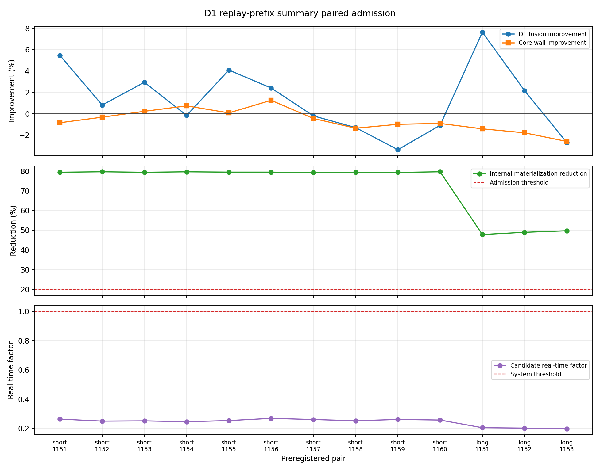
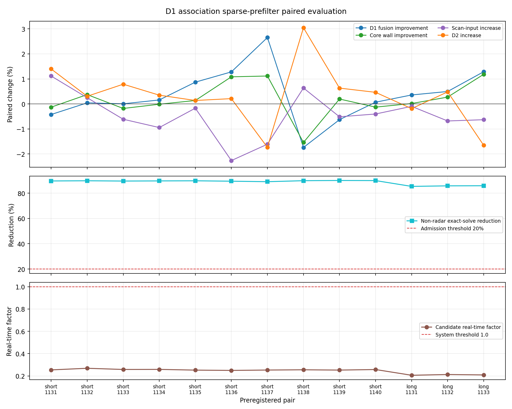
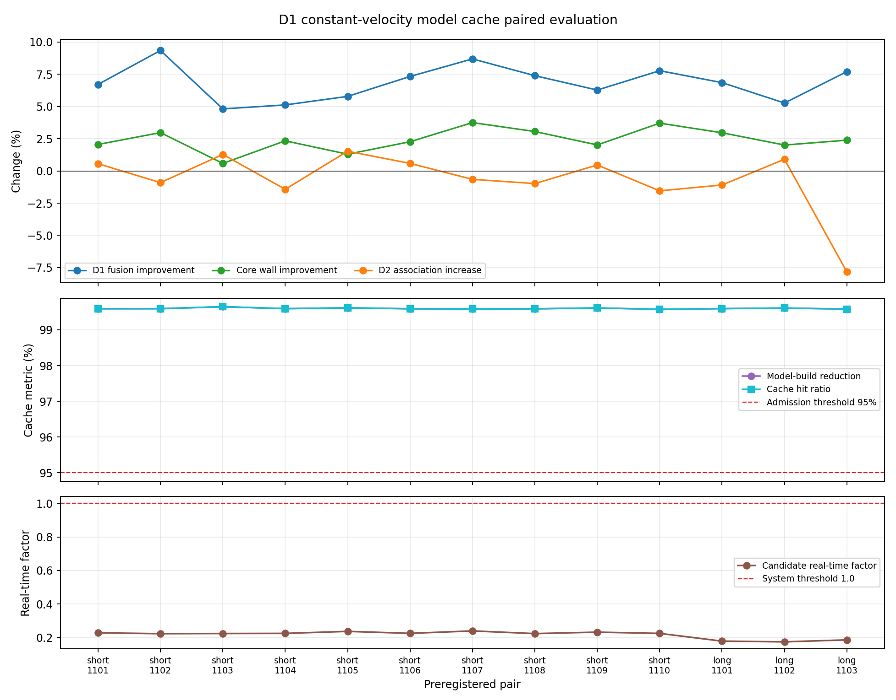

# D6 系统级评估指标实验报告

## 2.43 D4 v4 未注册候选开发完整性审计

### 结论

2026-07-29，D6 对
`region_resource_a2_executable_transfer_shadow_v4` 完成独立、只读开发完整性审计。
固定来源为 clean commit `fd857457bb27a4a709a7c4937e22ebe1cbd7f848`；manifest
content、model state 和 dataset SHA-256 分别为
`4f3e973597469d394a594bec3dd7d2c16b24e80d2e97ba45f718d9ef8397e116`、
`33a28060f11277a549b90d2f2f365962fec057b2bfb50a70ab5a422059cb9fe5` 和
`b31fc43f3d3cff34ee53f2b2c33ece0b06d7624e46e26a36c4aa834135e7fb8c`。

候选 180 文件、179 个清单 artifact、4 个 source implementation、外部 evidence、
dataset/split 和 train/validation payload 交叉绑定均通过。train 为 70 seeds、
140 episodes、350 samples，目标正/负 `60/290`；validation 为 15 seeds、30 episodes、
75 samples，目标正/负 `15/60`。test 只读取 manifest 元数据
15 seeds、30 episodes、74 frames；payload read、fit 和 weight fit 均为 0。
truth identifier、future outcome 和 reward 使用均为 0。

### 指标

actor checkpoint 为 epoch 107。train 正/负召回为 `0.966667/0.951724`，validation 为
`0.866667/0.966667`。confidence checkpoint 为 epoch 66；固定 0.60 门下：

| split | 正类召回 | 负类特异度 | Brier | 最小越门裕量 |
| --- | ---: | ---: | ---: | ---: |
| train | 0.206897 | 1.000000 | 0.186847275 | 0.000504935 |
| validation | 0.307692 | 1.000000 | 0.186468779 | 0.000504935 |

train 中最接近门的负类仅低 `0.000029838`。因此零已观测负类越门与薄正类召回、薄门限裕量
同时记录，`thin_margin_warning=true`。

development fixture confidence 为 `0.602367163`，仅标记
`training_domain_smoke_only`。v3 registry 8 文件树未变；v4 注册常量全空，registry 路径
不存在。全部权限 false，formal holdout/preflight 未完成，候选保持 unregistered 和
admission closed。报告状态为 `pass_development_integrity_only_admission_closed`，不建立
泛化、正式收益或运行准入。

最终治理增加四项等义 blocker：
`development_fixture_train_domain_smoke_only`、`confidence_positive_recall_low`、
`confidence_threshold_passing_margin_too_thin` 和
`runtime_outcome_and_benefit_unavailable`；与原有未注册、holdout 未完成和 preflight
未完成合计七项。开发完整性通过状态不变。

机器可读 JSON、中文报告和清单位于
`outputs/d4_v4_candidate_independent_audit_20260729/`。两个篡改负例均失败关闭；专项
`3 passed, 1 warning in 4.97s`，D6 全量
`1205 passed, 1 warning in 112.59s`。本轮没有运行正式 holdout、runtime preflight、
候选登记或权限变更。

最终审计时间为 `2026-07-29T23:15:40Z`。JSON content/file SHA-256 为
`3a4ed311c55e6419d3db1b3ba830f0ea6ce22c638eb363aa03c3f4510fdcd7c2` /
`e225a1a16ae2b1988ce5ea34b3cceaa30d7c829004663368ecc6514de3eb3887`；
中文报告和 `SHA256SUMS` 文件 SHA-256 为
`16a2e5a4efacd4b58b22b7b9dd9d0d632cedb3e7b8d6cc6d55a0dce954870fe0` /
`6ee4e7822800401b531acc93f03f105fc1ff02a77c1842fe1d36546bc9500af6`。

## 2.42 G1 模型来源证据复算

### 结论

2026-07-28，D6 为 readiness v2 增加 G1 `model_source` 可信适配器。适配器不接受调用方
自报 facts、formal 或权限，只接受正式 D5 v5 候选的固定 13 项引用。它逐文件复哈希，并
重新执行 external audit v2 和 post-assembly audit v2。持久化结果、v5 内嵌外审、模型
身份和 clean runtime 实现谱系必须一致。

显式外部根
`/tmp/MSM-d5-g1-formal-evidence-8d5e02e-20260727` 的一次只读实物验证通过。结果为
`formal_post_assembly_audit`、`component_ids=[d5_graph]`、`audit_passed=true`，模型
指纹为
`sha256:7fb5db8b6099ca4da5706a3bec53ff7cd634e8bd267c036ce3ee4ee4bf71ca71`。
clean source worktree 位于 `/tmp/MSM-d5-g1-formal-8d5e02e`。适配器没有修改这两处内容。

仓库中有 reference 和部分审计记录，但没有 sidecar 约定位置下的 13 项原制品。以仓库根
调用时保持 unavailable，不自动发现 `/tmp` 外部树。仓库内 audit JSON 不能替代原生产链。

### 验证结果

专项 `14 passed, 1 warning in 3.07s`，readiness v2 联合测试
`32 passed, 1 warning in 8.16s`，D6 全量
`1138 passed, 1 warning in 126.65s`。负例覆盖自签替代模型、事实和权限注入、原制品
篡改、路径逃逸、符号链接、摘要/schema/身份错配、组合缺组件和权限升级。warning 为既有
Matplotlib 三维投影环境提示。

该结果只关闭 G1 模型来源软件适配缺口。G1 其余八个 readiness gate、A1/A2/A3 模型来源、
C1/F1 四组件覆盖和外部授权仍不可用。D6 没有授予模型晋级、分配、接管、相机或控制权限，
本次也没有执行 AirSim 或物理拦截实验。

## 2.41 正式学习运行准备度审计

### 结论

2026-07-27，D6 完成 G1/A1/A2/A3/C1/F1 的统一运行前 readiness 软件验证。v2 manifest
只保存相对源制品路径和文件 SHA-256。当前受信 adapter 只有冻结 seed gate：reference
sidecar 绑定训练 seed 注册表、共享 split 注册表及四个模块数据集 manifest，再由现有
canonical seed auditor 重算。其他九类 gate unavailable。

18 个专项用例全部通过。每个变体各构造十个文件摘要和内部摘要均正确的旧通用 wrapper 后，
`formal_evidence_readiness` 仍为 unavailable。原 producer 文件篡改、sidecar 篡改、摘要
错配、未知 schema、缺文件、内外层路径逃逸、目录、缺制品根、输出篡改和命令行启动均有
覆盖。

独立审计报告中 G1 具备正式 v5、外部审计、20-seed held-out 和 paired-shadow 证据，但
readiness 尚无对应 model-source adapter。G1 还缺实际运行采用、ACK、物理窗口、唯一同键
运行 R0 和运行非退化。A1/A2/A3 受 development/shadow、不可辨识干预或非正式配对证据
阻断；C1/F1 不能由单组件通过推导。

当前根文件系统可用 `14139191296` 字节，约 `13.168 GiB`，低于固定 `20 GiB` 正式运行
保护线；没有第二大容量挂载点。该结果只将 execution startability 失败关闭。模型和正式证据
结论不受磁盘值影响，D6 也没有生成任何模型、分配、接管、相机或控制权限。

专项正例使用既有 canonical seed producer schema，只验证该单门 adapter。它不构成
G1/A1/A2/A3/C1/F1 已取得完整正式运行证据。六个变体当前均保持 formal unavailable。

单个 200v200 delayed-noisy R0 episode 的三份重复 JSONL 经 gzip-6 可由原始约
`96.6 MB` 降到约 `24.89 MB`。本节只记录容量背景，没有实现压缩，也没有降低保护线。

## 2.40 正式实验矩阵准入预检

### 结论

2026-07-25，D6 完成 R0/G1/A1/A2/A3/C1/F1 正式实验矩阵的静态准入预检。预检读取实际
`ExperimentMatrixPlan.cells()`，不运行 episode。当前清单包含 5700 个 cell，清单范围和训练
seed 隔离通过；运行 manifest 和逐 cell 证据缺失，通过数为 0，结论为 `fail_closed`。

上述结果通过实际 `ExperimentMatrixPlan` 对象调用 D6 接口得到。单独运行命令行且不提供
`--inventory` 时会得到 expected=0 和 `fail_closed`；该数字只表示缺输入，不是正式矩阵结果。

### 动态范围

R0、G1、A1、A2、A3、C1 覆盖九类场景、五档规模和 20 个未见 seed，共 5400 个 cell。F1
只覆盖三类全系统场景，共 300 个 cell。D6 不使用 6300 固定值；专项测试已验证 F1 增加一个
场景后清单数量自动变为 5800。

### 模型与证据

现有 D3、D4、D5 图模型和 D5 主动视觉模型的 manifest 与 weights SHA-256 均匹配，但四个
模型均未声明正式 assist 准入。当前还没有正式矩阵 manifest、运行 cell CSV、D6 逐 seed CSV、
聚合置信区间输入、中文正式报告、动画和运行模型清单。D2 身份交换与五米物理指标保持
unavailable，没有填 0。

预检制品位于
`outputs/formal_matrix_admission_precheck_20260725_current/`。该结论只关闭 D6 的静态预检
工具缺口，不关闭学习模型准入、200v200 实时性或物理拦截 GAP。
专项测试 `9 passed`，D6 全量 `889 passed, 1 warning`；既有 main 矩阵合同
`7 passed, 1 warning`。当前报告三项 SHA-256 校验通过。

## 2.39 D1 在线发布证据子集快照正式多种子评估

### 结论

2026-07-25，D6 对在线发布证据子集快照候选完成正式独立只读评估。输出 schema 为
`d6.d1_publication_evidence_snapshot_multiseed_evaluation.v1`，producer clean commit 为
`d0219eb14c529a4fb9bf7d6610a9f32055a09206`，matrix SHA-256 为
`6c808c4df8759fd893c6d37ff9dce4a1efa07f9867fc71aff47a55c5f8517338`。

正式 verdict 为 `reject`，`main_default_promotion_allowed=false`。候选
`required_observation_subset_v1` 保持默认关闭，参考 `full_consistency_snapshot_v1`
保持默认。候选最低实时因子为 `0.2034232632 < 1`，所以系统实时门未关闭。

### 场景与来源

正式矩阵包含 200 个目标、200 个资源和 2 个侦察节点。short 组为 seeds 1151-1160、每个
episode 2.2 秒；long 组为 seeds 1151-1153、每个 episode 10 秒。共 13 pair、26 个 fresh
complete episode，0 reused、0 failed。两臂使用同一 clean commit，唯一处理差异为在线发布
证据快照实现；回放前缀均使用 `per_checkpoint_prefix_rebuild_v1`。

evidence manifest SHA-256 为
`67813a3e850759dd4c194add4b622870345118aec5acdf74d2480f86c00735b4`。

### 语义与诊断

13/13 pair 的业务语义、有限状态、在线真值隔离、实现身份、D1/D2 在线记录、在线
consistency record count/digest、原 D1 fusion operation counts 和快照诊断审计均通过。
候选执行 429 次选择，429 次子集快照成功；fallback、lookup miss、invalid required ID 和
empty required set 均为 0。

| 工作量 | 正式值 |
| --- | ---: |
| 参考返回记录 | 1602170 |
| 候选返回记录 | 133917 |
| 返回记录削减率 | 91.641524% |
| 候选选择 | 429 |
| 候选子集成功 | 429 |
| 候选回退 | 0 |

### 性能

| 分组 | 指标 | 参考均值 | 候选均值 | 配对改善或增幅 |
| --- | --- | ---: | ---: | ---: |
| short | D1 融合耗时（秒） | 2.479580 | 2.482785 | -0.147877% |
| short | 核心流程耗时（秒） | 8.595556 | 8.566789 | 0.330057% |
| short | D2 关联耗时（秒） | 0.504043 | 0.513980 | 增幅 1.963565% |
| short | 最大驻留内存（KiB） | 876920.8 | 876145.6 | 降低 0.088749% |
| long | D1 融合耗时（秒） | 17.616719 | 17.430862 | 1.047143% |
| long | 核心流程耗时（秒） | 48.734323 | 48.325878 | 0.837777% |
| long | D2 关联耗时（秒） | 3.508502 | 3.458793 | 降低 1.149580% |
| long | 最大驻留内存（KiB） | 1630798.7 | 1624476.0 | 降低 0.384150% |

short D1 候选更快 `4/10`，long 候选更快 `2/3`。short D1 原始相对变化的 10000 次配对
bootstrap 95% 区间为 `[-1.003752%, 1.374681%]`。

### 冻结门

三个失败门为：

| 门限 | 实测 | 冻结判据 |
| --- | ---: | ---: |
| short candidate faster | 4/10 | >=8/10 |
| short D1 融合改善 | -0.147877% | >=1% |
| short bootstrap 原始变化上界 | 1.374681% | <=0% |

long D1 和更快数、short/long core、D2、RSS、语义、安全及返回记录削减门均通过。局部通过项
不能覆盖三个失败门，评估没有调低门限或删除 pair。

正式 bundle 位于
`outputs/d1_publication_evidence_snapshot_multiseed_20260725_formal_d0219eb_d6/`，包含完整
JSON、紧凑 JSON、13 条 pair CSV、中文 Markdown 和 `SHA256SUMS`。本节只覆盖三维质点仿真，
不代表 AirSim、目标处理器、硬件、实机或实飞结果。

同一正式 manifest 的第二次只读评估与正式 bundle 逐文件一致。聚焦测试为
`14 passed, 1 warning`，D6 全量为 `880 passed, 1 warning in 76.17s`。

## 2.38 D1 回放前缀摘要正式多种子评估

### 结论

2026-07-25，D6 对回放前缀摘要候选完成正式独立只读评估。输出 schema 为
`d6.d1_replay_prefix_summary_multiseed_evaluation.v1`，producer clean commit 为
`7d2e987471b521a1e531bf03a5c99af5096f676a`，matrix SHA-256 为
`85432d729877eff97e6f3dd517d4baa7a47f44a4fa42e6bfdc7ce85b8d9ec74b`。

正式 verdict 为 `reject`，`main_default_promotion_allowed=false`。候选
`fixed_lag_checkpoint_prefix_cumulative_summary_v1` 保持默认关闭，参考
`per_checkpoint_prefix_rebuild_v1` 保持默认。候选最低实时因子为
`0.1974407644 < 1`，所以 `system_realtime_gap_closed=false`。

### 场景与来源

正式矩阵包含 200 个目标、200 个资源和 2 个侦察节点。short 组为 seeds 1151-1160、每个
episode 2.2 秒；long 组为 seeds 1151-1153、每个 episode 10 秒。共 13 pair、26 个 fresh
complete episode，0 reused、0 failed。两臂使用相同 clean commit，唯一允许的处理差异是回放
前缀摘要实现。D1 模块微基准和 clean seed-1151 预检没有计入正式样本。

### 语义与诊断

13/13 pair 的业务语义、在线 consistency records digest/count、D1 原有融合操作计数、实现身份、
有限状态、诊断守恒和在线真值隔离均通过。候选实际产生摘要命中、checkpoint 复用、append
revision、pending preservation 和在线 snapshot projection。正常追加与不兼容追加物化为 0，
导出后 pending ledger 为 0。

| 工作量 | 正式值 |
| --- | ---: |
| 逻辑刷新记录 | 811858 |
| 实际内部物化记录 | 388468 |
| 内部物化减少率 | 52.150746% |
| 在线快照投影构造记录 | 656481 |
| 已披露记录构造总量 | 1044949 |

在线快照投影仍构造不可变记录。该数量单独披露，没有计入内部物化减少量。

### 性能

| 分组 | 指标 | 参考均值 | 候选均值 | 配对改善 |
| --- | --- | ---: | ---: | ---: |
| short | D1 融合耗时（秒） | 2.485541 | 2.460735 | 0.959611% |
| short | 核心流程耗时（秒） | 8.562172 | 8.583612 | -0.256641% |
| short | D1 扫描输入耗时（秒） | 0.744953 | 0.724599 | 2.569539% |
| short | D2 关联耗时（秒） | 0.501726 | 0.484404 | 3.192488% |
| short | 最大驻留内存（KiB） | 876111.2 | 876233.2 | -0.013714% |
| long | D1 融合耗时（秒） | 17.699231 | 17.277130 | 2.361778% |
| long | 核心流程耗时（秒） | 48.703409 | 49.645931 | -1.930083% |
| long | D1 扫描输入耗时（秒） | 4.277187 | 4.059489 | 4.884376% |
| long | D2 关联耗时（秒） | 3.376049 | 3.500212 | -3.610722% |
| long | 最大驻留内存（KiB） | 1630584 | 1624572 | 0.365212% |

short D1 候选更快 `5/10`，long 候选更快 `2/3`。short D1 原始相对变化的 10000 次配对
bootstrap 95% 区间上界为 `0.619827%`。

### 冻结门

五个失败门为：

| 门限 | 实测 | 冻结判据 |
| --- | ---: | ---: |
| short candidate faster | 5/10 | >= 8/10 |
| short D1 融合改善 | 0.959611% | >= 1% |
| short bootstrap 原始变化上界 | 0.619827% | <= 0% |
| short core wall 改善 | -0.256641% | >= 0.25% |
| long core wall 改善 | -1.930083% | >= 0.25% |

long D1 融合改善、内部物化减少、short/long RSS 和 D2 组均值门通过。局部通过项不能覆盖五个
失败门，评估没有调低门限或删除 pair。



正式 bundle 位于
`outputs/d1_replay_prefix_summary_multiseed_20260725_formal_7d2e987_d6/`。完整 JSON、紧凑
JSON、13 条 pair CSV、中文 Markdown、PNG 和 `SHA256SUMS` 已生成，目录内校验和全部通过。
main 从同一 manifest 重跑后，全部输出 SHA-256 与正式 bundle 一致。

本节只覆盖三维质点仿真，不代表 AirSim、目标处理器、硬件、实机或实飞结果。若继续优化在线
快照投影，应建立新候选和新预注册矩阵，不得覆盖本次 `reject`。

## 2.37 D1 关联稀疏预筛正式多种子评估

### 结论

2026-07-25，D6 对 clean source commit
`9302ccede2ca513c2235370e1a464fc88bc41150` 的 13 pair/26 fresh episode 三维质点证据完成
独立只读评估。evaluator schema 为
`d6.d1_association_sparse_prefilter_multiseed_evaluation.v1`，matrix SHA-256 为
`a7162d014d1c3c0f207355b24a5d7159bf3486d134ca21876f7469d1e915b71d`，evidence manifest
SHA-256 为 `43b0aeb41ff9abb243e86b559a6ec2d2e2e2cf94f50c4e45ff5c95d915268eb2`。

正式 verdict 为 `reject`，`optimization_admitted=false`、
`main_default_promotion_allowed=false`。失败门为 short D1 更快数、short D1 fusion 改善、
short bootstrap 上界、short core 改善和 long D1 fusion 改善；本轮没有调门或删除 pair。
reference `disabled_v1` 保持默认。

系统实时门独立失败：候选最低实时因子为 `0.2062730911 < 1`，
`system_realtime_gap_closed=false`。本节只评价 200 个目标、200 个资源、2 个侦察节点的三维
质点运行，不代表 AirSim、目标硬件、实机或实飞结论。

### 来源与业务等价

26 个 arm 全部 fresh complete，0 reused、0 failed；producer 状态为
`episodes_complete_pending_d6`。13/13 pair 的 source/路径/命令、实现身份、六模态诊断守恒、
有限状态、online truth use=0、业务语义和逐 pair/逐模态 exact gate-pass 相等均通过。

业务语义只归一化预注册 selector、对应 execution config/diagnostics、关联求解诊断、运行时哈希
派生 episode ID 和性能字段。在线消息、D1-D7 业务输出、D3 计划谱系、D4 内容地址与 ACK、离线
truth state/labels/proximity 均继续比较。

### 稀疏预筛诊断

| 模态 | Candidate pair | Rejection | Exact solve | Gate pass | Fallback |
| --- | ---: | ---: | ---: | ---: | ---: |
| radar | 9199071 | 9145313 | 53758 | 48321 | 3773 |
| lidar | 0 | 0 | 0 | 0 | 0 |
| acoustic | 0 | 0 | 0 | 0 | 0 |
| acoustic_3d | 0 | 0 | 0 | 0 | 0 |
| eo | 801650 | 258272 | 39837 | 3979 | 37571 |
| other | 0 | 0 | 0 | 0 | 0 |

非雷达精确求解由 reference 的 `298109` 降至 candidate 的 `39837`，减少
`86.636767%`，通过冻结的 `>=20%` 门。该局部计算削减没有自动转化为稳定的 D1 或核心墙钟收益。

### short/long 性能

| 组别 | 指标 | Reference 均值 | Candidate 均值 | 配对变化 |
| --- | --- | ---: | ---: | ---: |
| short | D1 fusion (s) | 2.473915 | 2.467389 | 改善 0.228437% |
| short | 核心墙钟 (s) | 8.599170 | 8.590696 | 改善 0.091096% |
| short | scan input (s) | 0.756319 | 0.752791 | -0.452226% |
| short | D2 association (s) | 0.502191 | 0.504759 | +0.559480% |
| short | RSS (KiB) | 877912.4 | 877882.0 | -0.003738% |
| short | RTF | 0.255962 | 0.256189 | 改善 0.096142% |
| long | D1 fusion (s) | 16.961857 | 16.840919 | 改善 0.713776% |
| long | 核心墙钟 (s) | 47.965475 | 47.729461 | 改善 0.490650% |
| long | scan input (s) | 3.989834 | 3.971143 | -0.470110% |
| long | D2 association (s) | 3.344833 | 3.328621 | -0.453717% |
| long | RSS (KiB) | 1610262.7 | 1610693.3 | +0.026850% |
| long | RTF | 0.208520 | 0.209550 | 改善 0.495628% |

D1 fusion 候选更快数为 short `7/10`、long `3/3`。10000 次 paired bootstrap 的 D1 原始变化
95% CI 为 short `[-0.946192%, 0.443531%]`、long
`[-1.286611%, -0.357903%]`。任一 pair 最大 RSS 增幅为
`0.077909%`，发生在 `short_seed_1131`；RSS 风险门通过。最低候选 RTF 为
`long_seed_1131` 的 `0.2062730911`，说明系统实时风险仍明确开放。

### 冻结门结果

通过的来源/安全门为 13/13 预筛审计、13/13 业务等价、13/13 exact gate-pass 相等、13/13
显式实现身份、13/13 有限状态和 0 online truth use。通过的性能/资源门包括 long 更快
`3 >= 2`、long core `0.490650% >= 0.25%`、short/long scan 增幅
`-0.452226%/-0.470110% <= 5%`、short/long D2 增幅
`0.559480%/-0.453717% <= 5%`、RSS 最大组均值/任一 pair 增幅
`0.026850%/0.077909% <= 5%`，以及非雷达精确求解削减
`86.636767% >= 20%`。

失败门如下：

| Gate | 实际值 | 冻结门 |
| --- | ---: | ---: |
| short candidate faster | 7 | >=8 |
| short D1 fusion 改善 | 0.228437% | >=1% |
| short bootstrap 原始变化上界 | 0.443531% | <=0% |
| short core 改善 | 0.091096% | >=0.25% |
| long D1 fusion 改善 | 0.713776% | >=1% |



正式 bundle 位于
`outputs/d1_association_sparse_prefilter_multiseed_20260725_formal_9302cce_d6/`。完整/紧凑 JSON、
13 条 pair CSV、中文 Markdown、PNG 和 `SHA256SUMS` 均已生成，校验和全部通过。定向测试
`13 passed, 1 warning in 7.22s`，D6 全量 `859 passed, 1 warning in 64.83s`。

## 2.36 D1 在线批帧交接正式多种子评估

### 结论

2026-07-25，D6 对 source commit
`43feaf600f288a85ce76a76862334256f0d0d352` 的 short 10 对、long 3 对，共 13 对/26 episode
三维质点证据完成独立只读评估。evaluator schema 为
`d6.d1_online_batch_frame_multiseed_evaluation.v1`，matrix SHA-256 为
`4afbf9ac273763a16aa01cc744fd67b52e437099460b33377a128f986ac5719b`。

全部预注册 gate 通过，候选优化结论为 `admit`。该结论与系统实时门分开：候选最低实时因子
`0.2044899434`，仍低于 `1.0`，因此 200v200 系统实时结论为“仍不足”。

### 正式实测

| 指标 | short | long | 门限 |
| --- | ---: | ---: | ---: |
| candidate faster | 10/10 | 3/3 | >=8 / >=2 |
| scan input 配对改善均值 | 38.289241% | 36.275282% | >=20% |
| core wall 配对改善均值 | 4.252745% | 4.916501% | >=2% |
| D2 组均值增幅 | 2.113047% | 2.830616% | <=5% |
| RSS 组均值增幅 | -0.061496% | 0.281879% | 最大 <=5% |

short scan input 配对相对变化 95% bootstrap 区间为
`[-40.065664%, -36.838329%]`，其上界通过 `<=0%` 门。任一 pair 最大 RSS 增幅为
`0.856727%`。全矩阵 reference/candidate request 均为 2665；reference 重复检查 55316 次，
candidate 为 0，减少率 `100%`；2665/2665 candidate request 使用 closed handoff，
closed ratio `100%`，fallback count 为 0。13/13 pair 业务语义、有限状态、显式实现身份和
批帧审计通过，26 arm 的 online truth use 总数为 0。

业务语义比较只归一化预注册批帧 treatment、诊断计数及派生字段、处理派生 episode 标识和性能。
跨运行 plan ID 先验证源 payload SHA、ACK、D4 authority 内容地址和连续版本，再映射为谱系 token；
assignment、授权、目标/资源绑定、owner/coalition 业务字段、状态机、计数、安全和下游引用继续
比较。正式 bundle 位于
`outputs/d1_online_batch_frame_multiseed_20260725_formal_43feaf6_d6/`，同目录复跑后全部制品
SHA-256 一致。本证据不是 AirSim、实机或实飞证据。

## 2.35 D1 不透明来源标识缓存正式评估

### 结论

D6 已完成冻结矩阵的独立只读评估。输入可用，13 pair 的来源、业务语义、有限状态、在线真值隔离、
实现身份和缓存审计均通过。局部优化未准入，`optimization_admitted=false`。系统实时缺口未关闭，
`system_realtime_gap_closed=false`。

唯一失败门是 long D2 关联墙钟组均值增幅 `5.605213%`，超过冻结上限 `5%`。
`long_seed_1101` 单 pair 增幅 `19.069868%`，按原矩阵保留。评估没有调门、删除样本或将该回归
归入业务语义豁免。

### 证据

| 项目 | 正式值 |
| --- | --- |
| evaluator schema | `d6.d1_opaque_source_identity_cache_multiseed_evaluation.v1` |
| producer commit | `d8fc76c066f21b077154f7be33c0b43558d237e5` |
| matrix SHA-256 | `218d04f3fc4a764fef82de612c78c8fbb5490380ae5d20aff6b9089635f2060d` |
| evidence manifest SHA-256 | `6c13176c2deb0b8065438bc835bddd87bc6a0ec507b3a48c7298b4141d2c501d` |
| 场景规模 | 200 个目标、200 个资源、2 个侦察节点 |
| short / long | 10 pair × 2.2 秒 / 3 pair × 10 秒 |
| arm 状态 | 26 fresh complete，0 reused，0 failed |
| 运行面 | 显式来源键，结构歧义 hold 关闭 |
| 参考实现 | `per_publication_build_v1` |
| 候选实现 | `bounded_generation_lru_v1`，容量 1024 |

本证据属于 source-only 三维质点运行面。它不说明默认无来源键 R0 路径有相同收益，也不代表
AirSim、目标处理器或实飞性能。

### 结果

| 指标 | short | long | 冻结门 |
| --- | ---: | ---: | ---: |
| D1 融合改善 | 9.465972% | 6.437432% | 各 >= 5% |
| 候选更快数 | 10/10 | 3/3 | >= 8/10，>= 2/3 |
| 核心墙钟改善 | 2.845610% | 2.728043% | 各 >= 2% |
| D2 关联组均值增幅 | 4.677567% | 5.605213% | 各 <= 5% |
| RSS 组均值增幅 | -0.011981% | -0.031573% | <= 5% |

全矩阵参考臂执行 312317 次来源标识构造。候选执行 2612 次构造并命中 309705 次。标识构造减少率
和缓存命中率均为 `99.163670%`，高于 `95%` 门限。候选最大当前和峰值条目数均为
`202/1024`。short D1 配对 bootstrap 原始变化 95% 上界为 `-8.213147%`。


上图第一部分显示逐 pair D1、核心墙钟和 D2 变化。`long_seed_1101` 的 D2 增幅形成长时组唯一
冻结门失败。第二部分显示构造减少率和命中率均高于 95%。第三部分显示候选实时因子全部低于 1。
候选最低实时因子为 `0.193887`。

正式 bundle 位于
`outputs/d1_opaque_source_identity_cache_multiseed_20260725_formal_d8fc76c_d6/`。聚焦测试
`16 passed, 1 warning in 5.85s`，D6 全量
`834 passed, 1 warning in 59.24s`；warning 为既有 Matplotlib `Axes3D` 环境提示。新的确认
实验必须预先冻结矩阵，并保留当前门限和本轮不准入结论。

## 2.34 D1 结构化数值雅可比正式评估

### 当前结论

main 已使用 D6 独立离线评估器完成冻结矩阵的正式评估。结果为 `availability=true`、
`optimization_admitted=true`、`system_realtime_gap_closed=false`。13 pair 的来源、业务语义、
有限状态、在线真值隔离、实现身份、诊断和操作数守恒均通过，全部冻结准入门通过。

局部优化准入只适用于本次三维质点矩阵。它不代表 AirSim、目标硬件或实飞实时能力。main 已依据
D6 独立准入结果，将 scalable 3D `IntegratedStackConfig` 和 `run_episode` CLI 默认实现晋级为
`known_dimension_structural_columns_v1`，并保留 `dense_output_probe_v1` 显式回退。D1 独立
`FusionAdapter` 默认实现不变。

### 工具范围

| 项目 | 当前状态 |
| --- | --- |
| evaluator schema | `d6.d1_structured_jacobian_multiseed_evaluation.v1` |
| producer commit | `9d1f54f8540fdc4a7a1011121aafac5718290122` |
| matrix SHA-256 | `c6c3cf53c89dfb3155a29ba49bb77a12c8bdf1a5d433c4f645de0d00c506d478` |
| 评估规模 | 200 个目标、200 个资源、2 个侦察节点 |
| 正式矩阵 | short 10 pair、long 3 pair，共 26 个 fresh arm |
| 正式 producer evidence | main 已生成，26/26 fresh complete，0 reused、0 failed |
| D6 正式评估 | `availability=true` |
| 局部优化准入 | `optimization_admitted=true` |
| 系统实时缺口 | `system_realtime_gap_closed=false` |
| scalable 3D 默认实现 | `known_dimension_structural_columns_v1` |
| scalable 3D 显式回退 | `dense_output_probe_v1` |
| D1 独立 FusionAdapter | 默认实现不变 |
| 晋级后回归 | scalable 测试通过；2v2 smoke 三处表面记录候选，finite=true，online truth=0 |

评估器校验 source clean 状态、schema、命令、路径、selector、完整实现 ID、四份最终诊断、操作数
守恒、业务语义、有限状态和在线真值零使用。性能统计覆盖 D1 fusion、core wall、D1 scan input、
D2 association、RSS、逐 pair 更快数、10000 次配对 bootstrap 和量测函数求值减少率。

### 性能结果

| 组别 | D1 融合改善 | 核心墙钟改善 | 候选更快 |
| --- | ---: | ---: | ---: |
| short 10 pair | 6.084778% | 1.897370% | 10/10 |
| long 3 pair | 4.676061% | 1.786530% | 3/3 |

全矩阵量测函数求值减少 `53.846154%`。候选最低实时因子为 `0.180726`，低于系统实时门限 1，
所以局部优化准入通过而系统实时缺口保持开放。

正式报告位于
`outputs/d1_structured_jacobian_multiseed_20260725_formal_9d1f54f_d6/D1_STRUCTURED_NUMERICAL_JACOBIAN_MULTISEED_REPORT_CN.md`。
生成报告及其 `SHA256SUMS` 保持原样。

2026-07-25 专项回归为 `20 passed, 1 warning in 6.05s`，D6 全量为
`818 passed, 1 warning in 55.42s`。warning 为既有 Matplotlib `Axes3D` 环境提示。

## 2.33 在线真值递归检查正式评估

### 结论

候选 `builtin_specialized_recursive_v2` 未通过冻结矩阵的局部优化准入，
`optimization_admitted=false`。默认继续使用 `generic_recursive_v1`，候选保持关闭。

候选最低实时因子为 `0.165369`，低于门限 1，
`system_realtime_gap_closed=false`。本节只评价 200 个目标、200 个资源、2 个侦察节点的三维质点
仿真，不代表 AirSim、目标硬件或实飞能力。

### 证据

| 项目 | 正式值 |
| --- | --- |
| 验证日期 | 2026-07-24 |
| source clean commit | `8d8bb6ed7a417705236835f235361f45a021bb2b` |
| matrix SHA-256 | `764574b9897d00101c26c555de2f407e1736c7e6ff50420eebf131e154618dc8` |
| evidence manifest SHA-256 | `c1fb38fd6f68385a27a9a2d5df2a0ff373010f20c78f6fa9132dd781b505980b` |
| short / long | 10 pair × 2.2 秒 / 3 pair × 10 秒 |
| 执行状态 | 26 complete，0 reused，0 failed |
| 参考实现 | `generic_recursive_v1` |
| 候选实现 | `builtin_specialized_recursive_v2` |

13/13 pair 的业务语义、有限状态、在线真值隔离、实现身份、来源和诊断门通过。参考与候选各
94074 条在线消息均满足 `validation_count = online_message_count`，在线真值使用为 0。完整 JSON、
compact JSON、含 13 条 pair 记录的 CSV、中文 Markdown 和 `SHA256SUMS` 已完成复核。

### 性能

| 指标 | short 参考 | short 候选 | short 变化 | long 参考 | long 候选 | long 变化 |
| --- | ---: | ---: | ---: | ---: | ---: | ---: |
| 发布总线及收尾墙钟/s | 0.900293 | 0.696858 | 改善 22.58% | 3.810588 | 2.834910 | 改善 25.63% |
| 核心墙钟/s | 9.163492 | 8.933562 | 改善 2.50% | 52.362864 | 54.235533 | 回退 3.47% |
| D1 融合墙钟/s | 2.582814 | 2.580385 | 下降 0.00% | 18.495864 | 19.511515 | 增加 5.29% |
| D2 关联墙钟/s | 0.506169 | 0.497850 | 下降 1.43% | 3.750915 | 4.039187 | 增加 7.34% |
| 最大常驻内存/KiB | 872299.6 | 871433.2 | 下降 0.10% | 1601708.0 | 1601294.7 | 下降 0.03% |

发布总线主指标在 short 10/10、long 3/3 pair 中更快。short 和 long 的配对 bootstrap 原始相对
变化 95% 区间上界分别为 `-19.34%`、`-19.66%`，均低于 0。该结果说明专用递归遍历稳定降低了
总线发布与收尾成本。

三项预注册门失败：

1. long 核心墙钟改善要求不低于 `0.5%`，实际回退 `3.47%`；
2. long D1 融合均值增幅要求不高于 `5%`，实际为 `5.29%`；
3. long D2 关联均值增幅要求不高于 `5%`，实际为 `7.34%`。

局部阶段改善没有形成 long 组全栈非退化，因此不能启用候选。long seed 1102 的核心、D1 和 D2
回退可以由后续 balanced-order v2 复核运行顺序与主机热状态。该复核只作为诊断，不修改本次 v1
正式结论。任何重新准入都需要预先冻结新矩阵并生成独立报告。

正式 bundle 位于
`outputs/online_truth_guard_multiseed_20260724_formal_8d8bb6e/`。原始正式 v1 机器结果保持不变，
中文报告明确记录默认实现和诊断边界。本次同步后专项为
`14 passed, 1 warning in 4.46s`，D6 全量为
`798 passed, 1 warning in 52.01s`；warning 为既有 Matplotlib `Axes3D` 环境提示。

## 2.32 D1 常速度模型缓存正式评估

### 结论

容量 128 的精确键有界最近最少使用缓存通过冻结三维质点矩阵的局部优化准入，
`d1_optimization_admitted=true`。13/13 pair 的业务语义、有限状态、在线真值隔离、实现身份和
缓存审计通过，19/19 准入门通过。

候选最低实时因子为 `0.17394990897894075`，低于门限 1，
`system_realtime_gap_closed=false`。本节只评价 200 个目标、200 个资源、2 个侦察节点的三维
质点运行，不代表 AirSim、目标硬件、传感器精度、实飞或物理拦截性能。

### 证据

| 项目 | 正式值 |
| --- | --- |
| 验证日期 | 2026-07-24 |
| source clean commit | `44223566439a446fc49f2a3fd861d1d51bd676b9` |
| matrix SHA-256 | `9898656598f0fa282620afe2384a3d656b7496f8957109c413bcb62069fd2e9a` |
| evidence manifest SHA-256 | `75c5c716c228018b26f3caa66578b5c8d68d4e111ac6aed22b48575fee82505c` |
| short / long | 10 pair × 2.2 秒 / 3 pair × 10 秒 |
| 执行状态 | 26 complete，0 reused，0 failed |
| 参考实现 | `per_prediction_build_v1` |
| 候选实现 | `bounded_exact_lru_v1` |
| 缓存容量 | 128 |

D6 只读消费 episode、资源记录、标准输出、标准错误和 evidence manifest。完整 JSON、compact
JSON、逐 pair CSV、中文 Markdown、PNG 和 `SHA256SUMS` 已复核。CSV 包含表头和 13 条 pair
记录，PNG 尺寸为 1955 × 1530，五项制品的 SHA-256 校验全部通过。

### 性能

| 指标 | short | long | 准入门 |
| --- | ---: | ---: | ---: |
| D1 融合改善 | 6.9271% | 6.6103% | 均不低于 5% |
| 核心墙钟改善 | 2.4060% | 2.4537% | 均不低于 2% |
| D2 关联增幅 | -0.1082% | -2.6729% | 均不高于 5% |
| RSS 均值增幅 | 0.0145% | 0.2959% | 均不高于 5% |
| D1 候选更快 | 10/10 | 3/3 | 至少 8/10、2/3 |

任一 pair 的最大 RSS 增幅为 `0.8629%`。short D1 融合原始相对变化的 10000 次配对 bootstrap
上界为 `-6.0841%`，低于 0。候选模型构造数由参考的 875031 次降至 3535 次，构造减少率为
`99.5960%`；缓存命中率同为 `99.5960%`。候选最大当前条目数和最大峰值条目数均为 `128/128`。



上图第一部分给出逐 pair 的 D1、核心墙钟和 D2 变化，第二部分给出构造减少率与命中率，第三部分
给出候选实时因子。全部候选实时因子位于约 0.17 至 0.24，局部缓存收益尚不足以关闭系统实时缺口。

### 边界

本次准入说明缓存处理没有改变冻结矩阵内的业务结果，并满足预注册的局部性能、下游回归、内存和
缓存效率门。它不证明其他目标规模、复杂传感器负载、AirSim 调度或目标处理器上仍保持相同收益。
后续需要分别形成 AirSim 和目标硬件的实时证据；传感器精度与拦截效果由独立实验评价。

正式 bundle 位于
`outputs/d1_cv_motion_model_cache_multiseed_20260724_formal_4422356/`。生成报告数据保持只读。
本次文档同步后 D6 全量回归为 `784 passed, 1 warning in 55.02s`；warning 为既有 Matplotlib
`Axes3D` 环境提示。

## 2.31 D1 发布元数据 v2 正式评估

### 结论

`immutable_shared_v2` 通过本次 D1 局部优化准入，
`d1_optimization_admitted=true`。系统实时缺口保持开放，
`system_realtime_gap_closed=false`。候选最低实时因子为
`0.17308010045846806`，低于系统门限 1。

本节证据来自 200 个目标、200 个资源、2 个侦察节点的三维质点仿真。它不代表 AirSim、目标硬件
或实飞性能。

### 证据

| 项目 | 正式值 |
| --- | --- |
| 验证日期 | 2026-07-24 |
| source clean commit | `be399e138762f5e660f553c8caa812d52ab38c61` |
| evidence schema | `scalable3d-d1-publication-metadata-v2-multiseed-evidence-v1` |
| evidence manifest SHA256 | `59fb70e37662cd1288ca56aaf6c5f68914137cc47fe6de2d8aff5a06dc2909b9` |
| matrix SHA256 | `51429554d58b82e94f922f7e0042144fd3440044f5188b51d77c578424d96927` |
| short / long | 10 pair × 2.2 秒 / 3 pair × 10 秒 |
| arms | `per_track_copy_v1` / `immutable_shared_v2` |
| D1 v2 合同 | `d1.publication_audit_tree.v2` |
| 执行状态 | 13 pair、26 arm complete，返回码全部为 0 |

### 性能

| 指标 | short 参考 | short 候选 | short 配对改善 | long 参考 | long 候选 | long 配对改善 |
| --- | ---: | ---: | ---: | ---: | ---: | ---: |
| D1 融合墙钟/s | 3.740630 | 3.234146 | 13.5447% | 31.798717 | 23.264824 | 26.8298% |
| D2 关联墙钟/s | 0.657417 | 0.548699 | 16.1939% | 5.869413 | 3.774282 | 35.6213% |
| 核心墙钟/s | 10.451244 | 9.764102 | 6.5677% | 68.901075 | 56.318948 | 18.2438% |
| 最大常驻内存/KiB | 1008978.4 | 868146.0 | 13.8390% | 2200844.0 | 1606185.3 | 26.7678% |

short D1 原始相对变化 bootstrap 95% 区间为
`[-14.8233%, -12.1357%]`。候选在 short `10/10`、long `3/3` 中更快。D2 关联准入使用原始增幅，
short/long 分别为 `-16.1939%/-35.6213%`，均满足 `<=5%`。

### 审计与门控

13/13 pair 的业务语义、有限状态、在线真值隔离、实现身份和 D2 发布元数据审计全部通过。候选共
执行 702 次 v2 合同校验和 702 次完整内容审计，随后完成 139920 次身份复用，内建等价复用和
合同拒绝均为 0。参考共执行 702 次完整审计和 139920 次内建等价复用，全部 v2 计数为 0。

D2 审计字段仅作为预注册处理差异做窄范围归一化，其他 summary 和治理字段没有被整体忽略。
非白名单业务字段篡改测试会使语义门失败。全部局部准入门通过。

正式 bundle 位于
`outputs/d1_publication_metadata_v2_multiseed_20260724_formal_be399e1/`，包含完整 JSON、
紧凑 JSON、逐 pair CSV、中文 Markdown、曲线 PNG 和 `SHA256SUMS`，未复制原始 episode。
v1/v2 专项为 `37 passed, 1 warning`，D6 全量为
`771 passed, 1 warning in 47.61s`；warning 为既有 Matplotlib `Axes3D` 环境提示。

## 2.30 D1 航迹发布元数据正式评估

### 结论

不可变共享审计元数据候选未通过正式准入，`d1_optimization_admitted=false`。D1 融合阶段达到
预注册局部门，但 D2 关联阶段出现显著反向开销，short 和 long 核心墙钟改善均未达到 5%。

候选最低实时因子为 `0.14695931849644195`，`system_realtime_gap_closed=false`。本节是
200 个目标、200 个资源、2 个侦察节点的三维质点仿真，不是 AirSim 或实机结果。

### 证据

| 项目 | 正式值 |
| --- | --- |
| source clean commit | `a36f519ed954a9ba8bdc3fe149ba2835da290c39` |
| evidence schema | `scalable3d-d1-publication-metadata-multiseed-evidence-v1` |
| matrix SHA256 | `2517b2ac22b8e2b39e5642b0b510419e1e7f9fa18d26f1f682b8330086ee5f2f` |
| short | seeds 1101-1110，2.2 秒，10 对 |
| long | seeds 1101-1103，10 秒，3 对 |
| arms | `per_track_copy_v1` / `immutable_shared_v1` |
| 完成状态 | 13 对、26 个 complete arm、返回码均为 0 |
| stderr | 26 个 arm 均只有同一已登记 Matplotlib `Axes3D` 环境警告 |
| bootstrap | 10000 次，随机种子 20260724 |

D6 对 4.2 GB evidence 采用逐行 JSONL 哈希和逐行成对比较。原始 evidence 保持只读，未复制到
归档目录。

### 性能

| 指标 | short 参考 | short 候选 | short 均值比改善 | long 参考 | long 候选 | long 均值比改善 |
| --- | ---: | ---: | ---: | ---: | ---: | ---: |
| D1 融合累计墙钟/s | 3.688192 | 3.087261 | 16.2934% | 30.639399 | 21.126366 | 31.0484% |
| D2 关联累计墙钟/s | 0.644394 | 0.988737 | -53.4367% | 5.713552 | 15.420213 | -169.8884% |
| 核心墙钟/s | 10.272705 | 10.103672 | 1.6455% | 66.643720 | 65.840401 | 1.2054% |
| 外部 elapsed/s | 17.459000 | 17.138000 | 1.8386% | 96.023333 | 94.793333 | 1.2809% |
| RSS/KiB | 1011095.6 | 867767.6 | 14.1755% | 2206108.0 | 1625633.3 | 26.3122% |

D1 融合逐对平均改善为 short `16.2381%`、long `31.0102%`。short 原始相对变化 bootstrap
95% 区间为 `[-17.5718%, -14.5105%]`。候选分别 `10/10`、`3/3` 更快。完整逐对值、P50、
P95、最大值和其他阶段位于 evaluation JSON 和 CSV。

### 语义与门控

13/13 pair 的业务语义、有限状态、在线真值隔离和实现身份均通过。参考逐航迹复制计数为正；
候选复制计数为 0 且共享复用为正；每对完整 `GlobalTrack` 元数据物化数相等。D2 身份和
ID switch、D3 计划谱系、D4 内容地址与 ACK 来源、D5/D7 输出及离线真值制品保持等价。

失败门只有两项：

1. short 核心墙钟改善 `1.6455%`，低于 5%；
2. long 核心墙钟改善 `1.2054%`，低于 5%。

D2 反向开销来自容器类型互操作。D2 的批量真值隔离审计只对精确 Python 内建容器启用等值代表
复用。候选只读映射/序列包装未满足该门，导致共享审计树按每条 `GlobalTrack` 递归扫描。该机制
由阶段结果和只读源码核对共同确认。

### 后续

D1 与 D2 需联合消除只读共享容器和真值隔离审计之间的重复扫描，同时保持真值键失败关闭和
只读语义。main 应重跑相同 13-pair 矩阵；D6 使用同一门限复评。未完成前，候选不能作为默认
性能准入实现。

归档位于
`outputs/d1_publication_metadata_multiseed_20260724_formal_a36f519/`，含 evaluation JSON、
aggregate JSON、逐 pair CSV、中文 Markdown、PNG 和 `SHA256SUMS`。
专项测试 `27 passed`，D6 全量测试 `761 passed, 1 warning in 41.25s`。

## 2.29 D1 扫描输入同提交正式评估

### 结论

D1 扫描输入候选实现通过正式准入，`d1_optimization_admitted=true`。D6 的正式 evidence
消费和报告缺口关闭。系统实时性没有关闭，`system_realtime_gap_closed=false`。

本节只评价冻结三维质点环境中的扫描输入组织优化。结果不是 AirSim、目标处理器或实机性能，
也不说明完整系统已达到实时运行。

### 证据条件

| 项目 | 正式值 |
| --- | --- |
| 评估日期 | 2026-07-24 |
| 源提交 | `d14285e4fdeb2f2e2cd32fad2f6d42e30f9e73a7` |
| 源工作区 | clean |
| manifest 状态 | `episodes_complete_pending_d6` |
| manifest SHA256 | `760cd0e522b27b99de8c30c366ad7e65f16f783d71cf28e3492be299e24b2402` |
| 矩阵 SHA256 | `3e852e4036d17d4da7c80dbb4ddea75b6ed7e27ee9d0be3195c2d1b5e30a531d` |
| 规模 | 200 个目标、200 个资源、2 个侦察节点 |
| short | seeds 1101-1110，每组 2.2 秒 |
| long | seeds 1101-1103，每组 10 秒 |
| 实现 | `reference_v1` / `candidate_v2` |
| 执行状态 | 13 个 pair、26 个 arm complete，退出码全部为 0 |
| bootstrap | 10000 次，随机种子 20260724 |

### 性能结果

| 组别 | 参考累计墙钟均值 | 候选累计墙钟均值 | 平均改善 | 候选更快 | 原始变化 95% 区间 |
| --- | ---: | ---: | ---: | ---: | ---: |
| short | 1.212452 s | 1.145650 s | 5.360122% | 9/10 | [-8.208165%, -3.084141%] |
| long | 6.687633 s | 6.340680 s | 5.142482% | 3/3 | [-8.837129%, -1.669361%] |

配对原始变化按 `(candidate-reference)/reference` 计算，负值表示候选耗时下降。short 和 long
的置信区间均低于 0。核心 episode 墙钟的方向化平均改善分别为
`0.7187453419550146%` 和 `0.5792474793915308%`。RSS 组均值与每个 pair 的最大退化均未超过
预注册 5% 门限。

### 语义和安全门

13 个 pair 的业务语义、有限状态、在线真值隔离和实现身份检查全部通过。业务比较保留 D3 计划
版本和前序关系，并验证 D4 内容地址与确认引用。离线真值只用于参考/候选等价审计，在线真值使用
计数保持为 0。

候选最小实时因子为 `0.14342687633969603`，低于系统实时门 1。该结果说明扫描输入阶段的候选
实现满足本次准入条件，同时确认完整栈仍存在实时容量缺口。

### 归档

独立 D6 bundle 归档于
`outputs/d1_scan_input_multiseed_20260724_formal_d14285e/`，包含完整 evaluation JSON、
aggregate JSON、13-pair CSV、中文 Markdown、改善曲线 PNG 和 `SHA256SUMS`。4.2GB 原始 episode
证据保留在外部只读目录，没有复制到 D6 输出。

## 2.28 D1 多 seed 与长时 evaluator 验证

### 结论

多 seed 与长时评估入口、completed evidence manifest loader 和失败关闭测试已完成。main 已完成
正式 v3 manifest 并生成首次报告。本节记录指标方向展示修复和固定二维 PNG writer 验证；本轮没有
读取或修改正式 evidence，也没有改变既有优化准入判定。

### 预注册合同

| 项 | 预注册值 |
| --- | --- |
| short | seeds 1101-1110，2.2 s |
| long | seeds 1101-1103，10.0 s |
| v1 reference / candidate | `7cc2d0cfd598a72d60c6ba8c7d4a283f4e5a897d` / `95bf46e34321127313757986bb28bfb14b7e3c59` |
| v2 reference / candidate | `3c134c34655618b2e4d41302f9fbf3b6b4b78929` / `8c1188267c37c5e4a546abc8e7dd6c5a4bb48dba` |
| v2 base commits | v1 两端提交 |
| v2 公共 D2 修复 | `e4147b8`，`fix(d2): align false alarm exclusion audit` |
| v2 输出复用 | `v1_outputs_reused=false` |
| v3 reference / candidate | `a5a472cf81496d94a98db3deb88a3d5c6951f0ce` / `064cbb979d3bab68fee995e476df25709eb666db` |
| v3 两端 base | 均为 `064cbb979d3bab68fee995e476df25709eb666db` |
| v3 公共 D1 修复 | `064cbb...`，`fix(d1): preserve covariance positive semidefiniteness` |
| v3 reference treatment | `a5a472...`，`test(d1): select scalar covariance reference` |
| v3 证据边界 | v1/v2 输出均不复用，reference/candidate vectorized=`false/true` |
| 目标 / 资源 / 侦察节点 | 200 / 200 / 2 |
| 结构歧义保活 | 必须启用 |
| runtime profile SHA-256 | `deabac3fbf2a788f68a0b807945e5f1bedacf8c5917c4d3b49c5cffb3c90da70` |
| bootstrap | 10000 次，RNG seed 20260724 |
| 每项输入 | 两个 episode、两份 GNU time -v、一个 cross-build JSON |
| arm/seed/duration 来源 | 显式注册，不从目录名推断 |

### 测试范围

正例构造完整 13-pair fixture，验证 short/long 均值、中位数、P95、配对变化、确定性 bootstrap、
同 seed 单位成本增长、JSON/CSV/中文报告、固定 PNG 和 CSV 纯 LF。相同 fixture 生成 main 合同形态的
`evidence_manifest.json`，验证 manifest CLI 与 `--pair` 互斥。失败关闭覆盖：

1. 预注册 pair 缺失；
2. 除 seed/duration 外的配置漂移；
3. runtime profile 和结构歧义保活开关漂移；
4. cross-build false；
5. 在线真值非零或进程非零退出；
6. short 更快数、均值、bootstrap CI 和 P95 门；
7. long 更快数和均值门；
8. candidate 长短单位成本增长恶化超过 5%；
9. core wall 组均值、RSS 组均值和任一 RSS pair 超过 5%；
10. manifest schema、experiment、case、提交、规模、运行参数、bootstrap、准入门、runtime
    摘要、arm 标签/状态/返回码、cross 状态和证据路径篡改；
11. v2 effective/base commits、公共 D2 修复来源和主题、v1 输出复用标志篡改，以及 v1 混入 v2
    谱系字段；
12. v3 experiment、effective/base commits、公共 D2/D1 修复、reference treatment、两级输出复用
    标志和两臂向量化标志逐项篡改，以及 v2 注入 v3 字段；
13. 越低越好和越高越好两类指标的更优计数、改善百分比、兼容字段和 Markdown 表头/行。
14. PNG 固定文件名、PNG 签名、非空内容、CLI `outputs.png`，以及缺 pair/缺指标时删除旧图并
    失败关闭。

### 暂停矩阵分析

main 在 long seed 1102 reference 完成仿真和主要写盘后，旧 D2 producer 报告
`known_false_alarm_only_mapping_count=14`。持久化
`frames[].mappings[]` 中只有 11 条同时满足 `status=excluded` 和
`reason=known_false_alarm_only`；另 3 条状态为 unavailable，原因为
`source_observation_outside_lineage_window`。D6 consumer 继续要求 audit 与持久化明确排除数精确
相等，因此旧 `14/11` 输出被拒绝，进程退出为 1。

D2 owner 已把 producer 计数改为遍历最终 `all_mappings` 后只统计明确排除记录。D6 回归验证修复后
`11/11` 通过，旧 `14/11` 在 truth-isolated 和 runtime join 两条入口均失败关闭。main 随后冻结
v2 矩阵，使 reference 和 candidate 同时包含该修复，并保留 v1 两端作为 base commits。
`v1_outputs_reused=false` 禁止把旧失败输出带入 v2。main 现已冻结 v3 配置，使两臂共享 D1
半正定修复和 D2 处置修复，只通过 reference treatment 选择标量参考实现，并禁止复用 v1/v2 输出。
正式 v3 manifest 随后已由 main 完成。首次报告暴露的是展示方向错误，不是 evidence 或准入门错误。

### 指标方向修复

wall、P95、scan、core、external elapsed 和 RSS 均按越低越好解释。实时因子按越高越好解释。
分组 JSON 保留原始 `(candidate-reference)/reference`、`candidate_lower_count` 和 bootstrap 区间，
新增 `improvement_direction` 与 `candidate_better_count`。`mean_improvement_pct` 统一为正值表示
候选更优。

main 提供的正式 v3 首次报告中，实时因子 short/long 原始变化为 `+3.222%/+3.601%`。修正后的展示
应为正改善，候选更优 seed 分别为 `10/10` 和 `3/3`。bootstrap 区间仍按原始相对变化报告，不做
符号翻转。本轮没有改动准入门、正式 evidence、提交绑定或既有 `d1_optimization_admitted` 结果。

### 固定图表

writer 新增 `d1_covariance_limit_multiseed_long_improvements.png`，尺寸固定为 12×8 英寸、
160 DPI。上半图按显式 seed 绘制 short 10 项和 long 3 项 D1 融合配对改善。下半图绘制两组的
D1 融合、融合 P95、核心墙钟、外部 elapsed 和实时因子方向化均值改善。实时因子越高越好，其他
四项越低越好，图中正值均表示候选更优。

RSS 仍在机器统计、Markdown 表格和准入门中保留，不作为主图性能收益。图表生成前要求 13 个 pair
集合精确、融合配对变化有限、五项分组 summary available 且方向与固定映射一致。任一条件不满足，
writer 删除同名旧图并抛出错误，不留下可被误读的 PNG。CLI 返回的 `outputs` 增加 `png` 路径；
JSON、CSV、Markdown 的统计内容和 evidence schema 未改变。

### 测试结果

| 检查 | 结果 |
| --- | ---: |
| 多 seed/长时专项 | 69 passed |
| D6 全量 | 719 passed |
| 失败 | 0 |
| warning | 1 条既有 Matplotlib `Axes3D` 环境提示 |
| 正例 CSV | 13 行数据，14 LF，0 CR |
| 正例 PNG | 固定文件名、PNG 签名、非空 |

方向 fixture 同时验证 lower-is-better 和 higher-is-better，并用 Markdown 回归固定实时因子
`10/10`、`3/3`。既有准入正反例继续通过，说明本次只改变派生展示字段。

### 后续处理

main 应使用同一 completed v3 manifest 重新运行当前 evaluator，重生正式
JSON/CSV/Markdown/PNG bundle。该操作不需要重跑 13 个 pair，也不能修改正式 evidence 或准入结果。

## 2.27 D1 协方差成对限制向量化准入

### 结论

D1 优化通过本批准入门，`d1_optimization_admitted=true`。三轮业务语义、有限状态、在线真值隔离、
观测数和进程退出状态均通过。D1 融合累计墙钟均值下降 `10.4411%`，episode 内调用 P95 的三轮均值
下降 `5.9154%`。

系统实时性缺口未关闭，`system_realtime_gap_closed=false`。候选实时因子均值为 `0.215065`。
本批只有 seed 1100 的三次 2.2 秒三维质点交错 clean 回放，不是多 seed、AirSim、均方根误差、
归一化估计误差平方或归一化创新平方试验。

### 输入

| 项 | 值 |
| --- | --- |
| 模式 | 三维质点 D1-D7 full stack 写盘回放 |
| 目标 / 资源 / 侦察节点 | 200 / 200 / 2 |
| seed | 1100 |
| 世界时间 | 2.2 s |
| clean pair | 3 轮 reference/candidate 交错运行 |
| reference commit | `7cc2d0cfd598a72d60c6ba8c7d4a283f4e5a897d` |
| candidate commit | `95bf46e34321127313757986bb28bfb14b7e3c59` |
| 每 arm 在线观测 | 2035 |
| 在线真值使用 | 0 |
| cross-build | 3/3 passed，规范化在线载荷 3/3 一致 |
| 进程退出 | 6/6 为 0 |

评估只使用 `/tmp/msm_d1_cov_clean_r1_*`、`r2_*`、`r3_*` 及对应 cross/resource 文件。没有纳入
`/tmp/msm_d1_cov_candidate_95bf46e` 或更早单 pair。

### 聚合结果

| 指标 | 参考均值 | 候选均值 | 变化 | 候选值更低轮次 |
| --- | ---: | ---: | ---: | ---: |
| D1 fusion wall | 4.014713519 s | 3.595533106 s | -10.4411% | 3/3 |
| D1 fusion episode P95 | 184.228658 ms | 173.330868 ms | -5.9154% | 3/3 |
| 核心 episode wall | 10.561416472 s | 10.229605524 s | -3.1417% | 3/3 |
| 外部进程 elapsed | 18.176667 s | 17.516667 s | -3.6310% | 3/3 |
| 最大常驻内存 | 1,076,584 KiB | 1,075,045.333 KiB | -0.1429% | 3/3 |
| 实时因子 | 0.208307 | 0.215065 | +3.2441% | 0/3 |
| D1 scan input wall | 1.179072 s | 1.183325 s | +0.3607% | 0/3 |

变化按 `(candidate-reference)/reference` 计算。核心 episode wall 与外部 elapsed 分层报告，没有
相加。P95 是三个 episode 内调用 P95 的算术均值，不是将三轮样本重新混池。scan input 是独立阶段，
不进入协方差成对限制准入门。D2、D3、D7 的单 seed 调度波动未归因于 D1 算法。

### 逐轮结果

| 轮次 | D1 fusion s | P95 ms | 核心 wall s | 外部 elapsed s | RSS KiB |
| --- | ---: | ---: | ---: | ---: | ---: |
| r1 reference / candidate | 4.111547 / 3.578768 | 182.789192 / 172.692646 | 10.515747 / 10.199504 | 18.80 / 17.54 | 1,079,028 / 1,075,280 |
| r2 reference / candidate | 3.961908 / 3.613451 | 184.814204 / 175.213007 | 10.583365 / 10.284189 | 17.84 / 17.58 | 1,075,524 / 1,075,056 |
| r3 reference / candidate | 3.970686 / 3.594380 | 185.082579 / 172.086952 | 10.585138 / 10.205124 | 17.89 / 17.43 | 1,075,200 / 1,074,800 |

### 门控

| 判据 | 结果 |
| --- | --- |
| 三轮业务语义一致 | 通过 |
| D1 fusion 3/3 更快 | 通过 |
| D1 fusion 均值下降不少于 5% | 通过，下降 10.4411% |
| D1 fusion P95 均值下降 | 通过，下降 5.9154% |
| 核心 wall 不恶化且至少 2/3 更快 | 通过，3/3 更快 |
| RSS 增幅不超过 5% | 通过，聚合和逐轮均未增加 |
| summary finite / truth zero / exit zero | 通过 |
| D1 优化准入 | 通过 |
| 系统实时性缺口关闭 | 未通过 |

### 产物与测试

输出目录为 `outputs/d1_covariance_limit_clean_pair_20260724/`，包含机器 JSON、逐轮 CSV 和中文
Markdown。CSV 使用 LF，实测 7 个 LF、0 个 CR。专项正反例 `9 passed`。D6 全量回归
`646 passed, 1 warning in 21.65s`；warning 为既有 Matplotlib `Axes3D` 环境提示。

### 开放项

1. 需要多个独立 seed 和更长稳定窗口，才能评价跨 seed 稳定性和长时增长率。
2. 需要冻结离线真值 sidecar，另行计算位置/速度误差、归一化估计误差平方和归一化创新平方。
3. 需要 AirSim 或目标硬件容量试验，才能判断系统实时上限。当前实时因子约 0.21。

## 2.26 D1 原子影子旁路兼容验证

### 范围

本轮验证 D6 对三类 v1 记录的只读分派：无准备审计的历史记录、五字段 prepared-handle 历史记录
和显式 atomic 记录。atomic 正例覆盖 accepted、普通 rejected 和操作后完整性失败。负例覆盖五类
必填字段缺失、atomic 模式标记缺失、legacy/atomic 字段混用、物化与摘要矛盾、工作量计数矛盾。
D6 没有启动 main 或 AirSim，也没有修改 D1 控制状态。

### 结果

| 检查 | 结果 |
| --- | ---: |
| D1 影子旁路专项 | 25 passed |
| D6 全量回归 | 637 passed |
| 失败 | 0 |
| warning | 1 条既有 Matplotlib `Axes3D` 环境提示 |
| 历史 seed 1100 prepared 记录 | 9/9 可读，9/9 integrity passed |
| 真实 atomic episode | clean seed 1100 rejected-only pair |

历史无 atomic 字段时，atomic failure 和工作量保持 unavailable。atomic rejected fixture 明确记录
shadow 复制、完整摘要和发布摘要均为 0；该零值来自原子记录本身，不是缺失回填。完整性失败 fixture
允许保留临时 shadow 工作计数，但最终 `accepted_count=0`、`shadow_materialized=false` 且 shadow
摘要为空，D6 同时报告 integrity failure 和 atomic failure。

### Clean 原子记录

真实复核输入为：

- control：`/tmp/msm_d1_overlay_atomic_seed1100_control_20260724_v2`
- shadow：`/tmp/msm_d1_overlay_atomic_seed1100_shadow_20260724_v2`
- commit：`7cc2d0cfd598a72d60c6ba8c7d4a283f4e5a897d`
- repository dirty：false
- 场景：200 个目标、200 个资源、2 个侦察节点、2.2 s、seed 1100
- 两臂 config SHA-256：
  `20ef5248c8b45ff5aced9080c8d47e65a43aaba54f18ce824dc50fac7a52b840`

两臂的 `scenario_config.json`、离线真值状态、离线真值标签和离线接近事件逐字节一致。
runtime profile 摘要不同，对应 control 与 atomic-shadow 的预期功能开关差异。

| 原子审计指标 | 结果 |
| --- | ---: |
| atomic publication | 9 |
| integrity evaluable / passed / failed | 9 / 9 / 0 |
| canonical description pass / track digest | 9 / 1813 |
| post-integrity pass / track digest | 9 / 1813 |
| accepted / rejected / error | 0 / 46 / 0 |
| rejection reason | `oosm_scan`: 46 |
| atomic failure / shadow materialized | 0 / 0 |
| shadow copy / full digest / publication digest | 0 / 0 / 0 |
| `global_track_id` unchanged / changed | 9 / 0 |
| forbidden mutation / surface violation | 0 / 0 |
| D2 / D3 consumption | 0 / 0 |
| online truth use | 0 |
| watermark current / peak / capacity | 8 / 8 / 1024 |
| payload peak | 11,275,939 B |
| business nonintervention | true |
| evidence failures | `[]` |

普通 rejected 原子记录没有 materialized shadow，三项 shadow 工作量均为 0。该数值由 9 条真实
atomic 记录明确给出，因此可作为可用零值。D6 没有从缺失字段回填。

### Clean 配对性能

| 指标 | 结果 |
| --- | ---: |
| control wall time | 10.735151270986535 s |
| atomic-shadow wall time | 19.449935468961485 s |
| relative overhead | 0.8117989190825889 |
| evaluation P50 / P95 / max | 1024.8383930302225 / 1536.4285601885058 / 1549.4359389995225 ms |
| stage timing cross-check | 一致 |
| performance gate | false |
| accepted treatment | 0 |
| overall admitted | false |
| admission blockers | performance failed / no treatment / no outcome evidence |

### 结论

D6 consumer 已兼容原子摘要结构，并完成首个 clean rejected-only episode 复核。业务非干预通过，
说明该旁路在本次输入中没有污染正式链。性能相对开销为 81.18%，未通过 `+5%` 门；46 个 decision
全部被拒绝，没有 treatment 和结果效果证据。真实 accepted 与 atomic failure episode 尚未提供，
`overall_admitted=false`。

## 2.25 D1 质心发布影子旁路复核

### 验证范围

本轮验证 D6 对 A2 影子 sidecar、最终累计诊断和阶段时序的只读消费。确定性测试覆盖 schema、
摘要语义、canonical/shadow 摘要、全局航迹编号、禁止修改、双时间戳、状态分布、开销分位、
watermark、payload、D2/D3 消费和在线真值使用。负例缺字段时保持 unavailable，摘要篡改和业务
表面变化失败关闭。

真实复核使用 seed 1100、200 对 200、2.2 s 的 control/shadow pair：

- control：`/tmp/msm_d1_overlay_a2_seed1100_control_prepared_20260723`
- shadow：`/tmp/msm_d1_overlay_a2_seed1100_shadow_prepared_20260723`
- 来源提交：`2b976a7213ccdaa35fe0e22dea88def2651e9467`
- 两臂配置 SHA-256 均为
  `20ef5248c8b45ff5aced9080c8d47e65a43aaba54f18ce824dc50fac7a52b840`
- 两臂均为 dirty/development

该输入只形成单 seed 描述性开发证据。dirty 工作树和零 accepted treatment 均不满足正式准入
证据要求。

### 代码验证

| 检查 | 结果 |
| --- | ---: |
| A2 只读适配器专项 | 11 passed |
| scalable 与后验治理联合回归 | 77 passed |
| D6 全量回归 | 623 passed |
| warning | 1 条既有 Matplotlib `Axes3D` 环境提示 |
| AirSim | 未运行 |

### 影子日志结果

| 指标 | 结果 |
| --- | ---: |
| sidecar publication | 9 |
| decisions | 46 |
| accepted / rejected / error | 0 / 46 / 0 |
| rejection reason | `oosm_scan`: 46 |
| `global_track_id` 变化 | 0 |
| forbidden mutation | 0 |
| D2 / D3 consumption | 0 / 0 |
| online truth use | 0 |
| measurement/arrival 双时间戳 | 可用 |
| watermark current / peak / capacity | 8 / 8 / 1024 |
| shadow payload peak | 11,275,939 B |
| shadow evaluation P50 / P95 / max | 1009.256 / 1532.999 / 1619.053 ms |
| stage timing 交叉核对 | 一致 |

canonical/shadow SHA 差异只描述影子副本，不进入业务输出变化判据。canonical tracks 与结构歧义
evidence 的前后摘要、摘要 manifest、全局航迹编号、正式航迹替换、禁止表面、下游消费和在线真值
使用共同构成业务非干预证据。本批该判据通过。

### 配对性能

| 指标 | 结果 |
| --- | ---: |
| control 总墙钟 | 10.712171729 s |
| shadow 总墙钟 | 19.376483415 s |
| 相对开销比 | 0.808828677（80.88%） |
| 性能门限 | 不高于 +5% |
| 性能门 | 失败 |
| accepted treatment | 0 |
| treatment outcome | unavailable |
| overall admitted | false |

业务非干预通过只证明旁路没有污染正式链。当前性能开销超过门限约 16 倍，且 46 个 decision 全部因
OOSM 扫描被拒绝，没有候选进入有效处理，无法评价算法收益。D6 因此分别输出
`business_nonintervention=true`、`performance_gate=false` 和 `overall_admitted=false`。
准入 blockers 为 `d1_centroid_overlay_shadow_performance_gate_failed`、`no_accepted_treatment`
和 `outcome_effect_evidence_not_provided`。

### 验证结论

只读 schema、摘要复算、失败关闭和三层准入口径已实现。当前没有新增 D6 P0。A2 仍有三项 P1：
在 clean/frozen 条件下完成同输入多 seed 配对；把相对墙钟开销降至 `+5%` 以内；生成含 accepted
treatment 和独立 outcome effect 的有效场景。未完成这三项前，业务非干预通过不能解释为 A2 准入。

## 2.24 离线观测三态合同验证

### 范围

本轮验证 D6 对 observation truth v1/v2 的读取、三态计数、D2 provenance 交叉核对和失败关闭。
输入为确定性 fixture 及 scalable `test_learning_export` 集成用例，没有启动 AirSim，也没有重跑
历史 20-seed episode。

正例覆盖 external v1、external v2、D2 normalized v1/v2，以及 target、known false alarm、
unknown 三种状态。负例覆盖 v2 缺 disposition、非法状态、非目标携带 truth identity、重复冲突、
manifest/schema 不一致、D2 audit 计数篡改和 unknown 未关闭 strict IDSW。

### 结果

| 检查 | 结果 |
| --- | ---: |
| 新增处置及相关 D6 专项 | 130 passed |
| D6 全量回归 | 586 passed |
| scalable learning export 联调 | 5 passed |
| 测试失败 | 0 |
| warning | 既有 Matplotlib `Axes3D` 环境 warning |

v2 输出分别保留 target、known false alarm、unknown 和 missing disposition 的
availability/count/reason。known false alarm 未进入目标映射；unknown 保持 strict identity
unavailable；D6 未回填 strict IDSW。v1 可读取，非目标两类计数保持 unavailable。两个此前的集成
`NameError` 已由 D6-owned helper 接线关闭。

本轮只验证消费合同和集成接口。真实 v2 多 seed 三态分布、AirSim 虚警标注质量及上游混轨修复后的
strict IDSW 仍待后续实验。

## 2.23 scalable 3D stage timing v2 接口验证

### 验证范围

本节验证 D6 对 `scalable3d-stage-timings-v2` 的读取、逐 episode 输出、跨 seed 聚合和中文报告。
输入为最小离线 fixture，没有启动 AirSim，也没有重新运行 200 对 200 全栈。验证结果只能说明
consumer 合同和失败关闭逻辑可用。

正例覆盖 v2 分位可用、v2 分位显式不可用、legacy 无分位列和 legacy 完整三元组。负例覆盖：

1. v2 分位字段半缺；
2. `NaN` 等非有限值；
3. `P50 > P95`；
4. 单次均值大于最大值；
5. unavailable 状态缺原因或仍携带分位值；
6. v2 表头半缺和未知 schema；
7. 同一 CSV 重复 stage。

上述负例均抛出 `Scalable3DOfflineEvaluationError`。legacy 无分位列时，三个分位输出
`null/unavailable`，没有补 0。

### 混合可用性

两 seed fixture 中，seed 21 提供完整 P50/P95/max，seed 22 声明
`child_timing_distribution_unavailable`。聚合结果如下：

| 字段 | 结果 |
| --- | --- |
| distribution availability | partially_available |
| 可用 episode | 1/2 |
| 可用 seed | 1/2 |
| 缺失原因 | child_timing_distribution_unavailable: 1 |
| episode P50 均值 | 8.0 ms |
| pooled call quantile | unavailable |
| pooled 不可用原因 | raw_per_call_timing_samples_not_persisted |

该 P50 是唯一可用 episode 内调用 P50 的描述值。它不是两 seed 全部调用样本的 pooled P50。原始调用
样本未落盘，因此 D6 不计算 pooled P50/P95/max。

### 输出

离线评估 schema 升级为 `d6-scalable3d-offline-evaluation-v7`。逐 seed CSV 增加阶段
P50/P95/max 及 availability；aggregate 增加可用 episode/seed 数、缺失原因分布和 pooled quantile
不可用声明；中文报告增加阶段尾延时表，并明确稳定窗口和实际规模必须由 main 提供。

2026-07-23 当前权威全量测试为 `567 passed, 1 warning in 22.96s`。相较上一版 555 项，新增
12 项来自 `test_truth_isolated_offline.py` 的 3 项独立部分身份合同和 9 项篡改参数化用例。
warning 是既有 Matplotlib `Axes3D` 环境问题。当前缺少由 v2 producer 生成的 clean 200 对 200
多 seed 输入，尚不能报告真实阶段尾延时、实时门限或稳定窗口性能。

## 2.22 2026-07-22 clean 20-seed 后验代次校准

### 输入

本次复核使用 clean commit
`0d2da25c14e50f8f9a10ad47a7bd74e5c5e577fb` 生成的 nominal 200 对 200
三维质点 episode。世界时长为 10.0 s，seed 为 `1000-1019`。20 份 manifest 均声明
`repository_dirty=false`；summary 均为有限状态，在线真值使用为 0，分配 hold 为 0。
逐 episode `resource_usage.txt` 的退出码均为 0。

D6 使用 `d6-scalable3d-offline-evaluation-v6` 只读消费 20 个主 episode。输入未声明
experiment-matrix metadata。评估没有导入运行时模块，也没有读取在线真值。

### 代次合同

20/20 episode 的 generation contract 状态为 `verified`，integrity 为 true，失败原因为空，
最终 pending 均为空。逐 seed 同时满足：

```text
D1 final generation = D1 full-posterior publication count
D1 final generation = D2 consumed D1 generation
D2 consumption count = D2 association publication count
D1 final generation = D2 consumption count + pre-tick merge count
```

| 指标 | 均值 | 最小值 | 最大值 |
| --- | ---: | ---: | ---: |
| D1 最终后验代次 | 471.65 | 410 | 499 |
| D2 后验消费次数 | 47.95 | 47 | 48 |
| D2 节拍前合并次数 | 423.70 | 362 | 451 |

D1 在线完整后验序列逐 episode 均为 `1..G`。D2 来源代次严格递增、无重复，且每个来源都引用此前
已发布的 D1 完整后验。D2 最终已消费代次与 D1 最终代次逐 seed 相等。

### 描述性结果

| 指标 | 结果 | 解释边界 |
| --- | ---: | --- |
| 基础 clean/formal provenance gate | 20/20 | 只表示来源、schema、真值隔离和合同可验 |
| 证据类别 | 20 个 descriptive clean calibration | 不是正式实验矩阵 |
| 实验矩阵 episode | 0 | 没有变体完整性和配对验收 |
| D3 计划覆盖率均值 | 0.989606 | 95% bootstrap CI `[0.987144, 0.991813]` |
| D5 绑定数均值 | 25.95 | 范围 `9-41`，只适用于本批 10.0 s 名义窗口 |
| 5 m 接近事件 | 0 | 不证明物理拦截 |

`formal_acceptance_eligible_episode_count=20` 不能解释为完整 20-seed 算法验收。全部输入的最终
证据分类仍为 `descriptive_clean_source_calibration`，`failure_reason_distribution={}` 只说明
基础失败关闭门未触发。D2 ID switch 仍由 producer 声明 unavailable；没有 5 m 接近时，接近身份
正确性也保持 unavailable。

### 制品核对

输出目录为
`outputs/scalable3d_posterior_v2_unseen_20seed_clean_0d2da25_20260722/`。聚合 JSON SHA-256 为
`da9525ac0f189e2a1f281f5baa4af2ab22d12c43c0f3a2f5738ff06a446c9022`，中文报告 SHA-256 为
`924745063e9f443bba0ea36cf5263eb6ed6ccf1ae52fe0d768abc204c840f734`。输出目录保持生成制品状态，
不作为源码提交。

main 记录的 D6 评估器墙钟为 `3:20.42`，峰值常驻内存为 `1,448,612 KiB`。这两个进程级值没有
写入上述五个 D6 输出文件，当前只能作为 main 侧运行诊断，不能由 aggregate 或报告独立恢复。

本批关闭 clean 未见 20-seed runtime v2 代次合同输入缺口。正式实验矩阵、算法变体比较、D2
身份连续性、5 m 物理接近及物理拦截仍需单独证据。

## 2.21 2026-07-22 后验代次合同接口验证

本次验证对象是 D6 被动 consumer，不是运行时性能。合成在线总线覆盖正常 v2、D2 重复消费、引用
未发布代次、D2 代次倒序、episode 结束 pending 未排空、pending 为空但 consumed 未追平 D1、消费数
加合并数不等于 D1，以及历史 v1。正常 v2 的 D1 序列为
`[1,2,3]`，D2 来源序列为 `[1,3]`，最终 D1/D2 代次为 `3/3`，消费/发布数为 `2/2`，节拍前合并数
为 1，审计通过。

重复、未知、倒序和未排空四类异常均产生明确原因，integrity 为 false，并通过 scalable 三维报告
集成测试确认 `formal_acceptance_eligible=false`。v1 的代次、消费和完整性均为 null/unavailable，
没有写成 0。中文报告可展示 schema、累计值、发布数、合并数、pending 和失败原因。

D1/D5 性能 JSON 登记测试确认只接受对应 schema，记录 SHA-256，且
`full_stack_realtime_claim=false`、`control_effect_claim=false`。专项测试 `58 passed`；D6 全量
`542 passed, 1 warning`，耗时 21.82 s。warning 为既有 Matplotlib `Axes3D` 环境问题。

main 随后在 clean commit `0d2da25c14e50f8f9a10ad47a7bd74e5c5e577fb` 上运行 nominal
200 对 200、10.0 s、seed `42000/42001/42002`。三次 manifest 均
`repository_dirty=false`，summary 的在线真值使用均为 0。v6 consumer 结果如下：

| seed | D1 final/full pub | D2 final/consumption/pub | pre-tick merge | pending |
| ---: | --- | --- | ---: | --- |
| 42000 | 453/453 | 453/48/48 | 405 | empty |
| 42001 | 516/516 | 516/48/48 | 468 | empty |
| 42002 | 505/505 | 505/48/48 | 457 | empty |

三次 `observation_governance_generation_integrity=true`，基础
`formal_acceptance_eligible=true`，`failure_reason_distribution={}`。D1 final 与完整发布数一致；
D2 final 与 D1 final 一致；D2 consumption 与 publication 均为 48；consumption 加 merge 分别等于
453、516、505；pending 全部为空。

输出位于 `outputs/scalable3d_posterior_v2_clean_0d2da25_20260722/`。该目录的 v6 CSV、aggregate 和
中文报告已按实际日期 `2026-07-22` 重生成。三个 episode 均归类为
`descriptive_clean_source_calibration`。实验矩阵 episode 数为 0，因此本次只关闭 clean 三 seed
runtime v2 证据缺口，不构成 20 未见 seed 验收、正式实验矩阵或算法优劣结论。

## 2.20 2026-07-22 200 对 200 长时三 seed 集成校准

### 实验设计

reference 使用提交 `8f86192`，candidate 使用提交 `f80b5bd`。两组均在 clean worktree 上运行
nominal 200 对 200 三维质点集成栈，世界时长 10.0 s，seed 为 `42000/42001/42002`。本节只使用
三组配置身份一致的长时 episode；带重复数量参数、导致场景身份变化的 CLI 冒烟不进入比较。

验收分为三层。第一层核对 manifest、配置、seed、有限状态、在线真值使用和 D1/D2/D3/D5/D7 最终
数量。第二层逐条比较跨提交业务语义。D3 独立 planner 会生成随机 `plan_id`，审计先验证每条原始
ACK 载荷 SHA-256 和各运行自身版本链，再按计划出现次序与版本映射为规范 token。owner、version、
coalition、`global_track_id`、command 和其他业务字段保持原值。第三层比较核心墙钟、进程墙钟、峰值
常驻内存和 candidate 写盘后处理计时。

### 合同结果

candidate 三个 episode 均为有限状态，在线真值使用次数均为 0，来源提交为 `f80b5bd`，工作树均为
clean。D1/D2/D3/D5/D7 最终数量与 reference 一致。跨提交逐条语义审计三 seed 全部通过，没有通过
删除 owner、版本、联盟、中心航迹号或控制命令字段获得等价结论。

D6 聚合输出如下：

| 字段 | 结果 |
| --- | ---: |
| `episode_count` | 3 |
| `formal_acceptance_eligible_episode_count` | 3 |
| `repository_dirty_episode_count` | 0 |
| `failure_reason_distribution` | `{}` |
| `descriptive_clean_source_calibration` | 3 |

`formal_acceptance_eligible_episode_count=3` 只表示三条来源通过基础 clean provenance 门。当前输入没有
完整实验矩阵 metadata，聚合状态仍为描述性 clean-source calibration；空运行失败原因分布也不表示
所有任务指标可用。

### 性能结果

| 口径 | reference 均值 | candidate 均值 | 相对变化 |
| --- | ---: | ---: | ---: |
| 仿真核心墙钟时间 | 155.895422 s | 150.874890 s | -3.22% |
| 进程总墙钟时间 | 222.780 s | 195.363 s | -12.31% |
| 峰值常驻内存 | 2.888697 GiB | 2.359147 GiB | -18.33% |
| 进程残差 | 约 66.885 s | 约 44.488 s | -33.49% |

进程残差定义为 `/usr/bin/time` 进程总墙钟减去仿真核心墙钟。它覆盖核心计时外的全部成本，包括在线
总线写盘、规范 D1/D2 视图、离线身份和一致性评估、D6 报告以及未单列的进程开销。该值不是
`evaluate_runtime_plan_outcomes()` 或其他单个 D6 函数的耗时。

candidate 的 `post_run_timings.csv` 给出：

| seed | `total_before_timing_artifact` |
| ---: | ---: |
| 42000 | 39.274048705 s |
| 42001 | 41.663056382 s |
| 42002 | 40.982858311 s |
| 均值 | 40.639988 s |

reference 生成时还没有 `post_run_timings.csv`。因此本节只报告 candidate 的写盘后处理构成，不计算
跨提交后处理阶段降幅。JSONL 流式校验减少整文件常驻内存；D2 identity 一次建索引减少绑定窗口对
不可变映射的重复扫描；main 在写完整在线总线的同一序列化循环中同步生成规范 D1/D2 视图，离线身份
评估直接复用这些逐行等价记录。当前 A/B 只能评价三项优化叠加后的进程结果，不能拆分单项贡献。

### 结论边界

candidate 三个 seed 的实时因子分别约为 `0.067/0.064/0.068`，仍明显低于 1。短长时归一化比较虽
通过安全合同，但 D1 扫描输入、D1 融合、D2 关联、D5 主动视觉、D5 终端关联、D7 导引和模块栈仍被
判为超线性。本批关闭的是三 seed clean 集成回归、真值隔离、跨提交业务等价和资源用量描述缺口。
至少 20 个未见 seed、冻结实验矩阵、实时 P1、五米物理闭环和学习策略效果仍未完成。

文档同步后执行 D6 全量回归，结果为 `530 passed, 1 warning`，耗时 33.75 s。warning 来自本机
Matplotlib `Axes3D` 导入环境，不影响 JSON、JSONL、CSV 或 Markdown 评估合同。

## 2.19 2026-07-22 runtime plan outcome join 严格等价性能验证

### 场景与验收

固定输入来自 `point_mass_integrated_observation_smoke_20260722_development_coalesced` 的 nominal
200v200/seed 42000 episode，世界时长 2.2 s。input spec SHA-256 为
`1e41bc47e2ea0215674285e770054c45f52c32405c8e9566631a21d9ebc2c24a`，在线 JSONL 为
63,014,782 B/3380 条。报告含 3 条 runtime assignment ACK 和 594 个绑定窗。

验收要求为：candidate 与 `8f86192` baseline 的报告 mapping 完全相等；业务 JSON 和既有漂亮打印
JSON/Markdown 摘要不变；非联接主题中的转义真值键仍失败关闭；独立入口不得通过调用方布尔值跳过
检查；admission、availability、contract/control/physical 分层和正式 reward 空值不变。

### 固定操作数

3380 条在线记录全部完成 JSON、唯一键、数值、envelope、sequence 和真值键审计。仅 130 条进入
后续索引：D1 86、D2 9、D3 3、D7 29、main ACK 3。D1/D2 的 95 条记录只保存规范整行摘要；其余
3250 条在校验后释放。D2 identity 为 9 帧、1799 条 mapping、202 个唯一中心航迹。旧路径对 594 个
窗口最多形成 1,068,606 次全表 mapping 访问；candidate 只建一次 1799 条索引，再访问各航迹候选。

### 结果

baseline/candidate 在同一 Python 3.12 进程内交替运行，各 3 次，表中为 `perf_counter` 均值：

| 阶段 | baseline/s | candidate/s | 降幅 |
| --- | ---: | ---: | ---: |
| 总 evaluate | 5.302515 | 2.901966 | 45.27% |
| 在线流加载与审计 | 2.777838 | 1.506296 | 45.77% |
| D2 身份与来源校验 | 1.544734 | 0.866780 | 43.89% |
| 绑定窗构建 | 0.451765 | 0.028150 | 93.77% |

candidate cProfile 为 evaluate 3.651 s、online load 2.473 s、binding windows 0.051 s；递归
`_assert_truth_free` 不再出现。两个独立新进程的单次 `/usr/bin/time` 为 baseline
5.03 s/289,716 KiB、candidate 2.58 s/142,000 KiB。RSS 和单次进程墙钟只描述本机开发环境。

baseline/candidate mapping 全等，规范业务 JSON SHA-256 同为
`7325b46857163ed692b13ae84d83834dae1282c07ac554839fd7575d7dcec0a7`。candidate 实际写盘的
JSON/Markdown SHA-256 为 `10db519870924a221ff2b197519dea0c4514195843425876f56dc1612b4158d3` /
`97a364f1e347b829c0fe3375244a5026fc31c3a1f331526b4669d254cc255d76`，与已有 baseline 文件一致。

### 安全负例、测试与边界

新增负例把 `ground\u002dtruth` 放入后续不会保留的 `runtime.camera_command_ack`，candidate 仍返回
`online_truth_field_present`。基线业务哈希测试对临时路径做逻辑名归一化后固定为
`800c90c1...34adaa`。专项 `25 passed`，D6 全量 `530 passed, 1 warning`。

该输入是单 seed development 制品，不形成 clean/formal 容量门限，不评价 AirSim、实时部署、规划
质量或五米物理效果。尚未实现 main 审计证明快速路径；独立 D6 入口仍逐条重验。剩余 P1 是长时多
seed 正式容量、跨硬件门限，以及在不放宽真值隔离和 D2 来源摘要复算前提下继续降低 JSON/规范编码成本。

## 2.18 2026-07-22 批次根发现修复验证

### 场景

输入为 `scalable_3d_rule_performance_calibration_20260722_clean_492979e`。批次包含 20、50、100、
200 四档规模，每档 seed 42000-42004，共 20 个主 episode。每个 episode 还包含 D6 truth-isolated、
D2 identity、D1 consistency 等带 manifest 的 sidecar。

验收条件为：递归发现恰好 20 个主 episode；sidecar 混入为 0；四档各 5 seed；CLI 正常写出逐 seed
CSV、聚合 JSON、中文报告和阶段时序曲线；缺 experiment-matrix metadata 时保持描述性类别。

### 结果

| 项目 | 修复前 | 修复后 |
| --- | ---: | ---: |
| 递归命中的 manifest 目录 | 100 | 20 |
| 主 episode | 20 | 20 |
| sidecar 误收录 | 80 | 0 |
| CLI 完整生成报告 | 否，`int(None)` 中止 | 是 |
| dirty episode | 不可完成统计 | 0/20 |
| 描述性 clean-source calibration | 不可完成统计 | 20/20 |
| 实验矩阵 formal availability | 不可完成统计 | 0/20 |

修复后使用 2000 次固定随机种子 bootstrap。四个聚合组均为 5 episode、5 seed。在线真值字段违规
计数 20/20 available，值均为 0。缺字段和 `None` 专项保持 unavailable，没有补零。

### 测试与边界

Scalable 3D 专项为 `46 passed`，覆盖批次根、sidecar、显式目录、缺在线日志仍计入和 `None`
收口。D6 全量为 `527 passed`。一条 Matplotlib `Axes3D` warning 来自
本机重复安装环境，不影响二维时序图和本次判断。本验证只证明离线目录发现、空值收口和报告分类
正确，不证明融合精度、关联连续性、规划性能、AirSim 接口、实时性或物理拦截效果。

## 2.17 2026-07-22 观测治理正式结果

### 来源

D6 独立读取
`observation_governance_calibration_20260722_formal_e4d66db`。输入准入策略为 `formal_only`，
来源提交为 `e4d66db02a0b8f1b867a0e81b4a73de84588426b`，生产时工作树 clean。四档各 5 个
互异 seed，共 20 个 episode 和 20 个 seed；每个 episode 世界时长为 33.75 s。seed 分别为
43000-43004、46000-46004、51000-51004 和 61000-61004。

D6 以 `offline_read_only_fail_closed` 模式消费 episode 结束后的公共制品。聚合结果明确记录
`runtime_modules_imported=false`、`d1_control_mutated=false` 和 `d2_control_mutated=false`。
D6 未导入 D1/D2 运行模块，未修改控制状态。在线真值使用数为 0；需要真值的近邻指标只来自
`evaluator_only=true`、`online_consumed=false` 的离线侧车。

制品摘要复算结果如下：

| 制品 | SHA-256 |
| --- | --- |
| `observation_governance_aggregate.json` | `6fb64252292aaedd3c68d1bfea64b76496136ce6edb32add61a281d511c4ed22` |
| `OBSERVATION_GOVERNANCE_CALIBRATION_CN.md` | `6198854b867d39fb2f1300cddeb1f75972ba8b7952361622213050115feb0827` |

### 在线治理指标

下表各项均为 5/5 available。D1 拒绝列依次表示拒绝、过旧和溢出；内存为 producer 以
tracemalloc 口径记录的 D1+D2 合计峰值最大值。

| 规模 | D1 重排 | D1 拒绝/过旧/溢出 | D1 峰值缓冲 | D2 峰值 claim/容量 | D2 安全淘汰 | D2 溢出 | 合计峰值内存/B |
| ---: | ---: | ---: | ---: | ---: | ---: | ---: | ---: |
| 20 | 12 | 0/0/0 | 3 | 2390/4800 | 285 | 0 | 6,355,286 |
| 50 | 12 | 0/0/0 | 3 | 6020/12000 | 735 | 0 | 15,029,595 |
| 100 | 12 | 0/0/0 | 3 | 12070/24000 | 1485 | 0 | 29,619,091 |
| 200 | 12 | 0/0/0 | 3 | 24170/48000 | 2985 | 0 | 59,007,120 |

峰值 claim 小于配置容量，四档均发生按时间水位执行的安全淘汰，未发生 claim overflow。该结果
描述当前 30 s retention、0.5 s 最大迟到窗口和固定输入日程下的有界性，不外推到任意时长和负载。

### 离线效果指标

比例指标采用 episode 有放回重采样，2000 次，自助置信度为 95%。四档均为 5/5 available。
确认时延列给出均值/P95/最大值。

| 规模 | 近邻样本 | 近邻召回率与95%区间 | 错误抑制率与95%区间 | 错误合并率与95%区间 | 确认时延/s |
| ---: | ---: | --- | --- | --- | --- |
| 20 | 13,375 | 1.0 [1.0, 1.0] | 0 [0, 0] | 0 [0, 0] | 0.25/0.25/0.25 |
| 50 | 33,775 | 1.0 [1.0, 1.0] | 0 [0, 0] | 0 [0, 0] | 0.25/0.25/0.25 |
| 100 | 67,775 | 1.0 [1.0, 1.0] | 0 [0, 0] | 0 [0, 0] | 0.25/0.25/0.25 |
| 200 | 135,775 | 1.0 [1.0, 1.0] | 0 [0, 0] | 0 [0, 0] | 0.25/0.25/0.25 |

退化区间来自五个 episode 在本基准中结果一致。它表示这 5 个 seed 的重采样边界，不表示对所有
近邻几何、传感器误差和运行环境均有确定性保证。

### 结论边界

该批构成 D1 扫描级乱序治理、D2 claim ledger、有界淘汰、在线真值隔离和 D6 只读报告合同的
clean/formal 证据。它是快速三维治理基准，没有运行完整 D1-D7 任务闭环。报告不包含位置或速度
精度、身份交换、AirSim 图像与动力学、端到端实时性、导引控制效果和五米物理拦截结果。这些项目
仍需各自的正式输入、指标可用性和验收报告。

## 2.16 2026-07-22 观测治理开发期结果

### 证据分层

本次核验包含两类制品。`observation_governance_calibration_20260722_development` 是快速三维
观测治理基准，只验证 D1 扫描乱序治理、D2 claim ledger 和 evaluator-only 指标。它不导入
D1/D2 运行时模块，也不推进 D3-D7 控制闭环。

`point_mass_integrated_observation_smoke_20260722_development_coalesced` 是实际 D1-D7 集成质点
栈的单次冒烟。两类制品均绑定 commit `ca83b4a328ea5ca2686e42ee9a905cd539b8186d`，但生成时
工作树为 dirty，证据层级为 development。两类结果不合并统计，也不作为 clean formal 验收。

### 快速治理基准

四档规模各使用 5 个互异 seed，共 20 个 episode。每个 episode 世界时长为 33.75 s，在线真值
使用数均为 0。下表指标均为 `available`，每档可用 episode 为 5/5。

| 规模 | D1 重排 | D1 拒绝/过旧/溢出 | D1 峰值缓冲 | D2 峰值 claim/容量 | D2 安全淘汰 | D2 溢出 |
| ---: | ---: | ---: | ---: | ---: | ---: | ---: |
| 20 | 12 | 0/0/0 | 3 | 2390/4800 | 285 | 0 |
| 50 | 12 | 0/0/0 | 3 | 6020/12000 | 735 | 0 |
| 100 | 12 | 0/0/0 | 3 | 12070/24000 | 1485 | 0 |
| 200 | 12 | 0/0/0 | 3 | 24170/48000 | 2985 | 0 |

evaluator-only 侧车只在 episode 结束后使用离线真值形成效果指标，没有进入在线控制链。各档
指标和 95% episode bootstrap 区间如下。

| 规模 | 近邻样本 | 近邻召回率及区间 | 错误抑制率及区间 | 错误合并率及区间 | 确认时延/s |
| ---: | ---: | --- | --- | --- | ---: |
| 20 | 13375 | 1.0 [1.0, 1.0] | 0 [0, 0] | 0 [0, 0] | 0.25 |
| 50 | 33775 | 1.0 [1.0, 1.0] | 0 [0, 0] | 0 [0, 0] | 0.25 |
| 100 | 67775 | 1.0 [1.0, 1.0] | 0 [0, 0] | 0 [0, 0] | 0.25 |
| 200 | 135775 | 1.0 [1.0, 1.0] | 0 [0, 0] | 0 [0, 0] | 0.25 |

200 规模下，producer 以 tracemalloc 口径给出的 D1+D2 合计峰值为 58,990,143 B，约
58.99 MB。该值是指定 Python 进程、固定 episode 时长和当前数据结构下的开发期峰值，不包含
整套系统进程、显存、AirSim 或通信中间件开销。

### 全栈质点冒烟

| 项目 | 结果 | 可用性与解释 |
| --- | ---: | --- |
| 规模 | 200 目标/200 资源/8 侦察节点 | available，来自场景 manifest |
| seed | 42000 | available，单 seed |
| 仿真世界时长 | 2.2 s | available，仅短时冒烟 |
| 墙钟耗时 | 60.21 s | available，development 描述值 |
| 实时因子 | 0.0365 | available，不能作为正式性能门限 |
| 在线真值使用数 | 0 | available，在线隔离通过 |
| 全系统精度 | null | unavailable，缺少完整身份和精度侧车 |
| 物理闭环验收 | null | unavailable，2.2 s 单次冒烟不足以验收 |
| 95% 置信区间 | null | unavailable，仅一个 seed |

该回合写出 2051 条匿名在线观测，episode 末 D1/D2 航迹数为 201/200，D3 分配数为 200，
D7 指令数为 199。世界状态有限性检查通过，在线真值使用数为 0。回合未形成五米物理拦截；
由于世界时间只有 2.2 s，该现象不用于评价导引或拦截能力。

### 当前结论

快速治理基准证明当前公共审计合同能够在 20 至 200 规模记录有界缓冲、claim 安全淘汰、
可用性和 evaluator-only 效果指标。它没有覆盖完整传感器误差、持续漏检、身份交换、计划执行
和物理接近。正式结论仍需在 clean commit 上复跑，增加 seed、时长和压力场景，并完成实际
D1-D7 精度与五米物理闭环验收。

## 2.15 2026-07-22 长 Episode 观测治理合同验证

本批只运行 D6 合同测试，没有启动三维长 episode 或 AirSim。测试使用最小合成公共制品，
验证输出字段、哈希链、availability 和 truth 隔离。

| 验证项 | 样本 | 结果 |
| --- | ---: | --- |
| available/unavailable 与显式零 | 3 类构造 | 空值和真零保持分离 |
| 20/50/100/200 动态规模 | 4 个 episode | 按实际规模独立聚合 |
| 7/37 非基线规模 | 2 个 episode | 无 2v2/5v5 硬编码 |
| 制品 SHA-256 篡改 | 1 个负例 | 拒绝输入 |
| 脏 formal source | 1 个负例 | 拒绝输入 |
| 在线真值字段 | 1 个负例 | 拒绝输入 |
| scale/episode 身份冲突 | 1 个负例 | 拒绝输入 |
| 重复 seed | 1 个负例 | 拒绝输入 |
| schema/provenance 缺失 | 1 个负例 | 拒绝输入 |
| evaluator 侧车进入在线链路 | 1 个负例 | 拒绝输入 |
| CSV、JSON、中文 Markdown | 2 个 episode | 三类输出生成成功 |

专项结果为 `14 passed`，D6 全量为 `521 passed`，另有一条既有 Matplotlib `Axes3D` 本机
环境 warning。当前数据不含
真实 claim retention、OOSM 长窗口或近邻目标行为，不能给出 20/50/100/200 的治理性能结论。
正式评估需由 main 按公共合同写出长 episode 后执行。

## 2.14 2026-07-22 D2 修复后 active_risk 开发期复跑

### 输入与完整性

本批读取 main 在脏工作树生成的临时结果目录 `/tmp/msm_active_risk_d2_fix_20260722/`，覆盖 seed
`1000-1019` 共 20 对 control/treatment 隔离续跑。结果目录没有复制到仓库。根 `SHA256SUMS` 的 447
个成员全部通过，D6 输出目录中的 sidecar、中文报告和 provenance manifest 三项摘要也全部通过。
manifest 声明 `production_runtime_ack=false`、`counterfactual_available=false`、
`causal_available=false`。

文档同步后运行 D6 全量测试，结果为 `507 passed, 1 warning`。warning 是既有 Matplotlib `Axes3D`
环境问题，不影响本次 JSON、JSONL、Markdown 和 SHA-256 核验。

### 证据覆盖

| 证据层 | 可用 seed | 总 seed | 结论边界 |
| --- | ---: | ---: | --- |
| 计划消费 | 20 | 20 | 隔离仿真消费，不是生产确认 |
| 导引血缘 | 20 | 20 | 命令与计划、资源、航迹和 world application 闭合 |
| 物理窗 | 20 | 20 | 1 s 窗口可计算 |
| D4 区域采用 | 20 | 20 | 两臂区域证据完整 |
| 配对物理差值 | 20 | 20 | 描述性差值可计算 |
| 配对非退化 | 20 | 20 | 20/20 通过，不表示拦截成功 |
| 降级配对比较 | 20 | 20 | 描述性隔离比较 |
| 反事实 | 0 | 20 | unavailable/null |
| 因果 | 0 | 20 | unavailable/null |

D4 adoption 在 control 和 treatment 中分别为 `94/94`，合计 `188/188`。两臂分别生成并实际写入
`1960` 条控制命令。20 个 seed 共形成 100 条离线身份映射。seed 1005 的 control 文件包含
`GT3D-000001...GT3D-000005` 到 `TGT-0001...TGT-0005` 的 5 条唯一映射，状态均为
`unique_lineage_verified`；`online_truth_isolation_verified=true`，online truth use 为 0。

### 结果解释

control 和 treatment 的 5 m 成功数均为 0，成功绑定数均为 0，平均最近距离相同；成功数、最近距离、
硬约束和错误绑定的 treatment-control 差值均为 0。20/20 对通过非退化判据，表示 treatment 在当前
1 s 描述性窗口内未比 control 更差。由于两臂都没有 5 m 成功，time-to-5m 及其差值不可用。

本批关闭的是 D2 重复航迹修复后的开发期证据完整性断点。它没有给出拦截性能提升，也不支持降级策略
有效性、生产运行确认、反事实或因果结论。该结果不得覆盖本报告下方此前 clean formal `19/20` 的历史
证据。后续正式发布仍需在冻结提交和 clean worktree 上复跑并保存可保留制品。

## 2.13 2026-07-22 隔离双臂物理评估接口验证

本轮完成 D6 消费合同和 main 生产路径接线验证，没有发布正式降级策略性能实验。基础合成 fixture 使用
1 个 seed、1 个资源、2 个目标和两套隔离 world，包含两个 D7 控制周期。完整路径中 control 与
treatment 均有 1 个唯一目标进入 5 m；treatment 的平均最近距离相对 control 减少 1 m，到达 5 m 时间
差为 -0.5 s，硬约束和错误绑定差值均为 0。这些数值只用于断言计算公式和序列化结果。

D4 扩展把每臂可选 `d4_adoption_evidence.jsonl` 纳入输入清单、arm manifest 和只读摘要链。有效降级
记录按区域核对 source/applied plan、场景血缘、候选门、隔离计划消费确认和 adoption verdict。部分
区域不可用时仍输出 region count、available count、原因分布和 intervention kind，但
`degraded_paired_physical_comparison` 为 null。名义空文件标记为 not applicable；旧输入未声明该文件
时继续兼容，且不会从相邻目录自动发现证据。

专项共 24 项并全部通过。新增覆盖有效 D4 记录、部分区域不可用、名义空文件、旧输入、保留但未被
verdict 准入的 ACK、声明文件缺失、SHA 篡改、spec/manifest 声明不一致、arm/region/seed/plan/ACK
篡改、available 状态矛盾和 production runtime ACK 冒充；既有缺 D7 证据、跨臂初态和命令血缘测试
继续通过。D6 全量为 `507 passed`，仅有既有 Matplotlib `Axes3D` warning。main 20 seed producer 的
集成专项另为 `1 passed`。

同日使用 main 生成的 `active_risk` seed `1000-1019` 输入做只读复跑。输入清单带外 SHA-256 为
`f13a35ac732353cd037ea0daf45d5c4946feba2a23520b6426471387dd9c1f19`。20/20 对计划消费和导引血缘
可用，物理窗及一般配对物理差值为 19/20，故聚合物理
差值和聚合非退化不可用。control 与 treatment 各有 98 条区域记录，可用 adoption 均为 0；两臂合计
`isolated_execution_plan_not_strictly_new` 188 条，`degraded_scenario_evidence_invalid` 8 条。D6 正常
生成报告，没有再因未准入 ACK 的 verdict `ack_id=null` 异常退出。20/20 对的 D4 adoption 与降级配对
比较均 unavailable，counterfactual 和 causal 仍为 null/unavailable。该复跑关闭消费者兼容缺口，未
关闭上游新计划身份、完整物理窗或降级效果证据缺口。

`d4_degraded_adoption` 只表示隔离世界采用证据完整。两臂 D4、计划消费、导引血缘和物理窗全部可用时，
D6 才输出描述性的 `degraded_paired_physical_comparison`。该结果仍属于 paired isolated simulation
comparison。counterfactual 和 causal 始终为 null/unavailable，隔离 ACK 不称为生产运行确认。正式
验收仍需 clean、冻结、可保留的多 seed 降级场景和预先定义的识别假设；当前结果不能用于模型 promotion、
PPO、assist、authority、物理非退化或降级因果收益声明。

## 2.12 2026-07-22 D3/D4 保留 seed v2 独立审计

### 输入、合同与独立重算

权威输入为
`research_modules/scalable_3d_simulation/outputs/reserved_seed_interventions_nominal_5v5_1000_1019_formal_7891296/`，
场景为 nominal 5 资源/5 目标、seed `1000-1019`。源提交必须为
`78912963b67fe86ee9a8d29186b18a9dd60c460c`；`SHA256SUMS`/manifest SHA-256 必须为
`821f15035e628d8db86f13c22d93f8e05142c5f00aae9118974a74bdc98b72bc` /
`d6ef23b28add92e9a24a185ea72a7275e341bd796a2e11930c4d5f46b19a883c`。D6 从底层 lineage、arm、
receipt 和 gate evidence 重算汇总，不信任 producer 聚合替代明细；六个输入文件审计前后 SHA 不变。

20 条 lineage 精确覆盖 seed `1000-1019`，dirty、nonfinite、online truth use 均为 0；同源 episode、
传感器随机流、通信日程和故障日程均为 20/20。D3/D4 各 40 arm，control/treatment 均为 20/20，
pair input、lineage 和 bundle identity 均通过。D3/D4 bundle manifest/state 延续冻结绑定：D3 为
`a9213d65...14c0` / `e3da9fd5...e0b2`，D4 为 `dad2adbe...05c9` / `3da0360b...5f62`。

### 结果与 availability

| 模块/指标 | 独立重算结果 | 解释 |
| --- | --- | --- |
| D3 safety shell | v2/config SHA，40/40 arm | 严格绑定 |
| D3 treatment | applied 20/20；fallback 0/20 | 隔离 assignment 层应用 |
| D3 control 状态 | unchanged 15；held 3；replan ACK no change 2 | receipt available |
| D3 assignment cost | rule/treatment=`17.0560260319065/17.0560260319065` | 同帧规则 cost 基准 |
| D3 safety/churn | high-threat unmet、duplicate、hard、churn 均 0/0 | offline comparison available |
| D3 inference | P95(linear)=`0.3108014891040515 ms` | 执行诊断，不是物理效果 |
| D4 considered | 20/20 | arm evidence v2 |
| D4 confidence gate | 0/20 pass | low-confidence 20/20 |
| D4 OOD/latency/finite/failure | 各 20/20 pass | 分门明细与 manifest 一致 |
| D4 aggregate/adoption/fallback | 0/20；0/20；20/20 | 全部规则回退 |
| D4 treatment latency P95 | nearest-rank=`2.241314999992028 ms` | `treatment_candidate_latency_ms` |
| D4 gate latency P95 | linear interpolation=`2.264414849923924 ms` | `candidate_gate_summary.candidate_latency_ms` |
| runtime ACK / physical outcome | 无 | unavailable/null |
| counterfactual / causal | 无 | unavailable/null |
| paired physical outcome/effect/non-degradation | 无 | unavailable/null，不填 0 |

sidecar 状态为 `pass_offline_assignment_comparison_only`。D3 的同帧 assignment comparison 可用，只说明
在冻结规则 cost/safety/churn 口径下未观察到退化；没有 runtime ACK 或采用后的物理状态窗，不能据此
声明候选策略有效、物理非退化、反事实或因果收益。D4 的零采用也不等于效果为 0。本次 nominal 5v5
只验证门控和回退，不是通信、节点或资源降级下的策略评估。

### 输出与验收

profile-bound canonical 输出目录为
`research_modules/d6_evaluation_metrics/outputs/reserved_seed_interventions_nominal_5v5_1000_1019_formal_7891296_d6_profile_bound_v2_audit_20260722/`，
审计时间 `2026-07-22T04:56:47Z`。

| 文件 | SHA-256 |
| --- | --- |
| `outcome_availability_sidecar.json` | `f3852251daf02ec87fe878e7fb80aad6f381d8c0756a5c956a32e737a3871c3b` |
| `RESERVED_SEED_INTERVENTION_AUDIT_CN.md` | `bd80c1dda496d7d43e2b274628fdbe3a5ef8a4b99c8c354562ba2149b70f9949` |
| `provenance_manifest.json` | `0d50a95daf098bdc732a7d3344ef8340d7fc1828a2df7b971b40313db23f7dc6` |
| `SHA256SUMS` | `db4af357cbf087b20b28f5c3bcc775b98d711f996bb3040aac0b45ca5ae7b87c` |

sidecar 内容 SHA-256 为
`c02a345c46ddc642dea7fb6bfcfb24184e7dc2a9f35b754c90324d074b445d2d`。sidecar 与 provenance 均记录
`source_manifest_schema_version=scalable3d-reserved-seed-interventions-v2`。同一 source 和时间戳经 CLI
写入临时目录后，四文件与 canonical 逐字节一致，两个目录的 `sha256sum -c` 均通过。专项
`18 passed`、无权威输出路径 `16 passed`、D6 全量 `483 passed`；仅有既有 Matplotlib `Axes3D`
warning。

## 2.11 2026-07-21 D3/D4 保留 seed 隔离执行独立审计

### 场景、输入与接受门限

本次 D6 审计时间为 `2026-07-22T04:06:26Z`（America/Los_Angeles 日期 2026-07-21）。权威输入是
`nominal` 5 资源/5 目标、每个 source episode 2.2 秒、seed `1000-1019` 的 scalable 3D 隔离执行
制品，源提交必须精确等于 `6d5bfead31d53258b020a5f157b2ad5e7f25ee35`。输入
`SHA256SUMS`/manifest SHA-256 分别为
`931f68855df3e9f8c2a1f718249cf33c4ba6899d907ad0032af5b9588e90f08f` 和
`c393f26042f048a8614c81d9ffaef1a58d2b2df1dc32740eae8f10246833e691`。

接受门限是五个 checksum 成员和 manifest 内全部 artifact SHA 匹配；20 条 lineage 无缺失、重复或
额外 seed；dirty、nonfinite、online truth use 均为 0；同源/随机/通信/故障标志均为 20/20；D3/D4
各 40 arm 且每类 control/treatment 为 20/20；20 对输入、lineage 和 bundle identity 全部通过。
审计前后六个输入文件摘要必须一致。任一条件失败即不生成报告包。

D3 bundle manifest/state 绑定为
`a9213d65606a9e2f921040e153488c0f4cdebb10882fa16013fce5b59f9314c0` /
`e3da9fd5b54451da83358405b6051991e0c78bcf9f538b350d459b05faf8e0b2`，D4 为
`dad2adbe9c36dd9ff8ee8bb3c11b1e07e66743c6f80dd8e956799208a10c05c9` /
`3da0360be8788f3ffeb8e9f9eba3e0d5369ec0bdf9e05729dfb1db07d71d5f62`。这些是对任务给定 digest 的
身份绑定；bundle 文件未包含在输入中，D6 未声称重新哈希模型文件。

### 独立重算结果

| 模块/指标 | 结果 | availability/解释 |
| --- | --- | --- |
| source lineage | 20 条，seed 1000-1019 | 完整；dirty/truth/nonfinite=0 |
| D3 arm | 40，control/treatment=20/20 | receipt available |
| D3 treatment applied | 0/20 | 20/20 `out_of_distribution` 回退 |
| D3 control 状态 | unchanged 15；held 3；replan ACK no change 2 | receipt available |
| D3 treatment latency | n=20，mean/P95=0/0 ms | 失败关闭路径时延，不是效果 |
| D4 arm | 40，control/treatment=20/20 | execution evidence available |
| D4 treatment safe-adopted | 0/20 | 20/20 门限/有限性拒绝并回退 |
| D4 candidate latency | n=20，mean 8.291408；median 1.196097；P95 35.255481；max 42.301505 ms | available |
| runtime ACK | 无 | unavailable/null |
| physical outcome | 无 | unavailable/null |
| counterfactual / causal | 无 | unavailable/null |
| paired outcome/effect/non-degradation | 无 | 零采用且无物理结果，unavailable/null |

`execution_receipts=true` 只表明隔离执行与回退证据存在。D3 与 D4 的 treatment 实际采用均为 0，故
回退后 control/treatment 的相同输出不能形成 effect=0 或 non-degradation 结论。没有物理 outcome
数值可画，因而本报告不生成效果曲线；用空图或零线会错误表达不可用证据。

### 输出、SHA 与结论

以下目录及哈希是 schema binding 序列化之前发布的历史 v1 证据，不是当前 consumer 的可复生哈希。
当前代码重新生成 v1 时仍保持算法/API v1 语义，但 provenance 会增加 source schema binding。历史输出目录为
`research_modules/d6_evaluation_metrics/outputs/reserved_seed_interventions_nominal_5v5_1000_1019_d6_audit_20260721/`。

| 文件 | SHA-256 |
| --- | --- |
| `outcome_availability_sidecar.json` | `bfca0fffd343d8aa95c049239631b2de04d261126fb9bb7b6937db3c6f5507f4` |
| `RESERVED_SEED_INTERVENTION_AUDIT_CN.md` | `b60eccda9b799000edb1e6dc99ab7798bf9bedd26af81e2d4daf4e463334ee6f` |
| `provenance_manifest.json` | `9ca69b06a4c8e1dd1eb23fa027cb7da63805731e8441a7ec6f882e65d7544590` |
| `SHA256SUMS` | `0acf4dd3463565dc1d2f596e6226ddbb4a874cd1ec088afee5c74ba2d14fc078` |

sidecar 规范内容 SHA-256 为
`5d789bf77dac3e6545b5a4b1f27693d35de1659c98e03489fe65fc0f38e5a202`。专项测试 `7 passed`，D6
全量 `472 passed`，输出 `sha256sum -c` 全部通过；仅有既有 Matplotlib `Axes3D` warning。

本次结果只证明失败关闭和证据完整性，不证明 D3/D4 候选策略有效、非退化、外部泛化或具有因果
收益。下一步必须先取得严格绑定的非零实际采用 ACK 和采用后物理状态窗，再生成新的 paired outcome/
effect sidecar。

## 2.10 2026-07-22 D5 配对影子权威 v2 独立审计

本次审计只读消费 D5 权威 v2 报告、逐帧来源记录、保留种子图语料、保留种子评估报告、冻结模型包和
实现源码。所有路径由调用方显式给出，并附带独立于报告的 SHA-256。D6 同时核对已替代 v1 报告及
来源记录，防止将旧报告与新源码混用。审计前后共 2718 项输入制品的集合摘要一致，D5 报告、语料、
模型和源码均未被修改。

权威样本覆盖 seed `1000-1019`、9 类场景、5 档规模，共 45 个场景规模单元、900 帧和 74024 条已
标注候选边。逐帧来源记录恰好 900 条，无重复、缺失或额外帧；每条记录只加载一个图实例。规则臂与
模型臂的图、候选边和标签 SHA 完全相同，三项身份比例均为 1.0，模型增删候选边为 0。D6 重新汇总
逐 seed、逐场景规模单元和总体边级、簇级计数及延时，结果均与来源明细闭合。45/45 个单元无质量
退化；模型边级和簇级精确率、召回率、F1 值均为 1.0，模型打分 P95 为 3.292009 毫秒。规则边级
F1 为 0.367980，规则簇级 F1 为 0.239234。

安全审计确认同相机候选边、未标注候选边、在线真值特征和 `global_track_id` 改写均为 0。独立
单变量筛查同时发现合成数据捷径。`shared_global_track_count` 在全部候选边上恒为 0，中心投影
马氏距离的最佳单特征 F1 为 0.370482，当前满分并非由这两项中心身份线索直接解释。包围框尺度变化率、
包围框对数尺度差和角速度差接近确定性分离标签；最强特征在 35/45 个单元达到预设门限。该现象将
外部泛化证据降为“仅合成数据，不足以证明外部泛化”。

审计结论为 `pass_with_synthetic_separability_caveat`。配对影子层记为 `complete`，研究影子仅记为
`qualified_with_synthetic_separability_caveat`。该结论不开放线上路径：G1、近端策略优化、辅助模式
和控制权限均为 false，规则回退为 true。后续需在独立相机几何、外参和时间扰动下移除或随机化上述
近确定性特征，再运行无中心绑定特征的同 seed 配对复验。

专项测试 `8 passed`，D6 全量回归 `465 passed`。`SHA256SUMS`、审计 JSON 内容摘要、manifest 内容摘要
和审计前后输入集合摘要均通过复算。唯一警告为既有 Matplotlib `Axes3D` 导入问题，不影响本次离线
图证据审计。

## 2.9 2026-07-21 D5 保留种子报告合同接入验证（v2 前置阶段）

本次只验证 D6 对已提交 D5 held-out schema 的严格消费接口，没有生成或运行 D5 正式 900 帧语料。
输入 schema 升级为 `d6.d5-clean-graph-inputs.v2`，held-out evaluation report 与 corpus manifest 必须
成对显式提供并携带调用方 SHA-256；旧 v1 清单仍可表示两项均缺失，此时
`held_out_seed=unavailable`。消费器不搜索 D5 输出目录，也不加载模型执行推理。

合成正例严格构造 20 个 seed `1000-1019`、45 个场景规模单元、900 个 episode descriptor，并使用
`d5.tracklet-heldout-model-evaluation.v1`、`d5.tracklet-heldout-corpus.v1` 和 D5 newline-canonical
`content_sha256`。D6 独立核对 held-out manifest、内部 model weights/bundle manifest、validation-only
温度/阈值、各 cell 20 episode 和边计数，再重算 overall/cell 冻结指标门。正例只验证
`held_out_seed=complete` 分支；它是 synthetic contract fixture，不是正式性能结果。

负例覆盖部分 held-out pair、无内部 model bundle、seed/cell/episode 缺失、weights/config/manifest
错配、温度或阈值重选、权重更新、伪造 authority、online truth、同相机边、未标注边、
`global_track_id` 创建/换绑、未知字段、调用方 SHA 和 JSON 内容 SHA 篡改。结构合法但指标不达标的
样例不抛成“缺制品”，而是得到 `held_out_seed=failed`、producer `fail_closed`。所有样例中 paired
shadow 均未提供，G1/assist/authority 均为 false，`rule_fallback_required=true`。

专项结果为 `34 passed`，D6 全量为 `457 passed`，仅有既有 Matplotlib `Axes3D` warning。当时没有
正式 D5 900 帧 held-out corpus/report，因此该阶段 `held_out_seed=unavailable`。当前保留种子和配对
影子结论以 2.10 节权威 v2 审计为准；G1、assist 和控制 authority 仍未开放。

## 2.8 2026-07-21 D5 clean 图数据分层验收（v2 前置阶段）

本次验收只读消费 D5 显式登记的 clean summary、composite admission/view、canonical subview 和正式/
补充 manifest。八项文件及输入清单均由调用方提供 SHA-256。实际 composite 包含 4,972 episode、
245,040 条候选边，其中正边 57,298、负边 187,742、未标注 0；100 个 seed 按 60/20/20 划分，
`1000-1019` 重叠为 0，场景规模单元为 45，来源 dirty 和改写标志均为 false。

实际输出中，数据支持和训练来源为 `complete`；模型内部测试、保留 seed 和同 seed 配对影子为
`unavailable`。G1、assist、authority、模型 promotion 和正式 PPO reward 均为 false，规则回退为
true。测试中的完整模型报告仅用于验证未来输入合同，不构成当前模型证据。

专项 14 项全部通过，覆盖正常审计与 CLI、清单/文件哈希篡改、dirty source、来源改写、保留 seed
泄漏、未标注边、门限降低、部分 bundle、缺少 45 cell 的模型报告、伪造权限字段，以及“内部测试通过
仍不开放外部门”的边界。D6 全量为 `437 passed`；仅有既有 Matplotlib `Axes3D` 环境 warning。

## 2.7 2026-07-21 运行时计划确认与离线结果联接验收

本次验收面向 D6 新增的严格离线消费者。输入按 11 类文件拆分，全部由调用方提供 SHA-256。测试同时
检查 D3 plan、D7 guidance 和 main ACK 的来源 sequence 与规范 payload SHA，D2 identity 的
source-observation lineage，以及独立 truth-state NPZ 和 5 米 proximity JSONL。D6 未修改正式
900-episode 数据，也未训练或生成模型。

确定性专项共 22 项，结果全部通过。正常双 ACK fixture 形成两个同资源非重叠窗口。第一个窗口为
`[1.0,2.0)`，状态样本终止在 1.5 秒；第二个窗口为 `[2.0,3.0]`。首窗 assigned target 的起始/最小
距离为 10/4 米，距离进展 6 米，正确目标 5 米事件为 true，有界诊断为 1.0。错误目标 5 米事件在独立
负例中只进入 `other_target_proximity_events`，不计 assigned-pair outcome。

| 检查类别 | 覆盖结果 |
|---|---|
| 正常 join 与 CLI | 双窗口、D2 唯一映射、距离/事件、D3/D4 证据和中文报告通过 |
| 文件完整性 | online、truth-state、proximity 和 D2 各源使用显式 SHA-256 |
| 内部归因 | plan/guidance sequence、payload SHA、plan version 和 binding 集合重新核对 |
| 身份失败关闭 | D2 mapping 缺失或歧义时距离和 score 为 null，不使用 proximity 反推身份 |
| 控制失败关闭 | hold 或缺 D7 时 score unavailable；ACK 自报 outcome/reward 被拒绝 |
| 版本与刷新 | 同身份合法 refresh 形成独立 occurrence；同版本执行签名漂移、重复 bus sequence、陈旧/错误 version 和额外 binding 均被拒绝 |

D6 全量为 `423 passed`，仅有既有 Matplotlib `Axes3D` 环境 warning。真实 main 3v3、recon=1、
seed=70、1.2 秒集成回归生成两条同 plan identity ACK。序号 13、时间 0.25 秒为新执行计划；序号 81、
时间 1.0 秒为 `evaluation_refresh_only`。两条 ACK 分别形成 occurrence，3 个资源累计得到 6 个非重叠
窗口。两次 occurrence 的绑定、联盟、未分配清单和 authority 执行签名一致，online truth 使用为 0，
PPO、assist 和 authority 均为 false。

篡改负例在第二次同版本刷新中修改 coalition version，并同步更新 D3、D7、ACK 的引用摘要，使单条
消息完整性检查仍可通过。D6 随后在跨 occurrence 执行签名比较处返回
`same_plan_execution_signature_changed`。消费者没有跳过第二条 ACK，也没有把同版本执行变化当作
评估刷新。

本次结果证明 API、哈希边界、身份隔离、状态切窗和失败关闭逻辑可运行。它不构成正式多 seed 或学习
策略性能结论。当前尚无同 seed paired formal shadow、学习实际采用的归因结果、保留 seed 性能、
counterfactual/causal evidence 或正式 PPO reward，因此总体准入保持关闭。

## 2.6 2026-07-21 跨模块学习数据联合准入审计

本次实验使用冻结的 training seed registry、shared registry、D3 formal manifest、D4 formal
manifest 与独立 canonical view、D5 tracklet/active-vision formal manifest、canonical view、readiness，
以及 D4/D5 2026-07-21 supplemental summary。D3、D4、D5 另提供 producer 全样本审计和调用方带外
文件 SHA-256。审计通过显式路径读取，不搜索邻近目录，不修改正式 producer artifact。D4 formal
view 文件 SHA-256 为
`73a365d32b0439fbf805f40ea7941b8e992fe4c68687cbc5496704f230440b11`，内部
`binding.view_sha256` 为
`e6a84861de6e7f0ef8fcf787ec3e28a59c2e7b5504faaaa4c75344db21f6128d`。

正式语料覆盖 900 episode 和 100 个训练 seed。规范 train/validation/test 为 60/20/20，保留 seed
`1000-1019` 泄漏为 0，online truth 使用为 0。D3 为 900 episode/1604 frame，D4 为 900
episode/1798 frame，D5 active vision 为 900 episode/1,153,242 sample。D5 tracklet 为 12,851 graph
episode 和 480 candidate edge。

| 证据 | 规模或计数 | 审计结论 |
|---|---:|---|
| D4 supplemental | 100 episode，300 frame | canonical episode 60/20/20，frame 180/60/60 |
| D4 动作 | hold 100；request-replan 200；nonzero quota 200；transfer 100 | 规则教师覆盖，不是运行时执行证据 |
| D5 supplemental | 100 episode，800 segment，1200 sample | canonical sample 720/240/240 |
| D5 intent | hold 200；observe-target 600；reacquire 200；search-sector 200 | 规则教师覆盖 |
| D5 视场与角色 | wide/zoom 1000/200；interceptor/recon 600/600 | 覆盖计数通过 |
| D5 tracklet 标签 | positive 362；negative 19；unlabeled 99 | labeled 381，complete=false，status=partial |
| D5 synthetic ACK | applied/rejected/missing 各 400 | 仅故障注入覆盖，不计 runtime ACK attribution |
| D3 分配全样本 | 900 episode；1604 frame；3,658,815 candidate edge | 117,304 selected action；43,905,780 个特征值有限；complete |
| D4 区域全样本 | formal 900/1798/14384；supplemental 100/300/1200 | 文件、计数、版本、真值隔离和安全合同通过；complete |
| D5 supplemental 全样本 | 100 episode；1200 sample；online/offline/descriptor 各 100 | 302/302 制品校验，有限特征 1200/1200，complete |

证据层被分为正式观测语料、补充规则教师课程、离线评估标签和 runtime ACK。D5 tracklet 有 381 条已
标注边，但 99 条边未标注，因此不能报告为完整监督标签集。D5 synthetic ACK 没有实际运行时来源，
不能用于动作归因、奖励计算或在线准入。

D3/D4/D5 全样本审计均确认 canonical seed=`60/20/20`，online truth、保留 seed 泄漏、dirty episode、
非有限值和结构约束违规为 0。D5 另确认 D5 创建、改写或换绑 `global_track_id` 为 0，四类离线标签
保持 unavailable，没有以零补成可用标签。三份审计文件 SHA-256 为 `62a47df8...17fb`、
`4245f1db...9e46`、`9a036535...2d3`，内容 SHA-256 为 `954f3e96...1867`、`94f4f4bf...3e7f`、
`a11b6559...50dd`。

当前准入矩阵为：BC canonical view available=true；D3/D4/D5 full-sample=complete；跨模块 structural
full-sample=complete；overall admission=partial；PPO=false；assist=false；authority=false；rule
fallback required=true。D3 `reward_components` 只作规则教师诊断，D4 projected recommendation 和
`target.kind=rule` 不属于 runtime ACK 或 truth。reward、outcome、counterfactual、causal、runtime
ACK、paired shadow 和保留 seed 性能均 unavailable。本次没有训练模型，也没有模型收益结论。

报告输出位于 D6 自有的
`outputs/cross_module_learning_admission_20260721/`，JSON 和中文 Markdown SHA-256 分别为
`6593ee8a11d33b7c75d633f87e0fbd84cea421798bab0920ef4117cb044a87f5` 和
`7b6480d08870cbf21f532235ddfdbe9ca7f23ce05f681f2d18846f988355a4ba`。写盘入口会在创建目录前拒绝
正式 generation 根及其子目录。专项测试 `37 passed`，覆盖 D3/D4 file/content SHA、schema、计数、
binding、status、availability/admission 篡改；D6 全量 `401 passed`，仅有既有 Matplotlib `Axes3D`
环境 warning。

后续由 producer 持久化真实 action adoption、版本绑定、runtime ACK、可归因 reward/outcome 和终局
结果；形成因果/反事实证据和同 seed paired shadow；最后使用保留 seed
`1000-1019` 做独立验收。上述条件未满足前，PPO、在线 assist 和 authority 保持关闭。

## 2.5 2026-07-21 历史正式共享 seed 划分审计

本节记录 detached canonical views 生成前对原始 manifest 的直接比较。当前联合准入结论以 2.6 节为
准；历史 mismatch 用于保留原始数据治理过程，正式源没有被改写。

本次对 `learning_generation_v1_multibatchfix` 的 900 episode 学习导出执行全量只读 readiness。输入为
100 个训练 seed 和 20 个保留评估 seed。训练/保留交集为 0，全部已注册源文件哈希验证通过，正式源
数据未修改。输出位于临时目录
`/tmp/d6_learning_label_readiness_shared_split_20260721.json`，SHA-256 为
`a0469fa0bf4f1fc80d5e5dc9afac74d4638e782161c0c3f5ebc6befd93f405d1`。

| 模块 | train/validation/test seed | mismatch seed | mismatch episode/记录 | mismatch sample | 结论 |
|---|---:|---:|---:|---:|---|
| D3 assignment | 60/20/20 | 0 | 0 | 0 frame | exact |
| D4 region | 70/15/15 | 51 | 459 | 917 frame | mismatch |
| D5 tracklet graph | 60/20/20 | 65 | 8350 | 284 candidate edge | mismatch |
| D5 active vision | 60/20/20 | 62 | 558 | 713298 sample | mismatch |

四模块 missing、extra、reserved seed 均为 0。D3 与 canonical assignment 完全一致，D4 和两类 D5
manifest 不一致，因此联合训练 readiness 为 unavailable。旧 D4/D5 两模块直接比较仍为 423/900 个
episode、47/100 个 seed 不一致。两种统计使用不同参照，不应混为同一个数。

注册表 schema、policy、内容哈希、assignment 哈希和源 training registry SHA-256 均通过独立复算。
该结果只验证数据划分治理。模型性能、奖励可用性、PPO 准入和联合策略效果未在本次实验中评估。
接受门限为注册表八项 validation 全真且 D3/D4/D5 graph/D5 active 全部 exact。本次注册表通过，模块
联合门未通过。2026-07-21 D6 全量回归为 `364 passed`，仅有既有 Matplotlib `Axes3D` warning。

## 2.4 2026-07-20 scalable 3D 算法实验矩阵接口验收

本节验证 D6 对 `scalable3d-experiment-matrix-v1` 持久化 episode 的只读审计。输入是确定性 fixture 和
一个既有 producer 开发 smoke，不包含 AirSim、正式训练结果或算法性能实验。

fixture 按真实 producer 结构在 scenario metadata 写入 schema、R0/G1/A1/A2/A3/C1/F1、comparison
key、full-system flag 和四项 learning runtime diagnostics。负例删除三个矩阵标识字段，注入 X9 伪
变体和 G1 bundle 回退。完整性用 nominal 同键 R0/G1/A1 三个 cell 验证固定 6-cell 分母；另用两个
seed 的 R0/G1 配对验证 variant-minus-R0 delta 和 bootstrap CI。一个 seed 标为 dirty，用于检查
clean/formal 与开发证据分层。F1 在 nominal 中被列为 unexpected，在高威胁 M-to-N 中进入第七个
期望 cell。

接受门限为：历史 episode 不因缺矩阵字段失去原有可评估性；当前矩阵字段缺失或未知时不得补目录名；
runtime 双来源必须一致；bundle、assist effective mode、无 fallback 和模块实际采用证据同时成立；缺
cell 不缩小分母；无 R0 配对不计算差值；单配对不生成置信区间；dirty 数据不进入 clean/formal 统计；
任何 paired delta 不直接写成因果效果。加入 D4 消费合同正反例后，上述接口门限均通过，scalable 专项
`40 passed`，D6 全量 `320 passed`，仅有既有 Matplotlib `Axes3D` warning。

既有 `/tmp` producer smoke 为 R0、nominal、2v2、seed101。D6 复读得到 metadata valid=true、execution
valid=true，完整性为 present/expected=`1/6`。该运行来自 dirty worktree，matrix formal=false，只能
证明 producer/consumer 接口接通。另一个临时 5v5 producer smoke 中，D4 合法消费、D3 hint applied
和 control adoption 均为 1。main 尚未运行 clean 的完整矩阵，本节没有变体性能排序、提升率或主线
准入结论。D4 advice 单独仍不证明采用；只有合法消费且 D3 明确应用 hint 才形成 adoption evidence。

## 2.3 2026-07-20 scalable 3D schema 合同回归

本节修正 D6 fixture 与真实 producer 的 online observation schema 偏差。真实值是
`scalable3d-observation-v1`；旧 fixture 值 `scalable3d-online-observation-v1` 已删除。评估器 v4 新增
本地 schema registry，不依赖 main runtime import。

正例同时匹配 world、bus、scenario、online observation、offline truth 和 config schema。负例分别
替换五项 manifest schema，并删除 bus schema。接受门限为：raw 字段仍原样可见；匹配值为 true；旧、
未知和篡改值为 false 且带明确 reason；缺字段为 unavailable；任一负例 formal acceptance=false；
Markdown 显示 registry 和 schema current 状态。全部满足。

scalable 与 active-vision 专项 `32 passed`，D6 全量 `304 passed`，仅有既有 Matplotlib `Axes3D`
warning。复读当前 6v6、seed 37 dirty producer smoke 时，schema match=true；formal=false 的唯一原因是
repository dirty。该复读不构成新的性能实验。

## 2.2 2026-07-20 scalable 3D 主动视觉证据验收

本节验证 D6 对 D5 主动视觉命令和 main runtime ACK 的离线消费，不记录真实飞行、AirSim 或模型性能。
8 项测试共创建 9 个 deterministic episode fixture。单 episode 显式规模为 target/resource/recon/
camera=`6/4/1/5`；聚合测试使用 seed 1 和 seed 2，不从场景名推断规模。

验证矩阵包括 rule、shadow 和 assist 三类命令；applied/rejected ACK；10、20、30 ms 延迟；command
expired、stale coalition version、camera/resource unavailable 和 degenerate aim point 四类拒绝；
未知 D2 中心航迹引用、ACK target 改写、在线 truth 字段、active log 缺失和 summary count conflict。
另设 assist applied 加五米 proximity 的正例，确认 attribution 仍因缺少配对控制组而 unavailable。

接受门限为：三种模式不互相回填；命令和 ACK 按完整版本键关联；拒绝分类及 summary counters 一致；
未知 ID、ACK 改写和 truth 污染使正式证据 fail closed；缺日志不写 0；双 seed 报告保留显式规模；同一
episode 物理事件不产生因果归因。上述门限全部满足。主动视觉与既有 scalable 专项共 `25 passed`，
D6 全量 `297 passed`，仅有既有 Matplotlib `Axes3D` warning。

当前结果关闭 D6 consumer 和报告口径缺口。main 尚未提供 clean worktree 下至少 20 个未见 seed 的
rule/shadow/assist 正式 episode；assist 也没有同 seed 配对规则控制组。因此本节没有主动视觉提升率、
物理效果或默认路径准入结论。

接口测试后又运行了一个当前 main-runtime 临时 smoke。参数为 6 个 target、6 个 interceptor、1 个
recon、7 台 camera、seed 37、duration 2.2 s；finite=true、RTF=4.740。D6 v3 读取 133 条 disabled/rule
command、133 条 matched ACK，全部 applied；rejected、target-reference violation 和 online truth
field violation 均为 0，summary counter match=true。该 worktree 为 dirty，且只有一个 seed，所以
formal acceptance=false、bootstrap unavailable。本条只说明实际 producer 文件能够被 consumer 解析，
不构成 AirSim、模型或物理性能证据。

## 2.1 2026-07-20 scalable 3D 学习运行时确定性验收

本节只记录 D6 consumer/report 的接口与口径测试，不记录真实飞行、质点仿真或学习模型性能。输入均为
测试创建的 deterministic fixture。既有规模样本包括显式 target/resource/recon/camera=
`50/50/4/54` seed 7 和 `200/200/8/208` seed 8；后者保持 195->200 min-dwell backlog=`5`。场景名
故意含 `2v2`，分组仍来自显式数量。

学习运行时矩阵覆盖：

| Fixture | 预期证据边界 |
| --- | --- |
| disabled | bundle loaded=false；model fingerprint/version unavailable；无 advice 属于 not expected |
| D3/D4/D5 missing bundle | 三模块 fallback 原因保留；模型 fingerprint/version 不补值 |
| D4 assist-to-shadow | loaded bundle 与合法 shadow recommendation 可用；assist eligible=0 |
| D4 assist gate | assist eligible=1，但 formal decision unchanged；advice 单独不计 control adoption |
| D4 consumption | 合法消费计 adoption；拒绝消费计 0；旧 schema、未知或篡改合同及 summary 冲突 fail closed |
| quota/projection | 守恒零、非守恒违规和 projection rejection 分别可审计 |
| mutation/tamper | mutation/unchanged 分开；digest flag 篡改使 payload invalid |
| old/missing evidence | 旧 advice schema、缺 plan version、缺 advice 均 fail closed，不补零 |
| seeds 1/2 | 按实际规模形成 distinct-seed bootstrap；单 seed CI 仍为 null |

逐 episode 接受门限为：learning runtime 双来源一致；loaded bundle 的 64 位 fingerprint 与 runtime
version 后缀一致；advice schema/mode/action/transfer/authority/plan/version/epoch/lease 合法；projected
quota 总和为零；formal digest flag 一致；控制采用不由 `assist_eligible` 回填。正式 evidence 另要求
`repository_dirty=false`、配置 hash、D4 policy version、finite 和 online truth isolation 可用。

结果为 scalable 专项 `17 passed`、D6 全量 `289 passed`，仅有既有 Matplotlib `Axes3D` warning。
四类报告均生成，旧/非法/缺失字段均保持 null/unavailable+reason，single-seed 不产生推断结论。本轮
没有运行真实 scalable 3D 或 AirSim episode，也没有模型 acceptance 样本；任何 dirty smoke 只可做
人工兼容检查，不进入本节验收结果。

剩余限制：main 尚需提供 clean、多规模、多 seed 正式学习 bundle和完整实验矩阵；当前只有单 episode
D4 消费接线证据，尚无模型效果结论；global-track-to-truth evaluator mapping 仍缺失，D2 IDSW 继续由
producer availability 决定。

## 2.0 2026-07-15 真实 M5N2 三档 ClockSpeed 对比

输入为 1.0 `p1_terminal_timing_funnel_10seed_20260715_m5n2`、0.2
`p1_clockspeed_0p2_m5n2_20case_20260715_v2`、0.1
`p1_clockspeed_0p1_m5n2_20case_20260715`。每档 baseline/candidate 各 seed 1-10，总计 60 case，按
`case_id/profile/seed` 形成 20 个完整跨档配对。0.2/0.1 ClockSpeed 来自 case result；旧 1.0 summary
无该字段，D6 从 20/20 sibling case generated settings 的显式一致 `ClockSpeed=1.0` 建立 provenance，
没有按目录名推断或默认补值。三份 summary 加 20 份 legacy settings 的“绝对路径+内容”组合
SHA-256 前后同为 `fdb745ee54f0c5ff414a812bf8e75eacd56fa5ea91ff02f64008fb6ee1759cd1`。

| ClockSpeed | Profile | Pair | Target | Coalition | Simulated time/tick |
| ---: | --- | ---: | ---: | ---: | ---: |
| 0.1 | baseline | 4/30 | 4/20 | 0/10 | 0.345297 s |
| 0.1 | candidate | unavailable | unavailable | unavailable | 0.362730 s |
| 0.2 | baseline | 9/30 | 9/20 | 0/10 | 0.441508 s |
| 0.2 | candidate | unavailable | unavailable | unavailable | 0.469176 s |
| 1.0 | baseline | 6/30 | 6/20 | 0/10 | 1.069535 s |
| 1.0 | candidate | 6/30 | 6/20 | 0/10 | 1.066734 s |

M5N2 冻结机会合同在 60 case 中 56 match、4 mismatch：0.1 candidate seed007 实际 `1/1/0`、
seed009 `2/1/1`；0.2 candidate seed006/009 均为 `2/1/1`，其中 seed006 另有 D7 actual execution
unavailable 及三类 count conflict。四个 case 的受影响物理、第二 primary、最终锁/共识和 collision
指标均为 unavailable，不用 8-case 或缩小机会数发布完整 candidate aggregate。standby reserve
成功不计 active-primary。truth identity/state 在线使用审计为 60 case 全 0。case wall elapsed 因源
row 没有该字段，六个 profile/speed aggregate 均 unavailable。

main-bus/control-tick wall mean 继续分别报告，禁止相加；上表归一化值只使用
`control_tick_wall_mean_ms / 1000 * ClockSpeed`。基于可用 baseline 可陈述观测值，但 candidate 0.1/
0.2 的物理 aggregate 不完整，因此本报告不据此判定 ClockSpeed 性能优劣或 candidate 准入。完整
产物位于 `../airsim_runtime/outputs/m5n2_clock_speed_comparison_20260715/`。

## 1.9 2026-07-15 真实 ClockSpeed=0.1 P1 紧急回归

故障表现是 `evaluate_stage_timing_inputs()` 调用缺失的 `_timing_input_mode`。修复将唯一模式规范化
函数前置并统一命名，新增 baseline/candidate 各 seed 1-10 的 20-case 双层 merged evaluator 回归。

真实输入为 `p1_clockspeed_0p1_m5n2_20case_20260715`，验收门限为 P1 v6 无异常生成、两层 available、
records=`4036/4036`、case=`20/20`、manifest match、跨 case/跨层 total 为 null、输入 hash 不变；
全部满足。报告位于
`outputs/p1_clockspeed_0p1_m5n2_20case_20260715_case_aware_validation/`。timing 专项
`28 passed`、D6 全量 `264 passed`，仅既有 Matplotlib warning。该报告验证 P1 接线，不替代三档
ClockSpeed comparator，不发布三档性能结论。

## 1.8 2026-07-15 真实 ClockSpeed=0.2 case-aware 复测

输入是 main 已完成的 M5N2 20/20 case summary 及 merged timing。D6 以只读方式运行 P1 v6；main bus/
control tick 各 6567 records、20 个 case envelope，ordered manifest 一致。每个 case 内 frame/time
严格递增，case 切换从 0 重置；顶层 `frame_index_first/last`、`timestamp_first/last` 与
`cross_case_total_ms` 不发布，`cross_layer_total_ms` 也为 null。三份 runtime 输入 SHA-256 前后不变。

冻结机会合同审计要求每 case pair/target/coalition=`3/2/1`，不采用实际产物缩小后的分母。20 case
中 18 match、2 mismatch：candidate seed006 的 D7 actual-execution unavailable，reasons 为
physical-pair、command-physical、main-physical-intercept count conflict，suite/intercept 均为
`2/1/1`；其 standby reserve physical success=true，raw top-level success=2，但 active-primary 与
`success_semantics` 均为 1。candidate seed009 的 D7 actual-execution available，但机会同为 `2/1/1`，
也按 contract mismatch 处理。两例受影响指标均为 unavailable，不形成 28 或其他缩分母结果。

验收门限为 loader 不抛异常、两层 available、records=`6567/6567`、case=`20/20`、manifest match、
跨 case/跨层 total 为 null、输入 hash 不变；全部满足。timing 专项 `27 passed`、ClockSpeed 专项
`10 passed`、D6 当时全量 `263 passed`。0.1 后续 P1 复测见 1.9 节；本节仍不提供三档结论。

## 1.7 2026-07-15 ClockSpeed 三档离线接口回归

本批是确定性 consumer/report 回归，不是真实 AirSim 实验。fixture 构造 ClockSpeed=`1.0/0.2/0.1`
三档 M5N2 summary，每档 baseline/candidate 各 seed 1-10、20 case，总计 60 case；三档共享同一
`case_id/profile/seed` 键。每 case 提供显式 suite provenance、三层物理分母、required
active-primary 终态、truth identity/state、case wall 和两层合法 timing。

接受门限为：恰好三档且 provenance 值集合为 `0.1/0.2/1.0`；每档 baseline/candidate 均完整覆盖
seed 1-10；20 个 case key 全部形成三档配对；M5N2 规模来自显式 family/resource/target；main bus
与 control tick 不相加；缺 truth 或第二 primary 距离时为 unavailable 而不是 0；显式非零 truth
使 `all_zero=false`；输出 JSON、两份 CSV、中文 Markdown 和非空 PNG。

结果为专项 `8 passed`、D6 全量 `254 passed`，`py_compile` 通过；唯一 warning 是既有 Matplotlib
`Axes3D` 环境问题，不影响二维曲线。归一化 fixture 验证 control tick wall mean=`100 ms` 时，
ClockSpeed=`0.1` 的 `simulated_time_per_tick_s=0.01`；main bus=`10 ms` 保持独立，未与 control tick
相加。负例覆盖缺 seed、跨档 case key 不一致、目录/根字段冒充 ClockSpeed、缺指标和非零 truth。

该节是运行前接口记录；真实三档 comparator 随后已由三个完整 suite 生成，见 2.0 节。2.0 对合同
mismatch 和缺 wall timing 继续保持 unavailable，不用部分值补写结论。

## 1.6 2026-07-15 真实 AirSim M5N2 20-case 结果

本次实验只纳入 M5N2 baseline/candidate 各 10 seed，共 20 个 SimpleFlight case。M5N2 完成后、
`TERM` 生效前额外完成了 `p1_terminal_timing_funnel_10seed_20260715_png_ttc_2v2_seed001`，但该
`png_ttc` seed001 明确排除在 M5N2 20-case 聚合与验收之外。其余 tuned 2v2 和全部 dropout case
未执行；缺失 case 保持 unavailable，不按失败或零值处理。本批不能代表完整 terminal-closure suite。

### 证据可用性与物理结果

| Profile | Actual available | Pair | Target | Coalition | Truth identity/state |
| --- | ---: | ---: | ---: | ---: | ---: |
| baseline | 10/10 | 6/30 | 6/20 | 0/10 | 0 / 0 |
| candidate soft prediction + trend coast | 10/10 | 6/30 | 6/20 | 0/10 | 0 / 0 |
| 合计 | 20/20 | 12/60 (20%) | 12/40 (30%) | 0/20 (0%) | 0 / 0 |

20 个 actual artifact 均通过 source/schema/hash/case/seed 校验，validation reason 为 0。10389 条
目标状态样本来源均为 `d2_estimated_global_track`，stale 为 0。pair、target、coalition 的成功数
和分母独立发布，target 成功不用于回填 coalition。

本报告统一使用以下术语：`12/40` 是 canonical target physical success，即至少一个 participating
pair 进入 5 m；“全部 required member 通过某阶段”是 cooperative target-stage diagnostic。后者
只用于定位协同证据在哪一阶段收缩，不等同于正式 `target_intercept_success`。

两 profile 汇总成功数相同，但逐 seed 并不非退化：candidate 在 seed 1、7 由 2 降为 0，在 seed
3、10 由 0 升为 2，其余相同。因此 paired non-degradation=false，soft prediction/trend coast
不能凭总量持平获得主线晋升。

### 第二 primary 首失败漏斗

| 阶段 | Baseline | Candidate | 合计 availability | 合计通过 |
| --- | ---: | ---: | ---: | ---: |
| assigned | 10/10 | 10/10 | 20/20 | 20 |
| visible | 10/10 | 10/10 | 20/20 | 20 |
| associated | 10/10 | 10/10 | 20/20 | 20 |
| contract allowed | 10/10 | 10/10 | 20/20 | 20 |
| control allowed | 8/10 | 9/10 | 20/20 | 17 |
| mode switched | 8/10 | 9/10 | 20/20 | 17 |
| 5 m physical intercept | 0/10 | 0/10 | 20/20 | 0 |

20 个失败单元的首失败原因均 available：`terminal_visual_prediction_window_expired=10`、
`terminal_visual_acquiring=6`、`d5_not_locked=2`、`bbox_area_too_small=1`、
`bbox_near_image_edge=1`。第二 primary 最近距离 baseline/candidate mean=
`12.736/12.573 m`，合计 mean/min/max=`12.654/8.843/14.740 m`，没有一次进入 5 m。这里的
associated 表示 episode 内曾获得锁定证据，不代表锁定一直保持到物理闭环。

第二 primary 的最终状态 `20/20` 为 `collision_stop`。本批产物没有记录 collision object，因而
无法区分联盟成员冲突、环境碰撞和 AirSim 状态问题。该字段缺失保持 unavailable，不补成某个
失败类别，也不把 `collision_stop` 解释为五米物理成功；它是下一轮 producer 接线的 P1 项。

### 两层时序

| 测量域 | Samples | Mean ms | P95 ms | Max ms | 100 ms 违例 | 主导阶段 |
| --- | ---: | ---: | ---: | ---: | ---: | --- |
| main episode bus | 3805 | 349.34 | 487.40 | 1305.99 | 3649 (95.90%) | D1 fusion, mean 320.00 ms |
| SimpleFlight control tick | 3805 | 1069.45 | 1254.06 | 2072.51 | 3805 (100%) | AirSim frame sample, mean 432.29 ms |

control tick 内的 `bus_processing` mean=`351.80 ms`，已经包住 main bus；
`guidance_and_control_rpc` mean=`290.85 ms`。所以两行总时延不得相加。20 个 case 的原始流逐 case
严格校验均通过且 error record 为 0，但 partial acceptance bundle 没有注册 timing 路径；现有合并
流在 case 边界重置 frame/timestamp，也不能作为单一严格递增流直接导入。正式 suite timing 因而
仍是 unavailable，本表属于按显式 case 路径完成的离线池化审计。

### 结论

actual evidence、truth 隔离和独立分母已经闭合；第二 primary/coalition 和 100 ms 性能门未闭合。
candidate 未证明逐 seed 非退化。后续优先处理 case-aware timing 接线、D1 fusion/AirSim 采样/RPC
瓶颈和第二 primary 末端稳定性；聚合外已完成的 `png_ttc` seed001 不追加到本批，其余 tuned 2v2
和全部 dropout 应作为新的独立批次运行。

## 1.5 2026-07-15 第二 primary/独立分母报告回归

本批是确定性离线 consumer/report 回归，不是 AirSim 实验。fixture 覆盖：两个 primary 加一个
单 primary 目标形成不同 pair/target/coalition 分母；第二 primary 在关联阶段和物理阶段失败；失败
但原因缺失；第二 primary 物理结果缺失。接受标准是七阶段漏斗正确、三层机会数独立、coalition
completion 不回填、缺原因不生成 `unspecified`、unavailable 不按零报告或绘图。

结果为 cooperative closure 专项 `11 passed`、D6 全量 `246 passed`，`py_compile` 通过；仅有
既有 Matplotlib `Axes3D` 环境 warning。没有启动 AirSim，也没有产生新的 2v2/M5N2 实测成功率。
因此该阶段只关闭 D6 consumer/report 代码缺口；随后 1.6 节已取得同配置 20-case 的第二 primary
漏斗、联盟完成和首失败原因分布。物理门限未达标，不等同于缺 multi-seed 证据。

## 1.4 2026-07-15 D2 ceiling-aware v2 正式联合证据

本批使用 D2 冻结 replay artifact
`../d2_data_association/outputs/p1_identity_ceiling_aware_v2_20260715/d2_identity_calibration_v2.json`，
通过 `run_p1_system_evidence_report.py` 生成 D2-only 的 CSV、aggregate JSON、中文 Markdown 和 PNG，
输出目录为 `outputs/p1_identity_ceiling_aware_v2_20260715/`。D6 只消费 producer decision，不重算
gate，也不参与在线控制；本批未启动 AirSim。

confirmation 覆盖六 difficulty、每档 20 seed。总体 GNN candidate
`gnn-g5.99-qa1-ld3_7-mw0.5x` 的五 gate 全部通过：IDSW baseline/candidate/reduction=
`1.3583/0.6167/0.5460`；continuity baseline/headroom/actual/required/error reduction=
`0.981046/0.018954/0.002908/0.001895/0.153448`；false-track baseline/candidate=`0/0`，
P95=`0.015470 s < 0.1 s`，online truth leakage=`0`。该结果仅为
`promotion_recommended=true` 的评审建议，`default_online_path_changed=false`。

| Difficulty | Baseline/Candidate IDSW | 五 gate | Producer reason |
| --- | ---: | --- | --- |
| clutter | 1.25 / 0.8 | pass | required IDSW reduction met |
| combined | 6.9 / 2.9 | pass | required IDSW reduction met |
| delayed_noisy | 0 / 0 | fail-closed | baseline zero, no measurable reduction evidence |
| dropout | 0 / 0 | fail-closed | baseline zero, no measurable reduction evidence |
| nominal | 0 / 0 | fail-closed | baseline zero, no measurable reduction evidence |
| tight_crossing | 0 / 0 | fail-closed | baseline zero, no measurable reduction evidence |

dropout truth alignment 在 screening 为 `0/10/0` complete/partial/unavailable、matched/unmatched=
`2330/220`；confirmation 为 `0/20/0`、`4660/440`。JPDA 标记
`research_adapter_only=true` 且总体 gate 不通过，不准入默认在线路径。D1/D3/D4/D5/D7 未提供同批
case/seed 证据，全部明确 unavailable，故 `full_system_decision=not_evaluated`，不宣称全系统通过。

代码验收为 system-evidence 专项 `31 passed`、D6 全量 `243 passed`，仅有既有 Matplotlib
`Axes3D` 环境 warning。该证据关闭“D6 尚无 D2 v2 正式证据”的 P1 报告缺口；promotion 评审决定、
默认在线路径变更和完整同批多源系统判决仍未发生。

## 1.3 2026-07-15 分阶段延迟消费与报告回归

本批验证 D6 离线 consumer，不是 AirSim 性能实验。确定性输入含合法 main bus/control tick 各
2 帧，以及 N/A、error、旧产物、坏 schema/scope、负数/NaN/Inf、总和/状态/预算冲突和重复/倒序
帧。门限是合法流统计正确、两层不求和、旧证据 unavailable、全部非法流 fail closed。

结果为专项 `20 passed`、D6 全量 `236 passed`；CSV、JSON、中文 Markdown 与 PNG 均生成成功。
fixture 的 dominant stage 只验证算法，不代表真实瓶颈。该代码批次未启动 AirSim、无真实 seed，
不能据此宣称 `100 ms` 达标；其后的真实 M5N2 20-case 结果以 1.6 节为准。

## 1.2 2026-07-14 actual target-state freshness/stale 正式验收

本批离线重建只读取最新两例真实 AirSim/SimpleFlight 最终产物，不重新控制 AirSim。接受标准是：
六个 freshness 字段逐行存在且合法，满足 measurement/arrival/control 顺序与 age 等式，source
非空，canonical payload 与已验证 SHA256 的 CSV 复算结果完全一致。正 stale 是合法观测；本批
另要求记录实际 stale 结果，不以缺字段补零。

| Case | Samples | Mean age | P95 age | Max age | Stale | Source distribution | 结果 |
| --- | ---: | ---: | ---: | ---: | ---: | --- | --- |
| tuned 2v2 seed-1 | 48 | 0.0375 s | 0.2 s | 0.2 s | 0 (0%) | `d2_estimated_global_track:48` | available |
| M5N2 seed-1 | 608 | 0.091118 s | 0.2 s | 0.2 s | 0 (0%) | `d2_estimated_global_track:608` | available |
| pooled | 656 | 0.087195 s | 0.2 s | 0.2 s | 0 (0%) | `d2_estimated_global_track:656` | available |

canonical case、aggregate JSON/CSV 和中文报告保存在
`outputs/p1_actual_target_state_freshness_20260714/`。代码验收覆盖缺字段、空/非有限/负值、两类时间
冲突、age 冲突、非法布尔、空 source、显式零 stale、真实正 stale、source 分布和 payload 伪造；
D6 全量 `216 passed`，1 条既有 Matplotlib warning。结果关闭单 seed 正式 freshness/stale 指标链，
不形成 multi-seed 稳健性或跨提交趋势结论。

## 1.1 2026-07-14 actual v2 真实 AirSim 验收

本批真实运行包含 tuned 2v2 seed-1 与 M5N2 seed-1，共 2 case、每配置 1 seed。actual execution
接受门限为 required case 全部提供并通过 canonical v2 校验；结果
required/available/unavailable=`2/2/0`，门限通过。两场景 summary、CSV 离线 scorer、actual
artifact 的物理成功计数均为 `2/2/2`，旧 physical-count conflict 未复现并关闭。

| 场景 | Pair | Target | Coalition | Loop latency | Budget violations |
| --- | ---: | ---: | --- | ---: | ---: |
| tuned 2v2 seed-1 | 2/2 | 2/2 | 不适用 | 123.3 ms | 19 |
| M5N2 seed-1 | 2/3 | 2/2 | available 0/1 | 384.6 ms | 212 |

M5N2 coalition `0/1` 是显式可用失败；第二 required primary 最近约 `11.02 m`，target `2/2`
不能替代 coalition 完成。统一报告 `overall_acceptance_passed=false` 是因为两个 seed-1 case
不构成 baseline/candidate、1-5 帧 dropout 和 multi-seed 的完整 P1 矩阵，不是 actual evidence
unavailable。loop latency 均超过 `100 ms` 预算，违例合计 `231`，保持 P1。该批没有改 D6 代码。

## 1.0 2026-07-14 actual-execution 与独立到达口径最终复核（真实重跑前历史）

本轮没有运行 AirSim，只复核已实现的 D6 consumer/gate 与确定性 fixture。接受标准是：每个
required case 必须提供并通过校验的 canonical `d7-actual-execution-metrics-v2`；缺失或 explicit
unavailable 时 `actual_execution_all_available=false`，suite 总验收 fail closed。legacy main row
和离线五米结果只作 diagnostics，不能替代 actual envelope。

`arrival_coordination_required=false` 的 coalition completion 按每个 required active primary 的
独立五米成功计算；全部 required primary 成功才记该 target coalition 完成。required-primary
denominator/member、physical result 或开关缺失，以及 summary/pair 冲突，均保持
`null/unavailable`。专项正负例达到该门限。

四个历史真实 seed-1 case 的 actual artifact 仍为 `unavailable`：M5N2 baseline、M5N2
candidate、2v2 PNG-TTC 和 1-frame dropout；四者原因均为
`d7_actual_execution_command_physical_count_conflict`。因此历史 main acceptance 和离线五米
结果不构成正式 actual-execution 通过，必须由 main 真实重跑并注册有效 v2 artifact。

验证日期为 2026-07-14；专项结果 `14 passed, 24 deselected`，D6 全量结果 `190 passed`。唯一
warning 为 Matplotlib `projections/__init__.py:63` 无法导入 `Axes3D`，仅表示 3D projection
不可用；本轮不使用该能力，JSON/CSV/Markdown、二维报告和口径结论不受影响。

## 0.9 2026-07-14 owner provenance 最终语义回归

本轮未运行 AirSim，seed 不适用，仅使用确定性临时 command/summary/main-bus fixture。接受门限为：
plan ID 与正整数 version 在每个 command row 仍必填；中心 effective-authorized 行可以没有
`d4_target_node_id`；未授权的 pre-transition/pending 行可以没有 owner；secondary/distributed
active/execution/reassignment 或显式 execute action 行在 effective-authorized 时缺 owner 必须
fail closed；整集没有 authoritative owner 时 `owner_node_ids=[]` 且 provenance 为 unavailable。

结果为 execution-evidence focused `20 passed`、D6 全量 `184 passed`，1 条既有 matplotlib
`Axes3D` 环境 warning。中心授权空 owner 正例与 secondary effective-authorized 空 owner 负例均
达到门限。该结果只验证 D6 builder/validator 语义，不形成新的飞行、拦截或多 seed 性能证据。

## 0.8 2026-07-14 actual plan identity 离线验收（真实重跑前代码验收）

本次没有运行真实 AirSim，仅使用临时持久化 CSV/JSON fixture 验证 actual envelope 和 merge。
接受门限为：合法单版本与合法多版本提取结果精确去重；缺列、非法 version、同 plan 混合 version、
provenance 篡改和 hashed CSV 不一致全部 fail closed；replay 中伪造的 plan/owner 不得进入最终
`metrics.metadata`；safety count、physical 和 effective-control mode 语义保持原回归结果。

结果为 focused `24 passed`、D6 全量 `180 passed`，1 条既有 matplotlib `Axes3D` 环境 warning；
`py_compile` 通过。该结果关闭 D6 P0 实现与离线验证，不形成新的飞行性能、拦截成功率或实时性
结论。真实 SimpleFlight seed-1 v2 artifact 生成/注册已由 1.1 节关闭；同条件 multi-seed 验收
仍为 P1。

## 0.7 2026-07-14 actual execution evidence 审计（真实重跑前离线审计）

本次使用最新两个既有 M5N2 seed-1 episode 的四类文件进行离线审计，没有重新启动 AirSim。

| profile | command rows | raw replay mode | actual effective control | actual mode | physical pair/target | performance samples | loop latency |
| --- | ---: | ---: | ---: | ---: | --- | ---: | ---: |
| baseline | 330 | 17 | 0 | 0 | 0/3，0/2 | 142 | 386.519 ms |
| candidate | 311 | 13 | 0 | 0 | 0/3，0/2 | 141 | 398.333 ms |

raw replay 同时给出 `loop_latency_ms=0`，但其 performance distribution sample count 为 0；该零值
不能证明实际循环零时延。command CSV 中 17/13 次 `mode_switched=true` 是命令模式变化，其中
没有一条同时满足 `effective_control_authorized=true`，因此 actual mode count 必须为 0。最终
main bus 的 mode count 也是 0，循环时延分别为 386.519/398.333 ms。

新增 builder 对两组现有输入均可生成结构有效的 actual envelope，但本批没有将生成文件写入
AirSim output 目录，也没有替 main 注册。代码验收门限为：raw replay 被拒绝；有效三源写盘通过；
零性能样本、控制来源冲突、mode 超过 control、hash 篡改均 unavailable。实际 D6 全量结果为
`173 passed`，1 条既有 Matplotlib `Axes3D` warning。新增回归证明 identity 正样本与 state
显式零值可同时发布且来源互不替代；视觉 PNG 持续授权样本不会被累计为重复切换。代码级 P0
已关闭。main 报告的 runtime 回归曾为 `2 failed, 140 passed`：state 已进入正式指标，两个失败
转为 identity KeyError，确认缺口位于 D6 actual schema 而非 main 应补零；本次已修复，仍需 main
复跑确认集成结果。

## 0.6 2026-07-14 terminal closure case evidence 回归（先前四案例）

本轮不启动 AirSim，只读取现有 seed-1 terminal closure summary 和 producer 已写盘文件。正式
summary 包含 4 个 case：M5N2 baseline、M5N2 soft-prediction/trend-coast candidate、2v2
`png_ttc` 和 1-frame dropout。

| 检查项 | 接受标准 | 实际结果 |
|---|---|---|
| D3 suite 路径消费 | 每行独立校验，按 case/seed 聚合 | 4/4 available，543 records |
| D7 原 summary wiring | null path 必须 unavailable 且不得猜目录 | 0/4 registered，4 次明确 wiring reason |
| D7 显式 registration 临时副本 | 现有文件结构可用、seed 匹配 | 4/4 available，control allowed sum=51 |
| 四层防重复 | raw D7 不覆盖或二次累计 main envelope | main control layer 仍为 51 |
| 缺文件/schema mismatch | case 隔离、sum=null、不补零 | 通过 |

新增 5 项专项回归，加上既有 D6 测试后为 `159 passed`，1 条既有 matplotlib `Axes3D` warning。
当前正式 AirSim suite 未重写，所以报告应继续把 D7 wiring 判为 unavailable；临时显式注册只证明
D6 consumer 和现有 producer 文件兼容，不替代 main runtime 接线，也不构成新的物理拦截实验。

## 0.5 2026-07-14 terminal suite P1 schema 回归

本轮是 file-only 确定性回归，未启动 AirSim。新增场景覆盖：main planned-lock 与 D7 execution
同名 contract 指标必须形成两个语义组且顶层不求和；physical `0/0` 必须 unavailable；10 个
性能样本下 budget violation 显式 0 可用，而零样本同名零不可用；baseline/candidate 效果均为
0 且 candidate trigger=0 时 effectiveness 为 `inconclusive`、promotion=false；两 tick D3
canonical history 输出 plan-2、primary/reserve membership、secondary owner 和 feedback churn。

接受门限全部满足。2026-07-14 terminal-suite 专项 `8 passed`、canonical 专项 `24 passed`、
D6 全量 `154 passed`，1 条既有 matplotlib `Axes3D` warning。该证据只验证
`d6-p1-unified-acceptance-v2` / `d6-terminal-metric-envelope-v1` 的 schema、availability 与报告
逻辑，不构成真实 AirSim 性能结论。main `p1_terminal_closure` 尚需写入 producer/scope/
denominator/lifecycle、physical context、performance sample count、candidate trigger/effect，并传入
真实 `d3_plan_history.json`。

## 0.4 2026-07-14 physical result/coalition availability P0 回归

本轮未启动 AirSim，seed 不适用。新增 7 项确定性回归分别验证：evidence=true 但缺 pair
result 时三层全 unavailable；规范 success/failure scorer status 可判定；required-primary
实际写盘成员不足、缺 arrival window、缺 coalition denominator、summary 有 opportunity 但缺
completion 时 coalition unavailable；证据完整的显式零保持 available `0`。既有 explicit success、
command-only、summary-only、source mismatch 和 standby reserve 回归均未退化。

接受门限全部满足。`metric_availability`、coalition metadata、episode CSV、aggregate JSON 和
Markdown 使用相同 unavailable reason。D6 全量结果为 `150 passed`，另有 1 条既有 matplotlib
`Axes3D` 环境 warning。该结果关闭 D6 consumer/reporting P0，不构成新 AirSim 性能证据；真实
同条件 multi-seed physical 重跑和 freshness 趋势仍为 P1。

## 0.3 2026-07-14 truth-state provenance 与 offline scorer 回归（历史）

本轮未启动 AirSim，使用 7 类确定性离线 provenance 场景，seed 不适用：

| 场景 | 接受标准 | 实际结果 |
|---|---|---|
| D2 estimated-state 严格路径 | state-use available `0`，合法 offline physical available | 通过 |
| 显式 actor-truth fixture | state-use 为正，identity 独立，合法 fixture physical available | 通过 |
| 缺 source legacy status | 所有 physical 层 unavailable，raw status 仅审计 | 通过 |
| summary + command，command 缺 pair evidence | command 不生成 physical pair，所有 physical 层 unavailable | 通过 |
| summary-only aggregate | summary count 不回填 pair/target/coalition，全部 unavailable | 通过 |
| active pair source mismatch | 即使 evidence=true，所有 physical 层 unavailable 并给出 mismatch reason | 通过 |
| command CSV evidence 字段 | 布尔值由 loader 保留，但不能单独发布 physical success | 通过 |

实际 D6 全量为 `143 passed`，另有 1 条既有 matplotlib `Axes3D` 环境 warning。接受门限保持
availability/zero 分离：证据缺失输出 `None/unavailable`，不输出 false success 或 0。

这只关闭 D6 consumer/metric/loader/test 的 physical provenance P0，不是新物理性能证据，
也不表示真实 AirSim P1 完成。2026-07-11 至 07-13 历史报告中的 physical 数值若没有合法
`physical_intercept_source`、逐 active pair `physical_evidence_available=true` 和匹配的
`target_state_source`，只保留迁移前 raw status 含义。真实新 schema 的同条件 multi-seed
AirSim 重跑、逐 pair provenance 和 target-state freshness 趋势仍为 P1。

## 0.2 2026-07-14 truthless tracking 假零回归

本轮未启动 AirSim，使用 5 个确定性离线场景，seed 不适用：

| 场景 | 接受标准 | 实际结果 |
|---|---|---|
| 空输入 | RMSE/continuity/IDSW 均 null/unavailable | 通过 |
| 仅匿名 `TrackRecord` | 三项均 null/unavailable，JSON/CSV/Markdown 一致 | 通过 |
| truth sidecar 不完整 | RMSE/continuity 不补零；已有 identity pair 的 IDSW 为 available 0 | 通过 |
| 完整 truth、稳定 global ID | RMSE/continuity available，IDSW available 0 | 通过 |
| 完整 truth、global ID 切换 | IDSW available 1 | 通过 |

另用遗留 replay 中“数值 0 + availability unavailable”验证 merge：三项输出保留显式字段但值
为 null，状态仍 unavailable。2026-07-14 D6 全量结果为 `137 passed`，1 条既有 matplotlib
`Axes3D` 环境 warning。该结果关闭 truthless 假零的评估级 P0，不是物理性能实验；真实
multi-seed seed/provenance 与 D2 lifecycle-D3 churn join 仍为 P1。

## 0.1 2026-07-14 第二批 canonical history 回归

本轮使用与 D3 `d3_plan_history_record_v1`、main `d3_plan_history_v1` wrapper 同形的离线 JSON
fixture，不启动 AirSim。验收矩阵包括：

| 场景 | 验收结果 |
|---|---|
| 两 tick 稳定历史，重复携带同一 membership audit | 三项 version/epoch churn、总体/primary/reserve membership、owner、soft/hard feedback 均为 available 0 |
| plan、coalition version 与 epoch 变化 | 三项 churn 分别为 1 |
| primary 移除/新增、reserve activation 变化 | 总体 membership=3、primary=2、reserve=1 |
| center 到 secondary owner 切换 | owner change=1 |
| 两 tick soft/hard feedback | soft=3、hard=1 |
| sequence 乱序、重复 index、timestamp 倒退 | history 指标 unavailable，并写出对应原因码 |
| 单记录、record schema/count/order key 错误 | history 指标 unavailable，不输出假零 |
| canonical record 无 truth 字段 | 正常计算；不要求 online truth |

验收日期为 2026-07-14，专项结果 `24 passed`，D6 全量 `132 passed`，另有 1 条本机
matplotlib `Axes3D` 环境 warning。CSV 输出 validation status/reasons，aggregate JSON 含
`d3_history_validation`，Markdown 含 D3 canonical history 专节。

该结果关闭 D6 canonical schema/metric/report 接线，不代表新的 AirSim 物理性能结论。真实
multi-seed episode 趋势和跨批次 failure taxonomy 仍是 P1；P2 external benchmark 状态不变。
以下第一批回归与更早实验均为历史内容。

## 0. 2026-07-14 第一批 D3 churn availability 回归（历史）

本轮是离线评估语义回归，没有启动 AirSim，也没有修改 D3 或任何控制模块。测试输入为 5 类：
最终快照、空 mapping、单条无序记录、两条稳定有序历史、顶层显式零。四项验收指标为
`plan_version_churn_count`、`coalition_version_churn_count`、
`coalition_epoch_churn_count` 和 `membership_change_count`。

验收门限是：前三类四项必须全部 `unavailable`；两条字段完整且稳定的有序历史必须全部为
available `0`；顶层显式零必须全部为 available `0`。正式 40-case cooperative-role fixture
还必须维持角色统计并让四项 churn 全部 unavailable。2026-07-14 实际结果满足全部门限：
专项 `12 passed`、D6 全量 `120 passed`，另有 1 条本机 matplotlib `Axes3D` 环境 warning。

该评估级 P0 已闭合。剩余 P1 不是从历史快照推断，而是由 main/D3 生产真实有序 plan
history、统一时钟、version/epoch、provenance 和 availability，并持续形成长期 multi-seed
趋势及稳定 failure reason taxonomy。P2 外部指标工具继续保持 optional/offline。以下合成
批量示例和 2026-07-13 及更早实验结果均为历史内容，不覆盖本节当前结论。

## 1. 实验边界

D6 是离线评估模块，只消费记录、仿真日志或脱敏数据，输出指标、表格和图表。它不参与实时任务决策，不提供火控参数，不建模毁伤，不自动处置目标，也不绕过人工授权。

## 2. 实验目的

D6 的目标是避免只用“命中率”评价系统，而是同时覆盖探测、跟踪、分配、降级、末端配准、二级视角/侦察、通信、D7 gate/intercept 和安全约束。本轮示例实验验证：

- `EpisodeMetrics` 能否统一记录所有关键指标。
- D3 未授权候选分配是否不会被算作有效分配。
- 高威胁目标在无有效分配时是否被正确计为未分配。
- D5 的 `TerminalRecord` 与 `EventRecord` 是否不会对同一歧义/友方 hold 事件双计数。
- 报告是否按实际 `drone_count/resource_count/target_count/camera_count` 分组，而不是从 `2v2/5v5` baseline 名称推断规模。
- D6 是否只消费已写盘日志和 metrics，不参与控制、重规划、云台指向或 D7 导引。

详细算法原理、公式、日志来源和 D4/D5 后续扩展字段见 `docs/ALGORITHM_AND_IMPLEMENTATION.md`。

## 3. 批量实验配置

运行命令：

```bash
python3 research_modules/d6_evaluation_metrics/scripts/run_batch_example.py --seeds 100
```

| 项目 | 设置 |
|---|---:|
| 数据来源 | 合成离线日志 |
| episode 数 | 100 |
| 单 episode 时长 | 60 s |
| 输出目录 | `outputs/example_batch/` |

## 4. 指标体系

| 类别 | 指标 |
|---|---|
| 探测 | `detection_probability`, `false_alarm_rate`, `missed_detection_rate` |
| 跟踪 | `track_rmse`, `track_continuity`, `id_switch_count` |
| 分配 | `duplicate_assignment_count`, `unassigned_high_threat_count` |
| 降级 | `failover_time`, `consensus_rounds`, `degraded_completion_rate`, `passive_failover_count`, `active_degradation_count`, `active_degradation_precision`, `unnecessary_active_degradation_count`, `secondary_node_takeover_count`, `secondary_reassignment_count`, `d4_reassign_pending_count`, `distributed_fallback_count`, `failover_active_window_delta_s` |
| 末端 | `terminal_association_accuracy`, `terminal_id_switch_count`, `ambiguous_fov_event_count`, `friend_overlap_hold_count`, `time_to_terminal_lock`, `multi_view_consensus_rate`, `cross_view_conflict_count`, `duplicate_terminal_lock_count` |
| 二级视角/侦察 | `secondary_network_joint_full_view_frame_rate`, `secondary_network_mean_coverage_ratio`, `secondary_visible_target_union_ratio`, `secondary_detect_count`, `projection_valid_rate`, `geometry_gate_pass_rate`, `registered_candidate_count`, `stable_cross_view_registration_count`, `not_registered_count`, `cue_pointing_error_*`, `gimbal_pointing_error_*` |
| 通信 | `cross_node_latency_ms`, `message_drop_rate`, `out_of_order_count`, `stale_track_update_count`, `video_metadata_delivery_rate`, `bbox_delivery_rate`, `consensus_latency_s` |
| D7 gate/intercept | `camera_quality_gate_pass_rate`, `los_quality_gate_pass_rate`, `maneuver_margin_gate_pass_rate`, `terminal_switch_allowed_rate`, `visual_png_switch_count`, `terminal_takeover_rate`, `terminal_switch_reject_count`, `mode_switch_count`, `terminal_contract_reject_count`, `intercept_success_count`, `collision_intercept_count`, `range_intercept_count`, `time_to_intercept_s`, `min_range_m`, `gate_reject_count` |
| 安全 | `constraint_violation_count`, `human_override_count` |

`active_degradation_precision` 和 `unnecessary_active_degradation_count` 已进入 D6 P1 最小实现。它们只消费 D4/main 写出的 `review_label`、`active_degradation_necessary`、`post_window_outcome` 或 pre/post risk/window 后验字段；缺 label 的主动降级不进入 precision 分母。`terminal_center_disagreement_count`、`time_to_active_degradation_decision`、`post_degradation_id_switch_delta` 和 `post_degradation_assignment_conflict_delta` 仍是后续扩展质量指标。

## 5. 图表与曲线

### 5.1 探测指标统计图


该图展示探测概率、虚警率和漏检率的批量均值及置信区间，用于评估前端探测网是否稳定。

### 5.2 跟踪指标统计图


该图展示 RMSE、航迹连续性和 ID Switch。ID Switch 应与 D2 的身份连续性结果一起分析，避免只看覆盖率。

### 5.3 分配与降级指标图


分配图用于检查重复分配和高威胁未分配。降级图用于分析中心节点失效后的接管耗时、共识轮数和任务完成率。

### 5.4 末端与安全指标图


末端图反映终端锁定准确率、终端 ID Switch、视场歧义和友方 hold。安全图用于记录约束违反和人工覆盖事件。

### 5.5 关键指标分布曲线


分布图用于发现均值掩盖的长尾问题。例如少数 episode 的 ID Switch 或 safety violation 可能比平均值更值得关注。

## 6. 输出文件

| 文件 | 用途 |
|---|---|
| `episode_metrics.csv` | 每个 episode 一行 |
| `summary_metrics.csv` | 每个指标的均值、标准差、置信区间和分位数 |
| `batch_report.md` | 自动生成的批量摘要 |
| `plots/*.png` | 指标族图和分布图 |
| `logs/*.jsonl` | 原始离线记录 |
| `d6_airsim_calibration/airsim_calibration_records.csv` | P1 AirSim calibration episode/scope 记录 |
| `d6_airsim_calibration/airsim_calibration_summary.csv` | 按 `metric_scope/seed/scenario/secondary_height/FOV/secondary_count/detection_backend` 汇总 |
| `d6_airsim_calibration/airsim_calibration_summary.json` | calibration summary 机器可读版本 |
| `d6_airsim_calibration/airsim_calibration_report.md` | 中文 P1 AirSim calibration 报告 |

## 7. 结论

D6 已能覆盖探测、跟踪、分配、降级、末端、二级视角/侦察、通信、D7 gate/intercept 和安全指标。当前 P1 AirSim calibration report generator 已能输出 coverage、projection/gate、stable registration、`not_registered_count`、active degradation review label 和 D7 guidance reject reason；剩余工作是让 main/D4/D5/D7 在更多多 seed、5v5/N-v-N 和非默认 episode 中持续写出同一时间轴、actual scale 和 execution/contract 双口径数据，用于长期趋势而不是单次结论。

## 8. D2 准入 Schema 兼容回归（2026-07-15）

本批为离线 parser/report 回归，没有启动 AirSim，也没有新增真实 episode、seed 或物理拦截
结果。验证样本是最小 JSON-like fixture：

| 案例 | 预期 | 结果 |
|---|---|---|
| v2 failed gate | 优先输出 `gate_name:具体 reason` | 通过 |
| v2 all gates passed | 空失败列表为 available，不制造失败 | 通过 |
| legacy structured checks | 读取 `passed/reason` | 通过 |
| legacy bool checks | 失败时至少保留 check name | 通过 |
| 历史缺字段 | 数值为 `None`/CSV 空值，availability 为 unavailable | 通过 |
| promotion 语义 | recommendation-only，不改变控制或默认在线路径 | 通过 |

示例 `0.9810 -> 0.9840` 可原样保留为 headroom `0.0190`、actual increase `0.0030`、
required increase `0.0019`、error reduction 约 `0.1579`。该示例只证明字段兼容，不代表
D6 独立批准候选；历史 artifact 若缺 false-track 或完整 gate evidence，整体评审仍不能
由 D6 推断。

测试结果：`test_p1_system_evidence.py` 为 `29 passed`；D6 全量为 `241 passed`，另有一条
Matplotlib `Axes3D` 本机环境 warning。本批没有 AirSim 图像或曲线，因为能力变化仅涉及
离线 schema 兼容，不应伪造新的仿真证据。

## 9. 三维规模化真值隔离接口验证（2026-07-20）

本批是 D6 公共合同测试，不是算法性能实验。输入为最小 D1/D2 公开制品 fixture，覆盖
5、20、50、100、200 五档实际目标/资源数量。测试没有启动 AirSim，没有生成三维运动
样本，也没有使用正式训练或未见 seed。

验证项目和结果如下：

| 验证项 | 样本 | 结果 |
| --- | ---: | --- |
| D1 公共 DTO 与 sensor/range 聚合 | 2 条逐观测记录 | RMSE、NEES、NIS、样本数和摘要保留正确 |
| D1 `d2_lineage_mapping` | 1 个规范字段正例 | result、aggregation、CSV/JSON/中文报告均成功且名称稳定 |
| D1 legacy `canonical_mapping` | 1 个兼容正例 | 输入成功，输出规范化为 `d2_lineage_mapping` |
| D1 新旧字段冲突 | 1 个负例 | 摘要不同时制品被拒绝 |
| D1 映射摘要缺失 | 1 个负例 | truth metrics 可用时制品被拒绝 |
| D2 公共 DTO | 10 帧汇总 fixture | IDSW、连续率、重复和混淆矩阵保留正确 |
| D2 真值隔离未验证 | 1 个负例 | 身份指标全部 `None/unavailable` |
| unavailable IDSW 携带零值 | 1 个负例 | 制品被拒绝 |
| D2 零帧且 IDSW=0 | 1 个负例 | IDSW 为 `None/unavailable`，truth counts 不聚合 |
| D1 availability=false 但残留数值 | 1 个负例 | 制品被拒绝 |
| 外部文件 SHA-256 篡改 | 1 个负例 | 制品被拒绝 |
| D1 内部 content digest 篡改 | 1 个负例 | 制品被拒绝 |
| 跨 episode 混用 | 1 个负例 | context 校验拒绝 |
| 五档动态规模 | 5 个 episode fixture | 均按实际规模独立分组 |
| CSV/JSON/中文 Markdown | 2 个 episode fixture | 空值、显式零、原因和来源摘要保持分离 |

专项测试为 `14 passed`，D6 全量为 `334 passed`，另有一条既有 Matplotlib `Axes3D` 环境
warning。验收门限是全部合同测试通过，当前已经满足。正式 D1 RMSE/NEES/NIS、D2 IDSW/
continuity 和 200 对 200 运行性能没有证据，仍待 main 按至少 20 个未见 seed 评估。

## 10. D2 evaluator-only 部分身份诊断合同验证（2026-07-23）

合同验证使用 D6 离线单元测试，没有启动 AirSim。正负用例输入为确定性
evaluation/manifest fixture；验收门限为所有合同用例零失败。合同验证后，D6 另行只读消费
一份真实 200 对 200、单 seed producer 制品，验证实际文件摘要和输出 availability。

有效 partial fixture 的汇总口径如下：

| 指标 | 分子/分母或数值 | D6 结果 |
| --- | ---: | --- |
| mapping coverage | 8/10 | 0.8，available |
| frame coverage | 4/10 | 0.4，available |
| adjacent-transition coverage | 3/5 | 0.6，available |
| anchor interval count | 4 | 4，available |
| conservative IDSW lower bound | 2/4 anchor intervals | 2，available |
| anchor exclusion | 1 truth-frame | `multiple_evaluable_global_tracks_for_truth_frame=1` |

专项用例同时覆盖 strict unavailable + lower bound 2，以及 strict IDSW 3 + lower bound 2。
前者证明 partial 可独立报告，后者证明 CSV/JSON/Markdown 的 strict 与 lower-bound 分栏；两者
都固定 `strict_id_switch_count_backfilled=false`、`id_switch_upper_bound_reported=false` 和
`control_consumed=false`。

| 负例 | 预期 fail-closed reason | 结果 |
| --- | --- | --- |
| legacy evaluation 无 partial | `partial_identity_diagnostics_missing` | 通过，strict 保持兼容 |
| partial 存在但 manifest 缺失 | `d2_identity_manifest_missing` | 通过，strict 不隐藏 |
| partial schema 错版本 | `unsupported_partial_identity_diagnostics_schema` | 通过 |
| mapping 分类计数不守恒 | `partial_identity_count_conservation_failed` | 通过 |
| coverage 为 NaN | `partial_identity_diagnostics_non_finite_value` | 通过 |
| identity manifest 错版本 | `unsupported_d2_identity_manifest_schema` | 通过 |
| manifest 的 evaluation SHA 不符 | `d2_identity_manifest_evaluation_sha256_mismatch` | 通过 |
| manifest 的 evidence source SHA 不符 | `d2_identity_manifest_source_hash_mismatch` | 通过 |
| evaluation 文件内容篡改 | 顶层 SHA-256 mismatch 并拒绝制品 | 通过 |

### 真实制品复核

输入来自 clean `4ac3bb2` 的 nominal 200 对 200、seed 1000、10 秒 episode
`nominal_200v200-s1000-d3b592d8e14a`。D6 对 manifest、evaluation 和四项实际源文件分别计算
SHA-256，再将这些带外摘要传入公共 consumer。

| 制品 | SHA-256 |
| --- | --- |
| identity manifest | `5b9238fe42767250312e6d5d7200a314a847f04b9202282a7fd2bff5823e3463` |
| identity evaluation | `b743cd7f489c5d4799f330212e44c6035860bb8630e5bbbfe843f33cb3ff83a1` |
| online D1 records | `89d2029283c71043f9f3b0d4806608720e32cd5ccc272c1a381bca72909e20ae` |
| online D2 records | `86d80158b264d1150f58371d5b23edb88640b65b586107d01f2b82238c9e05ee` |
| observation truth labels | `e0292402ed1486dd61c3d9c44e01f98205e6f91cf06639e2438e1221fc4a58fd` |
| identity evidence | `09591869fe66b2098517b56872c334f3aa4f2e56062ecb9529d40edf2ccb4a55` |

manifest 的 evaluation 摘要与实际 evaluation 文件一致；manifest 和 evaluation 中四项来源摘要
逐项一致，并与四个实际文件的独立摘要一致。consumer 输出
`truth_isolation_verified=true`。完整身份指标证据仍为 false，原因是
`multiple_truth_targets_for_global_track`，因此 strict `id_switch_count` 为空且 availability
为 unavailable。

| 部分身份指标 | 结果 | availability |
| --- | ---: | --- |
| mapping coverage | `8906/9038 = 0.9853949989` | available |
| 完整 frame coverage | `3/48 = 0.0625` | available |
| adjacent-transition coverage | `0/9400 = 0` | available |
| anchor interval count | `385` | available |
| conservative IDSW lower bound | `7` | available |
| 排除的重复 anchor | `1` | available |

逐 seed CSV 中 strict IDSW 单元格为空并携带原始不可用原因；partial 指标位于独立列。聚合 JSON
中的 strict 指标保持 unavailable，partial 块固定
`strict_id_switch_count_backfilled=false`、`id_switch_upper_bound_reported=false` 和
`control_consumed=false`。中文报告同样分栏显示，不生成身份切换上界。

`test_truth_isolated_offline.py` 为 `26 passed`；D6 全量为
`567 passed, 1 warning in 22.96s`。warning 是既有 Matplotlib `Axes3D` 环境提示，与本次
无图离线验证无关。全量较 555 项增加的 12 项由 3 项独立测试和一个包含 9 个失败模式的参数化
测试组成。该结果只证明 D6 schema/provenance/availability/报告接入及真实单 episode 消费完成，
不证明正式场景的 coverage、lower bound 或 strict IDSW 达到任何阈值。剩余 P1 是 main/D2
生成正式多规模、多 seed evaluation/manifest，以及完整 sidecar 下 strict IDSW/continuity 的统计。

### 20 seed 描述性复核

2026-07-23 使用 clean commit `5263e2b` 的 nominal 200 对 200、10 秒、seed `1000-1019`
完成批量复核。源目录中每个 episode 已包含 D1 offline consistency、D2 offline identity 和
D6 truth-isolated 制品。D6 逐项复算三层 manifest 的来源/输出 SHA-256，从 producer 制品重新
构建 episode record，并与已持久化记录比对。20 个 episode 全部通过哈希链、记录一致性和在线
真值隔离检查。

| 检查项 | 结果 |
| --- | ---: |
| episode 数 | 20 |
| manifest 链通过 | 20/20 |
| 重建记录等于持久化记录 | 20/20 |
| 在线真值隔离通过 | 20/20 |
| D1 状态 | partial 20/20 |
| strict IDSW 可用 | 0/20 |
| partial 诊断可用 | 20/20 |

D1 的 NIS、归一化 NIS 和 NIS gate coverage 可用，跨 seed 均值分别为 `3.385237`、
`1.146517` 和 `0.991315`。位置/速度 RMSE、NEES 和归一化 NEES 因
`d2_lineage_mapping_missing` 不可用。D2 strict IDSW、continuity 和 duplicate 的逐 episode
不可用原因均为 `multiple_truth_targets_for_global_track`。

| 部分身份指标 | 汇总结果 | availability |
| --- | ---: | --- |
| mapping coverage | `178531/181110 = 0.985760` | 20/20 episode 可用 |
| 完整 frame coverage | `103/959 = 0.107404` | 20/20 episode 可用 |
| adjacent-transition coverage | `1149/187800 = 0.006118` | 20/20 episode 可用 |
| anchor interval count | `15215` | available |
| conservative IDSW lower bound | `199` | 19/20 episode 可用 |
| 重复 anchor 排除 | `9` | available |

1 个 episode 因 `no_evaluable_identity_transitions` 没有 lower bound。输出目录为候选批次下的
`d6_truth_isolated_20seed/`，包含 20 行逐 seed CSV、D1 sensor-range CSV、聚合 JSON 和中文
Markdown。aggregate JSON 的 SHA-256 为
`a0a2278643045db8bb7836991b7785449f755c74a0a8e3be91ecd5fc837deb40`。

本轮 D6 全量回归为 `567 passed, 1 warning in 22.01s`。warning 是既有 Matplotlib
`Axes3D` 环境提示。该结果证明批量 consumer 和来源校验可工作，也显示当前身份完整帧和相邻
转换证据不足。strict 指标、多规模困难场景和长时稳定性仍未闭合。

## 11. D2 identity commitment v2 消费合同验证（2026-07-23）

### 验证范围

本轮是 D6 consumer 和报告合同测试，没有启动 AirSim，没有读取在线 truth，也没有重跑 clean
seed 1100。确定性 v2 fixture 含 3 条 evidence records：frame 0 committed、frame 1
uncommitted、frame 2 重新 committed；`created/matched` observed 子集为 2 条。D2 strict
fixture 已发布 `id_switch_count=1`，用于验证 D6 在 uncommitted gap 前后只消费 strict 值。
runtime fixture 含 2 个连续 plan binding windows，其中第一个窗口命中显式 uncommitted，
第二个保持 available。

验收阈值为：

- 所有合法 v2、v1 compatibility 和输出用例通过；
- 缺 audit 字段、分母/coverage 篡改、负水位线年龄、overflow 矛盾、binding violation 和
  v2 runtime audit 篡改全部被拒绝；
- 普通 `source_lineage_missing` 时 strict IDSW 保持 `None/unavailable`；
- runtime 显式 uncommitted 只关闭命中 binding，不回填 truth，不使合法 episode 崩溃；
- 全量 D6 pytest 零失败，Python 编译和 diff format 检查通过。

### 确定性数值

| 字段 | 合法 v2 fixture | 验证结论 |
| --- | ---: | --- |
| all committed/uncommitted/denominator | `2/1/3` | coverage `0.666667` |
| observed committed/uncommitted/denominator | `2/0/2` | coverage `1.0` |
| strict IDSW | `1` | 跨 uncommitted gap 直接消费 D2 值 |
| uncommitted mapping | `1` | 不进入 truth candidate binding |
| blocker record/positive/sum/mean/max | `3/1/2/0.666667/2` | 与 records 重算一致 |
| watermark age count/min/mean/max | `1/0.5/0.5/0.5 s` | 有限且非负 |
| overflow record/track | `1/1` | 边界与唯一 track 一致 |
| candidate/source binding violation | `0/0` | 必须恒为 0 |

逐 seed CSV 同时保留 `d2_id_switch_count=1`、
`d2_identity_commitment_all_commitment_coverage=0.666667`、
`observed_commitment_coverage=1.0` 和 uncommitted mapping/count。aggregate JSON 的
`d2_identity_commitment` 块按 committed/denominator micro 汇总，中文 Markdown 分别展示
strict、commitment 和 partial 三层证据，明确“未提交空档不等于 IDSW=0”。

runtime 正例中，第一个 binding 返回
`reason=d2_identity_uncommitted_in_assignment_window`、`truth_target_id=null`，details
包含 frame timestamp、status、producer reason 和 `GT-0001`；其 state/distance/proximity
诊断均 unavailable。第二个 `GT-0002 -> TGT-0002` binding 保持 available，episode
`audit.passed=true`。

### 测试结果与证据边界

`test_truth_isolated_offline.py` 为 `39 passed`，
`test_runtime_plan_outcome_join.py` 为 `31 passed`。2026-07-23 D6 全量为
`598 passed, 1 warning in 21.44s`，验收阈值零失败。warning 为既有 Matplotlib
`Axes3D` 环境问题，不影响 JSON/CSV/Markdown 或 SHA 验证。

这些结果只证明 D6-owned v1/v2 consumer、聚合、报告和 runtime join 合同已实现并测试。
该合同阶段尚未运行 clean seed 1100；随后完成的真实 producer episode A/B 见第 12 节。

## 12. 身份承诺 v2 clean seed 1100 A/B（2026-07-23）

### 实验配置

事实来源为 clean commit `909669b2eefeab2ce30c8ac389d6bf9c0a8cbabc`，输出位于
`/tmp/MSM-identity-commitment-ab-909669b/{baseline,candidate}`。两组使用相同 seed 1100、
nominal 200 对 200、200 个资源、200 个目标、2 个侦察节点和 2.2 秒仿真时长。该实验是
scalable 3D 三维质点 producer episode，不是 AirSim 实验。两组
`online_truth_use_count=0`，且 v2 evaluation/audit schema 均已实际持久化。

### 对比结果

| 指标 | baseline | candidate | 判定 |
| --- | ---: | ---: | --- |
| strict IDSW | 9 | unavailable | candidate 不满足准入 |
| track continuity | 0.865 | unavailable | candidate 不满足准入 |
| coverage continuity | 0.870 | unavailable | candidate 不满足准入 |
| commitment coverage | 1.000000 | 0.9591494124 | candidate 显式反映未承诺空档 |
| committed records | 1800 | 1714 | 可独立复算 |
| uncommitted records | 0 | 73 | 69 hold、4 after hold |
| source binding violation | 0 | 0 | 通过 |
| candidate binding violation | 0 | 0 | 通过 |
| online truth isolation | true | true | 通过 |
| D2 track count | 203 | 201 | candidate 下降 2 |
| D3 assignment count | 200 | 197 | candidate 下降 3 |

candidate 的 73 条未承诺记录没有携带 source observation 或 truth candidate，D6 独立审计得到
零绑定违规。这一结果验证了显式未承诺覆盖和安全绑定合同。它不证明候选关联性能优于
baseline。

### 严格指标不可用原因

`GT3D-000185`、`GT3D-000186` 和 `GT3D-000202` 在最终评分帧
`2.1308153038551993 s` 恢复为 committed，但其接受证据的
`measurement_timestamp=1.2 s`。两者相差 `0.9308153038551994 s`，超过冻结的
`0.9 s` lineage window。evaluation 将三条 mapping 标为
`source_observation_outside_lineage_window`，strict IDSW、track continuity 和 coverage
continuity 因此 unavailable。

D6 没有扩大时间窗，没有把 partial lower bound 当作 strict IDSW，也没有从相邻帧或真值
sidecar 回填缺失值。该失败是候选准入失败，不是 `IDSW=0`。

### 结论

v2 evidence、evaluation、audit 和 manifest 的真实 episode 持久化已通过。commitment
coverage、状态计数、恢复原因、零 binding violation 和在线真值隔离均可独立审计。候选组未能
在固定评分窗口内保持 strict identity metrics 可用，且 D2/D3 数量低于 baseline。因此停止
seed 1101/1102，不形成多 seed 性能结论。后续应由上游修正恢复证据时序或发布逻辑，D6 保持
`0.9 s` 窗口和 fail-closed 评分语义。

## 13. 发布新鲜度 clean seed 1100 A/B（2026-07-23）

### 实验配置

本轮事实来源为 clean commit `65568579c99e4ef9939f0519f66c46d3076ef035`：

```text
/tmp/MSM-identity-freshness-ab-6556857/baseline
/tmp/MSM-identity-freshness-ab-6556857/candidate
```

两组使用 seed 1100、nominal 200 对 200、200 个资源、200 个目标、2 个侦察节点和 2.2 秒
仿真时长。该实验为三维质点 episode，没有启动 AirSim。root manifest 均声明
`repository_dirty=false` 并绑定上述提交。summary、offline identity、D6 episode record 和
各级 manifest 的 episode ID 一致。

identity manifest 声明的 evaluation SHA-256 与实际文件一致；D6 truth-isolated manifest 对
offline identity evaluation 和 identity manifest 的来源 SHA-256 也与实际文件一致。两组
`online_truth_use_count=0`。

### 严格指标与承诺状态

| 指标 | baseline | candidate | 变化 |
| --- | ---: | ---: | ---: |
| strict IDSW | 9 | 3 | -6 |
| track continuity | 0.8650000 | 0.8266667 | -0.0383333 |
| coverage continuity | 0.8700000 | 0.8283333 | -0.0416667 |
| duplicate assignment | 0 | 0 | 0 |
| D2 track count | 203 | 201 | -2 |
| D3 assignment count | 200 | 197 | -3 |
| commitment coverage | 1.0000000 | 0.9574706 | -0.0425294 |
| committed records | 1800 | 1711 | -89 |
| active hold records | 0 | 69 | +69 |
| after-hold records | 0 | 7 | +7 |
| source/candidate binding violation | 0/0 | 0/0 | 通过 |

candidate 的 7 条 after-hold 记录中，3 条恢复被
`identity_recovery_blocked_source_observation_outside_recovery_publication_freshness_window`
阻断。公开记录没有绑定 source observation 或 truth candidate。D6 对逐记录和 audit 的复算均
得到零绑定违规。

strict IDSW、track continuity 和 coverage continuity 在 baseline/candidate 均为 available。
上一轮 `source_observation_outside_lineage_window` 导致的 strict-unavailable 阻断已经关闭。
D6 没有利用 partial 下界或 commitment coverage 回填这些 strict 值。

### 部分身份诊断复核

原 A/B 目录内的 D6 episode record 将 partial 标为
`partial_identity_audit_binding_mismatch`。独立检查表明这是 D6 consumer 回归：

| 分类 | baseline | candidate |
| --- | ---: | ---: |
| audit unavailable | 230 | 218 |
| audit excluded | 4 | 2 |
| audit uncommitted | 0 | 76 |
| partial unavailable | 234 | 296 |

D2 audit 保留三类独立计数，partial v1 将其合并。旧 D6 直接比较第一行与第四行，二者本来不应
相等。修复后的校验使用三类求和，并继续检查总数守恒、manifest、evaluation/source SHA、
truth isolation 和 lower-bound 范围。

从未改动的 producer 制品重新调用 D6 adapter 后，两组 partial provenance 均为 verified，
IDSW lower bound 分别为 `9` 和 `3`。lower bound 与 strict 数值本轮恰好相等，只表示该单
episode 的两套证据一致；D6 仍将两者分栏，禁止 lower bound 回填 strict 或参与控制。原 A/B
目录未被修改，修复后派生报告写入：

```text
/tmp/MSM-identity-freshness-d6-audit/baseline
/tmp/MSM-identity-freshness-d6-audit/candidate
```

### 配置可追溯性

制品中持久化了 v2 identity evaluation、commitment audit、新阻断原因及其计数，但没有
`identity_commitment_recovery_config` 完整快照。因此 D6 能确认发布超龄证据实际被失败关闭，
不能仅根据当前制品验证 recovery config schema、config version、门控开关和 `0.9 s` 预算。
该项需由 main/D2 producer 在后续 manifest 或公共 evaluation 配置中补齐，再由 D6 做哈希绑定。

### 结论

发布新鲜度门控修复通过 strict availability 与零绑定违规检查。结构歧义候选仍未通过算法
准入。IDSW 下降 6 次，同时 D2 航迹、D3 分配和两类 continuity 均退化，违反冻结的非退化
要求。候选保持默认关闭，seeds 1101/1102 不执行。

新增 partial 分类守恒正负用例后，D6 全量为
`600 passed, 1 warning in 21.55s`。warning 是既有 Matplotlib `Axes3D` 环境提示。本轮只有
一个 seed、一个 nominal 规模和 2.2 秒短时质点数据，不能形成置信区间、AirSim 结论或最终
200 对 200 性能验收。

## 14. 身份恢复配置谱系合同测试（2026-07-23）

### 测试目的

本轮验证 D6 能否独立确认 D2 恢复配置与实际在线发布一致。测试对象是评估合同和失败关闭
逻辑，不是新的算法性能实验。没有启动 AirSim，也没有重跑上一节 seed 1100 A/B。

### 测试覆盖

正例使用 manifest v2、两条 D2 在线 JSONL 发布和
`d2.identity-commitment-recovery-config.v2` 配置。D6 独立复算配置规范 JSON SHA-256 和
文件 SHA，检查 evaluation/manifest 来源摘要、逐条配置、记录数、consistency 和 source
声明。结果在 episode DTO、CSV、batch provenance 与 runtime admission 中均为 available。

负例覆盖：

1. manifest 配置 SHA 被替换；
2. manifest 配置内容修改并重新计算摘要，但在线 JSONL 保持原配置；
3. 同一 JSONL 内第二帧配置漂移；
4. 配置记录数与 `d2_record_count` 或实际行数不符；
5. manifest v2 缺少配置字段；
6. 历史 manifest v1。

前五类在 runtime outcome join 中全部 fail closed。离线 truth-isolated adapter 将新增配置
谱系标为 unavailable，并保留 producer 已验证的 strict/partial 指标，避免一个新增审计字段
抹除历史身份结果。v1 的配置谱系原因固定为
`identity_recovery_config_not_manifest_bound_v1`。所有路径均保持
`strict_id_switch_count_backfilled=false`。

### 结果

身份离线与运行时专项共 `83 passed`。D6 全量为
`611 passed, 1 warning in 21.55s`，验收门限零失败。warning 为既有 Matplotlib
`Axes3D` 环境提示，与本轮身份谱系逻辑无关。

专项还调用真实 main 三维质点 producer 运行 3 对 3、1 个侦察节点、seed 70、1.2 秒
episode。producer 生成 manifest v2 和 3 条 D2 在线记录；runtime outcome join 对配置快照、
文件摘要和三条逐记录配置的验证全部通过。该用例验证生产接线，不是 AirSim，也不代表
200 对 200 性能。

### 证据边界

本轮证明 D6 consumer 能处理 producer manifest v2，并能拒绝配置篡改和帧间漂移。截至该合同
测试阶段，上一节 clean A/B 制品仍是 manifest v1/未绑定配置快照的历史制品，尚无新 manifest
下的性能结果。随后完成的最终 producer A/B 证据见第 15 节；旧制品不改写。

## 15. 身份恢复配置谱系最终 clean A/B（2026-07-23）

### 实验条件

最终事实来源为 detached clean commit
`ff881316243ff5a2991a4659ab78637ed625d123`：

```text
/tmp/MSM-identity-freshness-final-ff88131/baseline
/tmp/MSM-identity-freshness-final-ff88131/candidate
```

两组使用同一 nominal 200 对 200 场景、200 个资源、200 个目标、2 个侦察节点、seed 1100
和 2.2 秒仿真时长。场景配置 SHA-256 为
`34f5563579d9d2e7d1ea2b57cf353d2465b3bd16c5310570d40e72fc7aeac461`。baseline/candidate
runtime profile SHA-256 分别为
`5cd76663352d169a96e5a8b9ef6843c51bbff1dc89fe2f9673f2365d133d3c53` 和
`f23a1fe91f87e23b4644d8909683d4fd61c6785ca1242396e6b521eef782cf85`。两组
root manifest 均声明 `repository_dirty=false`。本实验为三维质点仿真，没有启动 AirSim。

### 运行与身份结果

| 指标 | baseline | candidate | 判定 |
| --- | ---: | ---: | --- |
| D1 航迹数 | 202 | 202 | 持平 |
| D2 航迹数 | 203 | 201 | candidate 减少 2 |
| D3 分配数 | 200 | 197 | candidate 减少 3 |
| runtime binding windows | 593 | 587 | candidate 减少 6 |
| available mappings | 1566 | 1491 | candidate 减少 75 |
| strict IDSW | 9 | 3 | 两组均 available |
| track continuity | 0.8650000 | 0.8266667 | candidate 下降 0.0383333 |
| coverage continuity | 0.8700000 | 0.8283333 | candidate 下降 0.0416667 |
| duplicate assignment | 0 | 0 | 通过 |
| all commitment coverage | 1.0000000 | 0.9574706212 | candidate 下降 |
| committed records | 1800 | 1711 | candidate 减少 89 |
| ambiguity hold | 0 | 69 | 显式保活 |
| after hold | 0 | 7 | 其中 3 条恢复被阻断 |
| source/candidate binding violation | 0/0 | 0/0 | 通过 |
| online truth use | 0 | 0 | 通过 |
| real-time factor | 0.2203524 | 0.2076423 | 描述值 |

candidate 的三条 stale recovery 被
`source_observation_outside_recovery_publication_freshness_window` 阻断。D6 partial
diagnostics 在两组均可用，IDSW lower bound 为 `9/3`，unavailable mappings 为 `234/296`。
`strict_id_switch_count_backfilled=false`，严格指标没有由 partial 下界或配置谱系补写。

### 配置谱系

两组 identity manifest schema 均为
`scalable3d-offline-identity-evaluation-manifest-v2`。完整恢复配置非空，schema 为
`d2.identity-commitment-recovery-config.v2`，规范 JSON SHA-256 均为：

```text
sha256:bd8e362ec4ca128ed902826750b26d862286770d3c0c4d0b75960a50911a201a
```

配置记录数、`d2_record_count` 和在线 D2 JSONL 实际记录数均为 9。consistency 为 true，
source 为 `payload.association.identity_commitment.recovery_config`。D6 episode record
和 runtime outcome join 均得到 `online_d2_records_verified=true`、
`provenance_verified=true`。

主要制品 SHA-256 如下：

| 制品 | baseline | candidate |
| --- | --- | --- |
| summary | `9ae1b79dcdcd1012ff4cc258cb3deea7af61a08504dc289aecab59d0e0a6df28` | `8cac4a1ec6694ae0203be6e379718a7ad5dc8b668fa1d57dc0d4df546a6f3b22` |
| identity evaluation | `10618ea73a671af1c591ba81870bc45b64f305f8dc1cd7f93a6698f812f70151` | `1a82a7c5f598eca40420dac85dd8ea19d2fadeec1bee04858f210f958aba4dd4` |
| identity manifest | `59eb3355cc3abe5d0567bd0037679bc8690d8d6afadd36f449e5bc27c9d91c82` | `aeee640dc780162e3461a9735dc2cf4d82aa2f8b3629204e2198d6afcb3b0fab` |
| D6 episode record | `06cfb1eed0f281d9e0f09d4ec4fffd2382f6f53154ccbe74891d0dc150d09f24` | `accd239b52fb103d16e1ae909b20578c03abf68bcd13b880dfbff18b77e3da55` |

### 判定

配置谱系 P1 已关闭。生产 manifest、在线 D2 文件、逐条配置、D6 episode 和 runtime
provenance 形成完整来源链。

结构歧义保活算法准入 P1 未关闭。candidate 虽将 strict IDSW 从 9 降至 3，但 D2 航迹、
D3 分配、runtime bindings、available mappings 和两类 continuity 同时下降，未通过冻结的
可用性与连续性非退化门。候选保持默认关闭。按停止规则不运行 seeds 1101/1102、10 秒或
20-seed 矩阵。本结果不构成 AirSim 或工程物理性能结论。

## 16. 身份承诺执行门 clean 单种子复核（2026-07-23）

### 条件

事实来源为 clean commit `7e15dac9cdaf6743999dfe045a70676fd31a17d6`：

```text
/tmp/MSM-identity-gate-results-7e15dac/hold_only
/tmp/MSM-identity-gate-results-7e15dac/hold_plus_centroid
```

两组均为 nominal 200 对 200、2 个侦察节点、2.2 秒、seed 1100。场景配置、离线真值状态
和离线观测真值标签相同，运行配置只差质心修正开关。两组 manifest 均声明
`repository_dirty=false`。

### 结果

| 指标 | hold_only | hold_plus_centroid |
| --- | ---: | ---: |
| strict IDSW | 3 | 3 |
| track continuity | 0.8266666667 | 0.8266666667 |
| coverage continuity | 0.8283333333 | 0.8283333333 |
| available/unavailable/uncommitted mapping | 1491/218/76 | 1491/218/76 |
| commitment coverage | 0.9574706212 | 0.9574706212 |
| duplicate assignment | 0 | 0 |
| online truth use | 0 | 0 |
| source/candidate binding violation | 0/0 | 0/0 |
| 质心候选/应用/拒绝 | disabled/unavailable | 46/0/46 |

候选的 46 个分量中，30 个因 `oosm_scan` 被拒绝，16 个因
`unbalanced_component` 被拒绝。实际处理量为 0。

`t=1.0 s` 时 D3 计划从版本 1 强制升为版本 2，拒绝 11 个处于
`identity_uncommitted_ambiguity_hold` 的既有绑定，并绕过迟滞。版本 2、版本 3 中这些目标
的分配为 0。D5 主动视觉命令、D5 终端绑定、D7 导引命令和 runtime control 对这 11 个目标
的后续继续执行数均为 0。

D6 从原 producer 制品重建 truth-isolated episode 后，episode record 和 4 个派生文件与原
制品完全一致。runtime outcome 从哈希输入清单重建后也逐字节一致，审计
`passed=true`、`violation_count=0`。

### 判定

身份承诺执行门的 clean 单 seed 安全合同通过。候选臂没有产生被接受的质心修正，两臂不能
估计质心算法效应，也不支持多 seed、AirSim 或正式晋级结论。详细来源、11 个目标清单和文件
摘要见 `docs/IDENTITY_GATE_CLEAN_SEED_1100_AUDIT_CN.md`。

## 17. 正式 R0 后验跳过复核（2026-07-25）

clean 提交 `2c7b425d...` 的 R0 预登记范围完成 900/900 个 cell。原 D6 合并结果为
895 个 clean-formal 和 5 个 descriptive/incomplete。5 项均来自 delayed-noisy：
5v5 seed 1000、1005、1008、1018，以及 20v20 seed 1009。

五项都满足声明计数式
`consumption + pre_tick_merge + finalize_skip = d1_generation`，但逐轨内容不等价。
20v20 seed 1009 的最大状态差为 `0.415096`，最大协方差元素差为 `22.623443`，有效时刻差
为 `0.255046 s`；其余 4 项也存在非零差值。D6 v10 逐轨比较状态、协方差、时刻和航迹状态后，
五项 generation integrity、基础 formal eligibility 和矩阵 formal eligibility 均保持 false。
当前 producer 也没有发布可独立复核的版本化完整 D2 输入摘要。即使后续公开轨迹载荷相等，
摘要缺失时 D6 仍保持失败关闭。

本轮确认 D6 原失败关闭方向正确，并补充了更精确的差值原因。问题属于 main 运行时输入签名
遗漏导致的 P0。当前结构性 scope complete 结论成立，900/900 clean formal acceptance
不成立。D6 v10 已提交为 `8e955f3`。完整清单见
`docs/FORMAL_R0_POSTERIOR_SKIP_AUDIT_CN.md`。

### 17.1 修复后五项定向回归

main 修复 finalization 后，在 dirty 工作树中重跑原 5 个异常 cell。D6 v10 对
`/tmp/msm-r0-finalize-fix-20260725/combined_d6` 的结果如下。

| 场景 | seed | D1 final / D2 consumed | consume / publication | pre-tick merge | skip | pending | generation contract |
| --- | ---: | --- | --- | ---: | ---: | :---: | --- |
| delayed_noisy 20v20 | 1009 | 27 / 27 | 7 / 7 | 20 | 0 | empty | verified |
| delayed_noisy 5v5 | 1000 | 13 / 13 | 6 / 6 | 7 | 0 | empty | verified |
| delayed_noisy 5v5 | 1005 | 9 / 9 | 5 / 5 | 4 | 0 | empty | verified |
| delayed_noisy 5v5 | 1008 | 13 / 13 | 5 / 5 | 8 | 0 | empty | verified |
| delayed_noisy 5v5 | 1018 | 14 / 14 | 6 / 6 | 8 | 0 | empty | verified |

五项均满足 `consumption + pre_tick_merge == d1_generation`，不再依赖 finalization skip。
这证明错误跳过在定向开发回归中已消失。五项的 `repository_dirty=true`，D6 证据分类仍为
5 个 `descriptive_or_incomplete_evidence`，正式验收资格为 0/5。该结果不能与旧 clean
提交的 895 项拼接。runtime 修复已形成 clean source commit `98d01bf`；完整 R0 formal
rerun 已在后继 source `1e5ed8d` 上启动，但尚未完成。D6 仍保持旧正式结论 895/900，
900/900 formal acceptance 仍不可声明。

### 17.2 Clean-source 增量结果

执行计划 SHA-256 为
`8804ecb4dd0513db55906905f031832711012974fc911546df40e09fb297d373`。shard 0、5、9
各完成 45 个 cell，执行进度为 135/900。D6 定向报告复核三个原失败 cell：

| 场景 | seed | D1 final / D2 consumed | consume / publication / merge | skip | clean-formal | 两层 formal eligible | generation | failure reasons |
| --- | ---: | --- | --- | ---: | :---: | :---: | --- | --- |
| delayed_noisy 5v5 | 1000 | 13 / 13 | 6 / 6 / 7 | 0 | true | true / true | verified | `[]` |
| delayed_noisy 5v5 | 1005 | 9 / 9 | 5 / 5 / 4 | 0 | true | true / true | verified | `[]` |
| delayed_noisy 20v20 | 1009 | 27 / 27 | 7 / 7 / 20 | 0 | true | true / true | verified | `[]` |

三项 `repository_dirty=false`、pending 为空，generation integrity reasons 也为空。该表只
关闭三项定向准入，不证明其余 132 个已执行 cell 的 D6 正式状态。5v5 seed 1008、1018 和
其余 765 个 cell 尚待执行或复核。检查时磁盘仅比 20 GiB 下限多 63,950,848 bytes。旧批次
整体结论继续保持 895/900。
