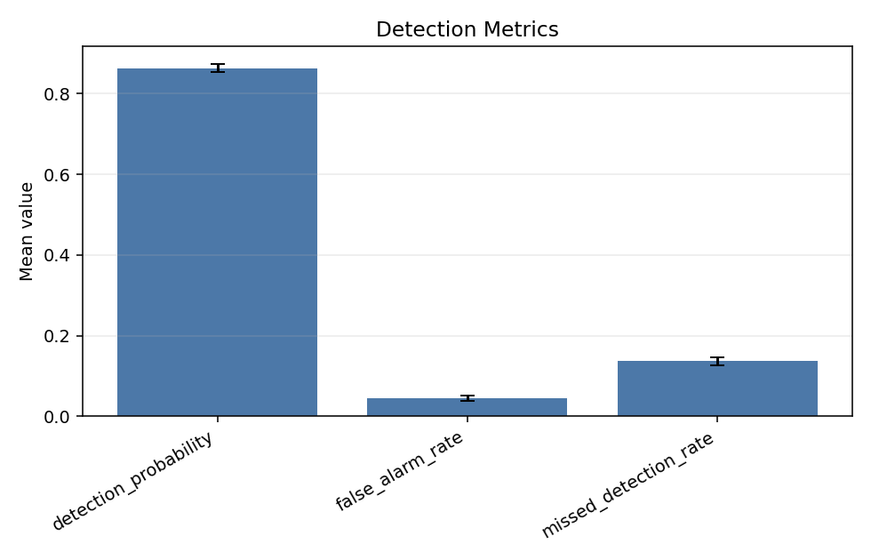
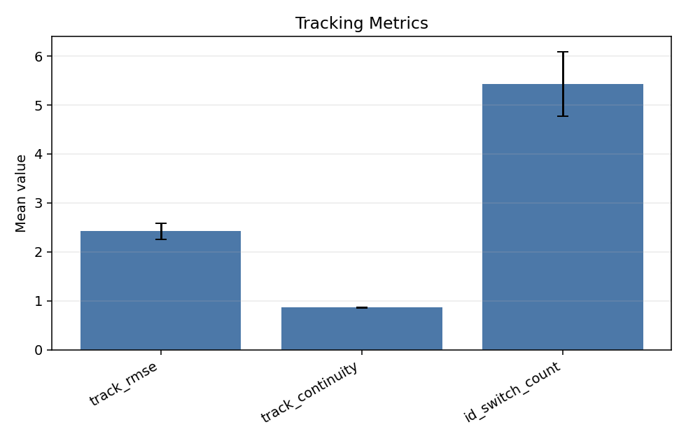
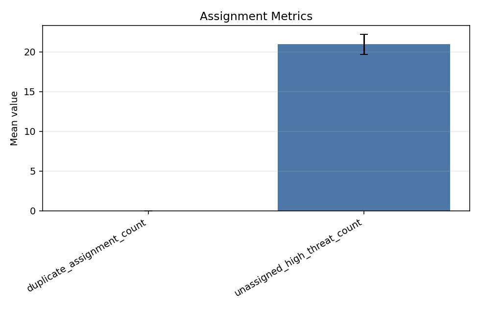
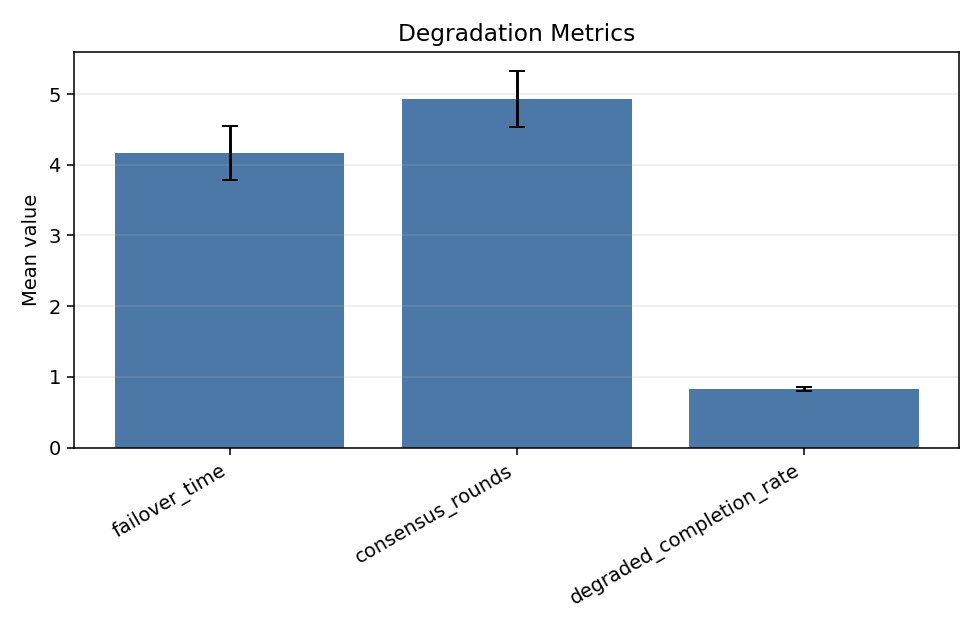
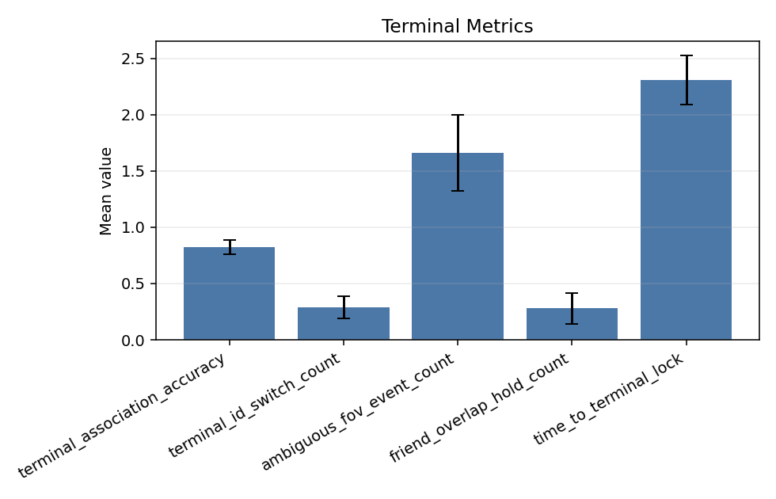
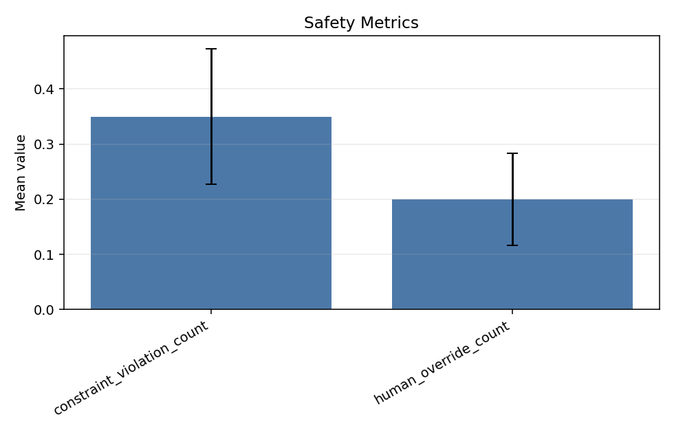
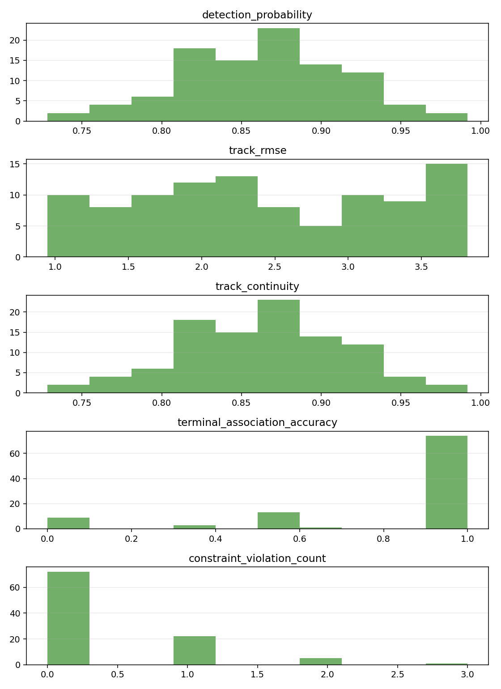

# D6 系统级评估指标实验报告

## 2.5 2026-07-21 正式共享 seed 划分审计

本次对 `learning_generation_v1_multibatchfix` 的 900 episode 学习导出执行全量只读 readiness。输入为
100 个训练 seed 和 20 个保留评估 seed。训练/保留交集为 0，全部已注册源文件哈希验证通过，正式源
数据未修改。输出位于临时目录
`/tmp/d6_learning_label_readiness_shared_split_20260721.json`，SHA-256 为
`a0469fa0bf4f1fc80d5e5dc9afac74d4638e782161c0c3f5ebc6befd93f405d1`。

| 模块 | train/validation/test seed | mismatch seed | mismatch episode/记录 | mismatch sample | 结论 |
|---|---:|---:|---:|---:|---|
| D3 assignment | 60/20/20 | 0 | 0 | 0 frame | exact |
| D4 region | 70/15/15 | 51 | 459 | 917 frame | mismatch |
| D5 tracklet graph | 60/20/20 | 65 | 8350 | 284 candidate edge | mismatch |
| D5 active vision | 60/20/20 | 62 | 558 | 713298 sample | mismatch |

四模块 missing、extra、reserved seed 均为 0。D3 与 canonical assignment 完全一致，D4 和两类 D5
manifest 不一致，因此联合训练 readiness 为 unavailable。旧 D4/D5 两模块直接比较仍为 423/900 个
episode、47/100 个 seed 不一致。两种统计使用不同参照，不应混为同一个数。

注册表 schema、policy、内容哈希、assignment 哈希和源 training registry SHA-256 均通过独立复算。
该结果只验证数据划分治理。模型性能、奖励可用性、PPO 准入和联合策略效果未在本次实验中评估。
接受门限为注册表八项 validation 全真且 D3/D4/D5 graph/D5 active 全部 exact。本次注册表通过，模块
联合门未通过。2026-07-21 D6 全量回归为 `364 passed`，仅有既有 Matplotlib `Axes3D` warning。

## 2.4 2026-07-20 scalable 3D 算法实验矩阵接口验收

本节验证 D6 对 `scalable3d-experiment-matrix-v1` 持久化 episode 的只读审计。输入是确定性 fixture 和
一个既有 producer 开发 smoke，不包含 AirSim、正式训练结果或算法性能实验。

fixture 按真实 producer 结构在 scenario metadata 写入 schema、R0/G1/A1/A2/A3/C1/F1、comparison
key、full-system flag 和四项 learning runtime diagnostics。负例删除三个矩阵标识字段，注入 X9 伪
变体和 G1 bundle 回退。完整性用 nominal 同键 R0/G1/A1 三个 cell 验证固定 6-cell 分母；另用两个
seed 的 R0/G1 配对验证 variant-minus-R0 delta 和 bootstrap CI。一个 seed 标为 dirty，用于检查
clean/formal 与开发证据分层。F1 在 nominal 中被列为 unexpected，在高威胁 M-to-N 中进入第七个
期望 cell。

接受门限为：历史 episode 不因缺矩阵字段失去原有可评估性；当前矩阵字段缺失或未知时不得补目录名；
runtime 双来源必须一致；bundle、assist effective mode、无 fallback 和模块实际采用证据同时成立；缺
cell 不缩小分母；无 R0 配对不计算差值；单配对不生成置信区间；dirty 数据不进入 clean/formal 统计；
任何 paired delta 不直接写成因果效果。加入 D4 消费合同正反例后，上述接口门限均通过，scalable 专项
`40 passed`，D6 全量 `320 passed`，仅有既有 Matplotlib `Axes3D` warning。

既有 `/tmp` producer smoke 为 R0、nominal、2v2、seed101。D6 复读得到 metadata valid=true、execution
valid=true，完整性为 present/expected=`1/6`。该运行来自 dirty worktree，matrix formal=false，只能
证明 producer/consumer 接口接通。另一个临时 5v5 producer smoke 中，D4 合法消费、D3 hint applied
和 control adoption 均为 1。main 尚未运行 clean 的完整矩阵，本节没有变体性能排序、提升率或主线
准入结论。D4 advice 单独仍不证明采用；只有合法消费且 D3 明确应用 hint 才形成 adoption evidence。

## 2.3 2026-07-20 scalable 3D schema 合同回归

本节修正 D6 fixture 与真实 producer 的 online observation schema 偏差。真实值是
`scalable3d-observation-v1`；旧 fixture 值 `scalable3d-online-observation-v1` 已删除。评估器 v4 新增
本地 schema registry，不依赖 main runtime import。

正例同时匹配 world、bus、scenario、online observation、offline truth 和 config schema。负例分别
替换五项 manifest schema，并删除 bus schema。接受门限为：raw 字段仍原样可见；匹配值为 true；旧、
未知和篡改值为 false 且带明确 reason；缺字段为 unavailable；任一负例 formal acceptance=false；
Markdown 显示 registry 和 schema current 状态。全部满足。

scalable 与 active-vision 专项 `32 passed`，D6 全量 `304 passed`，仅有既有 Matplotlib `Axes3D`
warning。复读当前 6v6、seed 37 dirty producer smoke 时，schema match=true；formal=false 的唯一原因是
repository dirty。该复读不构成新的性能实验。

## 2.2 2026-07-20 scalable 3D 主动视觉证据验收

本节验证 D6 对 D5 主动视觉命令和 main runtime ACK 的离线消费，不记录真实飞行、AirSim 或模型性能。
8 项测试共创建 9 个 deterministic episode fixture。单 episode 显式规模为 target/resource/recon/
camera=`6/4/1/5`；聚合测试使用 seed 1 和 seed 2，不从场景名推断规模。

验证矩阵包括 rule、shadow 和 assist 三类命令；applied/rejected ACK；10、20、30 ms 延迟；command
expired、stale coalition version、camera/resource unavailable 和 degenerate aim point 四类拒绝；
未知 D2 中心航迹引用、ACK target 改写、在线 truth 字段、active log 缺失和 summary count conflict。
另设 assist applied 加五米 proximity 的正例，确认 attribution 仍因缺少配对控制组而 unavailable。

接受门限为：三种模式不互相回填；命令和 ACK 按完整版本键关联；拒绝分类及 summary counters 一致；
未知 ID、ACK 改写和 truth 污染使正式证据 fail closed；缺日志不写 0；双 seed 报告保留显式规模；同一
episode 物理事件不产生因果归因。上述门限全部满足。主动视觉与既有 scalable 专项共 `25 passed`，
D6 全量 `297 passed`，仅有既有 Matplotlib `Axes3D` warning。

当前结果关闭 D6 consumer 和报告口径缺口。main 尚未提供 clean worktree 下至少 20 个未见 seed 的
rule/shadow/assist 正式 episode；assist 也没有同 seed 配对规则控制组。因此本节没有主动视觉提升率、
物理效果或默认路径准入结论。

接口测试后又运行了一个当前 main-runtime 临时 smoke。参数为 6 个 target、6 个 interceptor、1 个
recon、7 台 camera、seed 37、duration 2.2 s；finite=true、RTF=4.740。D6 v3 读取 133 条 disabled/rule
command、133 条 matched ACK，全部 applied；rejected、target-reference violation 和 online truth
field violation 均为 0，summary counter match=true。该 worktree 为 dirty，且只有一个 seed，所以
formal acceptance=false、bootstrap unavailable。本条只说明实际 producer 文件能够被 consumer 解析，
不构成 AirSim、模型或物理性能证据。

## 2.1 2026-07-20 scalable 3D 学习运行时确定性验收

本节只记录 D6 consumer/report 的接口与口径测试，不记录真实飞行、质点仿真或学习模型性能。输入均为
测试创建的 deterministic fixture。既有规模样本包括显式 target/resource/recon/camera=
`50/50/4/54` seed 7 和 `200/200/8/208` seed 8；后者保持 195->200 min-dwell backlog=`5`。场景名
故意含 `2v2`，分组仍来自显式数量。

学习运行时矩阵覆盖：

| Fixture | 预期证据边界 |
| --- | --- |
| disabled | bundle loaded=false；model fingerprint/version unavailable；无 advice 属于 not expected |
| D3/D4/D5 missing bundle | 三模块 fallback 原因保留；模型 fingerprint/version 不补值 |
| D4 assist-to-shadow | loaded bundle 与合法 shadow recommendation 可用；assist eligible=0 |
| D4 assist gate | assist eligible=1，但 formal decision unchanged；advice 单独不计 control adoption |
| D4 consumption | 合法消费计 adoption；拒绝消费计 0；旧 schema、未知或篡改合同及 summary 冲突 fail closed |
| quota/projection | 守恒零、非守恒违规和 projection rejection 分别可审计 |
| mutation/tamper | mutation/unchanged 分开；digest flag 篡改使 payload invalid |
| old/missing evidence | 旧 advice schema、缺 plan version、缺 advice 均 fail closed，不补零 |
| seeds 1/2 | 按实际规模形成 distinct-seed bootstrap；单 seed CI 仍为 null |

逐 episode 接受门限为：learning runtime 双来源一致；loaded bundle 的 64 位 fingerprint 与 runtime
version 后缀一致；advice schema/mode/action/transfer/authority/plan/version/epoch/lease 合法；projected
quota 总和为零；formal digest flag 一致；控制采用不由 `assist_eligible` 回填。正式 evidence 另要求
`repository_dirty=false`、配置 hash、D4 policy version、finite 和 online truth isolation 可用。

结果为 scalable 专项 `17 passed`、D6 全量 `289 passed`，仅有既有 Matplotlib `Axes3D` warning。
四类报告均生成，旧/非法/缺失字段均保持 null/unavailable+reason，single-seed 不产生推断结论。本轮
没有运行真实 scalable 3D 或 AirSim episode，也没有模型 acceptance 样本；任何 dirty smoke 只可做
人工兼容检查，不进入本节验收结果。

剩余限制：main 尚需提供 clean、多规模、多 seed 正式学习 bundle和完整实验矩阵；当前只有单 episode
D4 消费接线证据，尚无模型效果结论；global-track-to-truth evaluator mapping 仍缺失，D2 IDSW 继续由
producer availability 决定。

## 2.0 2026-07-15 真实 M5N2 三档 ClockSpeed 对比

输入为 1.0 `p1_terminal_timing_funnel_10seed_20260715_m5n2`、0.2
`p1_clockspeed_0p2_m5n2_20case_20260715_v2`、0.1
`p1_clockspeed_0p1_m5n2_20case_20260715`。每档 baseline/candidate 各 seed 1-10，总计 60 case，按
`case_id/profile/seed` 形成 20 个完整跨档配对。0.2/0.1 ClockSpeed 来自 case result；旧 1.0 summary
无该字段，D6 从 20/20 sibling case generated settings 的显式一致 `ClockSpeed=1.0` 建立 provenance，
没有按目录名推断或默认补值。三份 summary 加 20 份 legacy settings 的“绝对路径+内容”组合
SHA-256 前后同为 `fdb745ee54f0c5ff414a812bf8e75eacd56fa5ea91ff02f64008fb6ee1759cd1`。

| ClockSpeed | Profile | Pair | Target | Coalition | Simulated time/tick |
| ---: | --- | ---: | ---: | ---: | ---: |
| 0.1 | baseline | 4/30 | 4/20 | 0/10 | 0.345297 s |
| 0.1 | candidate | unavailable | unavailable | unavailable | 0.362730 s |
| 0.2 | baseline | 9/30 | 9/20 | 0/10 | 0.441508 s |
| 0.2 | candidate | unavailable | unavailable | unavailable | 0.469176 s |
| 1.0 | baseline | 6/30 | 6/20 | 0/10 | 1.069535 s |
| 1.0 | candidate | 6/30 | 6/20 | 0/10 | 1.066734 s |

M5N2 冻结机会合同在 60 case 中 56 match、4 mismatch：0.1 candidate seed007 实际 `1/1/0`、
seed009 `2/1/1`；0.2 candidate seed006/009 均为 `2/1/1`，其中 seed006 另有 D7 actual execution
unavailable 及三类 count conflict。四个 case 的受影响物理、第二 primary、最终锁/共识和 collision
指标均为 unavailable，不用 8-case 或缩小机会数发布完整 candidate aggregate。standby reserve
成功不计 active-primary。truth identity/state 在线使用审计为 60 case 全 0。case wall elapsed 因源
row 没有该字段，六个 profile/speed aggregate 均 unavailable。

main-bus/control-tick wall mean 继续分别报告，禁止相加；上表归一化值只使用
`control_tick_wall_mean_ms / 1000 * ClockSpeed`。基于可用 baseline 可陈述观测值，但 candidate 0.1/
0.2 的物理 aggregate 不完整，因此本报告不据此判定 ClockSpeed 性能优劣或 candidate 准入。完整
产物位于 `../airsim_runtime/outputs/m5n2_clock_speed_comparison_20260715/`。

## 1.9 2026-07-15 真实 ClockSpeed=0.1 P1 紧急回归

故障表现是 `evaluate_stage_timing_inputs()` 调用缺失的 `_timing_input_mode`。修复将唯一模式规范化
函数前置并统一命名，新增 baseline/candidate 各 seed 1-10 的 20-case 双层 merged evaluator 回归。

真实输入为 `p1_clockspeed_0p1_m5n2_20case_20260715`，验收门限为 P1 v6 无异常生成、两层 available、
records=`4036/4036`、case=`20/20`、manifest match、跨 case/跨层 total 为 null、输入 hash 不变；
全部满足。报告位于
`outputs/p1_clockspeed_0p1_m5n2_20case_20260715_case_aware_validation/`。timing 专项
`28 passed`、D6 全量 `264 passed`，仅既有 Matplotlib warning。该报告验证 P1 接线，不替代三档
ClockSpeed comparator，不发布三档性能结论。

## 1.8 2026-07-15 真实 ClockSpeed=0.2 case-aware 复测

输入是 main 已完成的 M5N2 20/20 case summary 及 merged timing。D6 以只读方式运行 P1 v6；main bus/
control tick 各 6567 records、20 个 case envelope，ordered manifest 一致。每个 case 内 frame/time
严格递增，case 切换从 0 重置；顶层 `frame_index_first/last`、`timestamp_first/last` 与
`cross_case_total_ms` 不发布，`cross_layer_total_ms` 也为 null。三份 runtime 输入 SHA-256 前后不变。

冻结机会合同审计要求每 case pair/target/coalition=`3/2/1`，不采用实际产物缩小后的分母。20 case
中 18 match、2 mismatch：candidate seed006 的 D7 actual-execution unavailable，reasons 为
physical-pair、command-physical、main-physical-intercept count conflict，suite/intercept 均为
`2/1/1`；其 standby reserve physical success=true，raw top-level success=2，但 active-primary 与
`success_semantics` 均为 1。candidate seed009 的 D7 actual-execution available，但机会同为 `2/1/1`，
也按 contract mismatch 处理。两例受影响指标均为 unavailable，不形成 28 或其他缩分母结果。

验收门限为 loader 不抛异常、两层 available、records=`6567/6567`、case=`20/20`、manifest match、
跨 case/跨层 total 为 null、输入 hash 不变；全部满足。timing 专项 `27 passed`、ClockSpeed 专项
`10 passed`、D6 当时全量 `263 passed`。0.1 后续 P1 复测见 1.9 节；本节仍不提供三档结论。

## 1.7 2026-07-15 ClockSpeed 三档离线接口回归

本批是确定性 consumer/report 回归，不是真实 AirSim 实验。fixture 构造 ClockSpeed=`1.0/0.2/0.1`
三档 M5N2 summary，每档 baseline/candidate 各 seed 1-10、20 case，总计 60 case；三档共享同一
`case_id/profile/seed` 键。每 case 提供显式 suite provenance、三层物理分母、required
active-primary 终态、truth identity/state、case wall 和两层合法 timing。

接受门限为：恰好三档且 provenance 值集合为 `0.1/0.2/1.0`；每档 baseline/candidate 均完整覆盖
seed 1-10；20 个 case key 全部形成三档配对；M5N2 规模来自显式 family/resource/target；main bus
与 control tick 不相加；缺 truth 或第二 primary 距离时为 unavailable 而不是 0；显式非零 truth
使 `all_zero=false`；输出 JSON、两份 CSV、中文 Markdown 和非空 PNG。

结果为专项 `8 passed`、D6 全量 `254 passed`，`py_compile` 通过；唯一 warning 是既有 Matplotlib
`Axes3D` 环境问题，不影响二维曲线。归一化 fixture 验证 control tick wall mean=`100 ms` 时，
ClockSpeed=`0.1` 的 `simulated_time_per_tick_s=0.01`；main bus=`10 ms` 保持独立，未与 control tick
相加。负例覆盖缺 seed、跨档 case key 不一致、目录/根字段冒充 ClockSpeed、缺指标和非零 truth。

该节是运行前接口记录；真实三档 comparator 随后已由三个完整 suite 生成，见 2.0 节。2.0 对合同
mismatch 和缺 wall timing 继续保持 unavailable，不用部分值补写结论。

## 1.6 2026-07-15 真实 AirSim M5N2 20-case 结果

本次实验只纳入 M5N2 baseline/candidate 各 10 seed，共 20 个 SimpleFlight case。M5N2 完成后、
`TERM` 生效前额外完成了 `p1_terminal_timing_funnel_10seed_20260715_png_ttc_2v2_seed001`，但该
`png_ttc` seed001 明确排除在 M5N2 20-case 聚合与验收之外。其余 tuned 2v2 和全部 dropout case
未执行；缺失 case 保持 unavailable，不按失败或零值处理。本批不能代表完整 terminal-closure suite。

### 证据可用性与物理结果

| Profile | Actual available | Pair | Target | Coalition | Truth identity/state |
| --- | ---: | ---: | ---: | ---: | ---: |
| baseline | 10/10 | 6/30 | 6/20 | 0/10 | 0 / 0 |
| candidate soft prediction + trend coast | 10/10 | 6/30 | 6/20 | 0/10 | 0 / 0 |
| 合计 | 20/20 | 12/60 (20%) | 12/40 (30%) | 0/20 (0%) | 0 / 0 |

20 个 actual artifact 均通过 source/schema/hash/case/seed 校验，validation reason 为 0。10389 条
目标状态样本来源均为 `d2_estimated_global_track`，stale 为 0。pair、target、coalition 的成功数
和分母独立发布，target 成功不用于回填 coalition。

本报告统一使用以下术语：`12/40` 是 canonical target physical success，即至少一个 participating
pair 进入 5 m；“全部 required member 通过某阶段”是 cooperative target-stage diagnostic。后者
只用于定位协同证据在哪一阶段收缩，不等同于正式 `target_intercept_success`。

两 profile 汇总成功数相同，但逐 seed 并不非退化：candidate 在 seed 1、7 由 2 降为 0，在 seed
3、10 由 0 升为 2，其余相同。因此 paired non-degradation=false，soft prediction/trend coast
不能凭总量持平获得主线晋升。

### 第二 primary 首失败漏斗

| 阶段 | Baseline | Candidate | 合计 availability | 合计通过 |
| --- | ---: | ---: | ---: | ---: |
| assigned | 10/10 | 10/10 | 20/20 | 20 |
| visible | 10/10 | 10/10 | 20/20 | 20 |
| associated | 10/10 | 10/10 | 20/20 | 20 |
| contract allowed | 10/10 | 10/10 | 20/20 | 20 |
| control allowed | 8/10 | 9/10 | 20/20 | 17 |
| mode switched | 8/10 | 9/10 | 20/20 | 17 |
| 5 m physical intercept | 0/10 | 0/10 | 20/20 | 0 |

20 个失败单元的首失败原因均 available：`terminal_visual_prediction_window_expired=10`、
`terminal_visual_acquiring=6`、`d5_not_locked=2`、`bbox_area_too_small=1`、
`bbox_near_image_edge=1`。第二 primary 最近距离 baseline/candidate mean=
`12.736/12.573 m`，合计 mean/min/max=`12.654/8.843/14.740 m`，没有一次进入 5 m。这里的
associated 表示 episode 内曾获得锁定证据，不代表锁定一直保持到物理闭环。

第二 primary 的最终状态 `20/20` 为 `collision_stop`。本批产物没有记录 collision object，因而
无法区分联盟成员冲突、环境碰撞和 AirSim 状态问题。该字段缺失保持 unavailable，不补成某个
失败类别，也不把 `collision_stop` 解释为五米物理成功；它是下一轮 producer 接线的 P1 项。

### 两层时序

| 测量域 | Samples | Mean ms | P95 ms | Max ms | 100 ms 违例 | 主导阶段 |
| --- | ---: | ---: | ---: | ---: | ---: | --- |
| main episode bus | 3805 | 349.34 | 487.40 | 1305.99 | 3649 (95.90%) | D1 fusion, mean 320.00 ms |
| SimpleFlight control tick | 3805 | 1069.45 | 1254.06 | 2072.51 | 3805 (100%) | AirSim frame sample, mean 432.29 ms |

control tick 内的 `bus_processing` mean=`351.80 ms`，已经包住 main bus；
`guidance_and_control_rpc` mean=`290.85 ms`。所以两行总时延不得相加。20 个 case 的原始流逐 case
严格校验均通过且 error record 为 0，但 partial acceptance bundle 没有注册 timing 路径；现有合并
流在 case 边界重置 frame/timestamp，也不能作为单一严格递增流直接导入。正式 suite timing 因而
仍是 unavailable，本表属于按显式 case 路径完成的离线池化审计。

### 结论

actual evidence、truth 隔离和独立分母已经闭合；第二 primary/coalition 和 100 ms 性能门未闭合。
candidate 未证明逐 seed 非退化。后续优先处理 case-aware timing 接线、D1 fusion/AirSim 采样/RPC
瓶颈和第二 primary 末端稳定性；聚合外已完成的 `png_ttc` seed001 不追加到本批，其余 tuned 2v2
和全部 dropout 应作为新的独立批次运行。

## 1.5 2026-07-15 第二 primary/独立分母报告回归

本批是确定性离线 consumer/report 回归，不是 AirSim 实验。fixture 覆盖：两个 primary 加一个
单 primary 目标形成不同 pair/target/coalition 分母；第二 primary 在关联阶段和物理阶段失败；失败
但原因缺失；第二 primary 物理结果缺失。接受标准是七阶段漏斗正确、三层机会数独立、coalition
completion 不回填、缺原因不生成 `unspecified`、unavailable 不按零报告或绘图。

结果为 cooperative closure 专项 `11 passed`、D6 全量 `246 passed`，`py_compile` 通过；仅有
既有 Matplotlib `Axes3D` 环境 warning。没有启动 AirSim，也没有产生新的 2v2/M5N2 实测成功率。
因此该阶段只关闭 D6 consumer/report 代码缺口；随后 1.6 节已取得同配置 20-case 的第二 primary
漏斗、联盟完成和首失败原因分布。物理门限未达标，不等同于缺 multi-seed 证据。

## 1.4 2026-07-15 D2 ceiling-aware v2 正式联合证据

本批使用 D2 冻结 replay artifact
`../d2_data_association/outputs/p1_identity_ceiling_aware_v2_20260715/d2_identity_calibration_v2.json`，
通过 `run_p1_system_evidence_report.py` 生成 D2-only 的 CSV、aggregate JSON、中文 Markdown 和 PNG，
输出目录为 `outputs/p1_identity_ceiling_aware_v2_20260715/`。D6 只消费 producer decision，不重算
gate，也不参与在线控制；本批未启动 AirSim。

confirmation 覆盖六 difficulty、每档 20 seed。总体 GNN candidate
`gnn-g5.99-qa1-ld3_7-mw0.5x` 的五 gate 全部通过：IDSW baseline/candidate/reduction=
`1.3583/0.6167/0.5460`；continuity baseline/headroom/actual/required/error reduction=
`0.981046/0.018954/0.002908/0.001895/0.153448`；false-track baseline/candidate=`0/0`，
P95=`0.015470 s < 0.1 s`，online truth leakage=`0`。该结果仅为
`promotion_recommended=true` 的评审建议，`default_online_path_changed=false`。

| Difficulty | Baseline/Candidate IDSW | 五 gate | Producer reason |
| --- | ---: | --- | --- |
| clutter | 1.25 / 0.8 | pass | required IDSW reduction met |
| combined | 6.9 / 2.9 | pass | required IDSW reduction met |
| delayed_noisy | 0 / 0 | fail-closed | baseline zero, no measurable reduction evidence |
| dropout | 0 / 0 | fail-closed | baseline zero, no measurable reduction evidence |
| nominal | 0 / 0 | fail-closed | baseline zero, no measurable reduction evidence |
| tight_crossing | 0 / 0 | fail-closed | baseline zero, no measurable reduction evidence |

dropout truth alignment 在 screening 为 `0/10/0` complete/partial/unavailable、matched/unmatched=
`2330/220`；confirmation 为 `0/20/0`、`4660/440`。JPDA 标记
`research_adapter_only=true` 且总体 gate 不通过，不准入默认在线路径。D1/D3/D4/D5/D7 未提供同批
case/seed 证据，全部明确 unavailable，故 `full_system_decision=not_evaluated`，不宣称全系统通过。

代码验收为 system-evidence 专项 `31 passed`、D6 全量 `243 passed`，仅有既有 Matplotlib
`Axes3D` 环境 warning。该证据关闭“D6 尚无 D2 v2 正式证据”的 P1 报告缺口；promotion 评审决定、
默认在线路径变更和完整同批多源系统判决仍未发生。

## 1.3 2026-07-15 分阶段延迟消费与报告回归

本批验证 D6 离线 consumer，不是 AirSim 性能实验。确定性输入含合法 main bus/control tick 各
2 帧，以及 N/A、error、旧产物、坏 schema/scope、负数/NaN/Inf、总和/状态/预算冲突和重复/倒序
帧。门限是合法流统计正确、两层不求和、旧证据 unavailable、全部非法流 fail closed。

结果为专项 `20 passed`、D6 全量 `236 passed`；CSV、JSON、中文 Markdown 与 PNG 均生成成功。
fixture 的 dominant stage 只验证算法，不代表真实瓶颈。该代码批次未启动 AirSim、无真实 seed，
不能据此宣称 `100 ms` 达标；其后的真实 M5N2 20-case 结果以 1.6 节为准。

## 1.2 2026-07-14 actual target-state freshness/stale 正式验收

本批离线重建只读取最新两例真实 AirSim/SimpleFlight 最终产物，不重新控制 AirSim。接受标准是：
六个 freshness 字段逐行存在且合法，满足 measurement/arrival/control 顺序与 age 等式，source
非空，canonical payload 与已验证 SHA256 的 CSV 复算结果完全一致。正 stale 是合法观测；本批
另要求记录实际 stale 结果，不以缺字段补零。

| Case | Samples | Mean age | P95 age | Max age | Stale | Source distribution | 结果 |
| --- | ---: | ---: | ---: | ---: | ---: | --- | --- |
| tuned 2v2 seed-1 | 48 | 0.0375 s | 0.2 s | 0.2 s | 0 (0%) | `d2_estimated_global_track:48` | available |
| M5N2 seed-1 | 608 | 0.091118 s | 0.2 s | 0.2 s | 0 (0%) | `d2_estimated_global_track:608` | available |
| pooled | 656 | 0.087195 s | 0.2 s | 0.2 s | 0 (0%) | `d2_estimated_global_track:656` | available |

canonical case、aggregate JSON/CSV 和中文报告保存在
`outputs/p1_actual_target_state_freshness_20260714/`。代码验收覆盖缺字段、空/非有限/负值、两类时间
冲突、age 冲突、非法布尔、空 source、显式零 stale、真实正 stale、source 分布和 payload 伪造；
D6 全量 `216 passed`，1 条既有 Matplotlib warning。结果关闭单 seed 正式 freshness/stale 指标链，
不形成 multi-seed 稳健性或跨提交趋势结论。

## 1.1 2026-07-14 actual v2 真实 AirSim 验收

本批真实运行包含 tuned 2v2 seed-1 与 M5N2 seed-1，共 2 case、每配置 1 seed。actual execution
接受门限为 required case 全部提供并通过 canonical v2 校验；结果
required/available/unavailable=`2/2/0`，门限通过。两场景 summary、CSV 离线 scorer、actual
artifact 的物理成功计数均为 `2/2/2`，旧 physical-count conflict 未复现并关闭。

| 场景 | Pair | Target | Coalition | Loop latency | Budget violations |
| --- | ---: | ---: | --- | ---: | ---: |
| tuned 2v2 seed-1 | 2/2 | 2/2 | 不适用 | 123.3 ms | 19 |
| M5N2 seed-1 | 2/3 | 2/2 | available 0/1 | 384.6 ms | 212 |

M5N2 coalition `0/1` 是显式可用失败；第二 required primary 最近约 `11.02 m`，target `2/2`
不能替代 coalition 完成。统一报告 `overall_acceptance_passed=false` 是因为两个 seed-1 case
不构成 baseline/candidate、1-5 帧 dropout 和 multi-seed 的完整 P1 矩阵，不是 actual evidence
unavailable。loop latency 均超过 `100 ms` 预算，违例合计 `231`，保持 P1。该批没有改 D6 代码。

## 1.0 2026-07-14 actual-execution 与独立到达口径最终复核（真实重跑前历史）

本轮没有运行 AirSim，只复核已实现的 D6 consumer/gate 与确定性 fixture。接受标准是：每个
required case 必须提供并通过校验的 canonical `d7-actual-execution-metrics-v2`；缺失或 explicit
unavailable 时 `actual_execution_all_available=false`，suite 总验收 fail closed。legacy main row
和离线五米结果只作 diagnostics，不能替代 actual envelope。

`arrival_coordination_required=false` 的 coalition completion 按每个 required active primary 的
独立五米成功计算；全部 required primary 成功才记该 target coalition 完成。required-primary
denominator/member、physical result 或开关缺失，以及 summary/pair 冲突，均保持
`null/unavailable`。专项正负例达到该门限。

四个历史真实 seed-1 case 的 actual artifact 仍为 `unavailable`：M5N2 baseline、M5N2
candidate、2v2 PNG-TTC 和 1-frame dropout；四者原因均为
`d7_actual_execution_command_physical_count_conflict`。因此历史 main acceptance 和离线五米
结果不构成正式 actual-execution 通过，必须由 main 真实重跑并注册有效 v2 artifact。

验证日期为 2026-07-14；专项结果 `14 passed, 24 deselected`，D6 全量结果 `190 passed`。唯一
warning 为 Matplotlib `projections/__init__.py:63` 无法导入 `Axes3D`，仅表示 3D projection
不可用；本轮不使用该能力，JSON/CSV/Markdown、二维报告和口径结论不受影响。

## 0.9 2026-07-14 owner provenance 最终语义回归

本轮未运行 AirSim，seed 不适用，仅使用确定性临时 command/summary/main-bus fixture。接受门限为：
plan ID 与正整数 version 在每个 command row 仍必填；中心 effective-authorized 行可以没有
`d4_target_node_id`；未授权的 pre-transition/pending 行可以没有 owner；secondary/distributed
active/execution/reassignment 或显式 execute action 行在 effective-authorized 时缺 owner 必须
fail closed；整集没有 authoritative owner 时 `owner_node_ids=[]` 且 provenance 为 unavailable。

结果为 execution-evidence focused `20 passed`、D6 全量 `184 passed`，1 条既有 matplotlib
`Axes3D` 环境 warning。中心授权空 owner 正例与 secondary effective-authorized 空 owner 负例均
达到门限。该结果只验证 D6 builder/validator 语义，不形成新的飞行、拦截或多 seed 性能证据。

## 0.8 2026-07-14 actual plan identity 离线验收（真实重跑前代码验收）

本次没有运行真实 AirSim，仅使用临时持久化 CSV/JSON fixture 验证 actual envelope 和 merge。
接受门限为：合法单版本与合法多版本提取结果精确去重；缺列、非法 version、同 plan 混合 version、
provenance 篡改和 hashed CSV 不一致全部 fail closed；replay 中伪造的 plan/owner 不得进入最终
`metrics.metadata`；safety count、physical 和 effective-control mode 语义保持原回归结果。

结果为 focused `24 passed`、D6 全量 `180 passed`，1 条既有 matplotlib `Axes3D` 环境 warning；
`py_compile` 通过。该结果关闭 D6 P0 实现与离线验证，不形成新的飞行性能、拦截成功率或实时性
结论。真实 SimpleFlight seed-1 v2 artifact 生成/注册已由 1.1 节关闭；同条件 multi-seed 验收
仍为 P1。

## 0.7 2026-07-14 actual execution evidence 审计（真实重跑前离线审计）

本次使用最新两个既有 M5N2 seed-1 episode 的四类文件进行离线审计，没有重新启动 AirSim。

| profile | command rows | raw replay mode | actual effective control | actual mode | physical pair/target | performance samples | loop latency |
| --- | ---: | ---: | ---: | ---: | --- | ---: | ---: |
| baseline | 330 | 17 | 0 | 0 | 0/3，0/2 | 142 | 386.519 ms |
| candidate | 311 | 13 | 0 | 0 | 0/3，0/2 | 141 | 398.333 ms |

raw replay 同时给出 `loop_latency_ms=0`，但其 performance distribution sample count 为 0；该零值
不能证明实际循环零时延。command CSV 中 17/13 次 `mode_switched=true` 是命令模式变化，其中
没有一条同时满足 `effective_control_authorized=true`，因此 actual mode count 必须为 0。最终
main bus 的 mode count 也是 0，循环时延分别为 386.519/398.333 ms。

新增 builder 对两组现有输入均可生成结构有效的 actual envelope，但本批没有将生成文件写入
AirSim output 目录，也没有替 main 注册。代码验收门限为：raw replay 被拒绝；有效三源写盘通过；
零性能样本、控制来源冲突、mode 超过 control、hash 篡改均 unavailable。实际 D6 全量结果为
`173 passed`，1 条既有 Matplotlib `Axes3D` warning。新增回归证明 identity 正样本与 state
显式零值可同时发布且来源互不替代；视觉 PNG 持续授权样本不会被累计为重复切换。代码级 P0
已关闭。main 报告的 runtime 回归曾为 `2 failed, 140 passed`：state 已进入正式指标，两个失败
转为 identity KeyError，确认缺口位于 D6 actual schema 而非 main 应补零；本次已修复，仍需 main
复跑确认集成结果。

## 0.6 2026-07-14 terminal closure case evidence 回归（先前四案例）

本轮不启动 AirSim，只读取现有 seed-1 terminal closure summary 和 producer 已写盘文件。正式
summary 包含 4 个 case：M5N2 baseline、M5N2 soft-prediction/trend-coast candidate、2v2
`png_ttc` 和 1-frame dropout。

| 检查项 | 接受标准 | 实际结果 |
|---|---|---|
| D3 suite 路径消费 | 每行独立校验，按 case/seed 聚合 | 4/4 available，543 records |
| D7 原 summary wiring | null path 必须 unavailable 且不得猜目录 | 0/4 registered，4 次明确 wiring reason |
| D7 显式 registration 临时副本 | 现有文件结构可用、seed 匹配 | 4/4 available，control allowed sum=51 |
| 四层防重复 | raw D7 不覆盖或二次累计 main envelope | main control layer 仍为 51 |
| 缺文件/schema mismatch | case 隔离、sum=null、不补零 | 通过 |

新增 5 项专项回归，加上既有 D6 测试后为 `159 passed`，1 条既有 matplotlib `Axes3D` warning。
当前正式 AirSim suite 未重写，所以报告应继续把 D7 wiring 判为 unavailable；临时显式注册只证明
D6 consumer 和现有 producer 文件兼容，不替代 main runtime 接线，也不构成新的物理拦截实验。

## 0.5 2026-07-14 terminal suite P1 schema 回归

本轮是 file-only 确定性回归，未启动 AirSim。新增场景覆盖：main planned-lock 与 D7 execution
同名 contract 指标必须形成两个语义组且顶层不求和；physical `0/0` 必须 unavailable；10 个
性能样本下 budget violation 显式 0 可用，而零样本同名零不可用；baseline/candidate 效果均为
0 且 candidate trigger=0 时 effectiveness 为 `inconclusive`、promotion=false；两 tick D3
canonical history 输出 plan-2、primary/reserve membership、secondary owner 和 feedback churn。

接受门限全部满足。2026-07-14 terminal-suite 专项 `8 passed`、canonical 专项 `24 passed`、
D6 全量 `154 passed`，1 条既有 matplotlib `Axes3D` warning。该证据只验证
`d6-p1-unified-acceptance-v2` / `d6-terminal-metric-envelope-v1` 的 schema、availability 与报告
逻辑，不构成真实 AirSim 性能结论。main `p1_terminal_closure` 尚需写入 producer/scope/
denominator/lifecycle、physical context、performance sample count、candidate trigger/effect，并传入
真实 `d3_plan_history.json`。

## 0.4 2026-07-14 physical result/coalition availability P0 回归

本轮未启动 AirSim，seed 不适用。新增 7 项确定性回归分别验证：evidence=true 但缺 pair
result 时三层全 unavailable；规范 success/failure scorer status 可判定；required-primary
实际写盘成员不足、缺 arrival window、缺 coalition denominator、summary 有 opportunity 但缺
completion 时 coalition unavailable；证据完整的显式零保持 available `0`。既有 explicit success、
command-only、summary-only、source mismatch 和 standby reserve 回归均未退化。

接受门限全部满足。`metric_availability`、coalition metadata、episode CSV、aggregate JSON 和
Markdown 使用相同 unavailable reason。D6 全量结果为 `150 passed`，另有 1 条既有 matplotlib
`Axes3D` 环境 warning。该结果关闭 D6 consumer/reporting P0，不构成新 AirSim 性能证据；真实
同条件 multi-seed physical 重跑和 freshness 趋势仍为 P1。

## 0.3 2026-07-14 truth-state provenance 与 offline scorer 回归（历史）

本轮未启动 AirSim，使用 7 类确定性离线 provenance 场景，seed 不适用：

| 场景 | 接受标准 | 实际结果 |
|---|---|---|
| D2 estimated-state 严格路径 | state-use available `0`，合法 offline physical available | 通过 |
| 显式 actor-truth fixture | state-use 为正，identity 独立，合法 fixture physical available | 通过 |
| 缺 source legacy status | 所有 physical 层 unavailable，raw status 仅审计 | 通过 |
| summary + command，command 缺 pair evidence | command 不生成 physical pair，所有 physical 层 unavailable | 通过 |
| summary-only aggregate | summary count 不回填 pair/target/coalition，全部 unavailable | 通过 |
| active pair source mismatch | 即使 evidence=true，所有 physical 层 unavailable 并给出 mismatch reason | 通过 |
| command CSV evidence 字段 | 布尔值由 loader 保留，但不能单独发布 physical success | 通过 |

实际 D6 全量为 `143 passed`，另有 1 条既有 matplotlib `Axes3D` 环境 warning。接受门限保持
availability/zero 分离：证据缺失输出 `None/unavailable`，不输出 false success 或 0。

这只关闭 D6 consumer/metric/loader/test 的 physical provenance P0，不是新物理性能证据，
也不表示真实 AirSim P1 完成。2026-07-11 至 07-13 历史报告中的 physical 数值若没有合法
`physical_intercept_source`、逐 active pair `physical_evidence_available=true` 和匹配的
`target_state_source`，只保留迁移前 raw status 含义。真实新 schema 的同条件 multi-seed
AirSim 重跑、逐 pair provenance 和 target-state freshness 趋势仍为 P1。

## 0.2 2026-07-14 truthless tracking 假零回归

本轮未启动 AirSim，使用 5 个确定性离线场景，seed 不适用：

| 场景 | 接受标准 | 实际结果 |
|---|---|---|
| 空输入 | RMSE/continuity/IDSW 均 null/unavailable | 通过 |
| 仅匿名 `TrackRecord` | 三项均 null/unavailable，JSON/CSV/Markdown 一致 | 通过 |
| truth sidecar 不完整 | RMSE/continuity 不补零；已有 identity pair 的 IDSW 为 available 0 | 通过 |
| 完整 truth、稳定 global ID | RMSE/continuity available，IDSW available 0 | 通过 |
| 完整 truth、global ID 切换 | IDSW available 1 | 通过 |

另用遗留 replay 中“数值 0 + availability unavailable”验证 merge：三项输出保留显式字段但值
为 null，状态仍 unavailable。2026-07-14 D6 全量结果为 `137 passed`，1 条既有 matplotlib
`Axes3D` 环境 warning。该结果关闭 truthless 假零的评估级 P0，不是物理性能实验；真实
multi-seed seed/provenance 与 D2 lifecycle-D3 churn join 仍为 P1。

## 0.1 2026-07-14 第二批 canonical history 回归

本轮使用与 D3 `d3_plan_history_record_v1`、main `d3_plan_history_v1` wrapper 同形的离线 JSON
fixture，不启动 AirSim。验收矩阵包括：

| 场景 | 验收结果 |
|---|---|
| 两 tick 稳定历史，重复携带同一 membership audit | 三项 version/epoch churn、总体/primary/reserve membership、owner、soft/hard feedback 均为 available 0 |
| plan、coalition version 与 epoch 变化 | 三项 churn 分别为 1 |
| primary 移除/新增、reserve activation 变化 | 总体 membership=3、primary=2、reserve=1 |
| center 到 secondary owner 切换 | owner change=1 |
| 两 tick soft/hard feedback | soft=3、hard=1 |
| sequence 乱序、重复 index、timestamp 倒退 | history 指标 unavailable，并写出对应原因码 |
| 单记录、record schema/count/order key 错误 | history 指标 unavailable，不输出假零 |
| canonical record 无 truth 字段 | 正常计算；不要求 online truth |

验收日期为 2026-07-14，专项结果 `24 passed`，D6 全量 `132 passed`，另有 1 条本机
matplotlib `Axes3D` 环境 warning。CSV 输出 validation status/reasons，aggregate JSON 含
`d3_history_validation`，Markdown 含 D3 canonical history 专节。

该结果关闭 D6 canonical schema/metric/report 接线，不代表新的 AirSim 物理性能结论。真实
multi-seed episode 趋势和跨批次 failure taxonomy 仍是 P1；P2 external benchmark 状态不变。
以下第一批回归与更早实验均为历史内容。

## 0. 2026-07-14 第一批 D3 churn availability 回归（历史）

本轮是离线评估语义回归，没有启动 AirSim，也没有修改 D3 或任何控制模块。测试输入为 5 类：
最终快照、空 mapping、单条无序记录、两条稳定有序历史、顶层显式零。四项验收指标为
`plan_version_churn_count`、`coalition_version_churn_count`、
`coalition_epoch_churn_count` 和 `membership_change_count`。

验收门限是：前三类四项必须全部 `unavailable`；两条字段完整且稳定的有序历史必须全部为
available `0`；顶层显式零必须全部为 available `0`。正式 40-case cooperative-role fixture
还必须维持角色统计并让四项 churn 全部 unavailable。2026-07-14 实际结果满足全部门限：
专项 `12 passed`、D6 全量 `120 passed`，另有 1 条本机 matplotlib `Axes3D` 环境 warning。

该评估级 P0 已闭合。剩余 P1 不是从历史快照推断，而是由 main/D3 生产真实有序 plan
history、统一时钟、version/epoch、provenance 和 availability，并持续形成长期 multi-seed
趋势及稳定 failure reason taxonomy。P2 外部指标工具继续保持 optional/offline。以下合成
批量示例和 2026-07-13 及更早实验结果均为历史内容，不覆盖本节当前结论。

## 1. 实验边界

D6 是离线评估模块，只消费记录、仿真日志或脱敏数据，输出指标、表格和图表。它不参与实时任务决策，不提供火控参数，不建模毁伤，不自动处置目标，也不绕过人工授权。

## 2. 实验目的

D6 的目标是避免只用“命中率”评价系统，而是同时覆盖探测、跟踪、分配、降级、末端配准、二级视角/侦察、通信、D7 gate/intercept 和安全约束。本轮示例实验验证：

- `EpisodeMetrics` 能否统一记录所有关键指标。
- D3 未授权候选分配是否不会被算作有效分配。
- 高威胁目标在无有效分配时是否被正确计为未分配。
- D5 的 `TerminalRecord` 与 `EventRecord` 是否不会对同一歧义/友方 hold 事件双计数。
- 报告是否按实际 `drone_count/resource_count/target_count/camera_count` 分组，而不是从 `2v2/5v5` baseline 名称推断规模。
- D6 是否只消费已写盘日志和 metrics，不参与控制、重规划、云台指向或 D7 导引。

详细算法原理、公式、日志来源和 D4/D5 后续扩展字段见 `docs/ALGORITHM_AND_IMPLEMENTATION.md`。

## 3. 批量实验配置

运行命令：

```bash
python3 research_modules/d6_evaluation_metrics/scripts/run_batch_example.py --seeds 100
```

| 项目 | 设置 |
|---|---:|
| 数据来源 | 合成离线日志 |
| episode 数 | 100 |
| 单 episode 时长 | 60 s |
| 输出目录 | `outputs/example_batch/` |

## 4. 指标体系

| 类别 | 指标 |
|---|---|
| 探测 | `detection_probability`, `false_alarm_rate`, `missed_detection_rate` |
| 跟踪 | `track_rmse`, `track_continuity`, `id_switch_count` |
| 分配 | `duplicate_assignment_count`, `unassigned_high_threat_count` |
| 降级 | `failover_time`, `consensus_rounds`, `degraded_completion_rate`, `passive_failover_count`, `active_degradation_count`, `active_degradation_precision`, `unnecessary_active_degradation_count`, `secondary_node_takeover_count`, `secondary_reassignment_count`, `d4_reassign_pending_count`, `distributed_fallback_count`, `failover_active_window_delta_s` |
| 末端 | `terminal_association_accuracy`, `terminal_id_switch_count`, `ambiguous_fov_event_count`, `friend_overlap_hold_count`, `time_to_terminal_lock`, `multi_view_consensus_rate`, `cross_view_conflict_count`, `duplicate_terminal_lock_count` |
| 二级视角/侦察 | `secondary_network_joint_full_view_frame_rate`, `secondary_network_mean_coverage_ratio`, `secondary_visible_target_union_ratio`, `secondary_detect_count`, `projection_valid_rate`, `geometry_gate_pass_rate`, `registered_candidate_count`, `stable_cross_view_registration_count`, `not_registered_count`, `cue_pointing_error_*`, `gimbal_pointing_error_*` |
| 通信 | `cross_node_latency_ms`, `message_drop_rate`, `out_of_order_count`, `stale_track_update_count`, `video_metadata_delivery_rate`, `bbox_delivery_rate`, `consensus_latency_s` |
| D7 gate/intercept | `camera_quality_gate_pass_rate`, `los_quality_gate_pass_rate`, `maneuver_margin_gate_pass_rate`, `terminal_switch_allowed_rate`, `visual_png_switch_count`, `terminal_takeover_rate`, `terminal_switch_reject_count`, `mode_switch_count`, `terminal_contract_reject_count`, `intercept_success_count`, `collision_intercept_count`, `range_intercept_count`, `time_to_intercept_s`, `min_range_m`, `gate_reject_count` |
| 安全 | `constraint_violation_count`, `human_override_count` |

`active_degradation_precision` 和 `unnecessary_active_degradation_count` 已进入 D6 P1 最小实现。它们只消费 D4/main 写出的 `review_label`、`active_degradation_necessary`、`post_window_outcome` 或 pre/post risk/window 后验字段；缺 label 的主动降级不进入 precision 分母。`terminal_center_disagreement_count`、`time_to_active_degradation_decision`、`post_degradation_id_switch_delta` 和 `post_degradation_assignment_conflict_delta` 仍是后续扩展质量指标。

## 5. 图表与曲线

### 5.1 探测指标统计图



该图展示探测概率、虚警率和漏检率的批量均值及置信区间，用于评估前端探测网是否稳定。

### 5.2 跟踪指标统计图



该图展示 RMSE、航迹连续性和 ID Switch。ID Switch 应与 D2 的身份连续性结果一起分析，避免只看覆盖率。

### 5.3 分配与降级指标图





分配图用于检查重复分配和高威胁未分配。降级图用于分析中心节点失效后的接管耗时、共识轮数和任务完成率。

### 5.4 末端与安全指标图





末端图反映终端锁定准确率、终端 ID Switch、视场歧义和友方 hold。安全图用于记录约束违反和人工覆盖事件。

### 5.5 关键指标分布曲线



分布图用于发现均值掩盖的长尾问题。例如少数 episode 的 ID Switch 或 safety violation 可能比平均值更值得关注。

## 6. 输出文件

| 文件 | 用途 |
|---|---|
| `episode_metrics.csv` | 每个 episode 一行 |
| `summary_metrics.csv` | 每个指标的均值、标准差、置信区间和分位数 |
| `batch_report.md` | 自动生成的批量摘要 |
| `plots/*.png` | 指标族图和分布图 |
| `logs/*.jsonl` | 原始离线记录 |
| `d6_airsim_calibration/airsim_calibration_records.csv` | P1 AirSim calibration episode/scope 记录 |
| `d6_airsim_calibration/airsim_calibration_summary.csv` | 按 `metric_scope/seed/scenario/secondary_height/FOV/secondary_count/detection_backend` 汇总 |
| `d6_airsim_calibration/airsim_calibration_summary.json` | calibration summary 机器可读版本 |
| `d6_airsim_calibration/airsim_calibration_report.md` | 中文 P1 AirSim calibration 报告 |

## 7. 结论

D6 已能覆盖探测、跟踪、分配、降级、末端、二级视角/侦察、通信、D7 gate/intercept 和安全指标。当前 P1 AirSim calibration report generator 已能输出 coverage、projection/gate、stable registration、`not_registered_count`、active degradation review label 和 D7 guidance reject reason；剩余工作是让 main/D4/D5/D7 在更多多 seed、5v5/N-v-N 和非默认 episode 中持续写出同一时间轴、actual scale 和 execution/contract 双口径数据，用于长期趋势而不是单次结论。

## 8. D2 准入 Schema 兼容回归（2026-07-15）

本批为离线 parser/report 回归，没有启动 AirSim，也没有新增真实 episode、seed 或物理拦截
结果。验证样本是最小 JSON-like fixture：

| 案例 | 预期 | 结果 |
|---|---|---|
| v2 failed gate | 优先输出 `gate_name:具体 reason` | 通过 |
| v2 all gates passed | 空失败列表为 available，不制造失败 | 通过 |
| legacy structured checks | 读取 `passed/reason` | 通过 |
| legacy bool checks | 失败时至少保留 check name | 通过 |
| 历史缺字段 | 数值为 `None`/CSV 空值，availability 为 unavailable | 通过 |
| promotion 语义 | recommendation-only，不改变控制或默认在线路径 | 通过 |

示例 `0.9810 -> 0.9840` 可原样保留为 headroom `0.0190`、actual increase `0.0030`、
required increase `0.0019`、error reduction 约 `0.1579`。该示例只证明字段兼容，不代表
D6 独立批准候选；历史 artifact 若缺 false-track 或完整 gate evidence，整体评审仍不能
由 D6 推断。

测试结果：`test_p1_system_evidence.py` 为 `29 passed`；D6 全量为 `241 passed`，另有一条
Matplotlib `Axes3D` 本机环境 warning。本批没有 AirSim 图像或曲线，因为能力变化仅涉及
离线 schema 兼容，不应伪造新的仿真证据。

## 9. 三维规模化真值隔离接口验证（2026-07-20）

本批是 D6 公共合同测试，不是算法性能实验。输入为最小 D1/D2 公开制品 fixture，覆盖
5、20、50、100、200 五档实际目标/资源数量。测试没有启动 AirSim，没有生成三维运动
样本，也没有使用正式训练或未见 seed。

验证项目和结果如下：

| 验证项 | 样本 | 结果 |
| --- | ---: | --- |
| D1 公共 DTO 与 sensor/range 聚合 | 2 条逐观测记录 | RMSE、NEES、NIS、样本数和摘要保留正确 |
| D1 `d2_lineage_mapping` | 1 个规范字段正例 | result、aggregation、CSV/JSON/中文报告均成功且名称稳定 |
| D1 legacy `canonical_mapping` | 1 个兼容正例 | 输入成功，输出规范化为 `d2_lineage_mapping` |
| D1 新旧字段冲突 | 1 个负例 | 摘要不同时制品被拒绝 |
| D1 映射摘要缺失 | 1 个负例 | truth metrics 可用时制品被拒绝 |
| D2 公共 DTO | 10 帧汇总 fixture | IDSW、连续率、重复和混淆矩阵保留正确 |
| D2 真值隔离未验证 | 1 个负例 | 身份指标全部 `None/unavailable` |
| unavailable IDSW 携带零值 | 1 个负例 | 制品被拒绝 |
| D2 零帧且 IDSW=0 | 1 个负例 | IDSW 为 `None/unavailable`，truth counts 不聚合 |
| D1 availability=false 但残留数值 | 1 个负例 | 制品被拒绝 |
| 外部文件 SHA-256 篡改 | 1 个负例 | 制品被拒绝 |
| D1 内部 content digest 篡改 | 1 个负例 | 制品被拒绝 |
| 跨 episode 混用 | 1 个负例 | context 校验拒绝 |
| 五档动态规模 | 5 个 episode fixture | 均按实际规模独立分组 |
| CSV/JSON/中文 Markdown | 2 个 episode fixture | 空值、显式零、原因和来源摘要保持分离 |

专项测试为 `14 passed`，D6 全量为 `334 passed`，另有一条既有 Matplotlib `Axes3D` 环境
warning。验收门限是全部合同测试通过，当前已经满足。正式 D1 RMSE/NEES/NIS、D2 IDSW/
continuity 和 200 对 200 运行性能没有证据，仍待 main 按至少 20 个未见 seed 评估。
