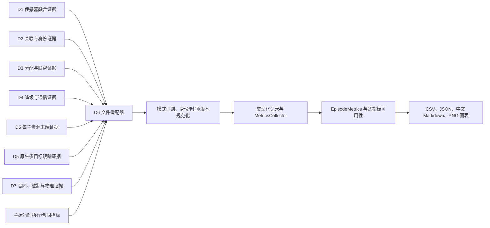
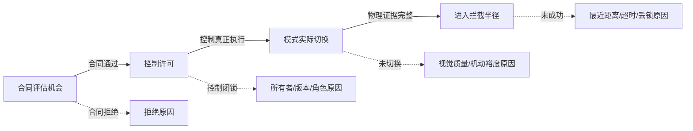

# D6 系统级离线评估：算法原理与实施说明

## A3 v2 候选语料低层审计

当前 v2 审计由通用低层来源审计和固定候选锚点审计两层组成。第一层只接受数据集根目录，
使用 Python 标准库逐文件和逐 JSON 记录验证，不导入 D5 的 validator、corpus gate 或高层
loader。第二层在第一层通过后，核对本批次指定的 producer commit、manifest、摘要清单、
episode 数和 seed 范围，并检查与保留 seed 范围的交集。

低层处理顺序如下：

1. 读取并哈希 `SHA256SUMS`，解析排序后的路径-摘要条目；遍历根目录重建实际文件集合，拒绝
   symlink、非普通文件、额外文件、缺失文件、可写 finalized 文件和摘要不一致；
2. 为摘要清单和 302 个登记工件保存设备、inode、大小、修改时间与权限，审计结束后再次
   比较，形成 303 个文件的审计期不变性证据；
3. 解析 manifest 与 dataset config，验证 schema、存储合同、来源合同和配置摘要；按
   `episode_uid` 顺序读取 100 个独立 descriptor，并与 manifest 内嵌 descriptor 全等比较；
4. 流式解压每个在线 JSONL。header 必须位于首行，footer 必须位于末行。snapshot 和
   camera-feedback 的 `object_key` 由规范化 value 重算；sample 必须按连续序号引用已经出现的
   snapshot 和 feedback；
5. 根据全部 sample 重建五字段样本索引并复算 `sample_index_sha256`，再与 footer 比较；同时
   核对样本、快照和反馈数量；
6. 解析对应离线文件，核对 episode 身份和 label schema，要求 159502 个离线 sample key 与
   observation key 和在线样本逐项同序；
7. 从 descriptor 重建来源域、证据等级、fixture 和 clean source summary，流式拒绝在线
   truth、actor、object 或身份型值；
8. 按 split seed 重新执行确定性划分，复算 `split_sha256` 和 `training_set_sha256`，检查
   train/validation/test 的 seed 集合互斥；
9. 固定候选层核对 producer commit、manifest SHA-256、`SHA256SUMS` SHA-256、100 个
   descriptor/online/offline 文件和 seed `22100-22199`，再计算与 `1000-1019` 的交集；
10. 全部检查通过时只返回 `simulation_research_integrity_confirmed`。所有 authority 字段仍
    为 false，D6 不把来源通过转换为训练或控制许可。

本轮实际解析 321215 条在线记录，其中样本 159502 条、snapshot 2011 条、camera-feedback
159502 条，另有 100 个 header 和 100 个 footer。离线 label 为 159502 条。来源层 16/16、
候选层 13/13 通过。机器证据保留关键计数、哈希、拆分和边界，不复制全部在线载荷。

generation plan SHA-256 作为 main 提供的外部锚点进入报告。数据集根不包含计划文件，审计器
没有读取上级输出目录，也没有声称完成 plan-content 复算。manifest 与摘要清单则从受审输入
实际读取并独立复算。

## D5 主动视觉来源域审计流程

公开入口接收一个已 finalized 的数据集根目录，返回固定 schema 的只读审计结果。生产实现只
使用 Python 标准库，不导入 D5 的来源、episode dataset 或 corpus audit 校验器。失败结果仍
携带完整的权限关闭字段，避免 malformed input 绕过 no-authority 合同。

审计按以下顺序执行：

1. 拒绝根目录、子目录或文件 symlink，解析按路径排序的 `SHA256SUMS`，比较实际普通文件
   集合，流式复算每个 SHA-256，并检查 finalized 制品只读及审计期间未变化；
2. 解析有限 JSON manifest，核对当前 dataset/descriptor/record schema、storage contract、
   source provenance contract 和 dataset config 摘要；
3. 对每个 manifest episode 读取 `episodes/*.episode.json`，要求与嵌入 descriptor 完全相同，
   再核对 online/offline/config 文件路径与摘要；
4. 流式解压 `.online.jsonl.gz`，要求唯一首 header 和末 footer，核对 episode 身份、来源身份、
   fixture、来源域、证据等级及 sample/snapshot/camera-feedback 计数；
5. 递归检查在线 JSON。`global_track_id` 和 `target_global_track_id` 只作为 center-owned 引用被
   接受，truth、actor、object、entity 和 AirSim 身份字段或身份型值被拒绝；
6. 从 descriptor 独立重算五类来源域/证据等级计数和 clean source identity summary，要求所有
   episode 来源相同。AirSim/真实相机即使完整也只输出 `declaration_only`；
7. 按 split seed 对全部 seed 重排，复算 train/validation/test 分配、`split_sha256` 和
   `training_set_sha256`，并显式检查三组 seed 互斥；
8. 仅当统一来源为 `scalable_3d_point_mass_runtime` 且全部检查通过时输出
   `simulation_research_integrity_confirmed`。其余有界来源按 declaration/fixture 报告，异常
   输入返回首个稳定 blocker code 和 `fail_closed`。

返回的 authority 固定关闭 AirSim 外部证明、真实相机证明、模型准入、assist、assignment、
degradation、runtime、production、control 和 `global_track_id` write。该 API 不写输入目录，
不生成控制消息，不参与 D5 或 main 的状态机。

测试 fixture 由 D6 低层文件写入器构造。每个基础夹具数据集包含 5 个 episode、seed
`200-204`；12 项测试分别构造来源域与篡改变体，覆盖三维质点正例、AirSim/真实相机声明级
正例、未重绑定 checksum 篡改和多类全量重绑定篡改。

2026-07-31 的 producer 兼容复核直接把 finalized 数据集根传入上述公开入口。输入来自
clean commit `4a8c1173179b4058d4aee38178e0fb40ecd222b3`，包含 seed `21000-21099`、
100 个 episode、159487 个样本和 302 个摘要清单工件。D6 获得 12/12 检查通过、
`simulation_research_integrity_confirmed`，并将完整返回值的规范化摘要、manifest 摘要、
`SHA256SUMS` 摘要、split 摘要和计数保存为紧凑证据。100 个逐 episode 配置摘要不在报告中
展开，其集合由 dataset manifest 与 `SHA256SUMS` 摘要固定。

来源审计算法不读取动作/角色覆盖结果，也不据此输出训练覆盖判定。该门属于 D5 corpus
gate。D5 发布结果后，D6 使用独立回执登记两个公共文件的 SHA-256，解析机器 JSON，并将
生产提交、episode/样本计数、manifest、split 和训练集摘要与原 D6 快照交叉核对。该回执不
遍历数据集样本，不重算 13 项 action-role 失败原因，只记录原因数、有序清单摘要和关键零覆盖
组合。

D5 公共结果为研究来源门通过、训练结构门失败关闭。来源审计返回的全部 authority 继续为
false，因此接收结果不会进入模型采用、分配、降级或控制链。

## 学习作用域归档原生流程

`ScopeEvidenceArtifacts` 采用显式互斥输入。目录模式保留原有
`execution_plan_path + merge_dir`；归档模式使用
`execution_plan_path + archive_root + archive_merge_dir`。learned scope 和各 R0 scope
分别实例化，因此归档候选可以与目录 R0 配对。构造阶段不读取目录来判断模式。

归档审计按以下步骤执行：

1. 使用既有 execution plan 校验器核对 clean source、formal parent、scope cell、shard
   descriptor 和模型 bundle binding；
2. 读取 archive-native merge 的 manifest、cell CSV 和 episode index，先核对 schema、
   execution plan、parent、variant、cell 数、shard 顺序及逻辑 episode 路径；逻辑路径只做
   字符串和相对路径安全检查；
3. 要求 archive-native merge 由 producer 以 `write_d6_report=True` 生成，使 D6 能复核
   `archive_d6_evaluation_binding.json` 与五类报告文件；该要求用于绑定复核，不导入 producer
   的评价结论；
4. 调用 D6-owned `audit_verified_formal_shard_archive_set()`，先独立验证 `sharding` 映射、
   排除布尔值的正整数 `shard_count`、descriptor 数量、连续索引和规范 shard 名称，再对
   archive root 的 shard 子目录做精确集合比较；普通文件作为 sidecar 记录，symlink、非普通项
   和额外目录拒绝；
5. 每片调用同一低层 `verify_and_restore_formal_shard_archive()`，复算 checksum、manifest、
   payload、计划绑定和 inventory，并流式检查 tar 成员类型、路径、元数据、大小和摘要；
6. 当前 shard 恢复到独立临时 execution root 后，复用
   `_validate_one_shard_evidence()` 校验 shard plan、progress 和 checkpoint；
7. 对该片每个 cell 调用原 `_audit_cell()`。cell_result、episode 文件树、学习运行诊断、
   实际 assist adoption、在线真值隔离、物理结果及 D6 离线评价在临时目录清理前完成；
8. 全片完成后调用 `audit_archive_merge_bundle()`，将 merge shard/archive binding 与 D6
   独立归档记录对账，并复核 D6 报告文件 binding；producer 报告结论不进入候选指标；
9. 按 execution plan 的 scope 顺序汇总 cell，检查重复、漏失和乱序，再执行原同键 R0
   唯一配对和非退化比较。

producer 兼容测试位于 D6 测试层。它构造满足正式字段约束的父计划，测试中只缩减 cell
枚举、学习运行解析和 cell 执行，随后调用真实 execution-plan writer/loader、shard runner、
`create_verified_formal_shard_archive()` 和
`merge_verified_formal_shard_archives(write_d6_report=True)`。原始 shard 移走后，D6 使用
生产归档和 merge 完成独立验证。D6 production module 不导入 scalable-3D producer，归档
验证函数也不在该测试中 monkeypatch。

公开结果按 scope 给出：

```text
storage_mode
archive_root
archive_verification_performed
verified_archive_count
peak_staged_shard_count
sidecar_files
```

目录模式的 `archive_verification_performed=false`，归档计数和暂存峰值均为 0。归档模式在
完整正例中峰值为 1。上述字段只陈述证据取得过程，不代表模型准入。

CLI 保留 `--scope-merge-dir` 和 `--r0-scope`，新增 learned 的
`--scope-archive-root/--scope-archive-merge-dir` 以及可重复
`--r0-archive-scope EXECUTION_PLAN ARCHIVE_ROOT ARCHIVE_MERGE_DIR LABEL`。argparse 互斥组和
输入数据类共同拒绝含混配置。

## 正式归档审计流程

目录模式仍由 `audit_formal_r0_full_posterior()` 直接读取 canonical shard。v1 配置出现
`archive_root` 后，同一入口改走 D6-owned `formal_shard_archive_audit`，输出 schema 和
最终失败关闭判定保持不变。

归档流程按以下顺序执行：

1. 从执行计划生成精确 shard 名称集合，只与 archive root 的普通子目录比较；普通
   pack/verify sidecar 文件记录但不计入集合，符号链接、额外目录和非普通项失败关闭；
2. 对当前 shard 复算 `SHA256SUMS`，解析 manifest，并按计划复算 descriptor、cells、
   execution-plan file、parent-plan 和 source commit 绑定；
3. 校验 inventory 排序、路径、数量、总大小和 tree SHA-256，再流式解压 tar.zst；
4. 对每个 tar 成员拒绝绝对路径、`..`、反斜杠、目录、链接和非确定性 uid/gid/mtime/mode，
   同时复算成员大小和 SHA-256；
5. 在临时 execution root 内复制冻结计划，只放入当前 shard，使用该 shard 的 45 个 target
   调用既有 targeted posterior；低层行进入累计结果后删除整个临时目录；
6. 20 片完成后复核 archive-native merge。cell CSV 与 canonical cell 和重算摘要对账，
   episode index 与 CSV 路径对账，manifest 中每个 archive binding 与 D6 复算值对账；
7. 复算 `archive_d6_evaluation_binding.json` 自身摘要及五类报告文件的路径、大小和
   SHA-256，并验证 evaluator schema、Git 提交、dirty 状态和源码树摘要；源码树摘要
   只接受 `sha256:<64位小写十六进制>`，与 `_current_evaluator_provenance()` 输出一致；
8. merge manifest 的 shard index 必须集合完整、无重复并按规范顺序排列，每片
   `cell_count` 必须等于独立验证 archive binding 的 `completed_cell_count`。

merge core、D6 artifact 和从 root 到文件的父目录均先执行未解引用 symlink 检查。报告内容
不回灌 full posterior 指标。

实现使用 `zstd -dc` 和 Python tar 流式读取，不调用 `extractall()`。任何异常都由临时
目录回收；源 shard 和 archive 不在删除路径内。归档不完整时在 staging 前终止。

## 预评估行报告流程

目录入口先对每个目录调用 `evaluate_scalable_3d_episode()`，随后直接转交
`write_report_bundle_from_rows()`。main 也可以逐片恢复归档并直接累积同一种评估行。
归档在对应行生成后即可释放；最终聚合不再访问 episode 目录。

预评估行入口按以下顺序处理：

1. 检查输入非空、episode 唯一、评估 schema 与 evaluator schema 为当前 v12；
2. 检查阶段记录、失败原因、episode/evaluator 来源、在线 truth 审计、严格身份值及其
   availability 字段完整；
3. 深拷贝行，收集所有 episode 的阶段名称并检查 CSV 列名归一化冲突；
4. 在副本上补齐全批次阶段列并重新执行既有 episode 状态终结；
5. 调用既有 `aggregate_scalable_3d_episodes()` 和模块性能证据注册器；
6. 写出 CSV、aggregate JSON、性能证据 JSON、中文 Markdown 和阶段耗时曲线。

该入口不重新计算或替换严格身份结果，不将 unavailable 补零，也不覆盖 producer/evaluator
来源。调用方传入行在整个过程中保持不变。目录入口与预评估行入口只在数据取得方式上不同，
后续聚合和写包代码相同。

## 历史候选源漂移测试

生产审计的执行顺序保持不变。v4 审计从候选源实现摘要读取 `fd85745`，使用 Git 对象复算
该提交的实现文件，再与当前工作树逐文件比较。v5 审计使用调用方冻结的 v4 源文件清单
复算当前文件摘要。当前 D4 的 `region_resource.py` 已包含 `20895c7` 引入的建议发布
代次门，因此两条真实历史候选链分别在
`source_current_file_differs_from_audited_commit` 和
`v4_source_external_anchor_mismatch` 处终止。

测试将源漂移和算法内部负例分开。真实候选测试只验证源锚点失败关闭，并继续拦截 TEST
payload 的语义读取。重叠诊断负例直接调用同一生产重叠计算函数，输入为受控的 12 条训练
样本和 1 条验证样本，故意把预期 exact latent overlap 从 0 写为 1。该测试稳定到达
`validation_overlap_expected_crosscheck_mismatch`，不修改或绕过生产源锚点检查。
本次无需增加测试专用生产接口，也没有修改生产代码。

## 严格身份交换汇总

汇总入口先读取在线 `modules.d2.associated_tracks`，把 producer 声明写入在线诊断字段。
随后独立打开 `d6_truth_isolated/manifest.json` 和 `episode_record.json`。公共
`d2_id_switch_count` 在这一阶段尚无默认值。

严格加载按以下顺序执行：

1. 核对真值隔离 manifest schema、episode 标识、场景版本、seed 和目标/资源规模；
2. 复算 episode record、离线身份 manifest 和 identity evaluation 的 SHA-256；
3. 按离线身份 manifest 复算 online D1、online D2、观测真值标签和身份谱系证据哈希；
4. 调用 D6 现有身份适配器复核评价 schema、策略、源记录语义、真值隔离和身份承诺；
5. 将重验后的 D2 记录与 episode record 内的持久化记录逐字段比较；
6. 仅在来源为离线身份评价、验证模式为 SHA-256 绑定、真值隔离通过且未回填时发布严格值。

任一步失败均返回 null 和具体原因。合同完整但身份本身不可判定时，继续透传
`multiple_truth_targets_for_global_track` 或
`source_observation_outside_lineage_window`。正式后验审计按严格可用项统计，实验矩阵
准入要求每个 cell 的严格值及来源合同同时可用。旧 v11 CSV 不具备来源字段，不能直接
进入新准入流程。

## 正式 R0 前 450 项派生重聚合（2026-07-31）

重聚合输入固定为 clean producer `80e55eb` 的 shard 0-9，共 450 个 episode；评估器固定
为 D6 v12 commit `b6289c5`。执行只重新生成 per-episode CSV、aggregate JSON、中文报告
和性能证据，不修改 episode、执行计划或 producer 制品。每项结果同时记录 producer 与
evaluator 来源，避免把后续评估器修复写成仿真来源变化。

450 项有限状态均通过，严格身份制品哈希/合同复核也为 `450/450`。公共严格指标为
`414/450 available`，可用值合计 893，169 项非零。其余 36 项返回 null：27 项原因为
`multiple_truth_targets_for_global_track`，9 项为
`source_observation_outside_lineage_window`。在线诊断字段为 `0/450 available`，原因均为
`producer_declared_id_switch_count_unavailable`。聚合器没有用离线值回填在线字段，也没有
用 0 替换严格不可用项。

修复前的 90-cell 诊断仍用于验证接线差异：旧通用路径为 `0/90 available`，严格离线路径
为 `73/90 available`。本次 450 项结果取代原 135 项待重聚合状态。正式 full posterior
审计和 post-run matrix admission 不对局部范围提前运行，必须等待 900-cell 全部完成。

## clean smoke 修复后只读复核（2026-07-31）

D6 复用 `scalable_3d_offline` 和 `formal_r0_plan_binding_audit`，读取 clean commit
`b063535` 的 6 个 episode。没有新增或修改审计算法。每项先重算核心制品 availability、
配置哈希、有限状态和在线真值隔离，再以最后 D3/D4 发布核对当前计划标识、版本、时期、
租约和联盟提交。D3 在线发布、计划身份和 summary ACK 独立计数，逐消息通信处置从
JSONL 重算。

建议审计按总线序列遍历。每遇到 `modules.d4.region_resource_advice`，使用该记录之前
最后一条 `modules.d4.regional_failover` 作为发布时正式快照。建议 action 的
`expected_plan_id/version/epoch/lease` 必须逐区域匹配。随后再与最终 D3 计划比较，
区分当前建议、发布时有效但后来 superseded 的建议和发布时已经错代的建议。

本批 12 条建议全部匹配各自发布前最后一条正式快照，发布时错代为 0。四个重规划
episode 的第二条建议均绑定 v2，最终计划建议覆盖为 `6/6`。低层
`formal_acceptance_eligible=6/6`，现有审计器没有触发
`d4_advice_version_evidence_issue`。该结果由运行时修复形成，不是过滤旧记录或放宽
D6 判据。

建议中的故障诊断通过投影拒绝、hold 和 request-replan 识别。10 条此类建议都匹配发布时
当前代次，且为 shadow、`assist_eligible=false`、正式决策未改变。原始制品没有区域建议
消费记录，D6 不把缺失采用证据补成 0。正式矩阵入口仍要求 execution plan、20 shard、
cell result 和矩阵 metadata；6-cell smoke 只关闭低层建议代次预检。

## v5 只读复验（2026-07-31）

D6 使用既有 `formal_r0_plan_binding_audit` 和 `scalable_3d_offline` 读取 v5 的 100 个
episode，没有新增或修改审计算法。计划绑定审计得到时期、租约、当前联盟和通信处置
`100/100`；四项权威 metadata 在 151 次 D3 发布中完整。48 次同身份刷新均由诊断记录
表达，没有形成新权威发布。

正式 full/targeted posterior 入口要求 clean source 和规范 900-cell 分片，本轮不将开发
目录改造成该输入。共享门禁通过 24 项专项回归。离线消费者继续保留 v5 的 51 项旧计划
区域建议版本证据。修复前 `49e43ea` smoke 证明抽取样本存在发布时错代；修复后
`b063535` smoke 以相同事件时序判据得到发布时旧代 0。当前计划绑定与全时序建议证据仍
是两个独立指标。

## 当前计划目标域门控（2026-07-30）

当前联盟集合先由最新 D3 assignments 构造。最新 D4 中任何
`commit_required=true` 提交都必须满足其 `global_track_id` 属于该集合的目标域；否则
记录
`current_plan_coalition_target_not_in_latest_d3_assignments` 并失败关闭。该门控处理
“旧提交被夹带在最新 D4 快照”这一边界，补足只比较外层 `plan_id/plan_version` 仍可能
漏过的情况。

同一当前目标在最终 D4 中必须恰有一个提交。零提交表示联盟未完成或最终快照丢失任务，
两个及以上提交表示重复授权；两种情况均使用
`current_plan_coalition_commit_count_mismatch` 拒绝。开发态 100 项中未发现重复提交，
但发现三个零提交样本，均指向 `GT3D-000011`。

## 正式 R0 当前计划绑定审计（2026-07-30）

实现位于 `formal_r0_plan_binding_audit.py`。入口读取 episode 的
`online_observations.jsonl`，按时间戳和总线序号选取最后 D3 assignment plan 与最后 D4
regional failover。实现不导入 main runtime，也不调用 D3 或 D4 控制代码。

审计顺序如下：

1. 提取最后 D3 的 `plan_id/plan_version`，逐区域提取最后 D4 ownership 的同名字段；
2. 任一区域错代或缺字段时立即将当前计划绑定判为失败；
3. 从 D3 assignments 提取区域 epoch；未来合同提供逐区域 lease 时按区域比较，现阶段
   也支持 metadata 中的最大 epoch 和最小 lease；
4. 按 `global_track_id` 汇总 D3 分配。资源数大于一的目标进入必需联盟集合；同代 D4
   `commit_required=true` 的目标也进入该集合。单成员 assignment 的 `coalition_id`
   不作为原子提交判据；
5. 核对 commit 唯一性、D3/D4 成员集合、ACK 闭合、原子提交、执行授权、状态和租约；
6. 把失败原因和扁平化 availability 字段写入 targeted/full posterior 的逐 cell 行；
7. full audit 将当前计划绑定和当前联盟提交列为必需证据，聚合时单列通过数。

`communication_dispositions.jsonl` 是可选 episode 输入，schema 为
`scalable3d-communication-disposition-v1`。验证器拒绝重复或非法 transport ID、未知最终
状态、空源宿、非法时间戳和负重试代次，并汇总 D4 计划广播与联盟 ACK 的最终处置。缺文件
返回 unavailable；存在但内容非法会进入正式失败原因。

正式 targeted/full 输出 schema 已升级到 v2。代表性测试覆盖同代 committed 通过、最后
D3 v2 对旧 D4 v1 拒绝、当前计划 collecting ACK 拒绝、proposed 拒绝、epoch/lease
错代拒绝、逐消息处置文件缺失 availability，以及多个单成员 assignment 均携带
`coalition_id` 的混合合同。main runtime 实际落盘文件名和 schema 已与 D6 消费端核对
一致。代码没有对既有正式目录执行写操作，也没有生成新的正式结果。

## D4 v7 来源独立外部评价盲审（2026-07-30）

实现入口为
`d6_evaluation_metrics/d4_v7_source_independent_external_audit.py`，命令行为
`scripts/run_d4_v7_source_independent_external_audit.py`，固定配置为
`configs/d4_v7_source_independent_external_audit_m16n24_20260730.json`。v7 使用独立
schema、类名、输出目录和测试文件，不覆盖 v4-v6 审计。

### 输入固定

配置固定六类只读树：

1. raw source；
2. labeled export；
3. labeled dataset；
4. 冻结 v4 来源；
5. v7 候选；
6. D4 外部评价制品。

前五项是候选审计输入，审计前后都计算完整树摘要。D4 评价树用于事后对账，也在前后复核
中保持不变。配置同时固定 manifest、dataset、split、模型状态、训练审计、来源绑定、
D4 JSONL/CSV/summary/integrity/overlap/artifact manifest 的文件和内容 SHA-256。

### 逐帧推理

每帧按以下顺序重建：

1. 从冻结标签 dataset 读取快照和目标动作；
2. 对同一快照运行确定性 R0 规则，形成基准区域动作和转移；
3. 由冻结图构造器生成节点特征、边特征和边索引；
4. 加载 v7 模型状态，执行一次无梯度推理；
5. 按冻结 activation threshold 解码激活边，再将资源数量限制到边的可转移上限；
6. 把解码结果作为 R0 转移残差，不改写原始 R0 节点动作；
7. 运行冻结确定性投影器；
8. 比较目标、R0、raw actor 和 projected actor 的完整动作签名；
9. 检查干预不变量并拆分错误方向、错误数量、错误边、虚假转移和投影拒绝；
10. 写出逐帧记录，置信 gate、admission 和全部运行权限固定为未应用或 false。

D6 记录完整 R0 action tuple 的字段级差异。投影前 `actions` 必须与 R0 保持一致；投影后
单独记录由转移守恒产生的配额联动。这样可以区分节点头越权和投影器的确定性后果。

### 独立分母

train/validation/test 分片从冻结 split 读取，实际帧数为 `90/20/18`。D6 独立统计：

- 规则正/负：`24/66`、`9/11`、`9/9`；
- 原始边激活：`10/0/0`；
- 原始和投影转移变化：`3/0/0`；
- 精确正动作：`0/0/0`；
- 负类精确 R0：`63/11/9`；
- 错误边和虚假转移：`3/0/0`；
- 错误方向、错误数量、投影拒绝、不变量失败和原始 R0 元组偏差：全部为 0。

规则正类精确召回为 `0/42`。actor-derived positive 聚合分母为 3，精确动作仍为
`0/3`；validation/test 分母为 0，因此相关比率写为 `unavailable/null`。

### 对账顺序

D6 先将 128 条重算记录序列化为规范 JSONL，之后才读取 D4 逐帧制品。两份 JSONL 按原始
字节计算 SHA-256，并要求逐字节相同。D4 CSV 经过传输值规范化后逐字段与 JSONL 对比。
D4 summary 只与 D6 已生成的 split 和 aggregate 指标比较；它不参与任何分母或结论计算。
artifact manifest 必须枚举评价目录中的全部受管制品，并同时绑定文件摘要和规范内容摘要。

本轮 D4/D6 JSONL SHA-256 均为
`7785ded96360869edfb694c425321fa3323450cf1624607b53edf5d3eca6a5cd`，
逐帧 mismatch、CSV transport mismatch 和 summary claim mismatch 均为 0。

### 治理与输出

审计显式记录以下操作计数为 0：模型拟合、检查点更新、阈值调整、置信校准、置信门应用、
输入和候选修改、注册、准入、正式留出读取、既有评价读取及 D4 高层 evaluator 调用。
任一计数、权限或来源绑定不符合固定值都会终止审计。

完整输出包含约 2.6 MB JSON、约 1.7 MB 逐帧 JSONL、split CSV、中文报告和
`SHA256SUMS`，保留在忽略的 outputs 目录。版本控制只跟踪固定配置、实现、CLI、测试、
紧凑结果和中文报告，不提交模型或大数据。

评价门要求 validation/test 出现非零且充分的精确正动作，同时保持零虚假转移、零投影
拒绝、零不变量失败和零原始 R0 动作元组偏差。本轮未达到该门，结论固定为
`failed_closed`，所有权限为 false。

## D4 v6 来源独立盲审（2026-07-30）

实现入口为
`d6_evaluation_metrics/d4_v6_source_independent_external_audit.py`，命令行为
`scripts/run_d4_v6_source_independent_external_audit.py`，固定配置为
`configs/d4_v6_source_independent_external_audit_m16n24_20260730.json`。实现只使用
D4 的冻结模型加载器和领域数据结构，不调用 D4 v6 高层评价函数。

### 输入与信任根

配置固定 source、标签导出、标签 dataset、冻结 v4、v6 候选和 D4 评价目录的完整树摘要，
同时固定 manifest、dataset、split、bundle、状态参数、训练审计和 D4 artifact manifest
的文件与内容摘要。JSON 的内容摘要按删除 `content_sha256` 后的规范 JSON 重新计算；
文件摘要按原始字节计算；目录摘要按“相对路径到文件摘要”映射计算。

D4 artifact manifest 的六个 artifact 必须与实际目录精确闭合。manifest 中的每个文件
SHA-256、summary 对 JSONL/CSV/integrity/overlap 的内容绑定，以及 JSONL 与 CSV 的
126 行传输值都要一致。CSV 与 JSONL 的字段顺序可以不同，但字段集合和每个字段值必须
完全相同。

审计开始前记录六棵输入树摘要，完成模型推理、可观测键计算和全部 D4 对账后再次计算。
任何输入变化都抛出 `audit_input_mutated_during_execution`。成功结果记录
`input_mutation_count=0`。

### 逐帧重建

每帧按以下顺序处理：

1. 从标签 dataset 读取区域快照和安全目标动作；
2. 运行同快照确定性 R0 规则策略；
3. 从 v6 原始参数加载图 actor 并运行一次冻结推理；
4. 用冻结投影器限制资源转移和节点动作；
5. 将目标、R0、actor 三类动作转换为可执行签名；
6. 核验目标动作自身满足干预不变量；
7. 计算 actor 可执行差异、投影拒绝和干预不变量；
8. 拆分正确有向边、错误方向、错误边、错误数量和负类虚假转移；
9. 计算只含在线图张量的 observable key；
10. 写出置信门 unavailable、未应用、未准入和规则回退字段。

规则正类精确动作召回为

\[
\mathrm{Recall}_{\mathrm{rule+}}=
\frac{
\sum_i \mathbf{1}
[\operatorname{sig}(\hat a_i)=\operatorname{sig}(a_i^*)
\land \operatorname{safe}(\hat a_i)]
}{
\sum_i \mathbf{1}
[\operatorname{sig}(a_i^*)\ne\operatorname{sig}(a_{R0,i})]
}.
\]

本轮分子为 0，分母为 42，结果为 0。actor-derived positive 的条件比率采用 actor 实际
产生可执行安全差异的帧数作为分母；该分母为 0，因此值为 `null`、availability 为
`unavailable`。输出同时保留 numerator 和 denominator，防止报告层误填 0。

### 对账

D6 先完成独立重算，再读取 D4 记录。每条记录按 split、episode 和 frame 定位，并比较
全部字段。D6 同时从 D4 JSONL 自己汇总 split 和 aggregate 指标，再与冻结模型重算比较。
最后才比较 D4 summary。summary 只能通过或产生 mismatch，不能反向写入重算指标。

当前 D6 重算 JSONL 与 D4 JSONL 文件 SHA-256 均为
`771826bff66d3ba601d0ffecc95f7ab9faf416826898319de7b9f1669020c7c5`。
train/validation/test 的规则正类为 `24/9/9`，raw/projected transfer 均为 0，精确正
动作均为 0，负类精确 R0 为 `61/9/7`，不变量失败为 `6/6/3`。

### 置信与权限

审计器要求 bundle 没有 runtime confidence gate，candidate 的校准状态为
`not_started_actor_must_freeze_first`，D4 integrity、summary 和全部逐帧记录的 gate
应用数为 0。manifest 保留值 0.60 不参与任何判断。候选权限 map 必须全部为 false，
生命周期保持 development、shadow-only、unregistered、admission closed 和 rule
fallback required。

输出包含完整 JSON、LF split CSV、逐帧 JSONL、中文报告和 `SHA256SUMS`。专项测试覆盖
summary 篡改、固定哈希不一致、零 actor-derived 分母、test 正类分母、无校准器 gate
以及 seed/truth 污染。当前专项为 `8 passed`，全量 D6 为 `1223 passed`。

## D4 v5 来源独立外部评价（2026-07-29）

实现入口为
`d6_evaluation_metrics/d4_v5_source_independent_external_audit.py`，命令行为
`scripts/run_d4_v5_source_independent_external_audit.py`。固定配置记录 source、labeled
dataset、v4 actor、v5 calibrator 路径，以及 25 项调用方摘要。报告输出采用临时目录写完后
原子重命名，不覆盖已有结果。

### 输入复核

审计先读取 source manifest，不读取 source episode payload。labeled dataset 通过 D4
公开数据加载器完成 manifest、split、episode SHA、truth-free 字段和连续帧校验。外部
train、validation、test 全部进入冻结评价，因此读取数为 `43/10/10`。旧 v4 开发数据只
加载 train 和 validation 的 `350/75` 帧；旧 test payload 不读取。

source derivation、external evidence 和 export summary 的 `content_sha256` 由 D6 删除摘要
字段后按规范 JSON 重算。source artifact 使用文件字节 SHA-256。labeled dataset 和 split
使用数据合同内的语义摘要。各类摘要不能混用。v4/v5 文件树按“相对路径到文件摘要”的规范
映射重算，普通文件篡改、重签或绑定错位均失败关闭。

审计器在上述读取前保存五个完整输入树的开始摘要，覆盖 source root、labeled export root、
labeled dataset root、v4 actor root 和 v5 calibrator root。外部数据评分和新旧可观测键
重合计算结束后，再按同一相对路径文件清单算法复算结束摘要。键集合或任一文件摘要变化时，
入口抛出 `audit_input_mutated_during_execution`，不构造结果 JSON。成功 JSON 同时保存
`before_sha256`、`after_sha256` 和 `input_mutation_count=0`。

### 冻结推理

D6 通过 v4 候选的公开离线加载模式读取冻结 actor。每帧执行以下步骤：

1. 将区域快照转换为 truth-free 区域图；
2. 重算不含身份的 observable key；
3. 运行冻结 actor，使用既有投影器得到候选动作；
4. 运行同快照 R0，并读取外部安全标签；
5. 将候选、R0 和标签转换为可执行签名；
6. 按签名和干预不变量计算 actor-derived positive；
7. 独立重建 24 维池化特征，按冻结 v5 state 计算 11 近邻逆距离分数；
8. 只比较固定 0.60 门，不拟合、不调门。

评分公式为

\[
s(h)=
\begin{cases}
\operatorname{mean}(y_j), & d_j\le 10^{-12}\text{ 的 exact 近邻存在},\\
\dfrac{\sum_{j\in N_{11}}y_j/\max(d_j,10^{-12})}
{\sum_{j\in N_{11}}1/\max(d_j,10^{-12})}, & \text{其他情况}.
\end{cases}
\]

### 输出判定

逐 split CSV 保留样本、seed、唯一键、规则安全正动作、actor-derived 正负类、有限评分、
门通过、负类误接收、分母 availability 和规则回退。JSON 另保留完整摘要、seed 实际读取
集合、key 重合和权限状态。
CSV writer 保留 `newline=""` 并显式设置 `lineterminator="\n"`，由 writer 自己产生单一
LF 行尾。测试按字节拒绝 CR、空格行尾和制表符行尾；该约束只改变序列化字节，不改变字段、
行数或评价统计。

本轮 train/validation/test 为 `43/10/10` 帧，规则安全正动作 `1/1/0`，
actor-derived positive `0/0/0`。所有分数为 0，0.60 通过和负类误接收为 0。正类召回写
`unavailable/null`；负类特异度为 1.0。固定结论不运行注册、runtime preflight、D3
successor、D7 权限或控制路径。

## D4 v5 置信校准审计（2026-07-29）

实现入口为 `d6_evaluation_metrics/d4_v5_confidence_candidate_audit.py`，命令行为
`scripts/run_d4_v5_confidence_candidate_audit.py`，固定配置为
`configs/d4_v5_confidence_candidate_independent_audit_20260729.json`。输出使用临时目录
完整写入 JSON、中文 Markdown 和 `SHA256SUMS` 后原子重命名，不覆盖已有审计目录。

### 外部锚与文件闭包

配置固定 v5 manifest file/content、calibration state、calibration summary、development
gate 和 builder source SHA-256。manifest 声明的三个 artifact 必须与目录中除 manifest
之外的三个文件精确相等。D6 同时复算每个文件的外部摘要、候选内部摘要和 content hash。
检查顺序以 manifest file 外部锚为先，因此攻击者同步修改所有候选内部摘要仍不能通过。

v4 基线检查包含 180 文件树、manifest file/content、state dict、dataset、split 和四个实现
文件。v3 registry 按 8 文件树复哈希。审计器从 v4/v5 源文件的抽象语法树读取登记常量，
要求全部为 `None`，并要求两个候选的 registry 目标路径不存在。

### 实际 latent 重建

审计器仅调用已固定哈希的 v4 数据与模型加载边界，不调用 v5 的拟合、评分或 summary
函数。每条图记录按冻结 actor 的节点编码、边编码、消息网络和节点更新重新计算两轮消息传递，
最后取节点均值。实际冻结模型 `hidden_dim=24`，所以

\[
H_{\mathrm{train}}\in\mathbb{R}^{350\times24},\qquad
H_{\mathrm{validation}}\in\mathbb{R}^{75\times24}.
\]

TRAIN 均值和总体标准差逐列重算。标准差小于 `1e-12` 时按候选合同置为 1。D6 再比较
candidate state 的均值、标准差、350 条归一化特征和标签。当前三类数值最大差均为 0
（验收容差 `1e-12`），标签完全一致，TRAIN exact latent 共 229 个。

任务口径要求 64 维，但冻结 bundle、权重形状和 state 均只能产生 24 维。审计输出保留
`documented_latent_dimension_mismatch`。该不一致不阻止对真实 24 维算法做复算，但使严格
profile 不能通过。

### 近邻评分与开发门

对查询 \(u\) 计算到 TRAIN 行的欧氏距离，按 `(distance, train_index)` 稳定排序并取前 11。
exact 距离不大于 `1e-12` 时，仅平均前 11 中的 exact 标签；否则使用逆距离权重。门限、
近邻数和 exact epsilon 都不可由 CLI 重配。

独立评分完成后，D6 才逐项比较 candidate summary。固定门要求两 split 的正类召回不低于
0.8、负类特异度等于 1、最小正裕量不低于 0.02。当前 TRAIN/VALIDATION 结果为：

| split | recall | specificity | margin | Brier |
| --- | ---: | ---: | ---: | ---: |
| TRAIN | 1.000000 | 1.000000 | 0.400000 | 0.000000000 |
| VALIDATION | 1.000000 | 1.000000 | 0.209319 | 0.000484791 |

### 留一、留组与距离分层

TRAIN 记忆审计保持已拟合的 TRAIN 标准化状态不变，只改变可进入近邻库的索引：

\[
\mathcal{I}_{-i}=\mathcal{I}\setminus\{i\},
\]

\[
\mathcal{I}_{-g(i)}=
\{j\in\mathcal{I}:k_j\ne k_i\}.
\]

第二式分别使用 raw observable key 和 normalized latent exact key。两种键都由在线可见张量
或实际 latent 构造，不含 seed、样本身份、truth identifier 或未来结果。当前 350 条记录
形成 229 组，115 组有副本，最大组大小 3。

VALIDATION 对每条记录输出 raw key overlap、latent exact overlap、最近距离和最近标签。
调用方配置只保存已知计数用于交叉核对，报告值始终由本次计算产生；任一计数不同均以
`validation_overlap_expected_crosscheck_mismatch` 失败关闭。

四个分层集合为全 VALIDATION、去除 raw/latent exact 并集、最近距离 `>=1e-3`、最近距离
`>=0.1`。最小分母固定为 5。当前去 exact 集为 33 条但只有 1 个正类，因此 recall/margin
不可用；`>=0.1` 集只有 3 个负类，四项指标均不可用。

### 数据用途和结论

语义 loader 显式只选择 TRAIN 和 VALIDATION。TEST episode 文件可以在 v4 文件树完整性检查
中按字节计算 SHA-256，但不解析 JSONL，不参与 latent、标签、评分、阈值或候选选择。
正式 holdout 不定位、不读取、不运行。输出分别记录完整性哈希读取和 payload semantic read，
避免把两者混为模型数据使用。

开发门通过后仍强制输出 `independence_evidence_available=false`、
`generalization_evidence_available=false`、candidate unregistered、admission closed 和
rule fallback required。D6 不调用登记器，不执行 preflight，不产生 D3/D7 权限。

## D4 v4 未注册候选独立审计算法（2026-07-29）

实现入口为 `d6_evaluation_metrics/d4_v4_candidate_audit.py`，命令行为
`scripts/run_d4_v4_candidate_audit.py`。输入配置
`configs/d4_v4_candidate_independent_audit_20260729.json` 只保存候选、外部 evidence、
v3 registry 的相对路径和五个固定锚。审计器要求所有路径位于显式 repository root 内，
并把 D4、scalable 和 registry 输入视为只读。

### 文件树与来源身份

候选遍历首先拒绝 symlink 和非普通文件，记录目录、文件、模式和逐文件 SHA-256。设候选
普通文件集合为 \(F\)，manifest 中 artifact 集合为 \(A\)，manifest 自身为 \(m\)。闭包门为：

\[
F=A\cup\{m\}, \qquad m\notin A
\]

每个 \(a\in A\) 的实际 SHA-256 必须等于 manifest 声明值。manifest content hash 使用删除
自身 content-hash 字段后的 canonical JSON 复算，并与 D6 配置中的外部固定锚比较。当前
结果为 180 个文件、179 个 artifact 和 4 个目录，全部通过。

source summary 必须声明 clean commit
`fd857457bb27a4a709a7c4937e22ebe1cbd7f848`。D6 对 4 个实现路径分别运行只读
`git show`，将 commit blob SHA-256 与 source summary、候选 implementation inventory 和
当前文件摘要交叉核对。候选构建时 dirty=false；当前 HEAD 是否等于构建 commit 只作诊断，
不会替换冻结来源身份。

### 外部 evidence 与数据用途

审计器按固定相对路径复哈希 external evidence、source derivation、export summary 和
dataset manifest，要求候选副本与外部原件逐字节相同。dataset SHA-256
`b31fc43f3d3cff34ee53f2b2c33ece0b06d7624e46e26a36c4aa834135e7fb8c`
及 split SHA-256
`c212fe9b48e9908fd4d47488711724ed361429cf9df29667ac32c3e88d094619`
必须贯穿 bundle、候选和外部 evidence。源数据包含两个 clean dataset，共
200 episodes、499 frames。

payload loader 只接收 split 为 `train` 或 `validation` 的 170 个选中 episode。test 清单
仅解析 split、相对路径、seed 和帧数等 manifest 元数据，用于证明候选未携带 test payload；
不访问或复哈希对应 payload 文件。当前库存为：

| split | seeds | episodes | samples | actor 正/负 | confidence 正/负 |
| --- | ---: | ---: | ---: | ---: | ---: |
| train | 70 | 140 | 350 | 60/290 | 58/292 |
| validation | 15 | 30 | 75 | 15/60 | 13/62 |
| test manifest only | 15 | 30 | 74 | unavailable | unavailable |

候选 test payload 文件数、builder/D6 payload read、fit、weight fit 均必须为 0。
truth identifier、future outcome、reward 和 formal holdout seed 的 available/use 计数也
必须为 0。

### 权重、checkpoint 与固定门

actor 类别权重只由 train 库存计算：

\[
w_{+}=\frac{N_{-}}{N_{+}}=\frac{290}{60}=4.833333,\qquad
w_{\mathrm{edge+}}=\min\left(\frac{3848}{72},32\right)=32
\]

confidence 同样只使用 train 库存计算普通正类、不一致负类和可执行负类权重；validation/test
weight fit 保持 0。模型输出经 D4 公共 DTO 和投影合同复载，D6 独立累计混淆库存。actor
epoch 107 在 240 个历史 epoch 中按声明选择规则重算；confidence epoch 66 在 180 个历史
epoch 中重算，固定 0.60 门共有 8 个 accepted epoch，最长连续 7 个。

| split | actor 正类召回 | actor 负类召回 | confidence 正类召回 | 特异度 | Brier |
| --- | ---: | ---: | ---: | ---: | ---: |
| train | 0.966667 | 0.951724 | 0.206897 | 1.000000 | 0.186847275 |
| validation | 0.866667 | 0.966667 | 0.307692 | 1.000000 | 0.186468779 |

train/validation 的最小正类越门裕量均为 `0.000504935`。train 最接近门的负类裕量为
`-0.000029838`；validation 为 `-0.000602221`。输出因此固定
`thin_margin_warning=true`。

### Fixture、registry 与失败关闭

审计器从冻结 fixture contract 重放一次 train-domain 输入，并独立比较 source、R0 和
treatment executable signature。fixture confidence 为 `0.602367163`，门上裕量
`0.002367163`；输出分类强制为 `training_domain_smoke_only`，泛化与正式验证字段为 false。

v3 registry 使用固定 8 文件逐项摘要和树摘要复核。D6 还从 source commit blob 解析 v4
注册常量，要求五个值全部为 `None`，并要求 v4 registry 路径不存在。manifest、gate、
training summary、model package 和 fixture 中的逻辑权限逐字段检查为 false。formal
holdout、preflight、registration 或 permission 任一被声明完成都会失败关闭。

负例测试复制候选到临时目录后执行两类攻击：直接改写 `training_config.json` 字节；将
`assist_enabled` 改为 true，并同步重算候选内部 manifest content hash。前者在 artifact
SHA 门失败，后者在 D6 外部 manifest content anchor 失败。原候选和外部 evidence 未被写入。

### Admission blocker 治理

`admission_blocker_codes` 保持确定顺序：

```text
candidate_unregistered
formal_holdout_not_completed
runtime_preflight_not_completed
development_fixture_train_domain_smoke_only
confidence_positive_recall_low
confidence_threshold_passing_margin_too_thin
runtime_outcome_and_benefit_unavailable
```

后四项分别绑定 fixture 的 TRAIN-domain 分类、已重算的低正类召回、显式
`thin_margin_warning=true` 和缺失的 runtime outcome/benefit。该列表只收紧 admission
治理，不参与 `audit_passed` 或开发指标重算状态计算。

输出 schema 为 `d6.d4-v4-candidate-independent-audit.v1`，原子生成 JSON、中文 Markdown
和 `SHA256SUMS`。最终 JSON content/file SHA-256 为
`3a4ed311c55e6419d3db1b3ba830f0ea6ce22c638eb363aa03c3f4510fdcd7c2` /
`e225a1a16ae2b1988ce5ea34b3cceaa30d7c829004663368ecc6514de3eb3887`，
中文 Markdown/`SHA256SUMS` 文件 SHA-256 为
`16a2e5a4efacd4b58b22b7b9dd9d0d632cedb3e7b8d6cc6d55a0dce954870fe0` /
`6ee4e7822800401b531acc93f03f105fc1ff02a77c1842fe1d36546bc9500af6`。
2026-07-29 专项测试为 `3 passed, 1 warning in 4.97s`，D6 全量为
`1205 passed, 1 warning in 112.59s`。正式 holdout、runtime preflight 和候选登记均未执行。

## D4 v3 隔离证据审计（2026-07-29）

审计入口要求 `input_root` 和调用方固定的 `SHA256SUMS` SHA-256。最终 schema 为
`scalable3d-d4-v3-isolated-rollout-v2`。manifest 必须精确包含 `source_provenance`，
其 11 个实现文件路径、逐文件摘要、实现集合摘要、提交/dirty 状态和双臂 episode manifest
摘要均需复算。compact 使用固定清单；full episode 使用动态清单，但每个文件必须被根
清单绑定。v1 默认拒绝。

语义审计依次检查双臂隔离声明、候选管线、D4 advisory 来源、D3 successor 谱系、开发 ACK
摘要和 D7 物理窗口摘要。所有生产权限必须显式为 false。候选动作按
`resource_quota_delta/reserve_ratio/hold/request_replan/transfers` 比较规则臂和候选臂；
侦察优先级单独记录，不作为当前 D3 可执行变化。

同键非退化按 seed 比较 treatment 与 R0。拦截数采用“越大越好”，最小距离采用“越小越好”。
只有全部 seed 两项均存在且有限时输出 available。本批两项差值均为 0，因此非退化通过，
正收益仍 unavailable/false。ACK 摘要缺 plan identity/source sequence，D7 摘要缺原始
guidance payload/hash，严格同链不由摘要反推。

full adapter 从 hash-bound `input_specification.json` 重新调用
`runtime_plan_outcome_join`。持久化结果中的原子暂存绝对路径允许归一化，其他字段必须逐项
一致。随后按 bus sequence 和 payload hash 重放 D4 advisory、source/successor plan、ACK
和 D7 指令。最终 v2b 首次发布与 refresh 的严格签名一致，证明 D3 已修复 epoch/lease
继承；检查没有放宽。通用 `evaluate_runtime_plan_outcomes` 不启用 coast bridge，因而仍与
冻结 persisted join 的原生 18/19 结果逐字段一致。

full-chain adapter 随后显式调用默认关闭的
`offline_confirmed_unmatched_double_anchor_v1`。该 helper 仅接受
`d2.scalable3d_identity_evaluation.v2`，按 assignment window 读取同 track 全帧 mapping，
并要求所有 unavailable 帧同时满足：

1. `lifecycle_state=confirmed`、`association_state=unmatched`、
   `reason=track_not_assigned_in_frame`；
2. truth、candidate truth、source observation 和 source lineage 全空，四类证据计数均为 0；
3. 前后最近 available 锚为同一 `global_track_id`、同一唯一 `truth_target_id`，两端
   observation 和 SHA-256 lineage 均非空；
4. 锚间隔不超过
   `min(configuration.lineage_time_window_s, D6 hard cap 0.9s)`，且相关帧内不存在
   uncommitted、ambiguous 或其他 track 对同 truth 的竞争 claim；configuration 取 2.0 秒
   也不能放宽该硬门。

身份桥接通过后才把 evaluator truth label 交给 `_state_window` 验证物理时间窗。helper
不修改 D2 artifact 或 `global_track_id`，并固定 `online_exposure_allowed=false`。seed 2007
的前锚、空档、后锚分别为 `0.833472220197s`、`1.035192721089s`、
`1.236148794089s`，锚间隔 `0.402676573892s <= 0.9s`，因此 D7 覆盖为原生
18 + bridge 1 = effective 19/19。D7 绑定覆盖、原生物理窗口和 evaluator bridge 分开计数，
避免掩盖冻结 runtime 的原生缺口。

## D4 A2 来源与严格配对算法（2026-07-28）

### 来源适配

来源 reference schema 为
`d6.learning-run-d4-a2-current-lineage-model-source-reference.v1`。它只包含 A2 变体、
候选清单相对路径、文件 SHA-256 和 reference 内容摘要。候选清单必须位于受版本控制的
D4 `model_registry/region_resource_a2_current_lineage_development_v1/`，不得回退到被
gitignore 的 `outputs/`。当前 allow-list 固定：

```text
source commit = b0d498d9e76e19e9045e127b6dae26ea164b3fa4
candidate manifest file SHA-256 =
  7cc10ad770bd95fcb813dbf3d16b17040ec5f41f80fe0dc53e3e291a32f4de64
model state SHA-256 =
  fd1b9c4cf7580083fadc04a70b87aa6439930eba764a970279611ccc57f30047
lifecycle = development
maximum mode = shadow
```

适配器在显式 `artifact_root` 下调用 D4 公共 loader 重建候选 manifest 和模型包。随后核对
source commit/tree、source identity、候选内容摘要、七项制品摘要、数据集与 split 摘要。
训练和验证载荷必须实际读取；测试、校准和保留评估 seed 读取数必须为 0。模型参数非空且
全部有限。manifest、训练摘要和模型包中的权限必须为 false。审计后再次复算文件摘要。

通过后只派生 `formal_current_lineage_source_audit`、
`model_source_verified=true` 和固定模型身份。这里的 formal 表示来源审计 schema 受信，
不改变候选的 development/shadow 生命周期。

### 运行分布适配

readiness v3 增加
`d6.learning-run-d4-a2-runtime-distribution-source-reference.v1`。reference 只指向原始
D4 current-lineage shadow JSONL。每行由 D4
`RegionResourceCurrentLineageShadowRecord.from_mapping()` 严格复载。重复 record ID、
重复 episode/frame、候选绑定漂移或权限越界均拒绝。

按总量和 seed 重算：

```text
audited_snapshot_count
finite_record_count / nonfinite_record_count
compatible_snapshot_count / feature_ood_snapshot_count
model_action_count / missing_model_action_count
rule_fallback_count
feature_ood_counts
candidate_binding_sha256
```

分布兼容只使用受审样本、有限记录、OOD 和对应分母。模型动作分母另行严格校验，但动作缺失
不产生 distribution blocker。规则回退数同样只作诊断。因此分布内 no-op/hold 可以得到
`runtime_distribution_compatible=true`。

### 影子动作前置条件

`model_action_count` 表示通过候选门、投影结构有效且存在可辨识干预字段的影子建议数。逐 seed
若动作数为 0，配对审计增加 `a2_model_action_missing`；若同时全部帧使用规则回退，再增加
`a2_rule_fallback_only_not_treatment`。这两个原因不改变分布兼容结果，只说明本 seed 没有
可归因的模型 rollout treatment。

### A2/R0 严格配对

`audit_d4_a2_paired_shadow()` 接收来源 reference、运行分布 reference、冻结 seed 注册表、
必选指标和逐 seed pair。可用条件为：

1. seed 在执行前完成内容寻址注册，候选 binding 与原始 shadow 记录一致；
2. candidate 与 R0 的外生配置摘要相同，episode ID 和事件日志摘要不同；
3. 运行分布兼容，且影子动作前置条件通过；
4. D4 strict adoption auditor 确认固定模型产生可辨识非零干预；
5. D3 严格后继、runtime/owner/coalition ACK、确认后物理窗口和同键 R0 闭合；
6. `online_truth_use_count=0`，有限值分母大于 0，非有限值数为 0；
7. 每个指标两臂均提供分子、正分母和值，\(v=n/d\) 可重算且分母相等。

低优指标使用 \(v_C\leq v_{R0}+\epsilon\)，高优指标使用
\(v_C+\epsilon\geq v_{R0}\)。缺证据时 `all_metrics_non_degraded=null`。证据完整但指标
退化时保留“可评价且退化”，不改写为 unavailable。正式聚合至少要求 20 个预注册未见
seed，全部 pair 可用。

### 验证

固定来源正例通过，权重篡改被拒绝。D6 确定性合同 fixture 使用 5 资源/5 目标、2 区域和
6 帧，得到 6/6 OOD，因此 `runtime_distribution_compatible=false`。该 fixture 不是 main
运行证据。main 真实预检另有 5 资源/5 目标、2 区域、seed 2000 的 3/3 OOD，以及
200 资源/200 目标、8 区域、seed 2001 的 2/2 OOD。

分布内 no-op/规则回退正例得到 `runtime_distribution_compatible=true`，但 rollout
前置条件为 false、treatment 为 0、配对非退化 unavailable。定向测试 `38 passed`，D6
全量 `1144 passed`。全部准入、辅助、权属、分配、接管和控制权限保持 false。

## G1 模型来源适配算法（2026-07-28）

### 输入合同

`d6.learning-run-d5-g1-model-source-reference.v1` 固定包含
`schema_version`、`variant`、`component_references` 和 `content_sha256`。当前只接受
`variant=G1` 且组件集合精确为 `{"d5_graph"}`。组件下必须恰好提供 13 项引用，每项只有相对
路径和文件 SHA-256。额外 facts、formal、权限字段或缺失组件均在读取原制品前拒绝。

### 解析与重算

`load_learning_run_source_evidence_bytes()` 要求调用方显式传入 `artifact_root`。适配器不搜索
默认目录。算法按以下顺序执行：

1. 复算 sidecar 内容摘要，拒绝绝对路径、`..`、符号链接、目录和不在根内的文件；
2. 对 13 项文件逐项计算 SHA-256，并与 sidecar 和正式候选 allow-list 双重核对；
3. 从 external audit input 读取原 D5 producer、正式候选和 clean source 谱系，调用
   `audit_d5_g1_external_evidence()`；
4. 要求重算 external audit 与持久化外审、v5 包内嵌外审完全一致，并核对外审
   `SHA256SUMS`；
5. 从 post-assembly input 重建 v5 包输入，调用
   `audit_d5_g1_post_assembly_bundle()`；
6. 要求重算装配后审计与持久化结果一致，核对装配后 `SHA256SUMS`；
7. 交叉检查模型指纹、external/post-assembly 内容摘要、实现文件集合和实现总摘要；
8. 审计完成后再次复哈希全部引用、嵌套 producer 文件和 clean runtime 文件，检测审计期间
   的替换。

通过时仅派生：

```text
source_class = formal_post_assembly_audit
formal = true
component_ids = [d5_graph]
audit_passed = true
model_identity = sha256:7fb5db8b...1ca71
```

输出不包含模型晋级或控制权限。所有上游审计中的六类权限还必须为 false；任一重签权限升级
都会被重算结果或权限字段检查阻断。

### 组合与运行边界

A1、A2、A3、C1 和 F1 的模型来源不能复用该单组件适配器。C1/F1 的 required component
集合为 D3、D4、D5 图关联和 D5 主动视觉，缺任一组件即返回覆盖不完整。`truth_use` 和
`finite_state` 需要同一运行采用谱系下的受审记录/数值分母。现有 D5 模型外审只说明模型
生产链中的在线真值特征计数和数值检查，不能映射到这两个运行 gate。

D3 的 A1 公共 batch loader 只能证明离线 candidate/selection 清单完整。其返回对象明确将
发布、运行确认、物理窗口和同键 R0 置为 false；因此不能派生 readiness
`identifiable_adoption` 所需的实际采用、可辨识变化和 binding change。本轮不新增该
adapter。

### 验证

完整 fixture 和真实外部根均可通过。真实外部根为
`/tmp/MSM-d5-g1-formal-evidence-8d5e02e-20260727`，验证过程只读。仓库根用例即使外部树
存在也返回原制品缺失，证明没有 `/tmp` 自动发现。专项测试 14 项，readiness 联合测试
32 项，D6 全量 1138 项；全部通过。唯一 warning 是既有 Matplotlib 三维投影导入提示。

## 正式学习运行准备度聚合器（2026-07-27）

### 输入

入口 `audit_learning_run_readiness()` 只接受
`d6.learning-run-readiness-input.v2`。顶层固定包含审计标识、六个变体、存储观测和规范内容
摘要。六个变体必须精确为 `G1/A1/A2/A3/C1/F1`，每个变体必须提供以下门：

```text
model_source
frozen_unseen_seeds
identifiable_adoption
runtime_ack
physical_window
same_key_r0
paired_non_degradation
truth_use
finite_state
external_permission
```

每个门只记录 availability、`source_artifact` 和来源原因码。`source_artifact` 固定为相对
路径与文件 SHA-256。availability 为 false 时引用必须为空，原因码不能为空。availability
为 true 时必须提供引用，manifest 不能携带来源类别、formal 标志或 facts。

### 来源约束

命令行将输入 manifest 的父目录作为制品根，直接 API 必须显式提供 `artifact_root`。解析步骤
固定为：

1. 拒绝绝对路径、`..`、路径逃逸、目录和缺文件；
2. 单次读取源文件并计算文件 SHA-256，与 manifest 声明比较；
3. 检查该 gate 是否存在已登记的既有 schema adapter；
4. adapter 校验 reference sidecar，并逐项读取、校验原 producer 文件；
5. 调用既有严格 auditor 重算 facts，再执行准备度语义判定。

当前唯一接入项是冻结未见 seed：

```text
d6.learning-run-canonical-seed-source-reference.v1
  -> scalable3d-training-seed-registry-v1
  -> scalable3d-shared-seed-split-registry-v1
  -> d3_learning_dataset_v2
  -> d4-region-learning-dataset-v1
  -> d5.tracklet-dataset.v2
  -> d5.active-vision-episode-dataset.v3
  -> audit_canonical_seed_split_readiness()
```

reference sidecar 的字段只有变体、六项原制品路径、六项文件 SHA-256 和自身内容摘要。
adapter 要求固定目录布局，在调用 canonical auditor 前后各核验一次原文件摘要。seed 数量、
训练交集、仓库 dirty 状态和当前变体所需模块的 split 一致性由既有 auditor 输出重算。

上一版十类 `d6.learning-run-*-evidence.v1` wrapper 及其 builder 已撤销。即使 wrapper 的
文件摘要、内部摘要和 passed/granted/adoption/ACK/physical 断言全部自洽，也只得到
`gate_source_schema_unsupported`。其他既有正式 schema 在缺少可靠 adapter 或跨阶段关联时
同样输出 unavailable。

### 事实判定

模型门要求必需组件集合精确匹配且外审通过。seed 门要求冻结、数量不少于 20、训练交集为 0。
采用门要求实际采用数和可辨识变化数均大于 0。A1 还要求 binding change 大于 0；A2 要求
至少一个非 no-op 干预。C1/F1 要求四组件全部出现在 adopted component 集合。

运行确认要求 matched count 等于 required count，且组件集合完整。物理窗口要求全部候选窗口
得到确认。同键 R0 要求 candidate、pair、unique pair 和 same-key pair 四个计数相等且大于
0。成对非退化要求全部 pair 已评估、必选指标全部可用、每对均非退化。truth-use 要求受审
记录数大于 0 且在线真值使用为 0；有限状态要求受审值大于 0 且非有限值为 0。

上述非 seed 判据保留为未来 adapter 的输出语义检查，当前没有任何自报输入能到达这些判据。
因此六个变体的 model readiness、runtime evidence readiness 和 formal evidence readiness
均保持 unavailable；通过 seed gate 不能提升任一汇总结论。

### 汇总

聚合器生成四个互不覆盖的摘要：

```text
model_readiness
runtime_evidence_readiness
formal_evidence_readiness
execution_startability
```

前三项使用上述源制品事实，不使用存储容量或外部执行许可。最后一项加入外部权限和固定
20 GiB 存储门。所有相关证据可用时，
startable 为布尔值；任一证据 unavailable 时，startable 保持 null 并失败关闭。D6 顶层六类
权限和每个变体的 `d6_authority_generated` 固定为 false。

`write_learning_run_readiness_report()` 只生成 JSON、中文 Markdown 和 `SHA256SUMS` 三个小
文件。输出复载会根据逐门事实重新计算模型、运行、正式证据、执行和总计摘要；即使重新计算
文件内容摘要，修改摘要结论或权限仍会被拒绝。命令行入口可从仓库根目录直接执行：

```bash
python3 research_modules/d6_evaluation_metrics/scripts/run_learning_run_readiness_audit.py \
  readiness_input.json readiness_output
```

该命令只审计 manifest 同目录下显式引用的制品，不探测邻近目录，不启动 episode，不创建
正式矩阵。v2 输出和 consumer 分别为 `d6.learning-run-readiness-audit.v2` 与
`d6.learning-run-readiness-consumer.v2`。

## A1/A2/A3 实际采用审计（2026-07-27）

### 输入和摘要

入口 `audit_learning_adoption_evidence()` 接受两个精确版本：

```text
d6.strict-learning-adoption-audit-input.v1
d6.strict-learning-adoption-audit-input.v2
```

v1 顶层字段为 schema、A1/A2/A3 三个记录数组和 `content_sha256`。v2 额外要求
`a3_pairing_dispositions` 数组。旧调用方式继续构造 v1；调用方显式传入 disposition 时，
`build_learning_adoption_audit_input()` 自动构造 v2。v1 不能夹带 disposition 字段，v2
不能缺少该字段。数组元素必须是可规范序列化的 JSON 对象；非有限数、未知字段和摘要不一致
在变体分派前直接拒绝。

输出当前为 `d6.strict-learning-adoption-audit.v4`，consumer 版本为
`d6.strict-learning-adoption-audit-consumer.v4`。v2 冻结为完整 disposition 分母版本；v3
新增候选阶段细分和输出 strict loader；v4 新增候选观测结果清单。输出同时携带原输入 schema，
明确表示 v1 兼容审计或 v2 disposition 审计。每个变体包含：

```text
availability
highest_evidence_stage
blocker_codes
actual_adoption_count
physical_window_count
same_key_r0_pair_count
benefit_auditable_count
permissions
```

四类计数的结构均为 `availability + value + reason_codes`。不可用值使用 JSON `null`。
`auditable_benefit_count` 是保留给既有 consumer 的等值别名。每个变体另行输出
`benefit_audit_status`、`positive_benefit_claimed` 和 `non_degradation_claimed`；后两项固定为
false，避免把可审计输入误写成性能结论。

main episode 的持久化 envelope 为
`scalable3d-learning-adoption-evidence-records-v1`，字段固定为 schema、episode 标识、A1/A2/A3
记录集合和内容摘要。`load_learning_adoption_episode_evidence()` 验证单文件，
`build_learning_adoption_audit_input_from_episode_files()` 合并显式文件列表。重复 episode、
重复文件内容、摘要篡改和未知字段均在记录审计前拒绝。该入口还核对 pair 中引用的 episode：
D4 候选 execution arm 必须等于安全采用记录所在 episode，候选与 R0 episode 文件必须显式
提供；D5 trace、候选窗口和 R0 窗口引用的 episode 也必须存在。该入口不扫描目录，也不执行
pair 装配。

### A1 处理

D6 按 schema 分派到 D3 公共 validator，支持 preregistration、candidate、selection、
publication 和 lifecycle。验证后按内容摘要建立索引，检查：

1. lifecycle 引用的 candidate、selection 和 publication 是否存在；
2. selection 选中的 candidate 摘要是否一致；
3. candidate、selection 和 lifecycle 的治疗计划摘要是否一致；
4. publication 与 lifecycle 的计划摘要是否一致；
5. 由 registration、plan identity、version 和 payload digest 组成的 comparison key 是否重复。

当前 A1 batch inventory 无公共 loader，直接失败关闭。lifecycle 未携带运行来源对象、物理窗口
载荷和 R0 身份，因此最高阶段使用 `*_claim_validated` 命名。相应计数保持 unavailable。

### A2 旧单臂处理

D4 当前没有单一的安全采用 loader，但公开了完整数据对象图和严格构造接口。D6 先按数据类字段
集合拒绝未知字段，再依次重建：

1. 学习来源的区域资源建议和确定性投影结果；
2. D3 严格递增的后继计划；
3. 指向该计划的运行分配确认；
4. 带内容寻址回执的权属节点确认；
5. 需要联盟时的全成员确认和执行态提交；
6. 与上述摘要绑定的物理状态窗口。

重建后的 `RegionResourceSafeAdoptionEvidence.to_dict()` 必须与输入逐字段一致，外层
`content_sha256` 也必须重算一致。D6 进一步检查建议、计划、权属、epoch、lease、总线序号、
载荷摘要、联盟成员、回执和物理窗口时间范围。完整安全采用记录可将实际采用和物理窗口各计为
1。明确候选拒绝只将实际采用计为 0。缺 D3 计划、运行确认、权属确认、联盟确认或物理窗口时，
相关计数为 `null/unavailable`。

投影完成后的 `safe_adoption_rejected` 使用独立终止分支。D6 先验证 preparation、
`applied_recommendation` 和投影摘要，再要求拒绝原因非空。该分支只接受以下状态：

```text
d3_successor_plan = null
runtime_ack = null
owner_ack_delivery = null
coalition_commits = []
physical_window = null
safe_adoption_available = false
```

对应后续证据可用性标志必须为 false。无联盟要求时，D4 公共装配器把
`coalition_commit_available` 记为 true，表示联盟条件空集成立；D6 同时要求
`coalition_commit_required=false` 且提交对象为空，不能把该标志解释为执行证据。结构通过后，
`actual_adoption_count=0` 可用，物理窗口、同键 R0 和收益输入仍不可用。摘要或投影篡改、空
拒绝原因以及夹带任一后续对象均使整个 A2 计数失败关闭。

旧记录没有候选与 R0 的唯一同键身份。即使安全采用和物理窗口已严格通过，R0 配对与收益审计
输入仍以 `a2_same_key_r0_contract_unavailable` 失败关闭。该路径用于兼容已经持久化的单臂
记录，不从文件名或相邻目录补充 R0。

### A2 新配对处理

A2 使用两遍分派。第一遍只处理
`d4-region-resource-safe-adoption-evidence-v1`，按原始内容摘要建立
`content_sha256 -> 完整安全采用记录` 索引。来源摘要和 evidence ID 都必须唯一。第二遍处理：

```text
d4-region-resource-a2-benefit-audit-input-v1
d4-region-resource-a2-benefit-audit-batch-v1
```

单条 wrapper 的顶层字段为 `schema`、`audit_input_id`、`context`、
`safe_adoption_evidence_sha256`、`candidate_window`、`same_key_r0_window`、
`blocker_codes`、四项派生可用性、`permissions`、四项固定 false 的结果/权限字段、
`consumer_module` 和 `content_sha256`。D6 根据来源摘要查找唯一旧记录，再调用 D4
`validate_region_resource_a2_benefit_audit_input(..., safe_adoption_evidence=...)`。batch
由 `RegionResourceA2BenefitAuditBatch.from_mapping()` 重构。两种返回都必须与输入精确往返。

被 wrapper 引用的旧记录只作验证来源，不重复进入实际采用计数。未引用旧记录继续使用单臂
兼容口径。一个安全采用来源不得支撑多个 pair。

D6 从 context 和两个窗口分别重建配对身份：

```text
comparison_key
scenario_id
scenario_version
scale
seed
paired_window_id
paired_exogenous_config_sha256
required_window_duration_s
```

八项必须完全相同。候选与 R0 的 execution arm、事件日志 ID/摘要、物理窗口 ID/摘要必须独立。
execution arm 作为 episode 身份。日志摘要可在同一 episode 内复用，但不能绑定到另一
episode，也不能让同一 episode 声明第二个日志身份。候选窗口不能跨 comparison key 复用；
R0 的窗口、事件日志和 execution arm 只能配对一次。R0 必须使用冻结的确定性规则策略。

候选和 R0 都满足物理执行已观察、窗口完整、无硬约束违规、计划与租约在窗口结束后仍有效时，
对应物理层和 R0 层才可用。wrapper 的 blocker、资格、硬约束和 permission 布尔由 D6再次计算。
结果指标不在该合同中；第四层只能标记 `audit_input_available`。

### A3 处理

D6 调用 D5 `validate_active_vision_a3_evidence()` 重新装配审计输入。该过程复核模型决策、确定性
投影、相机命令、运行确认、相机反馈、候选物理窗口、R0 窗口、双时间戳和内容摘要。D5
`ActiveVisionA3AdoptionTrace` 不提供 `comparison_identity` 派生属性。D6 使用 trace 已有字段
显式重建以下元组：

```text
comparison_key, scenario_id, scale, seed, window_index,
camera_id, resource_id, target_global_track_id,
pairing_context_sha256, plan_version, coalition_version,
communication_version
```

该元组必须与候选窗口及 R0 窗口公开 `comparison_identity` 一致。D6 再执行批次级检查：

1. 每个 comparison key 只能出现一次；
2. 候选和 R0 的场景、规模、种子、相机、窗口、冻结外生摘要及计划/联盟/通信版本必须一致；
3. 候选和 R0 从 sample key 提取的 episode 必须不同；
4. 同一 episode 的多个窗口可以共享一个事件日志身份摘要；摘要不得跨 episode，同一 episode
   不得出现第二个摘要；
5. 窗口和 sample key 不能跨 key 复用，一个 R0 窗口不能多配；
6. synthetic、在线真值使用和全局航迹身份改写均为硬阻断；
7. 权限字段出现 true 时在计数前拒绝；
8. 规则 fallback 不计入学习采用。

只有全部实际采用记录都具备完整候选窗口、唯一同键 R0 和 D5 审计资格时，物理窗口、R0 和
收益审计输入计数才可用。该计数只表示后续 evaluator 所需输入存在。结果指标缺失时不计算
收益符号或非退化。任一记录合同损坏时不输出部分和。

### A3 disposition inventory

strict input v2 中的每条 disposition 由
`validate_active_vision_a3_pairing_disposition()` 验证。该公共校验器负责精确字段、JSON
类型、truth-free 约束、内容摘要、pairable/reason 一致性和内嵌 paired evidence 重构。D6
不复制 D5 的内部 reason 判定逻辑。

D5 disposition 自身有两个版本。v1 只有顶层 `reason_code` 和底层 `detail_codes`；v2 增加
`candidate_stage_reason_codes` 与 `candidate_stage_evidence`。stage evidence 将候选 trace、
事件日志、命令有效期、运行确认、相机反馈、匿名观测清单、双时间戳和物理窗口状态绑定到同一
内容摘要。细分原因由 D5 公共枚举给出：

```text
candidate_runtime_ack_missing
candidate_runtime_confirmation_missing
candidate_command_window_expired
candidate_command_timing_mismatch
candidate_camera_feedback_missing
candidate_anonymous_observation_missing
candidate_anonymous_observation_incomplete
candidate_physical_window_confirmed_missing
candidate_physical_window_incomplete
```

D6 不根据空字段猜测细分。只有 D5 v2 公共 validator 完整重建 stage evidence，且重新计算出的
细分原因与载荷完全一致时，细分才进入统计。D5 v1 记录继续参加顶层分母，但阶段细分保持未解决。

D6 在公共校验后执行批次交叉绑定：

1. 每条 disposition 必须携带唯一 `adoption_trace_sha256`；
2. 每条 pairable disposition 必须包含 D5 已判定可用于收益审计的 paired evidence；
3. trace 摘要必须在顶层 A3 记录中恰好出现一次；
4. 内嵌 paired evidence 的 `to_dict()` 必须与顶层记录完全相同；
5. 每条顶层 A3 记录必须由一条 pairable disposition 反向覆盖；
6. 候选数必须等于 pairable 与 unpairable 数之和；
7. 全部顶层 reason code 计数之和必须等于候选数；
8. disposition schema 计数之和必须等于候选数；
9. 有/无 stage evidence 记录数、有/无细分原因记录数分别守恒；
10. 细分原因是多标签，assignment 总数必须等于各细分原因计数之和；
11. 每个顶层原因行的有/无细分记录和细分 assignment 必须与全局汇总一致。

输出字段位于 `variants.A3.pairing_disposition_inventory`：

```text
candidate_count
pairable_count
unpairable_count
pairing_coverage
reason_code_counts
top_level_reason_code_counts
disposition_schema_version_counts
candidate_stage_evidence_count
candidate_stage_evidence_missing_count
detail_reason_record_count
detail_reasonless_record_count
detail_reason_assignment_count
detail_reason_code_counts
top_level_detail_reason_counts
physical_window_missing_detail_scope_count
physical_window_missing_detail_evidenced_count
physical_window_missing_detail_unresolved_count
physical_window_missing_detail_completeness
inventory_completeness
paired_evidence_completeness
complete_model_evidence_claimed
```

`pairing_coverage=pairable_count/candidate_count`。候选数为 0 时覆盖率不可用，但显式空
inventory 仍可保持结构完整。`inventory_completeness` 只证明所提供 disposition 集合内部守恒
且与顶层 A3 记录一致。`paired_evidence_completeness` 只有候选数大于 0 且 unpairable 为 0
时为 true。`complete_model_evidence_claimed` 固定为 false。

顶层原因每条记录只有一个，计数之和等于候选数。候选阶段细分允许一条记录同时命中多个原因，
因此 `detail_reason_assignment_count` 可以大于 `detail_reason_record_count`。D6 同时输出带
至少一个细分的记录数和没有细分的记录数，两者之和必须等于候选数。物理窗口缺失细分只以顶层
`candidate_physical_window_missing` 为 scope；evidenced 与 unresolved 之和必须等于该
scope。D5 disposition v1 和 v2 中没有完整 stage evidence 的粗粒度记录进入 unresolved。

存在合法 unpairable 时，reason code 计数和覆盖率仍可用。D6 不从 disposition reason 推导
实际采用或物理结果，因为 D5 公共 validator 明确不证明该 reason 的物理因果性。A3
`actual_adoption_count`、`physical_window_count`、`same_key_r0_pair_count` 和
`benefit_auditable_count` 均保持 unavailable。字段/摘要篡改、重复 trace、pairable 证据缺失
或错配使整个 inventory 与 A3 四级计数失败关闭。

`validate_learning_adoption_audit_output()` 对 v3 输出实施精确字段、摘要、权限和上述守恒关系
复核，`load_learning_adoption_audit_output()` 提供 JSON round-trip。即使修改统计后重新计算
顶层 SHA-256，层级计数不守恒仍会被拒绝。阶段细分只定位证据链断点；只要 inventory 含
unpairable，细分完整也不会开放 A3 的采用、物理、R0 或收益计数。

v1 输入没有 disposition 分母，输出 scope 为 `legacy-pairable-record-scope-only`，
`inventory_completeness` 为 unavailable。原有 A3 paired 审计仍按旧范围运行，但不得外推为
完整候选集合。152 条 pairable 记录只有在同一 v2 输入还包含其余 unpairable dispositions 后，
才能报告 536 候选分母及对应覆盖率。

### 开发批次输出

main 将 seeds 1000-1019 的开发批次送入当前 v2 consumer。A2 输入包含 20 个候选评估。审计
重算后，可识别区域干预、实际采用和 A2/R0 收益审计均为 0，20 条原因均为
`identifiable_regional_intervention_missing`。该路径对应无操作不归因，不为 A2 构造候选
物理窗口、R0 配对或收益。批次 SHA-256 为
`ff3c10a089b6a94582451ae05d8a884af3a2bd7485acd4df0496442ea7e0ec55`。

A3 输入包含 536 条 disposition 和 152 条对应的 pairable evidence。批次交叉校验得到
152 条 pairable、384 条 unpairable，覆盖率 28.36%，全部 unpairable reason 为
`candidate_physical_window_missing`；20/20 个 seed 至少有一个 pairable 子集。由于完整清单
存在合法 unpairable，输出保持 `a3_auditable_pair_count=0`，四级执行和收益计数 unavailable，
`complete_model_evidence_claimed=false`。批次 SHA-256 为
`455d181076553a485ff824618abc6d037a4477bb6342877d1d1e427fd28583a9`。

该冻结批次生成时只有粗粒度候选窗口缺失原因，没有 D5 disposition v2 stage evidence。D6
不从现有窗口、后续日志或离线真值反推细分。

main 后续以同配置和 seeds 1000-1019 执行内存态阶段探针。536/536 个候选产生 stage
evidence，仍为 152 条 pairable、384 条 unpairable，完整可审计 seed 为 0。阶段原因采用
多标签统计：344 条 `candidate_anonymous_observation_missing`、同 344 条
`candidate_physical_window_confirmed_missing`，共 688 个细分原因 assignment。剩余 40 条
unpairable 的 observation inventory 不完整，但 D5 stage reason 为空。D6 不把上游 inventory
状态转换成 `candidate_physical_window_incomplete`，而是按合同将其计入
`physical_window_missing_detail_unresolved_count`。本次物理窗口缺失细分为 scope `384`、
evidenced `344`、unresolved `40`，completeness 为 `false`。运行 ACK 缺失、运行确认缺失、
命令窗口过期、命令时序错配和相机反馈缺失均为 0。

探针摘要文件 SHA-256 为
`1ba6040e7c3e7e3b9e7d5506dfd20cf3539ce12c5aac13cca7f02799f0cd99ef`。其 provenance 明确为
`source_worktree_clean=false`、`formal_evidence=false`、
`persisted_full_pair_inventory=false`。D6 只将该聚合摘要作为开发诊断记录，不能用它回填冻结
v1 disposition、替换完整逐候选 v2 输入或形成正式配对审计。正式运行仍须逐条持久化 D5 原始
v2 disposition；在此之前 A3 四级指标、收益结论和全部运行权限保持关闭。

main 在 D5 v2 零检测帧与 truth-free 帧事件接线后，以相同 seeds 1000-1019 完成第二次开发
复跑。候选、可配对和不可配对数为 492/488/4，覆盖率为 99.18699%。候选窗口消费 329 个
零检测帧，拒绝 0 个；普通 v1 locked 帧为 159，v2 reacquire 帧为 329。4 条缺失均位于默认
1% 通信丢包条件，对应 seed 将丢包设为 0 后全部配对。该结果来自未提交工作树，未持久化完整
pair inventory，也没有独立的未见 seed。它用于检验帧事件与证据窗口接线，不替换冻结
536/152/384 批次，不作为模型收益或授权结论。

### A3 候选观测结果清单

v4 在 D5 公共证据校验和批次交叉绑定之后，从已验证候选窗口生成
`variants.A3.observation_outcome_inventory`。该清单不读取 actor ID、truth ID 或离线标签，
也不重建局部轨迹。字段包括：

```text
candidate_window_count
observation_frame_count
tracklets_observed_frame_count
processed_zero_detection_frame_count
association_outcome_available
association_evaluable_frame_count
association_locked_count
association_ambiguous_count
association_hold_count
association_reacquire_count
coverage_outcome_available
assigned_reference_count
visible_assigned_reference_count
coverage_fraction
zero_detection_locked_or_ambiguous_count
```

普通轨迹帧和零检测帧之和必须等于观测帧总数。关联结果可用时，locked、ambiguous、hold 和
reacquire 之和必须等于可评价帧数；当前候选窗口要求全部帧均可评价。覆盖结果可用时，分配
引用数等于帧数，可见引用数不得超过分配引用数，覆盖率按下式重算：

\[
r_{\mathrm{coverage}} =
\frac{N_{\mathrm{visible\ assigned}}}{N_{\mathrm{assigned}}}
\]

D5 v2 `processed_zero_detections` 帧有中心分配目标时必须满足：

```text
association_state = reacquire
assigned_reference_visible = false
association_locked_count contribution = 0
association_ambiguous_count contribution = 0
```

无分配目标时，该帧的关联和覆盖结果均为 unavailable。D6 不用哨兵检测框或虚构轨迹把它改成
可评价目标。输出 loader 复核字段集合、计数守恒、覆盖率和零检测正向状态禁令；即使调用方
重算顶层 SHA-256，locked/ambiguous 伪造或覆盖率篡改仍被拒绝。

观测结果清单 `availability=available` 可以与 `coverage_fraction=0.0` 同时成立。前者表示
相机处理事实和结果语义完整，后者表示分配目标在该帧不可见。两者都不改变
`positive_benefit_claimed=false`、`non_degradation_claimed=false` 或权限字段。候选与 R0
结果齐备时，`benefit_auditable_count` 只表示可以进行后续差值计算，不预先声明差值符号。

### 公共模块解析

审计器维护一组固定的公共模块路径对。每一对包含安装/`PYTHONPATH` 布局的顶层包名和仓库根
目录布局的 `research_modules...` 包名。A1、A2、A3 入口模块以及 A2 的区域建议、运行确认和
通信证据子模块都通过同一解析器加载。

回退判定使用 `ModuleNotFoundError.name`。只有缺失名称等于请求模块，或是请求模块的父包时，
才尝试第二种布局。若异常指向模块内部依赖，解析器立即重新抛出。普通 `ImportError`、
`AttributeError` 和其他导入期异常也不会被捕获。两种布局都缺少请求模块时，审计器才输出稳定
的公共验证器或公共合同 unavailable blocker。该规则保持失败关闭，同时区分部署布局问题和
真实合同故障。

### 测试范围

专项测试覆盖 A1、A2、A3 的模块正例、旧 A2 兼容、真实 D4 pair 四级正例、缺候选窗、身份和
汇总篡改、跨 episode 日志、R0 重复配对、A3 trace 身份显式重算、同 episode 多窗口共享日志
身份、显式多文件来源、synthetic、真值泄漏、规则 fallback、三变体聚合和公共模块解析。新增
disposition 用例覆盖 v2 正向、v1 inventory 缺失、v2 空 inventory、重复 trace、字段/摘要
篡改、pairable evidence 错配和两类计数守恒。阶段细分用例还覆盖 D5 v2 多标签明细、D5 v1
粗粒度兼容、未知/重复/证据矛盾明细、输入输出往返和输出层次计数篡改。独立子进程不加载 D5
测试夹具，直接完成当前输出的构造、审计与复载。

2026-07-27 当前 strict audit 专项结果为 `64 passed, 1 warning in 11.79s`，main A3 paired
smoke 为 `1 passed, 1 warning in 3.29s`。warning 是既有 Matplotlib `Axes3D` 导入提示。
`_validate_a3_pairing_inventory_output` 入口在公开输出校验器之前定义，关闭共享工作树曾出现的
D6 初始化 `NameError`。v4 另有零检测 0 覆盖正例和三类输出篡改负例。当前 D6 全量回归为
`1106 passed, 1 warning in 100.94s`。此前 main 的
`paired_learning_adoption 5 passed`、scalable
`345 passed, 1 warning`、cross-module `8 passed` 和 D6 全量
`1093 passed, 1 warning in 98.33s` 都是 v3 修改前的冻结历史结果。
这些软件用例只证明 consumer 合同和部署兼容性，不是真实 episode 的收益或非退化证据。

## 跨视角候选图几何校准（2026-07-26）

### 输入合同

评估入口接收一至两份显式标记为 R0 或 G1 的 finalized
`d5.tracklet-dataset.v2`。R0/G1 在这里表示候选图来源标签，不表示模型输出类别。加载过程直接
复用 D5 `load_tracklet_dataset`，不自行放宽 schema、哈希或数组校验。

R0/G1 成对比较另接收 `d6.d5-crossview-frame-index.v1` sidecar：

```json
{
  "schema_version": "d6.d5-crossview-frame-index.v1",
  "coordinate_semantics": "scenario_version_seed_frame_index",
  "dataset_manifest_sha256": "<64 hex>",
  "records": [
    {
      "episode_uid": "<dataset episode uid>",
      "scenario_version": "<explicit version>",
      "seed": 1000,
      "frame_index": 0
    }
  ]
}
```

记录集合必须精确覆盖 dataset episode。`seed` 和 `frame_index` 必须是 JSON 整数，
`frame_index` 非负，同一数据集内配对坐标不得重复。sidecar 只负责稳定帧坐标，不携带模型
概率或真值。

### 处理流程

```text
显式 dataset 路径
  -> 原始结构预检和硬违规计数
  -> D5 finalized dataset 严格加载
  -> 离线 evaluator 标签连接
  -> 按双时间窗枚举同真值跨相机节点对
  -> 统计几何候选真边和假边
  -> 逐帧指标
  -> 逐 seed 微平均
  -> 至少 20 seed 的均值、标准差和 bootstrap 区间
  -> 可选稳定 frame-index 成对比较
  -> 原子报告和 SHA256SUMS
```

原始结构预检用于在严格加载失败时保留稳定的违规代码。严格加载仍是数据有效性的最终判据。
同相机边、自环、重复无向边、缺标签、重复标签键、非有限数组或数值、重复 tracklet key、
非法端点和超出双时间窗的候选边均显式计数。formal 要求总数为 0。

逐 seed 指标按计数求微平均，避免小图帧和大图帧获得相同权重。20 个及以上 available seed
使用固定随机种子 percentile bootstrap 计算均值的 95% 置信区间。少于 20 个 seed 只保留
描述性均值和总体标准差，置信区间 unavailable。

### 范围限制

finalized dataset 没有 `Scalable3DAssociationResult.edge_probabilities`、模型阈值和 clusters。
评估器不会把 `graph.edge_index` 当成模型选中边，也不会输出 G1 scoring 收益。若后续需要该
能力，应增加独立 prediction sidecar，并绑定 dataset manifest、模型权重、阈值、实现摘要和
逐边键。本轮未定义或采信该合同。

### 命令行

```bash
python3 research_modules/d6_evaluation_metrics/scripts/run_d5_crossview_calibration.py \
  --dataset R0=/path/to/r0_dataset \
  --dataset G1=/path/to/g1_dataset \
  --frame-index-sidecar R0=/path/to/r0_frames.json \
  --frame-index-sidecar G1=/path/to/g1_frames.json \
  --mode formal \
  --expected-seeds 1000 1001 1002 1003 1004 1005 1006 1007 1008 1009 \
                   1010 1011 1012 1013 1014 1015 1016 1017 1018 1019 \
  --output-dir /path/to/d6_report
```

输出目录不存在时才允许原子发布。目录包含 aggregate JSON、逐 seed CSV、中文 Markdown 和
精确覆盖前三项文件的 `SHA256SUMS`。

### 正式 R0 执行记录

正式输入由 clean source commit `64cb865b...b05` 生成，变体为 R0，场景版本为
`d5-crossview-visible-v1`，expected seed 与实际 seed 均为 `1000-1019`。执行前后分别核对
批次和 D6 输出校验清单；8834 项批次文件及 3 项报告文件均通过。aggregate 规范内容
SHA-256 为 `dc84c90...22af`。

dataset manifest SHA-256 `5ee284fd...247` 同时出现在 batch manifest、sidecar 绑定和 D6
aggregate 中。sidecar 文件 SHA-256 为 `f0db1b13...1a1e`，其 2670 条记录精确覆盖 dataset
的 2670 个 episode。稳定坐标和 episode 身份均唯一，坐标字段与 dataset 中显式
scenario、seed、frame provenance 无错配。

评估得到 2670 帧、16842 个节点、4658 条候选边、4645 个时间合格真值对、4642 条保留真边和
16 条保留假边。微平均 precision/recall/F1/false-edge-rate 为
`0.9965650494/0.9993541442/0.9979576481/0.0034349506`。20-seed F1 均值为
`0.9976519241`，总体标准差为 `0.0047860563`，bootstrap 95% CI 为
`[0.9953251507, 0.9995705026]`。全部帧 labels complete、candidate recall available，
硬违规计数为 0。

当前命令只输入 R0 dataset 和 R0 sidecar，因此
`candidate_graph_R0_G1_comparison` 保持 unavailable。数据没有 prediction sidecar，
G1 scoring benefit、selected-edge metrics、cluster purity、中心 binding、control 和
physical outcome 同样 unavailable。D6 不从几何边指标补出这些结果。

## D3 A1 与 D4 A2 预准入外部审计（2026-07-26）

### 软件结构

共享核心位于 `learning_module_external_audit.py`。D3/A1 和 D4/A2 分别由
`d3_a1_external_audit.py`、`d4_a2_external_audit.py` 提供角色专用 API。对应 CLI 为：

```text
scripts/run_d3_a1_external_audit.py
scripts/run_d4_a2_external_audit.py
```

四类 schema 分开版本化：

```text
D3 input     d6.d3-a1-external-audit-input.v1
D3 output    d6.d3-a1-external-audit.v1
D3 consumer  d6.d3-a1-external-audit-consumer.v1

D4 input     d6.d4-a2-external-audit-input.v1
D4 output    d6.d4-a2-external-audit.v1
D4 consumer  d6.d4-a2-external-audit-consumer.v1
```

输入顶层字段和 artifact 集合必须精确匹配 schema。路径只能是仓库根目录内的相对路径。每个
artifact 都携带调用方冻结的文件 SHA-256；额外权限位或通过位会触发
`input_fields_mismatch`，不能进入审计。

### 校验顺序

处理顺序固定为：

```text
输入 schema 与路径边界
  -> artifact 文件 SHA-256 与 JSON 内容 SHA-256
  -> 数据、切分、全样本审计
  -> bundle manifest、weights、readiness
  -> 当前实现文件清单与来源 commit
  -> 正式 scope 文件及 SHA256SUMS
  -> 至少 20 个未见 seed
  -> A1 隔离采用或 A2 运行确认
  -> 后续物理状态和在线真值
  -> 唯一同键 R0 与 paired non-degradation
  -> 安全与硬约束
  -> consumer contract、JSON、CSV、中文报告、SHA256SUMS
```

D3 数据检查绑定 `dataset_manifest.json`、`frames.jsonl`、split hash、全样本审计、模型 manifest
和 `state_dict.pt`。D4 数据内容摘要从 manifest 中移除自摘要字段后重算，并绑定 seed split、
全样本审计、模型 manifest、`state_dict.pt` 和 model readiness。

实现摘要按角色冻结的源文件集合逐文件计算 SHA-256，再对按文件名排序的映射执行规范 JSON
SHA-256。证据实现摘要、当前实现摘要、输入清单预期摘要和数据来源 commit 必须一致。缺少实现
证据时，候选指纹保持 null。

正式作用域采用既有 schema
`d6.learning-scope-formal-evidence-audit.v1`。A1 单元要求
`required_components=["d3"]`，采用语义为
`isolated_application/d3_learning_applied_count`。A2 要求
`required_components=["d4"]`，采用语义为
`runtime_ack/d4_advice_control_adoption_count`。`assist_adoption_status` 必须为
`actual_assist_adopted`；shadow、fallback 和零采用均阻断。

R0 从报告的 `r0_scopes[].cells` 建立同键索引。每个学习 pair 必须满足：

```text
count(R0 cells with same comparison_key) = 1
pair.learned_cell_id = learned cell_id
pair.r0_cell_id = indexed R0 cell_id
R0 evidence_status = accepted
R0 cell_id is not reused by another key
```

`intercepted_target_count` 与 `offline_proximity_unique_target_count` 必须标记
`required=true`、`availability=available`、`non_degraded=true`。顶层、learned scope 和
R0 pairing 任一 blocker 都不能被隐藏。

### Consumer contract

后续 D3/D4 assembler 必须消费并核对：

```text
schema_version
role
variant
formal_profile_version
adoption_evidence_kind
adoption_source_metric
candidate_fingerprint
dataset_manifest_sha256
dataset_content_sha256
dataset_split_sha256
bundle_manifest_sha256
bundle_weights_sha256
implementation_sha256
source_git_commit
formal_scope_audit_sha256
formal_scope_checksums_sha256
formal_scope_checksum_verified
unseen_seed_count
formal_episode_count
actual_adoption_count
physical_window_count
unique_r0_pair_count
paired_non_degraded_count
safety_hard_constraint_passed
formal_scope_audit_passed
d6_external_audit_passed
failure_reasons
field_availability
```

assembler 还需从带外来源取得并复算 D6 审计 JSON 文件 SHA-256，同时验证 JSON
`content_sha256`。任一字段缺失、角色不符、摘要漂移、availability 不可用或
`d6_external_audit_passed=false` 时继续失败关闭。

writer 拒绝覆盖非空目录。相同输入、固定评估时间和相同源码产生逐字节一致的 JSON、CSV、
Markdown 和 `SHA256SUMS`。D6 `authority` 中的晋级、辅助、分配、故障接管、默认路径和控制
权限始终为 false。

## D5 G1 审计版本治理（2026-07-26）

external audit v1 的输出权限集合只有模型晋级、G1 辅助、默认路径和控制四项。增加分配和故障
接管后，结果字段的完整语义发生变化。实现将主输出升级为
`d6.d5-g1-external-audit.v2`。输入 spec 的字段集合未变，继续使用 input v1；consumer 字段
集合未变，继续使用 consumer v1。主输出、输入合同和 consumer 合同分别记录自己的 schema。

external audit v2 的 `authority` 精确包含六个布尔字段和一个非空原因。六个布尔字段全部必须为
false。`limitations.unavailable_evidence` 精确包含真实相机泛化、中心全局航迹标识绑定正确率和
物理闭环结果，三个记录都必须为 `availability=unavailable` 并给出原因。

post-assembly 受理边界也发生变化。其输出、输入、consumer 和 profile 均升为 v2，只接受
bundle v5、admission report v2、authority contract v2 和 external audit v2。v5 额外打包
paired lineage JSONL。审计器重新解析 lineage，要求 900 条唯一 episode UID，并把文件摘要与
paired 报告、external audit、manifest 和 admission report 交叉核对。

旧 `/tmp/MSM-d5-g1-current-runtime-d6-external-audit-64cb865-20260726-v2/`
输出目录虽然带 v2，主 JSON schema 仍为 external audit v1，现标记为
`rejected_transition_schema_v1`。它不得作为 v5 装配输入。正式 external audit v2 已于
2026-07-27 在独立 clean commit 证据目录重跑，未复用该过渡制品。

## D5 G1 v5 正式审计执行（2026-07-27）

### 执行顺序

正式执行使用 clean commit `8d5e02ec989259ce3d39e1e4ad6a90dd0d8d5b54` 和只读证据根目录
`/tmp/MSM-d5-g1-formal-evidence-8d5e02e-20260727`。顺序固定为 external audit v2、D5
生产装配、D5 strict/shadow load、post-assembly v2 和 assist 权限探测。后一步只消费前一步
冻结输出，不从邻近目录发现替代文件。

external audit 的门限保持为：未见 seed 不少于 20、episode 不少于 900、场景规模单元不少于
45、held-out F1 不低于 0.92、错误合并率不高于 0.01、候选召回不低于 0.95、P95 推理时延
不高于 100 毫秒、单特征 AUC 不高于 0.98、扰动 profile 不少于 5，且最低边/簇 F1 均不低于
0.9。未放宽门限，也没有把 unavailable 字段补成 0。

### 外审输出

external audit 主输出 schema 为 `d6.d5-g1-external-audit.v2`，结果为：

```text
status = pass
audit_passed = true
blocker_codes = []
paired_lineage_record_count = 900
paired_lineage_unique_episode_uid_count = 900
```

主 JSON 文件 SHA-256 为
`cbd6c72b2d9e7b78bf3aa36f975e6627250d2bf18de5a0b0ebc2c8f6cf760cd6`，内容
SHA-256 为 `334cf662e49c735931019ff358be1894d1358f1b4a5a868759eee41d3d282d15`。
paired lineage 文件 SHA-256 为
`83e105290f3e624f267d92ceaf050d32291bd5bbbabf98580846cd31498b1af1`。900 条记录对应
900 个唯一 episode UID。

### v5 装配与装配后审计

D5 公共生产 assembler 生成 `d5.tracklet-model-bundle.v5`。manifest 文件 SHA-256 为
`b431d066362005868374d038eb93a83b773c03715a53d8a9dfd0da21784f317d`。D5 strict loader
和 shadow loader 均通过。随后 D6 输出
`d6.d5-g1-post-assembly-audit.v2`：

```text
status = pass
audit_passed = true
blocker_codes = []
consumer_schema = d6.d5-g1-post-assembly-audit-consumer.v2
content_sha256 = 17dda42d06b4be1d21ff8f1f8baecc320fd49b532be06a9f9f6b304341763e1
```

post-assembly 重新核对 v5 manifest、权重、清单、四份 evidence、900/900 lineage、
external audit 文件/内容摘要、admission report v2、authority contract v2 和十文件运行实现
摘要。结果通过表示这些制品属于同一冻结候选且装配后未漂移。

### 权限与不可用证据

external audit、authority contract 和 post-assembly 中的模型晋级、G1 辅助、默认路径变更、
分配、故障接管和控制六项权限均为 false。D5 assist 请求返回
`bundle_g1_assist_authority_not_granted`，保持失败关闭。审计器没有写入运行总线，也没有修改
默认路径。

真实相机泛化、中心 `global_track_id` binding 正确性和物理闭环结果继续显式 unavailable。
本次只关闭正式 external audit v2、v5 装配和 post-assembly v2 的待运行项，不关闭上述三类
工程证据缺口。

## D5 G1 预准入外部审计（2026-07-26）

### 审计输入

输入 schema `d6.d5-g1-external-audit-input.v1` 固定九类实物：冻结引用、冻结审计摘要、registry
校验清单、模型 manifest、模型 weights、bundle 校验清单、held-out 报告、paired-shadow 报告和
paired lineage。每项都携带相对路径和调用方冻结的文件 SHA-256。D6 不按目录搜索替代文件。

实现摘要覆盖：

```text
scalable_3d_adapter
sparse_tracklet_graph
tracklet_dataset
tracklet_g1_evidence_assembler
tracklet_gnn
tracklet_heldout_evaluation
tracklet_model_bundle
tracklet_paired_shadow
tracklet_training
tracklet_training_audit
```

每个文件先计算 SHA-256，再对按文件名排序的映射执行规范 JSON 编码和 SHA-256。规范编码固定为
排序键、紧凑分隔符、ASCII 转义、禁止非有限数和末尾换行，与 D5
`tracklet_runtime_implementation_sha256()` 相同。held-out 与 paired-shadow 的实现表取并集后
必须覆盖上述十个文件，且共享文件哈希必须一致。证据摘要与当前
摘要不同即产生 `implementation_lineage_mismatch`。v1 的
`equivalence_bridge.available=false`，不接受人工等价说明。

D5 加入 G1 evidence assembler 后，D6 对 99fa 历史复核源目录独立计算得到
`41381db3...4b07`，与 D5 API 返回值一致。旧 held-out/paired 证据没有 assembler 文件，证据摘要
因此不可计算，并产生 `implementation_evidence_unavailable`。旧证据中的
`tracklet_model_bundle.py` 与当次复核源文件哈希不同，两项逐文件差异继续写入
`source_mismatches`；缺文件不能被聚合摘要或人工等价声明掩盖。

### 判定关系

外部审计通过条件可写为：

```text
pass = artifact_integrity
       AND model_lineage
       AND dataset_lineage
       AND implementation_lineage
       AND formal_catalog
       AND heldout_gates
       AND paired_gates
       AND safety_zero_counts
       AND shortcut_gate
       AND robustness_gates
```

held-out 门限为 F1 不低于 0.92、错误合并率不高于 0.01、候选召回不低于 0.95、P95 推理时延
不高于 100 毫秒。形式化目录至少包含 20 个未见 seed、900 个 episode 和 45 个场景规模单元。
单特征最高 AUC 不高于 0.98；至少五类扰动，最低边/簇 F1 均不低于 0.9。阈值边界包含在通过
区间内。

JSON 字段使用严格类型。权限和完成状态必须是 JSON 布尔值，计数必须是非负 JSON 整数；
`true` 不能当作整数 1。metric 的 `available=false` 直接阻断，值保持 `null`。文件 SHA、
内容 SHA、模型、数据集或实现谱系不一致均返回稳定 blocker code。

### 输出合同

当前主输出 schema 为 `d6.d5-g1-external-audit.v2`。输入仍为
`d6.d5-g1-external-audit-input.v1`，consumer 仍为
`d6.d5-g1-external-audit-consumer.v1`。其中
`d5_consumer_contract` 固定携带：

- 模型指纹、manifest 和 weights SHA-256；
- 当前实现 SHA-256；
- dataset manifest、split 和 training set SHA-256；
- held-out 与 paired-shadow 文件/内容 SHA-256；
- 形式化标志、held-out/paired 通过标志；
- 未见 seed、episode、场景规模单元和三项安全计数；
- D6 审计通过标志、字段 availability 和稳定 failure reasons。

报告 writer 以规范 JSON 写出主报告，并按 artifact ID 排序生成证据索引 CSV。中文 Markdown
只解释同一 JSON。`SHA256SUMS` 覆盖 JSON、CSV 和 Markdown。相同输入、固定审计时间和相同
源码重复运行，四个输出逐字节一致。

D6 的 `authority` 始终关闭。后续 D5 装配器需要把外部审计文件 SHA-256 和 JSON
`content_sha256` 继续绑定到自己的 admission report；D6 不在本模块生成 admitted bundle。

### 7fb5 正式执行实例

正式输入配置为
`configs/d5_g1_external_audit_7fb5db8b_fa3ec10_20260726.json`。运行时从 clean worktree
`fa3ec10` 加载 D6 脚本和十个 D5 源文件，从同一 clean source chain 读取 registry、bundle、
held-out、paired-shadow 和 lineage。输入配置位于主工作树，证据解析根固定为 clean worktree，
避免主工作树未提交文件进入审计。

D6 在配置生成前独立计算每个文件 SHA-256。registry 和 bundle 的 `SHA256SUMS` 逐行复算；
held-out 和 paired-shadow 去除自身 `content_sha256` 后按规范 JSON 再计算内容摘要。十文件
当次实现摘要为
`408e71fe6a31bca03de61d10cefbf73c6b32e193fd6b2d7bf734389972f9f4fe`。正式运行得到：

```text
status = pass
audit_passed = true
blocker_codes = []
formal_evaluation = true
online_truth_feature_count = 0
global_track_id_rewrite_count = 0
same_camera_mutual_exclusion_violation_count = 0
```

正式输出目录为 clean worktree 的
`outputs/d5_g1_external_audit_7fb5db8b_fa3ec10_20260726/`。JSON 文件 SHA-256 为
`10bf19f5...10b0`，JSON 内容 SHA-256 为 `4e24ab33...9e54`；CSV、JSON 和中文 Markdown 的
校验清单均通过。输出权限对象继续将模型晋级、G1 辅助、控制和默认路径变更写为 false。

该旧版外审器把 `candidate_graph_rebuilt=false` 保留为结构化限制，但 v1 不把它作为单独
blocker。五类扰动最低边/簇 F1 为 1.0，只表示固定候选图上的评分结果。真实相机或在扰动后
重新投影、门控、构图的证据需要另行生产，不能由本次 `pass` 推断。

### 64cb865 历史 runtime 执行实例

本次输入 JSON 文件 SHA-256 为 `f98b42d3...23a5`，解析根为 `/tmp`，D5 源码来自 clean
commit `64cb865b...b05`。D6 在调用审计入口前独立复算四套清单、九个 artifact 文件摘要、
held-out/paired 内容摘要、900 条 lineage 和十文件 runtime 实现摘要。四套清单分别覆盖
24、2、2 和 3 项，均无失败。

当次 manifest/weights/checksums 为
`db908b05...d14` / `7fb5db8b...a71` / `2fe079ed...856`。十文件 runtime 摘要
`55066382...b8ea` 同时等于输入期望、manifest 声明和 held-out/paired 联合证据。所有受审
路径均位于当次批次，模型、训练数据、报告、lineage 和实现的交叉绑定全部成立；没有从相邻
目录补找历史证据。审计前后输入树的 80 个文件摘要列表相同。

审计输出满足：

```text
status = pass
audit_passed = true
blocker_codes = []
unseen_seed_count = 20
heldout_episode_count = 900
scenario_scale_cell_count = 45
minimum_robustness_edge_f1 = 1.0
minimum_robustness_cluster_f1 = 1.0
maximum_single_feature_auc = 0.7200734257
online_truth_feature_count = 0
global_track_id_rewrite_count = 0
same_camera_mutual_exclusion_violation_count = 0
```

最终输出位于
`/tmp/MSM-d5-g1-current-runtime-d6-external-audit-64cb865-20260726-v2/`。JSON 文件
SHA-256 为 `24c8b0cd...ad7d`，内容 SHA-256 为 `f17acecf...135f`。相同输入重复运行的
JSON、CSV、中文 Markdown 和 `SHA256SUMS` 逐字节一致。

该目录中的过渡结果按当时门限为 pass，但 schema 仍为 v1，不能作为当前审计输出。输出
`authority` 显式关闭 model promotion、G1 assist、default path、control、assignment
和 failover。`limitations.unavailable_evidence` 明确列出真实相机泛化、中心
`global_track_id` binding correctness 和 physical closed-loop outcome。三项均为
unavailable，不参与通过判定，也不能由名义模型指标推断。本次没有运行 G1 episode，也没有
调用 v4 assembler。

## D5 G1 v5 装配后完整性审计（2026-07-26）

### 审计边界

预准入外部审计检查 development-v3 候选及其 held-out、paired-shadow 证据。D5 把通过的 v2
外审结果装入 `d5.tracklet-model-bundle.v5` 后，文件布局、证据副本、lineage 和 admission
声明形成新的受审对象。`d5_g1_post_assembly_audit.py` 从这一边界开始检查，不重跑 v3 审计，
也不把对同一预准入输入的重复执行写成 v5 审计。

输入 schema 为 `d6.d5-g1-post-assembly-audit-input.v2`。调用方必须逐项冻结以下七个文件：

```text
manifest.json
weights.pt
SHA256SUMS
evidence/heldout_evaluation.json
evidence/paired_shadow_report.json
evidence/paired_episode_lineage.jsonl
evidence/d6_external_audit.json
```

每项输入都携带仓库根目录内的相对路径和带外文件 SHA-256。配置另行冻结原正式 D6 外审 JSON
内容 SHA-256。输入字段、artifact 集合或单项字段多一项、少一项均被拒绝；审计器不搜索相邻
目录来补找替代证据，也不接受调用方传入的通过布尔值。指定 bundle 根目录会被完整枚举，用于
确认实际文件树与冻结布局一致。

### 完整性与交叉绑定

处理顺序固定为：

```text
严格输入 schema 与路径边界
  -> 任一路径分量的符号链接拒绝
  -> 七个文件存在性、普通文件属性和带外 SHA-256
  -> 三份 JSON evidence 的规范内容 SHA-256
  -> paired lineage JSONL 解析、900 条记录和唯一 episode UID
  -> v5 固定目录布局和实际文件树精确覆盖
  -> SHA256SUMS 精确六项覆盖、顺序和逐项摘要
  -> source development bundle、weights 和模型指纹
  -> 训练数据、代码来源和十文件运行实现摘要
  -> admission report v2、authority contract v2 与四份 evidence 交叉绑定
  -> 20 个未见 seed、900 个 episode、45 个场景规模单元
  -> 在线真值、全局航迹标识改写和同相机互斥违规
  -> 权限门、consumer contract 和确定性输出
```

`SHA256SUMS` 只能包含 manifest、weights 和四份 evidence，文件名集合必须精确相同，并按文件名
排序。审计器逐项复算，不采信清单自身。held-out、paired-shadow 和 D6 外审 JSON 均移除自身
`content_sha256` 后按排序键、紧凑分隔符、ASCII 转义、禁止非有限数和末尾换行的规范编码重新
计算内容摘要。

文件树审计不跟随符号链接。根目录只允许 `manifest.json`、`weights.pt`、`SHA256SUMS` 和
`evidence/`，证据目录只允许三份固定 JSON 和一份 lineage JSONL。额外文件、额外目录、特殊
文件、缺失项和任一层
符号链接都形成 blocker。该检查与 `SHA256SUMS` 精确覆盖同时生效，避免“额外文件没有进入
校验清单”或“链接在解析后伪装成普通文件”。

v5 manifest 必须把来源 development-v3 manifest、weights 和校验清单绑定到正式 D6 v2 外审中的
候选；v5 weights 必须与来源权重逐字节一致。训练数据 manifest、split、training set，十个
D5 运行源文件摘要、模型指纹，以及 held-out/paired 的文件和内容摘要，必须在 manifest
admission report、四份 evidence 和原 D6 consumer contract 之间一致。lineage 文件摘要、记录数
和唯一 UID 数还必须与 paired 报告、external audit 和 admission report 一致。20/900/45 以及
三项安全零计数由这些独立来源交叉核对，不能由单一 manifest 声明建立。

权限采用严格白名单。v5 可声明 `g1_assist_eligible=true`，但 `default_model` 和
`global_track_id_authority` 必须为 false。authority contract v2 精确包含模型晋级、G1 辅助、
默认路径、分配、故障接管和控制六项，必须与 external audit v2 权限逐项相同且全部为 false。
权限合同中的 D6 文件和内容摘要还必须等于实际打包 external audit。任一字段缺失、版本错误、
权限变为 true 或 manifest/report 合同不相同均失败关闭。

### 输出与确定性

输出 schema 为 `d6.d5-g1-post-assembly-audit.v2`，consumer schema 为
`d6.d5-g1-post-assembly-audit-consumer.v2`，profile 为
`d6.d5-g1-post-assembly-integrity.v2`。结果固定包含装配完整性判定、每个 artifact 的文件/
内容摘要、交叉绑定结果、字段 availability、稳定 blocker code、限制和全部为 false 的 D6
authority。

writer 先在输出目录同级创建临时目录，完整写出版本化 JSON、证据索引 CSV、中文 Markdown 和
`SHA256SUMS`，再以原子重命名发布。输出路径不得与任一输入或 bundle 根目录重叠，既有输出目录
不得覆盖。固定评估时间、同一输入和同一实现写入不同空目录时，四个文件逐字节一致；异常时临时
目录被清理。

### D5 生产装配正向测试

正向测试不直接写 v5 manifest。测试先调用 D5 `write_tracklet_model_bundle()` 生成合法
development-v3，再冻结 held-out、paired-shadow、900 行 lineage 和 external audit v2 的文件
摘要。`assemble_tracklet_g1_bundle()` 负责生成 v5 manifest、准入报告、权限合同、证据副本和
`SHA256SUMS`。D5 公共严格加载器成功后，同一目录才交给 D6 post-assembly v2。

断言覆盖七文件布局、lineage 的文件 SHA-256、记录数和唯一 UID 数，admission report 的
`paired_shadow_lineage_sha256`、`paired_shadow_lineage_record_count` 和
`paired_shadow_lineage_unique_episode_uid_count`，六项 false 权限，external audit 文件/内容
SHA-256，以及十文件运行实现摘要。负例直接修改或删除生产装配后的 lineage，不重写 manifest、
报告、清单或带外输入摘要。两种情况均失败关闭，证明 D6 检查实际文件，不只比较生产者声明。

### 历史 7fb5 v4 正式实例

以下结果使用旧 bundle v4、admission report v1、external audit v1 和 post-assembly v1，
只保留为历史记录，不满足当前 v5/v2 受理条件。

冻结配置为
`configs/d5_g1_post_assembly_audit_7fb5db8b_a5a53de7_20260726.json`，配置 SHA-256 为
`972bdfeb756e23c0001be2de36693aef43345eaa5d040c9d280e4786bda4bd17`。正式评估时间为
`2026-07-26T14:43:17Z`。v4 manifest、weights 和 bundle 校验清单 SHA-256 分别为
`a5a53de7d7a6b0aebd60f478b3c2768aa2767f4b3e440c92db4891b324337154`、
`7fb5db8b6099ca4da5706a3bec53ff7cd634e8bd267c036ce3ee4ee4bf71ca71` 和
`1221ec238f6b5dfeef70fca05c111877ea20ec2792eb262d8ada50f422c75956`。

正式结果为 `pass`，`blocker_codes=[]`。主 JSON 文件 SHA-256 为
`a78c5edb3c70e2d92cf45f7fb8085149b9932d943ccd3cc53f8f578c4529cf33`，内容 SHA-256 为
`91d627fb9cf0978e95d2bdca14fa90dad8eb1489c24833668068760d3497007e`。该结论只确认 v4 装配
证据完整、一致。固定 post-gate 候选图、真实相机泛化和正式 G1 运行作用域仍未验证。

上述文件是首次正式输出，保持只读。增加文件树和符号链接失败关闭后，main 在 detached clean
evaluator commit `107cf0756d7b75cd6bf1456d1f1aa940fec6a63c` 上正式运行同一输入合同，并写入
独立的 `formal_107cf07` 输出目录。实际树为六个约定文件和 `evidence/` 目录，
`tree_evidence.exact=true`；结果为 `pass`，`audit_passed=true`，blocker 为空。强化版结果
JSON 文件 SHA-256 为 `12f457e2e7cc721960fe05e31022d3779652aa8452e7cfba2fb8ad06f662a8ea`，
内容 SHA-256 为
`3738444168138584c7ec3eb895d123178092176ec751a5b455e575b177a2d852`。Markdown、JSON 和 CSV
三项输出校验均通过，首次正式输出和 producer evidence 均未覆盖。

专项回归为 `35 passed, 1 warning in 4.33s`，D6 全量为
`1010 passed, 1 warning in 87.38s`。负例覆盖六类制品逐项篡改、额外未列文件、清单缺项/
重复/路径逃逸、符号链接、bundle 和原外审权限误开、三份内容摘要错误及外审绑定不一致。

## 正式实验矩阵准入预检（2026-07-25）

实现入口为 `experiment_matrix_admission.py`。命令行入口为
`scripts/run_experiment_matrix_admission_precheck.py`。处理顺序如下：

```text
ExperimentMatrixPlan.cells() 或显式 expected inventory
  -> cell 解析、唯一性和正式范围检查
  -> 训练 seed 与评估 seed 交集检查
  -> clean-source 检查
  -> D3/D4/D5 模型 manifest、weights、SHA 和 assist 声明
  -> pre_run verdict
  -> matrix manifest 与运行 cell CSV
  -> D6 逐 seed CSV 与 aggregate JSON
  -> 每个 cell 的采用、回退、真值、有限状态、IDSW、5 m 指标
  -> bootstrap/置信区间输入
  -> 报告、曲线、动画和模型清单
  -> post_run verdict
  -> JSON、CSV、中文 Markdown、SHA256SUMS
```

`inventory_from_plan()` 通过鸭子类型调用传入对象的 `cells()`，不导入或改写 main 控制逻辑。
JSON 清单接受 `cells`、`expected_cells` 或显式 `cells_path`。CSV 清单可带同名
`.metadata.json`。只有 variants、scenarios、scales、seeds 和 cell_count 而没有 cell 列表时，
loader 失败关闭，因为该信息不能识别 F1 的范围和任一缺失 cell。

命令行允许省略 `--inventory`，用于验证失败关闭路径。该调用的 inventory 来源标记为
`missing`，expected 和 accepted 均为 0，并输出 `expected_cell_inventory_missing`。命令行及
中文 Markdown 会说明 0 代表缺输入，不能把该结果引用为 formal 计划规模。当前 5700-cell
结论来自传入实际 `ExperimentMatrixPlan` 的接口调用。

cell 主键为：

```text
(algorithm_variant, scenario_family, scale, seed)
```

预检先保留原始计数，再建立唯一键集合。重复键、无效键、基础变体笛卡尔积缺口和 F1 已声明范围
内的组合缺口分别记录。缺失运行 cell 使用压缩算法：先判断一个变体下的缺失集合是否构成
`scenario x scale x seed` 笛卡尔积，再把具有相同范围的变体合并；不规则残差按
`variant/scenario/scale` 压缩连续 seed。

模型检查支持现有四类 manifest 写法：

```text
D3              state_dict.file + state_dict.sha256
D4              state_dict_file + state_dict_sha256
D5 图模型       weights.filename + weights.sha256
D5 主动视觉     weights.filename + weights.sha256
```

D6 重算文件 SHA。若 bundle 带 `SHA256SUMS`，还会逐项核对。bundle SHA 由排序后的
`manifest.json` 和 weights 文件哈希形成。assist 声明按模块语义读取，不能以目录存在替代。
D4 的保留 seed 数采用严格整数解析；非法文本按未授权处理并失败关闭，不向外抛出类型转换异常。

`post_run` 将 `experiment_matrix_cells.csv` 和
`d6_evaluation/scalable_3d_offline_per_episode_seed.csv` 分别按 cell 主键索引。每个 cell 必须
恰有一条运行记录和一条离线证据。学习变体要求 `variant_execution_valid=true` 且失败原因为空。
以下字段必须显式可用：

```text
finite_state
online_truth_use_count
d2_id_switch_count
offline_proximity_within_5m_count
offline_proximity_unique_target_count
```

`online_truth_use_count` 必须为 0，`finite_state` 必须为 true。其余指标只要求可用，物理接近
数量可以为 0。聚合 JSON 必须包含固定 bootstrap 配置、完整 cell 分母、七个变体的 clean
formal 统计，以及每个变体至少 20 个不同 seed 的身份与五米指标输入。

当前仓库预检从实际 formal 计划读取 5700 个 cell。模型 manifest 和 weights SHA 均通过，但
四个模型的 assist 声明均未通过；正式矩阵 manifest、运行 cell、D6 逐 seed/聚合、报告、动画
和运行模型清单均不存在。结果为 `fail_closed`，没有调用仿真入口。

## D1 在线发布证据子集快照同提交评估（2026-07-25）

入口 `d1_publication_evidence_snapshot_multiseed.py` 和
`scripts/evaluate_d1_publication_evidence_snapshot_multiseed.py` 按以下顺序执行：

```text
manifest / matrix schema / SHA / clean source commit
  -> 13 case / 26 fresh arm / seed / duration / command / path boundary
  -> runtime profile / summary / module final / governance / nested governance
  -> selector / implementation ID / execution config / diagnostics
  -> replay-prefix reference identity and unique-treatment isolation
  -> D1/D2 online records / online bus / finite truth sidecar / zero online truth use
  -> consistency record count and digest / existing D1 operation counts
  -> reference full-path and candidate subset-path conservation
  -> paired timing / memory / bootstrap / frozen admission gates
  -> evaluation JSON / compact JSON / pair CSV / Chinese Markdown / SHA256SUMS
```

loader 精确绑定 evaluator schema
`d6.d1_publication_evidence_snapshot_multiseed_evaluation.v1`、matrix SHA
`6c808c4df8759fd893c6d37ff9dce4a1efa07f9867fc71aff47a55c5f8517338` 和 source commit
`d0219eb14c529a4fb9bf7d6610a9f32055a09206`。manifest 必须直接位于登记 output root，
状态必须为 `episodes_complete_pending_d6`。完整/紧凑 JSON、CSV 和 Markdown 使用固定字段顺序
与规范 JSON 编码，重复评估结果具有稳定摘要。

execution config 固定必要标识来源、字典序去重、非法或未知标识完整快照回退、最终完整导出和
无真值输入。diagnostics 对 `selection=reference+candidate`、
`candidate=success+fallback`、`adapter=full+subset` 和
`source_reference+track_reference=required+duplicate` 进行独立复算。producer 写出的布尔守恒
值必须与计数一致。

业务归一化只替换登记 selector、execution config、diagnostics、处理派生 episode ID 和性能字段。
D1/D2 在线记录另按 JSON 语义生成摘要并显式比较。离线 truth state 只检查有限性并用于跨 episode
评分，不能进入命令、运行配置或在线消息。

越低越好的指标使用：

```text
r_i = (candidate_i - reference_i) / reference_i
improvement_i = -r_i
```

short D1 原始变化使用 10000 次 paired percentile bootstrap。正式结果中返回记录削减
`91.641524%`，但 short candidate faster=`4/10`、D1 改善=`-0.147877%`、bootstrap 上界
=`1.374681%`，三个门失败。正式 `verdict=reject`，reference 保持默认。最低候选实时因子
`0.203423`，系统实时门未关闭。

## D1 回放前缀摘要同提交评估（2026-07-25）

入口 `d1_replay_prefix_summary_multiseed.py` 和
`scripts/evaluate_d1_replay_prefix_summary_multiseed.py` 按以下顺序执行：

```text
evidence schema/status + matrix bytes/SHA + frozen clean commit
  -> 13 case / 26 fresh arm / 0 reused / 0 failed / command / path
  -> only replay-prefix selector differs between paired arms
  -> selector + implementation ID + six-second execution config
  -> initial / module-final / exported replay diagnostics
  -> online consistency record_count + records_digest
  -> exact existing d1_fusion_performance operation counts
  -> canonical business semantics with narrow treatment normalization
  -> paired D1/core/scan-input/D2/RSS/RTF statistics and bootstrap
  -> lazy materialization reduction plus explicit snapshot projection work
  -> frozen gates and read-only report bundle
```

module-final 保存 episode 结束、离线导出前的 ledger 状态；summary 和 governance 保存导出后的
状态。D6 要求非导出计数保持不变，导出阶段只允许三个 lazy materialization 计数单调增加，
`public_evidence_snapshot` 增量必须等于导出前 pending ledger 数，导出后 pending 必须为 0。
reference 的全部候选计数必须为 0。

候选审计要求 `summary_attempt=hit+fallback`、fallback reason 分区、checkpoint reuse 不少于 hit、
逻辑刷新记录不少于实际物化记录。摘要命中、checkpoint 复用、append revision、pending
preservation 和在线 snapshot projection 必须为正。`checkpoint_suffix_appended`、
`checkpoint_suffix_append_incompatible` 和 `append_only_pending_incompatible_count` 必须为 0。

压缩门使用：

```text
reduction = (logical_refresh_records - actual_materialized_records)
            / logical_refresh_records
```

在线 snapshot 投影仍构造不可变记录。报告另列 `public_snapshot_projected_record_count` 和
`actual_materialized + projected`，不把投影成本隐去。正式准入只依据冻结 13 对矩阵；模块
微基准和 clean 单 seed 预检均不进入结果。

正式输入固定为 producer clean commit
`7d2e987471b521a1e531bf03a5c99af5096f676a` 和 matrix SHA
`85432d729877eff97e6f3dd517d4baa7a47f44a4fa42e6bfdc7ce85b8d9ec74b`。short 组为
seeds 1151-1160、2.2 秒，long 组为 seeds 1151-1153、10 秒；每个 episode 包含 200 个目标、
200 个资源和 2 个侦察节点。13 pair/26 episode 全部 fresh complete，0 reused、0 failed。

配对性能计算对越低越好的指标使用：

```text
r_i = (candidate_i - reference_i) / reference_i
improvement_i = -r_i
```

short D1 原始变化使用固定随机种子 20260725 的 10000 次 paired percentile bootstrap。
正式结果中：

```text
short candidate faster                     = 5/10      (< 8/10)
short D1 fusion improvement                 = 0.959611% (< 1%)
short D1 raw-change bootstrap upper bound   = 0.619827% (> 0%)
short core wall improvement                 = -0.256641% (< 0.25%)
long core wall improvement                  = -1.930083% (< 0.25%)
```

这五项失败使 `verdict=reject` 和
`main_default_promotion_allowed=false`。通过项包括 13/13 业务语义、consistency
digest/count、D1 原有操作计数、实现身份、诊断守恒、有限状态和在线真值隔离，以及 long D1
改善 `2.361778%`、内部物化减少 `52.150746%`、short/long RSS 与 D2 组均值门。

候选诊断累计逻辑刷新 `811858` 条、实际内部物化 `388468` 条、在线快照投影
`656481` 条，已披露记录构造总量为 `1044949`。在线投影工作解释了局部内部压缩没有稳定转化为
core wall 收益的部分原因，但本轮评估不据此改门或重解释结果。

正式 bundle 位于
`outputs/d1_replay_prefix_summary_multiseed_20260725_formal_7d2e987_d6/`。
`SHA256SUMS` 已通过；main 从同一 manifest 重跑后全部输出 SHA-256 一致。候选最低实时因子
`0.197441 < 1`，系统实时缺口未关闭。候选保持默认关闭。后续若按 publication 所需观测 ID
缩小快照投影，应登记为新候选并使用新预注册矩阵。

## D1 关联稀疏预筛同提交评估（2026-07-25）

入口 `d1_association_sparse_prefilter_multiseed.py` 与
`scripts/evaluate_d1_association_sparse_prefilter_multiseed.py` 按以下顺序执行：

```text
manifest schema / status / manifest SHA / matrix SHA / clean source commit
  -> 13 case / 26 fresh arm / seed / duration / arm order / command / path boundary
  -> runtime profile / summary / module final / nested governance / governance audit
  -> selector / implementation ID / execution config v1 / diagnostics v2
  -> six modality buckets / counter bounds / totals / workload equality
  -> exact gate-pass equality per pair and modality
  -> strict JSONL / finite NPZ / stderr / resource usage / online truth use
  -> canonical cross-episode business equivalence with narrow treatment normalization
  -> D1 fusion / core / scan input / D2 / RSS / RTF paired statistics
  -> 10000-resample paired bootstrap and frozen gates
  -> full JSON / compact JSON / pair CSV / Chinese Markdown / PNG / SHA256SUMS
```

来源合同固定绑定 evaluator schema
`d6.d1_association_sparse_prefilter_multiseed_evaluation.v1`、matrix schema
`scalable3d-d1-association-sparse-prefilter-multiseed-matrix-v1`、matrix SHA
`a7162d014d1c3c0f207355b24a5d7159bf3486d134ca21876f7469d1e915b71d` 和 source commit
`9302ccede2ca513c2235370e1a464fc88bc41150`。manifest 必须直接位于登记 output root，状态必须为
`episodes_complete_pending_d6`；dirty、reused、failed、错误提交、矩阵字节变化、命令漂移、
重复路径或 evidence root 外路径均使结果 unavailable。

两臂命令除 `--d1-association-sparse-prefilter-implementation` 的值和输出目录外必须相同。
参考/候选完整 ID 分别为
`d1.fusion.association_sparse_prefilter.disabled.v1` 和
`d1.fusion.association_sparse_prefilter.modality_conservative_quadratic_bound.v1`。
execution config 精确校验默认关闭、rollback、radar legacy gate、六模态策略、无真值输入和
精确关联门不变。diagnostics 未知字段、错误 schema、负数/非整数、四份最终表面不一致或计数
守恒破坏均失败关闭。

业务等价先对 runtime profile、summary 和 governance 做窄归一化，再调用公共规范
`compare_cross_build_episodes` 比较在线总线、计划谱系、D4 内容地址与 ACK 和三个离线 truth
制品。只排除预注册的 `same_runtime_profile` 哈希差异；其他跨 episode 检查必须全部为 true。
评估器不调用 producer runner 的私有验收函数，也不写入原始 evidence。

每个越低越好的性能指标使用配对相对变化：

```text
r_i = (candidate_i - reference_i) / reference_i
improvement_i = -r_i
```

RTF 使用越高越好的正向变化。D1 fusion 的 short/long、core wall、scan input、D2 association、
RSS 和 RTF 均按组重算分布与 10000 次固定随机种子的 paired bootstrap。所有 gate 名称和值必须
与冻结 matrix 完全相同，调用方不能覆盖。

正式评估得到 13/13 业务等价、有限状态、真值隔离、实现身份、预筛审计和逐模态 gate-pass
相等。候选全矩阵 radar 诊断为
`9199071/9145313/53758/48321/3773`，eo 为
`801650/258272/39837/3979/37571`，顺序均为
candidate/rejection/solve/gate-pass/fallback；其余四桶均为 0。非雷达精确求解减少
`86.636767%`。

性能上，short D1 fusion/core 改善 `0.228437%/0.091096%`，D1 更快 `7/10`，D1 原始变化
bootstrap 95% CI 为 `[-0.946192%, 0.443531%]`；long D1 fusion/core 改善
`0.713776%/0.490650%`，D1 更快 `3/3`。五个冻结门失败，正式 verdict 为 `reject`，
`main_default_promotion_allowed=false`。最低候选 RTF 为 `0.206273`，系统实时门失败。
正式制品位于
`outputs/d1_association_sparse_prefilter_multiseed_20260725_formal_9302cce_d6/`。

## D1 在线批帧交接同提交评估（2026-07-25）

入口 `d1_online_batch_frame_multiseed.py` 与
`scripts/evaluate_d1_online_batch_frame_multiseed.py` 按以下顺序执行：

```text
evidence schema / status / matrix SHA / source commit / clean flag
  -> 13 case / 26 fresh arm / seed / duration / arm order / command / path boundary
  -> runtime profile / summary / module final / nested governance / governance audit
  -> selector / implementation ID / execution config / four final diagnostics
  -> request / path / result / raw-batch / snapshot / final-frame / output conservation
  -> strict JSONL / finite NPZ / stderr / resource usage
  -> plan lineage, source hash, ACK, D4 content-address and online payload semantics
  -> scan input / core / D2 / RSS / real-time paired differences
  -> 10000-resample paired bootstrap and frozen gates
  -> full JSON / compact JSON / pair CSV / Chinese Markdown / PNG / SHA256SUMS
```

matrix SHA 固定为
`4afbf9ac273763a16aa01cc744fd67b52e437099460b33377a128f986ac5719b`，source commit 固定为
`43feaf600f288a85ce76a76862334256f0d0d352`。两臂命令除
`--d1-online-batch-frame-implementation` 值和输出目录外必须相同。manifest 中 producer
状态必须为 `episodes_complete_pending_d6`；evaluator 不读取或接受 producer admission 字段。

参考实现 ID 为 `d1.online_batch_frame.convert_then_frame.v1`，候选 ID 为
`d1.online_batch_frame.closed_immutable_batch_final_frame_validation.v1`。未知诊断字段、
负数/非整数计数、四表面不一致、execution config 漂移、守恒失败、online truth use 非零、
dirty/reused/failed arm、矩阵或提交漂移均使证据 `unavailable`。

语义比较只排除预注册的 `same_runtime_profile` 哈希相等要求，并独立比较窄范围归一化后的
runtime profile、summary 与 governance。在线流中 opaque plan ID 按首次出现顺序映射，
但映射前必须验证连续 plan version、source plan/guidance SHA、ACK 与 D4 authority 内容地址；
映射后 assignment 关系、授权、target/resource、owner/coalition、lease 状态关系、状态机、
计数、安全和下游引用仍参与哈希比较。

正式结果：short/long scan input 改善 `38.289241%/36.275282%`，core wall 改善
`4.252745%/4.916501%`，D2 组均值增幅 `2.113047%/2.830616%`；short bootstrap 相对变化
95% CI 为 `[-40.065664%, -36.838329%]`。重复检查减少和 closed ratio 均为 `100%`，
fallback=0，全部 gate 通过，结论 `admit`。最低实时因子 `0.204490`，系统实时门失败。

## D1 不透明来源标识缓存同提交评估（2026-07-25）

### 处理流程

入口 `d1_opaque_source_identity_cache_multiseed.py` 按以下顺序消费证据：

```text
manifest schema / matrix SHA / source commit / clean flag
  -> 13 case / 26 fresh arm / 命令和路径边界
  -> source-only=true / structural hold=false
  -> runtime profile / summary / module final / governance
  -> selector / implementation ID / cache diagnostics
  -> request-hit-miss-bypass-build 守恒和容量审计
  -> 同 pair 请求工作量与 publisher generation
  -> 在线总线、业务摘要和离线真值语义比较
  -> D1、core、D2、RSS、实时因子配对统计
  -> 10000 次 bootstrap / 冻结 gate
  -> JSON / compact JSON / CSV / 中文 Markdown / PNG / SHA256SUMS
```

matrix SHA 固定为
`218d04f3fc4a764fef82de612c78c8fbb5490380ae5d20aff6b9089635f2060d`，source commit
固定为 `d8fc76c066f21b077154f7be33c0b43558d237e5`。评估器重建每个 arm 的命令，要求两臂只在
`--d1-opaque-source-identity-implementation` 的值和输出目录上不同。命令必须包含
`--d1-publish-opaque-source-key` 和容量 1024，且不得启用结构歧义 hold。

### 诊断校验

参考 ID 为 `d1.publication.opaque_source_identity.per_publication_build.v1`，候选 ID 为
`d1.publication.opaque_source_identity.bounded_generation_lru.v1`。runtime profile 的初始
诊断必须为空计数；summary、module final、嵌套治理和独立治理的最终诊断必须逐值相等。

每个最终诊断必须包含请求、构造、旁路、命中、缺失、淘汰、峰值、代次失效和显式 reset 计数。
未知字段、负数、非整数、容量越界和守恒标志错误均使证据 unavailable。D6 重新计算：

```text
request = hit + miss + bypass
build = miss + bypass
entry <= peak <= capacity
eviction <= miss
```

候选要求 hit、miss、build 均大于 0 且 bypass 为 0。参考要求
`request=bypass=build`，hit、miss、eviction、entry 和 peak 为 0。两臂 request 和
`[publisher_node_id, publisher_epoch]` 必须相同。

### 语义比较

D6 调用跨 episode 比较器逐条核对在线总线、计划谱系、确认来源、D4 内容地址和离线真值。仅允许
以下差异进入窄归一化：

1. `d1_opaque_source_identity_implementation`；
2. 对应 cache diagnostics；
3. runtime profile SHA 和处理派生 episode 标识；
4. 阶段墙钟、核心墙钟、外层资源记录和实时因子。

`GlobalTrack` 内容、来源键值、状态、协方差、时间戳、D2 关联、D3 分配、D4 降级、D5 配准、
D7 控制和在线观测不得变化。非登记差异关闭业务语义门。

### 统计与准入

对越低越好的指标，单 pair 原始变化和改善定义为：

```text
r_i = (candidate_i - reference_i) / reference_i
improvement_i = -r_i
```

D1 融合、核心墙钟和候选更快数使用配对统计。short D1 原始变化执行 10000 次固定随机种子的配对
bootstrap。D2 关联和 RSS 的组均值增幅使用：

```text
group_change = (mean(candidate) - mean(reference)) / mean(reference)
```

标识构造减少率按全矩阵累计构造数计算；命中率按候选累计 hit 和 miss 计算。全部门限从冻结
matrix 读取并逐值核对，调用方不能覆盖。所有来源、安全、语义、诊断和性能门都通过时，
`optimization_admitted` 才为 true。`system_realtime_gap_closed` 独立要求 13 个候选实时因子
全部不低于 1。

### 正式结果

正式输入为 short 10 pair、long 3 pair，共 26 个 fresh complete arm。13/13 pair 的业务语义、
有限状态、在线真值隔离、实现身份和缓存审计通过。short/long D1 融合改善
`9.465972%/6.437432%`，核心墙钟改善 `2.845610%/2.728043%`，标识构造减少率和命中率均为
`99.163670%`。

long D2 组均值增幅 `5.605213%`，冻结上限为 `5%`。`long_seed_1101` 单 pair 增幅
`19.069868%`，没有从矩阵中删除。该门是唯一 blocker，
`optimization_admitted=false`。候选最低实时因子为 `0.193887`，
`system_realtime_gap_closed=false`。

输入无效时 evaluator 返回 `availability=false + reason`，writer 仍输出完整 JSON、compact
JSON、空 pair CSV、中文失败关闭报告和校验和。严格测试入口可设置 `raise_on_invalid=true`。
聚焦测试为 `16 passed, 1 warning in 5.85s`，D6 全量为
`834 passed, 1 warning in 59.24s`。

## D1 结构化数值雅可比同提交评估（2026-07-25）

### 处理流程

入口 `d1_structured_numerical_jacobian_multiseed.py` 按以下顺序处理证据：

```text
matrix SHA / producer commit / evidence schema
  -> 13 case / 26 fresh arm / 命令与路径边界
  -> config / runtime profile / summary / governance
  -> selector / implementation ID / 四表面 diagnostics
  -> 操作数守恒 / finite state / online truth use
  -> 跨 episode 业务语义
  -> D1、core、scan input、D2、RSS 配对统计
  -> 10000 次 paired bootstrap / 冻结 gate
  -> JSON / compact JSON / CSV / 中文 Markdown / SHA256SUMS
```

矩阵 SHA 固定为
`c6c3cf53c89dfb3155a29ba49bb77a12c8bdf1a5d433c4f645de0d00c506d478`，producer commit
固定为 `9d1f54f8540fdc4a7a1011121aafac5718290122`。每个命令由矩阵中的规模、seed、时长和
selector 重建。参考与候选命令只允许 selector 值和输出目录不同。

### 诊断校验

参考实现 ID 为 `d1.ekf.numerical_jacobian.dense_output_probe.v1`，候选实现 ID 为
`d1.ekf.numerical_jacobian.known_dimension_structural_columns.v1`。D6 校验 runtime profile
初始诊断为空计数，随后要求 summary、module final、嵌套 governance 和独立 governance 的最终
诊断逐值相等。

参考臂每次雅可比调用包含一次输出探测和十二次中心差分量测求值，因此：

```text
N_probe = N_attempt
N_eval = 13 * N_attempt
```

候选臂省去输出探测。当前六维状态下，每个活动列使用两次量测求值，非活动列计入 elision：

```text
N_probe_elision = N_attempt
N_eval + 2 * N_inactive_elision = 12 * N_attempt
```

两臂 attempt 数必须相同。未知计数字段、负数、非整数、失败调用、实现混用和守恒破坏均使整个
evidence unavailable，不进入性能统计。

### 统计与准入

每个越低越好的耗时采用：

```text
r_i = (candidate_i - reference_i) / reference_i
improvement_i = -r_i
```

short 和 long 分开计算分布、逐 pair 更快数和配对百分位 bootstrap 95% 区间，重采样次数固定为
10000，随机种子固定为 20260724。D1 fusion 是主性能指标；core wall 检查全栈外溢，D1 scan
input、D2 association 和 RSS 检查旁路回归。量测函数求值减少率由 13 pair 累计操作数计算。

全部门限从冻结 matrix 读取并逐值核对。D6 不接受调用方覆盖门限。安全、来源、语义、诊断和性能门
全部通过后，`optimization_admitted` 才能为 true。`system_realtime_gap_closed` 另行要求候选所有
pair 的实时因子不低于 1。

### 不可用处理

正式评估入口捕获证据合同错误，输出：

```text
availability.available = false
availability.reason = 具体错误
optimization_admitted = false
system_realtime_gap_closed = false
```

该结果仍可由确定性 writer 形成完整 JSON、compact JSON、空 pair CSV、中文 Markdown 和
`SHA256SUMS`。`raise_on_invalid=true` 保留严格异常入口，供测试和证据定位使用。

截至 2026-07-25，main 已完成正式评估。13 pair、26 个 fresh complete arm 均通过来源和合同
校验，0 reused、0 failed，`availability=true`。短时 D1 融合/核心墙钟改善
`6.084778%/1.897370%`，`10/10` 更快；长时改善 `4.676061%/1.786530%`，`3/3`
更快。量测函数求值减少 `53.846154%`，全部冻结准入门通过，
`optimization_admitted=true`。

候选最低实时因子为 `0.180726`，因此 `system_realtime_gap_closed=false`。正式报告只覆盖
200/200/2 三维质点矩阵，不形成 AirSim、目标硬件或实飞实时结论。D6 evaluator 不修改运行配置；
main 已独立完成 scalable 3D 默认晋级，使 `IntegratedStackConfig` 和 `run_episode` CLI 默认使用
`known_dimension_structural_columns_v1`，并保留 `dense_output_probe_v1` 显式回退。D1 独立
`FusionAdapter` 默认实现不变。scalable 测试通过；2v2 默认 smoke 在三处配置/摘要/治理表面均
记录候选实现，有限状态为 true，在线真值使用为 0。该回归不改变
`system_realtime_gap_closed=false`。

## 在线真值递归检查同提交评估（2026-07-24）

### 证据绑定

入口 `online_truth_guard_multiseed.py` 只读取 main producer 生成的 completed manifest。处理
顺序固定为：

```text
matrix SHA + source commit + evidence schema
  -> 13 case / 26 fresh arm / 命令隔离
  -> episode config / runtime profile / summary / governance
  -> selector / diagnostics / validation count
  -> 路径与 SHA-256 / stage timing / GNU time
  -> 在线消息与业务摘要等价
  -> 配对性能 / bootstrap / admission
  -> JSON / CSV / 中文 Markdown
```

matrix SHA 固定为
`764574b9897d00101c26c555de2f407e1736c7e6ff50420eebf131e154618dc8`，source commit
固定为 `8d8bb6ed7a417705236835f235361f45a021bb2b`。manifest 中的 source、每个 arm 的
expected commit 和 episode manifest 的 Git commit 必须一致，三个 dirty 标志均不得出现
true。arm 状态只接受 `complete`，不接受 `reused`。

每个 arm 的 command 必须由冻结规模、seed、时长和 selector 重建。两臂除
`--online-truth-guard-implementation` 的值与输出目录外逐项相同。episode、resource、stdout
和 stderr 路径必须位于 evidence root 内；D6 对九类 episode 文件和三类运行文件重新计算
SHA-256。

### 检查数守恒

参考实现为通用递归遍历，候选实现为内建容器专用递归遍历。D6 不依据 arm 标签推断实际执行路径，
而是在 manifest runtime profile、summary selector 和 summary diagnostics 三处交叉确认。
诊断必须精确包含 schema、implementation、candidate flag 和 validation count。

在线消息文件先逐行做严格 JSON 与有限数检查，再统计非空记录。有效证据满足：

```text
N_validation = N_online_message > 0
N_online_truth_use = 0
```

该关系证明每条成功发布的在线消息都经过所声明的递归检查。计数缺失、非整数、为零或与文件记录数
不同均拒绝整个 evidence，而不是把该 pair 标为性能失败后继续使用。

### 语义等价

D6 调用 `compare_cross_build_episodes()` 比较在线消息、计划谱系、确认来源、D4 内容地址和离线
真值制品。跨 episode 的 `same_runtime_profile` 允许为 false，因为 selector 是唯一处理差异。
D6 另外计算三类规范摘要：

1. runtime profile 只替换 `online_truth_guard_implementation`；
2. summary 只替换 selector、对应诊断、wall time、real-time factor、final stage timings 和
   处理派生 episode ID；
3. governance 不做处理归一化，必须完全相同。

D1/D2 航迹数、D3 分配数、D5 绑定数、D7 命令数，以及 assignment/control/camera 等顶层计数
单独形成业务快照。规范 summary 哈希和业务快照都必须相等。任何非白名单变化只关闭准入，不由
D6 修正 producer 数据。

### 性能统计

发布总线准入成本定义为：

```text
T_bus_total = T_module_publication_bus
            + T_module_publication_bus_finalize
```

每个越低越好的指标使用：

```text
r_i = (T_candidate,i - T_reference,i) / T_reference,i
improvement_i = -r_i
```

实时因子越高越好，其改善方向与原始相对变化相同。short 和 long 分开统计均值、中位数、P95、
候选更优 pair 数和配对 bootstrap 95% 区间。重采样单位是完整 seed pair，固定 10000 次和
随机种子 20260724。

冻结门要求 short `8/10`、long `2/3` 的发布总线总成本更低，两组平均改善均至少 10%，两组
bootstrap 原始相对变化上界均小于 0。核心墙钟两组平均改善至少 0.5%。D1、D2 两组平均增幅
分别不超过 5%；RSS 的组均值和任一 pair 增幅不超过 5%。

`optimization_admitted` 是证据、语义、真值、实现、诊断、路径和性能门的合取。
`system_realtime_gap_closed` 独立读取所有候选 pair 的最小实时因子，只有每个值均不低于 1
才为 true。

### 正式结果

D6 已只读消费正式 13-pair/26-arm evidence。26 个 arm 均为 fresh complete，0 reused、
0 failed；13/13 pair 的业务语义、有限状态、在线真值隔离、实现身份、来源和诊断门通过。参考与
候选各 94074 条在线消息均满足 `N_validation = N_online_message`，在线真值使用为 0。

short 发布总线及收尾均值由 `0.900293 s` 降至 `0.696858 s`，改善 `22.58%`，10/10 更快；
long 由 `3.810588 s` 降至 `2.834910 s`，改善 `25.63%`，3/3 更快。short 核心墙钟改善
`2.50%`。long 核心墙钟回退 `3.47%`，long D1 融合与 D2 关联分别增加
`5.29%`、`7.34%`。后三项中的每一项都触发预注册失败门。

最终 `optimization_admitted=false`，候选 `builtin_specialized_recursive_v2` 未替代默认
`generic_recursive_v1`。候选最低实时因子为 `0.165369`，
`system_realtime_gap_closed=false`。正式 bundle 位于
`outputs/online_truth_guard_multiseed_20260724_formal_8d8bb6e/`。开发期三配对数据不进入
正式结论。可选 balanced-order v2 诊断只用于解释运行顺序和主机热状态，不得修改 v1 结果；
任何新准入结论都需要预先冻结的新矩阵和独立报告。本次同步专项为
`14 passed, 1 warning in 4.46s`，D6 全量为
`798 passed, 1 warning in 52.01s`。

## D1 常速度模型缓存同提交矩阵评估（2026-07-24）

入口 `d1_cv_motion_model_cache_multiseed.py` 读取
`scalable3d-d1-cv-motion-model-cache-multiseed-evidence-v1`。读取顺序固定为：

```text
evidence schema / experiment / matrix SHA / clean commit
  -> 13 case 与 26 arm 完整性
  -> episode manifest、config、summary、governance
  -> selector、实现 ID、容量和诊断副本
  -> 请求、构造、命中、未命中和容量守恒
  -> D6 内部跨 episode 语义比较
  -> 逐 pair 性能与缓存效率
  -> short/long 配对统计和准入门
  -> JSON、CSV、中文 Markdown、PNG
```

manifest 中每个 arm 显式给出 implementation、implementation ID、validation kind、commit、
episode/resource/stdout/stderr 路径和完整命令。两个命令除
`--d1-cv-motion-model-implementation` 的值和输出路径外必须相同。报告目录必须位于 evidence
root 外，避免评估输出改写原始输入。

实现身份检查覆盖以下位置：

```text
manifest.runtime_profile
manifest.runtime_profile.configuration
summary
summary.module_final_diagnostics
summary.module_final_diagnostics.observation_governance
observation_governance_audit.json
```

runtime profile 中的初始诊断必须为零条目、空操作计数。summary、module final、嵌套治理和独立
治理中的最终诊断必须完全相同。两类诊断都要求 schema
`d1.cv_motion_model_cache_diagnostics.v1`、正确 implementation ID、candidate flag 和容量 128。

操作计数先补齐已登记字段的零值，再检查整数、非负、未知字段和守恒。每 pair 还要求两臂
`prediction_request_count` 和 `nonpositive_dt_reference_bypass_count` 相等。缓存效率定义为：

```text
model_build_reduction_pct
  = (reference_builds - candidate_builds) / reference_builds * 100

cache_hit_ratio_pct
  = candidate_hits / (candidate_hits + candidate_misses) * 100
```

分母为 0 时证据直接拒绝，不输出 0 或 unavailable 冒充有效结果。

业务等价由 D6 调用 `compare_cross_build_episodes()` 生成。跨 episode 返回的 checks 中只移除
`same_runtime_profile`，其余检查必须全部为 true。D6 另外计算三类规范哈希：

1. runtime profile 只替换缓存 selector 和初始缓存诊断；
2. summary 替换缓存 selector/诊断、处理派生 episode ID、wall time、real-time factor 和 final
   stage timings；
3. governance 只替换缓存 selector 和缓存诊断。

非白名单字段仍参与哈希。测试将 candidate 的 `d2_track_count` 改动后，业务语义门会失败。

每个成本指标的原始相对变化为：

```text
r_i = (candidate_i - reference_i) / reference_i
```

D1 融合和核心墙钟的正向改善为 `-r_i`，实时因子正向改善为 `r_i`。short 和 long 分组分别报告
参考/候选分布、逐 pair 变化、候选更优数和组均值比。bootstrap 以完整 seed pair 为重采样单位，
固定 10000 次和随机种子 20260724，不拆散同 seed 两臂。

准入函数直接使用矩阵的 `admission_gates`，同时在 loader 中要求该对象与冻结值完全相同。最终
`d1_optimization_admitted` 是全部语义、有限状态、真值隔离、身份、缓存审计、性能、D2、RSS、
构造减少率和命中率门的合取。系统实时门单独取所有候选 arm 实时因子的最小值并与 1 比较。

writer 生成完整 evaluation JSON、compact JSON、逐 pair CSV、中文 Markdown、三层曲线 PNG 和
`SHA256SUMS`。PNG 分别显示 D1/D2/核心变化、构造减少率/命中率和候选实时因子。

正式运行的 26 个 arm 全部 fresh complete，0 reused、0 failed。13/13 pair 的语义、有限状态、
在线真值隔离、实现身份和缓存审计通过，19/19 准入门通过。short/long 的 D1 融合改善为
`6.9271%/6.6103%`，核心墙钟改善为 `2.4060%/2.4537%`，D2 增幅为
`-0.1082%/-2.6729%`，RSS 均值增幅为 `0.0145%/0.2959%`。候选模型构造减少率与缓存命中率
均为 `99.5960%`，`d1_optimization_admitted=true`。

候选最低实时因子为 `0.17394990897894075`，所以
`system_realtime_gap_closed=false`。输出位于
`outputs/d1_cv_motion_model_cache_multiseed_20260724_formal_4422356/`；该结果仅用于
三维质点局部优化准入。本次同步后 D6 全量回归为
`784 passed, 1 warning in 55.02s`。

## D1 发布元数据 v2 同提交矩阵评估（2026-07-24）

`d1_publication_metadata_v2_multiseed.py` 是独立 v2 入口，不改变 v1 evaluator。loader 逐项核对
evidence schema、冻结矩阵 SHA、clean commit、13 个 case、26 个完成臂、命令隔离、配置摘要、
实现 ID、D1 v2 合同、资源记录和返回状态。episode 内的 JSON、JSONL、真值数组和阶段时序继续
使用现有严格读取器。

D2 审计 payload 固定包含 `batch_count`、`latest` 和 `totals`。候选要求合同校验数、完整内容
审计数和共享子树完整审计数相等且为正，累计数与批次数一致，身份复用为正，内建复用和拒绝为零。
参考要求完整审计和内建等价复用为正，v2 校验、内容审计、身份复用和拒绝均为零。两臂还要保持
批次数、元数据数、完整审计工作量和复用工作量一致。

业务等价比较采用字段级归一化。D1 selector/诊断、D2 审计、性能字段和处理派生 episode ID
替换为登记标记；其他 summary、module final、governance、在线总线和离线真值仍比较。负例测试
确认 `d2_track_count` 等非白名单字段变化会关闭业务门。

每个准入门输出实际值、门限、比较符和布尔结论。D1 优化准入是所有业务、安全、审计、D1 性能、
D2 回归、核心墙钟和 RSS 门的合取。系统实时门独立要求全部候选实时因子不低于 1。正式结果为
`d1_optimization_admitted=true`、`system_realtime_gap_closed=false`。

CLI 生成完整 evaluation JSON、紧凑 aggregate JSON、逐 pair CSV、中文 Markdown、二维曲线 PNG
和校验和。输出目录必须位于 evidence root 之外，不复制原始 episode。v1/v2 专项为
`37 passed, 1 warning`，D6 全量为 `771 passed, 1 warning in 47.61s`。

## D1 航迹发布元数据同提交矩阵评估（2026-07-24）

入口 `d1_publication_metadata_multiseed.py` 消费一个
`episodes_complete_pending_d6` manifest。loader 对 manifest schema、外部矩阵文件、内嵌矩阵、
固定 SHA256 和固定 source commit 做一致性检查，再逐项核对 13 个 case 的 group、seed、duration、
arm order、命令和绝对证据路径。两个 arm 除 selector 和输出路径外不得存在命令差异。

每个 arm 读取 manifest、scenario config、summary、observation governance、stage timings、
在线 JSONL、离线真值状态、真值标签、5 米事件和 GNU `time -v`。JSONL 逐行解析、有限值检查和
规范哈希，不整体读入内存。stderr 仅接受空文件或本轮唯一登记的 Matplotlib `Axes3D` 环境警告。
资源记录必须给出有效 elapsed、RSS 和零退出状态。

实现身份从 runtime profile、runtime configuration、summary、module final 和 governance
交叉确认。三个诊断副本必须完全一致：

```text
reference:
  selector = per_track_copy_v1
  implementation_id = d1.publication_metadata.per_track_audit_copy.v1
  immutable = false
  per_track_copy_count > 0

candidate:
  selector = immutable_shared_v1
  implementation_id = d1.publication_metadata.immutable_shared_audit.v1
  immutable = true
  per_track_copy_count = 0
  shared_reuse_count > 0
```

两臂 `global_track_metadata_materialization_count` 必须相等。该检查将“少物化或少发布”与真实的
数据结构优化区分开。

在线业务等价复用跨 episode 比较器。随机 D3 `plan_id` 只按出现顺序映射为稳定 token，计划版本、
前序关系、owner、联盟及下游引用仍比较。D4 authority/advisory 内容地址和 ACK 来源先在原始消息
中验证，再做规范化。D1-D7 其他消息逐条比较；离线 truth state 数组、truth labels 和 proximity
events 另行比较。summary 和 governance 只清除预注册发布元数据诊断及性能字段，其他业务字段
继续参与规范哈希。

逐 arm 指标包括：

```text
module.d1_fusion: wall, P50, P95, max
module.d1_scan_input
module.d2_association
module.d3_assignment
module.d5_active_vision
module.d7_guidance
module_publication_bus
core wall, external elapsed, maximum RSS, real-time factor
```

每个 pair 的原始相对变化为 `(candidate-reference)/reference`。成本指标的改善取其相反数，
实时因子改善保持同号。分组同时输出“逐对相对变化均值”和“候选/参考组均值之比”，避免两种
汇总口径混用。bootstrap 固定 10000 次、随机种子 20260724，重采样单位为完整 seed pair。

正式评估中全部语义和安全门通过。D1 fusion 局部门通过，RSS 门通过；short/long 核心墙钟只改善
约 `1.65%/1.21%`，未达到 `5%`。阶段归因显示 D2 association 增加约
`53.44%/169.89%`。只读源码核对定位到 D2 批量真值隔离审计的精确内建容器类型门：候选自定义
只读容器不能使用已审计等值代表，导致共享树重复递归扫描。评估器据此输出
`d1_optimization_admitted=false`，但不修改 D1/D2。

CLI 生成完整 evaluation JSON、aggregate JSON、逐 pair CSV、中文 Markdown 和 PNG。输出目录
必须位于 evidence root 之外。正式归档另保存 `SHA256SUMS`，不复制 4.2 GB 原始 episode。
2026-07-24 专项 `27 passed`，D6 全量 `761 passed, 1 warning in 41.25s`。

## D1 扫描输入同提交矩阵评估（2026-07-24）

`d1_scan_input_multiseed.py` 接收一个 completed-pending-D6 evidence manifest。loader 对外部
矩阵文件、manifest 内嵌矩阵和固定 SHA256 做三方一致校验，并逐项核对 13 个 case、arm 顺序、
命令、路径、同一 clean commit 和 `reference_v1/candidate_v2` 绑定。路径必须为绝对路径，
episode 和 GNU time 记录必须位于 evidence root 内；报告目录必须位于该 root 外。

逐 arm 读取 manifest、scenario config、summary、observation governance、stage timing、在线
总线、离线真值状态、真值标签、距离事件和 GNU time。JSON 和 JSONL 禁止 NaN/Inf，数值真值数组
也必须有限。扫描输入 timing 行必须唯一，wall、P50、P95、max、call count 和 mean 的关系须一致。
实现身份从 runtime profile、summary、execution config、performance diagnostics、module final
和 governance 多处交叉核对。

语义比较对 runtime profile、summary 和 governance 使用显式白名单归一化。实现身份和扫描输入
性能计数替换为固定标记，wall、实时因子、treatment 派生 episode ID 和 final stage timings
作为性能或处理派生值单独报告。final 内嵌 observation governance 递归调用同一治理归一化，
其余 final 字段不删除。在线业务记录通过
只读跨 episode 审计比较，保留 D3 计划谱系，验证 D4 内容地址及 ACK 引用；离线真值状态、标签和
距离事件要求等价。

分组统计直接使用逐 pair
`(candidate-reference)/reference`。short 要求至少 8/10 更快、平均改善至少 5%、bootstrap
原始变化区间上界小于 0；long 要求至少 2/3 更快且平均改善至少 5%。short/long 的 core wall
和 RSS 平均退化不超过 5%，任何 RSS pair 退化不超过 5%。全部门通过才输出
`d1_optimization_admitted=true`。实时性由候选 pair 的实时因子独立判定。

CLI 为：

```bash
PYTHONPATH=research_modules/d6_evaluation_metrics \
python3 research_modules/d6_evaluation_metrics/scripts/evaluate_d1_scan_input_multiseed.py \
  --evidence-manifest /path/to/evidence_manifest.json \
  --output-dir /path/to/independent_d6_report
```

2026-07-24 专项测试 `15 passed`。真实 summary 正例覆盖 episode ID、stage timings 和嵌套
governance 三类允许差异；`d2_track_count` 非白名单变化仍导致语义与准入失败。

同日正式消费 clean commit
`d14285e4fdeb2f2e2cd32fad2f6d42e30f9e73a7` 的 13-pair 矩阵。manifest SHA256 为
`760cd0e522b27b99de8c30c366ad7e65f16f783d71cf28e3492be299e24b2402`，矩阵 SHA256 为
`3e852e4036d17d4da7c80dbb4ddea75b6ed7e27ee9d0be3195c2d1b5e30a531d`。26 个 arm
均为 complete、零退出。short/long 扫描输入平均改善分别为
`5.360121886647966%/5.142481684491682%`，更快计数为 `9/10` 和 `3/3`；原始变化 bootstrap
95% 区间分别为 `[-8.208165356448217%, -3.0841406102053194%]` 与
`[-8.837128529506151%, -1.6693612946922343%]`。全部语义、有限状态、真值隔离、身份、
核心墙钟和 RSS 门通过，`d1_optimization_admitted=true`。

报告原样归档到
`outputs/d1_scan_input_multiseed_20260724_formal_d14285e/`，归档文件另有
`SHA256SUMS`。候选最小实时因子为 `0.14342687633969603`，
`system_realtime_gap_closed=false`。本结论限定于三维质点输入；未评价 AirSim、目标处理器或
实机实时能力。

## D1 多 seed 与长时矩阵评估（2026-07-24）

### 可复用 pair 层

现有 `d1_covariance_limit_clean_pair.py` 将单个显式 pair 校验公开为
`evaluate_d1_covariance_limit_explicit_pair()`。旧三轮入口仍调用同一函数，默认要求 2035 条
观测；新矩阵入口将观测期望设为 `None`，此时仍要求 reference/candidate 观测计数可用且相同，但
允许 2.2 秒和 10 秒、不同 seed 的自然记录数变化。

pair 层新增两个只读 provenance：

- 场景配置删除顶层 `seed` 和 `duration_s` 后的规范 SHA-256；
- runtime profile 中 `d1_d2_structural_ambiguity_hold_enabled` 的原始值。

这两个字段不改变旧入口的准入门，只供新矩阵做跨 pair 一致性检查。

### 预注册矩阵

`D1CovarianceLimitMatrixRegistration` 固定 short seeds 1101-1110、short duration 2.2 秒、long
seeds 1101-1103、long duration 10 秒，以及 200/200/2 规模。每个
`D1CovarianceLimitMatrixPairInput` 明确列出 group、seed、duration 和五个证据路径。CLI 的
`--pair` 一次接收八个值，必须重复提供全部 13 项。

生产矩阵优先使用 `--evidence-manifest`。loader 只接受
`scalable3d-d1-covariance-limit-multiseed-evidence-v1`，并要求顶层状态为 `complete`。内嵌
`scalable3d-d1-covariance-limit-multiseed-matrix-v1` 先按 experiment ID 选择不可变的已知注册，
再逐项匹配提交和谱系字段、
13 个 case 及 arm order、200/200/2 规模、运行参数、bootstrap、准入门和 runtime profile 摘要。
manifest 的每个 arm 需明确给出 arm 标签、expected commit、episode/resource 路径、
`complete|reused` 状态和整数零返回码；cross-build 状态及 JSON 都必须可用。相对路径只相对于
manifest 位置解析，不读取目录名称确定 group、seed、duration 或 arm。两个 CLI 输入入口互斥。

已知注册包括 v1、v2 和 v3。v1 绑定原 D1 reference/candidate commits，且不允许出现 base/common-fix
谱系字段。v2 绑定修复后的 effective commits
`3c134c34655618b2e4d41302f9fbf3b6b4b78929` 与
`8c1188267c37c5e4a546abc8e7dd6c5a4bb48dba`，同时精确要求两端 v1 base commits、公共 D2 修复
`e4147b8` 及其主题，并要求 `v1_outputs_reused=false`。未知 experiment 不会退回默认提交；
manifest 模式也禁止用 CLI 参数覆盖提交。

v3 的 reference/candidate effective commits 分别为 `a5a472cf81496d94a98db3deb88a3d5c6951f0ce`
和 `064cbb979d3bab68fee995e476df25709eb666db`，两个 base 均为 candidate。顶层矩阵还必须精确包含
公共 D1 半正定修复提交和主题，以及 reference 标量 treatment 提交和主题。证据边界对象必须严格
等于基础四字段加 `v1_outputs_reused=false`、`v2_outputs_reused=false`、
`reference_vectorized_covariance_limit=false` 和
`candidate_vectorized_covariance_limit=true`。校验使用字段全集相等，不接受额外键；因此 v1/v2
不能携带 v3 字段，v3 也不能省略或改写其中任一项。

矩阵校验依次执行：

1. group/seed key 唯一，实际 key 集合与 13 项预注册集合完全一致；
2. 显式 seed/duration 与 reference/candidate episode 一致；
3. 每个 pair 的 clean、提交、配置、runtime、规模、finite、truth、exit 和 cross-build 门通过；
4. 删除 seed/duration 后的配置摘要全矩阵唯一；
5. runtime profile 摘要全矩阵唯一且等于
   `deabac3fbf2a788f68a0b807945e5f1bedacf8c5917c4d3b49c5cffb3c90da70`，结构歧义保活开关在
   26 个 arm 上均为 true。

任何缺项、额外项、重复项、字段不可用或矛盾都使矩阵失败关闭。

### 分组统计

`_summarize_group_metric()` 从显式 pair 的 performance 记录读取 reference、candidate 和
paired relative change。每组输出均值、中位数、线性插值 P95、最小值和最大值。指标方向由固定
映射给出：D1 fusion wall、P95、scan input、core wall、external elapsed 和 RSS 为
`lower_is_better`，实时因子为 `higher_is_better`。

原始相对变化始终定义为：

```text
relative_change = 100% * (candidate - reference) / reference
```

`candidate_lower_count` 和原始相对变化继续保留。新增 `candidate_better_count`：
lower-is-better 统计 candidate 小于 reference，higher-is-better 统计 candidate 大于 reference。
`mean_improvement_pct` 对 lower-is-better 取原始变化的相反数，对 higher-is-better 保持原符号，
所以正值统一表示候选更优。该派生转换不进入现有准入门；D1 fusion 门仍读取兼容字段并保持原判据。

bootstrap 使用标准库独立随机数生成器，主 seed 为 `20260724`，再由
`SHA-256(main_seed:group:metric)` 派生每个统计流的 seed。固定执行 10000 次有放回重采样，输出配对
相对变化均值的 95% 百分位区间。bootstrap 仍使用原始 relative change，不按改善方向翻转符号。
输入排序和随机数均固定，因此相同证据可逐次复算。

### 长短增长

`_summarize_long_short_growth()` 只接受 short/long 同时存在且唯一的 seed。D1 fusion、core wall、
external elapsed 分别计算 short/long 的每仿真秒成本、各 arm 增长比以及 candidate 相对 reference
的增长恶化。任一计时缺失、非有限或非正时，该指标保持 unavailable。算法没有构造
`core + external` 总量。

### 门控与输出

`_admission_gates()` 实现预注册的 short、long、bootstrap、P95、增长、core wall、RSS 和
语义/truth/exit 门。`d1_optimization_admitted` 只有在全部门通过时为 true。三维质点输入的
`target_runtime_evidence=false`，因此 `system_realtime_gap_closed=false`；另行保留候选最小实时
因子用于描述点质量仿真实时条件。

报告 writer 输出：

- `d1_covariance_limit_multiseed_long_evaluation.json`；
- `d1_covariance_limit_multiseed_long_pairs.csv`；
- `D1_COVARIANCE_LIMIT_MULTISEED_LONG_EVALUATION_CN.md`；
- `d1_covariance_limit_multiseed_long_improvements.png`。

CSV 每个预注册 pair 一行，并固定 `lineterminator="\n"`。测试检查 13 行数据、14 个 LF 和 0 个
CR。PNG 使用固定 12×8 英寸、160 DPI 和无界面 Matplotlib 后端，保存后关闭 figure。上半图读取
13 个 pair 的 D1 fusion 原始相对变化，并对越低越好的方向取反，使正值表示 candidate 更优。
下半图直接读取 short/long summary 的 `mean_improvement_pct`，绘制 D1 fusion、融合 P95、core
wall、external elapsed 和 real-time factor。实时因子必须声明 `higher_is_better`，其余四项必须
声明 `lower_is_better`。RSS 继续进入机器报告和门控，不进入主图。

图表数据准备阶段精确核对 short seeds 1101-1110、long seeds 1101-1103、pair 唯一性、分组
`pair_count/seeds`、指标 availability、有限值和固定方向。验证通过后先写临时 PNG，再替换固定
文件。验证失败会删除旧 PNG 并抛出 `ValueError`，防止过期图被当作当前结果。writer 返回
`png` 路径后，CLI 现有动态 `outputs` 序列化会自动包含该路径。JSON、CSV、Markdown 统计和
evidence schema 没有变化。当前没有在模块 outputs 下生成正式文件；fixture 仅写 pytest 临时目录。

专项测试覆盖完整正例、确定性 bootstrap、LF 输出、矩阵缺项、配置/runtime/hold 漂移、cross
失败、truth/exit 失败，以及 short faster/mean/CI/P95、long faster/mean、长短增长、core mean、
RSS mean 和 RSS 单 pair 门。manifest 测试另覆盖 schema、experiment、case、提交、规模、运行参数、
bootstrap、门限、runtime 摘要、arm 标签/状态/返回码、cross 状态、缺失资源和 CLI 互斥。v2
覆盖 experiment、effective/base commits、公共修复来源/主题及输出复用标志篡改；v3 再覆盖全部
D1 修复、reference treatment、v2 复用和向量化标志逐项篡改。旧注册注入新版本字段同样失败关闭。
方向测试覆盖 lower/higher 两类指标及 Markdown 行，固定实时因子 short/long 为
`10/10`、`3/3` 候选更优。PNG 回归覆盖固定名称、文件签名、非空内容、CLI 输出和缺 pair/缺指标
失败关闭。专项 `69 passed`，D6 全量
`719 passed, 1 warning in 24.65s`。main 已完成正式 v3 manifest；本次只扩展报告派生展示，不改变
evidence 或准入判定。

## D1 协方差成对限制 clean pair 评估（2026-07-24）

### 输入绑定

`D1CovarianceLimitCleanPairInput` 为一轮比较显式保存六项输入：轮次编号、参考 episode、候选
episode、cross-build JSON、参考资源记录和候选资源记录。正式命令重复三次 `--pair`，并单独给出
参考提交和候选提交。解析器不遍历父目录，也不从 `ref`、`cand`、`200v200` 等路径文本推断实验
语义。

每个 episode 先交给现有 `evaluate_scalable_3d_episode()`。该入口负责 schema/provenance、
配置哈希、在线真值审计和 `scalable3d-stage-timings-v2` 分位读取。新评估器同时直接读取 manifest、
scenario config 和 summary，对运行配置对象和场景配置对象重新计算规范 JSON SHA-256。资源文件
按 GNU `time -v` 固定字段读取 external elapsed、maximum RSS 和 exit status。每个数值都携带
`availability/value/reason`；缺文件、缺阶段、非有限值或格式错误不补零。

### 语义校验

每轮按以下顺序校验：

1. reference/candidate manifest 均为 clean，提交分别匹配冻结的 40 位提交号；
2. 场景配置和运行配置自身哈希有效，两臂的配置、seed、场景版本、规模和世界时间一致；
3. summary 数值有限，`finite_state=true`、在线真值使用为 0、在线观测数为 2035；
4. cross-build schema 正确、`passed=true`、全部已声明检查为真、规范化在线载荷一致，且其中的
   episode 路径、提交、seed、场景版本和运行配置摘要与显式输入一致；
5. D1 fusion wall/P95、核心墙钟、外部 elapsed、RSS、实时因子和退出状态可用，退出状态为 0。

三轮还要共享同一个 seed、配置摘要、运行配置摘要、场景版本和规模。该跨轮检查防止把不同输入的
自然波动当成优化收益。

### 性能聚合

对 D1 fusion wall、episode 内 P95、scan input wall、核心墙钟、外部 elapsed、RSS 和实时因子，
先生成逐轮 reference/candidate、差值和相对变化，再计算三个 reference 与三个 candidate 的算术
均值。准入判据为：

```text
semantic_pass_count == 3
and d1_fusion_candidate_lower_count == 3
and d1_fusion_mean_improvement_pct >= 5
and mean(candidate_episode_p95) < mean(reference_episode_p95)
and mean(candidate_core_wall) <= mean(reference_core_wall)
and core_wall_candidate_lower_count >= 2
and aggregate_rss_increase_pct <= 5
and maximum_pair_rss_increase_pct <= 5
and all_finite_truth_exit_checks_pass
```

外部 elapsed 与核心墙钟分别保留，不生成二者之和。D1 scan input 不参与门控。D2、D3、D7 阶段
不进入本项聚合，避免无因果隔离的调度波动污染 D1 结论。

### 输出

`write_d1_covariance_limit_clean_pair_report()` 原子职责仅是生成三类离线文件：

- JSON 保存所有输入绑定、逐 arm availability、每轮检查、聚合指标和准入门；
- CSV 保存三轮六个 arm 的主要数值与来源提交；
- 中文 Markdown 先给准入结论，再列聚合值、逐轮值、全部门控和证据限制。

正式输出位于 `outputs/d1_covariance_limit_clean_pair_20260724/`。实际三轮得到
`d1_optimization_admitted=true`，但因为候选实时因子均值为 `0.215065`、只有单 seed 的 2.2 秒
重复且无 AirSim/精度证据，`system_realtime_gap_closed=false`。测试覆盖一个三轮正例和 cross
false、配置/seed 不一致、在线真值非零、D1 阶段缺失、进程非零退出、RSS 超过 5% 七类失败关闭
路径和 CSV 纯 LF 写入，共 `9 passed`；D6 全量
`646 passed, 1 warning in 21.65s`。

## D1 原子影子载荷分派与校验（2026-07-24）

解析器先读取 payload 顶层执行模式。没有模式标记且没有 `canonical_preparation` 时，记录归入
legacy uninstrumented；没有模式标记但准备块精确等于旧五字段时，归入 legacy prepared handle。
显式 `atomic_experimental_offline_v1` 只接受以下准备块：

```text
prepared_publication
post_integrity_check
canonical_publication_digest
shadow_publication_digest
shadow_materialized
work
atomic_failure_reason
```

任一 atomic 字段在缺少模式标记时出现，或准备块同时含 legacy 与 atomic 字段，整条记录无效。
解析器不读取 D1 的 evaluation 对象和 shadow 航迹数组，也不导入 D1 类型。

prepared publication 的 `prototype_status` 和 `usage_scope` 使用固定值。准备工作要求
`full_description_pass_count=1`，`track_count` 与 main 的 canonical track count 相等，完整航迹、
状态和协方差摘要计数与 validated count 相等。准备没有 validation error 时，validated count
必须覆盖全部 canonical 航迹。canonical publication digest 必须与 prepared publication 的 base
digest 相同。

post-integrity 的 match 状态与 mismatch reason 必须互斥。有效准备且 match 时，需要一次完整内容
复核，并对每条 canonical 航迹计算摘要。post-integrity 的 pass 和 track digest 计数还必须与 atomic
work 中对应计数相同。该交叉检查用于确认日志没有把不同调用的准备、复核和工作量拼接在一起。

物化规则由最终 decision 数决定：

```text
accepted_count > 0 and no atomic failure
    -> shadow_materialized = true
    -> shadow digest present
    -> copy/full-digest count = canonical track count
    -> publication digest count = 1

accepted_count = 0 and no atomic failure
    -> shadow_materialized = false
    -> shadow digest absent
    -> all shadow work counts = 0

atomic failure
    -> accepted_count = 0
    -> shadow_materialized = false
    -> shadow digest absent
    -> provisional work may remain as audit evidence
```

聚合先报告三类执行模式数量和准备/完整性可评估数。只有输入中存在 atomic 记录时，atomic failure、
物化数和七项原子工作量才具有可用数值；否则这些指标写为 `null/unavailable`。完整性失败和 atomic
failure 进入 D6 failure reasons，但不会触发任何在线状态变化。

2026-07-24 的确定性专项为 `25 passed`，D6 全量为
`637 passed, 1 warning in 21.89s`。另外只读解析 seed 1100 历史文件，9/9 记录识别为 legacy
prepared handle，9/9 integrity passed。

main 在 clean commit `7cc2d0c` 生成的 atomic rejected-only pair 已由同一入口读取。解析结果为
atomic publication 9、integrity evaluable/passed/failed=`9/9/0`、atomic failure 0、materialized
0。canonical description 和 post-integrity 均执行 9 pass，各覆盖 1813 条航迹摘要；shadow
copy/full digest/publication digest 均为 0。D6 复算的业务非干预为 true，failure reasons 为空。

配对接口得到 control/shadow 墙钟
`10.735151270986535/19.449935468961485 s` 和相对开销
`0.8117989190825889`。记录分位 P50/P95/max 为
`1024.8383930302225/1536.4285601885058/1549.4359389995225 ms`，并与阶段时序一致。性能门失败，
accepted treatment 为 0，准入 blockers 为性能失败、无有效处理和无 outcome evidence。当前实际
输入覆盖了正常 rejected 路径；accepted 与 atomic failure 仍只有接口测试。

## D1 质心发布影子旁路只读算法（2026-07-23）

### 输入与隔离

`d1_centroid_overlay_shadow.py` 接收三类持久化输入：

1. main 总线中 topic 为 `audit.d1.centroid_publication_overlay_shadow` 的 envelope；
2. `summary.module_final_diagnostics.observation_governance` 中的最终累计诊断；
3. `stage_timings.csv` 中 `module.d1_centroid_publication_overlay_shadow` 阶段分位。

适配器不导入 main、D1 或可扩展三维运行代码，不修改在线 DTO，也不进入通用
`EpisodeMetrics`。结果通过 scalable 三维离线记录、聚合和中文报告输出。离线评估 schema 升级为
`d6-scalable3d-offline-evaluation-v9`，旁路评估 schema 固定为
`d6.d1-centroid-overlay-shadow-readonly.v1`。

### 逐条校验

每条记录必须满足 topic、source、schema 和 `offline_shadow_not_consumed` 状态合同。解析器随后执行
以下检查：

1. 统计 candidate decisions，按 `accepted/rejected/error` 分类，并保留 rejected reason；
2. 检查 canonical/shadow 航迹 SHA-256 是否可比较，分别计相等和不同；
3. 对 canonical/shadow 的 `global_track_id` 序列作精确比较，不允许本地改写；
4. 检查 measurement/arrival 时间戳字段和时间戳值数量；
5. 读取 evaluation wall time、generation watermark、payload bytes、D2/D3 consumption 和在线
   truth use；
6. 校验禁止修改审计中的 digest semantics、canonical tracks 前后摘要、结构歧义 evidence 前后
   摘要和两层 manifest 摘要。

摘要支持规范 `sha256:<64hex>` 和历史裸 `<64hex>` 表示。摘要不存在、格式非法、前后对象变化、
manifest 重算不一致或字段类型错误时，相关指标转为 unavailable，并写出失败原因。解析器不从记录
内容猜测缺失计数。

### 聚合与交叉核对

逐条记录完成后，D6 汇总 publication、evaluation、decision、状态分布、摘要比较、编号比较和资源
指标。最终 summary 的 evaluation/decision/accepted/rejected/error、拒绝原因、禁止修改计数、
watermark、payload 和消费计数必须与日志集合一致。summary 缺失时，逐条可计算指标仍可保留，但
业务非干预判据不可用。

开销分位从每条 `evaluation_wall_time_ms` 独立计算：

```text
P50 = percentile(wall_time_samples, 50)
P95 = percentile(wall_time_samples, 95)
max = max(wall_time_samples)
```

若 stage timing v2 提供同一阶段的 P50/P95/max，D6 交叉核对两组值。阶段记录缺失、状态不可用或
数值不一致时，开销证据失败关闭。payload 取逐条和 summary 的一致峰值；watermark 同时保留最终值、
历史峰值和容量，不能只看 episode 结束时的当前值。

### 准入分层

业务非干预只使用正式链路相关证据，不使用 shadow/canonical SHA 相等性。shadow 副本发生变化，
但 canonical 对象、evidence、全局航迹编号和下游消费保持不变时，仍可判定业务非干预通过。

`evaluate_d1_centroid_overlay_shadow_pair_performance()` 另行核对 control/shadow 的场景、版本、
seed 和实际资源规模，再计算：

```text
relative overhead = (shadow wall time - control wall time) / control wall time
performance gate = relative overhead <= 0.05
```

pair 输出分别保留业务非干预、性能门、accepted treatment 数和效果证据状态。
`overall_admitted` 当前固定为 false，因为本适配器不定义任务结果效应。后续只有在同输入 pair 同时
通过非干预和性能门、存在 accepted treatment，并由独立效果评估提供结果后，main 才能另行评审准入。

### 当前证据

确定性 fixture 覆盖正常 accepted/rejected、缺字段、非法 schema、摘要篡改、编号变化、下游消费、
阶段时序不一致和配对性能门。真实 seed 1100 shadow 的 9 条 sidecar/46 个 decision 已由同一适配器
消费。prepared pair 的影子 P50/P95/max 为 `1009.256/1532.999/1619.053 ms`，总墙钟相对开销比为
`0.808828677`。业务非干预通过，性能门失败；accepted treatment 为 0，效果证据不可用。该结论是
dirty 单 seed 描述性开发诊断，不是算法准入。2026-07-23 D6 全量回归为
`623 passed, 1 warning in 21.67s`。

## 离线观测三态消费（2026-07-23）

`observation_truth_sidecar.py` 独立接受 main
`scalable3d-offline-truth-v1/v2` 和 D2
`d2.scalable3d_observation_truth.v1/v2`，不导入生产者。一个 sidecar 只能使用一个 schema。
v1 是 target-only 合同；v2 必须显式给出
`target`、`known_false_alarm` 或 `unknown`。

v2 校验规则如下：

```text
target                -> truth identity 必须存在
known_false_alarm     -> truth identity 必须为空
unknown               -> truth identity 必须为空
```

缺 disposition、非法状态、混合 schema、未知字段、非有限时间戳、重复 observation、同一
observation 的状态或目标冲突均失败关闭。解析器不读取 observation ID 文本、距离、actor/object
名称或在线状态。

`evaluate_scalable_3d_episode()` 始终校验 `offline_truth_labels.jsonl`，分别输出 target、
known false alarm、unknown 和 missing disposition 的 availability/count/reason。v1 的 target
count 可用，无法表达的两类非目标计数保持 unavailable。当前 registry 为
`d6-scalable3d-schema-registry-v2`，当前 offline truth 为
`scalable3d-offline-truth-v2`，评估输出为 `d6-scalable3d-offline-evaluation-v8`。v1 仍可读取，
但不通过 current-schema formal acceptance。

`runtime_plan_outcome_join` 先验证 D2 sidecar 文件 SHA-256，再与 identity evaluation 和 identity
manifest 中的来源摘要交叉核对。D2 v2 audit 的三态计数必须与 sidecar 相同。标记为
`known_false_alarm_only` 的 mapping 必须为 `excluded`，且不携带真值或候选目标。unknown 数量
大于 0 时，D2 strict identity 和 `id_switch_count` 必须 unavailable。

`truth_isolated_offline` 只拿到 D2 evaluation 时，从
`audit.observation_truth_disposition_counts` 读取计数，从
`source_hashes.observation_truth_labels` 接受 provenance。旧 D2 audit 未声明 schema 时，三态计数
保持 unavailable。三条路径均固定输出 `strict_id_switch_backfilled=false`；known false alarm、
partial lower bound 和距离证据均不用于补算严格 IDSW。

`known_false_alarm_only_mapping_count` 的 producer 口径是最终持久化映射中
`status=excluded && reason=known_false_alarm_only` 的数量。D6 在 truth-isolated 与 runtime join
中都重新遍历 `frames[].mappings[]` 并要求 audit 数量精确相等。由
`source_observation_outside_lineage_window` 等其他原因变为 unavailable 的 mapping 不进入该计数。
旧 producer 的 `14/11` 差异保持失败关闭；修复后的 `11/11` 才能继续进入评估。

2026-07-23 回归结果为新增处置及相关专项 `130 passed`、D6 全量
`586 passed, 1 warning in 21.99s`、scalable learning export
`5 passed, 1 warning in 3.13s`。

## scalable 3D 阶段分位消费算法（2026-07-22）

`stage_timings.csv` 先按表头分派。表头包含 `schema_version` 时，只接受
`scalable3d-stage-timings-v2`，并强制存在累计字段、P50/P95/max、`distribution_available` 和
`distribution_unavailable_reason`。无 schema 的历史表至少保留 stage、call count、累计墙钟和
单次均值；分位三列必须全有或全无，legacy 不允许只声明部分 availability 字段。

每行先校验 stage 非空且文件内唯一，再解析非负整数调用数和有限非负耗时。v2 分布状态按以下规则
处理：

```text
available = true:
    P50, P95, max 全部存在
    unavailable_reason 为空
    0 <= P50 <= P95 <= max
    mean <= max

available = false:
    P50, P95, max 全部为空
    unavailable_reason 非空
```

legacy 有完整分位三元组时按 available 处理，并执行同样的数值和顺序检查；三项全空或分位列不存在
时按 unavailable 处理。任何半缺、非有限、负数、未知 schema、状态和值冲突或重复 stage 均抛出
`Scalable3DOfflineEvaluationError`，不从其他文件补值。

逐 episode 行使用稳定前缀 `stage__<slug>__`。三个分位各自携带 value、availability 和
unavailable reason，同时给出阶段级 `distribution_availability`。legacy 无分位时 value 写为 null，
CSV 单元格为空，JSON 保留 null。

跨 seed 聚合对每个阶段分别计算：

```text
q_e = episode e 内该阶段全部单次调用样本的 P50、P95 或 max
group statistics = distribution({q_e | q_e available})
seed statistic = mean({q_e | episode e belongs to the same seed})
bootstrap CI = percentile bootstrap over distinct seed statistics
```

聚合同时输出可用 episode 数、不可用 episode 数、可用 seed 数和不可用原因分布。部分 seed 缺少
分位时状态为 `partially_available`，不会缩小总 episode 分母。由于输入没有逐调用样本，以下量固定
不可用：

```text
pooled P50 over all calls
pooled P95 over all calls
pooled max over all calls
```

中文报告中的 P50/P95/max 写为“各 episode 分位的跨 seed 均值 [最小值, 最大值]”。报告明确该表
不是 pooled quantile，并只在 main 显式冻结稳定窗口后解释为稳定窗口尾延时。离线评估输出 schema
由 v6 升级为 `d6-scalable3d-offline-evaluation-v7`。

## clean 20-seed 批次复核流程（2026-07-22）

复核先枚举批次根目录下同时具有 manifest、scenario config 和 summary 的主 episode，不递归把
D6 truth-isolated、offline identity 等 sidecar manifest 计为新样本。seed 必须全局唯一并精确覆盖
`1000-1019`。每个 manifest 绑定完整提交
`0d2da25c14e50f8f9a10ad47a7bd74e5c5e577fb` 和 clean 状态；summary 必须为有限状态，在线真值、
分配 hold 均为 0。源进程退出状态从每个 episode 的 `resource_usage.txt` 单独核对。

D6 v6 逐行读取在线总线，生成 D1 完整后验代次序列和 D2 来源代次序列，再与最终
`observation_governance` 快照交叉核对。批内每个 episode 均执行以下恒等式：

```text
full_publication_count == d1_generation
d2_consumed_generation == d1_generation
d2_consumption_count == d2_publication_count
d2_consumption_count + pre_tick_merge_count == d1_generation
pending_generation is empty
```

任一序列断点、重复、未知引用、累计不一致或 pending 未排空都会加入 episode failure reason，并使
基础 formal acceptance 失败关闭。20 个 episode 全部通过；D1 generation 均值/范围为
`471.65 / 410-499`，D2 consumption 为 `47.95 / 47-48`，pre-tick merge 均值为 `423.7`。

聚合继续按实际规模和不同 seed 计算。D3 覆盖率均值为 `0.989606`，固定 2000 次 bootstrap 的
95% 区间为 `[0.987144, 0.991813]`；D5 绑定数为 `25.95 / 9-41`。这些统计进入描述性
clean-source calibration。由于 experiment-matrix episode 为 0，算法不会把基础
`formal_acceptance_eligible=20` 提升为变体矩阵验收。5 m 事件为 0 时，物理拦截结论保持缺失。

聚合和报告内容分别以 SHA-256 固定。外部 `/usr/bin/time` 类进程测量若未写入 D6 输出 manifest，
只能在文档中注明来源，不能作为 aggregate 内生指标参与验收。

## 后验代次审计算法（2026-07-22）

输入由最终快照和在线发布序列组成。最终快照来自
`summary.module_final_diagnostics.observation_governance`。在线序列只读取 D1 融合航迹和 D2 关联
航迹主题的公共字段，不读取在线真值或离线 truth sidecar。

runtime v1 的代次字段输出 `null/unavailable`。runtime v2 要求四个非负累计值和显式 pending 字段。
扫描在线序列时，只对 `snapshot_kind=full_posterior` 的 D1 发布读取 `posterior_generation`，期望
序列为 `1,2,...,G`。D2 的 `source_d1_posterior_generation` 必须大于上一值，并已存在于扫描到该
位置为止的 D1 发布集合中。

最终核对 D1 代次与完整后验发布数、D2 消费次数与 D2 发布数、最后 D2 来源与最终 consumed 代次。
pending 为空时，最终 consumed 必须等于 D1；消费次数加 pre-tick merge count 也必须等于 D1。
原因集合非空时，integrity 为 false，并以明确原因阻断正式资格。离线评估 schema 升级到 v6，新增
字段进入逐 episode CSV、多 seed 聚合和中文报告。

性能登记入口显式接收 D1/D5 JSON 路径，校验顶层对象和 schema 前缀并计算 SHA-256。输出证据类别
固定为 `descriptive_standalone_module_performance`，全栈实时和控制效果声明均为 false。

clean commit `0d2da25` 的三个 10.0 s、200 对 200 episode 已由同一 v6 consumer 读取。逐 seed 的
D1 final/full publication、D2 final/consumption/publication、pre-tick merge 和 pending 分别为
`453/453, 453/48/48, 405, empty`、`516/516, 516/48/48, 468, empty`、
`505/505, 505/48/48, 457, empty`。三行均通过全部恒等式，failure reason 为空。报告日期常量已更新
为 `2026-07-22`，测试同时断言 row 和中文 Markdown 的日期。

## 长时三 seed 集成校准算法（2026-07-22）

### 在线证据最小留存

运行结果先由 main 在一次消息遍历中写出完整 `online_observations.jsonl`。同一条已经规范序列化的
D1 fused-track 或 D2 associated-track 行同时写入离线身份视图，因此完整总线与 D1/D2 视图不存在
二次编码差异。离线身份生成器接收这两个预写视图，不再从内存消息或完整总线重新筛选 D1/D2。

D6 `runtime_plan_outcome_join` 仍逐行解析完整在线 JSONL。处理顺序固定为：

1. JSON 唯一键与有限数检查；
2. envelope 精确字段、sequence 和 schema 检查；
3. 全层 truth-like key 检查；
4. 主题过滤；
5. D1/D2 规范整行 SHA-256 留存，D3/D7/ACK 业务载荷留存。

过滤后的 D2 identity 文件独立重算摘要，并完成帧时间、mapping 顺序、重复中心航迹和来源绑定校验。
随后一次构造：

```text
global_track_id -> [(frame_time, identity_mapping), ...]
```

每个 assignment binding window 只在对应中心航迹的有序序列上应用 freshness 和边界判断。索引改变查询
成本，不改变窗口、歧义或 availability 公式。

### 跨提交语义比较

每个运行先独立验证 episode、seed、场景摘要、时间轴、计划发布序列和 ACK 原始载荷 SHA-256。D3
不透明随机计划号按首次出现顺序映射为 `P0000/P0001/...`，同一计划刷新复用 token，版本和父子次序
必须连续。由计划号派生的 binding/decision 引用使用规范 token 重建后再计算比较摘要。

以下字段始终精确比较，不进入 token 映射：owner、plan version、coalition ID/version、epoch、lease、
`global_track_id`、resource、target、node、member role、assignment cost、迟滞状态、D7 command 和 ACK
业务状态。2026-07-22 reference `8f86192` 与 candidate `f80b5bd` 的 seed
`42000/42001/42002` 均通过该审计。

### 计时与聚合

三个进程级量定义为：

```text
core_wall_s = summary.wall_time_s
process_elapsed_s = /usr/bin/time elapsed wall clock
process_residual_s = process_elapsed_s - core_wall_s
```

candidate 另写 `post_run_timings.csv`，逐阶段记录从核心结束到报告写盘的时间，并以
`total_before_timing_artifact` 保存总量。三 seed 值为
`39.274048705/41.663056382/40.982858311 s`，算术均值 `40.639988 s`。reference 没有相同 schema，
所以算法只展示 candidate 分解，不计算 reference/candidate 单阶段比值。

三 seed 进程均值为：核心墙钟 `155.895422 -> 150.874890 s`，进程总墙钟
`222.780 -> 195.363 s`，峰值 RSS `2.888697 -> 2.359147 GiB`，残差约
`66.885 -> 44.488 s`。D6 aggregate 保留 episode 3、基础 formal provenance eligibility 3、dirty 0、
空运行失败原因分布，同时保留 `descriptive_clean_source_calibration` 和实验矩阵缺失原因。聚合器不会
因为来源 clean 或失败原因为空，将三 seed 提升为 20 未见 seed 正式验收。

## Runtime plan outcome join 的流式安全实现（2026-07-22）

### 在线解析

`_iter_jsonl(..., reject_online_truth=True)` 对每个物理行只调用一次标准 JSON decoder。解码 hook 同时
完成 duplicate-key 检查和禁用真值键收集；`parse_constant` 继续拒绝 NaN/Infinity。得到顶层 mapping
后，解析器按原顺序校验精确六字段、正整数 sequence、全文件唯一且严格递增 sequence、非负时间戳和
非空 topic/source/schema。只有这些检查全部通过后才按 topic 决定留存。

```text
for raw_line in online_jsonl:
    record = decode_unique_and_collect_forbidden_keys(raw_line)
    reject_if_forbidden_key_seen(record)
    validate_exact_envelope_and_global_sequence(record)
    if topic in {D1, D2}:
        retain(sequence, topic, canonical_sha256(record)); release payload
    elif topic in {D3, D7, MAIN_ACK}:
        retain(envelope and payload)
    else:
        release record
```

禁用键基于解码后的 key，因此 `ground\u002dtruth` 与 `ground-truth` 等价。禁用键失败在过滤前发生，
所以无关主题不能藏匿真值。实现没有 `already_checked=True` 一类参数。未来如增加 main 审计证明，证明
至少必须版本化绑定在线文件 SHA-256、禁用键集合/归一化策略、验证器身份和验证结果；裸布尔值不构成
准入证据。

### D2 来源与身份索引

D2 filtered D1/D2 JSONL 继续逐条解析，并按 sequence 找到在线记录。两侧分别计算相同规范 JSON SHA：

```text
SHA256(UTF8(json.dumps(record, sort_keys=True, separators=(",", ":"), allow_nan=False)))
```

只有摘要相等才承认 filtered source 来自完整在线日志。在线侧预先保存摘要只是缩短对象生命周期，
没有取消离线侧复算。

D2 evaluation 完成既有 schema、source hash、lineage audit、frame 顺序和帧内唯一航迹检查后，构造：

```text
identity_index[global_track_id] = ((frame_time_0, mapping_0), ...)
```

旧窗口查找复杂度为 `O(W * sum(frame mappings))`；新实现为一次 `O(sum(frame mappings))` 建索引，
之后每窗只扫描该航迹候选。候选顺序、`1e-9` 时间容差、lineage freshness、跨窗 truth ID 一致性和
source lineage 汇总代码保持原样。

### 等价性与复杂度验证

固定 200v200/2.2 s/seed 42000 输入包含 3380 条、63,014,782 B 在线记录，9 帧/1799 条 D2 mapping，
3 ACK/594 窗口。全部 3380 条接受真值审计；长期保留 130 条，其中 95 条只存摘要。旧窗口路径最多
访问 1,068,606 条 mapping，新索引只建一次 1799 条记录。

`8f86192` 与 candidate 各 3 次同输入阶段均值为：总 evaluate `5.302515 -> 2.901966 s`，online
load `2.777838 -> 1.506296 s`，D2 identity `1.544734 -> 0.866780 s`，binding windows
`0.451765 -> 0.028150 s`。两份返回 mapping 使用 Python equality 完全相等；业务 JSON SHA 为
`7325b468...cec0a7`，写盘 JSON/Markdown SHA 为 `10db5198...58d3` / `97a364f1...5d76`。
这些时间是本机 development 描述值，不是正式部署阈值。

## 长 Episode 观测治理评估（2026-07-22）

解析器从带外提供的 input-spec SHA-256 开始，依次验证批输入清单、episode manifest、在线
治理审计和可选 evaluator-only 侧车。在线审计回指 manifest 摘要；侧车同时回指 manifest、
在线审计和离线真值摘要。四层制品的 episode ID、规模、目标数、资源数、seed 和时长逐项
相等，Git/config/bus schema provenance 也必须一致。

D6 不导入 D1/D2 runtime。在线 JSON 出现 truth/actor/object identity 字段、
`online_truth_use_count != 0`、formal source 为 dirty、schema 不支持或摘要不一致时，整批
fail closed。在线计数仅接受以下两种记录：

```text
available   -> value 为非负整数，reason=null
unavailable -> value=null，reason 为非空字符串
```

D1 与 D2 的当前内存都可用时，D6 才计算合计当前内存；峰值同理：

```text
M_total,current = M_D1,current + M_D2,current
M_total,peak    = M_D1,peak    + M_D2,peak
```

任一分量 unavailable 时，合计保持 unavailable。D6 还检查 current 不超过 peak，以及 D1
`too_old + overflow` 不超过总 rejected。它不根据对象数量自行估算每条 claim 占用字节，内存
值必须来自 producer 的显式估算口径。

近邻召回、错误抑制和错误合并由 evaluator-only 侧车给出分子与正分母。规模内汇总比例为：

```text
r = sum(numerator_i) / sum(denominator_i)
```

自助法按 episode 有放回抽样，每次重新计算 pooled ratio，取 2.5% 和 97.5% 分位数。输出同时
记录 evaluator 总样本数、可用 episode 数、总 episode 数和不可用原因。确认时延由侧车提供
非空 `samples_s`，按规模合并后计算均值、P95 和最大值。零秒样本是合法真零；空样本不能标记
available。

公开 API 为 `load_observation_governance_calibration_inputs()`、
`evaluate_observation_governance_calibration()`、
`ObservationGovernanceCalibrationReportGenerator.write_report_bundle()` 和
`main_producer_required_json_paths()`。精确字段模板见
`OBSERVATION_GOVERNANCE_CALIBRATION_CONTRACT_CN.md`。

### Clean/formal 复核

formal 消费仍使用相同 v1 算法，不增加特殊分支。输入清单必须声明 `formal_only`；20 个
manifest 逐一满足 `evidence_tier=formal`、`repository_dirty=false`、同一完整 Git commit 和
`online_truth_use_count=0`。聚合结果必须声明 `runtime_modules_imported=false`，且 D1/D2
control mutation 均为 false。D6 只在所有跨制品摘要、episode 身份、规模和 seed 唯一性检查
通过后输出正式报告。

2026-07-22 权威输入绑定提交 `e4d66db02a0b8f1b867a0e81b4a73de84588426b`，覆盖 20 个
episode/20 seed。四档 D1 重排/峰值缓冲为 12/3，拒绝、过旧和溢出为 0；D2 峰值 claim 为
2390、6020、12070、24170，容量为 4800、12000、24000、48000，安全淘汰为 285、735、
1485、2985，溢出为 0。D1+D2 合计峰值最大值分别为 6,355,286、15,029,595、29,619,091、
59,007,120 B。

evaluator-only 的近邻样本分别为 13,375、33,775、67,775、135,775。四档近邻召回为 1.0，
95% 自助区间 [1,1]；错误抑制和错误合并均为 0，区间 [0,0]；确认时延均值/P95/最大值均为
0.25 s。聚合 JSON 和中文报告摘要分别为
`6fb64252292aaedd3c68d1bfea64b76496136ce6edb32add61a281d511c4ed22` 和
`6198854b867d39fb2f1300cddeb1f75972ba8b7952361622213050115feb0827`。

formal 标签适用于该快速治理评估问题。算法不据此生成位置/速度误差、AirSim 性能、端到端
实时因子或物理拦截指标；缺少相应输入时，这些能力保持未评估。

### Development 结果读取

2026-07-22 的快速基准由同一 v1 消费器读取 20 个 episode。四档规模各 5 seed，每个 episode
为 33.75 s。D6 从在线审计读取 D1/D2 计数和 tracemalloc 口径内存，从 evaluator-only 侧车
读取近邻召回、错误抑制、错误合并和确认时延。容量值由 main runner summary 提供，仅用于与
峰值 claim 对照；D6 不据此修改 ledger 容量。

结果解释按以下顺序执行：

1. 先核对每个计数的 availability 和来源摘要，再汇总数值。四档 D1/D2 治理指标均为 5/5
   available，在线真值使用数为 0。
2. 再核对 evaluator-only 分母。近邻样本数随规模分别为 13375、33775、67775、135775；
   召回率为 1.0，错误抑制率和错误合并率为 0，区间分别为 [1,1]、[0,0]、[0,0]。
3. 确认时延样本数分别为 100、250、500、1000，四档均值/P95/最大值均为 0.25 s。
4. 200 规模 D1+D2 合计峰值为 58,990,143 B。该数值只保留为当前 Python 进程的开发期
   tracemalloc 描述，不外推到 AirSim、显存、网络进程或部署硬件。

实际 D1-D7 质点冒烟由原有 scalable 3D 离线消费者单独读取。该回合的 200 对 200、2.2 s、
60.21 s 墙钟和 0.0365 实时因子只形成单 seed 描述统计。完整系统精度、身份连续性和物理闭环
缺少足够 sidecar 或时长时保持 unavailable。实现不把快速基准的 evaluator-only 结果回填到
全栈冒烟，也不为单 seed 构造 bootstrap 区间。

## D2 修复后开发期证据复核（2026-07-22）

本轮没有修改 D6 评估算法。既有 `paired_isolated_physical` 消费链直接读取 main 生成的 20-seed
`active_risk` 结果，并按原合同执行文件摘要、计划消费、D7 命令血缘、world application、D4 区域采用
和离线身份映射核验。根结果集 447 个文件摘要及 D6 输出 3 个文件摘要均通过，证明本次统计来自同一份
未被读取过程改写的开发期输入。

计算结果中，七个可计算证据层均达到 `20/20 available`，D4 两臂区域采用合计 `188/188`，两臂各
`1960` 条控制命令实际写入隔离 world。seed 1005 的离线映射从此前重复航迹断点恢复为 5 条唯一
中心航迹到 5 个真值目标的一对一关系，online truth use 为 0。两臂成功数仍为 0，物理差值均为 0；
counterfactual 和 causal 保持 null/unavailable。

该批次按 main 运行上下文标记为脏工作树 development rerun。算法、schema、阈值和 availability 依赖
关系均未改变，故不能用本次 20/20 替换此前 clean formal 19/20，也不能由可计算的零差值推导生产确认、
降级有效性或因果收益。

文档同步后 D6 全量回归为 `507 passed, 1 warning`。warning 来自既有 Matplotlib `Axes3D` 环境，不影响
本轮只读证据复核。

## 隔离双臂多周期物理评估（2026-07-22）

### 输入验证

输入 spec 以 pair 和 seed 为索引。共享制品包括初态、传感器日程、通信日程和故障日程；每个 arm 包含
episode manifest、D3 计划、隔离消费确认、D7 命令、world application、离线身份和离线真值状态。
调用方为每个文件给出 SHA-256，CLI 再用一个带外 SHA-256 固定输入 spec。manifest 同时绑定共享文件
和 arm 文件摘要。路径重复、episode/world ID 重复、seed/场景/步长不一致、摘要漂移或初始状态不一致
均在统计前失败关闭。

D3 计划载荷按排序键、紧凑分隔符和有限 JSON 数值计算规范 SHA-256。消费确认必须返回同一 plan ID、
version、payload SHA 和 assignment inventory SHA，并处于计划发布之后。确认语义固定为
`paired_isolated_simulation_only`，生产运行确认固定为 false。D7 每条命令进一步绑定 consumption ID、
计划 identity、资源和中心航迹；命令 payload SHA 与 world application 中的 command SHA 必须一致。
一个 arm 至少有两个不同控制周期，每个已消费 binding 至少有一条被 world application 证明已应用的
命令。

### D4 降级采用

`d4_adoption_evidence.jsonl` 是可选 arm 制品。若 input spec 声明它，arm manifest 必须包含同名摘要，
并满足

\[
H_{spec}(f)=H_{manifest}(f)=\operatorname{SHA256}(f).
\]

D6 不扫描未声明文件。非空文件的每条记录严格限定顶层键集合和
`scalable3d-d4-isolated-physical-adoption-v1` schema。记录 arm 必须等于当前 control/treatment，场景
lineage 的 seed、arm ID 和 region 必须一致。source plan 与 candidate gate 的规范摘要分别等于
lineage 中的摘要；applied plan、isolated plan ACK 和 adoption verdict 再绑定同一 lineage、计划
identity、执行 binding、owner、epoch 与 lease。所有 production-runtime、production-authority、
physical-outcome、counterfactual、causal 和 authority 声明必须为 false。

ACK 制品存在和 verdict 准入 ACK 是两个状态。若 `isolated_plan_consumption_ack_available=true`，D6
要求 ACK 已通过独立校验，且 verdict `ack_id` 与 ACK 编号一致。若该标志为 false，ACK 仍按完整 schema、
计划、lineage、binding 和非生产声明校验，但 verdict `ack_id` 可以为 null。此分支只保留审计线索，
不会把顶层 `available=false` 提升为可用。ACK 内容伪造、available 记录引用未准入 ACK、或任何生产
确认声明仍失败关闭。

对 arm (a)，降级采用完整度为

\[
A_a=\frac{n_{available,a}}{n_{region,a}}.
\]

报告保留 `region_count`、`available_count`、`reason_counts` 和 `intervention_kind`。当 (n_{region}=0)
且文件已声明时，状态为名义场景 `not_applicable`。仅当 control 与 treatment 的区域集合、干预类型及
全部区域采用一致，且两臂计划消费、导引和物理窗均可用时，生成
`degraded_paired_physical_comparison`。其中的物理差值沿用下节定义，不新增因果估计量。

### 物理窗口

对资源 \(i\) 和离线映射后的目标 \(j\)，每个真值采样时刻的距离为

\[
d_{ij}(t)=\left\|p_i^{NED}(t)-p_j^{NED}(t)\right\|_2.
\]

窗口从该 binding 第一条已应用命令开始，到同一资源下一次已接受计划消费之前结束；最后一个窗口闭合
到 episode 终点。若

\[
\min_t d_{ij}(t)\leq 5\ \mathrm{m},
\]

则该 binding 成功。首次满足条件的采样时刻减去窗口起点得到 time-to-5m。成功数按唯一 assigned truth
target 去重；另保留成功 binding 数。若同一窗口内资源进入其他目标 5 m 范围，记录一次 incorrect
binding observation。硬约束次数来自已核验 world application，不从终局距离推断。

### 配对差值和非退化

所有 treatment-control 差值统一定义为

\[
\Delta m=m_{treatment}-m_{control}.
\]

输出成功数、成功 binding 数、平均最近距离、全局最近距离、到达 5 m 时间、硬约束和错误绑定差值。
某一 arm 没有 5 m 成功时，到达时间差值为 null，并写明原因。非退化 v1 的总体布尔值要求成功数差值
不小于 0，平均最近距离差值不大于 0，硬约束差值不大于 0，错误绑定差值不大于 0。该布尔值只服务于
隔离仿真的描述性门控，不是因果收益或线上准入结论。

公开实现位于 `paired_isolated_physical.py`，CLI 位于
`scripts/run_paired_isolated_physical_evaluation.py`。输出为 sidecar、中文 Markdown、provenance manifest
和 `SHA256SUMS`。合成专项覆盖完整、缺证据、篡改、跨 seed/初态、生产 ACK 冒充和 D7 血缘错配；
2026-07-22 扩展后为 `24 passed`，D6 全量为 `507 passed`。main 20 seed producer 集成专项为
`1 passed`。同日 `active_risk` 20-seed 只读复跑通过，D4 adoption 和降级比较均为 0/20 available；
该结果验证了 unavailable 生产者形态的兼容性，不形成降级因果或反事实结果。

## D3/D4 保留 seed v1/v2 consumer（2026-07-22）

consumer 在 checksum 链认证后读取顶层 manifest schema，并仅接受
`scalable3d-reserved-seed-interventions-v1` 或 `v2`。数据类的历史默认常量仍绑定 v1；CLI 通过
`--profile v1|v2` 选择版本对应 source/output 默认路径及预期 source schema、source commit、checksum、
manifest 带外摘要，默认 profile 为 v2。调用者可替换同 schema 的路径和摘要；源 manifest 为另一已知
schema 时仍报 `source_manifest_profile_schema_mismatch`。新增 schema 字段位于数据类原有字段之后，
历史位置参数和默认 v1 调用不变。schema 分派不放宽共同合同：六文件精确 inventory、五个 checksum 成员、
manifest artifact SHA、20 条顺序 seed、lineage、配对共享标志、arm 目录和审计前后快照均须通过。

v2 D3 额外要求 40 个 arm 的 `safety_shell_version` 和 `safety_shell_config_sha256` 分别精确等于冻结
v2 值。treatment receipt 必须为 `learning_cost_applied=true`、无 fallback，并与 paired evaluator 的
20 条 frame 在 seed、pair id、时延和规则基准 cost 上闭合。control/treatment 的 target-resource 选择
签名必须逐 seed 相同。D6 从 frame 重算 rule/treatment cost mean、high-threat unmet、duplicate、hard
violation、churn 和 per-seed summary；P95 使用线性插值

\[
p=(n-1)q,\qquad P_q=x_{\lfloor p\rfloor}+(p-\lfloor p\rfloor)
(x_{\lceil p\rceil}-x_{\lfloor p\rfloor}).
\]

v2 D4 要求每条 evidence schema 为 `d4-region-resource-paired-arm-evidence-v2`。对 treatment 独立检查
`confidence >= minimum_confidence`、OOD pass、`latency <= limit`、finite 和 failure 五门；
`candidate_thresholds_passed` 必须等于五门逻辑合取，projection/adoption 与合取一致，fallback 与其
取反一致。D6 再重算 considered/diagnostic/各门/aggregate 计数、confidence/latency min/mean/P95/max、
拒绝原因和阈值唯一值，并与顶层 manifest 的嵌套 gate summary 严格相等。

D4 同一批 treatment latency 以两个字段提供。`treatment_candidate_latency_ms` 沿用通用执行时延汇总，
P95 采用最近秩法，正式值为 `2.241315 ms`；`candidate_gate_summary.candidate_latency_ms` 与 producer
门控汇总一致，P95 采用线性插值，正式值为 `2.264415 ms`。报告必须同时标注字段和算法。

v2 sidecar schema 为 `d6.reserved-seed-intervention-outcome-availability.v2`，provenance 为对应 v2。
它新增 `offline_assignment_comparison=true`，但 runtime ACK、physical outcome、counterfactual、causal
和 paired physical outcome/effect/non-degradation 继续输出 null/unavailable。实现中没有从 D3 同帧
comparison 或 D4 零采用生成物理 effect 的分支。测试使用代码内最小合同完整 v2 fixture，故 clean
clone 仍执行成功路径、D3 safety hash、D4 evidence schema/门字段、manifest gate summary、availability
和 profile/schema mismatch；权威 bundle 复算仍单独保留。sidecar 与 provenance 都序列化预期 source
schema。固定 `2026-07-22T04:56:47Z` 的 profile-bound canonical 四文件经同输入 CLI 临时复生后逐字节
一致。专项 `18 passed`、无权威输出路径 `16 passed`、D6 全量 `483 passed`。

profile-bound v2 canonical 目录为
`../outputs/reserved_seed_interventions_nominal_5v5_1000_1019_formal_7891296_d6_profile_bound_v2_audit_20260722/`。
历史 v1/v2 目录不覆盖。特别是旧 v1 已发布 sidecar/provenance 未包含 schema binding；当前 consumer
保持 v1 API 和计算语义兼容，但新生成文件属于 profile-bound provenance，不承诺复现旧文件哈希。

## D3/D4 保留 seed 隔离执行 consumer（2026-07-21，历史 v1）

### 输入合同与哈希链

`ReservedSeedInterventionAuditInputs` 接收 producer 输入目录、D6 输出目录、UTC 审计时间和七项带外
绑定：源 Git commit、`SHA256SUMS`、顶层 manifest、D3 bundle manifest/state、D4 bundle
manifest/state。当前默认值绑定正式
`reserved_seed_interventions_nominal_5v5_1000_1019_formal_6d5bfea` 制品。输出目录不得等于或位于
输入目录；输入必须精确包含 checksum、D3 JSON、D4 JSON、manifest、producer 中文报告和 lineage
JSONL 六个普通非符号链接文件。

审计顺序为：

1. 复算六文件 SHA，先用带外 SHA 固定 `SHA256SUMS` 与 manifest；
2. 严格解析 checksum 的五个成员，拒绝缺失、额外、重复和路径字符；
3. 将 manifest 的四个逻辑 artifact SHA 映射到 D3、D4、报告和 lineage 实际文件；
4. 解析并重算底层 evidence；
5. 再次复算六文件 SHA，前后不一致返回 `input_artifact_mutation_detected`；
6. 只在全部门控通过后，在输入树外以临时目录原子发布 sidecar、Markdown、provenance manifest 和
   `SHA256SUMS`，发布前再做一次输入快照比较。

### Lineage 与 D3 重算

lineage 必须按顺序精确覆盖整数 seed `1000-1019`，每条 schema、source commit、scenario/version
一致，`source_repository_dirty=false`、`finite_state=true`、`online_truth_use_count=0`，四个共享标志
均为 true。八类 snapshot/source digest 必须是有效 SHA-256，source episode identity 必须唯一。

D3 consumer 复算 paired evaluator report、specification 和内部 manifest 的规范 JSON SHA；40 个 arm
必须与 specification 的 20 对 control/treatment 一一对应，manifest receipt 必须等于 arm receipt。
每对除 arm identity、kind、isolation、intervention enable 和 planner path 外的输入字段必须相同，并
与 lineage 的 initial state、D3 snapshot 和 scenario digest 交叉绑定。每个 arm 继续复算 arm spec 与
output plan payload SHA，验证 plan id/version、action mask、规则矩阵、版本/容量/可达性/迟滞/安全门、
零 nonfinite、零 online label 和零 `global_track_id` rewrite。

最终从 control receipt 重算迟滞状态，从 treatment receipt 重算 applied/fallback/reason 和
`inference_elapsed_ms`。当前结果为 control `unchanged=15`、`held_by_hysteresis=3`、
`replan_ack_no_change=2`；treatment applied `0/20`，OOD fallback `20/20`。

### D4 重算与 availability

D4 consumer 去除 `specification_id` 后重算 specification identity，并对每个 arm 去除 `arm_id` 后重算
arm identity。40 个 specification 和 40 个 evidence 必须形成 seed×`control_rule/treatment_candidate`
的完整笛卡尔目录。每对 `input_binding` 必须相等，并逐字段绑定 lineage 的 initial state、scenario、
region snapshot、communication schedule 和 fault schedule。evidence 的 expected/observed input、
snapshot、specification SHA 和 pair flag 还要在两臂间一致。

treatment evidence 要求 candidate 被考虑但 threshold 和 safety projection 均未通过，
`isolated_treatment_safe_adopted=false`、`rule_fallback_used=true`，且唯一拒绝原因是
`candidate_threshold_or_finite_gate_rejected`。当前重算得到 safe-adopted `0/20`、fallback `20/20`。

对有限非负时延样本，D6 输出样本数、min、mean、median、nearest-rank P95 和 max，其中

\[
k_{0.95}=\lceil0.95n\rceil,
\qquad P95=x_{(k_{0.95})}.
\]

D3 treatment receipt 的 20 条时延均为 0 ms；D4 candidate 的 mean/median/P95/max 为
`8.291408/1.196097/35.255481/42.301505 ms`。这些统计只属于执行诊断。

sidecar 同时输出布尔 availability map 和带 `available/status/value/reason` 的详细结构。execution
receipts 为 true；runtime ACK、physical outcome、counterfactual、causal 为 false。由于 D3 和 D4
treatment adoption 都为 0，paired outcome/effect/non-degradation 固定为 null/unavailable。实现没有
计算 effect=0 的分支，也没有发布候选有效或因果声明。

公开 API 为 `audit_reserved_seed_interventions()`、`write_reserved_seed_intervention_audit()` 和
Markdown renderer；CLI 为 `scripts/run_reserved_seed_intervention_audit.py`。专项 `7 passed`、D6
全量 `472 passed`，真实输出 checksum 二次校验通过。

## D5 配对影子权威 v2 消费器（2026-07-22）

### 显式绑定与只读快照

`D5PairedShadowAuditInputs` 接收九类显式位置：v2 报告、v2 来源记录、保留种子语料目录、保留种子评估
报告、模型包目录、D5 源码目录、已替代 v1 报告、已替代 v1 来源记录和 D6 输出目录。除输出目录外，
每类关键制品均通过调用方带外 SHA-256 或报告内已核验清单绑定。消费者不搜索相邻目录，也不导入或
执行 D5 代码。

审计首先复算 v2 文件 SHA 和去除 `content_sha256` 后的规范内容 SHA，再核对报告内 input spec、2702
项语料 inventory、模型包三项摘要和 7 个实现文件摘要。全部关键文件、语料条目和实现文件构成只读
快照。完整审计结束后重新计算同一快照；前后集合摘要不一致即返回
`input_artifact_mutation_detected`。v1 报告和来源记录只作为 superseded evidence 校验，不能与 v2
聚合或替代 v2 实现绑定。

### 来源完整性与独立复算

来源记录必须精确覆盖

\[
20\ \text{个 seed}\times 9\ \text{类场景}\times 5\ \text{档规模}=900\ \text{帧}。
\]

每条记录要求 `loaded_graph_instance_count=1`，并要求规则臂、模型臂的 graph、candidate 和 label SHA
分别相等。D6 以 episode 标识、seed、场景和规模联合去重，拒绝缺失、重复和额外记录。候选边计数必须
与语料图一致，规则和模型两臂的覆盖相同，候选增加数和删除数均为 0。

D6 不信任来源报告的聚合指标。它从逐帧边级和簇级混淆计数重新构造逐 seed、逐场景规模单元和总体
结果。对任一层，精确率、召回率和 F1 按同一整数计数计算；延时样本重新计算均值和 P95，并拒绝
NaN、无穷值或负值。逐层重算结果必须与来源报告一致，45 个单元还必须分别满足候选覆盖、质量非退化
和延时门限。

### 合成可分性筛查

对每个候选边特征 \(f\)，D6 在两个方向枚举相邻唯一值之间的阈值 \(t\)，计算单特征分类规则

\[
\hat y=\mathbf{1}[f\le t]\quad\text{或}\quad \hat y=\mathbf{1}[f>t]
\]

的最佳 F1 与平衡准确率。总体筛查后，对最佳特征按 45 个场景规模单元重复计算。F1 不低于 0.98 且
平衡准确率不低于 0.95 时，记为近乎完全可分。该方法衡量数据标签是否带有单变量合成捷径，不等同于
模型特征归因，也不把中心绑定线索自动判为真值泄漏。

权威 v2 的 `shared_global_track_count` 恒为 0，`global_projection_mahalanobis` 的最佳单特征 F1 为
0.370482；中心身份线索不足以解释满分。三个运动或尺度特征达到近乎完全可分，最强特征在 35/45 个
单元满足门限。因此审计状态为 `pass_with_synthetic_separability_caveat`，外部泛化证据等级为
`synthetic_only_insufficient_for_external_generalization`。

### 输出和权限边界

写盘入口在全部门控通过后原子生成 JSON、中文 Markdown、manifest 和 `SHA256SUMS`。输出只能把
配对影子层标为 `complete`，或把研究影子标为带限制资格。固定权限字段为 G1=false、近端策略优化=
false、辅助模式=false、控制权限=false、规则回退=true；消费者没有修改线上准入或默认路径的接口。
2026-07-22 专项测试 `8 passed`、D6 全量测试 `465 passed`，输出清单和内容摘要校验通过。

## D5 clean 图数据严格消费者（2026-07-21，v2 前置阶段）

### 输入和完整性

`D5CleanGraphEvidenceInputs` 固定接收八类数据制品。每项路径由调用方给出，并携带独立 SHA-256；输入
清单本身由 CLI 再校验一次带外 SHA-256。v2 可额外接收成对的 held-out evaluation report/manifest，
缺一即在构造阶段拒绝；v1 只兼容原 `artifacts/model_evidence` 结构，出现 held-out 字段按未知字段拒绝。
基础 JSON 复算去除 `content_sha256` 后的规范内容摘要；D5 held-out JSON 按 producer 的末尾换行规范
复算。文件摘要、内容摘要、来源 manifest 或 canonical subview 任一不一致即停止评估。

审计器逐 episode 重建 seed 到 split 的映射，要求 60 个训练、20 个验证、20 个内部测试 seed，且
`1000-1019` 不得进入任何集合。候选边总数必须等于正边、负边和未标注边之和；三个 split 都必须有
正负样本，未标注总数为 0。composite view、admission 和 supplemental manifest 必须共同声明来源
未改写、工作树干净、规则回退和身份门控不变。

### 模型合同和权限

模型证据采用全有或全无的三文件 bundle：报告、权重和配置。报告内的三个 SHA 必须分别绑定实际权重、
实际配置和已核验训练视图；测试 seed 必须等于 canonical test split。聚合指标、45 个唯一 cell 指标
和设备时延字段缺一即失败关闭。内部阈值通过只把 `internal_model_test` 标为 `complete`，不会自动开放
held-out、paired shadow、G1、assist 或 authority。

held-out 消费器进一步解析已提供的 D5 v3 bundle manifest，核对 feature/schema、training hashes、
weights hash/size、development-only admission 和 validation-only calibration。corpus manifest 的 profile
必须精确等于 20 seed×45 cell×1 帧；900 个 descriptor 的 seed/cell 集合、双类且无未标注边、config/
gate hash、descriptor/inventory hash和聚合计数必须闭合。report 的 45 个 cell 各含 20 episode，边数与
manifest 对应 cell 一致，温度和阈值逐层与 bundle calibration 一致。

D6 重新计算 overall/cell 的 precision、recall、F1、false-merge、candidate-recall、ECE 和 P95 latency
门，不信任 producer 的 pass 字段。producer assessment 与重算结果不一致即拒绝；一致且通过时只输出
`held_out_seed=complete`，一致但未达标时输出 `held_out_seed=failed` 与 producer `fail_closed`。报告中
的 paired shadow 必须是 not-run，G1/assist/authority 必须 fail-closed。本节描述权威 v2 形成前的
合同状态；当时没有正式 900 帧制品，34 项专项只属于合成合同测试。当前保留种子与配对影子状态以上一
节为准。审计器始终不修改输入或控制路径，报告器只在 D6 指定输出目录原子写入 JSON 和中文 Markdown。

## 运行时计划确认到离线结果的严格联接（2026-07-21）

### 输入合同

`RuntimePlanOutcomeJoinInputs` 固定接收 11 个 `HashedArtifact`：完整在线 JSONL、D2 identity evaluation
和 manifest、D2 filtered D1/D2 records、observation truth labels、identity evidence、truth-state NPZ、
proximity JSONL、episode manifest 和 scenario config。API 在解析内容前计算文件 SHA-256。CLI 还要求
输入清单自身的带外 SHA-256，清单中的相对路径以清单目录解析。

episode 校验重新计算场景配置的规范 JSON SHA，核对 manifest 的 world/bus/scenario 合同、场景身份、
seed、目标/资源数量、时间步长、终点和 5 米拦截半径。NPZ 必须含有有序唯一时间轴、六维目标/资源
状态、目标 ID 和 active mask；数组形状按配置中的实际数量验证，不从场景名推断规模。

### ACK 归因

在线 JSONL 的 bus sequence 必须按文件顺序严格递增且全局唯一。对每条 assignment ACK，算法执行：

1. 通过 `source_plan_bus_sequence` 定位先前的 D3 plan envelope，核对 topic、source、schema、plan
   id/version、created time 和规范 payload SHA；
2. 若存在 `source_guidance_bus_sequence`，定位同轮 D7 batch，核对规范 payload SHA，并要求每条
   command 引用相同 plan id/version；
3. 从 D3 assignment、D7 command 和 ACK binding 三侧建立 `(resource_id, global_track_id)` 集合，拒绝
   重复资源、额外 binding、缺失 binding 和元数据/计数矛盾；
4. 以 ACK envelope sequence 和时间戳建立 occurrence，维护每个 plan id 的最高 version。同 plan
   id/version 只有在 `execution_signature_changed=false` 且两个 refresh-only 标志恰有一个为 true
   时允许再次出现；绑定、联盟、区域归属、未分配清单和 authority 的规范签名必须不变；
5. 强制 `physical_outcome_available=false`、`reward_available=false`，禁止在线 ACK 越权声明离线结果。

载荷 SHA 使用 `sort_keys=True`、紧凑分隔符、禁止非有限数的规范 JSON。调用方更新外层文件哈希不能
绕过内部 sequence/payload 联接检查。

### 身份与状态窗

D2 evaluation 的文件哈希必须同时出现在 D2 manifest；D1/D2 filtered records、truth labels 和
identity evidence 的实际哈希必须同时匹配 manifest 与 evaluation。filtered records 按 sequence 回查
完整在线日志，规范载荷必须逐条相同。D2 audit 还必须声明
`raw_source_hashes_and_record_sequences_verified`、在线 truth 隔离、source record semantics 和唯一允许
来源 `source_observation_lineage`。

对每个 binding，在 ACK 时刻选取不晚于窗口起点且未超过 lineage age 的最新 D2 mapping。该 mapping
及窗口内后续 mapping 必须全部 available、包含 source observation/lineage hash，且只指向一个 truth
target。缺失、歧义或跨窗换绑只影响该绑定的映射和诊断 availability，不把缺值补零。

每个资源按 ACK 顺序构造 `[t_k,t_{k+1})`；最后一窗为 `[t_k,t_{end}]`。状态样本也按同一半开/闭合
规则选择，要求首末覆盖误差不超过一个物理步长且至少两帧。输出

\[
\Delta d=d_{start}-d_{end},\qquad
\Delta d_{best}=d_{start}-d_{min}.
\]

5 米事件按 resource 和离线映射 target 过滤；同 resource 对其他 truth target 的事件单独列出，不能
计为 assigned-pair success。事件时间、resource/target index 和距离还要与 NPZ 的同时间样本一致。

### 诊断与准入

有界诊断 `bounded_assigned_pair_best_distance_progress_v1` 使用
`clip((d_start-d_min)/max(d_start-5m,epsilon),-1,1)`。它要求 accepted ACK、source 完整、D7 command
存在且 applied、非 hold、唯一映射和完整状态窗。输出同时固定
`formal_d3_ppo_reward_available=false`、`counterfactual_available=false`、
`causal_attribution_available=false`。

2026-07-21 的 22 项专项测试和 423 项 D6 全量测试通过。真实 main 1.2 秒、3 目标/3 资源、seed=70
回归得到 2 个 ACK occurrence 和 6 个 binding window，其中第二条为合法同身份评估刷新。两次执行
签名相同，online truth 使用为 0。修改同版本 coalition binding 并重算消息摘要的负例以
`same_plan_execution_signature_changed` 失败关闭。后续由 main 接入每 episode 输入清单和输出登记。

## 跨模块学习数据联合准入实现（2026-07-21）

### 输入与身份绑定

`audit_cross_module_learning_data_admission()` 接收一组显式文件路径，不搜索邻近目录，也不从文件名
推断用途。输入包括 training/shared seed registry、D3 formal manifest、D4 formal manifest、D4
formal canonical view 及其带外文件 SHA-256、D5 tracklet 和 active-vision 的 formal
manifest/view/readiness、D4/D5 supplemental summary，以及 D3/D4/D5 producer 全样本审计和调用方
提供的三个审计文件 SHA-256。CLI
`run_cross_module_learning_admission.py` 使用同一组必填参数并输出中文 JSON 和 Markdown。

审计先复用 D6 自有注册表验证器，复算 shared registry 的规范 JSON 内容哈希、assignment 哈希和冻结
seed 排序。随后校验每个 canonical view 的 source manifest 文件哈希、去除 split 后的内容哈希、
training-set 哈希、consumer schema 和 readiness 绑定。D4 formal view 还要求调用方提供带外文件
SHA-256；真实值为
`73a365d32b0439fbf805f40ea7941b8e992fe4c68687cbc5496704f230440b11`，内部
`binding.view_sha256` 为
`e6a84861de6e7f0ef8fcf787ec3e28a59c2e7b5504faaaa4c75344db21f6128d`。文件哈希和内部内容
哈希承担不同校验作用，两者均须通过。

对全部 canonical view，D6 独立重建 seed assignment 并要求

\[
S_m^{train}=S_r^{train},\quad
S_m^{validation}=S_r^{validation},\quad
S_m^{test}=S_r^{test}
\]

其中 \(S_m\) 是模块视图中的 seed 集，\(S_r\) 是 shared registry。真实输入包含 900 episode、100 个
训练 seed，三类数量为 60/20/20；保留 seed `1000-1019` 与三类集合交集必须为空。schema/hash
tamper、错误 assignment、reserved leakage、dirty source、missing input 或 formal/supplemental 来源
混用均抛出稳定错误码并停止报告生成。

### 证据分层与动作覆盖

输出将输入分成 `formal_observation_corpus`、`supplemental_rule_teacher_curriculum`、
`offline_evaluator_labels` 和 `runtime_ack_evidence`。D4 formal 900-episode view 与 D4 supplemental
100-episode/300-frame view 分开保存身份。D4 补充动作计数为 hold 100、request-replan 200、nonzero
quota 200、transfer 100。D5 补充数据为 100 episode/800 segment/1200 sample，intent
hold/observe-target/reacquire/search-sector=`200/600/200/200`，FOV wide/zoom=`1000/200`，camera
role interceptor/recon=`600/600`。

D4 supplemental canonical split 还必须精确包含 episode counts=`60/20/20` 和 frame
counts=`180/60/60`。D5 tracklet 的 class balance 按三个 split 汇总，并验证 candidate edge 等于正、
负和未标注三类之和，也等于 manifest edge inventory。真实 480 条边得到 positive=362、negative=19、
unlabeled=99，因此输出 `labeled_count=381`、`complete=false`、`status=partial`。

D5 synthetic ACK applied/rejected/missing 各 400。实现强制要求其
`runtime_distribution_evidence=false`，并在输出中标记
`deterministic_fault_injection_coverage_only`。若补充 summary 尝试把该计数声明为 runtime evidence，
审计以 `synthetic_ack_claims_runtime_ack` 失败关闭。unavailable 的 reward、outcome、counterfactual 和
causal 标签必须保留零 available count 与明确 unavailable 状态，不能补零为可用标签。

### D3-D5 全样本审计消费

D6 不信任 producer 报告中的单一 passed 或 complete 字段。入口分别计算 D3、D4、D5 审计文件
SHA-256，并与调用方提供的带外值比较；随后移除 `content_sha256`，按规范 JSON 重新计算内容哈希。
schema、验证日期、purpose、passed、violation count 和状态字段均采用固定合同。文件或内容被改写时
立即停止准入。

三份审计的 expected/actual bindings 和逐字段 binding checks 必须一致，并与 D6 本轮消费的正式
manifest、补充 summary、training/shared registry、数据集摘要和源提交交叉绑定。D3 固定核对 900
episode、1604 decision frame、3,658,815 candidate edge、117,304 selected action 和 43,905,780 个有限
特征值。D4 核对正式 900 episode/1798 sample/14384 action，以及补充 100 episode/300 sample/1200
action。D5 核对 100 episode/1200 sample、episode `60/20/20`、sample `720/240/240`、online/offline/
descriptor 各 100、登记与校验制品 `302/302`、有限特征 `1200/1200`。

身份和安全检查要求 online truth、保留 seed、dirty episode、非有限特征、身份/版本/容量/需求槽/
约束违规，以及 D5 创建、改写或换绑 `global_track_id` 的计数均为 0。D3 的 `reward_components` 只按
规则教师诊断处理。D4 的 `target.kind=rule` 不作 truth，`recommendation.projected=true` 不作 runtime
applied ACK。D5 四类离线标签必须显式 unavailable 且没有零填充；synthetic ACK 只能标为确定性故障
注入覆盖。三份 producer admission 均必须保持 PPO、assist、authority=false 和 rule fallback=true。

专项负例分别篡改 D3/D4 的 file SHA、content SHA、schema、库存计数、source binding、producer status、
availability 和 admission。任一篡改都抛稳定错误码，不用默认 0 或 complete 继续执行。

### 准入矩阵

准入矩阵分别发布数据视图、全样本、策略训练和在线权限：

```text
BC canonical view available = true
D3 assignment full-sample audit = complete
D4 regional full-sample audit = complete
D5 supplemental BC full-sample audit = complete
cross-module structural full-sample audit = complete
overall admission = partial
PPO allowed = false
assist allowed = false
authority allowed = false
rule fallback required = true
```

`BC canonical view available` 说明 detached seed 视图绑定通过。`cross-module structural full-sample
audit complete` 说明三份 producer 审计的结构、文件、计数和零违规状态均通过 D6 复核。它不证明动作
被真实运行时采用，也不提供可归因 reward/outcome、因果/反事实、同 seed paired shadow 或保留 seed
性能。因此 overall admission 保持 `partial`，当前输出没有模型性能或收益结论。

### 输出与验证

写盘函数使用同目录临时文件和 `os.replace` 原子发布
`cross_module_learning_admission.json` 与 `cross_module_learning_admission_cn.md`。真实报告基于
2026-07-21 冻结输入生成。写盘前先把 training registry 的父目录解析为正式 generation root；目标
目录与该根相等或位于其下时，以 `output_inside_formal_generation_root` 失败，且不调用 `mkdir`。
源 900 episode 未修改。D3/D4/D5 审计文件 SHA-256 分别为 `62a47df8...17fb`、`4245f1db...9e46`、
`9a036535...2d3`，内容 SHA-256 分别为 `954f3e96...1867`、`94f4f4bf...3e7f`、
`a11b6559...50dd`。专项 37 项覆盖正例 CLI、schema/hash tamper、错误 seed、reserved leakage、
formal/supplemental 混用、synthetic ACK 冒充 runtime ACK、unavailable 标签补零、formal/training 与
supplemental dirty source、D4 episode/frame split 篡改、正式树内输出、missing input，以及 D3/D4
file/content SHA、schema、计数、binding、status、availability/admission 篡改；结果为 `37 passed`。
D6 全量为 `401 passed`，仅有既有 Matplotlib `Axes3D` 环境 warning。

后续准入由 producer 写入真实 action adoption、版本绑定、runtime ACK、后续反馈、明确终局结果和归因
窗；形成因果/反事实证据和同 seed paired shadow；最后使用保留 seed
`1000-1019` 验收。PPO 还需要 on-policy log probability/value，反事实和因果训练需要配对重放或受控
干预。在这些证据形成前，规则路径保持默认。

## 历史共享数值种子划分审计（2026-07-21）

以下实现说明对应 detached canonical views 生成前的原始 manifest 比较。当前准入结论以上一节为准。

入口 `audit_canonical_seed_split_readiness()` 接收学习数据目录和 detached registry 路径。实现只使用
标准库读取 JSON 和计算 SHA-256，不导入 main-owned `shared_seed_split.py`。这样可以独立发现 main
实现、注册表内容和模块 manifest 之间的漂移。

对每个训练 seed (s)，审计器使用冻结字符串
`d3_numeric_seed_atomic_split_v2|20260720\0s` 计算 SHA-256，并按“摘要、数值 seed”排序。前 20 个
进入测试集，随后 20 个进入验证集，其余 60 个进入训练集。复算结果必须逐项等于 registry 的
`assignments` 和 `split_seed_values`。注册表还必须满足以下条件：

1. schema、policy、ordering compatibility 和 consumer contract 与 v1 冻结值一致；
2. 去除 `content_sha256` 后的规范 JSON 哈希等于声明值，完整 assignments 的规范 JSON 哈希等于
   `assignment_sha256`；
3. source training registry SHA-256、Git identity、dirty flag 和 schedule hash 一致；
4. 100 个训练 seed 恰好出现一次，保留 seed `1000-1019` 不得出现，训练/保留交集为 0。

模块比较先构造 `seed -> {split}`。missing、extra、reserved、同 seed 跨多个 split，或与 canonical
assignment 不同，都会使 `exact_match=false`。D4、D5 逐记录 manifest 允许进一步计算：

\[
N_{episode}^{mis}=\sum_e \mathbf{1}[q(s_e)\ne split_e],\qquad
N_{sample}^{mis}=\sum_e n_e\mathbf{1}[q(s_e)\ne split_e]
\]

其中 (q(s_e)) 是 canonical split，(n_e) 分别取区域 frame、候选 edge 或主动视觉 sample 数。
D3 发生不一致时没有逐 seed episode/frame 索引，对应值保持 unavailable。四模块联合门为：

\[
available_{joint}=exact_{D3}\land exact_{D4}\land exact_{D5\_graph}
\land exact_{D5\_active}
\]

CLI 参数 `--shared-seed-split-registry` 是显式可选项。缺省调用不增加 main runtime 依赖，并继续输出
原 D4/D5 标签审计。传入 registry 后，registry 文件、内容和 assignment SHA-256 写入 readiness source；
不同 registry 不能复用已有 detached sidecar bundle。

正式数据结果为 D3 `0` mismatch；D4 `51 seed/459 episode/917 frame`；D5 graph
`65 seed/8350 graph record/284 candidate edge`；D5 active vision
`62 seed/558 episode/713298 sample`。所有模块 missing/extra/reserved seed 均为 0。联合训练仍
unavailable。以上是 manifest 与数据划分审计，不是边分类、策略或任务性能指标。
2026-07-21 验收门限为注册表八项 validation 全真且四模块 exact；实际只有注册表和 D3 通过，联合门
失败。D6 全量测试为 `364 passed`，仅有既有 Matplotlib `Axes3D` warning。

## 正式学习标签审计与 sidecar 构造（2026-07-20）

### 输入审计

`learning_label_backfill.py` 从冻结学习导出根目录开始，先验证生成计划、生成摘要、finalized checkpoint、
训练 seed 注册表和 episode 索引。生成摘要内嵌的学习导出摘要必须与数据集摘要完全一致。Git commit、
clean/formal 状态和 episode 数必须一致，保留 seed `1000-1019` 与训练 seed 的交集必须为空。

D4 逐 episode 验证 manifest 自哈希、文件 SHA-256、header/footer、frame sequence、frame payload hash、
source schema、episode identity 和 seed split。D5 验证 `SHA256SUMS` 精确覆盖文件集，descriptor 与
独立 descriptor 文件一致，online/offline 文件哈希一致，共享 snapshot/camera-feedback 对象键与规范
JSON 哈希一致，sample/observation key 唯一，时间不回退。D5 source identity、四类记录 schema、
offline 四层字段、范围和空值合同均检查。D4 与 D5 的 split 另外做交叉审计。两者不一致时保留各自
原始 split 和单模块 sidecar，readiness 将跨模块联合训练标为 unavailable，不静默改写冻结 split。

### 结果与奖励

D4 对相邻 frame 的区域统计向量计算

```text
delta_region = summary(frame[t+1]) - summary(frame[t])
```

该结果标记为 `observed_state_transition_without_action_attribution`。当前数据没有 recommendation 的
版本化采用/执行证据，因此不计算 D4 reward，也不为 PPO 填造回报。

D5 先按 camera 分组，再连接 0.5 秒窗口内的相邻样本。有目标动作输出目标投影变化，无目标搜索动作
输出相机覆盖变化。动作归因奖励另设硬门：

```text
same sample/camera/version ACK
  -> accepted command version appears in later camera feedback
  -> feedback timestamp >= ACK timestamp
  -> bounded transition reward
```

目标奖励为

```text
r = clip(0.30 * angular_error_gain
       + 0.25 * visibility_gain
       + 0.20 * association_gain
       + 0.15 * in_fov_gain
       + 0.10 * occlusion_gain, -1, 1)
```

搜索奖励为

```text
r = clip(0.50 * coverage_gain
       + 0.30 * visibility_gain
       + 0.20 * association_gain, -1, 1)
```

拒绝 ACK 是可审计的运行时结果，奖励为 `-1`。缺 ACK、确认版本不一致、后续反馈缺失或反馈早于 ACK
时 reward unavailable。纯观测 outcome 可保留，但不得升级为动作效果。

### 输出与确定性

审计模式输出一份 readiness JSON。sidecar 模式按 D4 frame 和 D5 sample 写独立 gzip JSONL，并生成
`readiness.json`、`manifest.json` 和 `SHA256SUMS`。写入先在同父目录临时目录完成，全部成功后用
`os.replace` 原子发布。JSON 使用固定排序和紧凑分隔符，gzip 使用 `mtime=0`。已有 bundle 必须先通过
manifest 内容哈希、精确文件集和逐文件 SHA-256 审计，且源摘要哈希相同，才允许幂等复用。

### 正式数据结论

2026-07-20 对正式 900 episode、100 个训练 seed 做全量只读审计。D4 有 1798 帧，纯观测结果
`898/1798`，reward `0/1798`。D5 有 1,153,242 条样本，纯观测结果
`1,063,214/1,153,242`，reward `0/1,153,242`；runtime ACK 和 accepted ACK 均为 0，所有 effective
mode 为 disabled。D4/D5 规则示范合同可以进入行为克隆数据准备。D4 动作缺少多样性，D4/D5 均不满足
PPO 准入。反事实和因果训练都缺同初态配对重放或干预证据。跨模块 split 审计发现 423/900 个 episode
不一致，涉及 47/100 个 seed；因此当前只准入模块内训练，不准入 D4/D5 联合训练。

代码验收日期为 2026-07-21，标签专项 `17 passed`，D6 全量 `351 passed`。正式 readiness 的审计日期
固定为 2026-07-20；本轮只读扫描未启动 AirSim。

## Scalable 3D 实验矩阵评估算法（2026-07-20）

`experiment_matrix_offline.py` 在 D6 内维护 `scalable3d-experiment-matrix-v1` 和七个变体的支持表，不
导入 main 矩阵 runner。`extract_experiment_matrix_evidence()` 读取配置 metadata，保留 raw schema、
variant、comparison key 和 full-system flag，并生成 current-match、known、contract-match、effective
comparison identity、metadata-valid、runtime-resolution-valid 和 execution-valid 字段。历史 episode
统一返回 matrix unavailable，不影响原有 formal provenance 字段。

执行审计先比较 config 与 summary 的 `scalable3d-learning-runtime-v1`。R0 要求四个组件 disabled；
G1/A1/A2/A3 分别只允许 D5 graph、D3、D4、D5 active vision assist；C1/F1 要求四项同时 assist。
所需组件必须 bundle loaded、无 fallback。第二层检查 D3 applied、D4 control adoption、D5
`loaded_edge_model` 且 fallback count=0、D5 active-vision assist-adopted count。任一层缺失都输出
false 和逐项原因；没有证据时不以 requested mode 替代执行。

`aggregate_experiment_matrix()` 以配置内 comparison identity 建立固定期望 cell。nominal 等普通场景
分母为六个变体，三个完整体系场景分母为七个。variant group 对有限性、在线真值、硬约束、IDSW、
分配、跨视角、主动视觉、五米事件和动态 stage timing 调用 availability-aware 统计。每个 group 同时
保存全量描述、clean/formal 和 dirty development 子集。

配对聚合按 comparison key 取唯一 R0 和唯一执行有效变体，逐指标计算 `variant - R0`。两个及以上配对
键使用固定随机种子的 percentile bootstrap；单配对只返回描述差值和 unavailable CI。指标缺失只减少
该指标的可用 pair 数，不改变 expected pair denominator。输出始终带 `causal_attribution=false`。

producer 风格测试覆盖正例、缺字段、伪变体、回退、F1 场景约束、固定分母、两 seed bootstrap、
clean/dirty 分层和 D4 消费证据，scalable 专项 `40 passed`、D6 全量 `320 passed`。真实 R0 dirty
smoke 仅确认接口，正式矩阵未运行。

## Scalable 3D schema registry 审计算法（2026-07-20）

`SCALABLE_3D_CURRENT_SCHEMA_REGISTRY` 由 D6 自主管理，版本为
`d6-scalable3d-schema-registry-v1`。当前映射为：

- `world_schema = scalable3d-world-v1`
- `bus_schema = scalable3d-episode-bus-v1`
- `scenario_schema = scalable3d-scenario-v1`
- `online_observation_schema = scalable3d-observation-v1`
- `offline_truth_schema = scalable3d-offline-truth-v1`
- `scenario_config_schema = scalable3d-scenario-v1`

`_extract_provenance()` 先按原逻辑保存 manifest/config 原始字段和 availability，再调用
`_extract_current_schema_contract()`。每项生成 `<field>_current_contract_match`，并在 details JSON 中
保存 observed、expected、match、status 和 reason。原始字段可用但值不同，match 为 false，reason 为
`schema_contract_mismatch:<field>:expected=...:observed=...`；原始字段缺失时 match unavailable，reason
为 `schema_contract_unavailable:<field>`。

全部字段有值时，整体 match 是逐项逻辑与；只要一项缺失，整体 match 为 unavailable。该整体字段加入
formal acceptance critical set，并要求值严格为 true。CSV、aggregate JSON 和中文 Markdown 均保留
raw schema 与 current match，未知值不会被改写为当前值。

两套 fixture 的 online observation schema 已改为真实 producer 的 `scalable3d-observation-v1`。
参数化回归逐项注入 world/bus/scenario/online/offline 的旧值或篡改值，并删除 bus schema 验证缺值；
所有负例均保持 raw 可见且 formal=false。专项 `32 passed`，D6 全量 `304 passed`。6v6 dirty producer
smoke 的 current match=true，说明当前 registry 与实际写盘合同一致。

## Scalable 3D 主动视觉运行证据算法（2026-07-20）

`active_vision_offline.py` 由 `evaluate_scalable_3d_episode()` 调用，只处理已经写盘的 bus envelope 和
summary。active-vision publication 必须使用 `d5.active-vision-runtime.v1`，ACK 必须使用
`scalable3d-camera-command-ack-v1`。每条命令校验 camera/resource、issued/expires timestamp、
plan/coalition/communication version、intent、target reference、requested/effective mode 和 reason；
publication 的 command count、effective mode count 和 intent count 必须与列表一致。任一记录非法时，
命令派生统计整体 unavailable，不使用合法记录子集。

命令分类如下：

1. `effective_mode != assist` 的实际发布动作计 rule command。shadow 模式仍执行规则动作。
2. `requested_mode=shadow`、`effective_mode=shadow` 且没有 fallback 标记时，另计一条 shadow
   suggestion。该计数与 rule command 可以同时增加。
3. `effective_mode=assist` 计 assist adopted，表示模型动作通过 D5 安全门并成为待执行命令。
4. 只有复合键匹配且 `status=applied` 的 ACK 才计运行时 applied。assist adopted 被 rejected 时不计
   assist applied。

关联键为
`(camera_id, resource_id, issued_timestamp, plan_version, coalition_version, communication_version,
intent, requested_mode, effective_mode)`。target ID 不放入关联键，以便显式检测 ACK 是否改写引用；
匹配后再比较 `target_global_track_id`。延迟按
`(ack_timestamp-issued_timestamp)*1000` 计算 P50、P95 和最大值。拒绝原因分为 command expired/future、
stale plan/coalition/communication version、camera/resource unavailable 和 other。summary 的
issued/applied/rejected/ACK 计数及 rejection reason distribution 必须与逐条日志一致。

中心身份核对按有序在线记录执行。对每条带目标的命令，选择其之前最近一条
`modules.d2.associated_tracks`，从完整 track list 构建只读中心 ID 集合。缺快照时该引用不可评估；未知
ID 计 violation；ACK 返回不同 ID 另计 mismatch。多个资源合法引用同一 ID 不计冲突。主动视觉相关
记录再递归扫描 truth/actor/object 等禁止键，结果与 episode 级 truth audit 并列输出。

`d5_active_vision_physical_outcome_attribution` 当前始终遵守证据门：没有 assist applied 时原因为
`no_assist_action_applied`；有 applied 但没有配对控制/处理 episode 时原因为
`paired_control_treatment_episode_evidence_missing`。同 episode 的五米 proximity 不参与回填。

聚合沿用显式 scenario/version/target/resource/recon/camera 和 distinct seed。新增 mode、intent 与
rejection reason 分布，数值指标进入固定随机种子 bootstrap。2026-07-20 新增 8 项专项测试；与原
scalable suite 合计 `25 passed`，D6 全量 `297 passed`。上述 fixture 未启动 simulator/AirSim；正式
main producer 多 seed 持久化和配对归因仍待验证。

当前 main runtime 的 6v6/recon1/camera7、seed 37、2.2 s 临时 smoke 已由同一 CLI 读取：133 issued、
133 matched/applied ACK、0 rejected、0 target-reference violation、0 truth violation，summary counter
match=true。该结果为 dirty 单 seed descriptive evidence，bootstrap 和 formal acceptance 均不可用；
它只验证当前未提交 producer schema 与 consumer v3 的兼容性。

## Scalable 3D episode 与学习 advice 文件评估算法（2026-07-20）

实现位于 `d6_evaluation_metrics/scalable_3d_offline.py`。`evaluate_scalable_3d_episode()` 只读 manifest、
scenario config、summary、stage CSV、online JSONL 和 offline proximity JSONL，按 envelope 的
`timestamp/sequence` 排序；不导入 simulator 或控制模块。配置以 producer 同口径 canonical JSON
复算 SHA-256，并交叉检查 scenario/version/seed、实际数量和 D3/D4/D5 runtime version。

### 批次根发现与空值收口

`discover_scalable_3d_episode_dirs()` 对显式 `episode_dirs` 保持调用方输入。对 `episode_roots` 递归
扫描时，候选目录必须同时包含：

```text
manifest.json
scenario_config.json
summary.json
```

该最小集合能排除 `d6_truth_isolated`、`offline_identity`、`offline_consistency` 等 sidecar manifest。
发现阶段不解析目录名，也不要求 `online_observations.jsonl`、`stage_timings.csv`、近距事件或离线
真值文件。候选进入评估后，各文件仍按原 loader 独立产生 available 或
`null/unavailable+reason`。因此缺在线日志的真实 episode 会保留在批次分母中，不会被静默过滤。

`_finalize_episode_status()` 通过 `_available_nonnegative_int()` 读取关键计数。只有 availability 为
available 且值为非负整数时才比较是否大于零。available 与非法值冲突时字段转为 unavailable；原本
unavailable 的 `None` 不参与数值转换。基础 clean provenance 和实验矩阵 formal 门分别收口：无矩阵
声明的 clean 输入为 `descriptive_clean_source_calibration`，矩阵合同完整通过时为
`clean_formal_experiment_matrix`。

2026-07-22 确定性测试覆盖批次根、显式 episode、四类 sidecar、批次根缺在线日志仍计入和 summary `None`。
真实 20-case 批次修复前发现 100 个 manifest 目录，修复后只发现 20 个主 episode；CLI 以 2000 次
bootstrap 完成报告。20/20 为 clean 来源，实验矩阵字段 20/20 unavailable，因此没有提升为 formal
实验结果。专项 `46 passed`，D6 全量 `527 passed`。

### Learning runtime provenance

consumer 比较 `scenario_config.metadata.learning_runtime` 与
`summary.module_final_diagnostics.learning_runtime`。schema 必须为
`scalable3d-learning-runtime-v1`。D3/D4/D5 各自解析 requested/effective mode、bundle requested/loaded、
fallback reason 和 model fingerprint；fingerprint 必须是 64 位 SHA-256。`bundle_loaded=true` 时，
manifest/config runtime version 必须一致，且包含 fingerprint 前 12 位，才发布 learning model version。
bundle 未加载、字段缺失、旧 schema 或不一致均写 null/unavailable+reason。runtime rule version 可以
单独 available，但不升级为 learning model version。

D3 在线 assignment metadata 的 `learning_mode`、`learning_applied`、`learning_bundle_loaded` 和
`learning_fallback_reason` 只有在记录完整时才聚合 publication/applied/fallback 和原因分布；部分记录
缺字段时整项 unavailable，不缩小分母。D5 同样要求每条 association 显式带 fallback field，显式
null/`none` 才能形成可用的零 fallback。

### D4 region-resource advice 审计

只接受 topic `modules.d4.region_resource_advice`、envelope schema
`d4-region-resource-advisory-runtime-v1` 和 recommendation schema
`d4-region-resource-recommendation-v1`。每条 advice 校验：

- requested/effective mode、assist/fallback 布尔关系、非负 unseen seed 和有限非负 latency；
- payload/envelope timestamp、scenario/version/seed、snapshot/authority/policy version；
- action region 唯一性、quota integer、reserve/recon range、plan/version/epoch/lease 和 owner fence；
- transfer source/target/count/edge/time 与 action quota delta 一致；
- recommendation 已安全投影，全部 action 的 `sum(resource_quota_delta)=0`；
- formal decision before/after digest 与 `formal_decision_unchanged` 一致。

action fence 与 advice 之前最近一条正式 D4 region publication 比较。lease 已过期、owner/plan/version/
epoch/lease 不一致记为 stale version evidence；字段缺失记为 missing version evidence。旧 schema、非法
payload、非守恒 quota 或 digest flag 篡改记为 invalid。任一 invalid/stale/missing publication 会使该
episode 的 mode/fallback/latency/shadow/assist 派生统计整体 unavailable，不用合法子集缩小分母；错误、
版本问题、守恒和 mutation 计数仍单独保留。

逐 episode 数值包括 publication/valid/invalid、requested/effective mode 分布、recommendation 和
shadow output、assist eligible、fallback/reason、latency P50/P95、quota conservation violation、
projection rejection、formal mutation/unchanged 和 stale/missing version evidence。control adoption
不从 advice 字段推断。评估器另读 main 的 `d4-region-resource-consumption-v1`，核对来源、schema、
此前发布的完整建议合同、消费结果与 summary；仅合法消费、无桥接拒绝且
`d3_hint_applied=true` 时计一次 adoption，缺失或审计失败时为 null/unavailable。

### 既有模块与聚合

D1/D2 继续计算速度和速度协方差 trace 分布，D2 IDSW 只接受显式 availability。D3 覆盖率、backlog
和 min-dwell，正式 D4 owner/epoch/lease/commit，D5 graph budget/binding，D7 command/hold/reject 均
保留原算法。五米 scorer 仍只发布 evaluator-side proximity；缺显式 global-track-to-truth mapping 时
身份 unavailable，`mission_success` 不由 proximity 或 advice 生成。

`aggregate_scalable_3d_episodes()` 按 scenario/version 与显式 target/resource/recon/camera 分组，再
按 seed 求 episode 均值。至少两个有效 seed 才做固定 RNG percentile bootstrap 95% CI；单 seed 只做
描述统计。正式 acceptance 要求 `repository_dirty=false`、config hash、D4 policy version、finite 和
online truth isolation 均有效，并拒绝 learning/advice integrity failure。

2026-07-20 验收为 17 个 deterministic scalable fixtures，覆盖 disabled、三模块 missing bundle、
assist-to-shadow、assist gate、守恒/非守恒、projection、formal mutation/unchanged、digest 篡改、旧
schema、缺 plan version、缺 advice、既有规模/缺值和 seeds 1/2 bootstrap。专项 `17 passed`、D6 全量
`289 passed`；未运行真实 simulator/AirSim，也不构成模型验收。

## Legacy suite ClockSpeed provenance 解析（2026-07-15）

`_clock_speed_from_provenance()` 仍优先解析 suite/case/result 的显式持久化值。仅当输入为文件系统
suite root 或 summary 路径，且三个层级完全没有显式 ClockSpeed 时，才调用
`_clock_speed_from_sibling_case_settings()`：由 summary 的 20 个 `case_id` 去除 `m5n2_` 前缀，构造
同批 sibling case 目录，再读取固定相对路径
`generated_settings/blocks_actor_m5_n2_settings.json`。每个 case_id 先做 M5N2 前缀与单路径段安全
校验；20 个文件必须全部存在、JSON root 必须是 object、顶层 `ClockSpeed` 必须是有限正数且 20 个值
严格一致。任一条件失败即抛 `ClockSpeedComparisonValidationError`。

该 fallback 不接受 mapping 输入，不在部分显式 provenance 时启动，不解析目录名，也不提供默认
1.0。成功时 manifest scope 为 `sibling_case_generated_settings`，并保存 20 个 resolve 后绝对路径。
真实三档运行确认旧 1.0 使用此 scope，0.2/0.1 继续使用 `case_result`；60 case 配对完整，冻结合同
56 match/4 mismatch，truth identity/state 全 0。当前 D6 全量 `272 passed`，ClockSpeed 专项
`18 passed`。

## Timing mode NameError 回归修复（2026-07-15）

模式校验函数现为单一模块级 `_normalize_stage_timing_input_mode(value)`，定义在 report generator、
JSONL loader、scope summarizer 和双层 evaluator 之前。三处 dispatch 先调用该函数，再选择 strict
single episode 或 case-aware validator；旧 `_timing_input_mode` 名称已删除。

回归 fixture 生成 20 个 M5N2 case、每层每 case 两帧，case 边界均重置为 0，并同时把 main bus 与
control tick 交给 `evaluate_stage_timing_inputs()`。真实 0.1 P1 复测进一步覆盖两层各 4036 records/
20 case，manifest match 且输入 SHA-256 不变。专项 `28 passed`、全量 `264 passed`。该算法修复不改变
分层 timing、availability 或三档 comparator 口径。

## Case-aware timing envelope 与 M5N2 合同门（2026-07-15）

`load_stage_timing_jsonl(..., input_mode="case_aware_suite")` 先对 base timing schema 做原严格校验，再
验证恰好四个 case metadata。排序检查器以 `(case_id,family,profile,seed)` 划分连续组：组内复用
strict frame/timestamp 单调规则，组间清空顺序状态并允许从 0 重置；已完成组再次出现直接拒绝。
每个 case 单独生成 timing summary，suite 顶层只池化 duration distribution，将跨 case 首尾和
`cross_case_total_ms` 设为 null。双层输入要求 ordered manifest 相同，`cross_layer_total_ms` 始终为
null。默认 `single_episode` 未改变。P1 acceptance schema 为 `d6-p1-unified-acceptance-v6`。

ClockSpeed comparator schema v2 对每个 row 建立 `opportunity_contract`：expected 固定 `3/2/1`，
observed 来自 suite row，intercept-derived 只统计
`member_role=primary, required_primary=true, activation_state=active`。D7 actual status 非 available 或
任一 observed/derived 值不等于 expected 时，合同 status=`contract_mismatch`，所有物理/末端派生指标
置 unavailable。active-primary 成功数从上述筛选后的 intercept pairs 重算；standby reserve 的数量、
成功数与 raw top-level success 仅写审计字段，不参与成功数或分母。

真实 0.2 merged timing 两层各 6567 records/20 case，P1 只读复测通过。合同审计识别 candidate
seed006 和 seed009 两例 `2/1/1`；前者另有 D7 三类 count conflict，后者 D7 状态 available。测试为
timing `27 passed`、ClockSpeed `10 passed`、D6 当时全量 `263 passed`。0.1 后续 P1 复测见顶部，
该段仍只记录 0.2 合同审计。

## M5N2 ClockSpeed 三档聚合算法（2026-07-15）

`compare_clock_speed_suites()` 对三个输入依次执行：定位显式 suite summary；验证 cases/rows 均为
20；校验 baseline/candidate 各 seed 1-10（main 的 `enhanced` 角色归一化为 candidate）和显式 M5N2
规模；从 suite/case/result provenance 解析
ClockSpeed；在 suite 内连接 `case_id/profile/seed`，再比较三档键集合。输入顺序不参与 ClockSpeed
判定，根字段或目录名不会进入解析器；旧 suite 的封闭 sibling settings 兼容见顶部。注册的
`intercept_summary.parameters.clock_speed` 若存在，
必须与 suite/case provenance 一致。

逐 case 物理计数直接消费 suite row 的独立 pair/target/coalition count 和 denominator。第二 primary
从 `intercept_summary.pairs` 中筛选 `member_role=primary`、`required_primary=true`、
`activation_state=active`，按 target 分组并用 `resource_id` 稳定排序；物理成功、最小距离、最终锁和
collision stop 都要求显式字段。coalition terminal consensus 是同一多-primary target 的所有成员
最终 `terminal_locked=true`，不从 target physical success 推断。

两层 timing 复用 `stage_timing.py` 的严格 JSONL loader，分别生成 main-bus/control-tick wall
mean/P95/sample。`simulated_time_per_tick_s = control_tick_wall_mean_ms / 1000 * clock_speed`；实现中
没有 main+control 加法，JSON 的 `cross_layer_total_ms` 固定为 null。profile aggregate 只有在 10 个
case 全 available 时才发布数值；否则 value=null 并记录 available/unavailable case 数。

稳定入口为 `ClockSpeedComparisonReportGenerator.write_report_bundle()` 和
`scripts/run_clock_speed_comparison.py`，输出 schema `d6-m5n2-clock-speed-comparison-v2`、case CSV、
aggregate CSV、中文 Markdown 与四面板 PNG。2026-07-15 的 60-case fixture 专项 `8 passed`、D6
全量 `254 passed`。验收覆盖完整正例及缺 seed、跨档 key 冲突、非法 provenance、缺指标、truth
正值和 nested timing 负例。该段是运行前记录；真实 0.2/0.1 均已有 P1 复核，三档 comparator 需
单独运行。

## M5N2 20-case 实测消费方法（2026-07-15）

本轮不改代码，只使用 main 显式登记的 20 个 M5N2 case。`terminal_closure_evidence.py` 对每个
`d7-actual-execution-metrics-v2` 执行 source/schema/hash/case/seed 校验；20 个 case 的
required/available/unavailable=`20/20/0`，validation reason 为 0。10389 条 command freshness
样本的 source 均为 `d2_estimated_global_track`，stale 0；truth identity/state 计数分别为 0/0。

M5N2 完成后、`TERM` 生效前额外完成的 `png_ttc` seed001 不传入上述聚合器，也不参与 M5N2
20-case 验收。其余 tuned 2v2 和全部 dropout 未执行；缺失 case 保持 unavailable，不构造零值。

正式物理聚合读取 `intercept_summary` 中显式机会数和结果，得到 pair=`12/60`、target=`12/40`、
coalition=`0/20`。这里 target 按“至少一个 participating pair 成功”计算；coalition 才要求全部
required primary 成功。`cooperative_closure.py` 的七阶段漏斗用于诊断成员证据收缩，不能用其
更严格的多成员阶段组值替代 canonical target physical metric。

字段/报告术语固定为 canonical target physical success（至少一个 participating pair 成功）与
cooperative target-stage diagnostic（全部 required member 通过该阶段）。任何聚合器都不得将
后者映射到 `target_intercept_success`；字段级 semantics 尚需在 suite producer 中完成治理。

逐 case pair rows 用同一 resource/target/member 保持身份，第二 primary 按显式成员顺序或同目标
稳定资源顺序选取。20 个第二 primary 的七阶段 available 均为 20；passed 为
`20,20,20,20,17,17,0`。失败原因 availability=`20/20`，分布为 prediction-window expired 10、
acquiring 6、D5 not locked 2、bbox too small 1、bbox near edge 1。最近距离由 persisted
`physical_min_range_m` 计算，mean/min/max=`12.654/8.843/14.740 m`。

另有 20 个第二 primary 最终状态为 `collision_stop`，但输入没有 collision object/actor 字段。
当前算法不得从该状态推断碰撞对象或成功类型，只能保持对象原因 unavailable。后续输入合同应增加
collision object、事件时间戳、source API 和 availability；D6 再按显式证据分类。

阶段 timing 使用 `load_stage_timing_jsonl()` 对 20 个 case 的每个文件单独做顺序和结构校验，再
在相同 scope 内池化经过校验的原始值。main bus/control tick 各 3805 条，分别得到
`349.34/487.40/1305.99 ms` 与 `1069.45/1254.06/2072.51 ms` 的 mean/P95/max。池化过程不构造
cross-layer total。现有 merged JSONL 未重写局部 frame/time，不能直接调用单流严格 loader；该
接线保持 P1，不能通过关闭顺序校验规避。

## 第二 primary 漏斗和物理分母实现（2026-07-15）

`cooperative_closure.py` 先按 `(case, seed, profile)` 分组，再对同一资源-目标成员去重。第二
primary 对每个阶段分别计算：`available` 为该成员有显式布尔证据的机会数，`passed` 为其中 true
的数量，`unavailable` 为缺证据机会数，`rate=passed/available`；有效分母为零时 rate 为 null。

pair、target、coalition 的 physical outcome 分别从本层 unit 集合生成
`available_opportunity_count`、`unavailable_opportunity_count`、success/failure 和 rate。coalition
另发布 completion count/rate。首失败原因只对显式 physical failure 读取非空
`first_failure_reason`；失败无原因时 reason availability 为 unavailable 或 partial，分布中不增加
占位类别。输出 schema 为 `d6-cooperative-closure-v3`。2026-07-15 专项 `11 passed`、全量
`246 passed`，未启动 AirSim。

## 两层阶段延迟算法（2026-07-15）

D6 重新计算 `measured_sum = sum(stage_ms | status in {available, error})`，要求
`total_ms >= measured_sum`、`unattributed_ms = total_ms - measured_sum`，且
`budget_exceeded = (total_ms > budget_ms)`。frame 和 timestamp 严格递增；所有数值必须有限，
耗时非负、预算为正；N/A 必须配 null，available/error 必须配有效值。

每层独立计算 sample、mean、线性插值 P95、max、状态计数、预算违例率和 mean 最大的 dominant
stage。JSON 明确令跨层总和为 null。稳定入口为 `load_stage_timing_jsonl()`、
`summarize_stage_timing_records()`、`evaluate_stage_timing_inputs()` 和
`StageTimingReportGenerator`；P1 acceptance 当时为 v5，当前 case-aware 接线为 v6。2026-07-15
原专项 `20 passed`、全量 `236 passed`，未运行 AirSim。

## Actual target-state freshness/stale 算法（2026-07-14）

对最终 command 行 `i`，D6 定义 `age_i = timestamp_s - target_measurement_timestamp_s`，并要求
`0 <= measurement_i <= arrival_i <= control_i`、持久化 `target_measurement_age_s` 与 `age_i`
一致、`target_state_stale` 为规范 `True/False`、`target_state_source` 非空。均值、线性插值 p95、
最大值、stale count/rate 和 source frequency 只在所有行通过时生成；任一行失败时 builder
抛出稳定 reason，consumer 将 case 标为 unavailable，不构造部分统计或零值。

`validate_d7_actual_execution_payload(..., verify_source_hashes=True)` 只有在 command 路径存在且
SHA256 匹配后才重读 CSV，并用同一函数重算 `metrics.target_state_freshness`。payload 即使内部自洽，
只要与源 summary 不同仍以 `metric_source_conflict:target_state_freshness` 拒绝。formal case loader
还保留本次复算的 age 样本供 pooled p95 使用，但不把原始样本复制进 canonical JSON。

metric availability 固定 source/source_artifact=`control_commands`，semantics=
`per_persisted_control_command_target_state_measurement_age_stale_and_source`。2026-07-14 两个真实 case
分别为 48/608 samples、stale 0；D6 全量 `216 passed`。physical、末端五层和 truth safety 走原有
独立分支，未被 freshness 值推断或覆盖。

## Actual v2 真实证据消费结果（2026-07-14）

本次不改算法或代码，只用既有 validator/aggregator 消费 main 新写盘证据。tuned 2v2 seed-1 与
M5N2 seed-1 的 `d7-actual-execution-metrics-v2` 均通过 source/schema/hash/case/seed 校验，
required/available/unavailable=`2/2/0`；summary/CSV/actual 物理成功计数在两例中均为
`2/2/2`，旧 `d7_actual_execution_command_physical_count_conflict` 未复现。

聚合器正确保留 M5N2 pair=`2/3`、target=`2/2`、coalition=available `0/1`，没有由 target
反推 coalition，也没有把显式零改成 unavailable。`overall_acceptance_passed=false` 来自完整 P1
矩阵缺失，而不是 actual gate 失败。performance 输入为 2v2/M5N2 loop latency
`123.3/384.6 ms`，budget violation `19/212`、合计 `231`；这些 available 数值仍未满足 `100 ms`
预算，保持 P1。本节记录 2026-07-14 的单 seed 状态；2026-07-15 顶部 20-case 已提供 multi-seed
结论，但仍未通过性能、第二 primary 和 coalition 门限。

## Actual-execution suite gate 与 arrival coordination 实现复核（真实重跑前历史）

`terminal_closure_evidence.py` 逐 required case 校验 canonical
`d7-actual-execution-metrics-v2`。缺 path、坏 schema/hash/case/seed 或显式 unavailable 均不会导入
metrics，并使 `actual_execution_all_available=false`；`p1_acceptance.py` 因而对 suite 总验收
fail closed。legacy main terminal row 与离线五米 physical outcome 进入独立 diagnostics，不能替代
canonical actual envelope。

`metrics.py` 在 `arrival_coordination_required=false` 时采用
`independent_required_primary_physical_success`：从完整 required active primary pair 集合逐一读取
规范五米物理结果，全部为 true 才计 coalition completion。required-primary denominator/member、
pair physical result 或 coordination 字段缺失，summary 与 pair 的开关/完成数冲突，均返回
`coalition_completion_count/rate=None` 和稳定 unavailable reason；不从 arrival window 或 legacy
summary 补值。

2026-07-14 只执行代码级回归：专项 `14 passed, 24 deselected`、D6 全量 `190 passed`。唯一
Matplotlib `Axes3D` warning 只表示 3D projection 不可用，不影响本轮 JSON/CSV/Markdown、二维
报告或测试结论。四个历史真实 seed-1 actual artifact（M5N2 baseline/candidate、2v2 PNG-TTC、
1-frame dropout）仍为 `unavailable`，原因均为
`d7_actual_execution_command_physical_count_conflict`；main 必须真实重跑并注册有效 v2 artifact。

## Actual plan identity 提取与 merge（真实重跑前代码实现）

`execution_evidence.py` 对每条 command row 执行以下规范化：`plan_id` 和
`plan_version` 必须分别为非空文本和正整数字符串。`d4_target_node_id` 列必须存在，但只有
`effective_control_authorized=true` 且 phase/mode 表示 secondary/distributed
active/execution/reassignment，或 action 为 `execute_secondary/execute_distributed` 时要求非空。
中心授权与未授权 pending 行可为空；owner-required 行为空时加入稳定 reason 并 fail closed。
结果分别按字符串或整数排序去重。不同 plan 可对应不同 version；同一 `plan_id` 观察到多个
version 时 fail closed。v2 envelope 在 `metadata_availability` 中为三项固定记录 source、
availability、reason 和 semantics；合法空 owner 集合标为 unavailable。

`validate_d7_actual_execution_payload()` 先验证数组类型、唯一、排序和 provenance；plan/version
数组必须非空，owner 数组允许为空但 availability 必须为 unavailable。当
`verify_source_hashes=True` 时，在 SHA256 一致后重读 CSV 并比较三项值。merge v3 不读取 replay
的 plan metadata，也不直接读取未校验 envelope：它先清除 replay 的 `plan_ids/plan_versions/
owner_node_ids`，再复制 validator 返回的 metadata。计数、physical、mode 与 safety 分支没有
改动。2026-07-14 离线测试 execution-evidence focused `20 passed`、全量 `184 passed`；没有真实
AirSim 运行。

## Actual execution builder 与 validator

实现位于 `d6_evaluation_metrics/execution_evidence.py`：

- `build_d7_actual_execution_evidence(...) -> dict`：只读三份最终执行产物，完成结构、语义、计数、
  样本、case 和来源一致性校验；失败抛出携带稳定 reason code 的
  `ActualExecutionEvidenceError`。
- `write_d7_actual_execution_evidence(...) -> Path`：调用 builder 后使用临时文件原子替换，失败
  时不会留下部分 canonical JSON。
- `validate_d7_actual_execution_payload(...)`：校验固定 schema/producer/phase/scope、计数不变量、
  availability 和 source hash；terminal suite 以 `verify_source_hashes=True` 再验证。
- `merge_replay_with_execution_metrics(...)`：execution-only 指标只从通过 validator 的 envelope
  取值；integrated replay 只保留在 per-metric provenance。

计数来源冻结如下：

| 指标 | 规范来源 | 关键检查 |
| --- | --- | --- |
| contract/control | `control_commands.csv` | raw/effective 字段一致，记录非空 |
| mode switch | `control_commands.csv` | `mode_switched AND effective_control_authorized` |
| physical pair/target | `intercept_summary.json` | SimpleFlight、control API、record count 和 scorer available |
| loop/performance | final main bus metrics | clock frame count 与 tick count 一致且大于 0 |

来源缺失或冲突时 builder 不输出 artifact；consumer 将对应 case 标为 unavailable。该实现不导入
AirSim，不参与控制。

## 2026-07-14 terminal closure case evidence 实现

实现位于 `d6_evaluation_metrics/terminal_closure_evidence.py`。公开入口包括：

- `register_terminal_closure_case_evidence()`：复制 main case row 并写入版本化 D3/D7 路径登记；
- `summarize_terminal_closure_case_evidence()`：按 main rows 加载并返回 D3/D7 suite summary；
- `D3_CASE_HISTORY_SUITE_SCHEMA_VERSION` 与
  `D7_EXECUTION_CASE_SUITE_SCHEMA_VERSION`：冻结聚合输出结构。

聚合状态为 `available/partial/unavailable`。case key 或解析后的 evidence path 重复时，对相关
case fail-closed；seed 不一致、JSON 不可读、root 非 object 和 schema mismatch 都进入
`validation_reason_counts`。D3 输出 `by_case_seed`、`by_seed`、record count sum 和 churn count
sum。D7 输出 wiring/validation reason、逐 case 原始执行指标和只对有效 case 计算的 count sum；
缺失指标的 sum 为 `null`，不为 0。

D7 结构校验接受当前无显式 schema、但具备 `episode_id/seed/implementation_status/metadata/
metric_availability` 及核心 contract/control/mode/physical count 的 EpisodeMetrics JSON。若文件
显式声明 schema，则必须属于已知版本。结构有效仍不代表可进入 terminal 四层：没有版本化
terminal metric envelope 时，`terminal_layer_import_status=unavailable`，原因固定为
`d7_execution_payload_has_no_registered_terminal_metric_envelopes`。

2026-07-14 确定性回归覆盖 suite、per-case、缺文件、D3/D7 schema mismatch 和未注册 D7 path；
D6 全量 `159 passed`。现有真实 seed-1 summary 的 D3 结果为 4/4 case、543 records；D7 原始
summary 明确显示 4 个 wiring unavailable。显式注册临时副本验证 D7 4/4 可加载且
`control_allowed_count` 合计 51，但未修改正式 AirSim 产物。

**状态日期：2026-07-14**

本文根据 D6 当前代码、`README.md`、`PLAN.md`、`MODULE_PRINCIPLES_CN.md` 和系统总汇总同步
整理。文中“已实现”表示 D6 已能被动读取相应写盘证据并计算指标或生成报告，不表示上游算法
已经达到工程准入门限，也不表示 D6 获得在线控制权限。

## Terminal suite v2 语义聚合

terminal metric 的规范记录为
`(metric_name, value, source, producer, metric_scope, denominator, lifecycle)`。D6 先校验非空
producer/scope/lifecycle、正 denominator、非负且不越界的 value，再以
`source + producer + metric_scope + lifecycle` 分组。组内可计算
`value_sum/denominator_sum/rate`；一个指标出现多个语义组时，顶层 sum/mean 为 null，只保留
groups。这样 main planned-lock 与 D7 execution 不会因同名混合。

`terminal_switch_allowed_count` 属于 control gate，`mode_switched_count` 属于 mode outcome；
contract/control/mode/physical 四层分别消费。pair/target/coalition physical 使用独立 opportunity
分母，并额外要求 physical producer/scope/lifecycle。性能零值只有在正 sample count 下才可用。

candidate 判据分成 non-degradation 与 effectiveness 两部分。前者比较同 seed、同 producer/
scope/lifecycle 的 baseline/candidate；后者要求 candidate mechanism 实际触发并形成效果证据。
若 baseline=candidate=0 且 trigger=0，non-degradation 可为 pass，但 effectiveness 固定为
inconclusive，因此 promotion=false。

D3 canonical summary 复用同一 file-only validator，输出 latest plan/version、primary/reserve
membership、owner，以及相邻 snapshot 的 plan/coalition/membership/owner/feedback churn。坏文件
和缺文件均不生成零。2026-07-14 全量验证 `154 passed`；未运行 AirSim，main producer 接线仍
是开放 P1。

## 0.3 2026-07-14 truth-state provenance 与 physical availability 算法

真值身份和真值状态分别由 `truth_identity_online_use_count` 与
`truth_state_online_use_count` 审计。state count 优先保留 summary 的显式计数，同时对 pair
和 command rows 按 `(resource_id,target_id)` 去重；若 summary 为零但行级正证据存在，取实际
正证据而不是假零。只有 estimated-state source 或显式零字段存在时，零值才 available。

physical availability 是合取条件：intercept summary 与 active pair summaries 同时存在；
summary availability 为真；source 属于
`offline_truth_distance_scorer|online_truth_state_fixture`；online control source 属于该模式
允许的 class；所有 active assigned pair 的 `physical_evidence_available=true`；每个 pair 的
`target_state_source` 与 summary online source 相等；每个参与 pair 还必须有显式
`physical_success/physical_intercept`，或规范 scorer 终态
`collision_intercept/range_intercept/timeout/aborted`。offline scorer 仅允许
`d2_estimated_global_track`，truth fixture 仅允许显式 truth fixture class。任一条件失败时
pair/target/coalition physical count/rate 与 `physical_intercept_count` 均为
`None/unavailable`，并输出 reason。

layered physical 计算只消费 pair summary，不从 command rows 构造 pair，也不在没有 pair 时
读取 summary aggregate。coalition 需要显式 denominator、足量 persisted required-primary、
每个 required member 的 arrival window，以及 summary opportunity 对应的显式 completion count。
缺项返回 `None/unavailable`；完整结果为失败时返回 available `0`。command CSV loader保留 `physical_evidence_available` 供 provenance
审计，但该字段不能让 command-only 路径发布 physical success。无 scorer provenance 的旧
status 只作 legacy raw diagnostics；physical 最近距离优先读取 `physical_min_range_m`。

2026-07-14 的 7 类离线 provenance 场景（seed N/A）覆盖两个合法 source 正例，以及 legacy
缺 source、command 缺 pair evidence、summary-only、active pair source mismatch 等负例；接受
标准是正例 available、负例所有 physical 层均 unavailable；新增 7 项测试覆盖 result、required
member、window、denominator、summary completion 和显式零。D6 全量 `150 passed`，1 条既有
matplotlib warning，未运行 AirSim。该结果只关闭 D6 P0 代码/测试；2026-07-11 至 07-13 无新
provenance 的历史 physical 结果不可升级为 offline scorer 证据，真实 multi-seed 与 freshness
分布仍为 P1。

## 0.2 2026-07-14 truth tracking availability 算法

collector 分别建立 positional pair、identity pair 和 truth timestamp pair。计算规则为：

```text
track_rmse = sqrt(mean(||track_position - truth_position||^2))
             only when positional_pair_count > 0
track_continuity = matched_identity_timestamp_pairs / truth_timestamp_pairs
                   only when sidecar is nonempty and covers linked track pairs
id_switch_count = adjacent global_track_id changes grouped by truth_id
                  only when identity_pair_count > 0
```

任一前置证据不足时对应值为 `None`，availability 给出 reason/sample/numerator/denominator。
完整 identity history 即使无切换也显式输出 available `0`。`EpisodeMetrics.to_dict()`、
main-bus loader、execution merge 和 reporting 都以显式 unavailable 为高优先级，防止遗留零
再次进入 JSON/CSV/Markdown 或 batch 统计。

2026-07-14 的 5 场景回归（seed N/A）覆盖空输入、匿名 track、不完整 sidecar、完整 truth
稳定 ID、完整 truth 切换 ID；门限分别验证 unavailable、available `0` 与 available `1`。
实际 D6 全量 `137 passed`，1 条既有 matplotlib warning；未形成新 AirSim 性能证据。真实
seed/config/schema/hash provenance 和 D2 lifecycle-D3 churn join 继续是 P1。

## 0.1 2026-07-14 第二批 canonical history 算法

canonical 分支先识别 `d3_plan_history_v1`，再执行完整校验，只有 validation reason 集合为空
时才计算指标。D6 保留文件中的顺序；sequence index 或 ordering key 非严格递增、重复、
timestamp 倒退、record_count 不一致、wrapper/record schema 错误、assignment/coalition/
feedback/owner 结构缺失或 truth 字段出现，都会让 history-derived 指标统一为
`None/unavailable`。原因同时进入逐行 CSV、aggregate 的 `d3_history_validation` 和中文报告。

计算规则如下：

```text
plan_version_churn
  = sum_t I[plan_version_t != plan_version_(t-1)]

coalition_field_churn(field)
  = sum_t sum_c I[map_t[c, field] != map_(t-1)[c, field]]
```

coalition map 使用 `coalition_id`；出现和消失也构成一次相邻映射变化。成员快照为：

```text
membership_t[(target_id, resource_id)]
  = (normalized member_role, normalized activation_state, active)
```

对相邻快照键并集逐键比较，不同则总体 membership 加 1；变化前后任一状态为 primary 时
primary 分项加 1，任一状态为 reserve 时 reserve 分项加 1。审计事件列表不参与公式，避免
同一 historical audit 在多个 tick 重复累加。owner churn 对
`(active_plan_owner, owner_node_id)` 做相邻比较。soft/hard feedback 分别求每 tick 显式
`feedback_constraints.soft_count/hard_count` 之和。

有效稳定历史显式输出零；无效或单记录 history 不输出零。formal cooperative-role 与旧
snapshot 仍走原兼容分支。CLI 增加 `--d3-plan-history`，旧 `--d3-churn-summary` 仍是别名；
Python API 使用 `P1SystemEvidenceInputs(d3_assignment_churn=history_path)`。2026-07-14 专项
`24 passed`、D6 全量 `132 passed`，1 条 matplotlib `Axes3D` 环境 warning；无新物理实验。
以下第一批算法修正和 2026-07-13 更早章节均为历史记录。

## 0. 2026-07-14 第一批 churn availability 算法修正（历史）

D3 的四项 churn 指标采用“显式值优先、完整有序历史次之、其余 unavailable”的算法：

1. 若顶层显式提供 count，则保留该值，显式 `0` 不被缺省逻辑覆盖；显式 availability 为
   `unavailable` 时仍按不可用处理。
2. 若没有显式 count，则至少需要两条有顺序语义的历史记录。`plans/history` 使用序列顺序，
   通用 `rows/records` 只在每条记录都有统一、唯一的 sequence/index/timestamp 时排序计算。
3. 计划版本要求每条记录都有 plan version；联盟版本/时期要求每条记录对同一 coalition
   提供 version/epoch；成员变化要求每条记录显式提供 change records 或 count。任何缺口都
   返回 `None/unavailable`，不跨缺口连接版本，也不补零。
4. 历史完整且相邻值没有变化时，变化次数才是 available `0`。最终快照、空 mapping 和单条
   记录无法形成相邻比较，因此不具有零 churn 证据。

2026-07-14 的 5 类回归 fixture 接受标准为：最终快照、空输入、单条无序记录的四项 churn
全 unavailable；两条稳定有序历史和顶层显式零的四项 churn 全 available `0`。formal
cooperative-role 40-case fixture 继续只展开角色，churn 不可用。专项 `12 passed`，D6 全量
`120 passed`，1 条 matplotlib `Axes3D` 环境 warning。该修复不导入 D3 或 AirSim 运行代码，
不改变 D6 被动消费边界。以下 2026-07-13 及更早实验行数和结论均作为历史证据保留。

## 1. 模块定位和安全边界

D6 是 D1 至 D7 七个研究模块之后的系统证据汇总层。它读取单次实验（episode）的写盘日志，
把异构记录转换为可审计的单次实验指标、批量统计、中文报告和图表。D6 的职责不是给系统增加
一个无法解释的“总分”，而是保留探测、跟踪、分配、联盟、降级、末端配准、通信、导引、
物理结果和安全约束之间的失效结构。

D6 是严格只读、离线、被动的评估模块：

- 不发布航迹，不创建、改写或重新绑定 `global_track_id`（中心维护的规范全局航迹标识）；
- 不生成分配计划，不拒绝过时计划，不请求重规划，也不改变 D3 的迟滞参数；
- 不触发中心、二级节点或完全分布式降级，不提交联盟，不续签租约；
- 不执行目标检测、视觉关联、相机或云台控制、导引和飞行控制；
- 不用离线真值、高威胁标签或后验复核结果修正在线模块；
- 不生成真实火控参数、毁伤逻辑、自动授权或绕过人工审核的处置动作。

D2 数据关联模块和 D6 的共同硬规则是：`id_switch_count`（身份切换次数）必须显式保留，
不能被总体准确率、任务成功率或联盟完成率掩盖。

## 2. 总体实施架构

### 2.1 离线数据流



逗号分隔值文件（Comma-Separated Values，CSV）、JavaScript 对象表示法文件
（JavaScript Object Notation，JSON）、逐行 JavaScript 对象表示法文件（JSON Lines，
JSONL）、Markdown 文档和便携式网络图形（Portable Network Graphics，PNG）是当前主要
输出格式。这里的 PNG 是图像格式；D7 的视觉 PNG 指比例导航制导
（Proportional Navigation Guidance，PNG），两者不是同一概念。

主运行时负责微软 AirSim 无人系统仿真器的 Blocks 场景启动、复位、实验顺序、统一时钟和
日志落盘。当前物理飞行实验使用 AirSim SimpleFlight 多旋翼飞行控制后端，入侵目标是移动
场景对象（actor），不是额外的 SimpleFlight 飞行器。D6 不连接实时 AirSim 应用程序编程接口
（Application Programming Interface，API），只在实验结束后读取文件。

### 2.2 2026-07-13 七源统一写盘输入

`P1SystemEvidenceInputs` 是当前一级收敛优先级（Priority 1，P1）统一报告的七源输入合同。
七源是七类证据，不等同于七个模块各一份文件；D5 因为同时存在末端主资源证据和原生多目标
跟踪证据而占两个独立来源。

| 七源字段 | 生产者和内容 | 关键审计项 | 2026-07-13 行数 |
| --- | --- | --- | ---: |
| `d1_dense_crossing` | D1 密集交叉融合汇总 | 双时间戳、协方差、来源谱系、接受/拒绝和离线真值样本数 | 1 |
| `d2_difficulty_profiles` | D2 难度配置和关联结果 | 身份切换、连续率、错误航迹、时延、候选准入 | 3660 |
| `d3_assignment_churn` | D3 协同分配案例 | 成员、计划/联盟版本、主用/备用角色、过时和回滚 | 40 |
| `d4_episode_communication` | D4 故障和通信案例 | 确认应答、租约、所有者、闭锁、切换时延 | 60 |
| `d5_per_primary` | D5 每个已激活主成员证据 | 可见、关联、独立锁定、共同锁定和全局身份改写 | 160 |
| `d5_native_mot` | D5 原生多目标跟踪筛选 | 后端、激活率、连续率、精确率/召回率、局部身份切换和时延 | 18 |
| `d7_per_primary` | D7 每资源对和配置档证据 | 合同、控制、模式、物理结果、备用越权和最近距离 | 164 |

D7 的 164 行由 160 行资源对/安全记录和 4 行配置档汇总组成。聚合器按 `family`（记录族）
区分粒度，避免把资源对记录与配置档汇总重复计数。

七源统一入口实现于 `d6_evaluation_metrics/p1_system_evidence.py`。每个来源可以是文件路径、
映射对象、序列、数据类或提供 `to_dict()`/`as_dict()` 的对象。缺失来源在清单中标记为
`unavailable`（证据不可用），不会被转换成零值记录。

### 2.3 其他已实现输入适配器

| 入口 | 输入 | 当前用途 |
| --- | --- | --- |
| `load_episode_log_jsonl()` | D6 标准 JSONL | 恢复类型化记录和真值摘要 |
| `load_blocks_replay_jsonl()` | Blocks 帧日志和可选传感器日志 | 恢复实际规模、真值机会、检测、末端和通信证据 |
| `load_main_episode_bus_metrics()` | 单个主总线指标文件 | 恢复执行或合同口径的 `EpisodeMetrics` |
| `load_main_episode_bus_metric_files()` | 执行/合同双文件 | 同时保留两种指标口径 |
| `load_d4_active_degradation_decisions()` | D4 主动降级逗号分隔值文件 | 形成降级事件和后验复核证据 |
| `load_d7_intercept_outputs()` | D7 控制与拦截文件 | 形成门控、模式切换和物理结果指标 |
| `load_d7_guidance_timeseries()` | D7 导引时序文件 | 形成末端滤波、短时保持和控制连续性元数据 |
| `load_airsim_calibration_records()` | 多随机种子 AirSim 输出目录 | 形成二级感知、云台、跨视角和降级标定记录 |
| `merge_replay_with_execution_metrics()` | 集成回放和正式执行指标 | 按可用性与规范来源合并，不用默认零覆盖执行值 |

## 3. 类型化记录和统一数据模型

### 3.1 基础记录

1. **`TrackRecord`（航迹和探测记录）**

   保存记录时间、全局航迹标识、仅供离线评分的真值身份、估计位置、真值位置、协方差矩阵
   的迹、航迹状态和关联来源。位置真值缺失时可以保留在线航迹记录，但不能计算位置均方根
   误差或真值身份指标。

2. **`AssignmentRecord`（版本化分配记录）**

   保存计划标识、计划版本、资源、目标全局航迹、授权状态、是否有效、成本分项以及联盟、
   角色、需求资源数、波次、到达窗口和成员间距。分配指标必须按
   `(timestamp, plan_id, version)` 快照计算，不能混合不同版本。

3. **`TargetDemandRecord`（目标需求记录）**

   保存目标需要的资源数量、已分配数、缺口、协同模式、联盟和窗口证据。它是 M 对 N
   多资源需求满足率的正式分母来源。

4. **`CoalitionRecord`（联盟生命周期记录）**

   保存联盟成员、角色、计划与联盟版本、联盟时期 `epoch`、协调者、必要成员、已确认成员、
   提交状态、租约、各阶段时间戳、消息数、字节数和共识轮次。D6 根据有序记录恢复状态驻留和
   完成情况，但不驱动联盟状态转移。

5. **`ArrivalRecord`（成员到达和波次记录）**

   保存资源、目标、联盟版本、成员角色、实际到达时间、公共窗口、波次起止时间和成员间距，
   用于同时、序贯和混合主备路线的离线评分。

6. **`EventRecord`（通用事件记录）**

   通过 `event_type`、参与者、严重度、数值和结构化元数据表达降级、门控、失败、安全、性能
   和离线裁决事件。

7. **`LinkRecord`（通信链路记录）**

   同时保存发送、接收、测量产生和到达时间，另含源节点、目标节点、中继节点、消息序列号、
   负载类型、是否送达和过时阈值。`measurement_timestamp`（测量时间戳）与
   `arrival_timestamp`（到达时间戳）不能互相替代。

8. **`TerminalRecord`（末端配准记录）**

   保存资源、被分配的全局航迹、节点局部航迹、决策状态、歧义分数、友方冲突、分配版本、
   联盟角色和离线正确性裁决。`expected_global_track_id` 和 `association_correct` 只能由离线
   评估使用，不能进入 D5 在线匹配。

### 3.2 单次实验输出 `EpisodeMetrics`

`EpisodeMetrics` 保存：

- 实验标识、随机种子、稳定场景组和指标口径；
- `drone_count`、`resource_count`、`target_count`、`camera_count` 四个实际规模字段；
- 探测、跟踪、分配、联盟、降级、末端、通信、导引、物理、安全和性能标量；
- `metric_availability`（全部指标的可用性说明）；
- `m_to_n_metric_availability`（多资源对多目标指标的专项可用性说明）；
- 场景版本、标准映射版本、证据路径、失败原因和来源审计元数据。

数值字段的 Python 默认值不是证据。加载器和报告器必须结合可用性表判断该值是否能进入
统计分母。显式写盘的零表示“观察到且事件没有发生”，默认生成的零不能被自动解释为同一含义。

### 3.3 收集器算法

`MetricsCollector` 通过 `add_*`/`extend_*` 接收记录，由 `compute_episode()` 生成单次实验
指标。核心步骤是：

1. 加载并识别源数据模式；
2. 保留路径、生产者、运行标识和原始来源；
3. 规范化时间、身份、计划版本、联盟版本和时期；
4. 确定实际规模；
5. 按指标族计算分子、分母和标量；
6. 为每项指标裁决可用性和原因；
7. 按帧、成员、资源对、目标、联盟、实验和随机种子分层聚合；
8. 按来源权威性合并回放、合同和执行证据；
9. 输出表格、中文报告和图表。

## 4. 实际规模和证据三态

### 4.1 实际规模

D6 不从 `2v2`、`5v5` 或 `M5N2` 场景名称推断规模。实际数量的优先级是：

1. `truth_summary` 顶层字段；
2. `truth_summary["scenario"]` 场景元数据；
3. Blocks 帧中的资源、真值对象和相机集合；
4. 分配、联盟、末端、事件和链路记录中的唯一身份集合；
5. `drone_count` 缺失时才以 `resource_count` 作为保守兼容值。

资源数、目标数和相机数使用独立集合。帧级检测数量不能当成目标数，逐案例行数不能当成独立
随机种子数，资源对样本数也不能当成联盟机会数。

### 4.2 三态语义

| 状态 | 含义 | 统计处理 |
| --- | --- | --- |
| `available` | 必要字段和有效分母完整 | 可以进入统计；数值可以为零 |
| `unavailable` | 缺真值、时间戳、协方差、事件、来源或分母 | 不进入该指标分母，报告缺失原因 |
| `not_applicable` | 当前场景或路线本来没有该概念 | 与数据缺失分开报告 |

例如，无备用成员的独立拦截场景中，备用激活率是“不适用”；有备用成员但没有写出激活事件时，
该指标是“不可用”；明确记录备用成员始终待命时，备用越权次数可以是“可用且为零”。

## 5. 指标算法

### 5.1 探测指标

设真正例（True Positive，TP）、假正例（False Positive，FP）、假负例
（False Negative，FN）和实验持续时间 (T_e)，则：

\[
P_D=\frac{TP}{TP+FN},\qquad
P_M=\frac{FN}{TP+FN},\qquad
R_{FA}=\frac{FP}{T_e}.
\]

- (P_D)：探测概率；
- (P_M)：漏检率；
- (R_{FA})：每秒虚警率。

真值机会与离线匹配/漏检裁决必须同时存在。只有真值机会列表而没有匹配裁决时，三项均为
不可用。`truth_id is None` 的在线航迹不会自动计为虚警，因为它也可能只是尚未完成离线标注。

### 5.2 跟踪、身份和协方差一致性

对 (K) 个具有估计位置和真值位置的样本，位置均方根误差
（Root Mean Square Error，RMSE）为：

\[
RMSE=\sqrt{\frac{1}{K}\sum_{k=1}^{K}
\lVert\hat{\boldsymbol p}_k-\boldsymbol p_k\rVert_2^2}.
\]

航迹连续率为真值时间戳中获得有效匹配的比例。同一真值目标按时间排序后，其规范全局航迹
身份变化次数为身份切换（Identity Switch，IDSW）：

\[
N_{IDSW}=\sum_j\sum_{k>1}
\mathbf 1[g_j(t_k)\ne g_j(t_{k-1})].
\]

D6 还可消费上游明确写盘的归一化创新平方（Normalized Innovation Squared，NIS）和归一化
估计误差平方（Normalized Estimation Error Squared，NEES）摘要：

\[
NIS_k=\boldsymbol\nu_k^T\boldsymbol S_k^{-1}\boldsymbol\nu_k,
\]

\[
NEES_k=(\hat{\boldsymbol x}_k-\boldsymbol x_k)^T
\boldsymbol P_k^{-1}(\hat{\boldsymbol x}_k-\boldsymbol x_k).
\]

通用 `TrackRecord` 只保存协方差迹，D6 不从协方差迹重建完整矩阵，也不从 RMSE 伪造
NIS/NEES。缺离线真值时 NEES 不可用；创新和创新协方差完整时 NIS 可以独立可用。

### 5.3 分配和多资源需求

有效分配必须同时满足：

- `active=True`；
- 授权状态属于已记录、已授权、已批准、人工批准或操作员批准；
- 计划标识和版本属于同一快照。

对目标 (j) 在快照 (s) 的需求资源数 (k_{js}) 和有效已分配数 (a_{js})：

\[
s_{js}=\min(a_{js},k_{js}),\quad
u_{js}=\max(k_{js}-a_{js},0),\quad
o_{js}=\max(a_{js}-k_{js},0).
\]

其中 (s_{js}) 为满足槽位、(u_{js}) 为未满足槽位、(o_{js}) 为超额支持。微平均需求满足率
按槽位加权，宏平均需求满足率对每个目标快照等权：

\[
R_{micro}=\frac{\sum s_{js}}{\sum k_{js}},\qquad
R_{macro}=\frac{1}{Q}\sum_{j,s}\mathbf 1[a_{js}\ge k_{js}].
\]

`duplicate_assignment_count`（异常重复分配数）必须感知目标需求和当前联盟授权。一个高威胁
目标合法要求两个主成员时，两条当前版本主成员绑定不是异常重复；超过需求、计划外、过时版本
或冲突版本的绑定才计为错误。旧的一对一日志没有需求事件时，只能显式采用 (k=1) 兼容规则。

分配族还报告未分配高威胁目标、资源目标比、覆盖率、未分配率、迟滞拒绝率、过时拒绝率、
反馈接受率，以及有真实有序历史时的计划和联盟版本变化。只有最终快照时，变化次数保持不可用。

### 5.4 联盟、主备和波次

联盟形成时间和重构时间分别为：

\[
T_{form}=t_{first\ committed}-t_{request},
\]

\[
T_{reconfig}=t_{first\ new\ committed\ version}-t_{trigger}.
\]

缺少成对时间戳时不可用，超时不能记为零。同时到达路线可计算必要主成员到达时刻的最大差；
序贯波次可计算相邻波次间隔和顺序违反。当前项目已经实现独立、同时、序贯和混合主备路线的
指标合同，但没有完成所有路线在全部中心层级和扰动条件下的在线控制实现。

备用成员只有在显式激活、当前计划和当前联盟版本一致时才能进入需求满足和物理完成分母。
待命备用成员不参与成功率，却必须进入越权执行审计。

联盟提交指标包括：必要成员数、已确认成员数、确认应答率、确认延迟、提交次数、提交超时、
中止、重构、租约到期、成员丢失、成员替换、摘要冲突、过时拒绝、通信消息和共识轮次。
确认应答（Acknowledgement，ACK）不全、租约失效、计划版本或联盟时期过时时，上游应保持
闭锁；D6 只核验是否按合同执行。

### 5.5 D4 降级指标

失效切换时间和降级任务完成率为：

\[
T_{failover}=t_{degraded\ stable}-t_{central\ failure},
\]

\[
R_{degraded}=\frac{N_{completed}}
{N_{completed}+N_{failed}+N_{cancelled}}.
\]

当前已实现的降级指标包括主动降级次数、被动失效切换次数、二级节点接管/重分配、重新分配
等待、完全分布式回退、二级可用驻留、计划等待驻留、激活时延、租约到期和过时计划拒绝。

主动降级精度为：

\[
P_{active}=\frac{N_{reviewed\ necessary}}{N_{reviewed}}.
\]

只有带 `review_label`（复核标签）、`active_degradation_necessary`（必要性标签）、后验结果或
冻结前后风险窗口的样本进入分母。无复核标签样本只增加主动降级总次数，不能由事件名称自证
为必要或不必要。

### 5.6 D5 末端配准和二级感知指标

末端关联准确率为：

\[
A_{terminal}=\frac{N_{correct\ adjudicated}}
{N_{adjudicated\ attempts}}.
\]

正确性来自结果写盘后的离线裁决。末端局部身份切换按同一被分配全局航迹对应的节点局部航迹
变化计数。首次锁定延迟等于首次锁定时刻减去首次进入视场时刻。

基础末端指标包括：

- 末端关联准确率和末端身份切换；
- 歧义视场事件、友方重叠保持和首次锁定时间；
- 锁定次数、多视角一致率、跨视角冲突和异常重复锁；
- 检测召回率、局部身份连续率、跨视角注册率和视觉流水线时延；
- 图像滤波的测量、预测、创新拒绝、复位和到期；
- 软预测、短时保持预测（coast）、锁定连续性和视觉模式驻留。

协同锁定必须区分“多个资源看见目标”和“当前联盟授权的多个主成员共同锁定”。同一资源
跨帧持续锁定只计连续性，不计多个资源重复锁。普通 `associated`（已关联）状态不能冒充
`locked`（已锁定）或共同锁定。

二级侦察和跨视角指标包括：单相机全局视野率、二级网络联合覆盖率、联合全视野帧率、投影
有效率、几何门控通过率、可注册候选数、稳定跨视角注册数、detect 已可用但未注册数、线索
指向误差和云台指向误差。D6 不调整相机姿态、云台角度或几何门限。

### 5.7 通信和时间指标

端到端通信延迟和测量年龄分别为：

\[
L_{e2e}=1000(received\_timestamp-sent\_timestamp)\ \mathrm{ms},
\]

\[
A_{measurement}=arrival\_timestamp-measurement\_timestamp.
\]

通信族报告跨节点平均时延、消息丢弃率、序列号倒退/显式乱序次数、过时航迹更新、视频元数据
送达率、边界框元数据送达率和共识时延。轨迹消息的链路时延或测量年龄超过 `stale_after_s`
时增加过时更新计数。负载字节缺失时，字节统计不可用，不能由消息条数估算。

### 5.8 D7 四层漏斗

D7 证据严格分为四层，每层有独立机会数、成功数和可用性：

1. `contract_allowed`（合同允许）：D3、D4、D5 与 D7 合同条件通过；
2. `control_allowed`（控制允许）：资源在当前时刻被允许实际执行控制；
3. `mode_switched`（模式已切换）：导引模式发生实际切换；
4. `physical_intercept`（物理拦截）：存在明确物理判据并满足成功条件。



后层成功不能反推前层计数，前层允许也不能推导后层成功。只有计算机视觉
（Computer Vision，CV）状态实验而没有物理执行时，物理层必须不可用；物理证据完整但没有
进入拦截半径时才是可用且为零。

D7 门控与末端指标还包括相机质量、视线质量、机动裕度和末端切换允许率，视觉 PNG 切换数、
末端接管率、切换拒绝、合同拒绝、检测获取超时、图像卡尔曼预测、重新获取、盲推和短时保持
到期。视线（Line of Sight，LOS）和预计碰撞时间（Time To Collision，TTC）相关拒绝原因
分别保留，D6 不据此产生导引命令。

### 5.9 三层物理结果

物理结果按资源对、目标和联盟使用三个独立分母：

\[
R_{pair}=\frac{N_{successful\ active\ pairs}}
{N_{active\ assigned\ pairs}},
\]

\[
R_{target}=\frac{N_{targets\ with\ any\ successful\ pair}}
{N_{participating\ targets}},
\]

\[
R_{coalition}=\frac{N_{targets\ with\ all\ required\ primaries\ complete}}
{N_{coalition\ opportunities}}.
\]

- 资源对成功表示一个当前有效主成员完成物理判据；
- 目标成功表示该目标至少有一个参与资源对成功；
- 联盟完成要求全部必要主成员分别具有明确物理完成证据并满足各自窗口。

联盟完成不等于同时到达，除非场景明确采用同时到达路线。2026-07-13 主线物理判据使用
北-东-地坐标系（North-East-Down，NED）的三维欧氏距离不大于 5 米。报告同时保存拦截半径、
距离坐标系、距离维度和判据版本，避免后续结果使用不同距离口径却被直接比较。

### 5.10 安全、性能和任务结果

安全指标至少包括：

- 约束违反次数和人工覆盖/拒绝次数；
- 在线使用真值身份次数；
- 规范全局身份改写次数；
- 待命备用成员越权执行次数；
- 重复所有者、脑裂防护失败、过时计划执行和异常重复锁；
- 最小成员间距及碰撞风险暴露时间。

性能指标包括模块时长、循环时延、记录时延、中央处理器（Central Processing Unit，CPU）
预算利用率、图形处理器（Graphics Processing Unit，GPU）预算利用率和预算违反次数。

`mission_outcome`（任务结果）可以为成功、部分成功、失败或中止。根因只从写盘记录和已计算
指标派生，按跟踪、分配、末端门控、导引、覆盖、运行异常、通信、安全和性能类别报告。安全
失败不能被任务成功、目标成功或联盟完成抵消。

## 6. 执行口径、合同口径和来源合并

### 6.1 双口径

正式 `main_episode_bus_metrics.json` 表示执行后的系统结果，使用
`metric_scope=execution`（执行口径）。`main_episode_bus_contract_metrics.json` 表示执行前
合同和门控诊断，使用 `metric_scope=contract`（合同口径）。

两者必须并列保留：

- 合同允许不等于控制实际执行；
- 控制允许不等于导引模式已经切换；
- 模式切换不等于已经进入物理拦截半径；
- 执行失败不能通过合同口径中的允许值被覆盖。

### 6.2 回放与执行合并

集成回放继续提供探测、跟踪、分配等离线证据。对于末端关联、跨视角、在线真值审计、
合同/控制/模式和物理字段，只要正式主总线提供明确执行值，执行值就是规范来源。合并器遵循：

1. 先读取每个来源的数值与可用性声明；
2. 显式零视为有效证据；
3. 缺失值不能被数据类默认零替代；
4. 正式执行证据可用时优先采用执行值；
5. 执行值不可用时才保留回放值或不可用原因；
6. 两侧原值、来源路径、可用性和最终选择写入来源审计。

`persisted_frame_count`（实际写盘帧数）和 `warmup_inclusive_frame_count`（含预热帧数）是两项
独立证据，不能假设固定相差一帧，也不能互相推导。

## 7. 真值离线隔离

### 7.1 身份命名空间

D6 区分三类身份：

- 中心或当前合法所有者维护的规范全局航迹身份；
- 相机、节点或跟踪器内部的局部航迹身份；
- AirSim actor 名称、分割标识或数据集标签形成的离线真值身份。

三者即使字符串相同也不能互换。局部航迹键应包含来源节点和局部时期，不能只比较一个局部
数字。D6 只在在线结果写盘后，把真值用于探测匹配、位置误差、身份切换和末端正确性裁决。

### 7.2 在线真值违规审计

以下情况必须单独计数：

- 在线 D5/D7 使用 actor 名称或真值目标身份进行绑定；
- 在线模块用分割标识替代几何关联；
- 局部航迹改写规范 `global_track_id`；
- 评估标签、高威胁后验标签或复核标签回流在线控制。

统一报告不导出原始真值身份，只保留离线聚合和 `truth_identity_online_use_count` 等违规计数。

## 8. 批量统计、自助区间和来源审计

### 8.1 分组和严格配对

批量报告至少按以下字段分组：

- `metric_scope`：执行或合同口径；
- 随机种子和批次随机种子；
- 稳定场景组、场景版本和难度配置；
- 实际飞行器、资源、目标和相机数量；
- 二级节点高度、视场、节点数和检测后端；
- 算法候选、配置档和判据版本。

比较候选算法时，应冻结场景版本、初始几何、随机种子和真值口径。`case_id` 只用于审计，
不能把同一随机种子下的多个案例误算为独立样本。

### 8.2 描述统计和置信区间

通用报告输出样本数、均值、样本标准差、标准误、中位数、第 5 百分位和第 95 百分位，并保留
基于标准误的正态近似 95% 置信区间。第 95 百分位（95th Percentile，P95）常用于循环时延。

2026-07-13 的 `P1SystemEvidenceReportGenerator` 对至少两个显式随机种子的逐种子均值使用
固定 2000 次百分位自助重采样（bootstrap），随机数生成器
（Random Number Generator，RNG）种子固定为 `20260713`。少于两个随机种子时只输出描述性
结果，不生成推断区间。

当前只有统一系统证据报告实现了上述专用自助区间。面向全部长尾计数、比率和配对差值的统一
非参数统计框架仍未实现，不能把通用正态近似写成已经完成全面自助统计。

### 8.3 来源审计

统一报告的来源清单为每个输入保存：

- 源数据模式和版本；
- 文件路径；
- 安全散列算法 256 位（Secure Hash Algorithm 256-bit，SHA-256）摘要；
- 生产者、运行标识和证据来源链（provenance）；
- 可用状态和缺失原因。

这套审计用于回答“这个数由哪个文件、哪个生产者、哪次运行、哪个模式生成”，而不是只保存
最终表格。内存对象没有真实文件时，文件散列可以不可用，但生产者和运行标识仍应尽量保留。

## 9. 报告与图表实施

### 9.1 通用报告

`ReportGenerator` 当前输出：

- `episode_metrics.csv`：每次实验一行；
- `summary_metrics.csv`：全局及场景/规模分组统计；
- `batch_report.md`：中文批量报告；
- 探测、跟踪、分配、降级、末端、二级感知、通信、导引、安全和分布图表；
- 标准指标映射和任务根因摘要。

### 9.2 七源统一报告

`P1SystemEvidenceReportGenerator` 输出：

- `p1_system_evidence_rows.csv`；
- `p1_system_evidence_aggregate.json`；
- `P1_SYSTEM_EVIDENCE_REPORT.md`；
- `p1_system_evidence_overview.png`。

### 9.3 专项报告

当前专项报告器包括：

- `DenseCrossingEvaluationReportGenerator`：D1/D2 密集交叉关联标定；
- `CooperativeClosureReportGenerator`：M 对 N 多资源协同闭环；
- `AirSimCalibrationReportGenerator`：二级节点覆盖、投影、跨视角和降级标定；
- `NativeMotAirSimReportGenerator`：原生多目标跟踪准入；
- D7 导引对照、末端交付和执行合并报告。

所有报告器只读取文件或内存对象。D6 不控制 AirSim、相机、云台、降级、配准或导引。

## 10. 代码实现映射

| 文件 | 主要职责 |
| --- | --- |
| `metrics.py` | 类型化记录、`EpisodeMetrics`、`MetricsCollector` 和核心指标 |
| `m_to_n.py` | 多资源需求、联盟、波次、主备和协同锁定指标 |
| `jsonl.py` | D6 标准 JSONL 往返 |
| `blocks_replay.py` | Blocks 帧、传感器、检测、末端和通信记录适配 |
| `main_bus.py` | 主总线执行/合同指标加载 |
| `execution_merge.py` | 回放与执行规范来源合并和帧数审计 |
| `d4_replay.py` | D4 主动降级写盘结果适配 |
| `intercept_replay.py` | D7 控制、导引和物理结果适配 |
| `airsim_calibration.py` | AirSim 多随机种子二级感知与 D4/D5/D7 标定报告 |
| `p1_system_evidence.py` | 2026-07-13 七源统一证据报告和专用自助区间 |
| `dense_crossing_evaluation.py` | D1/D2 严格密集交叉比较 |
| `cooperative_closure.py` | M 对 N 协同闭环聚合 |
| `native_mot_report.py` | D5 原生多目标跟踪准入报告 |
| `motmetrics_adapter.py` | 可选 py-motmetrics 离线适配 |
| `standard_mapping.py` | 本地指标与标准指标族的可追溯映射 |
| `reporting.py` | 通用 CSV、Markdown 和二维图表输出 |

## 11. 默认主线、可选对照和未实现能力

### 11.1 已实现的默认主线

- 本地类型化记录、标准 JSONL、Blocks、主总线、D4 和 D7 文件适配器；
- `MetricsCollector` 与带实际规模、可用性和来源审计的 `EpisodeMetrics`；
- 探测、跟踪、显式 IDSW、分配、多资源需求、联盟、降级、末端、通信、D7 四层漏斗、
  三层物理、安全和性能指标；
- 执行/合同双口径和回放/执行来源合并；
- 通用、七源、密集交叉、协同闭环、AirSim 标定和原生多目标跟踪中文报告；
- 固定随机种子的七源专用自助置信区间和 SHA-256 来源审计。

### 11.2 已实现但仅限可选或离线对照

1. Python 多目标跟踪评估库 `py-motmetrics` 的隔离适配器可在冻结的
   `msm-offline-mot-v1` 数据模式上输出精确率与召回率调和评分（F-one Score，F1）中的身份
   调和评分（Identity F1 Score，IDF1）、多目标
   跟踪准确率（Multiple Object Tracking Accuracy，MOTA）和多目标跟踪精度
   （Multiple Object Tracking Precision，MOTP）。它不进入默认依赖，也不替代 D6 本地指标。
2. 联合概率数据关联（Joint Probabilistic Data Association，JPDA）的轻量研究结果可以进入
   报告，但 2026-07-13 证据没有支持其替换默认全局最近邻
   （Global Nearest Neighbor，GNN）/匈牙利关联路径。
3. ByteTrack 和增强型在线实时多目标跟踪器（Bag of Tricks for Simple Online and Realtime
   Tracking，BoT-SORT）的真实运行结果可以由 D6 评分，但检测准确性未达到准入门限。
4. 四导引律同随机种子报告器和三维导引离线对照已经存在，但短窗口或单随机种子结果不能作为
   在线主线替换依据。

### 11.3 尚未实现或仍开放

| 能力 | 当前状态 | 缺少条件 |
| --- | --- | --- |
| TrackEval 多目标跟踪评估库 | 未接入 | 冻结帧级真值/预测格式、遮挡与重现规则、版本依赖 |
| 高阶跟踪准确度（Higher Order Tracking Accuracy，HOTA） | 不可用 | TrackEval 或等价实现；`py-motmetrics` 1.4.0 不提供该指标 |
| 最优子模式分配距离（Optimal Subpattern Assignment，OSPA） | 未进入 `EpisodeMetrics` | 帧级真值/估计集合、截断距离和阶数合同 |
| 广义最优子模式分配距离（Generalized OSPA，GOSPA） | 未进入 `EpisodeMetrics` | 目标出生/消失/遮挡规则和参数合同 |
| Stone Soup 多目标跟踪研究库指标桥 | 未实现 | 对象映射、版本锁定、样例和门限测试 |
| AirSim 原生录制通用解析器 | 未实现 | 稳定样例、字段版本、NED/相机/时间映射 |
| 大规模多智能体协作机器人仿真环境（Simulating Collaborative Robots in Massive Multi-Agent Game Environments，SCRIMMAGE）指标桥 | 未实现 | 输出样例、身份映射、统一时钟和通信事件模式 |
| 全指标统一非参数区间 | 未实现 | 按指标类型冻结重采样单位和配对规则 |
| 长期跨提交趋势治理 | 尚未闭合 | 稳定批次目录、场景版本和失败原因词表 |

TrackEval、HOTA、OSPA、GOSPA 和 Stone Soup 不得写成当前默认或已实现评估器。

## 12. 2026-07-13 当前证据

### 12.1 D1/D2 严格密集交叉

- 5 个目标，相邻目标三维间距严格为 4 米和 2 米；
- 两个难度各 20 个随机种子，共 40 个真实 AirSim 计算机视觉实验；
- 每次实验 51 帧，不保存截图；离线真值样本共 10200 条；
- 在线真值泄漏为 0；
- 基线平均 IDSW 为 1.3583，最佳 GNN 候选为 0.6167，下降 54.6%；
- 航迹连续率由 0.9810 提高到 0.9840，绝对增益仅 0.0030；
- 候选 P95 循环时延为 24 毫秒。

冻结准入条件要求 IDSW 相对下降、连续率绝对提高、错误航迹、时延和真值隔离同时通过。
候选没有达到连续率增益门限，因此默认 GNN/匈牙利关联器不变。

### 12.2 D4 故障矩阵

正常、中心失效、中心加二级失效、0.5 秒延迟、30% 丢包和网络分区恢复各运行 10 个随机
种子，共 60 个案例。安全结果为 60/60，错误降级、重复所有者和脑裂防护失败均为 0；30%
丢包场景中 7/10 按合同闭锁。

该结果证明实验时钟下的时期、租约、ACK 和闭锁证据可以被 D6 核验，不代表真实无线链路、
硬件时钟漂移或带宽已经完成工程认证。

### 12.3 D5 原生多目标跟踪

真实筛选使用 1920x1080 相机、90 度视场、20/30/50 米距离、三组置信度和 ByteTrack/
BoT-SORT 两个后端，共 18 个案例，每例 101 帧。

- 20 米时，两后端激活率和连续率均为 1.0，IDSW 为 0；
- P95 处理时延约为 7.4/16.2 毫秒；
- 按交并比（Intersection over Union，IoU）0.5 的离线边界框口径，精确率约 0.30-0.32，
  召回率约 0.26-0.33；
- 30 米和 50 米没有有效接受检测；
- 18 个候选均未准入，默认检测仍为 AirSim detect 元数据接口。

### 12.4 M5N2 协同物理闭环

实验使用 5 个资源和 2 个目标，高威胁目标采用 2 个已激活主成员加 1 个待命备用成员。基线
与三个 D3 候选配置各运行 10 个随机种子，共 40 个 SimpleFlight 实验。当前不要求同时到达，
每个主成员独立通过合同和视觉门控，物理成功使用 NED 三维最近距离不大于 5 米。

| 配置档 | 联盟完成 |
| --- | ---: |
| 基线 | 0/10 |
| 20 米 / 3 秒 / 40 度 | 5/10 |
| 20 米 / 5 秒 / 40 度 | 2/10 |
| 20 米 / 8 秒 / 40 度 | 1/10 |

最佳配置只达到 5/10，低于 8/10 的冻结门限。四个配置档总体完成 8/40。主要失败原因是
D5 未锁定和末端检测获取超时，少量为边界框面积过小。

### 12.5 七源四层漏斗和安全

统一报告的四层明确计数为：

| 层级 | 计数 |
| --- | ---: |
| 合同允许 | 35 |
| 控制允许 | 7 |
| 模式切换 | 9 |
| 资源对物理成功 | 62 |

这些数字来自不同证据族和不同机会分母，不能彼此相除或逐层强行推导。D5 的 120 个有效主成员
机会中，关联/锁定为 74/120，合同允许为 35/120，控制允许为 7/120。在线真值使用、规范全局
身份改写和待命备用成员越权执行均为可用且为 0。

### 12.6 回归状态

截至该状态日期，D6 全量回归记录为 `115 passed`。本次任务只同步文档，没有修改代码或测试
能力，因此不把重新运行全量测试作为本次文档验收条件。

## 13. 结论边界和当前开放问题

当前证据可以支持以下结论：

1. 七源写盘证据、类型化记录、实际规模、可用性和中文报告链已经接通；
2. 执行、合同、回放和执行后来源可以分开审计，不再用回放估计覆盖正式执行值；
3. 多资源合法协同与异常重复分配、资源对成功与联盟完成已使用不同分母；
4. D4 实验时钟下的时期、租约、确认应答和闭锁可以被离线核验；
5. D7 合同、控制、模式和物理四层不再互相回填；
6. 在线真值隔离、全局身份改写和备用成员越权具有显式安全审计项。

仍不能据此声称：

1. M5N2 多资源协同已经稳定成熟；最佳联盟完成仍只有 5/10；
2. D2 候选已可替代默认关联器；连续率增益没有达到冻结门限；
3. ByteTrack 或 BoT-SORT 已可替代 AirSim detect；当前检测精确率、召回率和远距离探测不足；
4. D4 已通过真实无线网络、硬件时钟和带宽认证；当前是实验时钟故障注入；
5. D3 计划变化、成员变化和联盟时期变化已完整可用；缺真实有序计划历史时这些指标仍不可用；
6. TrackEval、HOTA、OSPA、GOSPA 或 Stone Soup 指标已经实现；它们仍是未接入能力；
7. 专用 2000 次自助区间等于全指标统一非参数统计框架；后者尚未实现。

## 14. 验证方式

模块全量测试命令为：

```bash
pytest -q research_modules/d6_evaluation_metrics/tests
```

生成 100 个随机种子的通用批量示例：

```bash
python3 research_modules/d6_evaluation_metrics/scripts/run_batch_example.py --seeds 100
```

文档范围和空白检查：

```bash
git diff --check -- research_modules/d6_evaluation_metrics/docs/ALGORITHM_AND_IMPLEMENTATION.md
```

## 15. 主要术语

| 中文名称 | 英文全称和缩写/代码名 | 本文含义 |
| --- | --- | --- |
| 单次实验 | episode | 一次具有统一时钟、场景、随机种子和证据目录的运行 |
| 实际规模 | `drone_count/resource_count/target_count/camera_count` | 飞行器、资源、目标和相机的实际数量 |
| 北-东-地坐标系 | North-East-Down，NED | 当前融合和三维物理距离判据的工作坐标系 |
| 身份切换 | Identity Switch，IDSW | 同一真值目标的规范全局航迹身份发生变化 |
| 均方根误差 | Root Mean Square Error，RMSE | 估计位置与真值位置的平方误差均值开方 |
| 归一化创新平方 | Normalized Innovation Squared，NIS | 创新相对创新协方差的一致性统计量 |
| 归一化估计误差平方 | Normalized Estimation Error Squared，NEES | 状态误差相对状态协方差的一致性统计量 |
| 确认应答 | Acknowledgement，ACK | 必要联盟成员对提交或消息的确认 |
| 多目标跟踪 | Multi-Object Tracking，MOT | 在连续图像中维持多个目标局部身份的过程 |
| 执行口径 | `metric_scope=execution` | 执行后正式结果 |
| 合同口径 | `metric_scope=contract` | 执行前合同与门控诊断 |
| 证据可用 | `available` | 字段和分母完整，显式零有效 |
| 证据不可用 | `unavailable` | 缺必要证据，不能进入该指标分母 |
| 策略不适用 | `not_applicable` | 场景或路线本来没有该指标概念 |
| 视觉比例导航制导 | Proportional Navigation Guidance，PNG | D7 末端视觉导引模式，不是图像文件 |
| 便携式网络图形 | Portable Network Graphics，PNG | D6 报告图像格式，不是导引模式 |
| 来源审计 | provenance | 从源文件、生产者、运行标识到最终指标选择的证据链 |

## 16. D2 准入证据兼容算法（2026-07-15）

### 16.1 输入优先级

D6 不重新计算 D2 的准入判决，只解析已写盘 assessment。失败原因按下列优先级读取：

1. v2 `gates[name] = {passed, reason, ...}`；
2. legacy structured `checks[name] = {passed, reason?}`；
3. legacy bool `checks[name] = bool`。

对 v2 失败 gate，输出格式为 `gate_name:reason`。gate 自身 `reason` 优先于顶层
`gate_reasons[gate_name]`；两者都缺失时输出 `gate_name:reason_unavailable`。因此失败项
至少保留 gate name，且不会把原因缺失误写为空字符串。只有显式 gate/check 状态、显式
failure 字段，或 `all_thresholds_passed=True` 才能证明 failure-reason availability；仅有
`all_thresholds_passed=False` 而没有 gate/check 时，失败原因保持 unavailable。

### 16.2 字段保留与可用性

统一行记录保留 D2 原字段：策略版本、baseline/candidate IDSW、IDSW reduction、baseline/
candidate continuity、baseline headroom、actual/required increase、error-reduction fraction、
false-track、P95、truth leakage、五项 gate outcome/reason 和 `all_thresholds_passed`。每个数值
配套 `*_availability`。别名只用于兼容 producer 的历史命名，不利用公式反推缺失值。

```text
headroom = max(0, 1 - continuity_baseline)
required_increase = min(legacy_absolute_limit,
                        headroom * minimum_error_reduction_fraction)
error_reduction_fraction = actual_increase / headroom
```

这些公式只说明 D2 字段含义。D6 不依据已知 baseline 自行补算 headroom 或 required
increase；producer 未写盘时保持 `None/unavailable`。baseline 为 1 时 error-reduction
fraction 可以是 `None`，不能填零。

### 16.3 输出与控制隔离

`d6-p1-system-evidence-v2` 在 CSV 中逐行保留字段，在 aggregate JSON 的
`d2_admission_review` 直接保留 source-level promotion recommendation/candidates、selected/default
path、overall/per-difficulty assessments 和 truth-alignment summary；14 条 decision records 不以
120-seed 行替代。中文 Markdown 只展开总体五 gate、六档判决、dropout partial 和 JPDA 结论。
legacy 缺 source decision 时这些字段为 `None/unavailable`。aggregate 固定声明
`effect=review_recommendation_only`、`changes_online_control=false` 和
`producer_decision_recalculated_by_d6=false`，不替代 D2 producer 判决。

2026-07-15 正式 D2 v2 bundle 验证总体 GNN 五 gate 通过、仅 clutter/combined 分档通过、四档
baseline IDSW=0 fail-closed、dropout partial、JPDA 不准入和默认路径未变；其他六源 unavailable，
全系统判决未评估。专项 `31 passed`，D6 全量 `243 passed`。本批未运行 AirSim。

## 17. D1/D2 真值隔离制品适配算法（2026-07-20）

### 17.1 D1 一致性统计

D6 先验证 D1 公共结果的 schema、内部内容摘要、输入摘要以及 status/metric/record
availability 一致性，再校验
`aggregation_records()` 与原始公开 record 数量、顺序、内容和 provenance 一致。D6 不从
filter state 重新计算 innovation 或 covariance。

同一 scenario、sensor 和 range bin 内，公开误差样本按以下方式汇总：

```text
position_rmse = sqrt(sum(position_error_i^2) / n_position)
velocity_rmse = sqrt(sum(velocity_error_i^2) / n_velocity)
mean_nees = sum(nees_i) / n_nees
mean_nis = sum(nis_i) / n_nis
nis_gate_coverage = sum(I[nis_i <= gate_i]) / n_gate
```

各分母独立。缺位置真值不影响已有 NIS 样本；缺 gate 不进入 NIS coverage 分母。每个结果
同时保存 sample count、不可用原因分布、D1 result digest、online evidence digest、truth
sidecar digest 和 D2 lineage mapping digest。

D1 当前规范字段为 `input_digests.d2_lineage_mapping`，aggregation record 为
`d2_lineage_mapping_digest`。兼容解析器只在输入侧接受旧
`canonical_mapping/canonical_mapping_digest`，并统一输出为 `d2_lineage_mapping`：

```text
current only -> accept current digest
legacy only -> accept and normalize to d2_lineage_mapping
both equal -> accept and normalize once
both different -> reject
both absent with available truth metrics -> reject
```

### 17.2 D2 身份指标

D2 输出已经包含 evaluator-only mapping，D6 不读取 frame mapping 来生成新的
`global_track_id -> truth_target_id` 对应关系。适配器直接保留下列发布指标：

```text
id_switch_count
track_continuity
identity_continuity
coverage_continuity
duplicate_truth_to_track_count
confusion_matrix
truth/assigned/stable frame counts
```

身份指标的允许条件为：原始 D1/D2/truth 文件摘要与 record sequence 已验证，D2 路径的
四类 expected source hash 完整匹配，在线 D1/D2 记录通过真值字段隔离检查，D2 审计明确
没有使用身份启发式，并且存在正数 evaluated frame 和 truth-frame 证据。任何条件缺失时，
五项身份指标全部为 `None/unavailable`，truth counts/confusion 不进入聚合。D6 保留 producer 的原因和 audit，不使用距离最近、目标名称、
actor ID 或末端接近结果补齐身份。

### 17.3 Episode 与批量聚合

main 提供 episode context 和两个公开制品。D6 校验 D1 scenario/version/run/seed 与 context
一致，并校验 D2 episode ID。跨 episode 汇总键为：

```text
(scenario_id, scenario_version,
 target_count, resource_count, recon_count, camera_count)
```

每项指标先按 seed 聚合，再计算不同 seed 均值、标准差、最小值、最大值和总和。至少两个
不同 seed 时使用固定随机种子和 2000 次 percentile bootstrap 输出均值的 95% 置信区间。
无可用 seed 时保留不可用原因分布。`id_switch_count` 在 CSV、JSON 和 Markdown 中始终显式
存在，空值不写成零。逐 seed CSV、aggregate JSON 和中文 Markdown 均保留逐 episode 来源
摘要。D2 confusion matrix 和逐目标 coverage count 只在证据可用时按 episode 分开保存；
不同 seed 中重复出现的 `T-0001` 或 `GT-0001` 不视为跨 episode 同一身份。

### 17.4 实现与证据

实现文件为 `d6_evaluation_metrics/truth_isolated_offline.py`，公开 API 包括两个 adapter、
episode builder、batch aggregator 和 report generator。输出固定包含逐 seed CSV、D1
sensor-range CSV、aggregate JSON 和中文 Markdown。

2026-07-20 专项 14 项和 D6 全量 334 项测试通过。测试覆盖 5/20/50/100/200、DTO、D1
lineage mapping 新字段、旧字段兼容、冲突/缺失 fail-closed、外部
文件/来源 SHA-256、内部摘要篡改、跨 episode 混用、缺制品、D1 availability 冲突、D2
零帧假零和真值隔离 fail-closed。本轮没有
AirSim 或正式训练/评估数据，不能形成算法性能结论。

## 18. D2 部分身份诊断适配与聚合（2026-07-23）

### 18.1 输入与归一化记录

`truth_isolated_offline.py` 新增
`D2PartialIdentityDiagnosticsRecord`，其 D6 schema 为
`d6.d2_scalable3d_partial_identity_adapter.v1`，只接受 producer schema
`d2.scalable3d_partial_identity_diagnostics.v1`。记录包含：

```text
availability / unavailable_reason
mapping, frame, adjacent-transition coverage
id_switch_lower_bound
anchor_interval_count
all diagnostic count fields
anchor exclusion reason counts
excluded scored-mapping reason counts
identity manifest/evaluation SHA provenance
```

D6 输出不包含数值 upper bound。`to_dict()` 只保留
`id_switch_upper_bound_reported=false`，并固定
`strict_id_switch_count_backfilled=false`、`offline_only=true`、
`evaluator_only=true` 和 `control_consumed=false`。

### 18.2 Fail-closed 校验

adapter 先验证 partial 内部合同：

```text
available + ambiguous + unavailable mappings = total mappings
scored + non_scored mappings = total mappings
evaluable + ambiguous_scored + unavailable_scored
  + mapped_truth_not_present = scored mappings
sum(anchor exclusion reasons) = excluded truth-frame anchors
0 <= lower_bound <= anchor_interval_count <= transition opportunities
```

三类 coverage 都校验有限性、`[0,1]` 范围、availability/reason 和
`value = numerator / denominator`。分母为零时值必须为 null，并携带冻结 reason。strict IDSW
与 lower bound 同时可用时，还要求 `lower_bound <= strict_id_switch_count`。producer 若携带
任何 upper-bound 数值或 available 标记，partial 直接 unavailable。

然后验证 provenance：

1. evaluation config/audit 必须声明同一 partial schema；
2. audit 必须证明 raw source hash/record sequence、online truth isolation 和无 identity
   heuristic；
3. identity manifest schema 必须为
   `scalable3d-offline-identity-evaluation-manifest-v1`，episode 和 strict metric availability
   必须一致；
4. manifest 的 `identity_evaluation` SHA 必须等于当前文件或规范 payload 摘要；
5. manifest 的 `online_d1_records/online_d2_records/observation_truth_labels/identity_evidence`
   必须分别等于 evaluation 的四类 source hash，其中最后一项映射到
   `identity_evidence_bundle`。

路径输入自动读取同目录 `manifest.json`，也支持调用方显式提供 manifest 及其带外 SHA。旧
evaluation 缺 partial 时不拒绝 strict 输入，而是生成
`unavailable/partial_identity_diagnostics_missing` 子记录。partial 的结构或 provenance 失败
同样只关闭该子记录，避免它改变既有 strict 指标。

### 18.3 Episode 与 batch 输出

逐 seed CSV 使用 `d2_partial_identity_*` 独立列。batch 的通用 metrics 键为：

```text
d2.partial_identity.evaluable_mapping_coverage
d2.partial_identity.evaluable_frame_coverage
d2.partial_identity.adjacent_transition_coverage
d2.partial_identity.id_switch_lower_bound
d2.partial_identity.anchor_interval_count
```

除 per-seed 描述统计/bootstrap 外，`d2_partial_identity_diagnostics` 分组块对所有
provenance-verified episode 汇总 count，并按

\[
C_{\mathrm{micro}}=\frac{\sum_e n_e}{\sum_e d_e}
\]

计算 mapping/frame/adjacent-transition micro coverage。缺失或失败 episode 只进入
unavailability reason distribution，不进入分子、分母或 lower-bound 合计。lower bound 合计
仅覆盖自身 available 的 episode，并同时报告不可用原因；anchor exclusion reasons 按 episode
计数求和。

### 18.4 验证证据与限制

2026-07-23 的专项 26 项测试覆盖有效 strict-unavailable、strict/partial 并存、legacy 缺块、
manifest 缺失、schema 错版本、evaluation/source SHA 不符、NaN、计数不守恒和文件篡改。
D6 全量为 `567 passed, 1 warning in 22.96s`，验收门限零失败。全量较上一版 555 项增加
12 项，来源为 3 项独立部分身份测试和 9 项篡改参数化用例。

真实制品复核进一步使用 clean `4ac3bb2`、nominal 200 对 200、seed 1000、10 秒 episode。
调用方显式提供 evaluation SHA `b743cd7f...f83a1`、manifest SHA `5b9238fe...e3463` 及四项
实际源文件摘要；D6 复核后得到：

```text
truth_isolation_verified = true
strict id_switch_count = null / unavailable
strict unavailable reason = multiple_truth_targets_for_global_track
partial mapping coverage = 8906 / 9038
partial frame coverage = 3 / 48
partial adjacent-transition coverage = 0 / 9400
partial IDSW lower bound = 7 / 385 anchor intervals
strict_id_switch_count_backfilled = false
id_switch_upper_bound_reported = false
control_consumed = false
```

逐 seed CSV、aggregate JSON 和中文 Markdown 的 availability 与上述结果一致。该输入只有一个
seed，没有运行 AirSim 或正式困难场景矩阵；正式 coverage/lower-bound 分布和完整 sidecar 下
strict IDSW/continuity 仍是 P1 数据任务。

### 18.5 持久化 20 seed 重验与聚合

2026-07-23 的批量输入为 clean commit `5263e2b`、nominal 200 对 200、10 秒、seed
`1000-1019`。本次不增加 loader，也不从 `episode_record.json` 反序列化指标。调用流程为：

1. 复算每个 episode 的 D1 consistency manifest、D2 identity manifest 和 D6 truth-isolated
   manifest 所声明的全部来源/输出 SHA-256；
2. 从已验证的 `offline_result.json`、`identity_evaluation.json` 和四类 D2 来源文件调用
   `build_truth_isolated_episode_record()`；
3. 要求新记录的 `to_dict()` 与 manifest 绑定的持久化 `episode_record.json` 完全相同；
4. 只有 20 个 episode 全部通过时，才调用 `TruthIsolatedOfflineReportGenerator` 写出批量
   CSV、JSON 和中文 Markdown。

该流程的 20/20 manifest 链、20/20 重建一致性和 20/20 在线真值隔离均通过。D1 总体状态均为
partial；NIS、归一化 NIS 和 NIS gate coverage 跨 seed 均值为 `3.385237`、`1.146517`、
`0.991315`，RMSE/NEES 因缺 D2 lineage mapping 不可用。D2 strict IDSW/continuity/duplicate
均为 0/20 可用。

partial 聚合使用计数 micro average：

```text
mapping coverage = 178531 / 181110 = 0.985760
complete-frame coverage = 103 / 959 = 0.107404
adjacent-transition coverage = 1149 / 187800 = 0.006118
IDSW lower-bound sum = 199 / 15215 anchor intervals
lower-bound available episodes = 19 / 20
```

剩余 1 个 episode 的 lower bound 原因为 `no_evaluable_identity_transitions`。重复 anchor 排除为
9，scored mapping 排除原因为
`multiple_truth_targets_for_global_track=118` 和 `truth_label_missing=2464`。输出继续固定
`strict_id_switch_count_backfilled=false`、`id_switch_upper_bound_reported=false` 和
`control_consumed=false`。该批次只覆盖单一 nominal 规模，不能替代完整 sidecar、困难场景或
AirSim 身份评估。

## 19. D2 identity commitment v2 独立验证与聚合（2026-07-23）

### 19.1 版本分流与 typed evidence

`adapt_d2_scalable_3d_identity()` 现在接受以下精确组合：

```text
d2.scalable3d_identity_evaluation.v1
  + d2.scalable3d_identity_policy.v1

d2.scalable3d_identity_evaluation.v2
  + d2.scalable3d_identity_commitment_policy.v2
```

其他组合直接拒绝。v1 不允许携带 `identity_evidence_records`；commitment 兼容字段若存在，
必须保持 producer 冻结的 unavailable/`None` 语义。D6 输出
`D2IdentityCommitmentEvidenceRecord(available=false)`，其所有
`PublicMetricEvidence.value=None`，不会保留可用零 count。

v2 输出 `d6.d2_scalable3d_identity_commitment_adapter.v1` typed record。其 metric keys
覆盖：

```text
all/observed_commitment_coverage
all/observed_record_count
all/observed_committed_count
all/observed_uncommitted_count
uncommitted_mapping_count
recovery_blocker_record_count / positive_record_count
recovery_blocker_count_sum / min / mean / max
recovery_watermark_age_record_count
recovery_watermark_age_seconds_min / mean / max
recovery_blocker_overflow_record_count / track_count
uncommitted_candidate_binding_count
uncommitted_candidate_binding_violation_count
uncommitted_source_binding_violation_count
```

state counts、all reason counts、recovery-blocked reason counts、denominator policy、
binding violation policy 和 committed-anchor gap policy 作为 typed record 的结构字段输出。

### 19.2 嵌入 evidence bundle SHA-256

evaluation v2 必须携带完整 `identity_evidence_records`。D6 不导入或调用 D2 tracker，而是从
公开 records 重建：

```text
bundle = {
  schema_version: d2.scalable3d_identity_evidence.v2,
  policy_version: d2.scalable3d_identity_commitment_policy.v2,
  hash_algorithm: sha256,
  episode_id,
  source_hashes: {
    online_d1_records,
    online_d2_records,
    observation_truth_labels
  },
  records
}

digest = "sha256:" + SHA256(
  json.dumps(bundle, ensure_ascii=true, sort_keys=true,
             separators=(",", ":"), allow_nan=false) + "\n"
)
```

`digest` 必须等于 evaluation 的 `source_hashes.identity_evidence_bundle`。文件模式仍先验证
evaluation 外部 SHA-256 和调用方提供的四类 expected source hashes，因此嵌入聚合值不能通过
同步修改单个 audit 字段规避 provenance。

### 19.3 分母、恢复诊断和 fail-closed 复算

设 v2 records 为 \(R\)，其中 association state 为 `created/matched` 的子集为
\(R_{\mathrm{obs}}\)，commitment state 为 `committed` 的指示函数为 \(I_c(r)\)。D6 复算：

\[
C_{\mathrm{all}} =
\frac{\sum_{r\in R} I_c(r)}{|R|}, \qquad
C_{\mathrm{obs}} =
\frac{\sum_{r\in R_{\mathrm{obs}}} I_c(r)}
{|R_{\mathrm{obs}}|}.
\]

分母为零时 coverage 是 unavailable/`None`，不是 0。每组必须满足
`committed + uncommitted = denominator`。blocker count 对全部 records（包括零值）统计
record count、positive count、sum/min/mean/max。带 recovery watermark 的记录单独计算：

\[
a_r = t_{\mathrm{frame},r}
      - t_{\mathrm{recovery\_not\_before},r}.
\]

允许在 producer timestamp tolerance 内把微小负数夹为 0；超过 tolerance、NaN 或 infinity
直接拒绝。overflow record count 从逐记录布尔值复算，track count 从这些记录的唯一
`global_track_id` 复算，必须满足
`0 <= track_count <= record_count <= |R|`。

uncommitted frame mapping 必须显式包含空 `truth_target_id`、空 candidate/source/lineage
数组和零 evidence/unique-lineage/labeled-evidence count。D6 分开复算 candidate 与 source
violation；任一非零即拒绝，即使持久化 audit 同步声称非零也不接纳。普通
`source_lineage_missing` 等 strict blocker 不因 commitment diagnostics 可用而消失；
`metrics.id_switch_count` 保持 D2 发布的 `None/unavailable`。

### 19.4 逐 seed 与 batch 聚合

逐 seed CSV 使用 `d2_identity_commitment_*` 独立列，同时保留 strict
`d2_id_switch_count` 和 `d2_partial_identity_*`。aggregate JSON 的通用 metrics 提供逐 seed
描述统计，专用 `d2_identity_commitment` 块按计数做 micro 聚合：

```text
all coverage = sum(all committed) / sum(all denominator)
observed coverage = sum(observed committed) / sum(observed denominator)
blocker mean = sum(blocker count) / sum(blocker record count)
watermark age mean =
  sum(per-episode watermark mean * watermark count) / sum(watermark count)
```

reason/state counts、uncommitted mapping、overflow 和 violation 均求和。中文 Markdown 分别
展示 episode commitment 表、分组 micro 汇总和 partial 表，固定声明
`strict_id_switch_count_backfilled=false`、
`uncommitted_gap_treated_as_zero_id_switch=false` 和 `control_consumed=false`。

### 19.5 runtime plan outcome join

`runtime_plan_outcome_join.py` 在原 11 类外部 SHA-256 输入基础上接受 evaluation v1/v2，并复用
同一 commitment validator。对一个 assignment window，若相关 mapping 中存在
`status=uncommitted`，返回：

```text
identity_mapping.available = false
identity_mapping.reason =
  d2_identity_uncommitted_in_assignment_window
identity_mapping.truth_target_id = null
identity_mapping.details =
  [frame timestamp, status, producer reason, global_track_id]
```

随后 state window、正确/错误目标 proximity 和 bounded pair progress 均为 unavailable；
不读取窗口前后的 truth 回填。该结果只作用于命中的 binding，其他 binding 和合法 episode
继续输出。schema/policy、source hash、embedded evidence hash 或 commitment audit 篡改仍抛出
`d2_identity_commitment_contract_invalid`。

### 19.6 验证证据与限制

2026-07-23 测试覆盖合法 v2、v1 compatibility、缺 audit 字段、分母/coverage 篡改、负水位线
年龄、overflow 矛盾、未提交 binding 违规、普通 lineage missing、跨 gap strict IDSW 消费、
CSV/JSON/中文 Markdown、runtime 局部不可用及 v2 audit 篡改。D6 全量为
`598 passed, 1 warning in 21.44s`，零失败；warning 为既有 Matplotlib `Axes3D` 环境提示。
### 19.7 clean seed 1100 实测

clean commit `909669b2eefeab2ce30c8ac389d6bf9c0a8cbabc` 的 baseline/candidate 均写出
v2 evidence、evaluation、audit 和 manifest。场景为 nominal 200 对 200、2 个侦察节点、
2.2 秒、seed 1100，在线真值使用为 0。

baseline 的 strict IDSW、track continuity、coverage continuity 和 commitment coverage 为
`9`、`0.865`、`0.870`、`1.0`。candidate 的 committed/uncommitted/denominator 为
`1714/73/1787`，commitment coverage 为 `0.9591494124`；状态计数为 69 条
`identity_uncommitted_ambiguity_hold` 和 4 条
`identity_uncommitted_after_hold`。D6 从 records 独立复算得到 source/candidate binding
violation 均为 0，online truth isolation 为 true。

candidate 最终帧 `t_f=2.1308153038551993 s` 中，`GT3D-000185/186/202` 的恢复承诺使用
`t_m=1.2 s` 的 source observation。评分时间差为：

```text
delta_t = t_f - t_m
        = 2.1308153038551993 - 1.2
        = 0.9308153038551994 s
        > 0.9 s
```

因此三条 mapping 的 exclusion reason 为
`source_observation_outside_lineage_window`，strict IDSW、continuity 和 coverage 全部
unavailable。实现保持冻结窗口，不回填 strict 指标。candidate 的 D2/D3 数量为 `201/197`，
低于 baseline 的 `203/200`。候选算法未通过准入，seed 1101/1102 停止。本次实测不是
AirSim。

## 20. 发布新鲜度 A/B 的 D6 消费修正（2026-07-23）

### 20.1 输入审计

输入为 clean commit `65568579c99e4ef9939f0519f66c46d3076ef035` 的 baseline/candidate。
D6 独立核对：

1. root manifest、summary、identity evaluation、identity manifest、D6 episode record 和
   D6 manifest 的 episode ID；
2. identity manifest 的 `source_hashes.identity_evaluation` 与实际 evaluation 文件；
3. D6 manifest 的 `offline_identity_evaluation` 和 `offline_identity_manifest` 来源摘要；
4. evaluation v2、commitment audit v2、embedded evidence bundle 与四类 source hash；
5. strict availability/value、commitment state/reason、binding violation 和在线真值使用。

上述检查均通过。baseline/candidate strict IDSW 为 `9/3`，track continuity 为
`0.865/0.8266667`，coverage continuity 为 `0.870/0.8283333`，duplicate assignment 为
`0/0`。

### 20.2 Partial audit 分类守恒

旧实现使用以下错误关系：

```text
audit.unavailable_mapping_count
  == partial.unavailable_mapping_count
```

D2 producer 的两个字段分区不同。顶层 audit 单独保留 `excluded` 和 `uncommitted`，partial
则把它们合并进 unavailable。修正后的关系为：

\[
N_{\mathrm{partial,unavailable}}
= N_{\mathrm{audit,unavailable}}
+ N_{\mathrm{audit,excluded}}
+ N_{\mathrm{audit,uncommitted}}.
\]

并继续验证：

\[
N_{\mathrm{available}} + N_{\mathrm{ambiguous}}
+ N_{\mathrm{partial,unavailable}}
= N_{\mathrm{total}}.
\]

legacy evaluation 没有 `excluded/uncommitted` 时，这两项按合同不可表达处理为 0；
`audit.unavailable_mapping_count` 仍是必填非负整数。任一分区缺失、非法或不守恒继续返回
`partial_identity_audit_binding_mismatch`。schema、scope、denominator definitions、coverage、
manifest/SHA、truth isolation 和 lower-bound 校验不变。

实际分区为：

```text
baseline: 230 unavailable + 4 excluded + 0 uncommitted = 234
candidate: 218 unavailable + 2 excluded + 76 uncommitted = 296
```

修复后自动发现并验证同目录 identity manifest，baseline/candidate 的
`provenance_verified=true`，partial IDSW lower bound 为 `9/3`。strict 指标路径没有变化，
`strict_id_switch_count_backfilled=false` 保持成立。

### 20.3 Recovery config 可追溯性

candidate evaluation 已发布新阻断原因：

```text
identity_recovery_blocked_
source_observation_outside_recovery_publication_freshness_window = 3
```

D6 commitment adapter 将该原因原样计入 all reason 和 recovery-blocked reason counts，并从
逐记录复算得到相同结果。candidate 的 all-record commitment coverage 为
`1711/1787=0.9574706212`，state counts 为 `1711 committed + 69 hold + 7 after hold`，
两个 binding violation 为 0。

当前 summary/evaluation/manifest 没有持久化完整
`identity_commitment_recovery_config`。因此本轮只能验证门控行为和结果，不能验证配置 schema、
config version、enabled 和预算。后续 producer 应将配置快照纳入 SHA-bound runtime profile；
D6 再增加 availability-aware 配置证据，不从 reason 或默认构造函数反推。

### 20.4 验证与判定

新增两个回归用例：

- v2 audit 将 unavailable/uncommitted 分栏时，partial 合并计数可通过；
- audit 分类未覆盖 partial unavailable 时，partial 以原 reason 失败关闭。

partial 专项为 `13 passed`，D6 全量为
`600 passed, 1 warning in 21.55s`。warning 为既有 Matplotlib 环境提示。

strict availability 已恢复，但候选不满足非退化准入：D2 tracks `203 -> 201`、D3
assignments `200 -> 197`、track continuity 下降 `0.0383333`、coverage continuity 下降
`0.0416667`。seeds 1101/1102 保持停止。本轮不是 AirSim，也不是多 seed 性能验收。

## 21. 身份恢复配置谱系验证（2026-07-23）

### 21.1 配置摘要

设 manifest 中的恢复配置为 \(C\)。D6 使用固定规范化规则：

\[
s(C)=\operatorname{JSON}(C;\ \text{ASCII},\ \text{sorted keys},
\ \text{compact separators},\ \text{NaN forbidden}),
\]

\[
h_C=\operatorname{SHA256}(s(C)).
\]

只有 \(h_C\) 与 manifest 声明摘要一致，配置 schema 为
`d2.identity-commitment-recovery-config.v2`，且配置非空时，配置内容校验才通过。D6 不从
阻断 reason、默认构造函数或当前代码常量反推配置。

### 21.2 文件与逐记录绑定

在线 D2 JSONL 文件摘要记为 \(h_R\)。D6 要求：

\[
h_R=h_{\mathrm{caller}}=h_{\mathrm{evaluation}}=h_{\mathrm{manifest}}.
\]

调用方期望摘要可以省略；省略时其余三项仍必须一致。随后逐行读取
`modules.d2.associated_tracks`，只访问：

```text
payload.association.identity_commitment.recovery_config
```

第 \(i\) 条发布中的配置记为 \(C_i\)。可用条件为：

\[
\forall i,\ C_i=C,
\]

\[
N_{\mathrm{JSONL}}
=N_{\mathrm{config\ record}}
=N_{\mathrm{D2\ record}}>0.
\]

consistency 标志必须为真，source 声明必须与上述路径完全一致。校验不读取 truth ID、actor
名称、最近距离或离线目标映射。

### 21.3 数据结构与输出

`D2IdentityRecoveryConfigProvenanceRecord` 保存：

- 配置快照、schema、config version 和规范摘要；
- identity manifest schema 与文件/规范摘要；
- online D2 records 文件摘要；
- 配置记录数和 D2 记录数；
- consistency、逐记录验证状态、verification mode 和失败原因。

该记录进入 `D2IdentityEvaluationRecord`，因此 episode JSON 原样携带。逐 seed CSV 使用独立
列；batch JSON 汇总 available/unavailable episode 数、失败原因分布、配置/manifest/在线文件
摘要分布和记录总数。runtime outcome join 在 provenance 与 admission 两处暴露结果。

### 21.4 兼容与失败关闭

manifest v1 没有配置绑定。D6 返回
`identity_recovery_config_not_manifest_bound_v1`，同时保留原 strict/partial 指标。manifest
v2 的配置摘要错误、内容篡改、缺字段、帧间漂移或计数不符，在 runtime join 中直接抛出稳定
错误码；离线 adapter 将配置谱系单独标为 unavailable。两条路径均不回填 strict IDSW。

公开 API 为：

```text
adapt_d2_scalable_3d_identity(
    ...,
    d2_online_d2_records=...,
    d2_expected_online_d2_records_sha256=...,
)

build_truth_isolated_episode_record(
    ...,
    d2_identity_manifest=...,
    d2_expected_identity_manifest_sha256=...,
    d2_online_d2_records=...,
    d2_expected_online_d2_records_sha256=...,
)
```

### 21.5 验证结果

2026-07-23 专项 `83 passed`，D6 全量
`611 passed, 1 warning in 21.55s`。验收门限为零失败。warning 是既有 Matplotlib
三维投影环境提示。该阶段完成配置谱系 consumer，没有执行 AirSim；最终生产端 A/B 证据见
下一节。

### 21.6 最终生产端 A/B 验证

main 在 detached clean `ff881316243ff5a2991a4659ab78637ed625d123` 上生成同一 seed 1100
baseline/candidate。两组 identity manifest 均为 v2，D6 分别从 identity manifest、
identity evaluation 和在线 D2 JSONL 独立读取并验证配置。规范配置 SHA 均为
`sha256:bd8e362ec4ca128ed902826750b26d862286770d3c0c4d0b75960a50911a201a`，
配置记录数、D2 记录数和实际 JSONL 记录数均为 9。episode adapter 与 runtime join 的
`online_d2_records_verified`、`provenance_verified` 均为 true。

partial adapter 同时验证 baseline/candidate 的 available/unavailable mappings
`1566/234` 和 `1491/296`，IDSW lower bound 为 `9/3`。严格 IDSW 也为 `9/3`，但输出继续
声明 `strict_id_switch_count_backfilled=false`。配置谱系验证没有参与 strict 指标计算。

最终验证关闭配置谱系 P1。算法准入仍失败：candidate D2 航迹 `203 -> 201`、D3 分配
`200 -> 197`、track continuity `0.865 -> 0.8266667`、coverage continuity
`0.870 -> 0.8283333`。因此候选保持默认关闭，不扩展到后续 seed、长时或 AirSim。

## 22. 后验跳过完整等价审计（2026-07-25）

运行时 v2 的最终快照新增读取
`d2_finalize_unchanged_posterior_skip_count`。该字段必须是非负整数，单个 episode 的
finalization skip 不得大于 1。D6 同时保留 D1 完整后验代次序列和各代次公共 payload。

当 skip 为 1 时，算法先检查 D2 已消费至少一个代次且最终 D1 代次更高。随后检查未消费尾部
没有 accepted/update/create、没有结构歧义，航迹集合不变。最后把 D2 已消费代次和 D1
最终代次的 tracks 按 `global_track_id` 排序，规范化 JSON 后逐字节比较。每条 track 必须具有
六维状态、六阶协方差、有限时刻和非空航迹状态。

内容不等价时，D6 计算逐轨状态、协方差元素和时刻的最大绝对差，写入
`d2_finalize_unchanged_skip_full_posterior_not_equivalent`。未验证 skip 的有效计数为 0，
因此既保留最终代次未消费原因，也保留代次处置不守恒原因。

公开 tracks 完全相等仍不是完整 D2 输入等价证明。当前 payload 没有覆盖 D2 转换后的全部
逐轨元数据，也没有版本化完整输入摘要。此时 D6 写入
`d2_finalize_unchanged_skip_complete_input_equivalence_unproven`，继续令 verified skip 为 0。
上游定义并发布可独立复算的完整摘要前，v10 不提供 declared skip 的 formal 放行路径。
该实现不读取 truth，不导入 runtime，也不修改 D2 控制状态。

### 修复后路径

main 的定向修复没有要求 D6 认可 declared skip。修复后的 5 个 episode 均由 D2 实际消费
最终 D1 后验，`d2_finalize_unchanged_posterior_skip_count=0`。因此 v10 使用原有严格守恒式
直接验证：

`D2 consumption count + pre-tick merge count = D1 posterior generation`

同时要求 D1 最终代次等于 D2 最终消费代次、D2 消费次数等于发布次数、pending 为空。
五项全部通过这些检查。该验证与 `skip=1` 的等价性判定相互独立，未增加任何跳过放行分支。
如果后续运行时再次声明 skip，仍须提供版本化完整 D2 输入摘要，否则 formal admission
保持 false。

## 23. 学习作用域正式证据审计（2026-07-26）

### 23.1 输入模型

`ScopeEvidenceArtifacts` 描述一组 execution plan 与 scope merge 目录。
`LearningScopeFormalAuditInputs` 接收一个学习作用域、零个或多个显式 R0 作用域，以及可选
预期预检设备。实际 D3、D4、D5 图模型和 D5 主动视觉 bundle 根目录通过独立映射传入，避免
从文档或默认路径猜测模型。

### 23.2 完整性与绑定

审计器依次验证 execution plan schema 与自摘要、父计划摘要、formal 和 fallback 声明、
scope cell 清单、分片清单、bundle binding 摘要与实际文件树。merge 层验证 manifest、
cell CSV、episode inventory 和 `SHA256SUMS`。随后逐分片核对 plan、progress、checkpoint，
逐 cell 核对 result 摘要和 episode artifact-tree 摘要。

episode 层要求来源提交一致且工作树声明 clean，场景配置、manifest 和 summary 的学习版本及
诊断一致，状态有限，`online_truth_use_count=0`。任何文件缺失、路径越界、摘要不符或数量
不守恒都写入稳定 blocker，并保持失败关闭。

### 23.3 实际采用

学习变体的 preflight 和 episode diagnostics 必须声明
`requested_mode=assist`、`effective_mode=assist`、`bundle_loaded=true` 且
`fallback_reason=null`。随后使用离线 episode 评估结果确认真实采用：

```text
D3: d3_learning_applied_count > 0
D4: d4_advice_control_adoption_count > 0
D5 图模型: probability_source=loaded_edge_model
           scoring_status=model_scored
           model_fallback_event_count=0
           d5_candidate_edge_count availability=available
           d5_candidate_edge_count > 0
D5 主动视觉: assist adopted count > 0
             runtime ACK applied count > 0
```

模式为 shadow、出现 fallback、只加载模型或应用计数不可用/为 0 时，cell 的
`assist_adoption_status` 为 `unavailable_or_not_adopted`。

### 23.4 R0 配对与非退化

学习 cell 按 `comparison_key` 查找唯一 R0。两侧必须具有相同父计划摘要、来源提交、外生配置
摘要和传感器随机计划版本。必选指标
`intercepted_target_count` 与 `offline_proximity_unique_target_count` 采用
“学习侧大于等于 R0”门限。任一侧不可用时，该比较的 `non_degraded` 为 `None`，总审计
`fail_closed`。其他可选指标仅在两侧都有证据时计算，不补零。

### 23.5 输出与验证

`write_learning_scope_formal_audit_report()` 写出：

```text
learning_scope_formal_audit.json
learning_scope_formal_audit_cells.csv
LEARNING_SCOPE_FORMAL_AUDIT_CN.md
SHA256SUMS
```

命令行入口为 `scripts/run_learning_scope_formal_audit.py`。通过时退出码为 0，失败关闭时为
2。主审补充后定向测试共 36 项，其中新增 29 项，覆盖 execution plan 内容/摘要、
merge checksum、progress/checkpoint、episode tree 篡改，重复或 lineage 错配 R0，
D3/D4/D5 主动视觉仅加载、shadow 和零采用，C1/F1 缺任一必要组件，以及 D5 图模型零候选边。
该模块只生成审计证据，不授予模型晋级或控制权限。

## 24. 区域规划链审计

### 24.1 输入与规范绑定

`audit_regional_planning_chain()` 读取三类在线记录：

```text
modules.d3.assignment_plan
modules.d4.region_resource_advice
modules.d4.region_resource_consumption
```

输入可以是持久化字典，也可以是具有同名属性的运行时消息对象。审计只读取上述 D3/D4
payload；出现 truth、actor 或仿真实体身份字段时失败关闭。绑定集合调用
`canonical_assignment_binding_set()` 生成：

\[
B(P)=\{(resource\_id, global\_track\_id)\}
\]

同一资源不能重复出现。同一目标允许多个资源绑定，因此该定义不假设资源数等于目标数。

### 24.2 合同连接

建议必须只引用一个 source plan。消费记录中的 advisory 必须与此前 D4 发布内容一致。
successor 的计划编号和版本必须与消费记录一致，并满足：

\[
plan\_id_{next}\ne plan\_id_{source},\qquad
version_{next}>version_{source}
\]

后继 metadata 还要同时绑定 source plan、advisory 和 successor 自身。规划专用消费要求
`consumable` 与 `planning_replan_eligible` 为 true，execution、assignment、coalition、
takeover、control 五类执行权限均为 false。规划专用接收区域的 authority capabilities 必须
允许 replan，四类区域执行权限为 false，`fault_generation_fenced=false`。

### 24.3 真实干预与描述性非退化

定义：

\[
\Delta B^+=B_{next}\setminus B_{source},\qquad
\Delta B^-=B_{source}\setminus B_{next}
\]

只要新增绑定、删除绑定、新覆盖目标或丢失目标中任一集合非空，才存在真实绑定干预。版本递增
但四个集合全空时，状态为 `contract_chain_without_real_intervention`。

没有独立同键 R0 时，描述性非退化使用 source 作为参照。后继 assignments 不减少、
unassigned 不增加且不丢失既有目标覆盖时，`non_degraded=true`，作用域标为
`descriptive_source_successor`。提供独立 R0 evidence 后，参照改为该 R0，作用域标为
`independent_same_key_r0_pair`。这两种结果都不直接产生模型收益。

### 24.4 模型收益和故障围栏

区域规划链审计不授予模型收益。建议来源不是 learned、缺独立同键 R0，或缺严格学习采纳证据
时，`model_benefit_available=false` 并输出 blocker。正式收益仍由现有学习作用域和严格 A2
配对审计负责。

无成功消费时，审计检查最新 D4 建议的 authority capabilities 或
`fault_fence_active/formal_d4_execution_fenced` 投影拒绝码。该建议没有 transfer、没有
planning-only region、没有同编号消费和后继时，输出
`fault_generation_fence_verified`。该结论只表示旧代际建议被阻断。

### 24.5 离线接线

scalable 3D 离线评估 v11 将审计结果写入 `d4_planning_chain_*` 字段，并在中文报告中单列
chain、authority、binding、assignment/unassigned、R0、model benefit、fault fence、
blocker 和 violation。安全 violation 进入 episode failure reasons；同键 R0 和模型收益
blocker 不作为运行安全失败。

## 25. 正式 R0 五项后验独立复核

### 25.1 输入

入口 `formal_r0_targeted_posterior_audit.py` 消费显式输入配置。配置冻结 source worktree、
source commit、execution plan 逻辑摘要、正式作用域规模、当前分片进度和五个 target cell。
审计器不发现或扩展目标列表，也不从目录名推断缺失 cell。

执行计划有两个摘要：

```text
logical_sha = SHA256(canonical_json(plan_without_execution_plan_sha256))
file_sha    = SHA256(experiment_matrix_execution_plan.json bytes)
```

逻辑摘要绑定计划内容，文件摘要绑定持久化字节。两者分别核对，不能互相替代。

### 25.2 进度账本

对 shard 0、5、8、9、18，审计器读取 shard plan、checkpoint 和 progress。计划中的
shard cell 列表与 shard plan 必须完全相同。progress 的 sequence 从 0 连续递增，每条记录
的 cell id、global index、scope index、shard index 和 shard sequence 必须与计划对应。
checkpoint 的完成数、下一序号和 progress 文件摘要必须一致。

进度分母和审计分母独立：

```text
execution progress = 177 / 900
targeted D6 audit  = 5 / 5
audited share of executed cells = 5 / 177
```

177 只证明 shard ledger 中的执行进度。它不表示 177 个 episode 已经全部完成 D6 正式准入。

### 25.3 Cell 完整性

目标 cell 的 `cell_result.json` 必须与计划 cell 对象完全相同。progress row 中的 cell result
摘要必须等于实际文件摘要。episode artifact tree 重新枚举目录内全部文件，按相对路径、
字节数和文件 SHA-256 构造规范 JSON 后计算树摘要：

```text
tree_entry = {path, size_bytes, sha256}
tree_sha   = SHA256(canonical_json(sorted(tree_entries)))
```

该摘要与 cell result 和 progress row 同时核对。审计只读取 source episode，不写回或覆盖
producer 制品。

### 25.4 后验代次重算

后验重算复用 D6 低层 `evaluate_scalable_3d_episode()` 和
`evaluate_posterior_governance()` 合同。输入为在线总线与最终 summary，不读取
producer 侧 `observation_governance_audit.json`。

每个 cell 必须满足：

```text
D1 final generation == D1 full posterior publication count
D2 final consumed generation == D1 final generation
D2 consumption count == D2 association publication count
D2 consumption count + pre-tick merge count == D1 final generation
finalize skip count == 0
pending generation is empty
generation integrity == true
generation contract status == verified
```

同时要求 source clean、在线真值使用与字段违规均为 0、有限状态为 true、基础 formal 和
实验矩阵 formal eligibility 为 true、三类 failure reason 为空。任一字段不可用或失败均
返回 `fail_closed`，不可用不补零。

### 25.5 输出

报告器输出逐 cell CSV、完整聚合 JSON、中文 Markdown 和 `SHA256SUMS`。聚合 JSON 显式
携带 `full_completed_scope_d6_audited=false` 与 `formal_r0_scope_complete=false`，并列出
禁止声明的 177/177、900/900 和完整 R0 scope。完整输出保存在 D6 outputs 忽略目录，提交用
紧凑结果保存在 docs。

### 25.6 验证

专项测试为 `9 passed, 1 warning in 2.37s`，覆盖冻结五 cell 输入、重复输入拒绝、177
进度守恒、五 cell 指标分母、clean-formal 失败关闭、generation 不可用不补零和报告范围。
D6 全量回归为 `1243 passed, 1 warning in 150.38s`。输出 `SHA256SUMS`、专项 Python
语法和 D6 owned-path diff 检查均通过。

## 26. 正式 R0 全量后验独立审计

### 26.1 输入与边界

完整审计入口消费显式配置，冻结 source commit、execution plan 逻辑 SHA-256、900-cell
分母、20 个分片、每片 45 项和 5700-cell 父矩阵边界。canonical cell 只从已通过摘要核对的
execution plan 提取。每个 `cell_id`、scope/global index、shard index 和 shard sequence
必须唯一，并满足 modulo 分片规则。

merged scope 的 manifest、episode index 和 CSV 不承担指标来源。审计器先核对
`SHA256SUMS` 的精确文件集合，再将 900 个路径和 CSV 行逐项与 canonical plan、cell result
及重新计算的 artifact tree 对齐。`merged_scope/d6_evaluation`、旧
`targeted_formal_d6` 和 episode producer governance audit 不读取。

### 26.2 低层复用

全量实现复用五项定向审计的 source、plan、shard、cell 和 episode 低层路径。每个 cell
仍调用 `evaluate_scalable_3d_episode()` 一次，从在线总线与 summary 重新获得：

```text
D1 final generation
D1 full posterior publication count
D2 consumed D1 generation
D2 consumption/publication count
D2 pre-tick merge count
D2 finalization skip count
D2 pending state
generation integrity and contract status
```

必需字段同时携带 value、availability 和 unavailable reason。availability 不是
`available` 时，完整审计增加 `required_evidence_unavailable:<field>`，不将空值转换为 0。
数值聚合只有在整个分母可用时输出 total；否则 total 保持 `null`，同时记录可用项数量和
不可用原因分布。

### 26.3 分层判定

逐 cell 判定依次核对：

1. source、execution plan、shard progress、cell result 和 artifact tree；
2. merged index 与 canonical cell 的一致性；
3. 在线真值为 0、有限状态、clean formal 和实验矩阵资格；
4. D1/D2 generation integrity；
5. 低层 episode failure reasons。

任一结构矛盾关闭完整 scope。单 cell 的低层失败只关闭该 cell，并保留具体原因。聚合分别
输出 audited、clean formal、matrix formal、generation verified 和 strict verified，
避免把不同门限压成一个通过率。

### 26.4 实际结果

source `1e5ed8d` 的 900 项均完成结构、clean formal 和 generation 审计。D1
generation/publication 合计为 `28777/28777`；D2 final consumed 为 `28777`；
consumption/publication/pre-tick merge 为 `6411/6411/22366`；skip 为 0，pending
排空 `900/900`。

严格通过为 `872/900`。28 项都带
`d6_low_level:d4_fail_closed:collecting_member_acks`，集中在
`high_threat_m_to_n`。审计器没有为获得 900/900 修改 evaluator 或 source episode。

### 26.5 测试

新增测试覆盖 900 分母、20 分片、缺 cell、重复 progress、merged checksum 篡改、必需值
不可用失败关闭和原五项配置兼容。专项联合测试为 `19 passed, 1 warning in 2.31s`，D6
全量为 `1253 passed, 1 warning in 132.38s`。完整输出清单通过 `sha256sum -c`。

## 27. D3 A1 来源独立 v2 外部审计

### 27.1 输入与边界

入口 `audit_d3_a1_source_independent_v2()` 接收六类只读输入：D3 v2 结果目录、生成根目录、
D3 匿名数据集、v2 合同、冻结模型 bundle 和项目根目录。实现只依赖 Python 标准库，不导入
D3 包。数据集目录必须满足
`dataset_dir.resolve() == (generation_root / learning_dataset/d3_assignment).resolve()`。
D3 aggregate 不参与指标生成，只在独立复算完成后用于声明闭合。

审计固定锚点包括合同 SHA-256、schedule SHA-256、bundle manifest/state/tree SHA-256 和
冻结评价源码树 SHA-256。结果目录只允许合同规定的五个文件。`SHA256SUMS` 不允许路径、
重复条目或覆盖缺口。输入和输出目录中的符号链接均拒绝。

### 27.2 数据扫描

生成证据校验关系为：

```text
generation_plan SHA -> generation_checkpoint.plan_sha
generation_summary SHA -> generation_checkpoint.summary_sha
training_seed_registry SHA -> generation_summary.registry_sha
schedule SHA -> contract / plan / summary / registry
```

progress 必须有 100 条唯一 sequence 和 seed，全部 `finite_state=true`、
`online_truth_use_count=0`、`learning_export_components=[d3]`。checkpoint 必须 finalized，
剩余 episode 为 0。

数据集逐行扫描。帧身份定义为

```text
(episode, seed, scenario_version, frame_index, timestamp_s, split)
```

该身份在数据集内唯一，并与 292 条评价记录一一绑定。每条评价记录的配置目标数、观测匿名
目标数、配置资源数、观测匿名资源数、规则矩阵形状、动作掩码形状、候选边数和需求槽数必须
与合同和原始帧一致。目标观测数允许随 D1/D2 在线航迹基数变化，资源数仍按合同逐帧精确核对。

D6 从帧清单独立建立 `seed -> split` 和
`(scenario_version, seed, episode) -> split`。随后按冻结规范生成 seed assignments 与 episode
assignments 的规范 JSON，重算 split SHA-256，并同时核对 manifest 和冻结值。矩阵摘要使用：

```text
canonical_json({"dtype":"<f8","shape":[target_count,resource_count]})
+ NUL
+ C-order little-endian float64 bytes
```

实现使用标准库 `struct.pack("<...d")` 按行写入摘要，不调用 D3 或 NumPy 摘要函数。

### 27.3 CSV 与选择边闭合

`per_frame_evaluation.csv` 必须恰好包含固定 21 列和 292 行。CSV parser 独立解析整数、有限
时间和紧凑 JSON 边列表，再与同序 JSONL 逐项比较：

```text
frame identity + teacher opportunity
R0/candidate/effective selected edges
candidate/effective binding change
positive teacher exact + negative exact-R0
OOD + rejected + rejection reasons
fallback exact-R0 matrix + binding
```

换绑数由两组边集合的对称差重新计算，正负类和 fallback 标志也从 JSONL 基础字段派生，
不采信 CSV 自带值。结果目录 `SHA256SUMS` 被同步改写只能通过文件层检查，不能绕过内容闭合。

每组选择边按 `(target_index, resource_index)` 解释。D6 独立检查索引范围，并从数据集读取：

```text
action_mask[target_index][resource_index]
target_demand_slots[target_index]
anonymous_resources[resource_index].assignment_capacity
```

资源使用次数超过容量的部分计为重复/容量超额。每个目标的已分配数必须为 0 或完整需求数，
否则计一次 M 对 N 原子性违规。R0、candidate、effective 三组独立计数逐帧与 D3 自报字段
闭合。机器门的三项安全总数来自 effective 独立结果。

### 27.4 指标复算

设正类帧集合为教师机会帧 `P`，负类集合为非机会帧 `N`：

```text
safe_change_rate = |effective_binding != R0_binding, frame in P| / |P|
teacher_exact_rate = |effective_binding == teacher_binding, frame in P| / |P|
negative_exact_R0_rate = |effective_binding == R0_binding, frame in N| / |N|
```

拒绝帧另行要求：

```text
effective_matrix_sha == R0_rule_matrix_sha
effective_selected_edges == R0_selected_edges
```

拒绝原因和场景分布使用逐帧计数器重建，原因允许重叠。OOD 帧单独统计。评价 JSONL 与
数据集都执行 forbidden identity key 扫描；评价中只允许零值审计字段
`online_truth_use_count`。安全计数同时检查 R0、candidate 和 effective 三层，防止候选违规
被最终回退掩盖。模型
assignment/plan/runtime/version 输出必须全部为 0。

### 27.5 门限与权限

独立机器门使用合同中的预注册阈值：安全换绑至少 1 帧且不低于 5%，教师完全匹配至少 1 帧
且不低于 2%，负类 exact-R0 不低于 99%。还要求分母非零、输入有限、seed 隔离、生成完整、
回退完整、安全计数为 0、权限全部关闭。D6 复算完成后再与 aggregate 的总体、分组、门状态、
权限和来源摘要逐项比较，任何差异均失败关闭。

写盘函数要求输出目录不存在，固定生成 `audit.json`、中文报告和 `SHA256SUMS`。审计前后再次
计算全部输入摘要，发现输入变化时不生成通过结论。

### 27.6 测试与结果

原有负例覆盖载荷篡改、缺文件、符号链接、汇总计数冒充、权限冒充、模型输出冒充和输出
目录覆盖。本轮新增 9 个失败关闭用例：CSV 内容篡改且同步改写校验和、错误 dataset path、
资源容量、硬禁边和原子性三类零计数冒充、边索引越界、规则矩阵摘要冒充、评价 JSONL 真值
身份字段、split 清单摘要变化。专项增至 `18 passed`；D6 全量为
`1348 passed, 1 warning in 139.42s`。

正式复算得到正类安全换绑 `13/110`、教师完全匹配 `8/110`、负类 exact-R0
`182/182`、fallback 矩阵和绑定 `94/94`、非零修正 98、OOD 27。总体门通过。test 子组
教师完全匹配为 `0/25`，因此仍需独立正式保留集和物理闭环证据；本审计不授予任何运行权限。

CSV 固定 21 列、292 行全部闭合。独立 split hash 为 `f1380dd6...ca5`。R0、candidate、
effective 各重算 21637 条边，索引越界、容量超额、硬禁边和 M 对 N 原子性违规均为 0。
