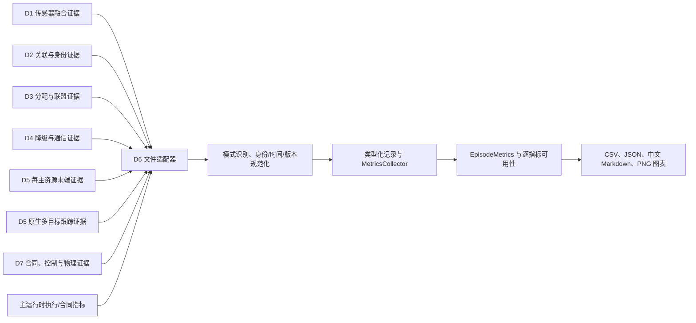
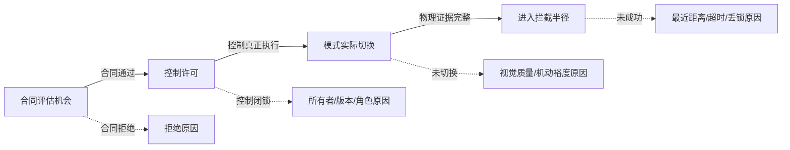

# D6 系统级离线评估：算法原理与实施说明

**状态日期：2026-07-13**

本文根据 D6 当前代码、`README.md`、`PLAN.md`、`MODULE_PRINCIPLES_CN.md` 和系统总汇总同步
整理。文中“已实现”表示 D6 已能被动读取相应写盘证据并计算指标或生成报告，不表示上游算法
已经达到工程准入门限，也不表示 D6 获得在线控制权限。

## 1. 模块定位和安全边界

D6 是 D1 至 D7 七个研究模块之后的系统证据汇总层。它读取单次实验（episode）的写盘日志，
把异构记录转换为可审计的单次实验指标、批量统计、中文报告和图表。D6 的职责不是给系统增加
一个无法解释的“总分”，而是保留探测、跟踪、分配、联盟、降级、末端配准、通信、导引、
物理结果和安全约束之间的失效结构。

D6 是严格只读、离线、被动的评估模块：

- 不发布航迹，不创建、改写或重新绑定 `global_track_id`（中心维护的规范全局航迹标识）；
- 不生成分配计划，不拒绝过时计划，不请求重规划，也不改变 D3 的迟滞参数；
- 不触发中心、二级节点或完全分布式降级，不提交联盟，不续签租约；
- 不执行目标检测、视觉关联、相机或云台控制、导引和飞行控制；
- 不用离线真值、高威胁标签或后验复核结果修正在线模块；
- 不生成真实火控参数、毁伤逻辑、自动授权或绕过人工审核的处置动作。

D2 数据关联模块和 D6 的共同硬规则是：`id_switch_count`（身份切换次数）必须显式保留，
不能被总体准确率、任务成功率或联盟完成率掩盖。

## 2. 总体实施架构

### 2.1 离线数据流



逗号分隔值文件（Comma-Separated Values，CSV）、JavaScript 对象表示法文件
（JavaScript Object Notation，JSON）、逐行 JavaScript 对象表示法文件（JSON Lines，
JSONL）、Markdown 文档和便携式网络图形（Portable Network Graphics，PNG）是当前主要
输出格式。这里的 PNG 是图像格式；D7 的视觉 PNG 指比例导航制导
（Proportional Navigation Guidance，PNG），两者不是同一概念。

主运行时负责微软 AirSim 无人系统仿真器的 Blocks 场景启动、复位、实验顺序、统一时钟和
日志落盘。当前物理飞行实验使用 AirSim SimpleFlight 多旋翼飞行控制后端，入侵目标是移动
场景对象（actor），不是额外的 SimpleFlight 飞行器。D6 不连接实时 AirSim 应用程序编程接口
（Application Programming Interface，API），只在实验结束后读取文件。

### 2.2 2026-07-13 七源统一写盘输入

`P1SystemEvidenceInputs` 是当前一级收敛优先级（Priority 1，P1）统一报告的七源输入合同。
七源是七类证据，不等同于七个模块各一份文件；D5 因为同时存在末端主资源证据和原生多目标
跟踪证据而占两个独立来源。

| 七源字段 | 生产者和内容 | 关键审计项 | 2026-07-13 行数 |
| --- | --- | --- | ---: |
| `d1_dense_crossing` | D1 密集交叉融合汇总 | 双时间戳、协方差、来源谱系、接受/拒绝和离线真值样本数 | 1 |
| `d2_difficulty_profiles` | D2 难度配置和关联结果 | 身份切换、连续率、错误航迹、时延、候选准入 | 3660 |
| `d3_assignment_churn` | D3 协同分配案例 | 成员、计划/联盟版本、主用/备用角色、过时和回滚 | 40 |
| `d4_episode_communication` | D4 故障和通信案例 | 确认应答、租约、所有者、闭锁、切换时延 | 60 |
| `d5_per_primary` | D5 每个已激活主成员证据 | 可见、关联、独立锁定、共同锁定和全局身份改写 | 160 |
| `d5_native_mot` | D5 原生多目标跟踪筛选 | 后端、激活率、连续率、精确率/召回率、局部身份切换和时延 | 18 |
| `d7_per_primary` | D7 每资源对和配置档证据 | 合同、控制、模式、物理结果、备用越权和最近距离 | 164 |

D7 的 164 行由 160 行资源对/安全记录和 4 行配置档汇总组成。聚合器按 `family`（记录族）
区分粒度，避免把资源对记录与配置档汇总重复计数。

七源统一入口实现于 `d6_evaluation_metrics/p1_system_evidence.py`。每个来源可以是文件路径、
映射对象、序列、数据类或提供 `to_dict()`/`as_dict()` 的对象。缺失来源在清单中标记为
`unavailable`（证据不可用），不会被转换成零值记录。

### 2.3 其他已实现输入适配器

| 入口 | 输入 | 当前用途 |
| --- | --- | --- |
| `load_episode_log_jsonl()` | D6 标准 JSONL | 恢复类型化记录和真值摘要 |
| `load_blocks_replay_jsonl()` | Blocks 帧日志和可选传感器日志 | 恢复实际规模、真值机会、检测、末端和通信证据 |
| `load_main_episode_bus_metrics()` | 单个主总线指标文件 | 恢复执行或合同口径的 `EpisodeMetrics` |
| `load_main_episode_bus_metric_files()` | 执行/合同双文件 | 同时保留两种指标口径 |
| `load_d4_active_degradation_decisions()` | D4 主动降级逗号分隔值文件 | 形成降级事件和后验复核证据 |
| `load_d7_intercept_outputs()` | D7 控制与拦截文件 | 形成门控、模式切换和物理结果指标 |
| `load_d7_guidance_timeseries()` | D7 导引时序文件 | 形成末端滤波、短时保持和控制连续性元数据 |
| `load_airsim_calibration_records()` | 多随机种子 AirSim 输出目录 | 形成二级感知、云台、跨视角和降级标定记录 |
| `merge_replay_with_execution_metrics()` | 集成回放和正式执行指标 | 按可用性与规范来源合并，不用默认零覆盖执行值 |

## 3. 类型化记录和统一数据模型

### 3.1 基础记录

1. **`TrackRecord`（航迹和探测记录）**

   保存记录时间、全局航迹标识、仅供离线评分的真值身份、估计位置、真值位置、协方差矩阵
   的迹、航迹状态和关联来源。位置真值缺失时可以保留在线航迹记录，但不能计算位置均方根
   误差或真值身份指标。

2. **`AssignmentRecord`（版本化分配记录）**

   保存计划标识、计划版本、资源、目标全局航迹、授权状态、是否有效、成本分项以及联盟、
   角色、需求资源数、波次、到达窗口和成员间距。分配指标必须按
   `(timestamp, plan_id, version)` 快照计算，不能混合不同版本。

3. **`TargetDemandRecord`（目标需求记录）**

   保存目标需要的资源数量、已分配数、缺口、协同模式、联盟和窗口证据。它是 M 对 N
   多资源需求满足率的正式分母来源。

4. **`CoalitionRecord`（联盟生命周期记录）**

   保存联盟成员、角色、计划与联盟版本、联盟时期 `epoch`、协调者、必要成员、已确认成员、
   提交状态、租约、各阶段时间戳、消息数、字节数和共识轮次。D6 根据有序记录恢复状态驻留和
   完成情况，但不驱动联盟状态转移。

5. **`ArrivalRecord`（成员到达和波次记录）**

   保存资源、目标、联盟版本、成员角色、实际到达时间、公共窗口、波次起止时间和成员间距，
   用于同时、序贯和混合主备路线的离线评分。

6. **`EventRecord`（通用事件记录）**

   通过 `event_type`、参与者、严重度、数值和结构化元数据表达降级、门控、失败、安全、性能
   和离线裁决事件。

7. **`LinkRecord`（通信链路记录）**

   同时保存发送、接收、测量产生和到达时间，另含源节点、目标节点、中继节点、消息序列号、
   负载类型、是否送达和过时阈值。`measurement_timestamp`（测量时间戳）与
   `arrival_timestamp`（到达时间戳）不能互相替代。

8. **`TerminalRecord`（末端配准记录）**

   保存资源、被分配的全局航迹、节点局部航迹、决策状态、歧义分数、友方冲突、分配版本、
   联盟角色和离线正确性裁决。`expected_global_track_id` 和 `association_correct` 只能由离线
   评估使用，不能进入 D5 在线匹配。

### 3.2 单次实验输出 `EpisodeMetrics`

`EpisodeMetrics` 保存：

- 实验标识、随机种子、稳定场景组和指标口径；
- `drone_count`、`resource_count`、`target_count`、`camera_count` 四个实际规模字段；
- 探测、跟踪、分配、联盟、降级、末端、通信、导引、物理、安全和性能标量；
- `metric_availability`（全部指标的可用性说明）；
- `m_to_n_metric_availability`（多资源对多目标指标的专项可用性说明）；
- 场景版本、标准映射版本、证据路径、失败原因和来源审计元数据。

数值字段的 Python 默认值不是证据。加载器和报告器必须结合可用性表判断该值是否能进入
统计分母。显式写盘的零表示“观察到且事件没有发生”，默认生成的零不能被自动解释为同一含义。

### 3.3 收集器算法

`MetricsCollector` 通过 `add_*`/`extend_*` 接收记录，由 `compute_episode()` 生成单次实验
指标。核心步骤是：

1. 加载并识别源数据模式；
2. 保留路径、生产者、运行标识和原始来源；
3. 规范化时间、身份、计划版本、联盟版本和时期；
4. 确定实际规模；
5. 按指标族计算分子、分母和标量；
6. 为每项指标裁决可用性和原因；
7. 按帧、成员、资源对、目标、联盟、实验和随机种子分层聚合；
8. 按来源权威性合并回放、合同和执行证据；
9. 输出表格、中文报告和图表。

## 4. 实际规模和证据三态

### 4.1 实际规模

D6 不从 `2v2`、`5v5` 或 `M5N2` 场景名称推断规模。实际数量的优先级是：

1. `truth_summary` 顶层字段；
2. `truth_summary["scenario"]` 场景元数据；
3. Blocks 帧中的资源、真值对象和相机集合；
4. 分配、联盟、末端、事件和链路记录中的唯一身份集合；
5. `drone_count` 缺失时才以 `resource_count` 作为保守兼容值。

资源数、目标数和相机数使用独立集合。帧级检测数量不能当成目标数，逐案例行数不能当成独立
随机种子数，资源对样本数也不能当成联盟机会数。

### 4.2 三态语义

| 状态 | 含义 | 统计处理 |
| --- | --- | --- |
| `available` | 必要字段和有效分母完整 | 可以进入统计；数值可以为零 |
| `unavailable` | 缺真值、时间戳、协方差、事件、来源或分母 | 不进入该指标分母，报告缺失原因 |
| `not_applicable` | 当前场景或路线本来没有该概念 | 与数据缺失分开报告 |

例如，无备用成员的独立拦截场景中，备用激活率是“不适用”；有备用成员但没有写出激活事件时，
该指标是“不可用”；明确记录备用成员始终待命时，备用越权次数可以是“可用且为零”。

## 5. 指标算法

### 5.1 探测指标

设真正例（True Positive，TP）、假正例（False Positive，FP）、假负例
（False Negative，FN）和实验持续时间 (T_e)，则：

\[
P_D=\frac{TP}{TP+FN},\qquad
P_M=\frac{FN}{TP+FN},\qquad
R_{FA}=\frac{FP}{T_e}.
\]

- (P_D)：探测概率；
- (P_M)：漏检率；
- (R_{FA})：每秒虚警率。

真值机会与离线匹配/漏检裁决必须同时存在。只有真值机会列表而没有匹配裁决时，三项均为
不可用。`truth_id is None` 的在线航迹不会自动计为虚警，因为它也可能只是尚未完成离线标注。

### 5.2 跟踪、身份和协方差一致性

对 (K) 个具有估计位置和真值位置的样本，位置均方根误差
（Root Mean Square Error，RMSE）为：

\[
RMSE=\sqrt{\frac{1}{K}\sum_{k=1}^{K}
\lVert\hat{\boldsymbol p}_k-\boldsymbol p_k\rVert_2^2}.
\]

航迹连续率为真值时间戳中获得有效匹配的比例。同一真值目标按时间排序后，其规范全局航迹
身份变化次数为身份切换（Identity Switch，IDSW）：

\[
N_{IDSW}=\sum_j\sum_{k>1}
\mathbf 1[g_j(t_k)\ne g_j(t_{k-1})].
\]

D6 还可消费上游明确写盘的归一化创新平方（Normalized Innovation Squared，NIS）和归一化
估计误差平方（Normalized Estimation Error Squared，NEES）摘要：

\[
NIS_k=\boldsymbol\nu_k^T\boldsymbol S_k^{-1}\boldsymbol\nu_k,
\]

\[
NEES_k=(\hat{\boldsymbol x}_k-\boldsymbol x_k)^T
\boldsymbol P_k^{-1}(\hat{\boldsymbol x}_k-\boldsymbol x_k).
\]

通用 `TrackRecord` 只保存协方差迹，D6 不从协方差迹重建完整矩阵，也不从 RMSE 伪造
NIS/NEES。缺离线真值时 NEES 不可用；创新和创新协方差完整时 NIS 可以独立可用。

### 5.3 分配和多资源需求

有效分配必须同时满足：

- `active=True`；
- 授权状态属于已记录、已授权、已批准、人工批准或操作员批准；
- 计划标识和版本属于同一快照。

对目标 (j) 在快照 (s) 的需求资源数 (k_{js}) 和有效已分配数 (a_{js})：

\[
s_{js}=\min(a_{js},k_{js}),\quad
u_{js}=\max(k_{js}-a_{js},0),\quad
o_{js}=\max(a_{js}-k_{js},0).
\]

其中 (s_{js}) 为满足槽位、(u_{js}) 为未满足槽位、(o_{js}) 为超额支持。微平均需求满足率
按槽位加权，宏平均需求满足率对每个目标快照等权：

\[
R_{micro}=\frac{\sum s_{js}}{\sum k_{js}},\qquad
R_{macro}=\frac{1}{Q}\sum_{j,s}\mathbf 1[a_{js}\ge k_{js}].
\]

`duplicate_assignment_count`（异常重复分配数）必须感知目标需求和当前联盟授权。一个高威胁
目标合法要求两个主成员时，两条当前版本主成员绑定不是异常重复；超过需求、计划外、过时版本
或冲突版本的绑定才计为错误。旧的一对一日志没有需求事件时，只能显式采用 (k=1) 兼容规则。

分配族还报告未分配高威胁目标、资源目标比、覆盖率、未分配率、迟滞拒绝率、过时拒绝率、
反馈接受率，以及有真实有序历史时的计划和联盟版本变化。只有最终快照时，变化次数保持不可用。

### 5.4 联盟、主备和波次

联盟形成时间和重构时间分别为：

\[
T_{form}=t_{first\ committed}-t_{request},
\]

\[
T_{reconfig}=t_{first\ new\ committed\ version}-t_{trigger}.
\]

缺少成对时间戳时不可用，超时不能记为零。同时到达路线可计算必要主成员到达时刻的最大差；
序贯波次可计算相邻波次间隔和顺序违反。当前项目已经实现独立、同时、序贯和混合主备路线的
指标合同，但没有完成所有路线在全部中心层级和扰动条件下的在线控制实现。

备用成员只有在显式激活、当前计划和当前联盟版本一致时才能进入需求满足和物理完成分母。
待命备用成员不参与成功率，却必须进入越权执行审计。

联盟提交指标包括：必要成员数、已确认成员数、确认应答率、确认延迟、提交次数、提交超时、
中止、重构、租约到期、成员丢失、成员替换、摘要冲突、过时拒绝、通信消息和共识轮次。
确认应答（Acknowledgement，ACK）不全、租约失效、计划版本或联盟时期过时时，上游应保持
闭锁；D6 只核验是否按合同执行。

### 5.5 D4 降级指标

失效切换时间和降级任务完成率为：

\[
T_{failover}=t_{degraded\ stable}-t_{central\ failure},
\]

\[
R_{degraded}=\frac{N_{completed}}
{N_{completed}+N_{failed}+N_{cancelled}}.
\]

当前已实现的降级指标包括主动降级次数、被动失效切换次数、二级节点接管/重分配、重新分配
等待、完全分布式回退、二级可用驻留、计划等待驻留、激活时延、租约到期和过时计划拒绝。

主动降级精度为：

\[
P_{active}=\frac{N_{reviewed\ necessary}}{N_{reviewed}}.
\]

只有带 `review_label`（复核标签）、`active_degradation_necessary`（必要性标签）、后验结果或
冻结前后风险窗口的样本进入分母。无复核标签样本只增加主动降级总次数，不能由事件名称自证
为必要或不必要。

### 5.6 D5 末端配准和二级感知指标

末端关联准确率为：

\[
A_{terminal}=\frac{N_{correct\ adjudicated}}
{N_{adjudicated\ attempts}}.
\]

正确性来自结果写盘后的离线裁决。末端局部身份切换按同一被分配全局航迹对应的节点局部航迹
变化计数。首次锁定延迟等于首次锁定时刻减去首次进入视场时刻。

基础末端指标包括：

- 末端关联准确率和末端身份切换；
- 歧义视场事件、友方重叠保持和首次锁定时间；
- 锁定次数、多视角一致率、跨视角冲突和异常重复锁；
- 检测召回率、局部身份连续率、跨视角注册率和视觉流水线时延；
- 图像滤波的测量、预测、创新拒绝、复位和到期；
- 软预测、短时保持预测（coast）、锁定连续性和视觉模式驻留。

协同锁定必须区分“多个资源看见目标”和“当前联盟授权的多个主成员共同锁定”。同一资源
跨帧持续锁定只计连续性，不计多个资源重复锁。普通 `associated`（已关联）状态不能冒充
`locked`（已锁定）或共同锁定。

二级侦察和跨视角指标包括：单相机全局视野率、二级网络联合覆盖率、联合全视野帧率、投影
有效率、几何门控通过率、可注册候选数、稳定跨视角注册数、detect 已可用但未注册数、线索
指向误差和云台指向误差。D6 不调整相机姿态、云台角度或几何门限。

### 5.7 通信和时间指标

端到端通信延迟和测量年龄分别为：

\[
L_{e2e}=1000(received\_timestamp-sent\_timestamp)\ \mathrm{ms},
\]

\[
A_{measurement}=arrival\_timestamp-measurement\_timestamp.
\]

通信族报告跨节点平均时延、消息丢弃率、序列号倒退/显式乱序次数、过时航迹更新、视频元数据
送达率、边界框元数据送达率和共识时延。轨迹消息的链路时延或测量年龄超过 `stale_after_s`
时增加过时更新计数。负载字节缺失时，字节统计不可用，不能由消息条数估算。

### 5.8 D7 四层漏斗

D7 证据严格分为四层，每层有独立机会数、成功数和可用性：

1. `contract_allowed`（合同允许）：D3、D4、D5 与 D7 合同条件通过；
2. `control_allowed`（控制允许）：资源在当前时刻被允许实际执行控制；
3. `mode_switched`（模式已切换）：导引模式发生实际切换；
4. `physical_intercept`（物理拦截）：存在明确物理判据并满足成功条件。



后层成功不能反推前层计数，前层允许也不能推导后层成功。只有计算机视觉
（Computer Vision，CV）状态实验而没有物理执行时，物理层必须不可用；物理证据完整但没有
进入拦截半径时才是可用且为零。

D7 门控与末端指标还包括相机质量、视线质量、机动裕度和末端切换允许率，视觉 PNG 切换数、
末端接管率、切换拒绝、合同拒绝、检测获取超时、图像卡尔曼预测、重新获取、盲推和短时保持
到期。视线（Line of Sight，LOS）和预计碰撞时间（Time To Collision，TTC）相关拒绝原因
分别保留，D6 不据此产生导引命令。

### 5.9 三层物理结果

物理结果按资源对、目标和联盟使用三个独立分母：

\[
R_{pair}=\frac{N_{successful\ active\ pairs}}
{N_{active\ assigned\ pairs}},
\]

\[
R_{target}=\frac{N_{targets\ with\ any\ successful\ pair}}
{N_{participating\ targets}},
\]

\[
R_{coalition}=\frac{N_{targets\ with\ all\ required\ primaries\ complete}}
{N_{coalition\ opportunities}}.
\]

- 资源对成功表示一个当前有效主成员完成物理判据；
- 目标成功表示该目标至少有一个参与资源对成功；
- 联盟完成要求全部必要主成员分别具有明确物理完成证据并满足各自窗口。

联盟完成不等于同时到达，除非场景明确采用同时到达路线。2026-07-13 主线物理判据使用
北-东-地坐标系（North-East-Down，NED）的三维欧氏距离不大于 5 米。报告同时保存拦截半径、
距离坐标系、距离维度和判据版本，避免后续结果使用不同距离口径却被直接比较。

### 5.10 安全、性能和任务结果

安全指标至少包括：

- 约束违反次数和人工覆盖/拒绝次数；
- 在线使用真值身份次数；
- 规范全局身份改写次数；
- 待命备用成员越权执行次数；
- 重复所有者、脑裂防护失败、过时计划执行和异常重复锁；
- 最小成员间距及碰撞风险暴露时间。

性能指标包括模块时长、循环时延、记录时延、中央处理器（Central Processing Unit，CPU）
预算利用率、图形处理器（Graphics Processing Unit，GPU）预算利用率和预算违反次数。

`mission_outcome`（任务结果）可以为成功、部分成功、失败或中止。根因只从写盘记录和已计算
指标派生，按跟踪、分配、末端门控、导引、覆盖、运行异常、通信、安全和性能类别报告。安全
失败不能被任务成功、目标成功或联盟完成抵消。

## 6. 执行口径、合同口径和来源合并

### 6.1 双口径

正式 `main_episode_bus_metrics.json` 表示执行后的系统结果，使用
`metric_scope=execution`（执行口径）。`main_episode_bus_contract_metrics.json` 表示执行前
合同和门控诊断，使用 `metric_scope=contract`（合同口径）。

两者必须并列保留：

- 合同允许不等于控制实际执行；
- 控制允许不等于导引模式已经切换；
- 模式切换不等于已经进入物理拦截半径；
- 执行失败不能通过合同口径中的允许值被覆盖。

### 6.2 回放与执行合并

集成回放继续提供探测、跟踪、分配等离线证据。对于末端关联、跨视角、在线真值审计、
合同/控制/模式和物理字段，只要正式主总线提供明确执行值，执行值就是规范来源。合并器遵循：

1. 先读取每个来源的数值与可用性声明；
2. 显式零视为有效证据；
3. 缺失值不能被数据类默认零替代；
4. 正式执行证据可用时优先采用执行值；
5. 执行值不可用时才保留回放值或不可用原因；
6. 两侧原值、来源路径、可用性和最终选择写入来源审计。

`persisted_frame_count`（实际写盘帧数）和 `warmup_inclusive_frame_count`（含预热帧数）是两项
独立证据，不能假设固定相差一帧，也不能互相推导。

## 7. 真值离线隔离

### 7.1 身份命名空间

D6 区分三类身份：

- 中心或当前合法所有者维护的规范全局航迹身份；
- 相机、节点或跟踪器内部的局部航迹身份；
- AirSim actor 名称、分割标识或数据集标签形成的离线真值身份。

三者即使字符串相同也不能互换。局部航迹键应包含来源节点和局部时期，不能只比较一个局部
数字。D6 只在在线结果写盘后，把真值用于探测匹配、位置误差、身份切换和末端正确性裁决。

### 7.2 在线真值违规审计

以下情况必须单独计数：

- 在线 D5/D7 使用 actor 名称或真值目标身份进行绑定；
- 在线模块用分割标识替代几何关联；
- 局部航迹改写规范 `global_track_id`；
- 评估标签、高威胁后验标签或复核标签回流在线控制。

统一报告不导出原始真值身份，只保留离线聚合和 `truth_identity_online_use_count` 等违规计数。

## 8. 批量统计、自助区间和来源审计

### 8.1 分组和严格配对

批量报告至少按以下字段分组：

- `metric_scope`：执行或合同口径；
- 随机种子和批次随机种子；
- 稳定场景组、场景版本和难度配置；
- 实际飞行器、资源、目标和相机数量；
- 二级节点高度、视场、节点数和检测后端；
- 算法候选、配置档和判据版本。

比较候选算法时，应冻结场景版本、初始几何、随机种子和真值口径。`case_id` 只用于审计，
不能把同一随机种子下的多个案例误算为独立样本。

### 8.2 描述统计和置信区间

通用报告输出样本数、均值、样本标准差、标准误、中位数、第 5 百分位和第 95 百分位，并保留
基于标准误的正态近似 95% 置信区间。第 95 百分位（95th Percentile，P95）常用于循环时延。

2026-07-13 的 `P1SystemEvidenceReportGenerator` 对至少两个显式随机种子的逐种子均值使用
固定 2000 次百分位自助重采样（bootstrap），随机数生成器
（Random Number Generator，RNG）种子固定为 `20260713`。少于两个随机种子时只输出描述性
结果，不生成推断区间。

当前只有统一系统证据报告实现了上述专用自助区间。面向全部长尾计数、比率和配对差值的统一
非参数统计框架仍未实现，不能把通用正态近似写成已经完成全面自助统计。

### 8.3 来源审计

统一报告的来源清单为每个输入保存：

- 源数据模式和版本；
- 文件路径；
- 安全散列算法 256 位（Secure Hash Algorithm 256-bit，SHA-256）摘要；
- 生产者、运行标识和证据来源链（provenance）；
- 可用状态和缺失原因。

这套审计用于回答“这个数由哪个文件、哪个生产者、哪次运行、哪个模式生成”，而不是只保存
最终表格。内存对象没有真实文件时，文件散列可以不可用，但生产者和运行标识仍应尽量保留。

## 9. 报告与图表实施

### 9.1 通用报告

`ReportGenerator` 当前输出：

- `episode_metrics.csv`：每次实验一行；
- `summary_metrics.csv`：全局及场景/规模分组统计；
- `batch_report.md`：中文批量报告；
- 探测、跟踪、分配、降级、末端、二级感知、通信、导引、安全和分布图表；
- 标准指标映射和任务根因摘要。

### 9.2 七源统一报告

`P1SystemEvidenceReportGenerator` 输出：

- `p1_system_evidence_rows.csv`；
- `p1_system_evidence_aggregate.json`；
- `P1_SYSTEM_EVIDENCE_REPORT.md`；
- `p1_system_evidence_overview.png`。

### 9.3 专项报告

当前专项报告器包括：

- `DenseCrossingEvaluationReportGenerator`：D1/D2 密集交叉关联标定；
- `CooperativeClosureReportGenerator`：M 对 N 多资源协同闭环；
- `AirSimCalibrationReportGenerator`：二级节点覆盖、投影、跨视角和降级标定；
- `NativeMotAirSimReportGenerator`：原生多目标跟踪准入；
- D7 导引对照、末端交付和执行合并报告。

所有报告器只读取文件或内存对象。D6 不控制 AirSim、相机、云台、降级、配准或导引。

## 10. 代码实现映射

| 文件 | 主要职责 |
| --- | --- |
| `metrics.py` | 类型化记录、`EpisodeMetrics`、`MetricsCollector` 和核心指标 |
| `m_to_n.py` | 多资源需求、联盟、波次、主备和协同锁定指标 |
| `jsonl.py` | D6 标准 JSONL 往返 |
| `blocks_replay.py` | Blocks 帧、传感器、检测、末端和通信记录适配 |
| `main_bus.py` | 主总线执行/合同指标加载 |
| `execution_merge.py` | 回放与执行规范来源合并和帧数审计 |
| `d4_replay.py` | D4 主动降级写盘结果适配 |
| `intercept_replay.py` | D7 控制、导引和物理结果适配 |
| `airsim_calibration.py` | AirSim 多随机种子二级感知与 D4/D5/D7 标定报告 |
| `p1_system_evidence.py` | 2026-07-13 七源统一证据报告和专用自助区间 |
| `dense_crossing_evaluation.py` | D1/D2 严格密集交叉比较 |
| `cooperative_closure.py` | M 对 N 协同闭环聚合 |
| `native_mot_report.py` | D5 原生多目标跟踪准入报告 |
| `motmetrics_adapter.py` | 可选 py-motmetrics 离线适配 |
| `standard_mapping.py` | 本地指标与标准指标族的可追溯映射 |
| `reporting.py` | 通用 CSV、Markdown 和二维图表输出 |

## 11. 默认主线、可选对照和未实现能力

### 11.1 已实现的默认主线

- 本地类型化记录、标准 JSONL、Blocks、主总线、D4 和 D7 文件适配器；
- `MetricsCollector` 与带实际规模、可用性和来源审计的 `EpisodeMetrics`；
- 探测、跟踪、显式 IDSW、分配、多资源需求、联盟、降级、末端、通信、D7 四层漏斗、
  三层物理、安全和性能指标；
- 执行/合同双口径和回放/执行来源合并；
- 通用、七源、密集交叉、协同闭环、AirSim 标定和原生多目标跟踪中文报告；
- 固定随机种子的七源专用自助置信区间和 SHA-256 来源审计。

### 11.2 已实现但仅限可选或离线对照

1. Python 多目标跟踪评估库 `py-motmetrics` 的隔离适配器可在冻结的
   `msm-offline-mot-v1` 数据模式上输出精确率与召回率调和评分（F-one Score，F1）中的身份
   调和评分（Identity F1 Score，IDF1）、多目标
   跟踪准确率（Multiple Object Tracking Accuracy，MOTA）和多目标跟踪精度
   （Multiple Object Tracking Precision，MOTP）。它不进入默认依赖，也不替代 D6 本地指标。
2. 联合概率数据关联（Joint Probabilistic Data Association，JPDA）的轻量研究结果可以进入
   报告，但 2026-07-13 证据没有支持其替换默认全局最近邻
   （Global Nearest Neighbor，GNN）/匈牙利关联路径。
3. ByteTrack 和增强型在线实时多目标跟踪器（Bag of Tricks for Simple Online and Realtime
   Tracking，BoT-SORT）的真实运行结果可以由 D6 评分，但检测准确性未达到准入门限。
4. 四导引律同随机种子报告器和三维导引离线对照已经存在，但短窗口或单随机种子结果不能作为
   在线主线替换依据。

### 11.3 尚未实现或仍开放

| 能力 | 当前状态 | 缺少条件 |
| --- | --- | --- |
| TrackEval 多目标跟踪评估库 | 未接入 | 冻结帧级真值/预测格式、遮挡与重现规则、版本依赖 |
| 高阶跟踪准确度（Higher Order Tracking Accuracy，HOTA） | 不可用 | TrackEval 或等价实现；`py-motmetrics` 1.4.0 不提供该指标 |
| 最优子模式分配距离（Optimal Subpattern Assignment，OSPA） | 未进入 `EpisodeMetrics` | 帧级真值/估计集合、截断距离和阶数合同 |
| 广义最优子模式分配距离（Generalized OSPA，GOSPA） | 未进入 `EpisodeMetrics` | 目标出生/消失/遮挡规则和参数合同 |
| Stone Soup 多目标跟踪研究库指标桥 | 未实现 | 对象映射、版本锁定、样例和门限测试 |
| AirSim 原生录制通用解析器 | 未实现 | 稳定样例、字段版本、NED/相机/时间映射 |
| 大规模多智能体协作机器人仿真环境（Simulating Collaborative Robots in Massive Multi-Agent Game Environments，SCRIMMAGE）指标桥 | 未实现 | 输出样例、身份映射、统一时钟和通信事件模式 |
| 全指标统一非参数区间 | 未实现 | 按指标类型冻结重采样单位和配对规则 |
| 长期跨提交趋势治理 | 尚未闭合 | 稳定批次目录、场景版本和失败原因词表 |

TrackEval、HOTA、OSPA、GOSPA 和 Stone Soup 不得写成当前默认或已实现评估器。

## 12. 2026-07-13 当前证据

### 12.1 D1/D2 严格密集交叉

- 5 个目标，相邻目标三维间距严格为 4 米和 2 米；
- 两个难度各 20 个随机种子，共 40 个真实 AirSim 计算机视觉实验；
- 每次实验 51 帧，不保存截图；离线真值样本共 10200 条；
- 在线真值泄漏为 0；
- 基线平均 IDSW 为 1.3583，最佳 GNN 候选为 0.6167，下降 54.6%；
- 航迹连续率由 0.9810 提高到 0.9840，绝对增益仅 0.0030；
- 候选 P95 循环时延为 24 毫秒。

冻结准入条件要求 IDSW 相对下降、连续率绝对提高、错误航迹、时延和真值隔离同时通过。
候选没有达到连续率增益门限，因此默认 GNN/匈牙利关联器不变。

### 12.2 D4 故障矩阵

正常、中心失效、中心加二级失效、0.5 秒延迟、30% 丢包和网络分区恢复各运行 10 个随机
种子，共 60 个案例。安全结果为 60/60，错误降级、重复所有者和脑裂防护失败均为 0；30%
丢包场景中 7/10 按合同闭锁。

该结果证明实验时钟下的时期、租约、ACK 和闭锁证据可以被 D6 核验，不代表真实无线链路、
硬件时钟漂移或带宽已经完成工程认证。

### 12.3 D5 原生多目标跟踪

真实筛选使用 1920x1080 相机、90 度视场、20/30/50 米距离、三组置信度和 ByteTrack/
BoT-SORT 两个后端，共 18 个案例，每例 101 帧。

- 20 米时，两后端激活率和连续率均为 1.0，IDSW 为 0；
- P95 处理时延约为 7.4/16.2 毫秒；
- 按交并比（Intersection over Union，IoU）0.5 的离线边界框口径，精确率约 0.30-0.32，
  召回率约 0.26-0.33；
- 30 米和 50 米没有有效接受检测；
- 18 个候选均未准入，默认检测仍为 AirSim detect 元数据接口。

### 12.4 M5N2 协同物理闭环

实验使用 5 个资源和 2 个目标，高威胁目标采用 2 个已激活主成员加 1 个待命备用成员。基线
与三个 D3 候选配置各运行 10 个随机种子，共 40 个 SimpleFlight 实验。当前不要求同时到达，
每个主成员独立通过合同和视觉门控，物理成功使用 NED 三维最近距离不大于 5 米。

| 配置档 | 联盟完成 |
| --- | ---: |
| 基线 | 0/10 |
| 20 米 / 3 秒 / 40 度 | 5/10 |
| 20 米 / 5 秒 / 40 度 | 2/10 |
| 20 米 / 8 秒 / 40 度 | 1/10 |

最佳配置只达到 5/10，低于 8/10 的冻结门限。四个配置档总体完成 8/40。主要失败原因是
D5 未锁定和末端检测获取超时，少量为边界框面积过小。

### 12.5 七源四层漏斗和安全

统一报告的四层明确计数为：

| 层级 | 计数 |
| --- | ---: |
| 合同允许 | 35 |
| 控制允许 | 7 |
| 模式切换 | 9 |
| 资源对物理成功 | 62 |

这些数字来自不同证据族和不同机会分母，不能彼此相除或逐层强行推导。D5 的 120 个有效主成员
机会中，关联/锁定为 74/120，合同允许为 35/120，控制允许为 7/120。在线真值使用、规范全局
身份改写和待命备用成员越权执行均为可用且为 0。

### 12.6 回归状态

截至该状态日期，D6 全量回归记录为 `115 passed`。本次任务只同步文档，没有修改代码或测试
能力，因此不把重新运行全量测试作为本次文档验收条件。

## 13. 结论边界和当前开放问题

当前证据可以支持以下结论：

1. 七源写盘证据、类型化记录、实际规模、可用性和中文报告链已经接通；
2. 执行、合同、回放和执行后来源可以分开审计，不再用回放估计覆盖正式执行值；
3. 多资源合法协同与异常重复分配、资源对成功与联盟完成已使用不同分母；
4. D4 实验时钟下的时期、租约、确认应答和闭锁可以被离线核验；
5. D7 合同、控制、模式和物理四层不再互相回填；
6. 在线真值隔离、全局身份改写和备用成员越权具有显式安全审计项。

仍不能据此声称：

1. M5N2 多资源协同已经稳定成熟；最佳联盟完成仍只有 5/10；
2. D2 候选已可替代默认关联器；连续率增益没有达到冻结门限；
3. ByteTrack 或 BoT-SORT 已可替代 AirSim detect；当前检测精确率、召回率和远距离探测不足；
4. D4 已通过真实无线网络、硬件时钟和带宽认证；当前是实验时钟故障注入；
5. D3 计划变化、成员变化和联盟时期变化已完整可用；缺真实有序计划历史时这些指标仍不可用；
6. TrackEval、HOTA、OSPA、GOSPA 或 Stone Soup 指标已经实现；它们仍是未接入能力；
7. 专用 2000 次自助区间等于全指标统一非参数统计框架；后者尚未实现。

## 14. 验证方式

模块全量测试命令为：

```bash
pytest -q research_modules/d6_evaluation_metrics/tests
```

生成 100 个随机种子的通用批量示例：

```bash
python3 research_modules/d6_evaluation_metrics/scripts/run_batch_example.py --seeds 100
```

文档范围和空白检查：

```bash
git diff --check -- research_modules/d6_evaluation_metrics/docs/ALGORITHM_AND_IMPLEMENTATION.md
```

## 15. 主要术语

| 中文名称 | 英文全称和缩写/代码名 | 本文含义 |
| --- | --- | --- |
| 单次实验 | episode | 一次具有统一时钟、场景、随机种子和证据目录的运行 |
| 实际规模 | `drone_count/resource_count/target_count/camera_count` | 飞行器、资源、目标和相机的实际数量 |
| 北-东-地坐标系 | North-East-Down，NED | 当前融合和三维物理距离判据的工作坐标系 |
| 身份切换 | Identity Switch，IDSW | 同一真值目标的规范全局航迹身份发生变化 |
| 均方根误差 | Root Mean Square Error，RMSE | 估计位置与真值位置的平方误差均值开方 |
| 归一化创新平方 | Normalized Innovation Squared，NIS | 创新相对创新协方差的一致性统计量 |
| 归一化估计误差平方 | Normalized Estimation Error Squared，NEES | 状态误差相对状态协方差的一致性统计量 |
| 确认应答 | Acknowledgement，ACK | 必要联盟成员对提交或消息的确认 |
| 多目标跟踪 | Multi-Object Tracking，MOT | 在连续图像中维持多个目标局部身份的过程 |
| 执行口径 | `metric_scope=execution` | 执行后正式结果 |
| 合同口径 | `metric_scope=contract` | 执行前合同与门控诊断 |
| 证据可用 | `available` | 字段和分母完整，显式零有效 |
| 证据不可用 | `unavailable` | 缺必要证据，不能进入该指标分母 |
| 策略不适用 | `not_applicable` | 场景或路线本来没有该指标概念 |
| 视觉比例导航制导 | Proportional Navigation Guidance，PNG | D7 末端视觉导引模式，不是图像文件 |
| 便携式网络图形 | Portable Network Graphics，PNG | D6 报告图像格式，不是导引模式 |
| 来源审计 | provenance | 从源文件、生产者、运行标识到最终指标选择的证据链 |
