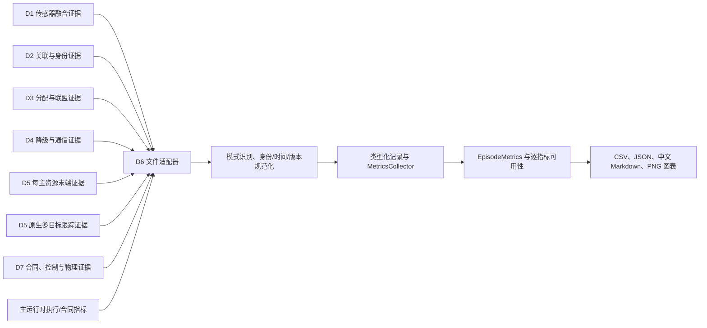
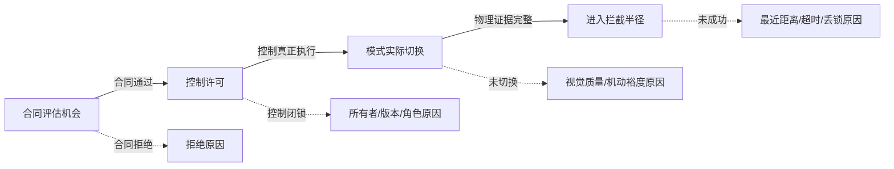

# D6 系统级离线评估：算法原理与实施说明

## D1 质心发布影子旁路只读算法（2026-07-23）

### 输入与隔离

`d1_centroid_overlay_shadow.py` 接收三类持久化输入：

1. main 总线中 topic 为 `audit.d1.centroid_publication_overlay_shadow` 的 envelope；
2. `summary.module_final_diagnostics.observation_governance` 中的最终累计诊断；
3. `stage_timings.csv` 中 `module.d1_centroid_publication_overlay_shadow` 阶段分位。

适配器不导入 main、D1 或可扩展三维运行代码，不修改在线 DTO，也不进入通用
`EpisodeMetrics`。结果通过 scalable 三维离线记录、聚合和中文报告输出。离线评估 schema 升级为
`d6-scalable3d-offline-evaluation-v9`，旁路评估 schema 固定为
`d6.d1-centroid-overlay-shadow-readonly.v1`。

### 逐条校验

每条记录必须满足 topic、source、schema 和 `offline_shadow_not_consumed` 状态合同。解析器随后执行
以下检查：

1. 统计 candidate decisions，按 `accepted/rejected/error` 分类，并保留 rejected reason；
2. 检查 canonical/shadow 航迹 SHA-256 是否可比较，分别计相等和不同；
3. 对 canonical/shadow 的 `global_track_id` 序列作精确比较，不允许本地改写；
4. 检查 measurement/arrival 时间戳字段和时间戳值数量；
5. 读取 evaluation wall time、generation watermark、payload bytes、D2/D3 consumption 和在线
   truth use；
6. 校验禁止修改审计中的 digest semantics、canonical tracks 前后摘要、结构歧义 evidence 前后
   摘要和两层 manifest 摘要。

摘要支持规范 `sha256:<64hex>` 和历史裸 `<64hex>` 表示。摘要不存在、格式非法、前后对象变化、
manifest 重算不一致或字段类型错误时，相关指标转为 unavailable，并写出失败原因。解析器不从记录
内容猜测缺失计数。

### 聚合与交叉核对

逐条记录完成后，D6 汇总 publication、evaluation、decision、状态分布、摘要比较、编号比较和资源
指标。最终 summary 的 evaluation/decision/accepted/rejected/error、拒绝原因、禁止修改计数、
watermark、payload 和消费计数必须与日志集合一致。summary 缺失时，逐条可计算指标仍可保留，但
业务非干预判据不可用。

开销分位从每条 `evaluation_wall_time_ms` 独立计算：

```text
P50 = percentile(wall_time_samples, 50)
P95 = percentile(wall_time_samples, 95)
max = max(wall_time_samples)
```

若 stage timing v2 提供同一阶段的 P50/P95/max，D6 交叉核对两组值。阶段记录缺失、状态不可用或
数值不一致时，开销证据失败关闭。payload 取逐条和 summary 的一致峰值；watermark 同时保留最终值、
历史峰值和容量，不能只看 episode 结束时的当前值。

### 准入分层

业务非干预只使用正式链路相关证据，不使用 shadow/canonical SHA 相等性。shadow 副本发生变化，
但 canonical 对象、evidence、全局航迹编号和下游消费保持不变时，仍可判定业务非干预通过。

`evaluate_d1_centroid_overlay_shadow_pair_performance()` 另行核对 control/shadow 的场景、版本、
seed 和实际资源规模，再计算：

```text
relative overhead = (shadow wall time - control wall time) / control wall time
performance gate = relative overhead <= 0.05
```

pair 输出分别保留业务非干预、性能门、accepted treatment 数和效果证据状态。
`overall_admitted` 当前固定为 false，因为本适配器不定义任务结果效应。后续只有在同输入 pair 同时
通过非干预和性能门、存在 accepted treatment，并由独立效果评估提供结果后，main 才能另行评审准入。

### 当前证据

确定性 fixture 覆盖正常 accepted/rejected、缺字段、非法 schema、摘要篡改、编号变化、下游消费、
阶段时序不一致和配对性能门。真实 seed 1100 shadow 的 9 条 sidecar/46 个 decision 已由同一适配器
消费。业务非干预通过；总墙钟相对开销为 `66.47%`，性能门失败；accepted treatment 为 0，效果证据
不可用。该结论是 dirty 单 seed 开发诊断，不是算法准入。2026-07-23 D6 全量回归为
`623 passed, 1 warning in 21.67s`。

## 离线观测三态消费（2026-07-23）

`observation_truth_sidecar.py` 独立接受 main
`scalable3d-offline-truth-v1/v2` 和 D2
`d2.scalable3d_observation_truth.v1/v2`，不导入生产者。一个 sidecar 只能使用一个 schema。
v1 是 target-only 合同；v2 必须显式给出
`target`、`known_false_alarm` 或 `unknown`。

v2 校验规则如下：

```text
target                -> truth identity 必须存在
known_false_alarm     -> truth identity 必须为空
unknown               -> truth identity 必须为空
```

缺 disposition、非法状态、混合 schema、未知字段、非有限时间戳、重复 observation、同一
observation 的状态或目标冲突均失败关闭。解析器不读取 observation ID 文本、距离、actor/object
名称或在线状态。

`evaluate_scalable_3d_episode()` 始终校验 `offline_truth_labels.jsonl`，分别输出 target、
known false alarm、unknown 和 missing disposition 的 availability/count/reason。v1 的 target
count 可用，无法表达的两类非目标计数保持 unavailable。当前 registry 为
`d6-scalable3d-schema-registry-v2`，当前 offline truth 为
`scalable3d-offline-truth-v2`，评估输出为 `d6-scalable3d-offline-evaluation-v8`。v1 仍可读取，
但不通过 current-schema formal acceptance。

`runtime_plan_outcome_join` 先验证 D2 sidecar 文件 SHA-256，再与 identity evaluation 和 identity
manifest 中的来源摘要交叉核对。D2 v2 audit 的三态计数必须与 sidecar 相同。标记为
`known_false_alarm_only` 的 mapping 必须为 `excluded`，且不携带真值或候选目标。unknown 数量
大于 0 时，D2 strict identity 和 `id_switch_count` 必须 unavailable。

`truth_isolated_offline` 只拿到 D2 evaluation 时，从
`audit.observation_truth_disposition_counts` 读取计数，从
`source_hashes.observation_truth_labels` 接受 provenance。旧 D2 audit 未声明 schema 时，三态计数
保持 unavailable。三条路径均固定输出 `strict_id_switch_backfilled=false`；known false alarm、
partial lower bound 和距离证据均不用于补算严格 IDSW。

2026-07-23 回归结果为新增处置及相关专项 `130 passed`、D6 全量
`586 passed, 1 warning in 21.99s`、scalable learning export
`5 passed, 1 warning in 3.13s`。

## scalable 3D 阶段分位消费算法（2026-07-22）

`stage_timings.csv` 先按表头分派。表头包含 `schema_version` 时，只接受
`scalable3d-stage-timings-v2`，并强制存在累计字段、P50/P95/max、`distribution_available` 和
`distribution_unavailable_reason`。无 schema 的历史表至少保留 stage、call count、累计墙钟和
单次均值；分位三列必须全有或全无，legacy 不允许只声明部分 availability 字段。

每行先校验 stage 非空且文件内唯一，再解析非负整数调用数和有限非负耗时。v2 分布状态按以下规则
处理：

```text
available = true:
    P50, P95, max 全部存在
    unavailable_reason 为空
    0 <= P50 <= P95 <= max
    mean <= max

available = false:
    P50, P95, max 全部为空
    unavailable_reason 非空
```

legacy 有完整分位三元组时按 available 处理，并执行同样的数值和顺序检查；三项全空或分位列不存在
时按 unavailable 处理。任何半缺、非有限、负数、未知 schema、状态和值冲突或重复 stage 均抛出
`Scalable3DOfflineEvaluationError`，不从其他文件补值。

逐 episode 行使用稳定前缀 `stage__<slug>__`。三个分位各自携带 value、availability 和
unavailable reason，同时给出阶段级 `distribution_availability`。legacy 无分位时 value 写为 null，
CSV 单元格为空，JSON 保留 null。

跨 seed 聚合对每个阶段分别计算：

```text
q_e = episode e 内该阶段全部单次调用样本的 P50、P95 或 max
group statistics = distribution({q_e | q_e available})
seed statistic = mean({q_e | episode e belongs to the same seed})
bootstrap CI = percentile bootstrap over distinct seed statistics
```

聚合同时输出可用 episode 数、不可用 episode 数、可用 seed 数和不可用原因分布。部分 seed 缺少
分位时状态为 `partially_available`，不会缩小总 episode 分母。由于输入没有逐调用样本，以下量固定
不可用：

```text
pooled P50 over all calls
pooled P95 over all calls
pooled max over all calls
```

中文报告中的 P50/P95/max 写为“各 episode 分位的跨 seed 均值 [最小值, 最大值]”。报告明确该表
不是 pooled quantile，并只在 main 显式冻结稳定窗口后解释为稳定窗口尾延时。离线评估输出 schema
由 v6 升级为 `d6-scalable3d-offline-evaluation-v7`。

## clean 20-seed 批次复核流程（2026-07-22）

复核先枚举批次根目录下同时具有 manifest、scenario config 和 summary 的主 episode，不递归把
D6 truth-isolated、offline identity 等 sidecar manifest 计为新样本。seed 必须全局唯一并精确覆盖
`1000-1019`。每个 manifest 绑定完整提交
`0d2da25c14e50f8f9a10ad47a7bd74e5c5e577fb` 和 clean 状态；summary 必须为有限状态，在线真值、
分配 hold 均为 0。源进程退出状态从每个 episode 的 `resource_usage.txt` 单独核对。

D6 v6 逐行读取在线总线，生成 D1 完整后验代次序列和 D2 来源代次序列，再与最终
`observation_governance` 快照交叉核对。批内每个 episode 均执行以下恒等式：

```text
full_publication_count == d1_generation
d2_consumed_generation == d1_generation
d2_consumption_count == d2_publication_count
d2_consumption_count + pre_tick_merge_count == d1_generation
pending_generation is empty
```

任一序列断点、重复、未知引用、累计不一致或 pending 未排空都会加入 episode failure reason，并使
基础 formal acceptance 失败关闭。20 个 episode 全部通过；D1 generation 均值/范围为
`471.65 / 410-499`，D2 consumption 为 `47.95 / 47-48`，pre-tick merge 均值为 `423.7`。

聚合继续按实际规模和不同 seed 计算。D3 覆盖率均值为 `0.989606`，固定 2000 次 bootstrap 的
95% 区间为 `[0.987144, 0.991813]`；D5 绑定数为 `25.95 / 9-41`。这些统计进入描述性
clean-source calibration。由于 experiment-matrix episode 为 0，算法不会把基础
`formal_acceptance_eligible=20` 提升为变体矩阵验收。5 m 事件为 0 时，物理拦截结论保持缺失。

聚合和报告内容分别以 SHA-256 固定。外部 `/usr/bin/time` 类进程测量若未写入 D6 输出 manifest，
只能在文档中注明来源，不能作为 aggregate 内生指标参与验收。

## 后验代次审计算法（2026-07-22）

输入由最终快照和在线发布序列组成。最终快照来自
`summary.module_final_diagnostics.observation_governance`。在线序列只读取 D1 融合航迹和 D2 关联
航迹主题的公共字段，不读取在线真值或离线 truth sidecar。

runtime v1 的代次字段输出 `null/unavailable`。runtime v2 要求四个非负累计值和显式 pending 字段。
扫描在线序列时，只对 `snapshot_kind=full_posterior` 的 D1 发布读取 `posterior_generation`，期望
序列为 `1,2,...,G`。D2 的 `source_d1_posterior_generation` 必须大于上一值，并已存在于扫描到该
位置为止的 D1 发布集合中。

最终核对 D1 代次与完整后验发布数、D2 消费次数与 D2 发布数、最后 D2 来源与最终 consumed 代次。
pending 为空时，最终 consumed 必须等于 D1；消费次数加 pre-tick merge count 也必须等于 D1。
原因集合非空时，integrity 为 false，并以明确原因阻断正式资格。离线评估 schema 升级到 v6，新增
字段进入逐 episode CSV、多 seed 聚合和中文报告。

性能登记入口显式接收 D1/D5 JSON 路径，校验顶层对象和 schema 前缀并计算 SHA-256。输出证据类别
固定为 `descriptive_standalone_module_performance`，全栈实时和控制效果声明均为 false。

clean commit `0d2da25` 的三个 10.0 s、200 对 200 episode 已由同一 v6 consumer 读取。逐 seed 的
D1 final/full publication、D2 final/consumption/publication、pre-tick merge 和 pending 分别为
`453/453, 453/48/48, 405, empty`、`516/516, 516/48/48, 468, empty`、
`505/505, 505/48/48, 457, empty`。三行均通过全部恒等式，failure reason 为空。报告日期常量已更新
为 `2026-07-22`，测试同时断言 row 和中文 Markdown 的日期。

## 长时三 seed 集成校准算法（2026-07-22）

### 在线证据最小留存

运行结果先由 main 在一次消息遍历中写出完整 `online_observations.jsonl`。同一条已经规范序列化的
D1 fused-track 或 D2 associated-track 行同时写入离线身份视图，因此完整总线与 D1/D2 视图不存在
二次编码差异。离线身份生成器接收这两个预写视图，不再从内存消息或完整总线重新筛选 D1/D2。

D6 `runtime_plan_outcome_join` 仍逐行解析完整在线 JSONL。处理顺序固定为：

1. JSON 唯一键与有限数检查；
2. envelope 精确字段、sequence 和 schema 检查；
3. 全层 truth-like key 检查；
4. 主题过滤；
5. D1/D2 规范整行 SHA-256 留存，D3/D7/ACK 业务载荷留存。

过滤后的 D2 identity 文件独立重算摘要，并完成帧时间、mapping 顺序、重复中心航迹和来源绑定校验。
随后一次构造：

```text
global_track_id -> [(frame_time, identity_mapping), ...]
```

每个 assignment binding window 只在对应中心航迹的有序序列上应用 freshness 和边界判断。索引改变查询
成本，不改变窗口、歧义或 availability 公式。

### 跨提交语义比较

每个运行先独立验证 episode、seed、场景摘要、时间轴、计划发布序列和 ACK 原始载荷 SHA-256。D3
不透明随机计划号按首次出现顺序映射为 `P0000/P0001/...`，同一计划刷新复用 token，版本和父子次序
必须连续。由计划号派生的 binding/decision 引用使用规范 token 重建后再计算比较摘要。

以下字段始终精确比较，不进入 token 映射：owner、plan version、coalition ID/version、epoch、lease、
`global_track_id`、resource、target、node、member role、assignment cost、迟滞状态、D7 command 和 ACK
业务状态。2026-07-22 reference `8f86192` 与 candidate `f80b5bd` 的 seed
`42000/42001/42002` 均通过该审计。

### 计时与聚合

三个进程级量定义为：

```text
core_wall_s = summary.wall_time_s
process_elapsed_s = /usr/bin/time elapsed wall clock
process_residual_s = process_elapsed_s - core_wall_s
```

candidate 另写 `post_run_timings.csv`，逐阶段记录从核心结束到报告写盘的时间，并以
`total_before_timing_artifact` 保存总量。三 seed 值为
`39.274048705/41.663056382/40.982858311 s`，算术均值 `40.639988 s`。reference 没有相同 schema，
所以算法只展示 candidate 分解，不计算 reference/candidate 单阶段比值。

三 seed 进程均值为：核心墙钟 `155.895422 -> 150.874890 s`，进程总墙钟
`222.780 -> 195.363 s`，峰值 RSS `2.888697 -> 2.359147 GiB`，残差约
`66.885 -> 44.488 s`。D6 aggregate 保留 episode 3、基础 formal provenance eligibility 3、dirty 0、
空运行失败原因分布，同时保留 `descriptive_clean_source_calibration` 和实验矩阵缺失原因。聚合器不会
因为来源 clean 或失败原因为空，将三 seed 提升为 20 未见 seed 正式验收。

## Runtime plan outcome join 的流式安全实现（2026-07-22）

### 在线解析

`_iter_jsonl(..., reject_online_truth=True)` 对每个物理行只调用一次标准 JSON decoder。解码 hook 同时
完成 duplicate-key 检查和禁用真值键收集；`parse_constant` 继续拒绝 NaN/Infinity。得到顶层 mapping
后，解析器按原顺序校验精确六字段、正整数 sequence、全文件唯一且严格递增 sequence、非负时间戳和
非空 topic/source/schema。只有这些检查全部通过后才按 topic 决定留存。

```text
for raw_line in online_jsonl:
    record = decode_unique_and_collect_forbidden_keys(raw_line)
    reject_if_forbidden_key_seen(record)
    validate_exact_envelope_and_global_sequence(record)
    if topic in {D1, D2}:
        retain(sequence, topic, canonical_sha256(record)); release payload
    elif topic in {D3, D7, MAIN_ACK}:
        retain(envelope and payload)
    else:
        release record
```

禁用键基于解码后的 key，因此 `ground\u002dtruth` 与 `ground-truth` 等价。禁用键失败在过滤前发生，
所以无关主题不能藏匿真值。实现没有 `already_checked=True` 一类参数。未来如增加 main 审计证明，证明
至少必须版本化绑定在线文件 SHA-256、禁用键集合/归一化策略、验证器身份和验证结果；裸布尔值不构成
准入证据。

### D2 来源与身份索引

D2 filtered D1/D2 JSONL 继续逐条解析，并按 sequence 找到在线记录。两侧分别计算相同规范 JSON SHA：

```text
SHA256(UTF8(json.dumps(record, sort_keys=True, separators=(",", ":"), allow_nan=False)))
```

只有摘要相等才承认 filtered source 来自完整在线日志。在线侧预先保存摘要只是缩短对象生命周期，
没有取消离线侧复算。

D2 evaluation 完成既有 schema、source hash、lineage audit、frame 顺序和帧内唯一航迹检查后，构造：

```text
identity_index[global_track_id] = ((frame_time_0, mapping_0), ...)
```

旧窗口查找复杂度为 `O(W * sum(frame mappings))`；新实现为一次 `O(sum(frame mappings))` 建索引，
之后每窗只扫描该航迹候选。候选顺序、`1e-9` 时间容差、lineage freshness、跨窗 truth ID 一致性和
source lineage 汇总代码保持原样。

### 等价性与复杂度验证

固定 200v200/2.2 s/seed 42000 输入包含 3380 条、63,014,782 B 在线记录，9 帧/1799 条 D2 mapping，
3 ACK/594 窗口。全部 3380 条接受真值审计；长期保留 130 条，其中 95 条只存摘要。旧窗口路径最多
访问 1,068,606 条 mapping，新索引只建一次 1799 条记录。

`8f86192` 与 candidate 各 3 次同输入阶段均值为：总 evaluate `5.302515 -> 2.901966 s`，online
load `2.777838 -> 1.506296 s`，D2 identity `1.544734 -> 0.866780 s`，binding windows
`0.451765 -> 0.028150 s`。两份返回 mapping 使用 Python equality 完全相等；业务 JSON SHA 为
`7325b468...cec0a7`，写盘 JSON/Markdown SHA 为 `10db5198...58d3` / `97a364f1...5d76`。
这些时间是本机 development 描述值，不是正式部署阈值。

## 长 Episode 观测治理评估（2026-07-22）

解析器从带外提供的 input-spec SHA-256 开始，依次验证批输入清单、episode manifest、在线
治理审计和可选 evaluator-only 侧车。在线审计回指 manifest 摘要；侧车同时回指 manifest、
在线审计和离线真值摘要。四层制品的 episode ID、规模、目标数、资源数、seed 和时长逐项
相等，Git/config/bus schema provenance 也必须一致。

D6 不导入 D1/D2 runtime。在线 JSON 出现 truth/actor/object identity 字段、
`online_truth_use_count != 0`、formal source 为 dirty、schema 不支持或摘要不一致时，整批
fail closed。在线计数仅接受以下两种记录：

```text
available   -> value 为非负整数，reason=null
unavailable -> value=null，reason 为非空字符串
```

D1 与 D2 的当前内存都可用时，D6 才计算合计当前内存；峰值同理：

```text
M_total,current = M_D1,current + M_D2,current
M_total,peak    = M_D1,peak    + M_D2,peak
```

任一分量 unavailable 时，合计保持 unavailable。D6 还检查 current 不超过 peak，以及 D1
`too_old + overflow` 不超过总 rejected。它不根据对象数量自行估算每条 claim 占用字节，内存
值必须来自 producer 的显式估算口径。

近邻召回、错误抑制和错误合并由 evaluator-only 侧车给出分子与正分母。规模内汇总比例为：

```text
r = sum(numerator_i) / sum(denominator_i)
```

自助法按 episode 有放回抽样，每次重新计算 pooled ratio，取 2.5% 和 97.5% 分位数。输出同时
记录 evaluator 总样本数、可用 episode 数、总 episode 数和不可用原因。确认时延由侧车提供
非空 `samples_s`，按规模合并后计算均值、P95 和最大值。零秒样本是合法真零；空样本不能标记
available。

公开 API 为 `load_observation_governance_calibration_inputs()`、
`evaluate_observation_governance_calibration()`、
`ObservationGovernanceCalibrationReportGenerator.write_report_bundle()` 和
`main_producer_required_json_paths()`。精确字段模板见
`OBSERVATION_GOVERNANCE_CALIBRATION_CONTRACT_CN.md`。

### Clean/formal 复核

formal 消费仍使用相同 v1 算法，不增加特殊分支。输入清单必须声明 `formal_only`；20 个
manifest 逐一满足 `evidence_tier=formal`、`repository_dirty=false`、同一完整 Git commit 和
`online_truth_use_count=0`。聚合结果必须声明 `runtime_modules_imported=false`，且 D1/D2
control mutation 均为 false。D6 只在所有跨制品摘要、episode 身份、规模和 seed 唯一性检查
通过后输出正式报告。

2026-07-22 权威输入绑定提交 `e4d66db02a0b8f1b867a0e81b4a73de84588426b`，覆盖 20 个
episode/20 seed。四档 D1 重排/峰值缓冲为 12/3，拒绝、过旧和溢出为 0；D2 峰值 claim 为
2390、6020、12070、24170，容量为 4800、12000、24000、48000，安全淘汰为 285、735、
1485、2985，溢出为 0。D1+D2 合计峰值最大值分别为 6,355,286、15,029,595、29,619,091、
59,007,120 B。

evaluator-only 的近邻样本分别为 13,375、33,775、67,775、135,775。四档近邻召回为 1.0，
95% 自助区间 [1,1]；错误抑制和错误合并均为 0，区间 [0,0]；确认时延均值/P95/最大值均为
0.25 s。聚合 JSON 和中文报告摘要分别为
`6fb64252292aaedd3c68d1bfea64b76496136ce6edb32add61a281d511c4ed22` 和
`6198854b867d39fb2f1300cddeb1f75972ba8b7952361622213050115feb0827`。

formal 标签适用于该快速治理评估问题。算法不据此生成位置/速度误差、AirSim 性能、端到端
实时因子或物理拦截指标；缺少相应输入时，这些能力保持未评估。

### Development 结果读取

2026-07-22 的快速基准由同一 v1 消费器读取 20 个 episode。四档规模各 5 seed，每个 episode
为 33.75 s。D6 从在线审计读取 D1/D2 计数和 tracemalloc 口径内存，从 evaluator-only 侧车
读取近邻召回、错误抑制、错误合并和确认时延。容量值由 main runner summary 提供，仅用于与
峰值 claim 对照；D6 不据此修改 ledger 容量。

结果解释按以下顺序执行：

1. 先核对每个计数的 availability 和来源摘要，再汇总数值。四档 D1/D2 治理指标均为 5/5
   available，在线真值使用数为 0。
2. 再核对 evaluator-only 分母。近邻样本数随规模分别为 13375、33775、67775、135775；
   召回率为 1.0，错误抑制率和错误合并率为 0，区间分别为 [1,1]、[0,0]、[0,0]。
3. 确认时延样本数分别为 100、250、500、1000，四档均值/P95/最大值均为 0.25 s。
4. 200 规模 D1+D2 合计峰值为 58,990,143 B。该数值只保留为当前 Python 进程的开发期
   tracemalloc 描述，不外推到 AirSim、显存、网络进程或部署硬件。

实际 D1-D7 质点冒烟由原有 scalable 3D 离线消费者单独读取。该回合的 200 对 200、2.2 s、
60.21 s 墙钟和 0.0365 实时因子只形成单 seed 描述统计。完整系统精度、身份连续性和物理闭环
缺少足够 sidecar 或时长时保持 unavailable。实现不把快速基准的 evaluator-only 结果回填到
全栈冒烟，也不为单 seed 构造 bootstrap 区间。

## D2 修复后开发期证据复核（2026-07-22）

本轮没有修改 D6 评估算法。既有 `paired_isolated_physical` 消费链直接读取 main 生成的 20-seed
`active_risk` 结果，并按原合同执行文件摘要、计划消费、D7 命令血缘、world application、D4 区域采用
和离线身份映射核验。根结果集 447 个文件摘要及 D6 输出 3 个文件摘要均通过，证明本次统计来自同一份
未被读取过程改写的开发期输入。

计算结果中，七个可计算证据层均达到 `20/20 available`，D4 两臂区域采用合计 `188/188`，两臂各
`1960` 条控制命令实际写入隔离 world。seed 1005 的离线映射从此前重复航迹断点恢复为 5 条唯一
中心航迹到 5 个真值目标的一对一关系，online truth use 为 0。两臂成功数仍为 0，物理差值均为 0；
counterfactual 和 causal 保持 null/unavailable。

该批次按 main 运行上下文标记为脏工作树 development rerun。算法、schema、阈值和 availability 依赖
关系均未改变，故不能用本次 20/20 替换此前 clean formal 19/20，也不能由可计算的零差值推导生产确认、
降级有效性或因果收益。

文档同步后 D6 全量回归为 `507 passed, 1 warning`。warning 来自既有 Matplotlib `Axes3D` 环境，不影响
本轮只读证据复核。

## 隔离双臂多周期物理评估（2026-07-22）

### 输入验证

输入 spec 以 pair 和 seed 为索引。共享制品包括初态、传感器日程、通信日程和故障日程；每个 arm 包含
episode manifest、D3 计划、隔离消费确认、D7 命令、world application、离线身份和离线真值状态。
调用方为每个文件给出 SHA-256，CLI 再用一个带外 SHA-256 固定输入 spec。manifest 同时绑定共享文件
和 arm 文件摘要。路径重复、episode/world ID 重复、seed/场景/步长不一致、摘要漂移或初始状态不一致
均在统计前失败关闭。

D3 计划载荷按排序键、紧凑分隔符和有限 JSON 数值计算规范 SHA-256。消费确认必须返回同一 plan ID、
version、payload SHA 和 assignment inventory SHA，并处于计划发布之后。确认语义固定为
`paired_isolated_simulation_only`，生产运行确认固定为 false。D7 每条命令进一步绑定 consumption ID、
计划 identity、资源和中心航迹；命令 payload SHA 与 world application 中的 command SHA 必须一致。
一个 arm 至少有两个不同控制周期，每个已消费 binding 至少有一条被 world application 证明已应用的
命令。

### D4 降级采用

`d4_adoption_evidence.jsonl` 是可选 arm 制品。若 input spec 声明它，arm manifest 必须包含同名摘要，
并满足

\[
H_{spec}(f)=H_{manifest}(f)=\operatorname{SHA256}(f).
\]

D6 不扫描未声明文件。非空文件的每条记录严格限定顶层键集合和
`scalable3d-d4-isolated-physical-adoption-v1` schema。记录 arm 必须等于当前 control/treatment，场景
lineage 的 seed、arm ID 和 region 必须一致。source plan 与 candidate gate 的规范摘要分别等于
lineage 中的摘要；applied plan、isolated plan ACK 和 adoption verdict 再绑定同一 lineage、计划
identity、执行 binding、owner、epoch 与 lease。所有 production-runtime、production-authority、
physical-outcome、counterfactual、causal 和 authority 声明必须为 false。

ACK 制品存在和 verdict 准入 ACK 是两个状态。若 `isolated_plan_consumption_ack_available=true`，D6
要求 ACK 已通过独立校验，且 verdict `ack_id` 与 ACK 编号一致。若该标志为 false，ACK 仍按完整 schema、
计划、lineage、binding 和非生产声明校验，但 verdict `ack_id` 可以为 null。此分支只保留审计线索，
不会把顶层 `available=false` 提升为可用。ACK 内容伪造、available 记录引用未准入 ACK、或任何生产
确认声明仍失败关闭。

对 arm (a)，降级采用完整度为

\[
A_a=\frac{n_{available,a}}{n_{region,a}}.
\]

报告保留 `region_count`、`available_count`、`reason_counts` 和 `intervention_kind`。当 (n_{region}=0)
且文件已声明时，状态为名义场景 `not_applicable`。仅当 control 与 treatment 的区域集合、干预类型及
全部区域采用一致，且两臂计划消费、导引和物理窗均可用时，生成
`degraded_paired_physical_comparison`。其中的物理差值沿用下节定义，不新增因果估计量。

### 物理窗口

对资源 \(i\) 和离线映射后的目标 \(j\)，每个真值采样时刻的距离为

\[
d_{ij}(t)=\left\|p_i^{NED}(t)-p_j^{NED}(t)\right\|_2.
\]

窗口从该 binding 第一条已应用命令开始，到同一资源下一次已接受计划消费之前结束；最后一个窗口闭合
到 episode 终点。若

\[
\min_t d_{ij}(t)\leq 5\ \mathrm{m},
\]

则该 binding 成功。首次满足条件的采样时刻减去窗口起点得到 time-to-5m。成功数按唯一 assigned truth
target 去重；另保留成功 binding 数。若同一窗口内资源进入其他目标 5 m 范围，记录一次 incorrect
binding observation。硬约束次数来自已核验 world application，不从终局距离推断。

### 配对差值和非退化

所有 treatment-control 差值统一定义为

\[
\Delta m=m_{treatment}-m_{control}.
\]

输出成功数、成功 binding 数、平均最近距离、全局最近距离、到达 5 m 时间、硬约束和错误绑定差值。
某一 arm 没有 5 m 成功时，到达时间差值为 null，并写明原因。非退化 v1 的总体布尔值要求成功数差值
不小于 0，平均最近距离差值不大于 0，硬约束差值不大于 0，错误绑定差值不大于 0。该布尔值只服务于
隔离仿真的描述性门控，不是因果收益或线上准入结论。

公开实现位于 `paired_isolated_physical.py`，CLI 位于
`scripts/run_paired_isolated_physical_evaluation.py`。输出为 sidecar、中文 Markdown、provenance manifest
和 `SHA256SUMS`。合成专项覆盖完整、缺证据、篡改、跨 seed/初态、生产 ACK 冒充和 D7 血缘错配；
2026-07-22 扩展后为 `24 passed`，D6 全量为 `507 passed`。main 20 seed producer 集成专项为
`1 passed`。同日 `active_risk` 20-seed 只读复跑通过，D4 adoption 和降级比较均为 0/20 available；
该结果验证了 unavailable 生产者形态的兼容性，不形成降级因果或反事实结果。

## D3/D4 保留 seed v1/v2 consumer（2026-07-22）

consumer 在 checksum 链认证后读取顶层 manifest schema，并仅接受
`scalable3d-reserved-seed-interventions-v1` 或 `v2`。数据类的历史默认常量仍绑定 v1；CLI 通过
`--profile v1|v2` 选择版本对应 source/output 默认路径及预期 source schema、source commit、checksum、
manifest 带外摘要，默认 profile 为 v2。调用者可替换同 schema 的路径和摘要；源 manifest 为另一已知
schema 时仍报 `source_manifest_profile_schema_mismatch`。新增 schema 字段位于数据类原有字段之后，
历史位置参数和默认 v1 调用不变。schema 分派不放宽共同合同：六文件精确 inventory、五个 checksum 成员、
manifest artifact SHA、20 条顺序 seed、lineage、配对共享标志、arm 目录和审计前后快照均须通过。

v2 D3 额外要求 40 个 arm 的 `safety_shell_version` 和 `safety_shell_config_sha256` 分别精确等于冻结
v2 值。treatment receipt 必须为 `learning_cost_applied=true`、无 fallback，并与 paired evaluator 的
20 条 frame 在 seed、pair id、时延和规则基准 cost 上闭合。control/treatment 的 target-resource 选择
签名必须逐 seed 相同。D6 从 frame 重算 rule/treatment cost mean、high-threat unmet、duplicate、hard
violation、churn 和 per-seed summary；P95 使用线性插值

\[
p=(n-1)q,\qquad P_q=x_{\lfloor p\rfloor}+(p-\lfloor p\rfloor)
(x_{\lceil p\rceil}-x_{\lfloor p\rfloor}).
\]

v2 D4 要求每条 evidence schema 为 `d4-region-resource-paired-arm-evidence-v2`。对 treatment 独立检查
`confidence >= minimum_confidence`、OOD pass、`latency <= limit`、finite 和 failure 五门；
`candidate_thresholds_passed` 必须等于五门逻辑合取，projection/adoption 与合取一致，fallback 与其
取反一致。D6 再重算 considered/diagnostic/各门/aggregate 计数、confidence/latency min/mean/P95/max、
拒绝原因和阈值唯一值，并与顶层 manifest 的嵌套 gate summary 严格相等。

D4 同一批 treatment latency 以两个字段提供。`treatment_candidate_latency_ms` 沿用通用执行时延汇总，
P95 采用最近秩法，正式值为 `2.241315 ms`；`candidate_gate_summary.candidate_latency_ms` 与 producer
门控汇总一致，P95 采用线性插值，正式值为 `2.264415 ms`。报告必须同时标注字段和算法。

v2 sidecar schema 为 `d6.reserved-seed-intervention-outcome-availability.v2`，provenance 为对应 v2。
它新增 `offline_assignment_comparison=true`，但 runtime ACK、physical outcome、counterfactual、causal
和 paired physical outcome/effect/non-degradation 继续输出 null/unavailable。实现中没有从 D3 同帧
comparison 或 D4 零采用生成物理 effect 的分支。测试使用代码内最小合同完整 v2 fixture，故 clean
clone 仍执行成功路径、D3 safety hash、D4 evidence schema/门字段、manifest gate summary、availability
和 profile/schema mismatch；权威 bundle 复算仍单独保留。sidecar 与 provenance 都序列化预期 source
schema。固定 `2026-07-22T04:56:47Z` 的 profile-bound canonical 四文件经同输入 CLI 临时复生后逐字节
一致。专项 `18 passed`、无权威输出路径 `16 passed`、D6 全量 `483 passed`。

profile-bound v2 canonical 目录为
`../outputs/reserved_seed_interventions_nominal_5v5_1000_1019_formal_7891296_d6_profile_bound_v2_audit_20260722/`。
历史 v1/v2 目录不覆盖。特别是旧 v1 已发布 sidecar/provenance 未包含 schema binding；当前 consumer
保持 v1 API 和计算语义兼容，但新生成文件属于 profile-bound provenance，不承诺复现旧文件哈希。

## D3/D4 保留 seed 隔离执行 consumer（2026-07-21，历史 v1）

### 输入合同与哈希链

`ReservedSeedInterventionAuditInputs` 接收 producer 输入目录、D6 输出目录、UTC 审计时间和七项带外
绑定：源 Git commit、`SHA256SUMS`、顶层 manifest、D3 bundle manifest/state、D4 bundle
manifest/state。当前默认值绑定正式
`reserved_seed_interventions_nominal_5v5_1000_1019_formal_6d5bfea` 制品。输出目录不得等于或位于
输入目录；输入必须精确包含 checksum、D3 JSON、D4 JSON、manifest、producer 中文报告和 lineage
JSONL 六个普通非符号链接文件。

审计顺序为：

1. 复算六文件 SHA，先用带外 SHA 固定 `SHA256SUMS` 与 manifest；
2. 严格解析 checksum 的五个成员，拒绝缺失、额外、重复和路径字符；
3. 将 manifest 的四个逻辑 artifact SHA 映射到 D3、D4、报告和 lineage 实际文件；
4. 解析并重算底层 evidence；
5. 再次复算六文件 SHA，前后不一致返回 `input_artifact_mutation_detected`；
6. 只在全部门控通过后，在输入树外以临时目录原子发布 sidecar、Markdown、provenance manifest 和
   `SHA256SUMS`，发布前再做一次输入快照比较。

### Lineage 与 D3 重算

lineage 必须按顺序精确覆盖整数 seed `1000-1019`，每条 schema、source commit、scenario/version
一致，`source_repository_dirty=false`、`finite_state=true`、`online_truth_use_count=0`，四个共享标志
均为 true。八类 snapshot/source digest 必须是有效 SHA-256，source episode identity 必须唯一。

D3 consumer 复算 paired evaluator report、specification 和内部 manifest 的规范 JSON SHA；40 个 arm
必须与 specification 的 20 对 control/treatment 一一对应，manifest receipt 必须等于 arm receipt。
每对除 arm identity、kind、isolation、intervention enable 和 planner path 外的输入字段必须相同，并
与 lineage 的 initial state、D3 snapshot 和 scenario digest 交叉绑定。每个 arm 继续复算 arm spec 与
output plan payload SHA，验证 plan id/version、action mask、规则矩阵、版本/容量/可达性/迟滞/安全门、
零 nonfinite、零 online label 和零 `global_track_id` rewrite。

最终从 control receipt 重算迟滞状态，从 treatment receipt 重算 applied/fallback/reason 和
`inference_elapsed_ms`。当前结果为 control `unchanged=15`、`held_by_hysteresis=3`、
`replan_ack_no_change=2`；treatment applied `0/20`，OOD fallback `20/20`。

### D4 重算与 availability

D4 consumer 去除 `specification_id` 后重算 specification identity，并对每个 arm 去除 `arm_id` 后重算
arm identity。40 个 specification 和 40 个 evidence 必须形成 seed×`control_rule/treatment_candidate`
的完整笛卡尔目录。每对 `input_binding` 必须相等，并逐字段绑定 lineage 的 initial state、scenario、
region snapshot、communication schedule 和 fault schedule。evidence 的 expected/observed input、
snapshot、specification SHA 和 pair flag 还要在两臂间一致。

treatment evidence 要求 candidate 被考虑但 threshold 和 safety projection 均未通过，
`isolated_treatment_safe_adopted=false`、`rule_fallback_used=true`，且唯一拒绝原因是
`candidate_threshold_or_finite_gate_rejected`。当前重算得到 safe-adopted `0/20`、fallback `20/20`。

对有限非负时延样本，D6 输出样本数、min、mean、median、nearest-rank P95 和 max，其中

\[
k_{0.95}=\lceil0.95n\rceil,
\qquad P95=x_{(k_{0.95})}.
\]

D3 treatment receipt 的 20 条时延均为 0 ms；D4 candidate 的 mean/median/P95/max 为
`8.291408/1.196097/35.255481/42.301505 ms`。这些统计只属于执行诊断。

sidecar 同时输出布尔 availability map 和带 `available/status/value/reason` 的详细结构。execution
receipts 为 true；runtime ACK、physical outcome、counterfactual、causal 为 false。由于 D3 和 D4
treatment adoption 都为 0，paired outcome/effect/non-degradation 固定为 null/unavailable。实现没有
计算 effect=0 的分支，也没有发布候选有效或因果声明。

公开 API 为 `audit_reserved_seed_interventions()`、`write_reserved_seed_intervention_audit()` 和
Markdown renderer；CLI 为 `scripts/run_reserved_seed_intervention_audit.py`。专项 `7 passed`、D6
全量 `472 passed`，真实输出 checksum 二次校验通过。

## D5 配对影子权威 v2 消费器（2026-07-22）

### 显式绑定与只读快照

`D5PairedShadowAuditInputs` 接收九类显式位置：v2 报告、v2 来源记录、保留种子语料目录、保留种子评估
报告、模型包目录、D5 源码目录、已替代 v1 报告、已替代 v1 来源记录和 D6 输出目录。除输出目录外，
每类关键制品均通过调用方带外 SHA-256 或报告内已核验清单绑定。消费者不搜索相邻目录，也不导入或
执行 D5 代码。

审计首先复算 v2 文件 SHA 和去除 `content_sha256` 后的规范内容 SHA，再核对报告内 input spec、2702
项语料 inventory、模型包三项摘要和 7 个实现文件摘要。全部关键文件、语料条目和实现文件构成只读
快照。完整审计结束后重新计算同一快照；前后集合摘要不一致即返回
`input_artifact_mutation_detected`。v1 报告和来源记录只作为 superseded evidence 校验，不能与 v2
聚合或替代 v2 实现绑定。

### 来源完整性与独立复算

来源记录必须精确覆盖

\[
20\ \text{个 seed}\times 9\ \text{类场景}\times 5\ \text{档规模}=900\ \text{帧}。
\]

每条记录要求 `loaded_graph_instance_count=1`，并要求规则臂、模型臂的 graph、candidate 和 label SHA
分别相等。D6 以 episode 标识、seed、场景和规模联合去重，拒绝缺失、重复和额外记录。候选边计数必须
与语料图一致，规则和模型两臂的覆盖相同，候选增加数和删除数均为 0。

D6 不信任来源报告的聚合指标。它从逐帧边级和簇级混淆计数重新构造逐 seed、逐场景规模单元和总体
结果。对任一层，精确率、召回率和 F1 按同一整数计数计算；延时样本重新计算均值和 P95，并拒绝
NaN、无穷值或负值。逐层重算结果必须与来源报告一致，45 个单元还必须分别满足候选覆盖、质量非退化
和延时门限。

### 合成可分性筛查

对每个候选边特征 \(f\)，D6 在两个方向枚举相邻唯一值之间的阈值 \(t\)，计算单特征分类规则

\[
\hat y=\mathbf{1}[f\le t]\quad\text{或}\quad \hat y=\mathbf{1}[f>t]
\]

的最佳 F1 与平衡准确率。总体筛查后，对最佳特征按 45 个场景规模单元重复计算。F1 不低于 0.98 且
平衡准确率不低于 0.95 时，记为近乎完全可分。该方法衡量数据标签是否带有单变量合成捷径，不等同于
模型特征归因，也不把中心绑定线索自动判为真值泄漏。

权威 v2 的 `shared_global_track_count` 恒为 0，`global_projection_mahalanobis` 的最佳单特征 F1 为
0.370482；中心身份线索不足以解释满分。三个运动或尺度特征达到近乎完全可分，最强特征在 35/45 个
单元满足门限。因此审计状态为 `pass_with_synthetic_separability_caveat`，外部泛化证据等级为
`synthetic_only_insufficient_for_external_generalization`。

### 输出和权限边界

写盘入口在全部门控通过后原子生成 JSON、中文 Markdown、manifest 和 `SHA256SUMS`。输出只能把
配对影子层标为 `complete`，或把研究影子标为带限制资格。固定权限字段为 G1=false、近端策略优化=
false、辅助模式=false、控制权限=false、规则回退=true；消费者没有修改线上准入或默认路径的接口。
2026-07-22 专项测试 `8 passed`、D6 全量测试 `465 passed`，输出清单和内容摘要校验通过。

## D5 clean 图数据严格消费者（2026-07-21，v2 前置阶段）

### 输入和完整性

`D5CleanGraphEvidenceInputs` 固定接收八类数据制品。每项路径由调用方给出，并携带独立 SHA-256；输入
清单本身由 CLI 再校验一次带外 SHA-256。v2 可额外接收成对的 held-out evaluation report/manifest，
缺一即在构造阶段拒绝；v1 只兼容原 `artifacts/model_evidence` 结构，出现 held-out 字段按未知字段拒绝。
基础 JSON 复算去除 `content_sha256` 后的规范内容摘要；D5 held-out JSON 按 producer 的末尾换行规范
复算。文件摘要、内容摘要、来源 manifest 或 canonical subview 任一不一致即停止评估。

审计器逐 episode 重建 seed 到 split 的映射，要求 60 个训练、20 个验证、20 个内部测试 seed，且
`1000-1019` 不得进入任何集合。候选边总数必须等于正边、负边和未标注边之和；三个 split 都必须有
正负样本，未标注总数为 0。composite view、admission 和 supplemental manifest 必须共同声明来源
未改写、工作树干净、规则回退和身份门控不变。

### 模型合同和权限

模型证据采用全有或全无的三文件 bundle：报告、权重和配置。报告内的三个 SHA 必须分别绑定实际权重、
实际配置和已核验训练视图；测试 seed 必须等于 canonical test split。聚合指标、45 个唯一 cell 指标
和设备时延字段缺一即失败关闭。内部阈值通过只把 `internal_model_test` 标为 `complete`，不会自动开放
held-out、paired shadow、G1、assist 或 authority。

held-out 消费器进一步解析已提供的 D5 v3 bundle manifest，核对 feature/schema、training hashes、
weights hash/size、development-only admission 和 validation-only calibration。corpus manifest 的 profile
必须精确等于 20 seed×45 cell×1 帧；900 个 descriptor 的 seed/cell 集合、双类且无未标注边、config/
gate hash、descriptor/inventory hash和聚合计数必须闭合。report 的 45 个 cell 各含 20 episode，边数与
manifest 对应 cell 一致，温度和阈值逐层与 bundle calibration 一致。

D6 重新计算 overall/cell 的 precision、recall、F1、false-merge、candidate-recall、ECE 和 P95 latency
门，不信任 producer 的 pass 字段。producer assessment 与重算结果不一致即拒绝；一致且通过时只输出
`held_out_seed=complete`，一致但未达标时输出 `held_out_seed=failed` 与 producer `fail_closed`。报告中
的 paired shadow 必须是 not-run，G1/assist/authority 必须 fail-closed。本节描述权威 v2 形成前的
合同状态；当时没有正式 900 帧制品，34 项专项只属于合成合同测试。当前保留种子与配对影子状态以上一
节为准。审计器始终不修改输入或控制路径，报告器只在 D6 指定输出目录原子写入 JSON 和中文 Markdown。

## 运行时计划确认到离线结果的严格联接（2026-07-21）

### 输入合同

`RuntimePlanOutcomeJoinInputs` 固定接收 11 个 `HashedArtifact`：完整在线 JSONL、D2 identity evaluation
和 manifest、D2 filtered D1/D2 records、observation truth labels、identity evidence、truth-state NPZ、
proximity JSONL、episode manifest 和 scenario config。API 在解析内容前计算文件 SHA-256。CLI 还要求
输入清单自身的带外 SHA-256，清单中的相对路径以清单目录解析。

episode 校验重新计算场景配置的规范 JSON SHA，核对 manifest 的 world/bus/scenario 合同、场景身份、
seed、目标/资源数量、时间步长、终点和 5 米拦截半径。NPZ 必须含有有序唯一时间轴、六维目标/资源
状态、目标 ID 和 active mask；数组形状按配置中的实际数量验证，不从场景名推断规模。

### ACK 归因

在线 JSONL 的 bus sequence 必须按文件顺序严格递增且全局唯一。对每条 assignment ACK，算法执行：

1. 通过 `source_plan_bus_sequence` 定位先前的 D3 plan envelope，核对 topic、source、schema、plan
   id/version、created time 和规范 payload SHA；
2. 若存在 `source_guidance_bus_sequence`，定位同轮 D7 batch，核对规范 payload SHA，并要求每条
   command 引用相同 plan id/version；
3. 从 D3 assignment、D7 command 和 ACK binding 三侧建立 `(resource_id, global_track_id)` 集合，拒绝
   重复资源、额外 binding、缺失 binding 和元数据/计数矛盾；
4. 以 ACK envelope sequence 和时间戳建立 occurrence，维护每个 plan id 的最高 version。同 plan
   id/version 只有在 `execution_signature_changed=false` 且两个 refresh-only 标志恰有一个为 true
   时允许再次出现；绑定、联盟、区域归属、未分配清单和 authority 的规范签名必须不变；
5. 强制 `physical_outcome_available=false`、`reward_available=false`，禁止在线 ACK 越权声明离线结果。

载荷 SHA 使用 `sort_keys=True`、紧凑分隔符、禁止非有限数的规范 JSON。调用方更新外层文件哈希不能
绕过内部 sequence/payload 联接检查。

### 身份与状态窗

D2 evaluation 的文件哈希必须同时出现在 D2 manifest；D1/D2 filtered records、truth labels 和
identity evidence 的实际哈希必须同时匹配 manifest 与 evaluation。filtered records 按 sequence 回查
完整在线日志，规范载荷必须逐条相同。D2 audit 还必须声明
`raw_source_hashes_and_record_sequences_verified`、在线 truth 隔离、source record semantics 和唯一允许
来源 `source_observation_lineage`。

对每个 binding，在 ACK 时刻选取不晚于窗口起点且未超过 lineage age 的最新 D2 mapping。该 mapping
及窗口内后续 mapping 必须全部 available、包含 source observation/lineage hash，且只指向一个 truth
target。缺失、歧义或跨窗换绑只影响该绑定的映射和诊断 availability，不把缺值补零。

每个资源按 ACK 顺序构造 `[t_k,t_{k+1})`；最后一窗为 `[t_k,t_{end}]`。状态样本也按同一半开/闭合
规则选择，要求首末覆盖误差不超过一个物理步长且至少两帧。输出

\[
\Delta d=d_{start}-d_{end},\qquad
\Delta d_{best}=d_{start}-d_{min}.
\]

5 米事件按 resource 和离线映射 target 过滤；同 resource 对其他 truth target 的事件单独列出，不能
计为 assigned-pair success。事件时间、resource/target index 和距离还要与 NPZ 的同时间样本一致。

### 诊断与准入

有界诊断 `bounded_assigned_pair_best_distance_progress_v1` 使用
`clip((d_start-d_min)/max(d_start-5m,epsilon),-1,1)`。它要求 accepted ACK、source 完整、D7 command
存在且 applied、非 hold、唯一映射和完整状态窗。输出同时固定
`formal_d3_ppo_reward_available=false`、`counterfactual_available=false`、
`causal_attribution_available=false`。

2026-07-21 的 22 项专项测试和 423 项 D6 全量测试通过。真实 main 1.2 秒、3 目标/3 资源、seed=70
回归得到 2 个 ACK occurrence 和 6 个 binding window，其中第二条为合法同身份评估刷新。两次执行
签名相同，online truth 使用为 0。修改同版本 coalition binding 并重算消息摘要的负例以
`same_plan_execution_signature_changed` 失败关闭。后续由 main 接入每 episode 输入清单和输出登记。

## 跨模块学习数据联合准入实现（2026-07-21）

### 输入与身份绑定

`audit_cross_module_learning_data_admission()` 接收一组显式文件路径，不搜索邻近目录，也不从文件名
推断用途。输入包括 training/shared seed registry、D3 formal manifest、D4 formal manifest、D4
formal canonical view 及其带外文件 SHA-256、D5 tracklet 和 active-vision 的 formal
manifest/view/readiness、D4/D5 supplemental summary，以及 D3/D4/D5 producer 全样本审计和调用方
提供的三个审计文件 SHA-256。CLI
`run_cross_module_learning_admission.py` 使用同一组必填参数并输出中文 JSON 和 Markdown。

审计先复用 D6 自有注册表验证器，复算 shared registry 的规范 JSON 内容哈希、assignment 哈希和冻结
seed 排序。随后校验每个 canonical view 的 source manifest 文件哈希、去除 split 后的内容哈希、
training-set 哈希、consumer schema 和 readiness 绑定。D4 formal view 还要求调用方提供带外文件
SHA-256；真实值为
`73a365d32b0439fbf805f40ea7941b8e992fe4c68687cbc5496704f230440b11`，内部
`binding.view_sha256` 为
`e6a84861de6e7f0ef8fcf787ec3e28a59c2e7b5504faaaa4c75344db21f6128d`。文件哈希和内部内容
哈希承担不同校验作用，两者均须通过。

对全部 canonical view，D6 独立重建 seed assignment 并要求

\[
S_m^{train}=S_r^{train},\quad
S_m^{validation}=S_r^{validation},\quad
S_m^{test}=S_r^{test}
\]

其中 \(S_m\) 是模块视图中的 seed 集，\(S_r\) 是 shared registry。真实输入包含 900 episode、100 个
训练 seed，三类数量为 60/20/20；保留 seed `1000-1019` 与三类集合交集必须为空。schema/hash
tamper、错误 assignment、reserved leakage、dirty source、missing input 或 formal/supplemental 来源
混用均抛出稳定错误码并停止报告生成。

### 证据分层与动作覆盖

输出将输入分成 `formal_observation_corpus`、`supplemental_rule_teacher_curriculum`、
`offline_evaluator_labels` 和 `runtime_ack_evidence`。D4 formal 900-episode view 与 D4 supplemental
100-episode/300-frame view 分开保存身份。D4 补充动作计数为 hold 100、request-replan 200、nonzero
quota 200、transfer 100。D5 补充数据为 100 episode/800 segment/1200 sample，intent
hold/observe-target/reacquire/search-sector=`200/600/200/200`，FOV wide/zoom=`1000/200`，camera
role interceptor/recon=`600/600`。

D4 supplemental canonical split 还必须精确包含 episode counts=`60/20/20` 和 frame
counts=`180/60/60`。D5 tracklet 的 class balance 按三个 split 汇总，并验证 candidate edge 等于正、
负和未标注三类之和，也等于 manifest edge inventory。真实 480 条边得到 positive=362、negative=19、
unlabeled=99，因此输出 `labeled_count=381`、`complete=false`、`status=partial`。

D5 synthetic ACK applied/rejected/missing 各 400。实现强制要求其
`runtime_distribution_evidence=false`，并在输出中标记
`deterministic_fault_injection_coverage_only`。若补充 summary 尝试把该计数声明为 runtime evidence，
审计以 `synthetic_ack_claims_runtime_ack` 失败关闭。unavailable 的 reward、outcome、counterfactual 和
causal 标签必须保留零 available count 与明确 unavailable 状态，不能补零为可用标签。

### D3-D5 全样本审计消费

D6 不信任 producer 报告中的单一 passed 或 complete 字段。入口分别计算 D3、D4、D5 审计文件
SHA-256，并与调用方提供的带外值比较；随后移除 `content_sha256`，按规范 JSON 重新计算内容哈希。
schema、验证日期、purpose、passed、violation count 和状态字段均采用固定合同。文件或内容被改写时
立即停止准入。

三份审计的 expected/actual bindings 和逐字段 binding checks 必须一致，并与 D6 本轮消费的正式
manifest、补充 summary、training/shared registry、数据集摘要和源提交交叉绑定。D3 固定核对 900
episode、1604 decision frame、3,658,815 candidate edge、117,304 selected action 和 43,905,780 个有限
特征值。D4 核对正式 900 episode/1798 sample/14384 action，以及补充 100 episode/300 sample/1200
action。D5 核对 100 episode/1200 sample、episode `60/20/20`、sample `720/240/240`、online/offline/
descriptor 各 100、登记与校验制品 `302/302`、有限特征 `1200/1200`。

身份和安全检查要求 online truth、保留 seed、dirty episode、非有限特征、身份/版本/容量/需求槽/
约束违规，以及 D5 创建、改写或换绑 `global_track_id` 的计数均为 0。D3 的 `reward_components` 只按
规则教师诊断处理。D4 的 `target.kind=rule` 不作 truth，`recommendation.projected=true` 不作 runtime
applied ACK。D5 四类离线标签必须显式 unavailable 且没有零填充；synthetic ACK 只能标为确定性故障
注入覆盖。三份 producer admission 均必须保持 PPO、assist、authority=false 和 rule fallback=true。

专项负例分别篡改 D3/D4 的 file SHA、content SHA、schema、库存计数、source binding、producer status、
availability 和 admission。任一篡改都抛稳定错误码，不用默认 0 或 complete 继续执行。

### 准入矩阵

准入矩阵分别发布数据视图、全样本、策略训练和在线权限：

```text
BC canonical view available = true
D3 assignment full-sample audit = complete
D4 regional full-sample audit = complete
D5 supplemental BC full-sample audit = complete
cross-module structural full-sample audit = complete
overall admission = partial
PPO allowed = false
assist allowed = false
authority allowed = false
rule fallback required = true
```

`BC canonical view available` 说明 detached seed 视图绑定通过。`cross-module structural full-sample
audit complete` 说明三份 producer 审计的结构、文件、计数和零违规状态均通过 D6 复核。它不证明动作
被真实运行时采用，也不提供可归因 reward/outcome、因果/反事实、同 seed paired shadow 或保留 seed
性能。因此 overall admission 保持 `partial`，当前输出没有模型性能或收益结论。

### 输出与验证

写盘函数使用同目录临时文件和 `os.replace` 原子发布
`cross_module_learning_admission.json` 与 `cross_module_learning_admission_cn.md`。真实报告基于
2026-07-21 冻结输入生成。写盘前先把 training registry 的父目录解析为正式 generation root；目标
目录与该根相等或位于其下时，以 `output_inside_formal_generation_root` 失败，且不调用 `mkdir`。
源 900 episode 未修改。D3/D4/D5 审计文件 SHA-256 分别为 `62a47df8...17fb`、`4245f1db...9e46`、
`9a036535...2d3`，内容 SHA-256 分别为 `954f3e96...1867`、`94f4f4bf...3e7f`、
`a11b6559...50dd`。专项 37 项覆盖正例 CLI、schema/hash tamper、错误 seed、reserved leakage、
formal/supplemental 混用、synthetic ACK 冒充 runtime ACK、unavailable 标签补零、formal/training 与
supplemental dirty source、D4 episode/frame split 篡改、正式树内输出、missing input，以及 D3/D4
file/content SHA、schema、计数、binding、status、availability/admission 篡改；结果为 `37 passed`。
D6 全量为 `401 passed`，仅有既有 Matplotlib `Axes3D` 环境 warning。

后续准入由 producer 写入真实 action adoption、版本绑定、runtime ACK、后续反馈、明确终局结果和归因
窗；形成因果/反事实证据和同 seed paired shadow；最后使用保留 seed
`1000-1019` 验收。PPO 还需要 on-policy log probability/value，反事实和因果训练需要配对重放或受控
干预。在这些证据形成前，规则路径保持默认。

## 历史共享数值种子划分审计（2026-07-21）

以下实现说明对应 detached canonical views 生成前的原始 manifest 比较。当前准入结论以上一节为准。

入口 `audit_canonical_seed_split_readiness()` 接收学习数据目录和 detached registry 路径。实现只使用
标准库读取 JSON 和计算 SHA-256，不导入 main-owned `shared_seed_split.py`。这样可以独立发现 main
实现、注册表内容和模块 manifest 之间的漂移。

对每个训练 seed (s)，审计器使用冻结字符串
`d3_numeric_seed_atomic_split_v2|20260720\0s` 计算 SHA-256，并按“摘要、数值 seed”排序。前 20 个
进入测试集，随后 20 个进入验证集，其余 60 个进入训练集。复算结果必须逐项等于 registry 的
`assignments` 和 `split_seed_values`。注册表还必须满足以下条件：

1. schema、policy、ordering compatibility 和 consumer contract 与 v1 冻结值一致；
2. 去除 `content_sha256` 后的规范 JSON 哈希等于声明值，完整 assignments 的规范 JSON 哈希等于
   `assignment_sha256`；
3. source training registry SHA-256、Git identity、dirty flag 和 schedule hash 一致；
4. 100 个训练 seed 恰好出现一次，保留 seed `1000-1019` 不得出现，训练/保留交集为 0。

模块比较先构造 `seed -> {split}`。missing、extra、reserved、同 seed 跨多个 split，或与 canonical
assignment 不同，都会使 `exact_match=false`。D4、D5 逐记录 manifest 允许进一步计算：

\[
N_{episode}^{mis}=\sum_e \mathbf{1}[q(s_e)\ne split_e],\qquad
N_{sample}^{mis}=\sum_e n_e\mathbf{1}[q(s_e)\ne split_e]
\]

其中 (q(s_e)) 是 canonical split，(n_e) 分别取区域 frame、候选 edge 或主动视觉 sample 数。
D3 发生不一致时没有逐 seed episode/frame 索引，对应值保持 unavailable。四模块联合门为：

\[
available_{joint}=exact_{D3}\land exact_{D4}\land exact_{D5\_graph}
\land exact_{D5\_active}
\]

CLI 参数 `--shared-seed-split-registry` 是显式可选项。缺省调用不增加 main runtime 依赖，并继续输出
原 D4/D5 标签审计。传入 registry 后，registry 文件、内容和 assignment SHA-256 写入 readiness source；
不同 registry 不能复用已有 detached sidecar bundle。

正式数据结果为 D3 `0` mismatch；D4 `51 seed/459 episode/917 frame`；D5 graph
`65 seed/8350 graph record/284 candidate edge`；D5 active vision
`62 seed/558 episode/713298 sample`。所有模块 missing/extra/reserved seed 均为 0。联合训练仍
unavailable。以上是 manifest 与数据划分审计，不是边分类、策略或任务性能指标。
2026-07-21 验收门限为注册表八项 validation 全真且四模块 exact；实际只有注册表和 D3 通过，联合门
失败。D6 全量测试为 `364 passed`，仅有既有 Matplotlib `Axes3D` warning。

## 正式学习标签审计与 sidecar 构造（2026-07-20）

### 输入审计

`learning_label_backfill.py` 从冻结学习导出根目录开始，先验证生成计划、生成摘要、finalized checkpoint、
训练 seed 注册表和 episode 索引。生成摘要内嵌的学习导出摘要必须与数据集摘要完全一致。Git commit、
clean/formal 状态和 episode 数必须一致，保留 seed `1000-1019` 与训练 seed 的交集必须为空。

D4 逐 episode 验证 manifest 自哈希、文件 SHA-256、header/footer、frame sequence、frame payload hash、
source schema、episode identity 和 seed split。D5 验证 `SHA256SUMS` 精确覆盖文件集，descriptor 与
独立 descriptor 文件一致，online/offline 文件哈希一致，共享 snapshot/camera-feedback 对象键与规范
JSON 哈希一致，sample/observation key 唯一，时间不回退。D5 source identity、四类记录 schema、
offline 四层字段、范围和空值合同均检查。D4 与 D5 的 split 另外做交叉审计。两者不一致时保留各自
原始 split 和单模块 sidecar，readiness 将跨模块联合训练标为 unavailable，不静默改写冻结 split。

### 结果与奖励

D4 对相邻 frame 的区域统计向量计算

```text
delta_region = summary(frame[t+1]) - summary(frame[t])
```

该结果标记为 `observed_state_transition_without_action_attribution`。当前数据没有 recommendation 的
版本化采用/执行证据，因此不计算 D4 reward，也不为 PPO 填造回报。

D5 先按 camera 分组，再连接 0.5 秒窗口内的相邻样本。有目标动作输出目标投影变化，无目标搜索动作
输出相机覆盖变化。动作归因奖励另设硬门：

```text
same sample/camera/version ACK
  -> accepted command version appears in later camera feedback
  -> feedback timestamp >= ACK timestamp
  -> bounded transition reward
```

目标奖励为

```text
r = clip(0.30 * angular_error_gain
       + 0.25 * visibility_gain
       + 0.20 * association_gain
       + 0.15 * in_fov_gain
       + 0.10 * occlusion_gain, -1, 1)
```

搜索奖励为

```text
r = clip(0.50 * coverage_gain
       + 0.30 * visibility_gain
       + 0.20 * association_gain, -1, 1)
```

拒绝 ACK 是可审计的运行时结果，奖励为 `-1`。缺 ACK、确认版本不一致、后续反馈缺失或反馈早于 ACK
时 reward unavailable。纯观测 outcome 可保留，但不得升级为动作效果。

### 输出与确定性

审计模式输出一份 readiness JSON。sidecar 模式按 D4 frame 和 D5 sample 写独立 gzip JSONL，并生成
`readiness.json`、`manifest.json` 和 `SHA256SUMS`。写入先在同父目录临时目录完成，全部成功后用
`os.replace` 原子发布。JSON 使用固定排序和紧凑分隔符，gzip 使用 `mtime=0`。已有 bundle 必须先通过
manifest 内容哈希、精确文件集和逐文件 SHA-256 审计，且源摘要哈希相同，才允许幂等复用。

### 正式数据结论

2026-07-20 对正式 900 episode、100 个训练 seed 做全量只读审计。D4 有 1798 帧，纯观测结果
`898/1798`，reward `0/1798`。D5 有 1,153,242 条样本，纯观测结果
`1,063,214/1,153,242`，reward `0/1,153,242`；runtime ACK 和 accepted ACK 均为 0，所有 effective
mode 为 disabled。D4/D5 规则示范合同可以进入行为克隆数据准备。D4 动作缺少多样性，D4/D5 均不满足
PPO 准入。反事实和因果训练都缺同初态配对重放或干预证据。跨模块 split 审计发现 423/900 个 episode
不一致，涉及 47/100 个 seed；因此当前只准入模块内训练，不准入 D4/D5 联合训练。

代码验收日期为 2026-07-21，标签专项 `17 passed`，D6 全量 `351 passed`。正式 readiness 的审计日期
固定为 2026-07-20；本轮只读扫描未启动 AirSim。

## Scalable 3D 实验矩阵评估算法（2026-07-20）

`experiment_matrix_offline.py` 在 D6 内维护 `scalable3d-experiment-matrix-v1` 和七个变体的支持表，不
导入 main 矩阵 runner。`extract_experiment_matrix_evidence()` 读取配置 metadata，保留 raw schema、
variant、comparison key 和 full-system flag，并生成 current-match、known、contract-match、effective
comparison identity、metadata-valid、runtime-resolution-valid 和 execution-valid 字段。历史 episode
统一返回 matrix unavailable，不影响原有 formal provenance 字段。

执行审计先比较 config 与 summary 的 `scalable3d-learning-runtime-v1`。R0 要求四个组件 disabled；
G1/A1/A2/A3 分别只允许 D5 graph、D3、D4、D5 active vision assist；C1/F1 要求四项同时 assist。
所需组件必须 bundle loaded、无 fallback。第二层检查 D3 applied、D4 control adoption、D5
`loaded_edge_model` 且 fallback count=0、D5 active-vision assist-adopted count。任一层缺失都输出
false 和逐项原因；没有证据时不以 requested mode 替代执行。

`aggregate_experiment_matrix()` 以配置内 comparison identity 建立固定期望 cell。nominal 等普通场景
分母为六个变体，三个完整体系场景分母为七个。variant group 对有限性、在线真值、硬约束、IDSW、
分配、跨视角、主动视觉、五米事件和动态 stage timing 调用 availability-aware 统计。每个 group 同时
保存全量描述、clean/formal 和 dirty development 子集。

配对聚合按 comparison key 取唯一 R0 和唯一执行有效变体，逐指标计算 `variant - R0`。两个及以上配对
键使用固定随机种子的 percentile bootstrap；单配对只返回描述差值和 unavailable CI。指标缺失只减少
该指标的可用 pair 数，不改变 expected pair denominator。输出始终带 `causal_attribution=false`。

producer 风格测试覆盖正例、缺字段、伪变体、回退、F1 场景约束、固定分母、两 seed bootstrap、
clean/dirty 分层和 D4 消费证据，scalable 专项 `40 passed`、D6 全量 `320 passed`。真实 R0 dirty
smoke 仅确认接口，正式矩阵未运行。

## Scalable 3D schema registry 审计算法（2026-07-20）

`SCALABLE_3D_CURRENT_SCHEMA_REGISTRY` 由 D6 自主管理，版本为
`d6-scalable3d-schema-registry-v1`。当前映射为：

- `world_schema = scalable3d-world-v1`
- `bus_schema = scalable3d-episode-bus-v1`
- `scenario_schema = scalable3d-scenario-v1`
- `online_observation_schema = scalable3d-observation-v1`
- `offline_truth_schema = scalable3d-offline-truth-v1`
- `scenario_config_schema = scalable3d-scenario-v1`

`_extract_provenance()` 先按原逻辑保存 manifest/config 原始字段和 availability，再调用
`_extract_current_schema_contract()`。每项生成 `<field>_current_contract_match`，并在 details JSON 中
保存 observed、expected、match、status 和 reason。原始字段可用但值不同，match 为 false，reason 为
`schema_contract_mismatch:<field>:expected=...:observed=...`；原始字段缺失时 match unavailable，reason
为 `schema_contract_unavailable:<field>`。

全部字段有值时，整体 match 是逐项逻辑与；只要一项缺失，整体 match 为 unavailable。该整体字段加入
formal acceptance critical set，并要求值严格为 true。CSV、aggregate JSON 和中文 Markdown 均保留
raw schema 与 current match，未知值不会被改写为当前值。

两套 fixture 的 online observation schema 已改为真实 producer 的 `scalable3d-observation-v1`。
参数化回归逐项注入 world/bus/scenario/online/offline 的旧值或篡改值，并删除 bus schema 验证缺值；
所有负例均保持 raw 可见且 formal=false。专项 `32 passed`，D6 全量 `304 passed`。6v6 dirty producer
smoke 的 current match=true，说明当前 registry 与实际写盘合同一致。

## Scalable 3D 主动视觉运行证据算法（2026-07-20）

`active_vision_offline.py` 由 `evaluate_scalable_3d_episode()` 调用，只处理已经写盘的 bus envelope 和
summary。active-vision publication 必须使用 `d5.active-vision-runtime.v1`，ACK 必须使用
`scalable3d-camera-command-ack-v1`。每条命令校验 camera/resource、issued/expires timestamp、
plan/coalition/communication version、intent、target reference、requested/effective mode 和 reason；
publication 的 command count、effective mode count 和 intent count 必须与列表一致。任一记录非法时，
命令派生统计整体 unavailable，不使用合法记录子集。

命令分类如下：

1. `effective_mode != assist` 的实际发布动作计 rule command。shadow 模式仍执行规则动作。
2. `requested_mode=shadow`、`effective_mode=shadow` 且没有 fallback 标记时，另计一条 shadow
   suggestion。该计数与 rule command 可以同时增加。
3. `effective_mode=assist` 计 assist adopted，表示模型动作通过 D5 安全门并成为待执行命令。
4. 只有复合键匹配且 `status=applied` 的 ACK 才计运行时 applied。assist adopted 被 rejected 时不计
   assist applied。

关联键为
`(camera_id, resource_id, issued_timestamp, plan_version, coalition_version, communication_version,
intent, requested_mode, effective_mode)`。target ID 不放入关联键，以便显式检测 ACK 是否改写引用；
匹配后再比较 `target_global_track_id`。延迟按
`(ack_timestamp-issued_timestamp)*1000` 计算 P50、P95 和最大值。拒绝原因分为 command expired/future、
stale plan/coalition/communication version、camera/resource unavailable 和 other。summary 的
issued/applied/rejected/ACK 计数及 rejection reason distribution 必须与逐条日志一致。

中心身份核对按有序在线记录执行。对每条带目标的命令，选择其之前最近一条
`modules.d2.associated_tracks`，从完整 track list 构建只读中心 ID 集合。缺快照时该引用不可评估；未知
ID 计 violation；ACK 返回不同 ID 另计 mismatch。多个资源合法引用同一 ID 不计冲突。主动视觉相关
记录再递归扫描 truth/actor/object 等禁止键，结果与 episode 级 truth audit 并列输出。

`d5_active_vision_physical_outcome_attribution` 当前始终遵守证据门：没有 assist applied 时原因为
`no_assist_action_applied`；有 applied 但没有配对控制/处理 episode 时原因为
`paired_control_treatment_episode_evidence_missing`。同 episode 的五米 proximity 不参与回填。

聚合沿用显式 scenario/version/target/resource/recon/camera 和 distinct seed。新增 mode、intent 与
rejection reason 分布，数值指标进入固定随机种子 bootstrap。2026-07-20 新增 8 项专项测试；与原
scalable suite 合计 `25 passed`，D6 全量 `297 passed`。上述 fixture 未启动 simulator/AirSim；正式
main producer 多 seed 持久化和配对归因仍待验证。

当前 main runtime 的 6v6/recon1/camera7、seed 37、2.2 s 临时 smoke 已由同一 CLI 读取：133 issued、
133 matched/applied ACK、0 rejected、0 target-reference violation、0 truth violation，summary counter
match=true。该结果为 dirty 单 seed descriptive evidence，bootstrap 和 formal acceptance 均不可用；
它只验证当前未提交 producer schema 与 consumer v3 的兼容性。

## Scalable 3D episode 与学习 advice 文件评估算法（2026-07-20）

实现位于 `d6_evaluation_metrics/scalable_3d_offline.py`。`evaluate_scalable_3d_episode()` 只读 manifest、
scenario config、summary、stage CSV、online JSONL 和 offline proximity JSONL，按 envelope 的
`timestamp/sequence` 排序；不导入 simulator 或控制模块。配置以 producer 同口径 canonical JSON
复算 SHA-256，并交叉检查 scenario/version/seed、实际数量和 D3/D4/D5 runtime version。

### 批次根发现与空值收口

`discover_scalable_3d_episode_dirs()` 对显式 `episode_dirs` 保持调用方输入。对 `episode_roots` 递归
扫描时，候选目录必须同时包含：

```text
manifest.json
scenario_config.json
summary.json
```

该最小集合能排除 `d6_truth_isolated`、`offline_identity`、`offline_consistency` 等 sidecar manifest。
发现阶段不解析目录名，也不要求 `online_observations.jsonl`、`stage_timings.csv`、近距事件或离线
真值文件。候选进入评估后，各文件仍按原 loader 独立产生 available 或
`null/unavailable+reason`。因此缺在线日志的真实 episode 会保留在批次分母中，不会被静默过滤。

`_finalize_episode_status()` 通过 `_available_nonnegative_int()` 读取关键计数。只有 availability 为
available 且值为非负整数时才比较是否大于零。available 与非法值冲突时字段转为 unavailable；原本
unavailable 的 `None` 不参与数值转换。基础 clean provenance 和实验矩阵 formal 门分别收口：无矩阵
声明的 clean 输入为 `descriptive_clean_source_calibration`，矩阵合同完整通过时为
`clean_formal_experiment_matrix`。

2026-07-22 确定性测试覆盖批次根、显式 episode、四类 sidecar、批次根缺在线日志仍计入和 summary `None`。
真实 20-case 批次修复前发现 100 个 manifest 目录，修复后只发现 20 个主 episode；CLI 以 2000 次
bootstrap 完成报告。20/20 为 clean 来源，实验矩阵字段 20/20 unavailable，因此没有提升为 formal
实验结果。专项 `46 passed`，D6 全量 `527 passed`。

### Learning runtime provenance

consumer 比较 `scenario_config.metadata.learning_runtime` 与
`summary.module_final_diagnostics.learning_runtime`。schema 必须为
`scalable3d-learning-runtime-v1`。D3/D4/D5 各自解析 requested/effective mode、bundle requested/loaded、
fallback reason 和 model fingerprint；fingerprint 必须是 64 位 SHA-256。`bundle_loaded=true` 时，
manifest/config runtime version 必须一致，且包含 fingerprint 前 12 位，才发布 learning model version。
bundle 未加载、字段缺失、旧 schema 或不一致均写 null/unavailable+reason。runtime rule version 可以
单独 available，但不升级为 learning model version。

D3 在线 assignment metadata 的 `learning_mode`、`learning_applied`、`learning_bundle_loaded` 和
`learning_fallback_reason` 只有在记录完整时才聚合 publication/applied/fallback 和原因分布；部分记录
缺字段时整项 unavailable，不缩小分母。D5 同样要求每条 association 显式带 fallback field，显式
null/`none` 才能形成可用的零 fallback。

### D4 region-resource advice 审计

只接受 topic `modules.d4.region_resource_advice`、envelope schema
`d4-region-resource-advisory-runtime-v1` 和 recommendation schema
`d4-region-resource-recommendation-v1`。每条 advice 校验：

- requested/effective mode、assist/fallback 布尔关系、非负 unseen seed 和有限非负 latency；
- payload/envelope timestamp、scenario/version/seed、snapshot/authority/policy version；
- action region 唯一性、quota integer、reserve/recon range、plan/version/epoch/lease 和 owner fence；
- transfer source/target/count/edge/time 与 action quota delta 一致；
- recommendation 已安全投影，全部 action 的 `sum(resource_quota_delta)=0`；
- formal decision before/after digest 与 `formal_decision_unchanged` 一致。

action fence 与 advice 之前最近一条正式 D4 region publication 比较。lease 已过期、owner/plan/version/
epoch/lease 不一致记为 stale version evidence；字段缺失记为 missing version evidence。旧 schema、非法
payload、非守恒 quota 或 digest flag 篡改记为 invalid。任一 invalid/stale/missing publication 会使该
episode 的 mode/fallback/latency/shadow/assist 派生统计整体 unavailable，不用合法子集缩小分母；错误、
版本问题、守恒和 mutation 计数仍单独保留。

逐 episode 数值包括 publication/valid/invalid、requested/effective mode 分布、recommendation 和
shadow output、assist eligible、fallback/reason、latency P50/P95、quota conservation violation、
projection rejection、formal mutation/unchanged 和 stale/missing version evidence。control adoption
不从 advice 字段推断。评估器另读 main 的 `d4-region-resource-consumption-v1`，核对来源、schema、
此前发布的完整建议合同、消费结果与 summary；仅合法消费、无桥接拒绝且
`d3_hint_applied=true` 时计一次 adoption，缺失或审计失败时为 null/unavailable。

### 既有模块与聚合

D1/D2 继续计算速度和速度协方差 trace 分布，D2 IDSW 只接受显式 availability。D3 覆盖率、backlog
和 min-dwell，正式 D4 owner/epoch/lease/commit，D5 graph budget/binding，D7 command/hold/reject 均
保留原算法。五米 scorer 仍只发布 evaluator-side proximity；缺显式 global-track-to-truth mapping 时
身份 unavailable，`mission_success` 不由 proximity 或 advice 生成。

`aggregate_scalable_3d_episodes()` 按 scenario/version 与显式 target/resource/recon/camera 分组，再
按 seed 求 episode 均值。至少两个有效 seed 才做固定 RNG percentile bootstrap 95% CI；单 seed 只做
描述统计。正式 acceptance 要求 `repository_dirty=false`、config hash、D4 policy version、finite 和
online truth isolation 均有效，并拒绝 learning/advice integrity failure。

2026-07-20 验收为 17 个 deterministic scalable fixtures，覆盖 disabled、三模块 missing bundle、
assist-to-shadow、assist gate、守恒/非守恒、projection、formal mutation/unchanged、digest 篡改、旧
schema、缺 plan version、缺 advice、既有规模/缺值和 seeds 1/2 bootstrap。专项 `17 passed`、D6 全量
`289 passed`；未运行真实 simulator/AirSim，也不构成模型验收。

## Legacy suite ClockSpeed provenance 解析（2026-07-15）

`_clock_speed_from_provenance()` 仍优先解析 suite/case/result 的显式持久化值。仅当输入为文件系统
suite root 或 summary 路径，且三个层级完全没有显式 ClockSpeed 时，才调用
`_clock_speed_from_sibling_case_settings()`：由 summary 的 20 个 `case_id` 去除 `m5n2_` 前缀，构造
同批 sibling case 目录，再读取固定相对路径
`generated_settings/blocks_actor_m5_n2_settings.json`。每个 case_id 先做 M5N2 前缀与单路径段安全
校验；20 个文件必须全部存在、JSON root 必须是 object、顶层 `ClockSpeed` 必须是有限正数且 20 个值
严格一致。任一条件失败即抛 `ClockSpeedComparisonValidationError`。

该 fallback 不接受 mapping 输入，不在部分显式 provenance 时启动，不解析目录名，也不提供默认
1.0。成功时 manifest scope 为 `sibling_case_generated_settings`，并保存 20 个 resolve 后绝对路径。
真实三档运行确认旧 1.0 使用此 scope，0.2/0.1 继续使用 `case_result`；60 case 配对完整，冻结合同
56 match/4 mismatch，truth identity/state 全 0。当前 D6 全量 `272 passed`，ClockSpeed 专项
`18 passed`。

## Timing mode NameError 回归修复（2026-07-15）

模式校验函数现为单一模块级 `_normalize_stage_timing_input_mode(value)`，定义在 report generator、
JSONL loader、scope summarizer 和双层 evaluator 之前。三处 dispatch 先调用该函数，再选择 strict
single episode 或 case-aware validator；旧 `_timing_input_mode` 名称已删除。

回归 fixture 生成 20 个 M5N2 case、每层每 case 两帧，case 边界均重置为 0，并同时把 main bus 与
control tick 交给 `evaluate_stage_timing_inputs()`。真实 0.1 P1 复测进一步覆盖两层各 4036 records/
20 case，manifest match 且输入 SHA-256 不变。专项 `28 passed`、全量 `264 passed`。该算法修复不改变
分层 timing、availability 或三档 comparator 口径。

## Case-aware timing envelope 与 M5N2 合同门（2026-07-15）

`load_stage_timing_jsonl(..., input_mode="case_aware_suite")` 先对 base timing schema 做原严格校验，再
验证恰好四个 case metadata。排序检查器以 `(case_id,family,profile,seed)` 划分连续组：组内复用
strict frame/timestamp 单调规则，组间清空顺序状态并允许从 0 重置；已完成组再次出现直接拒绝。
每个 case 单独生成 timing summary，suite 顶层只池化 duration distribution，将跨 case 首尾和
`cross_case_total_ms` 设为 null。双层输入要求 ordered manifest 相同，`cross_layer_total_ms` 始终为
null。默认 `single_episode` 未改变。P1 acceptance schema 为 `d6-p1-unified-acceptance-v6`。

ClockSpeed comparator schema v2 对每个 row 建立 `opportunity_contract`：expected 固定 `3/2/1`，
observed 来自 suite row，intercept-derived 只统计
`member_role=primary, required_primary=true, activation_state=active`。D7 actual status 非 available 或
任一 observed/derived 值不等于 expected 时，合同 status=`contract_mismatch`，所有物理/末端派生指标
置 unavailable。active-primary 成功数从上述筛选后的 intercept pairs 重算；standby reserve 的数量、
成功数与 raw top-level success 仅写审计字段，不参与成功数或分母。

真实 0.2 merged timing 两层各 6567 records/20 case，P1 只读复测通过。合同审计识别 candidate
seed006 和 seed009 两例 `2/1/1`；前者另有 D7 三类 count conflict，后者 D7 状态 available。测试为
timing `27 passed`、ClockSpeed `10 passed`、D6 当时全量 `263 passed`。0.1 后续 P1 复测见顶部，
该段仍只记录 0.2 合同审计。

## M5N2 ClockSpeed 三档聚合算法（2026-07-15）

`compare_clock_speed_suites()` 对三个输入依次执行：定位显式 suite summary；验证 cases/rows 均为
20；校验 baseline/candidate 各 seed 1-10（main 的 `enhanced` 角色归一化为 candidate）和显式 M5N2
规模；从 suite/case/result provenance 解析
ClockSpeed；在 suite 内连接 `case_id/profile/seed`，再比较三档键集合。输入顺序不参与 ClockSpeed
判定，根字段或目录名不会进入解析器；旧 suite 的封闭 sibling settings 兼容见顶部。注册的
`intercept_summary.parameters.clock_speed` 若存在，
必须与 suite/case provenance 一致。

逐 case 物理计数直接消费 suite row 的独立 pair/target/coalition count 和 denominator。第二 primary
从 `intercept_summary.pairs` 中筛选 `member_role=primary`、`required_primary=true`、
`activation_state=active`，按 target 分组并用 `resource_id` 稳定排序；物理成功、最小距离、最终锁和
collision stop 都要求显式字段。coalition terminal consensus 是同一多-primary target 的所有成员
最终 `terminal_locked=true`，不从 target physical success 推断。

两层 timing 复用 `stage_timing.py` 的严格 JSONL loader，分别生成 main-bus/control-tick wall
mean/P95/sample。`simulated_time_per_tick_s = control_tick_wall_mean_ms / 1000 * clock_speed`；实现中
没有 main+control 加法，JSON 的 `cross_layer_total_ms` 固定为 null。profile aggregate 只有在 10 个
case 全 available 时才发布数值；否则 value=null 并记录 available/unavailable case 数。

稳定入口为 `ClockSpeedComparisonReportGenerator.write_report_bundle()` 和
`scripts/run_clock_speed_comparison.py`，输出 schema `d6-m5n2-clock-speed-comparison-v2`、case CSV、
aggregate CSV、中文 Markdown 与四面板 PNG。2026-07-15 的 60-case fixture 专项 `8 passed`、D6
全量 `254 passed`。验收覆盖完整正例及缺 seed、跨档 key 冲突、非法 provenance、缺指标、truth
正值和 nested timing 负例。该段是运行前记录；真实 0.2/0.1 均已有 P1 复核，三档 comparator 需
单独运行。

## M5N2 20-case 实测消费方法（2026-07-15）

本轮不改代码，只使用 main 显式登记的 20 个 M5N2 case。`terminal_closure_evidence.py` 对每个
`d7-actual-execution-metrics-v2` 执行 source/schema/hash/case/seed 校验；20 个 case 的
required/available/unavailable=`20/20/0`，validation reason 为 0。10389 条 command freshness
样本的 source 均为 `d2_estimated_global_track`，stale 0；truth identity/state 计数分别为 0/0。

M5N2 完成后、`TERM` 生效前额外完成的 `png_ttc` seed001 不传入上述聚合器，也不参与 M5N2
20-case 验收。其余 tuned 2v2 和全部 dropout 未执行；缺失 case 保持 unavailable，不构造零值。

正式物理聚合读取 `intercept_summary` 中显式机会数和结果，得到 pair=`12/60`、target=`12/40`、
coalition=`0/20`。这里 target 按“至少一个 participating pair 成功”计算；coalition 才要求全部
required primary 成功。`cooperative_closure.py` 的七阶段漏斗用于诊断成员证据收缩，不能用其
更严格的多成员阶段组值替代 canonical target physical metric。

字段/报告术语固定为 canonical target physical success（至少一个 participating pair 成功）与
cooperative target-stage diagnostic（全部 required member 通过该阶段）。任何聚合器都不得将
后者映射到 `target_intercept_success`；字段级 semantics 尚需在 suite producer 中完成治理。

逐 case pair rows 用同一 resource/target/member 保持身份，第二 primary 按显式成员顺序或同目标
稳定资源顺序选取。20 个第二 primary 的七阶段 available 均为 20；passed 为
`20,20,20,20,17,17,0`。失败原因 availability=`20/20`，分布为 prediction-window expired 10、
acquiring 6、D5 not locked 2、bbox too small 1、bbox near edge 1。最近距离由 persisted
`physical_min_range_m` 计算，mean/min/max=`12.654/8.843/14.740 m`。

另有 20 个第二 primary 最终状态为 `collision_stop`，但输入没有 collision object/actor 字段。
当前算法不得从该状态推断碰撞对象或成功类型，只能保持对象原因 unavailable。后续输入合同应增加
collision object、事件时间戳、source API 和 availability；D6 再按显式证据分类。

阶段 timing 使用 `load_stage_timing_jsonl()` 对 20 个 case 的每个文件单独做顺序和结构校验，再
在相同 scope 内池化经过校验的原始值。main bus/control tick 各 3805 条，分别得到
`349.34/487.40/1305.99 ms` 与 `1069.45/1254.06/2072.51 ms` 的 mean/P95/max。池化过程不构造
cross-layer total。现有 merged JSONL 未重写局部 frame/time，不能直接调用单流严格 loader；该
接线保持 P1，不能通过关闭顺序校验规避。

## 第二 primary 漏斗和物理分母实现（2026-07-15）

`cooperative_closure.py` 先按 `(case, seed, profile)` 分组，再对同一资源-目标成员去重。第二
primary 对每个阶段分别计算：`available` 为该成员有显式布尔证据的机会数，`passed` 为其中 true
的数量，`unavailable` 为缺证据机会数，`rate=passed/available`；有效分母为零时 rate 为 null。

pair、target、coalition 的 physical outcome 分别从本层 unit 集合生成
`available_opportunity_count`、`unavailable_opportunity_count`、success/failure 和 rate。coalition
另发布 completion count/rate。首失败原因只对显式 physical failure 读取非空
`first_failure_reason`；失败无原因时 reason availability 为 unavailable 或 partial，分布中不增加
占位类别。输出 schema 为 `d6-cooperative-closure-v3`。2026-07-15 专项 `11 passed`、全量
`246 passed`，未启动 AirSim。

## 两层阶段延迟算法（2026-07-15）

D6 重新计算 `measured_sum = sum(stage_ms | status in {available, error})`，要求
`total_ms >= measured_sum`、`unattributed_ms = total_ms - measured_sum`，且
`budget_exceeded = (total_ms > budget_ms)`。frame 和 timestamp 严格递增；所有数值必须有限，
耗时非负、预算为正；N/A 必须配 null，available/error 必须配有效值。

每层独立计算 sample、mean、线性插值 P95、max、状态计数、预算违例率和 mean 最大的 dominant
stage。JSON 明确令跨层总和为 null。稳定入口为 `load_stage_timing_jsonl()`、
`summarize_stage_timing_records()`、`evaluate_stage_timing_inputs()` 和
`StageTimingReportGenerator`；P1 acceptance 当时为 v5，当前 case-aware 接线为 v6。2026-07-15
原专项 `20 passed`、全量 `236 passed`，未运行 AirSim。

## Actual target-state freshness/stale 算法（2026-07-14）

对最终 command 行 `i`，D6 定义 `age_i = timestamp_s - target_measurement_timestamp_s`，并要求
`0 <= measurement_i <= arrival_i <= control_i`、持久化 `target_measurement_age_s` 与 `age_i`
一致、`target_state_stale` 为规范 `True/False`、`target_state_source` 非空。均值、线性插值 p95、
最大值、stale count/rate 和 source frequency 只在所有行通过时生成；任一行失败时 builder
抛出稳定 reason，consumer 将 case 标为 unavailable，不构造部分统计或零值。

`validate_d7_actual_execution_payload(..., verify_source_hashes=True)` 只有在 command 路径存在且
SHA256 匹配后才重读 CSV，并用同一函数重算 `metrics.target_state_freshness`。payload 即使内部自洽，
只要与源 summary 不同仍以 `metric_source_conflict:target_state_freshness` 拒绝。formal case loader
还保留本次复算的 age 样本供 pooled p95 使用，但不把原始样本复制进 canonical JSON。

metric availability 固定 source/source_artifact=`control_commands`，semantics=
`per_persisted_control_command_target_state_measurement_age_stale_and_source`。2026-07-14 两个真实 case
分别为 48/608 samples、stale 0；D6 全量 `216 passed`。physical、末端五层和 truth safety 走原有
独立分支，未被 freshness 值推断或覆盖。

## Actual v2 真实证据消费结果（2026-07-14）

本次不改算法或代码，只用既有 validator/aggregator 消费 main 新写盘证据。tuned 2v2 seed-1 与
M5N2 seed-1 的 `d7-actual-execution-metrics-v2` 均通过 source/schema/hash/case/seed 校验，
required/available/unavailable=`2/2/0`；summary/CSV/actual 物理成功计数在两例中均为
`2/2/2`，旧 `d7_actual_execution_command_physical_count_conflict` 未复现。

聚合器正确保留 M5N2 pair=`2/3`、target=`2/2`、coalition=available `0/1`，没有由 target
反推 coalition，也没有把显式零改成 unavailable。`overall_acceptance_passed=false` 来自完整 P1
矩阵缺失，而不是 actual gate 失败。performance 输入为 2v2/M5N2 loop latency
`123.3/384.6 ms`，budget violation `19/212`、合计 `231`；这些 available 数值仍未满足 `100 ms`
预算，保持 P1。本节记录 2026-07-14 的单 seed 状态；2026-07-15 顶部 20-case 已提供 multi-seed
结论，但仍未通过性能、第二 primary 和 coalition 门限。

## Actual-execution suite gate 与 arrival coordination 实现复核（真实重跑前历史）

`terminal_closure_evidence.py` 逐 required case 校验 canonical
`d7-actual-execution-metrics-v2`。缺 path、坏 schema/hash/case/seed 或显式 unavailable 均不会导入
metrics，并使 `actual_execution_all_available=false`；`p1_acceptance.py` 因而对 suite 总验收
fail closed。legacy main terminal row 与离线五米 physical outcome 进入独立 diagnostics，不能替代
canonical actual envelope。

`metrics.py` 在 `arrival_coordination_required=false` 时采用
`independent_required_primary_physical_success`：从完整 required active primary pair 集合逐一读取
规范五米物理结果，全部为 true 才计 coalition completion。required-primary denominator/member、
pair physical result 或 coordination 字段缺失，summary 与 pair 的开关/完成数冲突，均返回
`coalition_completion_count/rate=None` 和稳定 unavailable reason；不从 arrival window 或 legacy
summary 补值。

2026-07-14 只执行代码级回归：专项 `14 passed, 24 deselected`、D6 全量 `190 passed`。唯一
Matplotlib `Axes3D` warning 只表示 3D projection 不可用，不影响本轮 JSON/CSV/Markdown、二维
报告或测试结论。四个历史真实 seed-1 actual artifact（M5N2 baseline/candidate、2v2 PNG-TTC、
1-frame dropout）仍为 `unavailable`，原因均为
`d7_actual_execution_command_physical_count_conflict`；main 必须真实重跑并注册有效 v2 artifact。

## Actual plan identity 提取与 merge（真实重跑前代码实现）

`execution_evidence.py` 对每条 command row 执行以下规范化：`plan_id` 和
`plan_version` 必须分别为非空文本和正整数字符串。`d4_target_node_id` 列必须存在，但只有
`effective_control_authorized=true` 且 phase/mode 表示 secondary/distributed
active/execution/reassignment，或 action 为 `execute_secondary/execute_distributed` 时要求非空。
中心授权与未授权 pending 行可为空；owner-required 行为空时加入稳定 reason 并 fail closed。
结果分别按字符串或整数排序去重。不同 plan 可对应不同 version；同一 `plan_id` 观察到多个
version 时 fail closed。v2 envelope 在 `metadata_availability` 中为三项固定记录 source、
availability、reason 和 semantics；合法空 owner 集合标为 unavailable。

`validate_d7_actual_execution_payload()` 先验证数组类型、唯一、排序和 provenance；plan/version
数组必须非空，owner 数组允许为空但 availability 必须为 unavailable。当
`verify_source_hashes=True` 时，在 SHA256 一致后重读 CSV 并比较三项值。merge v3 不读取 replay
的 plan metadata，也不直接读取未校验 envelope：它先清除 replay 的 `plan_ids/plan_versions/
owner_node_ids`，再复制 validator 返回的 metadata。计数、physical、mode 与 safety 分支没有
改动。2026-07-14 离线测试 execution-evidence focused `20 passed`、全量 `184 passed`；没有真实
AirSim 运行。

## Actual execution builder 与 validator

实现位于 `d6_evaluation_metrics/execution_evidence.py`：

- `build_d7_actual_execution_evidence(...) -> dict`：只读三份最终执行产物，完成结构、语义、计数、
  样本、case 和来源一致性校验；失败抛出携带稳定 reason code 的
  `ActualExecutionEvidenceError`。
- `write_d7_actual_execution_evidence(...) -> Path`：调用 builder 后使用临时文件原子替换，失败
  时不会留下部分 canonical JSON。
- `validate_d7_actual_execution_payload(...)`：校验固定 schema/producer/phase/scope、计数不变量、
  availability 和 source hash；terminal suite 以 `verify_source_hashes=True` 再验证。
- `merge_replay_with_execution_metrics(...)`：execution-only 指标只从通过 validator 的 envelope
  取值；integrated replay 只保留在 per-metric provenance。

计数来源冻结如下：

| 指标 | 规范来源 | 关键检查 |
| --- | --- | --- |
| contract/control | `control_commands.csv` | raw/effective 字段一致，记录非空 |
| mode switch | `control_commands.csv` | `mode_switched AND effective_control_authorized` |
| physical pair/target | `intercept_summary.json` | SimpleFlight、control API、record count 和 scorer available |
| loop/performance | final main bus metrics | clock frame count 与 tick count 一致且大于 0 |

来源缺失或冲突时 builder 不输出 artifact；consumer 将对应 case 标为 unavailable。该实现不导入
AirSim，不参与控制。

## 2026-07-14 terminal closure case evidence 实现

实现位于 `d6_evaluation_metrics/terminal_closure_evidence.py`。公开入口包括：

- `register_terminal_closure_case_evidence()`：复制 main case row 并写入版本化 D3/D7 路径登记；
- `summarize_terminal_closure_case_evidence()`：按 main rows 加载并返回 D3/D7 suite summary；
- `D3_CASE_HISTORY_SUITE_SCHEMA_VERSION` 与
  `D7_EXECUTION_CASE_SUITE_SCHEMA_VERSION`：冻结聚合输出结构。

聚合状态为 `available/partial/unavailable`。case key 或解析后的 evidence path 重复时，对相关
case fail-closed；seed 不一致、JSON 不可读、root 非 object 和 schema mismatch 都进入
`validation_reason_counts`。D3 输出 `by_case_seed`、`by_seed`、record count sum 和 churn count
sum。D7 输出 wiring/validation reason、逐 case 原始执行指标和只对有效 case 计算的 count sum；
缺失指标的 sum 为 `null`，不为 0。

D7 结构校验接受当前无显式 schema、但具备 `episode_id/seed/implementation_status/metadata/
metric_availability` 及核心 contract/control/mode/physical count 的 EpisodeMetrics JSON。若文件
显式声明 schema，则必须属于已知版本。结构有效仍不代表可进入 terminal 四层：没有版本化
terminal metric envelope 时，`terminal_layer_import_status=unavailable`，原因固定为
`d7_execution_payload_has_no_registered_terminal_metric_envelopes`。

2026-07-14 确定性回归覆盖 suite、per-case、缺文件、D3/D7 schema mismatch 和未注册 D7 path；
D6 全量 `159 passed`。现有真实 seed-1 summary 的 D3 结果为 4/4 case、543 records；D7 原始
summary 明确显示 4 个 wiring unavailable。显式注册临时副本验证 D7 4/4 可加载且
`control_allowed_count` 合计 51，但未修改正式 AirSim 产物。

**状态日期：2026-07-14**

本文根据 D6 当前代码、`README.md`、`PLAN.md`、`MODULE_PRINCIPLES_CN.md` 和系统总汇总同步
整理。文中“已实现”表示 D6 已能被动读取相应写盘证据并计算指标或生成报告，不表示上游算法
已经达到工程准入门限，也不表示 D6 获得在线控制权限。

## Terminal suite v2 语义聚合

terminal metric 的规范记录为
`(metric_name, value, source, producer, metric_scope, denominator, lifecycle)`。D6 先校验非空
producer/scope/lifecycle、正 denominator、非负且不越界的 value，再以
`source + producer + metric_scope + lifecycle` 分组。组内可计算
`value_sum/denominator_sum/rate`；一个指标出现多个语义组时，顶层 sum/mean 为 null，只保留
groups。这样 main planned-lock 与 D7 execution 不会因同名混合。

`terminal_switch_allowed_count` 属于 control gate，`mode_switched_count` 属于 mode outcome；
contract/control/mode/physical 四层分别消费。pair/target/coalition physical 使用独立 opportunity
分母，并额外要求 physical producer/scope/lifecycle。性能零值只有在正 sample count 下才可用。

candidate 判据分成 non-degradation 与 effectiveness 两部分。前者比较同 seed、同 producer/
scope/lifecycle 的 baseline/candidate；后者要求 candidate mechanism 实际触发并形成效果证据。
若 baseline=candidate=0 且 trigger=0，non-degradation 可为 pass，但 effectiveness 固定为
inconclusive，因此 promotion=false。

D3 canonical summary 复用同一 file-only validator，输出 latest plan/version、primary/reserve
membership、owner，以及相邻 snapshot 的 plan/coalition/membership/owner/feedback churn。坏文件
和缺文件均不生成零。2026-07-14 全量验证 `154 passed`；未运行 AirSim，main producer 接线仍
是开放 P1。

## 0.3 2026-07-14 truth-state provenance 与 physical availability 算法

真值身份和真值状态分别由 `truth_identity_online_use_count` 与
`truth_state_online_use_count` 审计。state count 优先保留 summary 的显式计数，同时对 pair
和 command rows 按 `(resource_id,target_id)` 去重；若 summary 为零但行级正证据存在，取实际
正证据而不是假零。只有 estimated-state source 或显式零字段存在时，零值才 available。

physical availability 是合取条件：intercept summary 与 active pair summaries 同时存在；
summary availability 为真；source 属于
`offline_truth_distance_scorer|online_truth_state_fixture`；online control source 属于该模式
允许的 class；所有 active assigned pair 的 `physical_evidence_available=true`；每个 pair 的
`target_state_source` 与 summary online source 相等；每个参与 pair 还必须有显式
`physical_success/physical_intercept`，或规范 scorer 终态
`collision_intercept/range_intercept/timeout/aborted`。offline scorer 仅允许
`d2_estimated_global_track`，truth fixture 仅允许显式 truth fixture class。任一条件失败时
pair/target/coalition physical count/rate 与 `physical_intercept_count` 均为
`None/unavailable`，并输出 reason。

layered physical 计算只消费 pair summary，不从 command rows 构造 pair，也不在没有 pair 时
读取 summary aggregate。coalition 需要显式 denominator、足量 persisted required-primary、
每个 required member 的 arrival window，以及 summary opportunity 对应的显式 completion count。
缺项返回 `None/unavailable`；完整结果为失败时返回 available `0`。command CSV loader保留 `physical_evidence_available` 供 provenance
审计，但该字段不能让 command-only 路径发布 physical success。无 scorer provenance 的旧
status 只作 legacy raw diagnostics；physical 最近距离优先读取 `physical_min_range_m`。

2026-07-14 的 7 类离线 provenance 场景（seed N/A）覆盖两个合法 source 正例，以及 legacy
缺 source、command 缺 pair evidence、summary-only、active pair source mismatch 等负例；接受
标准是正例 available、负例所有 physical 层均 unavailable；新增 7 项测试覆盖 result、required
member、window、denominator、summary completion 和显式零。D6 全量 `150 passed`，1 条既有
matplotlib warning，未运行 AirSim。该结果只关闭 D6 P0 代码/测试；2026-07-11 至 07-13 无新
provenance 的历史 physical 结果不可升级为 offline scorer 证据，真实 multi-seed 与 freshness
分布仍为 P1。

## 0.2 2026-07-14 truth tracking availability 算法

collector 分别建立 positional pair、identity pair 和 truth timestamp pair。计算规则为：

```text
track_rmse = sqrt(mean(||track_position - truth_position||^2))
             only when positional_pair_count > 0
track_continuity = matched_identity_timestamp_pairs / truth_timestamp_pairs
                   only when sidecar is nonempty and covers linked track pairs
id_switch_count = adjacent global_track_id changes grouped by truth_id
                  only when identity_pair_count > 0
```

任一前置证据不足时对应值为 `None`，availability 给出 reason/sample/numerator/denominator。
完整 identity history 即使无切换也显式输出 available `0`。`EpisodeMetrics.to_dict()`、
main-bus loader、execution merge 和 reporting 都以显式 unavailable 为高优先级，防止遗留零
再次进入 JSON/CSV/Markdown 或 batch 统计。

2026-07-14 的 5 场景回归（seed N/A）覆盖空输入、匿名 track、不完整 sidecar、完整 truth
稳定 ID、完整 truth 切换 ID；门限分别验证 unavailable、available `0` 与 available `1`。
实际 D6 全量 `137 passed`，1 条既有 matplotlib warning；未形成新 AirSim 性能证据。真实
seed/config/schema/hash provenance 和 D2 lifecycle-D3 churn join 继续是 P1。

## 0.1 2026-07-14 第二批 canonical history 算法

canonical 分支先识别 `d3_plan_history_v1`，再执行完整校验，只有 validation reason 集合为空
时才计算指标。D6 保留文件中的顺序；sequence index 或 ordering key 非严格递增、重复、
timestamp 倒退、record_count 不一致、wrapper/record schema 错误、assignment/coalition/
feedback/owner 结构缺失或 truth 字段出现，都会让 history-derived 指标统一为
`None/unavailable`。原因同时进入逐行 CSV、aggregate 的 `d3_history_validation` 和中文报告。

计算规则如下：

```text
plan_version_churn
  = sum_t I[plan_version_t != plan_version_(t-1)]

coalition_field_churn(field)
  = sum_t sum_c I[map_t[c, field] != map_(t-1)[c, field]]
```

coalition map 使用 `coalition_id`；出现和消失也构成一次相邻映射变化。成员快照为：

```text
membership_t[(target_id, resource_id)]
  = (normalized member_role, normalized activation_state, active)
```

对相邻快照键并集逐键比较，不同则总体 membership 加 1；变化前后任一状态为 primary 时
primary 分项加 1，任一状态为 reserve 时 reserve 分项加 1。审计事件列表不参与公式，避免
同一 historical audit 在多个 tick 重复累加。owner churn 对
`(active_plan_owner, owner_node_id)` 做相邻比较。soft/hard feedback 分别求每 tick 显式
`feedback_constraints.soft_count/hard_count` 之和。

有效稳定历史显式输出零；无效或单记录 history 不输出零。formal cooperative-role 与旧
snapshot 仍走原兼容分支。CLI 增加 `--d3-plan-history`，旧 `--d3-churn-summary` 仍是别名；
Python API 使用 `P1SystemEvidenceInputs(d3_assignment_churn=history_path)`。2026-07-14 专项
`24 passed`、D6 全量 `132 passed`，1 条 matplotlib `Axes3D` 环境 warning；无新物理实验。
以下第一批算法修正和 2026-07-13 更早章节均为历史记录。

## 0. 2026-07-14 第一批 churn availability 算法修正（历史）

D3 的四项 churn 指标采用“显式值优先、完整有序历史次之、其余 unavailable”的算法：

1. 若顶层显式提供 count，则保留该值，显式 `0` 不被缺省逻辑覆盖；显式 availability 为
   `unavailable` 时仍按不可用处理。
2. 若没有显式 count，则至少需要两条有顺序语义的历史记录。`plans/history` 使用序列顺序，
   通用 `rows/records` 只在每条记录都有统一、唯一的 sequence/index/timestamp 时排序计算。
3. 计划版本要求每条记录都有 plan version；联盟版本/时期要求每条记录对同一 coalition
   提供 version/epoch；成员变化要求每条记录显式提供 change records 或 count。任何缺口都
   返回 `None/unavailable`，不跨缺口连接版本，也不补零。
4. 历史完整且相邻值没有变化时，变化次数才是 available `0`。最终快照、空 mapping 和单条
   记录无法形成相邻比较，因此不具有零 churn 证据。

2026-07-14 的 5 类回归 fixture 接受标准为：最终快照、空输入、单条无序记录的四项 churn
全 unavailable；两条稳定有序历史和顶层显式零的四项 churn 全 available `0`。formal
cooperative-role 40-case fixture 继续只展开角色，churn 不可用。专项 `12 passed`，D6 全量
`120 passed`，1 条 matplotlib `Axes3D` 环境 warning。该修复不导入 D3 或 AirSim 运行代码，
不改变 D6 被动消费边界。以下 2026-07-13 及更早实验行数和结论均作为历史证据保留。

## 1. 模块定位和安全边界

D6 是 D1 至 D7 七个研究模块之后的系统证据汇总层。它读取单次实验（episode）的写盘日志，
把异构记录转换为可审计的单次实验指标、批量统计、中文报告和图表。D6 的职责不是给系统增加
一个无法解释的“总分”，而是保留探测、跟踪、分配、联盟、降级、末端配准、通信、导引、
物理结果和安全约束之间的失效结构。

D6 是严格只读、离线、被动的评估模块：

- 不发布航迹，不创建、改写或重新绑定 `global_track_id`（中心维护的规范全局航迹标识）；
- 不生成分配计划，不拒绝过时计划，不请求重规划，也不改变 D3 的迟滞参数；
- 不触发中心、二级节点或完全分布式降级，不提交联盟，不续签租约；
- 不执行目标检测、视觉关联、相机或云台控制、导引和飞行控制；
- 不用离线真值、高威胁标签或后验复核结果修正在线模块；
- 不生成真实火控参数、毁伤逻辑、自动授权或绕过人工审核的处置动作。

D2 数据关联模块和 D6 的共同硬规则是：`id_switch_count`（身份切换次数）必须显式保留，
不能被总体准确率、任务成功率或联盟完成率掩盖。

## 2. 总体实施架构

### 2.1 离线数据流



逗号分隔值文件（Comma-Separated Values，CSV）、JavaScript 对象表示法文件
（JavaScript Object Notation，JSON）、逐行 JavaScript 对象表示法文件（JSON Lines，
JSONL）、Markdown 文档和便携式网络图形（Portable Network Graphics，PNG）是当前主要
输出格式。这里的 PNG 是图像格式；D7 的视觉 PNG 指比例导航制导
（Proportional Navigation Guidance，PNG），两者不是同一概念。

主运行时负责微软 AirSim 无人系统仿真器的 Blocks 场景启动、复位、实验顺序、统一时钟和
日志落盘。当前物理飞行实验使用 AirSim SimpleFlight 多旋翼飞行控制后端，入侵目标是移动
场景对象（actor），不是额外的 SimpleFlight 飞行器。D6 不连接实时 AirSim 应用程序编程接口
（Application Programming Interface，API），只在实验结束后读取文件。

### 2.2 2026-07-13 七源统一写盘输入

`P1SystemEvidenceInputs` 是当前一级收敛优先级（Priority 1，P1）统一报告的七源输入合同。
七源是七类证据，不等同于七个模块各一份文件；D5 因为同时存在末端主资源证据和原生多目标
跟踪证据而占两个独立来源。

| 七源字段 | 生产者和内容 | 关键审计项 | 2026-07-13 行数 |
| --- | --- | --- | ---: |
| `d1_dense_crossing` | D1 密集交叉融合汇总 | 双时间戳、协方差、来源谱系、接受/拒绝和离线真值样本数 | 1 |
| `d2_difficulty_profiles` | D2 难度配置和关联结果 | 身份切换、连续率、错误航迹、时延、候选准入 | 3660 |
| `d3_assignment_churn` | D3 协同分配案例 | 成员、计划/联盟版本、主用/备用角色、过时和回滚 | 40 |
| `d4_episode_communication` | D4 故障和通信案例 | 确认应答、租约、所有者、闭锁、切换时延 | 60 |
| `d5_per_primary` | D5 每个已激活主成员证据 | 可见、关联、独立锁定、共同锁定和全局身份改写 | 160 |
| `d5_native_mot` | D5 原生多目标跟踪筛选 | 后端、激活率、连续率、精确率/召回率、局部身份切换和时延 | 18 |
| `d7_per_primary` | D7 每资源对和配置档证据 | 合同、控制、模式、物理结果、备用越权和最近距离 | 164 |

D7 的 164 行由 160 行资源对/安全记录和 4 行配置档汇总组成。聚合器按 `family`（记录族）
区分粒度，避免把资源对记录与配置档汇总重复计数。

七源统一入口实现于 `d6_evaluation_metrics/p1_system_evidence.py`。每个来源可以是文件路径、
映射对象、序列、数据类或提供 `to_dict()`/`as_dict()` 的对象。缺失来源在清单中标记为
`unavailable`（证据不可用），不会被转换成零值记录。

### 2.3 其他已实现输入适配器

| 入口 | 输入 | 当前用途 |
| --- | --- | --- |
| `load_episode_log_jsonl()` | D6 标准 JSONL | 恢复类型化记录和真值摘要 |
| `load_blocks_replay_jsonl()` | Blocks 帧日志和可选传感器日志 | 恢复实际规模、真值机会、检测、末端和通信证据 |
| `load_main_episode_bus_metrics()` | 单个主总线指标文件 | 恢复执行或合同口径的 `EpisodeMetrics` |
| `load_main_episode_bus_metric_files()` | 执行/合同双文件 | 同时保留两种指标口径 |
| `load_d4_active_degradation_decisions()` | D4 主动降级逗号分隔值文件 | 形成降级事件和后验复核证据 |
| `load_d7_intercept_outputs()` | D7 控制与拦截文件 | 形成门控、模式切换和物理结果指标 |
| `load_d7_guidance_timeseries()` | D7 导引时序文件 | 形成末端滤波、短时保持和控制连续性元数据 |
| `load_airsim_calibration_records()` | 多随机种子 AirSim 输出目录 | 形成二级感知、云台、跨视角和降级标定记录 |
| `merge_replay_with_execution_metrics()` | 集成回放和正式执行指标 | 按可用性与规范来源合并，不用默认零覆盖执行值 |

## 3. 类型化记录和统一数据模型

### 3.1 基础记录

1. **`TrackRecord`（航迹和探测记录）**

   保存记录时间、全局航迹标识、仅供离线评分的真值身份、估计位置、真值位置、协方差矩阵
   的迹、航迹状态和关联来源。位置真值缺失时可以保留在线航迹记录，但不能计算位置均方根
   误差或真值身份指标。

2. **`AssignmentRecord`（版本化分配记录）**

   保存计划标识、计划版本、资源、目标全局航迹、授权状态、是否有效、成本分项以及联盟、
   角色、需求资源数、波次、到达窗口和成员间距。分配指标必须按
   `(timestamp, plan_id, version)` 快照计算，不能混合不同版本。

3. **`TargetDemandRecord`（目标需求记录）**

   保存目标需要的资源数量、已分配数、缺口、协同模式、联盟和窗口证据。它是 M 对 N
   多资源需求满足率的正式分母来源。

4. **`CoalitionRecord`（联盟生命周期记录）**

   保存联盟成员、角色、计划与联盟版本、联盟时期 `epoch`、协调者、必要成员、已确认成员、
   提交状态、租约、各阶段时间戳、消息数、字节数和共识轮次。D6 根据有序记录恢复状态驻留和
   完成情况，但不驱动联盟状态转移。

5. **`ArrivalRecord`（成员到达和波次记录）**

   保存资源、目标、联盟版本、成员角色、实际到达时间、公共窗口、波次起止时间和成员间距，
   用于同时、序贯和混合主备路线的离线评分。

6. **`EventRecord`（通用事件记录）**

   通过 `event_type`、参与者、严重度、数值和结构化元数据表达降级、门控、失败、安全、性能
   和离线裁决事件。

7. **`LinkRecord`（通信链路记录）**

   同时保存发送、接收、测量产生和到达时间，另含源节点、目标节点、中继节点、消息序列号、
   负载类型、是否送达和过时阈值。`measurement_timestamp`（测量时间戳）与
   `arrival_timestamp`（到达时间戳）不能互相替代。

8. **`TerminalRecord`（末端配准记录）**

   保存资源、被分配的全局航迹、节点局部航迹、决策状态、歧义分数、友方冲突、分配版本、
   联盟角色和离线正确性裁决。`expected_global_track_id` 和 `association_correct` 只能由离线
   评估使用，不能进入 D5 在线匹配。

### 3.2 单次实验输出 `EpisodeMetrics`

`EpisodeMetrics` 保存：

- 实验标识、随机种子、稳定场景组和指标口径；
- `drone_count`、`resource_count`、`target_count`、`camera_count` 四个实际规模字段；
- 探测、跟踪、分配、联盟、降级、末端、通信、导引、物理、安全和性能标量；
- `metric_availability`（全部指标的可用性说明）；
- `m_to_n_metric_availability`（多资源对多目标指标的专项可用性说明）；
- 场景版本、标准映射版本、证据路径、失败原因和来源审计元数据。

数值字段的 Python 默认值不是证据。加载器和报告器必须结合可用性表判断该值是否能进入
统计分母。显式写盘的零表示“观察到且事件没有发生”，默认生成的零不能被自动解释为同一含义。

### 3.3 收集器算法

`MetricsCollector` 通过 `add_*`/`extend_*` 接收记录，由 `compute_episode()` 生成单次实验
指标。核心步骤是：

1. 加载并识别源数据模式；
2. 保留路径、生产者、运行标识和原始来源；
3. 规范化时间、身份、计划版本、联盟版本和时期；
4. 确定实际规模；
5. 按指标族计算分子、分母和标量；
6. 为每项指标裁决可用性和原因；
7. 按帧、成员、资源对、目标、联盟、实验和随机种子分层聚合；
8. 按来源权威性合并回放、合同和执行证据；
9. 输出表格、中文报告和图表。

## 4. 实际规模和证据三态

### 4.1 实际规模

D6 不从 `2v2`、`5v5` 或 `M5N2` 场景名称推断规模。实际数量的优先级是：

1. `truth_summary` 顶层字段；
2. `truth_summary["scenario"]` 场景元数据；
3. Blocks 帧中的资源、真值对象和相机集合；
4. 分配、联盟、末端、事件和链路记录中的唯一身份集合；
5. `drone_count` 缺失时才以 `resource_count` 作为保守兼容值。

资源数、目标数和相机数使用独立集合。帧级检测数量不能当成目标数，逐案例行数不能当成独立
随机种子数，资源对样本数也不能当成联盟机会数。

### 4.2 三态语义

| 状态 | 含义 | 统计处理 |
| --- | --- | --- |
| `available` | 必要字段和有效分母完整 | 可以进入统计；数值可以为零 |
| `unavailable` | 缺真值、时间戳、协方差、事件、来源或分母 | 不进入该指标分母，报告缺失原因 |
| `not_applicable` | 当前场景或路线本来没有该概念 | 与数据缺失分开报告 |

例如，无备用成员的独立拦截场景中，备用激活率是“不适用”；有备用成员但没有写出激活事件时，
该指标是“不可用”；明确记录备用成员始终待命时，备用越权次数可以是“可用且为零”。

## 5. 指标算法

### 5.1 探测指标

设真正例（True Positive，TP）、假正例（False Positive，FP）、假负例
（False Negative，FN）和实验持续时间 (T_e)，则：

\[
P_D=\frac{TP}{TP+FN},\qquad
P_M=\frac{FN}{TP+FN},\qquad
R_{FA}=\frac{FP}{T_e}.
\]

- (P_D)：探测概率；
- (P_M)：漏检率；
- (R_{FA})：每秒虚警率。

真值机会与离线匹配/漏检裁决必须同时存在。只有真值机会列表而没有匹配裁决时，三项均为
不可用。`truth_id is None` 的在线航迹不会自动计为虚警，因为它也可能只是尚未完成离线标注。

### 5.2 跟踪、身份和协方差一致性

对 (K) 个具有估计位置和真值位置的样本，位置均方根误差
（Root Mean Square Error，RMSE）为：

\[
RMSE=\sqrt{\frac{1}{K}\sum_{k=1}^{K}
\lVert\hat{\boldsymbol p}_k-\boldsymbol p_k\rVert_2^2}.
\]

航迹连续率为真值时间戳中获得有效匹配的比例。同一真值目标按时间排序后，其规范全局航迹
身份变化次数为身份切换（Identity Switch，IDSW）：

\[
N_{IDSW}=\sum_j\sum_{k>1}
\mathbf 1[g_j(t_k)\ne g_j(t_{k-1})].
\]

D6 还可消费上游明确写盘的归一化创新平方（Normalized Innovation Squared，NIS）和归一化
估计误差平方（Normalized Estimation Error Squared，NEES）摘要：

\[
NIS_k=\boldsymbol\nu_k^T\boldsymbol S_k^{-1}\boldsymbol\nu_k,
\]

\[
NEES_k=(\hat{\boldsymbol x}_k-\boldsymbol x_k)^T
\boldsymbol P_k^{-1}(\hat{\boldsymbol x}_k-\boldsymbol x_k).
\]

通用 `TrackRecord` 只保存协方差迹，D6 不从协方差迹重建完整矩阵，也不从 RMSE 伪造
NIS/NEES。缺离线真值时 NEES 不可用；创新和创新协方差完整时 NIS 可以独立可用。

### 5.3 分配和多资源需求

有效分配必须同时满足：

- `active=True`；
- 授权状态属于已记录、已授权、已批准、人工批准或操作员批准；
- 计划标识和版本属于同一快照。

对目标 (j) 在快照 (s) 的需求资源数 (k_{js}) 和有效已分配数 (a_{js})：

\[
s_{js}=\min(a_{js},k_{js}),\quad
u_{js}=\max(k_{js}-a_{js},0),\quad
o_{js}=\max(a_{js}-k_{js},0).
\]

其中 (s_{js}) 为满足槽位、(u_{js}) 为未满足槽位、(o_{js}) 为超额支持。微平均需求满足率
按槽位加权，宏平均需求满足率对每个目标快照等权：

\[
R_{micro}=\frac{\sum s_{js}}{\sum k_{js}},\qquad
R_{macro}=\frac{1}{Q}\sum_{j,s}\mathbf 1[a_{js}\ge k_{js}].
\]

`duplicate_assignment_count`（异常重复分配数）必须感知目标需求和当前联盟授权。一个高威胁
目标合法要求两个主成员时，两条当前版本主成员绑定不是异常重复；超过需求、计划外、过时版本
或冲突版本的绑定才计为错误。旧的一对一日志没有需求事件时，只能显式采用 (k=1) 兼容规则。

分配族还报告未分配高威胁目标、资源目标比、覆盖率、未分配率、迟滞拒绝率、过时拒绝率、
反馈接受率，以及有真实有序历史时的计划和联盟版本变化。只有最终快照时，变化次数保持不可用。

### 5.4 联盟、主备和波次

联盟形成时间和重构时间分别为：

\[
T_{form}=t_{first\ committed}-t_{request},
\]

\[
T_{reconfig}=t_{first\ new\ committed\ version}-t_{trigger}.
\]

缺少成对时间戳时不可用，超时不能记为零。同时到达路线可计算必要主成员到达时刻的最大差；
序贯波次可计算相邻波次间隔和顺序违反。当前项目已经实现独立、同时、序贯和混合主备路线的
指标合同，但没有完成所有路线在全部中心层级和扰动条件下的在线控制实现。

备用成员只有在显式激活、当前计划和当前联盟版本一致时才能进入需求满足和物理完成分母。
待命备用成员不参与成功率，却必须进入越权执行审计。

联盟提交指标包括：必要成员数、已确认成员数、确认应答率、确认延迟、提交次数、提交超时、
中止、重构、租约到期、成员丢失、成员替换、摘要冲突、过时拒绝、通信消息和共识轮次。
确认应答（Acknowledgement，ACK）不全、租约失效、计划版本或联盟时期过时时，上游应保持
闭锁；D6 只核验是否按合同执行。

### 5.5 D4 降级指标

失效切换时间和降级任务完成率为：

\[
T_{failover}=t_{degraded\ stable}-t_{central\ failure},
\]

\[
R_{degraded}=\frac{N_{completed}}
{N_{completed}+N_{failed}+N_{cancelled}}.
\]

当前已实现的降级指标包括主动降级次数、被动失效切换次数、二级节点接管/重分配、重新分配
等待、完全分布式回退、二级可用驻留、计划等待驻留、激活时延、租约到期和过时计划拒绝。

主动降级精度为：

\[
P_{active}=\frac{N_{reviewed\ necessary}}{N_{reviewed}}.
\]

只有带 `review_label`（复核标签）、`active_degradation_necessary`（必要性标签）、后验结果或
冻结前后风险窗口的样本进入分母。无复核标签样本只增加主动降级总次数，不能由事件名称自证
为必要或不必要。

### 5.6 D5 末端配准和二级感知指标

末端关联准确率为：

\[
A_{terminal}=\frac{N_{correct\ adjudicated}}
{N_{adjudicated\ attempts}}.
\]

正确性来自结果写盘后的离线裁决。末端局部身份切换按同一被分配全局航迹对应的节点局部航迹
变化计数。首次锁定延迟等于首次锁定时刻减去首次进入视场时刻。

基础末端指标包括：

- 末端关联准确率和末端身份切换；
- 歧义视场事件、友方重叠保持和首次锁定时间；
- 锁定次数、多视角一致率、跨视角冲突和异常重复锁；
- 检测召回率、局部身份连续率、跨视角注册率和视觉流水线时延；
- 图像滤波的测量、预测、创新拒绝、复位和到期；
- 软预测、短时保持预测（coast）、锁定连续性和视觉模式驻留。

协同锁定必须区分“多个资源看见目标”和“当前联盟授权的多个主成员共同锁定”。同一资源
跨帧持续锁定只计连续性，不计多个资源重复锁。普通 `associated`（已关联）状态不能冒充
`locked`（已锁定）或共同锁定。

二级侦察和跨视角指标包括：单相机全局视野率、二级网络联合覆盖率、联合全视野帧率、投影
有效率、几何门控通过率、可注册候选数、稳定跨视角注册数、detect 已可用但未注册数、线索
指向误差和云台指向误差。D6 不调整相机姿态、云台角度或几何门限。

### 5.7 通信和时间指标

端到端通信延迟和测量年龄分别为：

\[
L_{e2e}=1000(received\_timestamp-sent\_timestamp)\ \mathrm{ms},
\]

\[
A_{measurement}=arrival\_timestamp-measurement\_timestamp.
\]

通信族报告跨节点平均时延、消息丢弃率、序列号倒退/显式乱序次数、过时航迹更新、视频元数据
送达率、边界框元数据送达率和共识时延。轨迹消息的链路时延或测量年龄超过 `stale_after_s`
时增加过时更新计数。负载字节缺失时，字节统计不可用，不能由消息条数估算。

### 5.8 D7 四层漏斗

D7 证据严格分为四层，每层有独立机会数、成功数和可用性：

1. `contract_allowed`（合同允许）：D3、D4、D5 与 D7 合同条件通过；
2. `control_allowed`（控制允许）：资源在当前时刻被允许实际执行控制；
3. `mode_switched`（模式已切换）：导引模式发生实际切换；
4. `physical_intercept`（物理拦截）：存在明确物理判据并满足成功条件。



后层成功不能反推前层计数，前层允许也不能推导后层成功。只有计算机视觉
（Computer Vision，CV）状态实验而没有物理执行时，物理层必须不可用；物理证据完整但没有
进入拦截半径时才是可用且为零。

D7 门控与末端指标还包括相机质量、视线质量、机动裕度和末端切换允许率，视觉 PNG 切换数、
末端接管率、切换拒绝、合同拒绝、检测获取超时、图像卡尔曼预测、重新获取、盲推和短时保持
到期。视线（Line of Sight，LOS）和预计碰撞时间（Time To Collision，TTC）相关拒绝原因
分别保留，D6 不据此产生导引命令。

### 5.9 三层物理结果

物理结果按资源对、目标和联盟使用三个独立分母：

\[
R_{pair}=\frac{N_{successful\ active\ pairs}}
{N_{active\ assigned\ pairs}},
\]

\[
R_{target}=\frac{N_{targets\ with\ any\ successful\ pair}}
{N_{participating\ targets}},
\]

\[
R_{coalition}=\frac{N_{targets\ with\ all\ required\ primaries\ complete}}
{N_{coalition\ opportunities}}.
\]

- 资源对成功表示一个当前有效主成员完成物理判据；
- 目标成功表示该目标至少有一个参与资源对成功；
- 联盟完成要求全部必要主成员分别具有明确物理完成证据并满足各自窗口。

联盟完成不等于同时到达，除非场景明确采用同时到达路线。2026-07-13 主线物理判据使用
北-东-地坐标系（North-East-Down，NED）的三维欧氏距离不大于 5 米。报告同时保存拦截半径、
距离坐标系、距离维度和判据版本，避免后续结果使用不同距离口径却被直接比较。

### 5.10 安全、性能和任务结果

安全指标至少包括：

- 约束违反次数和人工覆盖/拒绝次数；
- 在线使用真值身份次数；
- 规范全局身份改写次数；
- 待命备用成员越权执行次数；
- 重复所有者、脑裂防护失败、过时计划执行和异常重复锁；
- 最小成员间距及碰撞风险暴露时间。

性能指标包括模块时长、循环时延、记录时延、中央处理器（Central Processing Unit，CPU）
预算利用率、图形处理器（Graphics Processing Unit，GPU）预算利用率和预算违反次数。

`mission_outcome`（任务结果）可以为成功、部分成功、失败或中止。根因只从写盘记录和已计算
指标派生，按跟踪、分配、末端门控、导引、覆盖、运行异常、通信、安全和性能类别报告。安全
失败不能被任务成功、目标成功或联盟完成抵消。

## 6. 执行口径、合同口径和来源合并

### 6.1 双口径

正式 `main_episode_bus_metrics.json` 表示执行后的系统结果，使用
`metric_scope=execution`（执行口径）。`main_episode_bus_contract_metrics.json` 表示执行前
合同和门控诊断，使用 `metric_scope=contract`（合同口径）。

两者必须并列保留：

- 合同允许不等于控制实际执行；
- 控制允许不等于导引模式已经切换；
- 模式切换不等于已经进入物理拦截半径；
- 执行失败不能通过合同口径中的允许值被覆盖。

### 6.2 回放与执行合并

集成回放继续提供探测、跟踪、分配等离线证据。对于末端关联、跨视角、在线真值审计、
合同/控制/模式和物理字段，只要正式主总线提供明确执行值，执行值就是规范来源。合并器遵循：

1. 先读取每个来源的数值与可用性声明；
2. 显式零视为有效证据；
3. 缺失值不能被数据类默认零替代；
4. 正式执行证据可用时优先采用执行值；
5. 执行值不可用时才保留回放值或不可用原因；
6. 两侧原值、来源路径、可用性和最终选择写入来源审计。

`persisted_frame_count`（实际写盘帧数）和 `warmup_inclusive_frame_count`（含预热帧数）是两项
独立证据，不能假设固定相差一帧，也不能互相推导。

## 7. 真值离线隔离

### 7.1 身份命名空间

D6 区分三类身份：

- 中心或当前合法所有者维护的规范全局航迹身份；
- 相机、节点或跟踪器内部的局部航迹身份；
- AirSim actor 名称、分割标识或数据集标签形成的离线真值身份。

三者即使字符串相同也不能互换。局部航迹键应包含来源节点和局部时期，不能只比较一个局部
数字。D6 只在在线结果写盘后，把真值用于探测匹配、位置误差、身份切换和末端正确性裁决。

### 7.2 在线真值违规审计

以下情况必须单独计数：

- 在线 D5/D7 使用 actor 名称或真值目标身份进行绑定；
- 在线模块用分割标识替代几何关联；
- 局部航迹改写规范 `global_track_id`；
- 评估标签、高威胁后验标签或复核标签回流在线控制。

统一报告不导出原始真值身份，只保留离线聚合和 `truth_identity_online_use_count` 等违规计数。

## 8. 批量统计、自助区间和来源审计

### 8.1 分组和严格配对

批量报告至少按以下字段分组：

- `metric_scope`：执行或合同口径；
- 随机种子和批次随机种子；
- 稳定场景组、场景版本和难度配置；
- 实际飞行器、资源、目标和相机数量；
- 二级节点高度、视场、节点数和检测后端；
- 算法候选、配置档和判据版本。

比较候选算法时，应冻结场景版本、初始几何、随机种子和真值口径。`case_id` 只用于审计，
不能把同一随机种子下的多个案例误算为独立样本。

### 8.2 描述统计和置信区间

通用报告输出样本数、均值、样本标准差、标准误、中位数、第 5 百分位和第 95 百分位，并保留
基于标准误的正态近似 95% 置信区间。第 95 百分位（95th Percentile，P95）常用于循环时延。

2026-07-13 的 `P1SystemEvidenceReportGenerator` 对至少两个显式随机种子的逐种子均值使用
固定 2000 次百分位自助重采样（bootstrap），随机数生成器
（Random Number Generator，RNG）种子固定为 `20260713`。少于两个随机种子时只输出描述性
结果，不生成推断区间。

当前只有统一系统证据报告实现了上述专用自助区间。面向全部长尾计数、比率和配对差值的统一
非参数统计框架仍未实现，不能把通用正态近似写成已经完成全面自助统计。

### 8.3 来源审计

统一报告的来源清单为每个输入保存：

- 源数据模式和版本；
- 文件路径；
- 安全散列算法 256 位（Secure Hash Algorithm 256-bit，SHA-256）摘要；
- 生产者、运行标识和证据来源链（provenance）；
- 可用状态和缺失原因。

这套审计用于回答“这个数由哪个文件、哪个生产者、哪次运行、哪个模式生成”，而不是只保存
最终表格。内存对象没有真实文件时，文件散列可以不可用，但生产者和运行标识仍应尽量保留。

## 9. 报告与图表实施

### 9.1 通用报告

`ReportGenerator` 当前输出：

- `episode_metrics.csv`：每次实验一行；
- `summary_metrics.csv`：全局及场景/规模分组统计；
- `batch_report.md`：中文批量报告；
- 探测、跟踪、分配、降级、末端、二级感知、通信、导引、安全和分布图表；
- 标准指标映射和任务根因摘要。

### 9.2 七源统一报告

`P1SystemEvidenceReportGenerator` 输出：

- `p1_system_evidence_rows.csv`；
- `p1_system_evidence_aggregate.json`；
- `P1_SYSTEM_EVIDENCE_REPORT.md`；
- `p1_system_evidence_overview.png`。

### 9.3 专项报告

当前专项报告器包括：

- `DenseCrossingEvaluationReportGenerator`：D1/D2 密集交叉关联标定；
- `CooperativeClosureReportGenerator`：M 对 N 多资源协同闭环；
- `AirSimCalibrationReportGenerator`：二级节点覆盖、投影、跨视角和降级标定；
- `NativeMotAirSimReportGenerator`：原生多目标跟踪准入；
- D7 导引对照、末端交付和执行合并报告。

所有报告器只读取文件或内存对象。D6 不控制 AirSim、相机、云台、降级、配准或导引。

## 10. 代码实现映射

| 文件 | 主要职责 |
| --- | --- |
| `metrics.py` | 类型化记录、`EpisodeMetrics`、`MetricsCollector` 和核心指标 |
| `m_to_n.py` | 多资源需求、联盟、波次、主备和协同锁定指标 |
| `jsonl.py` | D6 标准 JSONL 往返 |
| `blocks_replay.py` | Blocks 帧、传感器、检测、末端和通信记录适配 |
| `main_bus.py` | 主总线执行/合同指标加载 |
| `execution_merge.py` | 回放与执行规范来源合并和帧数审计 |
| `d4_replay.py` | D4 主动降级写盘结果适配 |
| `intercept_replay.py` | D7 控制、导引和物理结果适配 |
| `airsim_calibration.py` | AirSim 多随机种子二级感知与 D4/D5/D7 标定报告 |
| `p1_system_evidence.py` | 2026-07-13 七源统一证据报告和专用自助区间 |
| `dense_crossing_evaluation.py` | D1/D2 严格密集交叉比较 |
| `cooperative_closure.py` | M 对 N 协同闭环聚合 |
| `native_mot_report.py` | D5 原生多目标跟踪准入报告 |
| `motmetrics_adapter.py` | 可选 py-motmetrics 离线适配 |
| `standard_mapping.py` | 本地指标与标准指标族的可追溯映射 |
| `reporting.py` | 通用 CSV、Markdown 和二维图表输出 |

## 11. 默认主线、可选对照和未实现能力

### 11.1 已实现的默认主线

- 本地类型化记录、标准 JSONL、Blocks、主总线、D4 和 D7 文件适配器；
- `MetricsCollector` 与带实际规模、可用性和来源审计的 `EpisodeMetrics`；
- 探测、跟踪、显式 IDSW、分配、多资源需求、联盟、降级、末端、通信、D7 四层漏斗、
  三层物理、安全和性能指标；
- 执行/合同双口径和回放/执行来源合并；
- 通用、七源、密集交叉、协同闭环、AirSim 标定和原生多目标跟踪中文报告；
- 固定随机种子的七源专用自助置信区间和 SHA-256 来源审计。

### 11.2 已实现但仅限可选或离线对照

1. Python 多目标跟踪评估库 `py-motmetrics` 的隔离适配器可在冻结的
   `msm-offline-mot-v1` 数据模式上输出精确率与召回率调和评分（F-one Score，F1）中的身份
   调和评分（Identity F1 Score，IDF1）、多目标
   跟踪准确率（Multiple Object Tracking Accuracy，MOTA）和多目标跟踪精度
   （Multiple Object Tracking Precision，MOTP）。它不进入默认依赖，也不替代 D6 本地指标。
2. 联合概率数据关联（Joint Probabilistic Data Association，JPDA）的轻量研究结果可以进入
   报告，但 2026-07-13 证据没有支持其替换默认全局最近邻
   （Global Nearest Neighbor，GNN）/匈牙利关联路径。
3. ByteTrack 和增强型在线实时多目标跟踪器（Bag of Tricks for Simple Online and Realtime
   Tracking，BoT-SORT）的真实运行结果可以由 D6 评分，但检测准确性未达到准入门限。
4. 四导引律同随机种子报告器和三维导引离线对照已经存在，但短窗口或单随机种子结果不能作为
   在线主线替换依据。

### 11.3 尚未实现或仍开放

| 能力 | 当前状态 | 缺少条件 |
| --- | --- | --- |
| TrackEval 多目标跟踪评估库 | 未接入 | 冻结帧级真值/预测格式、遮挡与重现规则、版本依赖 |
| 高阶跟踪准确度（Higher Order Tracking Accuracy，HOTA） | 不可用 | TrackEval 或等价实现；`py-motmetrics` 1.4.0 不提供该指标 |
| 最优子模式分配距离（Optimal Subpattern Assignment，OSPA） | 未进入 `EpisodeMetrics` | 帧级真值/估计集合、截断距离和阶数合同 |
| 广义最优子模式分配距离（Generalized OSPA，GOSPA） | 未进入 `EpisodeMetrics` | 目标出生/消失/遮挡规则和参数合同 |
| Stone Soup 多目标跟踪研究库指标桥 | 未实现 | 对象映射、版本锁定、样例和门限测试 |
| AirSim 原生录制通用解析器 | 未实现 | 稳定样例、字段版本、NED/相机/时间映射 |
| 大规模多智能体协作机器人仿真环境（Simulating Collaborative Robots in Massive Multi-Agent Game Environments，SCRIMMAGE）指标桥 | 未实现 | 输出样例、身份映射、统一时钟和通信事件模式 |
| 全指标统一非参数区间 | 未实现 | 按指标类型冻结重采样单位和配对规则 |
| 长期跨提交趋势治理 | 尚未闭合 | 稳定批次目录、场景版本和失败原因词表 |

TrackEval、HOTA、OSPA、GOSPA 和 Stone Soup 不得写成当前默认或已实现评估器。

## 12. 2026-07-13 当前证据

### 12.1 D1/D2 严格密集交叉

- 5 个目标，相邻目标三维间距严格为 4 米和 2 米；
- 两个难度各 20 个随机种子，共 40 个真实 AirSim 计算机视觉实验；
- 每次实验 51 帧，不保存截图；离线真值样本共 10200 条；
- 在线真值泄漏为 0；
- 基线平均 IDSW 为 1.3583，最佳 GNN 候选为 0.6167，下降 54.6%；
- 航迹连续率由 0.9810 提高到 0.9840，绝对增益仅 0.0030；
- 候选 P95 循环时延为 24 毫秒。

冻结准入条件要求 IDSW 相对下降、连续率绝对提高、错误航迹、时延和真值隔离同时通过。
候选没有达到连续率增益门限，因此默认 GNN/匈牙利关联器不变。

### 12.2 D4 故障矩阵

正常、中心失效、中心加二级失效、0.5 秒延迟、30% 丢包和网络分区恢复各运行 10 个随机
种子，共 60 个案例。安全结果为 60/60，错误降级、重复所有者和脑裂防护失败均为 0；30%
丢包场景中 7/10 按合同闭锁。

该结果证明实验时钟下的时期、租约、ACK 和闭锁证据可以被 D6 核验，不代表真实无线链路、
硬件时钟漂移或带宽已经完成工程认证。

### 12.3 D5 原生多目标跟踪

真实筛选使用 1920x1080 相机、90 度视场、20/30/50 米距离、三组置信度和 ByteTrack/
BoT-SORT 两个后端，共 18 个案例，每例 101 帧。

- 20 米时，两后端激活率和连续率均为 1.0，IDSW 为 0；
- P95 处理时延约为 7.4/16.2 毫秒；
- 按交并比（Intersection over Union，IoU）0.5 的离线边界框口径，精确率约 0.30-0.32，
  召回率约 0.26-0.33；
- 30 米和 50 米没有有效接受检测；
- 18 个候选均未准入，默认检测仍为 AirSim detect 元数据接口。

### 12.4 M5N2 协同物理闭环

实验使用 5 个资源和 2 个目标，高威胁目标采用 2 个已激活主成员加 1 个待命备用成员。基线
与三个 D3 候选配置各运行 10 个随机种子，共 40 个 SimpleFlight 实验。当前不要求同时到达，
每个主成员独立通过合同和视觉门控，物理成功使用 NED 三维最近距离不大于 5 米。

| 配置档 | 联盟完成 |
| --- | ---: |
| 基线 | 0/10 |
| 20 米 / 3 秒 / 40 度 | 5/10 |
| 20 米 / 5 秒 / 40 度 | 2/10 |
| 20 米 / 8 秒 / 40 度 | 1/10 |

最佳配置只达到 5/10，低于 8/10 的冻结门限。四个配置档总体完成 8/40。主要失败原因是
D5 未锁定和末端检测获取超时，少量为边界框面积过小。

### 12.5 七源四层漏斗和安全

统一报告的四层明确计数为：

| 层级 | 计数 |
| --- | ---: |
| 合同允许 | 35 |
| 控制允许 | 7 |
| 模式切换 | 9 |
| 资源对物理成功 | 62 |

这些数字来自不同证据族和不同机会分母，不能彼此相除或逐层强行推导。D5 的 120 个有效主成员
机会中，关联/锁定为 74/120，合同允许为 35/120，控制允许为 7/120。在线真值使用、规范全局
身份改写和待命备用成员越权执行均为可用且为 0。

### 12.6 回归状态

截至该状态日期，D6 全量回归记录为 `115 passed`。本次任务只同步文档，没有修改代码或测试
能力，因此不把重新运行全量测试作为本次文档验收条件。

## 13. 结论边界和当前开放问题

当前证据可以支持以下结论：

1. 七源写盘证据、类型化记录、实际规模、可用性和中文报告链已经接通；
2. 执行、合同、回放和执行后来源可以分开审计，不再用回放估计覆盖正式执行值；
3. 多资源合法协同与异常重复分配、资源对成功与联盟完成已使用不同分母；
4. D4 实验时钟下的时期、租约、确认应答和闭锁可以被离线核验；
5. D7 合同、控制、模式和物理四层不再互相回填；
6. 在线真值隔离、全局身份改写和备用成员越权具有显式安全审计项。

仍不能据此声称：

1. M5N2 多资源协同已经稳定成熟；最佳联盟完成仍只有 5/10；
2. D2 候选已可替代默认关联器；连续率增益没有达到冻结门限；
3. ByteTrack 或 BoT-SORT 已可替代 AirSim detect；当前检测精确率、召回率和远距离探测不足；
4. D4 已通过真实无线网络、硬件时钟和带宽认证；当前是实验时钟故障注入；
5. D3 计划变化、成员变化和联盟时期变化已完整可用；缺真实有序计划历史时这些指标仍不可用；
6. TrackEval、HOTA、OSPA、GOSPA 或 Stone Soup 指标已经实现；它们仍是未接入能力；
7. 专用 2000 次自助区间等于全指标统一非参数统计框架；后者尚未实现。

## 14. 验证方式

模块全量测试命令为：

```bash
pytest -q research_modules/d6_evaluation_metrics/tests
```

生成 100 个随机种子的通用批量示例：

```bash
python3 research_modules/d6_evaluation_metrics/scripts/run_batch_example.py --seeds 100
```

文档范围和空白检查：

```bash
git diff --check -- research_modules/d6_evaluation_metrics/docs/ALGORITHM_AND_IMPLEMENTATION.md
```

## 15. 主要术语

| 中文名称 | 英文全称和缩写/代码名 | 本文含义 |
| --- | --- | --- |
| 单次实验 | episode | 一次具有统一时钟、场景、随机种子和证据目录的运行 |
| 实际规模 | `drone_count/resource_count/target_count/camera_count` | 飞行器、资源、目标和相机的实际数量 |
| 北-东-地坐标系 | North-East-Down，NED | 当前融合和三维物理距离判据的工作坐标系 |
| 身份切换 | Identity Switch，IDSW | 同一真值目标的规范全局航迹身份发生变化 |
| 均方根误差 | Root Mean Square Error，RMSE | 估计位置与真值位置的平方误差均值开方 |
| 归一化创新平方 | Normalized Innovation Squared，NIS | 创新相对创新协方差的一致性统计量 |
| 归一化估计误差平方 | Normalized Estimation Error Squared，NEES | 状态误差相对状态协方差的一致性统计量 |
| 确认应答 | Acknowledgement，ACK | 必要联盟成员对提交或消息的确认 |
| 多目标跟踪 | Multi-Object Tracking，MOT | 在连续图像中维持多个目标局部身份的过程 |
| 执行口径 | `metric_scope=execution` | 执行后正式结果 |
| 合同口径 | `metric_scope=contract` | 执行前合同与门控诊断 |
| 证据可用 | `available` | 字段和分母完整，显式零有效 |
| 证据不可用 | `unavailable` | 缺必要证据，不能进入该指标分母 |
| 策略不适用 | `not_applicable` | 场景或路线本来没有该指标概念 |
| 视觉比例导航制导 | Proportional Navigation Guidance，PNG | D7 末端视觉导引模式，不是图像文件 |
| 便携式网络图形 | Portable Network Graphics，PNG | D6 报告图像格式，不是导引模式 |
| 来源审计 | provenance | 从源文件、生产者、运行标识到最终指标选择的证据链 |

## 16. D2 准入证据兼容算法（2026-07-15）

### 16.1 输入优先级

D6 不重新计算 D2 的准入判决，只解析已写盘 assessment。失败原因按下列优先级读取：

1. v2 `gates[name] = {passed, reason, ...}`；
2. legacy structured `checks[name] = {passed, reason?}`；
3. legacy bool `checks[name] = bool`。

对 v2 失败 gate，输出格式为 `gate_name:reason`。gate 自身 `reason` 优先于顶层
`gate_reasons[gate_name]`；两者都缺失时输出 `gate_name:reason_unavailable`。因此失败项
至少保留 gate name，且不会把原因缺失误写为空字符串。只有显式 gate/check 状态、显式
failure 字段，或 `all_thresholds_passed=True` 才能证明 failure-reason availability；仅有
`all_thresholds_passed=False` 而没有 gate/check 时，失败原因保持 unavailable。

### 16.2 字段保留与可用性

统一行记录保留 D2 原字段：策略版本、baseline/candidate IDSW、IDSW reduction、baseline/
candidate continuity、baseline headroom、actual/required increase、error-reduction fraction、
false-track、P95、truth leakage、五项 gate outcome/reason 和 `all_thresholds_passed`。每个数值
配套 `*_availability`。别名只用于兼容 producer 的历史命名，不利用公式反推缺失值。

```text
headroom = max(0, 1 - continuity_baseline)
required_increase = min(legacy_absolute_limit,
                        headroom * minimum_error_reduction_fraction)
error_reduction_fraction = actual_increase / headroom
```

这些公式只说明 D2 字段含义。D6 不依据已知 baseline 自行补算 headroom 或 required
increase；producer 未写盘时保持 `None/unavailable`。baseline 为 1 时 error-reduction
fraction 可以是 `None`，不能填零。

### 16.3 输出与控制隔离

`d6-p1-system-evidence-v2` 在 CSV 中逐行保留字段，在 aggregate JSON 的
`d2_admission_review` 直接保留 source-level promotion recommendation/candidates、selected/default
path、overall/per-difficulty assessments 和 truth-alignment summary；14 条 decision records 不以
120-seed 行替代。中文 Markdown 只展开总体五 gate、六档判决、dropout partial 和 JPDA 结论。
legacy 缺 source decision 时这些字段为 `None/unavailable`。aggregate 固定声明
`effect=review_recommendation_only`、`changes_online_control=false` 和
`producer_decision_recalculated_by_d6=false`，不替代 D2 producer 判决。

2026-07-15 正式 D2 v2 bundle 验证总体 GNN 五 gate 通过、仅 clutter/combined 分档通过、四档
baseline IDSW=0 fail-closed、dropout partial、JPDA 不准入和默认路径未变；其他六源 unavailable，
全系统判决未评估。专项 `31 passed`，D6 全量 `243 passed`。本批未运行 AirSim。

## 17. D1/D2 真值隔离制品适配算法（2026-07-20）

### 17.1 D1 一致性统计

D6 先验证 D1 公共结果的 schema、内部内容摘要、输入摘要以及 status/metric/record
availability 一致性，再校验
`aggregation_records()` 与原始公开 record 数量、顺序、内容和 provenance 一致。D6 不从
filter state 重新计算 innovation 或 covariance。

同一 scenario、sensor 和 range bin 内，公开误差样本按以下方式汇总：

```text
position_rmse = sqrt(sum(position_error_i^2) / n_position)
velocity_rmse = sqrt(sum(velocity_error_i^2) / n_velocity)
mean_nees = sum(nees_i) / n_nees
mean_nis = sum(nis_i) / n_nis
nis_gate_coverage = sum(I[nis_i <= gate_i]) / n_gate
```

各分母独立。缺位置真值不影响已有 NIS 样本；缺 gate 不进入 NIS coverage 分母。每个结果
同时保存 sample count、不可用原因分布、D1 result digest、online evidence digest、truth
sidecar digest 和 D2 lineage mapping digest。

D1 当前规范字段为 `input_digests.d2_lineage_mapping`，aggregation record 为
`d2_lineage_mapping_digest`。兼容解析器只在输入侧接受旧
`canonical_mapping/canonical_mapping_digest`，并统一输出为 `d2_lineage_mapping`：

```text
current only -> accept current digest
legacy only -> accept and normalize to d2_lineage_mapping
both equal -> accept and normalize once
both different -> reject
both absent with available truth metrics -> reject
```

### 17.2 D2 身份指标

D2 输出已经包含 evaluator-only mapping，D6 不读取 frame mapping 来生成新的
`global_track_id -> truth_target_id` 对应关系。适配器直接保留下列发布指标：

```text
id_switch_count
track_continuity
identity_continuity
coverage_continuity
duplicate_truth_to_track_count
confusion_matrix
truth/assigned/stable frame counts
```

身份指标的允许条件为：原始 D1/D2/truth 文件摘要与 record sequence 已验证，D2 路径的
四类 expected source hash 完整匹配，在线 D1/D2 记录通过真值字段隔离检查，D2 审计明确
没有使用身份启发式，并且存在正数 evaluated frame 和 truth-frame 证据。任何条件缺失时，
五项身份指标全部为 `None/unavailable`，truth counts/confusion 不进入聚合。D6 保留 producer 的原因和 audit，不使用距离最近、目标名称、
actor ID 或末端接近结果补齐身份。

### 17.3 Episode 与批量聚合

main 提供 episode context 和两个公开制品。D6 校验 D1 scenario/version/run/seed 与 context
一致，并校验 D2 episode ID。跨 episode 汇总键为：

```text
(scenario_id, scenario_version,
 target_count, resource_count, recon_count, camera_count)
```

每项指标先按 seed 聚合，再计算不同 seed 均值、标准差、最小值、最大值和总和。至少两个
不同 seed 时使用固定随机种子和 2000 次 percentile bootstrap 输出均值的 95% 置信区间。
无可用 seed 时保留不可用原因分布。`id_switch_count` 在 CSV、JSON 和 Markdown 中始终显式
存在，空值不写成零。逐 seed CSV、aggregate JSON 和中文 Markdown 均保留逐 episode 来源
摘要。D2 confusion matrix 和逐目标 coverage count 只在证据可用时按 episode 分开保存；
不同 seed 中重复出现的 `T-0001` 或 `GT-0001` 不视为跨 episode 同一身份。

### 17.4 实现与证据

实现文件为 `d6_evaluation_metrics/truth_isolated_offline.py`，公开 API 包括两个 adapter、
episode builder、batch aggregator 和 report generator。输出固定包含逐 seed CSV、D1
sensor-range CSV、aggregate JSON 和中文 Markdown。

2026-07-20 专项 14 项和 D6 全量 334 项测试通过。测试覆盖 5/20/50/100/200、DTO、D1
lineage mapping 新字段、旧字段兼容、冲突/缺失 fail-closed、外部
文件/来源 SHA-256、内部摘要篡改、跨 episode 混用、缺制品、D1 availability 冲突、D2
零帧假零和真值隔离 fail-closed。本轮没有
AirSim 或正式训练/评估数据，不能形成算法性能结论。

## 18. D2 部分身份诊断适配与聚合（2026-07-23）

### 18.1 输入与归一化记录

`truth_isolated_offline.py` 新增
`D2PartialIdentityDiagnosticsRecord`，其 D6 schema 为
`d6.d2_scalable3d_partial_identity_adapter.v1`，只接受 producer schema
`d2.scalable3d_partial_identity_diagnostics.v1`。记录包含：

```text
availability / unavailable_reason
mapping, frame, adjacent-transition coverage
id_switch_lower_bound
anchor_interval_count
all diagnostic count fields
anchor exclusion reason counts
excluded scored-mapping reason counts
identity manifest/evaluation SHA provenance
```

D6 输出不包含数值 upper bound。`to_dict()` 只保留
`id_switch_upper_bound_reported=false`，并固定
`strict_id_switch_count_backfilled=false`、`offline_only=true`、
`evaluator_only=true` 和 `control_consumed=false`。

### 18.2 Fail-closed 校验

adapter 先验证 partial 内部合同：

```text
available + ambiguous + unavailable mappings = total mappings
scored + non_scored mappings = total mappings
evaluable + ambiguous_scored + unavailable_scored
  + mapped_truth_not_present = scored mappings
sum(anchor exclusion reasons) = excluded truth-frame anchors
0 <= lower_bound <= anchor_interval_count <= transition opportunities
```

三类 coverage 都校验有限性、`[0,1]` 范围、availability/reason 和
`value = numerator / denominator`。分母为零时值必须为 null，并携带冻结 reason。strict IDSW
与 lower bound 同时可用时，还要求 `lower_bound <= strict_id_switch_count`。producer 若携带
任何 upper-bound 数值或 available 标记，partial 直接 unavailable。

然后验证 provenance：

1. evaluation config/audit 必须声明同一 partial schema；
2. audit 必须证明 raw source hash/record sequence、online truth isolation 和无 identity
   heuristic；
3. identity manifest schema 必须为
   `scalable3d-offline-identity-evaluation-manifest-v1`，episode 和 strict metric availability
   必须一致；
4. manifest 的 `identity_evaluation` SHA 必须等于当前文件或规范 payload 摘要；
5. manifest 的 `online_d1_records/online_d2_records/observation_truth_labels/identity_evidence`
   必须分别等于 evaluation 的四类 source hash，其中最后一项映射到
   `identity_evidence_bundle`。

路径输入自动读取同目录 `manifest.json`，也支持调用方显式提供 manifest 及其带外 SHA。旧
evaluation 缺 partial 时不拒绝 strict 输入，而是生成
`unavailable/partial_identity_diagnostics_missing` 子记录。partial 的结构或 provenance 失败
同样只关闭该子记录，避免它改变既有 strict 指标。

### 18.3 Episode 与 batch 输出

逐 seed CSV 使用 `d2_partial_identity_*` 独立列。batch 的通用 metrics 键为：

```text
d2.partial_identity.evaluable_mapping_coverage
d2.partial_identity.evaluable_frame_coverage
d2.partial_identity.adjacent_transition_coverage
d2.partial_identity.id_switch_lower_bound
d2.partial_identity.anchor_interval_count
```

除 per-seed 描述统计/bootstrap 外，`d2_partial_identity_diagnostics` 分组块对所有
provenance-verified episode 汇总 count，并按

\[
C_{\mathrm{micro}}=\frac{\sum_e n_e}{\sum_e d_e}
\]

计算 mapping/frame/adjacent-transition micro coverage。缺失或失败 episode 只进入
unavailability reason distribution，不进入分子、分母或 lower-bound 合计。lower bound 合计
仅覆盖自身 available 的 episode，并同时报告不可用原因；anchor exclusion reasons 按 episode
计数求和。

### 18.4 验证证据与限制

2026-07-23 的专项 26 项测试覆盖有效 strict-unavailable、strict/partial 并存、legacy 缺块、
manifest 缺失、schema 错版本、evaluation/source SHA 不符、NaN、计数不守恒和文件篡改。
D6 全量为 `567 passed, 1 warning in 22.96s`，验收门限零失败。全量较上一版 555 项增加
12 项，来源为 3 项独立部分身份测试和 9 项篡改参数化用例。

真实制品复核进一步使用 clean `4ac3bb2`、nominal 200 对 200、seed 1000、10 秒 episode。
调用方显式提供 evaluation SHA `b743cd7f...f83a1`、manifest SHA `5b9238fe...e3463` 及四项
实际源文件摘要；D6 复核后得到：

```text
truth_isolation_verified = true
strict id_switch_count = null / unavailable
strict unavailable reason = multiple_truth_targets_for_global_track
partial mapping coverage = 8906 / 9038
partial frame coverage = 3 / 48
partial adjacent-transition coverage = 0 / 9400
partial IDSW lower bound = 7 / 385 anchor intervals
strict_id_switch_count_backfilled = false
id_switch_upper_bound_reported = false
control_consumed = false
```

逐 seed CSV、aggregate JSON 和中文 Markdown 的 availability 与上述结果一致。该输入只有一个
seed，没有运行 AirSim 或正式困难场景矩阵；正式 coverage/lower-bound 分布和完整 sidecar 下
strict IDSW/continuity 仍是 P1 数据任务。

### 18.5 持久化 20 seed 重验与聚合

2026-07-23 的批量输入为 clean commit `5263e2b`、nominal 200 对 200、10 秒、seed
`1000-1019`。本次不增加 loader，也不从 `episode_record.json` 反序列化指标。调用流程为：

1. 复算每个 episode 的 D1 consistency manifest、D2 identity manifest 和 D6 truth-isolated
   manifest 所声明的全部来源/输出 SHA-256；
2. 从已验证的 `offline_result.json`、`identity_evaluation.json` 和四类 D2 来源文件调用
   `build_truth_isolated_episode_record()`；
3. 要求新记录的 `to_dict()` 与 manifest 绑定的持久化 `episode_record.json` 完全相同；
4. 只有 20 个 episode 全部通过时，才调用 `TruthIsolatedOfflineReportGenerator` 写出批量
   CSV、JSON 和中文 Markdown。

该流程的 20/20 manifest 链、20/20 重建一致性和 20/20 在线真值隔离均通过。D1 总体状态均为
partial；NIS、归一化 NIS 和 NIS gate coverage 跨 seed 均值为 `3.385237`、`1.146517`、
`0.991315`，RMSE/NEES 因缺 D2 lineage mapping 不可用。D2 strict IDSW/continuity/duplicate
均为 0/20 可用。

partial 聚合使用计数 micro average：

```text
mapping coverage = 178531 / 181110 = 0.985760
complete-frame coverage = 103 / 959 = 0.107404
adjacent-transition coverage = 1149 / 187800 = 0.006118
IDSW lower-bound sum = 199 / 15215 anchor intervals
lower-bound available episodes = 19 / 20
```

剩余 1 个 episode 的 lower bound 原因为 `no_evaluable_identity_transitions`。重复 anchor 排除为
9，scored mapping 排除原因为
`multiple_truth_targets_for_global_track=118` 和 `truth_label_missing=2464`。输出继续固定
`strict_id_switch_count_backfilled=false`、`id_switch_upper_bound_reported=false` 和
`control_consumed=false`。该批次只覆盖单一 nominal 规模，不能替代完整 sidecar、困难场景或
AirSim 身份评估。

## 19. D2 identity commitment v2 独立验证与聚合（2026-07-23）

### 19.1 版本分流与 typed evidence

`adapt_d2_scalable_3d_identity()` 现在接受以下精确组合：

```text
d2.scalable3d_identity_evaluation.v1
  + d2.scalable3d_identity_policy.v1

d2.scalable3d_identity_evaluation.v2
  + d2.scalable3d_identity_commitment_policy.v2
```

其他组合直接拒绝。v1 不允许携带 `identity_evidence_records`；commitment 兼容字段若存在，
必须保持 producer 冻结的 unavailable/`None` 语义。D6 输出
`D2IdentityCommitmentEvidenceRecord(available=false)`，其所有
`PublicMetricEvidence.value=None`，不会保留可用零 count。

v2 输出 `d6.d2_scalable3d_identity_commitment_adapter.v1` typed record。其 metric keys
覆盖：

```text
all/observed_commitment_coverage
all/observed_record_count
all/observed_committed_count
all/observed_uncommitted_count
uncommitted_mapping_count
recovery_blocker_record_count / positive_record_count
recovery_blocker_count_sum / min / mean / max
recovery_watermark_age_record_count
recovery_watermark_age_seconds_min / mean / max
recovery_blocker_overflow_record_count / track_count
uncommitted_candidate_binding_count
uncommitted_candidate_binding_violation_count
uncommitted_source_binding_violation_count
```

state counts、all reason counts、recovery-blocked reason counts、denominator policy、
binding violation policy 和 committed-anchor gap policy 作为 typed record 的结构字段输出。

### 19.2 嵌入 evidence bundle SHA-256

evaluation v2 必须携带完整 `identity_evidence_records`。D6 不导入或调用 D2 tracker，而是从
公开 records 重建：

```text
bundle = {
  schema_version: d2.scalable3d_identity_evidence.v2,
  policy_version: d2.scalable3d_identity_commitment_policy.v2,
  hash_algorithm: sha256,
  episode_id,
  source_hashes: {
    online_d1_records,
    online_d2_records,
    observation_truth_labels
  },
  records
}

digest = "sha256:" + SHA256(
  json.dumps(bundle, ensure_ascii=true, sort_keys=true,
             separators=(",", ":"), allow_nan=false) + "\n"
)
```

`digest` 必须等于 evaluation 的 `source_hashes.identity_evidence_bundle`。文件模式仍先验证
evaluation 外部 SHA-256 和调用方提供的四类 expected source hashes，因此嵌入聚合值不能通过
同步修改单个 audit 字段规避 provenance。

### 19.3 分母、恢复诊断和 fail-closed 复算

设 v2 records 为 \(R\)，其中 association state 为 `created/matched` 的子集为
\(R_{\mathrm{obs}}\)，commitment state 为 `committed` 的指示函数为 \(I_c(r)\)。D6 复算：

\[
C_{\mathrm{all}} =
\frac{\sum_{r\in R} I_c(r)}{|R|}, \qquad
C_{\mathrm{obs}} =
\frac{\sum_{r\in R_{\mathrm{obs}}} I_c(r)}
{|R_{\mathrm{obs}}|}.
\]

分母为零时 coverage 是 unavailable/`None`，不是 0。每组必须满足
`committed + uncommitted = denominator`。blocker count 对全部 records（包括零值）统计
record count、positive count、sum/min/mean/max。带 recovery watermark 的记录单独计算：

\[
a_r = t_{\mathrm{frame},r}
      - t_{\mathrm{recovery\_not\_before},r}.
\]

允许在 producer timestamp tolerance 内把微小负数夹为 0；超过 tolerance、NaN 或 infinity
直接拒绝。overflow record count 从逐记录布尔值复算，track count 从这些记录的唯一
`global_track_id` 复算，必须满足
`0 <= track_count <= record_count <= |R|`。

uncommitted frame mapping 必须显式包含空 `truth_target_id`、空 candidate/source/lineage
数组和零 evidence/unique-lineage/labeled-evidence count。D6 分开复算 candidate 与 source
violation；任一非零即拒绝，即使持久化 audit 同步声称非零也不接纳。普通
`source_lineage_missing` 等 strict blocker 不因 commitment diagnostics 可用而消失；
`metrics.id_switch_count` 保持 D2 发布的 `None/unavailable`。

### 19.4 逐 seed 与 batch 聚合

逐 seed CSV 使用 `d2_identity_commitment_*` 独立列，同时保留 strict
`d2_id_switch_count` 和 `d2_partial_identity_*`。aggregate JSON 的通用 metrics 提供逐 seed
描述统计，专用 `d2_identity_commitment` 块按计数做 micro 聚合：

```text
all coverage = sum(all committed) / sum(all denominator)
observed coverage = sum(observed committed) / sum(observed denominator)
blocker mean = sum(blocker count) / sum(blocker record count)
watermark age mean =
  sum(per-episode watermark mean * watermark count) / sum(watermark count)
```

reason/state counts、uncommitted mapping、overflow 和 violation 均求和。中文 Markdown 分别
展示 episode commitment 表、分组 micro 汇总和 partial 表，固定声明
`strict_id_switch_count_backfilled=false`、
`uncommitted_gap_treated_as_zero_id_switch=false` 和 `control_consumed=false`。

### 19.5 runtime plan outcome join

`runtime_plan_outcome_join.py` 在原 11 类外部 SHA-256 输入基础上接受 evaluation v1/v2，并复用
同一 commitment validator。对一个 assignment window，若相关 mapping 中存在
`status=uncommitted`，返回：

```text
identity_mapping.available = false
identity_mapping.reason =
  d2_identity_uncommitted_in_assignment_window
identity_mapping.truth_target_id = null
identity_mapping.details =
  [frame timestamp, status, producer reason, global_track_id]
```

随后 state window、正确/错误目标 proximity 和 bounded pair progress 均为 unavailable；
不读取窗口前后的 truth 回填。该结果只作用于命中的 binding，其他 binding 和合法 episode
继续输出。schema/policy、source hash、embedded evidence hash 或 commitment audit 篡改仍抛出
`d2_identity_commitment_contract_invalid`。

### 19.6 验证证据与限制

2026-07-23 测试覆盖合法 v2、v1 compatibility、缺 audit 字段、分母/coverage 篡改、负水位线
年龄、overflow 矛盾、未提交 binding 违规、普通 lineage missing、跨 gap strict IDSW 消费、
CSV/JSON/中文 Markdown、runtime 局部不可用及 v2 audit 篡改。D6 全量为
`598 passed, 1 warning in 21.44s`，零失败；warning 为既有 Matplotlib `Axes3D` 环境提示。
### 19.7 clean seed 1100 实测

clean commit `909669b2eefeab2ce30c8ac389d6bf9c0a8cbabc` 的 baseline/candidate 均写出
v2 evidence、evaluation、audit 和 manifest。场景为 nominal 200 对 200、2 个侦察节点、
2.2 秒、seed 1100，在线真值使用为 0。

baseline 的 strict IDSW、track continuity、coverage continuity 和 commitment coverage 为
`9`、`0.865`、`0.870`、`1.0`。candidate 的 committed/uncommitted/denominator 为
`1714/73/1787`，commitment coverage 为 `0.9591494124`；状态计数为 69 条
`identity_uncommitted_ambiguity_hold` 和 4 条
`identity_uncommitted_after_hold`。D6 从 records 独立复算得到 source/candidate binding
violation 均为 0，online truth isolation 为 true。

candidate 最终帧 `t_f=2.1308153038551993 s` 中，`GT3D-000185/186/202` 的恢复承诺使用
`t_m=1.2 s` 的 source observation。评分时间差为：

```text
delta_t = t_f - t_m
        = 2.1308153038551993 - 1.2
        = 0.9308153038551994 s
        > 0.9 s
```

因此三条 mapping 的 exclusion reason 为
`source_observation_outside_lineage_window`，strict IDSW、continuity 和 coverage 全部
unavailable。实现保持冻结窗口，不回填 strict 指标。candidate 的 D2/D3 数量为 `201/197`，
低于 baseline 的 `203/200`。候选算法未通过准入，seed 1101/1102 停止。本次实测不是
AirSim。

## 20. 发布新鲜度 A/B 的 D6 消费修正（2026-07-23）

### 20.1 输入审计

输入为 clean commit `65568579c99e4ef9939f0519f66c46d3076ef035` 的 baseline/candidate。
D6 独立核对：

1. root manifest、summary、identity evaluation、identity manifest、D6 episode record 和
   D6 manifest 的 episode ID；
2. identity manifest 的 `source_hashes.identity_evaluation` 与实际 evaluation 文件；
3. D6 manifest 的 `offline_identity_evaluation` 和 `offline_identity_manifest` 来源摘要；
4. evaluation v2、commitment audit v2、embedded evidence bundle 与四类 source hash；
5. strict availability/value、commitment state/reason、binding violation 和在线真值使用。

上述检查均通过。baseline/candidate strict IDSW 为 `9/3`，track continuity 为
`0.865/0.8266667`，coverage continuity 为 `0.870/0.8283333`，duplicate assignment 为
`0/0`。

### 20.2 Partial audit 分类守恒

旧实现使用以下错误关系：

```text
audit.unavailable_mapping_count
  == partial.unavailable_mapping_count
```

D2 producer 的两个字段分区不同。顶层 audit 单独保留 `excluded` 和 `uncommitted`，partial
则把它们合并进 unavailable。修正后的关系为：

\[
N_{\mathrm{partial,unavailable}}
= N_{\mathrm{audit,unavailable}}
+ N_{\mathrm{audit,excluded}}
+ N_{\mathrm{audit,uncommitted}}.
\]

并继续验证：

\[
N_{\mathrm{available}} + N_{\mathrm{ambiguous}}
+ N_{\mathrm{partial,unavailable}}
= N_{\mathrm{total}}.
\]

legacy evaluation 没有 `excluded/uncommitted` 时，这两项按合同不可表达处理为 0；
`audit.unavailable_mapping_count` 仍是必填非负整数。任一分区缺失、非法或不守恒继续返回
`partial_identity_audit_binding_mismatch`。schema、scope、denominator definitions、coverage、
manifest/SHA、truth isolation 和 lower-bound 校验不变。

实际分区为：

```text
baseline: 230 unavailable + 4 excluded + 0 uncommitted = 234
candidate: 218 unavailable + 2 excluded + 76 uncommitted = 296
```

修复后自动发现并验证同目录 identity manifest，baseline/candidate 的
`provenance_verified=true`，partial IDSW lower bound 为 `9/3`。strict 指标路径没有变化，
`strict_id_switch_count_backfilled=false` 保持成立。

### 20.3 Recovery config 可追溯性

candidate evaluation 已发布新阻断原因：

```text
identity_recovery_blocked_
source_observation_outside_recovery_publication_freshness_window = 3
```

D6 commitment adapter 将该原因原样计入 all reason 和 recovery-blocked reason counts，并从
逐记录复算得到相同结果。candidate 的 all-record commitment coverage 为
`1711/1787=0.9574706212`，state counts 为 `1711 committed + 69 hold + 7 after hold`，
两个 binding violation 为 0。

当前 summary/evaluation/manifest 没有持久化完整
`identity_commitment_recovery_config`。因此本轮只能验证门控行为和结果，不能验证配置 schema、
config version、enabled 和预算。后续 producer 应将配置快照纳入 SHA-bound runtime profile；
D6 再增加 availability-aware 配置证据，不从 reason 或默认构造函数反推。

### 20.4 验证与判定

新增两个回归用例：

- v2 audit 将 unavailable/uncommitted 分栏时，partial 合并计数可通过；
- audit 分类未覆盖 partial unavailable 时，partial 以原 reason 失败关闭。

partial 专项为 `13 passed`，D6 全量为
`600 passed, 1 warning in 21.55s`。warning 为既有 Matplotlib 环境提示。

strict availability 已恢复，但候选不满足非退化准入：D2 tracks `203 -> 201`、D3
assignments `200 -> 197`、track continuity 下降 `0.0383333`、coverage continuity 下降
`0.0416667`。seeds 1101/1102 保持停止。本轮不是 AirSim，也不是多 seed 性能验收。

## 21. 身份恢复配置谱系验证（2026-07-23）

### 21.1 配置摘要

设 manifest 中的恢复配置为 \(C\)。D6 使用固定规范化规则：

\[
s(C)=\operatorname{JSON}(C;\ \text{ASCII},\ \text{sorted keys},
\ \text{compact separators},\ \text{NaN forbidden}),
\]

\[
h_C=\operatorname{SHA256}(s(C)).
\]

只有 \(h_C\) 与 manifest 声明摘要一致，配置 schema 为
`d2.identity-commitment-recovery-config.v2`，且配置非空时，配置内容校验才通过。D6 不从
阻断 reason、默认构造函数或当前代码常量反推配置。

### 21.2 文件与逐记录绑定

在线 D2 JSONL 文件摘要记为 \(h_R\)。D6 要求：

\[
h_R=h_{\mathrm{caller}}=h_{\mathrm{evaluation}}=h_{\mathrm{manifest}}.
\]

调用方期望摘要可以省略；省略时其余三项仍必须一致。随后逐行读取
`modules.d2.associated_tracks`，只访问：

```text
payload.association.identity_commitment.recovery_config
```

第 \(i\) 条发布中的配置记为 \(C_i\)。可用条件为：

\[
\forall i,\ C_i=C,
\]

\[
N_{\mathrm{JSONL}}
=N_{\mathrm{config\ record}}
=N_{\mathrm{D2\ record}}>0.
\]

consistency 标志必须为真，source 声明必须与上述路径完全一致。校验不读取 truth ID、actor
名称、最近距离或离线目标映射。

### 21.3 数据结构与输出

`D2IdentityRecoveryConfigProvenanceRecord` 保存：

- 配置快照、schema、config version 和规范摘要；
- identity manifest schema 与文件/规范摘要；
- online D2 records 文件摘要；
- 配置记录数和 D2 记录数；
- consistency、逐记录验证状态、verification mode 和失败原因。

该记录进入 `D2IdentityEvaluationRecord`，因此 episode JSON 原样携带。逐 seed CSV 使用独立
列；batch JSON 汇总 available/unavailable episode 数、失败原因分布、配置/manifest/在线文件
摘要分布和记录总数。runtime outcome join 在 provenance 与 admission 两处暴露结果。

### 21.4 兼容与失败关闭

manifest v1 没有配置绑定。D6 返回
`identity_recovery_config_not_manifest_bound_v1`，同时保留原 strict/partial 指标。manifest
v2 的配置摘要错误、内容篡改、缺字段、帧间漂移或计数不符，在 runtime join 中直接抛出稳定
错误码；离线 adapter 将配置谱系单独标为 unavailable。两条路径均不回填 strict IDSW。

公开 API 为：

```text
adapt_d2_scalable_3d_identity(
    ...,
    d2_online_d2_records=...,
    d2_expected_online_d2_records_sha256=...,
)

build_truth_isolated_episode_record(
    ...,
    d2_identity_manifest=...,
    d2_expected_identity_manifest_sha256=...,
    d2_online_d2_records=...,
    d2_expected_online_d2_records_sha256=...,
)
```

### 21.5 验证结果

2026-07-23 专项 `83 passed`，D6 全量
`611 passed, 1 warning in 21.55s`。验收门限为零失败。warning 是既有 Matplotlib
三维投影环境提示。该阶段完成配置谱系 consumer，没有执行 AirSim；最终生产端 A/B 证据见
下一节。

### 21.6 最终生产端 A/B 验证

main 在 detached clean `ff881316243ff5a2991a4659ab78637ed625d123` 上生成同一 seed 1100
baseline/candidate。两组 identity manifest 均为 v2，D6 分别从 identity manifest、
identity evaluation 和在线 D2 JSONL 独立读取并验证配置。规范配置 SHA 均为
`sha256:bd8e362ec4ca128ed902826750b26d862286770d3c0c4d0b75960a50911a201a`，
配置记录数、D2 记录数和实际 JSONL 记录数均为 9。episode adapter 与 runtime join 的
`online_d2_records_verified`、`provenance_verified` 均为 true。

partial adapter 同时验证 baseline/candidate 的 available/unavailable mappings
`1566/234` 和 `1491/296`，IDSW lower bound 为 `9/3`。严格 IDSW 也为 `9/3`，但输出继续
声明 `strict_id_switch_count_backfilled=false`。配置谱系验证没有参与 strict 指标计算。

最终验证关闭配置谱系 P1。算法准入仍失败：candidate D2 航迹 `203 -> 201`、D3 分配
`200 -> 197`、track continuity `0.865 -> 0.8266667`、coverage continuity
`0.870 -> 0.8283333`。因此候选保持默认关闭，不扩展到后续 seed、长时或 AirSim。
