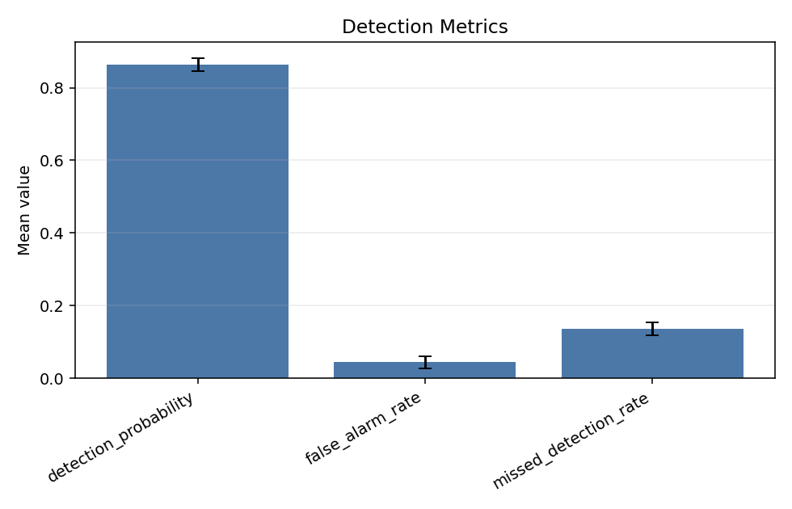
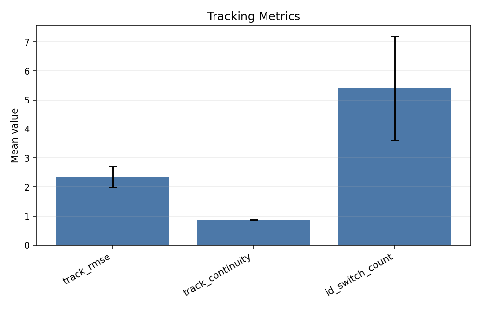
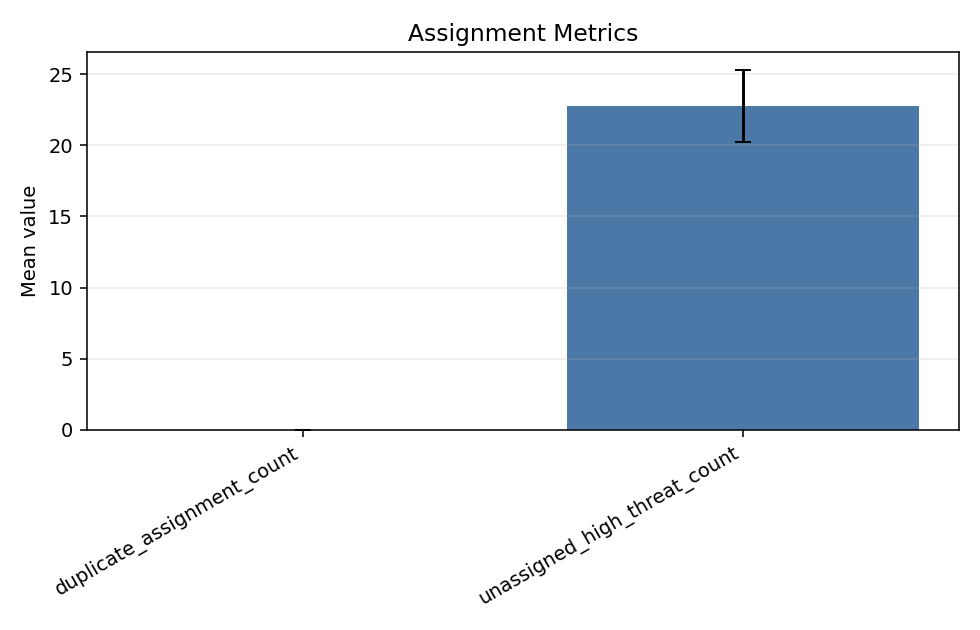
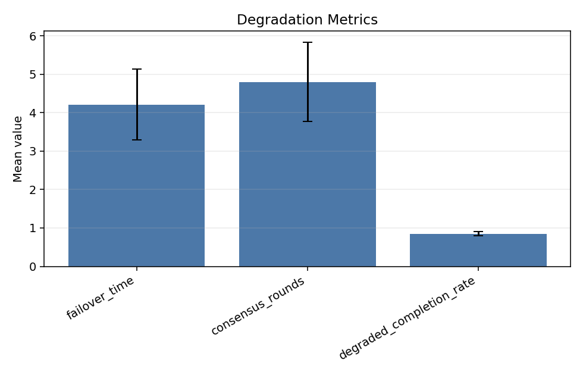
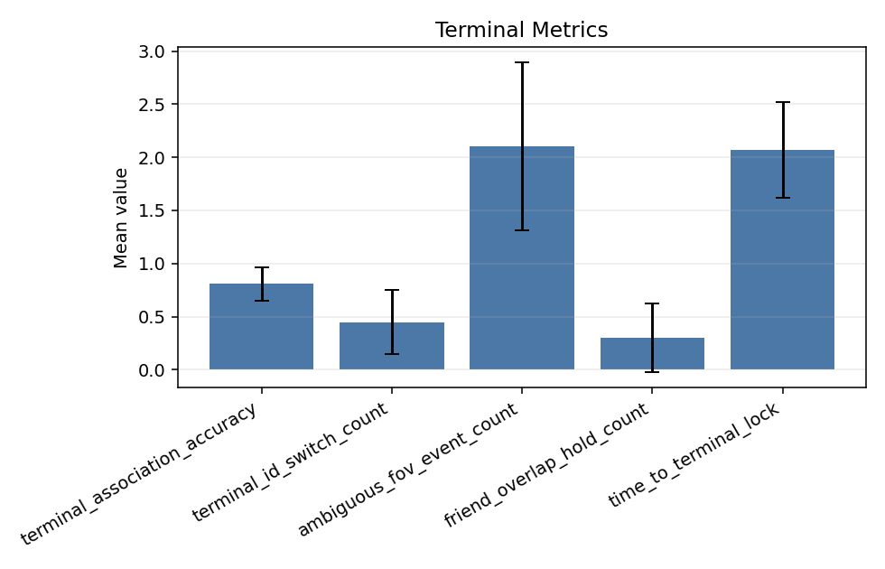
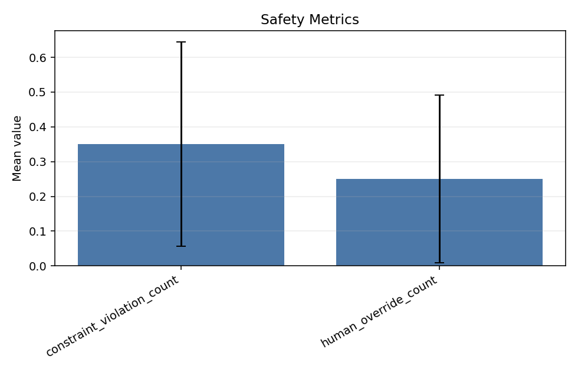
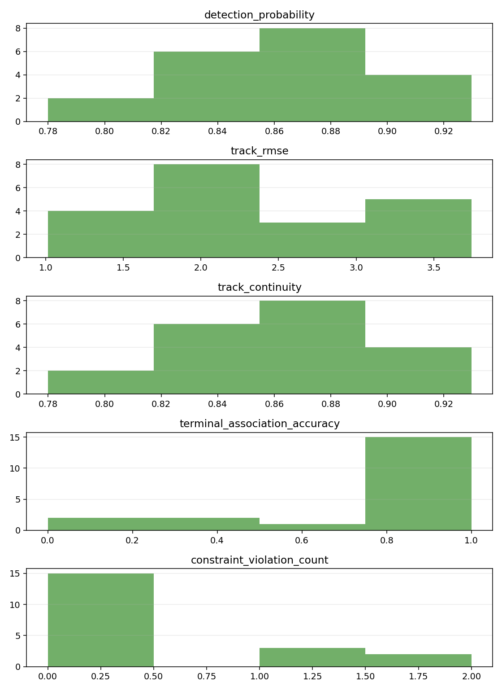

# D6 合成 100 种子离线评估

本报告由离线记录或合成日志生成。
它不提供实时决策、火控参数、毁伤逻辑、自动处置动作或绕过人工授权的流程。

- Episode 数量: 20
- 随机种子范围: 0..19

## 1. 汇总表

| 指标 | 均值 | 标准差 | 95% CI 下界 | 95% CI 上界 | 中位数 | P05 | P95 |
|---|---:|---:|---:|---:|---:|---:|---:|
| detection_probability | 0.863923 | 0.039167 | 0.846757 | 0.881088 | 0.862842 | 0.802108 | 0.927963 |
| false_alarm_rate | 0.0441667 | 0.0379577 | 0.027531 | 0.0608024 | 0.0333333 | 0 | 0.101667 |
| missed_detection_rate | 0.136077 | 0.039167 | 0.118912 | 0.153243 | 0.137158 | 0.0720375 | 0.197892 |
| track_rmse | 2.34005 | 0.809951 | 1.98507 | 2.69503 | 2.28106 | 1.23356 | 3.54587 |
| track_continuity | 0.863923 | 0.039167 | 0.846757 | 0.881088 | 0.862842 | 0.802108 | 0.927963 |
| id_switch_count | 5.4 | 4.09621 | 3.60476 | 7.19524 | 4.5 | 0.95 | 12.2 |
| duplicate_assignment_count | 0 | 0 | 0 | 0 | 0 | 0 | 0 |
| unassigned_high_threat_count | 22.75 | 5.7754 | 20.2188 | 25.2812 | 26 | 13 | 26 |
| failover_time | 4.21055 | 2.10078 | 3.28985 | 5.13126 | 3.91489 | 1.37553 | 7.61258 |
| consensus_rounds | 4.8 | 2.35305 | 3.76873 | 5.83127 | 4 | 2 | 8 |
| degraded_completion_rate | 0.85 | 0.119697 | 0.79754 | 0.90246 | 0.833333 | 0.666667 | 1 |
| terminal_association_accuracy | 0.808333 | 0.355718 | 0.652433 | 0.964233 | 1 | 0 | 1 |
| terminal_id_switch_count | 0.45 | 0.686333 | 0.149201 | 0.750799 | 0 | 0 | 2 |
| ambiguous_fov_event_count | 2.1 | 1.80351 | 1.30958 | 2.89042 | 2 | 0 | 5.05 |
| friend_overlap_hold_count | 0.3 | 0.732695 | -0.0211178 | 0.621118 | 0 | 0 | 2 |
| time_to_terminal_lock | 2.06765 | 1.02777 | 1.61721 | 2.5181 | 2.09287 | 0 | 3.38138 |
| constraint_violation_count | 0.35 | 0.67082 | 0.056 | 0.644 | 0 | 0 | 2 |
| human_override_count | 0.25 | 0.55012 | 0.00889945 | 0.491101 | 0 | 0 | 1.05 |

## 2. 图表与曲线

## 3. 解读说明

- 探测、跟踪、分配、降级、末端配准和安全指标分开报告，避免单一命中率掩盖问题。
- 计数类指标应与比例类指标一起检查，少量但严重的安全事件可能被总体成功率掩盖。
- 偏态或长尾指标在形成正式结论前，应使用 bootstrap 或非参数方法复核。
