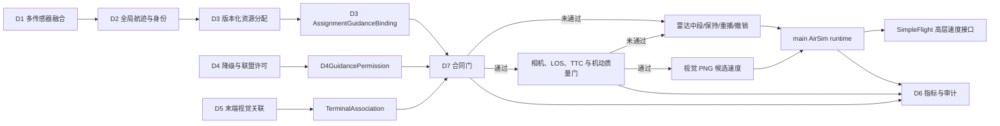
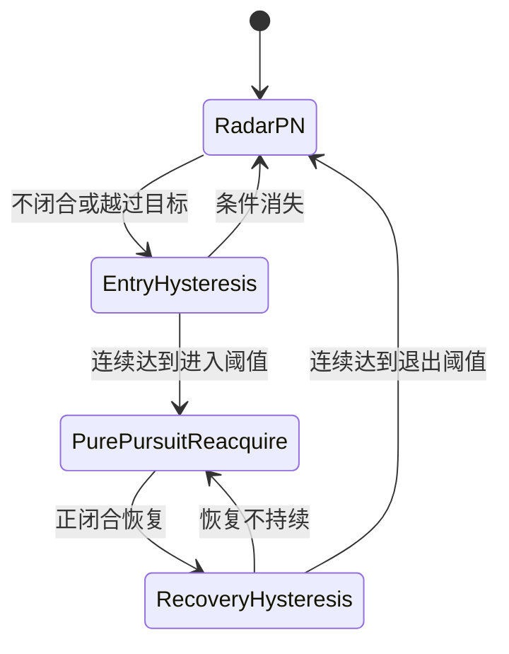
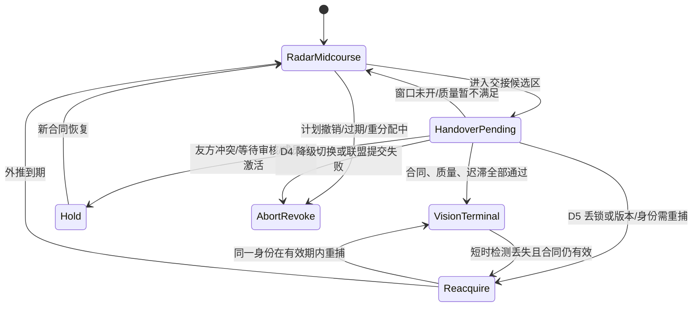

# D7 比例导引与末端视觉导引算法及实施方案

## 2026-07-23 固定输入性能分析

20-seed 整栈计时显示 `module.d7_guidance` 累计均值由 `3.637837 s` 增至
`3.858795 s`。D7 受控源文件、`scalable_3d_guidance.py` blob 和
`_guidance_inputs()` 业务路径没有变化，20/20 规范化在线输出也一致。因此本轮没有
从整栈累计值直接修改算法。

固定 replay 把 200 个 pair 运行 185 帧，同时覆盖中段、陈旧航迹、失效航迹、旧计划
和少量末端视觉分支。两个工作树各 6 次，命令和状态严格相同，候选变化
`+0.626%`，95% bootstrap 区间 `[-1.828%, +3.178%]`。该结果没有达到代码优化
准入条件。

临时排他 profile 把 D7 内部划分为输入适配、计划/版本/安全门、航迹滤波、LOS/TTC、
PN/PNG 计算、命令 DTO 物化和批处理残差。两版分布一致，未定位候选独有函数。
profile 包装会增加调用开销，报告中的毫秒值只用于成本组成，不能替代在线时延。

实施策略保持不变。后续由 main 拆开集成计时并保存完整输入 sidecar。若冻结差异区间
排除零，D7 才可在命令 DTO 或批处理循环中提出局部无语义优化；任何方案都必须保持
PN/PNG、LOS/TTC、切换安全门、调用频率、命令、状态和拒绝原因不变。

## 2026-07-22 性能计时边界复核

main 的 `module.d7_guidance` 计时从 `_guidance_inputs()` 之前开始，在
`to_world_acceleration()` 之后结束。它同时包含上游对象查找、D4 permission 组装、
输入 DTO 分配、D7 batch 和世界数组复制；D7 publication 与 JSON 序列化位于计时外。
因此该名称不能解释为纯导引公式耗时。

clean `8f86192 -> f80b5bd` 没有 D7 或计时路径代码差异，调用和业务输出也一致。
200-pair 冻结输入的同源码交错复测仍出现约 `6.58%` 人为组间差，足以覆盖历史
`+7.337%` 的量级。当前不引入缓存、对象复用或排序捷径；这些改变只有在独立分段
benchmark 证明稳定收益，并逐项保持命令数组、mode、gate reason、pair state 和状态
迁移后才能评估。位置 PN、视觉 PNG、LOS/TTC、0.75 秒 stale 门和安全合同均未改变。

## 2026-07-21 隔离双臂实施

`isolated_arm_guidance.py` 在 `ScalableGuidanceController3D` 外增加严格执行外壳。
调用顺序如下：

```text
完整源计划载荷 -> 计算 SHA-256 -> 构造 arm context
arm context + pair inputs -> 校验 arm、版本、hash、binding 和 D4
既有 ScalableGuidanceController3D -> 生成原始三维命令
显式 terminal pair -> 再校验 D5 gate
通过 -> command_generated；未通过 -> held + 零加速度
main 写入指定克隆世界 -> isolated world application receipt
validator/summary -> 分开统计 generated、held、applied
```

公开接口包括 `IsolatedGuidanceExecutionContextV1`、
`IsolatedArmGuidanceExecutor3D`、`IsolatedGuidanceCommandV1`、
`IsolatedGuidanceBatchV1`、`IsolatedGuidanceWorldApplicationV1`、
`validate_isolated_guidance_command()` 和 `summarize_isolated_guidance_commands()`。
schema 分别版本化，所有控制记录固定
`isolated_simulation_only=true/production_runtime_ack=false`。
`build_isolated_guidance_lineage_record_v1()` 进一步生成 D6 已定义的
`d7.isolated-command-lineage.v1` 平面行，完整 arm/episode/binding/gate 信息保留在
`command_payload` 内；main 另行生成 world application 与硬约束记录。

执行器只接受初始化时绑定的 experiment/seed/arm/episode/isolation identity，并按 arm
保存最高已消费计划版本及每个版本的计划 hash。版本回退、同版本 hash 改变或传入
载荷的实算 hash 不符会抛出稳定 contract error，调用方得不到 batch。pair 级 D4、
binding 或 D5 terminal gate 失败则返回 held record 和零加速度，便于 main 保留失败
证据而不推进该资源。application receipt 还核对 isolation world、command hash、
加速度逐元素一致和时间单调性。

2026-07-21 专项 `9 passed`，D7 全量 `213 passed`。测试覆盖两臂状态独立、跨臂
污染、计划与 receipt 篡改、旧计划、D4/D5/binding 负例，以及 generated/held/applied
摘要；200 pair 规模样本逐对核对状态和 binding hash。实现未修改位置 PN、视觉 PNG、LOS、TTC、coast 或
`png_guidance_delivery` 公式。main 和 D6 尚未接入新 sidecar，故当前只有 D7 合同
证据，没有多周期 physical outcome 或 production ACK 证据。

## 2026-07-20 可扩展三维实现

新增实现位于 `d7_proportional_guidance/scalable_3d_guidance.py`，公开
`ScalableGuidanceConfig3D`、`AssignmentPairGuidanceInput3D`、
`TerminalVisualObservation3D`、`ScalableGuidanceController3D`、
`GuidanceCommand3D` 和 `GuidanceBatch3D`。该文件独立于二维 `pn.py`，没有修改
既有位置 PN、`png_vm/png_ttc`、LOS replay 或 delivery 代码。

每个 pair 的 key 为 `(resource_id, assigned_global_track_id)`，状态包含：D3 plan
context、六维 GlobalTrack 的确定性滤波状态、最长 0.50 秒目标外推、六状态 LOS KF、
bbox TTC 窗口、local visual track、稳定/丢失帧计数、近期视觉命令窗口和当前模式。
plan id/version 变化创建新的上下文；旧 active plan、航迹时间回退、航迹 age 超过
0.75 秒或非有限输入均 fail closed。controller 不修改传入对象。

中段按三维位置/速度计算 LOS-normal PN，并增加限幅 LOS 速度保持以适配可从静止
起步的共享质点。末端先逐帧验证 active plan、binding、D4 和 D5 双版本，再把 bbox
中心射线从 camera frame 旋转到 NED；LOS KF 和面积 TTC 有效后才计算三维视觉 PNG。
raw lateral acceleration 超出声明的 `available_accel_mps2` 或使 maneuver margin 低于
0.15 时，候选视觉命令被丢弃并回退三维中段 PN。D4 replan/degrade pending 或 stale
active plan 则不回退旧计划控制，而是输出零加速度 `hold`。

批量入口先按 `resource_index` 稳定排序，拒绝重复/越界索引，并创建完整
`(resource_count,3)` 数组；无 assignment 的资源保持零。这样 main 可直接把
`GuidanceBatch3D.to_world_acceleration()` 写入
`VectorizedPointMassWorld.step(...)`，D7 不需要导入或拥有 world。

2026-07-20 测试矩阵为 14 个新增确定性用例：1/7/200 pair、实际 D2
`GlobalTrack3D` 与 D3 binding、非零高度差、D5 metadata 视觉观测、TTC fresh switch、
2 帧/0.25 秒 dropout coast、D4 三类 pending、stale active plan、D5 plan mismatch、
camera/maneuver gate，以及 2-resource/1-target 的 5 米任一首达闭环。D7 全量结果为
`204 passed`，验收门槛为零失败。尚未执行 AirSim 三维闭环、多 seed 统计、200 对
实时性能或姿态/推力/相机时延标定，因此实现状态必须写成“scalable point-mass
implemented and tested”，不能写成“AirSim/platform calibrated”。

## 2026-07-15 实现边界与真实 M5N2 证据更新

本轮没有修改本文后续给出的位置比例导引（PN）、速度矢量视觉比例导引（VM-PNG）、碰撞时间视觉比例导引（TTC-PNG）、视线（LOS）滤波和有界外推公式。`p1_terminal_timing_funnel_10seed_20260715_m5n2_*` 只为现有实现提供了 baseline/candidate 各 10 seeds 的真实 SimpleFlight 证据。M5N2 后额外完成的 `png_ttc_2v2_seed001` 已排除，dropout 执行数为 0。

按 5 米 NED 三维离线评分，两组合计 pair/target/coalition 为 `12/60`、`12/40`、`0/20`。第二 primary 按各 case 的 active membership 动态识别，不写死资源编号；七阶段为 `assigned/visible/associated/contract=20/20`、`control/mode=17/20`、physical=`0/20`。20 个第二 primary 均以 `collision_stop` 结束，但 collision object 缺失，不能把失败归因于 PN、PNG、LOS 或外推公式。candidate 逐 seed non-degradation=false，`terminal_trend_coast_applied=0`、soft-specific duration=0；通用 image-KF predicted 数量的 `14 -> 19` 变化不是 candidate 特有触发证据。因此实施状态仍是：默认位置 PN/视觉 PNG 主线保持，soft prediction 和 trend coast 保持 optional/default-off。

时延分层证据也表明不应修改导引公式来解决当前性能问题：3805 个 control tick 总时延 mean/P95 为 `1069.4/1254.1 ms`，内层 main-bus 为 `349.3/487.4 ms`，而 D7 guidance-contract 阶段仅 `4.84/5.78 ms`。外层 tick 已包含 main-bus，两者不得相加。全部在线控制状态来自 `d2_estimated_global_track`，truth identity/state online use 均为 0。

## 2026-07-15 诊断实现增量

`cooperative_diagnostics.py` 现从同一 pair 的有序 runtime rows 生成规范漏斗、细粒度漏斗、各阶段 `first_reached_timestamp_s` 和 measured-lock timeline。当前帧真实 measured lock 只认 `terminal_visual_lock_measured`，不再用 `ever_established` 代替；单帧 dropout 通过 `bounded_prediction -> reacquired` 的连续 run 长度解释。联盟摘要把 ordinal 2 的完整漏斗、首失败和时序原样带出。

`delivery_calibration.py` 新增 report-only 的 TTC 受控扰动汇总。`bbox_area_jump` 必须精确命中同名拒绝，`bbox_clipping` 接受具体边界裁剪原因；每条样本还必须证明 effective control=false、执行律回退 radar PN、expected/assigned `global_track_id` 一致。该 helper 不改阈值、滤波、TTC 公式或控制输出。2026-07-15 全量 `190 passed`，验收阈值零失败；真实 AirSim 证据仍由 main 负责采集。

## 2026-07-14 actual-execution 实施证据

本节只更新验证状态，不修改算法。真实 AirSim seed-1 canonical actual 五层按 contract/control/terminal-switch/mode/physical 独立统计：tuned 2v2 为 `35/26/26/2/2`，M5N2 为 `67/0/0/0/2`，合计 `102/26/26/2/4`，五层均为 `available`。`terminal_switch_allowed_count` 直接从已写盘 `control_commands` 独立统计，不由 control 层推断。M5N2 active pair 物理成功 `2/3`、第二 primary 最近约 `11.02 m`，target `2/2` 与 coalition `0/1` 仍用独立分母。两个 required case 均 available，identity/state online truth 使用均为 0，canonical P0 证据链关闭。

D6 formal overall 仍为 fail，因为当前每场景只有 1 个 seed，且未完成完整 P1 terminal-closure suite；terminal-switch 层和 main/D6 canonical 聚合均已闭合。开放 P1 是第二 primary、multi-seed/dropout/candidate、约 `123.3/384.6 ms` loop latency、pair funnel/closing speed/三维几何和平台机动标定；3D PN、True PN、APN、FRPN 在线化和同时到达不列当前 P1，也不通过修改 PN/PNG/LOS/外推公式或放宽合同门解决。

## 2026-07-14 导引律执行语义实现

`d7_guidance_law_semantics_v1` 不改变导引算法，只规范同一 runtime sample 的含义：`configured_guidance_law` 表示 main 选择的完整策略；视觉混合策略另派生配置的 `radar_pn` 中段律和 `png_vm/png_ttc` 末段律；`candidate_guidance_law` 只表示本帧已经计算并接受质量检查的视觉候选；`executed_guidance_law` 才表示可被 main 消费的实际律。视觉门失败时可以同时出现 `candidate=png_vm` 与 `executed=radar_pn`，这是正常的保守回退，不是两条控制命令并行执行。

实际视觉模式切换采用 `executed_visual_mode_switch`：必须是非 termination 的 live sample，`effective_control_authorized=true`、`latched_visual_mode_active=true`、当前模式为 `vision_terminal`，并且本帧发生从非视觉模式进入视觉模式的 transition。持续处于视觉控制的后续 sample 只有 `visual_control_active=true`，不重复计入口切换；handover/reacquire/hold 等状态变化不能计作视觉切换。`guidance_law_semantic_violations()` 对无有效合同或锁存却执行视觉律、候选与配置不一致、缺少视觉速度命令及 termination 执行声明进行被动审计。

2026-07-14 回归结果为 `188 passed`。专项测试证明 camera/bbox gate 拒绝时 raw/effective contract 可以通过，但实际律保持 `radar_pn`，effective control、视觉锁存、实际切换和输出视觉速度均为 false/空。位置 PN、VM/TTC PNG、LOS 滤波和外推公式没有修改。

## 2026-07-14 pair 首失败与漏斗诊断补充

`d7_pair_guidance_funnel_v2` 是被动诊断，不参与导引控制。它先检查 assignment/activation/radar，再检查实际距离是否进入 D3 候选携带的 terminal handoff range；随后依次检查 D5 visible、associated、declared locked、D7 raw terminal gate、measured visual lock、camera/LOS/closing-speed/maneuver、effective contract、latch、effective control、terminal mode 和 5 米物理结果。每个可选阶段同时记录 `available` 与 `reached`，因此“字段没有导出”不会被误当成“门限失败”。raw gate 为 false 但拒绝原因缺失时输出 `raw_terminal_gate_reject_reason_missing`，不从下游 false 默认值猜测 camera 或 maneuver 原因。

闭合速度判定没有新增算法：仍使用视觉 PNG 中既有条件 `closing_speed > min_closing_speed_mps`，本轮只把结果和阈值写入 runtime output。既有 seed-1 M5N2 日志显示两个 active pair 在配置约 30 米交接区外停止，另一个 pair 进入交接区但 D5 未锁定；2v2 `png_ttc` 与 1-frame dropout 仍为 2/2。当前 D7 验证为 `188 passed`；canonical 五层已正式聚合，完整拒绝原因、measured-lock 和 closing-speed 的 pair-funnel 覆盖继续作为 P1 标定证据。

## 2026-07-14 末端状态与指标实现

`runtime_bus.py` 的 `d7_terminal_semantics_v2` 以 canonical 字段区分 `raw_terminal_gate_*`、`latched_visual_mode_active`、`effective_terminal_contract_*`、`effective_control_authorized`、`mode_transition*` 和 `termination_snapshot*`。effective contract 只可能来自 fresh raw gate 或 `bounded_coast`；effective control 还必须通过 latch 和本帧命令条件。旧 `terminal_contract_allowed` 是 effective contract alias，旧 `terminal_switch_allowed`、`terminal_control_allowed`、`visual_png_enabled/switch` 是 effective control alias。summary 分别聚合 raw gate、effective contract scope、latch active、effective control scope、visual mode entry transition 和 termination snapshot，终止行不参与 live 分母。

`D7RuntimePairInput` 新增显式 `termination_snapshot/status/reason`。快照保存终止前 mode/latch/contract/control，但自身不评估 gate、不授权控制、不生成 mode transition。delivery 另输出 `terminal_dropout_reason_scope`：context/binding/law 或硬合同清空为 `contract_reset`，量测年龄越过 0.25 秒硬上限为 `prediction_window`，当前 context 从未有 measured lock 为 `measured_lock_not_established`。bounded coast 在现有 D3/D4/D5 gate 之外核对保存的 resource/global/local/owner context，且只接受 current、非回退版本；friend/duplicate/safety 冲突继续立即 fail closed。

2026-07-14 本地验收运行 D7 全量测试，当前结果 `188 passed`，验收阈值为零失败。D7 代码、字段语义、被动诊断以及 main/D6 canonical actual 五层正式聚合均已闭合；真实 AirSim multi-seed/dropout/candidate 和 pair-funnel/closing-speed/三维机动标定仍为 P1。位置 PN、VM/TTC PNG 与 `png_guidance_delivery` 核心公式未修改。

## 1. 文档目的与适用边界

本文说明 D7 比例导引与末端视觉导引模块的算法原理、跨模块合同、运行状态、代码实施路径、验证证据和能力边界。内容与截至 2026-07-14 的代码、`README.md`、`PLAN.md`、`MODULE_PRINCIPLES_CN.md` 以及 `png_guidance_delivery` 交付包保持一致。

D7 的工程职责是：在 D3 已完成资源分配、D4 已给出执行许可、D5 已完成末端目标关联的前提下，为每一个资源-目标对生成中段或末段导引命令。D7 不负责发现目标、维护全局身份、求解任务分配或决定降级模式。

本文描述的是科研仿真软件和高层控制抽象，不是实机飞行规范，也不构成自动授权、真实处置或绕过人工审核的方案。当前主线使用微软开源无人机仿真平台（AirSim）及其简化多旋翼控制器 SimpleFlight 的高层速度接口；D7 本身不直接连接飞行控制器或硬件。

必须首先区分本文中的两个同形缩写：

- 便携式网络图形文件格式（Portable Network Graphics，PNG）是图片文件格式，例如 `.png` 截图。
- 比例导航制导（Proportional Navigation Guidance，PNG）是本文的导引算法名称。

后文单独出现“视觉 PNG”时，均指比例导航制导，不指图片格式。

本文还使用以下基础术语：比例导引（Proportional Navigation，PN）、视线（Line of Sight，LOS）、速度倍增（Velocity Multiplication，VM）、预计碰撞时间（Time to Collision，TTC）、卡尔曼滤波（Kalman Filter，KF）和北-东-地坐标系（North-East-Down，NED）。

## 2. 模块定位与系统边界

### 2.1 输入、处理和输出



D7 的直接输入包括：

1. D2 全局航迹经 main 适配后的资源和目标位置、速度、时间与协方差摘要。
2. D3 的分配导引绑定 `AssignmentGuidanceBinding`。
3. D4 的导引许可 `D4GuidancePermission`。
4. D5 的末端关联 `TerminalAssociation` 和对应视觉观测。
5. 当前资源航向、速度、相机参数和平台机动限制。

D7 的直接输出包括：

- 中段二维比例导引（Proportional Navigation，PN）命令；
- 中段重捕用的纯追踪命令；
- 末段视觉比例导航制导候选速度；
- `radar_midcourse`、`handover_pending`、`vision_terminal`、`hold`、`reacquire`、`abort_revoke` 等显式状态；
- 合同、质量、切换、外推、拒绝原因和物理结果审计字段。

### 2.2 D7 明确不做的工作

D7 不执行以下操作：

- 不生成或优化 `AssignmentPlan`；
- 不选择新的目标，不把局部相机目标改绑到另一个全局目标；
- 不创建、重写或修复 `global_track_id`；
- 不决定中心、二级节点或完全分布式模式；
- 不代替 D4 组建联盟、补齐确认应答（Acknowledgement，ACK）或延长租约；
- 不使用 AirSim actor 真值身份做在线目标选择，也不使用 actor 真值位置/速度生成在线导引命令；
- 不直接控制 PX4 自动驾驶仪（PX4 Autopilot，PX4）、姿态、推力、电机或真实执行机构；
- 不实现多机共同到达、成员间避碰或联盟级协同导引律。

截至 2026-07-14，main/runtime 的默认、主动中心重规划和主动二级接管路径都只向 D7 控制链提供 D2 estimated target state、协方差和双时间戳。合同 fixture 只能更新 D3/D4/D5 状态，不能注入目标运动状态或 actor alias；估计缺失或陈旧时 fail closed。actor truth 仅用于运行后离线配对和 NED 三维 5 米评分。代码级回归为 AirSim runtime `130 passed`，但迁移前真实结果不会因此自动成为 truth-isolated 证据。

## 3. 统一命名与数据语义

### 3.1 关键术语

| 中文名称 | 英文全称与缩写 | D7 中的含义 |
| --- | --- | --- |
| 比例导引 | Proportional Navigation，PN | 根据闭合速度和视线角速度生成横向修正的经典中段算法。 |
| 比例导航制导 | Proportional Navigation Guidance，PNG | 本项目末端视觉导引名称，包含固定速度倍增和预计碰撞时间调度两条路径。 |
| 视线 | Line of Sight，LOS | 从拦截资源指向目标的方向。 |
| 速度倍增 | Velocity Multiplication，VM | 用导航比与速度量级构成固定视觉导引增益。 |
| 预计碰撞时间 | Time to Collision，TTC | 根据检测框面积扩张估计的接近时间，只是视觉尺度指标，不等于真实测距。 |
| 卡尔曼滤波 | Kalman Filter，KF | 对末端图像角和角速度进行短时估计。 |
| 北-东-地坐标系 | North-East-Down，NED | 仿真位置、速度和命令使用的局部工作坐标系。 |
| 全局航迹标识 | Global Track Identifier，`global_track_id` | D2/中心维护的规范目标身份；D7 只读和比较。 |
| 边界框 | Bounding Box，bbox | 视觉检测输出的目标矩形框。 |
| 资源-目标对 | Resource-Target Pair | 一个资源执行一个已分配全局目标的独立控制上下文。 |
| 合同允许 | Terminal Contract Allowed | D3、D4、D5、身份、版本和联盟条件均通过。 |
| 控制允许 | Terminal Control Allowed | 合同通过后，执行侧也允许使用视觉控制候选。 |
| 模式切换 | Mode Switch | 运行模式真正从中段切换到视觉末段。 |
| 物理成功 | Physical Intercept | 已分配资源与目标进入规定距离，本项目当前按 5 米判定。 |

### 3.2 身份不变式

规范身份链必须满足：

```text
D3 binding.assigned_global_track_id
  == D5 TerminalAssociation.assigned_global_track_id
  == VisionGuidanceObservation.assigned_global_track_id（若提供）
```

其中：

- `global_track_id` 由 D2/中心维护；
- `local_track_id` 只是单相机或单节点内的视觉跟踪身份；
- `local_track_id` 只能限定滤波器生命周期，不能替代或重写 `global_track_id`；
- 任一身份不一致立即触发 `terminal_identity_mismatch`，清空可执行视觉历史并回到保守路径。

### 3.3 时间与协方差

D7 不直接融合原始传感器，但必须继承上游的时间语义：

- `measurement_timestamp`：物理观测产生时间；
- `arrival_timestamp`：消息到达处理端时间；
- 相机 `frame_timestamp_s`：图像曝光或帧产生时间；
- `visual_latency_s`：图像到达和处理延迟。

视觉角速度必须基于图像量测时刻计算，不能用消息到达时刻代替。D1/D2 的轨迹协方差可作为中段质量和日志输入；D7 不把协方差较大解释为身份可被本地改写。

## 4. D3 分配导引绑定合同

### 4.1 核心字段

D3 通过 main 适配为 `AssignmentGuidanceBinding`。主要字段如下：

| 字段 | 用途 | D7 规则 |
| --- | --- | --- |
| `plan_id`、`plan_version` | 标识当前计划及版本 | 旧版本、回退版本或与 D4/D5 不一致时拒绝。 |
| `owner_node_id` | 当前计划所有者 | 中心或二级接管时必须与 D4 的真实接管结果一致。 |
| `resource_id`、`vehicle_name` | 执行资源 | 当前调用资源必须完全匹配。 |
| `assigned_global_track_id` | 已分配全局目标 | D7 只执行该目标，不本地换绑。 |
| `track_version` | 全局航迹版本 | 联盟或 D5 关联版本必须一致。 |
| `authorization_state` | 授权状态 | 只有有效授权状态可继续。 |
| `assignment_validity_state` | 当前、撤销或替代状态 | 非 current/active/valid 状态关闭执行。 |
| `expires_at_s` | 计划有效期 | 过期即拒绝。 |
| `coalition_id`、`coalition_version`、`coalition_epoch` | 多资源联盟身份 | 联盟场景中与 D4/D5 严格对齐。 |
| `member_role` | `primary`、`reserve` 或 `retry` | standby reserve 不得越权执行。 |
| `wave_id`、`coordination_mode` | 波次与协调方式 | 用于门控和审计，不在 D7 内重新规划。 |
| `arrival_window_start_s`、`arrival_window_end_s` | 允许视觉接管的时间窗 | 窗口未开或关闭时继续中段，不自行修改窗口。 |
| `activation_state` | active 或 standby | 只有当前版本显式激活的成员可执行。 |
| `terminal_authorization_scope` | 联盟级或逐主成员许可 | 默认是联盟级。 |
| `arrival_coordination_required` | 是否要求共同到达条件 | 只有显式为 false 才能取消共同时间窗要求。 |

### 4.2 授权与版本规则

D7 只执行同时满足以下条件的 binding：

1. `resource_id` 与当前资源一致；
2. `authorization_state` 为 `authorized`、`approved`、`human_approved`、`operator_approved` 或兼容有效状态；
3. `assignment_validity_state` 为 `active`、`current` 或 `valid`；
4. 当前时间未超过 `expires_at_s`；
5. 计划版本、航迹版本和联盟版本不回退；
6. reserve 已由新计划版本显式激活；
7. D4 和 D5 对同一计划、同一身份、同一联盟达成一致。

### 4.3 M 对 N 场景

D7 不假定资源数和目标数相等。D3 可以把多个资源分配到同一个高威胁目标，例如两个主用资源和一个备用资源。D7 为每个有效 binding 独立创建控制上下文，但不把这些独立控制器描述成一个协同导引控制律。

`build_cooperative_guidance_topology()` 只把 D3 已经排序的资源需求展开为 binding：它不运行匈牙利分配、不执行基于共识的捆绑算法（Consensus-Based Bundle Algorithm，CBBA），也不创建 AirSim 车辆。

## 5. D4 降级与执行许可合同

### 5.1 允许与阻断动作

D4 通过 `D4GuidancePermission` 向 D7 表示当前执行条件。默认允许继续检查视觉末端的动作为：

- `continue`；
- `continue_center`；
- `request_secondary_assist`。

其中 `request_secondary_assist` 仅表示二级侦察节点提供观测提示，不等于计划所有权已经转移。此时 D7 保留当前 D3 binding 和 owner，仍需逐帧通过 D5 与质量门。

以下动作表示计划处于切换或禁止状态，旧 binding 不得进入视觉 PNG：

- `request_center_replan`；
- `degrade_to_secondary`；
- `degrade_to_distributed`；
- `reassign`；
- `hold`、`hold_for_review`；
- `revoke` 或 `revoked`。

D7 对上述状态采用失效关闭：不猜测新 owner，不沿用旧视觉锁定，不用本地观测自动恢复授权。只有 D3 发布新版本 binding 且 D4 许可一致后，才从合同检查重新开始。

### 5.2 二级节点真实接管

二级节点真实接管必须同时满足：

1. D3 binding 的 `owner_node_id` 已切换到二级节点；
2. D4 `target_node_id` 与该 owner 一致；
3. D4 `new_plan_id/new_plan_version` 与 binding 一致；
4. 二级能力和持续就绪状态明确达到 `takeover_ready`；
5. D5 对新 owner、新版本和原 `global_track_id` 重新给出有效关联。

只有观测辅助而没有 owner 转移时，不要求辅助节点等于计划 owner；真实接管时则必须一致。这一区分避免“高空侦察节点提供图像”被误写成“高空侦察节点已取得任务控制权”。

### 5.3 完全分布式联盟提交

中心失效并进入完全分布式模式时，D7 只消费 D4/main 已形成的原子提交结果。可执行条件包括：

- `coalition_commit_state` 为 `committed` 或 `executing`；
- 租约存在且当前未过期；
- epoch、计划标识/版本、联盟标识/版本与 binding 一致；
- 当前资源在 required members 中；
- 全部 required members 均已 ACK；
- 当前资源自身也已 ACK；
- 联盟未处于 `reconfiguring` 或 `aborted`。

缺任一字段或出现网络分区时均拒绝执行。D7 不补成员、不推断 ACK、不延长租约，也不把联盟 commit 自动解释为 reserve 激活。

## 6. D5 末端关联输入合同

### 6.1 必要输入

D5 的 `TerminalAssociation` 至少要向 D7 提供或映射以下语义：

| 输入 | 作用 |
| --- | --- |
| `decision_state` | `locked` 才能新切入；`reacquire` 只允许已锁定 pair 尝试有界短时预测。 |
| `assigned_global_track_id` | 必须与 D3 binding 一致。 |
| `local_track_id` | 管理本地视觉滤波生命周期。 |
| `assignment_version` / `plan_version` | 与航迹和计划版本核对。 |
| `coalition_id` / `coalition_version` | 联盟视觉证据与 binding 对齐。 |
| `friend_conflict_state` | 任何友方冲突都立即阻断。 |
| `duplicate_terminal_lock_risk` | 防止多个错误局部锁定被当成有效执行证据。 |
| `execution_gate_pass` / `safety_gate_passed` | D5 的保守安全门。 |
| `coalition_visual_complete` | 默认联盟级许可下要求全部必要成员视觉证据完整。 |
| `support_count` / `required_resource_count` | 联盟证据完整性审计。 |
| 检测框、置信度、相机编号和时间戳 | 供 D7 计算像面、LOS、TTC 与时延质量。 |

`locked` 是必要条件但不是充分条件。即使 D5 已锁定，D7 仍要检查 D3 版本、D4 动作、联盟、相机质量、LOS 质量、闭合状态和机动裕度。

### 6.2 友方、重复锁定和真值隔离

以下情况立即拒绝视觉控制并清除不再可信的预测状态：

- `friend_conflict_state` 非 `none`；
- `duplicate_terminal_lock_risk=true`；
- duplicate conflict state 非 clear；
- D5 execution/safety gate 为 false；
- D5、D3 或 observation 的全局目标身份不一致；
- 联盟视觉冲突或联盟证据不完整。

AirSim `simGetDetections` 返回的对象名称和 actor 真值只允许写盘后供 D6 离线评分。在线 D5/D7 不能使用真值身份直接完成关联或选择控制目标，也不能用真值位置/速度生成中段 PN、末端相对状态、切换距离、相机朝向或在线成功判定。`truth_identity_online_use_count` 和 `truth_state_online_use_count` 必须分别审计，任一非零都不能作为 truth-isolated 闭环证据。

## 7. 中段位置比例导引

### 7.1 二维相对运动模型

当前默认中段是二维水平质点模型。设拦截资源位置和速度为：

```text
p_m = [x_m, y_m]^T
v_m = [v_mx, v_my]^T
```

目标位置和速度为：

```text
p_t = [x_t, y_t]^T
v_t = [v_tx, v_ty]^T
```

相对位置、相对速度和距离为：

```text
r = p_t - p_m
v_r = v_t - v_m
R = ||r||
```

视线角和视线角速度为：

```text
lambda = atan2(r_y, r_x)
lambda_dot = (r_x * v_ry - r_y * v_rx) / R^2
```

闭合速度定义为：

```text
V_c = -(r^T * v_r) / R
```

当距离正在减小时，`V_c` 为正；远离时为负。

### 7.2 经典比例导引命令

横向加速度需求为：

```text
a_n = N * V_c * lambda_dot
```

其中 `N` 是导航比，默认值为 3.0。根据当前资源速度 `V_m`，转率为：

```text
omega_cmd = a_n / max(V_m, epsilon)
```

代码先限制横向加速度，再限制转率：

```text
a_limited = clip(a_n, +/-a_max)
omega_limited = clip(a_limited / V_m, +/-omega_max)
psi_next = wrap_pi(psi + omega_limited * dt)
```

输出是抽象的水平航向、转率和横向加速度，不是姿态或推力命令。默认 `GuidanceConfig` 中的研究参数包括：导航比 3.0、最大横向加速度 60 米每二次方秒、最大转率 0.8 弧度每秒、拦截半径 5 米。实际 AirSim runtime 可以按场景注入不同配置。

### 7.3 算法特性

比例导引的核心目标是使 `lambda_dot` 收敛到零，即使目标方向在像面或空间中趋于稳定。与直接追目标当前位置相比，它使用相对运动趋势进行提前量修正，计算量小、参数可解释，适合作为中段默认基线。

当前实现限制如下：

- 在线主线只使用水平二维状态；
- 不包含完整多旋翼动力学、姿态环、推力和执行机构时延；
- 目标加速度不直接进入默认公式；
- 高度差只由 main 的高度命令和日志管理，不构成在线三维 PN。

## 8. 纯追踪对照与中段重捕

### 8.1 纯追踪算法

纯追踪直接朝向目标当前估计位置。期望航向为视线角：

```text
psi_des = lambda
e_psi = wrap_pi(psi_des - psi)
omega_cmd = clip(e_psi / dt, +/-omega_max)
```

它不使用导航比和闭合速度，优点是简单、能在已经越过目标或航向明显错误时快速重新指向目标；缺点是容易尾追，通常不是高速拦截的优选主律。

### 8.2 有界重捕选择

`MidcourseReacquisitionSelector` 为每个资源-目标对独立维护迟滞状态。默认进入条件是：

- 闭合速度连续 2 帧不大于 0；或
- 距离相对历史最小值增加至少 2 米，且比上一帧继续增加 0.05 米以上。

满足后临时使用纯追踪重捕，并把最大重捕转率限制在 0.9 弧度每秒。退出条件是闭合速度连续 3 帧达到至少 1 米每秒，随后恢复位置 PN。



该机制只解决单个 pair 的中段重新闭合，不重新分配目标，也不修改 PN 或纯追踪公式。

## 9. 视觉比例导航制导

### 9.1 像素检测框到视线角

视觉观测 `VisionGuidanceObservation` 包含边界框（Bounding Box，bbox）：

```text
bbox = [x1, y1, x2, y2]
u = (x1 + x2) / 2
v = (y1 + y2) / 2
A = max(0, x2-x1) * max(0, y2-y1)
```

当前主模块以水平像素中心计算相机方位误差：

```text
beta = atan((u - c_x) / f_x)
lambda = wrap_pi(psi_resource + beta)
```

其中 `c_x` 是图像中心横坐标，`f_x` 是焦距像素值，`psi_resource` 是当前资源航向。交付包中的完整三维实现还可使用：

```text
x_n = (u-c_x)/f_x
y_n = (v-c_y)/f_y
los_C = normalize([x_n, y_n, 1])
lambda_I = normalize(R_IB * R_BC * los_C)
```

其中 `R_BC` 为相机到机体外参，`R_IB` 为机体到惯性系姿态。当前 D7 主线吸收的是适合 SimpleFlight 水平速度控制的轻量二维部分；完整三维姿态变换没有替换默认在线路径。

### 9.2 LOS 角速度滤波

相邻图像帧的原始角速度为：

```text
lambda_dot_raw = wrap_pi(lambda_k - lambda_(k-1)) / dt
```

代码采用指数移动平均：

```text
lambda_dot_filtered
  = alpha * lambda_dot_raw
  + (1-alpha) * lambda_dot_previous
```

默认 `alpha=0.45`，并在最近 5 个样本上计算方差。LOS 质量门要求：

- 至少具有两帧角速度历史；
- 方差不超过默认 2.0 平方弧度每平方秒；
- 可配置的绝对角速度和单帧跳变量未越界；
- 若启用离群拒绝，尖峰样本不能进入切换。

### 9.3 VM 路径

交付包固定 VM 形式的三维导引表达为：

```text
a_cmd = N * V_m * (omega_LOS x lambda_I)
```

其中 `omega_LOS` 是 LOS 角速度向量，`lambda_I` 是惯性系 LOS 单位向量，`V_m` 是拦截速度量级。

当前主模块的二维 `png_vm` 使用：

```text
a_cmd = N * max(V_c, V_min) * lambda_dot
omega_cmd = a_cmd / max(max(V_c, V_min), epsilon)
```

因此轻量二维实现的主要效果是 `N * lambda_dot` 的转率修正；最终速度模长由 main 注入的 `intercept_speed_mps` 给出：

```text
psi_cmd = psi + clip(omega_cmd) * dt
v_cmd_NED = [V_i*cos(psi_cmd), V_i*sin(psi_cmd), z_cmd]
```

`png_vm` 不要求检测框面积 TTC 有效，只要相机、LOS、闭合和机动条件满足即可。它是截至 2026-07-13 的默认视觉末段算法。

### 9.4 bbox 面积与 TTC 路径

若目标表观尺寸近似固定，检测框面积满足 `A` 与距离平方的倒数近似成正比：

```text
A ∝ 1/R^2
```

由此得到尺度扩张 TTC 近似：

```text
TTC ≈ 2*A/A_dot
```

`png_ttc` 的处理顺序为：

1. 检查检测框面积不小于默认 16 平方像素；
2. 拒绝触及图像边界的裁切框；
3. 拒绝相邻面积比例超过默认 2.5 的跳变；
4. 用默认 `alpha=0.25` 对面积低通；
5. 在最多 5 帧窗口内拟合 `A_dot`；
6. 要求面积正在稳定扩张；
7. 要求 TTC 为正且不大于默认 20 秒。

TTC 调度增益在 TTC 不大于 1 秒时取 5.0，在不小于 6 秒时取 0.5，中间用平滑余弦插值：

```text
omega_cmd = K(TTC) * lambda_dot_filtered
```

与交付包中“TTC 无效时可退到 soft VM guidance”的完整路径不同，D7 主模块的 fresh `png_ttc` 切换要求 TTC 有效。TTC 无效时记录明确拒绝原因并继续雷达中段。`png_ttc` 已有真实 AirSim 证据，但不是默认主线。

### 9.5 相机质量门

默认 `PngGuidanceConfig` 的相机质量条件包括：

- 检测置信度不低于 0.55；
- 检测框面积占图像面积比例不低于 0.0008；
- 检测框距离边缘比例不低于 0.03；
- 同一局部 track 连续稳定至少 2 帧；
- 视觉延迟不超过 0.35 秒。

默认图像宽高 640×480、焦距 320 像素只是模块配置默认值，真实运行应由 main 按 1080p、4K 或具体相机内参覆盖，不能把默认值误解为系统硬件规格。

### 9.6 机动裕度门

转率容量同时受最大转率和横向加速度限制：

```text
omega_capacity = min(omega_max, a_max / max(V_m, epsilon))
margin = 1 - |omega_required| / omega_capacity
```

默认要求 `margin >= 0.15`。若存在三维相对状态且闭合速度不大于 0.2 米每秒，也以 `not_closing` 拒绝。该门防止“相机已经识别”被直接等价为“平台一定来得及转向”。

## 10. 从 png_guidance_delivery 吸收的能力

### 10.1 已吸收部分

`png_guidance_delivery` 是经过多轮 AirSim 试验的独立交付包。D7 主线没有修改其核心算法，而是抽取以下适合当前系统合同和 SimpleFlight 仿真的能力：

| 交付包能力 | D7 主线实现 | 当前状态 |
| --- | --- | --- |
| 检测框中心到视线方向 | `vision_png.py` | 已吸收二维水平形式。 |
| LOS 角速度与质量判断 | `vision_png.py` | 已吸收指数滤波、方差、尖峰与限幅接口。 |
| 固定 `N*V_m` 增益 | `png_vm` | 默认在线末端律。 |
| 面积扩张 TTC | `png_ttc` | 已实现和验证，非默认。 |
| 检测框面积、裁切、跳变治理 | `vision_png.py` | 已吸收。 |
| 图像角度 KF | `terminal_delivery.py` | 已吸收四状态常角速度模型。 |
| 短时预测和命令 coast | `terminal_delivery.py` | 已吸收并增加身份/版本生命周期约束。 |
| LOS 六状态滤波 | `los_replay.py` | 仅离线 replay，不进入默认在线控制。 |

### 10.2 图像 KF

图像卡尔曼滤波状态为：

```text
x = [theta_x, theta_y, theta_dot_x, theta_dot_y]^T
```

采用常角速度模型：

```text
x_k = F(dt) * x_(k-1) + w
z_k = H * x_k + v
```

其中：

```text
F = [[1,0,dt,0],
     [0,1,0,dt],
     [0,0,1,0],
     [0,0,0,1]]
H = [[1,0,0,0],
     [0,1,0,0]]
```

默认图像量测噪声为 0.006 弧度，角加速度过程噪声为 8 弧度每平方秒，创新拒绝阈值为 0.20 弧度。角度和角速度还分别受到 1.0 弧度和 8 弧度每秒的硬限幅。

### 10.3 有界短时外推与 coast

末端交付状态包括：

```text
acquiring -> measured -> image_kf_predict -> blind_push
                      \-> reacquired
                      \-> expired
```

当前默认规则为：

- 图像 KF 最长预测 0.25 秒；
- 连续丢失帧阈值为 3；
- 历史命令平均窗口为 0.10 秒；
- blind push 最长 0.25 秒；
- 命令衰减时间常数为 0.18 秒；
- soft innovation prediction 默认关闭；
- 水平 LOS trend coast 默认关闭。

短时外推不能用于 fresh visual switch。只有本 pair 曾有真实 measured lock、当前 D5 明确为 `reacquire`、D3/D4/D5 身份与版本仍完全一致、terminal latch 已激活时，才可在硬时间上限内继续。任何 owner、身份、版本、友方或安全条件变化立即清空 KF 和 coast。

### 10.4 未吸收部分

以下交付包能力没有进入 D7 默认在线主线：

- PX4 Offboard 模式和实机解锁流程；
- 微型飞行器通信协议（Micro Air Vehicle Link，MAVLink）速度、姿态或机体系角速度接口；
- `SET_ATTITUDE_TARGET`、姿态四元数、推力和电机控制；
- 云台和捷联相机的完整三维姿态补偿链；
- 自动武装、硬件安全、遥控接管和 kill switch；
- 只看一次目标检测（You Only Look Once，YOLO）、TensorRT 加速和 ByteTrack 作为 D7 内部默认输入；
- 飞控时钟、通信链路、真实相机畸变和硬件在环验证。

这些能力保留在交付包中用于专项研究，不得因源码存在就写成 MSM 当前主线已具备的能力。

## 11. 雷达中段到视觉末段状态机

### 11.1 总体状态



### 11.2 每帧处理顺序

D7 每帧按以下顺序执行，后级条件不能绕过前级：

1. 归一化 D3 binding，检查资源、授权、current、有效期和版本。
2. 检查 D4 action、owner、二级 readiness 和分布式 commit。
3. 检查 D5 `locked/reacquire`、身份、版本、友方、重复锁定和 safety gate。
4. 检查联盟角色、activation、时间窗、联盟视觉完成或逐主成员策略。
5. 只有合同通过，才更新本 pair 的检测框、LOS、面积 TTC 和图像 KF。
6. 检查相机质量、LOS 质量、TTC 条件和机动裕度。
7. 应用切入驻留、释放确认和重捕宽限状态。
8. 只有最终 `visual_png_enabled=true` 才输出 `selected_velocity_ned`。
9. 未通过时继续雷达 PN、纯追踪重捕，或进入 hold/abort 状态。

### 11.3 距离、相机和机动切换门

视觉切换不是固定“到 30 米必切”。距离只决定何时开始尝试交接，真正切换还必须同时满足：

- 当前 D3 binding 有效；
- D4 允许继续且没有正在进行的重分配；
- D5 锁定同一 `global_track_id`；
- 相机分辨率、焦距、检测框面积和边缘位置满足要求；
- 视觉延迟和稳定帧满足要求；
- LOS 角速度历史与方差满足要求；
- `png_ttc` 场景面积稳定扩张且 TTC 有效；
- 当前速度、最大转率和横向加速度仍有机动余量；
- 联盟、版本和身份全部一致。

因此合理交接距离应由目标像素尺度、相机视场、相对速度和平台机动能力联合标定，而不是仅靠距离常数。

### 11.4 驻留、释放和重捕迟滞

`PngGuidanceConfig` 提供：

- `terminal_dwell_frames`：候选连续通过多少帧后激活视觉模式；
- `terminal_release_frames`：候选连续失败多少帧后释放视觉 latch；
- `terminal_reacquire_grace_frames`：重捕后再次切入前的额外等待帧数。

当前默认值为 1、1、0，接口支持在真实多 seed 标定后提高。release grace 只保留审计状态，不会无条件继续输出旧视觉命令；真正短时延续由有界 coast 单独管理。

## 12. 每个资源-目标对的独立状态

### 12.1 控制上下文

`D7RuntimeBus` 使用：

```text
control_context_id = resource_id + "->" + assigned_global_track_id
```

为每个 pair 独立保存：

- `MidcourseReacquisitionSelector` 的闭合、最近距离和迟滞状态；
- `SimpleFlightPngGuidanceFilter` 的局部 track、LOS 与面积窗口；
- `TerminalGuidanceDelivery` 的图像 KF、丢帧、命令窗口和 coast；
- terminal latch 的 dwell/release/reacquire 计数；
- 上一模式和导引律，用于模式转换日志。

多个资源可指向同一 `global_track_id`，但每个资源仍有独立状态。一个资源的 D5 丢锁、bbox 跳变或 D4 拒绝不能污染其他资源。

### 12.2 状态保留与重置

同一资源、同一全局目标、同一非空 owner、同一联盟角色和 activation 下，若 plan/track/coalition version 单调前进，可以保留已经测得的滤波历史，以避免滚动计划导致无意义重启。但最新合同仍逐帧完整重验，历史不是许可缓存。

以下变化必须重置：

- `resource_id`、`assigned_global_track_id` 或 `local_track_id` 改变；
- owner、member role、wave、activation 或 terminal scope 改变；
- 计划、航迹或联盟版本回退；
- 导引律改变；
- assignment 被撤销、过期或显式 reset；
- D4/D5 身份、安全或联盟合同失败。

### 12.3 独立控制器不等于协同导引

当前多个资源对同一目标分别运行位置 PN 或视觉 PNG，本质是多个独立控制器并行。D3/D4 的联盟合同只约束“谁可以在什么版本下执行”，不改变单机导引公式。

真正的协同导引至少还需要：

- 共享剩余飞行时间或共同到达时刻；
- 联盟级时钟和一致性协议；
- 终端扇区或撞击角分配；
- 成员间最小间距预测；
- 空中避碰约束和邻机状态交换；
- 通信丢包下的稳定控制策略。

当前 D7 不具备这些控制律，因此不得把多 binding 或联盟 gate 写成“已实现协同 PNG”。

## 13. 默认主线、已验证候选与隔离对照

### 13.1 默认在线主线

截至 2026-07-13，默认 AirSim 受控拦截路径为：

```text
二维位置 radar_pn
  + 有界 pure_pursuit 中段重捕
  -> D3/D4/D5 合同门
  -> 相机/LOS/机动质量门
  -> png_vm 视觉末段
  -> main 调用 SimpleFlight 高层速度接口
```

运行时 selector 支持四种策略：

| 运行名称 | 中段 | 末段 | 当前定位 |
| --- | --- | --- | --- |
| `pure_pursuit` | 纯追踪 | 无视觉切换 | 对照基线。 |
| `radar_pn` | 位置 PN | 无视觉切换 | 中段基线。 |
| `png_vm` | 位置 PN | 固定 VM 视觉 PNG | 默认主线。 |
| `png_ttc` | 位置 PN | TTC 调度视觉 PNG | 已验证候选，非默认。 |

### 13.2 P2 隔离式三维 benchmark

第二优先级（Priority 2，P2）可选对照位于 `optional_p2_benchmark.py`，只运行离线三维质点或 replay，不注册到在线 selector，不输出车辆命令，也不绕过 D3/D4/D5 合同。

包括：

- 三维比例导引（Three-Dimensional Proportional Navigation，3D PN）；
- 真比例导引（True Proportional Navigation，True PN）；
- 增广比例导引（Augmented Proportional Navigation，APN）；
- 模糊/鲁棒比例导引研究近似（Fuzzy/Robust Proportional Navigation，FRPN approximation）。

每条结果记录 5 米成功、最小脱靶距离、控制努力、控制能量、峰值加速度和 Python 计算耗时，并明确标记：

```text
benchmark_only = true
default_runtime_path_replaced = false
png_guidance_delivery_modified = false
d3_d4_d5_gate_bypassed = false
```

其中 FRPN 只是基于 LOS 角速度和目标加速度的确定性增益调度研究近似，没有复现规范模糊规则库，不能称为成熟 FRPN 实现。

### 13.3 尚未实现或未晋级能力

以下能力仍为缺口：

- 默认在线三维 PN、True PN、APN 或 FRPN；
- 协同到达、共同 time-to-go 和 impact-time consensus；
- 成员间预测避碰和空中冲突解脱；
- 联盟级协同控制消息和 leader/neighbor 导引；
- 完整 PX4/MAVLink/姿态/推力实机链；
- 多旋翼完整动力学和硬件在环验证；
- YOLO、ByteTrack 或 BoT-SORT 作为 D7 默认检测/跟踪路径；
- 真实无线带宽、时钟漂移、认证和失联控制验证。

## 14. 代码实施映射

| 文件 | 主要职责 |
| --- | --- |
| `d7_proportional_guidance/models.py` | 二维状态、命令、记录和运行模式。 |
| `d7_proportional_guidance/pn.py` | 经典二维位置 PN、纯追踪和只读三维几何字段。 |
| `d7_proportional_guidance/midcourse_reacquisition.py` | PN 与纯追踪之间的有界中段重捕迟滞。 |
| `d7_proportional_guidance/selector.py` | 四种在线运行策略的规范化选择。 |
| `d7_proportional_guidance/terminal_gate.py` | D3 binding、D4 permission、D5 association、联盟和身份合同。 |
| `d7_proportional_guidance/vision_png.py` | bbox 到 LOS、LOS 质量、VM/TTC、相机与机动门。 |
| `d7_proportional_guidance/terminal_delivery.py` | 图像 KF、短时预测、blind push 和生命周期重置。 |
| `d7_proportional_guidance/runtime_bus.py` | 每 pair 状态、迟滞、输出和审计日志。 |
| `d7_proportional_guidance/airsim_contract_replay.py` | 真实 AirSim 合同 replay 审计。 |
| `d7_proportional_guidance/cooperative_topology.py` | 把 D3 已有需求展开为通用 N/M binding topology。 |
| `d7_proportional_guidance/cooperative_diagnostics.py` | 多 pair 漏斗、第二主成员失败和联盟物理结果诊断。 |
| `d7_proportional_guidance/optional_p2_benchmark.py` | 隔离式 3D PN、True PN、APN、FRPN 研究近似。 |
| `png_guidance_delivery/` | 原始视觉导引交付包和未并入默认主线的 PX4/实机研究代码。 |

main 的 AirSim runtime 负责：按 `--drone-count N` 创建有效 pair、启动和 reset 场景、移动 actor 目标、取得检测框、向 SimpleFlight 下发高层速度、收集日志并调用 D6。D7 不把 2v2 或 5v5 写死到算法中。

## 15. 2026-07-14 验证证据

### 15.1 当前 actual-v2 seed-1

2026-07-14 actual-v2 已用真实 AirSim 完成 tuned 2v2 `png_ttc` 与 M5N2 两个 required case，availability 为 `2/2`，并同时证明 identity/state online truth 使用为 0。2v2 pair 物理成功 `2/2`；M5N2 active pair `2/3`、第二 primary 最近约 `11.02 m`、有效视觉控制和 mode switch 为 0、target `2/2`、coalition `0/1`。该证据关闭 canonical P0，但单 seed 和未通过完整 P1 suite 不能形成统计性能结论。

后续小节记录 2026-07-14 truth-state 迁移前的历史实验。其 `online truth=0` 字段只覆盖 truth identity，没有独立记录 truth state provenance；因此这些历史 physical 数字继续作为控制接口 smoke 和离线评分基线，不因当前 actual-v2 自动升级。

### 15.2 历史 2v2 PNG-TTC

2 个资源对 2 个目标的 `png_ttc` 批量测试覆盖 10 个随机种子、20 个资源-目标对：

- 5 米物理成功：`20/20`；
- 目标成功：`20/20`；
- 视觉控制允许样本：84；
- 模式切换计数：20；
- 在线 truth identity 使用：0；truth state 当时未独立审计；
- 日志中实际出现面积不扩张和 TTC 越界拒绝，说明面积门真实参与决策。

该结果证明：在该迁移前 2v2、8 秒、10-seed 几何下，`png_ttc` 接口、D3/D4/D5 gate、面积治理和 SimpleFlight 执行链曾可运行；它不能替代当前 actual-v2，也不能证明当前多 seed truth-isolated P1 已关闭。

该结果不证明：

- `png_ttc` 优于默认 `png_vm` 或位置 PN；
- 20/20 均由视觉控制单独贡献；
- 同一配置可推广到五资源对二目标场景、不同高度或高机动目标；
- bbox TTC 等于真实测距或真实碰撞时间；
- 已完成实机飞控、真实视觉和真实通信验证。

### 15.3 历史 M5N2 联盟物理闭环

M5N2 表示 5 个资源对 2 个目标。最终收敛批次包含 40 个 SimpleFlight episode：baseline 和三个 D3 profile 各 10 seeds。高威胁目标采用 2 个 active primary 和 1 个 standby reserve。联盟完成定义为同一 episode 内两个 active primary 分别进入 NED 三维 5 米范围，不要求同时到达。

| D3 profile | 联盟完成率 |
| --- | ---: |
| baseline | 0/10 |
| 20 米交接 / 3 秒到达窗 / 40 度扇区间隔 | 5/10 |
| 20 米 / 5 秒 / 40 度 | 2/10 |
| 20 米 / 8 秒 / 40 度 | 1/10 |

最佳 profile 为 `5/10`，低于 `8/10` 晋级门限；全部 profile 合计 `8/40`。主要失败断点是第二主成员的：

- `d5_not_locked`；
- `terminal_detection_acquisition_timeout`；
- 少量 `bbox_area_too_small`。

安全结果为：standby reserve 越权 0、`global_track_id` 改写 0、在线 truth identity 使用 0；在线 truth state 当时未独立审计。

D6 统一报告中还分别记录合同允许 35、控制允许 7、模式切换 9、pair 物理成功 62。四类指标的样本和判定层级不同，不能相互反推：物理进入 5 米不代表该帧一定由视觉模式控制；合同通过也不代表质量门和物理结果通过。

### 15.4 当前结论边界

2v2 的 `20/20` 与 M5N2 最佳 `5/10` 使用不同规模、几何、时限和判据，不能直接比较算法优劣。现阶段可确认的是：

1. D3/D4/D5 到 D7 的版本化合同和 fail-closed 路径已经接通；
2. 位置 PN、纯追踪重捕、`png_vm` 和 `png_ttc` 均有代码和测试入口；
3. `png_ttc` 在指定 2v2 条件下闭环，但尚不足以替换默认 `png_vm`；
4. M5N2 的主要瓶颈仍是第二主成员的视觉获取和稳定锁定；
5. 当前联盟是多独立控制器的合同化执行，不是协同到达或协同避碰导引。

因此下一步应优先标定第二主成员的可见性、检测稳定性、LOS/闭合速度口径、二维与三维机动裕度，以及同几何 paired multi-seed 对照；不能通过放宽身份、版本、友方、reserve 或安全门来提高表面成功率。

## 16. 测试与验收方法

文档对应的模块测试入口为：

```bash
python3 -m pytest -q research_modules/d7_proportional_guidance/tests
```

主要测试覆盖：

- 经典位置 PN 和纯追踪数学输出；
- 中段重捕进入/退出迟滞；
- 四导引律 selector；
- D3/D4/D5 合同、owner、版本和身份拒绝；
- 联盟 activation、ACK、lease 和 commit；
- 相机、LOS、TTC、机动质量门；
- 图像 KF、短时 dropout、coast 和到期；
- 每 pair 独立状态和生命周期重置；
- P2 对照不进入默认 runtime；
- actor mesh 和交付包资产完整性。

本次仅创建算法与实施文档，没有修改代码和 `png_guidance_delivery` 核心算法，因此不要求重复运行全量测试。

## 17. 实施约束清单

后续集成和扩展必须继续遵守：

1. 仿真规模由 main 的 `--drone-count N` 决定，不写死 2v2 或 5v5。
2. 一个有效 assignment binding 对应一个独立 D7 控制上下文。
3. D7 永不创建、重写或本地改绑 `global_track_id`。
4. 任何过期、回退、owner 不一致或身份冲突均失效关闭。
5. `request_secondary_assist` 只是观测辅助，不能伪装为 owner 转移。
6. 降级或重分配期间旧 binding 不得进入视觉 PNG。
7. standby reserve 只有新版本显式激活后才可执行。
8. 图像 KF 和 coast 只服务同一身份、同一 owner 和单调版本的已锁定 pair。
9. 在线控制不使用 AirSim truth identity 或 truth state；二者必须分开计数，真值只供 D6 离线评分。
10. 默认视觉末段保持 `png_vm`，`png_ttc` 继续作为已验证候选。
11. 3D PN、True PN、APN 和 FRPN 继续隔离为 P2 benchmark。
12. 在实现共同到达、避碰和联盟级控制消息之前，不得宣称已实现协同导引；用户已暂缓同时到达要求，该方向不作为当前紧急 P1。

## 18. 参考文档与证据索引

- 模块原理：`research_modules/d7_proportional_guidance/docs/MODULE_PRINCIPLES_CN.md`
- 模块状态：`research_modules/d7_proportional_guidance/README.md`
- 研发计划：`research_modules/d7_proportional_guidance/PLAN.md`
- 系统总纲：`C_UAS_D1_D7_MODULE_PRINCIPLES_SUMMARY_CN.md`
- 交付包说明：`research_modules/d7_proportional_guidance/png_guidance_delivery/README.md`
- 比例导引到控制链：`png_guidance_delivery/docs/比例导引到控制链路说明.md`
- PNG 到 PX4 控制说明：`png_guidance_delivery/docs/PNG到PX4角速度控制实现说明.md`
- 2v2 证据：`research_modules/airsim_runtime/outputs/p1_terminal_closure_10seed_20260712/`
- M5N2 证据：`subagent_reviews/MAIN_P1_CONVERGENCE_VALIDATION_REPORT_20260713.md`
