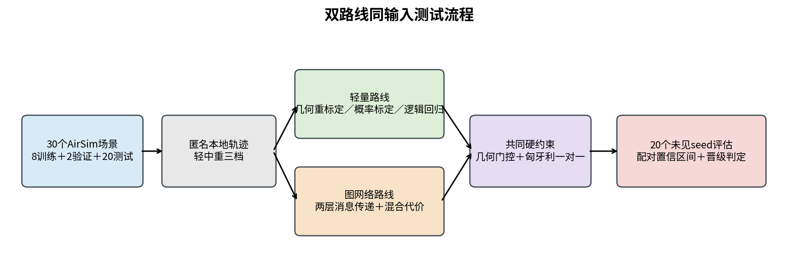
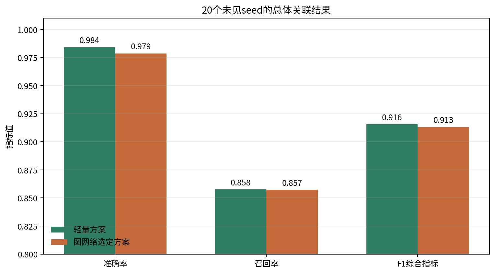
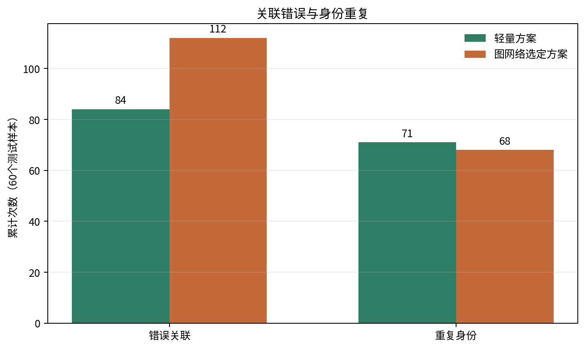
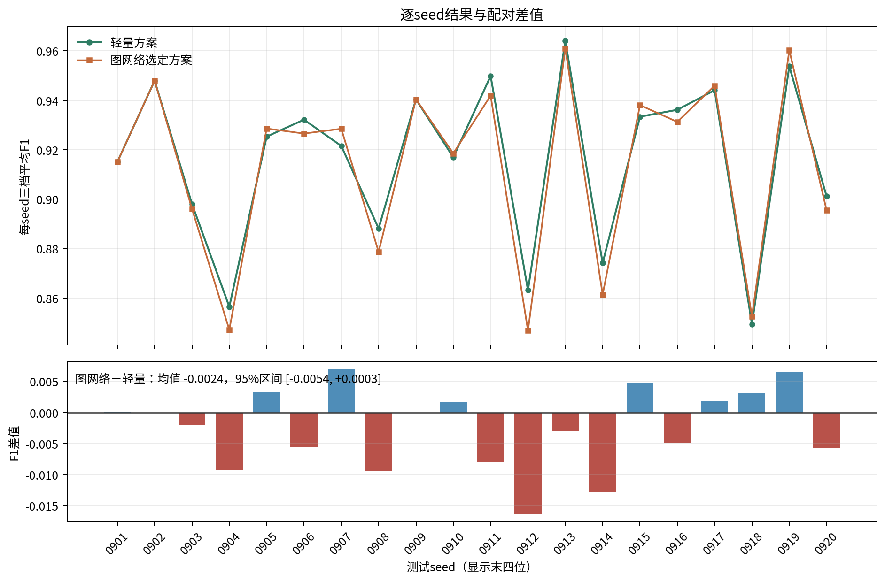
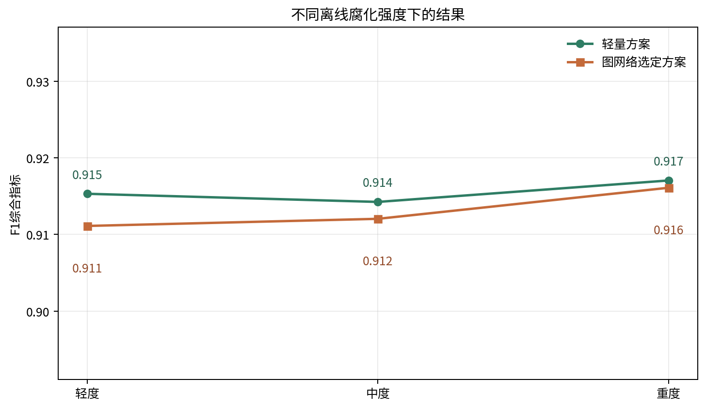

# 双站光电100目标轻量方案与图网络对比试验

## 结论

本轮不建议用图神经网络替换轻量方案。20个未见AirSim seed、60个离线腐化测试样本中，轻量方案F1为0.9155，图网络验证集选定方案F1为0.9131。图网络相对轻量方案的配对F1差值为-0.0024，95%置信区间为[-0.0054, +0.0003]，没有形成稳定正收益。

图网络累计错误关联112次，轻量方案为84次。图网络重复身份68次，轻量方案为71次。图网络只在重复身份一项减少3次，未满足F1提高、置信区间和误配不增加三项条件。当前推荐保留“几何硬门控＋非负几何权重重标定＋匈牙利一对一分配”。

## 试验设置

本轮只测试2公里双站、100目标场景，没有运行4公里100目标案例，也不涉及D1至D7。两台光电节点采用ComputerVision模式，间距2公里；目标长度3米、速度50米每秒，观测12秒。相机分辨率1280×1024，水平视场角2.93度，方位扫描范围正负45度，扫描周期1秒，AirSim时钟倍率0.1。

训练集使用20260820至20260827共8个seed，验证集使用20260828和20260829共2个seed。测试集使用20260901至20260920共20个新增seed。main在一次Blocks启动中顺序运行20个episode，episode之间重置场景；20/20个episode均形成完整记录和指标，没有保存截图。原始确定性基线有1个episode通过自身严格门限，另有19个返回码为2，表示基线门限未通过，不表示AirSim运行失败。本报告的轻量方案和图网络指标均在原始记录冻结后重新计算。

每个AirSim记录离线生成轻、中、重三档漏检与虚警输入。测试集共60个样本。三档样本来自同一AirSim seed，置信区间按20个完整seed成组抽样，不能按60个独立场景解释。在线图不包含真实身份、Actor名称和真实三维位置，真值只用于训练标签和冻结后的离线评分。

数据集指纹为`79eb679594c836376a386925f00f2e4e0a9b423edb4335f7fc774cee6d83e8a8`，候选图指纹为`8f1fa831f766c07f7fb99fffdf7c471c16bde5844534a150fdc064110d3e8b40`。两条路线的候选节点、候选边、几何代价和样本顺序完全一致。

## 算法路线

轻量智能体比较了非负几何权重重标定、Platt概率标定、单调概率标定和五组二范数逻辑回归。训练集拟合后，验证集从56组模型与门限组合中选中非负几何权重重标定，概率门限为0.8。该方法重新分配共面性、重投影、运动一致性和时间重叠等八项几何证据的权重，不改变候选硬门控。

图网络采用两层消息传递、64维隐藏特征和固定训练参数。验证集选中0.4概率门限，以及40%几何代价和60%学习代价组成的混合路线。网络只对通过几何硬门控的候选边评分，最终关系仍由匈牙利算法给出，低证据候选可以保持未匹配。

## 指标结果

| 方法 | 准确率 | 召回率 | F1 | 错误关联 | 重复身份 |
| --- | ---: | ---: | ---: | ---: | ---: |
| 轻量方案 | 0.9841 | 0.8575 | 0.9155 | 84 | 71 |
| 图网络选定方案 | 0.9786 | 0.8572 | 0.9131 | 112 | 68 |

轻量方案准确率高0.0055，召回率高0.0003，F1高0.0024。二者召回率接近，主要差别来自图网络多产生28次错误关联。逐seed差值有正有负，整体置信区间跨过0，当前样本不能证明图网络有稳定收益。

## 时延

轻量模型中央处理器评分95%分位为0.090毫秒，匈牙利求解95%分位为1.598毫秒。图网络中央处理器和图形处理器推理95%分位分别为1.754毫秒和0.784毫秒。两条路线的评分时延都满足本轮100毫秒判据，时延不是本轮选型的限制因素。

## 判定

| 图网络晋级条件 | 结果 |
| --- | --- |
| F1相对轻量方案提高不少于0.02 | 未通过，实际-0.0024 |
| 配对F1置信区间下限大于0 | 未通过，下限-0.0054 |
| 错误关联不增加 | 未通过，图网络多28次 |
| 重复身份不增加 | 通过，图网络少3次 |
| 图形处理器推理95%分位不超过100毫秒 | 通过，实际0.784毫秒 |

判定状态为`promotion_not_passed`。该状态只针对当前2公里、100目标、离线腐化条件。结果不证明图网络在真实探测器误差、不同目标外形或其他扫描几何下无效，但现有证据不足以承担主线替换成本。

## 后续工作

1. 以轻量方案作为本独立试验的默认对照，保留图网络代码和冻结模型，不并入D1至D7在线链路。
2. 后续取得真实探测器漏检、虚警和框中心抖动日志后，使用同一冻结协议重新比较。当前离线腐化不能代替真实误差分布。
3. 若继续研究图网络，先验证其相对重新标定几何代价的独立收益，不再只与未标定原始几何代价比较。
4. 在线应用前还需把episode结束后的批处理改为因果增量处理，并测量完整候选更新、评分和分配周期。

## 文件索引

- AirSim批次：`research_modules/independent_experiments/dual_optical_100target_gnn/outputs/raw_airsim_expanded_20260901_20260920/batch_summary.json`
- 统一数据集：`research_modules/independent_experiments/dual_optical_100target_gnn/outputs/formal_expanded_20260820_20260920_run01/dataset/dataset_manifest.json`
- 轻量评估：`research_modules/independent_experiments/dual_optical_100target_lightweight/outputs/formal_expanded_20260820_20260920_run01/evaluation/`
- 图网络评估：`research_modules/independent_experiments/dual_optical_100target_gnn/outputs/formal_expanded_20260820_20260920_run01/evaluation/`
- 正式比较：`research_modules/independent_experiments/dual_optical_100target_gnn/outputs/formal_expanded_20260820_20260920_run01/evaluation/promotion_comparison.json`
