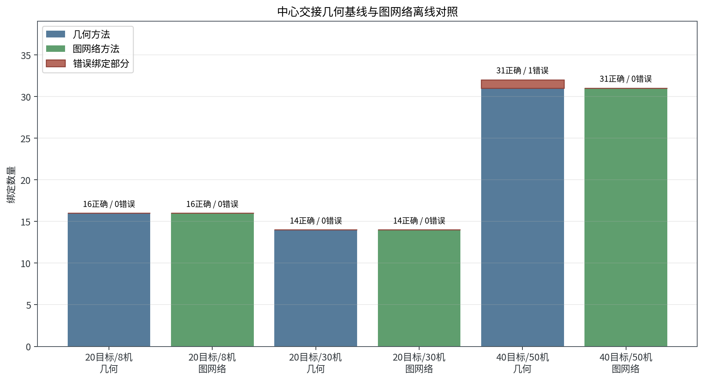
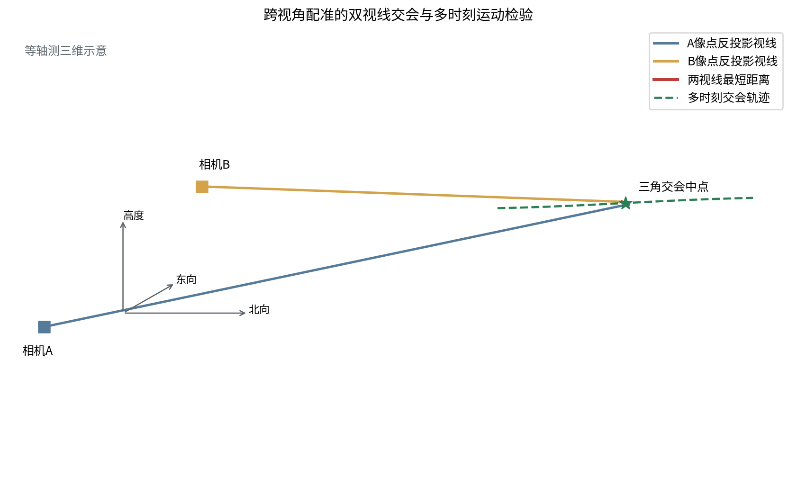
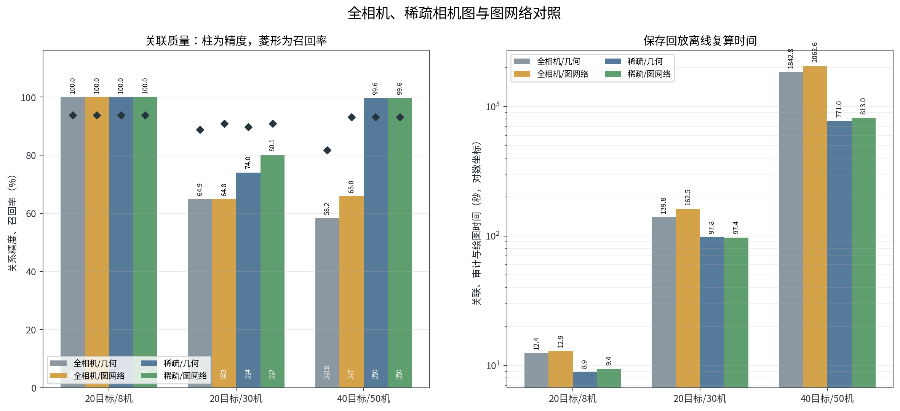

# 20目标/8机、20目标/30机与40目标/50机AirSim试验报告

## 1. 结论

三组试验分别验证资源不足、资源充足和目标与资源同步扩大的情况。搜索层的结果与资源容量直接相关。20目标/8机在三轮内最多执行24次唯一分配，低于28个搜索单元，因此只覆盖24个单元，连续确认19个目标，并补获中心漏掉的3个目标。20目标/30机和40目标/50机覆盖全部搜索单元，所有目标达到10像素门限并完成连续确认，中心漏掉的4个和8个目标全部补获。

中心交接的几何基线在三组回放中得到16、14和31条正确绑定，前两组没有错误绑定，40目标/50机有1条错误绑定。图神经网络对照保持正确绑定数量不变，并消除了40目标/50机的这1条错误绑定。该改进只来自一个AirSim种子，暂不足以替换确定性几何基线。

跨视角配准中，限制相机比较范围是本轮最有效的规模改进。责任区和视场筛选把40目标/50机候选边从1,104,646条降到375,236条，减少66.0%；稀疏几何方法的关系精度由0.5824提高到0.9960，身份混合由18个降到0。20目标/30机的稀疏图神经网络把关系精度从0.7402提高到0.8008、召回率从0.8967提高到0.9078，并把身份混合从4个降到2个。40目标/50机的稀疏图神经网络没有继续改善质量，复算时间反而增加5.4%。

当前默认路径采用责任区/视场稀疏相机图、几何门控和匈牙利一一匹配。图神经网络保留为离线可选对照。三组结果来自同一随机种子20260816，是功能与规模压力证据，不是统计意义上的性能定型。搜索、中心交接和机间配准在一次Blocks进程中按reset分段运行；图神经网络对照复用保存的AirSim观测离线计算，没有重新运行Blocks。

## 2. 试验范围

| 项目 | 设置 |
| --- | --- |
| 仿真模式 | AirSim ComputerVision |
| 目标与资源 | 20目标/8机、20目标/30机、40目标/50机 |
| 运行方式 | 一个Blocks进程，搜索、中心交接和跨视角专项之间reset |
| 目标 | 无人机静态网格模型作为Actor，以50米/秒移动，最长尺寸3米 |
| 场景时长与步长 | 18秒，状态步长0.1秒，ClockSpeed=0.1 |
| 中心相机 | 2台，1280×1024，水平视场角3.67度 |
| 机载相机 | 1920×1080，水平视场角19度，相机前移0.5米 |
| 搜索观察距离 | 距搜索单元中心标称700米 |
| 中心线索 | 固定构造精度80%、召回率80%的线索集合 |
| 检测输入 | AirSim simGetDetections检测框，在线立即去除Actor名称 |
| 识别门限 | 检测框最长边不小于10像素，连续2帧确认 |
| 关联主线 | 责任区/视场稀疏相机图、确定性几何门控、匈牙利一一匹配、连续确认 |
| 学习对照 | 合成数据训练图神经网络，只在几何白名单内修正代价，不进入默认在线路径 |
| 回放方式 | 保存AirSim匿名观测离线复算；seed 20260816不参与模型训练 |
| 随机种子 | 20260816，三组均为单次运行 |

本试验没有验证真实探测器、导航误差、通信丢包、飞行动力学和物理拦截。Actor名称和真实目标编号只进入运行结束后的离线评分。搜索、几何关联和图神经网络回放只读取匿名检测框、时间戳、相机位姿、相机参数和局部航迹。

## 3. 总体流程


计算链路分为三段。第一段根据不完整中心线索构造概率区域，再把机载相机分配到线索单元和空白单元。第二段将中心线索按图像时刻外推并投到机载相机像面，与匿名局部航迹建立一一绑定。第三段先按责任区和视场保留可能共同观测的相机对，再根据检测框、位姿和时间恢复跨视角的同目标关系。几何方法始终负责候选白名单和安全门控；图神经网络只对通过白名单的候选修正匹配代价。

每个专项都保留在线数据与离线真值的边界。AirSim返回的Actor名称在适配器入口被转存到离线标签，算法收到的是重新编号的检测和局部航迹。模型训练只使用独立生成的合成样本，留出seed 20260816从未进入训练。离线评分阶段再用Actor名称核对正确关系、错误关系和身份混合。本轮18组几何/图网络回放的真值泄漏计数均为0。

## 4. 协同搜索与资源分配

### 4.1 80%精度和80%召回率的数量关系

设真实目标数为N，正确中心线索数为T，全部中心线索数为S。召回率为T/N=0.8，精度为T/S=0.8，因此：

```text
正确线索 T = 0.8N
全部线索 S = T / 0.8 = N
错误线索 F = S - T = 0.2N
中心漏掉目标 M = N - T = 0.2N
```

这组构造同时保留错误线索和漏检目标。中心给出的每条线索只说明某个区域可能有目标，不能直接当作已经确认的目标身份。正确线索和错误线索都会生成线索搜索单元；中心漏掉的目标没有对应线索，只能依靠来袭走廊中的空白搜索单元补获。空白搜索单元数取 `max(5, ceil(0.4N))`，总搜索单元数为 `S + 空白单元数`。

搜索单元按两步形成。第一步把线索位置从测量时刻推到本轮规划时刻，关系式为 `p(t)=p0+vΔt`。第二步根据位置协方差确定搜索范围，三个方向的半宽取 `max(30米, 3sqrt(P_ii))`。本轮线索位置标准差为1米，三倍标准差只有3米，因此实际采用30米下限，防止把搜索范围压成一个过小点位。每个线索单元保留候选中心航迹编号，但该编号只用于后续尝试交接，不会因一次发现就直接绑定。

没有线索约束的空白单元铺在北向2500至3500米、东向-650至650米、高度-220至-70米的来袭走廊内。空白单元概率取0.32。它的作用是给中心漏检目标保留搜索机会，不表示该单元已经发现目标。规划时，线索单元与空白单元进入同一个收益矩阵，由资源数量和当前收益共同决定先看哪里。

| 目标规模 | 正确线索 | 错误线索 | 中心漏掉 | 全部线索 | 空白单元 | 总搜索单元 |
| --- | ---: | ---: | ---: | ---: | ---: | ---: |
| 20目标/8机 | 16 | 4 | 4 | 20 | 8 | 28 |
| 20目标/30机 | 16 | 4 | 4 | 20 | 8 | 28 |
| 40目标/50机 | 32 | 8 | 8 | 40 | 16 | 56 |

### 4.2 搜索容量与滚动分配

滚动分配每轮接收三类输入：可用相机的位置和姿态、全部有效搜索单元、各单元已有覆盖次数和上次覆盖时间。若有M台可用相机、K个有效搜索单元，先建立M×K的收益矩阵。矩阵第i行第j列表示第i台相机在本轮搜索第j个单元的收益。当前确定性收益为：

```text
U = 3p + 4G - 0.8C_slew - 1.0C_arrival - 4C_repeat
G = p × V × Q
```

这条式子先奖励目标概率和预期发现收益，再扣除转动、到达和重复观察代价。`p`是单元目标概率。`V`是按相机水平视场宽度与区域宽度计算的可见程度，限制在0.2至1.0。`Q=1/(1+n)`表示新颖度，`n`是该单元已经被覆盖的次数。`C_slew`由当前姿态到目标姿态的偏航、俯仰变化得到，最大记为1.5。`C_arrival`由相机到观察位置的距离除以3000米得到，最大记为1.5。`C_repeat=n/(1+Δt/2)`压低刚刚看过的单元，其中`Δt`是距上次观察的时间。这样可以优先安排高概率、容易看全且近期没有看过的单元。

19度水平视场角在700米观察距离上的名义覆盖宽度为 `2×700×tan(19°/2)≈234.3米`。规划器以该宽度除以搜索单元东向宽度得到`V`。因此，面积较大的空白单元会得到较低的单次可见程度，并通过后续复访补齐。

为了同时解决全部相机之间的占用冲突，规划器在收益矩阵右侧增加M个空闲列，形成M×(K+M)矩阵。空闲收益为-0.05。矩阵取负后交给匈牙利算法一次求解；每一行只能选一列，因此每台相机本轮最多承担一个单元，每个真实单元也最多分给一台相机。当某台相机对剩余单元的收益都低于空闲收益时，它保持空闲，避免为凑满矩阵而重复搜索低价值单元。

匹配完成后，系统把单元中心前方700米处作为观察位置，并由观察位置指向单元中心，计算相机偏航和俯仰。相机到位后连续读取3帧检测结果。该轮结束时，无论是否发现目标，都把已执行的单元记为完成一次覆盖，并记录覆盖时间；下一轮的重复代价会优先把资源让给尚未覆盖的单元。随着间隔时间增加，重复代价逐步下降，原单元仍可再次进入分配。当前实现不会根据一次未发现自动提高邻区概率，也不会凭空生成目标航迹；没有形成连续确认的单元只保留覆盖记录，不产生交接记录。

三组均执行3轮分配，理论槽位为 `3×资源数`。20目标/8机只有24个槽位，少于28个单元，因此即使没有重复分配也至少留下4个单元。20目标/30机首轮即可覆盖28个单元。40目标/50机首轮最多覆盖50个单元，第二轮可以补齐剩余6个。实际分配次数高于唯一覆盖数的部分是后续复访。


| 场景 | 分配矩阵规模 | 三轮容量 | 实际分配 | 唯一覆盖 | 未覆盖 | 重复覆盖率 |
| --- | ---: | ---: | ---: | ---: | ---: | ---: |
| 20目标/8机 | 8×(28+8) | 24 | 24 | 24 | 4 | 0.0% |
| 20目标/30机 | 30×(28+30) | 90 | 44 | 28 | 0 | 36.4% |
| 40目标/50机 | 50×(56+50) | 150 | 88 | 56 | 0 | 36.4% |

### 4.3 像素门限、局部航迹和连续复访

机载相机焦距的像素表达为 `f_x=W/[2tan(FOV/2)]`。代入1920像素和19度水平视场角，得到 `f_x≈5736.7像素`。目标垂直于视线、可见尺寸为3米、距离700米时，理想成像尺寸约为 `5736.7×3/700≈24.6像素`。按10像素门限反算的理想最大距离约为1721米。这个计算只用于解释门限量级；Actor姿态、网格外形、遮挡和相机夹角会改变实际检测框，因此运行时仍以AirSim返回的检测框为准。

每个已分配单元连续观察3帧，帧间隔0.1秒。检测框最长边达到10像素后记为可识别。相机在同一搜索单元内使用检测框中心距离建立匿名局部航迹：先计算当前检测与上一帧局部航迹之间的像素距离，超过180像素的组合直接排除，其余组合再用匈牙利算法一一连接。这个局部过程只为判断连续性，不读取Actor名称。

同一局部航迹连续2帧达到10像素门限后才生成确认记录。3帧观察提供三次检测机会，但确认所需的两帧必须相邻；中间漏掉一帧不能把前后两次检测直接拼成连续确认。若本轮只有一次达到门限、检测框小于10像素或始终没有检测，系统不生成交接记录。该单元仍计入已观察范围，并按上一节的滚动规则在后续轮次参与复访。


| 指标 | 20目标/8机 | 20目标/30机 | 40目标/50机 |
| --- | ---: | ---: | ---: |
| 搜索单元覆盖 | 24/28 | 28/28 | 56/56 |
| 达到10像素的目标 | 20/20 | 20/20 | 40/40 |
| 连续确认目标 | 19/20 | 20/20 | 40/40 |
| 中心漏检补获 | 3/4 | 4/4 | 8/8 |
| 匿名检测记录 | 197 | 355 | 1378 |
| 低于10像素检测 | 2 | 3 | 8 |
| 规划平均耗时 | 2.758毫秒 | 11.739毫秒 | 35.753毫秒 |
| 规划最大耗时 | 3.090毫秒 | 12.283毫秒 | 36.325毫秒 |

20目标/8机虽然20个目标都至少一次达到10像素，但只有19个通过连续确认。这说明“看见过”与“形成可交接航迹”是两个指标。资源不足首先表现为单元覆盖不完整，其次表现为重访和连续确认机会减少。20目标/30机和40目标/50机均完成全部目标确认，搜索规划平均耗时分别为11.739毫秒和35.753毫秒，单次计算仍低于40毫秒。该耗时不包含相机移动、AirSim接口等待和跨视角关联。

## 5. 中心节点与拦截无人机关联

### 5.1 状态外推与坐标转换

中心线索和机载局部航迹不在同一种坐标中，也不一定在同一时刻。前者给出北东地坐标中的位置、速度和不确定范围，后者给出图像中的检测框中心。关联计算先回答“中心线索在这张图上应该出现在哪里”，再判断实际局部航迹是否落在预测范围内。

中心线索包含位置、速度、测量时刻、到达时刻、有效期和6×6协方差。状态写成 `x=[p,v]`。图像时刻与线索测量时刻之差为 `Δt`，先按匀速模型把线索推到图像时刻：

```text
x(t) = F x0
F = [[I, Δt·I], [0, I]]
P(t) = F P0 F^T + Q
```

`Q`表示外推期间可能发生的机动。本试验按白噪声加速度模型构造，加速度标准差为0.5米/秒²。位置块为 `qΔt⁴/4`，位置与速度交叉块为 `qΔt³/2`，速度块为 `qΔt²`，其中 `q=0.5²`。外推时间越长，协方差越大，后续在图像上的允许搜索椭圆也随之扩大；这可以避免用过窄门限拒绝较旧线索，同时会增加错误候选，因此还需要运动门控和一一匹配。

外推位置先减去相机位置，得到目标相对相机的三维向量，再按机体姿态、云台姿态和相机安装关系转入相机坐标 `(x_c,y_c,z_c)`。本试验每帧读取AirSim返回的最终相机位置和姿态，不沿用初始设置值。AirSim相机的x轴朝前、y轴朝图像右侧、z轴朝下，针孔投影为：

```text
u = c_x + f_x · y_c / x_c
v = c_y + f_y · z_c / x_c
```

相机位于机体前方0.5米。式中的 `f_x、f_y` 是像素焦距，`c_x、c_y` 是图像中心。若 `x_c≤0` 或预测点落在图像外，该候选直接排除。投影雅可比矩阵记为J，线索位置协方差投到像面后，与投影噪声和局部检测中心噪声相加：

```text
S = J P_pos J^T + R_projection + R_local
d² = (z - z_hat)^T S^-1 (z - z_hat)
```


### 5.2 门控、代价矩阵和多帧确认

上式中的 `z-z_hat` 是实际检测中心与预测像点的偏差，`S` 是这项偏差的允许范围。马氏距离 `d²` 会同时考虑横向、纵向误差及其协方差，比固定像素半径更适合处理新旧程度不同的线索。候选关系必须同时满足五个条件：局部检测框达到10像素；中心线索已经到达并处于有效期；预测点位于图像内；马氏距离平方不大于9.2103；有历史速度时，预测像面速度与局部像面速度差不大于80像素/秒。9.2103对应二维卡方分布约99%的门限，协方差大时允许更大的像素偏差，协方差小时门限自动收紧。

通过门控的候选进入代价矩阵。若有S条中心线索、L条局部航迹，矩阵先建立S×L个真实候选，再为每条中心线索增加一个专用未匹配列，最终为S×(L+S)。合格候选的几何代价为 `C_geo=d²+(运动残差/80)²`。已经确认的中心线索若切换到其他局部航迹，增加4.0的切换代价；未匹配虚拟项的代价为12.0。匈牙利算法在整个矩阵上一次选择，避免两条中心线索同时抢占同一条机载航迹。代价不优于未匹配项的候选保持未注册，不强行绑定。

一次矩阵求解只形成当帧选择。试验连续采集5帧，并保存每对关系最近3帧的选择记录；至少2帧选择同一关系后才正式确认。未达到条件的关系处于待确认状态，中心线索可以保持未匹配，机载局部航迹也可以保持未注册。该处理把偶然落入预测椭圆的目标挡在正式交接之前。

图神经网络对照不扩大候选范围，只处理已经通过时间、像面和运动硬门控的白名单。网络输出候选为同一目标的概率 `P_gnn`，再按下式修正几何代价，之后仍使用同一匈牙利匹配和多帧确认：

```text
C_final = C_geo - 2 log(P_gnn)
```

中心交接模型只使用合成数据训练，独立合成验证的边精度为0.9993，召回率为1.0000。AirSim seed 20260816是留出回放，没有参与训练。合成验证指标只说明模型学会了该合成分布，不能替代AirSim多seed检验。



| 场景 | 方法 | 正确绑定 | 错误绑定 | 绑定精度 | 绑定召回率 | 中位复算时间 |
| --- | --- | ---: | ---: | ---: | ---: | ---: |
| 20目标/8机 | 几何 | 16 | 0 | 1.0000 | 1.0000 | 2.391秒 |
| 20目标/8机 | 图网络 | 16 | 0 | 1.0000 | 1.0000 | 2.460秒 |
| 20目标/30机 | 几何 | 14 | 0 | 1.0000 | 0.8750 | 2.751秒 |
| 20目标/30机 | 图网络 | 14 | 0 | 1.0000 | 0.8750 | 2.882秒 |
| 40目标/50机 | 几何 | 31 | 1 | 0.9688 | 0.9688 | 15.819秒 |
| 40目标/50机 | 图网络 | 31 | 0 | 1.0000 | 0.9688 | 15.862秒 |

20目标/30机的绑定召回率低于20目标/8机，说明增加相机数量不会自动提高中心交接。三个专项在reset后独立采样，AirSim检测返回的局部航迹数量和连续性存在运行差异。40目标/50机的几何基线接受了1条落入预测区并连续通过门控的错误线索；图网络对照拒绝了该关系，同时保留31条正确绑定。单seed结果只证明该对照在这次回放中有效，尚不能说明它对其他目标几何和误差条件同样稳定。

## 6. 拦截无人机之间的关联

### 6.1 像点反投影和双视线交会

每台机先在本相机内把匿名检测框串成局部短航迹。机间关联不直接比较局部编号，因为不同相机必然使用不同编号；它比较两条局部航迹在多个时刻是否能够形成同一条三维运动。第一步把检测框中心 `(u,v)` 通过相机内参反投影为相机坐标中的单位视线：

```text
d_c = normalize([1, (u-c_x)/f_x, (v-c_y)/f_y])
d_n = normalize(R_n_c d_c)
```

`R_n_c`由每帧相机偏航、俯仰和横滚得到，`d_n`位于北东地坐标。两台相机的视线写成 `o_a+s d_a` 和 `o_b+t d_b`。算法求使两条视线距离最小的正深度 `s,t`，取两个最近点的中点作为该时刻的三角交会位置。两最近点距离是视线分离误差，两条视线夹角反映三角定位的几何强度。夹角太小时，即使像面误差很小，距离估计也会非常敏感。

令 `δ=o_b-o_a`、`c=d_a·d_b`、`D=1-c²`。两条视线不平行时，最近点深度按下式计算：

```text
s = [δ·d_a - c(δ·d_b)] / D
t = [c(δ·d_a) - δ·d_b] / D
q_a = o_a + s d_a,  q_b = o_b + t d_b
q_mid = (q_a + q_b)/2,  e_sep = ||q_a-q_b||
```



不同相机的检测不要求完全同一时刻。算法先把两条局部航迹按时间排序，在0.16秒内插值或选取最近观测，得到成对样本。每一对样本按上式求一次视线交会；至少积累3个有效交会样本，再对交会中点随时间做直线拟合。拟合均方根误差用于判断这些点能否组成连续运动，分段方向与总方向的最大夹角用于排除运动方向明显矛盾的候选。单帧视线偶然靠近不能直接形成跨视角关系。

### 6.2 几何门控与关系代价

| 检查项 | 门限 | 作用 |
| --- | ---: | --- |
| 图像识别 | 最长边≥10像素 | 排除尺寸不足的检测 |
| 时间对齐 | ≤0.16秒 | 限制插值和最近观测时间差 |
| 航迹交接间隔 | ≤0.65秒 | 排除长时间未更新的局部航迹 |
| 有效几何样本 | ≥3个 | 避免单帧偶然交会 |
| 视线夹角 | ≥0.35度 | 排除近似平行视线 |
| 视线分离 | ≤2米 | 要求两条视线在空间接近 |
| 重投影误差 | ≤8像素 | 核对交会点回到两幅图像的位置 |
| 运动拟合误差 | ≤5米 | 排除不连续的三维运动 |
| 运动转角 | ≤55度 | 排除方向明显矛盾 |
| 尺度对数差 | ≤0.28 | 核对框尺寸与估计距离是否相容 |

硬门控先回答候选是否具备基本物理可能性。通过后再计算相对好坏，几何代价由7项归一化误差加权得到：

```text
C_geo = 0.24C_sep + 0.20C_reproj + 0.10C_time
      + 0.18C_motion + 0.12C_turn + 0.08C_scale + 0.08C_conf
```

`C_sep`衡量两条视线在空间中的分离，`C_reproj`衡量交会点投回两幅图像后的偏差，`C_time`衡量时间错位，`C_motion`和`C_turn`衡量三维运动连续性，`C_scale`核对检测框大小与距离变化，`C_conf`表示相机标定可信度。每项除以对应门限并封顶为3，代价越小越可能属于同一目标。几何基线直接使用 `C_geo`。图神经网络对照只在硬门控通过后计算同目标概率 `P_gnn`，并按下式融合，不允许网络放回几何已经拒绝的候选：

```text
C_final = 0.55 C_geo + 0.45(1 - P_gnn)
```

对每一对保留相机，算法以相机A的局部航迹为行、相机B的局部航迹为列建立代价矩阵，并给每条航迹增加代价1.05的未匹配选项。匈牙利算法在该相机对内做一一匹配，防止同一时刻一条航迹同时对应多个目标。最近3帧中至少2次选中同一关系后，关系才由待确认转为确认。

确认关系随后合并为跨相机目标簇。目标簇可以理解为“多台相机对同一目标的局部航迹集合”。合并时执行三项约束：同一目标簇不允许出现同一相机的两条航迹；两个已经成熟的目标簇至少要有两个不同相机对共同支持才能合并；只有2帧的短航迹必须得到同一成熟簇内至少两台相机支持。几何和图网络只负责给出局部边，目标簇约束负责阻止一条错误边沿整个相机网络扩散。

跨视角模型只使用合成数据训练，独立合成验证的边精度为0.9914，召回率为1.0000。该指标用于确认模型和特征链路可运行，AirSim回放结果才用于判断它是否给现有几何方法带来增益。

### 6.3 候选规模计算

若直接让所有相机两两比较，候选数量会随相机数和局部航迹数快速增长。全相机策略在每个时刻比较所有活动相机对。若第i台相机有 `m_i` 条活动局部航迹，第j台有 `m_j` 条，单个时刻的候选数量近似为：

```text
E_frame = Σ(i<j) m_i m_j
相机对数量 = M(M-1)/2
```

候选会在多个时刻随着航迹历史重新计算，因此最终记录数还要乘以有效时间步数。8、30、50台相机分别有28、435、1225个全量相机对。全相机策略用于压力诊断，不作为当前默认路径。

责任区/视场稀疏策略把相机看作节点，把可能共同看到目标的相机对看作边。它在生成航迹候选前先筛相机对：同一搜索责任区的相机对直接保留；相邻责任区只有在某个共同观测帧内视锥重叠时才保留，计算视锥时增加5度余量；不相邻责任区直接排除。筛选只读取相机责任区、相机内参和观测计划中的姿态，不读取Actor名称或目标真值。这个步骤把明显没有共同观测条件的相机对挡在精细几何计算之前，再在保留边上执行时间对齐、双视线交会、代价矩阵和目标簇合并。


| 场景 | 相机图 | 方法 | 保留相机对 | 候选边 | 正确 | 错误 | 漏配 | 精度 | 召回率 | 身份混合 | 复算时间/秒 |
| --- | --- | --- | ---: | ---: | ---: | ---: | ---: | ---: | ---: | ---: | ---: |
| 20目标/8机 | 全相机 | 几何 | 28 | 5778 | 30 | 0 | 2 | 1.0000 | 0.9375 | 0 | 12.43 |
| 20目标/8机 | 全相机 | 图网络 | 28 | 5778 | 30 | 0 | 2 | 1.0000 | 0.9375 | 0 | 12.95 |
| 20目标/8机 | 责任区/视场稀疏 | 几何 | 16 | 3296 | 30 | 0 | 2 | 1.0000 | 0.9375 | 0 | 8.87 |
| 20目标/8机 | 责任区/视场稀疏 | 图网络 | 16 | 3296 | 30 | 0 | 2 | 1.0000 | 0.9375 | 0 | 9.45 |
| 20目标/30机 | 全相机 | 几何 | 435 | 85847 | 558 | 302 | 71 | 0.6488 | 0.8871 | 5 | 139.78 |
| 20目标/30机 | 全相机 | 图网络 | 435 | 85847 | 571 | 310 | 58 | 0.6481 | 0.9078 | 3 | 162.48 |
| 20目标/30机 | 责任区/视场稀疏 | 几何 | 267 | 52635 | 564 | 198 | 65 | 0.7402 | 0.8967 | 4 | 97.82 |
| 20目标/30机 | 责任区/视场稀疏 | 图网络 | 267 | 52635 | 571 | 142 | 58 | 0.8008 | 0.9078 | 2 | 97.40 |
| 40目标/50机 | 全相机 | 几何 | 1225 | 1104646 | 3538 | 2537 | 794 | 0.5824 | 0.8167 | 18 | 1842.79 |
| 40目标/50机 | 全相机 | 图网络 | 1225 | 1104646 | 4031 | 2094 | 301 | 0.6581 | 0.9305 | 7 | 2062.61 |
| 40目标/50机 | 责任区/视场稀疏 | 几何 | 403 | 375236 | 4031 | 16 | 301 | 0.9960 | 0.9305 | 0 | 770.99 |
| 40目标/50机 | 责任区/视场稀疏 | 图网络 | 403 | 375236 | 4031 | 16 | 301 | 0.9960 | 0.9305 | 0 | 812.96 |

20目标/8机中，四种方法都得到30条正确关系、0条错误关系和2条漏配，精度1.0000、召回率0.9375。稀疏策略仍把相机对从28组减到16组，候选边从5778条减到3296条，说明小规模质量不变时也能减少无效计算。

20目标/30机中，稀疏几何相对全相机几何把错误关系从302条降到198条，精度从0.6488提高到0.7402。稀疏图网络进一步把错误关系降到142条、漏配降到58条，精度达到0.8008、召回率达到0.9078，身份混合由稀疏几何的4个降到2个。该规模下，稀疏相机图和学习评分都产生了可测增益。

40目标/50机中，全相机几何有2537条错误关系和18个身份混合。全相机图网络虽将精度提高到0.6581，仍保留2094条错误关系和7个身份混合，不能解决全局候选过密问题。责任区/视场筛选把相机对从1225组降到403组，候选边从1,104,646条降到375,236条。稀疏几何得到4031条正确关系、16条错误关系、301条漏配，精度0.9960、召回率0.9305且身份混合为0。稀疏图网络的质量完全相同，复算时间由770.99秒增至812.96秒。

关系精度按 `正确关系/(正确关系+错误关系)` 计算，召回率按 `正确关系/(正确关系+漏配关系)` 计算。一个目标簇内的跨相机成员会两两展开评分，因此正确与错误关系数可能大于直接确认边数。身份混合表示同一目标簇中出现多个离线真实目标，只在运行结束后统计。



## 7. 结果判断

### 7.1 搜索资源数量

20目标/8机处于明确的容量不足状态。按当前3轮计划，24个分配槽无法覆盖28个搜索单元。其结果是4个单元未覆盖、1个目标虽达到10像素但未连续确认、1个中心漏检目标未补获。20目标/30机已经跨过单轮全覆盖门槛。继续增加相机主要带来复访机会，对首次覆盖的帮助有限。40目标/50机需要第二轮补齐6个单元，仍能完成全部目标确认。

搜索规划耗时随矩阵扩大而增加。三组规划矩阵分别为8×36、30×58和50×106，矩阵元素规模约为288、1740和5300。平均规划耗时为2.758、11.739和35.753毫秒。该结果说明当前确定性搜索分配可以处理50机单次计算，但尚未包含通信排队、分布式状态更新和多seed最坏情况。

### 7.2 中心交接稳定性

三组中心线索精度和召回率完全相同，绑定结果没有随资源数量单调改善。几何基线在20目标/8机中绑定全部16条正确线索，在20目标/30机中漏掉2条正确绑定，在40目标/50机中漏1条并误接1条错误线索。中心交接图网络在前两组不改变结果，在40目标/50机中拒绝了这1条错误绑定。当前证据支持继续保留该学习对照，尚不支持替换几何白名单、匈牙利匹配和多帧确认。

### 7.3 跨视角规模限制

全相机策略在30机和50机规模下比较了大量没有共同观测条件的相机。几何门控虽然删除了多数候选，剩余伪关系仍会在目标簇内传递，形成身份混合。图神经网络直接用于全相机候选只能缓解问题，不能消除过密候选造成的错误连接。

责任区/视场相机图已经实现，并在三组保存回放中完成对照。它是本轮质量和计算量改善的主要来源，尤其在40目标/50机中将精度提高到0.9960并消除身份混合。图神经网络只适合处理稀疏图中通过硬几何门控后仍有歧义的候选。20目标/30机出现增益，40目标/50机的稀疏几何已经接近满精度，图网络没有继续改善且增加运行时间。因此默认路径保持稀疏几何和匈牙利匹配，图网络继续作为离线可选比较项。

## 8. 证据边界与后续工作

1. 三组AirSim观测使用同一随机种子20260816，每个规模只有一次正式采集。图神经网络使用独立合成数据训练，seed 20260816完全留出，只用于离线回放。当前数字不能给出置信区间或设备级成功概率。
2. 中心线索的精度80%、召回率80%和位置、速度误差由夹具固定生成。位置标准差为1米，速度标准差为0.2米/秒。本轮没有注入导航误差、云台姿态误差、时间同步偏差、相机标定漂移和检测误差。
3. 识别输入是AirSim检测元数据。10像素规则只验证接口和关联门限，不能代表真实可见光或红外识别器的准确率。图网络的合成验证精度和召回率也不能当作真实探测条件下的指标。
4. ComputerVision节点按指令改变位姿，不含飞行动力学。目标Actor按给定速度移动。本报告不评价拦截航迹、制导切换或5米物理拦截。
5. 离线基准共检查32项，通过31项。唯一未通过项要求40目标/50机稀疏图网络相对稀疏几何再提高5个百分点；稀疏几何精度已经达到0.9960，图网络结果相同，因此没有满足额外增益条件。
6. 报告中的复算时间包含关联计算、审计文件和结果图生成。20目标/8机重复5次，20目标/30机稀疏主路径重复3次；全相机压力组和40目标/50机只运行1次。40目标/50机的三个长时案例在同机不同逻辑核并发运行，时间不是独占处理器条件下的部署基准。
7. 跨视角审计输出模式已经实现。它只保存候选阶段计数、拒绝原因和有界样本，避免再次写出百万级完整候选。批量多seed仍需控制回放规模和磁盘占用。

## 9. 文件索引

- 20目标/8机总表：`airsim_n20_formal_v3_20260816/campaign_summary.json`
- 20目标/8机搜索指标：`airsim_n20_formal_v3_20260816/search/metrics.json`
- 20目标/8机中心交接指标：`airsim_n20_formal_v3_20260816/center_handover/metrics.json`
- 20目标/8机跨视角指标：`airsim_n20_formal_v3_20260816/crossview/metrics.json`
- 20目标/30机总表：`airsim_m30_n20_scale_20260816/campaign_summary.json`
- 20目标/30机搜索指标：`airsim_m30_n20_scale_20260816/search/metrics.json`
- 20目标/30机中心交接指标：`airsim_m30_n20_scale_20260816/center_handover/metrics.json`
- 20目标/30机跨视角指标：`airsim_m30_n20_scale_20260816/crossview/metrics.json`
- 40目标/50机总表：`airsim_m50_n40_scale_v2_20260816/campaign_summary.json`
- 40目标/50机搜索指标：`airsim_m50_n40_scale_v2_20260816/search/metrics.json`
- 40目标/50机中心交接指标：`airsim_m50_n40_scale_v2_20260816/center_handover/metrics.json`
- 40目标/50机跨视角指标：`airsim_m50_n40_scale_v2_20260816/crossview/metrics.json`
- 图表目录：`three_scale_report_figures/`
- 图网络离线基准总表：`gnn_offline_benchmark_20260816/benchmark_summary.json`
- 图网络离线基准专项报告：`gnn_offline_benchmark_20260816/GNN_OFFLINE_BENCHMARK_REPORT_CN.md`
- 名义焦距计算：`f_x=5736.7像素`，700米处3米目标约`24.6像素`，10像素名义距离约`1721米`。
