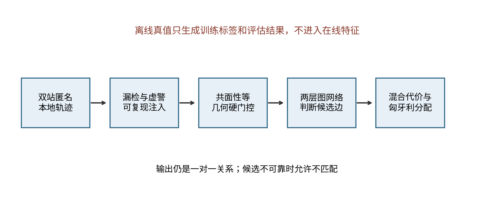
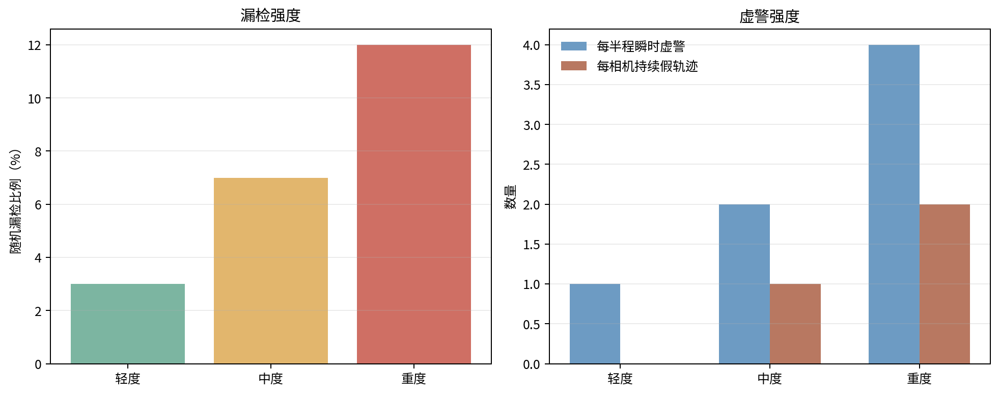
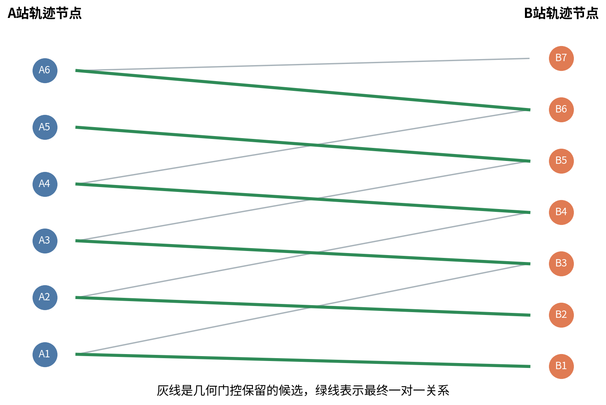
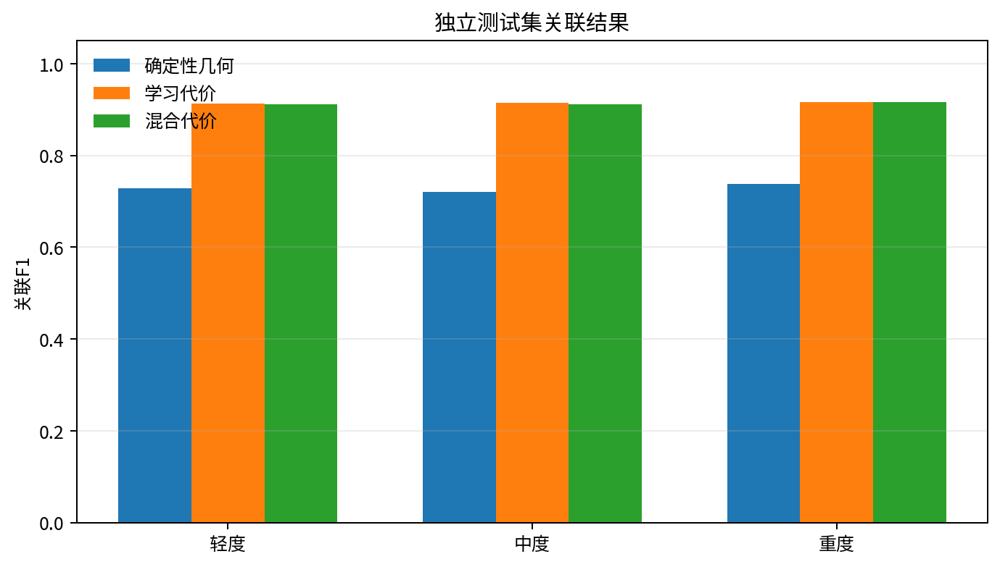
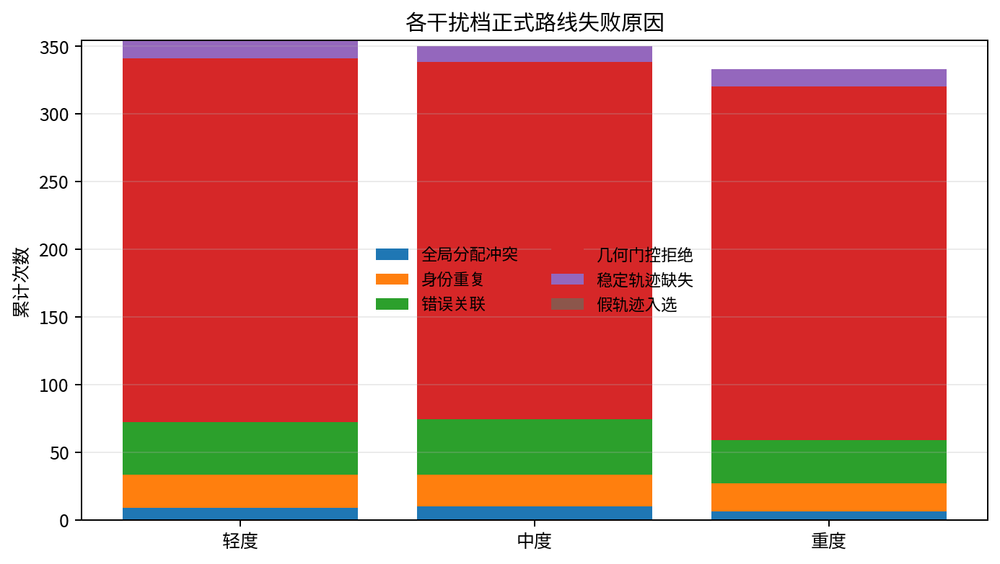
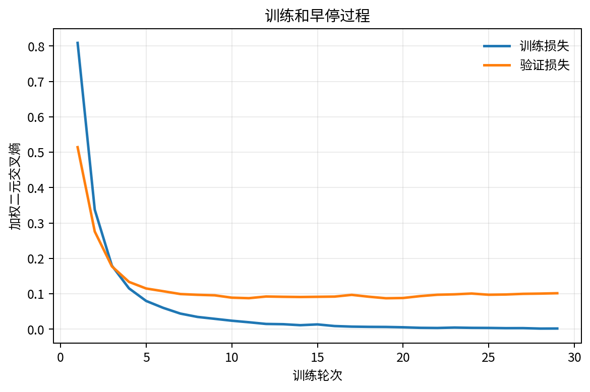
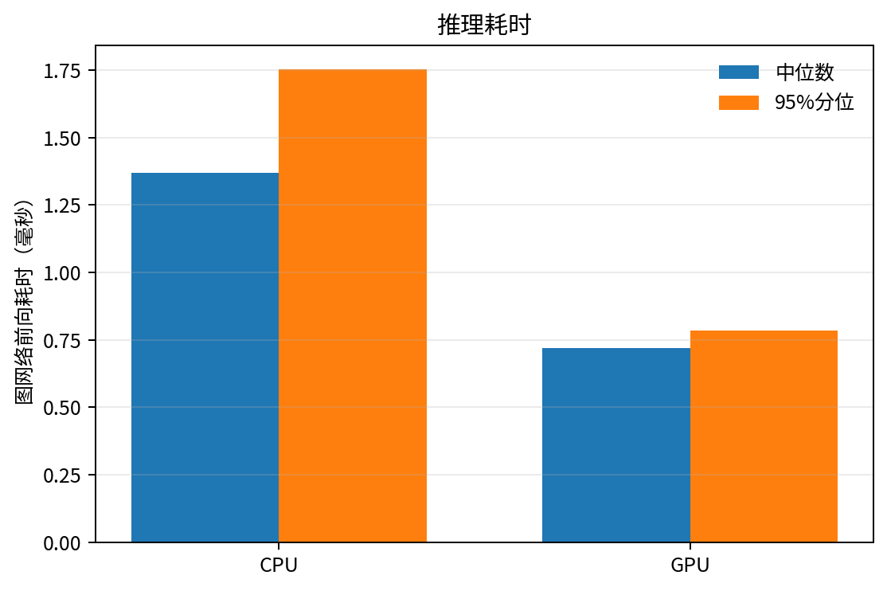
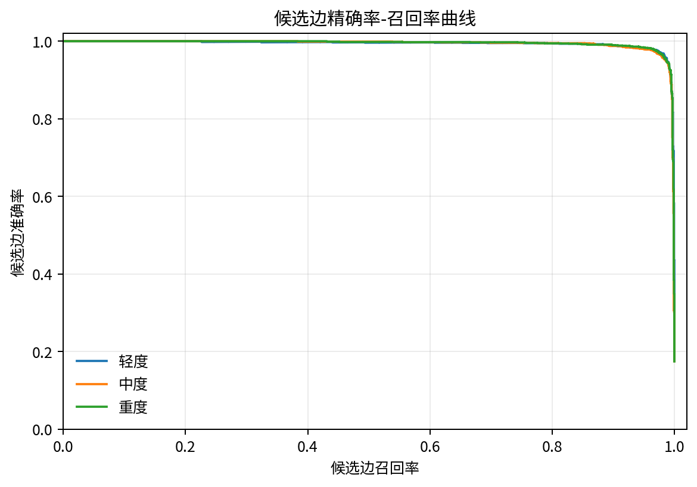

# 双站光电100目标图网络扩展正式结果

## 文档定位

本文保留2026年8/2/20扩展协议的历史结果。它使用旧episode候选图和离线腐化，不是2026年8月13日完成的`formal_v2_24_6_20`在线正式结果。现行V2的9回合预检只执行早期止损；正式30-seed共享跟踪器标定从13个候选中冻结10米残差门、3个全局假设、0.99卡方置信度和0.1过程噪声配置，指纹为`867bdf...`。图网络随后在正式共享快照上执行五初始化。现行结果见《双站光电100目标图网络关联试验》。

## 结论

扩展正式评估已经完成。图网络混合路线在20个独立测试seed、60个轻中重腐化样本上的宏平均F1为0.9131，外部最佳轻量路线为0.9155。图网络没有取得统计上可靠的精度增益，错误关联也多于轻量路线，最终状态为`promotion_not_passed`。

当前不建议图网络替换轻量路线。图网络身份重复少3次，图形处理器推理时延满足预算，但这两项不足以抵消F1和错误关联结果。后续验证应先使用真实检测器输出形成漏检、虚警和轨迹混淆回放，再决定是否继续研究更小的学习模型。

## 评估范围

训练集使用随机种子编号20260820至20260827，共8个完整seed。验证集使用20260828和20260829，共2个完整seed。测试集使用20260901至20260920，共20个独立seed。每个测试seed包含轻、中、重三档腐化，合计60个样本。

训练程序只读取训练集和验证集。模型早停并写出权重、归一化器、数据指纹和冻结清单后，评估程序才读取保留测试集。测试seed与训练、验证seed不重叠，旧2-seed报告使用的20260830和20260831也没有进入本轮评估。

三档腐化是在AirSim回合保存完成后，对本地轨迹样本离线注入。它用于保证几何、纯学习和混合方案获得相同受扰输入，不代表AirSim检测函数或真实光电设备的误检分布。当前结论只适用于这套2公里、100目标和离线腐化条件。

## 算法约束

A站和B站匿名轨迹组成二部图。共面残差、时间重叠、重投影误差、交会角和条件数先执行几何硬门控。图网络只对通过门控的候选边输出同目标概率，不能恢复已被硬门控拒绝的边。

两层消息传递网络使用64维隐藏特征。最终关系仍由带未匹配项的匈牙利算法求解，保证一对一约束。验证集在0.3至0.9七个固定概率门限上比较纯学习和固定混合路线，选中40%几何代价加60%学习代价的混合路线。选中概率门限为0.4，转换后的未匹配代价为`-log(0.4)=0.9162907319`。

离线真实身份只用于训练标签和评估。网络输入不包含AirSim对象名称、真实身份或真实三维位置。

## 总体结果

候选边宏平均精确率-召回率曲线下面积为0.9937。验证集选中的混合路线在测试集上的宏平均精确率为0.9786，宏平均召回率为0.8572，宏平均F1为0.9131。

| 方法 | 宏平均P | 宏平均R | 宏平均F1 | 错误关联 | 身份重复 |
| --- | ---: | ---: | ---: | ---: | ---: |
| 确定性几何 | 0.7187006478 | 0.7391666667 | 0.7284324825 | 1762 | 46 |
| 纯学习代价 | 0.9824216183 | 0.8568333333 | 0.9145247499 | 92 | 71 |
| 正式混合代价 | 0.9785649415 | 0.8571666667 | 0.9130810060 | 112 | 68 |

轻、中、重三档的混合路线F1分别为0.9111、0.9120和0.9161。三档结果接近，没有出现随离线腐化等级单调下降的现象。这说明当前腐化强度还不能等同于真实检测难度，不能据此推断真实设备在重度漏检和虚警下的性能。

| 腐化档次 | 样本数 | 宏平均P | 宏平均R | 宏平均F1 | 错误关联 | 身份重复 |
| --- | ---: | ---: | ---: | ---: | ---: | ---: |
| 轻度 | 20 | 0.9777 | 0.8545 | 0.9111 | 39 | 24 |
| 中度 | 20 | 0.9764 | 0.8570 | 0.9120 | 41 | 23 |
| 重度 | 20 | 0.9815 | 0.8600 | 0.9161 | 32 | 21 |

模型训练29轮，最低验证损失出现在第19轮。图网络前向推理在当前设备上的中央处理器95%分位耗时为1.7541毫秒，图形处理器95%分位耗时为0.7842毫秒。时延结果受硬件、系统负载和批处理方式影响，不作为跨设备固定指标。

## 外部比较

外部比较在相同数据指纹、候选图指纹、测试seed和腐化档次下完成。外部最佳轻量路线宏平均F1为0.9155308429，错误关联84次，身份重复71次。图网络混合路线宏平均F1为0.9130810060，错误关联112次，身份重复68次。

图网络减轻量路线的F1差值为-0.0024498369。按完整seed成组执行5000次重采样后，95%置信区间为[-0.0053609150, 0.0002540586]。区间包含0，不能认定图网络优于轻量路线。

| 升级条件 | 结果 | 判定 |
| --- | --- | --- |
| F1至少提高0.02 | -0.0024498 | 未通过 |
| F1差值95%置信区间下限大于0 | -0.0053609 | 未通过 |
| 错误关联不增加 | 112比84 | 未通过 |
| 身份重复不增加 | 68比71 | 通过 |
| 图形处理器95%分位不超过100毫秒 | 0.7842毫秒 | 通过 |

五项条件中三项未通过，正式结论是不升级。轻量路线继续作为当前优先方案，图网络保留为独立研究对照。

## 证据边界

本轮数据来自AirSim匿名轨迹记录，但漏检和虚警是保存后的离线随机腐化，不是检测函数直接产生的错误。低纯度轨迹使用多数身份生成监督标签，可能把混合轨迹压缩为单一身份，从而引入标签噪声。

当前场景、双站基线、扫描周期、目标密度和门控参数保持固定。换用真实探测器、不同目标机动或不同相机参数后，结果需要重新验证。本轮没有修改网络结构、训练参数、几何门控和匈牙利求解，也没有把图网络接入D1至D7。

原扩展证据同步日期为2026年8月11日。正式评估产物保留原始指标、逐seed结果、候选指纹、训练记录和外部比较结果；本文只保留历史证据，不重新运行测试集。

2026年8月13日完成的现行V2保留测试宏平均F1为0.023833，宏平均精确率0.063845、召回率0.015028，错误关联135次，P95时延约2195.74毫秒。图网络虽然在现行三路线中排名第一，但不能达到工程使用要求。旧扩展F1为0.9131的结果不得用于替代现行V2结论。
