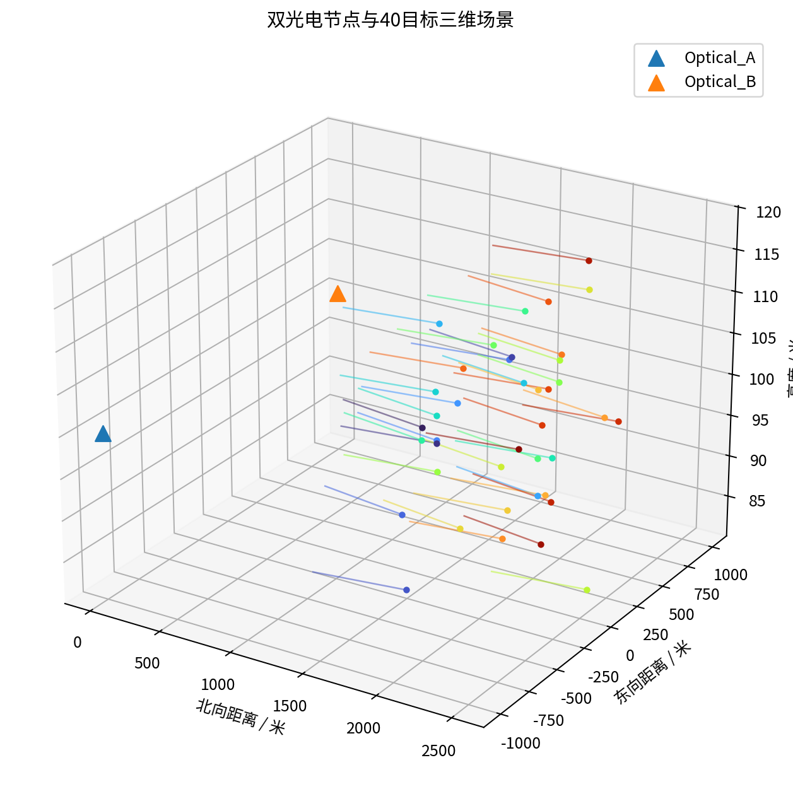
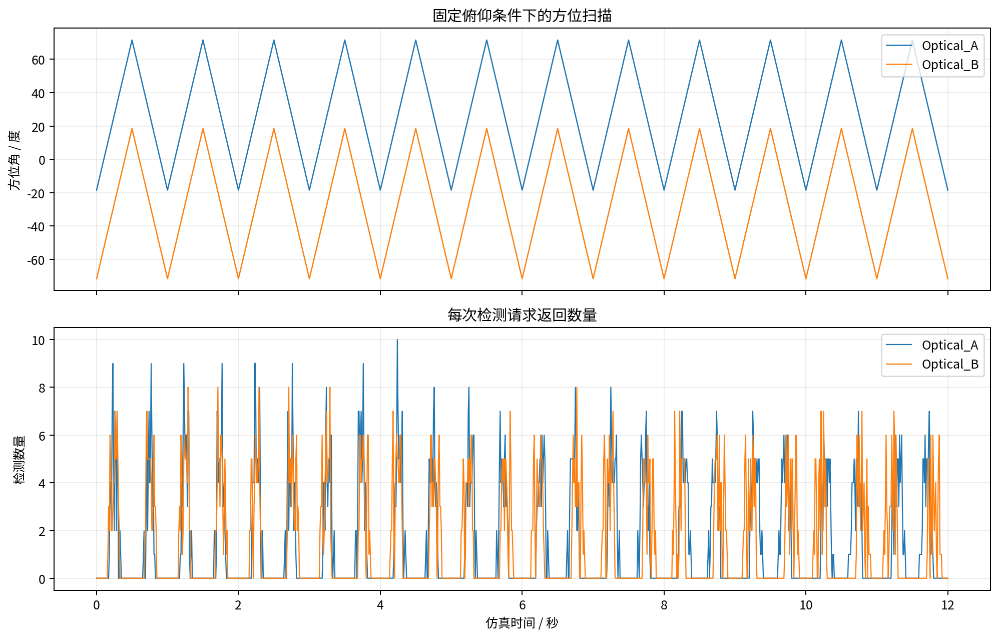
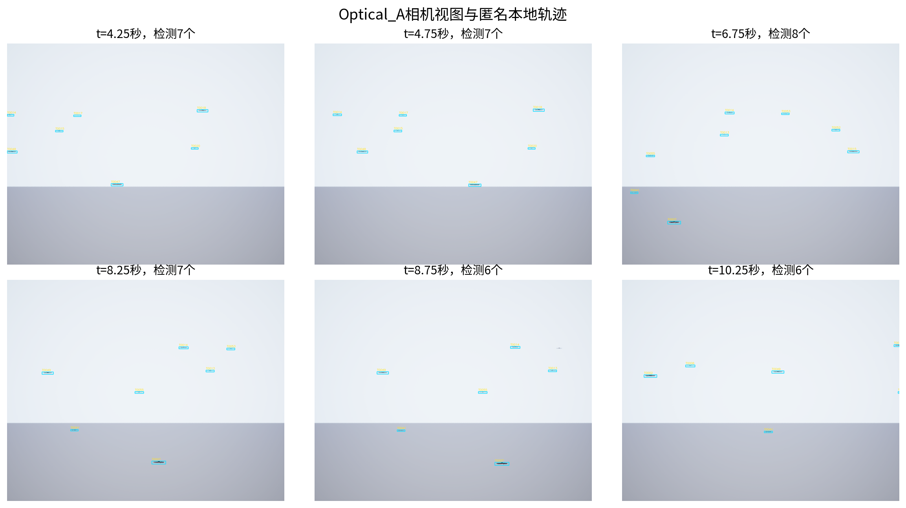
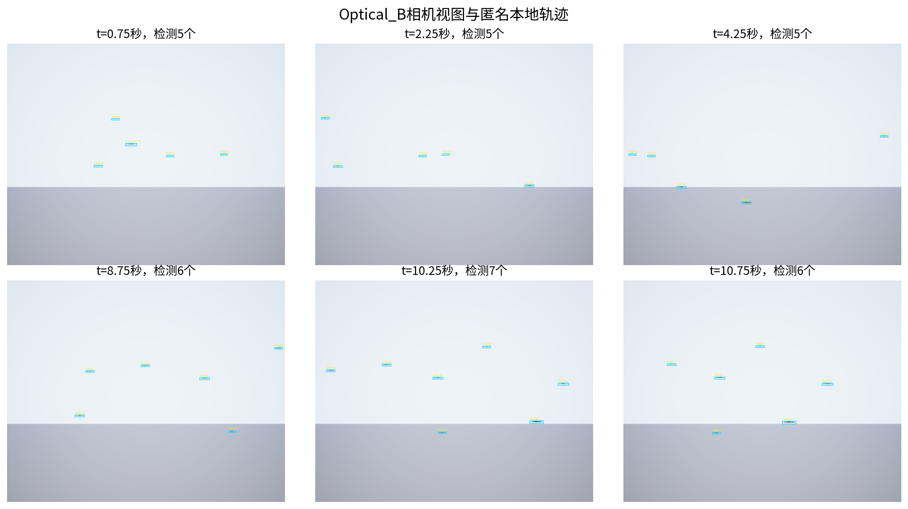
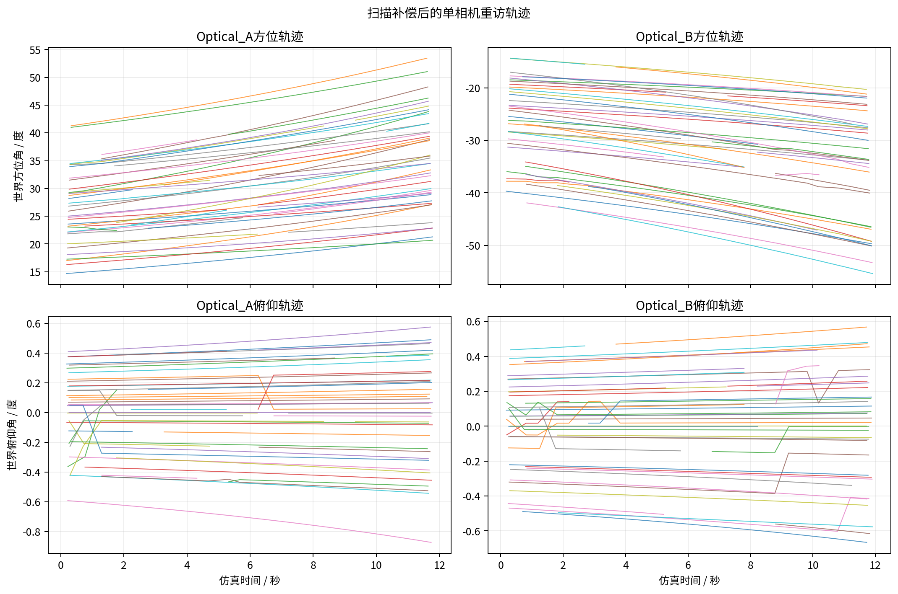
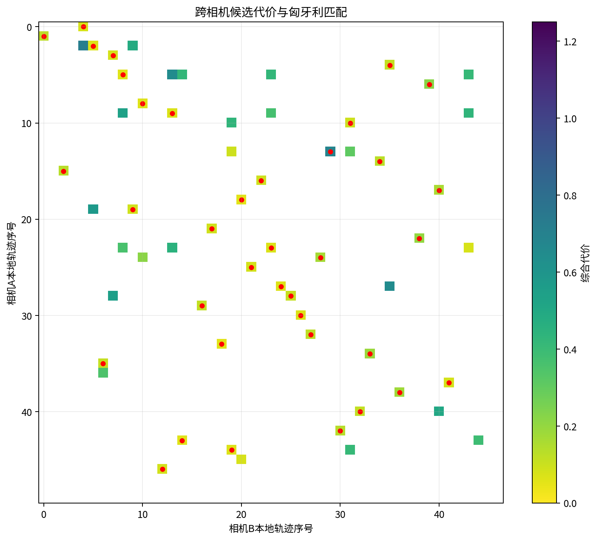
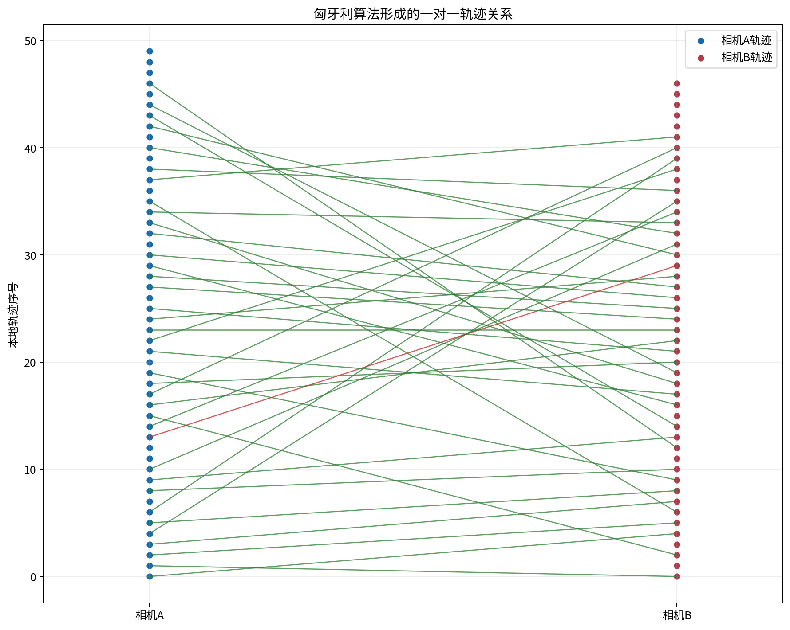
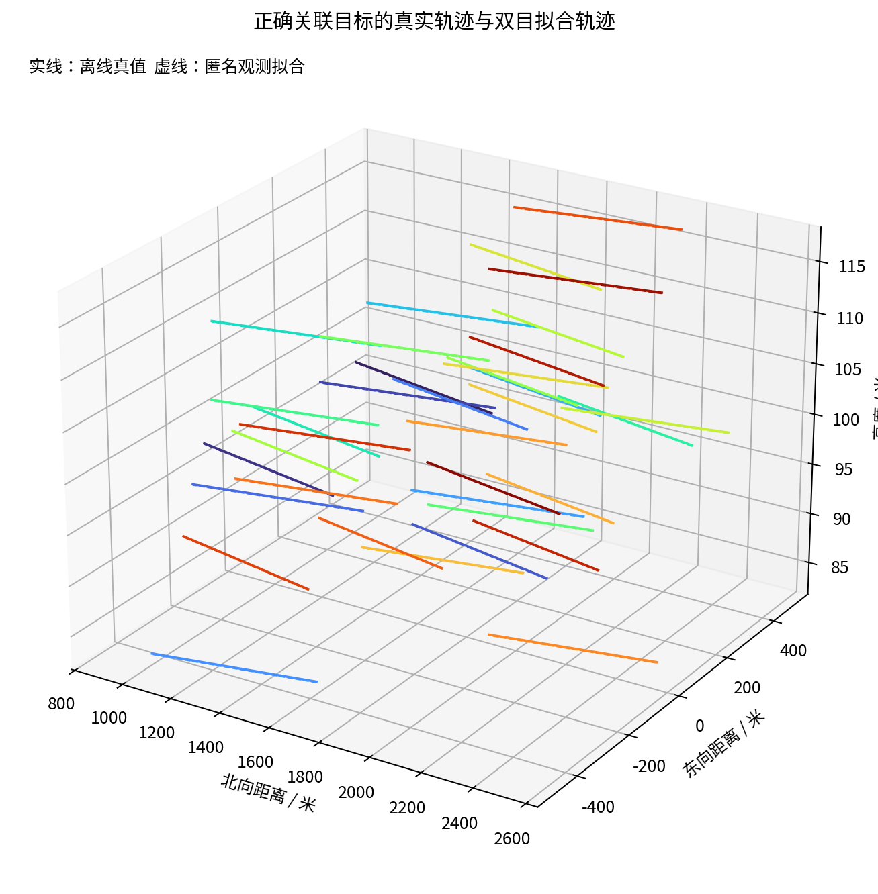
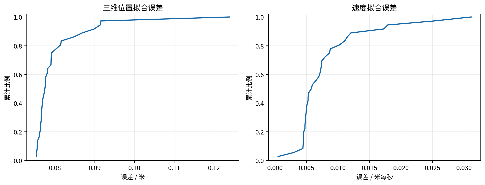

# 双光电40目标轨迹关联试验

## 结论

本轮验收结果为**通过**。试验在AirSim ComputerVision模式下使用两个固定光电节点、40个移动无人机网格和内置检测接口。在线关联未读取Actor名称、三维真值或系统全局航迹。

匈牙利算法输出37组跨相机关系，其中正确36组、错误1组。准确率为0.973，相对全部40个目标的召回率为0.900，相对两侧均已形成稳定轨迹的目标召回率为0.900。

验收阈值已经通过，但结果未达到40个目标全部正确配准。两台相机都检测到全部目标，最终只有36个目标形成正确跨相机关系；未正确配准的是TRUTH-007、TRUTH-023、TRUTH-026、TRUTH-032。

本试验只验证理想位姿、理想时间和AirSim检测框条件下的双光电轨迹关联。结果不是实装光电设备性能，也不代表D1-D7系统链路已经接入。

## 场景

两个光电节点横向相距2000米，目标群初始位于前方约2000米。40个目标前后错列并设置少量横向交叉，速度模长均为50米每秒，目标高度变化限制在中心高度上下20米。目标网格最长方向在预检中标定为3米。

相机分辨率为1280乘1024，AirSim水平视场角为2.93度，按该投影得到的垂直视场角为2.344度。AirSim等效角分辨率为0.03995毫弧度每像素，与设备给出的0.05毫弧度分开记录。

## 方位扫描

两台相机在试验开始前分别计算指向来袭走廊中心的俯仰角，此后俯仰保持不变。云台只在方位方向进行左右45度扫描，单程0.5秒，完整往返周期1秒。

窄视场以180度每秒扫过目标时，单次可见时间很短。程序按100赫兹更新逻辑时间、目标位姿和扫描角，并在每次采集前给Unreal留出渲染更新时间。该数值是试验调度频率；墙钟处理速率为69.67次每秒，不能据此声称真实设备已达到100赫兹。

## 匿名观测

AirSim检测结果在进入算法前删除对象名称、相对真实位姿和三维框。在线文件只保留测量编号、二维框、相机编号、相机姿态和时间戳。对象名称和真实轨迹进入单独的离线评分文件。

在线真值字段泄漏计数为0。Optical_A检测覆盖率为1.000，Optical_B检测覆盖率为1.000。

## 扫描重访轨迹

同一次扫过目标产生的相邻检测先合并为扫描观测片段。像素中心结合相机姿态转换为世界视线，随后在角度空间连接相邻扫描周期的观测。轨迹允许保持0.75秒，至少经过4次扫描重访后才进入跨相机关联。

Optical_A形成50条稳定轨迹，覆盖1.000的目标；Optical_B形成47条稳定轨迹，覆盖1.000的目标。Optical_A有10个目标被拆成两条稳定片段，Optical_B有7个目标出现同类情况。扫描边缘短时离开视场和交叉窗口是主要触发条件。

## 跨相机关联

每一对候选轨迹采用恒速模型拟合三维位置和速度。代价由重投影误差、视线闭合误差、速度偏差、时间差和几何条件数组成。少量孤立重投影离群点会被剔除，单侧少于4个有效观测的候选不能通过。

无效候选在进入分配前被屏蔽。代价矩阵增加未匹配项，匈牙利算法不强制40乘40全部配对。该处理避免一个相机漏检或轨迹破碎时生成错误的一对一关系。

## 未闭合项

37组匹配中有1组错误关系：PAIR-011将TRUTH-024与TRUTH-038相连。该错误使用了两侧的局部轨迹片段，说明一对一本地轨迹约束不能自动消除同一真实目标的多片段问题。

另有4个目标没有形成正确跨相机关系，分别为TRUTH-007、TRUTH-023、TRUTH-026、TRUTH-032。当前结果已经达到准确率和召回率验收线，仍不能视为40对40全量闭合。后续应先降低扫描边缘造成的轨迹碎片，再评估是否需要增加跨周期轨迹合并。

## 三维拟合

正确匹配的平均位置误差为0.080米，95%分位误差为0.091米。平均速度误差为0.008米每秒。真值只在关联结束后用于绘图和评分。

## 验收

| 项目 | 结果 |
|---|---|
| 40个目标生成 | 通过 |
| 固定俯仰 | 通过 |
| 在线真值隔离 | 通过 |
| 无重复匹配 | 通过 |
| 准确率不低于95% | 通过 |
| 全目标召回率不低于80% | 通过 |
| 两侧稳定轨迹覆盖率不低于80% | 通过 |

## 限制

本轮未注入相机位姿误差、时钟误差、误检测和额外测量噪声。目标检测使用AirSim内置接口，不代表真实目标识别性能。固定节点和目标的实际渲染帧率也没有按真实光电设备完成标定。

图神经网络没有进入本轮代码。单个种子不能形成独立训练集和验证集，当前只保留匈牙利方法作为可解释基线。后续若增加多场景、多误差等级和独立数据划分，再比较图神经网络的收益。
