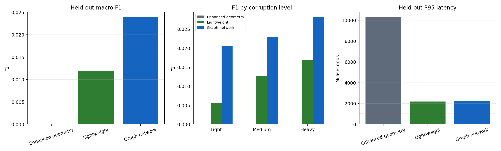
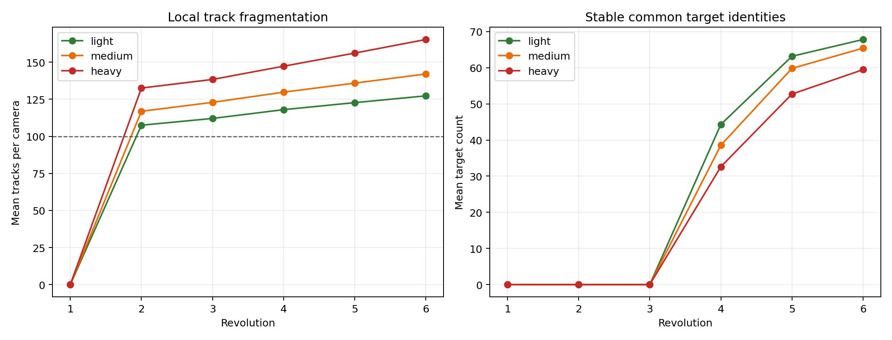

# 双光电100目标连续周扫在线配准对比报告

## 1. 结论

第二版流程完成9个预检回合、30个标定 seed 和20个未见测试 seed。轻量路线和图神经网络路线产生了非零正确匹配，增强几何路线在1000毫秒时限约束下没有保留输出。图网络在三条路线中测试宏平均F1最高，为0.023833；轻量路线为0.011777；增强几何路线为0。

三条路线的绝对性能仍低。图网络测试召回率为0.0150，P95时延为2195.74毫秒；轻量路线累计错配765次。当前结果不能判定为在线配准闭环通过，也不能直接形成工程选型结论。

360份测试快照均完成三路线同源输入校验，结果为通过。AirSim真实身份和Actor名称未进入在线快照。离线标签只在三条路线完成当前圈发布后用于评分，未参与测试参数选择。

## 2. 场景

| 项目 | 配置 |
| --- | --- |
| 光电站 | 2个，横向基线2千米 |
| 目标 | 100个3米Actor，速度50米/秒 |
| 航向 | 50个0度，50个负30度，空间混排 |
| 扫描 | 同方向连续360度周扫，2秒一圈 |
| 时长 | 12秒，6圈，逻辑采样100赫兹 |
| 云台误差 | 每相机每回合固定0.4毫弧度，逐帧抖动0.3毫弧度 |
| 干扰等级 | 轻、中、重三档漏检和虚警 |
| 数据划分 | 24个训练、6个验证、20个未见测试 seed |
| 在线时限 | 每圈端到端小于1000毫秒 |

标定和测试分别使用一次Blocks启动，回合之间执行reset。30个标定 seed 均一次完成，20个测试 seed 也均一次完成。全程未保存截图或视频。

## 3. 算法

共享单站跟踪器先把同一扫描过程中的重复检测合并为扫描片段，再用运动模型初始化、卡尔曼预测和马氏距离门控连接跨圈观测。最近3圈命中2圈即可确认，允许短时漏检。检测框面积只保留为诊断信息，不参与小目标测量加权。

增强几何路线按归一化共面残差筛选跨站组合，再用多时刻视线拟合运动。交叉期间可保留多个候选，最终由匈牙利算法形成一一关系。

轻量路线从同一候选图提取几何和运动特征，用训练、验证数据冻结浅层概率模型。图神经网络路线把两站局部航迹作为节点，把通过几何门的关系作为边，学习边的同目标概率。两条路线最终都使用匈牙利算法处理一一约束。

## 4. 分阶段结果

### 4.1 预检

预检包含理想、云台姿态误差和完整干扰三种条件，每种3个 seed。预检选中3米运动初始化残差门和单个全局假设。三种条件的共同成轨率分别为0.7767、0.7433和0.6833；中位轨迹纯度分别为1.0000、0.9167和0.8889。预检只决定是否允许启动正式标定。

### 4.2 共享跟踪器标定

正式标定比较13组候选。只有1组通过完整验收，配置为10米运动初始化残差门、3个全局假设、卡方置信度0.99和过程噪声0.1度每二次方秒。验证集中位轨迹纯度为0.8750，轻、中、重干扰共同成轨率分别为0.7183、0.7000和0.6233。

预检和正式标定选出的结构不同。预检中的单假设配置能通过9回合门槛，扩大到30个 seed 后，只有保留在候选网格中的旧默认结构通过全部正式门槛。该差异说明3个预检 seed 只能用于早期止损，不能替代正式标定。

### 4.3 路线验证

| 路线 | 验证F1 | 正确关联数 | 选中关系数 |
| --- | ---: | ---: | ---: |
| 增强极线/多假设/匈牙利 | 0.004654 | 15 | 33 |
| 轻量标定几何/匈牙利 | 0.156884 | 780 | 2044 |
| 图神经网络边评分/匈牙利 | 0.292831 | 1349 | 1544 |

三条路线均通过“F1、正确关联数和选中关系数大于0”的冻结门控。该门控用于阻止零能力模型进入测试，不是工程性能验收线。

### 4.4 保留测试

| 路线 | 宏平均精确率 | 宏平均召回率 | 宏平均F1 | 正确匹配数 | 错配数 | 时限满足率 | P95时延/毫秒 |
| --- | ---: | ---: | ---: | ---: | ---: | ---: | ---: |
| 增强极线/多假设/匈牙利 | 0.0000 | 0.0000 | 0.0000 | 0 | 0 | 0.1667 | 10268.93 |
| 轻量标定几何/匈牙利 | 0.0234 | 0.0079 | 0.0118 | 286 | 765 | 0.5944 | 2183.95 |
| 图神经网络边评分/匈牙利 | 0.0638 | 0.0150 | 0.0238 | 541 | 135 | 0.5917 | 2195.74 |

| 路线 | 轻干扰F1 | 中干扰F1 | 重干扰F1 |
| --- | ---: | ---: | ---: |
| 增强极线/多假设/匈牙利 | 0.000000 | 0.000000 | 0.000000 |
| 轻量标定几何/匈牙利 | 0.005650 | 0.012775 | 0.016907 |
| 图神经网络边评分/匈牙利 | 0.020615 | 0.022847 | 0.028038 |

超时圈数为增强几何300、轻量146、图神经网络147。超时输出按失败处理，没有事后回填。三条路线各完成360次发布。增强几何共发布0个关系；轻量共发布1051个，其中正确286个；图网络共发布676个，其中正确541个。

增强几何的状态分布为{'available': 60, 'timeout': 300}，轻量为{'empty_graph': 180, 'available': 34, 'timeout': 146}，图网络为{'empty_candidate_graph_gpu': 180, 'timeout': 147, 'available_gpu': 33}。其中“候选图为空”表示当前圈未形成可评分候选，“超时”表示算法完成时间超过任务预算，两者都不会发布关系。

## 5. 结果分析

第二版共享跟踪器改善了跨圈连续性。第6圈轻、中、重干扰下，两站共同稳定真实目标平均为67.8、65.4和59.45个。局部成轨不再是唯一断点，主要矛盾转到跨站候选筛选、关系评分和计算时延。

增强几何路线验证集只形成15个正确关联。测试中该路线P95时延达到10268.93毫秒，300圈超过时限，所有匹配在任务输出前被失败关闭。该路线需要先压缩候选规模并减少重复几何拟合。

轻量路线测试精确率为0.0234，累计错配765次。图网络精确率为0.0638，累计错配135次。图网络减少了错配并取得相对最高F1，但召回率只有0.0150，P95时延仍超过时限。

重干扰F1高于轻干扰，不能解释为干扰有利。不同干扰等级改变候选图大小和超时比例，时限门控又会清空整圈输出，宏平均指标因此同时受关联质量和计算路径影响。后续评估需分别报告算法原始输出和施加时限后的任务输出，但不得使用本轮测试标签重新选择门限。

## 6. 判定

本轮通过场景生成、在线身份隔离、共享输入、预检和冻结门控，未达到实用关联性能和1000毫秒在线时限要求。图网络保留为后续研究路线，轻量路线保留为可解释基线，增强几何路线先处理计算复杂度。20个测试 seed 已封存，后续参数调整必须使用新的训练、验证和保留测试划分。

## 7. 指标口径

精确率表示已发布关系中身份一致的比例。召回率以场景100个目标为分母，统计当前圈正确配准的唯一目标数。F1为精确率与召回率的调和平均。汇总表采用逐圈宏平均。超时圈按无输出计分。

## 8. 限制

本轮使用AirSim `simGetDetections`形成检测框，再按固定协议注入漏检和虚警。结果验证双光电配准算法、连续周扫和在线计算流程，不代表实际光电设备对3米无人机的远距离检测概率。云台误差按既定统计模型注入，尚未覆盖站址误差、时间同步漂移和大气传播影响。

## 9. 证据

- 指标：`comparison_metrics.json`
- 冻结标记：`/home/linux/Documents/MSM/research_modules/independent_experiments/dual_optical_online_benchmark/outputs/formal_v2_24_6_20/dataset/freezes/all_routes_frozen.json`
- 测试清单：`/home/linux/Documents/MSM/research_modules/independent_experiments/dual_optical_online_benchmark/outputs/formal_v2_24_6_20/dataset/test_manifest.json`
- 预检：`/home/linux/Documents/MSM/research_modules/independent_experiments/dual_optical_online_benchmark/outputs/formal_v2_24_6_20/preflight/preflight_summary.json`
- 共享跟踪器标定：`/home/linux/Documents/MSM/research_modules/independent_experiments/dual_optical_online_benchmark/outputs/formal_v2_24_6_20/dataset/freezes/shared_tracker_calibration.json`
- 逐圈发布：`publications/`
- 诊断：`failure_diagnostics.json`
- 图表：`figures/01_failure_diagnostics.png`、`figures/02_route_test_comparison.png`
