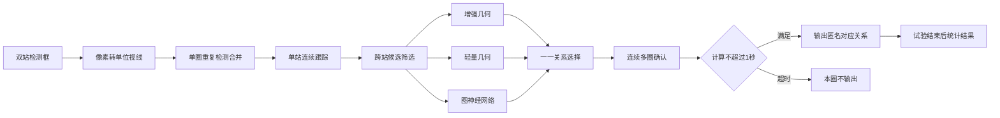
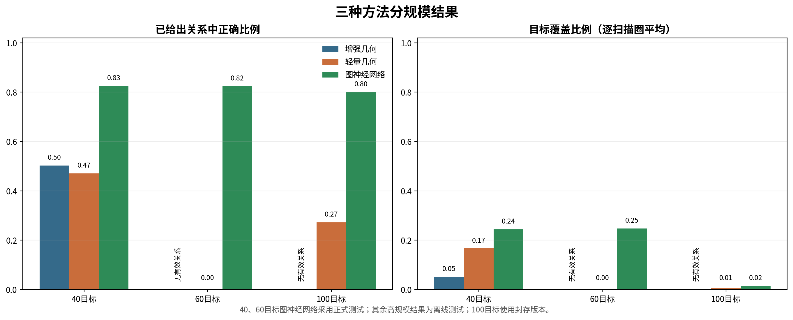
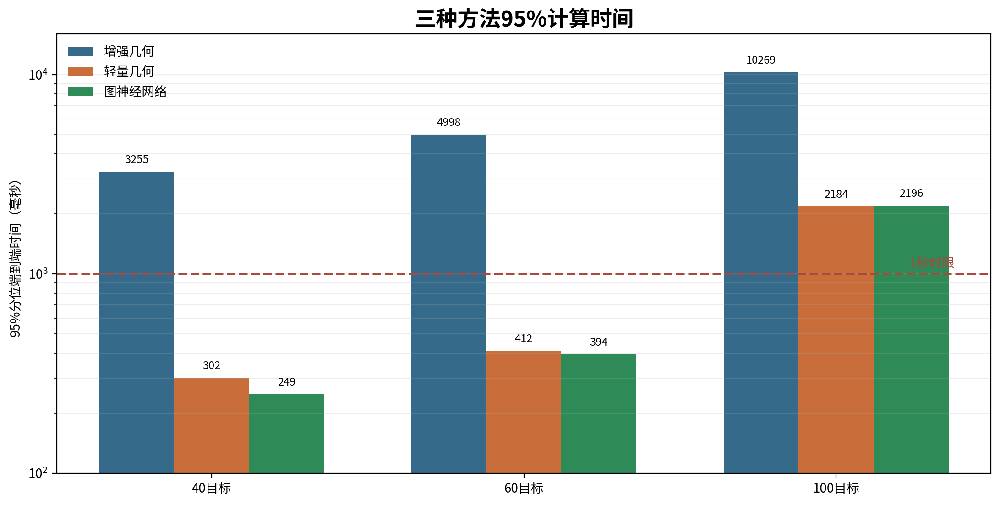

# 双光电连续周扫目标配准分规模试验报告

试验时间：2026年8月13日至14日。

## 1. 结论

本试验研究两台固定光电设备连续周扫时，如何把各自形成的目标轨迹对应起来。目标数量依次设置为20、40、60和100，目标速度为50米/秒。场景同时加入两类交叉航向、云台姿态误差、随机漏检和虚警，用于检查算法在目标密集和轨迹交叉条件下的稳定性。

三种方法中，图神经网络的综合结果最好。20目标时，已给出关系的正确比例为83.0%，目标覆盖比例为31.9%，95%计算时间约155毫秒。40目标时，关系正确比例约82.5%，目标覆盖比例约24.4%，95%计算时间约249毫秒。60目标时，关系正确比例约82.4%，目标覆盖比例约24.8%，95%计算时间约394毫秒。计算时间仍在每圈1秒的要求内，但大约四分之三的目标没有形成正确对应关系。

轻量几何方法计算较快，但结果不稳定。20目标验证阶段的关系正确比例为69.5%，低于70%的最低要求。40目标时给出800条正确关系和901条错误关系（离线测试），关系正确比例降至47.0%。60目标时只给出15条关系且全部错误（离线测试）。原验证方法只检查已给出关系中的正确比例，没有规定最低输出数量，使60目标配置仅凭1条正确关系通过验证。该门槛需要修订。

增强几何方法能够利用多时刻轨迹和交会关系，但计算量增长过快。20目标时，95%计算时间约1.50秒，已经超过1秒要求。40目标时增至3.26秒（离线测试），60目标时增至5.00秒（离线测试）。60目标条件下，超时清空后没有保留有效关系。主要耗时来自候选组合筛选和多时刻几何拟合，最终的一一分配只占很小部分。

本轮百目标流程在单台相机内部连续跟踪阶段停止。30个正式标定回合中，中等干扰下两台相机共同形成稳定轨迹的最好比例为69.3%，低于70%门槛，因此没有使用当前版本继续训练百目标图神经网络。已有百目标封存数据表明，图神经网络给出的关系中80.0%正确，但目标覆盖只有1.5%（离线测试）；轻量几何覆盖0.8%（离线测试）；增强几何没有形成准时有效关系（离线测试）。该组数据来自较早版本，只说明百目标条件仍未解决，不能代替本轮未完成的正式测试。

当前首先需要提高单台相机的连续成轨能力，减少同一目标被拆成多段轨迹。第二项工作是压缩跨站候选数量，避免目标规模增加后对大量无效组合反复计算。图神经网络本身的评分时间只有约2毫秒，继续扩大网络规模暂时不能解决主要问题。

## 2. 试验问题

两台光电设备观察同一批目标，但扫描时刻、观察角度和漏检情况不完全一致。设备A中的轨迹编号只在设备A内部有效，设备B中的编号也只在设备B内部有效。算法需要判断A1和B7是否代表同一个目标，同时保证一条轨迹最多对应另一台设备的一条轨迹。

试验只使用相机检测形成的匿名视线和局部轨迹，不使用雷达航迹、目标真实三维位置或外部任务编号。AirSim中的目标名称只在算法完成当前扫描圈计算后用于统计正确和错误数量，不参与轨迹形成、候选筛选和关系选择。

本试验要回答四个问题：

1. 两台相机能否分别把连续周扫中的检测形成稳定轨迹。
2. 多条轨迹接近或交叉时，三种方法能否找出正确对应关系。
3. 目标数量从20增加到100后，正确程度和目标覆盖如何变化。
4. 每个扫描圈的计算能否在1000毫秒内完成。

## 3. 场景与数据

### 3.1 场景设置

| 项目 | 配置 |
| --- | --- |
| 仿真模式 | AirSim ComputerVision |
| 光电节点 | `Optical_A`、`Optical_B`两个固定相机节点 |
| 节点位置 | A为(0，-1000，-100)米，B为(0，1000，-100)米，采用北东地坐标系 |
| 双站间距 | 横向2000米 |
| 目标走廊 | 位于双站前方约2000米，目标前后错列 |
| 目标外形 | `Quadrotor1`静态网格作为移动目标，最长方向约3米 |
| 目标速度 | 50米/秒 |
| 目标航向 | 一半为0度，一半为负30度，轨迹存在交叉 |
| 相机分辨率 | 1280×1024 |
| 等效焦距 | 300毫米 |
| 视场 | 水平2.93度，垂直约2.344度 |
| 扫描方式 | 方位连续360度周扫，2秒一圈 |
| 观察时间 | 12秒，共6圈 |
| 逻辑采样率 | 100赫兹 |
| AirSim时钟倍率 | 0.1 |
| 云台误差 | 每台相机每回合0.4毫弧度固定偏差，逐帧0.3毫弧度均方根抖动 |
| 计算时限 | 每圈端到端不超过1000毫秒 |

AirSim使用`simGetDetections`提供检测框。算法读取检测框中心、测量时刻和相机位姿，将像素位置转换为北东地坐标系中的单位视线。在线计算数据不保留目标名称、真实编号和真实三维位置。

### 3.2 漏检与虚警

| 干扰等级 | 随机漏检概率 | 每台相机每秒瞬时虚警 | 每台相机持续虚假轨迹 |
| --- | ---: | ---: | ---: |
| 无干扰 | 0 | 0 | 0 |
| 轻干扰 | 0.03 | 2 | 0 |
| 中等干扰 | 0.07 | 4 | 1 |
| 重干扰 | 0.12 | 8 | 2 |

这些参数用于统一比较算法，不代表真实设备的实测漏检率和虚警率。检测框面积只作为诊断数据保存，不参与关键门控、方向加权和距离估计，避免远距离小目标检测框波动直接改变轨迹。

### 3.3 样本安排

20、40和60目标各使用8个训练随机种子、2个验证随机种子和5个测试随机种子。每个随机种子包含无干扰、轻、中、重四档条件，每档6个扫描圈，因此每种方法在一个目标规模下最多形成120份测试结果。

百目标原计划使用24个训练随机种子、6个验证随机种子和20个测试随机种子。当前版本在训练和验证阶段未达到共同成轨门槛，后续测试数据没有生成。报告中的百目标三种方法结果来自已经封存的较早版本，并在对应描述中标为“（离线测试）”。

40、60目标的轻量几何和增强几何结果使用已经冻结的匿名快照重新计算。40目标轻量配置没有通过验证，只作为诊断；增强几何沿用20目标确定的参数，没有根据40、60目标测试结果重新调参。所有方法均先完成当前圈计算，再读取真实身份统计结果。

## 4. 算法

### 4.1 总体流程

三种方法共用检测、单站跟踪、候选筛选、一一关系选择和多圈确认，只在候选关系的评分方式上不同。这样能够把结果差异定位到具体环节，避免不同前处理掩盖算法本身的差别。

### 4.2 单圈检测合并

光电设备扫过同一目标时，可能在很短时间内连续产生多个检测框。算法先把时间间隔不超过0.06秒、方向差不超过0.12度的检测合并为一个扫描片段。这个步骤用于减少一次扫过期间的重复检测，避免同一目标在一个扫描圈内生成多条局部轨迹。

片段方向采用检测视线的等权平均。检测框面积没有用于加权，因为远距离目标可能只有很小的检测框，框面积受检测抖动影响较大，无法稳定代表距离或测量质量。

### 4.3 单站连续跟踪

每台相机独立维护方位角、俯仰角、方位角速度和俯仰角速度四维状态。恒角速度卡尔曼滤波器先把上一圈状态外推到当前测量时刻，再使用马氏距离判断新的扫描片段能否接入已有轨迹。状态协方差随轨迹传播，漏检后不确定度增大，门控范围也随之变化。

算法结合50米/秒目标速度、0度和负30度两类航向进行运动初始化。最近3圈至少命中2圈后，轨迹转为确认状态；短时漏检时保留预测，连续漏检超过上限后终止。该步骤只形成单台相机内部轨迹，不判断两台相机看到的是不是同一个目标。

### 4.4 跨站候选筛选

设A站预测视线为$\mathbf r_A$，B站预测视线为$\mathbf r_B$，双站单位基线为$\mathbf b$。同一目标对应的两条视线应接近同一个极平面。共面残差写为：

$$
r_{epi}=\arcsin\left(\left|\mathbf r_B^T
\frac{\mathbf r_A\times\mathbf b}{\|\mathbf r_A\times\mathbf b\|}\right|\right).
$$

考虑两条轨迹的测量误差后，使用归一化残差：

$$
d_{epi}=\frac{r_{epi}}{\sqrt{\sigma_A^2+\sigma_B^2}}.
$$

只有$d_{epi}\leq8$的组合进入后续比较。确认轨迹和短时延续轨迹优先，暂定轨迹靠后。同一成熟程度下，按归一化残差从小到大排序。每条轨迹保留的候选数量为：

$$
K=\min\left(16,\max\left(8,\left\lceil1.5\sqrt{N}\right\rceil\right)\right),
$$

其中$N$为目标数量。20、40、60、100目标分别保留8、10、12、15个候选。A到B和B到A两个方向的前$K$结果取并集，减少单向排序误删正确关系的概率。

### 4.5 三种关系评分方法

**增强几何方法。** 对一对候选轨迹的多个时刻进行时间对齐，计算共面残差、视线交会、三维恒速拟合、重投影误差和运动一致程度。目标交叉时保留少量待定关系，随后从全部候选中选择一一对应。该方法每一步都可解释，但候选数量增大后需要反复执行多时刻拟合。

**轻量几何方法。** 从每对候选中提取18项几何、运动和不确定度信息，使用固定权重、概率标定或浅层逻辑回归给出关系分数。该方法只调整候选关系的代价，不能绕过前面的共面门控，也不能取消最终的一一约束。计算量较小，但对门槛和样本分布较敏感。

**图神经网络方法。** 将A站和B站的局部轨迹组成二部图，轨迹作为节点，候选关系作为边。网络在给某条候选关系打分时，同时查看该轨迹周围的其他竞争对象。例如A2可能与B2、B3都接近，B2也可能同时接近A2、A3，网络需要结合这组竞争关系作出判断。

图1给出图神经网络的处理顺序。前级几何门控先排除明显不可能的组合，网络只对保留下来的候选评分，不能自行增加被门控删除的关系。

每条轨迹整理为15项信息，包括观测次数、持续时间、方向变化、角速度、漏检比例、最近命中情况和状态不确定度。每条候选关系整理为18项信息，包括时间重叠、共面残差、交会角、重投影误差、拟合速度、视线交会残差和运动一致程度。所有数值只使用训练数据进行标准化。

网络先把轨迹和候选关系转换为64维内部表示，再执行两轮信息交换。每条A站轨迹汇总与它相连的B站轨迹和候选关系，B站按相同方式反向汇总。两轮交换后，一条候选关系能够感知周围的直接竞争和间接竞争。

图2中，绿色连线表示正在判断的候选，橙色连线表示与它竞争的其他候选。网络判断A2与B2时，会同时比较A2还有哪些可能对象，以及B2又被哪些A站轨迹竞争。

候选分数可写为：

$$
p_{ij}=\operatorname{sigmoid}\left(
C([\mathbf h_i^A,\mathbf h_j^B,
|\mathbf h_i^A-\mathbf h_j^B|,\mathbf q_{ij}])
\right).
$$

$p_{ij}$越大，表示A站轨迹$i$和B站轨迹$j$越可能属于同一目标。网络训练使用训练数据中的正确和错误关系，验证数据用于选择门槛。测试计算只读取匿名轨迹和候选特征，不读取AirSim真实身份。

### 4.6 一一选择与连续确认

三种方法得到关系分数后，统一转换为代价。匈牙利算法从全部候选中寻找总代价较小的组合，并满足：

$$
\sum_j x_{ij}\leq1,\qquad
\sum_i x_{ij}\leq1,\qquad x_{ij}\in\{0,1\}.
$$

一条A站轨迹最多对应一条B站轨迹，一条B站轨迹也不能被重复使用。证据不足时允许保持未对应。最近3个扫描圈中，同一关系至少出现2次后才输出为稳定关系。每圈端到端计算超过1000毫秒时，本圈结果清空，不在下一圈补发旧结果。

图3表示候选打分和一一选择过程。分数最高的局部组合不一定构成全局最优关系，匈牙利算法同时比较全部候选，解决多条轨迹争用同一对象的问题。

## 5. 评价方法

### 5.1 评价指标

本报告采用以下指标：

- **关系正确比例**：算法已经给出的关系中，正确关系所占比例。该指标反映输出是否可靠。
- **目标覆盖比例**：每个扫描圈正确对应的目标数占目标总数的比例。该指标反映实际覆盖范围。
- **共同成轨比例**：同一真实目标在两台相机中都形成确认轨迹的比例。它是跨站配准的输入上限。
- **候选正确关系保留比例**：正确关系经过前级候选筛选后仍被保留的比例。
- **95%计算时间**：95%的扫描圈能够在该时间内完成。任务要求不超过1000毫秒。
- **约束违规数**：统计一条轨迹被重复对应、同一身份被重复使用和测试计算读取真实身份的次数，要求为0。

“关系正确比例”和“目标覆盖比例”必须同时使用。只看前者，算法可以通过少输出获得看似很高的数值；只看后者，又可能掩盖大量错误对应。

### 5.2 参数确定

算法参数只使用训练和验证数据确定。测试数据不参与权重、门槛和候选数量选择。20、40、60目标的正式测试数据只打开一次。40、60目标另外两种方法使用同一批冻结匿名快照计算，结果在文中标注为“（离线测试）”。

固定停止条件包括：关系正确比例低于70%、中重干扰下覆盖明显下降、错误关系增加而覆盖没有改善、95%计算时间超过1000毫秒，以及出现一一关系或身份隔离违规。停止后仍可使用冻结快照分析原因，但不能据此改写原测试结论。

## 6. 试验结果

### 6.1 单站成轨基础

| 目标数 | 无误差条件 | 仅姿态误差 | 完整干扰 | 结果判断 |
| ---: | ---: | ---: | ---: | --- |
| 20 | 1.0000 | 0.9667 | 0.9000 | 可以进入关系配准 |
| 40 | 0.9000 | 0.9167 | 0.8500 | 可以进入关系配准 |
| 60 | 0.8111 | 0.8222 | 0.6944 | 可以进入关系配准，但输入明显减少 |
| 100 | 0.7633 | 0.7400 | 0.6233 | 小样本可继续，正式标定未通过 |

这张表表示两台相机能够共同形成多少确认轨迹，不表示这些轨迹已经正确配准。60目标完整干扰条件下，共同成轨比例为69.4%，意味着约三成目标在至少一台相机中没有稳定轨迹。100目标小样本中该比例降至62.3%，后续关系配准的覆盖上限已经受到限制。

### 6.2 20目标

| 方法 | 已给出关系正确比例 | 目标覆盖比例 | 95%计算时间 | 结果 |
| --- | ---: | ---: | ---: | --- |
| 轻量几何 | 69.5% | 20.0% | 未进入测试 | 验证未达到70%要求 |
| 增强几何 | 75.0% | 35.4% | 1495.09毫秒 | 结果较多，但超时 |
| 图神经网络 | 83.0% | 31.9% | 154.95毫秒 | 正确程度和时间较均衡 |

轻量几何在验证阶段给出269条关系，其中187条正确、82条错误。关系正确比例距离70%门槛差0.5个百分点，测试数据没有打开。这个差距不能通过事后降低门槛消除，因为目标规模增加后候选数量会进一步增长。

增强几何的目标覆盖比图神经网络高3.5个百分点，但95%计算时间达到1.50秒。候选筛选约占1.17秒，多时刻拟合约0.30秒，最终一一分配约6毫秒。超时主要发生在前两步。

图神经网络形成157次错误对应，所有120个扫描圈均在1秒内完成。候选构建约占142毫秒，网络评分约1.76毫秒，一一分配约0.95毫秒。它的目标覆盖略低于增强几何，但关系更可靠，计算时间缩短约90%。

### 6.3 40目标

| 方法 | 正确/错误关系 | 已给出关系正确比例 | 目标覆盖比例 | 95%计算时间 |
| --- | ---: | ---: | ---: | ---: |
| 增强几何（离线测试） | 246/243 | 50.3% | 5.1% | 3255.09毫秒 |
| 轻量几何（离线测试） | 800/901 | 47.0% | 16.7% | 301.77毫秒 |
| 图神经网络 | 1172/248 | 82.5% | 24.4% | 248.53毫秒 |

增强几何沿用20目标参数。目标增加到40后，正确和错误关系数量接近，95%计算时间增至3.26秒，只有约三分之一扫描圈能在1秒内完成（离线测试）。该方法没有表现出扩大规模的能力。

轻量几何在40目标时计算仍较快，但错误关系已经多于正确关系（离线测试）。当前配置没有通过正式验证，只用于观察失败形式，不能作为可用方案。

图神经网络的关系正确比例保持在82%左右，目标覆盖由20目标的31.9%降至24.4%。候选正确关系保留比例为75.2%，说明一部分正确关系在进入图网络之前已经被候选筛选删除。95%计算时间约249毫秒，其中候选构建约237毫秒，网络本身仍只占数毫秒。

### 6.4 60目标

| 方法 | 正确/错误关系 | 已给出关系正确比例 | 目标覆盖比例 | 95%计算时间 |
| --- | ---: | ---: | ---: | ---: |
| 增强几何（离线测试） | 0/0 | 无有效结果 | 0 | 4997.91毫秒 |
| 轻量几何（离线测试） | 0/15 | 0 | 0 | 412.34毫秒 |
| 图神经网络 | 1782/380 | 82.4% | 24.8% | 394.10毫秒 |

增强几何的95%计算时间接近5秒，按1秒超时规则清空后没有有效关系（离线测试）。继续增加处理器时间只能得到过期结果，当前实现不适合60目标条件。

轻量几何在验证数据中只给出1条正确关系，因这1条没有错误而得到100%的表面正确比例。测试时共给出15条关系且全部错误（离线测试）。这不是简单的门槛偏高或偏低问题，而是验证规则缺少最低输出数量。下一版至少需要同时规定最低正确关系数、最低目标覆盖比例和中重干扰下非零输出。

图神经网络在60目标时仍保持82.4%的关系正确比例，95%计算时间约394毫秒。一一关系、身份重复和测试计算读取真实身份的违规数均为0。目标覆盖只有24.8%，平均每圈大约正确对应15个目标，其余约45个目标没有形成可靠关系。当前结果能够证明程序在60目标下可运行，不能证明已经分清60个目标。

图4给出20、40、60目标条件下图神经网络的目标覆盖和计算时间。目标数量增加后，计算时间保持在1秒内，目标覆盖在40目标时明显下降，60目标没有恢复。

### 6.5 100目标

百目标先检查两台相机能否形成足量局部轨迹。24个训练回合和6个验证回合共比较13组跟踪参数。表现最好的一组轨迹纯度为90.9%，轻干扰共同成轨比例达到75.5%，重干扰达到64.5%，中等干扰只有69.3%，低于70%的门槛。因此当前版本停止在单站跟踪阶段，没有继续形成百目标跨站关系结果。

图5显示目标增加后，共同成轨比例和候选正确关系保留比例同步下降。百目标当前首先卡在单台相机内部的轨迹连续性，图神经网络还没有拿到满足条件的输入。

| 方法 | 正确/错误关系 | 已给出关系正确比例 | 目标覆盖比例 | 95%计算时间 |
| --- | ---: | ---: | ---: | ---: |
| 增强几何（离线测试） | 0/0 | 无有效结果 | 0 | 10268.93毫秒 |
| 轻量几何（离线测试） | 286/765 | 27.2% | 0.8% | 2183.95毫秒 |
| 图神经网络（离线测试） | 541/135 | 80.0% | 1.5% | 2195.74毫秒 |

表中三种方法使用已经封存的较早版本数据（离线测试）。图神经网络已给出关系的正确比例仍为80.0%，但平均每圈只正确覆盖约1至2个目标。轻量几何错误关系明显多于正确关系。增强几何95%计算时间超过10秒，没有保留有效关系。三种方法均没有达到百目标使用要求。

这组百目标数据与本轮40、60目标使用的跟踪器、候选结构和运行环境不同，不能把40、60、100目标的计算时间拟合成一条增长曲线。它只用于说明：即使绕过当前版本的单站跟踪停止条件，后续跨站配准仍然存在严重漏配和超时。

### 6.6 规模变化

图6集中显示40、60和100目标的三种方法结果。图神经网络在已给出的关系中保持约80%的正确比例，但40、60目标只覆盖约四分之一目标，百目标封存数据只覆盖1.5%。关系正确比例较稳定，目标覆盖没有随之改善。

轻量几何在40目标时输出较多，但正确关系少于错误关系；60目标时输出收缩到15条且全部错误。增强几何在40目标时已经明显超时，60目标和百目标没有形成准时有效关系。三种方法面临的共同问题是输入轨迹中断和候选正确关系丢失，方法之间的主要区别体现在错配数量和计算时间。

图7显示增强几何的计算时间随目标数量快速增加。轻量几何和图神经网络在40、60目标时能够在1秒内完成；百目标数值来自较早版本（离线测试），两者均超过2秒，不能与40、60目标作严格同比。

## 7. 原因分析

### 7.1 单站轨迹中断

固定窄视场相机每2秒才能重新扫到同一方向。目标以50米/秒飞行，一圈内可移动约100米。再叠加两类航向、交叉轨迹、云台偏差、随机漏检和持续虚警，同一目标在前后两圈中的方向变化可能接近其他目标，造成轨迹断裂或串接。

目标数量增加后，每个真实目标平均形成的轨迹片段数大于1。跨站算法比较的是局部轨迹，不是完整真实目标。若同一目标在A站和B站分别被拆成不同数量的片段，后续任何关系评分方法都会先受到输入上限限制。

### 7.2 候选正确关系丢失

图神经网络只能给候选清单中的关系评分，不能恢复前级已经删除的正确关系。候选正确关系保留比例从20目标约79.7%降到60目标约72.7%。密集交叉区域中，固定前$K$排序会被大量相近的错误候选占用，正确关系可能在网络评分之前被排除。

目标覆盖下降主要由单站轨迹和候选筛选共同造成。扩大图神经网络层数不能补回缺失的轨迹，也不能重新加入被硬门控删除的关系。

### 7.3 轻量几何门槛

轻量几何对单条候选独立评分，难以利用多条候选之间的竞争关系。40目标时，大量几何上相近的错误组合同时获得较高分数。60目标配置又通过提高门槛把大多数关系全部拒绝，形成“输出很少、验证比例看似很高”的情况。

该方法仍可作为快速基线，但验证条件必须同时限制关系正确比例和最低输出量。只调一个分数门槛会在错配增加与全部拒绝之间摆动。

### 7.4 增强几何计算量

增强几何对每条候选执行多时刻对齐、共面筛选、三维交会和运动拟合。目标数量增加后，两站轨迹组合近似按乘积增长，重复拟合迅速占满时间。匈牙利算法只需要数毫秒，替换最终分配方法不能解决超时。

若继续保留该路线，应先对方位和俯仰进行空间分桶，只在邻近区域建立候选；缓存轨迹预测、协方差传播和多时刻拟合结果；限制每圈可进入精细计算的候选预算。

## 8. 当前能力

本轮能够确认以下结果：

1. 双站检测、单圈合并、局部跟踪、候选筛选、关系评分、一一选择和多圈确认可以在20至60目标条件下连续执行。
2. 图神经网络在60目标时的95%计算时间约394毫秒，一一关系和身份隔离违规为0。
3. 图神经网络在40、60目标时只正确覆盖约四分之一目标，尚不具备高密度目标完整配准能力。
4. 轻量几何缺少最低输出数量约束，增强几何缺少可扩展的候选计算方式。
5. 百目标当前版本停止在单站跟踪阶段，较早版本结果（离线测试）也没有形成可用覆盖。

本轮不能证明真实设备在2千米距离上能够稳定检测3米目标。`simGetDetections`和人工注入的漏检、虚警只用于验证算法流程。真实站址误差、时间同步漂移、大气传播、实际检测器误差、通信抖动和实装处理器资源尚未纳入。

## 9. 后续工作

第一步改进单站跟踪。按方位、俯仰和目标航向建立局部邻域，只在相邻区域内连接前后扫描片段；在交叉区域保留数量受限的多个轨迹假设；缓存每个随机种子的扫描片段和基础运动量。百目标重新标定时，轨迹纯度应不低于85%，中等干扰共同成轨比例应不低于70%。

第二步改进候选生成。将全矩阵共面残差改为分桶后的稀疏计算，缓存轨迹预测和协方差传播，对双向前$K$候选采用局部选择。改动后仍需保持协方差归一化门控、一一关系和真实身份隔离。

第三步修订轻量几何验证规则。除关系正确比例外，增加最低正确关系数、最低目标覆盖比例和中重干扰条件下非零输出要求。60目标“验证只有1条正确关系、测试15条全部错误”的情况作为固定回归案例。

第四步重新建立百目标数据。参数和最低目标覆盖门槛应在生成新测试数据前确定。单站跟踪通过后，再训练百目标图神经网络并进行新的测试。当前百目标封存结果不能用于反复调整新版本参数。

## 10. 验证与证据

相关自动测试共111项通过。Python语法检查和`git diff --check`通过。Matplotlib环境存在可选三维组件导入警告，本报告只使用二维统计图，不影响结果。

主要证据如下，路径均相对于本报告所在目录：

- 分规模汇总：`outputs/scale_funnel_v3/summary/scale_funnel_summary.json`
- 路线指标：`outputs/scale_funnel_v3/summary/scale_route_metrics.csv`
- 跟踪参数比较：`outputs/scale_funnel_v3/summary/tracker_calibration_candidates.csv`
- 20目标结果：`outputs/scale_funnel_v3/targets_020/results/comparison_metrics.json`
- 40目标结果：`outputs/scale_funnel_v3/targets_040/results/comparison_metrics.json`
- 60目标结果：`outputs/scale_funnel_v3/targets_060/results/comparison_metrics.json`
- 百目标跟踪标定：`outputs/scale_funnel_v3/targets_100/dataset/freezes/shared_tracker_calibration.json`
- 三种方法分规模汇总：`outputs/offline_three_route_scale_v1/summary/offline_three_route_summary.json`
- 三种方法逐项数据：`outputs/offline_three_route_scale_v1/summary/offline_three_route_summary.csv`

试验输出用于研究验证，不能直接作为真实装备性能结论。
