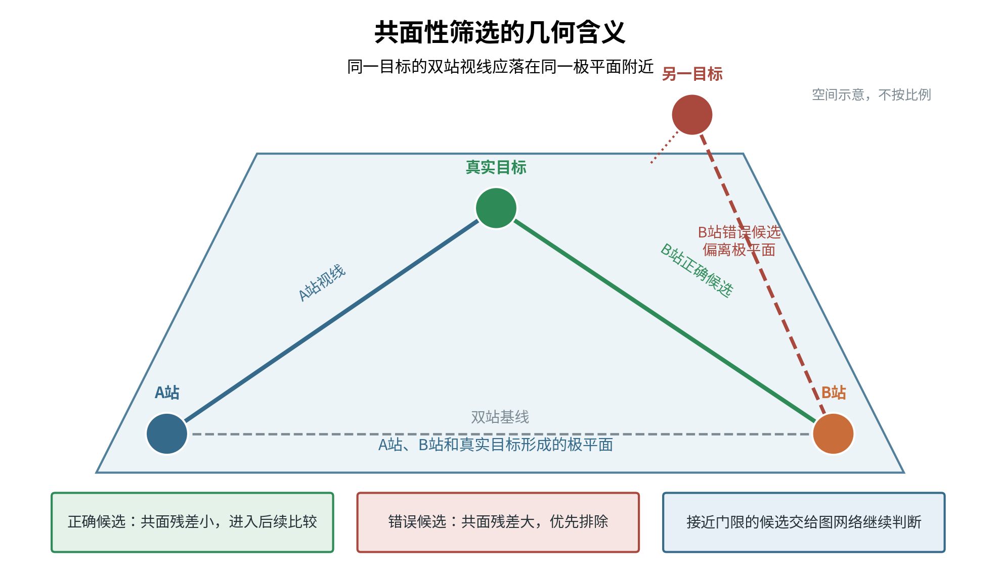
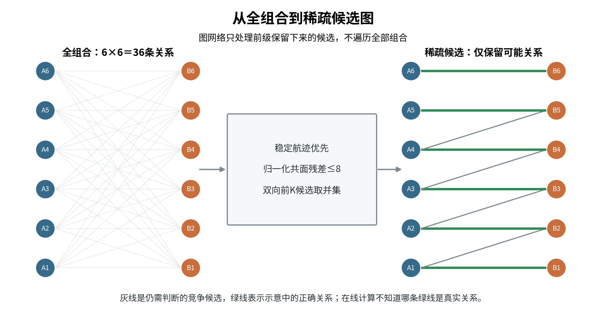
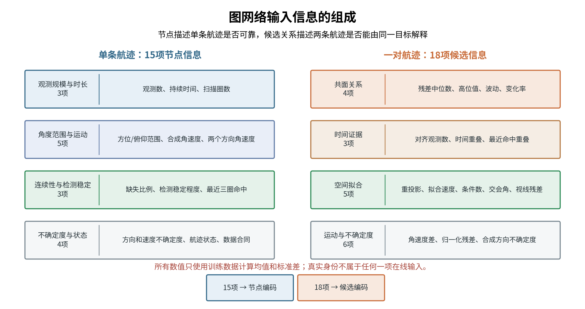
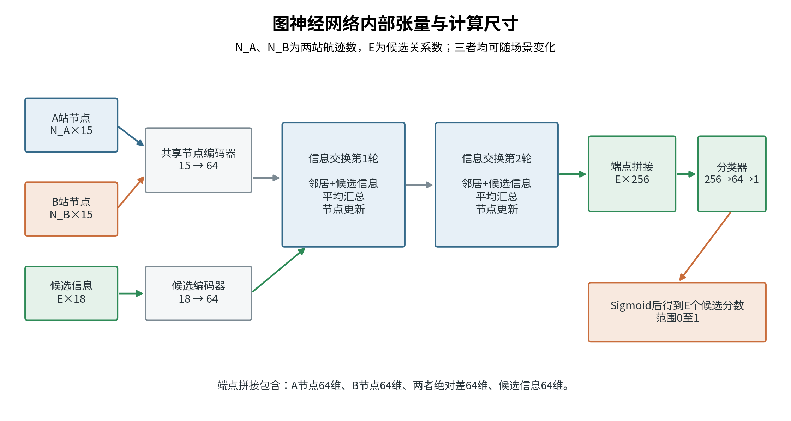
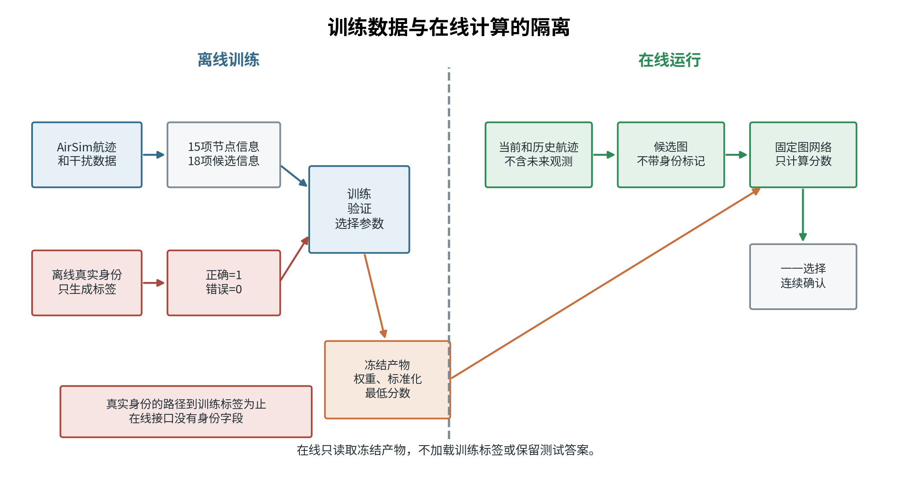
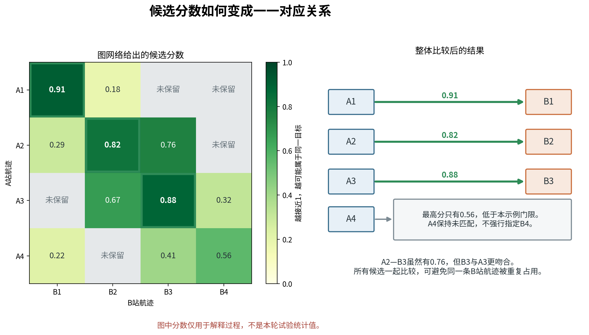
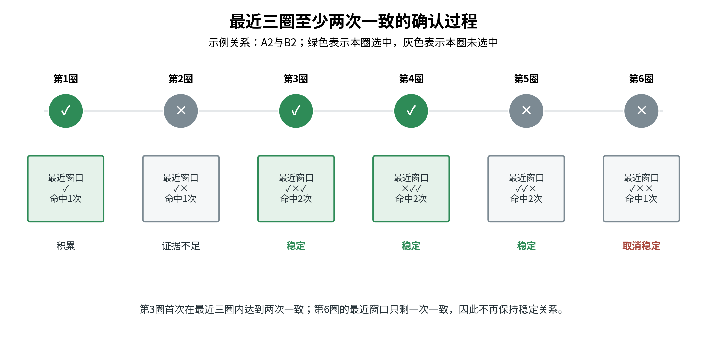
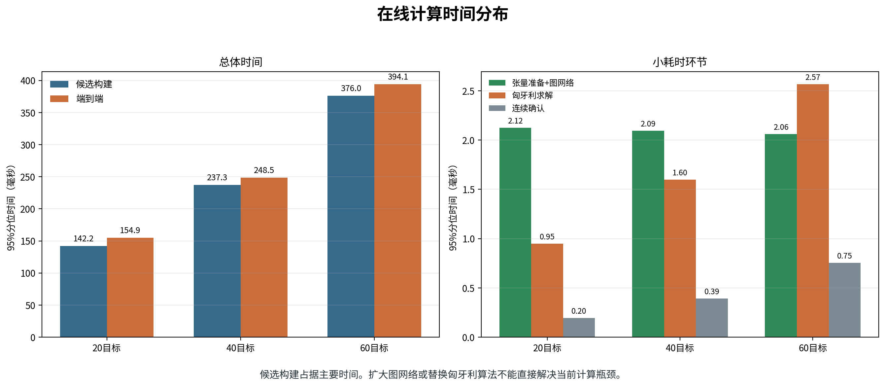
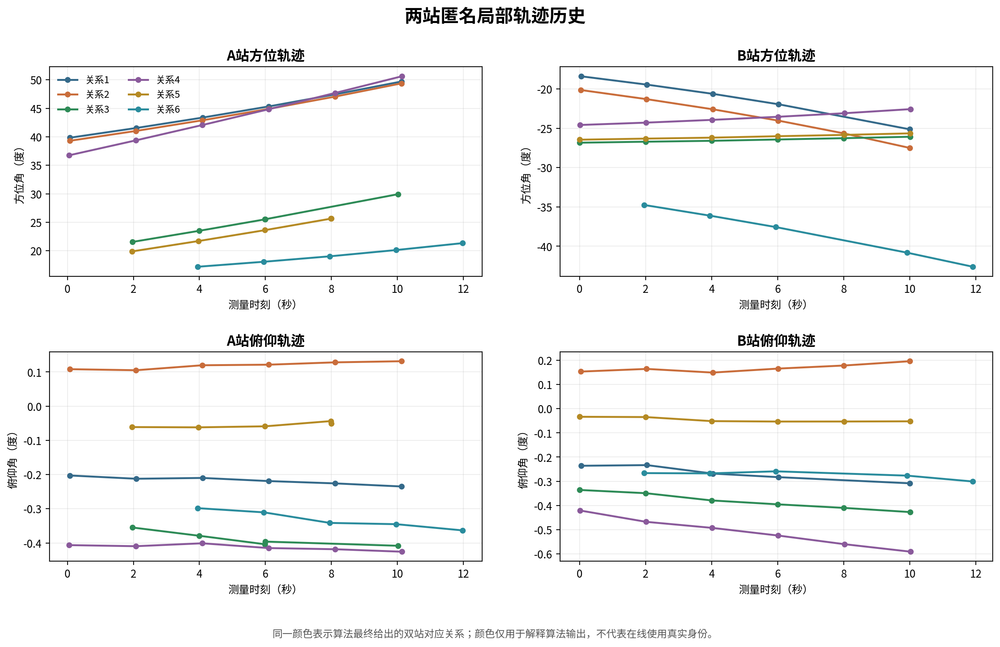
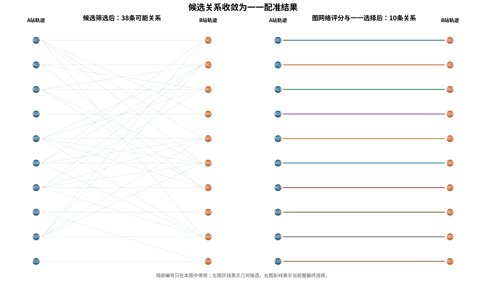

# 双站光电图神经网络配准算法与计算过程

文档日期：2026年8月14日

试验依据：2026年8月13日双站连续周扫分规模试验

## 1. 当前结论

当前图神经网络用于判断两台光电设备形成的局部航迹是否来自同一个目标。处理流程可以概括为：

    单站连续跟踪
        ↓
    几何条件缩小候选范围
        ↓
    图神经网络比较候选关系
        ↓
    匈牙利算法形成一一对应
        ↓
    最近三圈中至少两次一致
        ↓
    得到稳定的双站航迹对应关系

图神经网络没有直接接收图像，也没有替代单站跟踪器。它处理的是两台相机已经形成的航迹片段。网络只负责给候选关系评分，不能增加前级已经删除的候选。最终一一对应、允许空缺和连续确认仍由确定性算法完成。

20、40和60目标分别训练了独立模型并完成在线测试。图网络本身每圈计算约需1.6至1.8毫秒，匈牙利算法约需1至3毫秒。主要耗时来自图网络之前的候选关系构建。100目标试验停在单站连续跟踪阶段，没有训练100目标图网络。

本方法当前属于仿真验证。检测输入来自AirSim检测元数据，真实设备漏检、虚警、云台误差和成像质量仍需另行测试。

## 2. 问题定义

### 2.1 输入

两台光电设备分别称为A站和B站。每台设备在连续周扫过程中独立形成局部航迹。局部航迹只保留以下在线信息：

- 相机编号和本地航迹编号；
- 观测时刻和扫描圈编号；
- 北东地坐标系下的单位视线；
- 方位角、俯仰角及其变化速度；
- 航迹连续性和最近命中情况；
- 方向测量协方差和状态协方差；
- 检测稳定程度等辅助信息。

在线输入不含AirSim目标名称、真实目标编号和真实三维位置。真实身份只在训练阶段生成正确与错误样本，并在试验结束后计算结果。

### 2.2 输出

输出是一组A站航迹与B站航迹的对应关系。例如：

    A_017 ↔ B_043
    A_021 ↔ B_006
    A_035 ↔ 未匹配

每条A站航迹最多对应一条B站航迹，每条B站航迹也最多被使用一次。没有足够证据时允许保持未匹配，避免为了增加数量而强行指定错误对象。

### 2.3 约束

算法必须满足五项基本约束：

1. 在线过程不能读取真实目标身份。
2. 同一条本地航迹不能同时分给多个对象。
3. 当前时刻只能使用已经到达的历史观测，不能使用未来数据。
4. 同一对应关系需要跨扫描圈重复出现，不能由单圈结果直接确认。
5. 每圈处理超过1000毫秒时，当前结果不进入后续处理。

### 2.4 为什么使用图

逐对判断只回答“A1与B1是否相似”，看不到B1是否与A2更相似。目标密集或轨迹交叉时，多条候选关系可能同时满足近似几何条件。此时需要同时比较：

- 一条A站航迹周围有哪些B站候选；
- 一条B站航迹又被哪些A站航迹竞争；
- 某一候选相对于周围候选是否明显更合理。

图结构可以表达这种竞争关系。A站航迹和B站航迹作为两组节点，可能对应的航迹对作为连接。图神经网络在这些连接之间交换信息，再为每条连接计算分数。

图1给出当前完整处理顺序。训练所需真实身份与在线计算严格分开。

## 3. 候选关系构建

### 3.1 局部航迹准备

每台相机先把同一扫描圈内相邻的重复检测合并为一个扫描片段，再通过恒角速度卡尔曼滤波形成局部航迹。局部状态为：

$$
\mathbf s=
\begin{bmatrix}
\alpha & \beta & \dot{\alpha} & \dot{\beta}
\end{bmatrix}^{T},
$$

其中，$\alpha$为方位角，$\beta$为俯仰角，$\dot{\alpha}$和$\dot{\beta}$为两个方向的角速度。预测采用恒角速度模型：

$$
\mathbf s_{k|k-1}=
\begin{bmatrix}
1&0&\Delta t&0\\
0&1&0&\Delta t\\
0&0&1&0\\
0&0&0&1
\end{bmatrix}
\mathbf s_{k-1|k-1}.
$$

新扫描片段通过马氏距离门控接入已有航迹。最近三圈中至少命中两圈后，航迹才达到可用于跨站比较的稳定程度。短时漏检时允许航迹继续预测，超过保留时间后终止。

### 3.2 共面性粗筛

设两台相机位置分别为$\mathbf o_A$和$\mathbf o_B$，单位基线为：

$$
\mathbf b=\frac{\mathbf o_B-\mathbf o_A}
{\|\mathbf o_B-\mathbf o_A\|}.
$$

A站和B站对某一候选目标的单位视线分别为$\mathbf r_A$和$\mathbf r_B$。同一空间点对应的两条视线应接近同一极平面。共面残差写为：

$$
r_{\mathrm{epi}}=
\arcsin\left(
\left|
\mathbf r_B^{T}
\frac{\mathbf r_A\times\mathbf b}
{\|\mathbf r_A\times\mathbf b\|}
\right|
\right).
$$

测量误差较大时，相同角度残差不应与高精度观测同等处理。因此使用两条航迹的方向不确定度进行归一化：

$$
d_{\mathrm{epi}}=
\frac{r_{\mathrm{epi}}}
{\sqrt{\sigma_A^2+\sigma_B^2}}.
$$

当前先保留$d_{\mathrm{epi}}\leq8$的组合。稳定航迹优先于暂定航迹；稳定程度相同时，残差较小的组合优先。

图2用三维几何关系说明共面性粗筛。A站视线与双站基线确定一个极平面；同一目标在B站形成的视线应接近该平面，明显偏离的组合优先排除。实际程序计算的是带方向不确定度的归一化残差，图中的正确与错误标记只用于解释原理，不作为在线输入。

### 3.3 候选数量控制

如果A站和B站各形成$N$条航迹，全部比较需要$N^2$个组合。100条对100条已经达到10000个组合，航迹碎片和虚假航迹还会继续增加数量。

当前每条航迹只保留前$K$个候选：

$$
K=
\min\left(
16,
\max\left(
8,
\left\lceil1.5\sqrt{N}\right\rceil
\right)
\right).
$$

20、40、60和100目标分别对应8、10、12和15个候选。A到B和B到A两个方向分别排序，再取两边结果的并集。双向处理可以减少某一侧航迹碎片较多时遗漏正确关系的风险。

图网络只能在这份候选清单内评分。它不会重新建立被前级删除的连接，也不会利用真实目标编号补回关系。

图3给出从全部两两组合到稀疏候选图的过程。程序先按共面残差和航迹稳定程度排序，再分别保留A到B、B到A的前$K$个候选并取并集。该步骤降低后续计算量，但也形成明确边界：正确关系若在这里被删除，图网络无法恢复。

### 3.4 多时刻空间运动拟合

候选航迹在共同时间段内插值到同一组时刻。设目标在参考时刻的位置和速度为$\mathbf p_0$、$\mathbf v$，第$s$台相机在时刻$k$的视线为$\mathbf r_{s,k}$，相机位置为$\mathbf o_s$。利用视线正交投影求解恒速度运动：

$$
\min_{\mathbf p_0,\mathbf v}
\sum_{s\in\{A,B\}}
\sum_k
\left\|
\left(
\mathbf I-\mathbf r_{s,k}\mathbf r_{s,k}^{T}
\right)
\left[
\mathbf p_0+
\mathbf v(t_k-t_0)-
\mathbf o_s
\right]
\right\|^2.
$$

该计算不是把真实三维位置输入网络，而是检查“两条视线航迹能否共同解释为一个恒速度空间目标”。求解结果用于得到：

- 双站视线重投影误差；
- 拟合速度；
- 视线交会残差；
- 线性方程条件数；
- 两条视线的交会角。

交会角过小或条件数过大时，三角定位对误差非常敏感。相关数值作为候选关系信息输入图网络。

## 4. 图的数据结构

### 4.1 二部图

一圈在线输入形成二部图：

$$
\mathcal G=
(\mathcal V_A,\mathcal V_B,\mathcal E),
$$

其中：

- $\mathcal V_A$是A站稳定局部航迹集合；
- $\mathcal V_B$是B站稳定局部航迹集合；
- $\mathcal E$是前级候选清单中的航迹对。

每个节点带15项信息，每条候选关系带18项信息。图中没有“这个节点是真实目标T001”之类的字段。

### 4.2 十五项节点信息

| 序号 | 节点信息 | 计算方式 | 作用 |
| ---: | --- | --- | --- |
| 1 | 观测数 | 航迹中扫描片段数量 | 判断证据是否充足 |
| 2 | 持续时间 | 最后时刻减最早时刻 | 区分短片段和连续航迹 |
| 3 | 扫描圈数 | 航迹覆盖的不同扫描圈数量 | 判断是否经历多次重访 |
| 4 | 方位变化范围 | 方位角最大值减最小值 | 描述横向运动范围 |
| 5 | 俯仰变化范围 | 俯仰角最大值减最小值 | 描述高度方向运动范围 |
| 6 | 合成角速度 | 方位与俯仰角速度平方和开方 | 描述目标在像面中的总体运动 |
| 7 | 缺失比例 | 预计扫描圈与实际命中圈之差 | 判断航迹是否经常中断 |
| 8 | 检测稳定程度 | 检测框面积变化和置信度波动的倒数形式 | 作为软信息，不用于几何硬门控 |
| 9 | 方位角速度 | 对方位角随时间做线性拟合 | 比较两站运动趋势 |
| 10 | 俯仰角速度 | 对俯仰角随时间做线性拟合 | 比较两站高度方向趋势 |
| 11 | 方向不确定度 | 由测量或状态协方差计算 | 区分可靠和不可靠视线 |
| 12 | 角速度不确定度 | 由状态协方差计算 | 归一化运动差异 |
| 13 | 最近三圈命中比例 | 最近三圈命中数除以有效圈数 | 判断当前航迹是否仍活跃 |
| 14 | 航迹状态质量 | 稳定、短时延续、暂定等状态映射 | 防止暂定航迹与稳定航迹同等使用 |
| 15 | 数据合同标记 | 是否具有完整协方差和状态字段 | 区分完整数据与兼容输入 |

检测框面积只参与第8项软信息，不用于估算距离，也不作为删除候选的硬条件。远距离小目标框尺寸波动较大时，网络可以降低这项信息的作用，但前级几何关系不受其直接控制。

### 4.3 十八项候选关系信息

| 序号 | 候选关系信息 | 计算方式 | 物理含义 |
| ---: | --- | --- | --- |
| 1 | 共面残差中位数 | 多时刻共面残差的中位数 | 两条视线总体是否接近同一极平面 |
| 2 | 共面残差高位值 | 多时刻残差的90%分位数 | 少量较差时刻是否明显偏离 |
| 3 | 共面残差波动 | 残差相对中位数的中位绝对偏差 | 几何关系是否稳定 |
| 4 | 共面残差变化率 | 残差随时间线性拟合斜率绝对值 | 几何关系是否持续恶化 |
| 5 | 对齐观测数 | 两条航迹共同时间段内的样本数 | 多时刻证据是否足够 |
| 6 | 时间重叠比例 | 共同时间长度除以两航迹联合时间长度 | 两条航迹是否同时存在 |
| 7 | 重投影均方根误差 | 恒速度空间拟合后重新投到两站视线 | 一个空间运动能否解释两条航迹 |
| 8 | 拟合速度 | 恒速度最小二乘解的速度模 | 是否符合场景速度范围 |
| 9 | 条件数对数 | 空间拟合方程条件数取常用对数 | 三角计算是否病态 |
| 10 | 交会角 | 两站视线夹角的中位数 | 基线几何是否足以定位 |
| 11 | 运动不一致量 | 两站方位和俯仰角速度差的合成值 | 两条航迹运动趋势是否协调 |
| 12 | 视线交会残差 | 拟合点到两条视线的垂距均方根 | 两条视线是否真正接近交会 |
| 13 | 方位角速度差 | 两站方位角速度绝对差 | 横向运动是否一致 |
| 14 | 俯仰角速度差 | 两站俯仰角速度绝对差 | 高度方向运动是否一致 |
| 15 | 归一化运动差 | 角速度差除以两站速度不确定度 | 将误差与测量质量结合 |
| 16 | 归一化共面残差 | 共面残差除以两站方向不确定度 | 将几何误差与测量质量结合 |
| 17 | 合成方向不确定度 | 两站方向标准差平方和开方 | 表示这条候选整体测量质量 |
| 18 | 最近命中重叠比例 | 两条航迹最近命中比例的较小值 | 判断两条航迹是否同时保持活跃 |

图网络使用这些信息判断证据如何组合。某一项数值好并不代表候选一定正确。例如共面残差很小，但时间重叠很短、运动趋势不一致时，网络仍可降低候选分数。

图4把输入分为两类。15项节点信息描述单条局部航迹的持续性、运动状态和测量质量；18项候选关系信息描述两条航迹的几何一致性、时间重叠和共同运动解释能力。检测框面积只属于节点侧的软信息，真实身份不进入任何在线输入。

### 4.4 数值标准化

不同信息的量纲差异较大。时间以秒计，速度以米每秒计，角度可能使用度或毫弧度，条件数可能跨越多个数量级。训练前只用训练数据计算均值和标准差：

$$
\hat{x}_q=
\frac{x_q-\mu_q^{\mathrm{train}}}
{\max(\sigma_q^{\mathrm{train}},10^{-6})}.
$$

A站和B站共用同一组节点标准化参数。候选关系使用独立的18项标准化参数。验证数据和保留测试数据只能使用训练阶段保存的参数，不能重新计算均值和标准差。

## 5. 图神经网络

### 5.1 初始编码

每个节点的15项信息通过共享节点编码器转换为64维内部表示。每条候选关系的18项信息通过候选编码器转换为64维内部表示：

$$
\mathbf h_i^{A,0}=E_n(\hat{\mathbf x}_i^A),\qquad
\mathbf h_j^{B,0}=E_n(\hat{\mathbf x}_j^B),
$$

$$
\mathbf q_{ij}=E_e(\hat{\mathbf z}_{ij}).
$$

节点编码器和候选编码器均由线性变换、修正线性单元和层归一化组成。A站和B站使用同一个节点编码器，防止网络仅凭站点名称学习固定偏差。

### 5.2 两轮信息交换

对A站节点$i$，每条相邻候选$(i,j)$把B站节点$j$的信息和候选信息组合成一条消息：

$$
\mathbf m_{j\rightarrow i}^{A,l}
=
\operatorname{ReLU}
\left(
W_A^l
[\mathbf h_j^{B,l},\mathbf q_{ij}]
\right).
$$

A站节点接收全部相邻消息并取平均：

$$
\bar{\mathbf m}_i^{A,l}
=
\frac{1}{|\mathcal N(i)|}
\sum_{j\in\mathcal N(i)}
\mathbf m_{j\rightarrow i}^{A,l}.
$$

节点更新为：

$$
\mathbf h_i^{A,l+1}
=
\operatorname{Dropout}
\left[
\operatorname{ReLU}
\left(
\operatorname{LN}
\left(
W_{\mathrm{self},A}^l\mathbf h_i^{A,l}
+\bar{\mathbf m}_i^{A,l}
\right)
\right)
\right].
$$

B站节点按同样方式接收A站消息。网络连续执行两轮。第一轮使节点了解直接竞争者，第二轮使其了解竞争者周围的其他候选。

平均汇总有两个作用。一是防止候选数量多的节点仅因连接多而数值变大；二是让20、40和60目标使用相同网络结构，不要求固定节点数量。

图5以A2与B2为例。单看A2与B2可能很合理，但B2同时与A3相连。网络会比较A2、A3对B2的相对证据，再决定A2与B2的分数。

### 5.3 候选评分

两轮信息交换后，每条候选组合四部分64维信息：

1. 更新后的A站节点；
2. 更新后的B站节点；
3. 两个节点内部表示的绝对差；
4. 候选关系自身的64维表示。

拼接后形成256维向量：

$$
\mathbf y_{ij}
=
[
\mathbf h_i^{A,2},
\mathbf h_j^{B,2},
|\mathbf h_i^{A,2}-\mathbf h_j^{B,2}|,
\mathbf q_{ij}
].
$$

候选分类器先把256维压缩到64维，再输出一个实数：

$$
\ell_{ij}
=
W_2
\operatorname{Dropout}
\left[
\operatorname{ReLU}(W_1\mathbf y_{ij})
\right].
$$

最后通过Sigmoid函数转换为0至1之间的分数：

$$
p_{ij}=\frac{1}{1+\exp(-\ell_{ij})}.
$$

$p_{ij}$越大，表示A站航迹$i$与B站航迹$j$越可能来自同一目标。它是训练场景下的模型分数，不能直接解释为真实装备环境中的绝对概率。

图6给出一次在线前向计算中的张量尺寸。两站节点数$N_A$、$N_B$和候选关系数$E$可以随场景变化；编码器把原始信息统一转换为64维表示，两轮信息交换后，每条候选拼成256维向量并输出一个分数。网络处理的是稀疏候选关系，不要求把目标数补齐到固定长度。

### 5.4 当前网络参数

| 参数 | 当前值 |
| --- | ---: |
| 节点信息数量 | 15 |
| 候选关系信息数量 | 18 |
| 隐藏层宽度 | 64 |
| 信息交换轮数 | 2 |
| 随机丢弃比例 | 0.1 |
| 候选分类输入宽度 | 256 |
| 候选分类中间宽度 | 64 |
| 每条候选输出 | 1个分数 |

当前网络规模较小。它的设计目标是在线候选评分，不是图像识别，也不是大规模视觉基础模型。

## 6. 训练过程

### 6.1 数据划分

20、40和60目标分别使用：

- 8个训练随机种子；
- 2个验证随机种子；
- 5个保留测试随机种子。

每个随机种子包含无干扰、轻干扰、中干扰和重干扰四档输入，每档包含6个扫描圈。训练数据用于更新参数，验证数据用于选择模型和最低分数，保留测试只在模型和参数固定后使用一次。

100目标原计划使用24个训练种子、6个验证种子和20个保留测试种子。单站跟踪正式标定没有达到要求，后续图网络数据和模型均未生成。

图7说明训练和在线运行之间的数据边界。真实身份只在离线阶段生成训练标签和评估答案；在线程序只读取冻结的标准化参数、网络权重和最低分数，并接收不带身份标记的候选图。该隔离避免把AirSim真实身份变成配准捷径。

### 6.2 正确与错误样本

训练阶段使用AirSim真实身份判断候选关系是否正确：

$$
y_{ij}=
\begin{cases}
1,&\text{A站航迹与B站航迹来自同一目标},\\
0,&\text{两条航迹来自不同目标或包含虚假航迹}.
\end{cases}
$$

真实身份只生成$y_{ij}$，不进入15项节点信息和18项候选关系信息。在线程序不加载标签文件。

错误候选数量远多于正确候选。若全部使用，网络容易只学习“多数候选都是错的”。当前采用以下抽样：

1. 保留全部正确候选。
2. 对每个正确候选，最多保留4个与它共享A端或B端、几何代价较低的困难错误候选。
3. 对每个正确候选，再最多保留4个随机错误候选。
4. 没有正确候选的图最多保留32个错误候选。

困难错误候选与正确关系更相似，主要用于训练交叉目标和密集候选下的区分能力。

### 6.3 损失函数

模型使用带正样本权重的二元交叉熵：

$$
\mathcal L
=
-w_+y\log p
-(1-y)\log(1-p).
$$

正样本权重为：

$$
w_+
=
\max\left(
1,
\frac{N_{\mathrm{negative}}}
{N_{\mathrm{positive}}}
\right).
$$

这样可减少正确候选数量较少带来的训练偏差。权重只根据训练数据计算。

### 6.4 参数更新

当前训练配置为：

| 项目 | 数值 |
| --- | ---: |
| 参数更新方法 | AdamW |
| 学习率 | 0.001 |
| 权重衰减 | 0.0001 |
| 最大训练轮数 | 200 |
| 连续无改善停止轮数 | 25 |
| 梯度范数上限 | 5.0 |
| 独立初始参数组数 | 5 |

每组初始参数分别训练。验证误差连续25轮没有改善时停止，并保留该组验证误差最低时的权重。五组模型完成后，只在验证数据上比较，不读取保留测试数据。

### 6.5 最低分数选择

验证阶段比较0.3、0.4、0.5、0.6、0.7、0.8和0.9七个最低分数。低于最低分数的候选保持未匹配。

验证还检查：

- 已给出对应关系中，正确关系的比例不得低于0.70；
- 错误关系比例不得超过0.30；
- 不允许一条本地航迹被重复使用；
- 图网络评分与一一求解的95%分位时间不得超过1000毫秒；
- 至少能够形成一条正确关系。

当前也实现了“几何分数与图网络分数混合”的对照方式，但20、40和60目标最终保留的均为纯图网络分数。几何信息仍用于前级候选清单和18项候选输入。

### 6.6 各规模保存的模型

| 目标数 | 实际训练轮数 | 初始参数组 | 初始随机数 | 最低分数 | 最终方式 |
| ---: | ---: | ---: | ---: | ---: | --- |
| 20 | 33 | 第1组 | 1103 | 0.6 | 纯图网络分数 |
| 40 | 45 | 第4组 | 4409 | 0.5 | 纯图网络分数 |
| 60 | 44 | 第2组 | 2207 | 0.4 | 纯图网络分数 |
| 100 | 未训练 | 无 | 无 | 无 | 单站输入未达到要求 |

三个规模分别保存独立的标准化参数、网络权重和最低分数。20目标模型没有直接套用到40或60目标。

## 7. 在线计算过程

### 7.1 单圈步骤

每次完成一圈扫描后，程序执行以下步骤：

    输入截至当前圈的A站、B站局部航迹
    检查场景参数、目标规模和数据指纹
    拒绝重复或倒退的扫描圈

    读取前级候选清单
    计算15项节点信息
    计算18项候选关系信息
    使用训练阶段保存的均值和标准差进行标准化

    节点编码：15 → 64
    候选编码：18 → 64
    第1轮信息交换
    第2轮信息交换
    候选分类：256 → 64 → 1
    Sigmoid得到候选分数

    候选分数转换为代价
    加入“保持未匹配”选项
    匈牙利算法求一一对应
    更新最近三圈历史
    满足三圈两次一致后形成稳定结果

    若端到端超过1000毫秒，当前圈结果清空

整个过程只使用当前时刻之前的数据。每个扫描圈必须按顺序到达，旧圈结果不能在后续补用。

### 7.2 分数转换为代价

匈牙利算法求解最小代价，因此把图网络分数转换为负对数代价：

$$
c_{ij}
=
-\ln\left(
\max(p_{ij},10^{-6})
\right).
$$

分数越高，代价越低。设当前最低分数为$\tau$，保持未匹配的代价为：

$$
c_{\varnothing}=-\ln(\tau).
$$

若$c_{ij}\geq c_{\varnothing}$，即$p_{ij}\leq\tau$，该候选不会挤占其他合法关系。

### 7.3 一一求解

令$x_{ij}=1$表示选择A站航迹$i$与B站航迹$j$，否则为0。求解目标为：

$$
\min
\sum_{(i,j)\in\mathcal E}
c_{ij}x_{ij}
+
c_{\varnothing}
\left(
\sum_i u_i^A+\sum_j u_j^B
\right),
$$

并满足：

$$
\sum_jx_{ij}\leq1,\qquad
\sum_ix_{ij}\leq1.
$$

$u_i^A$和$u_j^B$表示保持未匹配。程序通过扩展代价矩阵加入这些空缺项，再调用匈牙利算法求解。

图网络负责候选分数，匈牙利算法负责整体冲突。两者分工不同。用图网络完全替代匈牙利算法不会自动保证一一关系。

### 7.4 数值示例

图8给出四条航迹的示意分数。以20目标模型最低分数0.6为例：

| 候选 | 图网络分数 | 负对数代价 |
| --- | ---: | ---: |
| A1与B1 | 0.91 | 0.094 |
| A2与B2 | 0.82 | 0.198 |
| A2与B3 | 0.76 | 0.274 |
| A3与B2 | 0.67 | 0.400 |
| A3与B3 | 0.88 | 0.128 |
| A4与B4 | 0.56 | 0.580 |
| 保持未匹配 | 0.60 | 0.511 |

A4与B4的代价0.580高于保持未匹配的0.511，因此不选择。A2、A3与B2、B3之间存在两种主要组合：

$$
\begin{aligned}
C_1&=c_{A2,B2}+c_{A3,B3}
=0.198+0.128=0.326,\\
C_2&=c_{A2,B3}+c_{A3,B2}
=0.274+0.400=0.674.
\end{aligned}
$$

第一种组合总代价更低，因此选择A2与B2、A3与B3。A2与B3虽然单独分数达到0.76，但不能只按单条分数顺序选择。

### 7.5 连续确认

第一圈只积累证据。第二圈可以形成暂定关系。第三圈起，同一航迹对在最近三圈中至少出现两次，才作为稳定结果。

该规则抑制单圈云台误差、短时漏检和虚假航迹造成的偶然匹配。若某条关系中断，历史窗口会自动移出旧记录，不会无限保留。

图9展示三圈两次确认的时间过程。单圈新关系只记为证据；最近三圈中至少两圈得到同一航迹对时，才输出稳定关系。连续确认用于抑制偶然匹配，不会修正前级候选遗漏，也不会替代一一冲突求解。

## 8. 计算量

### 8.1 候选数量

若直接全连接，边数为：

$$
E_{\mathrm{dense}}=N_A N_B.
$$

使用双向前$K$候选后，边数上限约为：

$$
E_{\mathrm{sparse}}
\leq
K(N_A+N_B),
$$

实际并集会删除重复边，因此通常更少。候选图输出是稀疏的，但当前前级仍需要进行较宽范围的共面残差计算和排序。目标数量增加后，这一步仍是主要耗时来源。

### 8.2 图网络计算

设隐藏宽度为$H=64$，信息交换层数为$L=2$，候选边数为$E$。图网络主要计算包括：

- 节点编码，约随$(N_A+N_B)H$线性增长；
- 候选编码，约随$EH$线性增长；
- 两轮信息交换，约随$LEH^2$增长；
- 候选分类，约随$E(4H)H$增长。

网络不要求固定目标数量。只要候选图能放入内存，20、40和60目标可以使用同一结构。三个规模分别训练参数，是为了适应不同候选密度，不是因为网络结构不能处理变长输入。

### 8.3 匈牙利算法

当前实现构造包含空缺项的方阵。若两侧分别有$N_A$和$N_B$条航迹，矩阵边长约为$N_A+N_B$。标准匈牙利算法最坏复杂度近似为：

$$
O((N_A+N_B)^3).
$$

当前规模下，匈牙利求解仍只占1至3毫秒。继续扩大规模时，可研究稀疏最小费用流，但现阶段更急迫的问题是候选构建和正确候选保留。

### 8.4 实际分阶段时间

下表为本轮保留测试的95%分位时间，即95%的扫描圈不超过该数值：

| 目标数 | 候选构建 | 张量准备 | 图网络评分 | 匈牙利求解 | 连续确认 | 端到端 |
| ---: | ---: | ---: | ---: | ---: | ---: | ---: |
| 20 | 142.21毫秒 | 0.36毫秒 | 1.76毫秒 | 0.95毫秒 | 0.20毫秒 | 154.95毫秒 |
| 40 | 237.28毫秒 | 0.39毫秒 | 1.70毫秒 | 1.60毫秒 | 0.39毫秒 | 248.53毫秒 |
| 60 | 376.02毫秒 | 0.42毫秒 | 1.64毫秒 | 2.57毫秒 | 0.75毫秒 | 394.10毫秒 |

图网络评分时间没有随目标数明显增加。候选构建从142.21毫秒增加到376.02毫秒，是当前计算增长的主要来源。

图10把主要耗时和毫秒级环节分开显示。候选构建占端到端时间的大部分，张量准备、图网络评分、匈牙利求解和连续确认所占比例较小。因此，后续若要扩大目标规模，应先优化共面残差批量计算、候选排序和航迹数据组织。

## 9. 试验结果解释

### 9.1 已给出关系是否可靠

三个规模各包含120次扫描圈结果：

| 目标数 | 给出的对应关系 | 正确关系 | 错误关系 | 每100条结果中约有多少条正确 |
| ---: | ---: | ---: | ---: | ---: |
| 20 | 922 | 765 | 157 | 83.0 |
| 40 | 1420 | 1172 | 248 | 82.5 |
| 60 | 2162 | 1782 | 380 | 82.4 |

目标数量增加后，已给出关系中的正确比例保持在约82%至83%。这一结果说明图网络与一一约束没有在60目标时发生整体失效。

### 9.2 有多少目标得到结果

按每圈应当对应的目标数量统计，20、40和60目标中成功找到关系的平均比例约为31.9%、24.4%和24.8%。60目标时，平均每圈只能正确对应约15个目标，仍有约45个目标没有形成可靠结果。

因此，当前特点是“给出的关系多数正确，但给出的数量不足”。这不能解释为已经具备60目标工程配准能力。

### 9.3 正确候选是否进入图网络

正确关系在候选清单中的平均保留比例为：

| 目标数 | 正确候选保留比例 |
| ---: | ---: |
| 20 | 79.7% |
| 40 | 75.2% |
| 60 | 72.7% |

正确候选如果没有进入图网络，后续网络和匈牙利算法均无法恢复。目标数量增加后，候选保留比例下降，是最终关系数量不足的重要原因。

### 9.4 100目标

100目标完成了9个小样本预检和30个正式跟踪器标定回合。13组单站跟踪参数均未达到全部要求。中干扰条件下，两台相机能够同时形成稳定航迹的目标比例单项最高为69.3%，低于预先确定的70%要求。

因此，100目标没有生成正式图网络训练数据，没有保存图网络模型，也没有执行最终在线测试。当前不能得出“图网络无法处理100目标”的结论。准确原因是单站局部航迹输入先未达到要求。

## 10. 轨迹与配准实例

本节使用40目标、中等干扰、测试随机种子20284201的第6个扫描圈。输入为两台相机截至12秒形成的匿名局部航迹，输出为当前图神经网络和匈牙利算法形成的稳定关系。图中只使用A01、B01或“关系1”之类的临时编号，不显示AirSim目标名称和真实身份。

### 10.1 两站局部轨迹

图11选取6组最终对应关系，分别画出A站和B站的方位、俯仰历史。同一颜色表示算法认为属于同一目标的两条局部航迹。A站和B站位置相差2千米，同一空间运动在两站形成的方位角、角速度和起止时刻并不相同。例如关系1在A站表现为方位角持续增加，在B站表现为方位角持续减小。跨站配准不能直接把两条角轨迹平移叠加，需要结合相机位置、测量时刻、共面关系和共同空间运动进行判断。

部分轨迹只有5次观测，起止时刻也不完全一致。这反映连续周扫中的真实输入形式：两站不一定在完全相同的时刻看到目标，漏检后形成的轨迹长度也可能不同。图中的颜色由最终算法关系赋予，仅用于说明两侧轨迹如何成对，不表示程序在线读取了真实身份，也不保证图中每一组关系都经过真实答案确认。

### 10.2 联合拟合与重投影

图12选取一组两站均有6次观测的匿名轨迹。算法没有输入目标真实三维位置，而是利用两站位置、每次测量的单位视线和时刻，求解能够同时解释两条角轨迹的恒速度空间运动。该组关系的图网络分数为0.971，联合拟合速度为50.0米/秒，与试验设置一致；两站全部观测相对拟合视线的角残差均方根为0.167毫弧度，线性方程条件数为6.21。

左上图表示双站视线共同约束出的空间轨迹。右上和左下图把该空间轨迹重新投回A站和B站，黑色曲线与各站观测点基本重合。右下图给出逐时刻角残差。这个过程回答的是“两条局部轨迹能否由同一个合理空间运动解释”。低重投影误差是重要证据，但不是单独的身份判据；目标密集时，多组错误候选也可能短时满足几何条件，因此仍需图网络比较周围竞争关系。

### 10.3 候选关系与一一结果

图13从当前扫描圈中取10条A站轨迹及其最终对应的10条B站轨迹。几何筛选后，这20条轨迹之间仍保留38条可能关系。左图显示一条轨迹通常同时连接多个候选，仅靠“找到一个残差较小对象”不能解决整体冲突。

图神经网络利用节点状态、候选几何和周围竞争关系为38条边分别评分。匈牙利算法随后统一选择10条互不冲突的关系，得到右图的一一结果。这个示例说明图网络和匈牙利算法的分工：图网络判断每条候选相对可信程度，匈牙利算法保证一条A站轨迹和一条B站轨迹都不会被重复使用。候选清单中若缺少正确关系，右侧求解仍无法恢复，因此候选保留比例必须单独检查。

## 11. 当前风险

### 11.1 航迹断裂

同一目标被拆成多个局部航迹时，图中会出现多余节点。网络可能把某个碎片正确对应，但无法把所有碎片自动恢复成一条完整航迹。目标增密、两秒重访、漏检和交叉运动会加重该问题。

### 11.2 正确候选被删除

图网络只能在候选清单内工作。云台姿态误差、协方差估计不准或共面残差门限过紧，都可能使正确关系在网络计算前消失。单纯扩大网络不能解决这一问题。

### 11.3 训练场景差异

当前训练来自AirSim场景和固定干扰协议。真实目标纹理、真实检测器输出、设备时间同步误差和外参漂移可能改变15项和18项信息的分布。模型分数需要重新校准，不能直接沿用当前最低分数。

### 11.4 分数过度自信

图网络可能对训练中常见、实测中错误的组合给出高分。最终确定性约束可以防止重复使用航迹，但不能判断高分关系本身是否真实。后续需要增加外部场景、外参漂移和未见航向测试。

### 11.5 结果数量不足

当前最明显的问题不是图网络运行太慢，而是单站稳定航迹和正确候选数量不足。下一阶段应先提高局部航迹连续性和候选保留，再判断是否需要改变网络结构。

## 12. 后续备选思路

可以进一步构建“目标估计与相机局部航迹”图，让图网络判断某条局部航迹应属于哪个目标估计。目标节点可保存预测位置、速度、协方差和更新时间，局部航迹节点继续使用当前15项信息，候选关系增加目标重投影偏差和预测残差。

这一方向当前只保存在计划中，尚未实现。建议仍采用：

    物理条件缩小候选范围
        +
    图神经网络计算候选分数
        +
    匈牙利算法或最小费用流保证硬约束

不建议让图网络完全替代最终求解。当前匈牙利算法不是主要耗时来源，保留确定性求解可以明确保证一一关系、多相机不重复和证据不足时保持空缺。

启动该方向前，应先满足：

1. 单站航迹连续性达到正式要求；
2. 候选清单能够保留足够多的正确关系；
3. 离线数据具有目标与局部航迹对应标签；
4. 重新准备独立训练、验证和保留测试数据。

## 13. 实现与证据

当前算法主要由以下部分组成：

- 图数据和特征：dual_optical_100target_gnn/schema.py、graph.py；
- 图网络结构：dual_optical_100target_gnn/model.py；
- 一一选择：dual_optical_100target_gnn/assignment.py；
- 训练与参数保存：dual_optical_100target_gnn/training.py；
- 在线逐圈计算：dual_optical_100target_gnn/online.py；
- 轨迹与配准实例绘图：dual_optical_online_benchmark/generate_track_registration_figures.py；
- 分规模统一编排：dual_optical_online_benchmark/。

试验数据位于：

- 20目标：outputs/scale_funnel_v3/targets_020/results/comparison_metrics.json；
- 40目标：outputs/scale_funnel_v3/targets_040/results/comparison_metrics.json；
- 60目标：outputs/scale_funnel_v3/targets_060/results/comparison_metrics.json；
- 100目标单站标定：outputs/scale_funnel_v3/targets_100/dataset/freezes/shared_tracker_calibration.json；
- 轨迹图来源和拟合指标：figures/track_registration_figure_manifest.json。

本文件记录当前已经实现和已有仿真证据的算法。后续备选思路不得作为当前能力引用。
