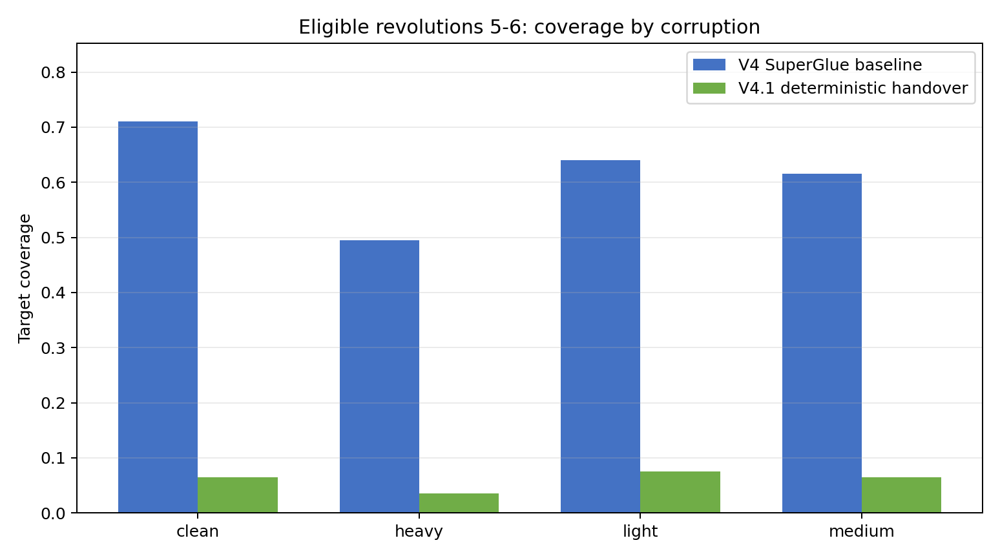
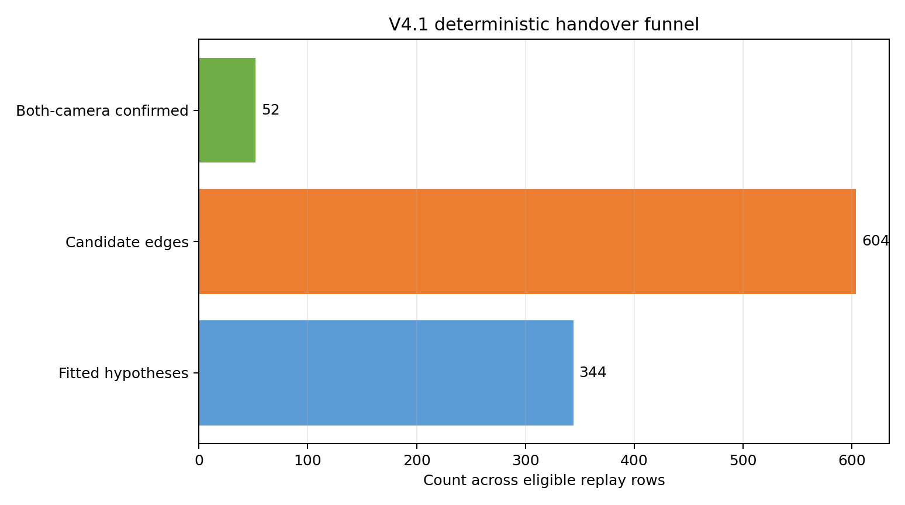

# V4.1确定性目标交接离线回放报告

## 1. 结论

本轮判定为**诊断性未通过**。该结果来自已经查看过的V4二十目标保留集，属于事后诊断，不能转为新的正式验收证据。V4原始匿名快照、航迹级SuperGlue发布和冻结模型均保持只读。

在可比较的第5至第6圈，V4航迹级SuperGlue基线目标覆盖为0.6150，V4.1确定性交接覆盖为0.0600，差值为-0.5550。配对自助法95%区间为[-0.6362, -0.4750]。确定性交接增量处理时延P95为603.04毫秒。

## 2. 试验边界

本轮不重新启动AirSim，不改变两站零相位连续周扫设置，不训练新模型，也不使用V5的一百八十度扫描相位差。输入为V4封存的二十目标匿名快照和航迹级SuperGlue发布。测试包含5个种子、4档漏检与虚警条件、每个场景6圈。确定性交接只在第5至第6圈具备完整的因果证据，因此统计比较限定在40个逐圈样本。

在线回放清单和交接发布中没有目标真实身份、AirSim实体名称、离线评分路径或中心全局编号。每个输入快照、源发布、模型冻结和输出发布均校验文件哈希、协议指纹、种子、圈次和候选图指纹。离线身份文件在全部匿名结果写入并复验后才打开。

## 3. 算法流程

```text
V4航迹级SuperGlue确认的双站航迹对
        ↓  来源文件、协议、输入和模型哈希复验
两站异步视线加权拟合
        ↓  位置、速度和六维协方差
仅向下一圈外推并重投影到A、B两站
        ↓  方位残差、协方差归一化残差、角速度和时效硬门控
规则代价与带未匹配项的匈牙利一一分配
        ↓
最近三圈中两次一致后确认
        ↓
全部匿名发布封存后离线评分
```

目标假设使用源确认圈以前的观测建立，在下一处理边界生成，只允许服务一个后续圈。用于拟合的样本不能再次作为新证据。病态交会、预测过期、残差或协方差超限、来源不一致时均保持未匹配。V4.1只调用规则代价和匈牙利求解，不导入冻结图网络权重，也不允许扩大几何白名单。

## 4. 二十目标结果

| 指标 | V4基线 | V4.1确定性交接 |
| --- | ---: | ---: |
| 第5至第6圈平均覆盖 | 0.6150 | 0.0600 |
| 虚假机会率 | 0.0738 | 0.0050 |
| V4源发布处理时延P95 | 466.57 ms | - |
| V4.1新增交接处理时延P95 | - | 603.04 ms |
| 成功拟合目标假设 | - | 344 |
| 拟合失败 | - | 17 |
| 几何白名单候选边 | - | 604 |
| 双相机均确认 | - | 52 |

第5圈的V4.1覆盖为0，第6圈为0.1200；对应的V4基线分别为0.6000和0.6300。确定性交接需要先形成双站确认对，再建立目标假设，最后用后续圈的新观测完成两次一致确认。六圈数据只给该链路留下第5至第6圈两个有效处理边界，因此第5圈只能形成暂定关系，第6圈才出现少量确认。

全部圈次累计门控拒绝以协方差归一化残差和方位残差为主，分别为26217次和25061次；局部航迹样本不足拒绝14199次，新证据不足和距离门控各3520次。当前覆盖损失主要发生在目标假设重投影后的几何白名单和时间确认阶段。直接放宽门限会增加错误交接，不能据此把本轮结果改判为可用。





覆盖指标要求同一匿名目标假设在A、B两站都达到两圈一致确认，并在离线评分时证明两条当前局部航迹与源确认对属于同一目标。暂定关系不计入覆盖。这个口径比单圈双站配准更严格，结果不能与V4全六圈宏平均召回直接混用。

## 5. 四十目标状态

四十目标仍停在V4共享单站跟踪器冻结阶段。25组候选中通过数量为0，失败项为fragmentation_not_above_baseline、sweep_runtime_p95_ms。因此未生成四十目标保留测试清单，也未运行SuperGlue或V4.1确定性交接。

该停止点保持原有失败关闭规则。四十目标不能引用二十目标交接结果，也不能使用标定数据代替保留测试。

## 6. 判定与后续

诊断改善门槛为覆盖增加至少2个百分点、配对区间下界不低于0、虚假机会率增量不高于0.5个百分点、增量处理时延P95不超过1000毫秒，并保持身份泄漏、重复占用和因果违规为0。当前判定原因：目标覆盖明显下降。

下一步先根据逐圈漏斗判断损失集中在视线拟合、几何白名单还是两圈确认。若覆盖没有改善，保留V4.1作为可解释诊断工具，不进入在线主线。四十目标仍优先修复共享单站跟踪器的时延和碎片问题，使用新协议和未查看种子重新冻结后，才能复测确定性交接。

## 7. 文件索引

- 二十目标机器汇总：`/home/linux/Documents/MSM/research_modules/independent_experiments/dual_optical_online_benchmark/outputs/scale_funnel_v4_1_deterministic_handover/targets_020/summary.json`
- 四十目标停止证据：`/home/linux/Documents/MSM/research_modules/independent_experiments/dual_optical_online_benchmark/outputs/scale_funnel_v4_1_deterministic_handover/targets_040/tracker_diagnostic.json`
- 匿名在线清单：`/home/linux/Documents/MSM/research_modules/independent_experiments/dual_optical_online_benchmark/outputs/scale_funnel_v4_1_deterministic_handover/targets_020/online_manifest.json`
- 匿名发布清单：`/home/linux/Documents/MSM/research_modules/independent_experiments/dual_optical_online_benchmark/outputs/scale_funnel_v4_1_deterministic_handover/targets_020/publication_manifest.json`
- 本轮没有AirSim截图，也没有重新运行AirSim。
