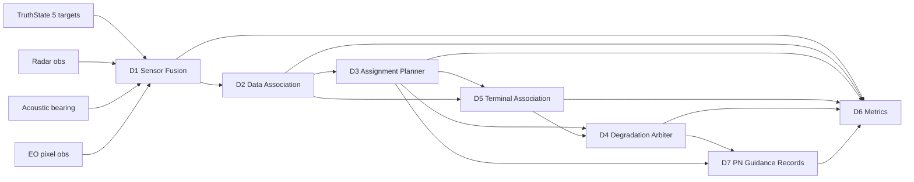

# 质点多无人机拦截全流程技术报告

本文档整理当前仓库中已经跑通的离线质点多无人机全流程仿真。报告覆盖实施方案、算法原理、模块方法、运行结果、图表分析和后续 AirSim 迁移计划。

本报告仅面向科研仿真、离线回放和算法评估。不包含真实飞控、硬件驱动、火控参数、毁伤建模、自动处置流程或绕过人工授权的接口。

## 1. 仿真目标与边界

当前目标是验证一条完整的多目标多资源闭环链路：

```text
合成多源探测
  -> 融合航迹
  -> 多目标关联
  -> 资源-目标分配
  -> 末端视觉配准
  -> 中心/二级/分布式降级仲裁
  -> 离线比例导引记录
  -> 系统级指标评估
```

当前实现是离线 5v5 质点仿真：5 个来袭目标、5 个拦截资源，目标和资源均由简化点质量状态描述。传感器为合成雷达、声学方位和光电像素观测；末端视觉为几何投影和局部视觉轨迹模拟；比例导引为二维离线子过程。

运行命令：

```bash
python3 research_modules/integrated_simulation/run_episode.py \
  --scenario nominal_5v5 \
  --seed 7 \
  --duration 8 \
  --output research_modules/integrated_simulation/outputs/check_current_flow
```

本次结果：

```text
scenario=nominal_5v5
track_rmse=44.128
terminal_accuracy=1.000
decision_count=47
```

## 2. 总体实施方案

主流程由 `integrated_simulation.runner` 统一调度。各子模块保持自己的输入输出模型，由 adapter 层转换数据结构。这样可以避免子模块直接互相依赖，也便于后续替换为 AirSim/ROS 2 回放。



日志记录采用统一 JSONL/CSV 输出。当前 episode 中记录数量如下。该表只用于说明数据规模，报告图表只保留 D1、D2 和 D7 三类对算法判断有直接价值的图。

| 记录类型 | 数量 | 含义 |
|---|---:|---|
| track | 123 | D1/D2 输出的航迹状态记录 |
| assignment | 39 | D3 版本化分配记录 |
| terminal | 47 | D5 末端视觉配准记录 |
| event | 90 | D4 仲裁、D7 模式进入等事件 |
| truth_summary | 1 | 真值场景摘要 |

## 3. 场景与数据模型

`nominal_5v5` 场景参数：

| 参数 | 数值 |
|---|---:|
| 目标数量 | 5 |
| 资源数量 | 5 |
| 时长 | 8 s |
| 主仿真步长 | 0.5 s |
| 随机种子 | 7 |
| 高威胁目标 | `TGT-001`, `TGT-002` |

目标真值由位置、速度、威胁等级和 coverage cell 构成：

```text
TruthState = {
  truth_id,
  timestamp,
  position = [x, y, z],
  velocity = [vx, vy, vz],
  threat_score,
  coverage_cell
}
```

全局航迹以 `global_track_id` 表示，附带位置、协方差、航迹状态和真值标签。真值标签只用于评估，不参与分配决策。

## 4. D1 多传感器融合方法

D1 的任务是把异构传感器观测统一为带协方差的 `GlobalTrack`。当前集成仿真中使用三类合成传感器：

| 传感器 | 观测形式 | 作用 |
|---|---|---|
| 雷达 | 位置/速度类观测，含距离相关噪声 | 主定位骨架 |
| 声学 | 粗方位与类别提示 | 低空辅助、类别似然 |
| EO | 像素投影观测 | 光电确认和几何约束 |

核心原则：

1. 使用 `measurement_timestamp` 对齐量测时刻。
2. 使用 `arrival_timestamp` 记录链路延迟。
3. 每个观测和航迹都携带协方差。
4. 声学方位不能被伪装成确定 3D 点。
5. EO 像素框作为投影约束，而不是直接 3D 定位。

简化状态向量：

```text
x = [px, py, pz, vx, vy, vz]^T
```

常速度预测：

```text
x_k = F x_{k-1} + w
P_k = F P_{k-1} F^T + Q
```

融合输出再由 adapter 转换为 D2 的 2D detection 输入。

D1 独立仿真中的延迟补偿消融结果如下。补偿模式按 `measurement_timestamp` 回放量测并重传播到当前时刻；未补偿模式把迟到量测直接当作当前量测更新。结果显示补偿后位置 RMSE 从 7.732 m 降至 2.200 m，说明时间戳和延迟处理是后续 D2/D3/D5 稳定性的基础。


## 5. D2 多目标关联方法

D2 负责维持稳定 `global_track_id`。默认路线是 GNN/Hungarian 硬关联：

1. 对每条活动航迹做运动预测。
2. 对每个检测计算马氏距离门控。
3. 构造检测-航迹代价矩阵。
4. 用 Hungarian 求解最小总代价匹配。
5. 未匹配检测生成 tentative 航迹。
6. 多帧命中后进入 confirmed/engageable。
7. 长时间未更新进入 lost/dropped。

马氏距离：

```text
d^2 = (z - Hx)^T S^{-1} (z - Hx)
S = HPH^T + R
```

本次 `nominal_5v5` 的 D2 细节显示，`TGT-001`、`TGT-002`、`TGT-005` ID 保持稳定；`TGT-003` 和 `TGT-004` 发生了临时多 ID 现象。这体现在 confusion matrix：

| 真值目标 | 关联到的全局航迹 |
|---|---|
| `TGT-001` | `T001`: 17 |
| `TGT-002` | `T002`: 17 |
| `TGT-003` | `T003/T006/T007/T008/T009/T010/T011/T012` |
| `TGT-004` | `T004/T006` |
| `TGT-005` | `T005`: 17 |

这说明 GNN/Hungarian 能跑通主线，但在中间目标密集或协方差较大时会产生 ID switch。当前 episode 顶层指标记录 `id_switch_count=3`，D2 内部详细统计为 `id_switch_count=12`，两者统计口径不同：顶层 D6 以 episode 评估事件聚合，D2 内部以关联器逐帧细节统计。

航迹 XY 对比如下，实线为真值，散点为融合/关联后的估计：


可以看到边缘目标轨迹较稳定，中部目标存在较明显的散点漂移和重复 ID，这正是后续需要 JPDA/MHT 或跨视场视觉确认辅助的地方。

## 6. D3 资源-目标分配方法

D3 在每个分配周期构造资源-目标代价矩阵，使用 Hungarian 进行一对一分配。代价函数由多项组成：

```text
C_ij =
  C_window
  + C_covariance
  + C_threat
  + C_resource_state
  + C_fov
  + C_conflict
  + C_reassignment
```

本次运行中：

| 指标 | 数值 |
|---|---:|
| assignment 记录 | 39 |
| plan version | 1 到 9 |
| 资源集合 | `INT-01` 到 `INT-05` |
| 分配目标样例 | `T001`, `T002`, `T003`, `T004`, `T005`, `T006`, `T010` |
| duplicate_assignment_count | 0 |
| unassigned_high_threat_count | 0 |

D3 能保持 5 个资源都参与分配，并且没有重复分配同一高价值目标的顶层错误。由于 D2 中部目标 ID 不稳定，D3 后续版本会跟随新航迹进行重分配；这是当前质点闭环能暴露出的关键工程问题。本节不单独插入 D3 指标图，后续应以“重分配次数、总代价、未分配高威胁目标”三项曲线作为有效分析图。

## 7. D5 末端视觉配准方法

D5 负责验证“本机相机看到的哪个局部视觉轨迹，对应 D3/D4 分配给本机的 `global_track_id`”。它不改变全局 ID，不输出控制量。

处理流程：

```text
Assignment.assigned_global_track_id
  -> 查找 D2 GlobalTrack
  -> 按图像时刻预测位置
  -> 投影到相机平面
  -> 协方差传播到像素平面
  -> 与 LocalVisualTrack 做马氏门控
  -> 综合代价排序
  -> 输出 locked / ambiguous / hold / reacquire
```

相机投影：

```text
P_c = R P_w + t
u = fx X_c / Z_c + cx
v = fy Y_c / Z_c + cy
```

像素协方差：

```text
Sigma_px = J Sigma_w J^T + Sigma_measurement
```

本次 episode 的末端配准结果：

| 指标 | 数值 |
|---|---:|
| terminal 记录 | 47 |
| `locked` 次数 | 47 |
| terminal_association_accuracy | 1.0 |
| terminal_id_switch_count | 0 |
| ambiguous_fov_event_count | 0 |
| friend_overlap_hold_count | 0 |

解释：`nominal_5v5` 是正常基线场景，没有友方重叠和主动错配注入，因此 D5 全部成功锁定。当前 D5 集成仍是单机视场内多候选模型，尚未实现多无人机重叠视场的 `TerminalCrossViewFusion`。

## 8. D4 降级与主动仲裁方法

D4 负责判断中心化计划是否仍可靠。当前实现区分两类：

| 类型 | 触发 |
|---|---|
| 被动降级 | 中心节点或二级节点失效 |
| 主动降级 | 中心仍在线，但 D1/D2/D3/D5 证据显示当前计划风险升高 |

在 `nominal_5v5` 中没有中心失效，因此没有进入被动降级；但 D2 出现 ID switch、D3 成本 margin 变低时，D4 触发了主动仲裁建议：

| 项 | 数值 |
|---|---:|
| active_degradation decision | 47 |
| mode | `active_degradation` |
| action | `request_center_replan` |
| reason | `risk_rising_terminal_still_consistent` |
| terminal_consistent | `True` |

这说明当前仲裁逻辑是保守的：末端 D5 仍一致时，不直接降级到二级或分布式，而是建议中心滚动重规划。

本场景没有中心/二级节点失效，因此 D4 图表价值有限。后续在 `center_destroyed`、`secondary_destroyed`、`active_terminal_mismatch` 场景中，应再单独绘制 failover time、consensus rounds 和仲裁动作时间线。

## 9. D7 比例导引离线子过程

D7 在 D3 初始分配或 D4 二次分配后生成二维比例导引记录。它分为两个模式：

| 模式 | 含义 |
|---|---|
| `radar_midcourse` | 使用全局航迹估计做中段 PN |
| `vision_terminal` | 进入终端距离门限后使用视觉 LOS 量测做 PN |

经典比例导引形式：

```text
a_cmd = N * V_c * dot(lambda)
```

其中：

- `N` 为导航系数。
- `V_c` 为闭合速度。
- `dot(lambda)` 为 LOS 角速率。

当前 D7 只是离线二维质点记录，用于评估链路闭环和模式切换，不代表飞控接口。

本次 episode 结果：

| 指标 | 数值 |
|---|---:|
| guidance_records | 576 |
| guidance_summaries | 15 |
| 进入视觉末端模式 | 14 / 15 |
| 最小接近距离均值 | 1.480 m |
| 最小接近距离最小值 | 0.410 m |

第一波分配的 PN 距离曲线：


图中距离在最近接近后继续增大，是因为离线子过程会记录到固定 `max_duration_s` 以便分析，未在所有 episode 上遇到 `stop_at_intercept_radius` 即停止。评估时应以 `min_range_m` 和 `closest_time_s` 为主，而不是最终距离。

PN 模式时间线：


可以看到多个资源在短时间内从 `radar_midcourse` 切换到 `vision_terminal`，说明 D7 已经在全流程中记录了中段到末端的模式转换。

## 10. D6 指标体系与结果

D6 统一消费 JSONL/CSV 日志，输出指标、图表和报告。本次 `nominal_5v5` 的核心指标：

| 指标 | 数值 | 解读 |
|---|---:|---|
| detection_probability | 1.0 | 合成传感器无漏检 |
| false_alarm_rate | 0.0 | 本基线未注入虚警 |
| missed_detection_rate | 0.0 | 本基线未注入漏检 |
| track_rmse | 44.128 m | 受中部目标 ID 不稳定和协方差影响 |
| track_continuity | 1.0 | 顶层航迹覆盖连续 |
| id_switch_count | 3 | 顶层 ID 切换事件仍存在 |
| duplicate_assignment_count | 0 | 无重复分配 |
| unassigned_high_threat_count | 0 | 高威胁目标均有分配 |
| terminal_association_accuracy | 1.0 | 末端配准在基线场景中全部正确 |
| terminal_id_switch_count | 0 | 末端未发生 ID 切换 |
| constraint_violation_count | 0 | 无约束违规 |
| human_override_count | 0 | 正常场景无人工审查事件 |

D6 的通用指标图在单 episode 下统计意义有限，因此本报告不再插入 D6 汇总图。当前阶段更有价值的是 D1 的延迟补偿、D2 的 ID 稳定性和 D7 的导引过程曲线。

## 11. 结果分析

### 11.1 已验证的能力

当前质点全流程已经验证：

1. D1-D7 可以在同一个 episode 内串联运行。
2. 5 个目标和 5 个资源可以形成版本化分配。
3. 末端视觉配准能够保持 `global_track_id` 不变。
4. D4 能在中心正常但风险升高时触发主动重规划建议。
5. D7 能在分配后生成雷达中段 PN 和视觉末端 PN 记录。
6. D6 能从统一日志复现指标、图表和报告。

### 11.2 当前暴露的问题

最主要的问题是中部目标的 ID 稳定性。`TGT-003` 和 `TGT-004` 在 D2 中产生多个临时 `global_track_id`，这会进一步影响 D3 的重分配和 D4 的风险判断。

原因包括：

- GNN/Hungarian 是硬关联，密集或交叉场景下容易把目标交换。
- 当前 D1 合成传感器噪声和协方差模型仍较粗。
- D5 尚未把跨无人机重叠视场视觉证据反馈给 D2。
- `nominal_5v5` 虽不是强交叉场景，但中部目标初始几何接近，足以暴露 ID switch。

### 11.3 指标间的关系

本次结果出现了一个重要现象：

```text
terminal_association_accuracy = 1.0
但 id_switch_count > 0
```

这说明末端 D5 在“给定当前分配和当前全局航迹”的条件下能够正确配准，但上游 D2 的全局 ID 仍可能不稳定。因此不能只看末端锁定成功率，必须同时看 D2 的 `id_switch_count`、D3 的重分配次数和 D4 的主动仲裁事件。

### 11.4 D4 仲裁结果解释

所有 D4 仲裁都为：

```text
active_degradation -> request_center_replan
reason = risk_rising_terminal_still_consistent
```

这符合设计：中心没有失效，末端视觉仍一致，因此不应直接降到二级节点或完全分布式。正确动作是请求中心重规划，同时记录风险因素。

## 12. 当前不足

当前报告对应的是“完整质点闭环基线”，但仍有以下限制：

1. 尚未接入 AirSim 实际相机、深度、分割或 LiDAR 数据。
2. 雷达和声学仍是从真值合成的观测。
3. D5 尚未实现多无人机重叠视场跨相机融合。
4. D7 是二维离线 PN，不是飞控闭环。
5. 没有真实碰撞、毁伤、空气动力学或通信协议栈。
6. 当前 `nominal_5v5` 只有一个 seed，不足以形成统计结论。
7. JPDA/MHT 尚未作为默认关联器接入全流程。

## 13. 下一步实施建议

短期建议按以下顺序推进：

1. 固化当前质点闭环为 baseline，每次改动都跑 `nominal_5v5`、`crossing_5v5`、`center_destroyed`、`active_terminal_mismatch`。
2. 增加 `crossing_5v5` 批量报告，量化 GNN/Hungarian 的 ID switch 上限。
3. 给 D2 加入 JPDA 对照运行入口，比较 ID switch、运行时间和轨迹连续性。
4. 实现 D5 `TerminalCrossViewFusion` 的离线原型，验证 `INT-01/L2 + INT-02/L1 -> G2` 这类跨视场证据。
5. 将 AirSim 第一阶段限定为相机/深度/分割真值回放，不立即追求声学插件。
6. 雷达和声学先继续由 AirSim 真值合成观测，保留噪声、延迟和协方差模型。
7. D6 扩展为多场景批量对比表：`场景 x 关联算法 x 分配策略 x 末端策略`。

## 14. 结论

当前项目已经具备可运行、可复现、可评估的质点多无人机全流程仿真基线。它把 D1 多源融合、D2 多目标关联、D3 分配、D4 降级仲裁、D5 末端视觉配准、D7 比例导引和 D6 指标评估串成了一个统一闭环。

本次 `nominal_5v5` 证明系统链路可以完整执行，并能生成日志、图表和指标。最值得优先攻关的问题不是末端配准，而是中部多目标关联的 ID 稳定性，以及跨无人机重叠视场视觉证据如何反馈给全局航迹体系。后续 AirSim 阶段应以这个质点闭环为基准逐步替换输入源，而不是重写整体架构。
