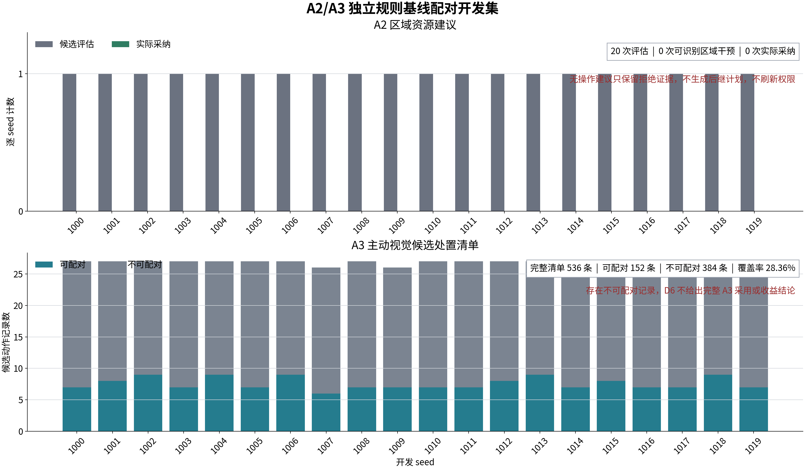

# A2/A3 独立 R0 配对开发验证

## 结论

本轮完成了区域资源策略 A2 和主动视觉策略 A3 的独立规则基线（R0）配对软件链验证。
候选组与规则组由相同外部配置启动，但使用不同 episode、事件日志、世界状态、消息总线
和模块栈。D6 只读取冻结证据，不参与策略、分配、相机或导引控制。

A2 的 20 个开发 seed 全部进入审计。受控候选策略没有改变区域资源配额、备用比例、
保持状态或跨区转移，因此 20 条记录均不构成可识别区域干预。D3 在部分 seed 中发生的
常规滚动重规划与 A2 建议没有因果绑定，不能计为 A2 采纳。修正后实际采纳和同键收益
配对均为 0。

main 随后用 D4 真实受约束开发适配器完成一次独立全 episode 探针。正式裁决上下文在
首次候选判定和后续投影中保持一致，单个 `request_replan` 形成 D3 严格后继计划、
owner ACK、安全采用和物理窗口。该适配器没有模型准入资格，正式收益装配器拒绝其进入
A2 收益审计。该结果只关闭开发适配器与运行桥之间的接口断点。

A3 共记录 536 条候选动作，现已为每条动作冻结配对处置。152 条具备候选物理窗口及
唯一同键规则基线窗口，384 条明确记为候选物理窗口缺失，记录级配对覆盖率为 28.36%。
D6 保留该原因分布，但由于完整候选清单仍含不可配对记录，不再给出完整 A3 实际采纳、
物理窗口、同键基线或收益计数。

两组实验使用受控测试策略夹具。seed 1000 至 1019 是开发回归集合，未被证明与训练、
调参或先前分析完全隔离。当前结果只能证明独立配对、拒绝审计和证据落盘链路可运行，
不能证明学习策略优于规则策略，也不能开放模型晋级或运行权限。

## 验证对象

A2 验证区域资源建议经过确定性投影、D3 后继计划、运行确认和物理执行窗口后，能否与
独立规则 episode 的同键窗口配对。20-seed 候选策略使用受控无操作夹具，规则组保持原有
区域资源规则。另设一个使用 D4 真实受约束开发适配器的单 seed 运行桥探针。场景均为
5 个目标、5 个资源、1 个侦察节点和 2 个区域，单次持续 3.0 秒。
雷达探测概率设为 0.45，关闭声学和视觉观测；通信无丢包、无抖动，固定时延 0.01 秒。

A3 验证主动视觉候选命令、执行确认、相机反馈和匿名观测窗口，能否与另一独立 episode
中关闭主动视觉后的规则相机窗口配对。场景为 1 个目标和 1 个资源，单次持续 3.5 秒。
目标代理尺寸为 10 米乘 4 米，视觉探测概率为 1.0，虚警率为 0。该配置用于提高软件合同
可达性，不代表真实相机探测条件。

两组均依次运行 seed 1000 至 1019。批处理器验证场景、规模和 seed 键不重复，并拒绝
episode 标识或事件日志摘要复用。每一对运行共享外部配置摘要，但不共享运行时对象。

## 证据合同

配对键由场景标识、场景版本、规模、seed 和物理窗口标识组成。候选组与规则组必须具有
一致的外部配置摘要。episode 标识和事件日志摘要必须不同。任一键下缺少规则窗口、
出现多个规则窗口、外部配置不一致或复用同一 episode 时，装配器均失败关闭。

A2 只有在建议完成投影、D3 发布严格更新的版本化计划、运行时确认计划已绑定到执行命令，
且物理窗口内存在有效执行时，才记为实际采用。安全门拒绝是合法终态。拒绝记录保留拒绝
原因，但不得携带后继计划、运行确认、所有权确认、联盟提交对象或物理窗口。

A3 按相机和比较键维护候选命令及规则命令窗口。物理窗口要求命令已执行、确认时间有效，
并存在命令后的匿名图像观测。在线证据不使用 AirSim 真实目标标识，不允许本地改写
`global_track_id`。

D6 对两类证据重新计算实际采用数、物理窗口可用性、同键 R0 配对数和收益审计输入
可用性。缺少任一必要证据时，指标保持不可用，不以 0 代替。正收益、非退化、模型晋级
和运行权限在本轮全部保持 `false`。

## A2 结果

| 指标 | 结果 |
| --- | ---: |
| 开发 seed 数 | 20 |
| 已进入 A2 审计的 seed | 20 |
| 候选评估记录 | 20 |
| 可识别区域干预 | 0 |
| 实际安全采用 | 0 |
| 可审计同键配对 | 0 |
| 无操作拒绝记录 | 20 |
| 已核验未见 seed | 否 |
| 非退化结论可用 | 否 |
| 模型授权 | 否 |

受控策略只复现规则建议，所有区域资源增量为 0，跨区转移为空。D4 的确定性投影能够
处理这些建议，但投影成功只证明合同可消费。它不证明模型改变了执行状态。D3 同周期的
常规重规划也不能反向归因给 A2。

运行时现在为每个无操作候选保留
`identifiable_regional_intervention_missing` 拒绝记录。该记录不携带后继计划、运行确认、
所有者确认、联盟提交或物理窗口，不刷新计划身份、租约和权限。A2 正向采用链仍需使用
能够产生受约束非零干预的候选策略另行验证。

### 受约束开发适配器

| 指标 | 结果 |
| --- | ---: |
| 场景 | 5 目标、5 资源、1 侦察、2 区域 |
| seed | 1 |
| 候选干预 | 1 个 `request_replan` |
| D3 后继计划 | `successor_published` |
| owner ACK | 1 |
| 安全采用 | 1 |
| 物理窗口 | 1 |
| 在线真值使用 | 0 |
| 运行权限 | 否 |
| 收益审计 | 拒绝 |

适配器在首次候选判定和正式投影中接收同一个 `formal_decision`。投影后仍为无操作时，
显式配置只允许生成一个 `request_replan`，不产生 hold 或资源转移。D3、D4 的 owner、
plan version、epoch、lease 和正式投影门保持不变。

该适配器标记为 development-only，标准 advisor 将其限制在 shadow。将其送入正式 A2
收益装配器时，合同返回 `development_intervention_benefit_forbidden`。因此该探针不能
加入上表 20-seed 收益分母，也不能用于模型准入、运行授权或收益结论。

## A3 结果

| 指标 | 结果 |
| --- | ---: |
| 开发 seed 数 | 20 |
| 至少形成一个可配对子集的 seed | 20 |
| 候选动作记录 | 536 |
| 已冻结配对处置 | 536 |
| 可配对记录 | 152 |
| 不可配对记录 | 384 |
| 记录级配对覆盖率 | 28.36% |
| 单 seed 覆盖率范围 | 23.08% 至 33.33% |
| 完整 A3 可审计 seed | 0 |
| 已核验未见 seed | 否 |
| 非退化结论可用 | 否 |
| 模型授权 | 否 |

每个 seed 均出现了可配对窗口，说明命令、确认、相机反馈、匿名观测和独立规则基线
链路可达。完整清单同时显示 384 条候选没有物理窗口。当前原因码统一为
`candidate_physical_window_missing`。相机命令发布频率高于视觉观测发布频率时，多条
命令会在下一帧到达前结束，这是当前主要机制解释，仍需通过命令和观测时序专项验证。

后续 main 已增加命令窗口与观测帧的明确阶段清单。使用相同场景和 seed 1000-1019 的
不落盘开发复跑保持 536 条候选、152 条可配对和 384 条不可配对不变。536 条候选均有阶段
证据。344 条不可配对记录同时标记为匿名观测缺失和物理窗口确认缺失；其余 40 条在
episode 结束时观测清单尚未闭合，阶段细因保持未解析，不能越界标记为物理窗口不完整。
物理窗口细因完整率为 344/384。运行确认缺失、命令过期、命令时序错配和相机反馈缺失
均为 0。一条记录可以有多个已确认阶段标签，因此两个 344 不能相加作为候选数量。

该复跑来自未提交工作树，没有持久化完整配对清单，不替换下方冻结批次。它把后续工作
收敛到主动视觉动作采样与匿名观测节拍：减少同一图像帧到达前重复发布的短命令，或按观测
帧触发动作采样。门控条件、身份约束和运行权限不得为提高覆盖率而放宽。开发摘要文件为
`SCALABLE_3D_A3_STAGE_BREAKDOWN_DEVELOPMENT_20260727.json`，SHA-256 为
`1ba6040e7c3e7e3b9e7d5506dfd20cf3539ce12c5aac13cca7f02799f0cd99ef`，文件内明确
`formal_evidence=false`。

## 结果边界

`minimum_seed_count_met=true` 只表示开发样本数量达到 20。由于
`seeds_verified_unseen=false`，`minimum_unseen_seed_target_met=false`。该区分已经写入
批量制品，防止将开发回归集合误写为未见测试集合。

本轮没有计算候选策略相对规则基线的性能改善，也没有形成 D6 非退化结论。受控策略夹具
不等同于训练模型。A2 的 20 条拒绝记录和 A3 的 152 条可配对记录只用于验证证据合同及
完整分母处理。所有学习、分配、降级、相机和导引权限继续关闭。

## 制品

- A2 批量证据：`outputs/paired_learning_adoption_development_20260727/a2_20seed/paired_learning_adoption_batch.json`
- A2 文件摘要：`ff3c10a089b6a94582451ae05d8a884af3a2bd7485acd4df0496442ea7e0ec55`
- A3 批量证据：`outputs/paired_learning_adoption_development_20260727/a3_20seed/paired_learning_adoption_batch.json`
- A3 文件摘要：`455d181076553a485ff824618abc6d037a4477bb6342877d1d1e427fd28583a9`
- A3 阶段细分开发摘要：
  `docs/SCALABLE_3D_A3_STAGE_BREAKDOWN_DEVELOPMENT_20260727.json`
- A3 阶段细分摘要文件 SHA-256：
  `1ba6040e7c3e7e3b9e7d5506dfd20cf3539ce12c5aac13cca7f02799f0cd99ef`
- 结果图：`docs/figures/a2_a3_independent_r0_pairing_development_20260727.png`
- 结果图摘要：`0ae642177bb5387b000a8d0d45e84403566ae9037cceb3dc995bd7e801fbddc7`

验证日期为 2026 年 7 月 27 日。D6 严格采用审计专项测试为 51 项通过，配对编排专项
测试为 5 项通过，D4 当前全量为 658 项通过，可扩展三维模块全量为 345 项通过，跨模块
合同为 8 项通过。收尾回归进一步确认 D3 全量 547 项通过、1 项跳过，D5 全量 711 项
通过、2 项警告，D6 全量 1093 项通过、1 项警告，main 配对与模块栈专项 81 项通过、
1 项警告。Matplotlib 报告了既有 `Axes3D` 环境警告，显卡管理接口也产生环境提示，
均不影响本轮二维结果图或合同结论。
