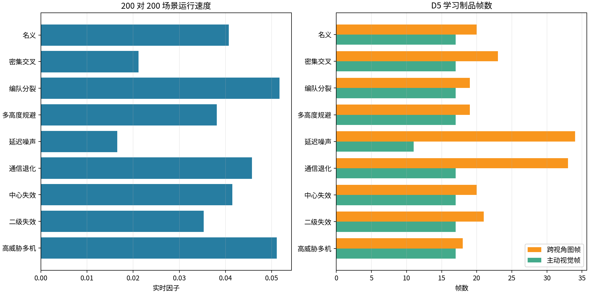
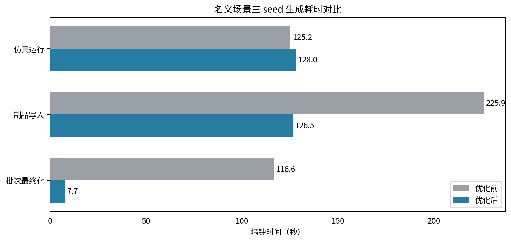
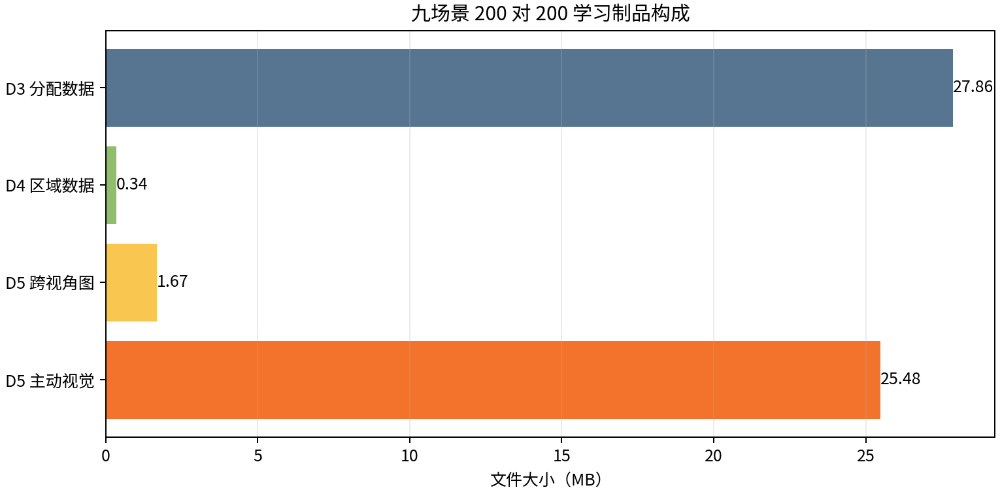

# 三维规模化仿真容量与运行时报告

## 结论

九类 200 对 200 场景全部完成，有限状态检查通过，在线真值使用次数为 0。
D3、D4 和 D5 跨视角图数据集完成最终化；D5 主动视觉因未达到 20 个未见测试 seed 而保留 staging，符合准入规则。

九个 episode 的最终学习目录为 55.36 MB。按全部 900 个 episode 都采用本轮 200 对 200 平均值计算，保守上界约为 5.54 GB。正式计划包含更小规模，实际值应低于该上界；5 GB 停止门继续保留。

同一名义场景三 seed 的完整生成耗时由 467.8 秒降至 144.6 秒，下降 69.1%。制品写入由 225.9 秒降至 12.4 秒，批次最终化由 116.6 秒降至 7.3 秒。仿真运行由 125.2 秒变为 124.7 秒，基本不变。

存储、最终化和代表分块启动门已通过。制品写入与最终化合计 19.7 秒，低于 episode 计算的 124.7 秒，数据管线不再主导总耗时。D5 主动视觉仍占 staging 的 96.8%，但绝对耗时已收敛。若 900 个 episode 全部按 200 对 200 计，运行时间保守上界约 12.0 小时。

2026 年 7 月 20 日已完成两个正式 45-episode 分块，90/90 状态有限、工作树干净、在线真值使用为 0。连续运行随后完成到 209/900，在第 210 项通信退化 200 对 200场景发现 D5 同一相机流单次收到多个批次的边界异常。该目录未最终化，不是正式训练集。D5 修复形成新提交后必须从零生成，不能把旧提交的 209 项与新提交结果拼接。

同次异常暴露 checkpoint 只在显式暂停时更新的问题。生成器现已升级为每个完整 episode 后原子推进 checkpoint，并能在进度和 staging 全部通过校验时审计恢复旧 checkpoint 滞后。开发定向测试 13/13 通过。完整 900 episode、20 个未见 seed 和 200 对 200 实时性目标仍保持开放。

修复后使用脏工作树开发模式复跑同一通信退化 200 对 200、seed 64 单元。状态有限，在线真值使用为 0，episode 运行 27.4 秒，制品写入 3.9 秒；三 seed 计划在首个 episode 后按 checkpoint v2 正常暂停。该结果证明原异常路径和 checkpoint 写入可通过，不是正式 clean-tree 数据。

## 观测治理正式标定

2026 年 7 月 22 日在 detached clean 提交
`e4d66db02a0b8f1b867a0e81b4a73de84588426b` 上完成 20、50、100、200 四档观测治理标定，
每档 5 个 seed。单例包含 136 帧和 33.75 秒世界时间。20 个 episode 均通过 `formal_only`
准入，工作树为 clean，在线真值使用为 0。D6 只读取写盘后的公共审计和 evaluator-only
侧车，没有导入运行模块或修改 D1、D2 控制状态。

| 规模 | D1 峰值缓冲 | D1 重排 | D1 拒绝/过旧/溢出 | D2 峰值 claim/容量 | D2 安全淘汰 | D2 过旧/溢出 | 合计峰值内存均值/MB |
| ---: | ---: | ---: | ---: | ---: | ---: | ---: | ---: |
| 20 | 3 | 12 | 0/0/0 | 2390/4800 | 285 | 0/0 | 6.17 |
| 50 | 3 | 12 | 0/0/0 | 6020/12000 | 735 | 0/0 | 14.96 |
| 100 | 3 | 12 | 0/0/0 | 12070/24000 | 1485 | 0/0 | 29.61 |
| 200 | 3 | 12 | 0/0/0 | 24170/48000 | 2985 | 0/0 | 59.00 |

四档 evaluator-only 近邻召回率均为 1.0，错误抑制率和错误合并率均为 0，确认时延均为
0.25 秒。每项比例均保留 2000 次自助法 95% 区间。200 规模合计峰值内存最大值为
59007120 B。输出位于
`outputs/observation_governance_calibration_20260722_formal_e4d66db`；聚合 JSON SHA-256 为
`6fb64252292aaedd3c68d1bfea64b76496136ce6edb32add61a281d511c4ed22`。

该批只验证有界扫描排序、声明账本容量、真值隔离和评估合同。它没有运行完整 D1 融合、
D3 分配、D5 配准和 D7 导引，不能用于宣称完整 200 对 200 实时性、融合精度或拦截效果。

## 场景配置

| 项 | 值 |
| --- | --- |
| 仿真模式 | 三维质点、北东地坐标系 |
| 规模 | 200 个来袭目标、200 个拦截资源 |
| 场景数 | 9 |
| 单例时长 | 2 秒 |
| 学习模式 | 规则路径采样，学习模型未准入 |
| 真值边界 | 在线 D1-D5 禁止真值编号，真值仅用于离线标签 |
| 九场景 producer commit | `b15dac2e932b1862cdfbdce9e85db6687c2b4720` |
| 优化后 timed producer commit | `45b36500dc3c6935b1f116614993e291041eb12d` |

## 算法流程

仿真器按统一时钟推进目标、拦截资源和侦察节点。D1 生成带双时间戳和协方差的融合航迹，D2 维持中心航迹身份，D3 形成稀疏候选边并发布版本化分配，D4 处理中心和二级节点故障，D5 生成跨视角图与主动视觉样本，D7 计算三维导引命令。main 在 episode 结束后将在线特征与离线标签分开写盘。

本次只评估数据生成合同、运行时间和存储量。拦截成功率、模型精度和强化学习收益没有在该探针中评定。

## 场景结果

| 场景 | seed | 实时因子 | D3 帧 | D4 帧 | D5 图帧 | 主动视觉帧 |
| --- | ---: | ---: | ---: | ---: | ---: | ---: |
| 名义 | 920 | 0.0407 | 2 | 2 | 20 | 17 |
| 密集交叉 | 921 | 0.0211 | 2 | 2 | 23 | 17 |
| 编队分裂 | 922 | 0.0517 | 2 | 2 | 19 | 17 |
| 多高度规避 | 923 | 0.0381 | 2 | 2 | 19 | 17 |
| 延迟噪声 | 924 | 0.0165 | 2 | 2 | 34 | 11 |
| 通信退化 | 925 | 0.0458 | 2 | 2 | 33 | 17 |
| 中心失效 | 926 | 0.0415 | 1 | 2 | 20 | 17 |
| 二级失效 | 927 | 0.0353 | 1 | 2 | 21 | 17 |
| 高威胁多机 | 928 | 0.0511 | 2 | 2 | 18 | 17 |

延迟噪声场景实时因子最低，为 0.0165，同时生成 34 个 D5 跨视角图帧。通信退化场景生成 33 个图帧。两类场景应作为后续序列化优化和模型训练压力样本。

## 存储构成

| 制品 | 大小/MB | 占四类制品比例 |
| --- | ---: | ---: |
| D3 分配数据 | 27.86 | 50.3% |
| D4 区域数据 | 0.34 | 0.6% |
| D5 跨视角图 | 1.67 | 3.0% |
| D5 主动视觉 | 25.48 | 46.0% |

D3 分配数据 27.86 MB，D5 主动视觉 25.48 MB，两者占主要空间。成功最终化后 `_staging` 已删除，目录中没有 D3 重复副本。

## 运行时间

| 阶段 | 优化前/秒 | 优化后/秒 | 变化 |
| --- | ---: | ---: | ---: |
| 仿真运行 | 125.2 | 124.7 | 下降 0.4% |
| 制品写入 | 225.9 | 12.4 | 下降 94.5% |
| 批次最终化 | 116.6 | 7.3 | 下降 93.8% |

### 写入归因

| 组件 | 三 seed 时间/秒 | 占 staging |
| --- | ---: | ---: |
| D3 分配 | 0.290 | 2.3% |
| D4 区域 | 0.031 | 0.2% |
| D5 跨视角图 | 0.076 | 0.6% |
| D5 主动视觉 | 12.039 | 96.8% |

本轮三组 nominal seed 的单例制品写入为 4.17/4.13/4.14 秒，其中 D5 主动视觉为 4.05/3.99/4.00 秒。D5 仍是 staging 的主要组件，但数据处理总耗时已低于 episode 计算耗时。

九场景旧长跑中曾出现一次约 51 分钟的异常停顿，现有日志不能判定为系统抢占还是写盘阻塞，不将该停顿线性外推。

## 图表

## 后续工作

1. 保持 D3、D4、D5 当前导出与独立审计路径，继续作为数据合同回归门。
2. 完成 D5 同流多批次修复和回归，在新提交上重新启动冻结计划。
3. 先复核前两个 45-episode 分块，再连续完成 900 episode；100 个生成 seed 用于训练，1000-1019 只用于最终评估。
4. 单独剖析 episode 计算热点；不得用降低采样、删除特征或放松真值隔离换取速度。

## 文件索引

- 九场景进度：`outputs/capacity_probe_v2/all_scenarios_200v200/episode_progress.csv`
- 九场景汇总：`outputs/capacity_probe_v2/all_scenarios_200v200/generation_summary.json`
- 优化前 timed 汇总：`outputs/capacity_probe_v2/nominal_timed/generation_summary.json`
- 当前 timed 进度：`outputs/capacity_probe_v2/nominal_timed_postopt2/episode_progress.csv`
- 当前 timed 汇总：`outputs/capacity_probe_v2/nominal_timed_postopt2/generation_summary.json`
- 未最终化正式故障证据：`outputs/learning_generation_v1_oosmfix/episode_progress.jsonl`
- 固化结果表：`docs/SCALABLE_3D_CAPACITY_PROBE_RESULTS.csv`

## 规则全栈性能复测

2026 年 7 月 22 日在 detached clean 提交 `33101656b0cf1967a778cdb36a440611e02109b1`
上运行 20、50、100、200 四档，每档 5 个 seed，单例 2.2 秒。20 个 episode 状态均有限，
在线真值使用为 0。平均实时倍率为 `1.504/0.540/0.240/0.092`，只有 20 对 20 达到实时。

200 对 200 的平均墙钟为 23.969 秒。D1 融合、D2 常规关联和 D3 分配平均为
`10.275/2.037/0.665 s`，D2 尾部收束为 `0.640 s`。与同配置 clean 提交 `492979e`
相比，200 规模平均墙钟下降 26.7%，D2 五 seed 的 45 个发布周期语义哈希全部一致。
D1、D2 和 D3 的性能归因仍以各自同输入 A/B 为准。

该批不含学习 assist、AirSim、长时内存和物理拦截。D6 没有正式实验矩阵元数据，因此将其
归为描述性校准。详细结果和哈希见 `SCALABLE_3D_RULE_PERFORMANCE_CALIBRATION_CN.md`。
