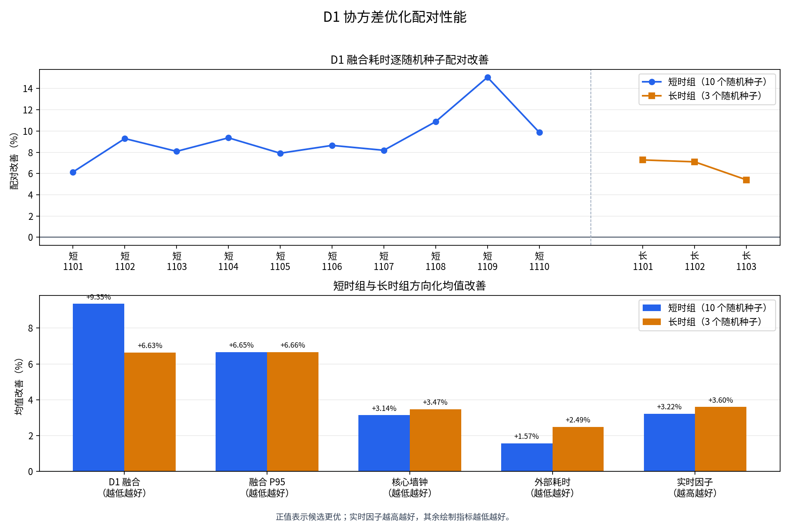

# D1 协方差优化多种子长时复核

## 结论

D1 六维协方差成对限制的向量化路径通过正式准入。10 组短时配对和 3 组长时配对全部完成，
13/13 跨构建语义检查通过。短时 D1 融合累计墙钟下降 9.35%，长时下降 6.63%，所有 seed
均优于标量参考路径。

该结论只适用于当前三维质点运行配置。候选路径的最低实时因子为 0.1434，200 对 200 系统
仍未达到实时运行条件。矩阵没有 AirSim、目标处理器、均方根误差、归一化估计误差平方和
归一化创新平方证据。

## 修复边界

早期实现分别限制六维协方差的 15 个非对角元素。每个二维相关系数都在允许范围内时，完整
六维相关矩阵仍可能出现负特征值。该问题会使后续滤波和马氏距离计算失去正半定前提。

D1 已在相关矩阵空间执行正半定投影，并采用确定性收缩和对角回退处理数值边界。正式矩阵的
reference 与 candidate 都包含这一修复。两臂唯一处理差异是协方差成对限制使用标量循环或
只读上三角索引向量化，因此性能差异可以归因于该实现路径。

## 试验矩阵

| 项目 | short | long |
| --- | ---: | ---: |
| seed | 1101-1110 | 1101-1103 |
| 配对数 | 10 | 3 |
| 单个 episode 世界时间 | 2.2 秒 | 10 秒 |
| reference/candidate episode | 20 | 6 |
| 目标数 | 200 | 200 |
| 拦截资源数 | 200 | 200 |
| 侦察节点数 | 2 | 2 |
| 跨构建语义通过 | 10/10 | 3/3 |

reference 提交为 `a5a472cf81496d94a98db3deb88a3d5c6951f0ce`，显式关闭向量化路径。
candidate 提交为 `064cbb979d3bab68fee995e476df25709eb666db`，使用默认向量化路径。
相邻 case 交替执行两臂先后顺序。V1 和 V2 episode 没有复用。

运行配置保留 D1-D2 结构歧义保活，运行配置摘要为
`deabac3fbf2a788f68a0b807945e5f1bedacf8c5917c4d3b49c5cffb3c90da70`。证据清单
SHA-256 为 `40669d10fff8367aa31e24624bab802d8bc3de6b01aaa1e5c92d054753ed93ec`。

## 证据检查

D6 作为只读评估器复载证据清单。评估器逐 case 校验提交、seed、时长、规模、运行配置、
进程退出码、有限状态、在线真值隔离和跨构建业务语义，不从目录名推断实验臂。

26 个 episode 均正常退出，在线业务路径使用真值为 0。13 个 pair 的规范在线载荷、离线
真值制品、D3 计划谱系、运行时确认来源和 D4 内容地址均通过跨构建检查。bootstrap 以显式
seed pair 为重采样单位，固定执行 10,000 次。

## 性能结果

| 组别 | 指标 | reference | candidate | 改善 | candidate 更优 |
| --- | --- | ---: | ---: | ---: | ---: |
| short | D1 融合累计墙钟 | 4.0292 秒 | 3.6523 秒 | 9.35% | 10/10 |
| short | D1 融合单次 P95 | 199.6623 毫秒 | 186.3790 毫秒 | 6.65% | 10/10 |
| short | 核心 episode 墙钟 | 10.6862 秒 | 10.3502 秒 | 3.14% | 10/10 |
| short | 外部进程耗时 | 17.8640 秒 | 17.5840 秒 | 1.57% | 9/10 |
| short | 实时因子 | 0.2061 | 0.2128 | 3.22% | 10/10 |
| long | D1 融合累计墙钟 | 32.9544 秒 | 30.7688 秒 | 6.63% | 3/3 |
| long | D1 融合单次 P95 | 264.8209 毫秒 | 247.1958 毫秒 | 6.66% | 3/3 |
| long | 核心 episode 墙钟 | 69.2303 秒 | 66.8281 秒 | 3.47% | 3/3 |
| long | 外部进程耗时 | 98.6867 秒 | 96.2333 秒 | 2.49% | 3/3 |
| long | 实时因子 | 0.1446 | 0.1499 | 3.60% | 3/3 |

short 的 D1 融合原始配对变化 bootstrap 95% 区间为
`[-10.9144%, -8.1131%]`，long 为 `[-7.2791%, -5.4068%]`。两组区间上界均低于 0。
图中所有柱值已按指标方向转换为“正值表示 candidate 改善”。

## 长时增长

相同 seed 的长短单位时间增长单独计算。D1 融合成本相对 reference 的最大恶化为 2.92%，
核心墙钟为 0.34%，外部进程耗时为 0.49%，均低于预注册的 5% 上限。最大常驻内存均值在
short 和 long 分别改善 0.04% 和 0.24%，没有形成明确的内存收益，也没有超过退化门。

D1 扫描输入阶段没有随本次处理定向优化。short 均值由 1.2065 秒增至 1.2206 秒，变化
-1.17%；long 均值由 6.6877 秒降至 6.5721 秒，改善 1.73%。该阶段的短时 bootstrap 区间跨
零，不能归因于向量化协方差限制。

## 阶段瓶颈

candidate 的分阶段累计墙钟显示，D1 融合仍是最大模块阶段，short/long 均值分别为
3.6523/30.7688 秒。排除本次已处理的融合热点后，D1 扫描输入为下一项，均值分别为
1.2206/6.5721 秒。D2 关联在 long 组达到 5.8152 秒，已经接近扫描输入成本。

short 组的 D3 分配和 D2 关联分别为 0.6744/0.6364 秒，D7 导引和 D5 主动视觉分别为
0.5712/0.5021 秒。long 组对应值为 D2 关联 5.8152 秒、D7 导引 3.7462 秒、D5 主动视觉
2.9231 秒、D3 分配 2.3498 秒。阶段计时存在调用层级，不能直接相加为总墙钟；这些数值只用于
选择下一项独立剖析对象。

## 准入判断

预注册的 12 项门全部通过，覆盖矩阵完整性、业务语义、short 和 long 的融合改善、bootstrap
区间、P95、长短单位时间增长、核心墙钟和内存。D6 输出
`d1_optimization_admitted=true`。

系统实时门保持失败关闭。candidate 的 short 实时因子均值为 0.2128，long 为 0.1499，
全部 case 中最低值为 0.1434，均未达到 1.0。当前结果允许保留 D1 默认向量化路径，不允许
宣称 200 对 200 全系统已经实时。

## 后续工作

1. 保持 D1 当前默认路径，继续把标量路径作为回归参考，不扩大其在线使用范围。
2. 为同一冻结矩阵补充离线均方根误差、归一化估计误差平方、归一化创新平方和严格身份指标。
3. 先剖析 D1 扫描输入的批次组织、数据复制和固定滞后重放成本，再以同一矩阵复核 D2 关联。
   不改变量测频率、门限、双时间戳、协方差或身份合同。
4. 在 AirSim 和目标处理器上复用相同证据合同。目标环境达到实时因子 1.0 前，系统实时 P1
   保持开放。

机器可读摘要见
`SCALABLE_3D_D1_COVARIANCE_MULTISEED_V3_SUMMARY_20260724.json`。仓库只保存紧凑摘要和
曲线，原始 26 个 episode 不作为源文件提交。
