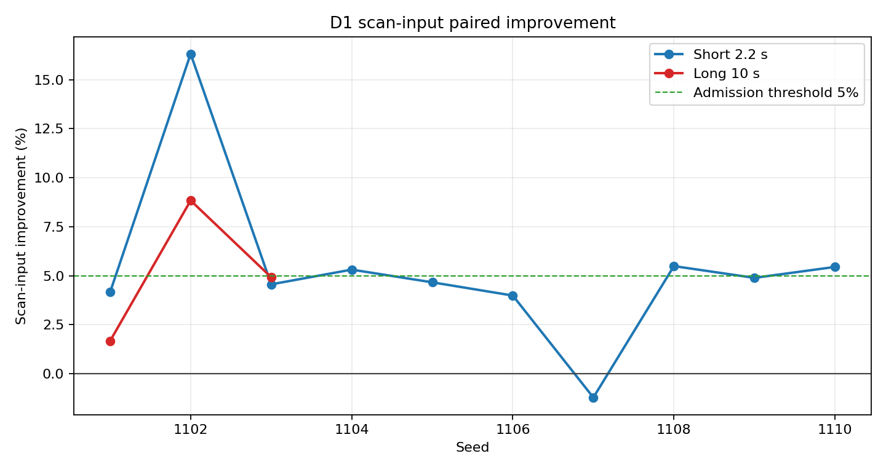

# D1 扫描输入正式准入

## 结论

`candidate_v2` 通过本轮 D1 扫描输入优化准入。短时组扫描输入累计墙钟平均下降
`5.3601%`，10 个 seed 中有 9 个更快；长时组平均下降 `5.1425%`，3 个 seed 全部更快。
13 组 pair 的业务语义、有限状态、在线真值隔离和实现身份检查全部通过。优化路径可继续作为
默认实现。

系统实时性缺口没有关闭。候选臂实时因子范围为 `0.1434-0.2289`，最低值为 `0.1434`。
当前主机完成 1 秒仿真仍需约 `4.37-6.97` 秒墙钟。本轮只处理扫描输入整理，核心总墙钟的
短时和长时平均改善分别为 `0.7187%` 和 `0.5792%`。

## 实验设计

本轮使用同一干净提交内的显式运行参数切换参考实现和候选实现，避免跨提交代码差异干扰
归因。来源提交为：

```text
d14285e4fdeb2f2e2cd32fad2f6d42e30f9e73a7
```

参考臂使用 `reference_v1`，候选臂使用 `candidate_v2`。两条路径保持同一量测、双时间戳、
协方差、固定滞后窗口、水位线、缓冲容量、来源谱系、航迹状态和全局航迹编号合同。处理差异
只限于扫描输入的数据组织方式。

| 项目 | 设置 |
| --- | --- |
| 目标数 | 200 |
| 拦截资源数 | 200 |
| 侦察节点数 | 2 |
| 短时组 | seeds 1101-1110，2.2 秒，10 组 pair |
| 长时组 | seeds 1101-1103，10 秒，3 组 pair |
| episode 总数 | 26 |
| arm 顺序 | 按预注册矩阵交替 |
| bootstrap | 10,000 次配对重采样，随机种子 20260724 |
| 矩阵 SHA-256 | `3e852e4036d17d4da7c80dbb4ddea75b6ed7e27ee9d0be3195c2d1b5e30a531d` |

运行器逐 arm 保存命令、提交、episode 目录、标准输出、标准错误和 GNU `time -v` 资源记录。
26 个 arm 均正常退出，证据 manifest 状态为 `episodes_complete_pending_d6`，来源工作树为
clean。D6 在仿真结束后独立读取约 4.2 GB 写盘证据；评估报告写入证据根目录之外。

## 等价审计

性能比较以前先执行语义审计。D6 从 runtime profile、summary、执行配置、性能诊断、模块
终态和治理审计交叉确认实现身份。允许差异只包括实现名称、该实现的性能计数、阶段墙钟、
资源占用、实时因子和由运行配置派生的 episode 编号。

在线总线逐条比较时保留 D3 分配计划版本和前序关系，并校验 D4 内容地址及确认引用。离线
真值状态、标签和五米接近事件只用于两臂等价检查，不进入在线 D1-D5 决策。非白名单业务
字段仍严格比较。

| 审计项 | 短时组 | 长时组 |
| --- | ---: | ---: |
| 业务语义等价 | 10/10 | 3/3 |
| 有限状态 | 10/10 | 3/3 |
| 在线真值使用为零 | 10/10 | 3/3 |
| 实现身份一致 | 10/10 | 3/3 |

## 性能结果

### 扫描输入

| 指标 | 短时 reference | 短时 candidate | 长时 reference | 长时 candidate |
| --- | ---: | ---: | ---: | ---: |
| 累计墙钟均值/s | 1.212452 | 1.145650 | 6.687633 | 6.340680 |
| P50 均值/ms | 0.987604 | 0.967341 | 1.049555 | 1.018772 |
| P95 均值/ms | 110.697266 | 104.645446 | 110.367862 | 104.310288 |
| 候选更快 | 9/10 |  | 3/3 |  |

短时组逐 pair 平均改善为 `5.3601%`，原始相对变化的 bootstrap 95% 区间为
`[-8.2082%, -3.0841%]`。long 组平均改善为 `5.1425%`，区间为
`[-8.8371%, -1.6694%]`。两个区间的上界均低于 0。

单次最大耗时的离散程度仍然较大。short seed 1107 的扫描输入累计墙钟比参考臂增加
`1.2166%`；个别最大调用耗时也出现反向变化。准入依据累计墙钟、候选更快数量、配对区间、
核心墙钟和内存门，不将单次最大值写成稳定改善。



### 系统开销

| 指标 | 短时变化 | 长时变化 | 判定 |
| --- | ---: | ---: | --- |
| 核心墙钟 | 改善 0.7187% | 改善 0.5792% | 非退化门通过 |
| 外部进程 elapsed | 改善 0.9660% | 改善 0.4410% | 诊断 |
| 最大常驻内存均值 | 增加 0.0434% | 下降 0.4582% | 均值与逐 pair 门通过 |
| 实时因子 | 改善 0.7275% | 改善 0.5853% | 仍低于 1 |

候选路径减少了扫描输入整理成本，但该阶段只占完整模块栈的一部分。长时候选核心墙钟均值
为 `66.7716` 秒，扫描输入为 `6.3407` 秒。D1 融合、D2 关联、D3 分配、D5 主动视觉、
D7 导引和发布总线仍在同一主流程中执行。

## 准入判定

以下门限全部通过：

1. 13/13 pair 业务语义等价、状态有限、在线真值使用为零且实现身份明确。
2. short 至少 8/10 更快，实际为 9/10；逐 pair 平均改善不低于 5%。
3. short 配对原始变化 bootstrap 区间上界低于 0。
4. long 至少 2/3 更快，实际为 3/3；逐 pair 平均改善不低于 5%。
5. short/long 核心墙钟平均退化不超过 5%。
6. short/long 常驻内存平均退化不超过 5%，任一 pair 退化不超过 5%。

D6 输出：

```text
d1_optimization_admitted=true
system_realtime_gap_closed=false
```

第一项只表示扫描输入候选实现满足冻结场景的等价和性能门。第二项按候选实时因子独立判断。

## 证据边界

本轮是三维质点全栈回放，不是 AirSim 或实机试验。它没有生成相机图像、雷达硬件数据或
目标处理器负载，也没有计算定位均方根误差、归一化估计误差平方、归一化创新平方、严格
身份交换或物理拦截结果。

4.2 GB 原始 episode 保留在临时证据目录，不进入源码提交。仓内只保留 D6 聚合 JSON、
中文复核和曲线。聚合 JSON 与曲线的 SHA-256 分别为：

```text
11f61cf07cad1c48a995b3453eadacb9b589f1eafdfda5646d649d3a8f5be281
2d9d9bfacd952d8da2b1821dafa7fdda56fcb9ead41d60d1dd728b27fdd38107
```

## 后续工作

扫描输入数据组织优化的 P1 准入项关闭。下一轮不再通过降低传感器频率、缩短固定滞后窗口、
删减协方差或跳过扫描处理来换取速度。

系统实时性仍是主缺口。后续按同一阶段计时合同重新排序 D1 融合、D2 关联、发布总线和其他
模块热点，并在目标处理器上复核。定位精度、身份连续性、AirSim 图像链和实际处理容量分别
保留独立验收。

## 文件

- `SCALABLE_3D_D1_SCAN_INPUT_MULTISEED_SUMMARY_20260724.json`
- `figures/d1_scan_input_multiseed_improvements.png`
- D6 独立完整报告位于 `research_modules/d6_evaluation_metrics/outputs/` 对应正式目录
